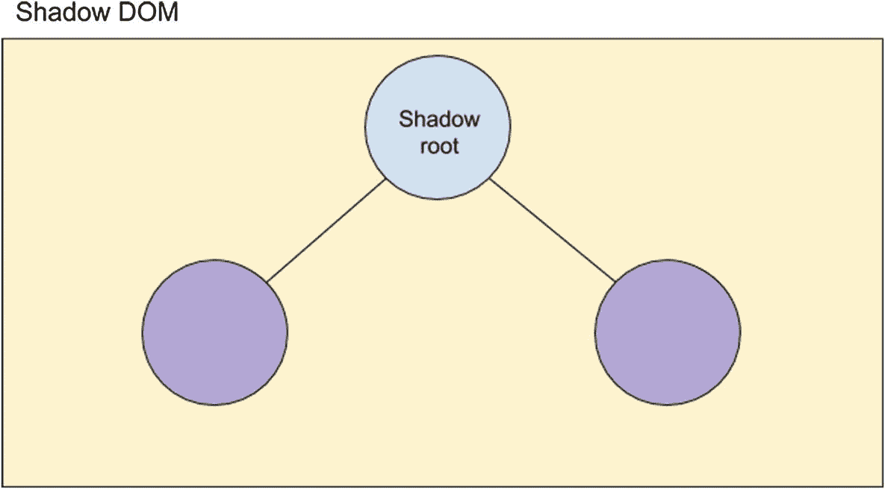
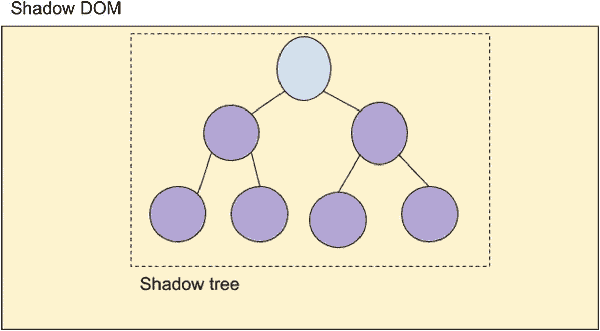
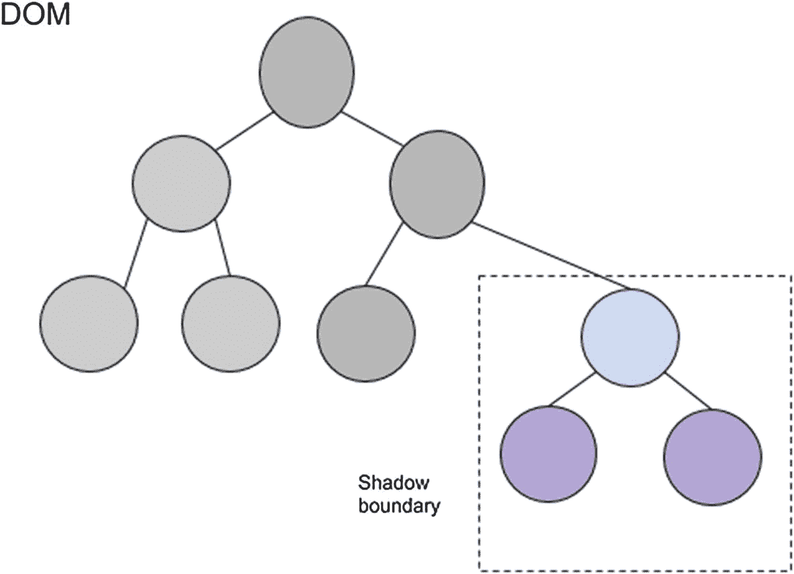
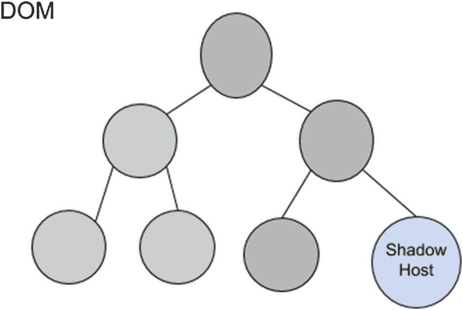

# 四、影子 DOM

在这一章中，你将会熟悉 Shadow DOM，Web 组件集合中的另一个规范。您将了解什么是 Shadow DOM 以及如何在 web 组件中使用它。接下来，我们将为我们的集合构建一个新的 web 组件。

## 什么是影子 DOM？

影子 DOM 规范定义了一种封装 web 组件的机制。我们在 web 组件内部创建的标记和样式保护它免受外部 DOM 操作和全局 CSS 规则的影响。

例如，考虑 HTML 5 `<video>`标签。如果我们想要一个视频播放器，我们创建类似于清单 4-1 所示的东西。

```jsx
<video width="640" height="480" controls>
  <source src="myVideo.mp4" type="video/mp4">
  Your browser does not support the video tag.
</video>

Listing 4-1Using video tag

```

然而，当你查看网页浏览器中呈现的内容时(图 4-1 ，你可以看到 CSS 样式、div 和输入的复杂组合，它们被封装用于外部修改，并且你只能看到标签`<video>`。这就是影子王国的力量。


图 4-1

`<video>`谷歌浏览器中的标签

以下是影子 DOM 的一些好处:

*   影子 DOM 创建了一个独立的 DOM，允许我们在 web 组件中操作 DOM，而不用担心外部节点。

*   Shadow DOM 创建了一个作用域 CSS，这意味着我们可以创建更多的通用规则，而不用担心命名冲突。

清单 4-2 显示了使用影子 DOM 的基本方法。你可能记得我们在第三章中使用了这个方法，在清单 3-7 中，我们给我们的 web 组件添加了一个阴影 DOM，来激活/停用我们例子中的模板。

```jsx
let shadowElement = element.attachShadow({mode: 'open'});

Listing 4-2Attaching a Shadow DOM

```

前面代码片段中的`attachShadow()`接收一个可以是`'open'`或`'closed'`的模式。`'open'`表示可以从主上下文访问影子 DOM，`'closed'`表示不能。

### 阴影根

影子根是我们的影子 DOM 创建的 DOM 中的根节点(图 4-2 )。



图 4-2

影子 DOM 中的影子根节点

### 阴影树

影子树就是我们的影子 DOM 创建的 DOM 树(图 4-3 )。



图 4-3

阴影中的阴影树

### 阴影边界

阴影 DOM 结束和全局 DOM 继续的界限(图 4-4 )是阴影边界。



图 4-4

我们的 web 应用 DOM 中的阴影边界

### 影子主机

影子主机是影子 DOM 附加到的全局 DOM 节点(图 4-5 )。



图 4-5

我们的 web 应用 DOM 中的影子主机

## 构建社会共享组件

为了使用 Shadow DOM，我们将构建一个名为`<social-share-component>`的简单组件，为我们的应用添加社交网络链接。这个组件接收两个参数，`'socialNetwork'`和`'user'`，其中`'tw'`表示 Twitter，`'fb'`表示脸书。首先，我们将定义我们的组件，如清单 4-3 所示。

```jsx
class SocialShareComponent extends HTMLElement {}
customElements.define('social-share-component', SocialShareComponent);

Listing 4-3Defining SocialShareComponent

```

接下来，我们将在组件中定义一些 getters 和 setters，来处理`'socialNetwork'`和`'user'`参数，如清单 4-4 所示。

```jsx
class SocialShareComponent extends HTMLElement {

    get socialNetwork() {
        return this.getAttribute('socialNetwork') || 'tw';
    }

    set socialNetwork(newValue) {
        this.setAttribute('socialNetwork', newValue);
    }

    get user() {
        return this.getAttribute('user') || 'none';
    }

    set user(newValue) {
        this.setAttribute('user', newValue);
    }
}
customElements.define('social-share-component', SocialShareComponent);

Listing 4-4Defining SocialShareComponent

```

此外，我们将定义一些静态方法，向我们的组件添加标记和样式，如清单 4-5 所示。

```jsx
class SocialShareComponent extends HTMLElement {

    get socialNetwork() {
        return this.getAttribute('socialNetwork') || 'tw';
    }

    set socialNetwork(newValue) {
        this.setAttribute('socialNetwork', newValue);
    }

    get user() {
        return this.getAttribute('user') || 'none';
    }

    set user(newValue) {
        this.setAttribute('user', newValue);
    }

    static twTemplate(user) {
        return `
        ${SocialShareComponent.twStyle()}
        <span class="twitter-button">
            <a href="https://twitter.com/${user}">
                Follow @${user}
            </a>
        </span>`;
    }

    static twStyle() {
        return `
        <style>
        a {
            height: 20px;
            padding: 3px 6px;
            background-color: #1b95e0;
            color: #fff;
            border-radius: 3px;
            font-weight: 500;
            font-size: 11px;
            font-family:'Helvetica Neue', Arial, sans-serif;
            line-height: 18px;
            text-decoration: none;
        }

        a:hover {  background-color: #0c7abf; }

        span {
            margin: 5px 2px;
        }
        </style>`;
    }

    static fbTemplate(user) {
        return `
        ${SocialShareComponent.fbStyle()}
        <span class="facebook-button">
            <a href="https://facebook.com/${user}">
                Follow @${user}
            </a>
        </span>`;
    }

    static fbStyle() {
        return `
        <style>
        a {
            height: 20px;
            padding: 3px 6px;
            background-color: #4267b2;
            color: #fff;
            border-radius: 3px;
            font-weight: 500;
            font-size: 11px;
            font-family:'Helvetica Neue', Arial, sans-serif;
            line-height: 18px;
            text-decoration: none;
        }

        a:hover {  background-color: #0c7abf; }

        span {
            margin: 5px 2px;
        }
        </style>`;
    }
}
customElements.define('social-share-component', SocialShareComponent);

Listing 4-5Static Methods to Add Markup and Styles

```

最后，我们将构建我们的`constructor()`方法，如清单 4-6 所示，用它我们将在组件的根中附加阴影 DOM，并在它后面附加一个 div 元素，它将作为我们的标记和样式的容器。

```jsx
class SocialShareComponent extends HTMLElement {

    constructor() {
        super();

        this.root = this.attachShadow({mode: 'open'});
        this.container = document.createElement('div');
        this.root.appendChild(this.container);

        switch(this.socialNetwork) {
            case 'tw':
                this.container.innerHTML = SocialShareComponent.twTemplate(this.user);
                break;
            case 'fb':
                this.container.innerHTML = SocialShareComponent.fbTemplate(this.user);
                break;
        }
    }

    get socialNetwork() {
        return this.getAttribute('socialNetwork') || 'tw';
    }

    set socialNetwork(newValue) {
        this.setAttribute('socialNetwork', newValue);
    }

    get user() {
        return this.getAttribute('user') || 'none';
    }

    set user(newValue) {
        this.setAttribute('user', newValue);
    }

    static twTemplate(user) {
        return `
        ${SocialShareComponent.twStyle()}
        <span class="twitter-button">
            <a href="https://twitter.com/${user}">
                Follow @${user}
            </a>
        </span>`;
    }

    static twStyle() {
        return `
        <style>
        a {
            height: 20px;
            padding: 3px 6px;
            background-color: #1b95e0;
            color: #fff;
            border-radius: 3px;
            font-weight: 500;
            font-size: 11px;
            font-family:'Helvetica Neue', Arial, sans-serif;
            line-height: 18px;
            text-decoration: none;
        }

        a:hover {  background-color: #0c7abf; }

        span {
            margin: 5px 2px;
        }
        </style>`;
    }

    static fbTemplate(user) {
        return `
        ${SocialShareComponent.fbStyle()}
        <span class="facebook-button">
            <a href="https://facebook.com/${user}">
                Follow @${user}
            </a>
        </span>`;
    }

    static fbStyle() {
        return `
        <style>
        a {
            height: 20px;
            padding: 3px 6px;
            background-color: #4267b2;
            color: #fff;
            border-radius: 3px;
            font-weight: 500;
            font-size: 11px;
            font-family:'Helvetica Neue', Arial, sans-serif;
            line-height: 18px;
            text-decoration: none;
        }

        a:hover {  background-color: #0c7abf; }

        span {
            margin: 5px 2px;
        }
        </style>`;
    }
}
customElements.define('social-share-component', SocialShareComponent);

Listing 4-6Adding a constructor()

in SocialShareComponent

```

这里我们使用`switch()`来处理我们需要使用的标记和样式，这取决于`'socialNetwork'`参数。结果如图 4-6 所示。


图 4-6

在谷歌浏览器中使用`social-share-component`

您可以在`$git checkout chap-4`获取这本书的代码( [`https://github.com/carlosrojaso/apress-book-web-components`](https://github.com/carlosrojaso/apress-book-web-components) )。

## 摘要

在本章中，您学习了以下内容:

*   什么是影子 DOM 以及如何在我们的 web 组件中使用它

*   什么是影像根、影像树、影像边界和影像宿主

*   如何使用 Shadow DOM 创建一个 web 组件，在我们的 web 应用中添加社交网络