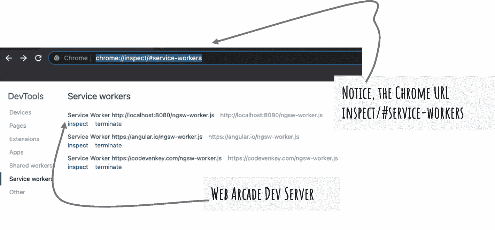
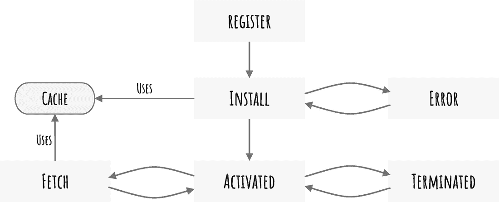
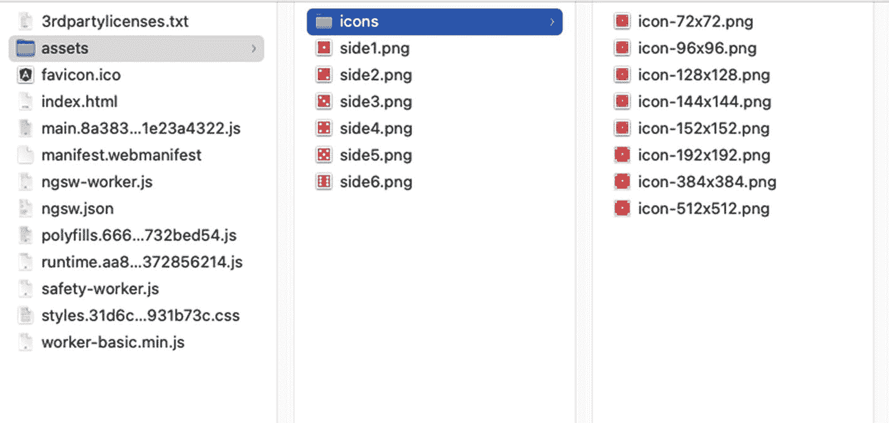
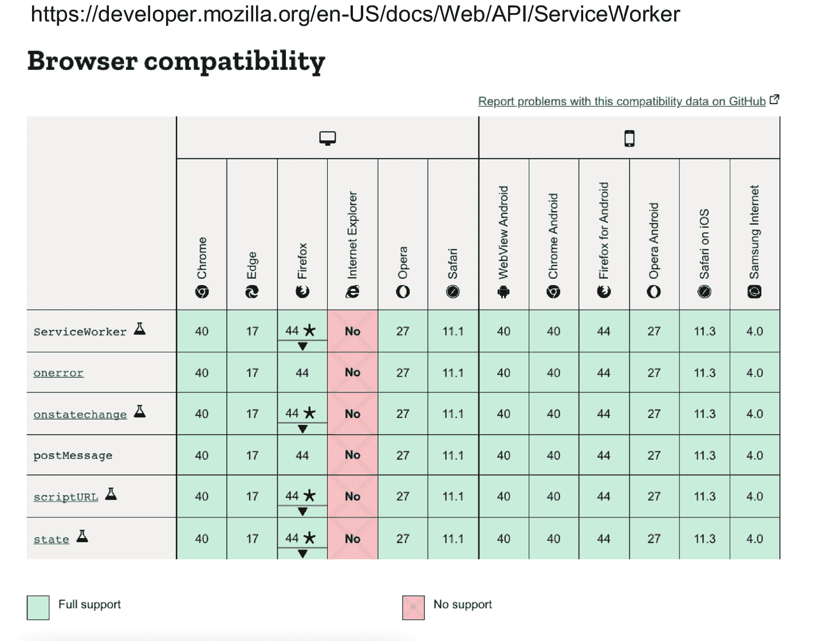

# 四、服务工作器

服务工作器在您的浏览器后台运行。它们为现代 web 应用提供了基础，并且可以安装、脱机工作，在低带宽情况下也是可靠的。本章介绍了维修工人。它讨论了服务工作器的缓存功能以及如何在 Angular 应用中使用它们。它详细描述了服务工作器的生命周期。接下来，本章将讨论 Angular 在与维修人员合作时的配置和功能。它解释了如何为 Web Arcade 示例应用实现缓存。最后，它提供了关于浏览器兼容性的细节。

服务工作器是运行在浏览器上的网络代理。他们可以拦截从浏览器发出的网络请求。这些请求包括应用的 JavaScript 包文件、样式表、图像、字体、数据等。您可以对服务工作器进行编程，以响应来自缓存的请求。这使得 web 应用能够适应网络速度和连接丢失。传统的 web 应用在失去连接时会返回“page not found”错误，与此不同，服务工作器使应用能够利用已安装和缓存的资源。您可以对应用进行编程，以加载缓存的数据或显示优雅的错误信息。即使在低带宽情况下，服务工作器也能让您构建流畅、响应迅速的应用，并提供出色的用户体验。

即使在应用或浏览器关闭后，服务工作器仍会保留。要查看在职服务工作器的列表，请导航至 Google Chrome 上的页面`chrome://inspect/#service-workers`或 Microsoft Edge 上的页面`edge://inspect/#service-workers`。见图 4-1 。请注意使用服务工作器的应用中包括 Angular 的 Angular.io 在内的热门网站。还要注意，Web Arcade 示例应用的开发 URL localhost:8080 已经注册了一个服务工作器。



图 4-1

在谷歌浏览器上检查服务工作器

Note

要查看您在计算机上访问的各种 web 应用注册的所有服务工作器，请启动“服务工作器内部信息”页面。注意，第一个 URL`chrome://inspect/#service-workers`只列出了活动的服务工作器。通过在 Google Chrome 上导航到`chrome://serviceworker-internals`(或在 Microsoft Edge 上导航到`edge://serviceworker-internals`)来访问服务工作器的内部信息。

请注意，此页面将来可能会被弃用。`chrome://inspect/#service-workers` URL 可能包括所有服务工作器调试特性。

## 服务工作器生命周期

本节详细介绍了服务工作器生命周期及其在后台运行的状态(在浏览器上)。参见图 4-2 ，该图描绘了一个服务工作器的生命周期。它从注册一个新的服务工作器开始。使用服务工作器的 web 应用在浏览器中加载时注册。“注册”可以在每次用户加载应用时发生。如果服务工作器已经注册，浏览器会忽略新的注册。

成功注册服务工作器会触发安装事件。典型的安装事件处理缓存逻辑。所有静态资源，包括应用包、图像、字体和样式表，都在安装过程中被缓存。这些是可配置的。

服务工作器安装是原子性的。下载和缓存一个或多个资源失败会导致事件完全出错。下次用户访问该网站时，它会尝试再次安装。这是为了确保没有部分安装的应用导致不可预见的问题和错误。

当应用打开时，安装的服务工作器被激活。它在后台运行，充当所有网络调用的代理。根据应用逻辑和配置，您可以从缓存中提供数据。如果在缓存中找不到数据，则调用网络服务并通过网络检索数据。

如果应用或服务工作程序不在使用中，则服务工作程序会终止以节省内存。需要时，它会激活服务工作器。注意图 4-1 (在浏览器窗口中)中的终止按钮，用于手动终止一个活动的维修工人。您可以使用它来强制关闭服务工作器。这有助于服务工作器重新开始工作。如果您的计算机资源不足，您可以终止服务工作以节省内存。另外，请注意 Inspect 链接，它启动开发工具，允许您探索网络资源和应用源代码。

工作流程和事件的描述见图 4-2 。



图 4-2

服务工作器生命周期

## Angular 应用中的服务工作器

Angular 使得在应用中使用服务工作器和缓存特性变得更加容易。Angular scaffolds 提供了上一节“服务工作器生命周期”中描述的许多功能，尤其是缓存特性。本节详细介绍了整合服务工作器的开箱即用的 Angular 功能。

当您将`@angular/pwa`添加到项目中时，Angular CLI 会生成`ngsw-config.json`。它为 Angular 应用提供了一种服务工作器配置。Angular 构建过程使用这种配置。配置的一个方面是要缓存和安装的静态和动态资源的列表。静态资源包括组成应用的 JavaScript 包文件、样式表、图像、字体和图标。典型的动态资源包括数据响应。

一个`ngsw-config.json`文件包括以下几个部分:

*   请记住，Web Arcade Angular 应用是可安装的，并且维护版本。配置中的该字段提供了应用版本的简要描述。更新应用时，使用此字段提供有关软件升级和版本的有意义的详细信息。

*   `index`:指定 Angular 应用和单页应用(SPA)的根 HTML 文件。在 Web Arcade 示例应用中，它是`src`目录中的`index.html`。有了这个字段索引，您就提供了一个到应用起点的链接。正如您接下来将看到的，Web Arcade 使用服务工作器缓存该文件。

*   `assetGroups`:这是对资产的配置，通常是 JavaScript 应用包、样式表、字体、图像、图标等。这些资源可以是 Angular 项目的一部分，也可以从远程位置下载，如内容交付网络(CDN)。
    *   注意列表 4-1 中 Web Arcade 的`ngsw-config`文件。它包括构成应用的文件，即`index.html`，所有的 JavaScript 包，以及 CSS 文件。它还包括图像、图标、字体等资产。

Note

记住，在 Web Arcade 中，SASS 文件编译成 CSS。服务工作器正在处理 Angular 应用的构建输出。所有的文件，包括 JavaScript 包，编译的 CSS，图片等。，相对于`dist`目录(`yarn build`命令的输出)。

1.  可以配置多个`assetGroups`。请注意，该字段是一个数组。您可以列出带有配置细节的 JSON 对象。一个`assetGroup`对象定义了以下字段:
    1.  `name`:这是一个任意的资产组名称。

    2.  `resources`: The resources are the files or URLs to be cached by the service worker. As mentioned, the files could be JavaScript files, CSS stylesheets, images, icons, etc. On the other hand, for resources such as fonts (and a few other libraries), you may use CDN locations, which are URLs.
        1.  `files`:这是为服务工作器配置的要缓存的文件数组。

        2.  `urls`:这是为服务工作器配置的要缓存的 URL 数组。

        在构建时，您不太可能知道要缓存的每个文件。因此，该配置允许您使用文件和 URL 模式。有关更多详细信息，请参见“模式匹配要缓存的资源”一节。

    3.  `installMode`:安装模式决定当浏览器上没有服务工作器的现有版本时，如何首次缓存资源。它支持两种缓存模式。
        1.  `prefetch`:在开头缓存所有的资源、文件和 URL。服务工作器不等待应用请求资源。当应用请求时，资源在缓存中随时可用。

            这种方法对于根`index.html`文件、核心应用包、主样式表等非常有用。但是，预取安装模式可能会占用大量带宽。

            当没有提供配置值时，预取是默认的安装模式。

        2.  `lazy`:仅当应用第一次请求资源时才缓存资源。如果配置了特定的资源，但从未请求过，则不会缓存该资源。它是高效的。但是，该资源只有在第二次使用后才能脱机使用。

2.  `updateMode`:更新模式决定当发现新版本的应用时如何缓存资源。这适用于已经安装在浏览器中的服务工作器(Angular 应用)。如您所知，与典型的 web 应用不同，服务工作器支持缓存 Angular 应用。它还允许您发现并安装可用的更新。它支持两种缓存模式。
    1.  `prefetch`:更新应用时，下载并缓存所有资源、文件和 URL。服务工作器不等待应用请求资源。当应用请求某个资源时，该资源在缓存中随时可用。

        `Default`:当没有提供配置值时，使用为`installMode`设置的值。

    2.  `lazy`:仅当应用第一次请求资源时才缓存资源。如果配置了特定的资源，但从未请求过，则不会缓存该资源。这是高效的。但是，该资源只有在第二次使用后才能脱机使用。

        如果`installMode`为`prefetch`，该配置值将被覆盖。为了在懒惰模式下真正缓存，`installMode`也需要懒惰。

3.  `dataGroups`:`assetGroups`支持缓存应用资产，主要是静态资源，`dataGroups`帮助缓存动态数据请求。它是数据组对象的数组。可以配置多个`dataGroups`。您可以列出带有配置细节的 JSON 对象。一个`dataGroup`对象定义了以下字段:
    1.  `name`:这是一个数据组的任意标题。

    2.  `urls`:这是一个字符串数组，用于配置 URL 列表或匹配 URL 的模式列表。与`assetGroups`不同，该模式不支持与`?`匹配，因为它是 URL 中查询字符串的常用字符。

    3.  `version`:这有助于识别`dataGroup`资源新版本的可用性。服务工作器丢弃旧版本的缓存，获取新数据，并缓存新的 URL 响应。如果没有提供版本，则默认为 1。

        对数据组进行版本控制非常有用，尤其是当资源与旧的 URL 响应不兼容时。

    4.  `cacheConfig`:定义数据缓存策略的配置。它包括以下字段:
        1.  `maxSize`:定义缓存数据大小的上限。通过设计来限制大小是一个很好的做法。浏览器(像其他平台一样)为每个应用管理和分配内存。如果应用超出上限，整个数据集和缓存都可能被收回。因此，设计一个系统来限制缓存大小，并防止由于驱逐导致的不可预见的结果。

        2.  `maxAge` : `dataCache`本质上是动态的。通常情况下，数据在源位置会发生变化。缓存数据时间过长可能会导致应用使用过时的字段和记录。服务工作器配置提供了一种定期自动清除数据的机制，确保应用不使用过时的数据。举个例子，假设利率每天更新一次。这意味着缓存的利率值需要在 24 小时内到期。另一方面，用户的个人资料图片很少更新。因此，它们可以在缓存中存储更长时间。

            您可以使用以下一项或多项来限定最大年龄值:

            `d`代表天。比如用`7d`七天。

            `h`代表小时。比如用`12h`12 小时。

            `m`代表分钟。比如用`30m`30 分钟。

            `s`代表秒。比如用`10s`十秒。

            `u`代表毫秒，比如用`500u`代表半秒。

            您可以混合搭配来创建一个复合值。例如，`2d12h30m`代表 2 天 12 小时 30 分钟。

        3.  `timeout`:根据`dataCache`策略(见下一条)，数据请求经常试图通过网络使用响应。只有当网络请求耗时太长(或失败)时，它才使用缓存的响应。

            超时定义了一个值，超过该值后，服务工作人员将忽略网络请求，并使用缓存的值进行响应。

            您可以使用以下一项或多项来限定超时值:

            `d`代表天。比如用`7d`七天。

            `h`代表小时。比如用`12h`12 小时。

            `m`代表分钟。比如用`30m`30 分钟。

            `s`代表秒。比如用`10s`十秒。

            `u`代表毫秒，例如使用`500u`代表半秒。

            您可以混合搭配来创建一个复合值。例如，2d12h30m 代表 2 天 12 小时 30 分钟。

        4.  服务工作器可以使用以下两种策略之一:
            *   对于少数数据请求，Angular 应用可能会优先考虑性能，指示服务工作器使用缓存的响应。由于响应来自本地缓存，因此返回速度更快。新的网络服务请求仅在`maxAge`之后发送(参见前面关于`maxAge`的要点)。在一个例子中，它对于每晚更新的利率请求很有用。想象一下`maxAge`设置为 1d，服务工作器使用缓存 24 小时，之后缓存过期。

            *   `freshness`:在许多情况下，Angular 应用会将服务工作器配置为在使用缓存数据之前，首先通过网络获取数据。想象一下，在慢速网络上，如果数据请求超时，服务工作器会使用缓存，以便应用仍然可用。

## Web Arcade 的服务工作器配置

考虑列出 4-1 。这是为 Web Arcade 项目生成的默认配置文件。

*   注意第 4 行的字段`assetGroups`。第 5 行和第 17 行之间是第一个资产组对象。该对象详细描述了服务工作器要缓存的资源。
    1.  字段`name`是`assetGroup`的任意标题(第 6 行)。它使用一个任意的名字`app`，这个名字代表了主要的应用资源，比如 JavaScript 应用包、样式表、`index.html`文件等等。

    2.  第 9 行和第 12 行之间的前几个资源文件包括以下内容:
        1.  与应用标题一起显示的收藏夹图标。

        2.  Web Arcade 应用的根 HTML 文件。

        3.  web 清单配置，它将应用标识为渐进式 web 应用。

    3.  注意第 13 行和第 14 行的星号，指示如何缓存所有的 JavaScript 和 CSS 文件(文件名以`js`和`css`结尾)。请参阅“模式匹配资源到缓存”一节，了解更多关于模式匹配资源到缓存的信息。

*   注意第 7 行的安装模式是`prefetch`。它使服务工作器能够在开始时下载所有资产，而不管它们是否被立即利用。在一个示例中，一些 CSS 或 JS 文件可能在加载时不使用。它们只能在导航到不同的路由或页面后使用。但是，预回迁安装模式会下载整个文件列表。

    考虑到这些文件构成了应用，在开始时下载整个资产组是合适的。不要总是使用这种安装模式，因为它可能会导致大量的网络请求，降低应用的速度并产生冗余的网络流量。

*   注意第 18 行和第 28 行之间的第二个资产组。
    1.  该资产组被命名为`assets`(第 19 行)。这些是静态资源，通常包括图像、图标、字体等。

    2.  资源文件包括`/assets` *文件夹下的所有文件。*见第 24 行。注意通配符星号的用法。指目录`assets`下的所有文件和目录。请记住，在`assets`目录中，Web Arcade 的每一面都有六个骰子图像。

    3.  见第 25 行。它指示应用缓存给定扩展名列表中的所有文件。扩展名列表指示字体和图像文件。

*   注意第 20 行*上的安装模式是`lazy`。*它使服务工作器能够仅在需要时下载文件。与第一个资产组不同，服务工作器仅在应用请求时才开始下载文件。

```ts
--- ngsw-config.json ---

01: {
02:   "$schema": "./node_modules/@angular/service-worker/config/schema.json",
03:   "index": "/index.html",
04:   "assetGroups": [
05:     {
06:       "name": "app",
07:       "installMode": "prefetch",
08:       "resources": {
09:         "files": [
10:           "/favicon.ico",
11:           "/index.html",
12:           "/manifest.webmanifest",
13:           "/*.css",
14:           "/*.js"
15:         ]
16:       }
17:     },
18:     {
19:       "name": "assets",
20:       "installMode": "lazy",
21:       "updateMode": "prefetch",
22:       "resources": {
23:         "files": [
24:           "/assets/**",
25:           "/*.(eot|svg|cur|jpg|png|webp|gif|otf|ttf|woff|woff2|ani)"
26:         ]
27:       }
28:     }
29:   ]
30: }

Listing 4-1ngsw-config.json File

```

Note

第 21 行中的更新模式用于更新应用的服务工作程序的新版本。第六章详细介绍了更新服务工作器的方法和策略。

## 模式匹配资源到缓存

在清单 4-1 中，注意第 8、9、22 和 23 行中的资源文件路径。他们遵循一种模式。可以想象，在开发应用时，不可能单独列出所有的资源(文件和 URL)。该列表可以是动态的。即使它们都是已知的，在一个大型项目中列出每一项资产也是一项乏味的工作。

使用模式匹配列出资源。以下是模式匹配到文件或 URL 的链接的一些语法:



图 4-3

资产目录

*   使用两个星号(`**`)来匹配路径段。这通常是为了包括所有文件和子目录。在一个例子中，`assets`目录有另一个名为`icons`的子目录和一个芯片图像列表。见图 4-3 。要包含`assets`下的所有文件和目录，请使用`/assets/**`。

*   要包含任何文件名或任何数量的字符，请使用单个星号(`*`)。这匹配零个或多个字符。它不包括子目录。
    1.  在一个例子中，`assets/*`包括目录资产中的所有文件。但是，它不包括图标目录。要显式包含`icons`目录，可以使用`assets/icons/*`，它包含了`assets/icons/`目录下的所有文件。

    2.  在另一个例子中，假设您只需要在目录图标中包含 PNG 文件。你可以使用`assets/icons/*.png`。这将选择图 4-3 中的所有图标文件。如果目录有文件，比如说`icon.jpeg`，就会被排除。这是假设。注意，第 13 行和第 14 行遵循相似的模式匹配，包括所有的`.js` (JavaScript)和`.css` (CSS)文件。

    3.  您可以重写第 24 行，如清单 4-2 所示。

```ts
// Comment- rewriting "/assets/**",

"files": [
  "/assets/*.png",
  "/assets/icons/*.png"
]

Listing 4-2ngsw-config.json File

```

这是一个特殊的指令，包括目录`/assets`和`/assets/icons` *下所有扩展名为`.png`的文件。*最初的语句是通用的，它包括了`assets`目录下的所有内容。

当您可以包含`assets`目录下的所有内容时，为什么要编写类似于清单 4-2 的特定模式呢？记住服务工作器的安装阶段。如果单个文件下载失败，它要么全部安装，要么什么都不安装。尽管这不会影响应用的功能，但服务工作器的安装会推迟到下次应用重新加载时进行。这种情况可能发生在低带宽网络上。配置通用模式可能会包含不必要的文件，当这些文件无法下载时，可能会导致服务工作器安装出现问题。因此，尽你所能，具体一点是个好习惯。然而，如果您知道`assets`目录下的所有内容无论如何都需要缓存，那么使用通用规则并简化配置。通常，这取决于您是使用通用模式还是特定模式。

Note

匹配模式时，两个行项目可能匹配一个文件。一旦找到匹配项，服务工作程序就会缓存或排除某个文件。它不会继续在接下来的几个项目中寻找模式。

假设`/assets/**`在数组的顶部。匹配`assets`下的所有文件，特定规则永不运行。因此，在列表底部指定通用规则；特定的规则应该在数组的开头。

到目前为止，您已经看到了包含文件的模式。您可以使用感叹号(`!`)来匹配排除文件。在一个例子中，假设您想要排除缓存所有的*地图*文件。映射文件包含 JavaScript 代码的符号，这有助于调试文件的缩小版本。它用于调试，对于用户来说，通过服务工作器缓存这些文件没有任何价值。因此，排除模式为`!/**/*.map`的地图文件。

请注意，您选择了带有`*.map`的地图文件，并在开头用感叹号将其排除。

Note

要匹配单个字符，使用`?`。我们很少能如此具体地知道一个文件或目录名中的字符数。因此，在`ngsw-config.json`中很少使用。

## 浏览器支持

考虑图 4-4 ，它描述了服务工作器的浏览器支持及其特性。注意，数据是在 [Mozilla 上捕获的。org](http://mozilla.org) 网站，在 [`https://developer.mozilla.org/en-US/docs/Web/API/ServiceWorker`](https://developer.mozilla.org/en-US/docs/Web/API/ServiceWorker) 。对于 web 技术来说，这是一个可靠的开源平台。Mozilla 是开放网络的倡导者，也是包括 Firefox 浏览器在内的安全免费互联网技术的先驱。



图 4-4

服务工作器浏览器支持

Note

CanIUse.com 是浏览器兼容性的另一个优质信息来源。作为 Mozilla 的替代产品，请尝试使用 [`https://caniuse.com/serviceworkers`](https://caniuse.com/serviceworkers) 了解更多信息。

## 摘要

本章介绍了服务工作器和服务工作器生命周期。它们是在浏览器后台运行的代理。服务工作器拦截来自应用的所有网络请求。服务工作器缓存静态和动态资源，并以编程方式使用缓存的应用脚本、图像、数据等。它们使应用即使在与网络断开连接和在低速网络上也能运行。

Exercise

*   在 Web Arcade 中选择并使用谷歌字体。启用服务工作器缓存字体文件。不要将字体复制到项目中。使用 CDN 位置。

*   假设一个生产应用的发布被安排在每个季度一次。不管服务工作器功能更新的频率如何，图标、图像和样式表可能每个季度都会发生变化。每 12 周使此类资源的缓存过期。

*   浏览并查看安装在您最喜欢的浏览器中的所有服务工作器。