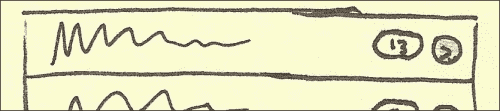
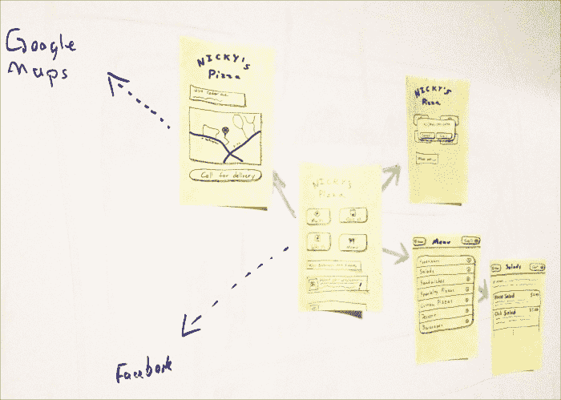

# 一、jQueryMobile 原型制作

2011 年 11 月 22 日，我在[RoughlyBrilliant.com](http://RoughlyBrilliant.com)上开始了我的博客，以此分享我所学到的关于 jQuery Mobile 和 Mobile UX（用户体验）的一切。我不知道它会变成什么，什么会引起共鸣。由于这是一个以开发人员为中心的博客，我有点惊讶，我说的关于离开键盘，先画出我们的设计草图的话会引发最积极的评论。我坚信，启动 jQuery 移动项目的最佳方式是在便笺簿上。

这一章很有可能会让人觉得它是最为经典的作品，也是最为陌生的一章。但最终，我相信这一章可能会给你带来最大的成长。开发人员坐下来开始编写代码是正常的，但现在是时候超越它了。是时候离开键盘了！

在本章中，我们将介绍：

*   不断变化的移动游戏场
*   移动使用模式
*   纸上原型
*   小型企业移动站点的关键组件
*   绘制 jQuery 移动用户界面
*   其他原型制作方法

# 游戏已经改变

不久前，有一段时间，开发人员可以制作一个产品，人们会使用它，不管它有多糟糕。它的存在通常会带来一定程度的成功。我们现在生活在一个竞争更加激烈的时代。现在，有了 jquerymobile 这样的工具，任何人都可以在数小时内快速打造出外观令人印象深刻的移动网站。

那么，我们如何在竞争中脱颖而出呢？我们当然可以在价格上竞争。人们喜欢有价值的东西。但有一点似乎总是胜过价格，那就是用户的体验。**用户体验**（**UX**是世界上最成功品牌的与众不同之处。

哪一家计算机公司不仅保持着良好的发展势头，而且绝对取得了成功？苹果。这可能部分是因为他们的产品价格是他们应该的三倍。最终，我相信这是因为他们一直站在围绕用户进行设计的最前沿。

亚马逊提供了一个伟大的经验，帮助您快速找到您正在寻找的东西。他们为你的购买决策提供了很好的评价和建议。他们的一键购买非常方便，以至于他们实际上已经在法庭上进行了斗争，以保护它作为一个竞争点（[http://en.wikipedia.org/wiki/1-Click](http://en.wikipedia.org/wiki/1-Click) ）。

谷歌本可以走雅虎、美国在线、MSN 和其他许多公司的路。他们可以在自己的主页上推广任何他们想要的东西。相反，他们保持了他们的主页几乎和他们开始的那天一样干净。他们有自己的名字，一个搜索框，和伟大的结果。最多，他们的标志会呈现一些可爱的效果。他们为用户提供他们想要的，并且几乎不碍事。

这很难！我们喜欢认为我们如何制作一个程序或网页是至关重要的。我们喜欢认为，通过减少 10%的代码，我们正在产生巨大的变化。但是，你有没有试着向朋友解释你当前项目的细节，只是看着他们的眼睛呆滞？除了我们没人关心。他们听到的只是更快、更小、更容易、更简单等等。他们只关心那些直接影响他们生活的事情，他们的用户体验。

作为开发人员，我们可以学到的最重要的一课是，我们可以用不到 1K 的 JavaScript 编写最优雅的代码，创建最高效的系统，实现小奇迹，但如果我们在可用性方面失败了……我们将彻底失败。

# 手机使用模式

jQuery Mobile 不是一颗灵丹妙药。它不会对我们的产品产生立竿见影的吸引力。如果我们无法了解用户的环境和使用模式，那么技术和库将无法拯救我们。

想一想：你上一次在手机上的任何一个不是游戏的网站或应用上连续花费超过三分钟是什么时候？我们都知道《愤怒的小鸟》有多容易上瘾，但除此之外，我们往往在匆忙中进进出出。手机使用的本质是短时间的高效活动。这是因为我们的智能手机是完美的时间回收设备。我们在任何有空余时间的地方都会把它们赶出来，包括：

*   房子周围（食谱、短信、无聊）
*   排队或在等候室等候时（无聊）
*   购物（女性：交易狩猎，男性：无聊）
*   工作期间（会议、浴室，我们都做过）
*   看电视（每个广告时段）
*   通勤（乘坐公共交通或交通堵塞）

我们可以通过自己的日常生活很容易地看到微爆发活动。如果我们希望成功，我们就必须根据这一环境定制产品。最重要的是，这需要我们集中精力。当用户排队时，他们来找我们做什么？他们能在一次商业休息中完成什么？在第二阶段他们会考虑什么样的任务？

# HTML 原型与绘图

不要从代码开始。作为一名开发人员，这真的很难说。jquerymobile 非常快速和简单。重构也非常快。然而，当您直接跳入 HTML 原型时，会发生一些事情。

不懂代码的人会认为我们比实际情况更接近于一个完整的产品。对于 jquerymobile 来说尤其如此，因为即使是项目中最基本的尝试也会显得精雕细琢和完整。

人们将开始关注细节，如间距、边距、颜色、徽标大小等。

由于我们在当前设计中时间的沉没成本，我们不太可能对最初编写的代码进行重大更改，因为重构比重做更容易。

相反，买支笔和纸。*等等，什么？*这不是一本网络开发者的书吗？放松点，你不必是个艺术家。信任这个过程。以后将有很多机会编写代码。现在，我们将绘制第一个 jQuery 移动站点。

从纸上构思开始的好处在于：

*   我们更愿意简单地扔掉一张不到 30 秒就完成的画
*   实际上，手工素描使用了大脑的另一部分，打开了我们的创作中心
*   我们可以在创建一个 HTML 页面所需的时间内提出三种完全不同的设计
*   每个人都可以贡献他们最好的想法，即使他们不擅长平面设计或编码
*   我们自然会先画最重要的东西
*   更多关注的是使我们的网站真正发挥作用的想法和流程，而不是那些很少有人会注意到的无数细节
*   我们可能会以一个更加以用户为中心的设计结束，因为我们正在绘制我们真正想要的

理想情况下，3x5 便利贴是完美的，因为我们可以轻松地将它们放在墙上或桌子上，以模拟现场结构或流程。我们甚至可以用它们进行可用性测试。稍晚一点，我们将为业主展示我们的图纸，以便在我们获得买断之前，看看整个工程是如何运作的。

# 小企业弄脏了我们的手

根据 Katherine Kobe 在[的说法 http://archive.sba.gov/advo/research/rs299tot.pdf](http://archive.sba.gov/advo/research/rs299tot.pdf) ：

> “小企业继续在美国经济中发挥着至关重要的作用。在 1998-2004 年期间，小企业生产了私人非农 GDP 的一半。”

[上的一篇文章 http://www.msnbc.msn.com/id/16872553/](http://www.msnbc.msn.com/id/16872553/) 表示：

> “根据劳工统计局的最新数据，虽然约三分之二的小公司通过了两年的测试，但只有 44%的小公司能够在四年内完成测试。”

即使在大企业的土地上，这对我们的手艺也是个好兆头；小企业的数量如此之大，数量如此之多。这意味着，试图竞争的夫妻店几乎无穷无尽。这就是我们要做的。

尼基比萨饼店最近开业了。和其他许多企业一样，店主意识到他应该在开门之前建立一个网站。他的朋友创建了这个网站，它实际上相当不错。它只是还不能移动。

比萨饼很棒，当我们坐在那里享受的时候，我们拿出一支笔，抓起一张餐巾。我们马上就要在这里建立一个移动网站，并赢得一些业务。让我们开始吧。

对于任何小型的本地企业来说，其移动网站上都应该首先有一些主要内容：

*   地方
*   联系方式
*   提供的服务/货物

由于这是一家餐厅，服务将成为菜单。他们也足够聪明，创建了一个 Facebook 页面。所以，我们将链接到这个，并带来一些推荐信。

因为我们在绘图，而不是使用工具，所以您可以选择尽可能详细。下图是绘制同一页面的两个示例。两者都能传达核心思想。

当与我们自己的团队合作时，第一个可能就足够了，因为我们都知道 jQuery Mobile 可以做什么。我们知道框架将填充哪些细节，并且可以绘制出足以告诉彼此我们在想什么的内容。但是，当为客户（或您认识的更注重视觉和细节的人）绘图时，我们最好多花几秒钟来添加更精细的细节，如阴影、渐变阴影，尤其是徽标。企业主们为他们的孩子感到非常自豪，而你将其包括在内的努力将立即赋予你的绘画一点额外的重力。

第一个当然足够好，可以拿起，拿在手里，假装它是一个智能手机屏幕。在第二幅图中，我们可以看到实际绘制徽标会产生多大的差异，以及添加更硬的边缘和阴影如何赋予深度感。稍微擦一擦就很有用了。

有几种方法可以将阴影添加到图形中。最具艺术性的方法是使用铅笔，但铅笔画画的问题是，它会导致弄脏，并且过于注重细节。这些图纸应该是粗糙的。如果你搞砸了，没什么大不了的。毕竟，你可能在每一幅画上花了不到一分钟的时间，这就是你的想法。目标是快速获得共享的视觉理解。

这里有四种不同的方法来画同一个按钮：铅笔、钢笔、夏比和马克笔。我个人的偏好是使用细尖沙皮。

下面是一些其他 jQuery 移动元素和绘制它们的方法：

<colgroup><col style="text-align: left"> <col style="text-align: left"></colgroup> 
| **列表视图** | **对话框** |
| **导航条** | **按钮** |
| **可折叠** | **分组按钮** |
| **输入** | **搜索** |
| **翻转开关** | **滑块** |
| **复选框设置** | **无线电机** |
| **选择菜单** | **多选** |
| **拆分列表视图** | **气泡计数列表视图** |

## 现场的其余部分

`Map It`按钮将引导用户进入该页面，在该页面中，我们将列出地址并有一个静态谷歌地图。点击地址或地图将链接到完整的谷歌地图位置。

在 Android 和 iOS 5 系统上，链接到 Google 地图将导致本机系统在本机界面中显示指定位置，从而允许逐轮导航。这在 iOS 6 中发生了变化，但我们将在稍后讨论。

作为额外的奖励，如果用户不想去物理位置，让我们在标记为`Call for delivery`的按钮上抛出一个电话链接。

注意线条的不同厚度。此外，还有一抹色彩和我们典型的阴影。添加这些小细节并不特别困难，可以产生很大的不同。

整个站点的所有`Call`按钮都将启动本机调用界面。下一个图形是调用对话框的 iOS 视图。Android 非常相似。

请注意背景中按钮上的小亮线，表示已单击该按钮。另外请注意，我们对背景（铅笔画）进行了阴影处理，以指示其模态状态。

现在，让我们考虑菜单和什么将充当全局标题。您放入全局标题的前两个链接将变成按钮。有一个设置，可以在当前的主页按钮位置自动插入后退按钮。只需将`data-add-back-btn="true"`添加到 jQuery 移动页面。不过，我一般不会用这个。我帮助进行的可用性测试表明，大多数人只需按下设备的本机后退按钮。那么，让我们将第一个链接`Home`，第二个链接作为`Call`。

这里我们可以看到沙拉的详细视图。这与以前几乎相同，但我们在列表视图中进行了一些格式化。我们将在下一章中看到这方面的实际代码。

当然，我们可以使用白板和标记来完成所有这些工作。我们可以合作在黑板上画出我们的想法，并用我们打算瞄准的智能手机拍摄快照。我的建议是使用我们忠实的 Post-it 便笺，简单地将它们粘贴到白板上，并使用标记指示屏幕流。下图显示了我的董事会在规划项目后的表现：

如果我们需要重新映射我们的应用程序流，我们所要做的就是洗牌笔记并重新绘制行。这比在白板下几英尺的地方重新绘制所有内容要少得多。

# 要求

考虑一下我们目前的安排。考虑到我们绘制的屏幕，以及业主能够查看并签署这是他想要的，还有多少问题要问？我们真的需要一些列明要求的 Excel 文档，还是一份 30 页的**功能设计规范**（**FDS**文档）来准确地告诉您一切应该是什么和应该做什么？这还不够吗？它真的必须在 Photoshop 中完成并制作成幻灯片吗？

想想看，到目前为止，我们所做的花费总共有五个，一个，一支铅笔，20 分钟。我相信这里的情况已经充分说明，对于大多数网站来说，这就是你所需要的，你可以自己做。

## 替代纸质原型

如果纸质原型的速度和简单性不足以说服你离开键盘，那么就考虑快速原型制作的另外两种选择：

*   **Balsamiq Mo****ckups**[http://www.balsamiq.com/](http://www.balsamiq.com/)
*   **A****旭日 RP**[http://www.axure.com/](http://www.axure.com/)

我个人推荐 Balsamiq 模型。它生产的原型具有统一但手工绘制的外观。这将完成与纸面原型相同的事情，但具有更一致的输出和更容易的跨分布式团队协作。这两种工具都可以生成完全交互的模型，并且允许用户实际点击原型。最终，纸质原型制作速度更快，任何人都可以做出贡献。

# 总结

对于我们这些从未将纸上原型设计作为一门严肃的学科的人来说，这一点一开始会感到非常奇怪。幸运的是，在这里学到的经验教训扩展了您的思维，给了您创造良好用户体验的热情。如果你想更深入地研究思维技巧，我能推荐的关于这个主题的最好的书是戴夫·加里（Dave Gary）（[写的*游戏风暴*http://www.goodreads.com/book/show/9364936-gamestorming](http://www.goodreads.com/book/show/9364936-gamestorming) ）。

您现在应该能够为您的同事和客户有效地绘制 jQuery 移动界面。在下一章中，我们将把这里绘制的内容转换成一个真正的 jQuery 移动实现，它超越了普通的 jQuery 移动外观。请记住，用户体验和可用性是第一位的。追求快速、集中的直觉生产力爆发。