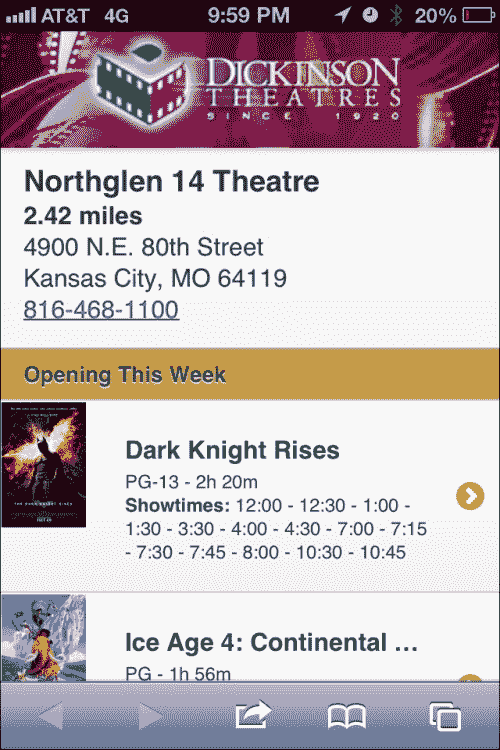
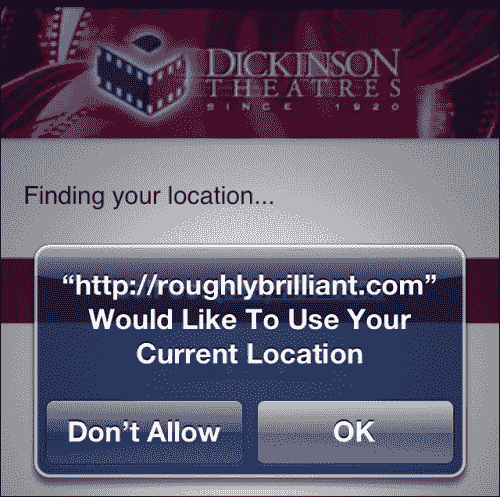
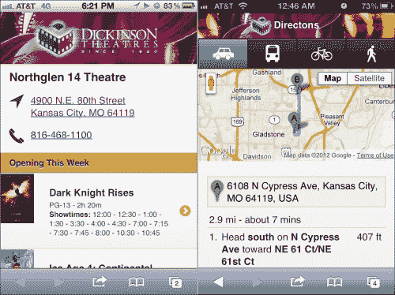

# 四、QR 码、地理位置、谷歌地图 API 和 HTML5 视频

我们已经讨论了小企业和大企业的许多核心问题。现在让我们来看看其他与媒体公司有关的概念。在本章中，我们将介绍一个电影院连锁店，但实际上，这些概念可以应用于任何具有多个物理位置的企业。

在本章中，我们将介绍：

*   二维码
*   基本地理定位
*   集成 googlemapsapi
*   链接和嵌入视频

# 二维码

我们喜欢我们的智能手机。我们喜欢炫耀智能手机的功能。所以，当这些神秘的方块，如下图所示，开始出现在所有地方并迷惑大众时，智能手机用户迅速站起来，开始向人们展示这一切，就像我们以同样的过度热情的方式鞭策他们回答在路过时听到的最琐碎的问题一样。而且，由于 NFC 看起来不会很快起飞，我们最好熟悉二维码以及如何利用它们。


数据显示，根据调查，二维码的知识和使用率非常高：（[http://researchaccess.com/2012/01/new-data-on-qr-code-adoption/](http://researchaccess.com/2012/01/new-data-on-qr- code-adoption/) ）

*   超过三分之二的智能手机用户扫描过密码
*   超过 70%的用户表示他们会再次这么做（特别是为了打折）

等等，这和 jQuery Mobile 有什么关系？交通大时间成功的交通。如果只有百分之二的人点击，横幅广告被认为是成功的（[http://en.wikipedia.org/wiki/Clickthrough_rate](http://en.wikipedia.org/wiki/Clickthrough_rate) ）。二维码的使用率超过 66%！我想说，这是一个很好的方式让人们看到我们的作品，因此，应该引起关注。但 QR 码不仅仅用于 URL。在这里，我们有一个 URL、一段文字、一个电话号码和一条以下二维码的短信：


### 提示

生成二维码（[的方法很多 http://www.the-qrcode-generator.com/](http://www.the-qrcode-generator.com/) 、[http://www.qrstuff.com/](http://www.qrstuff.com/) ）。真的，只要在谷歌上搜索`QR Code Generator`，你就会有很多选择。

让我们考虑一下当地的电影院连锁店。迪金森剧院（[dtmovies.com](http://dtmovies.com)自 20 世纪 20 年代以来一直存在，并正在考虑将其帽子扔进移动电话圈。也许他们会投资一个移动网站，并全力以赴在公共汽车站和其他户外地点张贴海报和广告。很自然，人们会开始扫描，这对我们来说很有价值，因为他们会告诉我们哪些地方是值得的。这真的是广告业的第一次。我们有一种媒介，它似乎能刺激人们在设备上进行互动，从而告诉我们扫描时他们的确切位置。地理位置很重要，这可以帮助我们找到正确的位置。

# 地理定位

当 GPS 第一次出现在手机上时，它除了在紧急情况下用于警察跟踪之外，对其他任何事情都毫无用处。今天，它使我们手中的设备比我们的个人电脑更加个人化。现在，我们可以非常可靠地获得纬度、经度和时间戳。W3C 的地理定位 API 规范可在[中找到 http://dev.w3.org/geo/api/spec-source.html](http://dev.w3.org/geo/api/spec-source.html) 。现在，我们将假装我们有一张海报，提示用户扫描二维码以找到最近的剧院并显示时间。它会将用户带到如下页面：



因为没有比晚餐和电影更好的第一次约会了，所以去看电影的人群倾向于偏向年轻一方。不幸的是，这个群体往往没有很多钱。他们可能拥有比智能手机更多的功能手机。有些可能只有非常基本的浏览器。也许他们有 JavaScript，但我们不能指望它。如果他们这样做，他们可能有地理位置。不管怎样，对于观众来说，渐进式提升将是关键。

我们要做的第一件事是用一个简单的表单创建一个基本级别的页面，该表单将向服务器提交邮政编码。由于我们使用的是以前的模板，因此我们将为使用`validateMe`类的 JavaScript 用户在表单中添加验证。如果他们有 JavaScript 和 geolocation，我们将用一条消息替换表单，告诉他们我们正在试图找到他们的位置。现在，不要担心创建这个文件。此阶段的源代码不完整。该页面将不断发展，最终版本将在名为`qrresponse.php`的文件中的章节的源代码包中，如以下代码所示：

```js
<?php  
  $documentTitle = "Dickinson Theatres";  
  $headerLeftHref = "/"; 
  $headerLeftLinkText = "Home"; 
  $headerLeftIcon = "home";  

  $headerTitle = "";  	
  $headerRightHref = "tel:8165555555"; 
  $headerRightLinkText = "Call"; 
  $headerRightIcon = "grid";  

  $fullSiteLinkHref = "/";  
?> 
<!DOCTYPE html>
<html>
<head> 
  <?php include("includes/meta.php"); ?>
</head>
<body>
<div id="qrfindclosest" data-role="page">
  <div class="logoContainer ui-shadow"></div>
  <div data-role="content">
    <div id="latLong>
      <form id="findTheaterForm" action="fullshowtimes.php"method="get" class="validateMe">             
        <p>
          <label for="zip">Enter Zip Code</label>
          <input type="tel" name="zip" id="zip"class="required number"/>
        </p>
        <p><input type="submit" value="Go"></p>             
      </form>
    </div>         
    <p>         
      <ul id="showing" data-role="listview" class="movieListings"data-dividertheme="g">              
      </ul>         
    </p>
  </div>
  <?php include("includes/footer.php"); ?>
</div>
<script type="text/javascript">
 //We'll put our page specific code here soon
</script>
</body>
</html>
```

对于没有 JavaScript 的人来说，这是他们将看到的，没有什么特别的。我们可以用一点 CSS 来修饰它，但有什么意义呢？如果他们使用的浏览器没有 JavaScript，那么他们的浏览器很可能在呈现 CSS 方面也很糟糕。那很好，真的。毕竟，渐进式增强不一定意味着让它对每个人都很好，它只是意味着确保它对每个人都有效。大多数人将永远不会看到这一点，但如果他们看到了，它将工作得很好。


对于其他人来说，我们需要开始使用 JavaScript 来以一种我们可以通过编程消化的格式获取剧院数据。JSON 非常适合此任务。如果您已经熟悉 JSON 的概念，现在跳到下一段。如果您不熟悉它，基本上，它是跨互联网传送数据的另一种方式。它类似于 XML，但更有用。它不太冗长，可以直接与 JavaScript 交互并使用 JavaScript 进行操作，因为它实际上是用 JavaScript 编写的。JSON 是 JavaScript 对象表示法的首字母缩写。特别感谢道格拉斯·克罗克福德（JSON 之父）。XML 在服务器上仍然占有一席之地。如果您可以获得 JSON，那么它在浏览器中作为数据格式没有任何用处。这是一个如此广泛的观点，以至于在我参加的上一次开发人员会议上，一位发言者笑着问：“有人还在使用 XML 吗？”

本章的示例代码包含剧院的完整列表，但这应该足以让我们开始。对于这个例子，我们将 JSON 数据存储在`/js/theaters.js`中。

```js
{ 
  "theaters":[ 
    {
      "id":161,
      "name":"Chenal 9 IMAX Theatre", 
      "address":"17825 Chenal Parkway",
      "city":"Little Rock",
      "state":"AR",
      "zip":"72223",
      "distance":9999,
      "geo":{"lat":34.7684775,"long":-92.4599322}, 
      "phone":"501-821-2616"
    },
    {
      "id":158,
      "name":"Gateway 12 IMAX Theatre", 
      "address":"1935 S. Signal Butte", 
      "city":"Mesa",
      "state":"AZ",
      "zip":"85209",
      "distance":9999,
      "geo":{"lat":33.3788674,"long":-111.6016081}, 
      "phone":"480-354-8030"
    },
    {
      "id":135,
      "name":"Northglen 14 Theatre",
      "address":"4900 N.E. 80th Street",
      "city":"Kansas City",
      "state":"MO",
      "zip":"64119",
      "distance":9999,
      "geo":{"lat":39.240027,"long":-94.5226432}, 
      "phone":"816-468-1100"
    }   
  ]
}
```

现在我们有了要处理的数据，我们可以准备页面脚本了。让我们将下面的 JavaScript 块放在 HTML 底部的一个脚本标记中，在该标记中有注释：`We'll put our page specific code here soon`。

```js
//declare our global variables
var theaterData = null; 
var timestamp = null; 	
var latitude = null; 
var longitude = null; 	
var closestTheater = null; 

//Once the page is initialized, hide the manual zip code form
//and place a message saying that we're attempting to find 
//their location.
$(document).on("pageinit", "#qrfindclosest", function(){
  if(navigator.geolocation){   
     $("#findTheaterForm").hide(); 
     $("#latLong").append("<p id='finding'>Finding your location...</p>"); 
  } 
});

//Once the page is showing, go grab the theater data and find out which one is closest.  
$(document).on("pageshow", "#qrfindclosest", function(){ 
 theaterData = $.getJSON("js/theaters.js", 
 function(data){ 
      theaterData = data;
      selectClosestTheater();
    });
}); 

function selectClosestTheater(){ 
 navigator.geolocation.getCurrentPosition(
   function(position) { //success 
  latitude = position.coords.latitude; 
  longitude = position.coords.longitude; 
  timestamp = position.timestamp; 
  for(var x = 0; x < theaterData.theaters.length; x++){  var theater = theaterData.theaters[x]; 
    var distance = getDistance(latitude, longitude,theater.geo.lat, theater.geo.long); 
    theaterData.theaters[x].distance = distance; 
  }} 
  theaterData.theaters.sort(compareDistances); 
  closestTheater = theaterData.theaters[0]; 	
 _gaq.push(['_trackEvent', "qr", "ad_scan",(""+latitude+","+longitude) ]); 
  var dt = new Date(); 
  dt.setTime(timestamp); 
  $("#latLong").html("<div class='theaterName'>"
    +closestTheater.name+"</div><strong>"
    +closestTheater.distance.toFixed(2)
    +"miles</strong><br/>"
    +closestTheater.address+"<br/>"
    +closestTheater.city+", "+closestTheater.state+" "
    +closestTheater.zip+"<br/><a href='tel:"
    +closestTheater.phone+"'>"
    +closestTheater.phone+"</a>"); 
  $("#showing").load("showtimes.php", function(){ 
    $("#showing").listview('refresh'); 
  });
}, 
function(error){ //error  
  switch(error.code)  	
  { 
    case error.TIMEOUT: 
      $("#latLong").prepend("<div class='ui-bar-e'>Unable to get your position: Timeout</div>"); 
      break; 
    case error.POSITION_UNAVAILABLE: 
      $("#latLong").prepend("<div class='ui-bar-e'>Unable to get your position: Position unavailable</div>"); 
      break; 
    case error.PERMISSION_DENIED: 
      $("#latLong").prepend("<div class='ui-bar-e'>Unable to get your position: Permission denied.You may want to check your settings.</div>"); 
      break; 
    case error.UNKNOWN_ERROR:  
      $("#latLong").prepend("<div class='ui-bar-e'>Unknown error while trying to access your position.</div>"); 
      break; 
   }
   $("#finding").hide();   
   $("#findTheaterForm").show(); 
},
{maximumAge:600000}); //nothing too stale
}
```

这里的关键是功能`geolocation.getCurrentPosition``,`，它将提示用户允许我们访问他们的位置数据，如 iPhone 上所示。



如果有人是隐私倡导者，他们可能已经关闭了所有的位置服务。在这种情况下，我们需要通知用户，他们的选择影响了我们帮助他们的能力。这就是错误函数的全部内容。在这种情况下，我们将显示一条错误消息并再次显示标准表单。

一旦我们有了用户的位置和影院列表，就可以按距离对影院进行排序，并显示最近的影院。下面是一个非常通用的代码，我们可能希望在多个页面上使用它。所以我们将把这个放到我们的`global.js`文件中：

```js
function getDistance(lat1, lon1, lat2, lon2){ 
  //great-circle distances between the two points
  //because the earth isn't flat 
  var R = 6371; // km 	
  var dLat = (lat2-lat1).toRad(); 
  var dLon = (lon2-lon1).toRad(); 
  var lat1 = lat1.toRad(); 
  var lat2 = lat2.toRad();  
  var a = Math.sin(dLat/2) * Math.sin(dLat/2) +  
    Math.sin(dLon/2) * Math.cos(lat1) * 
    Math.cos(lat2);  
  var c = 2 * Math.atan2(Math.sqrt(a), Math.sqrt(1-a));  
  var d = R * c; //distance in km 
  var m = d * 0.621371;  //distance in miles 
  return m; 
} 
if (typeof(Number.prototype.toRad) === "undefined") {   
  Number.prototype.toRad = function() { 
    return this * Math.PI / 180;   
  } 
}  

function compareDistances(a,b) {   
  if (a.distance<b.distance) return -1;   
  if (a.distance>b.distance) return 1;   
  return 0; 
} 
```

有了所有这些片段后，现在就可以很简单地获得用户的位置并找到最近的剧院。它将是数组中的第一个，并且直接存储在全局变量`closestTheater`中。如果他们关闭了 JavaScript，我们将不得不使用一些服务器端算法或 API 来找出哪一个最接近（这超出了本书的范围）。无论如何，我们将每个剧院的演出时间作为一组列表项保存在一个平面文件中（`showtimes.php`。在现实世界中，这将是数据库驱动的，我们将使用具有正确剧院 ID 的 URL 调用页面。目前，我们只需要以下代码：

```js
<li data-role="list-divider">Opening This Week</li>     
<li>         
  <a href="movie.php?id=193818">             
                 
    <h3>Dark Knight Rises</h3>             
    <p>PG-13 - 2h 20m<br/>
      <strong>Showtimes:</strong> 
      12:00 - 12:30 - 1:00 - 1:30 - 3:30 - 4:00 - 4:30 – 
      7:00 - 7:15 - 7:30 - 7:45 - 8:00 - 10:30 - 10:45
    </p>         
  </a>     
</li>     
<li>         
  <a href="moviedetails.php?id=193812">
                 
    <h3>Ice Age 4: Continental Drift</h3>
    <p>PG - 1h 56m<br/>
      <strong>Showtimes:</strong> 10:20 AM - 10:50 AM – 
      12:40 - 1:15 - 3:00 - 7:00 - 7:30 - 9:30
    </p>         
  </a>     
</li>     
<li data-role="list-divider">Also in Theaters</li>
<li>
  <a href="moviedetails.php?id=194103">
                 
    <h3>Savages</h3>
    <p>R - 7/6/2012<br/><strong>Showtimes:</strong> 
      10:05 AM - 1:05 - 4:05 - 7:05 - 10:15
    </p>         
  </a>     
</li>     
<li>
  <a href="moviedetails.php?id=194226">
                 
    <h3>Katy Perry: Part of Me</h3>
    <p>PG - 7/5/2012<br/>
      <strong>Showtimes:</strong> 10:05 AM - 1:05 – 
      4:05 - 7:05 - 10:15
    </p>         
  </a>     
</li>     
<li>         
  <a href="moviedetails.php?id=193807">
                 
    <h3>Amazing Spider-Man</h3>
    <p>PG-13 - 7/5/2012<br/>
      <strong>Showtimes:</strong> 10:00 AM - 1:00 – 
      4:00 - 7:00 - 10:00
    </p>         
  </a>     
</li> 
```

我们使用以下页面脚本拉入此页面片段：

```js
$("#showing").load("showtimes.php", function(){ 
    $("#showing").listview('refresh'); 
});
```

在本例中，`showtimes.php`文件只包含 listview 项，我们在刷新之前将它们直接注入 listview。完成同样任务的另一种方法是使用另一个文件，如`fullshowtimes.php,`是一个完全呈现的页面，包含页眉、页脚和所有内容。这将非常适合 JavaScript 或地理位置不可用的情况，我们必须恢复到标准页面提交。

```js
<?php  
  $documentTitle = "Showtimes | Northglen 16 Theatre";  
  $headerLeftHref = "/"; 
  $headerLeftLinkText = "Home"; 
  $headerLeftIcon = "home";  
  $headerTitle = "";  	
  $headerRightHref = "tel:8165555555"; 
  $headerRightLinkText = "Call"; 
  $headerRightIcon = "grid";  
  $fullSiteLinkHref = "/";  
?> 
<!DOCTYPE html> 
<html> 
<head> 
  <?php include("includes/meta.php"); ?>  
</head>  
<body> 
  <div id="qrfindclosest" data-role="page">     
    <div class="logoContainer ui-shadow"></div>     
    <div data-role="content">
      <h3>Northglen 14 Theatre</h3>

      <p><a href="https://maps.google.com/maps?q=Northglen+14+Theatre,+Northeast+80th+Street,+Kansas+City,+MO&hl=en&sll=38.304661,-92.437099&sspn=7.971484,8.470459&oq=northglen+&t=h&hq=Northglen+14+Theatre,&hnear=NE+80th+St,+Kansas+City,+Clay,+Missouri&z=15">4900 N.E. 80th Street<br>         
        Kansas City, MO 64119</a>
      </p>

      <p><a href="tel:8164681100">816-468-1100</a></p>                  
      <p>
        <ul id="showing" data-role="listview"class="movieListings" data-dividertheme="g">             
          <?php include("includes/showtimes.php"); ?>             
        </ul>
      </p>
    </div>     
    <?php include("includes/footer.php");?> 
  </div> 
</body> 
</html>
```

然后，我们可以加载整个页面，然后使用以下代码在页面中选择要注入的元素，而不是仅用一个页面调用 load 函数：

```js
$("#showing").load("fullshowtimes.php #showing li", function(){ 
  $("#showing").listview('refresh'); 
});
```

当然，这是一种效率较低的做事方式，但值得注意的是，这样的事情是可以做到的。它几乎肯定会在未来派上用场。

# 整合谷歌地图 API

到目前为止，我们自己做得很好。我们可以知道哪家剧院最近，离得有多远。可悲的是，尽管前景光明，但 21 世纪并没有让我们所有人都拥有私人飞机组。因此，我们最好不要显示这种距离。最有可能的是，他们会开车、坐公共汽车、骑自行车或步行。

让我们利用谷歌地图 API（[https://developers.google.com/maps/documentation/javascript/](https://developers.google.com/maps/documentation/javascript/) 。如果你的网站将有很多 API 点击率，你可能需要支付商业定价。对我们来说，当我们在发展的时候，没有必要。

以下是我们将要构建的内容：



首先，我们需要另一个页面来显示地图和方向，以及实际从 Google maps API 加载地图的脚本，使用以下代码：

```js
<div id="directions" data-role="page"> 
  <div data-role="header">         
    <h3>Directions</h3>     
  </div>     
  <div data-role="footer">         
    <div data-role="navbar" class="directionsBar">             
      <ul>                 
        <li>
          <a href="#" id="drivingButton"onClick="showDirections('DRIVING')">
            <div class="icon driving"></div>
          </a>
        </li>                 
        <li>
          <a href="#" id="transitButton"onClick="showDirections('TRANSIT')">
            <div class="icon transit"></div>
          </a>
        </li>
        <li>
          <a href="#" id="bicycleButton"onClick="showDirections('BICYCLING')">
            <div class="icon bicycle"></div>
          </a>
        </li>                 
        <li>
          <a href="#" id="walkingButton"onClick="showDirections('WALKING')">
            <div class="icon walking"></div>
          </a>
        </li>
      </ul>
    </div> 
  </div>     
  <div id="map_canvas"></div>     
  <div data-role="content" id="directions-panel">
  </div> 
</div> 
<scriptsrc="https://maps.googleapis.com/maps/api/js?sensor=true"></script>
```

本页有几个重要的部分。第一个是剧院方向的`footer`属性中的`navbar`属性。您可能没有意识到的是页脚实际上不必位于页面底部。当您在`footer`属性中使用`navbar`属性时，您单击的链接将保持其活动状态。如果周围没有页脚，链接将只闪烁一次活动状态，然后返回正常状态。`map_canvas`和`directions-panel`属性将由谷歌地图 API 填写。

现在，我们需要为额外的图标和映射约束更新 CSS 代码。和以前一样，我们将它们保存在`/css/custom.css`位置。

```js
.directionsBar .icon{ 	  
  height:28px;   
  width:34px;   
  margin:auto;   
  background-repeat:no-repeat;   
  background-position:center center; 
} 

.directionsBar .driving{ 
  background-image:url(../icons/xtras-white/16-car.png); 
  background-size:34px 19px; 
} 
.directionsBar .transit{ 
  background-image:url(../icons/xtras-white/15-bus.png); 
  background-size:22px 28px; 
} 
.directionsBar .bicycle{ 	
  background-image:url(../icons/xtras-white/13-bicycle.png); 
  background-size:34px 21px; 
} 
.directionsBar .walking{ 
  background-image:url(../icons/icons-white/102-walk.png); 
  background-size:14px 27px; 
} 
.theaterAddress{ 
  padding-left:35px; 
  background-image:url(../icons/icons-gray/193-location-arrow.png); 
  background-size:24px 24px; 
  background-repeat:no-repeat;  
} 
.theaterPhone{ 
  padding-left:35px; 
  background-image:url(../icons/icons-gray/75-phone.png); 
  background-size:24px 24px; 
  background-repeat:no-repeat; 
  height: 24px;  
} 

#map_canvas { height: 150px; }  

@media only screen and (-webkit-min-device-pixel-ratio: 1.5),    
  only screen and (min--moz-device-pixel-ratio: 1.5),    
  only screen and (min-resolution: 240dpi) { 
    .directionsBar .driving{ 
      background-image:url(../icons/xtras-white/16-car@2x.png); 
    }
    .directionsBar .transit{ 
      background-image:url(../icons/xtras-white/15-bus@2x.png); 
    } 
    .directionsBar .bicycle{ 
      background-image:url(../icons/xtras-white/13bicycle@2x.png); 
    } 
    .directionsBar .walking{ 
      background-image:url(../icons/icons-white/102-walk@2x.png); 
    } 
    .theaterAddress{ 
      background-image:url(../icons/icons-gray/193-location-arrow@2x.png); 
    } 
    .theaterPhone{ 
      background-image:url(../icons/icons-gray/75-phone@2x.png); 
    } 
  }  
```

接下来，我们将在当前的页面脚本中添加一些全局变量和函数。

```js
var directionData = null; 
var directionDisplay; 	
var directionsService = new google.maps.DirectionsService(); 
var map; 

function showDirections(travelMode){ 
  var request = { 
    origin:latitude+","+longitude, 
    destination:closestTheater.geo.lat+","
      +closestTheater.geo.long, 
    travelMode: travelMode 
}; 

  directionsService.route(request, 
    function(response, status){ 
      if (status == google.maps.DirectionsStatus.OK){
        directionsDisplay.setDirections(response); 
      } 
    }); 

  $("#directions").live("pageshow", 
    function(){ 
      directionsDisplay = new google.maps.DirectionsRenderer(); 
      var userLocation = new google.maps.LatLng(latitude, longitude); 
      var mapOptions = {
        zoom:14, 
        mapTypeId: google.maps.MapTypeId.ROADMAP, 
        center: userLocation 
      } 
      map = new google.maps.Map(   
        document.getElementById('map_canvas'), mapOptions);
        directionsDisplay.setMap(map);   
        directionsDisplay.setPanel(
        document.getElementById('directions-panel')
      ); 
      showDirections(
      google.maps.DirectionsTravelMode.DRIVING
  ); 
  $("#drivingButton").click(); 
});
```

这里，我们看到了保存 Google 对象的全局变量。`showDirections`方法取一个字符串，表示四种不同的旅行模式之一：`'DRIVING'`、`'TRANSIT'`、`'BICYCLING'`和`'WALKING'`。

我们可以在填充地图和方向的同时，找出最近的剧院。实际上，这将为用户带来良好的体验。然而，如果没有分析表明大多数人确实想要方向，那么产生成本就毫无意义。归根结底，这是一个商业决策，但拥有任何规模客户群的公司都可能受到 API 成本的重创。目前，最好在用户进入`directions`页面时触发地图和方向的加载。

# 极客时刻 GPS 监控

那么，让我们出去玩一会儿。在大多数情况下，我们所做的可能已经足够好了。我们展示了一张地图和每个转弯的方向。让我们更进一步。地理定位 API 不仅仅确定您当前的位置。包括时间戳（无大碍），可以使用`navigator.geolocation.watchPosition`（[方法持续监控用户位置 http://dev.w3.org/geo/api/spec-source.html#watch-位置](http://dev.w3.org/geo/api/spec-source.html#watch-position)）。这意味着只需一点点努力，我们就可以将以前的方向页面变成一个不断更新的方向页面。在示例代码中，这些都包含在文件`qrresponse2.php`中。

同样，过于频繁的更新可能会带来昂贵的成本。所以我们应该真正限制我们重新绘制地图和方向的频率。对于每种运输模式，更新之间需要的有意义的时间量是不同的。当我们在做的时候，让我们重新做按钮来包含这些选项。以下是整个页面的代码：

```js
<?php  
  $documentTitle = "Dickinson Theatres";  

  $headerLeftHref = "/"; 
  $headerLeftLinkText = "Home"; 
  $headerLeftIcon = "home";  

  $headerTitle = "";  	

  $headerRightHref = "tel:8165555555"; 
  $headerRightLinkText = "Call"; 
  $headerRightIcon = "grid";  

  $fullSiteLinkHref = "/";  
?> 
<!DOCTYPE html> 
<html> 
<head> 
  <?php include("includes/meta.php"); ?> 
  <style type="text/css"> 
    .logoContainer{ 
      display:block; 
      height:84px; 
      background-image:url(images/header.png);  
      background-position:top center;   
      background-size:885px 84px;
      background-repeat:no-repeat;
    }  
  </style>     
  <script type="text/javascript"src="http://maps.googleapis.com/maps/api/js?key=asdfafefaewfacaevaeaceebvaewaewbk&sensor=true"></script> 
</head>  
<body> 
  <div id="qrfindclosest" data-role="page">
    <div class="logoContainer ui-shadow"></div>
    <div data-role="content">
      <div id="latLong">
        <form id="findTheaterForm" action="fullshowtimes.php"method="get" class="validateMe">
          <p>
            <label for="zip">Enter Zip Code</label>
            <input type="tel" name="zip" id="zip"class="required number"/>
          </p>
          <p><input type="submit" value="Go"></p>              
        </form>
      </div>
      <p>         
        <ul id="showing" data-role="listview"class="movieListings" data-dividertheme="g">
        </ul>         
      </p>     
    </div>          
    <?php include("includes/footer.php"); ?> 
  </div>  

  <div id="directions" data-role="page">
    <div data-role="header">
      <h3>Directions</h3>
    </div>
    <div data-role="footer">
      <div data-role="navbar" class="directionsBar">             
        <ul>
          <li>
            <a href="#" id="drivingButton"data-transMode="DRIVING" data-interval="10000"
>
              <div class="icon driving"></div>
            </a>
          </li>
          <li>
            <a href="#" id="transitButton"data-transMode="TRANSIT" data-interval="10000">
              <div class="icon transit"></div>
            </a>
          </li>
          <li>
            <a href="#
" id="bicycleButton"data-transMode="BICYCLING" data-interval="30000">
              <div class="icon bicycle"></div>
            </a>
          </li>
          <li>
            <a href="#" id="walkingButton
"data-transMode="WALKING" data-interval="60000">
              <div class="icon walking"></div>
            </a>
          </li>
        </ul>
      </div>
    </div>
    <div id="map_canvas"></div>
    <div data-role="content" id="directions-panel"></div> 
  </div> 
```

那么，现在让我们看看这个 GPS 监控版本的页面上的脚本：

```js
  <script type="text/javascript"> 
    //declare our global variables 
    var theaterData = null; 
    var timestamp = null; 
    var latitude = null; 
    var longitude = null; 
    var closestTheater = null; 
    var directionData = null; 
    var directionDisplay; 
    var directionsService = new 
      google.maps.DirectionsService(); 
    var map; 
    var positionUpdateInterval = null; 
    var transporationMethod = null;   

    //Once the page is initialized, hide the manual zip form 
    //and place a message saying that we're attempting to find their location. 
    $(document).on("pageinit", "#qrfindclosest", function(){ 
      if(navigator.geolocation){ 
        $("#findTheaterForm").hide(); 
        $("#latLong").append("<p id='finding'>Finding your 
           location...</p>");
      } 
    }); 

    $(document).on("pageshow", "#qrfindclosest", function(){ 
      theaterData = $.getJSON("js/theaters.js", 
        function(data){ 
          theaterData = data; 
          selectClosestTheater(); 
    }); 

 $("div.directionsBar a").click(function(){
 if(positionUpdateInterval != null){ 
 clearInterval(positionUpdateInterval);
 } 
 var $link = $(this);
      transporationMethod = $link.attr("data-transMode"); 
 showDirections(); 
 setInterval(function(){
 showDirections(); 
        },Number($link.attr("data-interval"))); 
 }); 

    function showDirections(){
      var request = {
        origin:latitude+","+longitude,   
          destination:closestTheater.geo.lat+","
          +closestTheater.geo.long,
        travelMode: transportationMethod
      }

      directionsService.route(request, 
        function(response, status) { 
          if (status == google.maps.DirectionsStatus.OK){       directionsDisplay.setDirections(response);
          }
      }); 
    }  

    $(document).on("pageshow", "#directions", function(){  
      directionsDisplay = new google.maps.DirectionsRenderer();
      var userLocation = new google.maps.LatLng(latitude, longitude);
      var mapOptions = {
        zoom:14,
        mapTypeId: google.maps.MapTypeId.ROADMAP, 
        center: userLocation
      }
      map = new google.maps.Map(document.getElementById('map_canvas'), mapOptions); 
      directionsDisplay.setMap(map);   
      directionsDisplay.setPanel(
        document.getElementById('directions-panel')); 
 if(positionUpdateInterval == null) { 
        transportationMethod = "DRIVING"; 
 positionUpdateInterval = setInterval(function(){
 showDirections(); 
 },(10000)); 
      } 
      $("#drivingButton").click();
  });

  function selectClosestTheater(){ 
 var watchId=navigator.geolocation.watchPosition(
        function(position){ //success 
        latitude = position.coords.latitude;
        longitude = position.coords.longitude; 
        timestamp = position.timestamp;
        var dt = new Date();
        dt.setTime(timestamp);

        for(var x = 0; x < theaterData.theaters.length; x++){ 
          var theater = theaterData.theaters[x]; 
          var distance = getDistance(latitude, longitude, 
            theater.geo.lat, theater.geo.long); 
          theaterData.theaters[x].distance = distance;      } 

        theaterData.theaters.sort(compareDistances);  
        closestTheater = theaterData.theaters[0]; 

        $("#latLong").html("<div class='theaterName'>"
          +closestTheater.name
          +"</div><p class='theaterAddress'><a href='#directions'>"         
          +closestTheater.address+"<br/>"
          +closestTheater.city+", "
          +closestTheater.state
          +" "+closestTheater.zip
          +"</a></p><p class='theaterPhone'><a href='tel:"
          +closestTheater.phone+"'>"
          +closestTheater.phone+"</a></p>"
        );

        $("#showing").load("fullshowtimes.php #showing li", 
          function(){ 	
            $("#showing").listview('refresh'); 
        });
      }
    }, 
    function(error){ //error    
     $("#findTheaterForm").show();   
     $("#finding").hide();
     switch(error.code) { 
       case error.TIMEOUT: 
         $("#latLong").prepend("<div class='ui-bar-e'>Unable to get your position: Timeout</div>"); 
         break;
       case error.POSITION_UNAVAILABLE: 
         $("#latLong").prepend("<div class='ui-bar-e'>Unable to get your position: Position unavailable</div>");
         break;
     case error.PERMISSION_DENIED: 
       $("#latLong").prepend("<div class='ui-bar-e'>Unable to get your position: Permission denied.You may want to check your settings.</div>"); 
         break;
       case error.UNKNOWN_ERROR: 
         $("#latLong").prepend("<div class='ui-bar-e'>Unknown error while trying to access your position.</div>"); 
         break; 
     }
  }); 
}  
</script>   
</body> 
</html> 
```

# 链接和嵌入视频

预告片是电影业的一种主要形式。我们可以像很多人一样直接链接到 YouTube 上的预览。下面是一个简单的方法：

```js
<p><a data-role="button"href="http://www.youtube.com/watch?v=J9DlV9qwtF0">Watch Preview</a></p> 
```


这会起作用，但问题是它会将用户从您的站点带走。从用户的角度来看，这可能不是世界的末日，但这是一个巨大的电子商务禁忌。

因此，为了改善体验并让用户留在我们自己的网站上，让我们直接嵌入 HTML5 视频，并使用通用图像进行电影预览，正如我们在这里所描述的那样。

尽管这段视频看起来会在页面的一小部分播放，但在智能手机上，视频将以全屏横向模式播放。iPad 上的情况略有不同，它将在嵌入式端在线播放。

最后，我们希望使用以下代码将大小合适的视频推回到用户的设备上。没有高分辨率显示器的智能手机不会从 720p 视频中受益。

```js
<video id="preview" width="100%" controlsposter="images/preview.gif"> 

  <source src="previews/batmanTrailer-2_720.mp4" type="video/mp4"  media="only screen and (-webkit-min-device-pixel-ratio: 1.5),only screen and (min--moz-device-pixel-ratio: 1.5),only screen and (min-resolution: 240dpi)"/>                 

  <source src="previews/batmanTrailer-1_480.mov"type="video/mov" />                 

  <a data-role="button"href="http://www.youtube.com/watch?v=J9DlV9qwtF0">Watch Preview</a> 

</video>  
```

如果浏览器识别 HTML5 视频标签，播放器将从顶部开始，查看每个源标签，直到找到一个知道如何播放并匹配正确媒体查询的源标签（如果指定了媒体查询）。如果浏览器不支持 HTML5 视频，它将不知道如何处理视频和源标签，并简单地认为它们是有效的 XML 元素。它们将被视为无关的`div`标签，并显示链接按钮。

如您所见，我们在这里向不同来源添加了媒体查询。如果是高分辨率屏幕，我们将加载更漂亮的视频。通过添加大量不同的视频源，你可以在这里玩得很疯狂：普通智能手机的视频为 480p，iPhone 和早期 iPad 的视频为 720p，第三代 iPad 的视频为 1080p。这里唯一需要注意的是，尽管 Apple Retina 显示屏能够显示更漂亮的视频，但它仍然必须通过相同的管道。加载更小的视频可能更好，因为它可以更快地播放，并且占用客户更少的带宽。

让我们在这张图片中添加一些 CSS。我们将宽度保留为包含它的所有物体的 100%。在智能手机上，图像比例将随着宽度的增加而适当缩放。iPad，不是那么多。所以，让我们使用媒体查询来检测它的屏幕分辨率，并给它一个明确的高度，以便更好地利用房地产。

```js
 /* iPad ----------------*/ @media only screen and (min-device-width: 768px) and (max-device-width: 1024px) { 
  #preview{ height:380px;} 
}
```

# 总结

我们在智能手机上探索了现代媒体的边界。现在，您可以通过头脑风暴来了解二维码的用途和优势，找出用户所在的位置，监控用户的位置，从谷歌获取方向和地图，并向用户提供响应视频。

想想你刚刚学到的一切。要创建一个社交网站，允许用户获取彼此位置的地图，并随着他们的距离越来越近或越来越远而不断更新，这有多难。如果包装和销售得当，它可能很有价值。

在下一章中，我们将利用 GPS 在您的地理区域内获取推文。我们还将研究从其他几个来源（如 reddit、RSS 提要等）获取提要。这会很有趣的。这是我最喜欢写的章节之一。