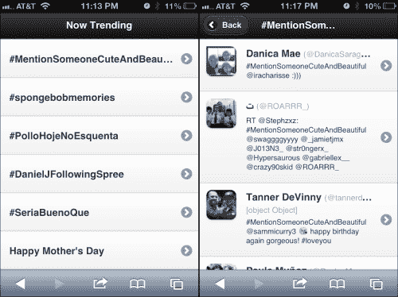
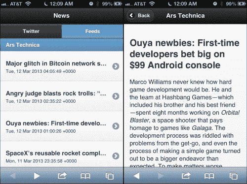

# 五、客户端模板、JSON API 和 HTML5 Web 存储

我们已经走了很长的路，我们已经有了一些相当强大的默认模板和商业样板。在本章中，我们将简化并关注其他一些事情。我们将创建一个基于社交媒体的聚合新闻网站。到目前为止，我们一直密切关注渐进增强。在本章中，我们将其抛在脑后。这将需要 JavaScript。

在本章中，您将学习以下内容：

*   客户端模板选项
*   JsRender
*   修补 JSON API（Twitter）
*   以编程方式更改页面
*   生成页面和 DOM 权重管理
*   利用 RSS 源（本机）
*   HTML5Web 存储
*   利用 GoogleFeedsAPI

# 客户端模板化

（用一个脾气暴躁的老人的声音）回到我的时代，我们在服务器上呈现了所有的页面，我们喜欢它！英雄联盟时代在变化，我们在客户端模板框架中看到了巨大的膨胀。从本质上讲，它们几乎是一样的，它们获取 JSON 数据并应用脚本标记中包含的基于 HTML 的模板。

如果您知道什么是**JSON**，请跳过这一段。上一章我花了一点时间讨论这个问题，但为了防止您跳过前面的内容而不知道，JSON 是用 JavaScript 编写的，可以用作数据交换格式。它比 XML 效率更高，并且可以由浏览器以面向对象的方式即时解释。JSON 甚至可以使用 JSONP 跨域请求数据。有关 JSON 的更多信息，请阅读[http://en.wikipedia.org/wiki/JSON](http://en.wikipedia.org/wiki/JSON) 。有关 JSONP 的更多信息，请阅读[http://en.wikipedia.org/wiki/JSONP](http://en.wikipedia.org/wiki/JSONP) 。

所有这些客户端库中都有某种表示法来显示数据的去向，并给出实现循环和条件的方法。有些人是“没有逻辑的”，他们的理念是，应该尽可能少地使用逻辑。如果你同意这种极好的学术方法，那对你有好处。

老实说，从纯实用的角度来看，我相信模板是编写代码的最佳场所。越灵活越好。JSON 保存数据，并使用模板对其进行转换。为了进行比较，XML 是数据格式，XSL 模板用于转换。没有人抱怨 XSL 中的逻辑；所以，我不明白为什么在 JS 模板中会出现问题。但是，所有这些讨论都纯粹是学术性的。最后，他们几乎都会做你想做的事。如果您更像是一个设计师而不是一个程序员，那么您可能希望更多地了解无逻辑模板。

下面是一个相当详尽的客户端模板框架列表。我可能会错过一些，到本书出版时，不可避免地会有更多，但这只是一个开始。

*   点
*   dust.js
*   生态
*   EJS
*   谷歌闭包模板
*   车把
*   哈米尔 js 酒店
*   风筝
*   玉
*   jQote2
*   jQuery 模板（已停止使用）
*   jsRender/jsView
*   鹦鹉
*   节点异步
*   修女
*   亩
*   胡子
*   蒙太奇
*   模板
*   下划线.js

现在，叫我粉丝吧，但是，如果它是正式的 jQuery，我喜欢它。所以，我尝试的第一件事是**jQuery 模板**。不幸的是，在学会爱上它后不久，jQuery 团队放弃了该项目，并将人们引向**JsRender**作为该项目的延续。这是否将是未来的继续方向是另一个问题，但与此同时，JsRender 的特性和功能使其成为一个引人注目的产品，并成为本章其余部分模板工作的基础。更不用说，它只有 14k 的小型化和闪电般的速度。您可以从[下载最新版本 https://github.com/BorisMoore/jsrender](https://github.com/BorisMoore/jsrender) 。

如果您正在寻求帮助，以便为您选择合适的模板框架，Andy Matthews 非常乐意在本章的审查过程中提供以下链接：[http://garann.github.com/template-chooser/](http://garann.github.com/template-chooser/) 。它讨论了几种框架的优点，以帮助您做出明智的选择。谢谢你，安迪！

# 修补 JSON API（Twitter）

在 Twitter 上观看热门话题总是很有趣的。它和许多其他流行的在线目的地一样，有一个 JSON API。让我们玩一玩。这是我们要建造的。您可以在左侧看到 listview，在右侧看到 search 视图。



在这一点上，我将放弃将 CSS 和 JS 与 HTML 分离的学术上正确的做法。除了库之外，所有特定于页面的代码（HTML、CSS 和 JS）都将位于单个页面中。下面的代码是我们的起始基页。在本章代码包中为`twitter.html`：

```js
<!DOCTYPE html>  
<html>  
  <head>   
    <meta charset="utf-8">   
    <meta name="viewport" content="width=device-width, initial-scale=1, maximum-scale=1.0, user-scalable=no">   
    <title>Chapter 5 - News</title>       
    <link rel="stylesheet" href="http://code.jquery.com/mobile/1.3.0/jquery.mobile-1.3.0.min.css" />   
    <script src="http://code.jquery.com/jquery-1.8.2.min.js"></script>  
    <script src="js/jsrender.min.js" type="text/javascript"></script>
  <script src="http://code.jquery.com/mobile/1.3.0/jquery.mobile-1.3.0.min.js"></script>
```

下一步的样式将帮助我们的 Twitter 结果看起来更像 Twitter：

```js
    <style type="text/css">     
      .twitterItem .ui-li-has-thumb .ui-btn-inner a.ui-link-inherit, #results .ui-li-static.ui-li-has-thumb{       
         min-height: 50px;       
         padding-left: 70px;     
      } 
      .twitterItem .ui-li-thumb, #results .ui-listview .ui-li-icon, #results .ui-li-content{       
         margin-top: 10px;
         margin-left: 10px;     
      }     
      .twitterItem .ui-li-desc{       
         white-space:normal;       
         margin-left:-25px;       
      }     
      .twitterItem .handle{       
        font-size:80%;       
        font-weight:normal;         
        color:#aaa;     
      }     
      .twitterItem .ui-li-heading{       
        margin: 0 0 .6em -25px;     
      }   
    </style> 
  </head>   
  <body>  
```

这个页面几乎只是一个占位符，一旦我们返回点击 Twitter API 的结果，就会填充它：

```js
  <div id="home_page" data-role="page"> 	
    <div data-role="header"><h1>Now Trending</h1></div>   
    <div data-role="content">
      <ul id="results" data-role="listview" data-dividertheme="b">
      </ul>
    </div>
  </div>  
```

下面的脚本是页面的处理核心。

```js
  <script type="text/javascript"> 
    $(document).on("pagebeforeshow", "#home_page",  function(){ 	

     //before we show the page, go get the trending topics
     //from twitter
    $.ajax({       
      url:"https://api.twitter.com/1/trends/daily.json",
        dataType:"jsonp",       
        success: function(data) {       
          var keys = Object.keys(data.trends);       

          //Invoke jsRender on the template and pass in
          //the data to be used in the rendering.
          var content = $("#twitterTendingTemplate")
           .render(data.trends[keys[0]]);

          //Inject the rendered content into the results area 
          //and refresh the listview
          $("#results").html( content ).listview("refresh"); 
        }	
      })
      .error(function(jqXHR, textStatus, errorThrown){                  
        alert(textStatus+" - "+errorThrown);     
      });
    });    

    $(document).on('click', 'a.twitterSearch', function(){     
      var searchTerm = $(this).attr("data-search");     

      //take the search term from the clicked element and 
      //do a search with the Twitter API
      $.ajax({        
        url:"http://search.twitter.com/search.json?q="+escape(searchTerm),        
        dataType:"jsonp",       
        success: function(data){

          //create a unique page ID based on the search term
          data.pageId = searchTerm.replace(/[# ]*/g,"");             
          //add the search term to the data object
          data.searchTerm = searchTerm; 

          //render the template with JsRender and the data    
          var content = $("#twitterSearchPageTemplate").render(data);  

          //The rendered content is a full jQuery Mobile 
          //page with a unique ID.  Append it directly to the 
          //body element
          $(document.body).append(content); 	

          //switch to the newly injected page
          $.mobile.changePage("#"+data.pageId);       
        }     
      })
      .error(function(jqXHR, textStatus, errorThrown){                  
        alert(textStatus+" - "+errorThrown);     
      });   
    });     
  </script>  
```

以下是两个 JsRender 模板：

```js
  <script id="twitterTendingTemplate" type="text/x-jsrender"> 
    <li class="trendingItem">     
      <a href="javascript://" class="twitterSearch" data-search="{{>name}}">       
        <h3>{{>name}}</h3>     
      </a>   
    </li> 
  </script>  

  <script id="twitterSearchPageTemplate" type="text/x-jsrender">   
    <div id="{{>pageId}}" data-role="page" data-add-back-btn="true">     
      <div data-role="header">
        <h1>{{>searchTerm}}</h1>
      </div>     
      <div data-role="content">
        <ul id="results" data-role="listview" data-dividertheme="b">
          {{for results}}           
            <li class="twitterItem">             
            <a href="http://twitter.com/{{>from_user}}">   
              profile_image_url}}" alt="{{>from_user_name}}" class="ui-shadow ui-corner-all" /> 
              <h3>{{>from_user_name}} 
                <span class="handle">
                  (@{{>from_user}})<br/>
                  {{>location}} 
                  {{if geo}}
                    {{>geo}}
                  {{/if}}
                </span>
              </h3>               
              <p>{{>text}}</p>             
            </a>           
          </li>         
        {{/for}} 	      
      </ul>     
    </div>   
  </div> 
</script>  
</body> 
</html>
```

好的，这是一次向你们抛出的大量代码，但大部分代码在这一点上看起来应该很熟悉。让我们从解释一些最新的东西开始。

通常，要将数据拉入网页，即使在拉入 JSON 时，您也要遵守相同的域策略。但是，如果它来自另一个域，则需要绕过相同的域策略。为了绕过某些域策略，您可以使用某种服务器端代理，例如 PHP 的**cURL**（[）http://php.net/manual/en/book.curl.php](http://php.net/manual/en/book.curl.php) 或 Apache**HTTP 核心****组件**[http://hc.apache.org/](http://hc.apache.org/) ）在 Java 世界。

让我们保持简单，使用**JSONP**（也称为**JSON 加上填充**）。JSONP 不使用普通的 Ajax 请求来获取信息。尽管配置选项用于`$.ajax`命令，但在幕后，它将以独立脚本标记的形式执行数据调用，如下所示：

```js
 <script type="text/javascript" src=" https://api.twitter.com/1/trends/daily.json?callback=jQuery172003156238095834851_1345608708562&_=1345608708657"></script>
```

值得注意的是，JSONP 是使用 GET 请求调用的。这意味着您不能使用它来传递敏感数据，因为它可以通过网络流量扫描或查看浏览器的请求历史立即查看。因此，不要通过 JSONP 登录或传递任何敏感信息。知道了？！

在发出实际请求之前，jQuery 将创建一个半随机函数名，一旦从服务器收到响应，就会执行该函数名。通过在 URL 中添加该函数名作为回调，我们告诉 Twitter 用这个函数调用来包装他们对我们的响应。因此，我们没有像`{"trends": …},`那样接收 JSON 脚本，而是在页面中编写了一个脚本，其开头如下：

```js
jQuery172003156238095834851_1345608708562({"trends": …}). 
```

之所以这样做是因为脚本不存在相同的域策略。汉迪，是吗？加载脚本并处理回调后，我们将获得 JSON 格式的数据。最后，工作表下的执行情况大不相同，但结果与来自您自己域的常规`getJSON`请求相同。

以下是 Twitter 回复的一部分：

```js
jQuery1720026425381423905492_1345774796764({
  "as_of": 1345774741,
  "trends": {
    "2012-08-23 05:20": [
       {
         "events": null,
         "name": "#ThingsISayTooMuch",
         "query": "#ThingsISayTooMuch",
         "promoted_content": null
       },
       {
         "events": null,
         "name": "#QuieroUnBesoDe",
         "query": "#QuieroUnBesoDe",
         "promoted_content": null
       },
       {
          "events": null,
          "name": "#ASongIKnowAllTheLyricsTo",
          "query": "#ASongIKnowAllTheLyricsTo",
          "promoted_content": null
       },
```

接下来，我们将响应缩减到我们想要的部分（最新的趋势主题集），并将该数组传递到 JsRender 中进行渲染。通过 JSON 循环并使用字符串连接来构建输出似乎更简单，但看看下面的模板，告诉我这不会让阅读和维护变得更干净：

```js
<script id="twitterTendingTemplate" type="text/x-jsrender"> 
  <li class="trendingItem">     
    <a href="javascript://" class="twitterSearch" data-search="{{>name}}">       
      <h3>{{>name}}</h3>     
    </a>   
  </li> 
</script>  
```

脚本上的`text/x-jsrender`类型将确保页面不会尝试将内部内容解析为 JavaScript。由于我们将数组传递给 JsRender，因此将为数组中的每个对象编写模板。这很简单！当然，我们只是从数据对象中提取名称，但您已经了解了它的工作原理。

让我们看看 JavaScript 的下一个重要部分：

```js
$(document).on('click', "a.twitterSearch", function(){     
  //grab the search term off the link     
  var searchTerm = $(this).attr("data-search");          

  //do a Twitter search based on that term     
  $.ajax({       url:"http://search.twitter.com/search.json?q="+escape(searchTerm),        
   dataType:"jsonp",       
   success: function(data){         
     //create the pageID by stripping 
     //all non-alphanumeric data         
     var pageId = searchTerm.replace(/[^a-zA-Z0-9]+/g,"");                  
     //throw the pageId and original search term 
     //into the data that we'll be sending to JSRenderdata.pageId = pageId;
     data.searchTerm = searchTerm;          	      

     //render the page and append it to the document body         $(document.body).append($("#twitterSearchPageTemplate")
       .render(data));                  

     //set the page to remove itself once left          
     $("#"+pageId).attr( "data-" + $.mobile.ns 
       + "external-page", true )
       .one( 'pagecreate', $.mobile._bindPageRemove );                  
     //switch to the new page          
     $.mobile.changePage("#"+data.pageId);   
    }
  })
  .error(function(jqXHR, textStatus, errorThrown){
    //If anything goes wrong, at least we'll know.           
    alert(textStatus+" - "+errorThrown);     
  });    
});
```

首先，我们从链接本身的属性中提取搜索词。搜索词本身作为动态呈现页面的`id`属性有点不合适；所以，我们将去掉所有空格和非字母数字内容。然后，我们将`pageId`和`searchTerm`属性附加到我们从 Twitter 收到的 JSON 对象。以下是此调用返回的数据示例：

```js
jQuery1720026425381423905492_1345774796765({
    "completed_in": 0.02,
    "max_id": 238829616129777665,
    "max_id_str": "238829616129777665",
    "next_page": "?page=2&max_id=238829616129777665&q=%23ThingsISayTooMuch",
    "page": 1,
    "query": "%23ThingsISayToMuch",
    "refresh_url": "?since_id=238829616129777665&q=%23ThingsISay
TooMuch",
    "results": [
        {
            "created_at": "Fri, 24 Aug 2012 02:46:24 +0000",
            "from_user": "MichelleEspra",
            "from_user_id": 183194730,
            "from_user_id_str": "183194730",
            "from_user_name": "Michelle Espranita",
            "geo": null,
            "id": 238829583808483328,
            "id_str": "238829583808483328",
            "iso_language_code": "en",
            "metadata": {
                "result_type": "recent"
            },
            "profile_image_url": "http:\/\/a0.twimg.com\/profile_images\/2315127236\/Photo_20on_202012-03-03_20at_2001.39_20_232_normal.jpg",
            "profile_image_url_https": "https:\/\/si0.twimg.com\/profile_images\/2315127236\/Photo_20on_202012-03-03_20at_2001.39_20_232_normal.jpg",
            "source": "&lt;a href=&quot;http:\/\/twitter.com\/&quot;&gt;web&lt;\/a&gt;",
            "text": "RT @MuchOfficial: @MichelleEspra I'd be the aforementioned Much! #ThingsISayTooMuch",
            "to_user": null,
            "to_user_id": 0,
            "to_user_id_str": "0",
            "to_user_name": null,
            "in_reply_to_status_id": 238518389595840512,
            "in_reply_to_status_id_str": "238518389595840512"
        }

}
```

因此，我们将获取此响应并将其传递到渲染器中，以根据`twitterSearchPageTemplate`进行转换：

```js
<script id="twitterSearchPageTemplate" type="text/x-jsrender"> 
    <div id="{{>pageId}}" data-role="page" data-add-back-btn="true">     
      <div data-role="header">
        <h1>{{>searchTerm}}</h1>
      </div>     
      <div data-role="content">
        <ul id="results" data-role="listview" data-dividertheme="b">
          {{for results}}           
            <li class="twitterItem">             
            <a href="http://twitter.com/{{>from_user}}">   
              profile_image_url}}" alt="{{>from_user_name}}" class="ui-shadow ui-corner-all" /> 
              <h3>{{>from_user_name}} 
                <span class="handle">
                  (@{{>from_user}})<br/>
                  {{>location}} 
                    {{if geo}}
                      {{>geo}}
                    {{/if}}
                </span>
              </h3>               
              <p>{{>text}}</p>             
            </a>           
          </li>         
        {{/for}}       
      </ul>     
    </div>   
  </div> 
</script> 
```

这些是简单的实现。GitHub 上的示例显示了更多值得探索的选项。退房[http://borismoore.github.com/jsrender/demos/](http://borismoore.github.com/jsrender/demos/) 了解创建更复杂模板的详细信息。这是一个快速变化的库（大多数客户端模板库都是）。因此，当您阅读本文时，如果有更多的选项和稍微改变的语法，请不要感到惊讶。

一旦得到转换的结果，我们就可以将新页面的源代码附加到文档的正文中，然后以编程方式更改到此新页面。

# 以编程方式更改页面

在 jquerymobile 中有两种通过编程方式更改页面的方法，它们之间的区别很微妙：

*   调用`$.mobile.changePage`并将选择器传递给要转到的页面的 ID。这与 URL 的工作方式相同。无论哪种方式都会产生与用户单击链接相同的结果。正如人们所期望的那样，页面被插入到浏览器的历史记录中。下面是示例代码：

    ```js
    $.mobile.changePage("#"+data.pageId);
    ```

*   通过选择要首先更改为的页面来创建 jQuery 对象。然后，将该 jQuery 对象传递到`$.mobile.changePage`函数。结果是显示页面，但 URL 从不更新，因此，它不存在于浏览器的历史记录中。如果用户刷新页面，您希望他们在第一个屏幕上重新启动流程，那么这可能会很有用。它可以防止通过书签深入链接到多页布局中的其他页面。下面是一个例子：

    ```js
    var $newPage = $("#"+data.pageId);     
    $.mobile.changePage($newPage);
    ```

# 生成页面和 DOM 权重管理

在浏览传统移动网站的正常事件过程中，jQuery mobile 会将每个页面标记为`external-page`，一旦用户离开该页面，该页面就会从 DOM 中删除。这背后的想法是，它将管理 DOM 权重，因为“预算”（蹩脚）设备可能没有足够的内存用于浏览器。外部页面可能仍在设备缓存中，以便快速调用。因此，重新加载它们应该是闪电般的快。如果您想了解 jQuery Mobile 如何处理这种行为的更多信息，请查看[http://jquerymobile.com/demos/1.3.0/docs/pages/page-cache.html](http://jquerymobile.com/demos/1.3.0/docs/pages/page-cache.html) 。

jquerymobile 在通过常规方法管理 DOM 权重方面做得很好。但是，当我们动态创建页面时，它们不会在退出时自动从 DOM 中删除。如果有很多这样的人，这可能会变得特别难以承受。我们可以轻易地压倒笨重手机甚至一些早期型号或廉价智能手机上糟糕的浏览器。如果动态创建的页面可能在会话中再次被查看，那么它很值得留在 DOM 中。但是，由于我们首先在浏览器中生成它，因此重新呈现页面可能更安全、更快。

在页面呈现完成后，但在页面初始化之前，您可以使用这行代码*将页面标记为删除：*

```js
$("#"+pageId).attr( "data-" + $.mobile.ns + "external-page", true ).one( 'pagecreate', $.mobile._bindPageRemove );
```

### 注

**警告**：这行代码几乎完全来自库代码本身。这就是他们在幕后的做法。请注意，`$.mobile._bindPageRemove`以下划线开头。我们这里不是在讨论公共方法。

此特定代码是 API 的一个未记录和非官方部分，这意味着它可以在任何给定的版本中更改。尽管这是框架的核心，我怀疑他们会改变它；但是，只要您开始引入依赖于非公共 API 持续存在的代码，您就有可能在没有发布说明中任何警告的情况下升级破坏您的代码。免费使用，但彻底测试每个库升级。

# 利用 RSS 源

我能说什么？我的编辑让我这么做。我最初并没有计划围绕 RSS 构建任何东西。我很高兴他们这么做了，因为环顾四周，RSS 提供的信息比 JSON 提供的要多得多。我认为数字世界的进步比它真正的进步多一点。所以，Usha，谢谢你让我把这个包括进来。

首先，如果我们不使用服务器端代理，我们将直接撞上相同原始策略的无情墙。示例包括 PHP 系统中的 cURL、Java 中的 Apache HTTP 核心组件或.Net 上的 HttpWebRequest 之类的东西。

下面是我用 PHP 创建的页面，它利用 cURL 获取 Ars Technica 提要。该文件的源代码在章节代码包的`ars.php`中。

```js
<?PHP 

//based on original example from…
//http://www.jonasjohn.de/snippets/php/curl-example.htm

//is cURL installed yet? 
if (!function_exists('curl_init')){     
  die('Sorry cURL is not installed!'); 
}  

// OK cool. Then, let's create a new cURL resource handle 
$ch = curl_init();  

// Now set some options (most are optional)  
// Set URL to download 
curl_setopt($ch, CURLOPT_URL, "http://feeds.arstechnica.com/arstechnica/index?format=xml");  

// Set a referer 
curl_setopt($ch, CURLOPT_REFERER, "http://bookexample/chapter5");  

// User agent 
curl_setopt($ch, CURLOPT_USERAGENT, "BookExampleCurl/1.0");  

// Include header in result? (0 = yes, 1 = no) 
curl_setopt($ch, CURLOPT_HEADER, 0);  

// Should cURL return or print out the data? 
// (true = return, false = print) 
curl_setopt($ch, CURLOPT_RETURNTRANSFER, true);  

// Timeout in seconds 
curl_setopt($ch, CURLOPT_TIMEOUT, 10);  

// Download the given URL, and return output 
$output = curl_exec($ch);  

// Close the cURL resource, and free system resources curl_close($ch);  

echo $output; 
?>
```

### 注

**警告**：cURL 和其他服务器端代理库非常强大，因此是非常危险的工具。不要*参数化你想用这个页面点击的 URL。硬编码 URL。如果您必须从调用 URL 获取一个参数来构建您的目的地，那么*您必须转义所有参数*。如果你不这样做，你可以放心，总有一天黑客会通过跨站点脚本（[来为你的站点带来很多乐趣 https://www.owasp.org/index.php/Cross-site_Scripting_（XSS）](https://www.owasp.org/index.php/Cross-site_Scripting_(XSS))。*

接下来，让我们在顶部添加一些按钮。一个用于我们的推特订阅源，一个用于 Ars Technica。下一部分的最终来源将在本章代码包中的文件`index.html`中：

```js
<div data-role="header">
  <h1>News</h1>
</div>     
<div data-role="footer"> 
 <div data-role="navbar"> 
 <ul> 
 <li><a id="twitter" href="#" class="ui-btn-active">Twitter</a></li> 
 <li><a id="ars" href="#">Feed</a></li> 
 </ul> 
 </div> 
</div>
<div data-role="content">	         
  <ul id="results" data-role="listview" data-dividertheme="b"></ul>   
</div> 
```

接下来，让我们添加到我们的脚本以加载提要：

```js
function loadArs(){
  //scroll back up to the top     
  $.mobile.silentScroll(0);          

  //Go get the Ars Technica feed content     
  $.ajax({       
    url:"ars.php",        
    dataType:"xml",       
    success: function(data, textStatus, jqXHR) {         

      //Store the response for later use           
      localStorage.setItem("ars", jqXHR.responseText);            
      //prepare the content for use         
      var $feed = $(data);                  

      //prepare a list divider with the title of the feed.	var listView = "<li data-role='list-divider'>"+$feed.find("channel>title").text()+"</li>";                  
     //loop through every feed item and 
     //create a listview element.          
      $feed.find("channel>item").each(function(index){             var $item = $(this);           
        listView += "<li><a href='javascript://' "
          +"data-storyIndex='"+index
          +"' class='arsFeed'><h3>"
          +$item.find("title").text()
          +"</h3><p>"+$item.find("pubDate").text()
          +"</p></a></li>";         
      });                  

      //put the new listview in the main display          
      $("#results").html(listView); 

      //refresh the listview so it looks right         
      $("#results").listview("refresh");   

     //place hooks on the newly created links         
      //so they trigger the display of the         
      //story when clicked         
      $("#results a.arsFeed").click(function(){         

        //get the feed content back out of storage                var arsData = localStorage.getItem("ars");                 
        //figure out which story was clicked and       
        //pull that story's content from the item             var storyIndex = $(this).attr("data-storyIndex");
        var $item =   
          $(arsData).find("channel>item:eq("+storyIndex+")");                     
        //create a new page with the story content                var storyPage = "<div id='ars"+storyIndex+"' "
          +"data-role='page' data-add-back-btn='true'>"
          +"<div data-role='header'><h1>Ars Technica</h1>"
          +"</div><div data-role='content'><h2>"
          +$item.find('title').text()+"</h2>"
          +$item.find('content\\:encoded').html()
          +"</div></div>";                      

        //append the story page to the body 	        
        $("body").append(storyPage);                   
        //find all the images in the newly  	        
        //created page.          
        $("#ars"+storyIndex+" img").each(function(index, element) {                         
          var $img = $(element);                         
          //figure out its currentWidth             
          var currentWidth = Number($img.attr("width"));                          
          //if it has a width and it's large             
          if(!isNaN(currentWidth) && currentWidth > 300){              
            //remove the explicit width and height                  $img.removeAttr("width").removeAttr("height");               
            //make the image scale to the width                     //of it's container but never to be                      //larger than its original size                          
            $img.css({"max-width":currentWidth
              +"px","width":"100%"});             
          }
        });

        //switch to the new page             
        $.mobile.changePage("#ars"+storyIndex);        
      });
    }
  });   
}

$("#ars").click(loadArs); 
```

这是我们新的 feed 阅读器的样子！



## 强制响应图像

当你从一个无法控制嵌入内容中的图像的页面导入时，你可能需要调整它们，使其在手机中看起来正确。与前面的示例一样，我发现最好删除图像本身的显式宽度和高度，并使用 CSS 使其填充当前容器的 100%。然后，使用 CSS`max-width`属性确保图像的缩放不会超出其原始预期大小。

虽然在加载不同大小的图像（适合基于媒体查询的分辨率）方面没有真正的响应能力，但对于此类情况，我们使用有限的资源实现了相同的可视效果。

# HTML5 网络存储

HTML5Web 存储非常简单，如果你还没有搞乱它的话。如果有，请跳到下一段。实际上只有两种形式的 web 存储：`localStorage`和`sessionStorage`。`localStorage`将无限期保留该信息。`sessionStorage`将仅存储单个会话的长度。这是一个简单的键/值配对系统。一切都是基于字符串的。因此，一旦从存储中提取出这些值，就需要根据需要将其转换为其他格式。退房[http://www.w3schools.com/html5/html5_webstorage.asp](http://www.w3schools.com/html5/html5_webstorage.asp) 了解更多信息。

现在，会话的定义让人感兴趣。*不要将服务器上的会话与浏览器会话混淆。服务器上的用户会话可能设置为在 20 分钟左右过期。然而，仅仅因为您的服务器会话已过期，并不意味着您的浏览器对此一无所知。*HTML5 会话存储将持续，直到浏览器实际关闭。**

这在移动浏览器上变得特别棘手。在 Android 和 iOS 中，当您切换任务或按下 home 按钮时，浏览器实际上不会关闭。在这两种情况下，您都必须实际使用 TaskKiller 函数来完全关闭浏览器。这是最终用户实际上可能不会自己做的事情。

但是 web 存储有什么大不了的？为什么不使用 cookies 来存储客户机上的信息呢？毕竟，它对每个人都有效，对吗？是的，饼干对每个人都有用。但是，它们从来没有像我们在本例中使用的那样存储大量数据，而且每个域中可以存储的 cookie 数量也有软限制（根据浏览器的不同，从 20 到 50）。尝试将 Cookie 用于客户端存储的最糟糕之处在于，它们会作为请求*的一部分发送回服务器，请求来自该域*的每一项资产。这意味着每个 CSS、JS、图像和页面/Ajax 请求都将携带每个 cookie 及其负载。您可以看到这会很快开始降低您的性能。添加一个 cookie 可能会导致数据传输多次，而只是为了呈现一个页面。

## 基于浏览器的数据库（正在进行的工作）

基于浏览器的数据库目前正处于极度变化的状态。目前实际上有两种不同的标准。第一个是**Web****SQL 数据库**[http://www.w3.org/TR/webdatabase/](http://www.w3.org/TR/webdatabase/) 。您可以使用它，但根据 W3C，此规范不再处于活动状态。许多浏览器已经实现了 Web SQL 数据库，但它还需要多长时间？

W3C 已经声明，浏览器上的数据库方向将是**索引数据库**（[http://www.w3.org/TR/IndexedDB/](http://www.w3.org/TR/IndexedDB/) ）。工作草案有微软、谷歌和 Mozilla 的编辑；因此，我们可以期待在未来得到广泛的支持。这里的问题是，工作草案于 2012 年 5 月 24 日发布。在撰写本章时，只有 Firefox、Chrome 和 Internet Explorer 10 支持 IndexedDB（[http://en.wikipedia.org/wiki/Indexed_Database_API](http://en.wikipedia.org/wiki/Indexed_Database_API) ）。

## 我要去救援

目前，我们发现自己处于一个糟糕的境地，要么使用一个注定失败的数据库，要么等待每个人都赶上新的规范。Web 存储看起来是近期唯一安全的赌注。那么，我们如何才能最好地利用这一点呢？当然是 JSON！所有主要浏览器都以本机方式支持 JSON。

想想我们过去处理关系数据库的方式。作为面向对象的程序员，我们总是先进行查询，然后将结果数据转换为内存中的对象。通过使用`JSON.stringify`方法将 JSON 直接存储到 Web 存储中的密钥，我们可以做几乎完全相同的事情。

下面是一个测试系统是否本机支持 JSON 的示例。源代码在章节代码包中`jsonTest.html`：

```js
<!DOCTYPE html>  
<html>  
<head>   
  <title>JSON Test</title>  
</head>    
<body>    
<script type="text/javascript">   

  var myFeedList = {     
    "lastUpdated":"whenever",     
    "feeds":[        
    {         
       "name":"ars",         
    "url":"http://feeds.arstechnica.com/arstechnica/index?format=xml" 	    
    },       
    {       
      "name":"rbds",            
      "url":"http://roughlybrilliant.com/rss.xml"       
    }     
    ]   
  }     

myFeedList.lastUpdated = new Date(); 

localStorage.feedList = JSON.stringify(myFeedList);      

var myFeedListRetrieved = JSON.parse(localStorage.feedList);      
alert(myFeedListRetrieved.lastUpdated); 
</script>  
</body> 
</html>
```

如果一切正常，您将看到一个包含时间戳的警报。

如果出于某种原因，你发现自己处于不幸的境地，不得不支持一些大量过时的系统（我在看你的 Windows Phone 7 和 BlackBerry 5 或 6），请从[获取`json2.js`https://github.com/douglascrockford/JSON-js](https://github.com/douglascrockford/JSON-js) 并将其包含在其他脚本中。然后，您将能够字符串化和解析 JSON。

# 利用 Google Feeds API

所以，我们已经看到了如何在本地拉入一个正常的 RSS 提要，解析，并使用正常的、繁琐的字符串连接构建页面。现在，让我们考虑一个水果挞席，我在第一章开始写这篇文章时，甚至不知道它的存在。感谢雷蒙德·卡姆登（Raymond Camden）和安迪·马修斯（Andy Matthews）在他们的书*jQuery Mobile Web Development Essentials*中指出了这一点。你需要在推特`@cfjedimaster`和`@commadelimited`上关注这两个网站。

GoogleFeedsAPI 可以提供几个选项，但在其核心，它是一种指定 RSS 或 ATOM 提要并返回 JSON 表示的方法。当然，这在本章中打开了一些更有趣的门。如果我们现在可以在不需要任何服务器端代理的情况下引入多个不同类型的提要，那么我们可以大大简化我们的生活。客户端模板又回来了！没有更多的字符串连接！因为它们都是统一格式（包括发布日期），所以我们可以将它们合并到一个主视图中，所有提要故事都按日期排序。

按属性对对象进行排序实际上非常简单。您只需传递一个函数来进行比较。以下代码是我们将用于日期的代码：

```js
function compareDates(a,b) {     
  var aPubDate = Date.parse(a.publishedDate);     
  var bPubDate = Date.parse(b.publishedDate);     
  if ( aPubDate < bPubDate) return 1;     
  if (aPubDate > bPubDate)  return -1;     
  return 0;   
}
```

现在，让我们指定一个 JSON 对象来存储要使用的提要：

```js
var allFeeds = {   

  //all the feeds we want to pull in 	
  "sources":[       
"http://feeds.arstechnica.com/arstechnica/index?format=xml", 
"http://rss.slashdot.org/Slashdot/slashdot",       
"http://www.theregister.co.uk/headlines.atom"     
],   

  //How many of the feeds have responded?  Once all have 
  //responded, we'll finish our processing.  
  "sourcesReporting":0,   

  //This is where we will store the returned stories.	
  "entries":[]   
}; 
```

接下来，我们将使用处理器函数来处理传入的故事：

```js
function assimilateFeed(data){   

  //Mark another feed as having reported back  
  allFeeds.sourcesReporting++; 

  //Grab the title of this feed    
  var feedTitle = data.responseData.feed.title; 

  //Loop through every entry returned and add the feed title
  //as the source for the story		
  for(x = 0; x < data.responseData.feed.entries.length; 
    data.responseData.feed.entries[x++].source=feedTitle); 

  //Join this field's entries with whatever entries might have 
  //already been loaded
  allFeeds.entries = allFeeds.entries.concat(data.responseData.feed.entries); 

  //If all the feeds have reported back, it's time to process
  if(allFeeds.sourcesReporting == allFeeds.sources.length){ 

    //Sort all the stories by date
    allFeeds.entries.sort(compareDates);   

   //Take the results that have now all been combined and
    //sorted by date and use jsRender 
    $("#results").html($("#googleFeedTemplate")
      .render(allFeeds)).listview("refresh");         
  }   
} 
```

这是我们的 JsRender 模板：

```js
<script type="text/x-jsrender" id="googleFeedTemplate">   
  {{for entries}}     
    <li>       
      <a href="{{:link}}" target="_blank">         
        <h3>{{:title}}</h3>          
        <p><strong>{{:source}}</strong> - {{:publishedDate}}
          <br/>{{:contentSnippet}}
        </p>
      </a>
    </li>   
  {{/for}} 
</script>
```

最后，这里是启动整个过程的函数：

```js
$("#feeds").click( function() {  

  //Reset the number of received feeds
  allFeeds.sourcesReporting = 0;     

  //Get back to the top of the page
  $.mobile.silentScroll(0);     

  //Loop through all the feeds
  for(var x = 0; x < allFeeds.sources.length; x++){       
    $.ajax({   

//Call to Google's Feed API with the URL encoded      
url:"https://ajax.googleapis.com/ajax/services/feed/load?v=1.0&output=json&q="+escape(allFeeds.sources[x]),          
      dataType:"jsonp",         
      success:assimilateFeed       
    });
  }   
});
```

我已经在`challenge.html`文件中将其作为我的函数示例的一部分包含在内，但是源代码要比这更深入。`challenge.html`的源头也有一些隐藏的宝石供你寻找。当我在 Twitter 上的时候，我加入了 Reddit、Flickr 和一个本地 Twitter 搜索。

# 总结

我们为您提供了一系列非常广泛的客户端模板选择。现在，您已经知道如何利用 JSON 和 JSONP，并将它们有效地结合起来，动态创建页面。RSS 在这一点上也不应该给你带来真正的挑战，因为你可以通过本机或使用 Google 提要来实现。

在下一章中，我们将结合这些技术，继续构建我们的技术工具库，并将目光转向 HTML5 音频。