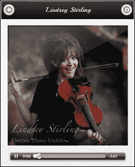
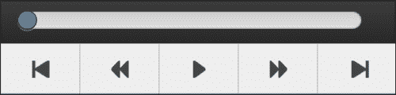
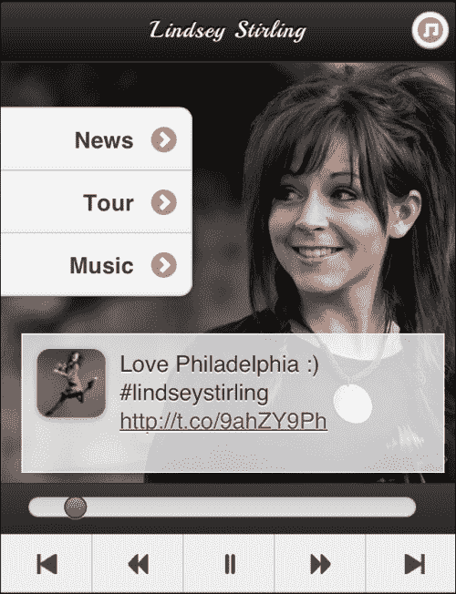
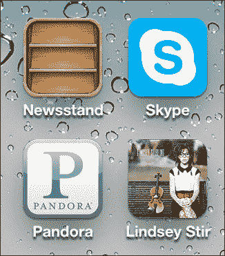

# 六、HTML5 音频

让我们把我们学到的东西带到音乐现场。我们将把 jQuery 移动界面变成一个媒体播放器、艺术家展示和信息中心，可以保存到人们的主屏幕上。

在本章中，我们将介绍：

*   HTML5 音频（渐进增强方式）
*   固定位置，持久工具栏（真的！？）
*   用于 HTML5 音频的自定义 JavaScript 控件
*   iOS 中的 HTML5 音频及其不同之处
*   一体式解决方案（多页实用）
*   使用 HTML5 清单保存到主屏幕

# HTML5 音频

向林赛·斯特林问好。林赛在《美国达人》第五季突然出现。你见过小提琴手*摇滚*吗？自从她在国家舞台上亮相以来，她就一直在 YouTube 上大放异彩，每段视频的浏览量达数百万次。2012 年 9 月 18 日，她发行了第一张同名专辑。本章将围绕她的音乐和数字表现向歌迷致敬。如果您想要完整体验，请访问她的 YouTube 频道[http://youtube.com/lindseystomp](http://youtube.com/lindseystomp) 。她的 200 万订户不会错的！



现在，回到正题上来。正如我们所看到的，jQuery Mobile 让一切变得简单。你几乎要把事情弄复杂。HTML5 音频可以像你想要的那样复杂，我们会做到的。现在，让我们看看将音频引入 jQuery 移动页面有多么简单。考虑下面的代码片段：

```js
<audio id="audio" controls>                     
  <source src="audio/electricdaisy.mp3" type="audio/mpeg" />
  <source src="audio/electricdaisy.ogg" type="audio/ogg" />
   Your browser is so old that you can't hear the music.
</audio>
```

就这样。这就是在前一张图片中获得音乐控制条所需的全部。让我们把它分解一下。

就像[第 4 章](04.html "Chapter 4. QR Codes, Geolocation, Google Maps API, and HTML5 Video")、*二维码、地理定位、谷歌地图 API 和 HTML5 视频*中的视频一样，`audio`标签可以支持多个源，浏览器只需选择它知道如何处理的第一个源。较旧的浏览器不知道该做什么，只会像 XML 一样解析，这意味着只会显示文本，“你的浏览器太旧了，你听不到音乐。”

每个浏览器都提供自己的本机界面来控制音频。有些像你刚才看到的 iOS 版本一样小巧闪亮，有些则非常难看，但更实用，比如 Android。不管怎样，它们都留下了一些不尽如人意的地方，所以让我们把 jQuery Mobile 变成一个媒体播放器。

这是我们的基本起始页。您可以在代码文件中的`electricdaisy_basic.html`中找到此代码的来源：

```js
<!DOCTYPE html>  
<html>  
  <head> 
    <meta charset="utf-8">
    <meta name="viewport" content="width=device-width, initial-scale=1, maximum-scale=1.0, user-scalable=no">     
    <link href='chapter6.css' rel='stylesheet' type='text/css'> 
    <title>Lindsey Sterling</title>
    <link rel="stylesheet" href="http://code.jquery.com/mobile/1.3.0/jquery.mobile-1.3.0.min.css" />
    <script src="http://code.jquery.com/jquery-1.8.2.min.js"></script>
    <script type="text/javascript" src="js/global.js"></script> 
    <script src="http://code.jquery.com/mobile/1.3.0/jquery.mobile-1.3.0.min.js"></script> 
    <link rel="stylesheet" href="chapter6.css" /> 
  </head>    
<body>      
<div id="electricdaisy" class="songPage" data-role="page" >
  <div data-role="header">
    <a href="basic.html" data-transition="slidedown" data-theme="c" data-icon="home" data-iconpos="notext">Home</a> 
    <h2>Lindsey Sterling</h2>             
    <a class="ui-btn-right" data-transition="slidedown" data-theme="c" href="tracklist.html" data-icon="note" data-iconpos="notext" >Music</a>         
  </div>         
  <div data-role="content">
                 
    <p>                 
      <audio id="audio" controls>
        <source src="audio/electricdaisy.mp3" type="audio/mpeg" />
        <source src="audio/electricdaisy.ogg" type="audio/ogg" />
        Your browser is very old so that you can't hear the music.
      </audio>             
    </p>         
  </div>     
</div> 
</body> 
</html>
```

这个构造良好的 jQuery 移动页面除了美化之外，不需要 JavaScript。您可以关闭 JS，整个页面仍然可以工作并播放音乐。对于所有那些进步增强的粉丝们，我们从正确的角度出发。毕竟，每个人都是音乐迷，而不仅仅是拥有智能手机的人。

现在，让我们看看如何使用 JavaScript 和固定位置工具栏创建更好的控制界面。

# 固定位置持久工具栏（真的！？）

我会诚实的；我对移动空间中的固定位置工具栏的评价普遍较低。从可用性的角度来看，它们是一场灾难。移动屏幕的可用空间很小。浪费那么多的房地产而不为用户提供*强大*利益是不可想象的。此外，由于涉及 CSS，Android 的古老版本（低于 2.3 版）将不支持固定位置工具栏。

<rant>然而，我们一直都能看到它，不是吗？公司将他们的标志贴在一个永远不会消失的顶部工具栏上。他们加入了一个小小的全球导航，并称之为用户的一个好处，而实际上这一切都是为了加强他们的品牌。你可以分辨出来，因为工具栏上唯一的交互部分是一个菜单按钮，可能还有一个搜索按钮（好像我们无法在顶部再次找到它们）。有许多更好的技术可以提供全球导航。</rant>



今天，我们有一个有效的使用这些酒吧。我们将在它们中设置音乐控件，这些控件将在我们转换曲目时保持不变。如果我们做得好，这个音乐网站将感觉更像一个应用程序，让用户不断控制来自他们设备的声音。

如果您已经使用过 JQMUI 的这一部分，现在跳到下一段。

使工具栏固定（滚动时不移动）和持久（更改页面时不移动）非常简单。您所要做的就是添加`data-position="fixed"`使其固定，并将`data-id="whatever"`添加到页面上的页脚上，在页面转换时，希望页脚保持静止。此功能也适用于标题。

以下是我们持久页脚的基础：

```js
<div class="jsShow playcontrols" data-role="footer" data-id="playcontrols" data-position="fixed">         
  <div class="progressContainer">
    <input  data-theme="b" data-track-theme="c" class="progressBar" type="range" name="slider-1"  value="0" min="0" max="227" data-mini="true"/></div>         
  <div data-role="navbar" class="playcontrols">             
    <ul>                 
      <li><a data-theme="c" title="skip back" class="skipback" href="#crystallize" data-direction="reverse"></a></li>                     
      <li><a data-theme="c" title="seek back" class="seekback" href="javascript://"></a></li>                     
      <li><a data-theme="c" title="play/pause" class="play" href="javascript://"></a></li>                     
      <li><a data-theme="c" title="seek forward" class="seek" href="javascript://"></a></li>                     
      <li><a data-theme="c" title="skip forward" class="skip" href="#shadows"></a></li>
      </li>             
    </ul>         
  </div>     
</div> 
```

看到页脚上方的类（`jsShow`了吗？让我们在`audio`标记周围的段落中添加另一个类（`jsHide`）：

```js
<p class="jsHide">                 
  <audio id="audio" controls>                     
…            
</p>
```

在 CSS 中，让我们添加以下规则：

```js
.js .jsHide{display:none} 
.no-js .jsShow{display:none;}
```

然后，我们将在`global.js`文件中添加一行，以将整个内容整合在一起：

```js
$("html").removeClass("no-js").addClass("js");
```

这是 HTML5 样板文件（[中使用的一种技术 http://html5boilerplate.com/](http://html5boilerplate.com/) 和现代化（[http://modernizr.com/](http://modernizr.com/) ）。如果你还没有看过这两个奇迹，那是值得你花时间的。长话短说，我们现在有了一种简便、轻量级的处理渐进增强的方法。语音辅助也适用于需要帮助的人。

我们现在非常接近于为媒体播放器提供一个很好的通用 UI，但是如果您一直在输入，您会注意到输入`type="range"`显示一个文本框。就其本身而言，这可能不会太令人反感，但 HTML5 音频以秒为单位跟踪其当前位置的事实使得它作为显示元素非常无用。因此，让我们隐藏它，并使用一些简单的 CSS 稍微扩展该栏：

```js
input.progressBar{display:none} 
div.ui-slider{width:90%;}  
```

现在，我们看起来不错，让我们把它连接起来，让它工作起来。

# 用 JavaScript 控制 HTML5 音频

好吧，现在我们开始使用 JavaScript 来处理一些问题。

首先，我们设置一个间隔来更新进度条。它必须有两个功能，显示当前时间和更改时间。我们将首先添加对这些对象的引用，并为我们可能要附加到的每个音频事件放置事件挂钩。注释描述了在以下情况下触发的事件：

```js
//for every song page 
$(document).on("pagecreate", ".songPage", function(){ 
  var $page = $(this);	
  var $currentAudio = $page.find("audio");

  //set references to the playing status, progress bar, and 
  //progress interval on the audio object itself 
  $currentAudio.data("playing",false) 
    .data("progressBar", $page.find("input.progressBar")).data("progressThread",null); 

  //loadstart and progress occur with autoload
  $currentAudio[0].addEventListener('loadstart', function(){ 
    //Fires when the browser starts looking 
    //for the audio/video
  }, false);

  $currentAudio[0].addEventListener('progress', function(){ 
    //Fires when the browser is downloading the audio/video
    //This will fire multiple times until the source 
    //is fully loaded.
  }, false); 

  //durationchange, loadedmetadata, loadeddata, canplay, 
  //canplaythrough are kicked off upon pressing play 
  $currentAudio[0].addEventListener('durationchange', 
  function(){ 
    //Fires when the duration of the audio/video is changed 

  }, false); 

  $currentAudio[0].addEventListener('loadedmetadata', 
  function(){
    //Fires when the browser has loaded meta data 
    //for the audio/video 

  }, false); 

  $currentAudio[0].addEventListener('loadeddata', function(){ 
    //Fires when the browser has loaded the current 
    //frame of the audio/video 

  }, false);

  $currentAudio[0].addEventListener('canplay', function(){  
    //Fires when the browser can start playing 
    //the audio/video 	

  }, false); 

  $currentAudio[0].addEventListener('canplaythrough', 
  function(){ 
    //Fires when the browser can play through the audio/video 
    //without stopping for buffering 

  }, false); 

  $currentAudio[0].addEventListener('ended', function(){ 
    //Fires when the current playlist is ended 

  }, false); 

  $currentAudio[0].addEventListener('error', function(){ 
    //Fires when an error occurred during the loading 
    //of an audio/video 

  }, true);  

}); 
```

现在，让我们创建将运行间隔的函数：

```js
function scrubberUpdateInterval(){ 

  //Grab the current page 
  var $page = $.mobile.activePage; 

  //Grab the audio element 
  var $audio = $page.find("audio"); 
  var currentAudio = $audio[0]; 

  //Grab the progress monitor and the handle 
  currentAudioProgress = $page.find("input.progressBar"); 
  scrubberHandle = currentAudioProgress
    .closest(".progressContainer")
    .find("a.ui-slider-handle"); 

  //Is the user currently touching the bar? 	
  if(scrubberHandle.hasClass("ui-focus")){ 
    //Pause it if it's not paused already 
    if(!currentAudio.paused){  
      currentAudio.pause(); 
    } 

    //Find the last scrubber's last position 
    var lastScrubPosition = currentAudioProgress
      .data("lastScrubPosition"); 
    if(lastScrubPosition == null) lastScrubPosition = 0; 
    //Are we in the same place as we were last? 
    if(Math.floor(lastScrubPosition) == 
    Math.floor(currentAudio.currentTime)){ 
      var lastScrubUnchangedCount = currentAudioProgress
       .data("lastScrubUnchangedCount");
      //If the user held still for 3 or more cycles of the 
      //interval, resume playing  
      if(++lastScrubUnchangedCount >= 2){ 
        scrubberHandle.removeClass("ui-focus"); 
        currentAudioProgress 
          .data("lastScrubUnchangedCount", 0); 
        currentAudio.play(); 
      }else{ 
        //increment the unchanged counter 
        currentAudioProgress.data("lastScrubUnchangedCount", 
        lastScrubUnchangedCount); 
      } 
    }else{ 
      //set the unchanged counter to 0 since we're not in the 
      //same place 
      currentAudioProgress
        .data("lastScrubUnchangedCount", 0); 
    } 

    //set the last scrubbed position on the scrubber 
    currentAudioProgress.data("lastScrubPosition", 
      Number(currentAudioProgress.val())); 
    //set the current time of the audio 
    currentAudio.currentTime = currentAudioProgress.val(); 
  }else{ 
    //The user is not touching the scrubber, just update the 
    //position of the handle 
    currentAudioProgress
      .val(currentAudio.currentTime)
      .slider('refresh');  
  } 
}  
```

现在，我们将在单击播放按钮时，将从间隔中启动，并执行其他必要的操作。一如往常，一切都得到了很好的评价：

```js
$(document).on('vclick', "a.play", function(){ 
  try{ 
    var $page = $.mobile.activePage; 
    var $audio = $page.find("audio"); 

    //toggle playing 
    $audio.data("playing",!$audio.data("playing")); 
    //if we should now be playing 
    if($audio.data("playing")) { 

      //play the audio 
      $audio[0].play(); 

      //switch the playing image for pause 
      $page.find("img.playPauseImage")
        .attr("src","images/xtras-gray/48-pause@2x.png"); 
      //kick off the progress interval 
      $audio.data("progressThread",  
        setInterval(scrubberUpdateInterval, 750)); 
    }else{
      //pause the audio 
      $audio[0].pause(); 

      //switch the pause image for the playing audio 
$page.find("img.playPauseImage")
        .attr("src","images/xtras-gray/49-play@2x.png");
      //stop the progress interval
      clearInterval($audio.data("progressThread")); 				
    } 
  }catch(e){alert(e)}; 
});
```

设置寻道控制：

```js
$(document).on('click', "a.seekback", function(){
  $.mobile.activePage.find("audio")[0].currentTime -= 5.0; 
}); 

$(document).on('vclick', "a.seek", function(){
  $.mobile.activePage.find("audio")[0].currentTime += 5.0; 
}); 
```

现在，让我们创建一个 JSON 对象来跟踪当前状态和跟踪列表：

```js
var media = { 
  "currentTrack":0, 
  "random":false, 
  "tracklist":[ 
    "electricdaisy.html", 
    "comewithus.html", 
    "crystallize.html",
    "shadows.html", 
    "skyrim.html" 
  ] 
}
```

接下来是“向后跳”和“向前跳”按钮。我们可以设置“随机”按钮，但现在我们将跳过它：

```js
$(document).on('vclick', "a.skipback", function(event){ 
  //grab the current audio 
  var currentAudio = $.mobile.activePage.find("audio")[0]; 
  //if we're more than 5 seconds into the song, skip back to 
  //the beginning 
  if(currentAudio.currentTime > 5){ 
    currentAudio.currentTime = 0; 
  }else{ 
    //otherwise, change to the previous track 
    media.currentTrack--; 
    if(media.currentTrack < 0) media.currentTrack = 
      (media.tracklist.length - 1); 
    $.mobile.changePage("#"+media.tracklist[currentTrack]);
  } 
}); 

$(document).on("vclick", "a.skip", function(event){ 
  //grab the current audio and switch to the next track 
  var currentAudio = $.mobile.activePage.find("audio")[0]; 
  media.currentTrack++; 
  if(media.currentTrack >= media.tracklist.length) 
  media.currentTrack = 0; 
  $.mobile.changePage("#"+media.tracklist[currentTrack]); 
}); 
```

### 提示

**业绩说明**

注意我是如何从使用`click`事件转移到使用`vclick`事件的。`vclick`事件是 jQuery Mobile 中的一个自定义事件，它试图弥合单击（基于桌面的事件）和点击/触摸启动（基于触摸的事件）之间的性能差距。这两者之间通常有 300 毫秒的间隔，而哪种浏览器支持这一点一直是一件很难弄清楚的事情。通过使用`vclick`您仍然可以支持桌面和触摸设备，但您有望实现轻微的性能提升。有关这方面的更多信息，请查看 jQuery 移动贡献者之一 John Bender 在[的博客文章 https://coderwall.com/p/bdxjzg](https://coderwall.com/p/bdxjzg) 。

# iOS 中的 HTML5 音频不同

了解 HTML5 音频的事件周期对于使其正常工作至关重要。当您开始在 jQuery Mobile 的奇数事件周期中进行混合时，这可能会变得特别混乱。再加上一系列令人困惑的资源限制，每个设备都会有所不同，这就造成了真正的困惑。

作为一种快速简便的测试移动网站的方法，你通常可以打开谷歌 Chrome（自其 WebKit）或 IE9（适用于 Windows Phone）并将其缩小到手机大小。当然，这不能代替真正的测试。始终在真实设备上检查您的创作。这就是说，缩小浏览器的方法通常会让你达到 97.5%的效果。好 HTML5 音频将这种操作模式抛到了窗外。

在 iOS 上，即使您已将`audio`标记标记为预加载和自动播放，它也不会。没有抛出错误；没有迹象表明您的编码请求被完全忽略。如果你看一下本章中包含的代码，你会在`basicPlayer.js`脚本中看到我在努力实现这一点的过程中加入了多少 try/catch 和 debug 语句，并找出出了什么问题。

从技术上讲，`pageinit`是文档中所说的等同于`document.ready`的事件，但这并不意味着页面实际上是可见的。导致页面显示的事件链的末端是`pageshow`事件。所以，不管怎样，这应该是结束，它应该为你可能想做的任何事情做好准备。此时，您（理论上）应该能够使用 JavaScript 告诉歌曲播放（`.play()`。唉，就是这样不行。您可以通过按下播放按钮来执行与触发音频播放完全相同的功能，甚至可以通过延时将其启动，但没有任何效果。这不是时间问题。iOS 需要直接用户交互才能首次启动音频。*将其直接绑定到点击事件，否则将无法工作。*

# 一体式解决方案（多页实用）

我们现在有了一个完整的播放器，它有一个统一的界面，可以用来管理播放列表。目前唯一真正的问题是网络延迟。即使在这个 4G 和 LTE 的新时代，蜂窝延迟也会变得荒谬可笑。如果你在一个像我这样的地方工作的话，尤其如此，那里的建筑会像斯巴达方阵一样将信号推回。因此，为了给它提供更好的用户体验，我们将放弃逐页的业务。

当我们开始的时候，让我们把我们在前几章中所做的一些事情打包，比如引入 Lindsey 的最新推文和她的博客内容。我们将使用与以前相同的 CSS，但我们将更改其余的 CSS。



开始困扰服务器端和面向对象类型的首要问题之一是您必须重复一段代码的频率。如果存在全局页眉或页脚，这将成为一个真正的问题。那么，让我们创建一个`div`标记来存放通用页脚内容，并创建一个脚本来在正确的时间将其拉入：

```js
<div id="universalPlayerControls" style="display:none">     
  <div class="progressContainer">
    <input  data-theme="b" data-track-theme="c" class="progressBar" type="range" name="slider-1"  value="0" min="0" max="227" data-mini="true"/>
  </div>     
  <div data-role="navbar" class="playcontrols">         
    <ul>             
      <li><a data-theme="c" title="skip back" class="skipback" href="javascript://" data-direction="reverse"></a></li>             
      <li><a data-theme="c" title="seek back" class="seekback" href="javascript://"></a></li>             
      <li><a data-theme="c" title="play/pause" class="play" href="javascript://"></a></li>             
      <li><a data-theme="c" title="seek forward" class="seek" href="javascript://"></a></li>             
      <li><a data-theme="c" title="skip forward" class="skip" href="javascript://"></a></li>         
    </ul>     
  </div> 
</div>
```

现在，对于希望在页脚中包含这些控件的任何页面加载，我们只需在页面被 jQM 标记之前将这些内容复制到页脚中：

```js
$(document).on("pagebeforecreate", function(){ 
  $(this).find("div[data-id='playcontrols']")
    .html($("#universalPlayerControls").html());
});
```

最后，是时候把每一首歌的页面，并使其充满活力。我们删除单个音频元素，并在“页面”的数据属性中简单地链接到它们。页脚消失，取而代之的是空页脚，准备注入控件：

```js
<div id="electricdaisy" class="songPage" data-role="page" data-mp3="audio/electricdaisy.mp3" data-ogg="audio/electricdaisy.ogg"> 
  <div data-role="header">
    <a href="#home" data-theme="c" data-icon="home" data-iconpos="notext">Home</a>
    <h2>Electric Daisy</h2>
    <a class="ui-btn-right" data-theme="c" href="#tracklist" data-icon="note" data-iconpos="notext" >Music</a>
  </div>         
  <div data-role="content">         
    
  </div>          
  <div data-role="footer" data-id="playcontrols" data-position="fixed"></div> 
</div>
```

所有这些都需要我们改进 JavaScript。一些片段将保持不变，但由于我们只使用了一个音频元素，因此代码可以简化。以下是 Packt 发布网站上代码包的`index.html`文件中的一体机版本的最终源代码：

```js
<!DOCTYPE html>  
<html>  
<head> 
  <meta charset="utf-8"> 
  <meta name="viewport" content="width=device-width, initial-scale=1, maximum-scale=1.0, user-scalable=no">     
  <link href='http://fonts.googleapis.com/css?family=Playball' rel='stylesheet' type='text/css'> 
  <title>Lindsey Stirling</title>  
  <link rel="stylesheet" href="jquery.mobile-1.2.0-rc.1.min.css" /> 	
  <script src="js/jquery-1.7.2.min.js"></script>     
  <script type="text/javascript"> 
    $(document).bind("mobileinit", function(){ 
      $.mobile.defaultPageTransition = "slide"; 
    }); 
  </script> 
  <script src="js/jquery.mobile-1.2.0-rc.1.min.js"></script>     
  <script type="text/javascript"
src="js/jsrender.min.js"></script>     
  <link rel="stylesheet" href="chapter6.css" /> 
</head>    
<body id="body">
```

排除了所有常见的障碍，以下是体验的第一页：

```js
  <div id="home" data-role="page" 
    data-mp3="audio/electricdaisy.mp3" 
    data-ogg="audio/electricdaisy.ogg"> 	

    <div data-role="header">
      <h1>Lindsey Stirling</h1>
      <a class="ui-btn-right" data-theme="c" href="#tracklist" data-icon="note" data-iconpos="notext" >Music</a>
    </div>     

    <div data-role="content"> 
      <ul id="homemenu" data-role="listview" data-inset="true"> 
        <li><a href="#news">News</a></li>
        <li><a href="#tour">Tour</a></li>
        <li><a href="#comewithus">Music</a></li>  
      </ul>
      <div id="twitterFeed">
        <ul class="curl"></ul>
      </div>     
    </div>     

    <div data-role="footer" data-id="playcontrols" data-position="fixed">
    </div> 

  </div>  

  <div data-role="page" id="news"> 
    <div data-role="header">
      <a href="#home" data-theme="c" data-icon="home" data-iconpos="notext">Home</a>
      <h2>News/Blog</h2>
    </div>      

    <div data-role="content"></div> 
  </div>  
```

以下页面列出了所有可供预览的曲目：

```js
  <div id="tracklist" data-role="page">  
    <div data-role="header">
      <a href="#home" data-theme="c" data-icon="home" data-iconpos="notext">Home</a>
      <h2>Track List</h2>
    </div>        

     

    <div data-role="content"> 
       <ul data-role="listview"> 
         <li><a class="trackListLink" href="#electricdaisy">Electric Daisy</a></li> 
         <li><a class="trackListLink" href="#shadows">Shadows</a></li>
         <li><a class="trackListLink" href="#comewithus">Come With Us feat. CSWS</a></li>
         <li><a class="trackListLink" href="#skyrim">Skyrim</a></li>
         <li><a class="trackListLink" href="#crystallize">Crystallize</a></li>
      </ul>     
    </div> 
  </div>  
```

以下是单曲页面。我没有包括每一首歌的页面，因为那只是浪费页面。你会明白这是怎么回事。请注意，每个页面都有具有相同`data-id`属性的页脚。以下内容允许页脚在歌曲之间切换时保持原位：

```js
  <div id="shadows" class="songPage" data-role="page" 
    data-mp3="audio/shadows.mp3" 
    data-ogg="audio/shadows.ogg" >  
    <div data-role="header">
      <a href="#home" data-theme="c" data-icon="home" data-iconpos="notext">Home</a>
      <h2>Shadows</h2>
      <a class="ui-btn-right" data-theme="c" href="#tracklist" data-icon="note" data-iconpos="notext" >Music</a>
    </div>         

    <div data-role="content">         
           
    </div>          

    <div data-role="footer" data-id="playcontrols" data-position="fixed"></div> 
  </div>  

  <div id="crystallize" class="songPage" data-role="page" 
    data-mp3="audio/crystallize.mp3" 
    data-ogg="audio/crystallize.ogg">  
    <div data-role="header">
      <a href="#home" data-theme="c" data-icon="home" data-iconpos="notext">Home</a>
      <h2>Crystallize</h2>
      <a class="ui-btn-right" data-theme="c" href="#tracklist" data-icon="note" data-iconpos="notext" >Music</a>
    </div>         

    <div data-role="content">         
       
    </div>          

    <div data-role="footer" data-id="playcontrols" data-position="fixed"></div> 
  </div>  

  <div id="electricdaisy" class="songPage" data-role="page" 
    data-mp3="audio/electricdaisy.mp3" 
    data-ogg="audio/electricdaisy.ogg">  
    <div data-role="header">
      <a href="#home" data-theme="c" data-icon="home" data-iconpos="notext">Home</a>
      <h2>Electric Daisy</h2>
      <a class="ui-btn-right" data-theme="c" href="#tracklist" data-icon="note" data-iconpos="notext" >Music</a>
    </div>

    <div data-role="content">
       
    </div>          

    <div data-role="footer" data-id="playcontrols" data-position="fixed"></div> 
  </div>  
```

这部分不是页。隐藏的主控件将导入播放歌曲的每个页面：

```js
  <div id="universalPlayerControls" style="display:none">     
    <div class="progressContainer">
      <input  data-theme="b" data-track-theme="c" class="progressBar" type="range" name="slider-1"  value="0" min="0" max="227" data-mini="true"/>
    </div>     
    <div data-role="navbar" class="playcontrols">         
      <ul>             
        <li><a data-theme="c" title="skip back" class="skipback" href="javascript://" data-direction="reverse"></a></li>             
        <li><a data-theme="c" title="seek back" class="seekback" href="javascript://"></a></li>
        <li><a data-theme="c" title="play/pause" class="play" href="javascript://"></a></li>
        <li><a data-theme="c" title="seek forward" class="seek" href="javascript://"></a></li>
        <li><a data-theme="c" title="skip forward" class="skip" href="javascript://"></a></li>
      </ul>     
    </div> 
  </div>  

  <div style="display:none;">     
    <audio id="audio" controls></audio>     
  </div>  
```

以下代码是呈现导入博客内容的模板：

```js
  <script type="text/x-jsrender" id="googleFeedTemplate"> 
    <ul class="curl"> 
      {{for entries}} 	
        <li> 
          <h3 class="ul-li-heading">{{:title}}</h3> 
          <p>{{:publishedDate}}<br>{{:content}}</p> 
        </li> 
      {{/for}} 
    </ul> 
  </script> 
```

以下代码是呈现 Twitter 提要的模板：

```js
  <script type="text/x-jsrender" id="twitterTemplate"> 
    <li class="twitterItem"> 
      
      <p>{{:text}}</p> 
    </li> 
  </script> 

  <script type="text/javascript"> 
    var media = { 
      "playing":false, 
      "debug":true,
      "currentTrack":0, 
      "random":false,
      "tracklist":[
        "#electricdaisy",
        "#comewithus",
        "#crystallize",
        "#shadows",
        "#skyrim"
      ] 
    } 

    //a handy little debug function
    var lastDebugTS = (new Date).getTime(); 	
    function debug(str){  
    try{ 
        if(media.debug){ 
          $.mobile.activePage.find("div[data-role='content']")
            .append(""+((new Date()).getTime()-lastDebugTS)+": "+str+"<br/>"); 
          lastDebugTS = (new Date).getTime();} 
      }catch(e){} 
    }   

    //grab the audio and control elements with global 
    //variables since everything is going to use them 
    var currentAudio = $("#audio")[0]; 
    var currentAudioProgress = null; 
    var scrubberHandle = null; 
    var scrubberUpdateSpeed = 750; 
    var progressThread = null; 

    //The ended and durationchange are the only events we 
    //really care about  
    currentAudio.addEventListener('ended', 
      function(){
        $.mobile.activePage.find(".skip").click()
      }, false); currentAudio.addEventListener('durationchange', 
     function(){   
       currentAudioProgress.attr('max',currentAudio.duration)
        .slider("refresh"); 
     }); 

   //On the home page 	
   $("#home").live('pagebeforeshow', function(){ 
     var $page = $(this); 

     //bring in the latest tweet 
$.ajax({url:"http://api.twitter.com/1/statuses/user_timeline.json?screen_name="+escape("LindseyStirling"),  
       dataType:"jsonp", 
       success: function(data) { 
         try{ 
           //parse out any hyperlinks and twitter IDs and turn 
           //them into links 
           var words = data[0].text.split(" "); 
           var newMessage = ""; 
           for(var x = 0; x < words.length; x++){
           var word = words[x]; 
             if(word.indexOf("http") == 0){ 	
               newMessage += "<a href='"+word+"' target='_blank'>"+word+"</a>"; 
             }else if(word.match(/@[a-zA-Z0-9_]*/)){ 
       newMessage += "<a href='http://twitter.com/"+word.substring(1)+"' target='_blank'>"+word+"</a> "; 
             }else{
               newMessage += word+" "; 
             } 
           } 
           data[0].text = newMessage;  
         }catch(e){} 

         //use jsRender to display the message 
        $("#twitterFeed ul")
          .html($("#twitterTemplate")
          .render(data[0])); 
      } 
    }); 

    //if we're not currently playing anything, preload audio 
    //as specified by the page's data- attributes 
    if(!media.playing) { 

      //load MP3 by default   
      if(currentAudio.canPlayType("audio/mpeg")){
         currentAudio.src = $page.attr("data-mp3");
      } 

      //load Ogg for all those purists out there 
      else{ currentAudio.src = $page.attr("data-ogg");} 
      //make it load 
      currentAudio.load();

      //set the progres bar
      currentAudioProgress = $page.find("input.progressBar"); 
      //set the scrubber handle 
      scrubberHandle = currentAudioProgress
        .closest(".progressContainer")
        .find("a.ui-slider-handle"); 
    } 
  });  

  //on the news page 
  $("#news").live('pageshow', function(){ 
    //This import can take a while, show the loading message 
  $.mobile.loading( 'show', {           
      text: "Loading Blog Content",           
      textVisible: true         
    });

    //load the actual content 
    $.ajax({ 
  url:"https://ajax.googleapis.com/ajax/services/feed/load?v=1.0&output=json&q="+escape("http://lindseystirlingviolin.com/feed"),  
      dataType:"jsonp", 
      success: function(data) { 
        //use a jsRender template to format the blog 
        $("#news .ui-content")
          .html($("#googleFeedTemplate")
          .render(data.responseData.feed)); 	   
        //for every image in the news feed, make its width 
        //dynamic with a max width or its original size
        $("#news img").each(function(index, element) { 
         var $img = $(element); 

          //figure out its currentWidth 
          var currentWidth = Number($img.attr("width")); 
          //if it has a width and it's large 
          if(!isNaN(currentWidth) && currentWidth > 300){ 
            //remove the explicit width and height 
     $img.removeAttr("width").removeAttr("height"); 
            //make the image scale to the width 
         //of its container but never to be  
         //larger than its original size 
            $img.css({"max-width":currentWidth+"px","width":"100%"}); 
          } 
        });

        //hide the loading   
        $.mobile.loading("hide");
      }
    });
  }); 

  function setCurrentMediaSources(){ 
    var $page = $.mobile.activePage; 

    //set the audio to whatever is playable 	
    var playableSource = $page.attr("data-mp3"); 
    if(!currentAudio.canPlayType("audio/mpeg")){
      playableSource = $page.attr("data-ogg");
    }
    //set the progress bar and scrubber handles 
    currentAudioProgress = $page.find("input.progressBar"); 
  scrubberHandle = currentAudioProgress
      .closest(".progressContainer")
      .find("a.ui-slider-handle"); 

    //change the source and load it.  
    currentAudio.src = playableSource; 
    currentAudio.load(); 

    //if we're currently play, continue playing 
    if(media.playing){ 
      currentAudio.play(); 
      progressThread = setInterval(scrubberUpdateThread, scrubberUpdateSpeed); 	
    } 
  } 

  $(".songPage").live("pageshow", setCurrentMediaSources); 

  $("[data-role='page']").live("pagebeforecreate", 
  function(){ 
    $(this).find("div[data-id='playcontrols']")
      .html($("#universalPlayerControls").html());
  }); 

  function scrubberUpdateThread(){ 
    //if the scrubber has focus, the scrubber becomes 
    //input instead of status display 
    if(scrubberHandle.hasClass("ui-focus")){ 

    //pause the music for now 
    if(!currentAudio.paused){  
      currentAudio.pause(); 
    } 

    //grab the last position to see if we've moved 
    var lastScrubPosition = 
      currentAudioProgress.data("lastScrubPosition"); 
    if(lastScrubPosition == null) lastScrubPosition = 0; 
    //if the user hasn't scrubbed  
    if(Math.floor(lastScrubPosition) == Math.floor(currentAudio.currentTime)){ 
      var lastScrubUnchangedCount = 
      currentAudioProgress.data("lastScrubUnchangedCount"); 
      if(++lastScrubUnchangedCount >= 2){ 
  //since it's been 3 cycles that we haven't moved, 
        //remove the focus and play
        scrubberHandle.removeClass("ui-focus"); 
        currentAudioProgress.data("lastScrubUnchangedCount", 0); 
        currentAudio.play(); 
      }else{ 

        //store the the current position counter 
        currentAudioProgress.data("lastScrubUnchangedCount", lastScrubUnchangedCount); 
      } 
    }else{ 
      //reset the current position counter 
      currentAudioProgress.data("lastScrubUnchangedCount", 0); 
    } 

    //set the position of the scrubber and the currentTime 
    //position of the song itself  
    currentAudioProgress.data("lastScrubPosition", 
      Number(currentAudioProgress.val())); 
    currentAudio.currentTime = currentAudioProgress.val(); 
  }else{ 
    //update the progress scrubber  
    currentAudioProgress.val(currentAudio.currentTime)
     .slider('refresh');  
  } 
} 

//play button controls
$("a.play").live('click',function(){ 
  try{ 
    //toggle the playing status 
    media.playing = !media.playing; 

    //if we're supposed to playing.. 
    if(media.playing) { 

      //do it and set the interval to watch 	
      currentAudio.play(); 
      progressThread = setInterval(scrubberUpdateThread, scrubberUpdateSpeed); 	

      //switch the playing image for pause 
      $("img.playPauseImage").attr("src","images/xtras-gray/48-pause@2x.png"); 
    }else{ 

      //pause the audio and clear the interval 
      currentAudio.pause(); 

      //switch the pause image for the playing audio 
     $("img.playPauseImage").attr("src","images/xtras-gray/49-play@2x.png"); 

      //kill the progress interval  
      clearInterval(progressThread); 
    } 
  }catch(e){alert(e)}; 
}); 

$("a.seekback").live('click',function(){ 
  //back 5 seconds 
  currentAudio.currentTime -= 5.0; 
}); 

$("a.seek").live('click',function(){ 
  //forward 5 seconds 	
  currentAudio.currentTime += 5.0; 
}); 

$("a.skipback").live('click',function(event){
  //if we're more than 5 seconds into the song, skip 
  //back to the beginning 
  if(currentAudio.currentTime > 5){ 
    currentAudio.currentTime = 0; 
  }else{ 
    //othewise, change to the previous track 
    media.currentTrack--; 
    if(media.currentTrack < 0) media.currentTrack = (media.tracklist.length - 1); 

    $.mobile.changePage(media.tracklist[media.currentTrack],
    {
       transition: "slide", 
       reverse: true 
    }); 
  } 
}); 

$("a.skip").live('click',function(event){ 
  //pause the audio and reset the time to 0 	
  currentAudio.currentTime = 0; 

  //change to the next track 
  media.currentTrack++; 
  if(media.currentTrack >= media.tracklist.length) media.currentTrack = 0; 

  $.mobile.changePage(media.tracklist[media.currentTrack]); 
}); 
</script> 
</body> 
</html>
```

将所有这些功能整合到一个巨大的多页面应用程序中，您将感受到界面的黄油般光滑。我们在这个文件中使用的 CSS 与在独立歌曲文件中使用的完全相同。

# 使用 HTML5 清单保存到主屏幕

权力越大，责任越大。这是一个强大的功能。如果您正确地利用 HTML5 清单和其他一些元标记，您的应用程序将成为一个全屏、无 chrome 的应用程序。



要使您的应用程序保存下来并作为全屏应用程序启动，您需要在主屏幕上显示图标。它们将是 144、114、72 和 57 像素的正方形。像这样链接到它们：

```js
<link rel="apple-touch-icon-precomposed" sizes="144x144" href="images/album144.png">     
<link rel="apple-touch-icon-precomposed" sizes="114x114" href="images/album114.png">     
<link rel="apple-touch-icon-precomposed" sizes="72x72" href="images/album72.png">     
<link rel="apple-touch-icon-precomposed" href="images/album57.png">     
<link rel="shortcut icon" href="iimg/album144.png">  
```

用户的导航按钮可以在 iOS 上消失。请注意，如果您选择这样做，您需要在应用程序中提供完整导航。这意味着您可能需要添加一个后退按钮。如果要使应用程序全屏运行，请使用以下标记：

```js
<meta name="apple-mobile-web-app-capable" content="yes">     
<meta name="apple-mobile-web-app-status-bar-style" content="black"> 
```

为了在脱机模式下使该内容可用，我们将使用清单。清单使用应用程序缓存存储资产。你能储存多少是有限制的。这在不同的设备上有所不同，但可能小于 25MB。按要保存的优先级顺序列出要保存的内容。有关所有舱单可以做什么的完整分类，请查看[http://www.html5rocks.com/en/tutorials/appcache/beginner/](http://www.html5rocks.com/en/tutorials/appcache/beginner/) 。

这是我们舱单的内容。保存在`app.manifest`下：

```js
CACHE MANIFEST
# 2012-09-21:v1
js/jquery-1.7.2.min.js
js/jquery.mobile-1.2.0-rc.1.min.js
js/global.js
js/jsrender.min.js

audio/shadows.mp3
audio/comewithus.mp3
audio/skyrim.mp3
audio/electricdaisy.mp3
audio/crystallize.mp3

jquery.mobile-1.2.0-rc.1.min.css
chapter6.css

images/xtras-gray/sg_skip.png
images/xtras-gray/sg_skip@2x.png
images/xtras-gray/sg_skipback.png
images/xtras-gray/sg_skipback@2x.png
images/xtras-gray/sg_ff.png
images/xtras-gray/sg_ff@2x.png
images/xtras-gray/sg_rw.png
images/xtras-gray/sg_rw@2x.png
images/xtras-gray/48-pause.png
images/xtras-gray/48-pause@2x.png
images/xtras-gray/49-play.png
images/xtras-gray/49-play@2x.png
images/ajax-loader.gif
images/comewithus.jpg
images/crystallize.jpg
images/electricdaisy.jpg
images/shadows.jpg
images/skyrim.jpg
images/wallpaper.jpg
images/cork.jpeg
images/icons-18-black.png
images/icons-18-white.png
images/icons-36-black.png
images/icons-36-white.png
images/note18.png
images/note36.png
```

要使用清单文件，您的 web 服务器或`.htaccess`必须配置为返回`text/cache-manifest`类型。在 HTML 文件中，您只需将其作为属性添加到`html`标记本身，如下所示：

```js
<html manifest="app.manifest">
```

如果要清除缓存，始终可以通过浏览器设置进行清除。您还可以使用 JavaScript 控制缓存。如果你真的想深入研究的话，我链接到的前一篇文章提供了大量的细节。

# 总结

这是一个充实的章节，尽管它的开头过于简单。但是，您现在几乎了解了将 HTML5 音频与 jQuery Mobile 相结合的所有内容。您可以创建精彩的学术、逐步增强的页面，甚至可以制作复杂的应用程序保存到设备中。如果这一章没有吓跑你，你真的可以开始制作一些强大的移动媒体网站。本章唯一真正可以使用的是艺术家和场地的图片画廊。但是，别担心；我们将在下一章中探讨这一点，我们将为照片师创建一个展示区。