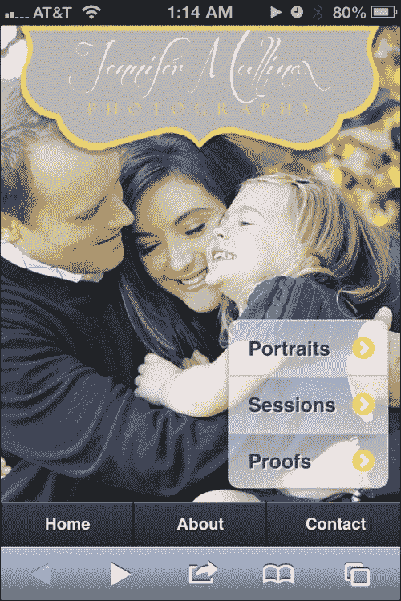
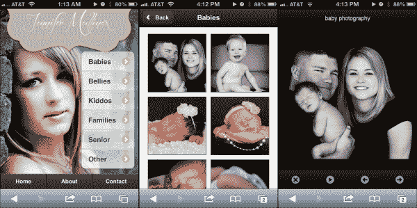
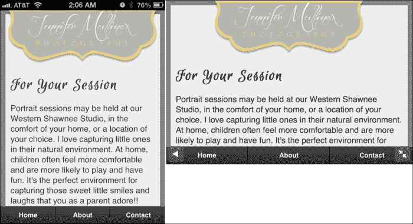
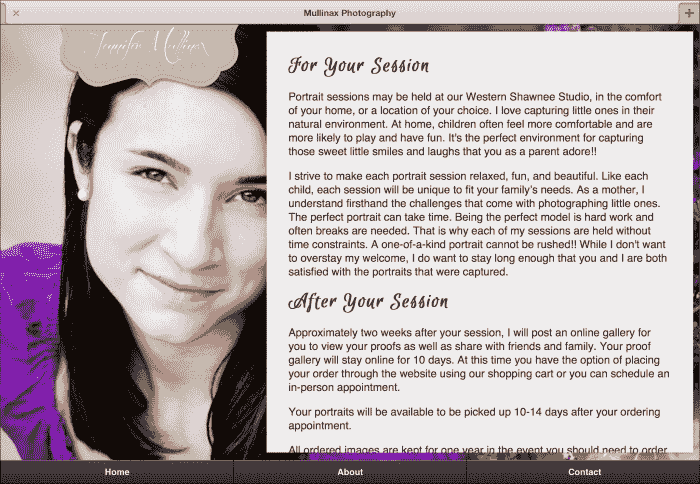
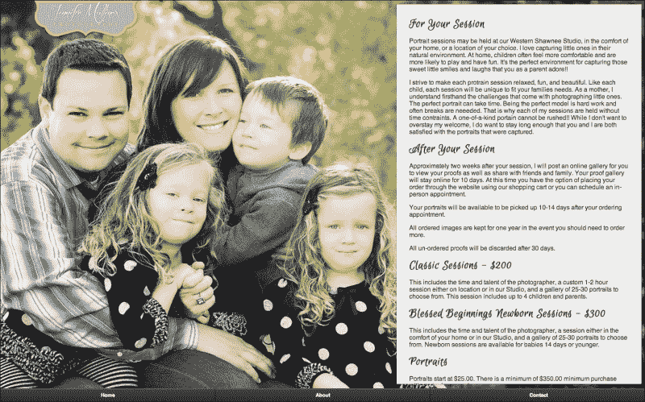

# 七、全响应式照片

我们的手机正迅速成为我们的相册。照片师代表了一个尚未开发的移动网络开发市场。但如果你仔细想想，这个市场应该是第一个适应移动世界的市场。随着发达国家智能手机的饱和，智能手机上的电子邮件打开率正在迅速接近 40%，当你读到这篇文章时可能已经达到了这一水平（[http://www.emailmonday.com/mobile-email-usage-statistics](http://www.emailmonday.com/mobile-email-usage-statistics) ）。

当你收到你的照片师发来的电子邮件，说你的照片已经准备好观看时，你是不是太激动了，以至于试图立即观看它们？然而，仍有许多照片大师没有能够满足新的移动需求的网站：



因此，我们将在本章中介绍以下内容：

*   使用 Photosweep 创建基本图库
*   支持各种设备尺寸–响应性网页设计
*   响应式设计中的文本可读性
*   仅发送所需内容–RESS

# 使用 Photosweep 创建基本图库

如果你正在寻找一种创建照片库的最快方法，你不会想出比 Photosweep（[更快的解决方案 http://www.photoswipe.com/](http://www.photoswipe.com/) ）。它的重量为 82K，虽然不轻，但它几乎适用于 jQueryMobile 支持的任何 A 级或 B 级。他们的网站说它可以与任何基于 WebKit 的浏览器配合使用。这几乎意味着 iOS、Android 和黑莓。三巨头都被包括在内。但是 Windows Phone 呢？好消息！在那里似乎也很管用。即使关闭 JavaScript，Photosweep 也会优雅地退化为合理的逐页体验。我们可以从头开始，创造一个纯粹的 jQuery 移动体验，但是，真的……为什么？

再一次，我将放弃学术上正确的行为，将 JavaScript 和 CSS 完美地分离到它们自己的文件中，而只是将所有定制的 JavaScript 构建到页面本身中。就本书而言，这更容易。我假设如果你正在读这篇文章，你已经知道如何正确地将事物分开，以及为什么。

让我们从基础开始。大部分情况下，这是他们网站上的样板，但我们从照片师自己的照片开始：



让我们从`<head>`标签的关键部分开始：

```js
<link rel="stylesheet" href="http://code.jquery.com/mobile/1.3.0/jquery.mobile-1.3.0.min.css" />
<link rel="stylesheet" href="mullinax.min.css" />
<link rel="stylesheet" href="photoswipe.css" />
<link rel="stylesheet" href="jquery-mobile.css" />

<script src="js/klass.min.js"></script>
<script src="http://code.jquery.com/jquery-1.8.2.min.js"></script>	
<script src="http://code.jquery.com/mobile/1.3.0/jquery.mobile-1.3.0.min.js"></script>
<script src="js/code.photoswipe.jquery-3.0.5.min.js"></script>
<script src="js/code.photoswipe.galleryinit.js"></script>
```

### 注

请注意，我们现在使用的是一个自定义主题，它是由**ThemeRoller**（[构建的 http://jquerymobile.com/themeroller/](http://jquerymobile.com/themeroller/) ）。因此，我们只使用`jquery.mobile.structure-1.2.0.min.css`而不是完整的 jQM CSS。`mullinax.min.css`文件由 ThemeRoller 生成，包含除 CSS 结构之外所需的所有内容。

文件`photoswipe.css`、`jquery-mobile.css`、`klass.min.js`和`code.photoswipe.jquery-3.0.5.min.js`都是 Photosweep 样板文件的一部分。文件名`jquery-mobile.css`有点误导。实际上，它更像是一个适配器样式表，使 Photosweep 在 jQueryMobile 中正常工作和显示。如果没有它，您的图库无序的列表将无法正常显示。起初，这里面没有太多东西：

```js
.gallery { 
list-style: none; 
padding: 0; 
margin: 0; 
} 
.gallery:after { 
clear: both; 
content: "."; 
display: block; 
height: 0; 
visibility: hidden; 
} 
.gallery li { 
float: left; 
width: 33.33333333%;
} 
.gallery li a { 
display: block; 
margin: 5px; 
border: 1px solid #3c3c3c; 
} 
.gallery li img { 
display: block; 
width: 100%; 
height: auto; 
} 
#Gallery1 .ui-content, #Gallery2 .ui-content { 
overflow: hidden; 
}
```

这种设置在 iPhone 或 Android 手机上是可以的，但如果你在任何一种平板电脑或桌面大小的浏览器上查看，图库的缩略图可能会变得非常大。让我们看看我们可以通过一些媒体查询来为它提供一个更具响应性的设计。

# 支持各种设备尺寸–响应性网页设计

**响应式网页设计**（**RWD**）的概念是使单个页面适用于每种设备大小。这意味着，我们谈论的不仅仅是 3.5 英寸屏幕的手机。这只是开始。我们将支持各种尺寸的平板电脑，甚至桌面分辨率。有关 RWD 概念的更多信息，请查看[http://en.wikipedia.org/wiki/Responsive_web_design](http://en.wikipedia.org/wiki/Responsive_web_design) 。

为了使 RWD 工作，让我们基于常用设备和解析断点设置几个断点。首先，我将把默认的库项目大小重新定义为 50%。为什么？当我以肖像模式在智能手机上浏览时，感觉更舒服。这里是断点。让我们把它们放到`chapter7.css`中：

```js
.gallery li { 
float: left; width: 50%; }

/* iPhone Horizontal -------------------*/ 
@media all and (min-width: 480px){ 
.gallery li { width: 33.33333333%; } 
} 

/* iPad Vertical -----------------------*/ 
@media only screen and (min-width: 768px) {
.gallery li { width: 20%; } 
}  

/* iPad Horizontal ---------------------*/ 
@media only screen and (min-width: 1024px) {     
.gallery li { width: 16.66666666%; } 
}  

/* Nexus 7 Horizontal ------------------*/ 
@media only screen and (min-width: 1280px) {     
.gallery li { width: 14.285714%; } 
}  

/* Laptop 1440 -------------------------*/ 
@media only screen and (min-width: 1440px) {     
.gallery li { width: 12.5%; } 
}  

/* Monitor 1600 ------------------------*/ 
@media only screen and (min-width: 1600px) {
.gallery li { width: 11.111111%; } 
}  

/* Monitor 1920 ------------------------*/ 
@media only screen and (min-width: 1920px) {     
.gallery li { width: 10%; } 
}  
```

当我测试这个设置时，我仔细考虑了我自己和我正在观看的任何屏幕之间的平均观看距离。这些细分导致缩略图的视野百分比与理想的大致相同。显然，从科学的角度来看，我的焦点小组一人毫无意义，所以请尽你所能。

 **有人可能会问，为什么不把每一张图片都做成一个固定的大小呢？为什么分辨率断点不同？其实很简单，它可以使事情保持均匀分布，而不是在一边有一个很大的间隙，因为一些显示器或浏览器的大小调整有足够的空间来强制换行，但不会占用空闲时间。对于本书来说，它还有一个额外的好处，就是向您展示了一种分解通用样式表的好方法，可以使用媒体查询将 jQuery 移动站点转换为通用站点。我们想做的任何其他基于分辨率的调整都可以放在`chapter7.css`的适当位置。

脚本`code.photoswipe.galleryinit.js`出现在可下载示例中的 Photosweep gallery 页面上。我认为它永远不需要在每页的基础上进行编辑或定制，所以我将这段脚本提取到了`code.photoswipe.galleryinit.js`。这是代码。不要再去想它了，因为它现在在自己的小档案中消失了，再也看不见或听不见了：

```js
(function(window, $, PhotoSwipe){ 
$(document).ready(function(){ 
  $(document) 
    .on('pageshow', 'div.gallery-page', function(e){ 
       var  currentPage = $(e.target), 
       options = {}, 
       photoSwipeInstance = $("ul.gallery a", e.target)
      .photoSwipe(options,  currentPage.attr('id')); 
       return true; 
    })  
   .on('pagehide', 'div.gallery-page', function(e){ 
      var currentPage = $(e.target), 
      photoSwipeInstance = 
      PhotoSwipe.getInstance(currentPage.attr('id'));
      if (typeof photoSwipeInstance != "undefined" 
      && photoSwipeInstance != null) { 
        PhotoSwipe.detatch(photoSwipeInstance); 
      } 
     return true; 
   }); 
}); 
}(window, window.jQuery, window.Code.PhotoSwipe));
```

现在，让我们现在考虑一些“页面”本身。我们将把这段代码放在`index.html`文件中，并在执行过程中对其进行改进：

```js
<div id="gallery" data-role="page">
  <div class="logoContainer">
    
  </div>
  <div data-role="content">
    <div class="artisticNav">
      <ul data-role="listview" data-inset="true">
        <li><a href="#babies">Babies</a></li>
        <li><a href="#babies">Bellies</a></li>
        <li><a href="#babies">Kiddos</a></li>
        <li><a href="#babies">Families</a></li>
        <li><a href="#babies">Senior</a></li>
        <li><a href="#babies">Other</a></li>
      </ul>
    </div>
  </div><!-- /content -->
</div><!-- /page -->
```

画廊屏幕的设计理念如下：

*   全屏照片背景
*   以小屏幕为中心的徽标占据屏幕宽度的 90%以下，且不会超出其原始尺寸
*   导航应该仍然是显而易见的，但不能妨碍艺术本身

以下是我们在`chapter7.css`中加入的相关 CSS：

```js
.logoContainer{text-align:center;} 
.logoContainer img{width:90%; max-width:438px;} 

#gallery{
background-image:url(backgroundSmall.jpg); 
background-repeat:no-repeat; 
background-position: top center;
} 

.portrait #gallery{ 
background-size:auto 100% !important;
}

.landscape #gallery{
background-size:100% auto !important;
} 

#gallery .ui-btn-up-c { 
background: rgba(255,255,255,.1); 
text-shadow: 1px 1px 0 white; 
background-image: -webkit-gradient(linear,left top,left bottom,from( rgba(255,255,255,.5) ),to( rgba(255,255,255,.7) )); 
background-image: -webkit-linear-gradient( rgba(255,255,255,.5),rgba(255,255,255,.7) ); 
background-image: -moz-linear-gradient( rgba(255,255,255,.5),rgba(255,255,255,.7) ); 
background-image: -ms-linear-gradient( rgba(255,255,255,.5),rgba(255,255,255,.7) ); 
background-image: -o-linear-gradient( rgba(255,255,255,.5),rgba(255,255,255,.7) ); 
background-image: linear-gradient( rgba(255,255,255,.5),rgba(255,255,255,.7) ); 
} 

#galleryNav{ position:absolute; bottom:10px; right:10px; }
```

现在我们只需要一点 JavaScript 就可以把这一切联系起来。当方向改变时，我们要改变哪个方向获得背景 100%的宽度：

```js
/*Whenever the orientation changes*/
$(window).on("orientationchange", function(event){
  $("body").removeClass("portrait")
    .removeClass("landscape")
    .addClass(event.orientation); 
}); 

/*Prime the body with the orientation on document.ready*/
$(document).ready(function(e) { 
  if($(window).width() > $(window).height()) 
    $("body").addClass("landscape") 
  else 
    $("body").addClass("portrait") 
});
```

这对于我们的图库入口页面来说已经足够好了，现在让我们为婴儿照片建立一个样本图库。在本章的代码中，有许多关于图库的条目。然而，为了简洁起见我在这里缩短了代码。同样，这将出现在代码文件中的最终版本`index.html`：

```js
<div data-role="page" data-add-back-btn="true" id="babies" class="gallery-page">
  <div data-role="header">
    <h1>Babies</h1>
  </div>
  <div data-role="content">
    <ul class="gallery">
      <li><a href="images/full/babies1.jpg" rel="external"></a></li>
      <li><a href="images/full/babies2.jpg" rel="external"></a></li>
      <li><a href="images/full/babies3.jpg" rel="external"></a></li>
      <li><a href="images/full/babies26.jpg" rel="external"></a></li>
    </ul>
  </div>
</div>
```

### 注

如果您不在每个指向图像的链接上添加`rel="external"`，它将无法正常工作。Photosweep 文档非常清楚地说明了这一点。如果您还不熟悉`rel="external"`，这是一种告诉 jQueryMobile*不要*使用基于 AJAX 的常规导航链接的方法。因此，它将强制将整个页面加载到您链接到的任何内容。

现在，为了好玩，在桌面浏览器中全幅打开它，然后缩小到手机大小，然后看着它适应。试用图库登录页、婴儿缩略图图库和 Photosweep 提供的幻灯片。

Photosweep 的一个很酷的部分是，即使您使用 meta viewport 标记禁用了移动站点上的缩放功能，用户仍然能够在全尺寸照片上进行收缩和缩放。这在平板电脑上非常好。他们所要做的就是返回导航，双击图像，图像将缩放到原始大小并显示导航。这不是最明显的事情，但后退按钮也起作用。

当然，正如名字可能暗示的那样，你可以简单地从一张照片滑动到另一张照片，当它到达终点时，它将循环回到集合的开始。还有一个幻灯片功能将无限期运行。在这两种情况下，如果用户按下后退按钮，它们将返回到缩略图页面。

在这一点上，我们唯一真正的问题是，我们有一个网站，规模很好，但背景图像和全尺寸的照片可能比严格必要的更大。背景图像并不是一个真正的问题，因为我们可以根据媒体查询来控制要发送回的大小。我们只需要创建两个或三个背景图像大小，并覆盖在`jquery-``le.css`文件中使用的图像。在本章代码的最终版本中，我将`jquery-mobile.css`重命名为`chapter7.css`，以避免与实际的 jQuery 移动库 CSS 文件混淆。

# 文本可读性和响应性设计

研究表明，每行有理想的字符限制。理想情况下，您应该选择 35、55、75 或 95 个 CPL（每行字符数）。人们倾向于选择较短或较长的线条。既然我们真的想在这里展示照片，那我们就用较短的 CPL。如果你想阅读完整的报告，你可以在[找到它 http://psychology.wichita.edu/surl/usabilitynews/72/LineLength.asp](http://psychology.wichita.edu/surl/usabilitynews/72/LineLength.asp) 。

在很大程度上，文本列的宽度将由设备本身决定。在更小的设备上，我们真的别无选择，只能走`100%`宽。一旦我们进入横向模式的平板电脑，我们将有空间用文本做创造性的事情。我们可以，为更大的宽度，增加我们的 CPL 到 55，这将看起来很棒。我们也可以考虑使用更大的图像。无论我们做什么，拥有一组强大的媒体查询断点是关键。

让我们从课文中选取一些段落，以本研究为指导，使其更具响应性：

```js
<div id="sessions" data-role="page">
  <div class="logoContainer">
    <a href="#home"></a>
  </div>
<div data-role="content">
  <div class="textContainer ui-shadow">
    <h3>For Your Session</h3>

    <p>Portrait sessions may be held at our Western Shawnee Studio, in the comfort of your home, or a location of your choice. I love capturing little ones in their natural environment. At home, children often feel more comfortable and are more likely to play and have fun. It's the perfect environment for capturing those sweet little smiles and laughs that you as a parent adore!!</p>

     <p>I strive to make each portrait session relaxed, fun, and beautiful. Like each child, each session will be unique to fit your family's needs. As a mother, I understand firsthand the challenges that come with photographing little ones. The perfect portrait can take time. Being the perfect model is hard work and often breaks are needed.  That is why each of my sessions is held without time constraints. A one-of-a-kind portrait cannot be rushed!! While I don't want to overstay my welcome, I do want to stay long enough that you and I are both satisfied with the portraits that were captured.</p>

    <h3>After Your Session</h3>

    <p>Approximately two weeks after your session, I will post an online gallery for you to view your proofs as well as share with friends and family. Your proof gallery will stay online for 10 days. At this time you have the option of placing your order through the website using our shopping cart or you can schedule an in-person appointment.</p>

  </div>
</div><!-- /content -->
<div data-role="footer">
  <div data-role="navbar" data-position="fixed">
    <ul>
      <li><a href="#home">Home</a></li>
      <li><a href="#about">About</a></li>
      <li><a href="#contact">Contact</a></li>
    </ul>
  </div><!-- /navbar -->
</div>
</div><!-- /page -->
```

接下来，让我们围绕其在页面上的位置创建一些规则：

```js
#sessions{ 
  background-color:#888; 
  background-repeat:no-repeat; 
  background-position: 
  center center; 
}  

#sessions h3{
  font-family: 'Euphoria Script', Helvetica, sans-serif; 
  font-size:200%; 
  font-weight:bold; 
  margin:0;
}

.textContainer{ 
  background-color:#EEE;
  margin:-5px;
} 

/* iPhone Portrait --*/ 
@media all and (min-width: 320px){ 
  .textContainer{ 
    padding:120px 10px 10px 10px;
  } 
  #sessions{ 
    background-image:none; 
  }
} 

/* iPad Verticle --*/ 
@media only screen and (min-width: 768px) {     
.textContainer{ padding:160px 10px 10px 10px;} 
}

/* iPad Horizontal --*/ 
@media only screen and (min-width: 1024px) {     
  .textContainer{
    float:right; 
    width:35em; 
    padding:2em 2em 2em 2em; 
    height:550px; 
    overflow:scroll;
  } 
  #sessions{ 
    background-image:url(images/Colleen.jpeg)
  }
}

/* Laptop 1440 --*/ 
@media only screen and (min-width: 1440px) { 
  #sessions{ 
    background-image:url(images/Gliser.jpg) 
  }   
}
```

如前所述，除非指定要覆盖的值，否则较低宽度中的规则集将延续到较宽宽度。你可以看到我是如何将 iPad 横向视图和 1440 分辨率的会话中使用的图像切换出去的。在此之前，每项决议都继承了`background-image:none`形式和 320px 规则。

现在让我们看看我们的结果。

## 智能手机大小的设备

在这里，我们可以在小屏幕上看到纵向和水平方向的会话内容。这两种方法都具有很高的可读性，但都不适合显示文本以外的任何内容。如果我们试图挤进任何种类的艺术品，它都不会很好地展示出来。我们会破坏我们刚才提到的良好的文本可读性。你或照片师可能会认为，也许让他们的一张照片在背景中褪色会很好看，但事实并非如此！在使用标准字体的标准尺寸字体中，将大部分阅读文本保留为黑白相间：



## 平板电脑大小的设备

在这里，我们看到同样的东西呈现在平板电脑上。在纵向上，如果我们将文本保持在`100%`宽度，它仍然非常适合阅读。我们在良好可读性的指导方针范围内。但是，当用户切换到横向时，这种情况就会发生。在景观中，平板电脑终于有了足够的空间来展示一些照片和文字：



## 桌面大小的设备

这仍然是一个 jQuery 移动页面，但我们看起来更像一个桌面站点。现在我们可以展示不止一张脸，因此我们不妨切换一些不同的照片来展示艺术家的能力：



是的，这是我和我的家人。是的，我为他们感到骄傲。我对文本处理在每个分辨率断点上的工作方式非常满意，它都是一个页面。

# 循环背景图像

那么，当我们使用的图像取决于我们当前的分辨率和方向时，我们如何循环背景图像？这几乎排除了循环出单个图像的可能性。相反，我们将不得不交换整个样式表。我们开始：

```js
<link rel="stylesheet" href="rotating0.css" id="rotatingBackgrounds" />
```

这是一个非常简单的样式表开始，但你可以把它复杂到你喜欢的程度。我们目前还没有考虑 HD 显示器与 SD 显示器的对比。带有视网膜显示器（326ppi）的 iphone4 于 2010 年 6 月发布。从那以后，不管怎么说，这种趋势正在向高清屏幕发展，所以我只是假设大多数人在过去两年内都更新了他们的智能手机，他们要么拥有高分辨率屏幕，要么很快就会拥有。请记住，我们正处于 LTE（第四代移动宽带）普及的边缘。这意味着很快，移动设备的速度将超过大多数家庭宽带的速度。

现在，这真的是一个懒惰的借口，而不是尽可能利用性能来制作更小的版本吗？不，而且很可能，一些仇恨者和学者甚至会对上一段提出异议。我要说的是，性能确实很重要。这是一个收费功能。但想想你想循环浏览多少图像，然后乘以你想花时间准备和测试的分辨率和尺寸变量。再说一遍，除非你是免费的，否则一切都是可以收费的。

再过多久这种微小的优化才会真正产生明显的效果？如果你在 2014 年或更晚的时候读到这篇文章，你可能已经在嘲笑不得不担心实际意义上的带宽的想法（取决于你的市场）。只是一些值得思考的东西。

以下是用于旋转的 CSS 文件之一：

```js
@charset "UTF-8"; 
/* CSS Document */ 

#gallery{background-image:url(images/homebg.jpg);}   

/* iPhone Portrait --*/ 
@media all and (min-width: 320px){ 
#home{
background-image:url(images/backgroundSmartphone.jpg);
} 
#sessions{ background-image:none; }  
}  

/* iPhone Horizontal / Some Droids --*/ 
@media all and (min-width: 480px){  } 

/* iPad Verticle --*/ 
@media only screen and (min-width: 768px) { 	
#home{background-image:url(images/backgroundSmall.jpg);} 
}  

/* iPad Horizontal --*/ 
@media only screen and (min-width: 1024px) { 
#sessions{ background-image:url(images/Colleen.jpeg) }  
}  

/* Nexus 7 Horizontal --*/ 
@media only screen and (min-width: 1280px) {  }  

/* Laptop 1440 --*/ 
@media only screen and (min-width: 1440px) { 
#sessions{ background-image:url(images/Gliser.jpg) }   
}  

/* Monitor 1600 --*/ 
@media only screen and (min-width: 1600px) {  }  

/* Monitor 1920 --*/ 
@media only screen and (min-width: 1920px) {  } 
```

现在我们已经知道了，我们需要决定如何循环它们。我们可以使用`setInterval`JavaScript 在计时器上交换样式表。老实说，即使是一个照片网站，我也觉得这有点乐观。我们可能不希望交换的速度超过每 5 秒一次。想想看：移动使用模式包括快速、短暂的生产力爆发或游戏。大多数人不会在任何给定的手机屏幕上停留超过 5 秒钟，除非它要么像文章一样是文本密集型的，要么是制作得太差，以至于用户无法导航。所以，可以肯定地说，`setInterval`选项是正确的。

好吧，那么，也许最好在`pagebeforeshow`事件中随机选择一个样式表？考虑下面的代码：

```js
$(document).on("pagebeforeshow", "[data-role='page']", function(){ 
  $("#rotatingBackgrounds").attr("href", "rotating" + 
Math.floor(Math.random()*4) + ".css");
});
```

但是当我们尝试这个的时候会发生什么呢？我们会看到奇怪、丑陋的图像闪烁。对于渐变过渡或幻灯片，这真的不重要。使用`pageshow`事件也没有什么区别。看起来糟透了。不要这样做。我知道这很诱人，但一点也不好看。*所以，在所有这些之后，我建议保留一个随机分配的每个会话样式表*。考虑下面的代码片段：

```js
<link rel="stylesheet" href="" id="rotatingBackgrounds" />
<script type="text/javascript">
$("#rotatingBackgrounds")
  .attr("href","rotating"+Math.floor(Math.random()*4)+".css")
</script>
```

请注意，我并没有简单地使用`document.write()`。

### 注

**专业提示**

永远…永远不要在 jQuery 移动环境中使用`document.write()`。它会让你的 DOM 陷入地狱，你会挠头想到底出了什么问题。我以前见过它咬人。我朋友本来就很薄的头发已经完全从挠头的状态中退了出来，这个问题正是他造成的。相信我，`document.write()`是要避免的。

# 另一种响应性方法——RESS

**响应性设计+服务器端组件**（**RESS**是一个非常有意义的想法。概念是使用服务器端移动检测方法，如**WURFL**[http://wurfl.sourceforge.net/](http://wurfl.sourceforge.net/) 。然后发送不同版本的页面组件、不同大小的图像等。然后，我们可以更改页面内容和导航的包装，以便像使用任何自制标记一样轻松地使用 jquerymobile。这种方法的美妙之处在于，每个人都能得到适合自己的内容，而不必像典型的响应式设计那样臃肿不堪，而且总是在同一个 URL 上。

我第一次看到这个以书面形式提出的想法是在[的一篇文章中 http://www.lukew.com/ff/entry.asp?1392 卢克·沃布列夫斯基的](http://www.lukew.com/ff/entry.asp?1392)（[https://twitter.com/lukew](https://twitter.com/lukew) ），2011 年 9 月。在这本书中，他概述了我们现在面临的图像性能问题。Luke 的意思是，这是一种在没有任何移动框架的情况下进行纯响应式 web 设计的方法。

WURFL 可以告诉您正在服务的设备的屏幕大小，您可以（动态地）调整照片师原始 3MB 图像的大小，根据设备分辨率，可以降到 150K、70K 等等。您仍然需要确保它的大小是您提供的屏幕大小的两倍，否则用户在尝试在 Photosweep 视图中放大他们的照片时只会看到模糊的混乱。

虽然在某些方面很方便，但 RESS 永远不会是一个完美的解决方案，因为它依赖于浏览器嗅探来完成其工作。那么糟糕吗？不，不是真的。没有一个解决方案是完美的，但设备数据库是由社区驱动的，而且更新速度很快，因此很有帮助。这将是一个非常可行的解决方案，我们将在下一章更深入地讨论它。

# 最终代码

本次体验的完整代码有点冗长，我们已经探讨了相关概念。我强烈建议您查看代码。在这一点上，你应该不会感到惊讶。玩它。调整它。通过交易服务给自己买些免费的照片来建立你的投资组合。

# 总结

用移动优先的方法处理响应性设计，正如我们在这里所做的那样，可以将一个优秀的移动站点变成一个高性能的桌面站点，但它通常不会反过来工作。这一切的关键是媒体查询和先从小事做起。若它在处理器、带宽和网络延迟有限的移动设备上运行得那个么好，想想看，在一台并没有任何限制的机器上，它会是多么神奇。在下一章中，我们将研究 WURFL 和其他移动检测方法，以尝试调整现有网站并使其移动。**