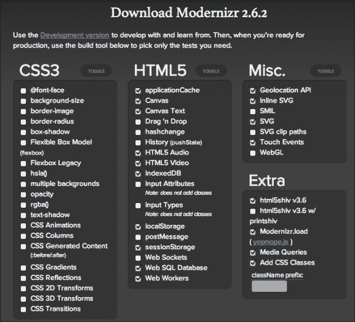

# 八、将 jQuery Mobile 集成到现有站点

我们不可能都这么幸运，只在新网站上工作。也许客户不愿意为移动网站付费，或者他们喜欢他们的桌面网站，只是想要一个移动网站。您的移动实现可能是未来与客户端开展业务的网关。我们需要准备一些技术，将 jQueryMobile 嵌入到他们现有的站点中。

我们将介绍以下内容：

*   检测移动设备–服务器端、客户端以及两者的组合
*   调动整个网站页面–艰难之路
*   动员整个站点页面–简单的方法

# 检测移动——服务器端、客户端以及两者的结合

并不是每个人都在做响应性设计，所以你很有可能需要知道如何检测移动设备。我们以前对这个话题很轻率，但现在让我们严肃起来。

## 浏览器嗅探与特征检测

这个话题有可能引发一场极客大战。一方面，有人宣扬社区维护的数据库在服务器端执行移动检测的优点。WURFL 就是一个很好的例子。使用它，我们可以获得访问我们网站的设备的大量信息。把这些都列在这里只会浪费空间。退房[http://www.tera-wurfl.com/explore/index.php](http://www.tera-wurfl.com/explore/index.php) 在[查看其运行情况或查看整个功能列表 http://www.scientiamobile.com/wurflCapability/](http://www.scientiamobile.com/wurflCapability/) 。

在辩论的另一方，人们指出服务器端检测（即使是数据库驱动的检测）可能会导致全新设备在数据库中并且站点管理员更新其本地副本之前无法被识别。这并不完全正确。所有的机器人都这么说。iPhone、iPad、黑莓和微软也是如此。尽管如此，一个更加友好的未来（[http://futurefriend.ly/](http://futurefriend.ly/) 方法是使用特征检测。例如，该设备是否支持画布或触摸事件？几乎可以肯定的是，如果您支持这些技术和活动，那么您就已经准备好使用 jQuery mobile 享受移动体验了。

无论如何，在这一点上，我们将假设我们正在与一家公司合作，该公司已经有了一个网站，现在也想要一个移动网站。因此，我们需要能够检测移动设备并将其路由到正确的站点。

## WURFL–服务器端数据库驱动的浏览器嗅探

WURFL 有 Java、PHP 和.NET 的 API。在[处获取适用于您的版本副本 http://wurfl.sourceforge.net/apis.php](http://wurfl.sourceforge.net/apis.php) 。由于几乎每个托管提供商都支持开箱即用的 PHP，因此我们将使用 PHP 示例：


我只是使用 Mac OS X 上的内置服务器，但您也可以使用 MAMP（[http://www.mamp.info/en/index.html](http://www.mamp.info/en/index.html) 。您可以轻松地在任何托管平台上运行该示例，如 1&1、GoDaddy、Host Gator，随您选择。如果您想在自己的 Windows 计算机上尝试这些示例，可以使用 XAMPP（[http://www.apachefriends.org/en/xampp.html](http://www.apachefriends.org/en/xampp.html) 或 WAMP（[http://www.wampserver.com/en/](http://www.wampserver.com/en/) 作为快捷方式。我不打算在本书中详细介绍服务器设置和环境配置。这可能是一本自己的书的理由。

那么，PHP…我们开始吧。从[开始 http://wurfl.sourceforge.net/php_index.php](http://wurfl.sourceforge.net/php_index.php) 。您可以从那里下载最新的**WURFL API 包**并解压缩。将整个解压缩文件夹转储到站点中的任何位置。如果一切顺利，您应该能够点击演示页面，查看有关浏览器和设备的详细信息。在我的 Mac 电脑上，它是[http://127.0.0.1/~sgliser/wurfl php/examples/demo/index.php](http://127.0.0.1/~sgliser/wurfl-php/examples/demo/index.php)但您的路径会有所不同。

当您运行默认示例时，您可以立即看到它是多么有用，但让我们把它做得更好。我创建的这个版本将最有用的放在顶部，并在下面列出了所有其他选项：

```js
<?php 
  // Move the configuration and initialization to 
  // the tip so you can use it in the head.  

  // Include the configuration file 
  include_once './inc/wurfl_config_standard.php';  

  $wurflInfo = $wurflManager->getWURFLInfo();  

  if (isset($_GET['ua']) && trim($_GET['ua'])) { 
    $ua = $_GET['ua']; 
    $requestingDevice = $wurflManager->getDeviceForUserAgent($_GET['ua']); 
  } else { 
    $ua = $_SERVER['HTTP_USER_AGENT']; 

    //This line detects the visiting device by looking 
    //at its HTTP Request ($_SERVER) 

    $requestingDevice = $wurflManager->getDeviceForHttpRequest($_SERVER); } ?> 

<html> 
  <head> 
    <title>WURFL PHP API Example</title>     
    <?php if($requestingDevice->getCapability('mobile_browser') !== ""){ ?>     
      <meta name="viewport" content="width=device-width, initial-scale=1, maximum-scale=1.0, user-scalable=no">         
      <link rel="stylesheet" href="http://code.jquery.com/mobile/1.2.0/jquery.mobile-1.2.0.min.css" />         
      <script src="http://code.jquery.com/jquery-1.8.2.min.js"></script>         
      <script src="http://code.jquery.com/mobile/1.2.0/jquery.mobile-1.2.0.min.js"></script> 
    <?php } ?> 
  </head> 
  <body> 
```

在这里，我们以 jQuery 移动方式创建了唯一的真实页面：

```js
  <div data-role="page">     
    <div data-role="header">     	
      <h1>WURFL XML INFO</h1>     
    </div> 
  <div data-role="content" id="content"> 

  <h4>VERSION: <?php echo $wurflInfo->version; ?> </h4> 
  <p>User Agent: <b> <?php echo htmlspecialchars($ua); ?> </b></p> 
  <ul data-role="listview">        
    <li data-role="list-divider">
      <h2>Very Useful</h2>
    </li> 
    <li>Brand Name: <?php echo $requestingDevice->getCapability('brand_name'); ?> </li> 
    <li>Model Name: <?php echo $requestingDevice->getCapability('model_name'); ?> </li> 
    <li>Is Wireless Device: <?php echo $requestingDevice->getCapability('is_wireless_device'); ?></li>             
    <li>Mobile: 
    <?php if($requestingDevice->getCapability('mobile_browser') !== ""){ 
       echo "true"; 
     }else{ 
       echo "false"; 
     }; ?>
    </li>             
    <li>Tablet: <?php echo $requestingDevice->getCapability('is_tablet'); ?> </li>             
    <li>Pointing Method: <?php echo $requestingDevice->getCapability('pointing_method'); ?> </li> 	
    <li>Resolution Width: <?php echo $requestingDevice->getCapability('resolution_width'); ?> </li> 
    <li>Resolution Height: <?php echo $requestingDevice->getCapability('resolution_height'); ?> </li> 
    <li>Marketing Name: <?php echo $requestingDevice->getCapability('marketing_name'); ?> </li> 
    <li>Preferred Markup: <?php echo $requestingDevice->getCapability('preferred_markup'); ?> </li> 
```

在这里，我们仅通过循环属性数组就可以从 WURFL 中列出整个已知数据集

```js
    <li data-role="list-divider">
      <h2>All Capabilities</h2>
    </li>         

    <?php foreach(array_keys($requestingDevice->getAllCapabilities()) as $capabilityName){ ?> 
      <li><?php echo "<h3>" .$capabilityName."</h3><p>" .$requestingDevice->getCapability($capabilityName)."</p>"; ?>
      </li>         
    <?php } ?>         
    </ul> 

    <p><b>Query WURFL by providing the user agent:</b></p> 
    <form method="get" action="index.php"> 
      <div>User Agent: <input type="text" name="ua" size="100" value="<?php echo isset($_GET['ua'])? htmlspecialchars($_GET['ua']): ''; ?>" /> 
        <input type="submit" value="submit" />
      </div> 
    </form> 
  </div> 
</div> 
</body> 
</html>
```

### 注

注意，我们已经*有条件地*通过使用服务器端检测来查看用户是否是移动的，从而将此页面设置为 jQuery 移动页面。只有这样，我们才能注入 jQM 库。

*非常有用*部分下的属性可能是大多数日常工作真正需要的所有属性，但请确保您至少浏览了其他选项。最有用的功能如下：

*   `is_wireless_device`
*   `mobile_browser`
*   `is_tablet`
*   `pointing_method`
*   `resolution_width`
*   `resolution_height`

当然，这并不能告诉我们关于浏览器/设备的一切。例如，iPhone 4S 或 5 将被视为原始 iPhone。使用 WURFL 的 iPad mini 也没有区别。这是因为用户代理从未随着苹果设备的发展而更新。WURFL 无法知道设备具有高像素密度，因此应发送更高分辨率的图像。因此，我们仍然需要使用媒体查询来确定像素比率，并适当地调整图形。下面是一个简单的例子：

```js
.logo-large{
  background-image:url(img/logo.png);
  background-repeat:no-repeat;
  background-position:0 0;
  position:relative;
  top:0;
  left:0;
  width:290px;
  height:65px; 
  margin:0 auto; 
  border:none;
}  

/* HD / Retina ---------------------------------------------*/ @media only screen and (-webkit-min-device-pixel-ratio: 1.5),
       only screen and (min--moz-device-pixel-ratio: 1.5),
       only screen and (min-resolution: 240dpi) 
{ 
  .logo-large{
    background-image:url(img/logoHD.png);
    background-size:290px 65px;
  }  
}
```

### 注

使用媒体查询几乎是检测 iPad mini 的唯一方法。它的分辨率与 iPad2 相同，只是格式更小。但是，正如我们从前面的代码中看到的，我们可以使用 DPI 限定媒体查询。iPad2 有 132 dpi。iPadMini 有 163 台。欲了解更多信息，请查看[http://www.mobilexweb.com/blog/ipad-mini-detection-for-html5-user-agent](http://www.mobilexweb.com/blog/ipad-mini-detection-for-html5-user-agent) 。

到目前为止，我们基本上假设了智能手机，但请记住 jQuery Mobile 是一个框架，它也非常适合于……不太智能的手机。在一个不太发达的市场上，你可能有客户，几乎所有东西都使用手机连接。那里可能没有那么多支持 JavaScript 的触摸屏手机。在这种情况下，您将无法使用基于 JavaScript 的功能检测。很快，WURFL 或其他一些服务器端检测将成为您检测无线设备并为其提供有用服务的唯一合理选择。

## 基于 JavaScript 的浏览器嗅探

有争议的是，这可能是（学术上）最糟糕的检测手机的方法，但它确实有它的优点。这个实用的示例非常有用，因为它为您提供了很多选择。也许我们的预算有限，所以我们只测试了某些设备。我们想确保我们只让我们知道会有好经验的人进来。举个例子：版本 6 以下的黑莓设备将不被允许使用，因为我们选择了一些 5 及更低版本无法处理的 JavaScript 模板。也许我们还没有花时间优化平板电脑，但与此同时，我们可以开始为任何智能手机提供更好的体验。无论如何，这可能非常有用：

```js
<script type="text/javascript">     
  var agent = navigator.userAgent;      
  var isWebkit = (agent.indexOf("AppleWebKit") > 0);      
  var isIPad = (agent.indexOf("iPad") > 0);      
  var isIOS = (agent.indexOf("iPhone") > 0 || agent.indexOf("iPod") > 0);     
  var isAndroid = (agent.indexOf("Android")  > 0);     
  var isNewBlackBerry = (agent.indexOf("AppleWebKit") > 0 && agent.indexOf("BlackBerry") > 0);     
  var isWebOS = (agent.indexOf("webOS") > 0);      
  var isWindowsMobile = (agent.indexOf("IEMobile") > 0);     
  var isSmallScreen = (screen.width < 767 || (isAndroid && screen.width < 1000));     
  var isUnknownMobile = (isWebkit && isSmallScreen);     
  var isMobile = (isIOS || isAndroid || isNewBlackBerry || isWebOS || isWindowsMobile || isUnknownMobile);     
  var isTablet = (isIPad || (isMobile && !isSmallScreen));     
if ( isMobile && isSmallScreen && document.cookie.indexOf( "mobileFullSiteClicked=") < 0 ) mobileRedirect(); 
</script>
```

我们在这里做了一些工作，通过将未知移动设备分类为任何运行小屏幕 WebKit 的设备，来证明未来的检测。很有可能，任何新推出的平台都将使用 WebKit 作为浏览器。微软是唯一一个例外，它似乎仍然认为自己有更多的东西可以提供，他们的平台很容易嗅探。这种方法虽然灵活，但如果在没有 WebKit 浏览器的情况下启动新平台，则需要直接干预。但是，这种情况并不经常发生。即便如此，该平台也需要一段时间才能获得值得考虑的临界质量。如果你遵循 80/20 法则（担心成功达到 80%并在可能的情况下达到最后 20%），这会让你进入 90 年代。

## 使用 Modernizer 的基于 JavaScript 的特征检测

有几种方法可以执行特征检测。可能最简单的方法是使用 Modernizer（[等工具）http://modernizr.com/](http://modernizr.com/) 。您可以自定义下载以仅检测您关心的功能。如果您想制作 HTML5 音频/视频，最好知道您是否可以：



这个平台不是很轻。仅在前面的屏幕截图中显示的选项就产生了一个 12K 的小型 JS。但是，嘿，我们到处乱扔这种大小的图片，好像它们什么都不是。至少 JavaScript 库是有用的。这仍然不能告诉你来找你的用户是否是手机用户，但这是不是一个正确的问题？

也许，我们需要知道的是，我们正在研究的设备支持触摸事件。其他选项对于了解您能做什么和不能做什么非常有用，但如果用户界面是触摸屏，即使是平板电脑或全尺寸触摸屏，也要为用户提供他们应得的界面。给他们 jQueryMobile。

## 基于 JavaScript 的精益特征检测

这个有用的小代码片段是为检测移动设备而拼凑起来的。它是特征检测和浏览器嗅探的混合。大多数现代智能手机将支持我们在这里寻找的所有活动和 API。微软，作为一个特例，他们似乎一直是，必须被浏览器嗅探。根据他们的 Windows Phone 开发者博客，您只需检查 IEMobile 的用户代理即可。很公平，结果如下：

```js
if( 
  ('querySelector' in document 
  && 'localStorage' in window      
  && 'addEventListener' in window      
  && ('ontouchstart' in window || 
  window.DocumentTouch && document instanceof DocumentTouch)
  )      

  || navigator.userAgent.indexOf('IEMobile') > 0)
{                  
  location.replace('YOUR MOBILE SITE'); 
}
```

如果出于某种原因，我们决定不想将平板电脑发送给我们的 jQM 杰作，我们可以加入上一节中的一些其他测试。

## 服务器端加客户端检测

这里有一个想法，当用户第一次访问您的服务器时，向他们发送一个页面，该页面的唯一任务是运行 Modernizer，然后将生成的功能发送回服务器，以便将所有收集的知识放在一个位置。

该文件在章节的代码文件包中`test.html`：

```js
<!doctype html> 
<html> 
<head> 
  <style type="text/css"> 

    #sd{display:block;} /*standard def*/ 
    #hd{display:none;} /*high dev*/ 

    @media only screen and 
      (-webkit-min-device-pixel-ratio: 1.5),        
      only screen and (min--moz-device-pixel-ratio: 1.5),        
      only screen and (min-resolution: 240dpi) { 
        #sd{display:none;} /*standard def*/ 	
        #hd{display:block;} /*high dev*/    
      } 
  </style> 
  <script type="text/javascript" src="modernizr.custom.94279.js"></script> 
  <script type="text/javascript" src="https://ajax.googleapis.com/ajax/libs/jquery/1.8.3/jquery.min.js"></script> 
  <meta charset="UTF-8"> 
  <title>Loading</title> 
</head>  
<body> 
  <div id="hd"></div> 
  <div id="sd"></div> 
</body> 
<script type="text/javascript"> 
  if($("#hd").is(":visible")){ 
    $("html").addClass("hdpi"); 
  }else{ 
    $("html").addClass("sdpi"); 
  } 

  $.post("/~sgliser/wurfl-php/examples/demo/session_set.php", 
    { 
      modernizrData: $("html").attr("class") 
    } 
  ) 
  .success(function(data, textStatus, jqXHR) {  
    console.log(data); 
    location.replace("YOUR MOBILE SITE");  }) 
  .error(function(jqXHR, textStatus, errorThrown) {  
    console.log(errorThrown); 
    location.replace("SOMEWHERE ELSE");  
  }); 
</script> 
</html> 
```

只是为了完成这个循环。这里是 WURFL 检测脚本的一个版本，它将以 JSON 的形式返回值，以便我们可以将其存储到 HTML5`sessionStorage`中。此文件位于`/wurfl-php/examples/demo/session_set.php`：

```js
<?php session_start();  

// Move the configuration and initialization 
// to the tip so you can use it in the head.  

// Include the configuration file 

include_once './inc/wurfl_config_standard.php';  

$wurflInfo = $wurflManager->getWURFLInfo();  

if (isset($_GET['ua']) && trim($_GET['ua'])) { 
  $ua = $_GET['ua']; 
  $requestingDevice = $wurflManager->getDeviceForUserAgent($_GET['ua']); 
} else { 
  $ua = $_SERVER['HTTP_USER_AGENT']; 

  // This line detects the visiting device by looking 
  // at its HTTP Request ($_SERVER) 

  $requestingDevice = $wurflManager->getDeviceForHttpRequest($_SERVER); 
}  

// store session data $_SESSION['wurflData']=$requestingDevice; 

$_SESSION['modernizrData']=$_POST['modernizrData'];  

$i = 0; 

$capabilities = $requestingDevice->getAllCapabilities(); 
$countCapabilities = count($capabilities); 
?> 
{ 
  "wurflData": <?php  

  //echo json_encode($capabilities); 
  foreach(array_keys($capabilities) as $capabilityName){  
    $capability = $requestingDevice->getCapability($capabilityName); 
    $isString = true; 	
    if($capability == "true" || 
       $capability == "false" || 
       is_numeric($capability))
    { 
      $isString = false; 
    } 

    echo "\"".$capabilityName
      ."\":".(($isString)?"\"":"")l
      .$requestingDevice->getCapability($capabilityName)
      .(($isString)?"\"":"");  

    if(($i + 1) < $countCapabilities){ 
      echo ",\n";  
    } 

    $i++; 
  }   
?> 
}
```

### 注

本例注释了 JSON 编码关联数组的简单方法。取而代之的是一些 PHP 代码，它将返回使用真正的布尔值和数值的 JSON 编码，而不是将所有内容存储为字符串。

有了这些文件，您现在可以了解服务器端和客户端上关于访问者的所有信息。

# 调动整个网站页面——艰难之路

我们为什么要这么做？为什么？实际上，只有一个很好的理由：将内容保持在同一页面上，这样用户就不会有一个移动页面和一个桌面页面。当电子邮件和 tweet 之类的东西四处传播时，用户通常不关心他们是发送移动视图还是桌面视图，他们不应该这样做。就他们而言，他们正在向某人发送内容。这是响应式设计的主要论点之一。但别担心，我们以后用简单的方式做事时会考虑到这一点。

一般来说，很容易判断网站的哪些部分会转化为手机。几乎无论站点布局如何，都会有一些数据属性被添加到现有标记上，以调动它们。当 jquerymobile 的库不在页面上时，这些属性将简单地放在那里，不会造成任何伤害。然后，您可以使用我们的许多检测技术中的一种来决定何时将 jQM 库放入。

## 了解自己的角色

让我们考虑调动页面所需的一些关键数据角色属性：

*   `data-role="page"`：包含移动视图中显示的所有内容。
*   `data-role="header"`：将`h1`、`h2`、`h(x)`和最多两个链接包装成一个条的外观，并将链接变成按钮。您可以在页眉中添加更多内容，但这是不可取的。如果你有那么多的东西要挤到页眉中，你最好有一个“菜单”按钮。标题栏的位置可以固定。标题栏中的任何内容都将在顶部保持固定。
*   `data-role="content"`：这为您的内容提供了一个空白。
*   `data-role="button"`：将链接变成按钮。
*   `data-role="navbar"`：这会在环绕链接列表时创建导航栏。
*   `data-role="footer"`：这会在底部包裹你想要的任何东西。这是一个很好的地方，可以进行二次链接、下一步导航、联系我们，以及所有那些标志着一切有用性结束的法律信息。也可以给它一个固定的位置。
*   `data-role="none"`：这会阻止 jQuery Mobile 对内容进行样式化。

从理想的用户体验的角度来看，页面所包含的内容只不过是用户完成其访问该页面的任务所必需的内容。*让我们为失去的梦想默哀片刻。*记住，`data-role="page"`中的任何内容都会显示在移动视图上。因此，在大多数完整的站点页面上，您可以做的最好的事情是确定用户实际访问的页面块，用角色`content`标记该部分，然后立即用角色为`page`的标记包装该部分。这样做，您将自动删除填充大多数 web 页面其余部分的剩余内容。

## 第 1 步，共 2 步–关注内容、营销和营销！

在这一点上，任何有营销背景的人都可能会大喊大叫，因为这种方法会切断他们的信息传递和定向广告等。然而，值得注意的是，人们已经有了一段时间独自完成这件事情的能力。Pocket（以前称为 Read it Later）、Instapaper，甚至 iOS Safari 上的简单阅读器工具等备受争议的服务都在为用户提供他们想要的东西。下面是左侧普通桌面站点的示例，以及 iOS 阅读器如何剥离除内容之外的所有内容：


我们有选择；以用户想要的格式向用户提供他们想要的内容，或者在用户使用此类工具时可能会失去联系他们的机会。这将需要一种更具创造性的方法来进行移动营销活动。但是不要搞错，弹出页面核心以外的所有内容应该是您的第一步。

在除去页面的主要内容之外的所有内容之后，我们还需要去掉当前存在于头部的样式和脚本。如果我们有权修改页面本身，我们可以在服务器端使用 WURFL 轻松地完成这项工作。否则，我们可以使用 JavaScript 删除我们不想要的样式表和脚本，然后注入我们的样式表和脚本。我们还可以简单地 highjack 第一个样式表，然后删除其余的样式表，并对脚本执行相同的操作，首先引入 jQuery，然后引入 jQuery Mobile。有上千种方法可以解决这种情况，但如果您打算以这种方式调动现有页面，我真的建议您使用 WURFL。否则，事情就会变得一团糟。

## 第 2 步，共 2 步–选择全局导航样式并插入

因此，在这一点上，我们有了页面的开头，但可能还有一些小东西需要删除。有一个移动样式表来处理这些覆盖将比使用 JavaScript-DOM 操作进行清理更有用、更快。这很简单，下一个大问题是，我们如何处理全局导航，因为我们刚刚明确排除了它。

### 全球导航作为单独页面

这可能是最简单的方法，并尽可能保持界面干净（在以下步骤中提到）：

1.  用`page`和`content`这两个单独的角色包装全球导航，并确保它们易于选择。
2.  在页面底部（或者在全局导航和内容完成后的任何地方），放入一个脚本，将包含全局导航的页面移动到内容下方。这一点尤其重要，因为我们现在处于一个多页视图中，当 jQuery Mobile 启动时，DOM 中的第一个“页面”将显示给用户。我们希望在 jquerymobile 知道它应该做任何事情之前就这样做。如果我们不这样做的话，那些来到网站希望阅读内容的用户将首先受到全球导航的欢迎。下面是一个基于我们之前看到的页面的非常简单的示例：

    ```js
    $("#NavMainC").insertAfter("#ContentW");
    ```

3.  Append headers to these internal pages so they can link to each other:

    ```js
    $("#ContentW").prepend("<div data-role='header'><h3>"+$("title").text()+"</h3><a href='#NavMainC' data-icon='grid' class='ui-btn-right'>Menu</a></div>") 

    $("#NavMainC").prepend("<div data-role='header'><a data-rel='back' data-icon='back' href='javascript://'>Back</a><h3>Menu</h3></a>");
    ```

    

### 全球导航位于底部

在像文章这样的页面中，用户可能会一直阅读到底，将菜单放在页面底部并不少见。这是一种促进持续参与的方法。他们已经在那里了，对吗？也许您可以抛出一个指向一两篇相关文章的链接，然后将全局菜单附加到页面底部。这将为用户提供更多的阅读内容，而无需一直滚动到顶部：


就我个人而言，我认为最好采取双管齐下的方法。顶部的菜单链接到底部，底部的菜单包含返回顶部的链接。这是通过`$.mobile.silentScroll`功能完成的。

### 全球导航作为一个面板

从 jQuery 1.3 开始，现在有一个`Panel`组件可以直接嵌入到页面中，然后通过点击按钮显示出来。它与 Facebook 应用程序一模一样：


这可能是全球导航的最简单方法。它还具有不改变页面或使界面混乱的优点。有关新面板小部件的完整 API 和选项，请查看[http://view.jquerymobile.com/1.3.0/docs/widgets/panels/](http://view.jquerymobile.com/1.3.0/docs/widgets/panels/) 。

## 艰难之路——最后的想法

总而言之，将属性注入完整站点页面并调用 jQuery Mobile 的方法可以很好地工作。您将遇到的最大问题是，大多数页面上都有大量的垃圾。有很多东西需要删除和/或删除。这也造成了相当脆弱的不幸后果。如果有人出现，甚至稍微修改页面，可能会破坏您的实现。如果页面是使用模板或**内容管理系统**（**CMS**）创建的，我真的只能推荐这种方法，这样网站结构的更改就不会经常发生，并且在更改时会保持一致。

# 调动整个网站页面–简单的方法

没有什么比创建一个独立的 jQuery 移动页面更简单、更干净的了。让我们这样做，然后用 AJAX 导入我们想要的页面。然后我们可以取出我们想要的部分，剩下的部分就可以了。

这种方法的最大缺点主要是学术性的。进行性增强是拍摄的。对于设备上没有 JavaScript 的用户，该网站完全崩溃。我的论点是，这可能无关紧要。我不能代表任何地方说话，但在美国，如果你不使用智能手机，你就不能用你的设备上网。就这么简单。当然，也有例外情况只能证明这一规则。然而，如果你的市场不同，你会想考虑这个选择是否适合你。那么，让我们继续。

在任何给定的页面上，我们真正需要的是使用我们列出的许多方法之一，为移动设备上的任何人提供一个简单的重定向。然后，只需使用一个简单的`location.replace`。这个代码示例做的不止这些。它检查用户是否在手机上，并单击了完整的站点链接。如果是这样，我们将插入一个`iframe`标记，允许用户手动切换回移动视图。否则，我们只会将它们反弹到移动视图：

```js
if (isMobile && isSmallScreen){  
  if(document.cookie.indexOf("mobileFullSiteClicked=")<0){ 
    location.replace("mobileadapter.php?p="
      +escape(location.pathname));
  }else{ 
    document.addEventListener("DOMContentLoaded", function(){ 
      try{ 
        var iframe = document.createElement("iframe");
        iframe.setAttribute("src","gomo.html"); 
        iframe.setAttribute("width","100%"); 
        iframe.setAttribute("height","80");  
        document.body.insertBefore(
          iframe,
          document.body.firstChild); 
      }catch(e){alert(e);} 
    }, false); 
  } 
}
```

下面是一个页面的代码，可以让整个站点链接回手机。该文件在章节代码文件中的`gomo.html`

```js
<!doctype html> 
<html> 
<head> 
  <meta charset="UTF-8"> 
  <style type="text/css"> 
    body{ background-color:#000;} 
    p{
      font-size:60px; 
      font-family:Arial, Helvetica, sans-serif; 
      text-align:center;
    } 	
    a{color:white;}  
  </style> 
</head>  
<body> 
<script type="text/javascript"> 
  document.write("<p><a href='mobileadapter.php?p="
    +escape(window.parent.location.pathname)
    +"' target='_top'>Switch to mobile view</a>"
    +"</p>");     
</script> 
</body> 
</html> 
```

这两个页面都使用不需要 jQuery 的脚本。如果每个页面都有 jQuery，那当然很好，但是有竞争性的平台，我们不能指望我们正在动员的基本页面为我们准备好它。不管怎样，原生 JavaScript 速度更快。我们可以把它直接放在页面的顶部，而不必先拉进一个库。


这里是 jQuery 移动页面，包含移动内容。它还可以链接回完整的站点视图，并设置 cookie，这样用户在单击完整的站点链接时就不会返回到移动设备。

如前所述，我们将在接下来的前 3 篇文章中插入，并将它们放在底部的菜单之前，以保持用户的参与。从这个角度来看，这要容易得多。

该示例还利用了`replaceState`。对于所有支持它的浏览器，当用户访问移动页面时，地址栏和历史记录中的 URL 将被更新，以显示原始文章的 URL。

现在，不再拖延，我们将看到如何轻松地调动整个站点页面的最佳示例。它非常通用，您可能只需将其应用于正在进行的任何项目，只需调整执行拉入和注入的代码即可：

```js
<!DOCTYPE html>  
<html>  
<head> 
  <meta charset="utf-8"> 	
  <meta name="viewport" content="width=device-width, initial-scale=1">  
  <title class="pageTitle">Loading...</title>  
  <link rel="stylesheet" href="http://code.jquery.com/mobile/1.3.0/jquery.mobile-1.3.0.min.css" /> 
  <script src="http://code.jquery.com/jquery-1.8.2.min.js"></script> 
  <script src="http://code.jquery.com/mobile/1.3.0/jquery.mobile-1.3.0.min.js"></script>     
  <!-- cookie code from https://github.com/carhartl/jquery-cookie -->
  <script src="jquery.cookie.js"></script>
  <style type="text/css"> 
    #iscfz,.comment-bubble{display:none;} 
    #bottomMenu .byline
    {
      padding:0 0 8px 12px; 
      font-weight:normal;
    } 	
  </style> 
</head>   
<body>   
<div id="mainPage" data-role="page">
```

本节是 jQuery Mobile 1.3 中提供的新面板。它将收到全局菜单：

```js
      <div data-role="panel" id="globalmenu" data-position="left" data-display="reveal" data-theme="a">     
      <ul data-role="listview"></ul>         
      <!-- panel content goes here -->     
   </div><!-- /panel --> 

  <div data-role="header"> 		
    <a href="#globalmenu" data-icon="bars">Menu</a>
    <h1 class="pageTitle">Loading...</h1>         

  </div><!-- /header -->  
  <div id="mainContent" data-role="content">	          
  </div><!-- /content -->     
  <div>     
    <ul id="bottomMenu" data-role="listview"></ul>     
  </div> 	
  <div data-role="footer"> 
    <h4>
      <a class="fullSiteLink" data-role="button" data-inline="true" href="<?php echo htmlspecialchars(strip_tags($_REQUEST["p"])) ?>" target="fullsite">Full Site View</a>
    </h4> 
  </div><!-- /footer --> 	 
</div><!-- /page -->  

<script type="text/javascript"> 	

  $.cookie("mobileFullSiteClicked","true", {
    path:"/",expires:0}
  );  //0 minutes - erase cookie 
```

并非所有移动浏览器都完全支持我们在这里所做的替换用户历史记录中的状态的操作。为了安全起见，我把那条线用 try/catch 块包起来了。这是一种很好的技术，适用于在整个客户群中得到部分支持的任何东西。

```js
  try{ 
    //make the URL the original URL so if the user shares 
    //it with others, they'll be sent to the appropriate URL 
    //and that will govern if they should be shown 
    //mobile view. 
    history.replaceState({},"","<?php echo htmlspecialchars(strip_tags($_REQUEST["p"])) ?>"); 
  }catch(e){ 
    //history state manipulation is not supported 
  }  

  //Global variable for the storage of the imported 
  //page content. Never know when we might need it 
  var $pageContent = null; 

  //Go get the content we're supposed to show here 
  function loadPageContent(){ 

    $.ajax({ 
       //strip_tags and htmlspecialchars are to to help 
       //prevent cross-site scripting attacks 
       url:"<?php echo htmlspecialchars(strip_tags($_REQUEST["p"])) ?>",
       beforeSend: function() { 
         //show the page loading spinner 
         $.mobile.loading( 'show' );
       }
     }) 
    .done(function(data, textStatus, jqXHR){ 

        //jQuery the returned page and thrown it into 
        //the global variable 
        $pageContent = $(data); 

        //take the pieces we want and construct the view  
        renderPage(); 	
     }) 
    .fail(function(jqXHR, textStatus, errorThrown){ 

        //let the user know that something went wrong 
        $("mainContent").html("<p class='ui-bar-e'>Aw snap! Something went wrong:<br/><pre>"+errorThrown+"</pre></p>"); 
      })
     .always(function(){ 
        //Set a timeout to hide the image, in production 
        //it was being told to hide before it had even been shown 	
        //resulting a loading gif never hiding   
        setTimeout(function(){$.mobile.loading( "hide" )}, 300); 
     });; 
  } 
```

下一节将处理分离导入的页面并将其注入到正确的位置。请注意，在我选择对象的开头，并在名称的开头使用美元符号。为了性能，我们预先选择了它们。任何要多次引用的内容都应该存储到变量中，以减少再次选择它的 DOM 遍历。美元符号的原因是它向编码者表明他们正在查看的变量已经被查询：

```js
  function renderPage(){ 
    var $importedPageMainContent = $pageContent.find("#main"); 
    var $thisPageMainContent = $("#mainContent"); 

    //pull the title and inject it. 
    var title = $importedPageMainContent.find("h1.title").text(); 	

    $(".pageTitle").text(title); 

    //set the content for the main page starting 
    //with the logo then appending the headline, 
    //byline, and main content 
    var $logo = $pageContent.find("#logo-headerC img"); 

    $thisPageMainContent.html($logo);  
    $thisPageMainContent.append(
      $importedPageMainContent.find("h1.title")
    ); 
    $thisPageMainContent.append(
      $importedPageMainContent.find("div.byline")
    ); 
    $thisPageMainContent.append(
      $importedPageMainContent.find("div.the-content")
    ); 

    var $bottomMenu = $("#bottomMenu"); 

    //Take the next 3 top stories and place them in the 
    //bottom menu to give the user something to move on to.   
$bottomMenu.html("<li data-role='list-divider'>Read On...</li>"); 	
    $bottomMenu.append(
       $pageContent.find("#alldiaries li:lt(3)")
    );  

    //Inject the main menu items into the bottom menu 

    $bottomMenu.append("<li data-role='list-divider'>Menu</li>"); 	

    var $mainMenuContent = $pageContent.find("#NavMain");  
    $bottomMenu.append($mainMenuContent.html()); 

    //After doing all this injection, refresh the listview 
    $bottomMenu.listview("refresh"); 

    //inject the main menu content into main menu page 
    var $mainMenContent = $("#mainMenuContent"); 
    $mainMenContent.find("ul").append(
      $mainMenuContent.html()
    ); 
  } 

  //once the page is initialized, go get the content. 
  $("[data-role='page']").live("pageinit", loadPageContent); 
  //if the user clicks the full site link, coolie them 
  //so they don't just bounce back.
  $("a.fullSiteLink").live("click", function(){ 
    $.cookie("mobileFullSiteClicked","true", 
      {path:"/",expires:30});  //30 minutes 
  }); 

</script> 
</body> 
</html>
```

### 注

这里使用的 cookie 管理来自[的 jQuery cookie 插件 https://github.com/carhartl/jquery-cookie](https://github.com/carhartl/jquery-cookie) 。

# 总结

在本书的前面，我们深入研究了移动检测。现在你知道了一切。以前，我们是从头开始创建移动网站，很少关心他们的桌面体验是什么。现在你知道如何统一它们了。困难的部分是知道什么时候从头开始打造移动体验，什么时候简单地调动整个站点体验。遗憾的是，没有简单的答案。但是，无论是通过在页面上使用 JavaScript 将其转换为移动（困难的方式），还是通过在内容中调整并挑选您想要的部分（简单的方式），还是通过利用响应式设计+服务器端组件（RESS），正如我们在上一章中提到的，您现在已经准备好处理几乎所有可能的情况。我们唯一还没有真正解决的问题是与 CMS 的集成，我们将在下一章中进行。