# 九、内容管理系统和 jQM

> “我是一名 web 开发人员。每次客户需要更改时，我都会使用 Microsoft Word 文档并将内容剪切粘贴到网页上，这是在浪费我的时间和才能”-在任何地方都会听到，无数次。

如果这句话在你心中引起共鸣，那么你需要熟悉内容管理系统（CMS）。它们是一种简单而强大的方式，可以将发布权交给用户，这样您就可以专注于不那么乏味、报酬更高的工作。你所要做的就是帮助客户设置他们的 CMS，选择和定制他们的模板，并将内容的创建和维护留给他们。CMS 通常是小企业网站和企业网站的核心。

对于流行平台，有*许多*插件和主题可供选择。宣传册软件网站从未如此轻松。事实上，像 WordPress 和 Squarespace 这样的平台使这一过程变得如此简单，以至于 web 开发人员通常只需要定制外观即可。

那么，为什么还要包括这一章呢？因为 CMS 的流行几乎总是保证，如果你要制作移动网络应用程序，在某个时刻你会得到一个已经在 CMS 中有一个站点的客户端，你需要知道如何集成。

在本章中，我们将介绍：

*   当前的 CMS 景观
*   WordPress 和 jQuery Mobile
*   Drupal 和 jQuery Mobile
*   更新 WordPress 和 Drupal 主题
*   Adobe 体验管理器（AEM）

# 当前 CMS 景观

按容量计算，WordPress 是世界上最流行的 CMS。在排名前 10000 的网站中，有 8.3%是建立在 WordPress 上的。其次是 Drupal，占 2.95%。虽然这听起来不算多，但请看[中的图表 http://trends.builtwith.com/cms](http://trends.builtwith.com/cms) 。在所有使用 CMS 的网站中，WordPress 和 Drupal 几乎占 75%。

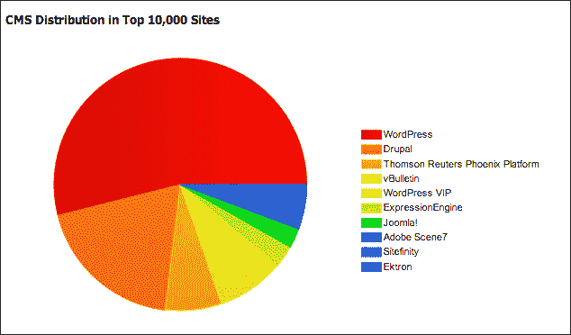

# WordPress 和 jQuery Mobile

WordPress 很受欢迎，因为它简单易用。您可以通过在[WordPress.com](http://WordPress.com)上创建托管站点来开始 WordPress，或者您可以通过[WordPress.org](http://WordPress.org)下载源代码并将其安装到您喜欢的任何机器上。在您进行实验时，我强烈推荐后一种方法。本章中使用的版本为 3.5。

使用任何 CMS 快速启动和运行的关键是，了解要使用哪些插件和主题。对于 WordPress，我会*不*推荐 jQuery Mobile 插件。当我在为本章做实验时，它破坏了管理界面，总体来说，是一次痛苦的经历。但是，有几个 jQuery 移动主题可以很好地为您服务。有些是免费的，有些是付费的。无论哪种方式，尽量不要重新发明轮子。选择一个最接近你想要的主题，然后调整它。到目前为止，您很可能已经足够好地修改现有的主题文件了。下面是一些我发现并喜欢的主题的链接。选择一个，将其解压缩，并将其放入`wp-content/themes/`下的 WordPress 安装目录中：

*   [http://www.mobilizetoday.com/freebies/jqmobile](http://www.mobilizetoday.com/freebies/jqmobile)
*   [http://themeforest.net/item/mobilize-jquery-mobile-wordpress-theme/3303257](http://themeforest.net/item/mobilize-jquery-mobile-wordpress-theme/3303257)
*   [http://goldenapplesdesign.com/projects/jquery-mobile-boilerplate-for-wordpress-themes/](http://goldenapplesdesign.com/projects/jquery-mobile-boilerplate-for-wordpress-themes/)(my personal favorite)

    ### 注

    **Mac 提示**

    打开控制台，导航到包含解压缩目录的文件夹，然后运行以下命令。如果你不这样做，你的东西可能不会像预期的那样出现或工作。

    ```js
    xattr -dr com.apple.quarantine *
    ```

    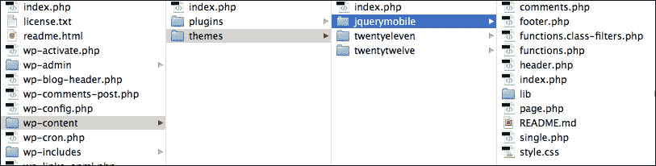

如果您成功安装了主题，您应该能够在**外观****主题**下的管理界面上查看，如下图左侧所示。应列在**可用主题**下：

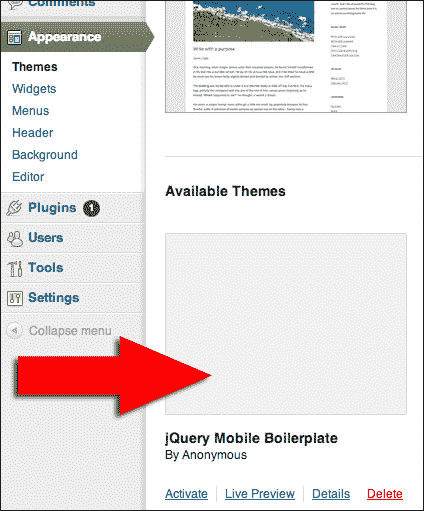

接下来，我们需要一种在移动设备上访问主题的方法。这就是移动主题切换器的用武之地。我们将在这里使用的切换器非常简单，但对于可能访问您网站的绝大多数人来说非常有效。

## 手动安装移动主题切换器

要手动安装移动主题，请从[下载 http://wordpress.org/extend/plugins/mobile-theme-switcher/](http://wordpress.org/extend/plugins/mobile-theme-switcher/) 。解压文件夹并将其放入 WordPress 安装目录下的`wp-content/plugins/`：

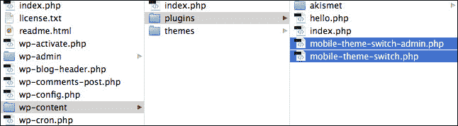

接下来，通过管理界面激活名为**移动主题切换**的插件：

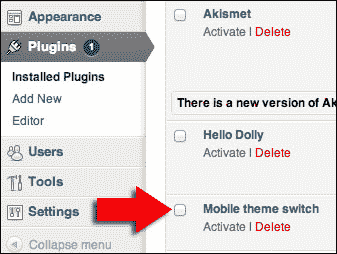

## 自动安装移动主题切换器

如果你愿意，你可以让 WordPress 为你做大部分工作。就我个人而言，我喜欢掌控一切。以下是如何通过管理界面进行安装：

1.  Go to the **Plugins** page and then look beside the title to find the **Add new** button, as shown in the next screenshot:

    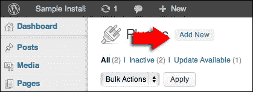

2.  On the following screen, search for **mobile theme switcher**:

    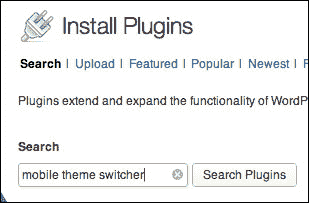

3.  There are plenty of options to choose from, the one we're using is the first:

    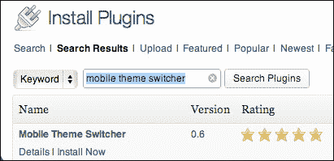

4.  在下一页输入您的 FTP 凭据。
5.  激活新安装的插件。

## 配置移动主题切换器

如果您已成功安装并激活该插件，它现在将显示在**外观**菜单下，如下面的屏幕截图所示。然后，选择您安装的移动主题，点击**更新选项**按钮：


插件和主题的结合是强大、简单和有效的。以下是新主题的屏幕截图：

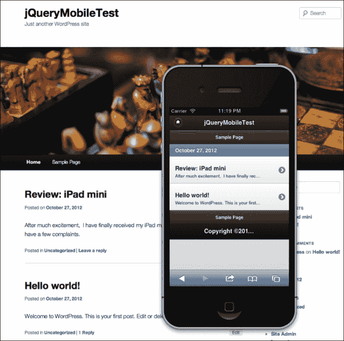

很简单吧？现在，我们只需调整它，直到客户满意为止。让我们转到下一个 CMS 系统。

### Drupal 和 jQuery Mobile

Drupal 是一种功能强大得多的 CMS。使用他们的一些标准插件，您可以轻松创建完整的 web 应用程序，而不仅仅是手册软件网站。在发布评论之前，你想使用验证码来证明人们是人吗？有一个插件。要创建联系人表单吗？它是内置的。要创建自定义数据库表和表单以保存该输入吗？从 Drupal7 开始，这也是内置的。

Drupal 最大的缺点是，如果你想利用它的真正威力，它有一点学习曲线。而且，如果不进行一些调整，它可能会有点慢，并且会使页面的代码膨胀。缓存等技术可以提高性能，但也会对动态创建的页面产生负面影响。

为 jQuery Mobile 配置 Drupal 的过程与 WordPress 的过程几乎相同。再一次，我们将从一个已经存在的主题开始。制作这些主题的人知道他们为之编码的系统。不要试图重新发明轮子。我们所要做的就是使用主题并调整它。我最喜欢的 Drupal jQM 主题可以在[找到 http://drupal.org/project/mobile_jquery](http://drupal.org/project/mobile_jquery) 。在该页面底部，您将找到主题的可下载发行版：

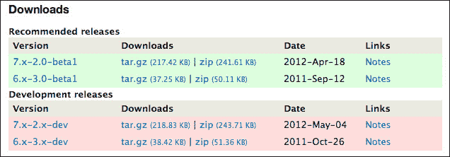

1.  将链接复制到适合您的发行版。
2.  Log in to the admin console of your Drupal site and go to the **Appearance** section:

    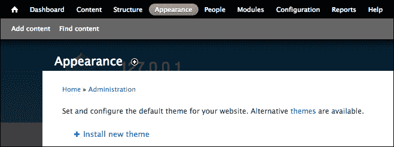

3.  Click on the **Install new theme** link and paste the link you copied into the **Install from a URL** field. Click on the **Install** button and let the installation go through all its steps.

    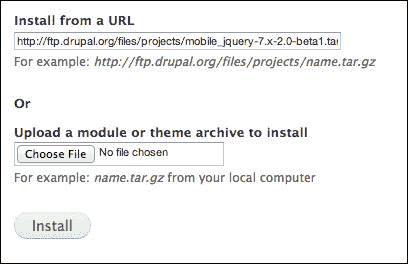

4.  Chances are that at this point, you won't be able to see the installed theme. The makers encourage you to create subthemes and not use their base installation for the theme. This is one recommendation we'll be ignoring. So, in order to make the theme show up, you'll want to edit the file `mobile_jquery.info` in `sites/all/themes/jquery_mobile/` in your Drupal install directory and change the value of `hidden` from `1` to `0`. Once you do that, you should see the theme listed in the disabled themes section of the **Appearance** menu, as show in the next screenshot. Click on the **Enable** link, and your theme will be ready to be configured and used.

    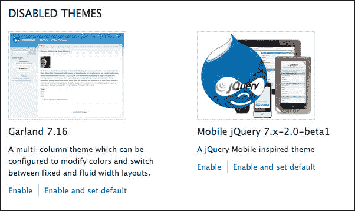

5.  Next, we have to install the theme switcher plugin. Let's use the plugin at [http://drupal.org/project/mobile_theme](http://drupal.org/project/mobile_theme). Again, choose the right version and copy its URL.

    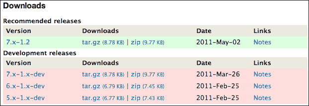

6.  Open the admin interface to the **Modules** section and click on the **Install new module** link:

    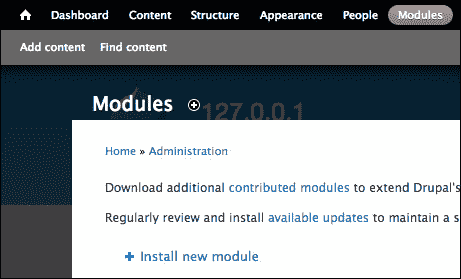

7.  Paste the URL into the field labeled **Install from a URL** and click on the **Install** button. Let the installation process run its course.

    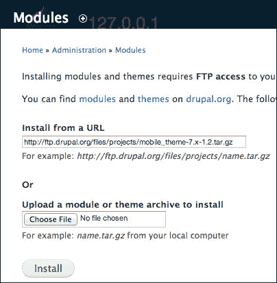

8.  At the bottom of the **Modules** section, you will find the newly installed plugin:

    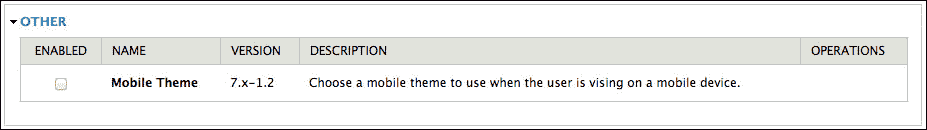

9.  Click on the checkbox to enable the module and then you'll be able to configure it:

    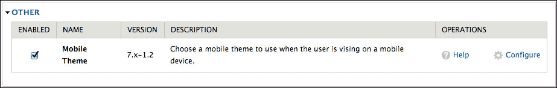

10.  Clicking on the **Configure** link will take you to a screen for configuring the **Global settings**. On the right-hand side of that screen, you will find a section for configuring the mobile theme options. The **Mobile theme** section has been marked with a red arrow in the following screenshot:

    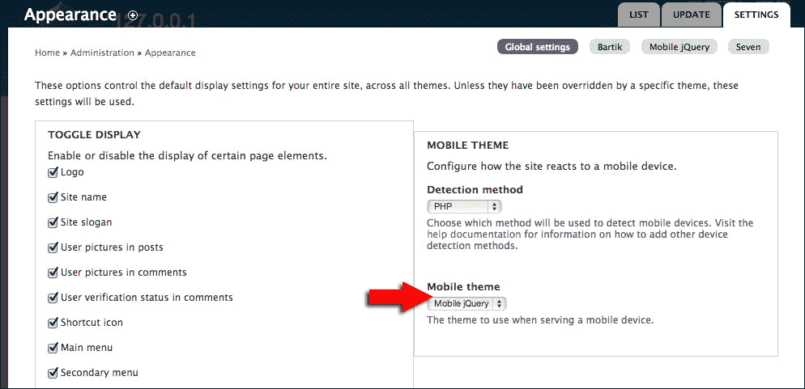

结果证明了本身。这个主题当然可以使用定制，但从一开始就可以很好地工作。剩下的我们知道怎么做。

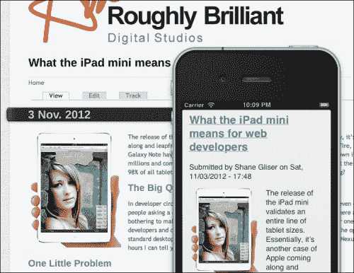

# 更新 WordPress 和 Drupal 模板

在某个时刻（可能就在安装之后），您需要更新这些主题以使用 jQuery 移动库的最新版本。有些仍在使用测试版。这个过程实际上相当简单。您所要做的就是找到相关模板的标题部分，并更新对 jQuery 移动 CSS、JS 的引用，可能还有核心 jQuery 库的引用。

## WordPress–金苹果 jQM 主题

金苹果的 WordPress 主题（见[https://github.com/goldenapples/jqm-boilerplate](https://github.com/goldenapples/jqm-boilerplate) ），您必须更改几个文件。在`header.php`文件中，查找并更新以下行：

```js
<link rel="stylesheet" href="http://code.jquery.com/mobile/1.0b1/jquery.mobile-1.0b1.min.css" />
```

在`functions.php`文件中，您需要查找并更新以下行：

```js
wp_enqueue_script( 'jquery',"http://code.jquery.com/jquery-1.6.4.min.js" );

wp_enqueue_script( 'jquery-mobile',"http://code.jquery.com/mobile/1.0.1/jquery.mobile-1.0.1.min.js",array( 'jquery' ) );

wp_enqueue_script( 'mobile-scripts',get_stylesheet_directory_uri().'/lib/mobile-scripts.js', array( 'jquery', 'jquery-mobile' ) );

wp_localize_script( 'mobile-scripts', 'siteData', array( 'siteUrl', home_url() ) );

wp_enqueue_style( 'jquery-mobile', "http://code.jquery.com/mobile/1.0.1/jquery.mobile-1.0.1.min.css" );
```

## Drupal–jQuery 移动主题

对于 Drupal jQuery Mobile 主题，请点击[http://drupal.org/project/mobile_jquery](http://drupal.org/project/mobile_jquery) ，更新主题的最快方式是编辑`theme`文件夹根目录下的`template.php`文件。在文件中找到以下行并更新对 jQuery Mobile 的引用：

```js
drupal_add_css('http://code.jquery.com/mobile/1.0.1/jquery.mobile.structure-1.0.1.min.css', array_merge($css_options,array('weight' => 100)));
drupal_add_css('http://code.jquery.com/mobile/1.0.1/jquery.mobile-1.0.1.min.css', array_merge($css_options, array('weight' => 100)));

drupal_add_js('http://code.jquery.com/jquery-1.6.4.min.js', array_merge($js_options, array('weight' => 100)));

drupal_add_js(drupal_get_path('theme', 'mobile_jquery') . '/scripts/mobile_jquery.js', array_merge($js_options, array('weight' => 101)));

drupal_add_js('http://code.jquery.com/mobile/1.0.1/jquery.mobile-1.0.1.min.js', array_merge($js_options, array('weight' => 101)));
```

# Adobe 体验经理

Adobe 一直是 web 领域的领导者。他们的首要企业 CMS 被称为 Adobe 体验管理器（AEM）（参见[http://www.adobe.com/solutions/web-experience-management.html](http://www.adobe.com/solutions/web-experience-management.html) 。我不打算讨论如何为 AEM 安装、配置或编写代码。这是本书大小的几本培训手册的主题。相信我。我提到这一点只是为了让您知道，至少有一个主要的 CMS 播放器附带了完整的 jQuery 移动示例。

培训材料以一个名为 GeometricXX 的虚构网站为中心。


AEM 系统的优点在于它使用了 Java JCR 容器（参见[http://en.wikipedia.org/wiki/Content_repository_API_for_Java](http://en.wikipedia.org/wiki/Content_repository_API_for_Java) 用于存储内容。这意味着您可以创建移动站点，通过引用桌面页面的 JCR 内容节点或允许用户直接在看起来像移动屏幕的界面中键入内容，自动从桌面页面提取内容。

Geometrixx 的移动示例使用 jQuery mobile 进行编码；虽然 jQM 的版本有点过时，但是更改模板很容易。MobileContentAuthor 界面带有模拟手机界面，用于框显内容，使其看起来与真实手机或平板电脑大致相同。您可以在 author 界面中切换设备配置文件。虽然这并不是对这些设备的真实模拟，因为这一切都发生在您使用的任何浏览器中，但它仍然非常非常方便。

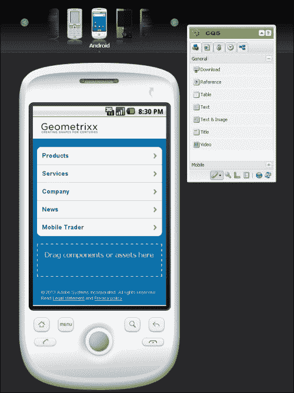

如果你为一家能负担得起 AEM 的公司工作，你就已经精通移动应用了。这个平台给予内容作者的力量是惊人的。

# 总结

自从两年前我第一次涉足移动开发以来，移动主题的世界已经爆炸式发展。如今，jquerymobile 有很多选择；还有一些其他响应性主题。我没有费心把谷歌能提供给我们的所有东西都列一个详尽的清单。到这本书出版的时候，即使在一个月的时间里，情况也会发生变化。需要记住的重要一点是，我们不必重新发明轮子，也不必为自己配备内容更新。给你的客户自己做一些小的更新的权力，你就可以重新开始你的业务了。尽管 CMS 很有用，我们不会再讨论它了。下一章将回到定制开发，我们将结合到目前为止所学的一切。