# 十、将所有内容放在一起——Flood.FM

Flood.FM 是一个独特的想法。这是一个网站，在这里，听众将收到来自不同流派和地理区域的本地独立乐队的音乐。构建这项服务需要我们迄今为止开发的许多技能，我们将介绍一些可用于这项新服务的新技术。我们已经在 Post 上绘制了接口，并使用了 GPS 和客户端模板。我们已经处理了常规的 HTML5 音频和视频。我们甚至已经开始研究多种手机尺寸，并使用媒体查询将版面重新设计为响应性强的设计。

所有这些都是更简单的实现，旨在完成任务，并尽可能优雅地失败。让我们看看我们能为这次冒险带来什么技术和技巧。

在本章中，我们将介绍：

*   品尝香脂
*   组织代码
*   Web 音频 API 简介
*   提示用户安装您的应用程序
*   新的设备级硬件访问
*   应用还是不应用，这是个问题
*   PhoneGap 与 Apache Cordova

# 香脂的味道

我们从学习一种叫做纸原型的技术开始这本书。对于你自己与客户的合作，这是一个很好的工具。然而，如果您正在处理大型或分布式团队，您可能需要更多的东西。巴尔萨米克（[http://www.balsamiq.com/](http://www.balsamiq.com/) 是一种非常流行的用于快速原型制作的用户体验工具。它非常适合创建和共享交互式实体模型。

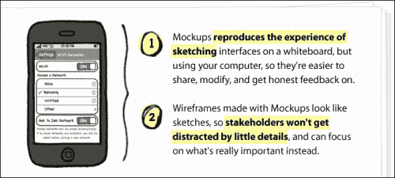

当我说“非常受欢迎”时，我指的是很多你习惯看到的主要名字。超过 80000 家公司在 Balsamiq 实体模型的帮助下创建了他们的软件。


那么，让我们来看看 Flood.FM 的创造者们在想些什么。这是他们画的第一个屏幕；到目前为止，它看起来是一个相当标准的实现。它在底部有一个图标工具栏，在内容中有一个列表视图。翻译这真的很简单。在使用字形图标和标准工具栏之前，我们已经完成了这项工作。

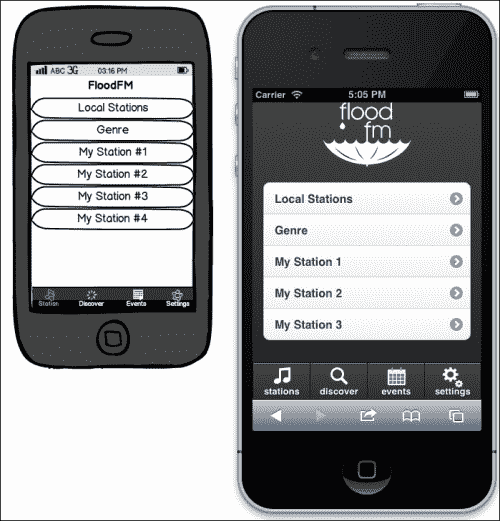

理想情况下，我们希望将这个特定的实现保持为纯 HTML/JS/CSS。这样，我们可以在某个时候使用 PhoneGap 将其编译成一个本地应用程序。然而，我们希望坚持干燥（不要重复）原则。这意味着我们将希望在不使用服务器端进程的情况下将此页脚注入到每个页面。为此，让我们在应用程序中设置一个隐藏部分，以包含我们可能需要的所有全局元素：

```js
<div id="globalComponents">
  <div data-role="navbar" class="bottomNavBar">
    <ul>
      <li><a class="glyphishIcon" data-icon="notes" href="#stations_by_region" data-transition="slideup">stations</a></li>
      <li><a class="glyphishIcon" data-icon="magnify" href="#search_by_artist" data-transition="slideup">discover</a></li>
      <li><a class="glyphishIcon" data-icon="calendar" href="#events_by_location" data-transition="slideup">events</a></li>
      <li><a class="glyphishIcon" data-icon="gears" href="#settings" data-transition="slideup">settings</a></li>
    </ul>
  </div>
</div>
```

我们将把这段代码放在页面底部，并在样式表`#globalComponents{display:none;}`中使用一个简单的 CSS 规则将其隐藏。

现在，让我们将应用程序设置为在创建页面之前，将这个全局页脚插入到每个页面中。使用`clone()`方法（见下一个代码片段）可以确保我们不仅获取页脚的副本，还获取与之相关的任何数据。通过这种方式，每个页面都使用完全相同的页脚构建，就像在服务器端包含中一样。当页面完成其正常初始化过程时，页脚将收到与页面其余部分相同的标记处理。

```js
/************************
*  The App
************************/
var floodApp = {
  universalPageBeforeCreate:function(){
    var $page = $(this);
    if($page.find(".bottomNavBar").length == 0){
      $page.append($("#globalComponents .bottomNavBar").clone());
    }

  }
}

/************************
*  The Events
************************/
//Interface Events
$(document).on("pagebeforecreate", "[data-role="page"]",floodApp.universalPageBeforeCreate);
```

看看我们在这段 JavaScript 代码中做了什么。这和我们以前做的有点不同。实际上，我们正在更有效地组织代码。

# 组织您的代码

在前面的章节中，我们的代码结构非常松散。事实上，我相信学术界人士会嘲笑这种甚至称之为结构化的大胆行为。我相信一种非常实用的编码方法，这使我使用更简单的结构和最少的库。然而，我们可以从中汲取价值和教训。

## MVC、MVVM、MV*

在过去的几年中，认真的 JavaScript 开发人员一直在将后端开发结构引入 web，因为他们的项目的规模和范围要求更严格的方法。对于雄心勃勃、持久的浏览器内应用程序，这种结构化的方法可以有所帮助。如果你在一个更大的团队中，这一点更为正确。

**MVC**代表“模型视图控制器”（参见[http://en.wikipedia.org/wiki/Model%E2%80%93view%E2%80%93controller](http://en.wikipedia.org/wiki/Model%E2%80%93view%E2%80%93controller) ，**MVVM**代表“模型视图模型”（见[）http://en.wikipedia.org/wiki/Model_View_ViewModel](http://en.wikipedia.org/wiki/Model_View_ViewModel) 和**MV***是“模型-视图-无论什么”的缩写，是用来总结将这些类型的结构带到前端的整个运动的通用术语。

一些比较流行的库包括：

*   Backbone.JS[http://backbonejs.org/](http://backbonejs.org/)
*   脊椎[http://spinejs.com/](http://spinejs.com/)
*   腰椎（[http://walmartlabs.github.com/lumbar/](http://walmartlabs.github.com/lumbar/)
*   余烬[http://emberjs.com/](http://emberjs.com/)
*   淘汰赛（[http://knockoutjs.com/](http://knockoutjs.com/)
*   AngularJS（[http://angularjs.org/](http://angularjs.org/)
*   蝙蝠侠 js（[http://batmanjs.org/](http://batmanjs.org/)

在[中对这些以及更多内容进行了非常好的比较 http://codebrief.com/2012/01/the-top-10-javascript-mvc-frameworks-reviewed/](http://codebrief.com/2012/01/the-top-10-javascript-mvc-frameworks-reviewed/) 。

有关如何使主干网与 jQuery Mobile 配合使用的适配器和示例，请访问[http://view.jquerymobile.com/1.3.0/docs/examples/backbone-require/index.php](http://view.jquerymobile.com/1.3.0/docs/examples/backbone-require/index.php) 。

余烬的示例可在[中找到 https://github.com/LuisSala/emberjs-jqm](https://github.com/LuisSala/ emberjs-jqm) 。

Angular 还在开发 jQM 的适配器。[中有几个例子 https://github.com/tigbro/jquery-mobile-angular-adapter](https://github.com/tigbro/jquery-mobile-angular-adapter) 。

## MV*和 jQuery Mobile

是的，你能做到。您可以将这些 MV*框架中的任何一个添加到 jQuery Mobile 中，并使应用程序尽可能复杂。其中，我倾向于桌面的 Ember 平台和 jQuery Mobile 的 Angular 平台。然而，我想提出另一种选择。

我不打算深入讨论 MVC 框架背后的概念。从本质上讲，这一切都是关于将应用程序的关注点划分为更易于管理的部分，每个部分都有特定的用途。我们不需要另一个库/框架来实现这一点。以一种更有组织的方式编写代码非常简单。让我们创建一个类似于我之前开始的结构：

```js
//JavaScript Document

/*******************
 * The Application
 *******************/

/*******************
 * The Events
 *******************/

/*******************
 * The Model
 *******************/
```

## 申请

在应用程序部分下，让我们填写一些应用程序代码，并给它一个*名称空间*。从本质上讲，名称空间是将特定于应用程序的代码放入自己的命名对象中，这样函数和变量就不会与其他潜在的全局变量和函数发生冲突。它可以防止您污染全局空间，并有助于保护您的代码不受那些对您的工作一无所知的人的影响。诚然，这是 JavaScript，人们可以随意覆盖任何内容。然而，这也使得重写类似于`floodApp.getStarted`的东西比简单地创建自己的名为`getStarted`的函数更为有意。没有人会意外地重写带名称空间的函数。

```js
/*******************
 * The application
 *******************/
var floodApp = {
  settings:{
    initialized:false,
    geolocation:{
      latitude:null,
      longitude:null,
    },
    regionalChoice:null,
    lastStation:null
  },
  getStarted:function(){
    location.replace("#initialize");
  },
  fireCustomEvent:function(){
    var $clicked = $(this);
    var eventValue = $clicked.attr("data-appEventValue");
    var event = new jQuery.Event($(this).attr("data-appEvent"));
    if(eventValue){ event.val = eventValue; }
    $(window).trigger(event);
  },
  otherMethodsBlahBlahBlah:function(){}
}
```

请特别注意功能`fireCustomEvent`。有了这些，我们现在可以建立一个事件管理系统。其核心思想相当简单。我们希望能够简单地将标签属性放在可点击的对象上，让它们触发事件，就像所有的 MV*系统一样。这完全符合要求。在链接或其他对象上设置单击事件处理程序以捕获活动是非常常见的。这要简单得多。只是这里和那里的一个属性，你就被连接了进去。HTML 代码也变得更具可读性。很容易看出这使您的代码具有多大的声明性：

```js
<a href="javascript://" data-appEvent="playStation" data-appEventValue="country">Country</a>
```

## 事件

现在，我们不再关注点击，而是关注事件。你可以让你的应用程序中任意多的部分注册，以监听事件，然后适当地执行。

随着我们越来越多地填写申请表，我们将开始收集大量事件；我们将把它们放在一个方便的地方，而不是让它们分散在多个嵌套回调中。在大多数 JavaScript MV*框架中，这部分代码称为路由器。连接到每个事件，您只会看到名称空间的应用程序调用：

```js
/*******************
 * The events
 *******************/

//Interface events
$(document).on("click", "[data-appEvent]",
  floodApp.fireCustomEvent);$(document).on("pagebeforeshow",
  "[data-role="page"]",floodApp.universalPageBeforeShow);
$(document).on("pagebeforecreate",
  "[data-role="page"]",floodApp.universalPageBeforeCreate);
$(document).on("pageshow", "#initialize",
  floodApp.getLocation);
$(document).on("pagebeforeshow", "#welcome",
  floodApp.initialize);

//Application events
$(window).on("getStarted",
  floodApp.getStarted);
$(window).on("setHomeLocation",
  floodApp.setHomeLocation);
$(window).on("setNotHomeLocation",
  floodApp.setNotHomeLocation);
$(window).on("playStation",
  floodApp.playStation);
```

注意将关注点分为接口事件和应用程序事件。我们使用这一点来区分由自然 jQuery 移动事件（接口事件）引发的事件和我们抛出的事件（应用程序事件）。这可能是一个任意的区别，但对于后来来维护代码的人来说，这可能会派上用场。

## 模型

模型部分包含应用程序的数据。这通常是从后端 API 中拉入的数据类型。这在这里可能没有那么重要，但它永远不会伤害到你的名字空间。在这里，我们将数据标记为`modelData`。我们从 API 中获取的任何信息都可以直接转储到此对象中，就像我们在这里对站点数据所做的那样：

```js
/*******************
 * The Model
 *******************/
var modelData = {
  station:{
    genres:[
       {
        display:"Seattle Grunge",
        genreId:12,
        genreParentId:1
       }
    ],
    metroIds[14,33,22,31],
    audioIds[55,43,26,23,11]
  }
}
```

将这种编程风格与客户端模板结合起来，您将看到一些高度可维护、结构良好的代码。但是，仍然缺少一些功能。通常，这些框架还将为模板提供绑定。这意味着您只需渲染模板一次。之后，只需更新模型对象就足以使 UI 自身更新。

这些绑定模板的问题在于，它们更新 HTML 的方式非常适合桌面应用程序。但是请记住，jquerymobile 做了很多 DOM 操作来实现这些事情。

在 jQuery Mobile 中，listview 的启动方式如下：

```js
<ul data-role="listview" data-inset="true">
  <li><a href="#stations">Local Stations</a></li>
</ul>
```

在正常的 DOM 操作之后，您会得到以下结果：

```js
<ul data-role="listview" data-inset="true" data-theme="c" style="margin-top:0" class="ui-listview ui-listview-inset ui-corner-all ui-shadow">
<li data-corners="false" data-shadow="false" data-iconshadow="true" 
data-wrapperels="div" data-icon="arrow-r" data-iconpos="right" data-theme="c" class="ui-btn ui-btn-icon-right ui-li-has-arrow ui-li ui-corner-top ui-btn-up-c">
<div class="ui-btn-inner ui-li ui-corner-top">
<div class="ui-btn-text">
<a href="#stations" class="ui-link-inherit">Local Stations
</a>
</div>
<span class="ui-icon ui-icon-arrow-r ui-icon-shadow">&nbsp;</span>
</div>
</li>
</ul>
```

这只是一个列表项。你真的不想在模板中包含所有的垃圾；因此，您需要做的是，只需将您常用的项目添加到 listview，然后调用`.listview("refresh")`。即使您使用的是一个 MV*系统，您仍然需要找到或编写一个适配器，当添加或删除某些内容时，该适配器将刷新列表视图。如果运气好的话，这些问题很快就会在平台级别上得到解决。在那之前，在 jQM 上使用真正的 MV*系统将是一件痛苦的事。

# 网络音频 API 介绍

当我们在[第 6 章](06.html "Chapter 6. HTML5 Audio")、*HTML5 音频*中谈到 HTML 音频的主题时，我们是从渐进增强和最大设备支持的角度来看待它的。我们使用带有本地音频控件的常规页面，并使用 JavaScript 构建一个新的接口来控制音频。然后，我们研究了如何将这一切结合起来，获得更好的体验。现在我们再进一步。

Web Audio API 是一个相当新的开发，在撰写本文时，它仅存在于 iOS 6 上的移动空间中。Web Audio API 在最新版本的桌面 Chrome 上可用，因此您仍然可以在那里进行初始测试编码。

就目前而言，这意味着没有 Android、Windows Phone 和黑莓。至少，还没有。然而，这只是一个时间问题之前，这是建立在其他主要平台。

本项目这一部分的大部分代码和 API 的完整解释可在[中找到 http://developer.apple.com/library/safari/#documentation/AudioVideo/Conceptual/Using_HTML5_Audio_Video/PlayingandSynthesizingSounds/PlayingandSynthesizingSounds.html](http://developer.apple.com/library/safari/#documentation/AudioVideo/Conceptual/Using_HTML5_Audio_Video/PlayingandSynthesizingSounds/PlayingandSynthesizingSounds.html) 。

让我们使用功能检测来分支我们的功能：

```js
function init() {
if("webkitAudioContext" in window) {
    myAudioContext = new webkitAudioContext();
    // ananalyser is used for the spectrum
    myAudioAnalyser = myAudioContext.createAnalyser();
    myAudioAnalyser.smoothingTimeConstant = 0.85;
    myAudioAnalyser.connect(myAudioContext.destination);

    fetchNextSong();
  } else {
    //do the old stuff
  }
}
```

此页面的原始代码旨在启动队列中每首歌曲的同步下载。对于胖连接，这可能没问题。手机上没那么多。由于连接性和带宽有限，最好只是将下载链接起来，以确保更好的体验和更尊重地使用带宽：

```js
function fetchNextSong() {
var request = new XMLHttpRequest();
  var nextSong = songs.pop();
  if(nextSong){
    request = new XMLHttpRequest();
    // the underscore prefix is a common naming convention
    // to remind us that the variable is developer-supplied
    request._soundName = nextSong;
    request.open("GET", PATH + request._soundName + ".mp3", true);
    request.responseType = "arraybuffer";
    request.addEventListener("load", bufferSound, false);
    request.send();
  }
}
```

现在`bufferSound`函数只需在缓冲后调用`fetchNextSong`，如下代码片段所示：

```js
function bufferSound(event) {
  var request = event.target;
  var buffer = myAudioContext.createBuffer(
  request.response, false);
  myBuffers.push(buffer);
  fetchNextSong();
}
```

我们需要改变的最后一件事是，告诉缓冲区按歌曲插入的顺序提取歌曲：

```js
function playSound() {
  // create a new AudioBufferSourceNode
  var source = myAudioContext.createBufferSource();
  source.buffer = myBuffers.shift();
  source.loop = false;
  source = routeSound(source);
  // play right now (0 seconds from now)
  // can also pass myAudioContext.currentTime
  source.noteOn(0);
  mySpectrum = setInterval(drawSpectrum, 30);
  mySource = source;
}
```

对于 iOS 上的任何人来说，这个解决方案都非常好。对于那些想深入研究的人来说，这个 API 还有很多内容。通过这个开箱即用的例子，你可以得到一个很好的基于画布的音频分析器，当音频水平随着音乐反弹时，它会给你一个非常专业的外观。滑块控件用于更改音量、左右平衡和高通滤波器。如果你不知道高通滤波器是什么，别担心，我认为滤波器的作用与盒式磁带的作用是一样的。不管怎样，玩起来很有趣。

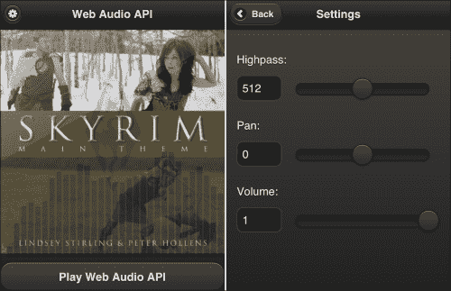

Web 音频 API 是一项非常重要的业务。这个例子是根据苹果网站上的例子改编的。它只播放一种声音。然而，Web Audio API 的设计理念是可以播放多种声音，以多种方式改变它们，甚至可以使用 JavaScript 动态生成声音。深入到这一步可能值得一本自己的书。这也需要比我可能有过的更深入的音频处理知识。同时，如果您想在 jQuery Mobile 中看到这个概念证明，您将在`webaudioapi.html`中的示例源代码中找到它。要更深入地了解即将发生的事情，您可以在[查看文档 https://dvcs.w3.org/hg/audio/raw-file/tip/webaudio/specification.html](https://dvcs.w3.org/hg/audio/raw-file/tip/webaudio/specification.html) 。

# 提示用户安装您的应用程序

还记得在[第 6 章](06.html "Chapter 6. HTML5 Audio")、*HTML5 音频*、中，我们添加了 Apple touch 图标，以使 Lindsey Stirling 站点在书签到主屏幕时看起来像一个应用程序吗？我们甚至使用清单文件在本地缓存资产，以便更快地访问和脱机使用。

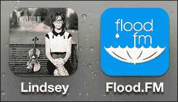

现在让我们来看看我们可以如何促使用户下载 Furo.FM 应用程序到他们的家庭屏幕。很可能你以前见过它；它是一个小气泡，弹出并指导用户安装应用程序的步骤。

有很多不同的项目，但我所看到的最好的一个是由谷歌发起的一个衍生项目。非常感谢并尊重冈本托克先生在 GitHub（[上的发言 https://github.com/okamototk](https://github.com/okamototk) ）用于服用和改善。Okamototk 将泡沫演化为包括多个版本的 Android、传统 iOS，甚至黑莓。您可以在[找到他的原创作品 https://github.com/okamototk/jqm-mobile-bookmark-bubble](https://github.com/okamototk/jqm-mobile-bookmark-bubble) 。但是，除非你能读日语或者喜欢翻译，否则我建议你只使用本章示例中的代码。

不要太担心打扰你的客户。在这个版本中，如果他们三次消除书签气泡，他们就不会再看到它了。计数存储在 HTML5 LocalStorage 中；因此，如果他们清除了存储，他们将再次看到泡沫。谢天谢地，大多数人甚至不知道这是可以做到的，所以这不会经常发生。通常是像我们这样的极客清除本地存储和 cookies 之类的东西，当我们这样做的时候，我们知道自己在做什么。

在我的代码版本中，我将所有 JavaScript 组合成一个文件，放在 jQuery 导入和 jQuery Mobile 之间。在顶部，第一个未注释的行是：

```js
page_popup_bubble="#welcome";
```

这是您将更改为自己的第一页或希望气泡弹出的位置。

在我的版本中，我将字体颜色和文本阴影属性硬编码到气泡中。这是必要的，因为在 jQM 中，字体颜色和文本阴影颜色根据您使用的主题而变化。因此，在 jquerymobile 的默认“A”主题（黑色背景上的白色文本）中，字体显示为白色，白色气泡上有一个黑色阴影。现在，使用我的 jQM 修改版本，它看起来总是正确的。

我们只需要确保我们已经在头部设置了适当的链接，并且我们的图像已经就位：

```js
<link rel="apple-touch-icon-precomposed" sizes="144x144" href="images/album144.png">
<link rel="apple-touch-icon-precomposed" sizes="114x114" href="images/album114.png">
<link rel="apple-touch-icon-precomposed" sizes="72x72" href="images/album72.png">
<link rel="apple-touch-icon-precomposed" href="images/album57.png">
<link rel="shortcut icon" href="iimg/album144.png">
```

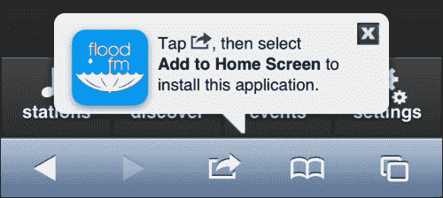

请注意此处的 Flood.FM 徽标。标志从标有`rel="apple-touch-icon-precomposed"`的链接标签中取出，注入气泡中。所以，实际上，`jqm_bookmark_bubble.js`中唯一需要修改的是`page_popup_bubble`。

# 新设备级硬件访问

我们的移动浏览器每年都会出现新的硬件级访问。下面是一些你现在可以开始做的事情和即将发生的事情。并非所有这些都适用于每个项目，但如果你创造性地思考，你可能会找到创新的方法来使用它们。

## 加速计

加速计是手机里的小爸爸，用来测量手机在太空中的方位。要了解这一点，请阅读[http://en.wikipedia.org/wiki/Accelerometer](http://en.wikipedia.org/wiki/Accelerometer) 。

这超出了我们一直使用的简单方向。这是真正的访问加速计的细节。想象一下，用户能够摇晃他们的设备或倾斜它，作为与你的应用程序交互的一种方法。也许 Flood.FM 正在播放一些他们不喜欢的东西，我们可以给他们一个有趣的方式来愤怒反对这首歌。这是一个简单的弹珠游戏，有人把它作为概念的证明。参见[http://menscher.com/teaching/woaa/examples/html5_accelerometer.html](http://menscher.com/teaching/woaa/examples/html5_accelerometer.html) 。

## 摄像机

苹果的 iOS 6 和安卓的 JellyBean 都可以访问文件系统和相机上的照片。诚然，这是这两个平台的最新和最伟大的版本。如果您打算支持许多过时的 Android 设备（2.3 2.4），而这些设备*仍在*货架上出售，就好像是全新的一样，那么您需要使用 PhoneGap 或 Apache Cordova 等本机编译来获得该功能。

```js
<input type="file" accept="image/*">
<input type="file" accept="video/*">
```

以下屏幕截图左侧为 iOS，右侧为 Android：

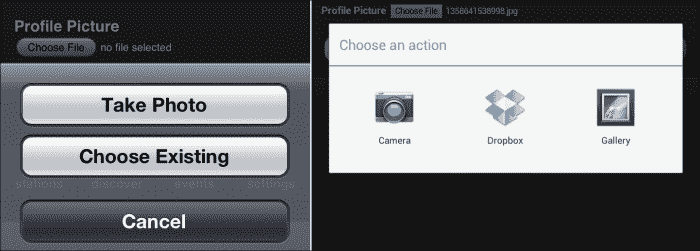

## API 即将上市

Mozilla 在推动移动 web API 方面做了很多工作。以下是即将推出的产品，可能在不到两年的时间内即可投入使用：

*   电池电量
*   充电状态
*   环境光传感器
*   接近传感器
*   振动
*   联络
*   网络信息
*   移动连接（载波、信号强度等）
*   网络短信
*   网络蓝牙
*   网络调频
*   存档 API（打开和读取压缩文件夹中的内容）

如果您想阅读更多内容，请点击退出[https://wiki.mozilla.org/WebAPI](https://wiki.mozilla.org/WebAPI) 。

# 应用还是不应用，这是个问题

您是否应该将项目编译为本机应用程序？这里有一些需要考虑的事情。

## 游行队伍上下着雨（认真对待）

当你将你的第一个项目编译成一个应用程序时，你会感到一种兴奋。你做到了！你做了一个真正的应用程序！正是在这一点上，我们需要记住电影《侏罗纪公园》中伊恩·马尔科姆博士的话（再去看一次，我等一下）：

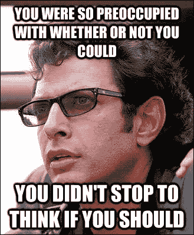

> “你站在天才的肩膀上，以最快的速度完成了一件事，在你还不知道自己拥有什么之前，你就申请了专利，把它包装起来，然后把它拍打在一个塑料午餐盒上，现在[砰砰地一声放在桌子上]你在卖它，你想卖它。嗯……你的科学家们全神贯注于他们是否能做到，以至于他们没有停下来思考他们是否应该做到。”

这些话对我们来说非常接近预言。最后，他们自己创造的午餐吃掉了大部分客人。

根据 2012 年 8 月的本报告[http://www.webpronews.com/over-two-thirds-of-the-app-store-has-never-been-downloaded-2012-08](http://www.webpronews.com/over-two-thirds-of-the-app-store-has-never-been-downloaded-2012-08) （以及我以前见过的一些类似的应用程序），*应用程序商店中超过三分之二的应用程序从未下载过*。一次也没有！因此，现实地说，应用商店是大多数项目失败的地方。

即使你的应用被发现，任何人在任何重要时期使用它的可能性都是惊人的小。根据《福布斯》上的这篇文章（[http://tech.fortune.cnn.com/2009/02/20/the-half-life-of-an-iphone-app/](http://tech.fortune.cnn.com/2009/02/20/the-half-life-of-an-iphone-app/) ），大多数应用程序在几分钟内就被放弃了，再也没有打开过。付费应用在被遗忘或删除之前的持续时间大约是前者的两倍。游戏有一定的持久力，但老实说，jQuery Mobile 并不是一个引人注目的游戏平台，不是吗？

安卓世界的状况非常糟糕。人们仍然可以购买运行古老版本操作系统的设备，运营商和硬件合作伙伴甚至都不会及时提供更新。如果你想通过采用本土策略来监控你的悲伤深度，请看这里：

[http://developer.android.com/about/dashboards/index.html](http://developer.android.com/about/dashboards/index.html)

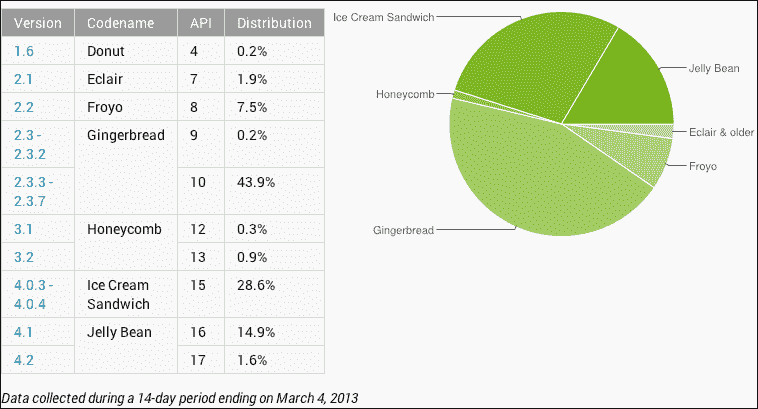

你可以看到 Android 环境的分裂程度，以及你可能需要支持多少旧版本。在安卓及其业务合作伙伴集体出头之前，安卓将继续是本地移动世界的 InternetExplorer6。你不想支持这一点。

另一方面，如果你严格地发布到 web 上，那么每次你的用户访问你的站点时，他们都会使用最新的 API 发布最新的版本，你就不必担心有人使用过时的版本。您是否有需要应用的安全修补程序？你可以在几秒钟内完成。如果你在苹果应用商店，这个补丁可能需要几天甚至几周的时间。

## 编写应用程序的三个好理由

是的，我知道我刚刚告诉你你成功的机会很小，你将面临支持应用程序的挑战。然而，这里有一些很好的理由来制作一个真正的应用程序。事实上，在我看来，这是唯一可以接受的理由。

### 项目本身就是产品

这是您需要将项目打包为应用程序的第一个也是唯一确定的迹象。我不是说通过你的项目来卖东西。我说的是项目本身。它应该被制作成一个应用程序。愿原力与你同在。

### 仅访问本机硬件功能

GPS 和摄像头在其最新版本中可可靠地用于两个主要平台。iOS 甚至支持加速计。然而，如果您想要的不止这些，您需要编译成一个应用程序来访问这些 API。

### 推送通知

你喜欢吗？我不知道你的情况，但我收到的推送通知太多了；任何过于激进的应用程序要么被卸载，要么其通知被完全关闭。我不是唯一一个这样做的人。但是，如果您只是必须有推送通知，并且不能等待基于 web 的实现，那么您必须编译一个应用程序。

### 支持现有客户

好的，这是一个延伸，但如果你在美国公司工作，你会听到它。其理念是，你是一家成熟的企业，你希望为你的客户提供移动支持。你或你以上的人读过一些白皮书和/或案例研究，这些研究表明，几乎 50%的人首先在应用商店中搜索。

即使这是真的（我仍然不相信），你在和一个商人交谈。他们了解资金、费用和升级维护。一旦你向他们解释了在野外构建和测试所有平台及其操作系统版本的成本、复杂性和潜在的持续性难题，那么向你现在支持移动设备的现有客户进行营销推广就成为一个非常有吸引力的选择，他们所要做的就是用他们的移动设备访问你的网站。不管怎样，营销人员总是在寻找向客户吹嘘的理由。营销部门可能仍然希望在客户的设备上安装公司图标，以增强品牌忠诚度，但这只是一个简单的问题，让他们知道，不使用应用程序也可以做到这一点。

在客户支持方面，你可能仍然无法说服所有正确的人，应用程序是错误的选择。如果你自己做不到，就用一点雅各布·尼尔森（Jakob Nielson）打他们的头。如果他们不听你的，也许他们会听他的。任何人说尼尔森诺曼集团不知道他们在说什么，我都会反抗。参见[http://www.nngroup.com/articles/mobile-sites-vs-apps-strategy-shift/](http://www.nngroup.com/articles/mobile-sites-vs-apps-strategy-shift/) 。

> “概述：目前，移动应用程序的可用性比移动网站好，但即将到来的变化最终将使移动网站成为一种优越的战略。”

所以 64000 美元的问题变成了：我们是在为现在还是为未来做些什么？如果我们现在就这样做，那么标志着本土战略退休的标准是什么？还是我们打算永远锁定它？没有退出策略，不要卷入那场战争。

# PhoneGap 对 Apache Cordova

好吧，在所有这些之后，如果你仍然在考虑制作一个本地应用程序，我向你致敬。我钦佩你的精神，祝你好运。

### 注

如果你在谷歌上搜索“jquerymobilephonegap performance”，你会发现大量负面文章。问题似乎很多。性能缓慢，在转换之间屏幕闪烁，等等。并不是说 Sencha Touch 或任何其他移动 web 框架似乎做得更好。请注意，它的性能可能不如在 web 上的性能。

PhoneGap 最初是一个项目，它采用常规的 HTML、JS 和 CSS，并将它们很好地打包到任何应用商店的可分发应用程序中。最终，它成为了 Apache 软件基金会的一部分。其核心，PhoneGap*是*Apache Cordova。事实上，如果你去 Cordova 的文档站点，它实际上仍然托管在[http://docs.phonegap.com/](http://docs.phonegap.com/) 。

除了简单地编译应用程序外，您还可以访问以下设备级 API：

*   加速计：点击设备的运动传感器。
*   照相机：使用设备的照相机拍摄照片。
*   捕获：使用设备的媒体捕获应用程序捕获媒体文件。
*   指南针：获取设备指向的方向。
*   连接：快速检查网络状态和蜂窝网络信息。
*   联系人：使用设备的联系人数据库。
*   设备：收集特定于设备的信息。
*   事件：通过 JavaScript 钩住本机事件。
*   文件：通过 JavaScript 连接到本机文件系统。
*   地理位置：让您的应用程序知道位置。
*   全球化：启用特定于区域设置的对象的表示。
*   InApp 浏览器：在另一个应用程序浏览器实例中启动 URL。
*   媒体：录制和播放音频文件。
*   通知：视觉、听觉和触觉设备通知。
*   Splashscreen：显示和隐藏应用程序启动屏幕。
*   存储：连接到设备的本机存储选项。

到目前为止，一切顺利。我们可以做更多的事情，我们可以用 JavaScript 来完成。

接下来，我们需要实际构建我们的应用程序。您需要将 PhoneGap 或 Cordova 下载到您的计算机上。别忘了为您打算支持的每个平台下载 SDK。不，等等，把它刮掉！

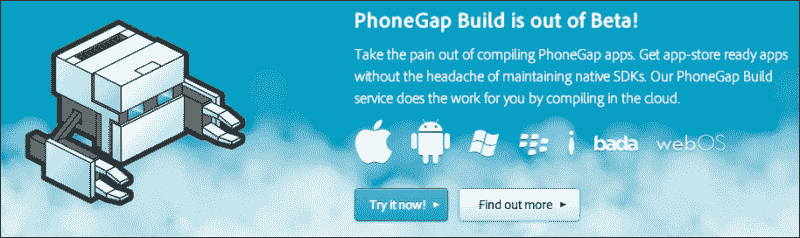

现在有了 PhoneGap 构建。这是一个基于云的 PhoneGap 构建服务。您根本不必安装任何 SDK。PhoneGap 构建完成了所有的工作。如果你想让它编译 iOS 应用程序，你仍然需要向它们提供开发者证书，但除了这个小问题，你还是可以去的。

要开始，您只需使用您的 Adobe ID 或 GitHub ID 登录即可。然后将 URL 粘贴到您要构建的 GitHub repo，或者上载一个大小小于 9.5 MB 的 zip 文件：

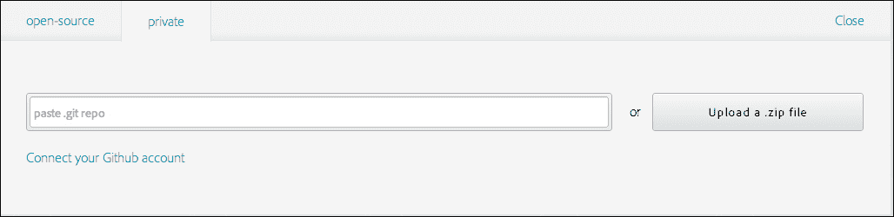

接下来，您需要填写一些关于应用程序本身的信息：

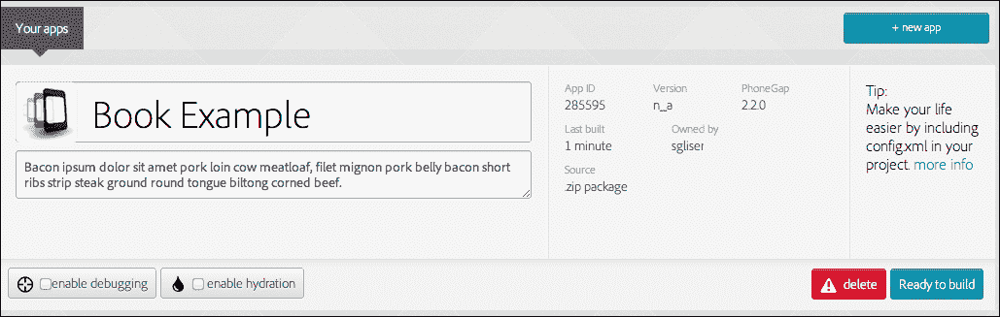

点击**准备构建**按钮。现在，坐下来看看这些漂亮的进度纺纱机在做他们的事情。

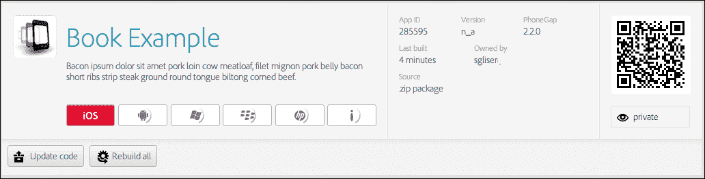

看，他们甚至会给你一个可爱的二维码来扫描你下载的应用。它在 iOS 上显示红色符号的唯一原因是，在这一点上，我没有给他们我的开发者证书。

# 总结

我不知道你的情况，但我已经筋疲力尽了。我真的不认为现在有更多关于 jQuery Mobile 或其支持技术的内容。您已经有了一些示例，介绍了如何为许多行业构建产品，以及如何通过 Web 或 PhoneGap 构建来部署产品。在这一点上，你应该引用建筑商鲍勃的话。“我们能建造它吗？是的，我们能！”

我希望这本书帮助和/或激励你去做一些伟大的事情。我希望你能改变这个世界，并因此而变得富有。我很想在你们前进的过程中听到你们的成功故事。要让我知道您的情况，或者让我知道任何勘误表，或者即使您只是有一些问题，请不要犹豫，直接给我发电子邮件`<[shane@roughlybrilliant.com](mailto:shane@roughlybrilliant.com)>`。现在，去做个聪明人吧！