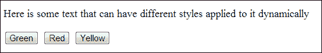
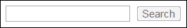

# 一、文档对象模型操作

在本章中，我们将介绍：

*   选择元素
*   查找和选择同级元素
*   创建 DOM 元素
*   将内容插入元素
*   修改 DOM 元素属性
*   添加和删除 CSS 类以动态更改其样式
*   通过更改按钮的属性来启用和禁用按钮
*   更新页面中的图像
*   填充列表元素
*   理解分页
*   删除 DOM 元素
*   重用 DOM 元素

# 导言

本章介绍 jQuery 查找、选择和操作 DOM 元素的基本原则。jQuery 使 JavaScript 开发人员可以轻松地使用各种方法选择单个或多个 HTML 页面元素。

一旦开发人员选择了这些元素，jQuery 就提供了操作这些元素的能力，以便通过修改属性（如样式、禁用和类）来创建更丰富的用户体验。

# 选择元素

有许多方法可以使用 jQuery 选择 DOM 元素。我们将在这里探讨主要的方法。对于熟悉 CSS 的开发人员，在使用 jQuery 选择元素时可以使用相同的语法（即，`#content`、`.content`等等）。

## 准备好了吗

在文本编辑器或所选 IDE 中打开空白 HTML 文档。请确保下载了 jQuery 的最新版本，并且可以轻松访问，以便包含在此 HTML 文档中。在本章中创建新的 HTML 文件时，请确保它们都与 jQuery 库文件位于同一目录中，以便轻松地包含到 HTML 文档中。

## 怎么做…

要了解如何使用 jQuery 选择各种 DOM 元素，请执行以下每个配方步骤：

1.  使用以下 HTML 和 JavaScript 代码创建网页：

    ```js
    <!DOCTYPE html>
    <html>
    <head>
       <title>Selecting Elements with jQuery</title>
       <script src="jquery.min.js"></script>
       <script>
          $(function(){
             var content = $("#content"); //Select the content div
             var span = $(".span-element"); //Select the span element
             var listelements = $("li"); //Select all the list elements
          });
       </script>
    </head>
    <body>
    <div class="division-container">Some text within a div which has a class</div>
    <div id="content">Some text within a div which has an ID attribute</div>
    <a href="#">A link</a>
    <a href="#" rel="dofollow">A second link</a>
    <ul class="info-list">
       <li>List Item 1</li>
       <li>List Item 2</li>
       <li>List Item 3</li>
    </ul>
    <button>Button 1</button>
    <span class="span-element">Span 1</span>
    </body>
    </html>
    ```

2.  要选择这些元素中的任何一个，请使用 jQuery 的`$()`函数。我们可以将此函数与结合使用，为我们想要选择的元素提供标识符或 CSS 选择器；例如，它的 HTML 标签`li`和 ID`#content`或类`.content`。

### 提示

**下载示例代码**

您可以下载您在[账户购买的所有 Packt 书籍的示例代码文件 http://www.packtpub.com](http://www.packtpub.com) 。如果您在其他地方购买了本书，您可以访问[http://www.packtpub.com/support](http://www.packtpub.com/support) 并注册，将文件直接通过电子邮件发送给您。

## 它是如何工作的…

选择 DOM 元素的最简单方法是通过其 ID。我们知道 HTML 文档中的所有 ID 都应该是唯一的；因此，通过选择 ID 为的元素，您将选择单个元素。

参考前面的 HTML 文档，如果要选择 ID 为`content`的`<div>`，可以使用以下 jQuery 代码进行选择：

```js
$(function(){
   var content = $('#content');
});
```

这将使 DOM 元素在`content`变量中可用。本章后面将介绍更多关于这意味着什么的内容。

### 注

加载页面时，jQuery 会自动执行`$(function(){ });`中的任何代码。

我们也可以使用它们的类以同样的方式选择元素。代码与前面的示例非常相似，只是我们使用了类前缀（`.`）而不是 ID 前缀（`#`），如下所示：

```js
$(function(){
   var span = $('.span-element');
});
```

我们不仅可以根据我们指定的某个标识符（即类或 ID）选择元素，还可以根据它们的标记名选择元素。如果要选择页面中的所有`li`元素，可以使用`$('li')`，如下图所示：

```js
$(function(){
   var listelements = $('li');
   var i = 1;
   listelements.each(function(){
      console.log("Loop: " + i);
      i++;
   });
});
```

前面的示例使用 jQuery 选择器选择页面中的所有列表元素。为了证明`listelements`现在包含多个元素，我们循环这些元素并向控制台输出一些信息。

### 注

`.each()`是一个 jQuery 函数。在[第 3 章](03.html "Chapter 3. Loading and Manipulating Dynamic Content with AJAX and JSON")中了解更多关于它的用法，*使用 AJAX 和 JSON 加载和操作动态内容*。

前面示例的控制台输出如下所示：

```js
Loop: 1
Loop: 2
Loop: 3
```

### 注

您可以通过多种方式访问 JavaScript 控制台，具体取决于您选择的浏览器：

*   **Chrome**：*Ctrl*+*Shift*+*J*（**Mac**：*命令*+*选项*+*J*）
*   **互联网浏览器**：*F12*
*   **Firefox**：*Ctrl*+*Shift*+*K*

## 还有更多…

也可以基于其他属性（例如其`rel`或`disabled`属性）选择元素。

下面的代码向我们展示了如何选择具有`rel`属性`nofollow`的锚元素：

```js
$(function(){
   var nofollow = $('a[rel="nofollow"]');
});
```

## 另见

*   *查找和选择兄弟元素*

# 查找和选择兄弟元素

您可能并不总是知道需要选择的特定元素。您可能只知道它的父元素，因此，需要搜索父元素中的元素，以找到您正在查找的特定元素。本食谱将向您展示如何通过元素的父元素以各种方式查找元素。

## 准备好了吗

使用最新版本的 jQuery 打开您的文本编辑器或 IDE，准备将其包含到您将创建的 HTML 页面中，作为此配方的一部分。

## 怎么做…

要了解 jQuery 可以帮助您基于父元素搜索 DOM 元素的各种方式，请执行以下每个步骤：

1.  使用以下 HTML 和 JavaScript 代码创建网页：

    ```js
    <!DOCTYPE html>
    <html>
    <head>
       <title>Finding and selecting sibling elements</title>
       <script src="jquery.min.js"></script>
       <script>
          $(function(){
             var element1 = $('#content .top .top-left'); //Select the top left division element
             var element2 = $('.parent').find('a'); //Select the anchor element
             var element3 = $('.parent').find('.grandchild'); //Select the grandchild element
          });
       </script>
    </head>
    <body>
    <div class="division-container">Some text <span>within</span> a div <span>which</span> has a many <span>span</span> elements.</div>
    <div id="content">
       <div class="top">
          <div class="top-left">Left</div>
          <div class="top-right">Right</div>
       </div>
    </div>
    <ul class="info-list">
       <li>List Item 1</li>
       <li>List Item 2</li>
       <li>List Item 3</li>
    </ul>
    <ul class="second-info-list">
       <li>Second List Item 1</li>
       <li>Second List Item 2</li>
       <li>Second List Item 3</li>
    </ul>
    <div class="parent">
       <div class="child">
          <div class="grandchild">
             <a href="#">A Link</a>
          </div>
       </div>
    </div>
    </body>
    </html>
    ```

2.  这段代码使用多个类名的方式与 CSS 从 HTML 中选择子元素的方式相同。或者，您可以在父元素上使用 jQuery 的`find()`函数在其中进行搜索。

## 它是如何工作的…

基于父元素选择子元素的最简单方法是使用与 CSS 中相同的选择器（即，`.classname``.anotherclass`）。话虽如此，您并不总是知道要查找的兄弟元素的确切位置。如果是这种情况，我们可以使用有用的 jQuery 的`find()`函数。jQuery 的`find()`函数将在指定的父元素中搜索您正在查找的同级元素。

基于*如何操作…*部分中的 HTML，下面的 JavaScript 演示了如何以与 CSS 中相同的方式直接访问子元素：

```js
$(function(){
   var element1 = $('#content .top .top-left');
});
```

这将使 DOM 元素在`content`变量中可用。本章后面将介绍更多关于这意味着什么的内容。

要在不知道其确切位置的情况下查找子元素，我们可以使用以下 JavaScript 在`<div class="grandchild">`元素中定位锚点：

```js
$(function(){
   var element2 = $('.parent').find('a');
});
```

请注意，您只需要指定父选择器和要查找的元素。`find()`方法只是基于指定的父元素遍历 DOM，直到它找到您要查找的元素或没有要检查的元素为止。您可以在`find()`方法中使用 ID 和类名以及 HTML 标记。

## 还有更多…

您还可以使用 CSS3 选择器，例如`$()`中的`:first-child`和`:last-child`来帮助您选择所需的 DOM 元素。

## 另见

*   *选择元素*

# 创建 DOM 元素

要创建丰富的交互式用户界面，我们需要能够动态地将 DOM 元素添加到网页中。基于用户交互或页面加载等其他事件，可能需要将元素添加到 web 页面。

## 准备好了吗

对于这个配方，您需要另一个空白 HTML 文件。在与先前配方文件相同的目录中创建一个名为`recipe-3.html`的新 HTML 文件。

## 怎么做…

通过执行以下步骤，了解如何使用 jQuery 创建 DOM 元素：

1.  将以下 HTML 代码添加到您的`recipe-3.html`文件中，以创建一个带有无序列表的基本 HTML 页面，并包括 jQuery 库：

    ```js
    <!DOCTYPE html>
    <html>
    <head>
       <title>Creating DOM elements</title>
       <script src="jquery.min.js"></script>
       <script></script>
    </head>
    <body>
    <div id="container">
       <ul id="myList">
          <li>List Item 1</li>
          <li>List Item 2</li>
          <li>List Item 3</li>
       </ul>
    </div>
    </body>
    </html>
    ```

2.  在 HTML 文档头部的脚本标记中添加以下 JavaScript。在`#myList`元素使用 jQuery 的`after()`和`insertAfter()`函数之后，下面的 JavaScript 代码将向 DOM 添加两个按钮：

    ```js
    $(function(){
       $('#myList').after("<button>Button 1</button>");
       $('<button>Button 2</button>').insertAfter("#myList");
    });
    ```

## 它是如何工作的…

要将 DOM 元素动态添加到文档的任何部分，我们可以使用 jQuery 的`append()`、`addAfter()`、`after()`、`addBefore()`和`before()`功能。功能`after()`和`insertAfter()`基本上执行相同的动作；区别在于表达式的指定顺序。这与`insertBefore()`和`before()`相同。

基于*中的 HTML 文件，如何做。。。*节，以下 JavaScript 将在无序列表元素后添加两个按钮元素：

```js
$(function(){
   $('#myList').after("<button>Button 1</button>");
   $('<button>Button 2</button>').insertAfter("#myList");
});
```

执行上述 JavaScript 后，浏览器中呈现的 HTML 应修改如下：

```js
<!DOCTYPE html>
<html>
<head>
   <title> Creating DOM elements</title>
   </head>
<body>
<div id="container">
   <ul id="myList">
      <li>List Item 1</li>
      <li>List Item 2</li>
      <li>List Item 3</li>
   </ul>
      <button>Button 2</button>
      <button>Button 1</button>
</div>
</body>
</html>
```

请注意，即使第二个按钮是最后添加的，它也是 HTML 中的第一个按钮。这是因为我们已经指定按钮应该插入无序列表元素之后。`.before()`和`.insertBefore()`jQuery 方法的工作方式完全相同，只是按钮元素位于无序列表元素之上。

动态网页和 web 应用程序的一个常见要求是能够向列表中添加新项。这最好通过使用`.append()`功能来实现：

```js
$(function(){
   $('#myList').append("<li>List Item 4</li>");
});
```

此 JavaScript 将在无序列表元素`#myList`的底部添加带有文本`List Item 4`的新列表项。或者，可以使用`prepend()`功能将列表项插入列表顶部。

## 还有更多…

jQuery 为开发人员提供了许多方法，可以向 DOM 中添加、追加、插入和更新元素，而这些元素无法在单个配方中演示。通过阅读 jQuery 文档，确保您知道这些备选方案。

## 另见

*   *将内容插入元素*
*   *删除 DOM 元素*
*   *重复使用 DOM 元素*

# 在元素中插入内容

交互式动态 web 应用程序和网站不仅要求 web 开发人员能够创建 DOM 元素，还要求开发人员能够添加动态内容。这可以通过另一组 jQuery 函数轻松实现。

## 准备好了吗

创建一个名为`recipe-4.html`的空白 HTML 文档，并确保此 HTML 文档中包含最新版本的 jQuery。

## 怎么做…

通过执行以下每个步骤，了解如何将内容动态添加到 DOM 中：

1.  将以下代码添加到新创建的 HTML 文档中，这将创建一个简单的 HTML 网页：

    ```js
    <!DOCTYPE html>
    <html>
    <head>
       <title>Insert content into an element</title>
       <script src="jquery.min.js"></script>
       <script>

       </script>
    </head>
    <body>
    <div id="container">
       <p>Here is some current HTML content</p>
    </div>
    <textarea id="myTextarea"></textarea>
    </body>
    </html>
    ```

2.  在文档头的脚本标记中插入以下 JavaScript 代码。此代码将在不同点向 DOM 中注入不同的 HTML 内容和元素。

    ```js
    $(function(){
       //Remove the container elements current HTML
       $('#container').html("<p>I have replaced the all the HTML within the #container element</p>");

       //Add some more HTML to the beginning of the container element
       $('#container').prepend("<p>Another paragraph that has been prepended.</p>");

       //Add a button to the end of the container element after all other HTML content
       $('#container').append("<button>A Button Appended</button>");

       //Add some text into the text area element
       $('#myTextarea').val("Added some text using .text()");
    });
    ```

## 它是如何工作的…

向元素添加内容的最快方法是使用`html()`函数。通过向该函数提供字符串作为参数，它将用提供的字符串替换所选元素的当前 DOM 内容。如果没有提供字符串，此函数将返回元素的 DOM 内容格式为 HTML 字符串。

除了替换元素的内容外，我们还可以使用`append()`和`prepend()`分别在当前内容的末尾和开头添加额外的内容。此外，我们还有其他可用的函数，如`text()`，它将在将字符串插入元素之前对任何 HTML 进行解码。因此，`text()`功能通常用于文本区域。

基于上一节中提供的 HTML，我们可以使用前面讨论的 jQuery 函数更改`#container`元素的内容，如下所示：

```js
$(function(){
$('#container').html("<p>I have replaced the all the HTML within the #container element</p>");

$('#container').prepend("<p>Another paragraph that has been prepended.</p>");

$('#container').append("<button>A Button Appended</button>");

$('#myTextarea').val("Added some text using .text()");
});
```

执行这些函数后，浏览器呈现的 HTML 文件将被转换，如下所示：

```js
<!DOCTYPE html>
<html>
<head>
   <title>Insert content into an element</title>
</head>
<body>
<div id="container">
   <p>Another paragraph that has been prepended.</p><p>I have replaced the all the HTML within the #container element</p>
   <button>A Button Appended</button>
</div>
<textarea id="myTextarea">Added some text using .text()</textarea>
</body>
</html>
```

## 另见

*   *创建 DOM 元素*

# 修改 DOM 元素属性

我们可以使用 jQuery 动态地修改元素属性，如 class、style 和 disabled，这意味着可以直观地更改和更改一系列 HTML 元素的功能。

## 准备好了吗

同样，这个配方需要一个额外的空白 HTML 文档。创建一个名为`recipe-5.html`的文件，并将其打开并准备好进行编辑。

## 怎么做…

了解如何通过执行以下每个步骤来更改 DOM 元素的属性：

1.  将以下 HTML 代码添加到空白的`recipe-5.html`文件中，以创建包含两种输入类型的基本 HTML 页面：

    ```js
    <!DOCTYPE html>
    <html>
    <head>
       <title>Modifying DOM element attributes and properties</title>
       <script src="jquery.min.js"></script>
       <script>

       </script>
    </head>
    <body>
    <input type="checkbox" />
    <input type="text" />
    </body>
    </html>
    ```

2.  在前面的 HTML 代码中，在脚本标记中添加以下 JavaScript 代码以禁用输入，修改其值，并选中复选框：

    ```js
    $(function(){
       //Set the checkbox to be checked
       $('input[type="checkbox"]').prop('checked', true);
       //Disable any text inputs
       $('input[type="text"]').prop('disabled', true);
       //Change the value of any text inputs
       $('input[type="text"]').val("This is a new Value!");
    });
    ```

## 它是如何工作的…

jQuery 为我们提供了一个`prop()`函数，如果没有指定值，它将检索指定的属性；如果提供了值，它将更改所选元素上的指定属性。这可以用于更改属性值，例如复选框上的`checked`或文本输入上的`disabled`属性。我们可以使用`prop()`函数改变文本输入的值；但是，最好使用专门用于此任务的`val()`功能。

通常，这将基于用户触发的事件进行，但为了尽可能简单地说明这一点，以下 JavaScript 在页面加载时会这样做：

```js
$(function(){
   $('input[type="checkbox"]').prop('checked', true);
});
```

此 JavaScript 将检查页面中类型为`checkbox`的每个输入。类似地，我们只需稍作修改即可改变文本输入的禁用状态：

```js
$(function(){
   $('input[type="text"]').prop('disabled', true);
});
```

我们还可以使用`val()`函数，使用以下 JavaScript 向每个文本输入添加一些文本：

```js
$(function(){
    $('input[type="text"]').val("This is a new Value!");
});
```

通常，可以使用 jQuery 链接函数。您可以通过内联使用这两个函数（即`$('input[type="text"]').prop('disabled', true).val("This is a new Value!");`）来实现前两个操作，它们将依次执行。

## 另见

*   *通过更改按钮属性来启用和禁用按钮*
*   *添加和删除 CSS 类以动态更改其样式*

# 添加和删除 CSS 类以动态更改其样式

jQuery 附带了类操作函数，以允许开发人员轻松地更改任何 HTML 元素的样式。

## 准备好了吗

对于任何用途的元素样式更改，我们首先需要在 HTML 文档中声明一些样式。下面的 HTML 代码有一系列样式和元素，我们可以使用它们来说明 jQuery 的这个功能：

```js
<!DOCTYPE html>
<html>
<head>
   <title>Add and remove CSS classes to dynamically change their style</title>
   <script src="jquery.min.js"></script>
   <script></script>
   <style type="text/css">
      .green {
         background-color: #008000;
         color: #FFFFFF;
      }
      .red {
         background-color: #FF0000;
         color: #FFFFFF;
      }
      .yellow {
         background-color: #FFFF00;
         color: #000000;
      }
   </style>
</head>
<body>
   <p id="sometext">
      Here is some text that can have different styles applied to it dynamically</p>
   <button id="green-btn">Green</button>
   <button id="red-btn">Red</button>
   <button id="yellow-btn">Yellow</button>
</body>
</html>
```

在这段 HTML 代码中，我们有三个按钮，它们有自己独特的 ID。我们还有一个带有 ID 的段落。定义了三个 CSS 类：`green`、`red`和`yellow`。使用 jQuery，我们可以监听这些按钮的点击，然后动态地将其中一个类应用于段落元素。

如果保存此 HTML 文件并在浏览器中打开，则应具有以下网页：



## 怎么做…

1.  在刚刚创建的 HTML 页面中的脚本标记的中添加以下 JavaScript 代码：

    ```js
    $(function(){
       //Listen for a click event on the green button
    $('#green-btn').click(function(){
       //When the green button has been clicked
       //Remove all classes current on the #sometext paragraph
       $('#sometext').removeClass();
       //Add the .green class to the #sometext paragraph
       $('#sometext').addClass('green');
    });
       //Listen for a click on the red button
    $('#red-btn').click(function(){
       //When the red button has been clicked
       //Remove all classes from the #sometext paragraph
       $('#sometext').removeClass(); 
       //Add the .red class to the #sometext paragraph 
       $('#sometext').addClass('red');
       });
       //Listen for a click on the yellow button
       $('#yellow-btn').click(function(){
          //When the yellow button has been clicked
          //Remove all classes from the #sometext paragraph
       $('#sometext').removeClass();
       //Add the .yellow class to the #sometext paragraph 
       $('#sometext').addClass('yellow');
       });
    });
    ```

2.  现在，在浏览器中打开 HTML 文档将允许您通过选择三个可用按钮中的任意一个来更改`#sometext`段落样式。

## 它是如何工作的…

jQuery 允许我们使用`click()`函数将单击事件处理程序附加到任何元素。然后，我们可以通过将函数作为参数传递给`click()`方法来执行我们选择的一组代码。要向元素添加类，我们可以使用`addClass()`函数并提供类名作为字符串参数。此函数将向所选元素添加指定的类名。

jQuery 还为我们提供了一个`removeClass()`函数。这允许我们通过向`removeClass()`提供字符串从元素中删除特定类，或者当未提供字符串时，它将从所选元素中删除所有类。我们需要使用此选项，以防止在多次单击任一按钮时向段落元素添加多个类。

以下屏幕截图显示了点击**黄色**按钮后的此网页：


## 另见

*   *修改 DOM 元素属性*
*   *通过更改按钮属性来启用和禁用按钮*

# 通过更改按钮的属性来启用和禁用按钮

动态启用和禁用按钮的功能对于将数据保存到 web 服务器等情况特别有用。为了防止用户在发出请求且客户端正在等待响应时发出多个保存请求，您可以动态禁用保存按钮。客户机收到 web 服务器的响应后，可以重新启用“保存”按钮。

该功能在简单情况下也非常有效，例如当用户输入搜索词时启用搜索按钮。这向用户表明，除非输入了术语，否则他们无法搜索。

## 准备好了吗

创建一个名为`recipe-7.html`的空白 HTML 文档，并将其打开并准备好进行编辑。

## 怎么做…

1.  下面的 HTML 代码创建了一个带有搜索输入和搜索按钮的网页，默认情况下该按钮处于禁用状态。将以下代码添加到`recipe-7.html`：

    ```js
    <!DOCTYPE html>
    <html>
    <head>
       <title>Enable and disable buttons by changing their properties </title>
       <script src="jquery.min.js"></script>
       <script>

       </script>
    </head>
    <body>
       <input type="text" id="search-input" />
       <button id="search-btn" disabled>Search</button>
    </body>
    </html>
    ```

2.  Saving and opening this HTML in a browser should provide you with a very simple web page having a single input and a disabled button as illustrated in the following screenshot:

    

3.  在前面创建的 HTML 文档的 head 部分的 script 标记中添加以下 JavaScript:

    ```js
    $(function(){
       //Listen for a key up event on the search input
    $('#search-input').keyup(function(){
         //When a user presses and releases a key
         //Check to see if the length of the inputted 
         //data is greater than 2 
         if ($(this).val().length > 2) {
            //If the input length is greater than 
            //two then we enable the search button
            $('#search-btn').prop("disabled", false);
       } else {
          //If the input length is equal to 2 or less we disable the search button
          $('#search-btn').prop("disabled", true);
       }
    });
    });
    ```

4.  在 web 浏览器中打开此页面将为您提供一个输入和一个禁用的搜索按钮，直到您在搜索输入中输入一些文本。当在搜索输入中输入文本且文本长度大于两个字符时，搜索按钮将可用。

## 它是如何工作的…

我们的目标是，一旦用户在搜索输入中输入了一些文本，就启用搜索按钮。为此，我们需要在搜索输入中附加一个`.keyup()`事件处理程序。这将允许我们在用户输入一些文本时执行一些代码。通过提供一个函数作为`keyup()`函数的参数，我们可以检查输入的数据。如果输入数据的长度为两个或更多字符（因为搜索少于三个字符会有点模糊），我们可以启用搜索按钮。

使用以下 JavaScript，我们能够监听数据输入，检查输入长度，并根据此启用或禁用搜索按钮：

```js
$(function(){
$('#search-input').keyup(function(){
   if ($(this).val().length > 2) {
      $('#search-btn').prop("disabled", false);
   } else {
   $('#search-btn').prop("disabled", true);
   }
});
});
```

首先，我们使用`$('#search-input').keyup();`将`keyup`事件附加到搜索输入，引用其 ID。然后，在回调函数中，我们可以使用`$(this)`检查当前输入文本的长度，该`$(this)`是指我们附加了`keyup`事件的元素。然后，`val()`函数获取输入的文本，我们可以使用`length`属性查找其长度。使用`if`/`else`语句，我们可以决定是否需要启用或禁用搜索按钮。

要启用或禁用搜索按钮，我们使用 jQuery 的`prop()`函数，并将禁用属性设置为`true`或`false`。

## 另见

*   *修改 DOM 元素属性*
*   *添加和删除 CSS 类以动态更改其样式*

# 更新页面内的图像

jQuery 允许开发人员动态更改网页上的图像。本食谱将向您展示如何以及如何使用时间戳来防止浏览器使用缓存图像，这在以这种方式动态交换图像时通常是一个问题。

## 准备好了吗

对于这个食谱，您将需要四个不同的图像。确保您有四个名为`black.png`、`red.png`、`blue.png`和`green.png`的小图像可用。

## 怎么做…

要了解如何使用 jQuery 更改图像，请完成以下每个步骤：

1.  在易于访问的目录中创建一个名为`recipe-8.html`的文件，并将以下 HTML 代码添加到此文件：

    ```js
    <!DOCTYPE html>
    <html>
    <head>
       <title>Change an image source and tackle browser caching to ensure it is always updated</title>
       <script src="jquery.min.js"></script>
       <script>

       </script>
    </head>
    <body>
       
       <div>
          <button id="red-btn">Red</button>
          <button id="green-btn">Green</button>
          <button id="blue-btn">Blue</button>
       </div>
    </body>
    </html>
    ```

2.  在创建`recipe-8.html`文件的目录中，创建另一个名为`images`的目录，并在此目录中添加四个图像，如下所示：
    *   `black.png`
    *   `red.png`
    *   `blue.png`
    *   `green.png`
3.  在`recipe-8.html`的`<script></script>`标记中添加以下 JavaScript:

    ```js
    $(function(){
       //Listen for a click on the red button
    $('#red-btn').click(function(){
       //When the red button has been clicked, change the source of the #square image to be the red PNG
       $('#square').prop("src", "images/red.png");
    });
       //Listen for a click on the green button
    $('#green-btn').click(function(){
       //When the green button has been clicked, change the source of the #square image to be the green PNG
       $('#square').prop("src", "images/green.png");
    });
    //Listen for a click on the blue button
    $('#blue-btn').click(function(){
       //When the blue button has been clicked, change the source of the #square image to be the blue PNG
       $('#square').prop("src", "images/blue.png");
    });
    });
    ```

4.  在浏览器中打开此网页将允许您将显示图像的来源从默认`black.png`更改为其他来源，具体取决于单击的按钮。

## 它是如何工作的…

要更改图像的源，我们可以使用 jQuery 的`prop()`函数并为`src`属性指定新的图像名称。为此，当使用我们的 HTML 代码创建的任一按钮被单击时，使用`.click()`为每个按钮附加一个单击事件处理程序，引用按钮的 ID，然后在`click()`回调函数中，使用指定的适当图像源执行`.prop()`，如下所示：

```js
$(function(){
$('#red-btn').click(function(){
   $('#square').prop("src", "images/red.png");
});

$('#green-btn').click(function(){
   $('#square').prop("src", "images/green.png");
});

$('#blue-btn').click(function(){
   $('#square').prop("src", "images/blue.png");
});
});
```

## 还有更多。。。

这个配方通过一个非常简单的示例说明了 jQuery 开发人员可以轻松更改图像源的方式。将使用该实现的更现实的情况是在 web 应用程序中，例如，当用户选择他们的化身时，可以上传图像。

传统上，用户将看到他们当前化身的预览，然后能够从他们的计算机中选择要上传的图像。使用 AJAX，网页可以将这个新图像发送到服务器；然后，服务器可以处理和保存此图像，并响应客户端网页。该网页使用 jQuery 的`prop()`方法，然后可以使用新上传的图像更新当前预览，并创建无缝过渡，而无需刷新页面以显示新图像。

当服务器对新映像使用与旧映像相同的文件名时，会出现问题。通常情况下，用户只能有一个化身；为了简单起见，然后使用用户的唯一 ID（例如，`123.png`）保存化身图像。

当服务器用新的图像文件名响应客户端时，由于文件名相同，浏览器会认为它是同一图像。这可能导致浏览器使用将是旧图像的化身图像的缓存版本。为了防止这种情况发生，我们可以在图像的文件名上预先加上时间戳。这将使浏览器将图像视为新图像，并强制其加载新图像。我们可以修改前面的 JavaScript 以实现以下目标：

```js
$(function(){
$('#red-btn').click(function(){
     $('#square').prop("src", "images/red.png?t=" + new Date().getTime());
});

$('#green-btn').click(function(){
     $('#square').prop("src", "images/green.png?t=" + new Date().getTime());
});

$('#blue-btn').click(function(){
     $('#square').prop("src", "images/blue.png?t=" + new Date().getTime());
});
});
```

使用 JavaScript 的`new Date()`方法，我们创建一个新日期，该日期将等于当前日期，时间将等于当前时间（毫秒）。然后我们使用`.getTime()`以毫秒为单位返回时间戳。更新源时，其外观如下所示：

```js

```

此代码将强制浏览器使用新指定的源重新加载图像，前提是用户不在相同的毫秒内更新他们的图像（实际上不可能）。

# 填充列表元素

列表元素通常在 Web 上使用；它们可以用来显示搜索结果、菜单和导航项，仅举几个例子。多亏了 CSS，它们不再需要枯燥乏味，而且可以对列表元素进行样式化，使您的数据更加美观。

使用 jQuery，可以动态填充列表元素。这可以通过 AJAX 响应直接从 JavaScript 数组完成，数据来自 web 服务器或其他一些源。

## 准备好了吗

创建一个名为`recipe-9.html`的空白 HTML 文档，并确保将其保存到可以包含最新版本 jQuery 的位置。

## 怎么做…

了解如何通过执行以下每个方法，使用 jQuery 动态填充列表：

1.  In order to demonstrate how you can use jQuery to populate a list element, we will create a JavaScript array of objects. Add the following HTML and JavaScript code to `recipe-9.html`, which you have just created:

    ```js
    <!DOCTYPE html>
    <html>
    <head>
       <title>Populating list elements</title>
       <script src="jquery.min.js"></script>
       <script type="text/javascript">
          var names = [
             {
                id: 1,
                firstname: 'Leon',
                lastname: 'Revill'
             },
             {
                id: 2,
                firstname: 'Allyce',
                lastname: 'Wolverson'
             },
             {
                id: 3,
                firstname: 'Harry',
                lastname: 'Round'
             },
                {
                   id: 4,
                   firstname: 'Chris',
                   lastname: 'Wilshaw'
                }
             ];
             $(function(){

          });
       </script>
    </head>
    <body>
        <ul id="namelist"></ul>
    </body>
    </html>
    ```

    ### 注

    在 JavaScript 代码的顶部，我们创建了一个包含一组名称的对象数组。我们将使用此数组填充 HTML 代码中的列表元素`#namelist`。

2.  在`$(function(){});`中添加以下 JavaScript，就在 JavaScript 数组下面。这个 JavaScript 将使用我们在*准备就绪*部分中创建的 JavaScript 数组中的对象来填充页面上的列表元素。

    ```js
    $.each(names, function(index, obj){
    $('#namelist').append("<li>#" + obj.id + " " + obj.firstname + " " + obj.lastname + "</li>");
    });
    ```

## 它是如何工作的…

我们使用 jQuery 的`$.each()`函数循环遍历`names`数组中的每个 JavaScript 对象。然后，对于这些对象中的每一个，我们可以创建一个`<li>`元素并插入`id`、`firstname`和`lastname`变量的值。最后，我们可以使用 jQuery`append()`函数将 list 元素附加到无序列表的末尾。

在`$.each()`函数中，第一个参数是我们希望迭代的数组，第二个参数是我们希望为`names`数组中的每个对象执行的函数。指定的函数也有两个参数：`index`和`obj`。`index`参数将包含 JavaScript 对象的当前数组索引，`obj`变量将包含实际的 JavaScript 对象。这两个变量在指定的回调函数中都可用。

然后，我们可以引用`obj.propertyName`（将`propertyName`替换为对象的属性），以便访问我们希望使用的对象的特定部分。通过这样做，我们构造一个字符串并将其传递给`append()`函数，然后该函数将其附加到指定的`#nameslist`无序列表中。

在浏览器中打开 HTML 页面，您将看到由 JavaScript 数组中的名称填充的列表，如下图所示：


## 另见

*   *创建 DOM 元素*
*   *重复使用 DOM 元素*

# 理解分页

分页是一种整理大量数据并以小的、易于阅读的部分或页面呈现给用户的行为。

通过 jQuery、JavaScript 函数和事件处理程序的组合，我们能够轻松地在页面中整理数据并将其呈现给用户。

## 准备好了吗

要创建分页的数据集，我们首先需要一些数据进行分页，然后需要一个位置来放置分页的数据。使用以下代码创建 HTML 页面：

```js
<!DOCTYPE html>
<html>
<head>
   <title>Chapter 1 :: DOM Manipulation</title>
   <script src="jquery.min.js"></script>
   <script>
      var animals = [
         {
            id: 1,
            name: 'Dog',
            type: 'Mammal'
         },
         {
            id: 2,
            name: 'Cat',
            type: 'Mammal'
         },
         {
            id: 3,
            name: 'Goat',
            type: 'Mammal'
         },
         {
            id: 4,
            name: 'Lizard',
            type: 'Reptile'
         },
         {
            id: 5,
            name: 'Frog',
            type: 'Amphibian'
         },
         {
            id: 6,
            name: 'Spider',
            type: 'Arachnid'
         },
         {
            id: 7,
            name: 'Crocodile',
            type: 'Reptile'
         },
         {
            id: 8,
            name: 'Tortoise',
            type: 'Reptile'
            },
            {
               id: 9,
               name: 'Barracuda',
               type: 'Fish'
            },
            {
               id: 10,
               name: 'Sheep',
               type: 'Mammal'
            },
            {
               id: 11,
               name: 'Lion',
               type: 'Mammal'
            },
            {
               id: 12,
               name: 'Seal',
               type: 'Mammal'
            }
         ];
      var pageSize = 4;
      var currentPage = 1;
      var pagedResults = [];
      var totalResults = animals.length;
      $(function(){
   });       
   </script>
</head>
<body>
   <ul id="list"></ul>
   <button class="previous"><< Previous</button>
   <button class="next">Next >></button>
</body>
</html>
```

在本页的 JavaScript 中，我们声明了一个名为`animals`的大型对象数组，它表示一组动物。在这个数组下面，我们又声明了四个变量，我们需要来对`animals`数组进行分页：

*   `pageSize`：这表示我们希望在单个页面上保存的结果的数量
*   `currentPage`：表示正在显示的当前页面
*   `pagedResults`：此表示包含`animals`数组一部分的数组，表示页面
*   `totalResults`：表示`animals`数组中的对象数；在本例中，`12`

## 怎么做…

要创建包含页面的动态列表，请执行以下每个步骤中的：

1.  直接在`$(function(){});`之后，但仍在`<script></script>`标记内，添加以下 JavaScript 函数：

    ```js
    function updateList() {
    //Grab the required section of results from the animals list
    var end = (currentPage * pageSize);
    var start = (end - pageSize);
    pagedResults = animals.slice(start, end);
    //Empty the list element before repopulation
    $('#list').empty();

    //Disable the previous button if we are on the first page
    if (currentPage <= 1) {
       $('.previous').prop("disabled", true);
    }
    //Enable the previous button if we are not on the first page
    else {
       $('.previous').prop("disabled", false);
    }

    //Disable the next button if there are no more pages
    if ((currentPage * pageSize) >= totalResults) {
       $('.next').prop("disabled", true);
    }
    //Enable the next button if there are results left to page
    else {
       $('.next').prop("disabled", false);
    }

    //Loop through the pages results and add them to the list
    $.each(pagedResults, function(index, obj){
       $('#list').append("<li><strong>" + obj.name + "</strong> (" + obj.type + ")</li>");
    });
    }
    ```

2.  在前面 HTML 页面的`$(function(){});` 中添加以下 JavaScript:

    ```js
    //Populate the list on load
    updateList();
    $('.next').click(function(){
    //Only increase the current page if there are enough results
    if ((currentPage * pageSize) <= totalResults) currentPage++;
    updateList();
    });

    $('.previous').click(function(){
    //Only decrease the current page if it is currently greater than 1
    if (currentPage > 1) currentPage--;
    updateList();
    });
    ```

## 它是如何工作的…

尽管分页看起来很复杂，但原则上它很简单。我们需要使用 jQuery 的`click()`函数来监听下一个和上一个按钮上的点击事件。当按下这些按钮时，`currentPage`变量会根据点击的按钮递增或递减。在此之后，`updateList()`函数获取`currentPage`值，从`animals`数组中计算出需要使用的数据段，用该数据填充`pagedResults`数组，然后将这些结果加载到 HTML 列表元素`#list`中。

此外，我们需要根据用户当前查看的页面禁用下一个或上一个按钮。如果他们当前正在查看第一页，可以使用 jQuery 的`prop()`功能将其`disabled`属性设置为`true`来禁用上一个按钮。如果用户正在查看最后一页（我们的函数可以使用`totalResults`、`currentPage`和`pageSize`变量来计算），我们需要禁用“下一步”按钮。

```js
//Populate the list on load
updateList();
$('.next').click(function(){
//Only increase the current page if there are enough results
if ((currentPage * pageSize) <= totalResults) currentPage++;
updateList();
});

$('.previous').click(function(){
//Only decrease the current page if it is currently greater than 1
if (currentPage > 1) currentPage--;
updateList();
});
```

为了扩展注释良好的代码，我们要做的第一件事是调用名为`updateList()`的函数，稍后我们将在本配方中介绍该函数。

### 注

请记住，`$(function(){});`中的任何代码都是在页面加载时执行的。

接下来，我们通过将回调函数作为参数传递给 Next 按钮，将 click 事件处理程序附加到 Next 按钮。对于此事件函数，我们可以指定每次单击“下一步”按钮时要执行的一些代码。我们指定的代码将`currentPage`变量增加`1`。如果有另一页可用的数据，它将通过形成`((currentPage * pageSize) <= totalResults)`条件作为`if`语句的一部分来实现。

最后，作为这个点击函数的一部分，我们调用前面提到的`updateList()`函数。

我们对上一个按钮也应用相同的逻辑，只是如果当前页面大于一，我们将递减`currentPage`值；因此，有一个页面可以返回。

在`$(function(){});`下方，但仍在`<script></script>`标记内，向 HTML 页面添加以下 JavaScript 函数：

```js
function updateList() {
//Grab the required section of results from the animals list
var end = (currentPage * pageSize);
var start = (end - pageSize);
pagedResults = animals.slice(start, end);
//Empty the list element before repopulation
$('#list').empty();

//Disable the previous button if we are on the first page
if (currentPage <= 1) {
   $('.previous').prop("disabled", true);
}
//Enable the previous button if we are not on the first page
else {
   $('.previous').prop("disabled", false);
}

//Disable the next button if there are no more pages
if ((currentPage * pageSize) >= totalResults) {
   $('.next').prop("disabled", true);
}
//Enable the next button if there are results left to page
else {
   $('.next').prop("disabled", false);
}

//Loop through the pages results and add them to the list
$.each(pagedResults, function(index, obj){
   $('#list').append("<li><strong>" + obj.name + "</strong> (" + obj.type + ")</li>");
});
}
```

为了保持良好的实践，再次对代码进行了良好的注释。此函数执行的第一个操作是计算需要使用`animals`数组的哪个部分。一旦计算了起始值和结束值，这是`animals`数组的索引值（例如，第一页的`0`到`4`，它使用 JavaScript 的`slice()`函数将该数据从`animals`数组复制到`pagedResults`数组。

### 注

注意不要使用类似的 JavaScript 的`.splice()`函数，因为这实际上会从`animals`数组中删除数据，并将其复制到`pagedResults`数组中。此外，`slice()`接受两个参数：第一个是零索引数字，说明数组的起始位置（即，`0`是起始位置），第二个参数不是数组中的位置，而是从起始点开始的元素数。

将所需结果存储在`pagedResults`数组中，使用 jQuery 的`empty()`函数清空无序列表`#list`中的任何数据。这是为了准备重新填充的列表。否则，单击“下一步”或“上一步”按钮并运行`updateList()`功能时，结果将被追加到当前列表的末尾，而不会被替换。

代码的下一部分是确定是否需要禁用或启用“下一个”和“上一个”按钮。我们可以通过设置条件`(currentPage <= 1)`来确定是否需要禁用前面的按钮，该条件只需检查当前页面是否小于或等于 1；如果是，我们需要禁用上一个按钮；否则，我们需要启用它。这是使用 jQuery 的`prop()`函数完成的，它允许我们操作所选元素的属性；这里，我们将`disabled`属性更改为`true`或`false`。我们可以使用`((currentPage * pageSize) >= totalResults)`确定是否需要禁用下一步按钮，该按钮计算`animals`数组中是否有足够的对象来创建下一页；如果没有，我们禁用按钮，但是如果有，我们启用它。

最后，我们使用 jQuery 的`$.each()`函数迭代`pagedResults`数组中的每个对象，并将每个对象的数据添加到页面上无序的列表中。

如果在浏览器中打开 HTML 页面，您将看到与下图所示类似的页面：


页面加载时，列表将填充第一页结果，因为`currentPage`被设置为`1`，并且`updateList()`功能也被设置为在页面加载时运行，这将禁用上一个按钮。

# 删除 DOM 元素

jQuery 使开发人员能够轻松地完全删除 DOM 元素，这在创建丰富的用户界面时非常有用。在界面表示数据库中的某些信息的情况下，删除元素的功能非常有用，它为用户删除数据库项提供了一种方法。如果此 UI 使用 AJAX 向 web 服务器发送删除请求，则需要在客户端反映删除操作，并删除表示数据库项的元素。

## 准备好了吗

创建一个空白 HTML 文档，并将其作为`recipe-11.html`保存到计算机上易于访问的位置。

## 怎么做…

通过执行以下每个步骤，了解如何使用 jQuery 删除 DOM 元素：

1.  将以下 HTML 代码添加到您刚刚创建的`recipe-11.html`页面：

    ```js
    <!DOCTYPE html>
    <html>
    <head>
       <title>Removing DOM elements</title>
       <script src="jquery.min.js"></script>
       <script>

       </script>
    </head>
    <body>
       <ul id="list">
          <li>Item 1 <button class="remove-btn">X</button></li>
          <li>Item 2 <button class="remove-btn">X</button></li>
          <li>Item 3 <button class="remove-btn">X</button></li>
          <li>Item 4 <button class="remove-btn">X</button></li>
       </ul>
    </body>
    </html>
    ```

2.  在上一个 HTML 文档的`<script></script>`标记中，添加以下 JavaScript 代码：

    ```js
    $(function(){
    //Listen for a click on any of the remove buttons
    $('.remove-btn').click(function(){
       //When a remove button has been clicked
       //Select this buttons parent (the li element) and remove it
       $(this).parent().remove();
    });
    });
    ```

3.  在浏览器中打开 HTML 文档，然后单击“删除”按钮删除选定的列表项。

## 它是如何工作的…

jQuery 为我们提供了一个`remove()`函数，它将从 DOM 中删除所选元素。在前面提到的情况下，您将有一个表示数据库中记录的项目列表。每个列表项都会提供一个删除按钮，允许用户删除所选项。

在现实世界中，这个 delete 按钮将向 web 服务器发出 AJAX 请求，等待响应，然后在客户端删除所选元素。为了保持这个方法的简单性，我们将只查看 JavaScript 代码来删除客户端的元素，而不会使用 AJAX。

### 注

[第 3 章](03.html "Chapter 3. Loading and Manipulating Dynamic Content with AJAX and JSON")*使用 AJAX 和 JSON*加载和操作动态内容，包含了丰富的 AJAX 配方。

我们可以使用 jQuery 的`click()`函数监听其中一个删除按钮上的点击事件。然后，我们可以使用`$(this).parent()`选择要删除的`<li>`元素，因为删除按钮是这个列表元素的同级。然后，我们可以使用不带参数的`remove()`方法删除所选列表元素。

## 另见

*   *创建 DOM 元素*
*   *重复使用 DOM 元素*

# 重复使用 DOM 元素

当使用 jQuery 动态创建元素（如列表项、分区和输入）时，可以重用这些元素，而不必在 JavaScript 中重写它们。相反，复制元素并只修改您希望更改的部分可能是有益的。

## 准备好了吗

使用您选择的文本编辑器，创建一个名为`recipe-12.html`的空白 HTML 文档，该文档位于易于访问最新版本 jQuery 的位置。

## 怎么做…

通过执行以下每个配方步骤，了解如何重用 DOM 元素：

1.  在您刚刚创建的`recipe-12.html`页面中，添加以下 HTML、CSS 和 JavaScript 代码：

    ```js
    <!DOCTYPE html>
    <html>
    <head>
       <title>Reusing DOM elements</title>
       <style type="text/css">
          .one {
             background-color: #CCC;
             color: #333;
          }
          .two {
             background-color: lawngreen;
             color: white;
          }
          .three {
             background-color: darkgreen;
             color: white;
          }
          .four {
             background-color: black;
             color: #666;
          }
          .dinosaur {
             background-color: darkred;
             color: red;
          }
       </style>
       <script src="jquery.min.js"></script>
       <script>
          var animals = [
             {
                id: 1,
                name: 'Dog',
                type: 'Mammal',
                class: 'one'
             },
             {
                id: 2,
                name: 'Cat',
                type: 'Mammal',
                class: 'one'
             },
             {
                id: 3,
                name: 'Goat',
                type: 'Mammal',
                class: 'one'
             },
             {
                id: 4,
                name: 'Lizard',
                type: 'Reptile',
                class: 'two'
             },
             {
                id: 5,
                name: 'Frog',
                type: 'Amphibian',
                class: 'three'
             },
             {
                id: 6,
                name: 'Spider',
                type: 'Arachnid',
                class: 'four'
             }
          ];
          $(function(){

          });
       </script>
    </head>
    <body>
    <ul id="animal-list">
       <li class='dinosaur'><strong><span class='name'>T-Rex</span></strong> <span class='type'>Dinosaur</span></li>
    </ul>
    </body>
    </html>
    ```

2.  在您根据前面代码创建的 HTML 页面中，在`$(function(){});`中添加以下 JavaScript:

    ```js
    $.each(animals, function(index, obj){
    //Clone the first element in the animal list
    var listTemplate = $('#animal-list li').first().clone();
    //Change its name to match this objects name
    listTemplate.find('.name').html(obj.name);
    //Changes its type to match this objects type
    listTemplate.find('.type').html(obj.type);
    //Remove all its current classes
    listTemplate.removeClass();
    //Add the class from this object
    listTemplate.addClass(obj.class);
    //Append the modified element to the end of the list
    $('#animal-list').append(listTemplate);
    });
    ```

3.  如果您在浏览器中打开新创建的网页，则应向您提供一个填充的列表元素，该元素与 JavaScript 数组`animals`中的对象相匹配。

## 它是如何工作的…

通过使用 jQuery 的`$.each()`方法，我们能够迭代 JavaScript`animals`数组中的每个对象。然后，对于每个 JavaScript 对象，我们使用`$('#animal-list li').first().clone();`克隆无序列表中的第一个元素，并将其存储在`listTemplate`变量中。此变量现在保存无序列表`#animal-list`中第一个列表元素的副本。我们现在可以像处理任何其他 DOM 元素一样处理这个元素。我们可以使用 jQuery 的`find()`函数来定位具有`.name`和`.type`类名的 span 元素。然后我们可以改变的内容，以匹配当前对象的名称和类型值。接下来，我们使用`removeClass()`删除克隆元素上以前的样式（不提供参数将删除所有当前类，而不必指定每个类），并使用 jQuery 提供的`addClass()`函数添加 JavaScript 对象中指定的样式。最后，我们可以使用`append()`将修改后的 HTML 元素附加到列表的末尾。

## 另见

*   *删除 DOM 元素*
*   *创建 DOM 元素*