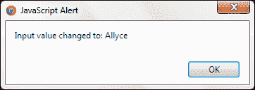
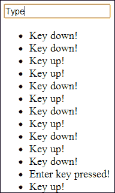

# 二、利用 jQuery 事件与用户交互

在本章中，我们将介绍：

*   检测按钮点击
*   检测元件咔哒声
*   检测变化
*   根据用户输入更新内容
*   检测输入上的按键事件
*   限制输入字符长度
*   鼠标悬停时更改页面元素
*   手动触发事件
*   防止事件触发器
*   创建自定义事件

# 导言

本章介绍如何利用 jQuery 的许多事件来允许您的界面响应不同的用户交互，例如按钮单击，以及 jQuery 事件如何帮助您进行表单验证。

# 检测按钮点击

点击网站元素是主要的用户交互；因此，检测这些点击是创建交互式 web 应用程序的一个非常基本的方面。jQuery 开发人员可以通过多种方式监听其网页中的某些按钮按下情况。

## 准备好了吗

使用您喜爱的文本编辑器或 IDE，在易于访问的位置创建一个名为`recipe-1.html`的空白 HTML 页面。

## 怎么做…

通过执行以下步骤，使用 click 事件处理程序创建两个按钮：

1.  将以下 HTML 代码添加到`recipe-1.html`。确保更改 jQuery 库在 JavaScript 文件中的位置，将其指向计算机上下载最新版本 jQuery 的位置。

    ```js
    <!DOCTYPE html>
    <html>
    <head>
        <title>Chapter 2 :: jQuery Events</title>
        <script src="jquery.min.js"></script>
        <script>

        </script>
    </head>
    <body>
        <button class="button1">Button 1</button>
        <button class="button2">Button 2</button>
    </body>
    </html>
    ```

2.  在脚本标记中，添加以下 JavaScript 代码，将单击事件处理程序附加到两个按钮元素：

    ```js
    $(function() {
        $('.button1').click(function(){
        alert("Button 1 clicked");
        });
        $('body').on("click", ".button2", function(){
        alert("Button 2 clicked");
        });
    });
    ```

3.  在网页中打开`recipe-1.html`并单击其中一个按钮。每个按钮都会显示一个不同的 JavaScript 警报，说明事件处理程序已经执行。

## 它是如何工作的…

我们可以使用各种选择器来选择按钮元素，然后将事件处理程序附加到这些元素。在前面的示例中，我们使用其类名`.button1`选择第一个按钮，使用类名`.button2`选择第二个按钮。

通过`$()`方法选择每个按钮，我们可以选择将点击事件附加到按钮的方法。如下面的代码片段所示，`.click()`方法专门用于此目的。通过将回调函数作为参数传递，我们可以指定在单击按钮后执行的一组命令。

```js
$('.button1').click(function(){
  alert("Button 1 clicked");
});
```

单击第一个按钮后，上述代码将显示指定的警报。以下代码使用了一个替代函数`.on()`，该函数还处理其他事件类型：

```js
$('body').on("click", ".button2", function(){
  alert("Button 2 clicked");
});
```

此方法稍有不同，因为我们首先选择按钮的容器，然后指定按钮标识符（即`.button2`）。

## 还有更多。。。

除了前面提到的记忆优势外，`.on()`方法比`.click()`还有一些额外的优势。如果在调用`.click()`函数后动态地将任何元素添加到 DOM 中，它们将不会附加 click 事件。如果使用了`.on()`方法，只要在指定的容器中添加了动态添加的元素，单击事件处理程序就会捕获这些元素。考虑下面的代码作为这种情况的一个例子：

```js
<!DOCTYPE html>
<html>
<head>
    <title>Chapter 2 :: jQuery Events</title>
    <script src="jquery.min.js"></script>
    <script>
        $(function(){
            $('.button1').click(function(){
                alert("Button 1 clicked");
            });
            $('body').on("click", ".button2", function(){
                alert("Button 2 clicked");
            });
            setTimeout(function(){
                $('.additional').append("<button class='button1'>Button 1 again</button>");
                $('.additional').append("<button class='button2'>Button 2 again</button>");
            }, 2000);
        });
    </script>
</head>
<body>
<button class="button1">Button 1</button>
<button class="button2">Button 2</button>
<div class="additional"></div>
</body>
</html>
```

此代码将分别使用`.click()`和`.on()`方法将事件处理程序附加到页面加载上的每个按钮。然后，使用`setTimeout()`函数，会在 DOM 中动态添加两个以上的按钮；一个按钮带有`.button1`类，另一个按钮带有`.button2`类。如果您在浏览器中打开此网页并等待创建第二组按钮，然后单击附加的**按钮 1**按钮，则不会触发任何单击事件。点击额外的**按钮 2**按钮，您将看到警报框按需要被触发。

## 另见

*   *检测元件咔嗒声*
*   *检测输入*上的按键事件

# 检测元件咔哒声

能够检测用户是否单击了按钮以外的元素，可以为 web 应用程序提供额外的灵活性。您可以将单击事件附加到任何 HTML 元素，就像我们在上一个配方中对按钮所做的那样。

## 准备好了吗

为了完成这个配方，我们首先需要一个名为`recipe-2.html`的空白 HTML 页面，与其他配方中的页面相同。请记住，您需要下载最新版本的 jQuery，并在您的计算机上轻松访问，以便将其包含在`recipe-2.html`中。

## 怎么做…

要了解如何检测用户点击按钮以外的元素，请执行以下步骤：

1.  将以下 HTML 添加到您刚刚创建的`recipe-2.html`页面。这个 HTML 创建了一个非常基本的网页，其中包含一个输入、一个锚和一个分割元素。

    ```js
    <!DOCTYPE html>
    <html>
    <head>
        <title>Chapter 2 :: jQuery Events</title>
        <script src="jquery.min.js"></script>
        <script>

        </script>
    </head>
    <body>
    <a href="#">Link 1</a>
    <input type="text" name="input1" />
    <div class="clickme">Click Me!</div>
    </body>
    </html>
    ```

2.  在我们刚刚创建的 HTML 页面的 head 标记中的 script 标记中，添加以下 JavaScript 代码。此 JavaScript 代码使用两种不同的方法将单击事件处理程序附加到三个 DOM 元素。

    ```js
    $(function() {
        $('a').click(function(){
        alert("You have clicked a link!");
        });
        $('body').on('click', 'input[type="text"]', function(){
        alert("You have clicked a text input!");
        });
        $('.clickme').click(function(){
        alert("You have clicked a division element");
        });
    });
    ```

3.  确保已保存所有更改，然后在浏览器中打开`recipe-2.html`。当你点击任何一个元素时，你会看到一个不同的 JavaScript 警报，表明我们在配方前面创建的事件处理程序正在捕获这些点击事件。

## 它是如何工作的…

我们可以使用它们的标记名选择 DOM 元素，例如`a`来选择链接，然后使用`.click()`或`.on()`函数来附加 click 事件处理程序，如下面的代码片段所示。我们还可以使用 CSS 选择器`input[type="text"]`选择页面上的所有文本输入。

```js
$('.clickme').click(function(){
  alert("You have clicked a division element");
});
```

前面的 jQuery 代码使用`.clickme`类向每个 DOM 元素附加一个 click 事件。这些元素可以是任何 DOM 元素，例如 div、按钮、链接、输入和文本区域。这使 jQuery 开发人员能够灵活地解释所有页面元素之间的用户交互。

### 注

参见本章*检测按钮点击*配方，了解`.click()`与`.on()`的区别，以及`.on()`为什么是首选实现。

## 另见

*   *检测按钮点击*
*   *检测输入*上的按键事件

# 检测变化

在创建动态交互式网站和 web 应用程序时，了解用户何时更改了页面上的某些内容非常有用，例如选定输入、文本输入或任何其他具有可修改值的元素的值。

## 准备好了吗

再次创建一个名为`recipe-3.html`的新空白 HTML 文档。确保下载了 jQuery 的最新版本，该版本可以包含在此 HTML 文件中。

## 怎么做…

要了解如何将更改事件处理程序附加到各种元素类型，请执行以下步骤：

1.  将以下 HTML 代码添加到刚刚创建的 HTML 文档中，并更新对 jQuery 库的引用，以确保页面中包含最新版本的 jQuery:

    ```js
    <!DOCTYPE html>
    <html>
    <head>
        <title>Chapter 2 :: jQuery Events</title>
        <script src="jquery.min.js"></script>
        <script>

        </script>
    </head>
    <body>
    <select id="names">
        <option value="Leon">Leon</option>
        <option value="Allyce">Allyce</option>
        <option value="Jane">Jane</option>
    </select>
    <input type="text" value="The large cat sat on the mat" id="cat" />
    </body>
    </html>
    ```

2.  在脚本标记中，添加以下 JavaScript 代码以在不同元素上附加更改事件处理程序：

    ```js
    $(function(){
        $('#names').change(function(){
         var newValue = $(this).val();
         alert("Input value changed to: " + newValue);
        });
        $('#cat').change(function(){
         var newValue = $(this).val();
         alert("Input value changed to: " + newValue);
        });
    });
    ```

3.  确保已保存所有更改。现在，在网络浏览器中打开`recipe-3.html`；如果更改页面上某个元素的值，将显示一个警报，通知您该更改。

## 它是如何工作的…

使用`$()`选择每个输入元素，然后使用`.change()`函数附加一个更改事件处理程序，允许我们指定用户更改每个输入值后要执行的代码。

在作为参数提供给`.change()`函数的回调函数中，我们可以得到新的值。使用`this`，即所选元素，我们可以使用`$(this).val()`检索新选择的值并在警报中显示。

如果您在浏览器中打开网页并将所选输入值更改为`Allyce`，将显示类似于以下屏幕截图所示的警报：



这是通过使用`.val()`返回下拉输入中所选选项的`value="Allyce"`属性来完成的，下拉输入附带了变更事件处理程序。

在文本输入上使用`.change()`事件处理程序时，在输入框失去焦点（即用户单击了网页的另一部分）之前，不会触发此更改事件。由于经常需要检测立即更改，所以应该考虑使用按键事件来代替这些更改。

## 还有更多。。。

*检测按钮点击*配方讨论了使用`.on()`方法优于使用`.click()`的好处。这些好处也适用于这种情况，因为`.on()`方法也可以用于变更事件。考虑下面的代码：

```js
$('body').on("change", "#names", function(){
  var newValue = $(this).val();
  alert("Input value changed to: " + newValue);
});
```

## 另见

*   *检测按钮点击*
*   *检测输入*上的按键事件
*   *根据用户输入更新内容*

# 根据用户输入更新内容

jQuery 允许开发人员轻松地处理用户输入，然后更新页面以反映此输入。本章前面的方法研究了如何检测输入值的变化和点击各种页面元素。此配方将帮助您创建一个网页，根据从下拉菜单中选择的标题更新标题元素。

## 准备好了吗

创建一个名为`recipe-4.html`的空白 HTML 文档，下载 jQuery 库的最新版本并准备使用。

## 怎么做…

使用类似于在前面的方法中学习的技术，执行以下步骤以基于用户交互对 DOM 进行更改：

1.  将以下 HTML 代码添加到您刚刚创建的`recipe-4.html`；不要忘记更新对 jQuery 库的引用。这个 HTML 创建了一个带有下拉菜单元素的基本 HTML 网页，允许用户选择多个标题。还有一个 header 元素，我们可以根据用户选择使用 jQuery 进行操作。

    ```js
    <!DOCTYPE html>
    <html>
    <head>
        <title>Chapter 2 :: jQuery Events</title>
        <script src="jquery.min.js"></script>
        <script>

        </script>
    </head>
    <body>
    <select id="title">
    <option value="#">Select your title...</option>
        <option value="1">Title 1</option>
        <option value="2">Title 2</option>
        <option value="3">Title 3</option>
    </select>
    <h1 id="main-title">No Title</h1>
    </body>
    </html>
    ```

2.  在脚本标记中添加以下 JavaScript 代码，将更改事件处理程序附加到选择输入`#title`：

    ```js
    $(function(){
        $('#title').change(function(){
        var titleText = "";
        switch ($(this).val()) {
            case "1":
                   titleText = "This is the text for title 1";
                break;
            case "2":
                titleText = "This is the text for title 2";
                   break;
               case "3":
                   titleText = "This is the text for title 3";
                   break;
           default:
              titleText = "No Title";
         }
            $('#main-title').html(titleText);
        });
    });
    ```

3.  在浏览器中运行此网页并从下拉菜单中选择新选项将相应地更新标题文本。

## 它是如何工作的…

首先，我们指示 jQuery 使用以下代码将变更事件处理程序附加到`#title`select 输入：

```js
$(function() {
  $('#title').change(function(){

  });
}
```

当用户更改下拉输入中的选定选项时，将执行更改事件处理程序。

在`function`参数中，我们可以使用`$(this)`引用`#title`选择输入，然后使用`$(this).val();`获取其选择值。一旦我们有了这个值，我们就可以使用 JavaScript 执行我们需要的任何操作。在本例中，我们使用 JavaScript`switch`语句确定选择了哪个标题，如以下代码段所示：

```js
var titleText = "";
switch ($(this).val()) {
    case "1":
      titleText = "This is the text for title 1";
      break;
    case "2":
      titleText = "This is the text for title 2";
      break;
    case "3":
      titleText = "This is the text for title 3";
      break;
    default:
      titleText = "No Title";
}
```

根据选定的标题值，我们创建一些文本，然后提供给`$('#main-title').html();`。这将更新`#main-title`标题元素的 HTML，使其成为提供的文本。

这说明了 jQuery 开发人员如何处理用户输入并执行更改页面的操作的一个非常简单的任务。

## 另见

*   *检测变化*
*   *鼠标悬停改变页面元素*

# 检测输入上的按键事件

jQuery 提供了三个事件函数，允许 jQuery 开发人员确定用户按下的键，以及用户按下键的时间和方式。`.keyup()`函数是一个事件处理程序，可以将附加到输入，并在完全释放按键后触发；同样地，`.keydown()`将在按键完全按下后触发。第三个可用的事件处理程序是`.keypress()`，当按下一个键时会立即触发。

这些方法允许开发人员提供强大的客户端验证，或者为用户提供简单的功能，例如在按下*Enter*键时触发表单提交。

## 准备好了吗

创建一个名为`recipe-5.html`的空白 HTML 文件，我们可以将其用于此配方。

## 怎么做…

通过执行以下步骤，使用各种事件处理程序检测用户按键事件：

1.  将以下 HTML 代码添加到刚刚创建的网页中。更新对 jQuery 库的引用，以确保网页中引用的是最新版本。这个 HTML 创建了一个简单的页面，其中包含一个输入和一个无序列表元素，我们可以使用它来输出一些事件信息，以说明 jQuery 代码的每个部分都实现了什么。

    ```js
    <!DOCTYPE html>
    <html>
    <head>
        <title>Chapter 2 :: jQuery Events</title>
        <script src="jquery.min.js"></script>
        <script>

        </script>
    </head>
    <body>
    <input type="text" class="myInput" />
    <ul id="myList"></ul>
    </body>
    </html>
    ```

2.  在脚本标记中，添加以下 JavaScript 代码以附加`keyup`和`keydown`事件处理程序：

    ```js
    $(function(){
        $('.myInput').keyup(function(){
          $('#myList').append("<li>Key up!</li>");
        });
        $('.myInput').keydown(function(event){
          $('#myList').append("<li>Key down!</li>");
          if (event.which == 13) {
            $('#myList').append("<li>Enter key pressed!</li>");
          }
        });
    });
    ```

## 它是如何工作的…

我们可以通过首先选择我们的`.myInput`元素，然后指定一个事件处理程序函数来连接`keyup`和`keydown`事件处理程序，如下代码所示：

```js
$('.myInput').keydown();
```

我们在`keydown`事件的回调函数中添加了一个`event`变量作为参数。从这个`event`变量中，我们可以使用`event.which`检测按下了哪个键。这通常很有用，因为我们可以确定用户刚刚按下的键是否是*Enter*键，我们可能希望对其执行特定操作，例如表单提交或何时触发 AJAX 调用。在本例中，我们只需在`#myList`无序列表中添加一个列表项来说明这个概念。

我们在`keyup`事件处理程序中复制此过程，并使用`.append()`函数将新的 DOM 元素追加到列表中。

在浏览器中加载此网页并在输入框中输入文本后，您将能够在每次按键时列表元素更新时看到事件触发。您将能够看到类似于以下屏幕截图的内容：



## 还有更多…

本配方提供了两个例子，分别为`keydown`和`keyup`。试着对代码进行实验，并以同样的方式使用替代`keypress()`函数，看看它是如何工作的。

## 另见

*   *检测按钮点击*
*   *检测元件咔嗒声*
*   *限制输入字符长度*
*   *检测变化*

# 限制输入字符长度

通过使用 jQuery 的`keypress`事件，可以限制用户能够输入到文本字段中的字符。在某些情况下，这可能是一个强大的用户体验功能，因为用户在视觉上意识到他们无法提供的字符，而不必等待服务器通知他们此错误的响应。

## 准备好了吗

再一次，我们需要一个带有最新版本 jQuery 的空白 HTML 文档来完成这个配方。创建`recipe-6.html`并确保已下载 jQuery 并准备就绪。

## 怎么做…

通过执行以下步骤，了解如何限制用户使用 jQuery 在文本输入中输入某些字符：

1.  将以下 HTML 代码添加到新创建的`recipe-6.html`文件中，该文件使用单个输入元素创建基本 HTML 网页：

    ```js
    <!DOCTYPE html>
    <html>
    <head>
        <title>Chapter 2 :: jQuery Events</title>
        <script src="jquery.min.js"></script>
        <script>

        </script>
    </head>
    <body>
    <input type="text" class="myInput" />
    </body>
    </html>
    ```

2.  在 HTML 页面的脚本标记中，添加以下 JavaScript 代码，该代码将`keypress`事件处理程序绑定到输入，并防止在所选文本输入中输入任何非字母字符：

    ```js
    $(function() {
        $('.myInput').keypress(function (event) {
          var regex = new RegExp("^[a-zA-Z0-9]+$");
          var key = String.fromCharCode(event.which);
          if (!regex.test(key)) {
            return false;
          }
        });
    });
    ```

3.  在浏览器中打开`recipe-6.html`并尝试在输入文本框中键入非字母数字字符；你会发现这样做是不可能的。

## 它是如何工作的…

我们将`keypress`事件处理程序附加到`.myInput`元素，并将`event`变量指定为参数，如以下代码段所示：

```js
$('.myInput').keypress(function (event) {

});
```

这允许我们指定当`.myInput`字段有焦点时在`keypress`上执行的命令。

我们声明一个正则表达式变量，可用于计算输入的字符是否为字母数字。

```js
var regex = new RegExp("^[a-zA-Z0-9]+$");
```

键盘上的每个键都有一个唯一的数字代码，可以使用`event.which`进行访问。然后，为了确定按下的键是否为字母数字键，我们需要检索其字符串值（例如，f 的字母数字值为 102），这可以通过以下代码完成：

```js
var key = String.fromCharCode(event.which);
```

现在，我们可以应用正则表达式并确定它是否满足字母数字要求。如果没有，我们通过返回`false`来阻止输入该键值，如下所示：

```js
if (!regex.test(key)) {
  return false;
}
```

如果按下的键是有效的字母数字字符，我们允许在文本框中显示字符。

## 还有更多。。。

理解这样的客户端验证是一种强大的用户体验功能，这一点很重要，但决不能完全依赖它。在客户端完成的任何验证都应始终在服务器上镜像。这是因为用户非常容易绕过客户端验证。这通常与从浏览器设置中关闭 JavaScript 一样简单。请记住，任何客户端语言（如 JavaScript）都完全可以由最终用户进行操作。因此，客户端验证只应作为用户体验的增强，而不是数据输入的显式验证。

## 另见

*   *检测输入*上的按键事件

# 鼠标悬停时更改页面元素

jQuery 提供了许多绑定鼠标事件处理程序的方法，与 CSS 伪类（如`:hover`）相比，jQuery 开发人员可以获得更多的控制和灵活性。这些事件处理程序可以基于用户操作创建丰富的交互式用户体验。

### 注

随着 jQuery 2.0 的发布，jQuery 不再正式支持早期的浏览器，如 IE6、IE7 和 IE8。然而，像`.hover()`这样的方法仍然可以提供一些好处，使您能够支持早期版本的浏览器。但是，要小心 jQuery 库的某些部分可能不再工作。

## 准备好了吗

为了演示鼠标悬停事件，我们需要首先创建一个空白 HTML 文档。在计算机上易于访问的位置创建`recipe-7.html`。

## 怎么做…

以下是了解如何使用 jQuery 检测用户何时执行悬停操作的步骤：

1.  在新创建的 HTML 文档中，添加以下 HTML 和 CSS 代码以创建包含一些基本表单元素的网页：

    ```js
    <!DOCTYPE html>
    <html>
    <head>
        <title>Chapter 2 :: jQuery Events</title>
        <style type="text/css">
            .info {
                width: 530px;
                border: solid 2px yellow;
                padding: 10px;
                text-align: center;
                margin-top: 10px;
                display: none;
            }
        </style>
        <script src="jquery.min.js"></script>
        <script>

        </script>
    </head>
    <body>
    <label>Your Name:</label>
    <input type="text" name="name" class="hoverinfo" rel="Please provide us with your name." />
    <label>Your Email:</label>
    <input type="text" name="email" class="hoverinfo" rel="Please provide us with your email address" />
    <button class="hoverinfo" rel="Click here to submit your information to us">Submit</button>
    <div class="info"></div>
    </body>
    </html>
    ```

2.  现在我们有了一个包含三个简单表单元素和一个 div 标记的网页，我们可以在其中显示有关悬停项的信息。使用以下 JavaScript 代码并将其放在脚本标记中，以将`mouseover`和`mouseleave`事件处理程序附加到具有`.hoverinfo`类的每个元素：

    ```js
    $(function(){
        $('.hoverinfo').mouseover(function(){
          $('.info').html($(this).attr("rel"));
          $('.info').fadeIn();
        }).mouseleave(function(){
          $('.info').hide();
        });
    });
    ```

3.  在浏览器中打开网页，并将鼠标悬停在不同的表单元素上；您将看到相应的消息显示。

## 它是如何工作的…

我们使用以下 CSS 代码向`.info`div 元素添加一些基本样式，以便在显示后在页面上突出显示：

```js
.info {
  width: 530px;
  border: solid 2px yellow;
  padding: 10px;
  text-align: center;
  margin-top: 10px;
  display: none;
}
```

我们添加了`display: none;`以防止`.info` 元素显示在屏幕上，将其留给 jQuery 代码。

我们将`.hoverinfo`类添加到每个包含额外信息的 HTML 元素中，以便在 jQuery 代码中识别它们。然后，我们使用以下代码将`mouseover`和`mouseleave`事件处理程序连接到每个`.hoverinfo`元素：

```js
$('.hoverinfo').mouseover(function(){

}).mouseleave(function(){

});
```

当用户将鼠标移动到任何`.hoverinfo`元素上时，将执行`mouseover`事件处理程序。类似地，一旦用户的鼠标指针将任何 HTML 元素留在`.hoverinfo`类中，就会执行`mouseleave`事件。

在`mouseover`事件处理程序中，我们可以使用`$(this).attr("rel");`获取添加到每个`.hoverinfo`元素的`rel`属性的文本（或任何 HTML 属性的值）。然后可与以下代码一起使用：

```js
$('.info').html($(this).attr("rel"));
$('.info').fadeIn();
```

我们将文本从`rel`属性传递到`.html()`函数，该函数将替换`.info`div 元素中现有的 HTML 代码。然后，我们使用 jQuery 的`.fadeIn()`函数提供动画，并使用`rel`属性中的值显示`.info`元素。

最后，`mouseleave`事件处理程序使用`$('.info').hide();`再次从视图中隐藏该元素，允许在触发`.hoverinfo`元素的`mouseover`事件后再次重复该过程。

## 还有更多…

jQuery 包含许多额外的鼠标事件处理程序，可用于各种用户交互。确保你选择了最适合你的情况。访问 jQuery 文档（[http://api.jquery.com/category/events/mouse-events/](http://api.jquery.com/category/events/mouse-events/) 了解更多信息。

## 另见

*   *根据用户输入更新内容*

# 手动触发事件

在 web 应用程序的某些部分中，仅对用户交互触发的事件作出反应是不够的。jQuery 允许我们从代码中手动触发事件。

## 准备好了吗

在创建 web 应用程序时，有时您可能需要一个仅由 jQuery 代码处理的表单，而不是作为典型的 HTML 表单提交的表单，可能是为了发出 AJAX 请求。这就是我们将在本食谱中演示的内容。首先，再次创建另一个名为`recipe-8.html`的空白 HTML 文档。确保将其放置在计算机上易于访问的位置。

## 怎么做…

了解如何通过执行以下步骤从 JavaScript 中手动触发事件：

1.  将以下 HTML 代码添加到`recipe-8.html`中，以创建一个非常基本的网页，其中包含一组表单元素和一个提交按钮：

    ```js
    <!DOCTYPE html>
    <html>
    <head>
        <title>Chapter 2 :: jQuery Events</title>
        <script src="jquery.min.js"></script>
        <script>

        </script>
    </head>
    <body>
    <label>First Name:</label>
    <input type="text" name="firstname" />
    <label>Last Name:</label>
    <input type="text" name="lastname" />
    <label>Your Email:</label>
    <input type="text" name="email" />
    <button class="submit-btn">Submit</button>
    </body>
    </html>
    ```

2.  在脚本标记中添加以下 jQuery 代码，为**提交**按钮创建事件处理程序，并在用户在任何文本输入中按下*输入*时手动触发提交按钮点击事件：

    ```js
    $(function() {
        $('.submit-btn').on("click", function(){
          alert("Submit the form!");
        });
        $('input[type="text"]').keypress(function(event){
          if (event.which == 13) {
            $('.submit-btn').trigger("click");
          }
        });
    });
    ```

## 它是如何工作的…

我们经常想模仿典型的行为，比如在表单输入中按下*Enter*键时表单提交。我们可以使用以下代码监听所有文本输入上的按键事件：

```js
$('input[type="text"]').keypress(function(event){
  if (event.which == 13) {
    $('.submit-btn').trigger("click");
  }
});
```

一旦用户按下文本输入中的键，就会执行此代码。当他们这样做时，我们使用`event.which == 13`检查*回车*键是否被按下（即*回车*的字符码为`13`。如果已按下，则使用 jQuery 函数`.trigger()`并传递字符串`click`手动触发所选元素上的点击事件，在本例中为`.submit-btn`。

使用以下代码，点击事件处理程序可以附加到`.submit-btn`：

```js
$('.submit-btn').on("click", function(){
  alert("Submit the form!");
});
```

执行`function`参数内的代码并显示警报。

## 还有更多。。。

如果没有提供回调函数作为参数，则可以使用许多其他 jQuery 事件处理程序函数手动触发事件。例如，考虑下面的代码：

```js
$('input[type="text"]').keypress(function(event){
  if (event.which == 13) {
    $('.submit-btn').click();
  }
});
```

此代码使用`.click()`功能手动触发点击事件，而不是使用`.trigger()`功能。这两种方法之间没有明显的区别，但请注意，这两种方法都是可用的。

# 防止事件触发

在许多情况下，jQuery 开发人员希望阻止常规 HTML 元素（例如表单、按钮，甚至它们自己的事件处理程序）的事件的默认浏览器操作。jQuery 提供了停止这些事件的能力。这允许开发人员防止出现诸如多次按钮点击、多次表单提交和意外提交等情况，或者通常允许开发人员更改典型事件的正常行为。

## 准备好了吗

创建一个名为`recipe-9.html`的空白 HTML 文件，并确保 jQuery 库的最新版本可用。

## 怎么做…

了解如何通过执行以下步骤防止默认浏览器操作：

1.  在`recipe-9.html`中添加以下 HTML 代码；确保将对 jQuery 库的引用更新到计算机上的正确位置：

    ```js
    <!DOCTYPE html>
    <html>
    <head>
        <title>Chapter 2 :: jQuery Events</title>
        <script src="jquery.min.js"></script>
        <script>

        </script>
    </head>
    <body>
    <form method="POST" id="myForm">
        <label>First Name:</label>
        <input type="text" name="firstname" />
        <label>Last Name:</label>
        <input type="text" name="lastname" />
        <label>Your Email:</label>
        <input type="text" name="email" />
        <button class="submit-btn">Submit</button>
    </form>
    </body>
    </html>
    ```

2.  使用以下 jQuery 代码并将其放置在脚本标记中，以捕捉按钮点击**提交**按钮并防止表单提交：

    ```js
    $(function() {
      $('.submit-btn').on("click", function(event){
        event.preventDefault();
        event.stopPropagation();
        var response = confirm("Are you sure you want to submit this form?");
        if (response) {
          $('#myForm').submit();
        }
      });
    });
    ```

3.  在浏览器中打开`recipe-9.html`并单击**提交**按钮，将显示一条 JavaScript 确认消息，该消息将捕获您的响应，然后根据您的选择提交 HTML 表单。感谢`event.preventDefault();`和`event.stopPropagation();`方法，在您回复此消息框之前，将不会提交表格。

## 它是如何工作的…

下面的 jQuery 代码允许我们点击**提交**按钮，并使用`.on()`函数创建一个点击事件处理程序。我们提供`click`作为第一个参数来指定我们需要 click 事件处理程序，`.on()`函数为许多其他类型的事件提供接口。

```js
$('.submit-btn').on("click", function(event){

});
```

我们在`.on()`回调函数中提供`event`变量作为参数。然后，我们可以使用以下 jQuery 函数来创建所需的效果：

```js
event.preventDefault();
event.stopPropagation();
```

`event.prevenDefault();`功能阻止当前事件的默认动作；在本例中，表单提交。这允许我们以自己的方式处理事件，例如提供额外的功能或导致完全不同的操作。`event.stopPropagation();`函数将防止事件通过父 DOM 元素和祖先 DOM 元素冒泡。当在元素上触发事件时，事件也会在 DOM 中的父元素和所有祖先元素上触发，因此，我们仍然可以触发我们最初试图阻止的事件。

由于我们使用了这些方法来阻止表单提交，因此我们可以询问用户是否确实希望提交表单。我们使用本机 JavaScript`confirm()`函数实现如下操作：

```js
var response = confirm("Are you sure you want to submit this form?");
  if (response) {
    $('#myForm').submit();
}
```

我们将用户的响应存储在一个变量中，然后对该变量进行计算。如果他们点击**确定**确认表单提交，我们可以继续使用`$('#myForm').submit();`提交表单。否则，我们什么也不做，表格也不提交。

## 另见

*   *手动触发事件*

# 创建自定义事件

jQuery 为开发人员提供了处理内置 JavaScript 事件的方法，这些事件具有`.click()`、`.hover()`等函数。jQuery 还允许开发人员为附加功能创建自己的事件类型。通过创建自定义事件，开发人员还能够更轻松地在应用程序周围传递数据。

## 准备好了吗

在易于访问的位置创建另一个名为`recipe-10.html`的空白 HTML 文档。

## 怎么做…

通过执行以下步骤，了解如何使用 jQuery 创建自定义事件：

1.  将以下 HTML 代码添加到此新创建的 HTML 文档中。记住更新对 jQuery 库的引用，以指向其在计算机上的本地位置。

    ```js
    <!DOCTYPE html>
    <html>
    <head>
        <title>Chapter 2 :: jQuery Events</title>
        <script src="jquery.min.js"></script>
        <script>

        </script>
    </head>
    <body>
        <button rel="green">Green</button>
        <button rel="blue">Blue</button>
        <p class="colourme"></p>
    </body>
    </html>
    ```

2.  现在，我们可以将自定义事件处理程序绑定到段落，并在单击某个按钮元素时触发它。在脚本标记中添加以下 JavaScript 代码：

    ```js
    $(function() {
      $('.colourme').on("switchColour", function(event, colour, text){
        $(this).html(text);
        $(this).css("color", colour);
      });
      $("button").click(function(){
        var colour = $(this).attr("rel");
        $('.colourme').trigger("switchColour", colour, colour + ' button pressed... ']);
      });
    });
    ```

3.  打开新创建的网页，通过单击这两个按钮中的任何一个，您应该会看到段落文本随着其颜色的变化而变化，与单击的按钮相对应。

## 它是如何工作的…

jQuery 为我们提供了一个`.on()`函数，它允许我们指定要绑定到所选元素的事件的名称。我们可以指定内置 jQuery 事件，也可以提供自己事件的名称。我们使用以下 JavaScript 代码执行此操作：

```js
$('.colourme').bind("switchColour", function(event, colour, text){
  $(this).html(text);
  $(this).css("color", colour);
});
```

此代码将自定义`switchColour`事件的事件处理程序绑定到具有`colourme`类的段落元素。我们为`.on()`函数提供的第二个参数是一个回调方法，它有自己的三个参数：`Event`，它保存事件信息，然后是`colour`和`text`，这是我们自己的自定义属性，我们可以稍后使用。

在函数中，我们使用`$(this).html(text);`将当前选择的`.colourme`段落元素的内容更改为`text`变量中提供的文本。我们还使用`$(this).css("color", colour);`（使用拼写`color`而不是颜色）应用一些 CSS，将文本的颜色更改为作为`colour`变量提供的值的颜色。

现在已经创建了自定义事件，我们需要能够触发此事件，这可以使用以下代码完成：

```js
$("button").click(function(){
  var colour = $(this).attr("rel");
  $('.colourme').trigger("switchColour", [colour, colour + ' button pressed... ']);
});
```

在前面的 JavaScript 代码中，我们使用 jQuery 提供的`.click()`函数在单击任意一个按钮元素后执行一组代码。在 click 事件处理程序中，我们首先检索元素的`rel`属性，我们在 HTML 中将其指定为变量`colour`。

然后，我们使用`.trigger()`函数并指定要触发的自定义事件。我们提供第二个参数作为数组，其中包含我们在自定义事件中使用`.on()`、`colour`和`text`指定的变量。

`.trigger()`函数将触发我们的自定义事件，并向任何绑定元素提供我们提供的信息。这个绑定到此事件的`colourme`段落将更改其内部 HTML，并将其 CSS 颜色属性修改为指定的颜色。