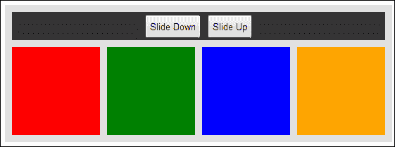
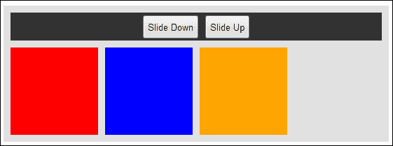
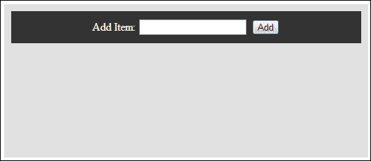
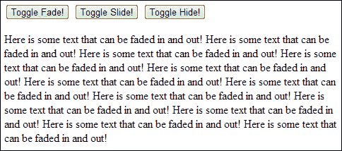
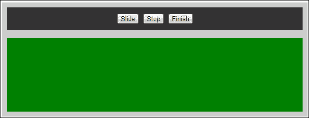
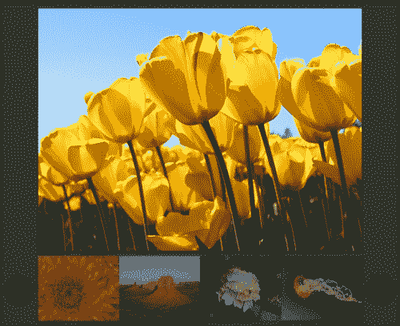

# 四、通过 jQuery 效果添加有吸引力的视觉效果

在本章中，我们将介绍：

*   滑动页面元素
*   隐藏和显示元素
*   衰落元素
*   切换效果
*   停止效应
*   连锁效应
*   创建基本照片库
*   创建闪烁按钮
*   删除具有效果的元素

# 导言

本章将向您展示如何在界面上添加简单效果，以提高网站的整体美感和用户体验。向元素添加基本效果会对用户的印象产生巨大影响。jQuery 提供了一些功能，允许开发人员快速添加效果，如幻灯片、淡入淡出、隐藏等。

# 滑动页面元素

滑动页面元素的能力允许开发人员创建一系列界面，如手风琴。此配方将向您展示如何将幻灯片效果应用于一系列元素。

## 准备好了吗

使用您喜爱的文本编辑器或 IDE，在易于访问的位置创建一个空白 HTML 页面，并将此文件另存为`recipe-1.html`。确保在与此 HTML 文件相同的位置下载了最新版本的 jQuery。

## 怎么做…

通过执行以下步骤，了解如何使用 jQuery 滑动页面元素：

1.  将以下 HTML 代码添加到`recipe-1.html`。确保更改 jQuery 库的源位置，将其指向下载最新版本 jQuery 并放置在计算机上的位置。

    ```js
    <!DOCTYPE html>
    <html>
    <head>
      <script src="jquery.min.js"></script>
      <script src="recipe-1.js"></script>
      <title>Chapter 4 :: JQuery Effects</title>
      <link type="text/css" media="screen" rel="stylesheet" href="recipe-1.css" />
    </head>
    <body>
      <div class="frame">
        <div class="actions">
          <button id="down">Slide Down</button>
          <button id="up">Slide Up</button>
        </div>
        <div class="box one"></div>
        <div class="box two"></div>
        <div class="box three"></div>
        <div class="box four"></div>
      </div>
    </body>
    </html>
    ```

2.  您可能已经注意到，除了 jQuery 库文件之外，我们还包含了第二个名为`recipe-1.js`的 JavaScript 文件。创建此 JavaScript 文件并将其保存在与 HTML 文件相同的目录中。将以下 JavaScript 代码添加到`recipe-1.js`文件：

    ```js
    $(function(){
      $('#up').click(function(){
        $('.one').slideUp(4000);
        $('.two').slideUp(3000);
        $('.three').slideUp(2000);
        $('.four').slideUp(1000);
      });
      $('#down').click(function(){
        $('.one').slideDown(4000);
        $('.two').slideDown(3000);
        $('.three').slideDown(2000);
        $('.four').slideDown(1000);
      });
    });
    ```

3.  除了这两个 JavaScript 文件之外，我们还包括了一个 CSS 文件，为 HTML 元素添加了一些样式。在同一目录下创建`recipe-1.css`并添加以下代码：

    ```js
    .frame {
      width: 530px;
      height: 190px;
      margin: 50px auto auto auto;
      background-color: #E1E1E1;
      padding: 10px;
    }
    .frame .box {
      width: 125px;
      height: 125px;
      float: left;
      margin-right: 10px;
    }
    .frame .box:last-child {
      margin-right: 0;
    }
    .frame .actions {
      background-color: #333333;
      margin-bottom: 10px;
      text-align: center;
      padding: 10px;
    }
    .frame .actions button {
      height: 35px;
    }
    .one {
      background-color: red;
    }
    .two {
      background-color: green;
    }
    .three {
      background-color: blue;
    }
    .four {
      background-color: orange;
    }
    ```

4.  Open `recipe-1.html` in a web browser and you should see a web page similar to the following screenshot:

    

5.  点击**向上滑动**按钮，查看不同速度下应用于每个彩色框元素的向上滑动效果；然后点击**向下滑动**查看反向。

## 它是如何工作的…

现在，让我们详细了解前面执行的步骤。

### HTML

我们为此配方创建的 HTML 文件只是使用 div 元素创建了四个框，然后提供了两个按钮，可以与 jQuery 结合使用来触发元素效果。

### jQuery

我们将所有 JavaScript 代码包装在`$(function(){});`中。这将确保我们的代码在页面加载时执行。在函数内部，我们将单击事件附加到每个按钮，如以下代码段所示：

```js
$('#up').click(function(){
  $('.one').slideUp(4000);
  $('.two').slideUp(3000);
  $('.three').slideUp(2000);
  $('.four').slideUp(1000);
});
$('#down').click(function(){
  $('.one').slideDown(4000);
  $('.two').slideDown(3000);
  $('.three').slideDown(2000);
  $('.four').slideDown(1000);
});
```

`.click()`功能允许我们提供一组代码，当用户点击相应按钮时执行。在每个`.click()`方法的回调函数中，我们选择每个框的 div 元素，并使用 jQuery`.slideUp()`和`.slideDown()`函数，具体取决于单击了哪个按钮。

jQuery 幻灯片功能允许您指定一系列参数。在前面的示例中，我们以毫秒为单位指定了效果持续时间。这使我们能够控制每个长方体元素向上或向下滑动所需的时间，提供瀑布效应。

### CSS

我们创建的 CSS 文件添加了每个 HTML 元素的样式和位置，使我们能够最好地展示 jQuery 幻灯片功能。它允许我们更改每个框的背景色，并允许我们将界面居中对齐。

## 还有更多。。。

在上一个示例中，如果多次单击**向上滑动**和**向下滑动**按钮，您可能会注意到不同框元素之间出现一些闪烁。发生此闪烁是因为当向上滑动效果完成时，box 元素的 CSS`display`属性被设置为`none`。这意味着该元素不仅不可见，而且不会影响任何相邻元素的位置。

因此，设置为“向左浮动”的元素将有空间进一步向左移动，因为已完成其向上滑动效果的长方体元素不再碍事。这显示在以下屏幕截图中：



在这里，您可以看到第二个绿色方框元素的显示值设置为`none`，导致其他方框元素进一步向左浮动。当幻灯片动画被多次触发，并且当其他元素不可见时，元素必须向左移动时，显示屏可能会闪烁更多。这样的问题可以通过不允许触发器多次触发效果来预防。在本章后面的*创建基本照片库*配方中已经解释了一个简单的解决方案。

## 另见

*   *衰落元素*
*   *隐藏和显示元素*
*   *创建基本照片库*

# 隐藏和显示元素

jQuery 包含的函数允许您简单地隐藏和显示元素，尽管您可以将这些函数与其他效果结合使用。

## 准备好了吗

创建一个名为`recipe-2.html`的新 HTML 文件，并将其保存到与 jQuery 库相同的文件夹中。

## 怎么做…

通过执行以下步骤，了解如何使用 jQuery 轻松隐藏和显示 DOM 中的元素：

1.  在`recipe-2.html`中，添加以下 HTML 代码。确保对 jQuery 库的引用指向下载的版本的正确位置和文件名。

    ```js
    <!DOCTYPE html>
    <html>
    <head>
      <title>Chapter 4 :: JQuery Effects :: Recipe 2</title>
      <script src="jquery.min.js"></script>
      <script src="recipe-2.js"></script>
    </head>
    <body>
    <button class="show">Show</button>
    <button class="hide">Hide</button>
    <p class="text">Hiding and showing HTML elements with jQuery is so easy!</p>
    </body>
    </html>
    ```

2.  创建一个名为`recipe-2.js`的 JavaScript 文件，并将其保存在与刚才创建的 HTML 文件相同的目录中。将以下 JavaScript 代码添加到此文件：

    ```js
    $(function(){
      $('#show').click(function(){
          $('.text').show();
      });
      $('#hide').click(function(){
          $('.text').hide();
      });
    });
    ```

3.  在 web 浏览器中打开`recipe-2.html`将显示一个非常基本的网页，该网页有两个按钮和一些文本。点击**显示**和**隐藏**按钮将对文本执行关联效果，展示使用 jQuery 显示和隐藏元素是多么简单。

## 它是如何工作的…

现在，让我们详细了解前面执行的步骤。

### HTML

此配方中使用的 HTML 代码非常基本，不需要太多解释。HTML 代码创建一个带有两个按钮的网页。每个都有自己的 ID-`show`和`hide`。还有一个段落元素和`text`类。jQuery 将使用这些 ID 来侦听单击事件并对段落元素执行效果。

### jQuery

与前面的配方类似，我们在每个按钮上都附加了一个点击事件处理程序。这允许我们根据单击的按钮执行效果。为了做到这一点，我们使用以下代码：

```js
$('#show').click(function(){
  $('.text').show();
});
$('#hide').click(function(){
  $('.text').hide();
});
```

为了显示和隐藏效果，我们使用了相应的 jQuery 函数`show()`和`hide()`。这些 jQuery 函数只是切换所选元素的显示属性（在本例中，段落元素属于`text`类）。`display`属性设置为`none`隐藏元素；将其设置为“块”以显示元素。

## 还有更多…

使用 jQuery 的`show()`和`hide()`函数还有其他好处。使用 jQuery，可以根据元素的内部 HTML 代码显示和隐藏元素。您还可以将`show()`和`hide()`功能与其他 jQuery 效果或动画结合使用。

## 另见

*   *衰落元素*
*   *滑页元素*

# 衰落元素

如果显示或隐藏元素还不够，jQuery 提供淡入淡出 HTML 元素的能力。此配方利用 jQuery 的淡入淡出功能，在选择显示或隐藏元素时添加更多效果。

## 准备好了吗

创建一个名为`recipe-3.html`的空白 HTML 文件，并将其保存在与 jQuery 最新版本相同的目录中。

## 怎么做…

通过执行以下步骤，使用 jQuery 淡入淡出 DOM 元素：

1.  在`recipe-3.html`中添加以下 HTML 代码，确保对 jQuery 库的引用是正确的：

    ```js
    <!DOCTYPE html>
    <html>
    <head>
      <title>Chapter 4 :: JQuery Effects :: Recipe 3</title>
      <script src="jquery.min.js"></script>
      <script src="recipe-3.js"></script>
      <link type="text/css" media="screen" rel="stylesheet" href="recipe-3.css" />
    </head>
    <body>
      <div class="frame">
        <div class="top">
          <label>Add Item:</label>
          <input type="text" id="new-item" />
          <button id="add-new-item">Add</button>
        </div>
        <ol class="list"></ol>
      </div>
    </body>
    </html>
    ```

2.  在同一目录中创建 CSS 文件。另存为`recipe-3.css`并添加以下代码来设置 HTML 页面的样式：

    ```js
    .frame {
      width: 500px;
      min-height: 200px;
      margin: 50px auto auto auto;
      background-color: #E1E1E1;
      padding: 10px;
    }
    .top {
      background-color: #333333;
      padding: 10px;
      text-align: center;
      color: #FFF;
    }
    .list li {
      line-height: 30px;
    }
    ```

3.  创建一个名为`recipe-3.js`的 JavaScript 文件，并添加以下 jQuery 代码：

    ```js
    $(function(){
      $('#add-new-item').click(function(){
        var item = $('#new-item').val();
        if (item.length > 0) {
          var newItem = $("<li>" + item + "</li>").fadeIn();
          $('.list').append(newItem);
          $('#new-item').val("");
        }
      });
    });
    ```

4.  Open `recipe-3.html` in a web browser and you will be presented with a web page similar to the following screenshot:

    

5.  在**添加项**文本框中输入一些文本，点击**添加**按钮，将使用 jQuery 淡入淡出效果将输入的文本添加到列表中。

## 它是如何工作的…

现在，让我们详细了解前面执行的步骤。

### HTML

HTML 代码创建了一个简单的界面，其中包括一个按钮和一个空的有序列表元素的文本输入，然后可以用 jQuery 填充该元素。

### CSS

添加了一个 CSS 文件来定位和设置简单用户界面的样式，这样我们就可以更好地用 jQuery 演示淡入淡出效果。

### jQuery

首先，jQuery 代码使用以下代码将点击事件附加到**添加**按钮：

```js
$(function(){
  $('#add-new-item').click(function(){

  });
});
```

我们将以下代码添加到此回调函数中，以提供使用`fadeIn()`函数将输入文本添加到列表中所需的效果：

```js
var item = $('#new-item').val();
if (item.length > 0) {
var newItem = $("<li>" + item + "</li>");
$('.list').append(newItem).fadeIn();
$('#new-item').val("");
}
```

此代码创建`item`变量，并使用`$('#new-item').val()`为其分配输入框的值。然后检查该值的长度是否大于零，因为我们不想将空白项添加到列表中。我们可以通过简单地使用`variablename.length`（在本例中为`item.length`）使用 JavaScript 检查字符串的长度。

在这个`if`语句中，我们创建了另一个名为`newItem`的变量。我们使用`item`变量为其分配一个新创建的 HTML 列表项元素，该元素的值来自输入框。我们将列表项包装在 jQuery 的选择器（`$()`中，允许我们在这个 DOM 元素上使用`fadeIn()`函数。

现在我们有了一个列表项，我们可以使用 jQuery 提供的`append()`函数将它附加到具有类名`list`的有序列表元素中。这将添加新创建的 DOM 元素作为有序列表的最后一个子元素。因为我们在这个 DOM 元素上使用了`fadeIn()`函数，所以它将首先显示为隐藏，然后淡入，从而提供我们想要的效果。

## 还有更多…

在这个配方中，我们使用了`fadeIn()`功能，它允许我们使用淡入淡出的效果将元素从不可见变为可见。jQuery 还为我们提供了一个`fadeOut()`函数，它提供了反向功能。这两个函数都采用一系列参数，允许开发人员调整行为。主要参数是 duration，它允许我们指定元素淡入淡出的时间（以毫秒为单位）。在[阅读这些功能的可用选项 http://api.jquery.com/fadeIn/](http://api.jquery.com/fadeIn/) 。

此外，jQuery 提供了一个`fadeTo()`函数，如果您不想在效果完成后完全隐藏或显示某个元素，则可以调整该元素的不透明度。更多关于此功能的信息，请访问[http://api.jquery.com/fadeTo/](http://api.jquery.com/fadeTo/) 。

## 另见

*   *去除有效果的元素*
*   *创建基本照片库*
*   *创建闪烁按钮*

# 切换效果

许多 jQuery 效果都有相反的功能，例如`hide()`和`show()`以及`fadeIn()`和`fadeOut()`。到目前为止，本章中的配方分别处理了这些功能；例如，一个按钮要显示，另一个按钮要隐藏。对于其中一些函数，jQuery 为我们提供了切换这些相反效果的能力。这是有益的，因为我们不需要单独处理每种情况，也不需要决定使用哪一种情况。本食谱将介绍切换功能，并向您展示如何使用它们。

## 准备好了吗

在您喜爱的文本编辑器或 IDE 中，创建一个名为`recipe-4.html`的空白 HTML 文件，并将其保存在与 jQuery 库相同的目录中。

## 怎么做…

1.  将下面的 HTML 代码添加到`recipe-4.html`中，创建一个基本网页：

    ```js
    <!DOCTYPE html>
    <html>
    <head>
      <script src="jquery.min.js"></script>
      <script src="recipe-4.js"></script>
      <title>Chapter 4 :: JQuery Effects :: Recipe 4</title>
    </head>
    <body>
      <div>
        <button class="fadeToggle">Toggle Fade!</button>
        <button class="slideToggle">Toggle Slide!</button>
        <button class="hideToggle">Toggle Hide!</button>
      </div>
      <p class="text">Here is some text that can be faded in and out! Here is some text that can be faded in and out! Here is some text that can be faded in and out! Here is some text that can be faded in and out! Here is some text that can be faded in and out! Here is some text that can be faded in and out! Here is some text that can be faded in and out! Here is some text that can be faded in and out! Here is some text that can be faded in and out! Here is some text that can be faded in and out! Here is some text that can be faded in and out! Here is some text that can be faded in and out!</p>
    </body>
    </html>
    ```

2.  您可能已经注意到，我们在这个 HTML 页面中包含了一个 JavaScript 文件。在与`recipe-4.html`相同的目录中创建此 JavaScript 文件，并将其保存为`recipe-4.js`。将以下 jQuery 代码添加到此文件以将单击事件处理程序附加到 HTML 中的按钮元素：

    ```js
    $(function(){
      $('.fadeToggle').click(function(){
        $('.text').fadeToggle();
      });
      $('.slideToggle').click(function(){
        $('.text').slideToggle();
      });
      $('.hideToggle').click(function(){
        $('.text').toggle();
      });
    });
    ```

3.  Open `recipe-4.html` in a web browser and you should see a web page similar to the following screenshot:

    

4.  单击其中一个按钮上的将切换相关效果并将其应用于段落元素。

## 它是如何工作的…

现在，让我们详细了解前面执行的步骤。

### HTML

这个配方中的 HTML 代码创建了一个带有一些文本的段落元素。此元素的类名为`text`，允许我们选择此元素并执行一系列效果。除了这个段落元素外，HTML 还提供了三个不同的按钮。每个按钮都有不同的类名，允许我们使用 jQuery 检测每个单独的点击，并根据点击的按钮执行不同的效果。

### jQuery

这个配方中的 jQuery 代码非常基本。在页面加载时，我们将单击事件处理程序附加到每个按钮。每个单击事件处理程序在其回调函数中都有一个不同的切换函数。

jQuery 的切换函数确定所选元素的状态，然后执行相反的效果。这意味着我们不需要将此逻辑编程到应用程序中，并且可以将其卸载到 jQuery 中。通过使用`toggleFade()`函数，我们可以使用一行代码淡入或淡出段落元素，而无需为每个场景编写代码，就像我们在前面的方法中所做的那样。`slideToggle()`方法也是如此，它执行幻灯片动画。最后，我们可以使用`toggle`方法，它只是隐藏或显示所选元素。

## 还有更多…

与其他 jQuery effect 函数一样，toggle 函数采用一组可选参数。主要参数是效果持续时间。以下代码将强制幻灯片效果持续 1000 毫秒：

```js
$('.slideToggle').click(function(){
$('.text').slideToggle(1000);
});
```

您可以阅读 jQuery API 文档中的其他可用选项，可以在[中找到 http://api.jquery.com/slideToggle/](http://api.jquery.com/slideToggle/) 。

# 停止效果

随着应用程序的增长，您开始有更复杂的效果，您可能希望能够停止这些效果和转换。这可能是由于用户操作否定了对当前效果或某种其他形式事件的要求。

## 准备好了吗

创建一个名为`recipe-5.html`的空白 HTML 文档，并将其保存到与 jQuery 库最新版本相同的目录中。

## 怎么做…

通过执行以下步骤学习停止 jQuery 效果：

1.  在`recipe-5.html`中添加以下 HTML 代码，创建一个基本网页，让我们演示如何停止效果：

    ```js
    <!DOCTYPE html>
    <html>
    <head>
      <script src="jquery.min.js"></script>
      <script src="recipe-5.js"></script>
      <title>Chapter 4 :: JQuery Effects :: Recipe 5 </title>
      <link type="text/css" media="screen" rel="stylesheet" href="recipe-5.css" />
    </head>
    <body>
    <div class="frame">
      <div class="actions">
        <button id="slide">Slide</button>
        <button id="stop">Stop</button>
        <button id="Finish">Finish</button>
      </div>
      <ul class="output"></ul>
      <div class="slideMe"></div>
    </div>
    </body>
    </html>
    ```

2.  为了更好地展示 jQuery 的效果，我们需要在`recipe-5.html`中添加一些 CSS 代码来设置 HTML 元素的样式和位置。在同一目录中创建一个名为`recipe-5.css`的 CSS 文件，并添加以下代码：

    ```js
    .frame {
      width: 600px;
      margin: auto;
      background-color: #CCC;
      padding: 10px;
    }
    .actions {
      padding: 10px;
      background-color: #333;
      text-align: center;
    }
    .slideMe {
      background-color: green;
      height: 150px;
      margin-top: 10px;
    }
    ```

3.  要启动和停止 jQuery 效果，请创建一个名为`recipe-5.js`的 JavaScript 文件，并将其保存在与 HTML 和 CSS 文件相同的目录中。添加以下 jQuery 代码：

    ```js
    $(function(){
      $('#slide').click(function(){
        $('.slideMe').slideToggle(1000, function(){
          $('.output').append("<li>Slide effect completed.</li>");
        });
      });
      $('#stop').click(function(){
        $('.slideMe').stop();
      });
      $('#finish').click(function(){
        $('.slideMe').finish();
      });
    });
    ```

4.  Open `recipe-5.html` in a web browser and you will be presented with a web page similar to the following screenshot:

    

5.  点击**滑动**按钮将开始效果，绿色方框分割元素将开始向上滑动 1000 毫秒。点击**停止**按钮将在您点击时停止效果，**完成**按钮将立即完成效果。

## 它是如何工作的…

现在，让我们详细了解前面执行的步骤。

### HTML

这个配方的简单 HTML 为我们提供了一个分区元素，jQuery 可以对其应用效果，一些按钮可以用来触发 jQuery 代码，以及一个列表，我们可以使用该列表输出有关已执行 jQuery 代码的一些信息。

### CSS

HTML 页面中包含的 CSS 代码允许我们定位每个 HTML 元素，使我们能够轻松演示此配方中的效果。

### jQuery

我们将三个不同的点击事件处理程序附加到 HTML 页面中的三个按钮上，使用它们的 ID 选择它们：`slide`、`stop`和`finish`。在这些事件处理程序的回调函数中，我们使用以下代码启动幻灯片效果：

```js
$('#slide').click(function(){
$('.slideMe').slideToggle(1000, function(){
  $('.output').append("<li>Slide effect completed.</li>");
});
});
```

我们已经使用了`slideToggle()`功能根据`slideMe`分割元素当前是否可见来启动向下滑动或向上滑动效果。我们为`slideToggle()`函数提供了两个参数。第一个参数是我们希望幻灯片效果生效的持续时间。第二个参数是回调函数，动画完成后将执行该函数。

在这个回调函数中，我们用类名`output`将一个列表项附加到无序列表元素中。这意味着当幻灯片效果完全完成时，`output`列表中将显示一个新的列表项。我们这样做是为了演示停止效果和完成效果之间的区别，这将在本节后面介绍。

以下代码段中描述的其他两个事件处理程序选择`slideMe`除法元素的方式与前面提到的事件处理程序相同，只是它们不会启动效果，而是停止当前效果：

```js
$('#stop').click(function(){
  $('.slideMe').stop();
});
$('#finish').click(function(){
  $('.slideMe').finish();
});
```

`stop()`功能将停止所选元素上当前运行的任何效果。如果向上滑动效果完成了一半，您点击**停止**，您将看到绿色`slideMe`分割元素的一半。`stop()`函数没有完成幻灯片效果，因此`slideToggle()`回调函数不会执行，列表项也不会添加到输出列表中。相反，`finish()`函数立即完成对所选元素执行的任何效果。这意味着，如果向上滑动效果完成了一半，并且您单击了**完成**，则`slideMe`分割元素将立即变为不可见，然后将一个新项目添加到输出列表中，显示为**幻灯片效果完成**。如果 effects 回调函数中有对应用程序至关重要的代码，则可以使用`finish()`确保其执行。或者，您可能不希望执行此代码和/或希望明显停止效果；在本例中，您将使用`stop()`。

# 连锁效应

jQuery 允许我们将不同的效果函数链接到单个选定元素上。这使我们能够轻松地按顺序执行多种效果。

## 怎么做…

通过执行以下步骤，学习使用 jQuery 强大的功能编写更好的代码：

1.  创建一个名为`recipe-6.html`的空白 HTML 文件，并将其保存到计算机上易于访问的位置。将以下 HTML 代码添加到此文件，确保更新对 jQuery 库的引用：

    ```js
    <!DOCTYPE html>
    <html>
    <head>
      <title>Chapter 4 :: JQuery Effects :: Recipe 6</title>
      <script src="jquery.min.js"></script>
      <script src="recipe-6.js"></script>
      <link type="text/css" media="screen" rel="stylesheet" href="recipe-6.css" />
    </head>
    <body>
      <button id="start">Start</button>
      <div class="box"></div>
    </body>
    </html>
    ```

2.  创建一个名为`recipe-6.css`的 CSS 文件，并添加以下代码：

    ```js
    .box {
      width: 200px;
      height: 200px;
      background-color: red;
    }
    Create a JavaScript file and save it as recipe-6.js. Add the following JavaScript code.
    $(function(){
      $('#start').click(function(){                                              $('.box').fadeOut().fadeIn().slideUp().slideDown().fadeTo(1000, 0.1).fadeTo(1000, 1);
      });
    });
    ```

3.  在网页中打开`recipe-6.html`文件，点击**开始**按钮。红色框将执行一系列效果。

## 它是如何工作的…

这个配方提供了一个非常简单的示例，说明如何链接 jQuery 提供的不同效果函数。在本例中，我们对 box div 元素执行`fadeOut()`、`fadeIn`、`slideUp()`、`slideDown()`、和两个`fadeTo()`效果。由于以下代码，这些效果将依次执行，这些代码位于`start`按钮的点击事件处理程序回调函数中：

```js
$('.box').fadeOut().fadeIn().slideUp().slideDown().fadeTo(1000, 0.1).fadeTo(1000, 1);
```

为`fadeTo()`函数设置动画并改变选定元素的不透明度，该函数提供了两个参数。第一个参数是效果的持续时间（毫秒），第二个参数是效果应在其上完成的不透明度。

## 另见

*   *创建基本照片库*

# 创建基本照片库

大多数人都知道，在 Web 上有许多 jQuery 照片库实现；很多都是 jQuery 插件，允许快速实现。花时间学习如何创建自己的应用程序有很多好处。您将深入了解这些插件中的一些插件是如何工作的，从而使您能够更轻松地定制它们以更好地满足您的需求。您还将学习 jQuery 的更多优秀功能，以及如何实现本书前面所学的一些技能。

## 准备好了吗

我们首先需要一个名为`recipe-7.html`的空白 HTML 文件，该文件与最新版本的 jQuery 保存在同一目录中。要创建图像库，我们还需要一些图像。在互联网上找到各种免费的图片，用于此配方。在名为`images`的文件夹中与`recipe-7.html`文件位于同一目录中，至少保存八个图像。

## 怎么做…

通过执行以下步骤，了解如何使用 jQuery 从头开始创建一个有吸引力的照片库：

1.  将以下 HTML 代码添加到`recipe-7.html`以创建我们的网页和图像库 HTML 模板：

    ```js
    <!DOCTYPE html>
    <html>
    <head>
      <script src="jquery.min.js"></script>
      <script src="recipe-7.js"></script>
      <link rel="stylesheet" type="text/css" href="recipe-7.css" media="screen" />
      <title>Chapter 4 :: JQuery Events :: Recipe 7 - jQuery image gallery</title>
    </head>
    <body>
      <div class="gallery" data-thumb-width="150">
        <div class="frame">
          
          
          
          
          
          
          
          
        </div>
        <div class="bottom">
          <a href="#" class="arrow left-arrow" data-direction="left"><i class="arrow-left"></i></a>
          <a href="#" class="arrow right-arrow" data-direction="right"><i class="arrow-right"></i></a>
          <div class="thumbs"></div>
        </div>
      </div>
    </body>
    </html>
    ```

2.  更新 frame division 元素中每个图像的源（`src=""`，以指向您刚刚添加的图像。
3.  在与名为`recipe-7.css`的`recipe-7.html`相同的目录中创建一个 CSS 文件，并添加以下 CSS 代码来设计我们的图库：

    ```js
    body {
      margin: 0;
      padding: 0;
      background-color: #333;
    }
    .gallery {
      width: 600px;
      margin: 50px auto auto auto;
      position: relative;
    }
    .gallery .frame {
      height: 450px;
      margin-bottom: 10px;
      position: relative;
    }
    .gallery .frame img {
      display: block;
      width: 100%;
      position: absolute;
      left: 0;
      top: 0;
    }
    .gallery .bottom {
      overflow: hidden;
    }
    .gallery .thumbs {
      height: 120px;
      white-space: nowrap;
      text-align: center;
    }
    .gallery .thumbs a {
      display: inline-block;
      opacity: 0.5;
      -webkit-transition: opacity 0.5s ease-in-out;
      -moz-transition: opacity 0.5s ease-in-out;
      -ms-transition: opacity 0.5s ease-in-out;
      -o-transition: opacity 0.5s ease-in-out;
      transition: opacity 0.5s ease-in-out;
    }
    .gallery .thumbs a:hover {
      opacity: 1.0;
    }
    .gallery .arrow {
      width: 50px;
      height: 50px;
      background-color: #000;
      position: absolute;
      -webkit-border-radius: 50px;
      -moz-border-radius: 50px;
      border-radius: 50px;
      bottom: 35px;
    }
    .gallery .arrow.disabled {
      background-color: #252525;
    }
    .gallery .left-arrow {
      left: -60px;
    }
    .gallery .right-arrow {
      right: -60px;
    }
    .gallery .arrow-right {
      width: 0;
      height: 0;
      border-top: 12px solid transparent;
      border-bottom: 12px solid transparent;
      border-left: 12px solid #1a1a1a;
      position: absolute;
      right: 16px;
      top: 13px;
    }
    .gallery .arrow-left {
      width: 0;
      height: 0;
      border-top: 12px solid transparent;
      border-bottom: 12px solid transparent;
      border-right:12px solid #1a1a1a;
      position: absolute;
      right: 21px;
      top: 13px;
    }
    ```

4.  创建一个名为`recipe-7.js`的 JavaScript 文件，并添加以下 JavaScript 代码来点燃我们的图库：

    ```js
    /** DECLARE SOME DEFAULT VARIABLES WHICH WILL BE USED THROUGHOUT **/
    var images;
    var imageWidth;
    $(function(){
      imageWidth = $('.gallery').data("thumb-width");
      /** COLLECT ALL THE IMAGES FROM WITHIN THE .gallery DIV **/
      images = $('.gallery').find('img');
      /** FOR EACH OF THESE IMAGES, CREATE A THUMBNAIL AND ADD A CLASS TO IDENTIFY THE IMAGE AND THUMBNAIL RELATIONSHIP **/
      $.each(images, function(index, value){
        $(value).addClass("img" + index);
        $('.gallery .thumbs').append("<a href='#' data-index='" + index + "' class='thumb'></a>");
      });
      /** UPDATE THE SCROLL BUTTONS **/
      updateScrollButtons();
      /** EVENT HANDLERS FOR SCROLL BUTTONS **/
      $('.arrow').click(function(){
        var element = $(this);
        if (!element.hasClass('disabled')) {
          element.addClass('disabled');
          var scrollString = "-=";
          if ($(this).data("direction") == "left") {
            scrollString = "+=";
          }
          $('.thumbs').animate({
            marginLeft: scrollString + imageWidth + "px"
          }, "fast", function(){
            element.removeClass('disabled');
            updateScrollButtons();
          });
        }
      });
      /** EVENT HANDLERS FOR IMAGES **/
      $('.gallery').on("click", ".thumb", function(){
        var thumb = $(this);
        var image = $('.img' + thumb.data('index'));
        $.each(images, function(index, value){
          if (!$(value).hasClass('img' + thumb.data('index'))) {
            $(value).hide();
          }
        });
        if (image.css("display") != "block") {
          image.fadeIn();
        }
      });
    });
    function updateScrollButtons() {
      var thumbs = $('.thumbs');
      var thumbsMarginLeft = parseInt(thumbs.css("margin-left"));
      var thumbsMaxWidth = (images.length * imageWidth);
      if (thumbsMarginLeft >= 0) {
        $('.left-arrow').addClass('disabled');
      } else {
        $('.left-arrow').removeClass('disabled');
      }
      if ((thumbsMarginLeft * -1) >= (thumbsMaxWidth - thumbs.width() / 2)) {
        $('.right-arrow').addClass('disabled');
      } else {
        $('.right-arrow').removeClass('disabled');
      }
    }
    ```

5.  Open `recipe-7.html` in a web browser and you will be presented with a jQuery image gallery similar to the following screenshot:

    

6.  选择左右箭头将允许您滚动浏览照片，单击照片将在主框架中显示较大的版本。

## 它是如何工作的…

现在，让我们详细了解一下前面执行的步骤。

### HTML

多亏了 jQuery，我们能够用最少的 HTML 代码创建一个有吸引力的功能库。除了基本的 HTML 文档结构外，我们还使用类`gallery`定义了一个 division 元素。以下是 jQuery 将用于建立大多数 DOM 交互基础的 division 元素代码：

```js
<div class="gallery" data-thumb-width="150"></div>
```

此外，我们还使用 HTML5 数据属性来定义缩略图宽度。我们的 jQuery 代码将使用此值来调整缩略图的大小。

使用以下 HTML 代码，我们还创建了一个类名为`frame`的 division 元素，其同级是我们希望在库中显示的图像：

```js
<div class="frame">


</div>
```

最后，在我们的 HTML 中，我们创建了一个左右箭头，它将与 jQuery 一起用于滚动图像缩略图。我们还使用类`thumbs`创建了一个 div 元素，该元素将使用以下 jQuery 代码填充缩略图：

```js
<div class="bottom">
<a href="#" class="arrow left-arrow" data-direction="left"><i class="arrow-left"></i></a>
<a href="#" class="arrow right-arrow" data-direction="right"><i class="arrow-right"></i></a>
<div class="thumbs"></div>
</div>
```

### CSS

此配方中使用的大多数 CSS 代码都非常基本，只需将元素放置在页面的适当位置。主图库分割元素的宽度设置为 600 像素，并在屏幕上居中。为了使我们能够将左右箭头放置在图库框架外，我们将其位置设置为绝对，并使用负边距将其进一步向左和向右推。

主缩略图滚动部分的`overflow`值设置为`hidden`，防止显示大部分缩略图。这允许我们使用 jQuery 将这些元素滚动到视图中。缩略图本身的`display`值设置为`inline-block`，允许它们在一行中从左到右并排堆叠。

为了增加效果，我们还使用了一些基本的 CSS 动画。缩略图的不透明度设置为`0.5`，因此它们不会成为应用程序的突出焦点。CSS 转换用于在用户将鼠标悬停在缩略图上时创建淡入效果，如下所示：

```js
.gallery .thumbs a {
  display: inline-block;
  opacity: 0.5;
  -webkit-transition: opacity 0.5s ease-in-out;
  -moz-transition: opacity 0.5s ease-in-out;
  -ms-transition: opacity 0.5s ease-in-out;
  -o-transition: opacity 0.5s ease-in-out;
  transition: opacity 0.5s ease-in-out;
}
.gallery .thumbs a:hover {
  opacity: 1.0;
}
```

除了官方的 CSS3`transition`属性外，我们还使用特定于浏览器的替代方案，以确保 CSS 动画在所有最流行的浏览器中工作。

```js
-webkit-transition: opacity 0.5s ease-in-out;
-moz-transition: opacity 0.5s ease-in-out;
-ms-transition: opacity 0.5s ease-in-out;
-o-transition: opacity 0.5s ease-in-out;
```

### jQuery

在 JavaScript 文件的开头声明了两个变量，以便在整个应用程序中使用它们的值；这些被称为全局变量。大部分应用程序代码放在 jQuery on load 函数中，以便在加载页面后执行代码，如下所示：

```js
var images;
var imageWidth;
$(function(){
  imageWidth = $('.gallery').data("thumb-width");
  /** COLLECT ALL THE IMAGES FROM WITHIN THE .gallery DIV **/
  images = $('.gallery').find('img');
  /** FOR EACH OF THESE IMAGES, CREATE A THUMBNAIL AND ADD A CLASS TO IDENTIFY THE IMAGE AND THUMBNAIL RELATIONSHIP **/
  $.each(images, function(index, value){
    $(value).addClass("img" + index);
    $('.gallery .thumbs').append("<a href='#' data-index='" + index + "' class='thumb'></a>");
  });
});
```

jQuery`data()`函数用于从我们之前创建的 HTML 代码中提取缩略图宽度。该值随后存储在`imageWidth`变量中，以供以后在应用程序中使用。`$('.gallery').find('img')`函数用于搜索`gallery`div 元素中的所有`img`元素，并将它们作为数组存储在`images`变量中。jQuery 的`$.each()`函数用于迭代图像数组中的每个`img`元素。在`$.each()`的回调函数中，我们首先使用`addClass()`函数根据数组索引向主图像元素添加一个类（即`img0`、`img1`等）。然后，创建一个锚元素，其中包含一个图像，并使用前面声明的`imageWidth`变量设置宽度。然后使用`append()`函数，将锚元素插入`thumbs`div 元素内的 DOM 中。此外，该锚点的`data-index`属性值被设置为与较大图像的类名匹配。

在`$.each()`函数中，我们调用名为`updateScrollButtons`的自定义函数，该函数在 JavaScript 文件末尾声明。此功能用于根据缩略图的当前位置确定是否应启用箭头按钮。这可以防止用户从图像库的底部滚动缩略图。一旦用户向右滚动到最后一个缩略图，右箭头按钮将被禁用。一旦用户向左滚动到第一个缩略图，左箭头按钮将被禁用。

接下来，使用下面的代码，我们将一个 click 事件处理程序附加到每个箭头按钮上，这样我们就可以检测用户何时想要滚动缩略图。

```js
$('.arrow').click(function(){
var element = $(this);
if (!element.hasClass('disabled')) {
  element.addClass('disabled');
  var scrollString = "-=";
  if ($(this).data("direction") == "left") {
    scrollString = "+=";
  }
  $('.thumbs').animate({
    marginLeft: scrollString + imageWidth + "px"
  }, "fast", function(){
    element.removeClass('disabled');
    updateScrollButtons();
  });
}
});
```

在 click 事件处理程序的回调函数中，我们首先声明一个变量，并将 click 元素存储在其中，引用`$(this)`，表示 clicked 元素。使用此变量，我们可以使用 jQuery 函数`hasClass`来确定单击的元素是否具有类`disabled`。我们将此函数中的所有代码包装在一个`if`语句中，这样，如果单击的元素具有`disabled`类，则不会执行任何代码。在`if`语句中，我们使用`addClass`将`disabled`类添加到单击的元素中。这是为了防止用户对滚动箭头进行垃圾点击，并导致不需要的动画。

我们还声明了一个名为`scrollString`的变量，其默认值为`-=`。该值将在 jQuery`animate()`函数中使用，该函数将为我们的缩略图提供滚动动画。根据单击的箭头的`data-direction`属性值，该值将保持为`-=`，这意味着`thumbs`div 的左边距将被删除（即向右滚动），或者该值将更改为`+=`，这意味着左边距将被添加（即向左滚动）。

最后，在这个事件处理程序回调函数中，jQuery`animate()`函数用于修改`thumbs`div 元素的左边距，提供滚动效果。再次使用`imageWidth`变量设置滚动位置，以匹配缩略图的宽度，如下所示：

```js
$('.gallery').on("click", ".thumb", function(){
var thumb = $(this);
var image = $('.' + thumb.attr('rel'));
$.each(images, function(index, value){
    if (!$(value).hasClass(thumb.attr('rel'))) {
        $(value).hide();
    }
});
if (image.css("display") != "block") {
    image.fadeIn();
}
});
```

代码的下一部分将 click 事件处理程序附加到`gallery`div 元素。click 事件处理程序侦听类为`thumb`的任何元素上的单击。这允许我们指定单击缩略图后要执行的代码。在回调函数中，我们选择单击的缩略图并将元素引用存储在`thumb`变量中。我们还使用单击的元素的`data-index`属性值来选择较大的图像，将其引用存储在`image`中。

我们再次使用`$.each()`函数遍历所有图像。我们隐藏与单击的缩略图中的图像不匹配的每个图像。这样，只有选定的图像才会显示在主查看面板中。我们还使用`css()`函数检查较大图像的`display`属性，以确定该图像当前是否可见。如果没有，我们将使用 jQuery 淡入效果来显示它，从而完成图像库功能。

# 创建闪烁按钮

使用 jQuery 的 effect 函数，我们可以创建一个闪烁按钮，用于 web 应用程序或网站，以吸引用户的注意力。

## 准备好了吗

创建一个名为`recipe-8.html`的空白 HTML 文档，并确保您下载了最新版本的 jQuery，并准备将其包含在此 HTML 文件中。

## 怎么做…

通过执行以下步骤，了解如何使用 jQuery 创建简单的闪烁按钮效果：

1.  将以下代码添加到您刚刚创建的`recipe-8.html`，记住要更新对 jQuery 库的引用。

    ```js
    <!DOCTYPE html>
    <html>
    <head>
      <script src="jquery.min.js"></script>
      <script src="recipe-8.js"></script>
      <title>Chapter 4 :: JQuery Effects :: Recipe 8 </title>
      <link type="text/css" media="screen" rel="stylesheet" href="recipe-8.css" />
    </head>
    <body>
    <div class="frame">
      <h1>Newsletter!</h1>
      <p>Enter your email address below to sign-up for our monthly newsletter.</p>
      <form>
        <input type="text" class="email-input" name="email" placeholder="Your Email" />
         <button class="blinker">Sign-up Now!</button>
      </form>
    </div>
    </body>
    </html>
    ```

2.  创建一个名为`recipe-8.css`的 CSS 文件，并添加以下 CSS 代码，以向 HTML 中创建的新闻稿表单添加样式：

    ```js
    @import url(http://fonts.googleapis.com/css?family=Leckerli+One);
    @import url(http://fonts.googleapis.com/css?family=Happy+Monkey);
    body {
      background-color: #333333;
      font-family: 'Happy Monkey', cursive;
    }
    h1 {
      font-family: 'Leckerli One', cursive;
      font-size: 60px;
      line-height: 80px;
      padding: 0;
      margin: 0;
      text-align: center;
      color: #333;
    }
    .frame {
      width: 500px;
      margin: 50px auto auto auto;
      height: 300px;
      background-color: #FFF;
      box-shadow: #000 3px 3px 2px;
      border-radius: 10px;
      padding: 20px;
      text-align: center;
    }
    .frame p {
      font-size: 18px;
      line-height: 25px;
    }
    .frame form .email-input {
      height: 40px;
      font-size: 30px;
      width: 400px;
      font-family: 'Happy Monkey', cursive;
    }
    .frame form .blinker {
      height: 40px;
      width: 150px;
      font-size: 20px;
      margin-top: 20px;
      font-family: 'Happy Monkey', cursive;
    }
    ```

3.  在与 CSS 和 HTML 文件相同的目录中创建 JavaScript 文件。将此文件另存为`recipe-8.js`并添加以下 jQuery 代码：

    ```js
    $(function(){
      $('.email-input').on('focus', function(){
        $('.blinker').fadeTo(300, 0.1).fadeTo(300, 1);
      })
    });
    ```

4.  Open `recipe-8.html` in a web browser and you will be presented with a web page similar to the following screenshot:

    

5.  在文本框内单击将导致**立即注册！**按钮闪烁以引起用户注意。

## 它是如何工作的…

此配方中使用的 HTML 和 CSS 代码创建了一个页面，允许用户注册订阅时事通讯。HTML 或 CSS 代码中没有复杂的元素，因此无需进一步解释。

这个配方提供了一个简单的示例，演示了如何使用 jQuery 显示闪烁按钮的外观。这个想法是，当用户在文本框内点击输入电子邮件地址时，**立即注册！**按钮将闪烁以引起他们的注意。

在 jQuery 代码中，我们首先将事件处理程序附加到文本输入以获得焦点。当页面上的某个元素收到用户的注意时，`focus`事件被触发，用户可以通过切换到表单元素或单击表单元素。在该事件处理程序的回调函数中，我们使用`fadeTo()`jQuery effect 函数依次淡出和淡入按钮，创建闪烁效果。在本例中，`fadeTo()`函数采用两个参数：效果持续时间和元素不透明度。我们在第一个`fadeTo()`函数中将元素的不透明度指定为`0.1`，以淡出按钮。然后我们指定`1.0`将按钮淡入。我们可以通过改变指定的持续时间（设置为`300`毫秒）来控制效果的速度。

## 还有更多…

有很多方法可以使用 jQuery 创建闪烁效果。在[第 6 章](06.html "Chapter 6. User Interface")*用户界面*中，您将学习改变元素的 CSS 属性，这将允许您在中添加阴影和彩色边框，大大增强闪烁效果。`fadeTo()`功能提供了创建此效果的最简单方法，但请注意有一些替代方案可以提供更大的影响，可能更适合您的需要。

当强制元素闪烁、移动或闪烁以引起用户的注意时，必须非常小心，不要造成麻烦，因为这可能会产生相反的效果，将它们赶走。像这样的效果只能用作提示用户与用户界面交互的微妙提示。

## 另见

*   *衰落元素*
*   *创建基本照片库*

# 有效去除元素

您通常会创建一些接口，例如表示数据库数据的列表或表。如果该界面用于管理目的，则通常可以添加、编辑和删除这些项。当添加这些项目时，我们可以使用 jQuery 效果来增加用户体验，如*淡入元素*配方中所述。我们还可以在从 DOM 中删除项时提供效果。多亏了 jQuery，这很容易做到。

## 准备好了吗

与本章中的其他食谱一样，您需要一个空白的 HTML 文档。将此文档另存为`recipe-9.html`，并确保它与 jQuery 的最新版本位于同一目录中。

## 怎么做…

了解如何通过执行以下步骤删除具有效果的 DOM 元素：

1.  将以下 HTML 代码添加到您刚刚创建的 HTML 文档中：

    ```js
    <!DOCTYPE html>
    <html>
    <head>
      <script src="jquery.min.js"></script>
      <script src="recipe-9.js"></script>
       <title>Chapter 4 :: JQuery Effects :: Recipe 9 </title>
      <link type="text/css" media="screen" rel="stylesheet" href="recipe-9.css" />
    </head>
    <body>
    <div class="frame">
      <h1>User Management</h1>
      <table width="100%" id="user-table">
        <thead>
        <tr>
          <th>Username</th>
          <th>Email</th>
          <th>Full Name</th>
          <th>Date of Birth</th>
          <th></th>
        </tr>
        </thead>
        <tbody>
        <tr>
          <td>jd101</td>
          <td>j.doe@somewhere.com</td>
          <td>John Doe</td>
          <td>16-05-1987</td>
          <td><button class="delete">Delete</button></td>
        </tr>
        <tr>
          <td>msmith17</td>
          <td>smithy@nowhere.com</td>
          <td>Jane Smith</td>
          <td>18-08-1988</td>
          <td><button class="delete">Delete</button></td>
        </tr>
        <tr>
          <td>tommy22</td>
          <td>tom@idontknow.com</td>
          <td>Thomas Knowhow</td>
          <td>10-08-1980</td>
          <td><button class="delete">Delete</button></td>
        </tr>
        </tbody>
      </table>
    </div>
    </body>
    </html>
    ```

2.  您可能已经注意到了前面 HTML 代码的头中包含的 CSS 文件。创建`recipe-9.css`并添加以下 CSS 代码：

    ```js
    @import url(http://fonts.googleapis.com/css?family=Lato:300,400);
    body {
      background-color: #333333;
      font-family: 'Lato', sans-serif;
    }
    h1 {
      line-height: 60px;
      padding: 0;
      margin: 0 0 15px 0;
      text-align: center;
      color: #333;
      font-weight: 300;
    }
    .frame {
      width: 700px;
      margin: 50px auto auto auto;
      background-color: #FFF;
      box-shadow: #000 3px 3px 2px;
      border-radius: 10px;
      padding: 20px;
      text-align: center;
    }
    ```

3.  除了 CSS 文件外，HTML 页面中还包含 JavaScript 文件。创建一个名为`recipe-9.js`的 JavaScript 文件，并将其保存在与 HTML 和 CSS 文件相同的目录中。将以下 jQuery 代码添加到此文件：

    ```js
    $(function(){
      $('#user-table').on("click", ".delete", function(){
        var response = confirm("Are you sure you want to delete this user?");
        if (response) {
          $(this).parent().parent().fadeOut().remove();
        }
      });
    });
    ```

4.  在 web 浏览器中打开`recipe-9.html`，您将看到一个简单的用户管理界面。点击任何条目旁边的**删除**按钮将提示您确认要删除。当用户单击**确定**时，该特定用户的条目将淡出并从 DOM 中删除。

## 它是如何工作的…

这个配方也有基本的 HTML 和 CSS 代码，不需要解释。相反，让我们专注于 jQuery 代码。

我们所有的 jQuery 代码都封装在`$(function(){});`中，这是 jQuery 的加载函数，允许我们在页面加载时执行。我们将一个 click 事件处理程序附加到用户表中，并使用`delete`类侦听任何元素上的单击，如下所示。从 HTML 代码中，您将知道这些元素是`delete`按钮。

```js
$('#user-table').on("click", ".delete", function(){

});
```

在该事件处理程序的回调函数中，我们使用本机 JavaScript 函数`confirm()`并将其输出分配给`response`变量。这将向具有消息**的用户显示一个弹出窗口，您确定要删除此用户吗？**。如果用户点击**确定**，则`response`变量将等于`true`。如果点击**取消**，则为`false`。通过使用这个`response`变量，我们可以确定他们是否想要继续删除用户。如果他们这样做，我们可以从 DOM 中删除表行。

要删除表行，我们首先需要选择它。我们可以参考`$(this)`，这是点击的项目（本例中为按钮），然后选择其父项的父项，即`tr`表。这是使用以下代码完成的：

```js
$(this).parent().parent().fadeOut().remove();
```

然后我们使用`fadeOut()`函数应用该效果，并使用`remove()`函数从 DOM 中删除元素。

## 还有更多…

这个简单的用户界面通常会与服务器端调用结合在一起，这也会从数据库中删除用户条目。回顾[第 3 章](03.html "Chapter 3. Loading and Manipulating Dynamic Content with AJAX and JSON")，*使用 AJAX 和 JSON*加载和操作动态内容，看看如何使用 jQuery 和 AJAX 实现这一点。

## 另见

*   *衰落元素*