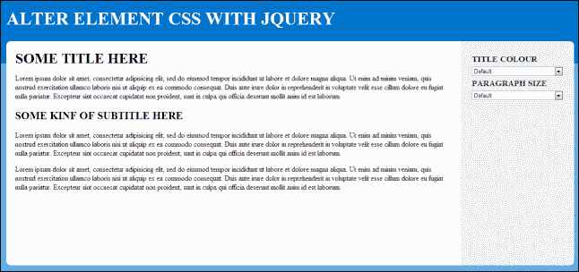
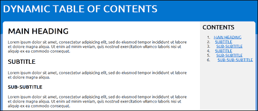
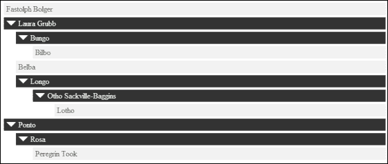
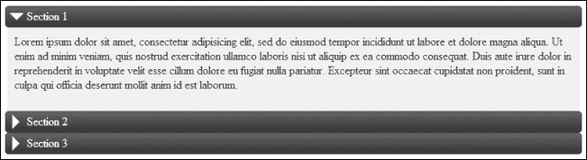

# 六、用户界面

在本章中，我们将介绍以下主题：

*   操纵元素 CSS
*   创建新闻摘要
*   创建粘性元素
*   实现平滑滚动
*   创建动态目录
*   创建基本的拖放功能
*   创建动态动画树菜单
*   创建手风琴内容滑块
*   创建选项卡式内容
*   创建模式弹出窗口
*   创建可拖动的内容弹出窗口

# 导言

jQuery 使开发人员能够轻松创建复杂的用户界面元素。因此，有大量 jQuery 插件，允许开发人员快速将此类接口添加到他们的站点。此外，jQuery 自己的 UI 框架包含许多流行的界面元素，如手风琴、表格内容、模态等等。如果您想知道如何在自己的网站上使用 jQuery UI，请直接跳到[第 9 章](09.html "Chapter 9. jQuery UI")、*jQuery UI*。本章将重点介绍从零开始开发这些流行的 UI 元素，提供无限的可定制性，并让您了解这些其他插件的工作方式。

# 操纵元件 CSS

jQuery 允许开发人员直接访问 DOM 元素的 CSS 属性。这提供了一种基于 JavaScript 中的数据改变应用程序外观的简单方法。本食谱将向您展示如何在各种元素中操作 DOM CSS。

## 准备好了吗

这个食谱需要三个文件。使用您选择的编辑器，在与 jQuery 库最新版本相同的目录中创建`recipe-1.html`、`recipe-1.js`和`recipe-1.css`。

## 怎么做…

在刚创建的三个文件中，打开每个文件进行编辑，然后执行以下步骤：

1.  在`recipe-1.html`中添加以下 HTML 代码；确保更改 jQuery 库中包含的 JavaScript 的源位置，将其指向计算机上下载最新版本 jQuery 的位置：

    ```js
    <!DOCTYPE html>
    <html>
    <head>
        <title>Chapter 6 :: Recipe 1</title>
        <link href="recipe-1.css" rel="stylesheet" 
              type="text/css" />
        <script src="jquery.min.js"></script>
        <script src="recipe-1.js"></script>
    </head>
    <body>
        <div class="header">
            <h1>ALTER ELEMENT CSS WITH JQUERY</h1>
        </div>
        <div class="content-frame">
            <div class="left">
                <h1>SOME TITLE HERE</h1>
                <p>Lorem ipsum dolor sit amet, consectetur adipisicing elit, sed do eiusmod tempor incididunt ut labore et dolore magna aliqua. Ut enim ad minim veniam, quis nostrud exercitation ullamco laboris nisi ut aliquip ex ea commodo consequat. Duis aute irure dolor in reprehenderit in voluptate velit esse cillum dolore eu fugiat nulla pariatur. Excepteur sint occaecat cupidatat non proident, sunt in culpa qui officia deserunt mollit anim id est laborum.</p>
                <h2>SOME KIND OF SUBTITLE HERE</h2>
                <p>Lorem ipsum dolor sit amet, consectetur adipisicing elit, sed do eiusmod tempor incididunt ut labore et dolore magna aliqua. Ut enim ad minim veniam, quis nostrud exercitation ullamco laboris nisi ut aliquip ex ea commodo consequat. Duis aute irure dolor in reprehenderit in voluptate velit esse cillum dolore eu fugiat nulla pariatur. Excepteur sint occaecat cupidatat non proident, sunt in culpa qui officia deserunt mollit anim id est laborum.</p>
                <p>Lorem ipsum dolor sit amet, consectetur adipisicing elit, sed do eiusmod tempor incididunt ut labore et dolore magna aliqua. Ut enim ad minim veniam, quis nostrud exercitation ullamco laboris nisi ut aliquip ex ea commodo consequat. Duis aute irure dolor in reprehenderit in voluptate velit esse cillum dolore eu fugiat nulla pariatur. Excepteur sint occaecat cupidatat non proident, sunt in culpa qui officia deserunt mollit anim id est laborum.</p>
            </div>
            <div class="right">
                <h3>TITLE COLOUR</h3>
                <select class="title-colour">
                    <option value="#">Default</option>
                    <option value="red">Red</option>
                    <option value="green">Green</option>
                    <option value="orange">Orange</option>
                    <option value="blue">Blue</option>
                </select>
                <h3>PARAGRAPH SIZE</h3>
                <select class="p-size">
                    <option value="#">Default</option>
                    <option value="10px">10px</option>
                    <option value="15px">15px</option>
                    <option value="20px">20px</option>
                    <option value="25px">25px</option>
                </select>
            </div>
        </div>
    </body>
    </html>
    ```

2.  将以下 CSS 代码添加到`recipe-1.css`：

    ```js
    body {
        margin: 0;
        background-color: #5dace7;
    }
    .header {
        height: 150px;
        background-color: #0174cd;
    }
    .header h1 {
        margin: 0 50px 0 50px;
        padding: 0;
        line-height: 100px;
        font-size: 40px;
        color: #FFFFFF;
    }
    .content-frame {
        margin: -50px 50px 0 50px;
        background-color: #FFFFFF;
        border-radius: 10px;
        min-height: 500px;
        position: relative;
    }
    .content-frame .left {
        margin-right: 20%;
        padding: 20px;
    }
    .content-frame .left h1 {
        margin: 0;
    }
    .content-frame .right {
        width: 16%;
        padding: 2%;
        position: absolute;
        top: 0;
        right: 0;
        background-color: #F1F1F1;
        border-top-right-radius: 10px;
        border-bottom-right-radius: 10px;
    }
    .content-frame .right h3 {
        margin: 0;
        line-height: 30px;
        color: #333333;
    }
    .content-frame .right select {
        width: 100%;
    }
    ```

3.  在`recipe-1.js`中添加以下 jQuery 代码以向 HTML 代码中的 select 下拉列表添加功能：

    ```js
    $(function(){
        $('.title-colour').on("change", function(){
            var colour = $(this).val();
            if (colour == "#") {
                colour = "";
            }
            $('h1, h2').css("color", colour);
        });
        $('.p-size').on("change", function(){
            var size = $(this).val();
            if (size == "#") {
                size = "";
            }
            $('p').css("font-size", size);
        });
    });
    ```

4.  Open `recipe-1.html` in a web browser and you should see the following simple web page:

    

5.  使用右侧的下拉菜单更改标题和段落元素的 CSS。

## 它是如何工作的…

HTML 创建了一个基本的 web 页面来提供元素，使其 CSS 可以由 jQuery 操作，并创建了一个简单的界面来启动这些更改。`recipe-1.css`中的 CSS 代码添加了基本样式来创建我们的网页布局。

要更改元素的 CSS，`change`事件处理程序使用各自的类名附加到两个 select 下拉列表：

```js
$(function(){
   $('.title-colour').on("change", function(){

});
$('.p-size').on("change", function(){

});
});
```

这将允许我们在用户更改标题颜色（`title-colour`或段落大小（`p-size`下拉列表）的值时执行一些代码。使用`$(this).val()`可以获取所选选项的值，如下代码段所示：

```js
$(function(){
    $('.title-colour').on("change", function(){
        var colour = $(this).val();
        if (colour == "#") {
            colour = "";
        }
        $('h1, h2').css("color", colour);
    });
    $('.p-size').on("change", function(){
        var size = $(this).val();
        if (size == "#") {
            size = "";
        }
        $('p').css("font-size", size);
    });
});
```

使用`colour`或`size`变量（保存各自下拉列表中的选定值），我们确定是否使用其值`#`选择了默认选项。如果选择了，我们将`colour`或`size`值设置为空，允许用户将被操纵的 CSS 重置为默认值。

如果选择了默认值以外的选项，则该值将与 jQuery`css()`函数中相应的 CSS 选项一起使用，如以下代码段中突出显示的：

```js
$(function(){
    $('.title-colour').on("change", function(){
        var colour = $(this).val();
        if (colour == "#") colour = "";
        $('h1, h2').css("color", colour);
    });
    $('.p-size').on("change", function(){
        var size = $(this).val();
        if (size == "#") size = "";
        $('p').css("font-size", size);
    });
});
```

# 创建新闻报价器

本食谱将向您展示如何创建一个具有停止/暂停功能的简单新闻自动收录器。新闻摘要是在一个小空间中显示大量信息的好方法，如推文、引文或一般新闻项目。

## 准备好了吗

同样，您需要创建三个文件。在与 jQuery 最新版本相同的目录中创建`recipe-2.html`、`recipe-2.css`和`recipe-2.js`。

## 怎么做…

执行以下逐步说明，创建动画新闻摘要：

1.  在`recipe-2.html`中添加以下 HTML 代码，为我们的股票代码创建一个简单的网页和内容：

    ```js
    <!DOCTYPE html>
    <html>
    <head>
        <title>Chapter 6 :: Recipe 2</title>
        <link href="recipe-2.css" rel="stylesheet" type="text/css" />
        <script src="jquery.min.js"></script>
        <script src="recipe-2.js"></script>
    </head>
    <body>
    <div class="header">
        <h1>CONTENT TICKER</h1>
    </div>
    <div class="content-frame">
        <ul id="ticker">
            <li>Learn from yesterday, live for today, hope for tomorrow. The important thing is not to stop questioning</li>
            <li>Try not to become a man of success, but rather try to become a man of value</li>
            <li>Logic will get you from A to B. Imagination will take you everywhere</li>
            <li>Reality is merely an illusion, albeit a very persistent one</li>
        </ul>
    </div>
    </body>
    </html>
    ```

2.  将下面的简单 CSS 添加到`recipe-2.css`以向我们的网页添加样式：

    ```js
    body {
        margin: 0;
        background-color: #5dace7;
    }
    .header {
        height: 130px;
        background-color: #0174cd;
    }
    .header h1 {
        margin: 0 50px 0 50px;
        padding: 0;
        line-height: 100px;
        font-size: 40px;
        color: #FFFFFF;
    }
    .content-frame {
        margin: -30px 50px 0 50px;
        background-color: #FFFFFF;
        border-radius: 10px;
        height: 50px;
        position: relative;
        padding: 0 20px 0 20px;
        overflow: hidden;
    }
    .content-frame ul {
        list-style: none;
        margin: 0;
        padding: 0;
    }
    .content-frame ul li {
        line-height: 50px;
    }
    ```

3.  在`recipe-2.js`中添加以下 jQuery 代码以激活我们的股票代码：

    ```js
    var tick = null;
    var interval = 2000;
    $(function(){
        tick = setInterval(function(){
            ticker()
        }, interval);
        $('.content-frame').on("mouseover", function(){
            clearInterval(tick);
        });
        $('.content-frame').on("mouseout", function(){
            tick = setInterval(function(){
                ticker()
            }, interval);
        });
    });
    function ticker() {
        $('#ticker li:first-child').slideUp(function(){
            $(this).appendTo($('#ticker')).slideDown();
        });
    }
    ```

4.  在网络浏览器中打开`recipe-2.html`将向您展示一个简单的网页和一个动画股票代码，每两秒钟显示一次爱因斯坦的不同引用。

## 它是如何工作的…

因为 HTML 和 CSS 代码非常简单，所以只需要对 jQuery 代码进行解释。请注意，HTML 网页包含一个无序列表元素，在名为`content-frame`的 division 元素中有四个爱因斯坦引号。`content-frame`元素的`overflow`属性设置为`hidden`，因此一次只能看到一个引号。

在`recipe-2.js`文件的顶部，声明了两个变量：`tick`和`interval`。`tick`变量是声明 JavaScript`setInterval()`函数的位置。JavaScript`setInterval()`函数允许我们指定函数和间隔。然后在指定的时间间隔内再次调用指定的函数。这使我们能够循环浏览新闻股票代码的内容。

通过在 JavaScript 文件的顶部声明`tick`变量，我们可以在稍后停止间隔以添加暂停功能。`interval`变量仅保存`setInterval()`函数在再次调用指定函数之前要等待的毫秒数：

```js
var tick = null;
var interval = 2000;
$(function(){

});
```

在 jQuery on load 函数中，我们将`tick`变量分配给`setInterval()`函数，指定再次调用该函数，然后使用`interval`变量设置间隔持续时间，如下代码段所示：

```js
$(function(){
    tick = setInterval(function(){
        ticker();
    }, interval);
});
```

要添加停止/启动功能，根据该功能，当用户将鼠标悬停在股票代码上方时，股票代码将停止，当用户移开鼠标时，股票代码将再次启动，我们需要将两个事件处理程序附加到`content-frame`分割元素，如下所示：

```js
$(function(){
    tick = setInterval(function(){
        ticker()
    }, interval);
    $('.content-frame').on("mouseover", function(){
        clearInterval(tick);
    });
    $('.content-frame').on("mouseout", function(){
        tick = setInterval(function(){
            ticker()
        }, interval);
    });
});
```

`mouseover`事件处理程序使用 JavaScript`clearInterval()`函数并将`tick`变量作为参数传递。当用户将鼠标悬停在`content-frame`元素上时，这将停止`setInterval()`函数再次调用`ticker()`函数。在`mouseout`事件的回调函数中，`tick`变量与前面的`setInterval()`函数相同，再次声明，重新初始化新闻代码并再次启动。

最后，还有`ticker()`函数本身。此函数使用 jQuery`slideUp()`函数将第一个列表元素向上滑动。这将提供下一个图元移动到视图中的效果。然后，它使用`slideUp()`函数获取已隐藏的元素，并使用`appendTo()`将其移动到股票代码列表的末尾。最后，它使用`slideDown()`将这个元素向下滑动，这样当它最终再次移动到列表顶部时，它就可以显示了。这显示在以下代码段中：

```js
function ticker() {
    $('#ticker li:first-child').slideUp(function(){
        $(this).appendTo($('#ticker')).slideDown();
    });
}
```

## 还有更多…

您可以按自己喜欢的任何方式采用启动和停止功能，例如，使用启动和停止按钮，甚至使用单个暂停按钮，使暂停股票代码的可能性更加明显。此配方中使用的方法的好处是，链接通常会显示在股票代码内容中。当用户点击股票行情器内的链接时，股票行情器将停止，允许他们点击链接，而不是在开始点击之前将链接移开。

## 另见

*   *创建动态目录*

# 创造粘性元素

粘滞元素是页面元素，即使在滚动时也会粘滞在用户浏览器中的某个位置。粘性元素用于始终将内容保持在用户视线内。这些内容可能是导航、重要信息，甚至是广告。此配方将向您展示如何创建粘性元素，并在用户滚动到页面上的某个点时使用 jQuery 激活它们。

## 准备好了吗

使用您喜爱的编辑器，创建三个名为`recipe-3.html`、`recipe-3.css`和`recipe-3.js`的文件，确保它们与 jQuery 库位于同一目录中。

## 怎么做…

对于每个新创建的文件，执行以下步骤：

1.  在`recipe-3.html`中添加以下 HTML 代码；它创建了一个可滚动的长网页和一个包含一些重要内容的`div`元素，这些内容需要始终停留在用户的视图中：

    ```js
    <!DOCTYPE html>
    <html>
    <head>
        <title>Chapter 6 :: Recipe 3</title>
        <link href="recipe-3.css" rel="stylesheet" type="text/css" />
        <script src="jquery.min.js"></script>
        <script src="recipe-3.js"></script>
    </head>
    <body>
    <div class="header">
        <h1>STICKY ELEMENTS RECIPE</h1>
    </div>
    <div class="content-frame">
        <div class="left">
            <h1>STICKY ELEMENTS</h1>
            <p>Sticky elements are great to keep important content within the users view, such as share buttons, navigation and also table of contents.</p>
            <p>Scroll down this page and when you are about to go past the important content on the right hand side, it will start to follow you down the screen.</p>
        </div>
        <div class="right">
            <ul>
                <li><a href="#">Navigation Item 1</a></li>
                <li><a href="#">Navigation Item 2</a></li>
                <li><a href="#">Navigation Item 3</a></li>
                <li><a href="#">Navigation Item 4</a></li>
                <li><a href="#">Navigation Item 5</a></li>
                <li><a href="#">Navigation Item 6</a></li>
            </ul>
            <div class="important">
                <p>Here is some important content.</p>
            </div>
        </div>
    </div>
    </body>
    </html>
    ```

2.  要设置此页面的样式，请在`recipe-3.css`中添加以下 CSS 代码；代码中还有一个`sticky`类，当用户向下滚动页面

    ```js
    @import url(http://fonts.googleapis.com/css?family=Ubuntu);
    body {
        margin: 0;
        background-color: #5dace7;
        font-family: 'Ubuntu', sans-serif;
    }
    .header {
        height: 150px;
        background-color: #0174cd;
    }
    .header h1 {
        width: 1000px;
        margin: auto;
        padding: 0;
        line-height: 100px;
        font-size: 40px;
        color: #FFFFFF;
    }
    .content-frame {
        margin: -50px auto auto auto;
        width: 1000px;
        background-color: #FFFFFF;
        border-radius: 10px;
        min-height: 1300px;
        position: relative;
    }
    .content-frame .left {
        margin-right: 240px;
        padding: 20px;
    }
    .content-frame .left h1 {
        margin: 0;
    }
    .content-frame .right {
        width: 200px;
        padding: 10px;
        position: absolute;
        top: 0;
        right: 0;
        background-color: #F1F1F1;
        border-top-right-radius: 10px;
        border-bottom-right-radius: 10px;
    }
    .content-frame .right .important {
        border: solid 1px #CCCCCC;
        text-align: center;
        width: 200px;
    }
    .sticky {
        position: fixed;
        top: 10px;
    }
    ```

    时，jQuery 会将该类应用于重要元素
3.  最后，将以下 jQuery 代码添加到`recipe-3.js`中，当用户试图滚动通过它时，它将激活粘性元素：

    ```js
    var importantOrigin = {};
    $(function(){
        importantOrigin = $('.important').offset();
        $(window).scroll(function(){
            sticky();
        });
    });
    function sticky() {
        var _important = $('.important');
        var scrollPosition = $('body, html').scrollTop();
        if (importantOrigin.top < scrollPosition) {
            _important.addClass("sticky");
        } else {
            _important.removeClass("sticky");
        }
    }
    ```

## 它是如何工作的…

在`recipe-3.js`的顶部有一个名为`importantOrigin`的变量，用于存储重要分割元素的原始位置。在 jQuery on load 块中，`$('.important').offset()`用于获取重要元素的顶部和左侧位置，并将这些值存储在先前创建的`importantOrigin`变量中。这显示在以下代码段中：

```js
var importantOrigin = {};
$(function(){
    importantOrigin = $('.important').offset();
    $(window).scroll(function(){
        sticky();
    });
});
```

jQuery`scroll()`函数用于用户每次滚动页面时执行`sticky()`方法：

```js
function sticky() {
    var _important = $('.important');
    var scrollPosition = $('body, html').scrollTop();
    if (importantOrigin.top < scrollPosition) {
        _important.addClass("sticky");
    } else {
        _important.removeClass("sticky");
    }
}
```

`sticky()`方法使用`$('body, html').scrollTop()`获取页面的当前垂直位置，然后使用该位置与重要元素的顶部位置进行比较。如果用户已滚动过该重要元素，则使用`addClass()`方法将`sticky`CSS 类应用于该重要元素：

```js
.sticky {
    position: fixed;
    top: 10px;
}
```

如果页面的当前垂直位置低于`sticky`元素的顶部，则`sticky`类将使用`removeClass()`移除，将重要元素设置回其原始状态。在 CSS 中使用`position: fixed;`可以使元素粘在页面上的某个点上。使用 jQuery 有条件地应用这个 CSS，我们可以控制元素何时粘滞，因为通常在用户滚动经过元素，使其在屏幕上不再可见之前，并不需要它。

## 还有更多…

有一个流行的 jQuery 插件，名为`sticky.js`，可以在[找到 http://stickyjs.com/](http://stickyjs.com/) 。该插件使用了您在本配方中学习的相同原理，并将所有功能捆绑到一个插件中，以便易于重用。

## 另见

*   *创建动态目录*

# 实现平滑滚动

导航到页面不同部分的锚定链接非常有用，用户可以轻松绕过他们不感兴趣的信息，直接转到他们感兴趣的信息。然而，当屏幕上有大量文本数据时，在这些不同的部分之间跳转通常会让用户感到困惑。使用平滑滚动和动画屏幕慢慢向上或向下移动到选定的部分，用户可以更容易地可视化他们导航到的位置，而不会迷失方向。

## 准备好了吗

只需创建三个标准配方文件`recipe-4.html`、`recipe-4.css`和`recipe-4.js`，并将它们保存到与 jQuery 库最新版本相同的目录中。

## 怎么做…

执行以下简单的步骤，向网站或网页添加平滑滚动：

1.  通过在`recipe-4.html`中添加以下 HTML 代码来创建一个长网页：

    ```js
    <!DOCTYPE html>
    <html>
    <head>
        <title>Chapter 6 :: Recipe 4</title>
        <link href="recipe-4.css" rel="stylesheet" type="text/css" />
        <script src="jquery.min.js"></script>
        <script src="recipe-4.js"></script>
    </head>
    <body>
    <div class="header">
        <h1 id="top">SMOOTH SCROLLING RECIPE</h1>
    </div>
    <div class="content-frame">
        <div class="left">
            <h2 id="one">SECTION 1 <a href="#top" class="top-link">[TOP]</a></h2>
            <div class="section"></div>
            <h2 id="two">SECTION 2 <a href="#top" class="top-link">[TOP]</a></h2>
            <div class="section"></div>
            <h2 id="three">SECTION 3 <a href="#top" class="top-link">[TOP]</a></h2>
            <div class="section"></div>
            <h2 id="four">SECTION 4 <a href="#top" class="top-link">[TOP]</a></h2>
            <div class="section"></div>
        </div>
        <div class="right">
            <h2>NAVIGATION</h2>
            <ul>
                <li><a href="#one">SECTION ONE</a></li>
                <li><a href="#two">SECTION TWO</a></li>
                <li><a href="#three">SECTION THREE</a></li>
                <li><a href="#four">SECTION FOUR</a></li>
                <li><a href="http://www.google.com" target="_blank">EXTERNAL LINK</a></li>
                <li><a href="#">EMPTY LINK</a></li>
            </ul>
        </div>
    </div>
    </body>
    </html>
    ```

2.  通过将以下 CSS 代码添加到前面 HTML 页面中的`recipe-4.css`来设置此页面的样式：

    ```js
    @import url(http://fonts.googleapis.com/css?family=Ubuntu);
    body {
        margin: 0;
        background-color: #5dace7;
        font-family: 'Ubuntu', sans-serif;
    }
    .header {
        height: 150px;
        background-color: #0174cd;
    }
    .header h1 {
        width: 1000px;
        margin: auto;
        padding: 0;
        line-height: 100px;
        font-size: 40px;
        color: #FFFFFF;
    }
    .content-frame {
        margin: -50px auto auto auto;
        width: 1000px;
        background-color: #FFFFFF;
        border-radius: 10px;
        min-height: 1300px;
        position: relative;
    }
    .content-frame .left {
        margin-right: 240px;
        padding: 20px;
    }
    .content-frame .left h1 {
        margin: 0;
    }
    .content-frame .right {
        width: 200px;
        padding: 10px;
        position: absolute;
        top: 0; 
        right: 0;
        background-color: #F1F1F1;
        border-top-right-radius: 10px;
        border-bottom-right-radius: 10px;
    }
    .content-frame .right h2 {
        margin: 0;
        padding: 0;
    }
    .section {
        height: 400px;
        background-color: #CCCCCC;
        margin-bottom: 20px;
    }
    .top-link {
        width: 50px;
        text-align: right;
        float: right;
        font-size: 12px;
    }
    ```

3.  在`recipe-4.js`中添加以下 jQuery 代码，捕捉锚元素点击并提供平滑滚动效果：

    ```js
    $(function(){
        $('a[href*=#]:not([href=#])').click(function(){
            if (this.hash.length > 0) {
                $('body, html').animate({
                    scrollTop: $(this.hash).offset().top
                }, 1000);
            }
            return false;
        });
    });
    ```

## 它是如何工作的…

jQuery 代码首先将`click`事件处理程序附加到某些锚元素：

```js
$(function(){
    $('a[href*=#]:not([href=#])').click(function(){

    });
});
```

前面的代码将只将一个`click`事件处理程序附加到在其`href`属性中带有散列（`#`的锚点。还使用了`:not([href=#])`，这样事件处理程序就不会附加到只有散列作为其`href`属性的锚上。现在，我们可以为页面上导航到同一页面上其他部分的链接指定要执行的代码。空白链接和外部链接将被忽略，并照常操作。

在`click`事件处理程序`callback()`函数中，我们可以使用`this.hash`检索被点击锚元素的`href`属性中的哈希值。如果锚链接到`#two`，我们将收到字符串值`"#two"`。使用`this.hash.length`，我们可以确保该值有效，并且我们可以继续提供平滑滚动动画：

```js
$(function(){
    $('a[href*=#]:not([href=#])').click(function(){
        if (this.hash.length > 0) {

        }
        return false;
    });
});
```

在`this.hash.length`的`if`语句中，我们使用以下 jQuery`animate()`函数对用户进行动画制作并滚动到锚定目标的位置：

```js
$('body, html').animate({
   scrollTop: $(this.hash).offset().top
}, 1000);
```

`scrollTop`参数是动画应该滚动到的位置。我们通过使用`$(this.hash)`选择目标元素，然后使用 jQuery`offset()`函数获取其顶部位置，从而获得该位置。

最后，我们在`this.hash.length`的`if`语句之后返回`false`，以防止点击事件的默认动作。如果删除`return false`，屏幕上会出现闪烁，因为点击事件的默认动作（将用户发送到链接部分）发生在动画开始之前。

## 另见

*   *创建动态目录*

# 创建动态目录

目录是一种常见的方式，允许用户快速访问他们正在查找的内容部分。使用 jQuery，可以根据页面上的 HTML 标题元素动态创建目录。这对于博客文章或其他有很多不同内容页面的站点非常有用。

## 准备好了吗

像以前一样创建`recipe-5.html`、`recipe-5.css`和`recipe-5.js`，并将所有三个都打开并准备好进行编辑。

## 怎么做…

创建所需文件后，执行以下步骤创建动态目录：

1.  使用以下 HTML 代码创建基本网页，并将其添加到`recipe-5.html`：

    ```js
    <!DOCTYPE html>
    <html>
    <head>
        <title>Chapter 6 :: Recipe 5</title>
        <link href="recipe-5.css" rel="stylesheet" type="text/css" />
        <script src="jquery.min.js"></script>
        <script src="recipe-5.js"></script>
    </head>
    <body>
    </body>
    </html>
    ```

2.  将以下 HTML 代码添加到刚才添加的`body`标记中的`recipe-5.html`；此将创建一个页面，其中包含分段内容和可填充内容的有序列表元素：

    ```js
    <div class="header">
        <h1>DYNAMIC TABLE OF CONTENTS</h1>
    </div>
    <div class="content-frame">
        <div class="left">
            <h1 id="one">MAIN HEADING</h1>
            <p>Lorem ipsum dolor sit amet, consectetur adipisicing elit, sed do eiusmod tempor incididunt ut labore et dolore magna aliqua. Ut enim ad minim veniam, quis nostrud exercitation ullamco laboris nisi ut aliquip ex ea commodo consequat.</p>
            <h2 id="two">SUBTITLE</h2>
            <p>Lorem ipsum dolor sit amet, consectetur adipisicing elit, sed do eiusmod tempor incididunt ut labore et dolore magna aliqua.</p>
            <h3 id="three">SUB-SUBTITLE</h3>
            <p>Lorem ipsum dolor sit amet, consectetur adipisicing elit, sed do eiusmod tempor incididunt ut labore et dolore magna aliqua. Ut enim ad minim veniam, quis nostrud exercitation ullamco laboris nisi ut aliquip ex ea commodo consequat.</p>
            <h2 id="four">SUBTITLE</h2>
            <p>Ut enim ad minim veniam, quis nostrud exercitation ullamco laboris nisi ut aliquip ex ea commodo consequat.</p>
            <h3 id="five">SUB-SUBTITLE</h3>
            <p>Ut enim ad minim veniam, quis nostrud exercitation ullamco laboris nisi ut aliquip ex ea commodo consequat.</p>
            <p>Ut enim ad minim veniam, quis nostrud exercitation ullamco laboris nisi ut aliquip ex ea commodo consequat.</p>
            <h4 id="six">SUB-SUB-SUBTITLE</h4>
            <p>Ut enim ad minim veniam, quis nostrud exercitation ullamco laboris nisi ut aliquip ex ea commodo consequat.</p>
        </div>
        <div class="right">
            <h2>CONTENTS</h2>
            <ol class="contents"></ol>
        </div>
    </div>
    ```

3.  将以下 CSS 添加到`recipe-5.css`以将基本样式添加到此页面。这个 CSS 代码再次与本章最后两个配方

    ```js
    @import url(http://fonts.googleapis.com/css?family=Ubuntu);
    body {
        margin: 0;
        background-color: #5dace7;
        font-family: 'Ubuntu', sans-serif;
    }
    .header {
        height: 150px;
        background-color: #0174cd;
    }
    .header h1 {
        width: 1000px;
        margin: auto;
        padding: 0;
        line-height: 100px;
        font-size: 40px;
        color: #FFFFFF;
    }
    .content-frame {
        margin: -50px auto auto auto;
        width: 1000px;
        background-color: #FFFFFF;
        border-radius: 10px;
        min-height: 1300px;
        position: relative;
    }
    .content-frame .left {
        margin-right: 240px;
        padding: 20px;
    }
    .content-frame .left h1 {
        margin: 0;
    }
    .content-frame .right {
        width: 200px;
        padding: 10px;
        position: absolute;
        top: 0;
        bottom: 0;
        right: 0;
        background-color: #F1F1F1;
        border-top-right-radius: 10px;
        border-bottom-right-radius: 10px;
    }
    .content-frame .right h2 {
        margin: 0;
        padding: 0;
    }
    ```

    非常相似
4.  将以下 jQuery 代码添加到`recipe-5.js`中，它将根据我们刚刚创建的 HTML 页面中标题部分的填充有序列表：

    ```js
    $(function(){
        var _contents = $('.content-frame .left');
        var _headers = _contents.find("h1, h2, h3, h4");
        _headers.each(function(index, value){
            var _header = $(value);
            var level = parseInt(_header.context.localName.replace("h", ""));
            if (typeof _header.attr("id") != "undefined") {
                var listItem = $("<li><a href='#" + _header.attr("id") + "'>" + _header.html() + "</a></li>");
            } else {
                var listItem = $("<li>" + _header.html() + "</li>");
            }
            listItem.css("padding-left", (level * 5));
            $('.contents').append($(listItem));
        });
    });
    ```

5.  Opening `recipe-5.html` in a web page will present you with the content to the left-hand side of the screen and the dynamically-generated contents list to the right-hand side as shown in the following screenshot:

    

## 它是如何工作的…

HTML 代码提供了一个内容窗格，其中包含以`h1`、`h2`、`h3`和`h4`标记为首的各个部分，以及一个空的有序列表元素。

我们的 jQuery 代码首先选择内容部分，然后使用 jQuery`find()`函数并指定`h1, h2, h3, h4`作为唯一参数来查找其中的所有标题元素。这将创建一个已找到元素的数组，并将它们存储在`_headers`数组中，如以下代码段所示：

```js
$(function(){
    var _contents = $('.content-frame .left');
    var _headers = _contents.find("h1, h2, h3, h4");
// --- HIDDEN CODE
});
```

然后，使用 jQuery`each()`函数，可以迭代所有找到的头元素并构建目录。首先声明局部变量`_header`，并将当前标头元素存储在此变量中。

为了能够缩进目录中的子部分，让用户更容易看到内容结构，代码需要确定当前标题的级别：`h1`为顶层，`h5`为底层。使用`_header.context.localName`，我们可以获取 header 元素的标签（例如`h1`，并使用 JavaScript`replace()`删除“`h`”。然后，我们可以使用`parseInt()`将剩余值转换为整数。我们只剩下一个值，可以用来确定 header 元素的级别。下面的代码片段显示了这个过程：

```js
$(function(){
    var _contents = $('.content-frame .left');
    var _headers = _contents.find("h1, h2, h3, h4");
    _headers.each(function(index, value){
        var _header = $(value);
        var level = parseInt(_header.context.localName.replace("h", ""));
        // --- HIDDEN CODE
    });
});
```

现在我们可以创建 list 元素，将其插入到有序列表中。为了将目录中的项目链接到内容的适当部分，我们需要检查 header 元素是否具有可以链接到的 ID。如果有，我们创建一个带有链接的列表元素；否则，我们将通过执行以下代码创建基本列表元素：

```js
$(function(){
    var _contents = $('.content-frame .left');
    var _headers = _contents.find("h1, h2, h3, h4");
    _headers.each(function(index, value){
        var _header = $(value);
        var level = parseInt(_header.context.localName.replace("h", ""));
        if (typeof _header.attr("id") != "undefined") {
            var listItem = $("<li><a href='#" + _header.attr("id") + "'>" + _header.html() + "</a></li>");
        } else {
            var listItem = $("<li>" + _header.html() + "</li>");
        }
        listItem.css("padding-left", (level * 5));
        $('.contents').append($(listItem));
    });
});
```

最后，创建列表项后，使用`css()`函数和`level`变量添加缩进所需的填充，并将创建的列表项附加到内容的有序列表中。

## 还有更多…

您可以将此配方与*实现平滑滚动*和*创建粘性元素*配方相结合，以强制目录跟随用户进入页面，并提供滚动动画，以获得更好的用户体验。

## 另见

*   *创造粘性元素*
*   *实现平滑滚动*

# 创建基本的拖放功能

通过向站点添加拖放元素，可以创建有趣直观的界面。jQueryUI 附带了一个用于拖放界面的内置插件。本食谱将向您展示如何在不使用任何插件的情况下创建基本的拖放功能，从而使您能够自由和理解扩展代码。

## 准备好了吗

创建一个名为`recipe-6.html`的空白 HTML 页面，其中包含与 jQuery 库最新版本位于同一目录中的`recipe-6.css`和`recipe-6.js`文件。

## 怎么做…

按照以下分步说明完成此配方：

1.  在`recipe-6.html`中添加以下 HTML 代码，在`div`容器中创建一个包含三个`draggable`元素的基本 HTML 页面：

    ```js
    <!DOCTYPE html>
    <html>
    <head>
        <title>Chapter 6 :: Recipe 6</title>
        <link href="recipe-6.css" rel="stylesheet" type="text/css" />
        <script src="jquery.min.js"></script>
        <script src="recipe-6.js"></script>
    </head>
    <body>
        <div class="container">
            <div class="draggable"></div>
            <div class="draggable"></div>
            <div class="draggable"></div>
        </div>
    </body>
    </html>
    ```

2.  将以下 CSS 代码添加到`recipe-6.css`以设置 HTML 页面和`draggable`元素的样式：

    ```js
    .container {
        width: 800px;
        height: 500px;
        border: solid 2px #333333;
        margin: 20px auto auto auto;
    }
    .draggable {
        width: 120px;
        height: 120px;
        margin: 10px;
        background-color: darkred;
           cursor: pointer;
    }
    .draggable.dragging {
        box-shadow: 5px 5px 5px #CCC;
    }
    ```

3.  在`recipe-6.js`中插入以下 jQuery 代码，将拖放功能应用于`draggable`元素：

    ```js
    $(function(){
        $('.draggable').on("mousedown", function(){
           $(this).addClass('dragging');
        }).on("mousemove mouseout", function(event){
                if ($(this).hasClass("dragging")) {
                    //Get the parents position
                    var parentPosition = $(this).parent().offset();

                    //Don't allow the draggable element to go over the parent's left and right
                    var left = (event.pageX - ($(this).width() / 2));
                    var parentRight = parentPosition.left + $(this).parent().width();
                   if (left > (parentRight - $(this).width())){
                        left = (parentRight - $(this).width());
                    } else if(left <= parentPosition.left) {
                        left = parentPosition.left;
                    }

                    //Don't allow the draggable element to go over the parent's top and bottom
                    var top = (event.pageY - ($(this).height() / 2));
                    var parentBottom = parentPosition.top + $(this).parent().height();
                    if (top > (parentBottom - $(this).height())) {
                        top = (parentBottom - $(this).height());
                    } else if (top <= parentPosition.top) {
                        top = parentPosition.top;
                    }

                    //Set new position
                    $(this).css({
                        top: top + "px",
                        left: left + "px",
                        position: "absolute"
                    });
                }
        }).on("mouseup", function(){
            $(this).removeClass('dragging');
        });
    });
    ```

4.  在 web 浏览器中打开`recipe-6.html`并单击其中一个红色框。这将对元素应用`dragging`CSS 类，允许您在框架分区内的页面中移动它。

## 它是如何工作的…

HTML 页面提供了一个容器`div`元素，充当`draggable`元素的容器。在`frame`元素内还有三个额外的`div`元素。这三个元素具有`draggable`类，jQuery 将使用该类应用拖放功能。

配方中使用的 CSS 代码在`frame`元素上创建边框，并设置`draggable`元素的高度、宽度和背景色。还有一个`dragging`类，当`draggable`元素被移动时，该类会对其应用阴影。

在 jQuery 代码本身中，一系列鼠标事件用于创建拖放功能。jQuery`on()`函数用于将不同的事件处理程序应用于`draggable`元素。应用于`draggable`元素的第一个事件处理程序是`mousedown`事件，如所示，如下代码所示：

```js
$('.draggable').on("mousedown", function(){
       $(this).addClass('dragging');
})
```

这只是将`dragging`类添加到刚刚单击的元素（`mousedown`）。

下一个要附加的事件处理程序用于`mousemove`和`mouseout`事件。这允许我们在用户移动鼠标指针同时仍单击所选元素时，根据鼠标位置更新单击元素的位置。当用户移动过快并将鼠标指针从所选的`draggable`框中取出时，我们也会对`mouseout`事件使用相同的代码。由于`mouseout`事件附加了相同的代码，框的位置将更新为鼠标的位置：

```js
.on("mousemove mouseout", function(event){
            if ($(this).hasClass("dragging")) {
                //Get the parents position
                var parentPosition = $(this).parent().offset();

                //Don't allow the draggable element to over the parent's left and right
                var left = (event.pageX - ($(this).width() / 2));
                var parentRight = parentPosition.left + $(this).parent().width();
                if (left > (parentRight - $(this).width())) {
                    left = (parentRight - $(this).width());
                } else if(left <= parentPosition.left) {
                    left = parentPosition.left;
                }

                //Don't allow the draggable element to go over the parent's top and bottom
                var top = (event.pageY - ($(this).height() / 2));
                var parentBottom = parentPosition.top + $(this).parent().height();
                if (top > (parentBottom - $(this).height())) {
                    top = (parentBottom - $(this).height());
                } else if (top <= parentPosition.top) {
                    top = parentPosition.top;
                }

                //Set new position
                $(this).css({
                    top: top + "px",
                    left: left + "px",
                    position: "absolute"
                });
            }
    })
```

这两个事件的回调函数是添加主要功能的地方。这段代码看起来很复杂，但一旦我们将其分解，就很容易理解了。首先，除非单击的元素具有`dragging`类，否则不会执行任何操作。这是使用以下检查`dragging`类的`if`语句完成的：

```js
if ($(this).hasClass("dragging")) {
   //MAIN FUNCTIONALITY HERE
}
```

在这个`if`语句中，我们首先得到被点击元素的父元素位置（`frame`元素），这样我们就可以计算出`draggable`元素的边界：

```js
var parentPosition = $(this).parent().offset();
```

下一个代码块查看单击元素的位置，并确定该位置是否小于`frame`元素的左位置或大于容器元素的右位置。如果是，则将`dragging`元素的位置设置为边界限制，而不是鼠标指针的位置，从而阻止用户将元素拖动到容器元素的左右边界之外：

```js
//Don't allow the draggable element to over the parent's left and right
var left = (event.pageX - ($(this).width() / 2));
var parentRight = parentPosition.left + $(this).parent().width();
if (left > (parentRight - $(this).width())) {
left = (parentRight - $(this).width());
} else if(left <= parentPosition.left) {
left = parentPosition.left;
}
```

如果`draggable`元素的位置不在边界上方，则其位置将更新为鼠标指针的左位置减去`dragging`元素的宽度，以便鼠标指针在拖动时始终位于元素的中心。

接下来，对顶部和底部边界应用相同的逻辑：

```js
//Don't allow the draggable element to go over the parent's top and bottom
var top = (event.pageY - ($(this).height() / 2));
var parentBottom = parentPosition.top + $(this).parent().height();
if (top > (parentBottom - $(this).height())) {
    top = (parentBottom - $(this).height());
} else if (top <= parentPosition.top) {
    top = parentPosition.top;
}
```

最后，现在已经计算了`draggable`元素的新的顶部和左侧位置，知道是鼠标指针的位置减去`draggable`元素的宽度/高度除以二或边界限制，jQuery CSS 函数用于应用这些位置，同时设置 CSS`position``absolute`的属性：

```js
//Set new position
$(this).css({
top: top + "px",
left: left + "px",
position: "absolute"
});
```

最后，最后一个事件是使用`mouseup`事件，当用户从`dragging`元素释放点击时触发该事件。发生这种情况时，`dragging`CSS 类将从拖动的元素中删除：

```js
.on("mouseup", function(){
        $(this).removeClass('dragging');
});
```

## 另见

*   *创建可拖动内容弹出*

# 创建动态动画树菜单

树型菜单是一种在受限空间中显示大量信息的好方法，允许用户选择他们希望看到的信息。这个配方将向您展示如何基于一组具有上下滑动效果的 JSON 对象动态创建树菜单。

## 准备好了吗

为此配方创建`recipe-7.html`、`recipe-7.js`和`recipe-7.css`，确保它们保存在与 jQuery 最新版本相同的目录中。

## 怎么做…

要创建动画树菜单，请确保完成以下所有说明：

1.  将以下 HTML 代码添加到`recipe-7.html`以创建此配方所需的基本网页：

    ```js
    <!DOCTYPE html>
    <html>
    <head>
        <title>Chapter 6 :: Recipe 7</title>
        <link href="recipe-7.css" rel="stylesheet" type="text/css" />
        <script src="jquery.min.js"></script>
        <script src="recipe-7.js"></script>
    </head>
    <body>
    <div class="container">
        <div class="list-container"></div>
    </div>
    </body>
    </html>
    ```

2.  将以下样式添加到`recipe-7.css`：

    ```js
    .list-container {
        width: 800px;
        margin: 20px auto auto auto;
    }
    ul {
        margin: 0;
        padding: 0;
        list-style: none;
    }
    ul li {
        line-height: 25px;
        margin: 5px 0 5px 0;
        position: relative;
        padding: 0 0 0 5px;
        color: #666;
    }
    ul li a {
        display: block;
        background-color: #333;
        padding: 0 0 0 30px;
        margin-left: -5px;
        text-decoration: none;
        color: #FFF;
    }
    .arrow {
        position: absolute;
        width: 20px;
        height: 20px;
        left: 5px;
        top: 2px;
    }
    .right-arrow {
        width: 0;
        height: 0;
        border-top: 10px solid transparent;
        border-bottom: 10px solid transparent;
        border-left: 10px solid white;
    }
    .down-arrow {
        width: 0;
        border-left: 10px solid transparent;
        border-right: 10px solid transparent;
        border-top: 10px solid white;
        top: 7px;
    }
    .list-bg {
        background-color: #F1F1F1;
    }
    ```

3.  在`recipe-7.js`中添加以下 jQuery 代码，该代码提供了创建动态树菜单的数据和功能：

    ```js
    var tree = [
        {
            name: "Fastolph Bolger",
            children: []
        },
        {
            name: "Laura Grubb",
            children: [
                {
                    name: "Bungo",
                    children: [
                        {
                            name: "Bilbo",
                            children: []
                        }
                    ]
                },
                {
                    name: "Belba",
                    children: []
                },
                {
                    name: "Longo",
                    children: [
                        {
                            name: "Otho Sackville-Baggins",
                            children: [
                                {
                                    name: "Lotho",
                                    children: []
                                }
                            ]
                        }
                    ]
                }
            ]
        },
        {
            name: "Ponto",
            children: [
                {
                    name: "Rosa",
                    children: [
                        {
                            name: "Peregrin Took",
                            children: []
                        }
                    ]
                }
            ]
        }
    ];
    $(function(){
        var list = createList(tree, 1);
        $('.list-container').html(list);
        $(document).on('click', '.show-children', function(){
            $(this).next('ul').slideToggle();
            $(this).find('.right-arrow').toggleClass('down-arrow');
        });
    });

    function createList(children, level) {
        var style = "margin-left: " + (10 * level) + "px;"
        if (level > 1) {
            style += "display: none;";
        }
        var list = "<ul style='" + style + "'>";
        level++;
        for (var i = 0; i < children.length; i++) {
            if (children[i].children.length > 0) {
                list += "<li><a href='javascript:void(0)' class='show-children'><div class='arrow right-arrow'></div> " + children[i].name + "</a>";
                list += createList(children[i].children, level);
                list += "</li>";
            } else {
                list += "<li class='list-bg'>" + children[i].name + "</li>";
            }
        }
        list += "</ul>";
        return list;
    }
    ```

4.  Open `recipe-7.html` in a web browser and click on the highlighted list items to expand the list for items that have children, as depicted in the following screenshot:

    

## 它是如何工作的…

HTML 代码只包含有效 HTML 页面的基本元素和一个`list-container`分割元素，jQuery 代码将使用该元素在创建列表 HTML 后插入列表 HTML。CSS 代码包含基本的列表样式以及一些用于创建右箭头和下箭头的样式，如前一个屏幕截图所示。

JavaScript 代码的第一部分是表示族谱的对象数组。家谱中的每个人都可以生孩子，而且家谱的深度没有限制。

jQuery 代码的主要功能在`createList()`函数中。此函数接受两个参数：对象数组（子对象）和当前列表级别。在此函数中，一些内联样式是根据`level`的值计算的。如果`level`的当前值不是`1`，表示当前级别不是最顶层，则默认隐藏列表。左边距也将基于级别应用于列表，这样，随着每个级别的降低，列表将进一步向右移动，以创建在应用程序中看到的典型树视图。创建一个`list`变量，并向其中添加无序列表元素的 HTML。接下来，将循环提供的每个对象，并为每个对象创建一个列表项。检查对象的`children`属性的长度，以确定当前对象本身是否有子对象。如果它有子项，则会向列表中添加链接和右箭头。然后，使用更新的级别和当前对象自己的子对象递归调用`createList()`函数。此函数将返回包含对象自身子对象的无序列表的 HTML。在完全创建列表之前，树变量中的每个对象都会发生这种情况。然后，使用`$('.list-container').html(list);`将列表插入 DOM，并在页面上显示。

由于除了顶级项之外的所有列表项都是隐藏的，因此需要为每个具有子项的列表项附加一个`click`事件处理程序，如下代码所示：

```js
$(document).on('click', '.show-children', function(){
        $(this).next('ul').slideToggle();
        $(this).find('.right-arrow').toggleClass('down-arrow');
});
```

文档中附加了一个事件，该事件将侦听对具有`show-children`类的任何元素的单击。单击其中一个项目后，将在下一个无序列表元素（子列表）上使用`slideToggle()`功能，将其向上或向下滑动。`arrow`元素上也使用了`toggleClass()`功能，当子列表打开时，箭头指向下方。

## 还有更多…

这个方法使用了一个静态 JavaScript 数组，但它可以很容易地适应从 web 服务器加载一组 JSON 对象。

## 另见

*   *创建手风琴内容滑块*
*   *创建选项卡式内容*

# 创建手风琴内容滑块

手风琴允许用户轻松跳过内容。有许多 jQuery 插件提供了手风琴功能。然而，这个方法将向您展示如何从头开始创建一个简单而有吸引力的 jQuery accordion 内容滑块。

## 准备好了吗

在与 jQuery 库相同的目录中创建`recipe-8.html`、`recipe-8.css`和`recipe-8.js`。

## 怎么做…

打开新创建的文件后，完成以下分步说明：

1.  将以下 HTML 代码添加到`recipe-8.html`中，创建一个包含手风琴和内容的基本网页：

    ```js
    <!DOCTYPE html>
    <html>
    <head>
        <title>Chapter 6 :: Recipe 8</title>
        <link href="recipe-8.css" rel="stylesheet" type="text/css" />
        <script src="jquery.min.js"script>
        <script src="recipe-8.js"></script>
    </head>
    <body>
    <div class="container">
        <div class="accordion">
            <section>
                <a href="#" class="header"><div class='arrow right-arrow down-arrow'></div> Section 1</a>
                <div class="content">
                    <p>Lorem ipsum dolor sit amet, consectetur adipisicing elit, sed do eiusmod tempor incididunt ut labore et dolore magna aliqua. Ut enim ad minim veniam, quis nostrud exercitation ullamco laboris nisi ut aliquip ex ea commodo consequat. Duis aute irure dolor in reprehenderit in voluptate velit esse cillum dolore eu fugiat nulla pariatur. Excepteur sint occaecat cupidatat non proident, sunt in culpa qui officia deserunt mollit anim id est laborum.</p>
                </div>
            </section>
            <section>
                <a href="#" class="header"><div class='arrow right-arrow'></div> Section 2</a>
                <div class="content">
                    <p>Lorem ipsum dolor sit amet, consectetur adipisicing elit, sed do eiusmod tempor incididunt ut labore et dolore magna aliqua. Ut enim ad minim veniam, quis nostrud exercitation ullamco laboris nisi ut aliquip ex ea commodo consequat. Duis aute irure dolor in reprehenderit in voluptate velit esse cillum dolore eu fugiat nulla pariatur. Excepteur sint occaecat cupidatat non proident, sunt in culpa qui officia deserunt mollit anim id est laborum.</p>
                    <p>Lorem ipsum dolor sit amet, consectetur adipisicing elit, sed do eiusmod tempor incididunt ut labore et dolore magna aliqua. Ut enim ad minim veniam, quis nostrud exercitation ullamco laboris nisi ut aliquip ex ea commodo consequat. Duis aute irure dolor in reprehenderit in voluptate velit esse cillum dolore eu fugiat nulla pariatur. Excepteur sint occaecat cupidatat non proident, sunt in culpa qui officia deserunt mollit anim id est laborum.</p>
                </div>
            </section>
            <section>
                <a href="#" class="header"><div class='arrow right-arrow'></div> Section 3</a>
                <div class="content">
                    <p>Lorem ipsum dolor sit amet, consectetur adipisicing elit, sed do eiusmod tempor incididunt ut labore et dolore magna aliqua. Ut enim ad minim veniam, quis nostrud exercitation ullamco laboris nisi ut aliquip ex ea commodo consequat. Duis aute irure dolor in reprehenderit in voluptate velit esse cillum dolore eu fugiat nulla pariatur. Excepteur sint occaecat cupidatat non proident, sunt in culpa qui officia deserunt mollit anim id est laborum.</p>
                </div>
            </section>
        </div>
    </div>
    </body>
    </html>
    ```

2.  将以下 CSS 代码添加到`recipe-8.css`以向手风琴添加样式：

    ```js
    .container {
        width: 800px;
        margin: 20px auto auto auto;
    }
    .accordion section a.header {
        display: block;
        line-height: 30px;
        /* fallback */
        background-color: #333333;
        background-repeat: repeat-x;
        /* Safari 4-5, Chrome 1-9 */
        background: -webkit-gradient(linear, 0% 0%, 0% 100%, from(#666666), to(#333333));
        /* Safari 5.1, Chrome 10+ */
        background: -webkit-linear-gradient(top, #666666, #333333);
        /* Firefox 3.6+ */
        background: -moz-linear-gradient(top, #666666, #333333);
        /* IE 10 */
        background: -ms-linear-gradient(top, #666666, #333333);
        /* Opera 11.10+ */
        background: -o-linear-gradient(top, #666666, #333333);
        padding: 0 10px 0 30px;
        position: relative;
        text-decoration: none;
        color: #FFFFFF;
        border-radius: 5px;
    }
    .accordion section .content {
        padding: 10px;
        margin: 0 3px 0 3px;
        background-color: #F1F1F1;
        color: #333333;
    }

    .accordion section .content p {
        margin-top: 0;
    }

    .arrow {
        position: absolute;
        width: 20px;
        height: 20px;
        left: 10px;
        top: 5px;
    }
    .right-arrow {
        width: 0;
        height: 0;
        border-top: 10px solid transparent;
        border-bottom: 10px solid transparent;
        border-left: 10px solid white;
    }
    .down-arrow {
        width: 0;
        border-left: 10px solid transparent;
        border-right: 10px solid transparent;
        border-top: 10px solid white;
        top: 10px;
        left: 6px;
    }
    ```

3.  将以下 jQuery 代码添加到`recipe-8.js`中，点燃手风琴内容滑块进入动作：

    ```js
    $(function(){
        //Hide all accordion content except the first one
        $('.accordion section:not(:first-child) .content').hide();
        $(document).on("click", ".accordion a.header", function(){
            var _contents = $('.accordion section .content');
            var _currentContent = $(this).parent().find('.content');
            for (var i = 0; i < _contents.length; i++) {
                var content = $(_contents[i]);
                //Only slide the element up if its not the currently selected element
                if (content[0] != _currentContent[0]) {
                    content.slideUp();
                    content.parent().find('.right-arrow').removeClass('down-arrow');
                }
            }
            _currentContent.slideDown();
            _currentContent.parent().find('.right-arrow').addClass('down-arrow');
        });
    });
    ```

4.  Open `recipe-8.html` in a web browser and you will be provided with the interactive accordion content slider shown in the following screenshot:

    

## 它是如何工作的…

此配方中使用的 HTML 代码创建了一个包含主要手风琴标记的基本网页。有一个主要的手风琴分割元素，包含几个部分。每个部分都包含一个带有类`header`的锚定标记和一个保存手风琴内容的内容分割元素。jQuery 代码使用 header 锚元素根据用户单击的锚元素隐藏和显示内容部分。

CSS 代码非常简单，为手风琴添加了基本样式。与前面的配方一样，我们使用 CSS 右箭头和下箭头来指示一个部分是打开的还是关闭的。我们还使用 CSS3 渐变向 accordion 标题添加渐变背景。

由于 jQuery 的特性，我们能够用 18 行 JavaScript 创建整个 accordion。jQuery 代码的第一部分隐藏了除第一部分之外的所有 accordion 内容部分：

```js
$('.accordion .section:not(:first-child) .content').hide();
```

然后，一个`click`事件处理程序被附加到文档上，以侦听对任何 accordion 内容头的单击，如以下代码段所示：

```js
$(document).on("click", ".accordion a.header", function(){
});
```

在该事件的回调函数中，我们选择所有 accordion 内容部分，并获取属于当前单击的 header 元素的部分：

```js
var _contents = $('.accordion .section .content');
var _currentContent = $(this).parent().find('.content');
```

选择手风琴部分时，我们只希望显示该部分。为此，除了选定的部分外，以下代码中的所有内容部分都会循环以隐藏它们：

```js
for (var i = 0; i < _contents.length; i++) {
var content = $(_contents[i]);
//Only slide the element up if it's not the currently selected element
if (content[0] != _currentContent[0]) {
     content.slideUp();
     content.parent().find('.right-arrow').removeClass('down-arrow');
}
}
```

使用 jQuery`slideUp()`函数，我们可以隐藏具有幻灯片效果的元素。标题中的箭头也更改为右箭头，表示内容尚未展开。

最后，展开选中的内容部分，并添加向下箭头，表示内容已展开，如下代码所示：

```js
_currentContent.slideDown();
_currentContent.parent().find('.right-arrow').addClass('down-arrow');
```

## 另见

*   *创建动态动画树菜单*
*   *创建选项卡式内容*

# 创建选项卡式内容

与手风琴类似，选项卡式内容是在一个页面上显示大量信息的另一种很好的方式，允许用户跳过对他们来说很重要的部分。与前面的方法一样，有许多 jQuery 插件提供此功能。本食谱向您展示了如何从零开始自己创建此功能，从而使您能够更深入地了解这些类型用户界面的内部工作原理。

## 准备好了吗

在与 jQuery 库相同的目录中创建配方所需的常用文件`recipe-9.html`、`recipe-9.css`和`recipe-9.js`。

## 怎么做…

完成以下所有分步说明：

1.  使用以下 HTML 代码在`recipe-9.html`中创建一个基本网页：

    ```js
    <!DOCTYPE html>
    <html>
    <head>
        <title>Chapter 6 :: Recipe 9</title>
        <link href="recipe-9.css" rel="stylesheet" type="text/css" />
        <script src="jquery.min.js"></script>
        <script src="recipe-9.js"></script>
    </head>
    <body>
    </body>
    </html>
    ```

2.  在您刚刚创建的 HTML 页面的`body`标记中，添加以下 HTML 代码来创建选项卡式内容：

    ```js
    <div class="container">
        <div class="tabs">
            <ul class="tab-nav">
                <li><a href="#section1" class="active">Section 1</a></li><li><a href="#section2">Section 2</a></li><li><a href="#section3">Section 3</a></li>
            </ul>
            <div class="tab-content">
                <div class="section" id="section1">
                    <p><strong>Section 1 content...</strong></p>
                    <p>Lorem ipsum dolor sit amet, consectetur adipisicing elit, sed do eiusmod tempor incididunt ut labore et dolore magna aliqua. Ut enim ad minim veniam, quis nostrud exercitation ullamco laboris nisi ut aliquip ex ea commodo consequat. Duis aute irure dolor in reprehenderit in voluptate velit esse cillum dolore eu fugiat nulla pariatur. Excepteur sint occaecat cupidatat non proident, sunt in culpa qui officia deserunt mollit anim id est laborum.</p>
                </div>
                <div class="section" id="section2">
                    <p><strong>Section 2 content...</strong></p>
                    <p>Lorem ipsum dolor sit amet, consectetur adipisicing elit, sed do eiusmod tempor incididunt ut labore et dolore magna aliqua. Ut enim ad minim veniam, quis nostrud exercitation ullamco laboris nisi ut aliquip ex ea commodo consequat. Duis aute irure dolor in reprehenderit in voluptate velit esse cillum dolore eu fugiat nulla pariatur. Excepteur sint occaecat cupidatat non proident, sunt in culpa qui officia deserunt mollit anim id est laborum.</p>
                    <p>Lorem ipsum dolor sit amet, consectetur adipisicing elit, sed do eiusmod tempor incididunt ut labore et dolore magna aliqua. Ut enim ad minim veniam, quis nostrud exercitation ullamco laboris nisi ut aliquip ex ea commodo consequat. Duis aute irure dolor in reprehenderit in voluptate velit esse cillum dolore eu fugiat nulla pariatur. Excepteur sint occaecat cupidatat non proident, sunt in culpa qui officia deserunt mollit anim id est laborum.</p>
                </div>
                <div class="section" id="section3">
                    <p><strong>Section 3 content...</strong></p>
                    <p>Lorem ipsum dolor sit amet, consectetur adipisicing elit, sed do eiusmod tempor incididunt ut labore et dolore magna aliqua. Ut enim ad minim veniam, quis nostrud exercitation ullamco laboris nisi ut aliquip ex ea commodo consequat. Duis aute irure dolor in reprehenderit in voluptate velit esse cillum dolore eu fugiat nulla pariatur. Excepteur sint occaecat cupidatat non proident, sunt in culpa qui officia deserunt mollit anim id est laborum.</p>
                </div>
            </div>
        </div>
    </div>
    ```

3.  打开`recipe-9.css`并添加以下 CSS 代码以设置选项卡式内容的样式，并在页面加载时显示第一组内容：

    ```js
    .container {
        width: 800px;
        margin: 20px auto auto auto;
    }
    .tabs .tab-nav {
        margin: 0;
        padding: 0;
        list-style: none;
        background-color: #E1E1E1;
        border-top-right-radius: 5px;
        border-top-left-radius: 5px;
    }
    .tabs .tab-nav li {
        display: inline-block;
    }
    .tabs .tab-nav li a {
        display: block;
        text-decoration: none;
        text-align: center;
        line-height: 50px;
        color: #FFF;
        background-color: #333;
        padding: 0 20px 0 20px;
        border-right: solid 1px #5c5c5c;
    }
    .tabs .tab-nav li a:hover, .tabs .tab-nav li a.active {
        background-color: #5c5c5c;
    }
    .tabs .tab-nav li:first-child a {
        border-top-left-radius: 5px;
    }
    .tabs .tab-nav li:last-child a {
        border-top-right-radius: 5px;
        border-right: none;
    }
    .tabs .section {
        padding: 10px;
        background-color: #F1F1F1;
        border-bottom-right-radius: 5px;
        border-bottom-left-radius: 5px;
    }
    .tabs .section p {
        margin-top: 0;
    }

    .tabs .section:not(:first-child) {
        display: none;
    }
    ```

4.  在`recipe-9.js`中插入以下 jQuery 的：

    ```js
    $(function(){
        $(document).on("click", ".tabs .tab-nav a", function(){
            var contentId = this.hash;
            $('.tab-nav a').removeClass("active");
            $(this).addClass("active");
            $('.tab-content .section').hide();
            $(contentId).fadeIn();
        });
    });
    ```

5.  在 web 浏览器中打开`recipe-9.html`并单击节选项卡，在内容节之间切换。

## 它是如何工作的…

这是一个快速而简单的食谱，但它有一个强大的结果。此配方中的 HTML 代码创建包含导航和内容的选项卡部分。每个内容划分元素都有一个对应于导航中链接的 ID。例如，要链接到`section1`内容，需要在`#content1`的导航链接中有一个相应的链接，如下所示：`<a href='#content1'>TITLE HERE</a>`。这允许 jQuery 知道在单击选项卡时要使内容的哪个部分可见。

这个配方中的 CSS 非常简单，不需要进一步解释。

只有九行 JavaScript，这确实是一个非常简单的方法。jQuery 代码将一个 click 事件处理程序附加到文档主体，监听导航选项卡上的单击。单击其中一个选项卡时，将从锚散列中收集内容节 ID，如下所示：

```js
$(document).on("click", ".tabs .tab-nav a", function(){
        var contentId = this.hash;
});
```

接下来，将从所有选项卡导航项目中删除活动类，并将其添加到单击的项目中。此类用于通过使用 CSS 更改背景颜色来显示当前处于活动状态的选项卡，如下所示：

```js
$('.tab-nav a').removeClass("active");
$(this).addClass("active");
```

最后，隐藏所有内容部分，然后使用最近获取的所选选项卡的内容 ID，使用`fadeIn()`功能使所选内容可见，并在内容出现时应用动画：

```js
$('.tab-content .section').hide();
$(contentId).fadeIn();
```

## 还有更多…

此配方使用 jQuery 提供的淡入动画来显示所选内容。通过回顾[第 4 章](04.html "Chapter 4. Adding Attractive Visuals with jQuery Effects")、*添加具有 jQuery 特效的吸引人的视觉效果*，您将能够使用该章中描述的任何特效和动画来显示和隐藏此配方中的内容。

# 创建模式弹出窗口

模式是网页中的一个弹出窗口，覆盖所有其他内容并集中读者的注意力。模式通常基于用户交互打开，例如单击按钮。此配方将向您展示如何创建一个简单的模式，该模式在按下按钮时打开，并且可以从模式中关闭。

## 准备好了吗

再次，在开始此配方之前创建`recipe-10.html`、`recipe-10.css`和`recipe-10.js`，确保 jQuery 的最新版本与这些文件位于同一目录中。

## 怎么做…

执行以下步骤创建模式弹出窗口：

1.  将以下 HTML 添加到`recipe-10.html`以创建基本网页和构造模式弹出窗口的代码：

    ```js
    <!DOCTYPE html>
    <html>
    <head>
        <title>Chapter 6 :: Recipe 10</title>
        <link href="recipe-10.css" rel="stylesheet" type="text/css" />
        <script src="jquery.min.js"></script>
        <script src="recipe-10.js"></script>
    </head>
    <body>
        <button class="openModal">Open Modal</button>
        <p>Lorem ipsum dolor sit amet, consectetur adipisicing elit, sed do eiusmod tempor incididunt ut labore et dolore magna aliqua. Ut enim ad minim veniam, quis nostrud exercitation ullamco laboris nisi ut aliquip ex ea commodo consequat. Duis aute irure dolor in reprehenderit in voluptate velit esse cillum dolore eu fugiat nulla pariatur. Excepteur sint occaecat cupidatat non proident, sunt in culpa qui officia deserunt mollit anim id est laborum.</p>
        <p>Lorem ipsum dolor sit amet, consectetur adipisicing elit, sed do eiusmod tempor incididunt ut labore et dolore magna aliqua. Ut enim ad minim veniam, quis nostrud exercitation ullamco laboris nisi ut aliquip ex ea commodo consequat. Duis aute irure dolor in reprehenderit in voluptate velit esse cillum dolore eu fugiat nulla pariatur. Excepteur sint occaecat cupidatat non proident, sunt in culpa qui officia deserunt mollit anim id est laborum.</p>
        <div class="modal">
            <div class="modal-header">
                <h3>Modal Header Text <a class="close-modal" href="#">&times;</a></h3>
            </div>
            <div class="modal-body">
                <p>This is some modal content text.</p>
            </div>
            <div class="modal-footer">
                <button class="modalOK close-modal">OK</button>
            </div>
        </div>
        <div class="modal-backdrop"></div>
    </body>
    </html>
    ```

2.  将下面的 CSS 代码添加到`recipe-10.css`以设置模式样式，并允许其覆盖页面上的所有其他内容：

    ```js
    .modal-backdrop {
        background-color: rgba(0, 0, 0, 0.61);
        position: absolute;
        top: 0;
        bottom: 0;
        left: 0;
        right: 0;
        display: none;
    }
    .modal {
        width: 500px;
        position: absolute;
        top: 25%;
        z-index: 1020;
        background-color: #FFF;
        border-radius: 6px;
        display: none;
    }
    .modal-header {
        background-color: #333;
        color: #FFF;
        border-top-right-radius: 5px;
        border-top-left-radius: 5px;
    }
    .modal-header h3 {
        margin: 0;
        padding: 0 10px 0 10px;
        line-height: 40px;
    }
    .modal-header h3 .close-modal {
        float: right;
        text-decoration: none;
        color: #FFF;
    }
    .modal-footer {
        background-color: #F1F1F1;
        padding: 0 10px 0 10px;
        line-height: 40px;
        text-align: right;
        border-bottom-right-radius: 5px;
        border-bottom-left-radius: 5px;
        border-top: solid 1px #CCC;
    }
    .modal-body {
        padding: 0 10px 0 10px;
    }
    ```

3.  在`recipe-10.js`中添加以下 jQuery 代码，打开模式，居中，允许用户关闭：

    ```js
    $(function(){
        modalPosition();
        $(window).resize(function(){
            modalPosition();
        });
        $('.openModal').click(function(){
            $('.modal, .modal-backdrop').fadeIn('fast');
        });
        $('.close-modal').click(function(){
            $('.modal, .modal-backdrop').fadeOut('fast');
        });
    });
    function modalPosition() {
        var width = $('.modal').width();
        var pageWidth = $(window).width();
        var x = (pageWidth / 2) - (width / 2);
        $('.modal').css({left: x + "px"});
    }
    ```

4.  Open `recipe-10.html` in a web browser and click on the **Open Modal** button. You should be presented with the modal pop up shown in the following screenshot:

    

## 它是如何工作的…

HTML 创建基本网页和代码来创建模式。模态本身由主模态容器、页眉、正文和页脚组成。页脚包含动作，在本例中为**确定**按钮，页眉包含标题和关闭按钮，正文包含模态内容。

CSS 将绝对位置样式应用于模式，允许它在页面中自由移动，而不受其他内容的阻碍。要创建模式背景，其位置设置为`absolute`，其左、右、上、下位置设置为`0`，允许其展开并覆盖整个页面。在模态及其背景元素上设置一个`z-index`值，确保它们始终位于其他内容之上，并且模态位于背景之上。

jQuery 代码将 click 事件处理程序应用于模式打开按钮和任何具有`close-modal`类的元素。jQuery 提供的`fadeIn()`和`fadeOut()`函数用于显示模式。`fast`参数被传递给这两个函数以加速动画。

此外，jQuery 代码用于计算模态的左位置，使其始终位于屏幕的中心。页面加载时，当浏览器窗口按如下方式调整大小时，调用`modalPosition()`函数：

```js
$(function(){
   modalPosition();
   $(window).resize(function(){
    modalPosition();
});
});
```

这样可以确保即使用户更改窗口的宽度，模式仍将保持在浏览器窗口的中心。

`modalPosition()`功能使用模态的宽度和浏览器窗口的宽度来计算模态的左侧位置。然后，该函数使用 jQuery`css()`函数将该值设置为模态。

## 还有更多…

Twitter Bootstrap 是一个非常流行的 HTML 框架，它附带了一个出色的模式实现，可以开箱即用。现在您已经了解了 modals 的工作原理，您可以从 Twitter 引导提供的完整解决方案中获益。

## 另见

*   *创建可拖动内容弹出*

# 创建可拖动内容弹出窗口

可拖动内容弹出窗口类似于模式窗口。但是，它可以由用户移动，并且没有背景来吸引用户的注意力，允许他们同时查看其他内容。此配方将修改前面配方中使用的模式代码和本章前面看到的创建基本拖放功能的*配方中的 jQuery 代码。*

## 准备好了吗

尽管我们将重复使用前几章中的代码，但请确保您已创建并准备好使用`recipe-11.html`、`recipe-11.css`和`recipe-11.js`。

## 怎么做…

执行以下步骤：

1.  将以下 HTML 代码添加到`recipe-11.html`以创建一个模式网页和一个基本网页：

    ```js
    <!DOCTYPE html>
    <html>
    <head>
        <title>Chapter 6 :: Recipe 11</title>
        <link href="recipe-11.css" rel="stylesheet" type="text/css" />
        <script src="jquery.min.js"></script>
        <script src="recipe-11.js"></script>
    </head>
    <body>
    <button class="openModal">Open Modal</button>
    <p>Lorem ipsum dolor sit amet, consectetur adipisicing elit, sed do eiusmod tempor incididunt ut labore et dolore magna aliqua. Ut enim ad minim veniam, quis nostrud exercitation ullamco laboris nisi ut aliquip ex ea commodo consequat. Duis aute irure dolor in reprehenderit in voluptate velit esse cillum dolore eu fugiat nulla pariatur. Excepteur sint occaecat cupidatat non proident, sunt in culpa qui officia deserunt mollit anim id est laborum.</p>
    <p>Lorem ipsum dolor sit amet, consectetur adipisicing elit, sed do eiusmod tempor incididunt ut labore et dolore magna aliqua. Ut enim ad minim veniam, quis nostrud exercitation ullamco laboris nisi ut aliquip ex ea commodo consequat. Duis aute irure dolor in reprehenderit in voluptate velit esse cillum dolore eu fugiat nulla pariatur. Excepteur sint occaecat cupidatat non proident, sunt in culpa qui officia deserunt mollit anim id est laborum.</p>
    <div class="modal draggable">
        <div class="modal-header">
            <h3>Modal Header Text <a class="close-modal" href="#">&times;</a></h3>
        </div>
        <div class="modal-body">
            <p>This is some modal content text.</p>
        </div>
        <div class="modal-footer">
            <button class="modalOK close-modal">OK</button>
        </div>
    </div>
    </body>
    </html>
    ```

2.  将以下 CSS 代码添加到`recipe-11.css`以设置模态样式：

    ```js
    .modal {
        width: 500px;
        position: absolute;
        top: 25%;
        z-index: 600;
        background-color: #FFF;
        border-radius: 6px;
        display: none;
        box-shadow: 3px 3px 5px #CCC;
    }
    .modal-header {
        background-color: #333;
        color: #FFF;
        border-top-right-radius: 5px;
        border-top-left-radius: 5px;
    }
    .modal-header h3 {
        margin: 0;
        padding: 0 10px 0 10px;
        line-height: 40px;
    }
    .modal-header h3 .close-modal {
        float: right;
        text-decoration: none;
        color: #FFF;
    }
    .modal-footer {
        background-color: #F1F1F1;
        padding: 0 10px 0 10px;
        line-height: 40px;
        text-align: right;
        border-bottom-right-radius: 5px;
        border-bottom-left-radius: 5px;
        border-top: solid 1px #CCC;
    }
    .modal-body {
        padding: 0 10px 0 10px;
    }
    ```

3.  在`recipe-11.js`中插入以下 jQuery 代码，以允许打开、关闭和拖动模式：

    ```js
    $(function(){
        modalPosition();
        $('.openModal').click(function(){
            $('.modal, .modal-backdrop').fadeIn('fast');
        });
        $('.close-modal').click(function(){
            $('.modal, .modal-backdrop').fadeOut('fast');
        });
        $('.draggable').on("mousedown", function(){
            $(this).addClass('dragging');
        }).on("mousemove mouseout", function(event){
            if ($(this).hasClass("dragging")) {
                //Don't allow the draggable element to go over the parent's left and right
                var left = (event.pageX - ($(this).width() / 2));
                if (left > ($(window).width() - $(this).width())) {
                    left = ($(window).width() - $(this).width());
                } else if(left <= 0) {
                    left = 0;
                }
                //Don't allow the draggable element to go over the parent's top and bottom
                var top = (event.pageY - ($(this).height() / 2));
                if (top > ($(window).height() - $(this).height())) {
                    top = ($(window).height() - $(this).height());
                } else if (top <= 0) {
                    top = 0;
                }
                //Set new position
                $(this).css({
                    top: top + "px",
                    left: left + "px",
                    position: "absolute"
                });
            }
        }).on("mouseup", function(){
            $(this).removeClass('dragging');
        });
    });
    function modalPosition() {
        var width = $('.modal').width();
        var pageWidth = $(window).width();
        var x = (pageWidth / 2) - (width / 2);
        $('.modal').css({left: x + "px"});
    }
    ```

4.  在 web 浏览器中打开`recipe-11.html`并点击**打开模式**按钮，与前面的配方相同。您将看到没有背景的相同模式弹出窗口，允许您清楚地看到页面的其余内容。您还可以通过单击并拖动鼠标指针在页面周围拖动模式。

## 它是如何工作的…

前面已经修改过的创建`draggable`内容模式的方法非常详细地解释了模式和`draggable`元素是如何工作的，因此本节不再重复。

与前面的模式配方相比，HTML 的主要区别在于没有模式背景，并且模式元素具有额外的类`draggable`，jQuery 使用该类将拖动功能应用于元素。

CSS 仍然非常相同，只是背景的代码已经删除，并且使用 CSS`box-shadow`属性将阴影添加到模式中。

jQuery 使用与前面模式配方相同的代码，删除了窗口调整大小事件处理程序。此事件处理程序已删除，因为用户可以移动模式，因此无需将模式保持在页面中心。`modalPosition()`函数仅在页面加载时调用，以便第一次打开时模式位于页面的中心。

基本拖放方法中使用的代码非常相似，只是使用了浏览器窗口，而不是使用`draggable`元素的父元素作为边界。这消除了一些复杂性，因为我们知道窗口的左、右位置总是`0`。

## 另见

*   *创建基本拖放功能*
*   *创建模式弹出*