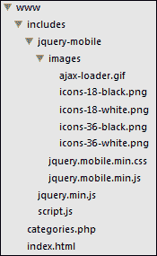

# 十、使用 jQuery Mobile

在本章中，我们将介绍以下主题：

*   创建基本移动网站模板
*   构建一个完整的静态网站
*   构建动态移动网站
*   实现快速呼叫功能
*   实现发送 SMS 功能
*   添加移动友好列表
*   使用面向触摸的事件
*   创建移动兼容表单
*   建立完整的注册和登录系统
*   构建完整的移动 web 应用程序

# 导言

jquerymobile 是一个精心构建的框架，使创建移动友好网站和应用程序变得更加容易。jQuery Mobile 整合了为移动体验量身定制的可移动 UI 元素，并提供了针对触摸屏设备上特殊事件的定制事件。

本章介绍了 jQuery Mobile 及其功能。在本章中，您将学习如何创建一个利用按钮和列表等常用元素的基本移动网站。然后，您将继续了解一些特定于移动设备的功能，如**触摸通话**。

在开始本章之前，请确保您已从 jQuery 网站（[下载了最新版本的 jQuery 移动框架 http://jquerymobile.com/download](http://jquerymobile.com/download) ）。创建一个名为`chapter10`的文件夹，保存本章的所有配方文件。在这个文件夹中，创建一个名为`jquery-mobile`的文件夹，并将主要的 jQuery Mobile JavaScript 和 CSS 文件放在其中，包括`images`文件夹，该文件夹将保存 CSS 中引用的所有图标精灵。

本章中使用的 jQuery Mobile 的版本是 1.3.2，但大多数配方都适用于较新的版本。

对于本章中的一些配方，您需要一个运行 PHP 和 MySQL 的 web 服务器。此 web 服务器可以是本地开发服务器，也可以是云中托管的服务器。您还需要访问 MySQL 管理界面，如 PHPMyAdmin，以便运行 SQL 脚本。

# 创建基本移动网站模板

这个配方将向您展示一个简单 jQuery 移动网页的基本布局。您还可以将此 HTML 页面用作未来 jQuery 移动项目的模板。

## 准备好了吗

在您之前创建的`chapter10`文件夹中，创建`recipe-1.html`。

## 怎么做…

在`recipe-1.html`中插入以下 HTML 代码，创建一个非常基本的 jQuery Mobile 单页网站：

```js
<!DOCTYPE html>
<html>
<head>
    <title>Chapter 10 :: jQuery Mobile Template</title>
    <meta name="viewport" content="width=device-width, initial-scale=1" />
    <link rel="stylesheet" href="jquery-mobile/jquery.mobile.min.css" />
    <script src="jquery.min.js"></script>
    <script src="jquery-mobile/jquery.mobile.min.js"></script>
</head>
<body>
<div data-role="page">
    <header data-role="header">
        <h1>Chapter 10 :: Recipe 1 :: jQuery Mobile Webpage Template</h1>
    </header>
    <div data-role="content">
        <p>This is where your page content will go.</p>
    </div>
    <footer data-role="footer">
        <h4>Look how easy it is to add a styled footer</h4>
    </footer>
</div>
</body>
</html>
```

确保更新对 jQuery 库和 CSS 的引用，以反映下载的文件。在 web 浏览器中打开`recipe-1.html`，您将看到使用 jQuery mobile 创建基本的移动友好网页的速度有多快。

## 它是如何工作的…

乍一看，模板页面与典型的 HTML 网页没有多大区别。HTML5 标准化文档类型用`<!DOCTYPE html>`声明，所需的 CSS 和 JavaScript 包含在文档头中。

不同之处在于视口的`meta`标记，它并不总是出现在典型的 HTML 页面中。这将告诉浏览器如何设置页面尺寸和缩放级别。如果没有设置，大多数移动设备将使用虚拟宽度，使网页看起来缩小。

### 注

`data-`属性是一个新的 HTML5 实现，允许自定义元素属性，同时仍然提供有效的标记。这些`data-*`属性允许您存储关于特定元素的任意信息，jQueryMobile 利用了这种能力。

使用 jQuery Mobile，您可以使用`data-role`属性来指示元素的用途。在本配方中创建的简单模板中，我们使用页面、页眉、内容和页脚角色来创建简单页面的结构。这些角色中的每一个都是不言自明的，但在本章中它们也将变得更加清晰。

## 还有更多…

与所有 jQuery 实现一样，有大量可用的文档（[http://jquerymobile.com](http://jquerymobile.com) ），所有开发人员都应该使用。要充分利用 jQuery Mobile，请确保阅读文档。

## 另见

*   *打造完整的静态网站*

# 构建完整的静态网站

这个方法将向您展示如何使用 jQuery Mobile 快速创建一个简单的静态网站。使用在上一个配方中创建的模板，只需添加具有正确角色的附加元素即可创建额外页面以及它们之间的导航。

## 准备好了吗

在前面创建的文件夹中创建`recipe-2.html`，并确保新创建的 jQuery 移动模板已准备就绪。

## 怎么做…

要使用 jQuery mobile 创建功能性移动网站，请执行以下步骤：

1.  将您之前创建的 jQuery 移动模板复制到`recipe-2.html`中，并删除`<body>`标记中的所有内容，如下面的代码片段所示：

    ```js
    <!DOCTYPE html>
    <html>
    <head>
        <title>Chapter 10 :: jQuery Mobile Template</title>
        <meta name="viewport" content="width=device-width, initial-scale=1" />
        <link rel="stylesheet" href="jquery-mobile/jquery.mobile.min.css" />
        <script src="jquery.min.js"></script>
        <script src="jquery-mobile/jquery.mobile.min.js"></script>
    </head>
    <body>

    </body>
    </html>
    ```

2.  在`<body>`标记之间插入以下代码，为简单静态网站创建主页：

    ```js
    <div data-role="page" id="home">
        <header data-role="header">
            <h1>Home Page</h1>
        </header>
        <div data-role="content">
            <p>This is the content for the home page. You can choose to go to another page using the buttons below.</p>
            <a href="#about" data-role="button" data-theme="a">About</a>
            <a href="#contact" data-role="button" data-theme="a">Contact</a>
        </div>
        <footer data-role="footer">
            <h4>Chapter 10 :: Recipe 2</h4>
        </footer>
    </div>
    ```

3.  要创建一个链接到主页的 about 页面，请在主页声明后添加以下代码，但仍在`<body>`标记内：

    ```js
    <div data-role="page" id="about" data-title="About Page">
        <header data-role="header">
            <h1><a href="#home" data-role="button" data-theme="b" data-icon="arrow-l" data-inline="true">Back</a> About Page</h1>
        </header>
        <div data-role="content">
            <p>This is the content for the about page.</p>
        </div>
        <footer data-role="footer">
            <h4>Chapter 10 :: Recipe 2</h4>
        </footer>
    </div>
    ```

4.  使用以下代码重复上一步以添加最终联系人页面：

    ```js
    <div data-role="page" id="about" data-title="About Page">
        <header data-role="header">
            <h1><a href="#home" data-role="button" data-theme="b" data-icon="arrow-l" data-inline="true">Back</a> About Page</h1>
        </header>
        <div data-role="content">
            <p>This is the content for the about page.</p>
        </div>
        <footer data-role="footer">
            <h4>Chapter 10 :: Recipe 2</h4>
        </footer>
    </div>
    ```

5.  在 web 浏览器中打开`recipe-2.html`，您将看到移动网站，您将能够使用主页上的按钮导航到“关于”和“联系人”页面并从中导航。

## 它是如何工作的…

在这个配方的代码中，您将看到多次使用的`data-role`属性来指示许多 HTML 元素的功能。要声明多个页面，只需重复使用模板中使用的基本页面结构，并根据需要更改内容。考虑下面的例子：

```js
<div data-role="page" id="about" data-title="About Page">
    <header data-role="header">

    </header>
    <div data-role="content">

    </div>
    <footer data-role="footer">

    </footer>
</div>
```

这是本配方中使用的关于页面的基本结构。主`div`元素用`data-role="page"`表示为页面。为了允许导航到此页面，一个唯一的 ID 被定义为`about`，与任何 HTML 元素（`id="about"`）的定义方式相同。页面分割上有一个额外的属性`data-title`，它可以覆盖文档头中`<title>`标记的内容，从而可以每页更改页面标题。

您可以使用锚元素创建指向以这种方式创建的其中一个页面的内部链接，如以下代码行所示：

```js
<a href="#about" data-role="button" data-theme="a">About</a>
```

当用户点击链接时，他们将看到具有唯一 ID`about`的页面，在`href`属性中指示为`#about`。默认页面转换也将用于提供平滑的导航效果。`data-role="button"`属性用于将元素设置为按钮样式，`data-theme="a"`属性指定用于设置样式的主题。阅读上述文档，了解默认情况下哪些主题可用，以及如何创建自己的主题。

## 另见

*   *创建手机基本网站模板*
*   *打造动态移动网站*

# 打造动态移动网站

在上一个菜谱中，我们创建了一个基本网站，允许您向用户提供内容并相对轻松地手动更新。在大多数情况下，这是不够的。如今，大多数网站依靠某种形式的数据库定期向其提供丰富的新内容，这与移动网站应该没有什么不同。这个方法将向您展示如何使用 PHP 和 jQuery Mobile 创建包含 web 服务器提供的内容的动态页面。

## 准备好了吗

您需要在 web 服务器的 web 根目录中创建以下目录结构。下图中，`www`为 web 根目录；这对您可能不同：



在您的 web 服务器的 web 根目录（`www`中），创建一个`includes`文件夹以及文件`index.html`和`categories.php`。在`includes`文件夹中，创建一个名为`jquery-mobile`的子文件夹，并确保所有 jQuery Mobile library 文件都已复制到其中。另外，在`includes`文件夹中，创建`script.js`并添加 jQuery 库（`jquery.min.js`。

## 怎么做…

要使用 PHP 创建动态移动网站，请仔细执行以下步骤：

1.  重新使用在第一个配方中作为模板一部分创建的结构，将以下代码添加到`index.html`。这将创建一个主页和一个 ID 为`categorypage`的额外空白页。

    ```js
    <!DOCTYPE html>
    <html>
    <head>
        <title>Chapter 10 :: Recipe 3</title>
        <meta name="viewport" content="width=device-width, initial-scale=1" />
        <link rel="stylesheet" href="includes/jquery-mobile/jquery.mobile.min.css" />
        <script src="includes/jquery.min.js"></script>
        <script src="includes/jquery-mobile/jquery.mobile.min.js"></script>
        <script src="includes/script.js"></script>
    </head>
    <body>
    <div id="home" data-role="page">
        <header data-role="header"><h1>Dynamic page creation demo</h1></header>
        <div data-role="content">
            <h2>Select a category:</h2>
            <a href="#categorypage?cat=colours" data-role="button">Colours</a>
            <a href="#categorypage?cat=shapes" data-role="button">Shapes</a>
            <a href="#categorypage?cat=sounds" data-role="button">Sounds</a>
        </div>
    </div>
    <div id="categorypage" data-role="page">
        <div data-role="header"><h1></h1></div>
        <div data-role="content"></div>
    </div>
    </body>
    </html>
    ```

2.  在`categories.php`中添加以下 PHP 代码，以便能够根据请求向 jQuery 移动站点提供内容：

    ```js
    <?php
    $categories = array(
        "colours" => array(
            "title" => "Colours",
            "description" => "Some of my favorite colours",
            "items" => array(
                "Black",
                "Green",
                "Red",
                "Blue",
                "Purple"
            )
        ),
        "shapes" => array(
            "title" => "Shapes",
            "description" => "Some shapes I really like",
            "items" => array(
                "Triangle",
                "Circle",
                "Square"
            )
        ),
        "sounds" => array(
            "title" => "Sounds",
            "description" => "Some crazy sounds",
            "items" => array(
                "Buzz",
                "Swish",
                "Boom!",
                "Tick"
            )
        )
    );
    if (isset($_POST['category'])) {
        $response = array(
            "success" => true,
            "data" => array()
        );
        $category = $_POST['category'];
        if (isset($categories[$category])) {
            $response["data"] = $categories[$category];
        } else {
            $response["success"] = false;
            $response["data"] = "Invalid category provided";
        }
        header("Content-Type: application/json; charset-UTF-8");
        echo json_encode($response);
    }
    ```

3.  要捕获用户对其中一个动态页面的请求，请在`script.js`中添加以下 jQuery 代码，该代码将侦听`pagebeforechange`事件。这允许我们在用户被发送到分类页面之前拦截。

    ```js
    $(document).bind("pagebeforechange", function(e, data) {
        if (typeof data.toPage === "string") {
            var urlObject = $.mobile.path.parseUrl(data.toPage);
            if (urlObject.hash.search(/^#categorypage/) !== -1 && urlObject.hash.search(/cat=*/) !== -1) {
                displayCategory(urlObject, data.options);
                //We are handling the change page event ourselves so prevent the default behaviour
                e.preventDefault();
            }
        }
    });
    ```

4.  为了能够生成动态页面，需要 PHP 脚本中的内容。在`script.js`的末尾添加以下 JavaScript 函数，以发出 AJAX 请求来收集此数据并生成动态页面的标记：

    ```js
    function displayCategory(urlObject, options) {
        var catName = urlObject.hash.replace(/.*cat=/, "");
        var pageId = urlObject.hash.replace( /\?.*$/, "");
        var _page = $(pageId);
        var _header = _page.children(":jqmData(role=header)");
        var _content = _page.children(":jqmData(role=content)");
        $.ajax({
            url: 'categories.php',
            type: 'POST',
            data: {
                category: catName
            },
            success: function(response) {
                if (response.success) {
                    var category = response.data;
                    //Add title to header
                    _header.find("h1").html(category.title);
                    //Create content HTML
                    var contentHtml = "<p>" + category.description + ":</p><ul>";
                    for (var i = 0; i < category.items.length; i++) {
                        var item = category.items[i];
                        contentHtml += "<li>" + item + "</li>";
                    }
                    contentHtml += "</ul>";
                    _content.html(contentHtml);
                    //Update the URL to reflect the page the user is actually on
                    _page.data("url", urlObject.href);
                    $.mobile.changePage(_page, options);
                } else {
                    alert(response.data);
                }
            }
        });
    }
    ```

5.  通过您的网络浏览器（例如，`http://localhost/`）访问您新创建的移动网站，您将看到主页，其中提供了三个不同类别的按钮。点击其中一个按钮，进入一个新页面，显示的内容来自您刚刚创建的 PHP 脚本。

## 它是如何工作的…

此配方中用于创建移动站点的 HTML 代码与以前的静态移动站点差别不大。唯一的区别是，只有一个附加页面没有标题或内容。这是因为附加页面将被重新用于动态创建多个页面，其标题和内容将根据用户请求进行设置。

`index.html`中的 HTML 代码创建了带有三个按钮的主页，分别标记为**颜色**、**形状**和**声音**。每个按钮都是指向同一个内部页面的链接，其中包含一些附加信息，如以下代码行所示：

```js
#categorypage?cat=colours
```

每个按钮为代表不同类别页面的`cat`变量提供不同的值。当用户单击其中一个页面时，jQuery Mobile 的默认行为是将用户导航到此内部页面。当我们动态创建这些内部页面时，我们需要截获这种行为，从 PHP 脚本收集请求的类别内容，然后生成页面。为此，我们将`pagebeforechange`事件绑定如下：

```js
$(document).bind("pagebeforechange", function(e, data) {
    if (typeof data.toPage === "string") {
        var urlObject = $.mobile.path.parseUrl(data.toPage);
        if (urlObject.hash.search(/^#categorypage/) !== -1 && urlObject.hash.search(/cat=*/) !== -1) {
            displayCategory(urlObject, data.options);
            //We are handling the change page event ourselves to prevent the default behaviour
            e.preventDefault();
        }
    }
});
```

由于我们只想拦截某些页面请求，因此在请求动态内容之前，我们会执行一些检查。我们可以从提供给事件处理函数的`data`对象中获取请求 URL。我们首先检查 URL 是否为字符串，如下所示：

```js
if (typeof data.toPage === "string") {
```

如果它是一个字符串，则将其解析为 URL 对象，如下所示：

```js
var urlObject = $.mobile.path.parseUrl(data.toPage);
```

创建 URL 对象后，可以执行两次最终检查，以查看请求的页面是否为类别页面之一，如下所示：

```js
if (urlObject.hash.search(/^#categorypage/) !== -1 && urlObject.hash.search(/cat=*/) !== -1) {
```

使用`search()`功能可以搜索字符串`#categorypage`来检查它是否是被请求的类别页面，然后再次检查是否也提供了`cat`变量。

如果这些检查通过，则调用`displayCategory()`函数来收集并呈现动态页面的内容。`e.preventDefault()`还用于阻止 jQuery Mobile 在使用动态内容生成请求页面之前将用户导航到请求页面。

在`displayCategory()`函数的顶部，有一系列变量声明如下：

```js
var catName = urlObject.hash.replace(/.*cat=/, "");
var pageId = urlObject.hash.replace( /\?.*$/, "");
var _page = $(pageId);
var _header = _page.children(":jqmData(role=header)");
var _content = _page.children(":jqmData(role=content)");
```

前两个从请求 URL、请求的类别和页面 ID 中获取值（即`#categorypage`。

然后使用页面 ID 使用典型的 jQuery 选择器从`index.html`中选择页面 DOM 元素。然后，使用`page`元素，可以找到并存储页面标题和内容的 DOM 元素，稍后我们可以使用标准 jQuery 对其进行操作。

然后使用 jQuery 的`$.ajax()`函数的 AJAX 请求向`categories.php`发出 POST 请求，指定`catName`的值，该值取自请求页面 URL。

这个`categories.php`PHP 脚本包含一个多维数组，用于存储三个不同类别的数据。此 PHP 脚本获取发布的类别，并使用`isset()`检查`$categories`数组中是否存在匹配的类别。如果存在，则更新`$response`数组的数据值，以包含请求类别的数据。如果请求的类别没有数据，`$response`数组的成功值设置为`false`，并提供错误消息。

最后，PHP 脚本在将`$response`数组编码为 JSON 并输出之前设置内容类型和字符集。

从`displayCategory()`函数发出的 AJAX 请求将接收此 JSON 数据并相应地进行处理。

通过检查`response.success`是否为真，可以确定是否有一些数据可用于显示请求的类别。如果有，可以将页面标题与为内容创建的 HTML 代码一起添加，如以下代码所示：

```js
var category = response.data;
//Add title to header
_header.find("h1").html(category.title);
//Create content HTML
var contentHtml = "<p>" + category.description + ":</p><ul>";
for (var i = 0; i < category.items.length; i++) {
var item = category.items[i];
contentHtml += "<li>" + item + "</li>";
}
contentHtml += "</ul>";
_content.html(contentHtml);
```

为了确保 URL 反映用户正在查看的页面，jQuery`data()`函数用于在`categorypage`元素上设置`url`属性，如下所示：

```js
_page.data("url", urlObject.href);
```

最后，调用`changePage()`函数将用户导航到新生成的页面，在那里他们将看到 PHP 脚本提供的请求内容。`changePage()`功能还将在浏览器历史记录中插入一个条目，以提供典型的浏览器导航行为。

## 还有更多…

此配方中的 PHP 脚本提供用于填充其他类别页面的内容，该脚本将此内容保存在 PHP 数组中。这只是出于演示目的，可以很容易地成为存储在 PHP 脚本可访问的数据库中的内容。

## 另见

*   *打造完整的静态网站*

# 实现快速呼叫功能

HTML5 允许开发者告诉浏览器启动一个应用程序来打电话，就像处理电子邮件一样。此配方将向您展示如何使用 jQuery 移动按钮执行此操作，这样当用户单击此按钮时，他们的默认呼叫应用程序将打开一个预填充的电话号码。

## 准备好了吗

在`chapter10`文件夹中，创建`recipe-4.html`用于此配方。

## 怎么做…

要使用户能够点击按钮拨打电话，而无需将号码复制并粘贴到呼叫应用程序中，请执行以下简单步骤：

1.  重新使用手机网站模板，在`recipe-4.html`中添加以下 HTML 代码：

    ```js
    <!DOCTYPE html>
    <html>
    <head>
        <title>Chapter 10 :: jQuery Mobile Template</title>
        <meta name="viewport" content="width=device-width, initial-scale=1" />
        <link rel="stylesheet" href="jquery-mobile/jquery.mobile.min.css" />
        <script src="jquery.min.js"></script>
        <script src="jquery-mobile/jquery.mobile.min.js"></script>
    </head>
    <body>
    <div data-role="page">
        <header data-role="header">
            <h1>Chapter 10 :: Recipe 4</h1>
        </header>
        <div data-role="content">

        </div>
        <footer data-role="footer">
            <h4>The HTML5 tel: attribute allows you to provide interaction to telephone numbers</h4>
        </footer>
    </div>
    </body>
    </html>
    ```

2.  在主页的`content`部分添加一个具有`tel:`属性的按钮，按下该按钮后将启动呼叫应用程序，如下所示：

    ```js
    <p>This is my simple mobile website, click the button below to call me!</p>
    <a href="tel: 01234 567891" data-role="button">Call Me!</a>
    ```

3.  在谷歌浏览器中打开`recipe-4.html`并按下**呼叫我！**按钮将向您显示警报，通知您网站正在请求打开外部应用程序。在移动浏览器上打开网页将打开设备的默认呼叫应用程序，允许您使用按钮元素上指定的号码拨打电话。

## 它是如何工作的…

多年来，`mailto:`属性一直允许网站打开用户的默认邮件客户端。以下代码行显示了一个示例：

```js
<a href="mailto:name@domain.com">E-Mail Me</a>
```

HTML5 允许一些以类似方式工作的附加属性来实现附加功能。`tel:`属性就是其中之一。支持此属性的浏览器将在用户单击链接时打开设备或计算机上安装的默认呼叫应用程序。请注意，要打开 Skype，一个流行的 VOIP 应用程序，您可能需要使用一个名为`callto:`的替代属性。

## 另见

*   *实现发送短信功能*

# 实现发送短信功能

之前的配方包括直接从移动网站拨打电话。方便用户发送短信也是一项有用的功能。此配方将向您展示如何添加一个按钮，单击该按钮将打开用户设备上的默认 SMS 客户端。

## 准备好了吗

在开始本章之前创建的`chapter10`文件夹中创建`recipe-5.html`。

## 怎么做…

允许用户通过您的移动网站快速向您发送短信息很容易。执行以下简单步骤以了解如何：

1.  再次，使用本章第一个配方中创建的 jQuery 移动模板，使用以下代码在`recipe-5.html`内创建一个简单的移动网站：

    ```js
    <!DOCTYPE html>
    <html>
    <head>
        <title>Chapter 10 :: Recipe 5</title>
        <meta name="viewport" content="width=device-width, initial-scale=1" />
        <link rel="stylesheet" href="jquery-mobile/jquery.mobile.min.css" />
        <script src="jquery.min.js"></script>
        <script src="jquery-mobile/jquery.mobile.min.js"></script>
    </head>
    <body>
    <div data-role="page">
        <header data-role="header">
            <h1>Chapter 10 :: Recipe 5</h1>
        </header>
        <div data-role="content">

        </div>
        <footer data-role="footer">
            <h4>Use the HTML5 sms: attribute to open the default SMS client on click</h4>
        </footer>
    </div>
    </body>
    </html>
    ```

2.  在`recipe-5.html`主页的`content`部分添加以下文本和锚元素：

    ```js
    <p>This is my simple mobile website, click the button below to send me an SMS message!</p>
    <a href="sms:01234 567891" data-role="button">SMS Me!</a>
    ```

3.  在移动设备上打开`recipe-5.html`并点击**短信我！**按钮。默认 SMS 客户端将打开，收件人字段已填充 HTML 中指定的号码。

## 它是如何工作的…

除了 HTML5 提供的新的`tel:`属性外，还提供了`sms:`属性。这将告诉兼容设备使用指定的电话号码打开默认 SMS 客户端。以下代码行显示了一个示例：

```js
<a href="sms:01234 567891" data-role="button">SMS Me!</a>
```

这个锚元素还具有`data-role`属性和按钮的值，因此 jQueryMobile 为一个简单的按钮添加了适当的样式。

## 还有更多…

除了电话号码之外，还可以指定一些文本自动添加到消息正文中；按如下所示更改锚元素以添加此功能：

```js
<a href="sms:01234 567891?body=This is some text in the body" data-role="button">SMS Me!</a>
```

## 另见

*   *实现快速呼叫功能*

# 添加手机友好列表

这本烹饪书中有各种各样的食谱，它们利用 HTML 列表以简单有效的方式呈现数据。jquerymobile 允许开发人员快速将手机和触摸友好列表添加到 jquerymobile 网站。这个配方为您提供了 jQuery Mobile 提供的更常见列表类型的多个示例。您可以在方便的时候复制并重新使用这些列表的代码。

## 准备好了吗

在前面创建的`chapter10`文件夹中，创建一个名为`recipe-6.html`的 HTML 文件。

## 怎么做…

要了解如何添加不同类型的移动友好列表，请执行以下步骤：

1.  通过将以下 HTML 添加到`recipe-6.html`：

    ```js
    <!DOCTYPE html>
    <html>
    <head>
        <title>Chapter 10 :: Recipe 6</title>
        <meta name="viewport" content="width=device-width, initial-scale=1" />
        <link rel="stylesheet" href="jquery-mobile/jquery.mobile.min.css" />
        <script src="jquery.min.js"></script>
        <script src="jquery-mobile/jquery.mobile.min.js"></script>
    </head>
    <body>
    <div data-role="page">
        <header data-role="header">
            <h1>Chapter 10 :: Recipe 6 :: Lists</h1>
        </header>
        <div data-role="content">

        </div>
    </div>
    </body>
    </html>
    ```

    创建一个基本的 jQuery 移动站点
2.  要创建最常见的列表类型 a 基本链表，请在`recipe-6.html`中的`content`分割元素中添加以下代码：

    ```js
    <p>This page contains a selection of list examples for you to reuse at your convenience.</p>
    <h2>Basic linked list</h2>
    <ul data-role="listview">
    <li><a href='#'>Linked Item 1</a></li>
    <li><a href='#'>Linked Item 2</a></li>
    <li><a href='#'>Linked Item 3</a></li>
    </ul>
    ```

3.  要创建嵌套列表，请在`content`division 元素中添加以下 HTML 结构。注意 HTML 中的注释，为了使此列表正常工作，您需要从 web 服务器提供`recipe-6.html`。原因在*如何做中给出。。。*此配方的一部分。

    ```js
    <h2>Nested list</h2>
    <p>Please note that the sub-list will not work if you have opened recipe-6.html directly in a web browser. For the sub-list navigation to work you must serve this HTML file from a web server. i.e. http://localhost/recipe-6.html.</p>
    <ul data-role="listview">
    <li><a href='#'>Top Level Item 1</a></li>
    <li><a href='#'>Top Level Item 2</a></li>
    <li><a href='#'>Top Level Item 3 - With Sub-Level</a>
    <ul data-role="listview">
    <li><a href='#'>Second Level Item 1</a></li>
    <li><a href='#'>Second Level Item 2</a></li>
    </ul>
    </li>
    </ul>
    ```

4.  当显示列表中的内容时，可能需要允许用户以多种方式与每个列表项交互。jquerymobile 允许开发人员轻松地在列表元素旁边添加带有图标的按钮，以增强其功能。使用`data-split-icon`属性将此功能添加到列表中，如下代码所示：

    ```js
    <h2>List items with buttons</h2>
    <ul data-role="listview" data-split-icon="delete">
    <li><a href='#'>Jane Doe</a><a href='#'></a></li>
    <li><a href='#'>John Doe</a><a href='#'></a></li>
    <li><a href='#'>James Mathews</a><a href='#'></a></li>
    </ul>
    ```

5.  很长的列表可能会使导航变得很麻烦。jquerymobile 允许开发人员向任何列表快速添加一个过滤器选项，这将允许用户查找他们需要的列表项。要添加具有此功能的列表，请使用以下代码：

    ```js
    <h2>List with filter</h2>
    <ul data-role="listview" data-filter="true">
    <li><a href='#'>Cat</a></li>
    <li><a href='#'>Dog</a></li>
    <li><a href='#'>Lizard</a></li>
    <li><a href='#'>Rabbit</a></li>
    </ul>
    ```

6.  Opening `recipe-6.html` within a web browser will present you with a range of list examples, as shown in the following screenshot, that you can use at your convenience in future projects:

    

## 它是如何工作的…

使用`data-role="listview"`属性和值，可以将基本 HTML 列表转换为移动友好的实现。jQuery Mobile 与按钮和其他元素一样，将自动添加样式。

如果您参考文件（[http://jquerymobile.com/demos/1.2.1/docs/lists/docs-lists.html](http://jquerymobile.com/demos/1.2.1/docs/lists/docs-lists.html) ），您将获得所有可用列表类型的完整列表以及详细示例。

本食谱中使用的大多数示例都很简单，不言自明。配方的嵌套列表部分具有一些可能不明显的附加功能。对于大多数移动设备，屏幕空间非常有限，尤其是在纵向模式下。因此，允许嵌套列表以其传统方式（即使用不同的缩进向右展开）进行操作是没有意义的，如以下列表所示：

*   顶级项目 1
*   顶级项目 2
*   顶层项目 3–带子级
    *   第二级项目 1
    *   第二级项目 2

为了节省空间并提供更好的用户体验，当您添加嵌套列表时，jQuery Mobile 将创建一个包含子列表项的附加页面。当用户选择一个本身包含列表的列表项时，它们将被带到另一个页面，在该页面上显示子级别项。

在编写此配方时，为次级项目创建的附加页面不起作用，除非该页面使用 HTTP 从 web 服务器提供。

此配方中一个更强大的示例是能够快速将过滤器添加到列表中。只需在 HTML 列表中添加`data-filter="true"`属性和值，jQuery Mobile 就会自动将过滤器输入添加到列表的顶部，从而允许用户过滤掉不需要的列表项。

# 使用触摸式事件

除了 jQuery 提供的典型事件，例如`click`和`hover`，jQuery Mobile 还为开发人员提供了以触摸为中心的事件。使用这些事件，您可以为移动应用程序添加额外的功能，以实现这些额外的用户交互。此配方提供了许多有用事件的示例，可让您在方便时重复使用这些事件。

## 准备好了吗

在 web 服务器的 web 根目录中，创建`recipe-7.html`和`recipe-7.js`。

## 怎么做…

要了解哪些以触摸为中心的事件可用以及如何使用它们，请执行以下步骤：

1.  通过在`recipe-7.html`中添加以下 HTML，创建一个空列表的基本移动网站。确保在需要时更新对包含库的引用。

    ```js
    <!DOCTYPE html>
    <html>
    <head>
        <title>Chapter 11 :: Recipe 1</title>
        <meta name="viewport" content="width=device-width, initial-scale=1" />
        <link rel="stylesheet" href="includes/jquery-mobile/jquery.mobile.min.css" />
        <script src="includes/jquery.min.js"></script>
        <script src="includes/jquery-mobile/jquery.mobile.min.js"></script>
        <script src="recipe-7.js"></script>
    </head>
    <body>
    <div data-role="page">
        <header data-role="header">
            <h1>Chapter 10 :: Recipe 7 :: jQuery Mobile Touch Events</h1>
        </header>
        <div data-role="content">
            <p>Perform various touch events and watch the output below.</p>
            <ul id="touch-event-response" data-role="listview"></ul>
        </div>
    </div>
    </body>
    </html>
    ```

2.  在`recipe-7.js`顶部添加以下功能，将在`recipe-7.html`中刚刚创建的列表中添加一个新的列表项：

    ```js
    function addEvent(msg) {
        var _list = $('#touch-event-response');
        _list.append("<li>" + msg + "</li>");
        _list.listview('refresh');
    }
    ```

3.  要在用户执行点击时添加新的列表项，请将以下 JavaScript 代码添加到`recipe-7.js`：

    ```js
    $(function(){
        $(document).bind('tap', function(){
            addEvent("Tap");
        });
    });
    ```

4.  要侦听`taphold`事件并添加新的列表项，请在`$(function(){})`块中的前一条`.bind()`语句下直接添加以下代码：

    ```js
    $(document).bind('taphold', function(){
    addEvent("Tap & Hold");
    });
    ```

5.  监听`swipe`事件也可以这样做。追加以下`.bind()`定义：

    ```js
    $(document).bind('swipe', function(){
    addEvent("Swipe");
    });
    ```

6.  要在用户向左滑动时清除列表，请附加以下 JavaScript 代码：

    ```js
    $(document).bind('swipeleft', function(){
    $('#touch-event-response').empty();
    });
    ```

7.  最后，为了检测用户何时改变设备的方向，在`swipeleft`绑定定义后添加以下代码：

    ```js
    $(window).bind('orientationchange', function(event){
    addEvent("Orientation changed to: " + event.orientation);
    });
    ```

8.  使用与移动和触摸兼容的设备，打开`recipe-7.html`并执行一系列触摸事件，以查看添加到列表中的相应响应。向左滑动时，列表应为空，更改设备方向时，将添加一个新列表项，指示新方向（纵向或横向）。

## 它是如何工作的…

通过使用以下代码，可以监听 jQuery Mobile 提供的各种事件：

```js
$(document).bind('[EVENT]', function() {
});
```

要查看可用事件的完整列表，请阅读文档（[http://jquerymobile.com/demos/1.2.1/docs/api/events.html](http://jquerymobile.com/demos/1.2.1/docs/api/events.html) ）在 jQuery 移动网站上发布，该网站提供了一个包含示例的综合列表。

在此配方中，`addEvent()`函数获取一个字符串，该字符串将附加到`recipe-7.html`中简单移动网站中创建的列表元素中。使用 JavaScript 操作 jQuery 移动列表时，必须调用`refresh`方法以确保样式重新应用于新添加的元素。这在以下代码中显示：

```js
var _list = $('#touch-event-response');
_list.append("<li>" + msg + "</li>");
_list.listview('refresh');
```

了解用户何时更改设备的方向对于重新排列页面上的元素以改善用户体验非常有用。使用 jquerymobile，这很容易做到。只需绑定到`orientationchange`事件并准备好`event`对象的`orientation`属性即可确定新的方向，如下代码所示：

```js
$(window).bind('orientationchange', function(event){
addEvent("Orientation changed to: " + event.orientation);
});
```

请注意，与此配方中的其他事件不同，这已绑定到`window`而不是`document`，因为`document`不知道浏览器或设备的方向。

## 另见

*   [第 2 章](02.html "Chapter 2. Interacting with the User by Making Use of jQuery Events")*利用 jQuery 事件*与用户交互

# 创建移动兼容表单

jQuery Mobile 提供了一系列表单组件，这些组件类似于 jQuery UI 产品，但针对移动设备进行了优化。此配方提供了更常用表单元素的示例，以便您可以在方便的时候重新使用它们。

## 准备好了吗

在您之前创建的`chapter10`文件夹中，创建`recipe-8.html`。

## 怎么做…

要了解 jQuery Mobile 提供了哪些表单元素以及如何使用它们，请执行以下每个步骤：

1.  创建一个简单的 jQuery 移动网站来保存所有示例。将以下 HTML 代码添加到`recipe-8.html`：

    ```js
    <!DOCTYPE html>
    <html>
    <head>
        <title>Chapter 10 :: Recipe 8</title>
        <meta name="viewport" content="width=device-width, initial-scale=1" />
        <link rel="stylesheet" href="jquery-mobile/jquery.mobile.min.css" />
        <script src="jquery.min.js"></script>
        <script src="jquery-mobile/jquery.mobile.min.js"></script>
    </head>
    <body>
    <div data-role="page" id="home">
        <header data-role="header" data-theme="b">
            <h1>Chapter 10 :: Recipe 8</h1>
        </header>
        <div data-role="content">
        </div>
    </div>
    </body>
    </html>
    ```

2.  在刚才添加的`content`分割元素中添加以下代码，以创建一系列文本输入元素：

    ```js
    <h1>Text Input</h1>
    <div data-role="fieldcontain">
    <label for="textInput">Text input:</label>
    <input type="text" name="textInput" id="textInput" />
    </div>
    <div data-role="fieldcontain">
    <label for="textArea">Text area:</label>
    <textarea id="textArea" name="textArea"></textarea>
    </div>
    <div data-role="fieldcontain">
    <label for="textSearch">Text search:</label>
    <input type="text" name="textSearch" id="textSearch" data-type="search">
    </div>
    ```

3.  要创建两种不同的选择菜单，请在文本输入下添加以下代码：

    ```js
    <h1>Select Menu</h1>
    <div data-role="fieldcontain">
    <label for="simpleSelect">Simple select:</label>
    <select id="simpleSelect">
    <option value="1">Option 1</option>
    <option value="2">Option 2</option>
           <option value="3">Option 3</option>
    </select>
    </div>
    <div data-role="fieldcontain">
    <label for="customSelect">Custom select:</label>
    <select id="customSelect" data-native-menu="false">
    <option value="1">Option 1</option>
    <option value="2">Option 2</option>
          <option value="3">Option 3</option>
    </select>
    </div>
    ```

4.  要创建复选框和单选按钮，请使用以下代码：

    ```js
    <h1>Selection</h1>
    <h2>Checkboxes</h2>
    <fieldset data-role="controlgroup">
    <input type="checkbox" name="checkbox-1" id="checkbox-1">
    <label for="checkbox-1">Option 1</label>
    <input type="checkbox" name="checkbox-2" id="checkbox-2">
    <label for="checkbox-2">Option 2</label>
    <input type="checkbox" name="checkbox-3" id="checkbox-3">
    <label for="checkbox-3">Option 3</label>
    </fieldset>
    <h2>Radio buttons</h2>
    <fieldset data-role="controlgroup">
    <input type="radio" name="radio-1" id="radio-1">
    <label for="radio-1">Option 1</label>
    <input type="radio" name="radio-1" id="radio-2">
    <label for="radio-2">Option 2</label>
    <input type="radio" name="radio-1" id="radio-3">
    <label for="radio-3">Option 3</label>
    </fieldset>
    <h2>Inline selection</h2>
    <fieldset data-role="controlgroup" data-type="horizontal">
    <input type="checkbox" name="checkbox-1" id="checkbox-4">
    <label for="checkbox-4">Option 1</label>
    <input type="checkbox" name="checkbox-2" id="checkbox-5">
    <label for="checkbox-5">Option 2</label>
    <input type="checkbox" name="checkbox-3" id="checkbox-6">
    <label for="checkbox-6">Option 3</label>
    </fieldset>
    <fieldset data-role="controlgroup" data-type="horizontal">
    <input type="radio" name="radio-2" id="radio-4">
    <label for="radio-4">Option 1</label>
    <input type="radio" name="radio-2" id="radio-5">
    <label for="radio-5">Option 2</label>
    <input type="radio" name="radio-2" id="radio-6">
    <label for="radio-6">Option 3</label>
    </fieldset>
    ```

5.  最后，要创建一些附加元素（开关和滑块），请添加以下代码：

    ```js
    <h1>Additional</h1>
    <div data-role="fieldcontain">
    <label for="switch">Switch:</label>
    <select id="switch" data-role="slider">
    <option value="1">On</option>
          <option value="0">Off</option>
    </select>
    </div>
    <div data-role="fieldcontain">
    <label for="slider">Slider:</label>
    <input type="number" data-type="range" name="slider" id="slider" value="50" min="0" max="100" data-highlight="true">
    </div>
    ```

6.  Opening `recipe-8.html` in a web browser will present you with a range of different form elements. You can then easily select and re-use the code for any of the element types, as shown in the following screenshot:

    

## 它是如何工作的…

本配方中使用的每种类型的 jQuery 移动元素将在以下部分中详细说明。

### 文本输入

jQuery Mobile 提供不同的文本输入元素。典型的文本输入和文本区域元素很容易创建，只需在具有`fieldcontain`类的`div`元素中添加标签和`input`或`textarea`元素，如下代码所示：

```js
<div data-role="fieldcontain">
<label for="textInput">Text input:</label>
<input type="text" name="textInput" id="textInput" />
</div>
```

要创建搜索输入，只需将`data-type="search"`添加到`input`元素。这将在`input`元素中添加一个搜索图标，并在用户输入某些文本后提供一个清除按钮。

### 选择菜单

本配方中作为示例提供的两个选择菜单从表面上看是相同的。当您选择第一个简单的示例时，系统会为您提供一个下拉菜单，该下拉菜单看起来像普通非移动优化网站上的典型选择菜单。

第二个示例添加了额外的`data-native-menu="false"`属性，单击后提供了不同的选择菜单。此附加菜单使使用触摸界面进行选择更加容易。以下屏幕截图提供了两种选择菜单的比较：


### 复选框和单选按钮

使用带有`data-role="controlgroup"`属性的`fieldset`元素，创建复选框和单选按钮非常容易，如下代码片段所示：

```js
<fieldset data-role="controlgroup">
<input type="checkbox" name="checkbox-1" id="checkbox-1">
<label for="checkbox-1">Option 1</label>
<input type="checkbox" name="checkbox-2" id="checkbox-2">
<label for="checkbox-2">Option 2</label>
<input type="checkbox" name="checkbox-3" id="checkbox-3">
<label for="checkbox-3">Option 3</label>
</fieldset>
```

要创建一组单选按钮，您可以重复使用前面的代码，将`type`属性更改为`radio`，并确保它们在`name`属性中具有相同的值。

除了这些接口元素外，jQuery Mobile 还可以提供一个内联等价物。只需将`data-type="horizontal"`属性添加到`fieldset`元素，即可获得复选框或单选按钮的内联版本。

### 附加

作为该配方的一部分提供的最后两个元素是开关和滑块。`switch`元素本质上是一个只有两个选项的选择菜单，但以更友好的方式呈现。`slider`元素是通过将`data-type="range"`属性添加到数字输入中创建的（如下代码所示），用户可以轻松地在表单上输入和更改数值：

```js
<div data-role="fieldcontain">
<label for="slider">Slider:</label>
<input type="number" data-type="range" name="slider" id="slider" value="50" min="0" max="100" data-highlight="true">
</div>
```

## 还有更多…

作为本配方一部分提供的所有示例均以默认大小显示。jquerymobile 为其所有表单元素提供了一个额外的较小的大小，用于默认值有点太大的情况。

要使用最小等效项，请将属性`data-mini="true"`添加到需要较小大小的元素。

# 建立完整的注册登录系统

这个方法向您展示了如何使用 jQuery Mobile 和 PHP 以及 MySQL 数据库从头开始创建一个简单的注册和登录系统。此配方将构成本章下一个配方中完整 web 应用程序的基础。

## 准备好了吗

您应该已经有了一个 PHP 和 MySQL 服务器，可以用来完成这个食谱。在 web 服务器的 web 根目录中，创建`index2.html`和`script2.js`，这将保存应用程序的主要功能。

## 怎么做…

要创建一个完整的注册和登录系统，请确保您仔细遵循以下说明：

1.  将以下 HTML 代码添加到`index2.html`以创建简单的 jQuery 移动网站和主页：

    ```js
    <!DOCTYPE html>
    <html>
    <head>
        <title>Chapter 10 :: Register & Login</title>
        <meta name="viewport" content="width=device-width, initial-scale=1" />
        <link rel="stylesheet" href="includes/jquery-mobile/jquery.mobile.min.css" />
        <script src="includes/jquery.min.js"></script>
        <script src="includes/jquery-mobile/jquery.mobile.min.js"></script>
        <script src="script2.js"></script>
        <link rel="stylesheet" href="styles.css" />
    </head>
    <body>
    <div data-role="page" id="home">
        <header data-role="header" data-theme="b">
            <h1><a href="#home" data-role="button" data-icon="home" data-iconpos="notext" data-inline="true"></a> Home Page</h1>
        </header>
        <div data-role="content">
            <p>Welcome to my community.</p>
            <a data-role="button" href="#login">Login</a>
            <a data-role="button" data-theme="a" href="#register">Register</a>
        </div>
    </div>
    </body>
    </html>
    ```

2.  使用以下 HTML 将登录页面添加到`index2.html`：

    ```js
    <div data-role="page" id="login" data-title="Login">
        <header data-role="header" data-theme="b">
            <h1><a href="#home" data-role="button" data-icon="home" data-iconpos="notext" data-inline="true"></a> Login</h1>
        </header>
        <div data-role="content">
            <div data-role="fieldcontain">
                <label for="login-username">Username:</label>
                <input type="text" name="username" id="login-username" value="" />
            </div>
            <div data-role="fieldcontain">
                <label for="login-password">Password:</label>
                <input type="password" name="password" id="login-password" value="" />
            </div>
            <button data-role="button" id="login-account" data-theme="a">Login</button>
            <p>Don't have an account? <a href='#register'>Register</a>.</p>
        </div>
    </div>
    ```

3.  还可以使用以下 HTML 代码创建注册页面，确保页面代码添加到`index2.html`

    ```js
    <div data-role="page" id="register" data-title="Register">
        <header data-role="header" data-theme="b">
            <h1><a href="#home" data-role="button" data-icon="home" data-iconpos="notext" data-inline="true"></a> Register</h1>
        </header>
        <div data-role="content">
            <div data-role="fieldcontain">
                <label for="register-username">Username:</label>
                <input type="text" name="username" id="register-username" value="" />
            </div>
            <div data-role="fieldcontain">
                <label for="register-password">Password:</label>
                <input type="password" name="password" id="register-password" value="" />
            </div>
            <div data-role="fieldcontain">
                <label for="register-passwordagain">Password Again:</label>
                <input type="password" name="register-passwordagain" id="register-passwordagain" value="" />
            </div>
            <button data-role="button" id="register-account" data-theme="a">Register</button>
            <p>Already have an account? <a href='#login'>Login</a>.</p>
        </div>
    </div>
    ```

    中 HTML 文档的`body`部分中
4.  添加的最后一页是会员页。使用以下 HTML 代码创建此文件：

    ```js
    <div data-role="page" id="member">
        <header data-role="header" data-theme="b">
            <h1><a href="#home" data-role="button" data-icon="home" data-iconpos="notext" data-inline="true"></a> Member's Page</h1>
        </header>
        <div data-role="content">
            <p>You're logged in.</p>
            <button data-role="button" data-theme="a" id="logout">Logout</button>
        </div>
    </div>
    ```

5.  使用下面的 SQL 代码，在 MySQL 数据库中创建一个名为`chapter10`的数据库和一个名为`user`的表：

    ```js
    SET SQL_MODE="NO_AUTO_VALUE_ON_ZERO";
    SET time_zone = "+00:00";

    --
    -- Database: `chapter10`
    --
    CREATE DATABASE `chapter10` DEFAULT CHARACTER SET latin1 COLLATE latin1_swedish_ci;
    USE `chapter10`;

    -- --------------------------------------------------------

    --
    -- Table structure for table `user`
    --

    CREATE TABLE IF NOT EXISTS `user` (
      `id` bigint(20) unsigned NOT NULL AUTO_INCREMENT,
      `username` varchar(128) DEFAULT NULL,
      `password` varchar(512) DEFAULT NULL,
      UNIQUE KEY `id` (`id`),
      UNIQUE KEY `username` (`username`)
    ) ENGINE=InnoDB  DEFAULT CHARSET=latin1 AUTO_INCREMENT=8;
    ```

6.  在 web 服务器的 web 根目录中创建`connect.db.php`并添加以下 PHP 代码以连接到`chapter10`数据库。如果需要，更新数据库用户名和密码。

    ```js
    <?php
    $mysqli = new mysqli("localhost", "root", "", "chapter10");
    if ($mysqli->connect_errno) {
        die("Failed to connect to MySQL: (" . $mysqli->connect_errno . ") " . $mysqli->connect_error);
    }
    $pwsalt = "TH1SISF0RCHAPTER10";
    ```

7.  为了能够向`user`表中添加新用户，请在 web 服务器的 web 根目录中创建`register.php`，并添加以下 PHP 代码：

    ```js
    <?php
    require_once("connect.db.php");
    $username = isset($_POST['username']) ? strtolower($_POST['username']) : "";
    $password = isset($_POST['password']) ? $_POST['password'] : "";
    $passwordAgain = isset($_POST['passwordagain']) ? $_POST['passwordagain'] : "";

    $response = array(
        "success" => false,
        "errors" => array()
    );

    if (strlen($username) < 3 || strlen($username) > 32) {
        $response["errors"]["username"] = "Username must be between 3 and 64 characters in length";
    } else {
        $query = "SELECT `id` FROM `user` WHERE `username` = ? LIMIT 1";
        $stmt = $mysqli->stmt_init();
        if ($stmt->prepare($query)) {
            $stmt->bind_param("s", $username);
            if ($stmt->execute()) {
                $stmt->store_result();
                if ($stmt->num_rows > 0) {
                    $response["errors"]["username"] = "Username has already been taken";
                }
            } else {
                $response["errors"]["username"] = "Could not execute query";
            }
        } else {
            $response["errors"]["username"] = "Could query database for existing usernames";
        }
        $stmt->close();
    }

    if (strlen($password) < 6 || strlen($password) > 32) {
        $response["errors"]["password"] = "Password must be between 6 and 32 characters in length";
    }
    if ($password != $passwordAgain) {
        $response["errors"]["passwordagain"] = "Passwords must match";
    }

    if (empty($response["errors"])) {
        $query = "INSERT INTO `user` (`username`, `password`) VALUES (?, ?)";
        $stmt = $mysqli->stmt_init();
        if ($stmt->prepare($query)) {
            $password = crypt($password, $pwsalt);
            $stmt->bind_param("ss", $username, $password);
            if ($stmt->execute()) {
                $stmt->close();
                $response["success"] = true;
            } else {
                $response["errors"]["username"] = "Could not execute query";
            }
        } else {
            $response["errors"]["username"] = "Could not insert new user, please try again";
        }
    }
    $mysqli->close();
    header("Content-Type: application/json; charset=UTF-8");
    echo json_encode($response);
    ```

8.  要允许用户使用其新创建的帐户登录，请在 web 服务器的 web 根目录中创建`login.php`，并添加以下 PHP 代码：

    ```js
    <?php
    session_start();
    require_once("connect.db.php");
    $username = isset($_POST['username']) ? strtolower($_POST['username']) : "";
    $password = isset($_POST['password']) ? $_POST['password'] : "";

    $response = array(
        "success" => false,
        "error" => "",
        "user" => array()
    );

    $query = "SELECT `id` FROM `user` WHERE `username` = ? AND `password` = ? LIMIT 1";
    $stmt = $mysqli->stmt_init();
    if ($stmt->prepare($query)) {
        $password = crypt($password, $pwsalt);
        $stmt->bind_param("ss", $username, $password);
        if ($stmt->execute()) {
            $res = $stmt->get_result();
            if ($res->num_rows > 0) {
                $row = $res->fetch_assoc();
                $response["success"] = true;
                $_SESSION['uid'] = $response["user"]["id"] = $row["id"];
                $_SESSION['username'] = $response["user"]["username"] = $username;
            } else {
                $response["error"] = "Incorrect username or password";
            }
        } else {
            $response["error"] = "Could not execute query";
        }
    } else {
        $response["error"] = "Could not query database";
    }
    $stmt->close();
    $mysqli->close();
    header("Content-Type: application/json; charset=UTF-8");
    echo json_encode($response);
    ```

9.  对于注销功能，在与`login.php`相同的目录中创建`logout.php`，并添加以下代码：

    ```js
    <?php
    session_start();
    $response = array(
        "success" => false,
        "error" => ""
    );
    if (isset($_SESSION["uid"]) && isset($_SESSION["username"])) {
        $_SESSION = array();
        session_destroy();
     $response["success"] = true;
    } else {
        $response["success"] = false;
        $response["error"] = "Not logged in";
    }
    header("Content-Type: application/json; charset=UTF-8");
    echo json_encode($response);
    ```

10.  为了允许用户能够提交其注册信息，请在 jQuery 加载块`($(function(){});`中的`script2.js`中添加以下 JavaScript 代码：

    ```js
    $('#register-account').click(function(){
            $('.input-error').remove();
            var data = {
                username: $('#register-username').val(),
                password: $('#register-password').val(),
                passwordagain: $('#register-passwordagain').val()
            };
            $.ajax({
                type: 'POST',
                url: 'register.php',
                data: data,
                beforeSend: function() {
                    $.mobile.loading('show');
                },
                success: function(data) {
                    $.mobile.loading('hide');
                    if (data.success) {
                        $.mobile.showPageLoadingMsg("b", "Registration successful! You may now login.", true);
                    } else {
                        $.each(data.errors, function(key, value){
                            $('#register-' + key).parent().after("<div class='input-error'>" + value + "</div>");
                        });
                    }
                }
            });
        });
    ```

11.  若要在用户试图从登录页面登录时做出反应，请在刚刚添加的注册代码下向`script2.js`添加以下 JavaScript 代码：

    ```js
    $('#login-account').click(function(){
            var data = {
                username: $('#login-username').val(),
                password: $('#login-password').val()
            };
            $.ajax({
                type: 'POST',
                url: 'login.php',
                data: data,
                beforeSend: function() {
                    $.mobile.loading('show');
                },
                success: function(data) {
                    $.mobile.loading('hide');
                    if (data.success) {
                        $.mobile.showPageLoadingMsg("b", "Login Successful", true);
                        localStorage.setItem("user", JSON.stringify(data.user));
                        $.mobile.changePage("#member");
                    } else {
                        $.mobile.showPageLoadingMsg("b", data.error, true);
                    }
                }
            });
        });
    ```

12.  要允许用户点击注销按钮并注销，请在`script2.js`中添加以下代码：

    ```js
     $('#logout').click(function(){
            $.ajax({
                type: 'POST',
                url: 'logout.php',
                beforeSend: function() {
                    $.mobile.loading('show');
                },
                success: function(data) {
                    $.mobile.loading('hide');
                    if (data.success) {
                        localStorage.removeItem("user");
                        $.mobile.changePage("#home");
                    } else {
                        $.mobile.showPageLoadingMsg("b", data.error, true);
                    }
                }
            });
        });
    ```

13.  为防止访问成员页面，请添加以下代码，以检查用户在尝试导航到此页面时是否登录：

    ```js
    $(document).bind("pagebeforechange", function(e, data) {
            if (typeof data.toPage === "string") {
                var urlObject = $.mobile.path.parseUrl(data.toPage);
                if (urlObject.hash.search(/^#member/) !== -1) {
                    if (getUser() === false) {
                        e.preventDefault();
                        $.mobile.showPageLoadingMsg("b", "You must be logged in to access this page", true);
                        setTimeout(function(){
                            $.mobile.hidePageLoadingMsg();
                            $.mobile.changePage("#home");
                        }, 1500);
                    }
                }
            }
        });
    ```

14.  上述代码使用`getUser()`功能确定用户是否已登录。在`script2.js`的末尾添加以下功能，确保添加到`$(function(){});`块之外：

    ```js
    function getUser() {
        var user = localStorage.getItem("user");
        if (user == null) {
            return false;
        } else {
            return JSON.parse(user);
        }
    }
    ```

15.  要向 web 服务器的 web 根目录中的错误消息添加一些基本样式，请创建一个名为`styles.css`的文件，并添加以下 CSS 代码：

    ```js
    .input-error {
        position: absolute;
        font-size: 10px;
        color: #ff0800;
    }
    ```

16.  访问为`index2.html`提供服务的 web 服务器将允许您注册帐户。如果您试图在未登录的情况下访问“成员”页面，您将收到一条消息，说明您必须登录，然后将被发送回主页。

## 它是如何工作的…

本配方中创建的每一段代码将在以下各节中详细说明。

### HTML

`index2.html`中的 HTML 创建了一个简单的 jQuery 移动网站，包含以下四个页面：

*   主页
*   注册页面
*   登录页面
*   成员页面

主页提供登录页面和注册页面的链接，每个页面分别相互链接。成员页面有一个注销按钮，允许用户在访问成员页面后注销。HTML 代码很简单，每个元素都在本章前面的配方中进行了详细解释。

### SQL

此配方中提供的 SQL 代码可用于创建所需的`chapter10`数据库和`user`表，该表存储用户帐户。

### PHP

此配方中创建了四个 PHP 文件。第一个是`connect.db.php`，它与 MySQL 数据库建立连接，并包含在其他三个 PHP 文件中。PHP`mysqli`类用于连接和查询本配方中整个 PHP 文件中的 MySQL 数据库。您可以在 PHP.net（[上找到关于这个类的更多信息 http://www.php.net/mysqli](http://www.php.net/mysqli) ）。

`register.php`文件通过 POST 请求获取一组值。这些数值如下：

*   `Username`
*   `Password`
*   `Password again`

PHP 脚本对所有三个输入执行基本验证，以确保指定的用户名长度在 3 到 32 个字符之间，并且提供的密码长度至少为 6 个字符。它还确保两个密码匹配并查询数据库，以确保请求的用户名尚未被使用。

如果它通过了所有验证，则会将一个新用户插入到数据库中，这将允许该用户使用指定的详细信息登录。需要注意的是，密码是使用 PHP`crypt()`函数和默认设置进行加密的。这是一种简单的加密方法，应该在生产环境中使用更强大的加密技术。

`login.php`脚本通过 POST 请求获取用户名和密码，并查询用户表，查看是否有匹配的用户凭据；如果是这样，将为该用户创建一个 PHP 会话，并将一个用户对象返回给客户端。

如果 PHP 会话存在，`logout.php`脚本将简单地销毁该会话，并注销用户。

这些 PHP 脚本中的每一个都以标准格式返回数据，该格式在本烹饪书中多次使用。在每个脚本的顶部，将创建一个数组，如以下代码所示：

```js
$response = array(
    "success" => false,
    "errors" => array()
);
```

如果脚本成功且无需输出错误，则将成功值更改为`true`，并将`errors`数组留空。对于`register.php`脚本，当其中一个输入验证失败时，将返回一个关联数组，其中的键与输入匹配。以下是一个例子：

```js
$response["errors"]["username"] = "Username has already been taken";
```

这是为了让客户端上的 JavaScript 知道将错误消息放在哪个输入下，从而让用户更容易理解他们需要做哪些更改。

输出响应数组时，将其转换为 JSON 对象，并使用 PHP`header()`函数适当设置内容类型和字符集，如下代码所示：

```js
header("Content-Type: application/json; charset=UTF-8");
echo json_encode($response);
```

### JavaScript

这个配方中使用的 JavaScript 很简单，没有什么新东西。为注册、登录和注销按钮创建了三个`click`事件处理程序。提供给每个事件处理程序的回调函数从关联表单收集数据，并使用 jQuery`$.ajax()`函数分别向`register.php`、`login.php`或`logout.php`脚本发出 POST 请求。在[第 3 章](03.html "Chapter 3. Loading and Manipulating Dynamic Content with AJAX and JSON")、*使用 AJAX 和 JSON*加载和操作动态内容中，已经详细介绍了使用 jQuery 的 AJAX。

对于每个 AJAX 请求，`beforeSend()`函数用于打开并向用户显示微调器图像，表示正在发出请求。AJAX 请求成功后，此微调器映像将被删除。这在以下代码中显示：

```js
$.ajax({
type: 'POST',
url: 'register.php',
data: data,
beforeSend: function() {
$.mobile.loading('show');
},
success: function(data) {
       $.mobile.loading('hide');
// -- HIDDEN CODE
}
});
```

此外，如以下代码所示，在针对每个 AJAX 请求的`success()`函数中，`$.mobile.showPageLoadingMsg()`函数用于出于各种原因向用户显示消息，无论是关于错误还是关于成功注册的信息：

```js
$.mobile.showPageLoadingMsg("b", "Registration successful! You may now login.", true);
```

函数的第一个参数是主题，第二个参数是要显示的消息，将第三个参数设置为`true`将删除微调器图像，只显示简单的文本消息。

如前所述，`login.php`脚本返回一个表示新登录用户的对象。由于客户端 JavaScript 对 PHP 会话没有感觉，因此需要将此用户对象存储在本地，以便客户端知道登录的用户。为此，使用本地存储，如以下代码行所示：

```js
localStorage.setItem("user", JSON.stringify(data.user));
```

本地存储只允许您存储字符串，但我们需要存储整个对象。为了解决这个问题，我们将对象转换为 JSON 字符串，然后在从本地存储检索时可以再次将其转换为对象。前面的示例使用`JSON.stringify()`函数将用户对象转换为字符串，并以`user`名称存储在本地存储器中。

然后使用`getUser()`函数检索字符串值并将其转换为对象，如果当前没有登录用户，则返回`false`：

```js
function getUser() {
    var user = localStorage.getItem("user");
    if (user == null) {
        return false;
    } else {
        return JSON.parse(user);
    }
}
```

当对破坏服务器会话的`logout.php`脚本的 AJAX 调用成功时，`localStorage.removeItem("user")`还用于删除客户端上的用户对象。

此配方中 JavaScript 的最后一个元素是限制对成员页面的访问。请注意，任何具有正确知识的用户都可以绕过使用客户端代码强制执行的任何限制。这种类型的客户端限制仅用于增强用户体验，服务器端总是要求阻止访问用户不能执行的任何操作。

在*构建动态移动网站*配方中，使用 jQuery mobile`pagebeforechange`事件检测试图访问某个页面的用户。当用户试图访问“成员”页面时，此配方中使用了相同的功能。然后使用`getUser()`功能确定用户是否登录。如果他们未登录，则会阻止他们导航到“成员”页面，并在被告知必须登录才能访问“成员”页面后发送回主页。

## 还有更多…

目前，要提交网站上的任何表格，用户需要单击或按下相关按钮。为了改进这一点，如果用户可以在表单中的任何输入中按下*回车*键或移动等效 go 按钮，这将是有益的。

## 另见

*   *打造动态移动网站*

# 打造完整的移动网络应用

本食谱向您展示了如何创建一个简单但完整的 web 应用程序，允许注册用户编写可在所有设备上访问的笔记。notes 应用程序在以前的登录和注册方法的基础上进行扩展，以允许登录用户创建和管理备注或待办事项列表。

## 准备好了吗

开始此配方之前，请确保您已完成上一个配方，*建立完整的注册和登录系统*。您仍然需要一个运行 PHP 和 MySQL 的 web 服务器来完成这个配方。

## 怎么做…

要创建可在所有移动和桌面设备上访问的完整移动 web 应用程序，请执行以下步骤：

1.  要存储用户创建的注释，需要另一个数据库表。使用以下 SQL 代码在名为`note`的`chapter10`数据库中创建一个表：

    ```js
    CREATE TABLE IF NOT EXISTS `note` (
      `id` bigint(20) unsigned NOT NULL AUTO_INCREMENT,
      `user_id` bigint(20) unsigned NOT NULL,
      `text` varchar(2048) DEFAULT NULL,
      `added` datetime DEFAULT NULL,
      UNIQUE KEY `id` (`id`),
      KEY `user_id` (`user_id`)
    ) ENGINE=InnoDB  DEFAULT CHARSET=latin1;

    ALTER TABLE `note`
      ADD CONSTRAINT `note_ibfk_1` FOREIGN KEY (`user_id`) REFERENCES `user` (`id`) ON DELETE CASCADE ON UPDATE CASCADE;
    ```

2.  虽然在`index2.html`中定义的大多数页面保持不变，但我们需要更新成员页面，使其具有一个按钮，将用户带到其当前笔记。在`index2.html`中使用以下 HTML 更新成员页面：

    ```js
    <div data-role="page" id="member">
        <div data-role="header" data-theme="b">
            <h1><a href="#home" data-role="button" data-icon="home" data-iconpos="notext" data-inline="true"></a> Member's Page</h1>
        </div>
        <div data-role="content">
            <p>Welcome <strong><span class="username"></span></strong>, what would you like to do?</p>
            <a href="#notes" data-role="button" data-inline="true" data-icon="arrow-r">View Notes</a>
            <button data-role="button" data-theme="a" id="logout" data-inline="true" data-icon="delete">Logout</button>
        </div>
    </div>
    ```

3.  我们现在需要创建这个新按钮将用户带到的 notes 页面。使用以下 HTML 代码创建 notes 页面，将其添加到`index2.html`中的成员页面之后：

    ```js
    <div data-role="page" id="notes">
        <div data-role="header" data-theme="b">
            <h1><a href="#home" data-role="button" data-icon="home" data-iconpos="notext" data-inline="true"></a> Your Notes</h1>
        </div>
        <div data-role="content">
            <h1>Your Notes <a href="#add-note" data-icon="plus" data-role="button" data-inline="true">Add note</a><a href="#member" data-theme="e" data-icon="back" data-role="button" data-inline="true">Back</a></h1>
            <ul data-role="listview" data-filter="true" id="current-notes" data-icon="delete"></ul>
        </div>
    </div>
    ```

4.  通过 notes 页面，用户将能够查看他们当前的笔记，因此需要有一种方法来创建新的笔记。使用以下 HTML 代码，将创建注释页面添加到`index2.html`：

    ```js
    <div data-role="page" id="add-note" data-title="Add new note">
        <div data-role="header" data-theme="b">
            <h1>Add new note</h1>
        </div>
        <div data-role="content">
            <textarea id="note-text"></textarea>
            <div class='input-error' style="display: none;" id="note-error"></div>
            <div class="actions">
                <button data-role="button" id="save-new-note" data-theme="a" data-icon="check" data-inline="true">Save</button>
                <a href="#notes" data-role="button" data-theme="e" data-icon="delete" data-inline="true">Cancel</a>
            </div>
        </div>
    </div>
    ```

5.  随着新的数据库表的创建和 HTML UI 的更新，我们现在需要创建 PHP 来提供与数据库的交互。要使用户能够创建新便笺，请在 web 服务器的 web 根目录中创建一个名为`addNote.php`的文件，并插入以下代码：

    ```js
    <?php
    session_start();

    require_once("connect.db.php");
    $text = isset($_POST['text']) ? $_POST['text'] : "";

    $response = array(
        "success" => false,
        "error" => "",
        "note" => array()
    );

    if (!isset($_SESSION['uid'])) {
        $response["error"] = "You must be logged in to add a new note";
    } else if (strlen($text) <= 0 || strlen($text) > 1024) {
        $response["error"] = "A note must be between 1 and 1024 characters in length";
    } else {
        $query = "INSERT INTO `note` (`user_id`, `text`, `added`) VALUES (?, ?, ?)";
        $stmt = $mysqli->stmt_init();
        if ($stmt->prepare($query)) {
            $now = date("Y-m-d H:i:s");
            $stmt->bind_param("sss", $_SESSION['uid'], $text, $now);
            if ($stmt->execute()) {
                $stmt->close();
                $response["success"] = true;
                $response["note"] = array(
                    "id" => $mysqli->insert_id,
                    "text" => $text,
                    "added" => $now
                );
            } else {
                $response["error"] = "Could not execute query";
            }
        } else {
            $response["error"] = "Could not insert new note, please try again";
        }
    }
    $mysqli->close();
    header("Content-Type: application/json; charset=UTF-8");
    echo json_encode($response);
    ```

6.  要使用用户的当前注释填充注释页面，我们需要能够从数据库中检索注释。创建一个名为`getNotes.php`的文件，并添加以下 PHP 代码：

    ```js
    <?php
    session_start();
    require_once("connect.db.php");

    $response = array(
        "success" => false,
        "error" => "",
        "notes" => array()
    );

    if (!isset($_SESSION['uid'])) {
        $response["error"] = "You must be logged in to add a new note";
    } else {
        $query = "SELECT * FROM `note` WHERE `user_id` = ? ORDER BY `added` DESC";
        $stmt = $mysqli->stmt_init();
        if ($stmt->prepare($query)) {
            $stmt->bind_param("s", $_SESSION['uid']);
            if ($stmt->execute()) {
                $res = $stmt->get_result();
                $response["success"] = true;
                if ($res->num_rows > 0) {
                    while ($row = $res->fetch_assoc()) {
                        $response["notes"][] = array(
                            "id" => $row["id"],
                            "text" => $row["text"],
                            "added" => $row["added"]
                        );
                    }
                }
            } else {
                $response["error"] = "Could not execute query";
            }
        } else {
            $response["error"] = "Could not query database";
        }
        $stmt->close();
    }
    $mysqli->close();
    header("Content-Type: application/json; charset=UTF-8");
    echo json_encode($response);
    ```

7.  用户还需要能够删除不需要的注释。为此，在您的 web 服务器的 web 根目录中，创建一个名为`deleteNote.php`的文件，并添加以下代码：

    ```js
    <?php
    session_start();

    require_once("connect.db.php");
    $id = isset($_POST['id']) ? (int)$_POST['id'] : 0;

    $response = array(
        "success" => false,
        "error" => ""
    );

    if (!isset($_SESSION['uid'])) {
        $response["error"] = "You must be logged in to delete a note";
    } else if ($id <= 0) {
        $response["error"] = "Invalid note ID specified";
    } else {
        $query = "DELETE FROM `note` WHERE `id` = ?";
        $stmt = $mysqli->stmt_init();
        if ($stmt->prepare($query)) {
            $stmt->bind_param("i", $id);
            if ($stmt->execute()) {
                $stmt->close();
                $response["success"] = true;
            } else {
                $response["error"] = "Could not execute query";
            }
        } else {
            $response["error"] = "Could not insert new note, please try again";
        }
    }
    $mysqli->close();
    header("Content-Type: application/json; charset=UTF-8");
    echo json_encode($response);
    ```

8.  所有后端代码就绪后，我们现在可以添加 JavaScript 将用户界面和该后端代码链接在一起。首先，我们需要在`script2.js`中对先前配方中的原始 JavaScript 代码进行一些更改。在`script2.js`的顶部，但仍在加载块`$(function(){});`的 jQuery 中，添加以下代码行：

    ```js
    var _currentNotes = $('#current-notes');
    ```

9.  在注销 AJAX 调用的`success()`函数中，在`$.mobile.changePage("#home");`之前添加以下代码行：

    ```js
    _currentNotes.data("initialized", false);
    ```

10.  在`pagebeforechange`事件处理程序中，我们需要添加一些代码，以便在成员页面中显示当前登录用户的用户名。更新代码如下，增加`$('.username').html(user.username);`：

    ```js
    if (urlObject.hash.search(/^#member/) !== -1) {
    var user = getUser();
    if (user === false) {
          e.preventDefault();
    $.mobile.showPageLoadingMsg("b", "You must be logged in to access this page", true);
    setTimeout(function(){
    $.mobile.hidePageLoadingMsg();
    $.mobile.changePage("#home");
    }, 1500);
    } else {
          $('.username').html(user.username);
    }
    }
    ```

11.  完成了所需的 JavaScript 更新后，我们需要添加额外的功能。要允许用户添加新便笺，请在`script2.js`中插入以下代码，以便在用户单击“保存便笺”按钮时捕捉：

    ```js
    $('#save-new-note').click(function(){
            $('#note-error').hide();
            var _text = $('#note-text');
            $.ajax({
                type: 'POST',
                url: 'addNote.php',
                data: {
                    'text': _text.val()
                },
                beforeSend: function() {
                    $.mobile.loading('show');
                },
                success: function(data) {
                    $.mobile.loading('hide');
                    if (data.success) {
                        _text.val("");
                        _currentNotes.prepend(createNoteItem(data.note));
                        //If the list view has already been initialized then we need to refresh it
                        if (_currentNotes.hasClass('ui-listview')) {
                            _currentNotes.listview('refresh');
                        }
                        $.mobile.changePage("#notes");
                    } else {
                        $('#note-error').html(data.error).fadeIn();
                    }
                }
            });
        });
    ```

12.  要使用任何当前可用的注释填充注释页面，我们需要向`pagebeforechange`事件处理程序添加一些附加功能。将代码更新为如下（出于说明目的，一些代码被隐藏）：

    ```js
    $(document).bind("pagebeforechange", function(e, data) {
     if (typeof data.toPage === "string") {
      var urlObject = $.mobile.path.parseUrl(data.toPage);
      if (urlObject.hash.search(/^#member/) !== -1) {
       //HIDDEN CODE – DO NOT REMOVE
      } else if(urlObject.hash.search(/^#notes/) !== -1) {
       if (_currentNotes.data("initialized") != true) {
        e.preventDefault();
        _currentNotes.empty();
        _currentNotes.data("initialized", true);
        $.ajax({
         type: 'GET',
         url: 'getNotes.php',
         beforeSend: function() {
          $.mobile.loading('show');
         },
         success: function(data) {
          $.mobile.loading('hide');
          if (data.success) {
           for (var i = 0; i < data.notes.length; i++) {
            _currentNotes.append(createNoteItem(data.notes[i]));
           }
           //If the list view has already been initialized then we need to refresh it
           if (_currentNotes.hasClass('ui-listview')) {                                       _currentNotes.listview("refresh");
            }
           $.mobile.changePage("#notes");
           } else {
            alert(data.error);
           }
          }
        });
       }
      }
     }
    });
    ```

13.  列出的当前可用注释需要可单击，以允许用户删除它们。在`script2.js`中添加以下代码，监听当前注释列表项之一的点击，然后对`deleteNote.php`脚本进行 AJAX 调用：

    ```js
    $(document).on('click', '.delete-note', function(){
            var _listItem = $(this).closest('li');
            var id = _listItem.data("id");
            var response = confirm("Are you sure you want to delete this note?");
            if (response) {
                $.ajax({
                    type: 'POST',
                    url: 'deleteNote.php',
                    data: {
                        'id': id
                    },
                    beforeSend: function() {
                        $.mobile.loading('show');
                    },
                    success: function(data) {
                        $.mobile.loading('hide');
                        if (data.success) {
                            _listItem.remove();
                            _currentNotes.listview("refresh");
                        } else {
                            alert(data.error);
                        }
                    }
                });
            }
        });
    ```

14.  最后，在 jQuery on load 块（`$(function(){});`）之外添加以下函数，该函数为注释构造一个列表项：

    ```js
    function createNoteItem(note) {
        return "<li data-id='" + note.id + "'><a href='javascript:void(0);' class='delete-note'>" + note.text + "</a></li>";
    }
    ```

15.  By visiting `index2.html` served from a web server, you will be able to register an account and then log in, just as with the previous recipe. Once logged in, tapping on the **View Notes** button will take you to a page with an empty list. Click on the **Add note** button to add a new note. Once a new note has been added, you will be taken back to the current note's list with your new note showing. You can remove this note by clicking on it and confirming that you wish to delete it. You can access your notes on multiple devices across logged-in sessions.

    

## 它是如何工作的…

本配方的每一部分代码都将在以下章节中详细解释。

### HTML

此配方中的 HTML 代码添加了一些额外页面，以便登录用户可以创建注释并查看以前的注释。notes 页面使用带有过滤器的列表视图，该过滤器显示在本章的*添加移动友好列表*配方中。

### SQL

中的简单 SQL 代码创建了一个名为`note`的附加表，用于存储用户的所有注释。`note`表上的`user_id`字段和`user`表上的`id`字段之间也定义了外键关系。

### PHP

此配方中的所有 PHP 脚本使用与前一配方相同的数据库连接文件和结构。为该配方创建了另外三个 PHP 脚本，如下所示：

*   `addNote.php`：此脚本接受一个 POST 请求，其中包含一条注释的文本。然后检查当前是否有使用 PHP`$_SESSION`超级全局的登录用户。如果有登录用户，将验证提供的文本，以确保其长度在 0 到 1024 个字符之间。如果是，它将与登录用户的 ID 和添加的日期一起插入数据库。要获取新创建的注释项的数据库 ID，请使用`$mysqli->insert_id`。然后在`note`对象中返回，并将其发送回请求脚本。
*   `deleteNote.php`：该脚本与`addNote.php`一样，以便笺 ID 作为参数接受 POST 请求。它还检查是否有登录的用户，如果有，将使用简单的 SQL 查询从数据库中删除指定的注释。
*   `getNotes.php`: By using the logged-in user's ID, all notes for that user are retrieved from the database and converted to JSON so that they can populate a list element using JavaScript.

    ### 注

    如果 PHP 脚本需要访问会话数据，则必须在脚本顶部调用`session_start()`函数，然后再调用任何其他代码。

### JavaScript

在`script2.js`的顶部，声明了`_currentNotes`变量，如下代码行所示：

```js
var _currentNotes = $('#current-notes');
```

这是因为在整个代码中都需要当前注释的列表，并且通过重新使用相同的变量，jQuery 不会被强制多次重新选择元素。

为了使用数据库中当前登录的用户注释动态填充`#current-notes`列表元素，再次利用`pagebeforechange`事件。通过`if...else`语句中的附加检查，可以确定用户何时尝试进入 notes 页面，如以下代码行所示：

```js
else if(urlObject.hash.search(/^#notes/) !== -1) {
```

当用户使用`_currentNotes.data("initialized")`访问此页面时，可以检查列表是否已填充。如果已设置初始化的`data`属性，则已填充该属性，无需再次从数据库获取所有数据。如果 initialized 属性未设置为`true`，则会进行 AJAX 调用以收集当前笔记并填充列表，如以下代码所示：

```js
_currentNotes.empty();
    _currentNotes.data("initialized", true);
    $.ajax({
     type: 'GET',
     url: 'getNotes.php',
     beforeSend: function() {
      $.mobile.loading('show');
     },
     success: function(data) {
      $.mobile.loading('hide');
      if (data.success) {
       for (var i = 0; i < data.notes.length; i++) {
        _currentNotes.append(createNoteItem(data.notes[i]));
       }
       //If the list view has already been initialized then we need to refresh it
if (_currentNotes.hasClass('ui-listview')) {                                       _currentNotes.listview("refresh");
        }
       $.mobile.changePage("#notes");
       } else {
        alert(data.error);
       }
      }
       });
```

`_currentNotes.data("initialized", true);`行用于将初始化属性设置为`true`，以便当用户返回页面时，脚本知道不重新收集数据。AJAX 调用`getNotes.php`脚本，然后使用`createNoteItem()`函数为每个返回的`note`对象创建一个新的列表项。

如果 jQuery Mobile 已经启动了`#current-notes`列表（表示用户之前已经访问过页面一次），则需要刷新 listview。这是使用以下代码完成的，这些代码取自 AJAX 调用的`success()`函数：

```js
//If the list view has already been initialized then we need to refresh it
if (_currentNotes.hasClass('ui-listview')) {
   _currentNotes.listview("refresh");
      }
```

本食谱中的创建注释和删除注释功能非常简单，在本书中多次介绍。作为概述，当单击 SaveNote 按钮或 note 列表项时，分别对`addNote.php`或`deleteNote.php`脚本进行 AJAX 调用。

添加新便笺时，以下代码用于将新便笺项添加到当前便笺的列表中，并将用户发送回“便笺”页面：

```js
_currentNotes.prepend(createNoteItem(data.note));
//If the list view has already been initialized then we need to refresh it
if (_currentNotes.hasClass('ui-listview')) {
_currentNotes.listview('refresh');
}
$.mobile.changePage("#notes");
```

删除注释时，以下代码用于删除已删除的注释项：

```js
var _listItem = $(this).closest('li');
_listItem.remove();
```

由于 jQuery Mobile 向 DOM 中添加了许多附加元素来设置列表的样式，因此在单击锚定（在列表中）时使用`closest()`函数来查找列表元素。此外，请注意，`$(document).on('click', '.delete-note'`的使用与`$('.delete-note').click()`相反，以便为动态添加的元素触发`click`事件处理程序。这在[第 2 章](02.html "Chapter 2. Interacting with the User by Making Use of jQuery Events")中有介绍，*通过 jQuery 事件*与用户交互。

## 还有更多…

此配方提供了一个完整移动 web 应用程序的非常简单的示例。有许多方面可以改进，但被忽略了，以确保这个食谱尽可能简洁。

一个可以改进的元素是`deleteNote.php`脚本的安全方面。如果指定了正确的 ID，脚本当前将允许登录用户删除任何注释。具有一定知识的用户可以通过指定自己选择的注释 ID 来劫持请求，可能会从另一个用户删除注释。通过检查指定的便笺 ID 是否属于登录用户，可以很容易地避免这种情况。

## 另见

*   [第 2 章](02.html "Chapter 2. Interacting with the User by Making Use of jQuery Events")*利用 jQuery 事件*与用户交互
*   *建立完整的注册登录系统*