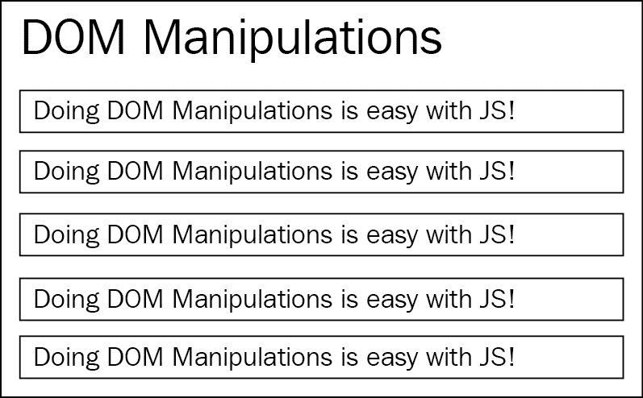
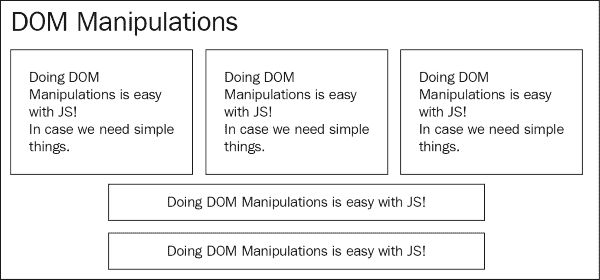
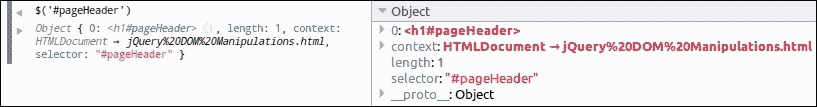
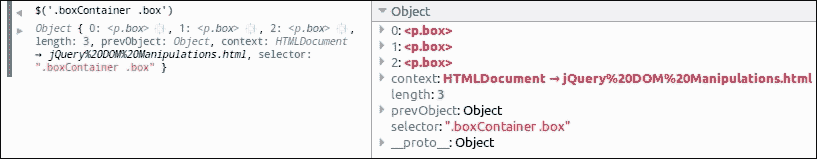
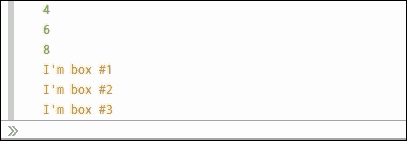

# 一、关于 jQuery 和复合模式的复习

在**Web 2.0**时代开始之前，Web 只是一种基于文档的媒体，它提供的只是将不同的页面/文档和客户端脚本连接起来，而客户端脚本主要局限于表单验证。到 2005 年，Gmail 和 GoogleMaps 发布，JavaScript 被证明是大企业用来创建大规模应用程序和提供丰富用户界面交互的语言。

尽管 JavaScript 自最初发布以来几乎没有什么变化，但企业界对 web 页面应该能够做什么的期望发生了巨大的变化。从那时起，web 开发人员被要求提供复杂的用户交互，最后，“web 应用程序”一词出现在市场上。因此，很明显，他们应该创建一些代码抽象，定义一些最佳实践，并采用计算机科学必须提供的所有适用的**设计模式**。JavaScript 在企业级应用程序中的广泛应用帮助了该语言的发展，通过**ECMAScript 2015**/**ECMAScript 6**（**ES6**）规范扩展了该语言，使得更多的设计模式更易于使用。

2006 年 8 月，jQuery 库首次由 John Resig 在[发布 http://jquery.com](http://jquery.com) ，努力创建一个方便的 API 来定位 DOM 元素。从那时起，它就成为 web 开发人员工具包中不可或缺的一部分。jQuery 在其核心中使用了几种设计模式，并试图通过它提供的方法促使开发人员使用它们。复合模式就是其中之一，它通过核心`jQuery()`方法向开发人员公开，该方法用于 DOM 遍历，这是 jQuery 库的亮点之一。

在本章中，我们将：

*   复习一下使用 jQuery 编写 DOM 脚本
*   介绍复合模式
*   查看 jQuery 如何使用复合模式
*   讨论 jQuery 相对于普通 JavaScript DOM 操作的优势
*   介绍迭代器模式
*   在示例应用程序中使用迭代器模式

# jQuery 和 DOM 脚本

通过 DOM 脚本，我们指的是在浏览器加载网页后改变或操纵网页元素的任何过程。domapi 是一个于 1998 年标准化的 JavaScript API，它为 web 开发人员提供了一组方法，允许浏览器在加载和解析 web 页面的 HTML 代码后创建 DOM 树元素。

### 注

有关**文档对象模式**（**DOM**及其 API 的更多信息，请访问[https://developer.mozilla.org/en-US/docs/Web/API/Document_Object_Model/Introduction](https://developer.mozilla.org/en-US/docs/Web/API/Document_Object_Model/Introduction) 。

通过在 JavaScript 代码中使用 DOM API，web 开发人员可以操纵 DOM 的节点，并在页面中添加新元素或删除现有元素。DOM 脚本的主要用例最初仅限于客户端表单验证，但随着时间的推移，JavaScript 获得了企业界的信任，开始实现更复杂的用户交互。

jQuery 库的初始版本于 2006 年 8 月首次发布，它试图简化 web 开发人员遍历和操作 DOM 树的方式。它的主要目标之一是提供抽象，使代码更短、更易于阅读、更不容易出错，同时确保跨浏览器的互操作性。

jQuery 遵循的这些核心原则在其主页上清晰可见，其表现形式如下：

> …一个快速、小巧、功能丰富的 JavaScript 库。它使 HTML 文档遍历和操作、事件处理、动画和 Ajax 等工作变得更加简单，并提供了一个跨多种浏览器的易于使用的 API。jQuery 结合了多功能性和可扩展性，改变了数百万人编写 JavaScript 的方式。

jQuery 从一开始就提供的抽象 API，以及不同设计模式的编排方式，在 web 开发人员中得到了广泛的认可。因此，根据 BuiltWith.com（[等多个来源，全球访问量最大的网站中有 60%以上引用了 jQuery 库 http://trends.builtwith.com/javascript/jQuery](http://trends.builtwith.com/javascript/jQuery) ）。

## 使用 jQuery 操作 DOM

为了对 jQuery 进行复习，我们将浏览一个示例 web 页面，该页面执行一些简单的 DOM 操作。在本例中，我们将加载一个结构简单的页面，该页面最初如下图所示：



我们将使用一些 jQuery 代码来更改页面的内容和布局，为了使其效果清晰可见，我们将其设置为在页面加载后大约 700 毫秒运行。我们操作的结果将如下图所示：



现在让我们回顾一下前面的示例所需的 HTML 代码：

```js
<!DOCTYPE html> 
<html> 
  <head> 
    <title>DOM Manipulations</title> 
    <link rel="stylesheet" type="text/css" href="dom-manipulations.css">
  </head> 
  <body> 
    <h1 id="pageHeader">DOM Manipulations</h1> 

    <div class="boxContainer"> 
      <div> 
        <p class="box"> 
          Doing DOM Manipulations is easy with JS! 
        </p> 
      </div> 
      <div> 
        <p class="box"> 
          Doing DOM Manipulations is easy with JS! 
        </p> 
      </div> 
      <div> 
        <p class="box"> 
          Doing DOM Manipulations is easy with JS! 
        </p> 
      </div> 
    </div> 

    <p class="box"> 
      Doing DOM Manipulations is easy with JS! 
    </p> 
    <p class="box"> 
      Doing DOM Manipulations is easy with JS! 
    </p>

    <script type="text/javascript" src="https://code.jquery.com/jquery-2.2.0.min.js"></script>
    <script type="text/javascript" src="jquery-dom-manipulations.js"></script>
  </body>
</html>
```

使用的 CSS 代码非常简单，只包含三个 CSS 类，如下所示：

```js
.box {
    padding: 7px 10px;
    border: solid 1px #333;
    margin: 5px 3px;
    box-shadow: 0 1px 2px #777;
}

.boxsizer {
    float: left;
    width: 33.33%;
}

.clear { clear: both; }
```

前面的代码导致在浏览器中打开页面时，在执行 JavaScript 代码之前，页面看起来像第一个图。在前面的 CSS 代码中，我们首先为`box`、`boxsizer`和`clear`CSS 类定义了一些基本样式。`box`类通过使用一些填充、薄边框、周围的一些边距和元素下方的一个小阴影来设置页面中相关元素的样式，以使它们看起来像一个方框。`boxsizer`类将使使用它的元素仅占其父元素宽度的 1/3，并创建一个三列布局。最后，`clear`类将在一个元素上用作列布局的断点，以便后面的所有元素都位于它下面。`boxsizer`和`clear`类最初并不由 HTML 代码中定义的任何元素使用，而是在我们将在 JavaScript 中进行的 DOM 操作之后使用。

在 HTML 的`<body>`元素中，我们最初定义了一个 ID 为`pageHeader`的`<h1>`标题元素，因此可以通过 JavaScript 轻松选择。在它的正下方，我们用`box`类定义了五个段落元素（`<p>`），将前三个段落元素包装在三个`<div>`元素中，然后在另一个`<div>`元素中包装在`boxContainer`类中。

到达我们的两个`<script>`标记时，我们首先包含一个来自 jQueryCDN 的对 jQuery 库的引用。欲了解更多信息，请访问[http://code.jquery.com/](http://code.jquery.com/) 。在第二个`<script>`标记中，我们使用所需代码引用 JavaScript 文件，例如本例，如下所示：

```js
setTimeout(function() {
    $('#pageHeader').css('font-size', '3em');

    var $boxes = $('.boxContainer .box');
    $boxes.append(
      '<br /><br /><i>In case we need simple things</i>.');
    $boxes.parent().addClass('boxsizer');

    $('.boxContainer').append('<div class="clear">');
}, 700);
```

根据前面描述的用例，我们所有的代码都封装在一个`setTimeout`调用中，以延迟其执行。`setTimeout`函数调用的第一个参数是一个匿名函数，将在 700 毫秒的计时器过期后执行，如第二个参数中所定义。

在匿名回调函数的第一行，我们使用 jQuery`$()`函数遍历 DOM 并定位 ID 为`pageHeader`的元素，并使用`css()`方法将其`font-size`增加到`3em`。接下来，我们为`$()`函数提供了一个更复杂的 CSS 选择器，用于定位`box`类中的所有元素，这些元素是`boxContainer`类中元素的后代，然后将结果存储在一个名为`$boxes`的变量中。

### 提示

**变量命名约定**

在开发人员中，对包含特定类型对象的变量使用命名约定是一种常见的做法。使用这样的约定不仅可以帮助您记住变量所包含的内容，还可以让团队中的其他开发人员更容易理解您的代码。在 jQuery 开发人员中，当变量存储`$()`函数的结果（也称为 jQuery 集合对象）时，通常使用以“$”符号开头的变量名。

在掌握了我们感兴趣的`box`元素之后，我们在每个元素的末尾附加了两个空格和一些斜体文字。然后，我们使用`$boxes`变量，并使用`parent()`方法将 DOM 树向上遍历一层。`parent()`方法返回一个不同的 jQuery 对象，该对象包含我们最初选择的框的父`<div>`元素，然后我们链接一个对方法`addClass()`的调用，为它们分配`boxsizer`CSS 类。

### 提示

如果需要遍历选定元素的所有父节点，可以使用`$.fn.parents()`方法。如果您只需要找到与给定 CSS 选择器匹配的第一个祖先元素，那么可以考虑使用 HOLT T1EL 方法。

最后，由于`boxsizer`类使用浮点数来实现三列布局，我们需要清除`boxContainer`中的浮点数。再一次，我们使用简单的`.boxContainer`CSS 选择器和`$()`函数遍历 DOM。然后，我们调用`.append()`方法，用`.clear`CSS 类创建一个新的`<div>`元素，并将其插入`boxContainer`的末尾。

700 毫秒后，我们的 jQuery 代码将完成，产生如前所示的三列布局。在其最终状态下，`boxContainer`元素的 HTML 代码如下所示：

```js
<div class="boxContainer"> 
 <div class="boxsizer"> 
    <p class="box"> 
      Doing DOM Manipulations is easy with JS! 
 <br><br><i>In case we need simple things</i>. 
    </p> 
  </div> 
 <div class="boxsizer"> 
    <p class="box"> 
      Doing DOM Manipulations is easy with JS! 
 <br><br><i>In case we need simple things</i>. 
    </p> 
  </div> 
 <div class="boxsizer"> 
    <p class="box"> 
      Doing DOM Manipulations is easy with JS! 
 <br><br><i>In case we need simple things</i>. 
    </p> 
  </div> 
 <div class="clear"></div> 
</div> 
```

### 方法链接和 Fluent 接口

实际上，在前面的示例中，我们还可以更进一步，将所有三个与框相关的代码语句组合成一个，如下所示：

```js
$('.boxContainer .box') 
  .append('<br /><br /><i>In case we need simple things</i>.') 
  .parent() 
  .addClass('boxsizer');
```

这种语法模式被称为**方法链接**，jQuery 和 JavaScript 社区普遍强烈推荐它。方法链接是 Fluent 接口的面向对象实现模式的一部分，其中每个方法将其指令上下文转发给后续方法。

应用于 jQuery 对象的大多数 jQuery 方法也返回相同或新的 jQuery 元素集合对象。这使我们能够链接多个方法，不仅可以生成更可读、更具表达力的代码，还可以减少所需的变量声明。

# 复合模式

复合模式的关键概念是使我们能够像处理单个对象实例一样处理对象集合。通过在集合上使用方法操纵合成将导致将操纵应用于合成的每个部分。这种方法可以成功应用，而不管复合集合中有多少元素，甚至当集合不包含任何元素时。

此外，复合集合的对象不一定必须提供完全相同的方法。复合对象可以只公开集合对象中常见的方法，也可以提供抽象 API 并适当处理每个对象的方法差异。

让我们继续探索 jQuery 公开的直观 API 是如何受到复合模式的高度影响的。

## jQuery 如何使用复合模式

复合模式是 jQuery 体系结构的一个组成部分，从核心`$()`功能本身开始应用。对`$()`函数的每次调用都会创建并返回一个元素集合对象，该对象通常简称为 jQuery 对象。这正是我们看到复合模式的第一个原则的地方；事实上，`$()`函数不是返回单个元素，而是返回元素的集合。

返回的 jQuery 对象是一个类似数组的对象，它充当包装器对象并携带检索到的元素的集合。它还公开了许多额外的属性，如下所示：

*   检索到的元素集合的`length`
*   该对象被构造的`context`
*   在`$()`函数调用中使用的 CSS`selector`
*   一个`prevObject`属性，以防在链接方法调用后需要访问上一个元素集合

### 提示

**简单数组状对象定义**

类似数组的对象是一个 JavaScript 对象`{ }`，它具有一个数字`length`属性和相应数量的属性，并具有连续的数字属性名称。换句话说，具有`length == 2`属性的类似数组的对象也应该定义两个属性，`"0"`和`"1"`。鉴于上述属性，类似数组的对象允许您使用简单的`for`循环访问其内容，方法是利用 JavaScript 的括号属性访问器语法：

```js
for (var i = 0; i < obj.length; i++) { 
  console.log(obj[i]); 
}
```

通过使用我们最喜欢的浏览器的开发工具，我们可以很容易地试验从`$()`函数返回的 jQuery 对象，并检查上述属性。在 Windows 和 Linux 上按*F12*或在 Mac 上按*Cmd*+*Opt*+*I*即可打开大部分开发工具，然后在控制台中发出一些`$()`调用，点击返回的对象查看其属性。

在下图中，我们可以看到前面示例中使用的`$('#pageHeader')`调用在 Firefox 开发者工具中的结果：



`$('.boxContainer .box')`调用的结果如下所示：



jQuery 使用类似数组的对象作为返回元素的包装器，这一事实允许它公开一些应用于返回集合的额外方法。这是通过`jQuery.fn`对象的原型继承实现的，这使得每个 jQuery 对象也可以访问 jQuery 提供的所有方法。这完成了复合模式，该模式提供了在应用于集合时适当应用于其每个成员的方法。由于 jQuery 使用具有原型继承的类似数组的对象，因此这些方法可以作为每个 jQuery 对象的属性轻松访问，如本章开头的示例所示：`$('#pageHeader').css('font-size', '3em');`。此外，jQuery 在其 DOM 操作代码中添加了一些额外的优点，以实现更小、更不容易出错的代码。例如，当使用`jQuery.fn.html()`方法更改已经包含子元素的 DOM 节点的内部 HTML 时，jQuery 首先尝试删除与子元素关联的任何数据和事件处理程序，然后再将它们从页面中删除并附加提供的 HTML 代码。

让我们来看看 jQuery 是如何实现这些集合适用的方法的。对于这个任务，我们可以下载并从 jQuery（[的 GitHub 页面查看源代码 https://github.com/jquery/jquery/releases](https://github.com/jquery/jquery/releases) ），或者我们可以使用在[上提供的 jQuery Source 查看器等工具 http://james.padolsey.com/jquery](http://james.padolsey.com/jquery) 。

### 注

根据您使用的版本，您可能会在某种程度上得到不同的结果。在撰写本书时，发布并用作参考的最新稳定 jQuery 版本是 v2.2.0。

演示如何实现应用于集合的方法的最简单方法之一是`jQuery.fn.empty()`。通过搜索`"empty:"`或使用 jQuery 源代码查看器并搜索`"jQuery.fn.empty"`，您可以很容易地在 jQuery 的源代码中找到它的实现。使用其中一种方法将使我们获得以下代码：

```js
empty: function() { 
  var elem, i = 0; 

  for ( ; ( elem = this[ i ] ) != null; i++ ) {
    if ( elem.nodeType === 1 ) { 
      // Prevent memory leaks 
      jQuery.cleanData( getAll( elem, false ) ); 

      // Remove any remaining nodes 
      elem.textContent = ""; 
    } 
  } 

  return this; 
}
```

正如您所看到的，代码一点也不复杂。jQuery 通过使用一个普通的`for`循环来迭代集合对象的所有项（称为`this`，因为我们在方法实现中）。对于集合的每个项，即元素节点，它使用`jQuery.cleanData()`helper 函数清除所有数据-*属性值，然后通过将其设置为空字符串来清除其内容。

### 注

有关不同指定节点类型的更多信息，请访问[https://developer.mozilla.org/en-US/docs/Web/API/Node/nodeType](https://developer.mozilla.org/en-US/docs/Web/API/Node/nodeType) 。

## 对比普通 DOM API 的优势

为了清楚地演示复合模式提供的好处，我们将重写初始示例，而不使用 jQuery 提供的抽象。通过使用普通 JavaScript 和 DOM API，我们可以编写一个等效代码，如下所示：

```js
setTimeout(function() { 
  var headerElement = document.getElementById('pageHeader'); 
  if (headerElement) { 
    headerElement.style.fontSize = '3em'; 
  } 
  var boxContainerElement = document.getElementsByClassName('boxContainer')[0]; 
  if (boxContainerElement) { 
    var innerBoxElements = boxContainerElement.getElementsByClassName('box'); 
    for (var i = 0; i < innerBoxElements.length; i++) { 
      var boxElement = innerBoxElements[i]; 
      boxElement.innerHTML +='<br /><br /><i>In case we need simple things</i>.'; 
      boxElement.parentNode.className += ' boxsizer'; 
    } 
    var clearFloatDiv = document.createElement('div'); 
    clearFloatDiv.className = 'clear'; 
    boxContainerElement.appendChild(clearFloatDiv); 
  } 
}, 700);
```

我们再次将`setTimeout`与匿名函数一起使用，并将`700`毫秒设置为第二个参数。在函数本身内部，我们使用`document.getElementById`来检索页面中已知具有唯一 ID 的元素，然后在需要检索具有特定类的所有元素时使用`document.getElementsByClassName`。我们还使用`boxContainerElement.getElementsByClassName('box')`检索`box`类的所有元素，这些元素是`boxContainer`类元素的后代。

最明显的观察结果是，在本例中，我们需要 18 行代码才能获得相同的结果。相比之下，使用 jQuery 时，我们只需要 9 行代码，这是后面实现代码行数的一半。使用带有 CSS 选择器的 jQuery`$()`函数是检索所需元素的一种更简单的方法，它还确保了与不支持`getElementsByClassName()`方法的浏览器的兼容性。然而，除了代码行数和可读性的提高之外，还有更多的好处。作为复合模式的实现者，`$()`函数总是检索元素集合，与我们使用的每个`getElement*`方法的差异处理相比，使我们的代码更加统一。我们以完全相同的方式使用`$()`函数，不管我们只是想检索具有唯一 ID 的元素还是具有特定类的大量元素。

作为返回类似数组的对象的额外好处，jQuery 还可以提供更方便的方法来遍历和操作 DOM，例如我们在第一个示例中看到的那些方法，`.css()`、`.append()`和`.parent()`，它们可以作为返回对象的属性访问。此外，jQuery 还提供了一些方法来抽象更复杂的用例，例如`.addClass()`和`.wrap()`，这些方法在 DOM API 中没有可用的等效方法。

由于返回的 jQuery 集合对象除了它们所包装的元素之外没有任何区别，因此我们可以以相同的方式使用 jQuery API 的任何方法。正如我们前面看到的，这些方法适用于检索到的集合的每个元素，而不考虑元素计数。因此，我们不需要一个单独的`for`循环来迭代每个检索到的元素并单独应用我们的操作；相反，我们将我们的操作（例如，`.addClass()`）直接应用于集合对象。

为了在后面的示例中继续提供相同的执行安全保障，我们还需要添加一些额外的`if`语句来检查`null`值。这是必需的，因为，例如，如果找不到`headerElement`，将发生错误，并且将永远不会执行其余的代码行。有人可能会争辩说，这些检查，例如`if (headerElement)`和`if (boxContainerElement)`，在本例中不是必需的，可以省略。在本例中，这似乎是正确的，但实际上这是在开发大规模应用程序时出现错误的主要原因之一，在这些应用程序中，元素不断地从 DOM 树中创建、插入和删除。不幸的是，所有语言和目标平台的程序员都倾向于先编写他们的实现逻辑，然后在稍后进行检查，通常是在测试实现时出错之后。

遵循复合模式，即使是空的 jQuery 集合对象（不包含检索到的元素）仍然是有效的集合对象，在这里我们可以安全地应用 jQuery 提供的任何方法。因此，我们不需要额外的`if`语句来检查集合在应用`.css()`等方法之前是否确实包含任何元素，只是为了避免 JavaScript 运行时错误。

总的来说，jQuery 通过使用复合模式提供的抽象导致更少的代码行，这更可读、更统一，并且容易出现打字错误的行更少（比较键入`$('#elementID')`和`document.getElementById('elementID')`）。

## 使用复合模式开发应用程序

既然我们已经了解了 jQuery 如何在其体系结构中使用复合模式，也比较了它提供的好处，那么让我们试着编写一个我们自己的示例用例。我们将尝试涵盖本章前面提到的所有概念。我们将把我们的合成物构造成一个类似数组的对象，对完全不同的结构化对象进行操作，提供一个流畅的 API 来允许链接，并拥有适用于集合中所有项目的方法。

### 一个示例用例

假设我们有一个应用程序，在某个时刻需要对数字执行操作。另一方面，它需要操作的项目来自不同的来源，根本不统一。为了让这个示例更有趣，我们假设一个数据源提供普通数字，另一个数据源提供具有特定属性的对象，该属性保存我们感兴趣的数字：

```js
var numberValues = [2, 5, 8]; 

var objectsWithValues = [ 
    { value: 7 }, 
    { value: 4 }, 
    { value: 6 }, 
    { value: 9 } 
];
```

用例的第二个源返回的对象可能具有更复杂的结构，可能还有一些额外的属性。这些更改不会以任何方式区分我们的示例实现，因为在开发复合时，我们只关心对目标项之间的公共部分提供统一的处理。

### 复合采集实现

让我们继续并定义将描述我们的复合集合对象的构造函数和原型：

```js
function ValuesComposite() { 
    this.length = 0; 
} 

ValuesComposite.prototype.append = function(item) { 
    if ((typeof item === 'object' && 'value' in item) || 
        typeof item === 'number') { 
        this[this.length] = item; 
        this.length++; 
    } 

    return this; 
}; 

ValuesComposite.prototype.increment = function(number) { 
    for (var i = 0; i < this.length; i++) { 
        var item = this[i]; 
        if (typeof item === 'object' && 'value' in item) { 
            item.value += number; 
        } else if (typeof item === 'number') { 
            this[i] += number; 
        } 
    } 

    return this; 
}; 

ValuesComposite.prototype.getValues = function() { 
    var result = []; 
    for (var i = 0; i < this.length; i++) { 
        var item = this[i]; 
        if (typeof item === 'object' && 'value' in item) { 
            result.push(item.value); 
        } else if (typeof item === 'number') { 
            result.push(item); 
        } 
    } 
    return result; 
};
```

我们示例中的`ValuesComposite()`构造函数非常简单。当使用`new`操作符调用时，它返回一个空对象，其`length`属性等于零，表示它包装的集合为空。

### 注

有关基于原型的 JavaScript 编程模型的更多信息，请访问[https://developer.mozilla.org/en-US/docs/Web/JavaScript/Introduction_to_Object-Oriented_JavaScript](https://developer.mozilla.org/en-US/docs/Web/JavaScript/Introduction_to_Object-Oriented_JavaScript) 。

我们首先需要定义一种方法，使我们能够填充复合集合对象。我们定义了`append`方法来检查所提供的参数是否是它可以处理的类型之一；在本例中，它将复合对象上的参数附加到下一个可用的数值属性上，并递增`length`属性值。例如，第一个附加项，无论是具有值属性的对象还是普通编号的对象，都将暴露于复合对象的“`0`”属性，并且可以使用括号属性访问器的语法作为`myValuesComposition[0]`进行访问。

`increment`方法是一个简单的示例方法，可以通过对所有集合项进行操作来操作这些集合。它接受一个数值作为参数，然后根据其类型将其添加到集合的每个项中，从而对其进行适当的处理。由于我们的组合是一个类似数组的对象，`increment`使用`for`循环迭代所有集合项，或者增加`item.value`（如果该项是对象）或者增加存储的实际数值（如果存储的集合项是数字）。以同样的方式，我们可以继续并实现其他方法，例如，使我们能够将集合项与特定的数字相乘。

为了允许链接复合对象的方法，原型的所有方法都需要返回对对象实例的引用。我们通过简单地添加一个`return this;`语句作为操作集合的所有方法（如`append`和`increment`的最后一行）来实现这一目标。请记住，`getValues`等方法不操纵集合，但根据定义用于返回结果，不能链接以将集合对象实例中继到后续方法调用。

最后，我们实现了`getValues`方法，作为检索集合中所有项目的实际数值的方便方法。与`increment`方法类似，`getValues`方法抽象了我们收集的不同项目类型之间的处理。它对集合项进行迭代，提取每个数值，并将它们附加到返回给调用方的`result`数组中。

### 执行示例

现在我们来看一个实际示例，它将使用我们刚刚实现的复合对象：

```js
var valuesComposition = new ValuesComposite(); 

for (var i = 0; i < numberValues.length; i++) { 
    valuesComposition.append(numberValues[i]); 
} 

for (var i = 0; i < objectsWithValues.length; i++) { 
    valuesComposition.append(objectsWithValues[i]); 
}

valuesComposition.increment(2) 
    .append(1) 
    .append(2) 
    .append({ value: 3 }); 

console.log(valuesComposition.getValues()); 
```

在浏览器中执行上述代码时，通过在现有页面或直接在浏览器控制台中写入代码，它将记录一个结果，如下所示：

```js
► Array [ 4, 7, 10, 9, 6, 8, 11, 1, 2, 3 ]
```

我们正在使用我们的数据源，如前面显示的`numberValues`和`objectsWithValues`变量。前面的代码对它们进行迭代，并将它们的项附加到新创建的复合对象实例中。然后，我们将复合集合的值增加 2。紧接着，我们使用`append`链接三个项目插入，前两个附加数值，第三个附加值属性对象。最后，我们使用`getValues`方法获取包含集合中所有数值的数组，并将其记录在浏览器控制台中。

### 替代实施方案

请记住，组合不需要是类似数组的对象，但通常是首选的，因为 JavaScript 使创建这样的实现变得容易。此外，类似数组的实现还具有允许我们使用简单的`for`循环迭代集合项的优点。

另一方面，如果类似数组的对象不是首选对象，我们可以轻松地使用复合对象上的属性来保存集合项。例如，该属性可以命名为`items`，用于分别使用`this.items.push(item)`和`this.items[i]`在我们的方法中存储和访问集合的项。

# 迭代器模式

迭代器模式的关键概念是使用一个单独负责遍历集合并提供对其项的访问的函数。此函数称为迭代器，它提供了一种访问集合项的方法，而无需公开实现细节和集合对象使用的底层数据结构。

迭代器提供了关于迭代发生方式的封装级别，将集合项上的迭代与其使用者的实现逻辑解耦。

### 注

有关**单一责任原则**的更多信息，请访问[http://www.oodesign.com/single-responsibility-principle.html](http://www.oodesign.com/single-responsibility-principle.html) 。

## jQuery 如何使用迭代器模式

正如我们在本章前面的中所看到的，jQuery 核心`$()`函数返回一个类似数组的对象，该对象封装了页面元素的集合，它还提供了一个迭代器函数来遍历它并单独访问每个元素。它实际上更进一步，提供了一个通用的助手方法`jQuery.each()`，可以迭代数组、类似数组的对象以及对象属性。

更技术性的描述可在[的 jQuery API 文档页面中找到 http://api.jquery.com/jQuery.each/](http://api.jquery.com/jQuery.each/) ，其中`jQuery.each()`的说明如下：

> 一个泛型迭代器函数，可用于无缝迭代对象和数组。数组和具有 length 属性的类似数组的对象（例如函数的 arguments 对象）通过数值索引从 0 到 length-1 进行迭代。其他对象通过其命名属性进行迭代。

`jQuery.each()`helper 函数在 jQuery 源代码的几个地方内部使用。它的用途之一是迭代 jQuery 对象的项，并对每个项应用操作，正如复合模式所示。对关键字`.each(`的简单搜索将显示 56 个匹配项。

### 注

在撰写本书时，最新的稳定版本是 v2.2.0，用于上述统计数据。

我们可以通过搜索`"each:"`（注意有两次出现）或使用 jQuery 源代码查看器并搜索`"jQuery.each()"`（就像我们在本章前面所做的那样），轻松地在 jQuery 的源代码中跟踪的实现：

```js
each: function( obj, callback ) {
  var length, i = 0;

  if ( isArrayLike( obj ) ) {
    length = obj.length;
    for ( ; i < length; i++ ) {
      if ( callback.call( obj[ i ], i, obj[ i ] ) === false ) {
        break;
      }
    }
  } else {
    for ( i in obj ) {
      if ( callback.call( obj[ i ], i, obj[ i ] ) === false ) {
        break;
      }
    }
   }

  return obj;
}
```

这个 helper 函数也可以在任何 jQuery 对象上访问，方法与我们前面看到的`.append()`方法相同。您可以通过在 jQuery 源代码查看器中搜索`"jQuery.fn.each()"`或直接在 jQuery 源代码中搜索`each:`（请注意，有两种情况）来轻松找到实现此目的的代码：

```js
each: function( callback ) {
  return jQuery.each( this, callback );
}
```

使用`".each()"`的方法版本使我们能够使用更方便的语法直接迭代 jQuery 集合对象的元素。

下面的示例代码展示了`.each()`的两种风格如何在我们的代码中使用：

```js
// using the helper function on an array
$.each([3, 5, 7], function(index){
    console.log(this + 1);
});
// using the method on a jQuery object
$('.boxContainer .box').each(function(index) {
    console.log('I\'m box #' + (index + 1)); // index is zero-based
});
```

执行时，上述代码将在浏览器控制台上记录以下内容：



## 它是如何与复合模式配对的

由于复合模式将项集合封装到单个对象中，迭代器模式可用于迭代抽象数据结构，因此我们可以轻松地将这两种模式描述为互补模式。

## 在哪里可以使用

迭代器模式可以用于我们的应用程序中，以抽象我们从数据结构访问项的方式。例如，假设我们需要从以下树结构中检索大于 4 的所有项：

```js
var collection = { 
    nodeValue: 7, 
    left: { 
        nodeValue: 4, 
        left: 2, 
        right: { 
            nodeValue: 6, 
            left: 5, 
            right: 9 
        } 
    }, 
    right: { 
        nodeValue: 9, 
        left: 8 
    } 
}; 
```

现在让我们实现我们的迭代器函数。由于树数据结构可以嵌套，因此我们最终采用以下递归实现：

```js
function iterateTreeValues(node, callback) { 
    if (node === null || node === undefined) { 
        return; 
    } 

    if (typeof node === 'object') { 
        if ('left' in node) { 
            iterateTreeValues(node.left, callback); 
        } 
        if ('nodeValue' in node) { 
            callback(node.nodeValue); 
        } 
        if ('right' in node) { 
            iterateTreeValues(node.right, callback); 
        } 
    } else { 
        // its a leaf, so the node is the value 
        callback(node); 
    } 
} 
```

最后，我们得到一个如下所示的实现：

```js
var valuesArray = []; 
iterateTreeValues(collection, function(value) { 
    if (value > 4) { 
        valuesArray.push(value); 
    } 
}); 
console.log(valuesArray);
```

执行时，上述代码将在浏览器控制台上记录以下内容：

```js
► Array [ 5, 6, 9, 7, 8, 9 ]
```

我们可以清楚地看到迭代器简化了我们的代码。我们不再为每次需要访问满足特定标准的某些项时所使用的数据结构的实现细节而烦恼。我们的实现工作在迭代器公开的通用 API 之上，我们的实现逻辑出现在我们提供给迭代器的回调中。

这种封装允许我们将实现与所使用的数据结构解耦，因为可以使用具有相同 API 的迭代器。例如，在本例中，我们可以轻松地更改用于排序二叉树或简单数组的数据结构，并保持实现逻辑不变。

# 总结

在本章中，我们复习了 JavaScript 的 DOM 脚本 API 和 jQuery。我们介绍了复合模式，并了解了 jQuery 库如何使用它。在重写示例页面而不使用 jQuery 之后，我们看到了复合模式是如何简化我们的工作流程的，随后我们展示了在应用程序中使用复合模式的示例。最后，我们介绍了迭代器模式，并了解了它与复合模式一起使用时的配对效果。

现在我们已经完成了关于复合模式如何在我们每天使用 jQuery 方法的方式中发挥重要作用的介绍，我们可以进入下一章，在这里我们将展示 Observer 模式以及在使用 jQuery 的页面中使用它的便捷方式。