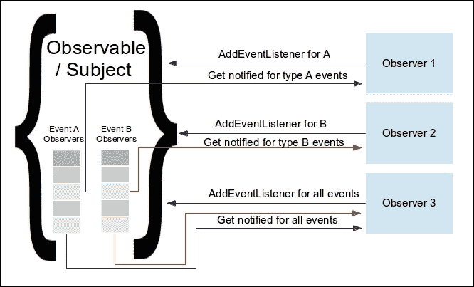
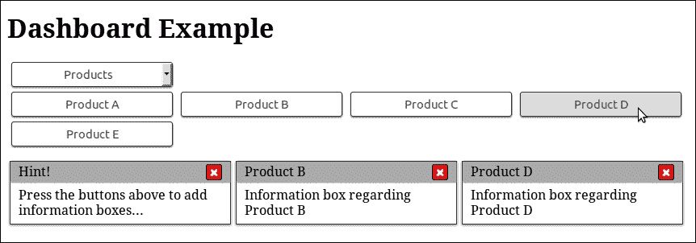
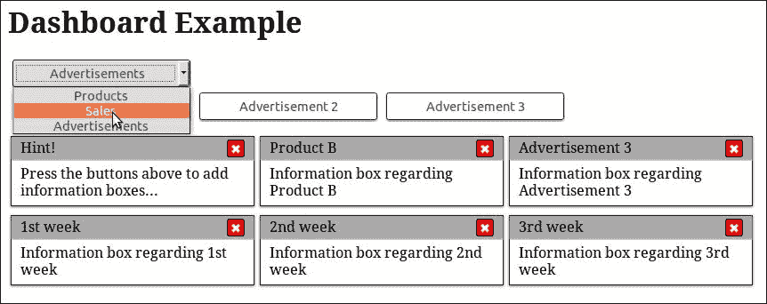
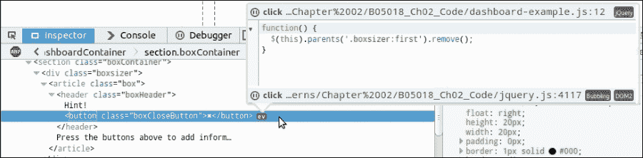
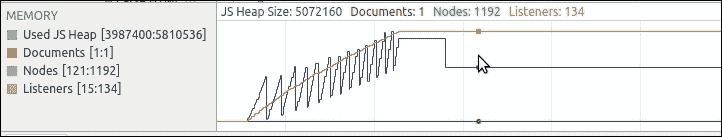
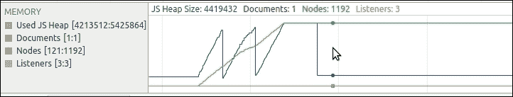

# 二、观察者模式

在本章中，我们将展示 Observer 模式以及使用 jQuery 在页面中使用它的便捷方式。稍后，我们还将解释委托事件观察者模式变量，当正确地应用于 web 页面时，它可以简化代码并减少页面所需的内存消耗。

在本章中，我们将：

*   介绍观察者模式
*   查看 jQuery 如何使用观察者模式
*   将观察者模式与使用事件属性进行比较
*   了解如何避免观察员的内存泄漏
*   介绍委派事件观察者模式并展示其优点

# 引入观察者模式

观察者模式的关键概念是，存在一个对象，通常被称为可观察对象或主体，其内部状态在其生命周期内发生变化。还有一些其他对象，称为观察者，希望在可观察对象/主体的状态发生变化时得到通知，以便执行一些操作。

观察者可能需要被告知任何类型的可观察状态变化或仅特定类型的变化。在最常见的实现中，可观察对象与其观察者一起维护一个列表，并在适当的状态更改发生时通知他们。如果可观察对象发生状态更改，它将遍历对该类型状态更改感兴趣的观察者列表，并执行他们定义的特定方法。



根据计算机科学书籍中观察者模式的定义和参考实现，观察者被描述为实现众所周知的编程接口的对象，在大多数情况下，特定于他们感兴趣的每个观察对象。在状态改变的情况下，被观察者将执行编程接口中定义的每个观察者的已知方法。

### 注

有关观察者模式如何在传统的面向对象编程中使用的更多信息，您可以访问[http://www.oodesign.com/observer-pattern.html](http://www.oodesign.com/observer-pattern.html) 。

在 web 堆栈中，观察者模式通常使用普通匿名回调函数作为观察者，而不是使用已知方法的对象。正如观察者模式所定义的那样，由于回调函数保留了对其所定义环境变量的引用，因此可以实现一个等价的结果——一个通常被称为**闭包**的模式。使用 Observer 模式而不是回调作为调用或初始化参数的主要好处是，Observer 模式可以在单个目标上支持多个独立的处理程序。

### 注

有关闭包的更多信息，请访问[https://developer.mozilla.org/en-US/docs/Web/JavaScript/Closures](https://developer.mozilla.org/en-US/docs/Web/JavaScript/Closures) 。

### 提示

**定义简单回调**

回调可以定义为作为参数传递给另一个函数/方法的函数，或分配给对象的属性，并预期在稍后某个时间点执行。这样，传递给回调的代码片段将调用或调用它，将操作或事件的结果传播回定义回调的上下文。

由于将函数注册为观察者的模式已被证明更灵活、更易于编程，因此它也可以在 web 堆栈之外的编程语言中找到。其他编程语言通过语言特性或特殊对象（如子程序、lambda 表达式、块和函数指针）提供等效功能。例如，Python 还将函数定义为一级对象，如 JavaScript，使它们能够用作回调，而 C#将委托定义为一种特殊的对象类型，以实现相同的结果。

观察者模式是开发响应用户操作的 web 界面的一个组成部分，每个 web 开发人员都在某种程度上使用过它，即使没有注意到它。这是因为 web 开发人员在创建富用户界面时需要做的第一件事是向页面元素添加事件侦听器，并定义浏览器应如何响应它们。

这通常是通过在页面元素上使用`EventTarget.addEventListener()`方法来实现的，我们需要监听事件，如“单击”，并提供回调函数，其中包含事件发生时需要执行的代码。值得一提的是，为了支持旧版本的 Internet Explorer，需要测试`EventTarget.attachEvent()`是否存在，并使用它。

### 注

有关`addEventListener()`和`attachEvent()`方法的更多信息，请访问[https://developer.mozilla.org/en-US/docs/Web/API/EventTarget/addEventListener](https://developer.mozilla.org/en-US/docs/Web/API/EventTarget/addEventListener) 和[https://developer.mozilla.org/en-US/docs/Web/API/EventTarget/attachEvent](https://developer.mozilla.org/en-US/docs/Web/API/EventTarget/attachEvent) 。

## jQuery 如何使用

jQuery 库在其实现的几个部分大量使用观察者模式，或者直接使用`addEventListener`方法使用，或者在其上创建自己的抽象。此外，jQuery 提供了一系列抽象和方便的方法，使在 web 上使用 Observer 模式变得更容易，并在内部使用其中一些方法来实现其他方法。

### jQuery 上的方法

`jQuery.fn.on()`方法是将事件处理程序附加到元素的中央 jQuery 方法，提供了一种采用观察者模式的简单方法，同时使代码易于阅读和推理。它将请求的事件处理程序附加到`$()`函数返回的复合 jQuery 集合对象的所有元素上。

在 jQuery 的源代码查看器中搜索`jQuery.fn.on`（可从[获取）http://james.padolsey.com/jquery](http://james.padolsey.com/jquery) ），或者直接在 jQuery 的源代码中搜索`on: function`（第一个字符是制表符），将引导我们找到该方法的定义，其中包含 67 行代码。实际上，内部`on`函数的前 55 行只是处理`jQuery.fn.on()`方法可以调用的所有不同方式；在接近尾声时，我们可以看到它实际上使用了内部方法`jQuery.event.add()`：

```js
jQuery.fn.extend({
  on: function( types, selector, data, fn ) {
    return on( this, types, selector, data, fn );
  }
});

function on( elem, types, selector, data, fn, one ) {

  /* 55 lines of code handling the method overloads */
  return elem.each( function() {
    jQuery.event.add( this, types, fn, data, selector );
  } );
}
```

`jQuery.event`对象是 jQuery 中事件处理的一站式，其实现大约有 443 行代码。它拥有多个用于管理事件的辅助功能，如`add`、`dispatch`、`fix`、`handlers`、`remove`、`simulate`和`trigger`。所有这些函数都由 jQuery 本身在内部使用，只要出现观察者模式或需要管理事件。

在 jQuery 的源代码查看器中搜索`jQuery.event.add`或直接在 jQuery 的源代码中搜索`jQuery.event =`，将引导我们实现相对较长的帮助函数，该函数在 jQuery v2.2.0 中大约有 107 行代码。下面的代码片段显示了该方法的一个精简版本，其中一些与 jQuery 的技术实现相关而与 Observer 模式无关的代码已被删除，以便于说明：

```js
add: function( elem, types, handler, data, selector ) { 
    /* ... 4 lines of code ... */
        elemData = dataPriv.get( elem ); 
    /* ... 13 lines of code ... */

    // Make sure that the handler has a unique ID, 
    // used to find/remove it later 
 if ( !handler.guid ) { 
 handler.guid = jQuery.guid++; 
 } 

    // Init the element's event structure and main handler, 
    // if this is the first 
 if ( !( events = elemData.events ) ) { 
 events = elemData.events = {}; 
 } 
    /* ... 9 lines of code ... */ 

    // Handle multiple events separated by a space 
    types = ( types || "" ).match( rnotwhite ) || [ "" ]; 
    t = types.length; 
    while ( t-- ) { 
        /* ... 30 lines of code ... */ 

        // Init the event handler queue if we're the first 
        if ( !( handlers = events[ type ] ) ) { 
 handlers = events[ type ] = []; 
            handlers.delegateCount = 0; 

            // Only use addEventListener if the special events handler
            // returns false 
            if ( !special.setup || special.setup.call( elem, data, namespaces, eventHandle ) === false ) {
 if ( elem.addEventListener ) { 
 elem.addEventListener( type, eventHandle ); 
 } 
            } 
        }

        /* ... 9 lines of code ... */ 

        // Add to the element's handler list, delegates in front 
 if ( selector ) { 
 handlers.splice( handlers.delegateCount++, 0, handleObj ); 
 } else { 
 handlers.push( handleObj ); 
 }
        /* ... 3 lines of code ... */
    } 
}
```

现在，通过参考前面突出显示的代码，让我们看看观察者模式是如何由`jQuery.event.add()`实现的。

`jQuery.event.add()`方法的参数中的`handler`变量存储最初作为参数传递给`jQuery.fn.on()`方法的函数。我们可以将此函数称为观察者函数，因为它是在适当的事件触发它所附加到的元素时执行的。

在第一个突出显示的代码区域中，jQuery 创建`guid`属性并将其分配给存储在`handler`变量中的观察者函数。请记住，在 JavaScript 中为函数指定属性是可能的，因为函数是一级对象。`jQuery.guid++`语句在旧值赋值后立即执行，这是必需的，因为`jQuery.guid`是 jQuery 和 jQuery 插件内部使用的一个页面范围的计数器。observer 函数的`guid`属性用于在 jQuery 为每个元素提供的 observer 列表中标识和定位 observer 函数。例如，`jQuery.fn.off()`方法使用它从与元素相关联的观察者列表中查找并删除观察者函数。

### 提示

`jQuery.guid`是一个页面范围的计数器，插件和 jQuery 本身使用它作为集中方式来检索唯一的整数 ID。它通常用于为元素、对象和函数分配唯一的 ID，以便更容易在集合中找到它们。每个实现者都有责任检索并使用`jQuery.guid`的当前值，并在每次使用后增加属性值（1）。否则，由于这是一个页面范围的计数器，jQuery 插件和 jQuery 本身都使用它进行标识，因此页面可能会遇到难以调试的故障。

在第二个和第三个突出显示的代码区域中，jQuery 初始化一个数组，以保存可能在该元素上触发的每个单独事件的观察者列表。在第二个突出显示的代码区域中需要注意的一点是，`elemData`变量中的观察者列表不是实际 DOM 元素的属性。如`dataPriv.get( elem )`语句所示，在`jQuery.event.add()`方法的开始附近，jQuery 使用单独的映射对象来保存 DOM 元素与其观察者列表之间的关联。通过使用这种数据缓存机制，jQuery 能够避免使用实现所需的额外属性污染 DOM 元素。

### 注

您可以通过搜索`function Data()`在 jQuery 的源代码中轻松找到数据缓存机制的实现。这将带您进入`Data`类的构造函数，之后是`Data.prototype`对象中定义的类方法的实现。欲了解更多信息，请访问[http://api.jquery.com/data](http://api.jquery.com/data) 。

下一个突出显示的代码区域是 jQuery 检查`EventTarget.addEventListener()`方法是否实际可用于该元素，然后使用它将事件侦听器添加到元素中。在最后突出显示的代码区域中，jQuery 将 observer 函数添加到其内部列表中，该列表包含附加到该特定元素的相同事件类型的所有观察者。

### 注

根据您使用的版本，您可能会在某种程度上得到不同的结果。在编写本书时，发布并用作参考的最新稳定 jQuery 版本是 v2.2.0。

如果您需要支持较旧的浏览器，例如低于版本 9 的 Internet Explorer，那么您应该使用 jQuery 的 v1.x 版本。在撰写本书时，最新版本是 v1.12.0，它提供了与 v2.2.x 版本完全相同的 API，但也具有在旧浏览器上工作所需的代码。

为了解决旧浏览器的实现不一致的问题，jQueryV1.x 中的`jQuery.event.add()`的实现有点长，也比较复杂。其中一个原因是，jQuery 还需要测试`EventTarget.addEventListener()`在其运行的浏览器中是否实际可用，如果不是这样，则尝试使用`EventTarget.attachEvent()`。

正如我们在前面的代码中所看到的，jQuery 实现遵循 Observer 模式描述的操作模型，但它也包含一些实现技巧，以便在 web 浏览器可用的 API 中更有效地工作。

### 文件准备就绪

jQuery 提供的另一种方便的方法是方法，被开发人员广泛使用。此方法接受函数参数，并仅在页面的 DOM 树完全加载后执行。如果您的代码没有最后加载到页面中，并且您不想阻止初始页面呈现，或者它需要操作的元素的定义晚于它自己的`<script>`标记，那么这样做会很有用。

### 注

请记住，方法的工作原理与页面的`window.onload`回调和“load”事件稍有不同，后者等待页面的所有资源都被加载。欲了解更多信息，请访问[http://api.jquery.com/ready](http://api.jquery.com/ready) 。

下面的代码演示了使用`$.fn.ready()`方法的最常见方式：

```js
$(document).ready(function() {
    /* this code will execute only after the page has been fully loaded */ 
})
```

如果我们试图定位`jQuery.fn.ready`的实现，我们将看到它实际上在内部使用`jQuery.ready.promise`来工作：

```js
jQuery.fn.ready = function( fn ) { 
  // Add the callback 
  jQuery.ready.promise().done( fn ); 

  return this; 
};
/* … a lot lines of code in between */
jQuery.ready.promise = function( obj ) { 
  if ( !readyList ) { 

    readyList = jQuery.Deferred(); 

    // Catch cases where $(document).ready() is called
    // after the browser event has already occurred.
    // Support: IE9-10 only
    // Older IE sometimes signals "interactive" too soon
    if ( document.readyState === "complete" || ( document.readyState !== "loading" && !document.documentElement.doScroll ) ) {
      // Handle it asynchronously to allow ... to delay ready 
      window.setTimeout( jQuery.ready ); 

    } else { 
      // Use the handy event callback 
 document.addEventListener( "DOMContentLoaded", completed ); 

      // A fallback to window.onload, that will always work 
 window.addEventListener( "load", completed ); 
    } 
  } 
  return readyList.promise( obj ); 
};
```

正如您在前面突出显示的实现代码区域中所看到的，jQuery 使用`addEventListener`来观察`document`对象上触发`DOMContentLoaded`事件的时间。此外，为了确保它能在多种浏览器上工作，它还观察了在`window`对象上触发的`load`事件。

jQuery 库还提供了在代码中添加上述功能的较短方法。由于上述实现实际上不需要引用该文档，因此我们可以而只写`$().ready(function() {/* ... */ })`。`$()`函数也存在过载，实现了相同的结果，与`$(function() {/* ... */ })`一样使用。这两种使用`jQuery.fn.ready`的替代方法受到了开发人员的严厉批评，因为它们通常会导致误解。第二个较短的版本尤其会导致混淆，因为它看起来像一个**立即调用的函数表达式**（**IIFE**），JavaScript 开发人员大量使用并已学会识别这种模式。事实上，它只不同于一个字符（`$`，因此，在与其他开发团队讨论之前，不建议使用它。

### 注

`$.fn.ready()`方法也是的一种方法，它提供了一种在我们的代码中实现延迟初始化/执行模式的简单方法。此模式的核心概念是延迟代码的执行或在稍后加载远程资源。例如，我们可以等待页面完全加载，直到添加观察者，或者在下载 web 资源之前等待某个事件发生。

## 演示一个示例用例

为了看到观察者模式的实际应用，我们将创建一个示例，展示仪表板的框架实现。在我们的示例中，用户将能够向其仪表板添加信息框，这些信息框与标题上可供选择的一些示例项和类别相关。

我们的示例将为我们的项目预定义三个类别：**产品**、**销售**和**广告**。这些类别中的每一个都有一系列相关的项目，这些项目将出现在类别选择器正下方的区域中。用户将能够使用下拉选择器选择所需类别，这将更改仪表板的可见选择项。



我们的仪表板最初将包含一个关于仪表板用法的提示信息框。每当用户单击其中一个类别项时，我们的三列布局仪表板中将显示一个新的信息框。在上图中，用户通过点击相关按钮为**产品 B**和**产品 D**添加了两个新的信息框。



用户还可以通过单击每个信息框右上角的红色关闭按钮来关闭这些信息框。在上图中，用户取消了**产品 D**信息框，然后为**广告 3**添加了信息框，之后为**销售**类别的第 1、2、3 周项目添加了信息框。

通过阅读上面的描述，我们可以轻松地隔离实现仪表板所需的所有用户交互。我们需要为这些用户交互中的每一个添加观察者，并在执行适当 DOM 操作的回调函数中编写代码。

具体而言，我们的代码需要：

*   观察对当前选定元素所做的更改，并通过隐藏或显示适当的项来响应此类事件
*   观察每个项目按钮上的点击，并通过添加新的信息框进行响应
*   观察每个信息框的关闭按钮上的点击，并将其从页面中移除

现在，让我们继续查看前面示例所需的 HTML、CSS 和 JavaScript 代码。让我们从 HTML 代码开始，假设我们将其保存在名为`Dashboard Example.html`的文件中，以供参考，如下所示：

```js
<!DOCTYPE html> 
<html> 
  <head> 
    <title>Dashboard Example</title> 
    <link rel="stylesheet" type="text/css" href="dashboard-example.css"> 
  </head> 
  <body> 
    <h1 id="pageHeader">Dashboard Example</h1> 

    <div class="dashboardContainer"> 
      <section class="dashboardCategories"> 
        <select id="categoriesSelector"> 
          <option value="0" selected>Products</option> 
          <option value="1">Sales</option> 
          <option value="2">Advertisements</option> 
        </select> 
        <section class="dashboardCategory"> 
          <button>Product A</button> 
          <button>Product B</button> 
          <button>Product C</button> 
          <button>Product D</button> 
          <button>Product E</button> 
        </section> 
        <section class="dashboardCategory hidden"> 
          <button>1st week</button> 
          <button>2nd week</button> 
          <button>3rd week</button> 
          <button>4th week</button> 
        </section> 
        <section class="dashboardCategory hidden"> 
          <button>Advertisement 1</button> 
          <button>Advertisement 2</button> 
          <button>Advertisement 3</button> 
        </section> 
        <div class="clear"></div> 
      </section> 

      <section class="boxContainer"> 
        <div class="boxsizer"> 
          <article class="box"> 
            <header class="boxHeader"> 
              Hint! 
              <button class="boxCloseButton">&#10006;</button> 
            </header> 
            Press the buttons above to add information boxes... 
          </article> 
        </div> 
      </section> 
      <div class="clear"></div> 
    </div> 

    <script type="text/javascript" src="jquery.js"></script> 
    <script type="text/javascript" src="dashboard-example.js">
    </script> 
  </body> 
</html>
```

在前面的 HTML 中，我们将所有与仪表板相关的元素放在带有`dashboardContainer`CSS 类的`<div>`元素中。这将使我们能够有一个中心的起点来搜索仪表板的元素，并确定 CSS 的范围。在它里面，我们定义了两个`<section>`元素，以便使用一些 HTML5 语义元素将仪表板划分为逻辑区域。

第一个带有`dashboardCategories`类的`<section>`用于保存仪表板的类别选择器。在它里面，我们有一个 ID 为`categoriesSelector`的`<select>`元素，用于过滤可见的类别项目，还有三个`dashboardCategory`类的子部分，用于包装`<button>`元素，单击后将在仪表板中填充信息框。其中两个还具有`hidden`类，因此当页面通过匹配类别选择器的初始选择选项（`<option>`）加载时，只有第一个类可见。此外，在第一节的末尾，我们还添加了一个带有`clear`类的`<div>`，正如我们在第一章中看到的，它将用于清除浮动的`<button>`元素。

第二个`<section>`和`boxContainer`类用于存放仪表板的信息框。最初，它只包含一个关于如何使用仪表板的提示。我们使用带有`boxsizer`类的`<div>`元素来设置方框尺寸，使用带有`box`类的 HTML5`<article>`元素来添加所需的边框填充和阴影，类似于第一章中的方框元素。

每个信息框除了其内容外，还包含一个带有`boxHeader`类的`<header>`元素和一个带有`boxCloseButton`类的`<button>`元素，单击该元素时，将删除包含该信息框的信息框。我们还使用了`&#10006;`HTML 字符代码作为按钮的内容，以获得更美观的“x”标记，并避免为此使用单独的图像。

最后，由于信息框也是浮动的，所以我们还需要一个在`boxContainer`末尾带有`clear`类的`<div>`。

在前面 HTML 的`<head>`中，我们还引用了一个名为`dashboard-example.css`的 CSS 文件，其内容如下：

```js
.dashboardCategories { 
    margin-bottom: 10px; 
} 

.dashboardCategories select, 
.dashboardCategories button { 
    display: block; 
    width: 200px; 
    padding: 5px 3px; 
    border: 1px solid #333; 
    margin: 3px 5px; 
    border-radius: 3px; 
    background-color: #FFF; 
    text-align: center; 
    box-shadow: 0 1px 1px #777; 
    cursor: pointer; 
} 

.dashboardCategories select:hover, 
.dashboardCategories button:hover { 
    background-color: #DDD; 
} 

.dashboardCategories button { 
    float: left; 
} 

.box { 
    padding: 7px 10px; 
    border: solid 1px #333; 
    margin: 5px 3px; 
    box-shadow: 0 1px 2px #777; 
} 

.boxsizer { 
    float: left; 
    width: 33.33%; 
} 

.boxHeader { 
    padding: 3px 10px;
    margin: -7px -10px 7px;
    background-color: #AAA; 
    box-shadow: 0 1px 1px #999; 
} 

.boxCloseButton { 
    float: right; 
    height: 20px; 
    width: 20px; 
    padding: 0; 
    border: 1px solid #000; 
    border-radius: 3px; 
    background-color: red; 
    font-weight: bold; 
    text-align: center; 
    color: #FFF; 
    cursor: pointer; 
} 

.clear { clear: both; } 
.hidden { display: none; }
```

正如您在我们的 CSS 文件中所看到的，首先我们使用`dashboardCategories`类在元素下方添加了一些空间，并且还为`<select>`元素及其内部的按钮定义了相同的样式。为了将其与默认浏览器样式区分开来，我们添加了一些填充、圆角边框、鼠标指针悬停时的不同背景色，以及它们之间的一些空间。我们还定义了我们的`<select>`元素应该作为一个块单独显示在其行中，并且类别项按钮应该相邻浮动。我们再次使用了`boxsizer`和`box`CSS 类，正如我们在[第 1 章](01.html#DB7S2-e8d3cd3d052d4ee0b4673af57a64ddef "Chapter 1. A Refresher on jQuery and the Composite Pattern")中所做的那样，*是对 jQuery 和复合模式*的复习；第一个用于创建三列布局，第二个用于实际提供信息框的样式。我们继续定义应用于信息框的`<header>`元素的`boxHeader`类，并定义一些填充、灰色背景色、浅色阴影和一些负边距，以便抵消框填充的效果，并将自身放置在框的边框旁边。

为了完成信息框的样式设置，我们还定义了`boxCloseButton`CSS 类，该类（i）将框的关闭按钮浮动到框`<header>`内的右上角，（ii）定义`20px`宽度和高度，（iii）将默认浏览器的`<button>`样式设置覆盖为零填充，以及（iv）添加带有圆角和红色背景色的单像素黑色边框。最后，就像在[第 1 章](01.html#DB7S2-e8d3cd3d052d4ee0b4673af57a64ddef "Chapter 1. A Refresher on jQuery and the Composite Pattern")中一样，*是 jQuery 和复合模式*的复习者，我们定义了`clear`实用工具 CSS 类，以防止元素被放置在前面的浮动元素旁边，并且还将`hidden`类定义为隐藏页面元素的便捷方式。

在我们的 HTML 文件中，我们引用 jQuery 库本身以及一个名为`dashboard-example.js`的 JavaScript 文件，该文件包含我们的仪表板实现。按照创建高性能网页的最佳实践，我们将其放置在`</body>`标记之前，以避免延迟初始页面呈现：

```js
$(document).ready(function() { 

    $('#categoriesSelector').change(function() { 
        var $selector = $(this); 
        var selectedIndex = +$selector.val(); 
        var $dashboardCategories = $('.dashboardCategory'); 
        var $selectedItem = $dashboardCategories.eq(selectedIndex).show(); 
        $dashboardCategories.not($selectedItem).hide();
    }); 

    function setupBoxCloseButton($box) { 
        $box.find('.boxCloseButton').click(function() { 
            $(this).closest('.boxsizer').remove(); 
        }); 
    } 

    // make the close button of the hint box work 
    setupBoxCloseButton($('.box')); 

    $('.dashboardCategory button').on('click', function() { 
        var $button = $(this); 
        var boxHtml = '<div class="boxsizer"><article class="box">' + 
                '<header class="boxHeader">' + 
                    $button.text() + 
                    '<button class="boxCloseButton">&#10006;' + 
                    '</button>' + 
                '</header>' + 
                'Information box regarding ' + $button.text() + 
            '</article></div>'; 
        $('.boxContainer').append(boxHtml); 
        setupBoxCloseButton($('.box:last-child')); 
    });

}); 
```

我们已将所有代码放入`$(document).ready()`调用中，以延迟其执行，直到页面的 DOM 树完全加载。如果我们将代码放在`<head>`元素中，这绝对是必需的，但这也是一种在任何情况下都可以遵循的最佳实践。

我们首先使用“`$.fn.change()`方法在`categoriesSelector`元素上添加`change`事件的观察者，这实际上是`$.fn.on('change', /* … */)`方法的一种简写方法。在 jQuery 中，用作观察者的函数中的`this`关键字的值包含对触发事件的 DOM 元素的引用。这适用于所有注册观察者的 jQuery 方法，从核心`$.fn.on()`到`$.fn.change()`和`$.fn.click()`便捷方法。因此我们使用`$()`函数用`<select>`元素创建一个 jQuery 对象，并将其存储在`$selector`变量中。然后，我们使用`$selector.val()`检索所选`<option>`的值，并使用`+`运算符将其转换为数值。紧接着，我们检索`dashboardCategory`的`<section>`元素，并将结果缓存到`$dashboardCategories`变量中。然后，我们继续查找并显示位置等于`selectedIndex`变量值的类别，并将结果 jQuery 对象存储到`$selectedItem`变量。最后，我们使用`$selectedItem`变量和`$.fn.not()`方法来检索和隐藏所有类别元素，除了我们刚刚揭示的一个之外。

在下一个代码部分中，我们定义了`setupBoxCloseButton`函数，该函数将用于初始化关闭按钮的功能。它需要一个以 box 元素为参数的 jQuery 对象，并为每个元素搜索它们的后代，以查找我们在关闭按钮上使用的`boxCloseButton`CSS 类。使用`$.fn.on('click', /* fn */)`的方便方法`$.fn.click()`，我们注册了一个匿名函数，每当触发一个点击事件时，该函数就会执行，该事件使用`$.fn.closest()`方法查找具有`boxsizer`类的第一个祖先元素，并将其从页面中删除。在这之后，我们为加载页面时页面中已经存在的 box 元素调用一次此函数。在本例中，使用带有用法提示的 box 元素。

### 注

在使用`$.fn.closest()`方法时，需要记住的另一件事是，在处理其祖先元素之前，它会从 jQuery 集合的当前元素开始测试给定的选择器。有关更多信息，请访问其文档，网址为[http://api.jquery.com/closest](http://api.jquery.com/closest) 。

在最后的代码部分，我们使用`$.fn.on()`方法为每个类别按钮上的点击事件添加一个观察者。在本例中，在匿名观察者函数中，我们使用`this`关键字，它保存被单击的`<button>`的 DOM 元素，并使用`$()`方法创建一个 jQuery 对象，并将其引用缓存在`$button`变量中。紧接着，我们使用`$.fn.text()`方法检索按钮的文本内容，并与之一起为信息框构建 HTML 代码。对于关闭按钮，我们使用将呈现为更漂亮的“**X**”图标的`&#10006`HTML 字符代码。我们创建的模板基于最初可见的提示框的 HTML 代码；为了满足本章示例的需要，我们使用纯字符串连接。最后，我们将为我们的框生成的 HTML 代码附加到`boxContainer`中，因为我们希望它是最后一个元素，所以我们使用`$()`函数找到它并将其作为参数提供给`setupBoxCloseButton`。

## 如何与事件属性进行比较

在 DOM Level 2 Events 规范中定义`EventTarget.addEventListener()`之前，事件侦听器是通过使用可用于 HTML 元素的事件属性或可用于 DOM 节点的元素事件属性注册的。

### 注

有关 DOM 级别 2 事件规范和事件属性的更多信息，请访问[http://www.w3.org/TR/DOM-Level-2-Events](http://www.w3.org/TR/DOM-Level-2-Events) 和[https://developer.mozilla.org/en-US/docs/Web/Guide/HTML/Event_attributes 分别为](https://developer.mozilla.org/en-US/docs/Web/Guide/HTML/Event_attributes)。

事件属性是一组可供 HTML 元素使用的属性，它提供了一种声明性的方式来定义 JavaScript 代码（最好是函数调用），当在该元素上触发特定事件时，应该执行这些代码。由于它们的声明性和使用的简单性，这通常是新开发人员第一次接触 web 开发中的事件。

如果在上述示例中使用事件属性，则信息框中关闭按钮的 HTML 代码如下所示：

```js
<article class="box"> 
    <header class="boxHeader"> 
        Hint! 
 <button onclick="closeInfoBox();" 
                class="boxCloseButton">&#10006;</button> 
    </header> 
    Press the buttons above to add information boxes... 
</article>
```

此外，我们应该更改用于创建新信息框的模板，并公开`window`对象上的`closeInfoBox`函数，以便从 HTML 事件属性访问它：

```js
window.closeInfoBox = function() { 
    $(this).closest('.boxsizer').remove(); 
};
```

与观察者模式相比，使用事件属性的一些缺点是：

*   当一个事件在一个元素上触发时，定义多个必须执行的单独操作会变得更加困难
*   它使页面的 HTML 代码变大，可读性变差
*   这与关注点分离原则背道而驰，因为它在我们的 HTML 中添加了 JavaScript 代码，可能使 bug 更难跟踪和修复
*   大多数情况下，它会导致事件属性中调用的函数暴露于全局`window`对象，从而“污染”全局名称空间

使用元素事件属性不需要对 HTML 进行任何更改，所有实现都保留在 JavaScript 文件中。我们的`setupBoxCloseButton`功能所需的更改将使其看起来如下：

```js
function setupBoxCloseButton($box) { 
    var $closeButtons = $box.find('.boxCloseButton'); 
    for (var i = 0; i < $closeButtons.length; i++) { 
        $closeButtons[i].onclick = function() { 
 this.onclick = null; 
            $(this).closest('.boxsizer').remove(); 
        }; 
    } 
}
```

请注意，为了方便起见，我们仍然使用 jQuery 进行 DOM 操作，但是生成的代码仍然存在上述一些缺点。更重要的是，为了避免内存泄漏，我们还需要在从页面中删除元素之前删除分配给`onclick`属性的函数，如果该元素包含对其应用的 DOM 元素的引用。

使用当今浏览器提供的工具，我们甚至可以与事件属性的声明性特性提供的便利性相匹配。在下图中，您可以看到当我们使用 Firefox 开发人员工具检查附有事件侦听器的页面元素时，它们如何为我们提供有用的反馈：



如上图所示，所有连接了观察者的元素旁边都有一个**ev**符号，单击该符号时，会显示一个对话框，显示当前连接的所有事件侦听器。为了使我们的开发体验更好，我们可以直接看到这些处理程序定义的文件和行。此外，我们可以单击它们来展开和显示它们的代码，或者单击它们前面的标志来导航到它们的源代码并添加断点。

当某个事件发生时，我们需要采取多个动作时，使用观察者模式而不是事件属性的最大好处之一是显而易见的。假设我们还需要在示例仪表板中添加一个新功能，这将防止用户意外双击一个类别项目按钮并向仪表板添加两次相同的信息框。理想情况下，新的实现应该完全独立于现有的实现。使用 Observer 模式，我们需要做的就是添加以下代码，用于观察按钮单击并禁用该按钮 700 毫秒：

```js
$(document).ready(function() { 
  $('.dashboardCategory button').on('click', function() { 
    var $button = $(this); 
    $button.prop('disabled', true); 

    setTimeout(function() { 
      $button.prop('disabled', false); 
    }, 700); 
  }); 
});
```

前面的代码实际上完全独立于基本实现，我们可以将其放在相同或不同的 JS 文件中，并将其加载到我们的页面。当使用事件属性时，这将更加困难，因为它需要我们在同一个事件处理函数中同时定义两个操作；因此，这将使这两个独立的行动紧密结合在一起。

## 避免内存泄漏

正如我们前面看到的一样，使用观察者模式处理网页上的事件有一些强大的优势。当使用`EventTarget.addEventListener()`方法向元素添加观察者时，我们还需要记住，为了避免内存泄漏，我们还必须在从页面中删除这些元素之前调用`EventTarget.removeEventListener()`方法，以便也删除观察者。

### 注

有关从元素中删除事件侦听器的更多信息，请访问[https://developer.mozilla.org/en-US/docs/Web/API/EventTarget/removeEventListener](https://developer.mozilla.org/en-US/docs/Web/API/EventTarget/removeEventListener) 或对于 jQuery 等效方法，请访问[http://api.jquery.com/off/](http://api.jquery.com/off/) 。

jQuery 库开发人员明白，这样的实现问题很容易被忘记或处理不当，从而使观测者模式的采用看起来更复杂，因此他们决定将适当的处理封装在`jQuery.event`实现中。因此，当使用任何事件处理 jQuery 方法（如核心`$.fn.on()`或任何方便的方法（如`$.fn.click()`或`$.fn.change()`）时，观察者函数都会被 jQuery 本身跟踪，如果我们以后决定从页面中删除该元素，则会被正确注销。正如我们在前面的`jQuery.event`实现中所看到的，jQuery 在单独的映射对象中存储对每个元素的观察者的引用。每次我们使用 jQuery 方法从页面中删除 DOM 元素时，它首先确保通过检查映射对象来删除附加到这些元素或任何子元素的任何观察者。因此，我们前面使用的示例代码不会导致内存泄漏，即使我们没有使用任何方法来显式删除添加到已创建元素中的观察者。

### 提示

**混合使用 jQuery 和普通 DOM 操作时要小心**

尽管所有 jQuery 方法都可以防止未注册的观察器导致的内存泄漏，但请记住，如果使用普通方法从 domapi 中删除元素，那么 jQuery 就无法保护您。如果使用了`Element.remove()`和`Element.removeChild()` 等方法，并且删除的元素或其子元素附加了观察者，则不会自动取消注册。当分配给`Element.innerHTML`属性时，同样适用。

# 引入委托事件观察者模式

现在我们已经了解了一些关于如何使用 jQuery 使用 Observer 模式的高级细节，我们将介绍它的一个特殊变体，它非常适合 web 平台，并提供了一些额外的好处。委派事件观察者模式（或简称委派观察者模式）通常用于 web 开发中，它利用了在 DOM 元素上激发的大多数事件所具有的冒泡特性。例如，当我们单击一个页面元素时，click 事件会立即在其上激发，之后它还会激发其所有父元素，直到它到达 HTML 文档的根。使用 jQuery 的`$.fn.on`方法的一个稍微不同的重载版本，我们可以轻松地在页面元素上创建和附加观察者，用于在特定子元素上触发的委托事件。

### 注

术语“事件委派”描述了一种编程模式，其中事件的处理程序不是直接连接到感兴趣的元素，而是连接到它的一个祖先元素。

## 它如何简化我们的代码

使用委派事件观察者模式重新实现仪表板示例将要求我们仅将包含的 JavaScript 文件的代码更改为以下内容：

```js
$(document).ready(function() { 

    $('#categoriesSelector').change(function() { 
        var $selector = $(this); 
        var selectedIndex = +$selector.val(); 
        var $dashboardCategories = $('.dashboardCategory'); 
        var $selectedItem = $dashboardCategories.eq(selectedIndex).show(); 
        $dashboardCategories.not($selectedItem).hide(); 
    }); 

 $('.dashboardCategories').on('click', 'button', function() { 
        var $button = $(this); 
        var boxHtml = '<div class="boxsizer"><article class="box">' + 
                '<header class="boxHeader">' + 
                    $button.text() + 
                    '<button class="boxCloseButton">&#10006;' + 
                    '</button>' + 
                '</header>' + 
                'Information box regarding ' + $button.text() + 
            '</article></div>'; 
        $('.boxContainer').append(boxHtml); 
    }); 

 $('.boxContainer').on('click', '.boxCloseButton', function() { 
        $(this).closest('.boxsizer').remove(); 
    }); 

});
```

最明显的区别是新的实现更短。好处在于，对于应用于多个页面元素的每个操作，只为一个公共祖先元素定义一个观察者。因此，我们使用`$.fn.on()`方法的`$.fn.on(events, selector, handler)`过载变化。

具体地说，我们使用`dashboardCategories`CSS 类向页面元素添加一个观察者，并侦听源自其`<button>`子体的`click`事件。类似地，我们向`boxContainer`元素添加了一个观察者，每当点击事件触发与`.boxCloseButton`CSS 选择器匹配的任何子体时，都将执行该观察者。

由于上述观察者不仅适用于注册时页面中存在的元素，而且还适用于在以后任何时间点添加并与指定 CSS 选择器匹配的任何元素；我们能够将处理关闭按钮点击的代码解耦，并将其放置在单独的观察者中，而不是在每次添加新信息框时注册一个新的观察者。因此，在仪表板中添加新信息框的观察者更简单，只需创建框的 HTML 并将其插入仪表板，从而实现更大的关注点分离。此外，我们不再需要在单独的代码段中处理提示框关闭按钮的观察者注册。

## 比较内存使用的好处

现在我们将比较使用`$.fn.on()`方法与简单和委托事件观察者模式变化时内存使用的差异。为了实现这一点，我们将打开仪表板示例的两个实现，并比较它们在 Chrome 上的内存使用情况。要打开 Chrome 的开发者工具，只需按*F12*，然后导航到**时间线**选项卡。我们按下 Chrome 的**时间线**选项卡中的“记录”按钮，然后按下每个类别项目按钮 10 次，结果在仪表板上增加了 120 个信息框。在添加所有框之后，我们总共有 121 个打开的框，因为提示框仍将打开，然后停止时间线录制。

我们的初始观察者模式实施时间表中的结果如下所示：



对委托事件观察者模式实现重复相同的过程将提供更平滑的时间线，显示更少的对象分配和垃圾收集，如下所示：



正如您在前面的图片中所看到的，在这两种情况下，我们最终都使用了 1192 个页面元素，但在第一个实现中，我们使用了 134 个事件侦听器，而在使用事件委派的实现中，我们最初创建了三个事件侦听器，但从未实际添加另一个事件侦听器。

最后，正如从图中的蓝色行可以看到的，代理版本的内存消耗保持相对不变，加起来只有大约 200KB。另一方面，在最初的实现中，堆大小增加了五倍多，增加了 1MB 以上。

添加这么多元素可能不是一个实际的用例，但仪表板可能不是页面中唯一的动态部分。因此，在一个相对复杂的网页中，如果我们使用委托事件观察者模式变量重新实现它的每个适用部分，我们可以得到类似的改进。

# 总结

在本章中，我们学习了 Observer 模式，它如何使网页的 HTML 代码更干净，以及如何将其与应用程序代码解耦。我们了解了 jQuery 如何在其方法中添加保护层，以保护我们不受未检测到的内存泄漏的影响，当不使用 jQuery DOM 操作方法时，可能会通过向元素添加观察者而发生内存泄漏。

我们还尝试了委托事件观察者模式变体，并使用它重写了我们的初始示例。我们比较了这两种实现，并看到它如何简化了在加载页面后生成许多页面元素时应用于这些元素的代码编写。最后，我们对普通观察者模式与其委托变量的内存消耗进行了比较，并强调了它如何通过减少所需的附加观察者数量来减少页面的内存消耗。

现在，我们已经完成了关于如何使用 Observer 模式来监听用户操作的介绍，我们可以进入下一章，在这里我们将学习定制事件和发布/订阅模式，以及它们如何实现更解耦的实现。