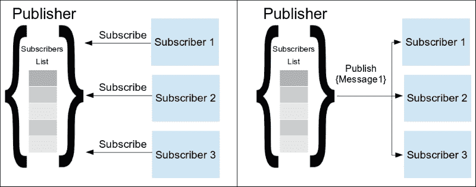
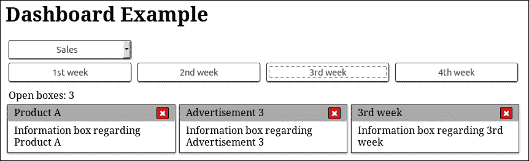

# 三、发布/订阅模式

在本章中，我们将展示发布/订阅模式，这是一种与 Observer 模式非常相似的设计模式，但具有更独特的角色，更适合于更复杂的用例。我们将看到它与观察器模式的区别，以及 jQuery 如何采用它的一些概念并将它们引入观察器模式实现。

稍后，我们将继续使用此模式重写上一章的示例。我们将利用这种模式的优点添加一些额外的特性，并减少代码与网页元素的耦合。

在本章中，我们将：

*   介绍发布/订阅模式
*   了解它与 Observer 模式的区别和优势
*   了解 jQuery 如何将其一些特性引入其方法
*   了解如何使用 jQuery 发出自定义事件
*   使用此模式重写并扩展[第 2 章](02.html#H5A42-e8d3cd3d052d4ee0b4673af57a64ddef "Chapter 2. The Observer Pattern")、*观察者模式*中的示例

# 推出发布/订阅模式

发布/订阅模式是一种消息传递模式，其中消息的发送者（称为**发布者**）将消息多播到多个接收者（称为**订户**），这些接收者表示有兴趣接收此类消息。此模式的关键概念（通常简称为 Pub/Sub 模式）是提供一种避免发布者与其订阅者之间依赖关系的方法。

这种模式的另一个概念是使用订阅者使用的**主题**，以表示他们只对特定类型的消息感兴趣。通过这种方式，发布者在发送消息之前过滤订阅者，并仅将消息分发给适当的订阅者，从而减少双方所需的通信量和工作量。



另一个常见变体是使用一个中央的、应用程序范围的对象，称为**代理**，它将发布者生成的消息转发给相关订阅者。在本例中，代理充当一个众所周知的消息处理程序来发送和订阅消息主题。这使我们能够只引用代理本身以及组件感兴趣的主题，而不是将不同的应用程序部分耦合在一起。尽管主题在该模式的第一个变体中可能不是绝对要求，但该变体在可伸缩性方面起着至关重要的作用，因为通常存在的代理（如果不是只有一个）比发布者和订阅者少得多。


通过遵循订阅方案，发布者的代码与订阅者完全解耦，这意味着发布者不必知道依赖它们的对象。因此，我们不需要向发布者硬编码应该在应用程序的不同部分上执行的每个单独操作。相反，应用程序的组件，可能还有第三方扩展，只订阅他们需要知道的主题/事件的通知。在这种分布式体系结构中，向现有应用程序添加新功能只需对其所依赖的应用程序组件进行最少的更改，甚至不需要进行任何更改。

## 它与观察者模式有何不同

最基本的区别在于，根据定义，发布/订阅模式是一种单向消息传递模式，也可以传递消息，而观察者模式只是描述如何通知观察者关于主题的特定状态更改。

此外，与观察者模式不同，带有代理的 Pub/Sub 模式为实现的不同部分生成了更松散耦合的代码。这是因为观察者需要知道他们发出事件的主体；然而，另一方面，发布者及其订阅者只需要知道所使用的代理。

# jQuery 是如何采用的

再一次，jQuery 库为我们提供了一种方便的方法来利用代码中的 Pub/Sub 模式。开发人员决定扩展`jQuery.fn.on()`和`jQuery.fn.trigger()`方法，使其具有处理和发出自定义事件的能力，而不是通过添加专门命名为“发布”和“订阅”的新方法并引入新概念来扩展其 API。通过这种方式，可以使用 jQuery 提供的已知方便方法来实现发布者/订阅者通信方案。

## jQuery 中的自定义事件

自定义事件允许我们使用几乎任何用户定义的字符串值作为公共事件，我们可以为其添加侦听器，也可以在页面元素上手动触发它。作为一个额外的但也是一个宝贵的功能，定制事件还可以携带一些额外的数据，以交付给事件的侦听器。

jQuery 库在实际添加到任何 web 规范之前添加了自己的自定义事件实现。通过这种方式，证明了在 web 开发中使用它们是多么有用。正如我们在前一章中所看到的，在 jQuery 中，实现的一个特定部分处理公共元素事件和自定义事件。`jQuery.event`对象保存与触发和侦听事件相关的所有内部实现。此外，`jQuery.Event`类是一个专用的包装器，jQuery 使用它来满足公共元素事件及其自定义事件实现的需要。

## 使用自定义事件实现发布/订阅方案

在前面的章节中，我们看到了如何使用`jQuery.fn.on()`方法在元素上添加事件侦听器。我们还看到，它的实现是使用添加的处理程序维护列表，并在需要时通知它们。此外，事件名称似乎与主题具有相同的协调目的。这种实现语义似乎也与 Pub/Sub 模式完全匹配。

`jQuery.fn.trigger()`方法实际上使用了内部`jQuery.event.trigger()`方法，用于在 jQuery 中触发事件。它遍历内部处理程序列表，并使用请求的事件以及自定义事件定义的任何额外参数执行它们。同样，这也符合发布/订阅模式的操作要求。

因此，`jQuery.fn.trigger()`和`jQuery.fn.on()`似乎与 Pub/Sub 模式的需求相匹配，可以分别代替单独的“发布”和“订阅”方法。因为它们都可以在`jQuery.fn`对象上使用，所以我们可以在任何 jQuery 对象上使用这些方法。这个 jQuery 对象将充当发布者和订阅者之间的中间实体，其方式与代理的定义完全一致。

许多 jQuery 插件也使用一种很好的常用做法，即使用保存应用程序或插件实现的最外层页面元素作为代理。另一方面，jQuery 实际上允许我们使用任何对象作为代理，因为它实际上只需要一个目标来为我们的定制事件发出一个观察。因此，我们甚至可以使用一个空对象作为代理，例如`$({})`，以防根据发布/订阅模式使用页面元素似乎过于受限或不够干净。这实际上就是 jQuery 微小的发布/订阅库所做的，以及一些方法别名，因此我们实际上使用名为“publish”和“subscribe”的方法，而不是 jQuery 的“on”和“trigger”。有关 Tiny 的更多信息，请访问其存储库页面[https://github.com/cowboy/jquery-tiny-pubsub](https://github.com/cowboy/jquery-tiny-pubsub) 。

# 演示示例用例

为了了解如何使用 Pub/Sub 模式，并便于与 Observer 模式进行比较，我们将使用此模式重写[第 2 章](02.html#H5A42-e8d3cd3d052d4ee0b4673af57a64ddef "Chapter 2. The Observer Pattern")中的仪表板示例*Observer 模式*。这也将清楚地演示此模式如何帮助我们分离实现的各个部分，并使其更具可扩展性和可伸缩性。

## 在仪表板示例中使用 Pub/Sub

对于本演示的需求，我们将使用 HTML 和 CSS 文件，就像我们在[第 2 章](02.html#H5A42-e8d3cd3d052d4ee0b4673af57a64ddef "Chapter 2. The Observer Pattern")、*观察者模式*中看到的一样。


要应用此模式，我们只需要使用新的实现更改 JavaScript 文件中的代码。在下面的代码片段中，我们可以看到代码是如何更改的，以便适应发布者/订阅者模式：

```js
$(document).ready(function() { 
 window.broker = $('.dashboardContainer'); 

    $('#categoriesSelector').change(function() { 
        var $selector = $(this); 
        var message = { categoryID: $selector.val() }; 
 broker.trigger('dashboardCategorySelect', [message]); 
    }); 

 broker.on('dashboardCategorySelect', function(event, message) { 
        var $dashboardCategories = $('.dashboardCategory'); 
        var selectedIndex = +message.categoryID; 
        var $selectedItem = $dashboardCategories.eq(selectedIndex).show(); 
        $dashboardCategories.not($selectedItem).hide(); 
    }); 

    $('.dashboardCategory').on('click', 'button', function() { 
        var $button = $(this); 
        var message = { categoryName: $button.text() }; 
 broker.trigger('categoryItemOpen', [message]); 
    }); 

 broker.on('categoryItemOpen', function(event, message) { 
        var boxHtml = '<div class="boxsizer"><article class="box">' + 
                '<header class="boxHeader">' + 
                    message.categoryName + 
                    '<button class="boxCloseButton">&#10006;' +
                    '</button>' + 
                '</header>' + 
                'Information box regarding ' + message.categoryName + 
            '</article></div>'; 
        $('.boxContainer').append(boxHtml); 
    }); 

 $('.boxContainer').on('click', '.boxCloseButton', function() { 
 var boxIndex = $(this).closest('.boxsizer').index(); 
        var message = { boxIndex: boxIndex }; 
        broker.trigger('categoryItemClose', [message]); 
    }); 

 broker.on('categoryItemClose', function(event, message) { 
        $('.boxContainer .boxsizer').eq(message.boxIndex).remove(); 
    });
}); 
```

就像在我们前面的实现中一样，我们使用`$(document).ready()`来延迟代码的执行，直到页面完全加载。首先，我们声明我们的代理并将其分配给`window`对象上的一个新变量，以便它在页面上全局可用。对于我们应用程序的代理，我们使用 jQuery 对象和我们实现的最外层容器，在我们的例子中是带有`dashboardContainer`类的`<div>`元素。

### 提示

尽管使用全局变量通常是一种反模式，但我们将代理存储到一个全局变量中，因为它是整个应用程序的一个重要同步点，并且必须适用于我们实现的每个部分，即使是存储在单独的`.js`文件中的部分。正如我们将在下一章中讨论的模块模式，可以通过将代理存储为应用程序命名空间的属性来改进前面的代码。

为了实现类别选择器，我们首先观察`change`事件的`<select>`元素。当所选类别发生更改时，我们使用一个普通 JavaScript 对象创建消息，所选的`<option>`的`value`存储在`categoryID`属性中。然后，我们在我们的代理上使用 jQuery`jQuery.fn.trigger()`方法将其发布在`dashboardCategorySelect`主题中。通过这种方式，我们从一个 UI 元素事件移动到一个包含所有必需信息的应用程序语义的消息。就在下面，在订户的代码中，我们在代理上使用`jQuery.fn.on()`方法，将`dashboardCategorySelect`主题作为参数（我们的自定义事件），就像我们侦听简单的 DOM 事件一样。然后订阅者使用收到的消息中的`categoryID`，就像我们在上一章的实现中所做的那样，来显示适当的类别项目。

按照相同的方法，我们拆分了用于在发布者和订阅者的仪表板中添加和关闭信息框的代码。出于本演示的需要，`categoryItemOpen`主题的消息只包含我们想要打开的类别的名称。但是，在从服务器检索框内容的应用程序中，我们可能会使用类别项 ID。然后，订户使用消息中的类别项名称创建并插入请求的信息框。

类似地，`categoryItemClose`主题的消息包含我们要删除的框的索引。我们的发布者使用`jQuery.fn.closest()`方法遍历 DOM 并到达`boxContainer`元素的子元素，然后使用`jQuery.fn.index()`方法在其兄弟元素中找到它的位置。然后，订阅者使用收到的消息中的`jQuery.fn.eq()`和`boxIndex`属性来过滤并仅从仪表板中删除请求的信息框。

### 提示

在更为复杂的应用程序中，我们可以使用映射对象将每个信息框元素与新检索的`jQuery.guid`相关联，而不是框索引。这将允许我们的发布者在消息中使用`guid`，而不是（与 DOM 相关的）元素索引。然后，订阅者将在映射对象中搜索该`guid`，以找到并移除相应的框。

由于我们试图演示 Pub/Sub 模式的优点，因此没有引入此实现更改以简化与 Observer 模式的比较，而是留给读者作为推荐练习。

综上所述，我们使用`dashboardCategorySelect`、`categoryItemOpen`和`categoryItemClose`主题作为应用程序级事件，以便将用户操作的处理与其来源（UI 元素）分离。因此，我们现在有了专门的可重用代码片段来操作仪表板的内容，这相当于将它们抽象为单独的函数。这允许我们以编程方式发布一系列消息，例如，我们可以删除所有现有信息框并添加当前选定类别的所有类别项。或者，更好的方法是，让仪表板显示每个类别的所有项目 10 秒钟，然后移动到下一个类别。

## 扩大实施范围

为了展示 Pub/Sub 模式带来的可伸缩性，我们将通过添加一个计数器来扩展当前示例，计数器中包含仪表板中当前打开的框数。



对于计数器实现，我们需要在页面中添加一些额外的 HTML，并创建和引用一个新的 JavaScript 文件来保存计数器实现：

```js
      ...
      </section> 
 <div style="margin-left: 5px;"> 
 Open boxes: 
 <output id="dashboardItemCounter">1</output> 
 </div> 
      <section class="boxContainer">
      ...
```

在示例的 HTML 页面中，我们需要添加一个额外的`<div>`元素来保存计数器和一些描述文本。对于我们的计数器，我们使用了一个`<output>`元素，这是一个语义 HTML5 元素，用于表示用户操作的结果。浏览器将像普通的`<span>`元素一样使用它，因此它将显示在其描述的旁边。此外，由于我们的仪表板中最初有一个打开的提示框，因此我们使用`1`作为其初始内容：

```js
$(document).ready(function() { 
 broker.on('categoryItemOpen categoryItemClose', function (event, message) { 
        var $counter = $('#dashboardItemCounter'); 
        var count = parseInt($counter.text()); 

 if (event.type === 'categoryItemOpen') { 
            $counter.text(count + 1); 
 } else if (event.type === 'categoryItemClose' && count > 0) { 
            $counter.text(count - 1); 
        }
    }); 
});
```

对于计数器实现本身，我们需要做的就是向仪表板的代理添加一个额外的订阅者，该代理对页面中加载的其他 JavaScript 文件全局可用，因为我们已将其附加到`window`对象。我们同时订阅两个主题，通过将它们传递给`jQuery.fn.on()`方法分隔的空格。紧接着，我们找到 ID 为`dashboardItemCounter`的计数器`<output>`元素，并将其文本内容解析为一个数字。为了区分我们的行为，基于消息接收到的主题，我们使用 jQuery 传递的`event`对象作为匿名函数的第一个参数，匿名函数是我们的订户。具体来说，我们使用`event`对象的`type`属性，该对象保存所接收消息的主题名称，并根据其值更改计数器的内容。

### 注

有关 jQuery 提供的事件对象的更多信息，您可以访问[http://api.jquery.com/category/events/event-object/](http://api.jquery.com/category/events/event-object/) 。

同样，我们也可以重写代码，以防止意外双击类别项目按钮。只需为`categoryItemOpen`主题添加一个额外的订户，并使用消息的`categoryName`属性来定位按下的按钮。

## 使用任何对象作为代理

在我们的示例中，我们为**代理使用了仪表板最外层的容器元素，但将`$(document)`对象用作代理也是常见的。使用应用程序的 container 元素被认为是一种良好的语义实践，它还限定了发出的事件的范围。**

 **正如我们在本章前面所描述的，jQuery 实际上允许我们使用任何对象作为代理，即使是空的。因此，我们可以为我们的代理使用`window.broker = $({});`之类的东西，以防我们更喜欢它而不是使用页面元素。

通过使用新构造的空对象，我们还可以轻松创建多个代理，以防在特定实现中首选这样的代理。此外，如果不喜欢使用集中式代理，我们可以让每个发布者成为自己的代理，从而实现更像 Pub/Sub 模式的第一个/基本变体。

因为在大多数情况下，声明的变量用于访问页面中应用程序的代理，所以上述方法之间几乎没有区别。只要选择一个更符合您团队口味的，万一您以后改变主意，您所要做的就是对`broker`变量使用不同的赋值。

# 使用自定义事件名称空间

简而言之，作为本章的结束语，我们将介绍 jQuery 为命名空间自定义事件提供的机制。事件名称空间的主要好处是，它允许我们使用更具体的事件名称，更好地描述它们的用途，同时也帮助我们避免不同实现部分和插件之间的冲突。它还提供了一种方便的方法，可以从任何目标（元素或代理）取消绑定给定命名空间的所有事件。

一个简单的示例实现如下所示：

```js
var broker = $({});
broker.on('close.dialog', function (event, message){
    console.log(event.type, event.namespace);
});
broker.trigger('close.dialog', ['messageEmitted']);
broker.off('.dialog');
// removes all event handlers of the "dialog" namespace
```

有关更多信息，您可以访问[的文档页面 http://docs.jquery.com/Namespaced_Events](http://docs.jquery.com/Namespaced_Events) 和[处的第条 https://css-tricks.com/namespaced-events-jquery/](https://css-tricks.com/namespaced-events-jquery/) 来自 CSS 技巧网站。

# 总结

在本章中，我们介绍了发布/订阅模式。我们看到了它与观察者模式的相似之处，并通过对两者的比较了解了它的好处。我们分析了发布/订阅模式提供的更独特的角色和额外特性如何使其成为更复杂用例的理想模式。我们了解了 jQuery 开发人员如何采用它的一些概念，并将它们作为自定义事件引入到他们的观察者模式实现中。最后，我们使用 Publish/Subscribe 模式重写了上一章中的示例，添加了一些额外的特性，并在应用程序的不同部分和页面元素之间实现了更大的解耦。

现在，我们已经完成了如何使用发布/订阅模式作为实现不同部分解耦的第一步的介绍，我们可以进入下一章，在这里我们将介绍模块模式。在下一章中，我们将学习如何将实现的不同部分划分为独立的模块，以及如何使用名称空间来实现更好的代码组织，并定义一个严格的 API 来实现不同模块之间的通信。**