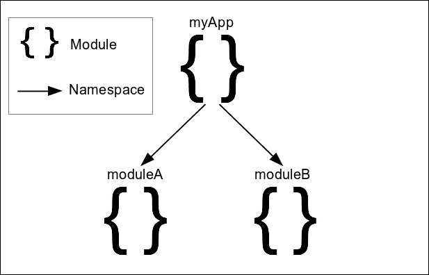
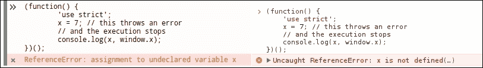
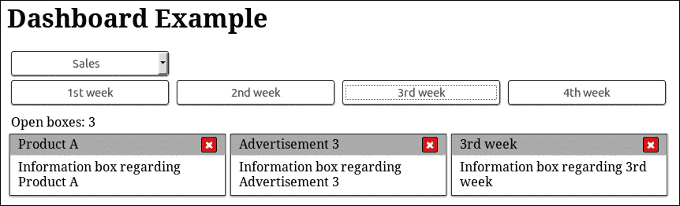

# 四、模块模式的分治

在本章中，我们将介绍模块和名称空间的概念，并了解它们如何导致更健壮的实现。我们将展示如何在应用程序中使用这些设计原则，通过演示一些最常用的开发模式，用 JavaScript 创建**模块**。

在本章中，我们将：

*   回顾模块和名称空间的概念
*   介绍对象文字模式
*   介绍模块模式及其变体
*   介绍显示模块模式及其变体
*   深入了解 ES5 严格模式和 ES6 模块
*   解释如何使用模块并使 jQuery 应用程序受益

# 模块和名称空间

本章的两个主要实践是模块和名称空间，它们共同用于构建和组织我们的代码。我们将首先分析模块的主要概念，即代码封装，然后，我们将继续讨论名称空间，它用于逻辑组织实现。

## 封装实现的内部部分

在开发一个大型而复杂的 web 应用程序时，对定义良好的结构化体系结构的需求从一开始就变得非常明确。为了避免创建一个意大利面条式的代码实现，即代码的不同部分以混乱的方式相互调用，我们必须将应用程序拆分为小的、自包含的部分。

这些自包含的段代码可以定义为**模块**。为了记录这一架构原则，**计算机科学**定义了概念，如**关注点分离**，其中每个模块的角色、操作和公开的 API 应严格定义，并专注于为特定问题提供通用解决方案。

### 注

有关**封装**和**关注点分离**的更多信息，您可以访问[https://developer.mozilla.org/en-US/docs/Glossary/Encapsulation](https://developer.mozilla.org/en-US/docs/Glossary/Encapsulation) 和[http://aspiringcraftsman.com/2008/01/03/art-of-separation-of-concerns/](http://aspiringcraftsman.com/2008/01/03/art-of-separation-of-concerns/) 。

## 使用名称空间避免全局变量

在 JavaScript 中，`window`对象是也称为**全局名称空间**，默认情况下会附加每个声明的变量和函数标识符。**名称空间**可以定义为命名上下文，其中每个标识符必须是唯一的。**名称空间**的主要概念是提供一种方法，以逻辑方式将应用程序的一个独立部分的所有相关部分进行分组。换句话说，它建议我们创建具有相关函数和变量的组，并使它们可以在相同的总括标识符下访问。这有助于避免应用程序的不同部分与使用的其他 JavaScript 库之间的命名冲突，因为我们只需要在每个不同的名称空间下保持所有标识符的唯一性。

名称空间的一个很好的例子是 JavaScript 提供的数学函数和常量，它们被分组在名为`Math`的内置 JavaScript 对象下。由于 JavaScript 提供了 40 多个简短命名的数学标识符，如`E`、`PI`和`floor()`，为了避免命名冲突并将它们分组在一起，它的设计目的是使它们可以作为`Math`对象的属性访问，该对象充当此内置库的名称空间。

如果没有适当的名称空间，每个函数和变量都需要在整个应用程序中唯一命名，不同应用程序部分的标识符之间甚至与应用程序使用的第三方库的标识符之间可能会发生冲突。最后，虽然模块提供了一种隔离应用程序每个独立部分的方法，但名称空间提供了一种根据应用程序的体系结构构造不同模块的方法。

## 这些模式的好处

基于模块和名称空间设计一个应用程序体系结构，可以实现更好的代码组织和清晰分离的部分。在这样的体系结构中，模块用于将实现中相关的部分组合在一起，而名称空间将它们相互连接以创建应用程序结构。



该体系结构有助于协调大型开发团队，使独立部分的实现能够并行进行。它还可以缩短向现有实现中添加新功能所需的开发时间。这是因为使用的现有代码片段可以很容易地定位，并且添加的实现与现有代码冲突的可能性较小。

生成的代码结构不仅被清晰地分开，而且由于每个模块都是为实现一个目标而设计的，因此它也很有可能被用于其他类似的应用程序中。另外一个好处是，由于每个模块的角色都是严格定义的，因此在大型代码库中跟踪 bug 的来源也变得更加容易。

## 广泛接受

社区和企业界都意识到，为了让大型前端应用程序能够用 JavaScript 编写，他们应该在实现的每一部分都包含一套最佳实践。

JavaScript 实现中模块和名称空间的接受和采用在社区和企业发布的最佳实践和编码风格指南中是显而易见的。

例如，谷歌的 JavaScript 风格指南（可在[上找到）https://google.github.io/styleguide/javascriptguide.xml#Naming](https://google.github.io/styleguide/javascriptguide.xml#Naming) 描述并建议在我们的实现中采用名称空间：

> 始终使用与项目或库相关的唯一伪命名空间为全局范围中的标识符添加前缀。

此外，jQuery JavaScript 风格指南（可在[上找到）https://contribute.jquery.org/style-guide/js/#global-变量](https://contribute.jquery.org/style-guide/js/#global-variables)建议使用全局变量，以便：

> 每个项目最多可以公开一个全局变量。

另一个在开发者社区中被接受的例子来自 Mozilla 开发者网络。其面向对象 JavaScript 指南（可在[上找到）https://developer.mozilla.org/en-US/docs/Web/JavaScript/Introduction_to_Object-Oriented_JavaScript#Namespace](https://developer.mozilla.org/en-US/docs/Web/JavaScript/Introduction_to_Object-Oriented_JavaScript#Namespace) 还建议使用名称空间，将应用程序的实现封装在一个公开变量下，使用如下简单的方法：

```js
// global namespace
var MYAPP = MYAPP || {};
```

# 对象文字模式

对象文字模式可能是将实现的所有相关部分封装在作为模块工作的伞形对象下的最简单方法。此模式的名称准确地描述了其使用方式。开发人员只需要声明一个变量并分配一个对象，该对象包含需要封装到此模块中的所有相关部分。

让我们看看如何创建一个模块，为页面提供唯一的整数，`jquery.guid`是如何实现的：

```js
var simpleguid = { 
  guid: 1, 
  init: function() { 
    this.guid = 1; 
  }, 
  increaseCounter: function() { 
    this.guid++; 
    // or simpleguid.guid++;
  }, 
  getNext: function() { 
    var nextGuid = this.guid; 
    this.increaseCounter(); 
    return nextGuid; 
  } 
};
```

如上所述，为了采用此模式，您可以遵循的一个简单规则是定义每个实现需要的所有变量和函数作为对象的属性。我们的代码是可重用的，并且不会污染全局名称空间，除了在本例中为我们的模块`simpleguid`定义一个变量名之外。

我们可以在内部访问模块属性，可以使用`this`关键字，如`this.guid`，也可以使用模块全名，如`simpleguid.guid`。为了在代码中使用上述模块，我们只需要使用其名称访问其属性。例如，调用`simpleguid.getNext()`方法将在下一个订单数字 guid 返回到我们的代码，并通过增加内部计数器来更改模块的状态。

这种模式的一个缺点是它不能为模块的内部部件提供任何隐私。模块的所有内部部分都可以被访问，并且可以被外部代码覆盖，尽管我们理想情况下更倾向于只公开`simpleguid.init()`和`simpleguid.getNext()`方法。有几种命名约定描述了在仅供内部使用的属性名称前加下划线（389;）的情况，但从技术上讲，这并不能解决这一缺点。

另一个缺点是，使用对象文字编写大型模块很容易变得疲劳。的确，JavaScript 开发人员习惯于用分号（`;`）结束变量和函数定义，并且尝试在每个属性之后使用逗号（`,`）编写大模块很容易导致语法错误。

尽管这种模式使得为模块声明嵌套的名称空间变得容易，但在需要多个嵌套级别的情况下，它也会导致可读性差的大型代码结构。例如，让我们来看看下面的一个 ToDo 应用程序的框架：

```js
var myTodoApp = { 
  todos: [], 
  addTodo: function(todo) { this.todos.push(todo); }, 
  getTodos: function() { return this.todos; }, 
  updateTodo: function(todo) { /*...*/ },
  imports: { 
    fromGDrive: function() { /*...*/ }, 
    fromUrl: function() { /*...*/ }, 
    fromText: function() { /*...*/ } 
  }, 
  exports: { 
    gDrivePublicKey: '#wnanqAASnsmkkw',
    toGDrive: function() { /*...*/ }, 
    toFile: function() { /*...*/ }, 
  }, 
  share: { 
    toTwitter: function(todo) { /*...*/ } 
  }
};
```

幸运的是，通过将对象文本拆分为每个子模块的多个赋值（最好是不同的文件），可以轻松解决此问题，如下所示：

```js
var myTodoApp = { 
  todos: [], 
  addTodo: function(todo) { this.todos.push(todo); }, 
  getTodos: function() { return this.todos; }, 
  updateTodo: function(todo) { /*...*/ },
};
/* … */
myTodoApp.exports = { 
  gDrivePublicKey: '#wnanqAASnsmkkw', 
  toGDrive: function() { /*...*/ }, 
  toFile: function() { /*...*/ }, 
};
/*...*/
```

# 模块模式

基本模块模式的关键概念是通过一个众所周知的变量名提供一个简单的函数、类或对象，供应用程序的其余部分使用。通过隐藏实现中不需要公开的部分，它使我们能够为模块提供最小的 API。这样，我们还可以避免使用模块内部使用所需的变量和实用程序函数污染全局名称空间。

## 生命的积木

在本小节中，我们将对 IIFE 设计模式进行一个小的介绍，因为它是我们将在本章中看到的模块模式的所有变体的一个组成部分。**立即调用的函数表达式**（**IIFE**）是 JavaScript 开发人员中非常常用的设计模式，因为它以干净的方式隔离代码块。在模块模式中，IIFE 用于包装所有实现，以避免污染全局名称空间，并为模块本身的声明提供隐私。

每个 IIFE 创建一个闭包，其中包含声明的变量和函数。创建的闭包使 IIFE 的公开函数能够保留对其环境的其余声明的引用，并在从实现的其他部分执行时正常访问这些声明。因此，IIFE 的非公开声明不会泄漏到它的外部，而是保持私有状态，并且只能由作为所创建闭包一部分的函数访问。

### 注

有关 IIFE 和闭包的更多信息，您可以访问[https://developer.mozilla.org/en-US/docs/Glossary/IIFE](https://developer.mozilla.org/en-US/docs/Glossary/IIFE) 和[https://developer.mozilla.org/en-US/docs/Web/JavaScript/Closures](https://developer.mozilla.org/en-US/docs/Web/JavaScript/Closures) 。

IIFE 最常用的方法如下：

```js
(function() { 
  var x = 7; 
  console.log(x); 
  // prints 7 
})(); 
```

由于前面的代码构造乍一看可能很奇怪，让我们看看它是由哪些部分组成的。IIFE 几乎等同于声明匿名函数，将其分配给变量，然后执行它，如以下代码所示：

```js
var tmp = function() { 
  var x = 7; 
  console.log(x); 
}; 

tmp(); 
// or 
(tmp)(); 
```

在前面的代码中，我们定义了一个函数表达式，并使用`tmp()`执行它。因为在 JavaScript 中，我们可以在标识符周围使用括号而不改变其含义，所以我们还可以使用`(tmp)();`执行存储的函数。为了将前面的代码转换为 IIFE，最后一步是用实际的匿名函数声明替换`tmp`变量。

正如我们前面看到的，唯一的区别是，对于 IIFE，我们确实需要声明一个变量来保存函数本身。我们只创建一个匿名函数，并在定义它之后立即调用它。

由于 IIFE 的创建可以通过多种方式实现，这可能看起来像是对 JavaScript 规则的练习，JavaScript 开发人员社区总结了上述代码结构，作为此模式的参考点。这种创建 IIFE 的方法被认为具有更好的可读性，并且被大型库使用，由于采用了这种方法，开发人员可以在大型 JavaScript 实现中轻松识别它。

创建 IIFE 的不太广泛使用的方法的一个例子是以下代码结构：

```js
(function() { 
  // code 
}());
```

## 简单的生命模块模式

由于此模式没有实际名称，因此可以通过定义的模块返回单个实体来识别。为了参考如何使用此模式创建可重用库，我们将重写前面看到的`simpleguid`模块。由此产生的实现将如下所示：

```js
var simpleguid = (function() { 
  var simpleguid = {}; 
  var guid; 

  simpleguid.init = function() { 
    guid = 1; 
  }; 

  simpleguid.increaseCounter = function() { 
    guid++; 
  }; 

  simpleguid.getNext = function() { 
    var nextGuid = guid; 
    this.increaseCounter(); 
    return nextGuid; 
  }; 

  simpleguid.init(); 

  return simpleguid;
})(); 
```

此模式使用 IIFE 定义一个对象，该对象充当模块容器，将属性附加到该对象，然后返回该对象。前面代码第一行中的变量`simpleguid`用作模块的名称空间，并被分配 IIFE 返回的值。在返回对象上定义的方法和属性是模块的唯一公开部分，并构成其公共 API。

同样，这个模式允许我们使用`this`关键字，以便访问我们模块的公开方法和属性。此外，它还提供了在完成模块定义之前执行任何所需初始化代码的灵活性。

与**对象文字模式**不同，**模块模式**允许我们在模块中创建实际的私有成员。在 IIFE 中声明的变量，如`guid`变量，没有附加到返回值，充当私有成员，只能由创建闭包的其余成员在模块内部访问。

最后，如果我们需要定义一个嵌套的名称空间，我们所要做的就是更改 IIFE 返回的值的赋值。作为一个由子模块构成的应用程序示例，让我们看看如何为前面看到的 Todo 应用程序框架定义导出子模块：

```js
var myTodoApp = (function() { 
  var myTodoApp = {}; 

  var todos = []; 

  myTodoApp.addTodo = function(todo) { 
    todos.push(todo); 
  };

  myTodoApp.getTodos = function() { 
    return todos; 
  };

  return myTodoApp; 
})(); 

myTodoApp.exports = (function() { 
  var exports = {}; 

  var gDrivePublicKey = '#wnanqAASnsmkkw'; 

  exports.toGDrive = function() { /*...*/ }; 

  exports.toFile = function() { /*...*/ }; 

  return exports; 
})();
```

鉴于我们的应用程序的名称空间`myTodoApp`已经在前面定义，`exports`子模块可以定义为它的一个简单属性。遵循的一个良好实践是为上述每个模块创建一个文件，使用 IIFE 作为划分代码的标志。Google 的 JavaScript 风格指南也建议使用一种广泛使用的命名约定，即对文件使用小写命名，并在单独的子模块中添加破折号。例如，通过遵循此命名约定，前面的代码应该分别在两个名为`mytodoapp.js`和`mytodoapp-exports.js`的文件中为每个模块定义。

### jQuery 如何使用

jQuery 本身使用了**模块****模式**，以便将驱动`$()`功能的 CSS 选择器引擎（**Sizzle**的源代码与 jQuery 源代码的其余部分隔离开来。从一开始，Sizzle 就是 jQuery 源代码的一大部分，目前约有 2135 行代码；自 2009 年以来，它已被拆分为一个名为 Sizzle 的单独项目，因此它更易于维护、独立开发，并可被其他库重用：

```js
var Sizzle = (function(window) { 

  /* 179 lines of code */ 

  function Sizzle(selector, context, results, seed) { 
    /* 131 lines of code */ 
  } 

  /* 
    1804 lines of code , defining methods like: 
    Sizzle.attr 
    Sizzle.compile 
    Sizzle.contains 
    Sizzle.getText 
    Sizzle.matches 
    Sizzle.matchesSelector 
    Sizzle.select 
  */ 

  return Sizzle; 

})(window); 

jQuery.find = Sizzle; 
```

**Sizzle**被添加到 IIFE 中 jQuery 的源代码中，而其主要功能被返回并分配给`jQuery.find`使用。

### 注

有关 Sizzle 的更多信息，您可以访问[https://github.com/jquery/sizzle](https://github.com/jquery/sizzle) 。

## 名称空间参数模块变量

在此变体中，我们创建名称空间并将其作为参数传递给 IIFE 本身，而不是从 IIFE 返回对象，然后将其分配给充当模块名称空间的变量：

```js
(function(simpleguid) { 
  var guid; 

  simpleguid.init = function() { 
    guid = 1; 
  }; 

  simpleguid.increaseCounter = function() { 
    guid++; 
  };

  simpleguid.getNext = function() { 
    var nextGuid = guid; 
    this.increaseCounter(); 
    return nextGuid; 
  }; 

  simpleguid.init(); 
})(window.simpleguid = window.simpleguid || {});
```

模块定义的最后一行测试模块是否已经定义；如果不是，则将其初始化为空对象文本，并将其分配给全局对象（`window`。在任何情况下，IIFE 第一行中的`simpleguid`参数都将保存模块的名称空间。

### 注

上述表达式几乎等同于书写：

```js
window.simpleguid = window.simpleguid !== undefined ? window.simpleguid : {};
```

使用逻辑 OR 运算符（`||`）使表达式更短，可读性更强。此外，这是一种大多数 web 开发人员都已学会容易识别的模式，并且出现在许多开发模式和最佳实践中。

同样，这个模式允许我们使用`this`关键字从模块的导出方法中访问公共成员。同时，它允许我们保持一些函数和变量的私有性，只有模块的其他函数才能访问这些函数和变量。

尽管将每个模块定义为自己的 JS 文件被认为是一种很好的做法，但这种变体也允许我们将大型模块的实现拆分为多个文件。这个好处来自于在将模块初始化为空对象之前检查模块是否已经定义。这在某些情况下可能很有用，唯一的限制是模块的每个部分文件都可以访问在其自己的 IIFE 中定义的私有成员。

此外，为了避免重复，我们可以使用一个更简单的标识符作为 IIFE 的参数，并按如下方式编写我们的模块：

```js
(function(namespace) { 
  /* … */

  namespace.getNext = function() { 
    var nextGuid = guid; 
    this.increaseCounter(); 
    return nextGuid; 
  }; 

  namespace.init(); 
})(window.simpleguid = window.simpleguid || {});
```

当涉及到具有嵌套名称空间的应用程序时，这种模式可能开始让人感到有点不舒服。对于我们定义的每一个额外级别的嵌套名称空间，模块定义的最后一行将开始变长。例如，让我们看看 Todo 应用程序的`exports`子模块的外观：

```js
(function(exports) { 
  var gDrivePublicKey = '#wnanqAASnsmkkw'; 

  exports.toGDrive = function() { /*...*/ }; 

  exports.toFile = function() { /*...*/ }; 

})(myTodoApp.exports = myTodoApp.exports || {}); 
```

如您所见，嵌套名称空间的每个额外级别都需要添加到作为参数传递给 IIFE 的赋值的两侧。对于具有导致多级嵌套名称空间的复杂功能的应用程序，这可能导致模块定义如下所示：

```js
(function(smallModule) { 

  smallModule.method = function() { /*...*/ }; 

  return smallModule; 
})(myApp.bigFeature.featurePart.smallModule = myApp.bigFeature.featurePart.smallModule || {}); 
```

此外，如果我们想提供与原始代码示例中相同的安全保证，那么我们需要为每个命名空间级别添加类似的安全检查。考虑到这一点，我们前面看到的 Todo 应用程序的`exports`模块需要具有以下形式：

```js
(function(exports) { 
  var gDrivePublicKey = '#wnanqAASnsmkkw'; 

  exports.toGDrive = function() { /*...*/ }; 

  exports.toFile = function() { /*...*/ }; 

})((window.myTodoApp = window.myTodoApp || {}, myTodoApp.exports = myTodoApp.exports || {})); 
```

如前面的代码所示，我们使用逗号运算符（`,`分隔每个名称空间存在性检查，并将整个表达式包装在一对额外的括号中，以便将整个表达式用作 IIFE 的第一个参数。使用逗号运算符（`,`连接表达式将使表达式按顺序求值，并将最后求值表达式的结果作为 IIFE 的参数传递，该结果将用作模块的命名空间。请记住，对于每个额外的嵌套命名空间级别，我们需要使用逗号运算符（`,`添加额外的存在性检查表达式。

这种模式的一个缺点是，模块的名称空间定义位于文件的末尾，特别是用于嵌套名称空间时。尽管强烈建议命名 JS 文件，以便它们正确地表示它们包含的模块，例如，`mytodoapp.exports.js`；在文件顶部没有名称空间有时会产生反作用或误导。解决这个问题的一个简单方法是在 IIFE 之前定义名称空间，然后将其作为参数传递。例如，前面使用此技术的代码将转换为如下内容：

```js
window.myTodoApp = window.myTodoApp || {}; 
myTodoApp.exports = myTodoApp.exports || {}; 

(function(exports) { 
  var gDrivePublicKey = '#wnanqAASnsmkkw'; 

  exports.toGDrive = function() { /*...*/ }; 

  exports.toFile = function() { /*...*/ }; 

})(myTodoApp.exports); 
```

## IIFE 包含模块变量

与前面的模块模式变体一样，此变体实际上没有特定的变体名称，但通过代码的结构方式可以识别。此变体的关键概念是将所有模块代码移动到 IIFE 中：

```js
(function() { 

  window.simpleguid = window.simpleguid || {}; 

  var guid; 

  simpleguid.init = function() { 
    guid = 1; 
  }; 

  simpleguid.increaseCounter = function() { 
    guid++; 
  }; 

  simpleguid.getNext = function() { 
    var nextGuid = guid; 
    this.increaseCounter(); 
    return nextGuid; 
  }; 

  simpleguid.init(); 
})(); 
```

此变体与前一个变体非常相似，主要不同之处在于创建名称空间的方式。首先，它将名称空间检查和初始化保持在模块顶部附近，就像标题一样，使代码更具可读性，而不管我们是否为模块使用单独的文件。与模块模式的其他变体一样，它支持模块的私有成员，还允许我们使用`this`关键字访问公共方法和属性，使代码看起来更面向对象。

关于嵌套名称空间的实现，Todo 应用程序框架的`exports`子模块的代码结构如下所示：

```js
(function() { 
  window.myTodoApp = window.myTodoApp || {}; 
  myTodoApp.exports = myTodoApp.exports || {}; 

  var gDrivePublicKey = '#wnanqAASnsmkkw'; 

  myTodoApp.exports.toGDrive = function() { /*...*/ }; 

  myTodoApp.exports.toFile = function() { /*...*/ }; 

})();
```

正如在前面的代码中所看到的，我们还借用了前一个变体中的名称空间定义检查，同样地，将其应用于嵌套名称空间的每个级别。尽管这不是绝对必要的，但它带来了我们前面讨论过的好处，例如使我们能够将模块定义拆分为多个文件，甚至在应用程序模块的导入顺序方面实现了更容错的实现。

# 显示模块模式

**显示模块模式**是**模块模式**的变体，具有一个众所周知且广为认可的名称。此模式的特殊之处在于它结合了**对象文字模式**和**模块模式**的最佳部分。模块的所有成员都在 IIFE 中声明，IIFE 最终返回一个仅包含模块公共成员的**对象文字**，并分配给充当我们名称空间的变量：

```js
var simpleguid = (function() { 
  var guid = 1; 

  function init() { 
    guid = 1; 
  } 

  function increaseCounter() { 
    guid++; 
  } 

  function getNext() { 
    var nextGuid = guid; 
    increaseCounter(); 
    return nextGuid; 
  } 

  return { 
    init: init, 
    getNext: getNext 
  }; 
})(); 
```

这种模式区别于其他变体的一个主要好处是，它允许我们在 IIFE 中编写模块的所有代码，就像我们在**全局名称空间**上声明代码一样。此外，此模式不需要对公共和私有成员的声明方式进行任何更改，从而使模块的代码看起来是统一的。

由于返回的对象文本定义了模块的公共可用成员，因此它也是检查其公共 API 的方便方法，即使它是由其他人编写的。此外，如果我们需要在模块的 API 上公开一个私有方法，我们所需要做的就是向返回的对象文本添加一个额外的属性，而不更改其定义的任何部分。此外，使用对象文字使我们能够更改模块 API 的公开标识符，而无需更改模块实现内部使用的名称。

即使不能清楚地看到，`this`关键字也可以用于模块的公共成员之间的通话。不幸的是，这种模式不鼓励使用`this`关键字*，因为它破坏了函数声明的一致性，并且很容易导致错误，特别是在将公共方法的可见性更改为私有时。*

由于名称空间定义保留在 IIFE 主体之外，因此此模式将名称空间定义与模块的实际实现明确分开。使用此模式在嵌套命名空间中定义模块不会影响模块的实现，这在任何时候都不会与顶级命名空间模块有所不同。使用此模式重写 Todo 框架应用程序的`exports`子模块将使其如下所示：

```js
myTodoApp.exports = (function() { 
  var gDrivePublicKey = '#wnanqAASnsmkkw'; 

  function toGDrive() { /*...*/ } 

  function toFile() { /*...*/ } 

  return { 
    toGDrive: toGDrive, 
    toFile: toFile 
  }; 
})();
```

由于这种分离，我们的代码重复更少，我们可以轻松地更改模块的名称空间，而不会影响其实现。

# 使用 ES5 严格模式

除了所有使用 IIFEs 作为基本构建块的模块模式之外，还有一个小而宝贵的补充，就是使用**严格模式**执行 JavaScript。这在第五版 JavaScript 中是标准化的，是一种语义稍有不同的选择性加入执行模式，目的是防止 JavaScript 的一些常见缺陷，但也要考虑向后兼容性。

在此模式下，JavaScript 运行时引擎将防止您意外创建全局变量并污染全局命名空间。即使在不太大的应用程序中，在初始赋值变量之前的`var`声明也很可能丢失，从而自动将其升级为全局变量。为了避免这种情况，如果向未声明的变量发出赋值，strict 模式将抛出错误。下图显示了 Firefox 和 Chrome 在发生严格模式冲突时抛出的错误。



此模式可以通过在任何其他语句之前添加`"use strict";`或`'use strict';`语句来启用。尽管这可以在全局范围内启用，但强烈建议您仅在函数范围内启用它。在全局范围内启用它可能会使非严格模式兼容的第三方库停止工作或行为不当。另一方面，启用严格模式的最佳位置是在模块的 IIFE 内。严格模式将递归地应用于该 IIFE 的所有嵌套名称空间、方法和函数。

### 注

有关 JavaScript 严格执行模式的更多信息，请访问[https://developer.mozilla.org/en-US/docs/Web/JavaScript/Reference/Strict_mode](https://developer.mozilla.org/en-US/docs/Web/JavaScript/Reference/Strict_mode) 。

# ES6 模块介绍

尽管 JavaScript 最初没有像其他编程语言那样的内置打包和名称空间支持，但 web 开发人员为此定义并采用了一些设计模式，填补了这一空白。这些软件开发实践解决了 JavaScript 缺少的功能，并允许在一种编程语言上实现复杂应用程序的大型可扩展实现，而几年前这种语言主要用于表单验证。

直到 2015 年 6 月，第 6 版 JavaScript（通常称为 ES6）作为标准发布，并引入模块概念作为语言的一部分。

### 注

ES6 是 ECMAScript 第 6 版的缩写，也称为 Harmony 或 ECMAScript 2015，其中 ECMAScript 是用于 JavaScript 标准化过程的术语。该规范可在[中找到 http://www.ecma-international.org/ecma-262/6.0/index.html#sec-模块](http://www.ecma-international.org/ecma-262/6.0/index.html#sec-modules)。

作为 ES6 模块的一个示例，我们将看到`simpleguid`模块可以采用的多种方式之一：

```js
var es6simpleguid = {}; 
export default es6simpleguid; 

var guid; 

es6simpleguid.init = function() { 
  guid = 1; 
}; 

es6simpleguid.increaseCounter = function() { 
  guid++; 
}; 

es6simpleguid.getNext = function() { 
  var nextGuid = guid; 
  this.increaseCounter(); 
  return nextGuid; 
}; 

es6simpleguid.init();
```

如果我们将其保存为名为`es6simpleguid.js`的文件，则只需编写以下代码即可将其导入并在其他文件中使用：

```js
import es6simpleguid from 'es6simpleguid'; 
console.log(es6simpleguid.getNext());
```

由于**ES6 模块**在默认情况下处于严格模式，因此今天使用启用严格模式的首选模块模式变体编写模块将使您更容易过渡到 ES6 模块。上面的一些模式需要很少的更改来实现这一点。例如，在包含 IIFE 的模块模式变量中，只需删除 IIFE 和`"use strict";`语句，用变量替换模块名称空间的创建，并在其上使用`export`关键字。

不幸的是，在撰写本书时，没有一款浏览器 100%支持 ES6 模块。因此，需要将 ES6 传输到 ES5 的特殊加载程序或工具，以便我们可以开始使用 ES6 的新特性编写代码。

### 注

有关更多信息，您可以访问位于[的 ES6 模块加载器文档页面 https://github.com/ModuleLoader/es6-module-loader](https://github.com/ModuleLoader/es6-module-loader) 和[处的巴贝尔 transpiler（早期称为 ES6toES5】http://babeljs.io/](http://babeljs.io/) 。

# 在 jQuery 应用程序中使用模块

为了演示模块模式如何产生更好的应用程序结构，我们将重新实现前面章节中看到的仪表板示例。我们将包括迄今为止我们所看到的所有功能，包括打开的信息框的计数器。使用的 HTML 和 CSS 代码与前一章中的代码完全相同，因此，我们的仪表板看起来与之前完全相同：



在本演示中，我们将使用包含简单 IIFE 的模块变量将 JavaScript 代码重构为四个小模块。`dashboard`模块将作为代码执行的主要入口，也是仪表板应用程序的中心协调点。`categories`子模块将负责实现我们仪表板的上半部分。这包括类别选择、适当按钮的显示以及按钮点击的处理。`informationBox`子模块将负责我们仪表板的主要部分。它将提供从仪表板中创建和删除信息框的方法。最后，计数器子模块将负责保持字段和当前打开的信息框的数量保持最新，以响应用户操作。

为了支持这种多模块体系结构，我们需要对页面的 HTML 进行一次更改，但仅限于包含 JavaScript 文件的方式：

```js
<script type="text/javascript" src="jquery.js"></script>
<script type="text/javascript" src="dashboard.js"></script>
<script type="text/javascript" src="dashboard.categories.js"></script> <script type="text/javascript" src="dashboard.informationbox.js">
</script>
<script type="text/javascript" src="dashboard.counter.js"></script>
```

### 提示

即使这种多文件结构使开发和调试过程更加容易，建议我们在将应用程序移动到生产环境之前合并所有这些文件。有几种专门用于这项工作的工具；例如，非常简单有效的 grunt contrib concat 项目，可从[获得 https://github.com/gruntjs/grunt-contrib-concat](https://github.com/gruntjs/grunt-contrib-concat) 。

## 主仪表板模块

`dashboard`模块的结果代码如下所示：

```js
(function() { 
    'use strict'; 

    window.dashboard = window.dashboard || {};

    dashboard.$container = null; 

    dashboard.init = function() { 
        dashboard.$container = $('.dashboardContainer'); 

        dashboard.categories.init(); 
        dashboard.informationBox.init(); 
        dashboard.counter.init(); 
    }; 

    $(document).ready(dashboard.init);
})(); 
```

正如我们已经提到的，`dashboard`模块将是我们应用程序的中心点。因为这是应用程序执行的起点，所以它的主要职责是为它自己和每个子模块执行所有必需的初始化。`init()`方法的调用被包装在`$(document).ready()`方法的调用中，因此它的执行被延迟，直到页面的 DOM 树完全加载。

需要注意的一点是，在初始化过程中，我们进行 DOM 遍历，以找到仪表板的容器元素，并将其存储到名为`$container`的模块的公共属性中。仪表板中需要访问 DOM 树的所有方法都将使用此元素，以便在容器元素中确定其代码的范围，从而消除了使用复杂选择器不断遍历整个 DOM 树的需要。保留对关键 DOM 元素的引用并在不同的子模块中重用它们，可以使应用程序更快速，还可以减少意外干扰页面其余部分的机会；因此，导致更少的 bug，也更容易解决。

### 提示

**缓存元素，但避免内存泄漏。**

请记住，维护对不断添加和从页面中删除的 DOM 元素的引用会给应用程序增加额外的复杂性。这甚至可能导致内存泄漏，以防我们意外地保留对已从页面中删除的元素的引用。对于这样的元素，例如信息框，对在上触发的事件进行委托处理，并在需要时进行范围 DOM 遍历，以便检索具有元素新引用的 jQuery 对象，可能更安全、更有效。

## 类别模块

让我们继续与`categories`子模块：

```js
(function() { 
    'use strict'; 

    dashboard.categories = dashboard.categories || {}; 

    dashboard.categories.init = function() { 
        dashboard.$container.find('#categoriesSelector').change(function() { 
            var $selector = $(this); 
            var categoryIndex = +$selector.val(); 
            dashboard.categories.selectCategory(categoryIndex); 
        }); 

        dashboard.$container.find('.dashboardCategories').on('click', 'button', function() { 
            var $button = $(this); 
            var itemName = $button.text(); 
            dashboard.informationBox.openNew(itemName); 
        }); 
    }; 

    dashboard.categories.selectCategory = function(categoryIndex) { 
        var $dashboardCategories = dashboard.$container.find('.dashboardCategory'); 
        var $selectedItem = $dashboardCategories.eq(categoryIndex).show(); 
        $dashboardCategories.not($selectedItem).hide(); 
    }; 
})(); 
```

此子模块的初始化方法使用对主模块提供的`$container`元素的引用，并向页面添加两个观察者。第一个处理`<select>`类别上的`change`事件，并使用所选类别的数值调用`selectCategory()`方法。然后，该子模块的`selectCategory()`方法将处理显示适当的类别项，将其与事件处理代码分离，并使其成为可供整个应用程序使用的可重用功能。

紧接着，我们创建了一个**委托事件观察者**，处理`<button>`类别项上的`click`事件。它提取按下的`<button>`的文本，并调用包含所有与信息框相关的实现的`informationBox`子模块的`openNew()`方法。在非演示级应用程序中，此类方法的参数可能是标识符，而不是用于从远程服务器检索更多详细信息的文本值。

## 信息盒模块

包含与我们仪表板主区域相关的实现部分的`informationBox`子模块有如下形式：

```js
(function() { 
    'use strict'; 

    dashboard.informationBox = dashboard.informationBox || {}; 

    var $boxContainer = null; 

    dashboard.informationBox.init = function() { 
        $boxContainer = dashboard.$container.find('.boxContainer'); 

        $boxContainer.on('click', '.boxCloseButton', function() { 
            var $button = $(this); 
            dashboard.informationBox.close($button); 
        }); 
    }; 

    dashboard.informationBox.openNew = function(itemName) { 
        var boxHtml = '<div class="boxsizer"><article class="box">' + 
                '<header class="boxHeader">' + 
                    itemName + 
                    '<button class="boxCloseButton">&#10006;' + 
                    '</button>'+ 
                '</header>' + 
                'Information box regarding ' + itemName + 
            '</article></div>'; 
        $boxContainer.append(boxHtml); 
    }; 

    dashboard.informationBox.close = function($boxElement) { 
        $boxElement.closest('.boxsizer').remove();
    }; 

})();
```

此子模块的初始化代码所做的第一件事是检索并存储容器的引用，该容器保存`$boxContainer`变量的信息框，使用仪表板的`$container`属性进行范围界定。

`openNew()`方法负责创建新信息框所需的 HTML，并使用`$boxContainer`变量将其添加到仪表板中，该变量的作用类似于模块的私有成员，用于缓存先前分配的 DOM 元素的引用。这是一个可以提高应用程序性能的良好实践，因为存储的元素从未从页面中删除，而是在初始化和模块的`openNew()`方法期间使用。这样，我们就不再需要在每次调用`openNew()`方法时执行缓慢的 DOM 遍历。

另一方面，`close()`方法负责从仪表板上删除现有的信息框。它接收一个 jQuery 复合集合对象作为与目标信息框相关的参数，该参数基于`$.fn.closest()`方法的工作方式，可以是框元素容器或其任何子体。

### 提示

方法的实现提供了调用方法的灵活性，可以让大型应用程序的更多部分使用这些方法。此方法的下一个逻辑步骤（留给读者作为练习）是使其接受为需要关闭的信息框的参数、索引或标识符。

## 计数器模块

最后，这里是如何重写`counter`实现，我们在上一章中看到，它是一个独立的子模块：

```js
(function() { 
    'use strict'; 

    dashboard.counter = dashboard.counter || {}; 

    var dashboardItemCounter; 
    var $counter; 

    dashboard.counter.init = function() { 
        $counter = $('#dashboardItemCounter'); 

        var $boxContainer = dashboard.$container.find('.boxContainer'); 
        var initialCount = $boxContainer.find('.boxsizer').length; 
        dashboard.counter.setValue(initialCount); 

        dashboard.$container.find('.dashboardCategories').on('click', 'button', function() { 
            dashboard.counter.setValue(dashboardItemCounter + 1); 
        }); 

        $boxContainer.on('click', '.boxCloseButton', function() { 
            dashboard.counter.setValue(dashboardItemCounter - 1); 
        }); 
    }; 

    dashboard.counter.setValue = function (value) { 
        dashboardItemCounter = value; 
        $counter.text(dashboardItemCounter); 
    }; 

})(); 
```

对于这个子模块，我们使用`$counter`变量作为私有成员来缓存对显示计数的元素的引用。模块的另一个私有成员是`dashboardItemCounter`变量，该变量在任何时间点都将保存仪表板中可见的信息框的数量。将这些信息保存在模块的成员上可以减少访问 DOM 树以提取应用程序状态信息所需的时间，从而使实现更加高效。

### 提示

将应用程序的状态保存在 JavaScript 对象或模块的属性中，而不是到达 DOM 来提取它们，这是一个非常好的实践，它使应用程序的体系结构更加面向对象，并且也被大多数现代 web 开发框架所采用。

在模块的初始化过程中，我们为计数器变量提供了一个初始值，这样我们就不再依赖于页面的初始 HTML，实现起来更加健壮。此外，我们还附上了两个**委托活动观察员**，一个用于点击，将导致创建新的信息框，另一个用于点击，将关闭它们。

## 实施情况概述

基于上述内容，我们完成了将仪表板框架应用程序重写为模块化架构的工作。所有可用的操作都作为每个子模块的公共方法公开，这些子模块可以通过编程方式调用，这样它们就与触发它们的事件解耦了。

对于读者来说，一个很好的练习是通过在上述实现中采用发布者/订阅者模式，进一步促进解耦。事实上，代码已经被组织成模块，这将使这种更改更容易实现。

另一个可以以不同方式实现的部分是子模块初始化的方式。我们可以通过在`$(document).ready()`调用中包装`init()`方法的调用，并在其声明后立即发出其初始化命令，来代替在主仪表板模块中显式地编排每个模块的初始化，而是单独初始化每个子模块。另一方面，没有一个中心点来协调初始化和依赖页面事件会让人感觉不那么确定。实现它的另一种方法类似于发布者/订阅者模式，在主模块上公开一个`registerForInit()`方法，该方法将跟踪已请求使用数组初始化的模块。

### 注

更多 jQuery 代码组织提示，请访问[http://learn.jquery.com/code-organization/concepts/](http://learn.jquery.com/code-organization/concepts/) 。

# 总结

在本章中，我们学习了模块和名称空间的概念，以及在大型应用程序中采用它们所带来的好处。我们对最广泛采用的模式进行了深入分析，并比较了它们的优点和局限性。我们通过示例学习了如何使用对象文字模式、模块模式的变体和显示模块模式开发模块。

我们继续对 ES5 的严格模式进行了一个小的介绍，并了解了它对当今模块的好处。然后我们继续学习一些关于标准化但尚未得到广泛支持的**ES6 模块**的细节。最后，我们看到了在实现中使用模块模式后，仪表板应用程序的体系结构如何发生巨大变化。

现在我们已经完成了关于如何使用模块和名称空间的介绍，我们可以进入下一章，在那里我们将介绍 facade 模式。在下一章中，我们将学习 facades 的原理以及它们定义如何创建代码抽象的统一方式，以便其他开发人员能够轻松理解和重用代码抽象。