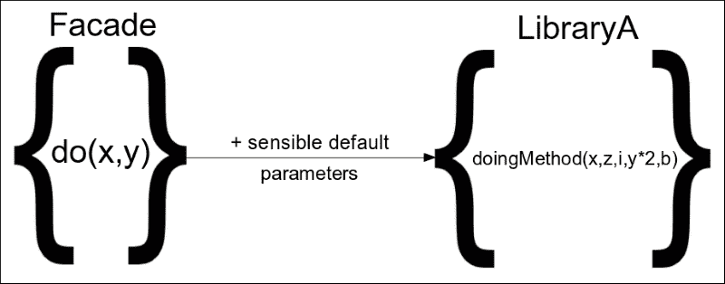
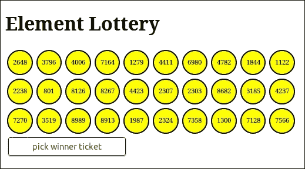

# 五、外观模式

在本章中，我们将展示**外观模式**，这是一种结构设计模式，它试图定义一种统一的方式，以确定开发人员应如何在其代码中创建抽象。最初，我们将使用此模式包装复杂的 API，并公开更简单的 API，这些 API 主要关注应用程序的需求。我们将看到 jQuery 如何在其实现中包含此模式的概念，如何将作为 web 开发人员工具带的组成部分的复杂实现封装到易于使用的 API 中，以及这如何对其广泛采用起到关键作用。

在本章中，我们将：

*   介绍外观模式
*   记录其关键概念和优点
*   查看 jQuery 如何在其实现中使用它
*   编写一个示例实现，其中 Facades 用于完全抽象和解耦第三方库

# 介绍外观模式

Facade 是一种结构化软件设计模式，处理如何创建实现的各个部分的抽象。Facade 模式的关键概念是抽象现有的实现，并提供一个简化的 API，该 API 更好地匹配所开发应用程序的用例。根据大多数描述这种模式的计算机科学参考文献，Facade 最常见的实现方式是作为一个专门的类，用于将应用程序的实现分割成更小的代码段，同时提供一个完全隐藏封装复杂性的接口。在 web 开发世界中，利用 JavaScript 将函数视为对象的方式，使用普通对象或函数实现 Facade 也是很常见的。

在具有模块化结构的应用程序中，如前一章中的示例，将 Facades 实现为具有自己名称空间的独立模块也是很常见的。此外，对于具有非常复杂部件的大型实现，还可以采用具有多个外观级别的方法。再一次，Facades 将被实现为模块和子模块，顶层 Facade 编排其子模块的方法，同时提供一个完全隐藏整个子系统复杂性的 API。

# 这种模式的好处

在的大部分时间里，Facade 模式被用于复杂度相对较高的实现部分，并在应用程序的多个地方使用，在这些地方，可以用对创建的 Facade 的简单调用来替换大块代码，这不仅减少了代码重复，同时也帮助我们提高了实现的可读性。由于 Facade 方法通常由它们封装的更高级应用程序概念命名，因此生成的代码也更容易理解。Facade 通过其方便的方法提供的简化 API，使实现更易于使用、理解和编写单元测试。


此外，在需要对实现的业务逻辑进行更改的情况下，抽象复杂实现的外观证明了它的有用性。如果一个 Facade 有一个设计良好的 API，可以预测未来的需求，那么这种更改通常只需要修改 Facade 的代码，而应用程序的其余实现则保持不变，并遵循**关注点分离**原则。

同样，使用 Facades 来抽象第三方库的 API 以更好地满足每个应用程序的需求，在我们的代码和使用的库之间提供了一定程度的解耦。如果第三方库更改其 API 或需要替换为另一个 API，则不需要重写应用程序的不同模块，因为实现更改将限于包装外观。在这种情况下，所需要的只是使用新的库 API 提供一个等效的实现，同时保持 Facade 的 API 完好无损。



作为编排方法调用和为特定用例使用合理默认值的示例，请查看以下示例实现：

```js
function do (x, y) {
  var z = y - x / 2;
  var yy = Math.pow(y, 2);
  var b = 3 * Math.random(); // add some randomness to the result
  var i = 0; // for this case
  return LibraryA.doingMethod(x, z, i, yy, b);
}
```

# jQuery 是如何采用的

jQuery 实现的很大一部分致力于为不同的 JavaScript API 已经允许我们实现的事情提供更简单、更短、更方便的方法，但需要更多的代码和精力。通过查看 jQuery 提供的 API，我们可以区分一些相关方法组。这种分组也可以从源代码的结构方式中看出，将相关 API 的方法彼此靠近。

即使 jQuery 的源代码中没有出现单词**Facade**，也可以通过在公开的 jQuery 对象上定义相关方法的方式来证明此模式的使用。大多数情况下，组成组的相关方法被实现并定义为 O**对象 Literal**上的属性，然后通过对`$.extend()`或`$.fn.extend()`方法的单个调用附加到 jQuery 对象。您可能还记得，从本章开始，这与计算机科学通常用于描述如何实现外观的实现几乎完全匹配，但在 JavaScript 中，我们可以创建一个普通对象，而无需首先定义类。因此，jQuery 本身可以被看作是一个外观的集合，其中每一个外观都通过它提供的方便方法的 API 为库独立地增加了巨大的价值。

### 注

有关`$.extend()`和`$.fn.extend()`的更多信息，请访问[http://api.jquery.com/jQuery.extend/](http://api.jquery.com/jQuery.extend/) 和[http://api.jquery.com/jQuery.fn.extend/](http://api.jquery.com/jQuery.fn.extend/) 。

以下是一些抽象 API 组，它们是 jQuery 实现的重要组成部分，对采用 jQuery 起着关键作用：

*   DOM 遍历 API
*   AJAX API
*   DOM 操作 API
*   特效 API

另外，jQuery 的 Events API 就是如何使用此模式来提供简化 API 的一个很好的例子，它为最常见的用例提供了各种方便的方法，这些用例比相应的普通 JavaScript API 更容易使用。

## jQuery DOM 遍历 API

在 jQuery 发布的时期，web 开发人员只能使用非常有限的`getElementById()`和`getElementsByTagName()`方法定位页面的特定 DOM 元素，因为现有浏览器并不广泛支持其他方法，如`getElementsByClassName()`。jQuery 团队意识到，如果有一个简单的 API 可以简化 DOM 遍历，那么 web 开发是如何发挥作用的，这种 API 在所有浏览器中都可以以相同的方式工作，与熟悉的**CSS 选择器**一样有效，并尽最大努力使这种实现成为现实。

这项工作的结果是现在著名的 jQuery DOM 遍历 API，它通过`$()`函数公开，作为**二级选择器 API**的一部分，它在`querySelectorAll()`方法的标准化中发挥了重要作用。引擎盖下的实现使用了**DOM API**提供的方法，在 jQuery v2.2.0 中大约有 2135 行代码，而在 v1.x 版本中，它甚至更大，需要支持更老的浏览器。正如我们在本章中看到的，由于其复杂性，该实现现在是一个单独的独立项目的一部分，该项目名为**Sizzle**。

### 注

有关 Sizzle 和`querySelectorAll()`方法的更多信息，您可以访问[https://github.com/jquery/sizzle](https://github.com/jquery/sizzle) 和[https://developer.mozilla.org/en-US/docs/Web/API/document/querySelectorAll](https://developer.mozilla.org/en-US/docs/Web/API/document/querySelectorAll) 。

不管它的实现有多复杂，公开的 API 都非常容易使用，主要使用简单的 CSS 选择器作为字符串参数，这使它成为一个很好的例子，说明如何使用 Facade 完全隐藏其内部工作的复杂性，并公开一个方便的 API。由于 Sizzle 的 API 仍然相当复杂，jQuery 库实际上用自己的 API 包装它，作为额外的外观级别：

```js
// Line 733
function Sizzle( selector, context, results, seed ) { /* ... */ }

// Line 2678
jQuery.find = Sizzle;
```

jQuery 库首先保持对内部`jQuery.find()`方法的 Sizzle 引用，然后使用它实现所有公开的 DOM 遍历方法，这些方法适用于复合对象，例如`$.fn.find()`：

```js
// Line 2769
jQuery.fn.extend( { 
  find: function( selector ) { 
    /* 15 lines of code */ 
    for ( i = 0; i < len; i++ ) { 
 jQuery.find( selector, self[ i ], ret ); 
    } 
    /* 3 lines of code */
    return ret; 
  } 
} );
```

最后，著名的`$()`函数实际上可以通过多种方式调用，但即使使用 CSS 选择器作为字符串参数调用，它实际上也有额外的隐藏复杂性：

```js
// Line 71
jQuery = function( selector, context ) { 
  return new jQuery.fn.init( selector, context ); 
}; 

// Line 2825
rquickExpr = /^(?:\s*(<[\w\W]+>)[^>]*|#([\w-]*))$/, 
// Line 2735 
init = jQuery.fn.init = function( selector, context, root ) { 
  /* 12 lines of code */ 
 if ( typeof selector === "string" ) { 
    if (/* ... */) { 
      /* 3 lines of code */ 
    } else { 
      match = rquickExpr.exec( selector ); 
    } 

    // Match html or make sure no context is specified for #id 
    if ( match && ( match[ 1 ] || !context ) ) { 
      if ( match[1] ) {
      /* 27 lines of code */ 
      // HANDLE: $(#id) 
      } else { 
 elem = document.getElementById( match[ 2 ] ); 

        // Support: Blackberry 4.6 
        // gEBID returns nodes no longer in the document (#6963) 
        if ( elem && elem.parentNode ) { 
          // Inject the element directly into the jQuery object 
          this.length = 1; 
          this[ 0 ] = elem; 
        } 

        this.context = document; 
        this.selector = selector; 
        return this; 
      } 

    // HANDLE: $(expr, $(...)) 
    } else if ( !context || context.jquery ) { 
 return ( context || root ).find( selector ); 

    // HANDLE: $(expr, context) 
    // (which is just equivalent to: $(context).find(expr) 
    } else { 
 return this.constructor( context ).find( selector ); 
    } 
  } /* else ... 21 lines of code */
};
```

如您所见，在前面的代码中，`$()`实际上正在创建一个带有`$.fn.init()`的新对象。它不仅仅是`$.fn.find()`或`jQuery.find()`的入口点，实际上是一个`Facade`，隐藏了一个优化级别。具体来说，当通过直接调用`getElementById()`方法使用简单的 ID 选择器时，它通过避免调用`$.fn.find()`和 Sizzle 使 jQuery 更快。

## 属性访问和操作 API

另一个非常有趣的抽象，遵循 Facade 模式的原则，可以在 jQuery 的源代码中找到，`$.fn.prop()`方法。与`$.fn.attr()`、`$.fn.val()`、`$.fn.text()`和`$.fn.html()`一样，它属于一系列方法，其特征是每个方法都是相关主题的获取者和设置者。方法执行模式的区别是通过检查调用期间传递的参数数量来完成的。这个方便的 API 允许我们记住更少的方法签名，并使 setter 仅通过一个额外的参数而有所不同。例如，`$('#myCheckBox').prop('checked')`将根据所选复选框的状态返回 true 或 false。另一方面，`$('#myCheckBox').prop('checked', true);`将以编程方式为我们选中该复选框。在相同的概念中，`$('button').prop('disabled', true);`将禁用页面上的所有`<button>`元素。

`$.fn.prop()`方法进行 jQuery 复合对象处理，但 Facade 的实际实现是内部`jQuery.prop()`方法。增加 Facade 实现复杂性的另一个问题是，存在一些 HTML 属性，这些属性对 DOM 元素上的相应属性具有不同的标识符：

```js
jQuery.extend( { 

  prop: function( elem, name, value ) { 
    /* 8 lies of code */
    if ( nType !== 1 || !jQuery.isXMLDoc( elem ) ) {
      // Fix name and attach hooks 
 name = jQuery.propFix[ name ] || name; 
 hooks = jQuery.propHooks[ name ]; 
    } 

 if ( value !== undefined ) { 
      if ( hooks && "set" in hooks &&
        ( ret = hooks.set( elem, value, name ) ) !== undefined ) {
        return ret;
      }
 return ( elem[ name ] = value );
    }

    if ( hooks && "get" in hooks &&( ret = hooks.get( elem, name ) ) !== null ) {
      return ret;
    }
 return elem[ name ];
  }, 

  propHooks: { 
    tabIndex: { 
      get: function( elem ) { 
        var tabindex = jQuery.find.attr( elem, "tabindex" );
        return tabindex ?parseInt( tabindex, 10 ) : /*...*/;
      }
    }
  },

  propFix: {
    "for": "htmlFor",
    "class": "className"
  } 
} );
```

第一个高亮显示的代码区域通过使用`propFix`和`propHooks`对象进行匹配，有效地解决了属性到属性标识符的不匹配问题。`propFix`对象就像一个简单的字典来匹配标识符，而`propHooks`对象拥有一个函数，该函数通过编程测试以较少的硬编码方式进行匹配。这是一个通用实现，可以通过向这两个对象添加额外属性来轻松扩展。

突出显示区域的其余部分负责该方法的 getter/setter 模式。总体实施是执行以下任务：

*   检查值是否作为参数传递，如果属性发现赋值成功，则执行赋值并返回值。
*   或者，如果没有传递值，则返回请求属性的值（如果可以检索）。

# 在我们的应用程序中使用外观

为了演示 facades 如何用于封装复杂性，帮助我们实施关注点分离原则，并将第三方库 API 抽象为以应用程序为中心的更方便的方法，我们将演示一个非常简单的彩票应用程序。我们的“元素彩票”应用程序将用一些彩票元素填充其容器，这些元素将具有唯一的 ID 并包含一个随机数。



中奖彩票将根据创建的唯一 ID 中的随机索引，通过随机选择彩票元素之一来挑选。中奖号码将被宣布为所选元素的数字内容。让我们看看我们应用程序的模块：

```js
(function() { 
  window.elementLottery = window.elementLottery || {}; 

  var elementIDs; 
  var $lottery; 
  var ticketCount = 30; 

  elementLottery.init = function() { 
    elementIDs = []; 
    $lottery = $('#lottery').empty(); 
    elementLottery.add(ticketCount); 
    $('#lotteryTicketButton').on('click', elementLottery.pick); 
  }; 

  elementLottery.add = function(n) { 
    for (var i = 0; i < n; i++) { 
      var id = this.uidProvider.get(); 
      elementIDs.push(id); 
      $lottery.append(this.ticket.createHtml(id)); 
    } 
  }; 

  elementLottery.pick = function() { 
    var index = Math.floor(Math.random() * elementIDs.length); 
    var result = $lottery.find('#' + elementIDs[index]).text(); 
    alert(result); 
    return result; 
  }; 

  $(document).ready(elementLottery.init);
})(); 
```

我们的应用程序的主`elementLottery`模块在页面完全加载后立即初始化。`add`方法用于用彩票填充彩票容器元素。它使用`uidProvider`子模块为 ticket 元素生成唯一标识符，在`elementIDs`数组中跟踪它们，使用 ticket 子模块构造适当的 HTML 代码，最后将元素附加到彩票中。`pick`方法用于通过随机选择生成的标识符之一，检索具有该 ID 的页面元素，并将其内容显示在警报框中作为中奖结果，来随机选择中奖彩票。`pick`方法通过点击我们在初始化阶段添加了观察者的按钮触发：

```js
(function() { 
  elementLottery.ticket = elementLottery.ticket || {}; 

  elementLottery.ticket.createHtml = function(id) { 
    var ticketNumber = Math.floor(Math.random() * 1000 * 10); 
    return '<div id="' + id + '" class="ticket">' + ticketNumber + '</div>'; 
  }; 
})(); 

(function() { 
  elementLottery.uidProvider = elementLottery.uidProvider || {}; 

  elementLottery.uidProvider.get = function() { 
    return 'Lot' + simpleguid.getNext(); 
  }; 
})(); 
```

`ticket`子模块作为一个外观，使用一个方法封装随机数的生成和将用作票证的 HTML 代码的创建。另一方面，`uidProvide`子模块是一个 Facade，它提供了一个单一的 get 方法，封装了我们在前面章节中看到的`simpleguid`模块的使用方式。因此，我们可以很容易地更改用于生成唯一标识符的库，我们唯一需要修改现有实现的地方就是`uidProvide`子模块。例如，让我们看看如果我们决定使用伟大的节点 uuid 库，该库将生成 128 位唯一标识符作为十六进制字符字符串，它将是什么样子：

```js
(function() { 
  elementLottery.uidProvider = elementLottery.uidProvider || {}; 

  elementLottery.uidProvider.get = function() { 
    return uuid.v4();
  }; 
})(); 
```

### 注

有关节点 uui 库的更多信息，请访问[https://github.com/broofa/node-uuid](https://github.com/broofa/node-uuid) 。

# 总结

在本章中，我们了解了什么是外观。我们学习了它的原理以及它定义如何创建代码抽象的统一方式，以便其他开发人员能够轻松理解和重用代码抽象。

从这个模式最简单的用例开始，我们学习了如何用 Facade 包装一个复杂的 API，并公开一个更简单的 API，它关注于我们的应用程序的需求，并且更好地匹配它的特定用例。我们还看到 jQuery 如何在其实现中包含此模式的概念，以及如何为更基本的 web 开发技术（如 DOM 遍历）提供简单的 API，对其广泛采用起到了关键作用。

现在，我们已经完成了关于如何使用 Facade 模式来解耦和抽象实现的各个部分的介绍，我们可以进入下一章，在这里我们将介绍 Builder 和 Factory 模式。在下一章中，我们将学习如何使用这两种创造性的设计模式来抽象为特定用例生成和初始化新对象的过程，并分析它们的采用如何有利于我们的实现。