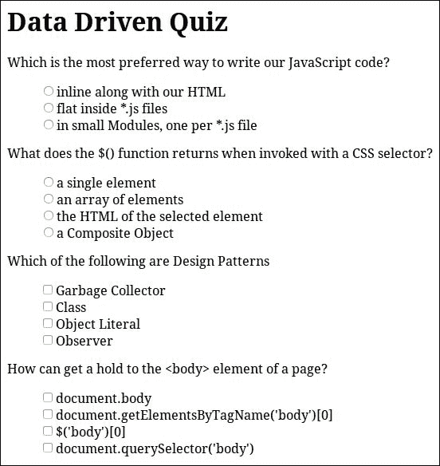

# 六、构建与工厂模式

在本章中，我们将展示 Builder 和 Factory 模式，这两种最常用的创造性设计模式。这两种设计模式彼此有一些相似之处，有一些共同的目标，并且致力于简化复杂结果的创建。我们将分析它们的采用可以给我们的实现带来的好处，以及它们的不同之处。最后，我们将学习如何正确地使用它们，并为我们的实现的不同用例选择最合适的一个。

在本章中，我们将：

*   介绍工厂模式
*   查看 jQuery 如何使用工厂模式
*   在 jQuery 应用程序中有一个工厂模式的示例
*   介绍 Builder 模式
*   比较生成器和工厂模式
*   查看 jQuery 如何使用构建器模式
*   在 jQuery 应用程序中有一个构建器模式的示例

# 引入工厂模式

工厂模式是创建模式组的一部分，总体上它描述了对象创建和初始化的通用方法。它通常被实现为用于生成其他对象的对象或函数。根据大多数计算机科学资源，工厂模式的参考实现被描述为一个类，该类提供一个返回新创建对象的方法。返回的对象通常是特定类或子类的实例，或者它们公开了一组特定的特征。


工厂模式的关键概念是抽象一个对象或一组相关对象为特定目的而创建和初始化的方式。此抽象的要点是避免将实现与特定类或每个对象实例需要创建和配置的方式耦合。结果是一个实现，它作为对象创建和初始化的抽象方式，遵循关注点分离的概念。

结果实现仅基于其算法或业务逻辑所需的对象方法和属性。这种方法可以通过遵循对象特性和功能而不是对象类的编程概念，从而有利于实现的模块化和可扩展性。这使我们能够灵活地使用公开相同功能的任何其他对象更改所使用的类。

## jQuery 是如何采用的

正如我们在前面几章中已经提到的，jQuery 的早期目标之一是提供一个在所有浏览器上都能工作的解决方案。jQuery 的 1.12.x 版本系列的重点是为像 InternetExplorer6（IE6）这样古老的浏览器提供支持，同时与只关注现代浏览器的较新 v2.2.x 版本保持相同的 API。

为了拥有相似的结构并最大化两个版本之间的公共代码，jQuery 团队试图在不同的实现层中抽象大多数兼容性机制。这样的开发实践极大地提高了代码的可读性，并降低了主实现的复杂性，将其封装成不同的小片段。

一个很好的例子是 jQuery 提供的与 AJAX 相关的方法的实现。具体地说，在以下代码中，您可以找到它的一部分，如 jQuery 的 1.12.0 版：

```js
// Create the request object 
// (This is still attached to ajaxSettings for backward compatibility) 
jQuery.ajaxSettings.xhr = window.ActiveXObject !== undefined ? 
  // Support: IE6-IE8
  function() { 

    // XHR cannot access local files, always use ActiveX for that case 
    if ( this.isLocal ) {
      return createActiveXHR();
    }
    // Support: IE 9-11
    if ( document.documentMode > 8 ) {
      return createStandardXHR();
    }
    // Support: IE<9
    return /^(get|post|head|put|delete|options)$/i.test( this.type ) && createStandardXHR() || createActiveXHR();

  } : 
  // For all other browsers, use the standard XMLHttpRequest object 
  createStandardXHR; 

// Functions to create xhrs 
function createStandardXHR() { 
  try { 
    return new window.XMLHttpRequest(); 
  } catch ( e ) {} 
} 

function createActiveXHR() { 
  try { 
    return new window.ActiveXObject( "Microsoft.XMLHTTP" ); 
  } catch ( e ) {} 
}
```

每次在 jQuery 上发出一个新的 AJAX 请求时，`jQuery.ajaxSettings.xhr`方法被用作一个工厂，根据当前浏览器的支持创建相应 XHR 对象的新实例。更详细地看，我们可以看到`jQuery.ajaxSettings.xhr`方法协调了两个较小的工厂函数的使用，每个函数负责 AJAX 的特定实现。此外，我们可以看到，它实际上试图通过在适当的时候直接将其引用连接到较小的`createStandardXHR`工厂函数来避免对每个调用运行兼容性测试。

## 在我们的应用中使用工厂

作为工厂用例的一个例子，我们将创建一个数据驱动表单，用户可以在其中填写一些动态创建并插入页面的字段。我们将假设存在一个数组，其中包含描述需要显示的每个表单字段的对象。我们的工厂方法将封装每个表单字段需要构造的方式，并根据相关对象上定义的特征正确处理每个特定情况。


此页面的 HTML 代码非常简单：

```js
    <h1>Data Driven Form</h1> 

    <form></form> 

    <script type="text/javascript" src="jquery.js"></script> 
    <script type="text/javascript" src="datadrivenform.js"></script> 
```

它只包含一个带有页面标题的`<h1>`元素和一个空`<form>`元素，该元素将承载生成的字段。至于所使用的 CSS，我们仅以与前面章节相同的方式对`<button>`元素进行样式设置。

对于应用程序的 JavaScript 实现，我们创建一个模块并声明`dataDrivenForm`为本例的名称空间。此模块将包含描述表单的数据、将生成每个表单元素 HTML 的工厂方法，当然还有将组合上述部分以创建结果表单的初始化代码：

```js
(function() { 
  'use strict'; 

  window.dataDrivenForm = window.dataDrivenForm || {}; 

  dataDrivenForm.formElementHTMLFactory = function (type, name, title) { 
    if (!title || !title.length) { 
      title = name; 
    } 
    var topPart = '<div><label><span>' + title + ':</span><br />'; 
    var bottomPart = '</label></div>'; 
    if (type === 'text') { 
      return topPart + 
        '<input type="text" maxlength="200" name="' +name + '" />' + 
        bottomPart; 
    } else if (type === 'email') { 
      return topPart + 
        '<input type="email" required name="' + name + '" />' + 
        bottomPart; 
    } else if (type === 'number') { 
      return topPart + 
        '<input type="number" min="0" max="2147483647" ' +'name="' + name + '" />' + 
        bottomPart; 
    } else if (type === 'date') { 
      return topPart + 
        '<input type="date" min="1900-01-01" name="' +
          name + '" />' + 
        bottomPart; 
    } else if (type === 'textarea') { 
      return topPart + 
        '<textarea cols="30" rows="3" maxlength="800" name="' +name + '" />' + 
        bottomPart; 
    } else if (type === 'checkbox') { 
      return '<div><label><span>' + title + ':</span>' + 
        '<input type="checkbox" name="' + name + '" />' + 
        '</label></div>'; 
    } else if (type === 'notice') { 
      return '<p>' + name + '</p>'; 
    }  else if (type === 'button') { 
      return '<button name="' + name + '">' + title + '!</button>'; 
    } 
  }; 

})(); 
```

我们的工厂方法将使用三个参数调用。从最重要的一个开始，它接受表单字段的`type`和`name`以及将用作其描述的`title`。由于大多数表单字段都有一些共同的特征，比如它们的标题，工厂方法试图对它们进行抽象以减少代码重复。如您所见，Factory 方法还为每个字段类型包含一些合理的额外配置，如文本字段的`maxlength`属性，这是本用例特有的。

用于表示每个表单元素的对象结构将是一个普通的 JavaScript 对象，它具有`type`、`name`和`title`属性。描述表单字段的对象集合将分组在一个数组中，并在模块的`dataDrivenForm.parts`属性中可用。在现实世界的应用程序中，这些字段通常要么通过 AJAX 请求检索，要么被注入页面 HTML 的某些部分。在以下代码片段中，我们可以看到将用于驱动表单创建的数据：

```js
dataDrivenForm.parts = [{ 
    type: 'text', 
    name: 'firstname', 
    title: 'First Name' 
  }, { 
    type: 'text', 
    name: 'lastname', 
    title: 'Last Name' 
  }, { 
    type: 'email', 
    name: 'email', 
    title: 'e-mail address' 
  }, { 
    type: 'date', 
    name: 'birthdate', 
    title: 'Date of birth' 
  }, { 
    type: 'number', 
    name: 'experience', 
    title: 'Years of experience' 
  }, { 
    type: 'textarea', 
    name: 'summary', 
    title: 'Summary' 
  }, { 
    type: 'checkbox', 
    name: 'receivenotifications', 
    title: 'Receive notification e-mails' 
  }, { 
    type: 'notice', 
    name: 'By using this form you accept the terms of use' 
  }, { 
    type: 'button', 
    name: 'save' 
  }, { 
    type: 'button', 
    name: 'submit' 
  }];
```

最后，我们为我们的模块定义并立即调用`init`方法：

```js
dataDrivenForm.init = function() { 
  for (var i = 0; i < dataDrivenForm.parts.length; i++) { 
    var part = dataDrivenForm.parts[i]; 
    var elementHTML = dataDrivenForm.formElementHTMLFactory(part.type, part.name, part.title); 
    // check if the result is null, undefined or empty string
    if (elementHTML && elementHTML.length) { 
      $('form').append(elementHTML); 
    } 
  } 
}; 

$(document).ready(dataDrivenForm.init); 
```

初始化代码等待页面的 DOM 完全加载，然后使用 Factory 方法创建表单元素并将它们附加到页面的`<form>`元素。前面代码的一个额外关注点是在实际开始使用工厂方法调用之前检查它的结果。

大多数工厂在无法处理的情况下使用参数调用时，返回`null`或空对象。因此，在使用工厂时，检查每次调用的结果是否实际有效是一种很好的常见做法。

如您所见，在许多情况下，工厂只接受简单参数（例如字符串和数字），这会导致参数数量增加。尽管这些参数可能只在特定情况下使用，但我们工厂的 API 开始非常长，需要为每个特殊情况提供适当的文档才能使用。

理想情况下，工厂方法应该接受尽可能少的参数，否则它将开始看起来像只提供不同 API 的外观。由于在某些情况下，使用单个字符串或数字参数是不够的，为了避免使用大量参数，我们可以遵循这样一种做法，即工厂设计为接受单个对象作为其参数。

例如，在本例中，我们可以将描述表单字段的整个对象作为参数传递给 Factory 方法：

```js
dataDrivenForm.formElementHTMLFactory = function (formElementDefinition) { 
  var topPart = '<div><label><span>' + formElementDefinition.title + ':</span><br />'; 
  var bottomPart = '</label></div>'; 
  if (formElementDefinition.type === 'text') { 
    return topPart + 
      '<input type="text" maxlength="200" name="' +formElementDefinition.name + '" />' + 
      bottomPart; 
  } /* ... */ 
};
```

建议在以下情况下采用这种做法：

*   当我们创建不关注特定用例的通用工厂时，我们需要为每个特定用例配置不同的结果。
*   当构造的对象具有许多不同的可选配置参数时。在这种情况下，将它们作为单独的参数添加到工厂方法将导致调用具有许多`null`参数，这取决于我们感兴趣定义的确切参数。

另一种做法，特别是在 JavaScript 编程中，是创建一个工厂方法，该方法接受简单的字符串或数值作为第一个参数，并可选地提供一个补充对象作为第二个参数。这使我们能够拥有一个简单的通用 API，它可以是特定于用例的，还为我们提供了一些额外的自由点来配置一些特殊情况。`$.ajax( url [, settings ] )`方法使用这种方法，该方法允许我们仅通过提供 URL 来生成简单的 GET 请求，并接受可选的`settings`参数，该参数允许我们配置请求的任何方面。为了试验和熟悉工厂方法的使用，将上述实现更改为使用此变体留给读者作为练习。

# 引入 Builder 模式

生成器模式是创造性模式组的一部分，它为我们提供了一种方法来创建需要大量配置才能使用的对象。生成器模式通常用于接受许多可选参数以定义其操作的对象。另一个匹配的情况是创建对象，这些对象的配置需要分几个步骤或按特定顺序完成。

根据计算机科学，构建器模式的常见范例是，存在一个提供一个或多个 setter 方法（`setA(...)`、`setB(...)`）的构建器对象和一个构造并返回新创建的结果对象（`getResult()`）的单一生成方法。


这个模式有两个重要的概念。第一个是 Builder 对象公开了许多方法，作为配置正在构建的对象的不同部分的一种方式。在配置阶段，Builder 对象保留反映所提供 setter 方法调用效果的内部状态。当用于创建接受大量配置参数的对象时，这将非常有用，从而解决伸缩构造函数的问题。

### 注

伸缩构造函数是面向对象编程的一种反模式，它描述了一个类提供多个构造函数的情况，这些构造函数的数量、类型以及所需参数的组合往往不同。具有多个参数的对象类可以在许多不同的组合中使用，这通常会导致实现陷入这种反模式。

第二个重要概念是，它还提供了一种生成方法，根据前面的配置返回实际构造的对象。大多数情况下，请求对象的实例化都是延迟完成的，实际上是在调用此方法时发生的。在某些情况下，Builder 对象允许我们多次调用 generation 方法，从而使用相同的配置生成多个对象。

## jQuery 的 API 是如何采用的

构建器模式也可以作为 jQuery 公开的 API 的一部分找到。具体地说，jQuery`$()`函数还可以通过调用一个 HTML 字符串作为参数来创建新的 DOM 元素。因此，我们可以创建新的 DOM 元素并根据需要设置它们的不同部分，而不必创建最终结果所需的确切 HTML 字符串：

```js
var $input = $('<input />'); 
$input.attr('type','number'); 
$input.attr('min', '0'); 
$input.attr('max', '100'); 
$input.prop('required', true);
$input.val(4);

$input.appendTo('form');
```

`$('<input />')`调用返回一个复合对象，其中包含一个未附加到页面 DOM 树的元素。这个未附加的元素只是一个内存中的对象，在我们将其附加到页面之前，它既不是完全构造的，也不是完全功能的。在本例中，此复合对象的行为类似于具有尚未最终确定的对象的内部状态的生成器对象实例。在此之后，我们使用一些 jQuery 方法对其进行一系列操作，这些方法的行为类似于构建器模式所描述的 setter 方法。

最后，在我们应用了所有必需的配置，以便生成的对象以所需的方式运行之后，我们调用`$.fn.appendTo()`方法。`$.fn.appendTo()`方法作为生成器模式的生成方法，通过将`$input`变量的内存中元素附加到页面的 DOM 树，将其转换为实际附加的 DOM 元素。

当然，上面的示例可以通过使用 jQuery 为其方法提供的 Fluent API，并结合`$.fn.attr()`方法调用，获得更高的可读性和更少的重复性。此外，jQuery 允许我们使用几乎所有的方法对正在构造的元素进行遍历和操作，就像对普通 DOM 元素组合对象进行遍历和操作一样。因此，上述示例可以更加完整，如下所示：

```js
$('<input />').attr({
    'type':'number',
    'min': '0',
    'max': '100'
  })
  .prop('required', true) 
  .val(4)
  .css('display', 'block') 
  .wrap('<label>') // wrap the input with a <label> 
  .parent() // traverse one level up, to the <label> 
  .prepend('<span>Qty:#</span') 
  .appendTo('form');
```

结果如下：


允许我们将这种调用`$()`函数的重载方式归类为采用构建器模式的实现的标准是：

*   它返回一个内部状态为包含部分构造元素的对象。所包含的元素仅存在于内存对象中，这些对象不属于页面的 DOM 树。
*   它为我们提供了操纵其内部状态的方法。大多数 jQuery 方法都可以用于此目的。
*   它为我们提供了生成最终结果的方法。我们可以使用 jQuery 方法，如`$.fn.appendTo()`和`$.fn.insertAfter()`来完成内部元素的构造，并使它们成为 DOM 树的一部分，其属性反映了它们在内存中的早期表示。

正如我们在[第 1 章](01.html#DB7S2-e8d3cd3d052d4ee0b4673af57a64ddef "Chapter 1. A Refresher on jQuery and the Composite Pattern")*中已经看到的是 jQuery 和复合模式*的更新，使用`$()`函数的主要方法是使用 CSS 选择器作为字符串参数调用它，然后它将检索匹配的页面元素并在复合对象中返回它们。另一方面，当`$()`函数检测到它被一个看起来像 HTML 的字符串参数调用时，它就充当 DOM 元素生成器。这种调用`$()`函数的重载方式基于以下假设进行检测：所提供的 HTML 代码以不等式符号`<`和`>`开始和结束：

```js
  init = jQuery.fn.init = function( selector, context ) { 
    /* 11 lines of code */ 
    // Handle HTML strings 
    if ( typeof selector === "string" ) { 
      if ( selector[ 0 ] === "<" &&selector[ selector.length - 1 ] === ">" &&selector.length >= 3 ) { 
        // Assume that strings that start and end with <> are HTML // and skip the regex check 
        match = [ null, selector, null ]; 

      } /*...*/

      // Match html or make sure no context is specified for #id 
      if ( match && ( match[ 1 ] || !context) ) { 

        // HANDLE: $(html) -> $(array) 
        if ( match[ 1 ] ) { 
          /* 4 lines of code */
          jQuery.merge( this, jQuery.parseHTML( match[ 1 ], /*...*/ ) ); 
          /* 16 lines of code */ 

          return this; 
        }/*...*/ 
      }/*...*/ 
    }/*...*/ 
  }; 
```

正如我们在前面的代码中所看到的，这个重载使用了`jQuery.parseHTML()`helper 方法，最终导致调用`createDocumentFragment()`方法。创建的**文档片段**随后被用作正在构建的元素树结构的主体。jQuery 完成将 HTML 转换为元素后，将丢弃文档片段，只返回其承载的元素：

```js
jQuery.parseHTML = function( data, context, keepScripts ) { 
  /* 17 lines of code */ 
  // Single tag 
  if ( parsed ) { 
    return [ context.createElement( parsed[ 1 ] ) ]; 
  } 

  parsed = buildFragment( [ data ], context, scripts ); 
  /* 5 lines of code */
  return jQuery.merge( [], parsed.childNodes ); 
};
```

这将导致创建一个新的 jQuery 复合对象，其中包含内存中的元素树结构。即使这些元素没有附加到页面的实际 DOM 树，我们仍然可以像其他 jQuery 复合对象一样对它们进行遍历和操作。

### 注

有关文档片段的更多信息，请访问：[https://developer.mozilla.org/en-US/docs/Web/API/Document/createDocumentFragment](https://developer.mozilla.org/en-US/docs/Web/API/Document/createDocumentFragment) 。

## jQuery 内部如何使用

毫无疑问，jQuery 的一个重要部分是它与 AJAX 相关的实现，它旨在为异步调用提供一个简单的 API，该 API 在很大程度上也是可配置的。使用 jQuery 源代码查看器并搜索`jQuery.ajax`，或者直接搜索 jQuery 源代码中的`"ajax:"`，将为我们带来上述实现。为了使其实现更加直观，并且允许对其进行配置，jQuery 在内部使用了一种特殊的对象结构，该结构充当构建器对象，用于创建和处理每个 AJAX 请求。正如我们将看到的，这不是使用 Builder 对象的最常见方式，但它实际上是一种特殊的变体，经过一些修改，以适应这种复杂实现的要求：

```js
jqXHR = { 
  readyState: 0, 

  // Builds headers hashtable if needed 
  getResponseHeader: function( key ) {/* ... */}, 

  // Raw string 
  getAllResponseHeaders: function() {/* ... */}, 

  // Caches the header 
  setRequestHeader: function( name, value ) {/* ... */}, 

  // Overrides response content-type header 
  overrideMimeType: function( type ) {/* ... */}, 

  // Status-dependent callbacks 
  statusCode: function( map ) {/* ... */}, 

  // Cancel the request 
  abort: function( statusText ) {/* ... */} 
}; 
```

`jqXHR`对象公开配置生成的异步请求的主要方法是`setRequestHeader()`方法。此方法的实现非常通用，使 jQuery 能够仅使用一种方法为请求设置所有不同的 HTTP 头。

为了提供更大程度的灵活性和抽象性，jQuery 在内部使用一个单独的`transport`对象作为`jqXHR`对象的包装器。此传输对象处理实际向服务器发送 AJAX 请求的部分，其工作方式与*partner builder 对象*类似，它与`jqXHR`对象协作创建最终结果。通过这种方式，jQuery 可以使用相同的 API 和整体实现从相同或跨源服务器获取脚本、XML、JSON 和 JSONP 响应：

```js
transport = inspectPrefiltersOrTransports( transports, s, options, jqXHR ); 

// If no transport, we auto-abort 
if ( !transport ) { 
  done( -1, "No Transport" ); 
} else { 
  jqXHR.readyState = 1; 
  /* 12 lines of code */ 
  try { 
    state = 1; 
    transport.send( requestHeaders, done ); 
  } catch ( e ) {/* 7 lines of code */} 
}
```

构建器模式实现的另一个特殊之处是，它应该能够以同步和异步方式运行。因此，`transport`对象的`send()`方法作为已包装的`jqXHR`对象的结果生成器方法，不能只返回结果对象，而是通过回调调用。

最后，在请求完成后，jQuery 使用`getResponseHeader()`方法检索所有需要的响应头。在这之后，头被用来正确地转换存储在`jqXHR`对象的`responseText`属性中的接收响应。

## 如何在我们的应用中使用它

作为使用 jQuery 的客户端应用程序中构建器模式的示例用例，我们将创建一个简单的数据驱动的多项选择测验。与我们前面看到的 Factory 模式示例相比，Builder 模式更适合这种情况的主要原因是结果更复杂，配置程度更高。每个问题都将基于表示其所需属性的模型对象生成。



同样，所需的 HTML 非常简单，只包含一个带有页眉的`<h1>`元素、一个空的`<form>`标记，以及一些对 CSS 和 JavaScript 资源的引用：

```js
    <h1>Data Driven Quiz</h1> 
    <form> </form> 

    <script type="text/javascript" src="jquery.js"></script> 
    <script type="text/javascript" src="datadrivenquiz.js"></script> 
```

除了我们在前面章节中看到的常见、简单的样式外，本示例的 CSS 还定义了：

```js
ul.unstyled > li { 
    margin: 0; 
    padding: 0; 
    list-style: none; 
}
```

根据本例的需要，我们将创建一个名为`dataDrivenQuiz`的新名称空间模块。正如我们在本章前面看到的，我们将假设存在一个数组，其中包含描述每个需要呈现的多项选择题的模型对象。每个模型对象都将具有：

*   持有该问题的`title`财产
*   一个`options`属性，它将是一个数组，其中包含可供选择的可用答案
*   一个可选的`acceptsMultiple`属性，表示我们应该使用收音机还是复选框

包含描述表单问题的模型对象的数组将在我们模块的`dataDrivenQuiz.parts`属性中可用，同时请记住，我们的实现可以很容易地修改，以便通过 AJAX 请求获取模型：

```js
dataDrivenQuiz.questions = [{ 
  title: 'Which is the most preferred way to write our JavaScript code?', 
  options: [ 
    'inline along with our HTML', 
    'flat inside *.js files', 
    'in small Modules, one per *.js file' 
  ] 
}, { 
  title: 'What does the $() function returns when invoked with a CSS selector?', 
  options: [ 
    'a single element', 
    'an array of elements', 
    'the HTML of the selected element', 
    'a Composite Object' 
  ] 
}, { 
  title: 'Which of the following are Design Patterns', 
  acceptsMultiple: true, 
  options: [ 
    'Garbage Collector', 
    'Class', 
    'Object Literal', 
    'Observer' 
  ] 
}, { 
  title: 'How can get a hold to the <body> element of a page?', 
  acceptsMultiple: true, 
  options: [ 
    'document.body', 
    'document.getElementsByTagName(\'body\')[0]', 
    '$(\'body\')[0]', 
    'document.querySelector(\'body\')' 
  ] 
}];
```

### 提示

在开始实际实现之前，定义描述问题所需的数据结构，使我们能够关注应用程序的需求，并对其总体复杂性进行估计。

鉴于前面的示例数据，现在让我们继续实现构建器：

```js
function MultipleChoiceBuilder() { 
  this.title = 'Untitled'; 
  this.options = []; 
} 
dataDrivenQuiz.MultipleChoiceBuilder = MultipleChoiceBuilder; 

MultipleChoiceBuilder.prototype.setTitle = function(title) { 
  this.title = title; 
  return this; 
}; 

MultipleChoiceBuilder.prototype.setAcceptsMultiple = function(acceptsMultiple) { 
    this.acceptsMultiple = acceptsMultiple; 
    return this; 
  }; 

MultipleChoiceBuilder.prototype.addOption = function(title) { 
  this.options.push(title); 
  return this; 
}; 

MultipleChoiceBuilder.prototype.getResult = function() { 
  var $header = $('<header>').text(this.title || 'Untitled'); 

  var questionGuid = 'quizQuestion' + (jQuery.guid++); 
  var $optionsList = $('<ul class="unstyled">'); 
  for (var i = 0; i < this.options.length; i++) { 
    var $input = $('<input />').attr({
      'type': this.acceptsMultiple ? 'checkbox' : 'radio',
      'value': i,
      'name': questionGuid,
    });

    var $option = $('<li>'); 
    $('<label>').append($input, $('<span>').text(this.options[i]))
      .appendTo($option); 
    $optionsList.append($option); 
  } 
  return $('<article>').append($header, $optionsList);
};
```

使用 JavaScript 的原型面向对象方法，我们首先为`MultipleChoiceBuilder`类定义构造函数。当使用`new`操作符调用构造函数时，它将创建生成器的新实例，并将其`title`属性初始化为`"Untitled"`，将`options`属性初始化为空数组。

紧接着，我们完成了构建器的构造函数的定义，将其作为模块的一个成员附加，并继续定义其 setter 方法。遵循原型类范例，`setTitle()`、`setAcceptsMultiple()`和`addOption()`方法被定义为我们构建器原型的属性，并用于修改正在构建的元素的内部状态。此外，为了使我们能够链接这些方法的多个调用，从而产生更可读的实现，所有这些方法都以`return this;`语句结尾。

我们使用`getResult()`方法完成构建器的实现，该方法负责收集应用于构建器对象实例的所有参数，并生成封装在 jQuery 复合对象中的结果元素。在第一行中，它创建问题的标题。紧接着，它创建了一个带有`unstyled`CSS 类的`<ul>`元素，以保存问题的可能答案和一个唯一标识符，该标识符将用作问题生成的`<input>`的`name`。

在下面的 for 循环中，我们将：

*   为问题的每个选项创建一个`<input />`元素
*   根据`acceptsMultiple`属性的值，将其`type`正确设置为`checkbox`或`radio`按钮
*   使用 for 循环的迭代编号作为其`value`
*   将我们之前为问题生成的唯一标识符设置为输入的`name`，以便对答案进行分组
*   最后，添加一个带有选项文本的`<label>`，将所有选项包装在`<li>`中，并将其附加到问题的`<ul>`中。

最后，标题和选项列表被包装在一个`<article>`元素中，然后作为生成器的最终结果返回。

在上述实现中，我们使用`$.fn.text()`方法来分配问题标题的内容及其可用选项，而不是字符串串联，以便正确转义描述中的`<`和`>`字符。另外，由于一些答案也包含单引号，我们需要在模型对象中使用反斜杠（`\'`来转义它们。

最后，在我们的模块实现中，我们定义并立即调用`init`方法：

```js
dataDrivenQuiz.init = function() { 
  for (var i = 0; i < dataDrivenQuiz.questions.length; i++) { 
    var question = dataDrivenQuiz.questions[i]; 
    var builder = new dataDrivenQuiz.MultipleChoiceBuilder(); 

    builder.setTitle(question.title) .setAcceptsMultiple(question.acceptsMultiple); 

    for (var j = 0; j < question.options.length; j++) { 
      builder.addOption(question.options[j]); 
    } 

    $('form').append(builder.getResult());
  }
}; 

$(document).ready(dataDrivenQuiz.init);
```

初始化代码的执行被延迟，直到页面的 DOM 树完全加载。然后，`init()`方法迭代模型对象数组，并使用生成器创建每个问题，并填充页面的`<form>`元素。

对读者来说，一个好的练习是扩展上述实现，以支持测验的客户端评估。首先，这需要您扩展问题对象，以包含关于每个选择的有效性的信息。然后，建议您创建一个生成器，从表单中检索答案，对其进行评估，并创建一个结果对象，其中包含用户选择和测验的总体成功率。

# 总结

在本章中，我们学习了 Builder 和 Factory 模式的概念，这两种最常用的创造性设计模式。我们分析了它们的共同目标，它们在抽象为特定用例生成和初始化新对象的过程方面的不同方法，以及它们的采用如何有利于我们的实现。最后，我们学习了如何正确地使用它们，以及如何为任何给定实现的不同用例选择最合适的一个。

现在我们已经完成了对最重要的创造性设计模式的介绍，我们可以进入下一章，在那里我们将介绍用于编程异步和并发过程的开发模式。更详细地说，我们将学习如何通过使用回调和 jQuery-Deferred 和 promisseapi 来协调异步过程的执行，这些异步过程可以按顺序运行，也可以并行运行。