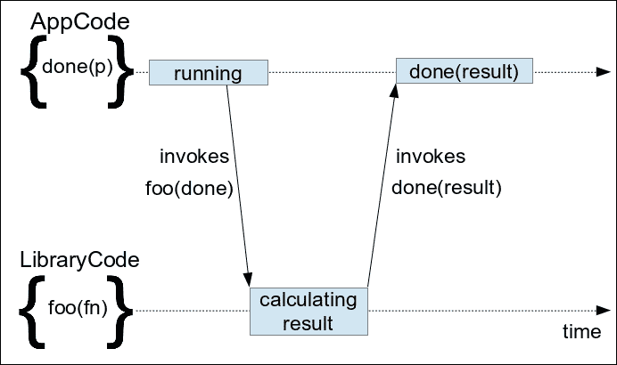
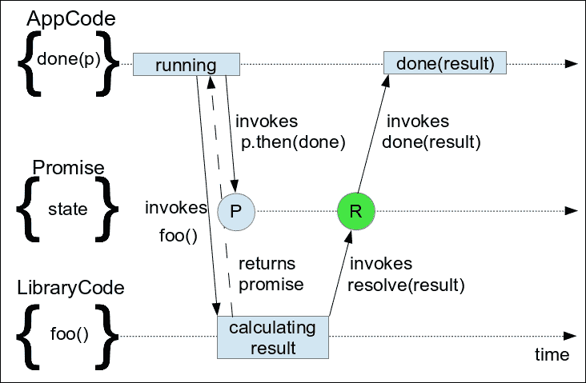
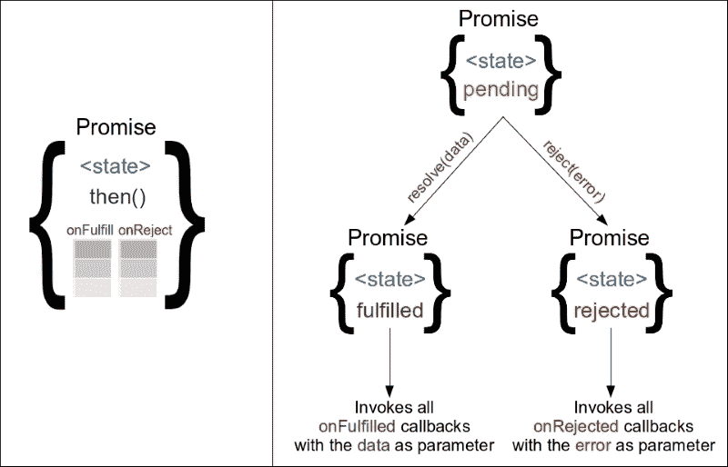

# 七、异步控制流模式

本章专门介绍用于简化异步和并发过程编程的开发模式。

首先，我们将复习一下如何在 JavaScript 编程中使用回调，以及回调如何成为 web 开发的一个组成部分。然后，我们将继续并确定它们在大型复杂实现中使用时的优点和局限性。

紧接着，我们将了解承诺的概念。我们将了解 jQuery 的延迟 API 和承诺 API 是如何工作的，以及它们与 ES6 承诺的区别。我们将看到 jQuery 在何处以及如何在内部使用它们，以简化其实现并生成更可读的代码。我们将分析它们的优点，对最佳匹配用例进行分类，并将它们与经典回调模式进行比较。

到本章结束时，我们将能够使用 jquerydeferred 和 promissions 有效地协调异步过程的执行，这些异步过程可以按顺序运行，也可以并行运行。

在本章中，我们将：

*   复习一下如何在 JavaScript 编程中使用回调
*   了解承诺的概念
*   了解如何使用 jQuery 的延迟 API 和承诺 API
*   比较 jQuery 承诺与 ES6 承诺
*   了解如何使用承诺协调异步任务。

# 使用回调进行编程

回调可以定义为一个函数，该函数作为调用参数传递给另一个函数或方法（称为高阶函数），并预期在稍后某个时间点执行。这样，传递给回调的代码片段最终将调用它，将操作或事件的结果传播回定义回调的上下文。

根据被调用方法的操作方式，回调可以被描述为同步或异步。当回调由阻塞方法执行时，其特征是同步的。另一方面，JavaScript 开发人员更熟悉**异步回调**，也称为**延迟回调**，设置为在异步过程完成后或特定事件发生（页面加载、单击、AJAX 响应到达等）时执行。



回调广泛应用于 JavaScript 应用程序中，因为它们是许多核心 JavaScript API（如 AJAX）的组成部分。此外，正如上面简单的定义所描述的，这种模式的 JavaScript 实现几乎是逐字逐句的。这是 JavaScript 将函数视为对象并允许我们将方法引用作为简单变量存储和传递的结果。

## 在 JavaScript 中使用简单回调

在 JavaScript 中，异步回调的最简单示例之一可能是`setTimeout()`函数。下面的代码演示了它的一个简单用法，我们使用`doLater()`函数作为回调参数调用`setTimeout()`，等待 1000 毫秒后，调用`doLater()`回调：

```js
var alertMessage = 'One second passed!'; 
function doLater() { 
    alert(alertMessage); 
}
setTimeout(doLater, 1000);
```

如前一个简单示例所示，回调是在其定义的上下文中执行的。回调仍然可以访问通过创建闭包定义的上下文变量。即使前面的示例使用了前面定义的命名函数，匿名回调也同样适用：

```js
var alertMessage = 'One second passed!';
setTimeout(function() { 
    alert(alertMessage); 
}, 1000);
```

在许多情况下，使用匿名回调是一种更方便的编程方式，因为它可以缩短代码并降低可读性噪音，这是定义几个只使用一次的不同命名函数的结果。

## 将回调设置为对象属性

上面的定义还有一个小的变化，回调函数被分配给对象的属性，而不是作为方法调用的参数传递。这通常用于在方法调用期间或之后需要执行多个不同操作的情况：

```js
var c = new Countdown(); 

c.onProgress = function(progressStatus) { /*...*/ };
c.onDone = function(result) {  /*...*/ };
c.onError = function(error) {  /*...*/ };

c.start();
```

上述变体的另一个用例是在已经实例化和初始化的对象上添加处理程序。这种情况的一个很好的例子是我们为简单（非 jQuery）AJAX 调用设置结果处理程序的方式：

```js
var r = new XMLHttpRequest(); 
r.open('GET', 'data.json', true); 
r.onreadystatechange = function() { 
    if (r.readyState != 4 || r.status != 200) { 
        return; 
    } 
    alert(r.responseText); 
};
r.send();
```

在前面的代码中，我们在 XMLHttpRequest 对象的`onreadystatechange`属性上设置了一个匿名函数。此函数用作回调函数，并且在每次对正在进行的请求进行状态更改时调用。在我们的回调中，我们检查请求是否已完成，并使用一个成功的 HTTP 状态代码显示一个带有响应主体的警报。就像在本例中，我们通过调用`send()`方法而不传递任何参数来启动 AJAX 调用一样，使用此变量的 API 通常会导致调用其方法的最小方式。

## 在 jQuery 应用程序中使用回调

也许在 jQuery 应用程序中使用回调的最常见方式是事件处理。这是合乎逻辑的，因为每个交互式应用程序应该做的第一件事就是处理和响应用户操作。正如我们在前面几章中看到的，将事件处理程序附加到元素的最方便的方法之一是使用 jQuery 的`$.fn.on()`方法。

jQuery 中使用回调的另一个常见地方是 AJAX 请求，`$.ajax()`方法在其中起着核心作用。此外，jQuery 库还提供了其他几种方便的方法来生成关注最常见用例的 AJAX 请求。由于所有这些方法都是异步执行的，因此它们还接受回调作为参数，以使检索到的数据返回到启动 AJAX 请求的上下文。其中一个方便的方法是`$.getJSON()`，它是`$.ajax()`的包装器，用作更好的匹配 API 来执行打算检索 JSON 响应的 AJAX 请求。

其他广泛使用的接受回调的 jQuery API 如下：

*   与 jQuery 方法相关的影响，如`$.animate()`
*   `$(document).ready()`方法

现在，让我们继续演示一个使用上述所有方法的代码示例。

```js
$(document).ready(function() { 
  $('#fetchButton').on('click', function() { 
    $.getJSON('AjaxContent.json', function(json) { 
      console.log('done loading new content'); 

      $('#newContent').css({ 'display': 'none' }) 
        .text(json.data) 
        .slideDown(function() { 
          console.log('done displaying new content'); 
        }); 
    }); 
  }); 
}); 
```

前面的代码首先延迟其执行，直到页面的 DOM 树被完全加载，然后使用 jQuery 的`$.fn.on()`方法添加一个观察者，用于点击 ID 为`fetchButton`的`<button>`。每当触发 click 事件时，将调用提供的回调并启动 AJAX 调用以获取`AjaxContent.json`文件。出于本例的需要，我们使用了一个简单的 JSON 文件，如下所示：

```js
{ "data": "I'm the text content fetched by an AJAX call!" }
```

当接收到响应并成功解析 JSON 时，将使用解析后的对象作为参数调用回调。最后，回调本身在页面中定位 ID 为`newContent`的页面元素，将其隐藏，然后将检索到的 JSON 的数据字段设置为其文本内容。紧接着，我们使用 jQuery`$.fn.slideDown()`方法，通过逐步增加页面的高度来显示新设置的页面内容。最后，动画完成后，我们向浏览器控制台写入一条日志消息。

### 注

关于 jQuery 的`$.ajax()`、`$.getJSON()`和`$.fn.slideDown()`方法的更多文档可以在[中找到 http://api.jquery.com/jQuery.ajax/](http://api.jquery.com/jQuery.ajax/) 、[http://api.jquery.com/jQuery.getJSON/](http://api.jquery.com/jQuery.getJSON/) 和[http://api.jquery.com/slideDown/](http://api.jquery.com/slideDown/) 。

请记住，当页面通过文件系统加载时，`$.getJSON()`方法可能在某些浏览器中不起作用，但在使用任何 web 服务器（如 Apache、IIS 或 nginx）提供服务时，该方法都能正常工作。

## 接受回调的编写方法

当编写一个使用一个或多个异步 API 的函数时，这也表明生成的函数根据定义是异步的。在这种情况下，很明显，简单地返回一个结果值并不是一个选项，因为在函数调用完成之后，结果可能是可用的。

异步实现最简单的解决方案是使用回调函数作为函数的参数，正如我们前面讨论的那样，在 JavaScript 中，回调函数没有任何麻烦。例如，我们将创建一个异步函数，该函数生成指定范围内的随机数：

```js
function getRandomNumberAsync (max, callbackFn) { 
    var runFor = 1000 + Math.random() * 1000; 
    setTimeout(function() { 
        var result = Math.random() * max; 
        callbackFn(result); 
    }, runFor); 
}
```

`getRandomNumberAsync()`函数接受其`max`参数作为生成的随机数的数值上限，也接受一个回调函数，该函数将调用生成的结果。它使用`setTimeout()`模拟 1000 到 2000 毫秒范围内的异步计算。对于结果的生成，它使用`Math.random()`方法，将其与允许的最大值相乘，最后调用提供的回调。调用此函数的简单方法如下所示：

```js
getRandomNumberAsync(10, function(number) { 
    console.log(number); // returns a number between 0 and 10
});
```

尽管上面的示例使用来模拟异步处理，但无论使用何种异步 API，实现原理都是相同的。例如，我们可以重写上述函数，通过 AJAX 调用检索其结果：

```js
function getRandomNumberWS (max, callbackFn, errorFn) { 
  $.ajax({ 
    url: 'https://qrng.anu.edu.au/API/jsonI.php?length=1&type=uint16', 
    dataType: 'json', 
    success: function(json) { 
      var result = json.data[0] / 65535 * max; 
      callbackFn(result); 
    }, 
    error: errorFn 
  });
}
```

前面的实现使用`$.ajax()`方法，该方法通过对象参数调用，包含请求的所有选项。除了请求的 URL 之外，该对象还定义了结果的预期`dataType`以及`success`和`error`回调，它们与我们函数的相应参数相关联。

前面的代码需要解决的唯一额外问题可能是如何处理成功回调中的错误，以便在创建结果期间出现错误时通知函数的调用方。例如，AJAX 请求可能返回一个空对象。在阅读本章其余部分后，为此类案件添加适当的处理方法是留给读者的练习。

### 注

澳大利亚国立大学（ANU）通过 REST 网络服务向公众提供免费、真正随机的数字。欲了解更多信息，请访问[http://qrng.anu.edu.au/API/api-demo.php](http://qrng.anu.edu.au/API/api-demo.php) 。

## 协调回调

现在，我们将继续分析在处理接受回调的异步方法时通常用于控制执行流的一些模式。

### 订单执行中的排队

作为我们的第一个示例，我们将创建一个函数，演示如何对多个异步任务的执行进行排队：

```js
function getThreeRandomNumbers(callbackFn, errorFn) {
    var results = []; 
    getRandomNumberAsync(10, function(number) { 
        results.push(number); 

        getRandomNumberAsync(10, function(number) { 
            results.push(number); 

            getRandomNumberWS(10, function(number) {
                results.push(number); 
                callbackFn(results); 
            }, function (error) { 
                errorFn(error); 
            }); 
        }); 
    });
}
```

在前面的实现中，我们的函数创建了一个包含三个随机数代的队列。前两个随机数是从我们的示例`setTimeout()`实现中生成的，第三个是通过 AJAX 调用从前面提到的 web 服务中检索的。在本例中，所有数字都收集在`result`数组中，在所有异步任务完成后，该数组作为调用参数传递给`callbackFn`。

前面的实现非常简单，只是重复应用回调模式的简单原理。对于每个额外的或排队的异步任务，我们只需要将其调用嵌套在它所依赖的任务的回调中。请记住，在不同的用例中，我们可能只关心返回最终任务的结果，并将中间步骤的结果作为每个后续异步调用的参数进行传播。

#### 避免回调地狱反模式

尽管上面示例中所示的编写代码很容易，但当应用于大型复杂的实现时，可能会导致可读性差。我们的代码前面的空格和靠近其末端的几个`});`的堆叠所形成的三角形，是我们的代码可能导致一种被称为**回调地狱**的反模式的两个迹象。

### 注

欲了解更多信息，您可以访问[http://callbackhell.com/](http://callbackhell.com/) 。

避免这种反模式的一种方法是展开嵌套回调，方法是在使用它们的异步任务的同一级别创建单独的命名函数。将此简单提示应用于上述示例后，生成的代码看起来更清晰：

```js
function getThreeRandomNumbers(callbackFn, errorFn) { 
    var results = []; 

    getRandomNumberAsync(10, function(number) { // task 1 
        results.push(number); 
        task2(); 
    }); 

    function task2 () { 
        getRandomNumberAsync(10, function(number) { 
            results.push(number); 
            task3(); 
        }); 
    } 

    function task3 () { 
        getRandomNumberWS(10, function(number) { 
            results.push(number); 
            callbackFn(results); 
        }, errorFn); 
    } 
}
```

正如您所看到的，生成的代码肯定不会提醒我们回调地狱反模式的特征。另一方面，它现在的实现需要更多的代码行，主要用于现在需要的附加函数声明`function taskX () { }`。

### 提示

上述两种方法之间的一个中间解决方案是将此类异步执行队列的相关部分组织在小型可管理函数中。

### 同时运行

尽管 web 浏览器中的 JavaScript 是单线程的，但使独立的异步任务并发运行可以使我们的应用程序工作得更快。例如，我们将重写前面的实现以并行获取所有三个随机数，这可以使检索结果的速度比以前快得多：

```js
function getRandomNumbersConcurent(callbackFn, errorFn) { 
    var results = []; 
    var resultCount = 0; 
    var n = 3; 

    function gatherResult (resultPos) { 
        return function (result) { 
            results[resultPos] = result; 
            resultCount++; 
            if (resultCount === n) { 
                callbackFn(results); 
            } 
        }; 
    } 

    getRandomNumberAsync(10, gatherResult(0)); 
    getRandomNumberAsync(10, gatherResult(1)); 
    getRandomNumberWS(10, gatherResult(2), errorFn); 
}
```

在前面的代码中，我们定义了`gatherResult()`helper 函数，它返回一个匿名函数，该函数用作随机数生成器的回调函数。返回的回调函数使用`resultPos`参数作为数组的索引，它将在其中存储生成的或检索到的随机数。此外，它还跟踪它被调用的次数，以了解是否所有三个并发任务都已结束。最后，在回调的第三次也是最后一次调用之后，`callbackFn`函数以`results`数组作为参数进行调用。

除了 AJAX 调用之外，该技术的另一个伟大的应用是访问**IndexedDB**中存储的数据。同时从数据库中检索多个值可以提高性能，因为数据检索可以并行执行，而不会相互阻塞。

### 注

有关 IndexedDB 的更多信息，请访问[https://developer.mozilla.org/en-US/docs/Web/API/IndexedDB_API/Using_IndexedDB](https://developer.mozilla.org/en-US/docs/Web/API/IndexedDB_API/Using_IndexedDB) 。

# 引入承诺的概念

承诺，也称为未来，被计算机科学描述为用于同步异步、并发或并行过程的专用对象。它们还用作代理，在任务生成完成时传播任务的结果。这样，承诺对象就像一个合同，其中一个操作最终将完成其执行，任何引用此合同的人都可以声明他们的利益，以获得有关结果的通知。

由于它们是作为几个库的一部分介绍给 JavaScript 开发人员的，因此它们彻底改变了我们使用异步函数的方式，并在实现中使用复杂的同步方案组合它们。通过这种方式，web 开发人员可以创建更灵活、可伸缩和可读的实现，使回调方法调用看起来像一种基本模式，并有效地消除回调地狱的情况。



承诺的关键概念之一是异步方法返回一个表示其最终结果的对象。每个承诺都有一个内部状态，最初以挂起状态开始。通过使用每个实现提供的`resolve()`或`reject()`方法之一，该内部状态只能更改一次，从挂起更改为已解决或已拒绝。这些方法只能用于更改挂起承诺的状态；在大多数情况下，它们仅用于 Promise 对象的原始创建者，而不提供给其消费者。`resolve()`方法可以使用操作结果作为单个参数调用，而`reject()`方法通常使用导致 Promise 对象被拒绝的`Error`进行调用。

承诺的另一个关键概念是`then()`方法的存在，使其具有“thenable”的特征，作为描述所有不同实现中的承诺的通用术语。每个 Promise 对象都公开了一个`then()`方法，调用方使用该方法来提供在解决（解决或拒绝）Promise 时将调用的函数。`then()`方法可以使用两个函数作为参数调用，其中第一个函数在承诺得到解决时调用，第二个函数在承诺被拒绝时调用。第一个参数通常被称为`onFulfilled()`回调，而第二个参数被称为`onRejected()`。



每个承诺保留两个内部列表，其中包含作为参数传递给`then()`方法的所有`onFulfilled()`和`onRejected()`回调函数。`then()`方法可以为每个承诺调用多次，向适当的内部列表添加新条目，只要相应的参数实际上是一个函数。当一个承诺最终得到解决或拒绝时，它会遍历相应的回调列表并按顺序调用它们。此外，从承诺得到解决的那一点开始，以及之后，`then()`方法的每一次进一步使用都会立即调用相应提供的回调。

### 注

基于其特性，在某种程度上，可以将承诺比作发布/订阅模式中的代理。它们的主要区别包括，它只能用于一次发布，而且订阅者即使在发布后表达了兴趣，也会收到结果通知。

## 使用承诺

正如我们前面所说的，承诺的概念彻底改变了 JavaScript 中异步任务的编程，在很长一段时间里，它们是每个人都热衷的新事物。当时，出现了许多专门的图书馆，每个图书馆都提供了承诺的实现，彼此之间略有不同。此外，Promise 实现成为 jQuery 等实用程序库和 AngularJS 和 EmberJS 等 web 框架的一部分。当时，“CommonJS Promissions/A”规范作为一个参考点出现，是第一次尝试定义承诺应该如何在所有实现中实际工作。

### 注

有关“CommonJS 承诺/A”规范的更多信息，请访问[http://wiki.commonjs.org/wiki/Promises/A](http://wiki.commonjs.org/wiki/Promises/A) 。

### 使用 jQuery Promise API

基于承诺的 API 首次出现在 1.5 版的 jQuery 库中，基于“CommonJS 承诺/A”设计。此实现引入了延迟对象的附加概念，其工作方式类似于**承诺工厂**。延迟对象公开了承诺提供的方法的超集，其中可以使用其他方法对其内部承诺的状态进行操作。此外，延迟对象公开了一个`promise()`方法并返回实际的 Promise 对象，该对象不公开任何操纵其内部状态的方法，只公开了`then()`等观察方法。

换言之：

*   只有引用了延迟对象的代码才能通过解析或拒绝它来实际更改其承诺的内部状态。
*   任何引用 Promise 对象的代码都不能更改其状态，只能观察其状态是否更改。

### 注

有关 jQuery 的延迟对象的更多信息，请访问[http://api.jquery.com/jQuery.Deferred/](http://api.jquery.com/jQuery.Deferred/) 。

作为 jQuery 延迟对象的一个简单示例，让我们看看如何重写本章前面看到的`getRandomNumberAsync()`函数，使用承诺而不是回调：

```js
function getRandomNumberAsync (max) { 
    var d = $.Deferred(); 
    var runFor = 1000 + Math.random() * 1000; 
    setTimeout(function() { 
        var result = Math.random() * max; 
        d.resolve(result); 
    }, runFor); 
    return d.promise(); 
} 

getRandomNumberAsync(10).then(function(number) { 
    console.log(number); // returns a number between 0 and 10 
});
```

我们的目标是生成一个异步函数，该函数返回一个承诺，并最终解析为结果随机数。首先，创建一个新的延迟对象，然后使用延迟对象的`promise()`方法返回相应的承诺对象。当异步生成结果完成时，我们的方法使用延迟的**对象的`resolve()`方法来设置先前返回的承诺的最终状态。**

 **我们函数的调用者使用返回的 Promise 的`then()`方法，附加一个回调，一旦 Promise 得到解析，就会调用该回调，并将结果作为参数。此外，还可以传递第二个回调，以便在承诺被拒绝时得到通知。需要注意的一点是，通过遵循上面的模式（函数总是返回承诺，而不是实际的延迟对象），我们可以确保只有延迟对象的创建者才能更改承诺的状态。

### 使用承诺/A+

在对 CommonJS Promises/A 进行了一段时间的实践性实验后，社区发现了它们的一些局限性，并推荐了一些改进方法。其结果是创建了 Promises/A+规范，作为改进现有规范的一种方法，也是统一各种可用实现的第二次尝试。新规范最重要的部分集中于链接承诺应该如何工作，使它们更加有用和方便。

### 注

有关承诺/A+规范的更多信息，请访问[https://promisesaplus.com/](https://promisesaplus.com/) 。

最后，Promises/A+规范作为第 6 版 JavaScript（通常称为 ES6）的一部分发布，该版本于 2015 年 6 月作为标准发布。因此，Promissions/a+开始在浏览器中本机实现，不再需要使用定制的第三方库，并促使大多数现有库升级其语义。在撰写本书时，除了 IE11 之外，大多数现代浏览器都提供了符合原生 Promises/A+的实现，使超过 65%的 web 用户可以使用这些实现。

### 注

有关在浏览器中采用 A+承诺的更多信息，您可以访问[http://caniuse.com/#feat=promises](http://caniuse.com/#feat=promises) 。

使用目前本机实现的 ES6 A+Promises 重写`getRandomNumberAsync()`函数如下所示：

```js
function getRandomNumberAsync (max) { 
    return new Promise(function (resolve, reject) { 
        var runFor = 1000 + Math.random() * 1000; 
        setTimeout(function() { 
            var result = Math.random() * max; 
            resolve(result); 
        }, runFor); 
    }); 
} 

getRandomNumberAsync(10).then(function(number) { 
    console.log(number); // returns a number between 0 and 10 
});
```

如您所见，ES6/A+承诺是通过使用带有`new`关键字的承诺构造函数创建的。构造函数是以函数作为参数调用的，这使得闭包既可以访问创建承诺的上下文变量，也可以访问作为参数的`resolve()`和`reject()`函数，这是更改新创建承诺状态的唯一方法。在`setTimeout()`函数触发回调后，将使用生成的随机数作为参数调用`resolve()`函数，从而将 Promise 对象的状态更改为 Completed。最后，我们函数的调用方使用返回承诺的`then()`方法，与我们在前面使用 jQuery 的实现中看到的方式完全相同。

### 比较 jQuery 和 A+承诺

现在，我们将对 jQuery 和 A+Promise API 的核心概念进行深入的逐步分析，同时对两者进行并行代码比较。这可能是一项很好的资产，因为在 Promises 的实现逐渐适应 ES6 a+规范时，您也可以将其用作参考。

从一开始就需要了解这两个变体的区别，因为 jQuery 团队已经宣布 3.0 版的库将有承诺/A+兼容的实现。具体来说，在撰写本书时，第一个 beta 版已经发布，这使得迁移的时间变得更加紧迫。

### 注

有关 jQueryV3.0A+承诺实现的更多信息，请访问[http://blog.jquery.com/2016/01/14/jquery-3-0-beta-released/](http://blog.jquery.com/2016/01/14/jquery-3-0-beta-released/) 。

这两种实现之间最明显的区别之一是创建新承诺的方式。正如我们所看到的，jQuery 使用`$.Deferred()`函数就像一个更复杂对象的工厂，提供对承诺状态的直接访问，并最终使用单独的方法提取实际承诺。另一方面，A+承诺使用`new`关键字和函数作为参数，运行时将以`resolve()`和`reject()`函数作为参数调用：

```js
var d = $.Deferred(); 
setTimeout(function() { 
    d.resolve(7); 
}, 2000); 
var p = d.promise(); // jQuery Promise

var p = new Promise(function(resolve, reject) { // Promises/A+
    setTimeout(function() { 
        resolve(7); 
    }, 2000); 
});
```

此外，jQuery 还提供了另一种创建承诺的方法，这种方法看起来更像 A+承诺的工作方式。在这种情况下，`$.Deferred()`可以通过函数作为参数调用，该参数接收延迟对象作为参数：

```js
var d = $.Deferred(function (deferred) { 
    setTimeout(function() { 
        deferred.resolve(7); 
    }, 2000); 
}); 
var p = d.promise(); 
```

正如我们前面所讨论的，承诺的第二个可能结果是被拒绝，这一特性与同步编程中 JavaScript 的经典异常非常吻合。拒绝承诺通常用于处理结果过程中出现错误的情况，或结果无效的情况。虽然 ES6 承诺提供`reject()`函数作为传递给其构造函数的函数的参数，但在 jQuery 的实现中，`reject()`方法只是在延迟对象本身上公开。

```js
var p = $.Deferred(function (deferred) { 
    deferred.reject(new Error('Something happened!')); 
}).promise(); 

var p = new Promise(function(resolve, reject) { 
    reject(new Error('Something happened!')); 
});
```

在这两种实现中，可以使用`then()`方法检索承诺的结果，该方法可以使用两个函数作为参数调用，一个用于处理承诺得到履行的情况，另一个用于拒绝承诺的情况：

```js
p.then(function(result) { // works the same in jQuery & ES6
    console.log(result); 
}, function(error) { 
    console.error('An error occurred: ', error); 
});
```

这两种实现还提供了方便的方法来处理承诺被拒绝的情况，但方法名称不同。ES6 承诺提供与 try…catch JavaScript 表达式完美匹配的`catch()`方法，而不是使用`p.then(null, fn)`，而 jQuery 的实现提供`fail()`方法，用于相同目的：

```js
p.fail(function(error) { // jQuery
    console.error(error); 
}); 

p.catch(function(error) { // ES6
    console.error(error); 
});
```

此外，作为 jQuery 独有的特性，jQuery 还承诺公开一个`done()`和`always()`方法。提供给`done()`的回调在承诺实现时调用，相当于使用带有单个参数的`then()`方法，而`always()`方法的回调在承诺在两种可能的结果中都得到解决时调用。

### 注

有关`done()`和`always()`的更多信息，请访问[http://api.jquery.com/deferred.done](http://api.jquery.com/deferred.done) 和[http://api.jquery.com/deferred.always](http://api.jquery.com/deferred.always) 。

最后，两种实现都提供了一种简单的方法，可以直接创建已经解决或拒绝的承诺。这可以作为实现复杂同步方案的起始值，也可以作为使同步功能像异步功能一样运行的简单方法：

```js
var pResolved = $.Deferred().resolve(7).promise(); // jQuery
var pRejected = $.Deferred().reject(new Error('Something happened!')).promise(); 

var pResolved = Promise.resolve(7); // ES6
var pRejected = Promise.reject(new Error('Something happened!'));
```

## 先进理念

承诺的另一个关键概念使其独特并大大提高了其有用性，这就是能够轻松地创建多个承诺的组合，而这些承诺本身就是承诺。组合有两种形式，一种是将承诺链接在一起的串行组合，另一种是使用特殊方法将并发承诺的解析合并为新的并行组合。正如我们在本章前面所看到的，用传统的回调方法很难实现这样的同步方案。另一方面，Promises 则试图以一种更方便易读的方式解决这个问题。

# 连锁承诺

每次调用方法`then()`都会返回一个新的承诺，其最终状态和结果取决于调用`then()`方法的承诺，但也取决于所附回调返回的值。这允许我们链接`then()`方法的调用，使我们能够通过连续加入它们来撰写承诺。通过这种方式，我们可以轻松地编排异步和同步代码，其中每个链接步骤将其结果传播到下一个步骤，并允许我们以可读和声明的方式构造最终结果。

现在让我们继续分析将调用链接到`then()`方法的所有不同方式。由于我们将重点讨论通过链接组合承诺的概念，其工作原理与 jQuery 和 ES6 承诺相同，因此我们假设有一个`p`变量，它包含由以下代码行创建的承诺对象：

```js
var p = $.Deferred().resolve(7).promise(); 
//or 
var p = Promise.resolve(7);
```

演示链接功能的最简单的用例是调用的回调返回（非承诺）值。新创建的承诺使用返回值作为其结果，同时保留与调用`then()`方法的承诺相同的状态：

```js
p.then(function(x) { // works the same in jQuery & ES6
    console.log(x); // logs 7 
    return x * 3; 
}).then(function(x) { 
    console.log(x); // logs 21 
});
```

需要注意的一个特殊情况是，不会返回任何结果的函数的处理方式类似于返回`undefined`。这实际上会从新返回的承诺中删除结果值，该承诺现在只保留父结算状态：

```js
p.then(function(x) { // works the same in jQuery & ES6
    console.log(x); // logs 7 
}).then(function(x) { 
    console.log(x); // logs undefined 
});
```

在调用的回调返回另一个承诺的情况下，其状态和结果用于`then()`方法返回的承诺：

```js
p.then(function(x) { // for jQuery Promises
    console.log(x); // logs 7 
    var d2 = $.Deferred(); 
    setTimeout(function() { 
        d2.resolve(x*3); 
    }, 2000); 
    return d2.promise(); 
}).then(function(x) { 
    console.log(x); // logs 21 
}); 

p.then(function(x) { // for the A+ Promises
    console.log(x); // logs 7 
    return new Promise(function(resolve) { 
        setTimeout(function() { 
            resolve(x*3); 
        }, 2000); 
    }); 
}).then(function(x) { 
    console.log(x); // logs 21 
});
```

前面的代码示例演示了 jQuery 和 A+承诺的实现，它们都有相同的结果。在这两种情况下，**7**从第一次`then()`方法调用登录到控制台，然后返回一个新的承诺，该承诺将在稍后使用`setTimeout()`解决。在 2000 毫秒后，`setTimeout()`将触发其回调，返回的承诺将以`21`作为值进行解析，此时，`21`也将登录控制台。

另外需要注意的是，在这种情况下，原始承诺得到了解决，并且没有向 chained`then()`方法提供适当的回调。在这种情况下，新创建的承诺与调用`then()`方法的承诺处于相同的状态和结果：

```js
p.then(null, function (error) { // works the same in jQuery & ES6
    console.error('An error happened!');// does not run, since the promise is resolved
}).then(function(x) { 
    console.log(x); // logs 7 
});
```

在前面的示例中，带有作为`then()`方法的第二个参数传递的`console.error`语句的回调不会被调用，因为承诺是以 7 作为其值解析的。因此，链的回调最终会收到一个新的承诺，该承诺也会以`7`作为其值进行解析，并将其记录在控制台中。为了深入理解承诺链是如何运作的，需要牢记的是`p != p.then()`在所有情况下都是如此。

## 处理抛出的错误

链接的最后一个概念定义了在`then()`回调调用期间抛出异常的情况。Promise/A+规范定义新创建的 Promise 被拒绝，其结果是抛出的`Error`。此外，拒绝将贯穿整个承诺链，使我们能够在链中的任何错误中得到通知，只定义一次错误处理，接近链的末端。

不幸的是，在 jQuery 的最新稳定版本的实现中，这一点并不一致，截至本书撰写之时，jQuery 是 v2.2.0：

```js
$.Deferred().resolve().promise().then(function() { 
    throw new Error('Something happened!'); 
    // the execution stops here
}).then(null, function(x) { 
    console.log(x); // nothing gets printed
}); 

$.Deferred().resolve().promise().then(function() { 
    try { // this is a workaround 
        throw new Error('Something happened!'); 
    } catch (e) { 
        return $.Deferred().reject(e).promise(); 
    } 
}).then(function(){ 
    console.log('Success'); // not printed 
}).then(null, function(x) { // almost equivalent to .fail()
    console.log(x); // logs 'Something happened!'' 
}); 

Promise.resolve().then(function() { 
    throw new Error('Something happened!'); 
}).then(function(){ 
    console.log('Success'); // not printed 
}).then(null, function(x) { // equivalent to .catch()
    console.log(x); // logs 'Something happened!''
});
```

在第一种情况下，抛出的异常会停止承诺链的执行。唯一的解决方法可能是在回调中显式地添加一个 try…catch 语句，该语句被传递给`then()`方法，如第二个示例所示。

## 加入承诺

另一种协调同时运行的承诺的方法是将它们组合在一起。例如，假设存在两个承诺 p1 和 p2，分别在 2000 毫秒和 3000 毫秒后以 7 和 11 作为其值进行解析。由于这两个承诺是同时执行的，因此组合承诺只需 3000 毫秒即可得到解决，因为它是两个持续时间中的较大者：

```js
// jQuery
$.when(p1, p2).then(function(result1, result2) { 
    console.log('p1', result1); // logs 7 
    console.log('p2', result2); // logs 11 
    // this can be used to make our code look like A+ 
    var results = arguments;
}); 

// A+ 
Promise.all([p1, p2]).then(function(results) { 
    console.log('p1', results[0]); // logs 7 
    console.log('p2', results[1]); // logs 11 
});
```

这两个 PromiseAPI 都提供了一个专门的函数，允许我们轻松创建 Promise 组合，并检索组合的单个结果。组合承诺在其所有部分得到解决时得到解决，而在其任何一部分被拒绝时得到拒绝。不幸的是，这两个 Promise API 的不同之处不仅在于函数的名称，还在于调用它们的方式以及它们提供结果的方式。

jQuery 实现提供了`$.when()`方法，可以使用我们想要组合的任意数量的参数调用该方法。通过对组合 jQuery 承诺使用`then()`方法，我们可以在组合作为一个整体解决时得到通知，还可以访问每个单独的结果作为回调的参数。

另一方面，A+Promises 规范为我们提供了`Promise.all()`方法，该方法以数组作为其单个参数进行调用，该参数包含我们想要合成的所有承诺。返回的组合承诺与我们到目前为止看到的承诺没有任何区别，`then()`方法的回调是以数组作为参数调用的，其中包含组合中承诺的所有结果。

## jQuery 如何使用承诺

当 jQuery 在其 API 中添加承诺的实现时，它也开始通过其 API 的其他异步方法公开它。也许这类最著名的例子是`$.ajax()`家族的方法，它返回一个 jqXHR 对象，这是一个专门的 Promise 对象，它还提供了一些与 AJAX 请求相关的额外方法。

### 注

有关 jQuery 的`$.ajax()`方法和 jqXHR 对象的更多信息，您可以访问[http://api.jquery.com/jQuery.ajax/#jqXHR](http://api.jquery.com/jQuery.ajax/#jqXHR) 。jQuery 团队还决定将库的几个内部部分的实现更改为使用承诺，以改进它们的实现。首先，`$.ready()`方法是使用承诺实现的，这样即使页面在调用之前已经加载了很长时间，也会触发提供的回调。此外，jQuery 提供的一些复杂动画在内部使用承诺作为同步动画队列的顺序部分的执行的首选方式。

## 将承诺转化为其他类型

通过使用几个不同的 JavaScript 库进行开发，我们的项目通常可以使用许多 Promise 实现，不幸的是，这些实现往往与参考 Promises 规范有不同程度的一致性。编写由不同库的方法返回的承诺通常会导致难以跟踪和解决的问题，因为它们的实现不一致。

为了避免在这种情况下产生混淆，在尝试编写承诺之前将所有承诺转换为单一类型被认为不是一种好的做法。对于这种情况，建议使用 Promises/A+规范，因为它不仅被社区广泛接受，而且也是新发布的 JavaScript 版本（ES6 语言规范）的一部分，该版本已经在许多浏览器中本机实现。

### 转变为承诺/A+

例如，让我们看看如何将 jQuery 承诺转换为最新浏览器中可用的 a+承诺：

```js
var jqueryPromise = $.Deferred().resolve('I will be A+ compliant').promise(); 
var p = Promise.resolve(jqueryPromise); 
p.then(function(result) { 
    console.log(result); 
});
```

在前面的示例中，`Promise.resolve()`方法检测到它已被“thenable”调用，并且返回的新创建的 a+承诺将其状态和结果绑定到提供的 jQuery 承诺的状态和结果。这基本上等同于做如下事情：

```js
var p = new Promise(function (resolve, reject) { 
    jqueryPromise.then(resolve, reject); 
});
```

当然，这并不局限于通过直接调用`$.Deferred()`方法创建的承诺。上述技术也可用于转换任何 jQuery 方法返回的承诺。例如，这是如何与`$.getJSON()`方法一起使用的：

```js
var aPlusAjaxPromise = Promise.resolve($.getJSON('AjaxContent.json')); 
aPlusAjaxPromise.then(function(result) { 
    console.log(result); 
}); 
```

### 转换为 jQuery 承诺

尽管我通常不建议这样做，但也可以将任何承诺转换为 jQuery 变体。新创建的 jQuery 承诺接收 jQuery 提供的所有额外功能，但转换并不像前一个那样简单：

```js
var aPromise = Promise.resolve('I will be a jQuery Promise'); 
var p = $.Deferred(function (deferred) { 
    aPromise.then(function(result) { 
        return deferred.resolve(result); 
    }, function(error) { 
        return deferred.reject(error); 
    }); 
}).promise();
p.then(function(result) { 
    console.log(result); 
});
```

您应该只在需要扩展已经使用 jQuery 实现的大型 web 应用程序的情况下使用上述技术。另一方面，您也应该考虑升级这样的实现，因为 jQuery 团队已经宣布库的版本 3 将具有承诺/A+兼容的实现。

### 注

有关 jQuery v3.0 A+承诺实现的更多信息，请访问[http://blog.jquery.com/2016/01/14/jquery-3-0-beta-released/](http://blog.jquery.com/2016/01/14/jquery-3-0-beta-released/) 。

## 总结承诺的好处

总的来说，使用承诺优于普通回调的好处包括：

*   具有处理异步调用结果的统一方法
*   为所用回调提供可预测的调用参数
*   为承诺的每个结果附加多个处理程序的能力
*   即使已解决（或拒绝）承诺，适当的附加处理程序也将执行的保证
*   链接异步操作的能力，使其有序运行
*   能够轻松创建异步操作的组合，使其并发运行
*   承诺链中错误处理的简便方法

使用返回承诺的方法可以消除将一个上下文的函数作为调用参数直接传递给另一个上下文的需要，以及将哪些参数用作成功和错误回调的问题。此外，我们在某种程度上已经知道如何使用`then()`方法检索任何返回承诺的操作的结果，甚至在阅读有关该方法调用参数的文档之前。

参数越少通常意味着复杂性越低，文档越小，每次调用方法时搜索的次数越少。更好的是，很有可能只有一个或几个参数，这使得调用更加合理和可读。异步方法的实现也变得不那么复杂，因为不再需要接受回调函数作为额外的参数，也不需要用结果正确地调用它们。

# 总结

在本章中，我们分析了用于编写异步和并发过程的开发模式。我们还学习了如何使用它们高效地协调异步过程的执行，这些异步过程可以按顺序运行，也可以并行运行。

首先，我们复习了如何在 JavaScript 编程中使用回调，以及回调如何成为 web 开发的一个组成部分。我们分析了它们在大型复杂实现中使用时的优点和局限性。

就在这之后，我们被介绍了承诺的概念。我们了解了 jQuery 的延迟 API 和承诺 API 是如何工作的，以及它们与 ES6 承诺的区别。我们还看到了 jQuery 本身在何处以及如何在内部使用它们，作为一个示例，说明了它们如何产生更可读的代码并简化这些复杂的实现。

在下一章中，我们将继续学习如何在应用程序中设计、创建和使用模拟**对象和模拟服务。我们将分析一个适当的模拟对象应该具有的特性，并理解如何将它们用作代表性用例，甚至用作代码的测试用例。****