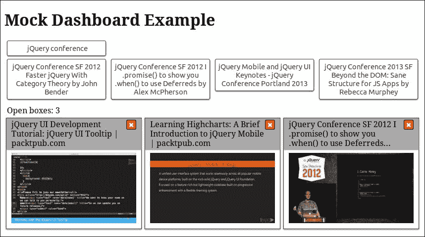

# 八、模拟对象模式

在本章中，我们将展示 Mock 对象模式，这是一种促进应用程序开发的模式，而实际上不属于最终实现的一部分。我们将学习如何设计、创建和使用此行业标准设计模式，以便更快地协调和完成多部分 jQuery 应用程序的开发。我们将分析一个适当的模拟对象应该具有的特性，并理解如何将它们用作代表性用例，甚至用作代码的测试用例。

我们将看到良好的应用程序体系结构如何通过匹配应用程序的各个部分使我们更容易使用模拟对象和服务，并在开发过程中实现使用它们的好处。到本章结束时，我们将能够创建模拟对象和服务，以加速应用程序的实现，并在其所有部分完成之前很久就了解整体功能。

在本章中，我们将：

*   介绍模拟对象和模拟服务模式
*   分析模拟对象和服务应具有的特征
*   了解为什么它们更适合具有良好体系结构的应用程序
*   了解如何在 jQuery 应用程序中使用它们作为驱动开发和加速开发的一种方式

# 引入模拟对象模式

模拟对象模式的关键概念是创建和使用虚拟对象，该虚拟对象模拟作为（或将成为）实现一部分的更复杂对象的行为。模拟对象应该与实际（或真实）对象具有相同的 API，使用相同的数据结构返回类似的结果，并且在其方法如何改变其公开状态（属性）方面也以类似的方式操作。

模拟对象通常在应用程序的早期开发阶段创建。他们的主要用例是使我们能够继续开发模块，即使它依赖于尚未实现的其他模块。模拟对象也可以被描述为实现不同部分之间交换数据的原型，就像开发人员之间的契约一样，简化了相互依赖模块的并行开发。

### 提示

正如模块模式的原理将应用程序不同部分的实现解耦一样，创建和使用模拟对象和模拟服务将它们的开发解耦。

在开始实现之前为每个模块创建模拟对象清楚地定义了应用程序将使用的数据结构和 API，消除了任何误解，并使我们能够检测所建议的 API 中的不足。

### 提示

在开始实际实现之前定义描述问题所需的数据结构，使我们能够关注应用程序的需求，并了解其总体复杂性和结构。

在任何代码更改之后，始终可以使用为原始实现创建的模拟对象来测试实现的任何部分。您可以通过在修改的方法上使用模拟对象来确保原始用例仍然有效。当修改后的实现是涉及多个阶段的用例的一部分时，这非常有用。

如果模块的实现发生了更改并导致应用程序的其余部分行为异常，那么模拟对象对于跟踪错误尤其有用。通过使用现有的模拟对象，我们可以很容易地识别偏离原始规范的模块。此外，相同的模拟对象可以用作高质量测试用例的基础，因为它们通常包含更真实的样本数据，如果您的团队遵循测试驱动开发（TDD）范式，这一点尤其有用。

### 注

在测试驱动开发（TDD）中，开发人员首先为需要添加的用例或新特性定义一个测试用例，然后通过尝试满足创建的测试用例来继续其实现。欲了解更多信息，请访问：[https://www.packtpub.com/books/content/overview-tdd](https://www.packtpub.com/books/content/overview-tdd) 。

前端 web 开发人员通常使用模拟对象模式来将客户端开发与后端将公开的 web 服务分离。这导致了一些诙谐的评论，如：

> “web 服务总是很晚&会突然更改，因此请改用模拟。”

综上所述，创建模拟对象和服务的主要原因包括：

*   实际的对象或服务尚未实现。
*   实际对象很难为特定用例设置。
*   我们需要模拟一种罕见的或不确定的行为。
*   实际对象的行为方式很难重现，例如网络错误或 UI 事件。

# 在 jQuery 应用程序中使用模拟对象

为了演示如何在多部分应用程序的开发过程中使用模拟对象模式，我们将扩展仪表板示例，如[第 4 章](04.html#OPEK1-e8d3cd3d052d4ee0b4673af57a64ddef "Chapter 4. Divide and Conquer with the Module Pattern")所示，*使用模块模式*进行分治，为了展示网络开发会议上 YouTube 视频的缩略图。视频参考分为四个预定义类别，相关按钮将根据当前类别选择显示，如下图所示：



需要引入 HTML 和 CSS 的更改非常少。与[第 4 章](04.html#OPEK1-e8d3cd3d052d4ee0b4673af57a64ddef "Chapter 4. Divide and Conquer with the Module Pattern")中已有的*模块模式*的分治实现相比，上述实现所需的唯一额外 CSS 与缩略图的宽度有关：

```js
.box img { 
  width: 100%; 
}
```

HTML 中的变化旨在组织每个类别的`<button>`元素。这一更改将使我们的实现更加简单，因为类别及其项不再在 HTML 中静态定义，而是由可用数据驱动动态创建。

```js
      <!-- … -->
      <section class="dashboardCategories"> 
        <select id="categoriesSelector"></select> 
        <div class="dashboardCategoriesList"></div> 
        <div class="clear"></div> 
      </section> 
      <!-- … -->
```

在上面的 HTML 片段中，带有`dashboardCategoriesList`CSS 类的`<div>`元素将用作不同视频类别的分组按钮的容器。在介绍了 UI 元素之后，现在让我们继续分析 JavaScript 实现。

## 定义实际服务需求

可以从各种来源检索仪表板中显示的视频参考。例如，您可以直接调用 YouTube 的客户端 API 或对后端 web 服务进行 AJAX 调用。在上述所有情况下，按照前面章节的代码结构建议，将此数据检索机制抽象为单独的模块被认为是一种良好的做法。

因此，我们需要在现有实现中添加一个额外的模块。这将是一项服务，负责提供方法，允许我们从每个类别中检索最相关的视频，并分别加载每个视频的信息。这将分别通过使用`searchVideos()`和`getVideo()`方法实现。

正如我们已经说过的，每个实现最重要的阶段之一，特别是在并行开发的情况下，是要使用的数据结构的分析和定义。由于我们的仪表板将使用 YouTube API，因此我们需要创建一些遵循其数据结构规则的示例数据。检查完 API 后，我们得到了仪表板所需的字段子集，并可以继续使用模拟数据创建 JSON 对象，以演示所使用的数据结构：

```js
{ 
  "items": [{ 
    "id": { "videoId": "UdQbBq3APAQ" }, 
    "snippet": { 
      "title": "jQuery UI Development Tutorial: jQuery UI Tooltip | packtpub.com", 
      "thumbnails": { 
        "default": { "url": "https://i.ytimg.com/vi/UdQbBq3APAQ/default.jpg" }, 
        "medium": { "url": "https://i.ytimg.com/vi/UdQbBq3APAQ/mqdefault.jpg" }, 
        "high": { "url": "https://i.ytimg.com/vi/UdQbBq3APAQ/hqdefault.jpg" } 
      } 
    } 
  }/*,...*/]
}
```

### 注

有关 YouTube API 的更多信息，请访问：[https://developers.google.com/youtube/v3/getting-started](https://developers.google.com/youtube/v3/getting-started) 。

我们的服务提供两种核心方法，一种用于搜索特定类别的视频，另一种用于检索特定视频的信息。示例对象的结构用于搜索方法以检索一组相关项，而用于检索单个视频信息的方法使用每个单独项的数据结构。视频信息检索的最终实现在一个名为`videoService`的单独模块中，该模块将在`dashboard.videoService`名称空间中提供，我们的 HTML 将包含一个`<script>`引用，如下所示：

```js
<script type="text/javascript" src="dashboard.videoservice.js"></script>
```

## 实现模拟服务

将服务实现的`<script>`引用更改为模拟服务，反之亦然，这将给我们留下一个可用的应用程序，帮助我们在视频服务的实际实现完成之前推进和测试其余的实现。因此，模拟服务需要使用相同的`dashboard.videoService`名称空间，但它的实现应该在一个名称不同的文件中，例如`dashboard.videoservicemock.js`，该文件只是添加了“模拟”后缀。

正如我们已经提到的，将所有模拟数据放在一个变量下是一个很好的实践。此外，如果有很多模拟对象，通常会将它们放在一个不同的文件中，并带有嵌套的名称空间。在我们的例子中，包含模拟数据的文件名为`dashboard.videoservicemock.mockdata.js`，名称空间为`dashboard.videoService.mockData`，同时公开了模拟服务的两个核心方法将使用的`searches`和`videos`属性。

尽管模拟服务的实现应该是简单的，但它们有其自身的复杂性，因为它们需要提供与目标实现相同的方法，接受相同的参数，并且看起来好像它们以完全相同的方式运行。例如，在我们的例子中，视频检索服务需要是异步的，其实现需要返回承诺：

```js
(function() { // dashboard.videoservicemock.js
    'use strict'; 

    dashboard.videoService = dashboard.videoService || {}; 

    dashboard.videoService.searchVideos = function(searchKeywords) { 
        return $.Deferred(function(deferred) { 
            var searches = dashboard.videoService.mockData.searches; 
            for (var i = 0; i < searches.length; i++) { 
                if (searches[i].keywords === searchKeywords) { 
                    // return the first matching search results 
                    deferred.resolve(searches[i].data); 
                    return; 
                } 
            } 
            deferred.reject('Not found!'); 
        }).promise(); 
    }; 

    dashboard.videoService.getVideo = function(videoTitle) { 
        return $.Deferred(function(deferred) { 
            var videos = dashboard.videoService.mockData.allVideos;
            for (var i = 0; i < videos.length; i++) { 
                if (videos[i].snippet.title === videoTitle) { 
                    // return the first matching item 
                    deferred.resolve(videos[i]); 
                    return; 
                } 
            } 
            deferred.reject('Not found!'); 
        }).promise(); 
    }; 

    var videoBaseUrl = 'https://www.youtube.com/watch?v='; 
    dashboard.videoService.getVideoUrl = function(videoId) { 
        return videoBaseUrl + videoId; 
    }; 
})(); 
```

如上面的模拟服务实现所示，`searchVideos()`和`getVideo()`方法正在使用模拟数据对数组进行迭代，并返回一个承诺，该承诺要么使用适当的模拟对象进行解析，要么在找不到此类对象时被拒绝。最后，您可以在下面看到包含模拟对象的子模块的代码，遵循我们前面描述的数据结构。请注意，我们将所有类别的模拟对象存储在`allVideos`属性中，以简化使用模拟`getVideo()`方法的搜索。

```js
(function() { // dashboard.videoservicemock.mockdata.js
    'use strict'; 

    dashboard.videoService.mockData = dashboard.videoService.mockData || {}; 

    dashboard.videoService.mockData.searches = [{ 
        keywords: 'jQuery conference', 
        data: { 
            "items": [/*...*/] 
        } 
    }/*,...*/]; 

    var allVideos = []; 
    var searches = dashboard.videoService.mockData.searches; 
    for (var i = 0; i < searches.length; i++) { 
        allVideos = allVideos.concat(searches[i].data.items);
    } 

    dashboard.videoService.mockData.allVideos = allVideos; 
})(); 
```

对一些模拟服务的实现进行实验将使您在很短的时间内熟悉它们的常见实现模式。除此之外，您还可以轻松创建模拟对象和服务，帮助您设计应用程序的 API，通过使用模拟进行尝试，并最终确定每个用例的最佳匹配方法和数据结构。

### 提示

**使用 jQuery Mockjax 库**

Mockjax jQuery 插件库（可在[上找到）https://github.com/jakerella/jquery-mockjax](https://github.com/jakerella/jquery-mockjax) 专注于提供一种模拟或模拟 AJAX 请求和响应的简单方法。如果您只需要拦截对 web 服务的 AJAX 请求并返回一个模拟对象，那么这就减少了完全实现您自己的模拟服务所需的代码。

## 使用模拟服务

为了将前面描述的功能添加到现有仪表板实现中，我们需要对`categories`和`informationBox`模块进行一些更改，添加使用我们服务方法的代码。作为使用新创建的模拟服务的一个典型示例，让我们来看看在 Tyle T3 模块中实现的 Type T2E.方法：

```js
dashboard.informationBox.openNew = function(itemName) {
    var $box = $('<div class="boxsizer"><article class="box">' +
            '<header class="boxHeader">' +
                '<button class="boxCloseButton">&#10006;</button>' +
                itemName +
            '</header>' +
            '<div class="boxContent">Loading...</div>' +
        '</article></div>');
    $boxContainer.append($box);

    dashboard.videoService.getVideo(itemName).then(function(result) {
        var $a = $('<a>').attr('href', dashboard.videoService.getVideoUrl(result.id.videoId));
        $a.append($('').attr('src', result.snippet.thumbnails.medium.url));
        $box.find('.boxContent').empty().append($a);
    }).fail(function() {
        $buttonContainer.html('An error occurred!');
    });
};
```

这种方法最初会打开一个新的信息框，其中有一个**加载。。。**标签作为其内容，并使用`dashboard.videoService.getVideo()`方法异步检索所请求视频的详细信息。最后，当返回的承诺得到解决时，它将替换**加载。。。**标签，带有包含视频缩略图的锚定。

# 总结

在本章中，我们学习了如何在应用程序中设计、创建和使用模拟对象和模拟服务。我们分析了模拟对象应该具有的特性，并理解了如何将它们用作代表性用例。我们现在能够使用 Mock 对象和服务来加速应用程序的实现，并更好地了解其整体功能，远远早于其所有单独部分的完成。

在下一章中，我们将介绍客户端模板，并学习如何在浏览器中高效地从可读模板生成复杂的 HTML 结构。我们将对`Underscore.js`和`Handlebars.js`进行介绍，分析它们的惯例，评估它们的特点，并找出哪一个更适合我们的口味。