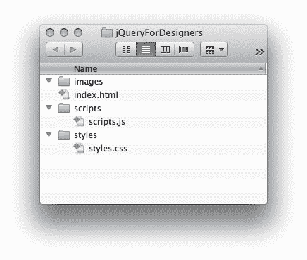
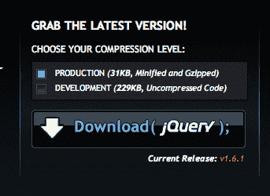
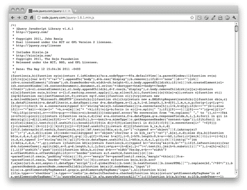
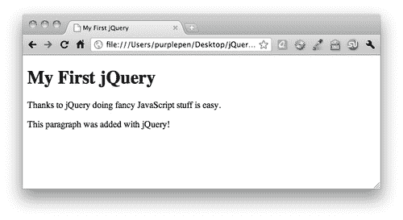

# 一、面向设计师的 jQuery

> 在过去的几年中，您可能已经听说了很多关于 jQuery 的事情——它很快就成为当今 Web 上使用的最流行的代码包之一。你可能想知道这一切都是为了什么。

> 无论您以前是否尝试过理解 JavaScript，是否曾因挫败而举手，或是因为太过胆怯而不敢尝试，您都会发现 jQuery 是一种非常容易接近且相对容易学习的方法，可以让您的脚沾满 JavaScript。

在本章中，我们将介绍：

*   jQuery 是什么，为什么它是设计师的理想选择
*   渐进增强和优雅退化
*   JavaScript 基础
*   下载 jQuery
*   您的第一个 jQuery 脚本

# 什么是 jQuery？

jQuery 是一个 JavaScript 库。这意味着它是一个可重用 JavaScript 代码的集合，可以完成常见的任务—web 开发人员经常发现自己反复解决相同的问题。与其每次都从头开始设计一个解决方案，不如将所有这些有用的信息收集到一个可以包含并用于任何项目的包中。jQuery 的创建者已经编写了代码，能够顺利、轻松地处理我们希望用 JavaScript 完成的最常见、最繁琐的任务，并且他们已经解决了所有需要解决的小差异，以使代码在不同的浏览器中工作。

记住 jQuery 是 JavaScript，而不是它自己的语言，这一点很重要。它具有所有相同的规则，并且以与 JavaScript 相同的方式编写。不要让它吓跑你——jQuery 确实让编写 JavaScript 变得容易多了。

jQuery 的官方标签行是*写得少，做得多*。这是对 jQuery 库的一个优秀而准确的描述——您真的可以在几行代码中完成惊人的事情。我自己的 jQuery 非官方标记行是*查找内容并对其进行处理*，因为使用原始 JavaScript 查找和操作 HTML 文档的不同部分非常繁琐，需要一行又一行代码。jQuery 使同样的任务变得轻松快捷。多亏了 jQuery，您不仅可以快速创建一个下拉菜单，还可以创建一个动画菜单，并在许多不同的浏览器中顺利运行。

# 为什么 jQuery 对设计师来说很棒？

那么，jQuery 到底是什么让它如此容易学习，即使您对 JavaScript 的使用经验有限或没有经验？

## 使用您已经知道的 CSS 选择器

在 jQuery 脚本中，您经常做的第一件事是选择要使用的元素。例如，如果要向导航菜单添加一些效果，则首先要选择导航菜单中的项目。用于此作业的工具是选择器—用于选择页面上要使用的特定元素的方法。

jQuery 从 CSS 一直到 CSS3 都借用了选择器，即使在目前还不支持 CSS3 选择器的浏览器中，它们也能工作。

尽管 CSS 提供了一组非常强大的选择器，但 jQuery 本身还添加了一些选择器，以使所需的元素易于使用。

如果您已经知道如何将所有级别 1 标题设置为蓝色或将所有链接设置为绿色并加下划线，那么您将很容易学会如何使用 jQuery 选择要修改的元素。

## 使用您已经知道的 HTML 标记

如果您想用原始 JavaScript 创建新元素或修改现有元素，最好抓紧时间，准备编写大量代码——这也没有多大意义。

例如，如果我们想在页面上附加一个段落，该段落表示*此页面由 JavaScript*支持，那么我们必须首先创建段落元素，然后将段落内的文本作为字符串分配给变量，最后将该字符串作为文本节点附加到新创建的段落中。在所有这些之后，我们仍然需要在文件中添加这一段。呸！（如果您不了解所有这些，请不要担心，这只是为了说明做这么简单的事情需要多少工作和代码。）

使用 jQuery，在页面底部添加段落非常简单：

```js
$('body').append('<p>This page is powered by jQuery.</p>');

```

没错，你只需在正文中直接添加一点 HTML，一切都准备好了。我敢打赌，在根本不理解 JavaScript 的情况下，您可以阅读这行代码并掌握它的功能。这段代码在我的 HTML 文档的正文中添加了一个段落，内容是*这个页面由 jQuery*提供支持。

## 只需几行代码就能产生令人印象深刻的效果

你有更好的事情要做，而不是坐着写一行又一行的代码来添加淡入淡出效果。jQuery 为您提供了一些基本的动画，并提供了即时创建自定义动画的功能。假设我想让一幅图像淡入页面：

```js
$('img').fadeIn();

```

是的，就是这样-一小行代码，我在其中选择我的图像，然后告诉它淡入。我们将在本章后面看到这行代码在 HTML 页面中的确切位置。

## 巨大的插件库可用

正如我前面所说的，web 开发人员经常发现自己一次又一次地解决同样的问题。您可能不是第一个想要构建旋转图像幻灯片、动画下拉菜单或新闻摘要的人。

jQuery 有一个巨大的免费脚本库——用于创建工具提示、幻灯片、新闻提示、下拉菜单、日期选择器、字符计数器等的脚本。你不需要学习如何从头开始构建所有这些东西——你只需要学习如何利用插件的功能。在本书中，我们将介绍一些最流行的 jQuery 插件，您将能够学习如何使用 jQuery 插件库中的任何插件。

## 社区支持度高

jQuery 是一个开源项目——这意味着它由一个超级聪明的 JavaScript 程序员团队共同构建，任何人都可以免费使用。开源项目的成败通常取决于项目背后的社区——jQuery 有一个庞大而活跃的社区支持它。

这意味着 jQuery 本身正在不断改进和更新。除此之外，还有成千上万的开发人员正在创建新插件，为现有插件添加功能，并向新来者提供支持和建议——你每天都会发现新的教程、博客帖子和播客，内容几乎都是你想学习的。

# JavaScript 基础

在本节中，我将介绍一些 JavaScript 的基础知识，这些基础知识将使事情更加顺利。我们将看一点代码，了解它是如何工作的。不要害怕——这将是快速和无痛的，然后我们将准备好继续使用 jQuery 进行实际操作。

## 渐进增强和优雅退化

在使用 JavaScript 增强 HTML 页面时，有几种不同的想法。让我们来讨论一下，在我们沉溺其中之前，我们应该考虑的一些事情。

渐进增强和优雅退化本质上是同一枚硬币的两面。它们都意味着，我们的页面及其令人印象深刻的 JavaScript 动画和特效仍然适用于浏览器或设备性能较差的用户。优雅的降级意味着我们创建了我们的特殊效果，然后确保在未启用 JavaScript 的情况下优雅地失败。如果我们采用渐进式增强方法，我们将首先构建一个适用于所有人的页面的基本版本，然后通过添加 JavaScript 特效来增强它。我倾向于采用渐进式增强方法。

为什么我们要关心那些没有启用 JavaScript 的用户？嗯，网络最大的用户之一——搜索引擎——没有 JavaScript 功能。当搜索引擎对您的页面进行爬网和索引时，它们将无法访问通过 JavaScript 加载到页面中的任何内容。这通常被称为动态内容，如果禁用 JavaScript 无法访问它，搜索引擎将无法索引或找到它。

我们也处在一个时代，我们不能再指望用户访问我们用传统台式机或笔记本电脑构建的网页。我们很快就会想到智能手机和平板电脑是下一个候选产品，尽管它们非常受欢迎，但它们仍然只占互联网接入的一小部分。

人们通过游戏机、电子书阅读器、支持互联网的电视、各种各样的移动设备以及可能数百种其他方式访问网络。并不是所有这些设备都能执行 JavaScript——其中一些甚至没有彩色屏幕！您的首要任务应该是确保您的内容可供任何要求的人使用，无论他们使用的是什么设备。

## 必须让他们分开

为了完成让我们的内容尽可能广泛地为受众所接受的任务，我们必须将我们的网页分为三个不同的层次：内容、表现和行为。

### 内容

内容是我们网页的主要内容——我们最感兴趣的是在网页上呈现的文本、音频或视频，所以这就是我们的出发点。

用干净、简单的 HTML 代码标记您的内容。按照预期的方式使用 HTML 元素。使用标题标记标记标题、使用段落标记标记段落、使用列表标记标记列表，以及为表格数据保存表格。

浏览器为这些基本的 HTML 标记提供了内置样式——标题将是更大的类型，可能是粗体的。列表将包含项目符号或数字。它看起来可能不是很花哨，但它是可读的，任何人都可以访问。

### 介绍

表示层是我们开始喜欢的地方。这就是我们引入 CSS 并开始将我们自己的样式应用于我们创建的内容的地方。在设计页面样式时，我们可能会发现，我们必须回到 HTML 中，添加一些新的容器和标记，以使多列布局等功能成为可能，但我们仍应努力使标记尽可能简单明了。

### 行为

一旦我们的页面正确地标记了所有内容，并按照我们喜欢的方式设计了样式，现在我们可以考虑添加一些交互行为。这就是 JavaScript 和 jQuery 的用武之地。该层包括动画、特效、AJAX 等。

# 设计师，认识 JavaScript

JavaScript 是一种强大而复杂的语言——你可以使用它 10 年，但仍有更多的东西需要学习。但不要让它吓跑你，你不必了解它的一切，就能利用它所提供的一切。事实上，你只需要记下一些基本知识。

本节介绍一些 JavaScript 基础知识和 JavaScript 语法。不要被开发者的单词语法吓跑。语法只是指写语言的规则，就像我们写英语的语法规则一样。

## 变量

让我们从简单的事情开始：

```js
var x = 5;

```

这是 JavaScript 中的一个*句子*。在英语中，我们用句号或问号或感叹号来结束一个句子。在 JavaScript 中，我们用分号结束句子。

在这句话中，我们正在创建一个变量， `x`。变量只是一个容器，用来存放某些东西。在本例中， `x`持有编号 `5`。

我们可以用 JavaScript 进行如下计算：

```js
var x = 5;
var y = 2;
var z = x + y;

```

就像代数一样，我们的变量 `z`现在为我们保存数字 `7`的值。

但是变量可以包含数字以外的东西。例如：

```js
var text = 'A short phrase';

```

在这里，我们将变量命名为 `text`，它为我们保存了一些字母字符。这称为**字符串**。字符串是一组字母数字字符。

## 物体

对象可能是 JavaScript 新手最难掌握的东西，但这通常是因为我们想得太多，认为它必须比实际情况更复杂。

一个物体就是它听起来的样子——一件东西，任何东西。就像汽车、狗或咖啡壶一样，它们都是物体。

对象具有属性和方法。属性是对象的特征。例如，狗可以是高的或矮的，有尖尖的耳朵或松软的耳朵，棕色、黑色或白色。所有这些都是狗的特性。方法是对象可以做的事情。例如，狗可以跑、吠叫、走路和吃东西。

让我们以我的狗 Magdelena von Barkington 为例，看看如何在 JavaScript 中处理对象、属性和方法：

```js
var dog = Magdelena von Barkington;

```

在这里，我创建了一个变量 `dog`，我用它作为一个容器来容纳我的狗，主要是因为我不想每次在代码中提到她时都必须输入她的全名。现在让我们假设我想得到我的狗的颜色：

```js
var color = dog.color;

```

我创建了一个名为 `color`的容器，我用它来保存我的狗的颜色属性- `color`现在等于我的狗的颜色。

现在，我把我的狗训练得很好，我想让它翻身。下面是我如何告诉她使用 JavaScript 进行滚动：

```js
dog.rollOver();

```

`rollOver`是一种方法——我的狗可以做的事情。在我的狗翻身后，我可能想奖励她一顿。下面是我的狗如何用 JavaScript 吃东西：

```js
dog.eat('bacon');

```

等等，这是怎么回事？让我们一步一步来。我们有一只狗，我们知道它是我的狗 Magdelena von Barkington 的容器。我们有 `eat`方法，我们知道这是我的狗可以做到的。但是我的狗不能只吃东西——她必须吃点东西。我们用括号来表示她在吃什么。在这种情况下，我的幸运儿正在吃熏肉。在 JavaScript 语言中，我们会说我们把培根传给了狗吃的方法。

所以你看，物体并没有那么难——它们只是东西。属性就像形容词——它们描述一个物体的特征。方法就像动词——它们描述一个对象可以做的动作。

## 功能

函数是一段可重用代码，它告诉 JavaScript 做一些事情。例如：

```js
function saySomething() {
alert('Something!');
}

```

这个函数告诉 JavaScript 弹出一个警告框，上面写着 `Something!`。我们总是以单词 `function`开始函数，然后命名函数。后面是一组括号和一组花括号。指令行位于花括号内。

现在，我的 `saySomething`函数在被调用之前实际上不会做任何事情，所以我需要添加一行代码来调用我的函数：

```js
function saySomething() {
alert('Something!');
}
saySomething();

```

### 提示

**下载示例代码**

您可以下载您在[账户购买的所有 Packt 书籍的示例代码文件 http://www.PacktPub.com](http://www.PacktPub.com) 。如果您在其他地方购买了本书，您可以访问[http://www.PacktPub.com/support](http://www.PacktPub.com/support) 并注册，将文件直接通过电子邮件发送给您。

你可能想知道那些括号是什么意思。还记得我们如何通过将内容包含在括号中来传递给方法吗？

```js
dog.eat('bacon');

```

在这种情况下，我们通过熏肉来说明狗在吃什么。我们可以对函数做同样的事情。实际上，方法实际上是函数或函数。事实上，方法实际上是函数——它们只是专门用于描述对象功能的函数。让我们看看如何修改 `saySomething`函数，以便将文本传递给它：

```js
function saySomething(text) {
alert(text);
}
saySomething('Hello there!');

```

在本例中，当我编写 `saySomething`函数时，我只保留了一个通用容器。这就是所谓的参数——我们可以说， `saySomething`函数接受一个文本参数，因为我已经调用了我的参数 `text`。我之所以选择 `text`这个名字，是因为它是对我们所传递内容的一个简短而方便的描述。我们可以将任何一位文本传递到此函数，因此 `text`是一个合适的名称。你可以随意命名你的参数，但是如果你在为参数选择名称时应用一些常识性的规则，你的代码会更容易阅读和理解。参数的行为非常像一个变量——它只是某个东西的容器。

# 下载 jQuery 并进行设置

我们已经准备好将 jQuery 的魔力包含到一个项目中，但是首先我们需要下载它并找出如何将它附加到 HTML 页面。在这里，我们将介绍如何启动一个示例 HTML 文件，以及在一个示例项目设置中需要用到的所有相关文件和文件夹。完成后，您可以将其用作本书中所有未来练习的模板。

# 动作时间-下载并附加 jQuery

前面，我描述了 HTML 文档的三个层次——内容、表示和行为。让我们来看看我们如何为这三层建立文件：

1.  首先，让我们在您的硬盘上设置一个文件夹，以便在您学习本书中的课程时保存您的所有工作。在硬盘上找到一个好位置，创建一个名为 `jQueryForDesigners`的文件夹。
2.  Inside the folder, create a folder called `styles`. We'll use this folder to hold any CSS we create. Inside the `styles` folder, create an empty CSS file called `styles.css`.

    这些样式代表我们的表示层。我们将在该文件中保留所有样式，以将它们分开。同样，创建一个名为 `images`的文件夹来保存我们将使用的任何图像。

3.  Next, create a folder called `scripts` to hold our JavaScript and jQuery code. Inside the `scripts` folder, create an empty JavaScript file called `scripts.js`.

    我们在这里编写的 JavaScript 代表我们的行为层。我们将把所有 JavaScript 都保存在这个文件中，以使它与其他层分开。

4.  Now, inside the `jQueryForDesigners` folder, create a new HTML page very basic as follows:

    ```js
    <!DOCTYPE html>
    <html>
    <head>
    <title>Practice Page</title>
    </head>
    <body>
    <!-- Our content will go here -->
    </body>
    </html>

    ```

    将此文件另存为`index.html`。HTML 文件是我们的内容层，可以说是最重要的一层；因为这可能是网站访问者访问我们网站的原因。

5.  Next, we'll attach the CSS and JavaScript files that we made to our HTML page. In the head section, add a line to include the CSS file:

    ```js
    <head>
    <title>Practice Page</title>
    <link rel="stylesheet" href="styles/styles.css"/>
    </head>

    ```

    然后返回 HTML 文件的底部，就在结束`</body>`标记之前，并包含 JavaScript 文件：

    ```js
    <script src="scripts/scripts.js"></scripts>
    </body>
    </html>

    ```

    由于这些文件只是空的占位符，因此将它们附加到 HTML 页面不会产生任何效果。但是现在我们有了一个方便的地方来编写 CSS 和 JavaScript，当我们准备开始练习时。

    ### 注

    请注意，自行关闭`<link>`元素是完全可以的，但`<script>`元素总是需要一个单独的关闭`</script>`标记。没有它，您的 JavaScript 将无法工作。

    *   以下是我的文件夹此时的外观：

    

6.  Now we have to include jQuery in our page. Head over to [http://jquery.com](http://jquery.com) and hit the **Download(jQuery)**; button:

    

    您会注意到在**下有两个选项选择您的压缩级别**。您将始终希望选中**生产**复选框。这是一个可以在网站上使用的版本。**开发**版本面向有经验的 JavaScript 开发人员，他们希望编辑 jQuery 库的源代码。

7.  Clicking on the **Download** button will open the production jQuery file in your browser window, and it looks a little bit scary, as follows:

    

8.  别担心，你不必读它，你肯定不必理解它。只需进入浏览器的文件菜单并选择**将页面另存为。。。**。或者右键单击页面并选择**另存为**，然后将文件保存到我们创建的 `scripts`文件夹中的硬盘驱动器中。默认情况下，脚本的文件名中将包含版本号。我将继续并将文件重命名为 `jquery.js`以保持简单。
9.  现在我们只需要在页面中包含 jQuery 脚本，就像包含空 JavaScript 文件一样。转到 practice HTML 文件的底部，就在我们前面创建的`<script>`标记之前，添加一行以包含 jQuery:

    ```js
    <script src="scripts/jquery.js"></script>
    <script src="scripts/scripts.js"></script>
    </body>
    </html>

    ```

您不会注意到 HTML 页面的任何更改—jQuery 本身不会做任何事情。它只是让你可以使用它的魔力。

# 使用 jQuery 的另一个选项

下载并使用您自己的 jQuery 副本没有什么错，但您确实有另一个选项可以帮助提高网站的性能。这就是使用 jQuery 的 CDN 托管副本。

如果您不知道，**CDN**是**内容交付网络**。CDN 背后的前提是，从物理上更靠近站点访问者位置的服务器下载文件的速度更快。例如，如果你在加利福尼亚州洛杉矶，亚利桑那州凤凰城服务器上的 jQuery 副本下载速度将比纽约市服务器上的 jQuery 副本快。为了帮助实现这一点，CDN 在世界各地的许多不同服务器上都有相同文件的副本。每次站点访问者请求文件时，CDN 都会将其请求智能地路由到最近的可用服务器，这有助于提高响应时间和总体站点性能。

对于我们将在本书中构建的相对简单的示例和页面来说，这并没有多大区别，但是对于面向公众的网站来说，使用基于 CDN 的 jQuery 副本可以产生明显的区别。有几个选项，但到目前为止最流行的是谷歌的 ajaxapicdn。您可以在[获取最新版本的信息和正确的 URLhttp://code.google.com/apis/libraries/devguide.html#jquery](http://code.google.com/apis/libraries/devguide.html#jquery) 。

如果您想在文件中使用 Google CDN 托管的 jQuery 版本，只需将以下代码行添加到 HTML 文件中即可，而不是我们以前用于包含 jQuery 的代码行：

```js
<script src="http://ajax.googleapis.com/ajax/libs/jquery/1.7.1/jquery.min.js"></script>

```

无需下载文件，无需保存自己的副本，只需将`<script>`标记直接指向存储在谷歌服务器上的 jQuery 副本即可。谷歌将负责从最近的可用服务器向您的网站访问者发送 jQuery。

不仅如此，由于谷歌的 CDN 如此受欢迎，你的网站访问者很有可能已经访问了另一个网站，该网站也使用了谷歌 CDN 托管的 jQuery 副本，并且他们将

jQuery 缓存在浏览器中。这意味着您的站点访问者根本不需要下载 jQuery，它已经保存在他们的浏览器中，可以使用。这对提高绩效有什么好处？

# 您的第一个 jQuery 脚本

好了，现在我们了解了一些关于 JavaScript 的基本知识，并且知道了如何设置文件和文件夹来构建一个示例练习，让我们构建第一个简单的示例页面，并使用 jQuery 进行一些有趣的操作。

# 行动时间到了-准备好 jQuery

1.  像我们在上一个练习中那样设置文件和文件夹。在 HTML 文档的`<body>`中，添加标题和段落：

    ```js
    <body>
    <h1>My First jQuery</h1>
    <p>Thanks to jQuery doing fancy JavaScript stuff is easy.</p>
    </body>

    ```

2.  您可以在 styles 文件夹中的 `styles.css`中随意创建一些 CSS—按照您的意愿创建样式。
3.  接下来，打开我们之前创建的空 `scripts.js`文件，并将这段脚本添加到文件中：

    ```js
    $(document).ready();

    ```

## 刚才发生了什么事？

让我们一次一个地看这句话——首先是美元符号？真正地这在 JavaScript 中做了什么？

这里的 `$`只是一个变量——仅此而已。它是 jQuery 函数的容器。还记得我说过我们可以使用一个变量来节省一些击键次数吗？jQuery 的聪明编写者提供了 `$`变量，以避免我们每次想使用它时都必须写出 `jQuery`。此代码执行相同的操作：

```js
jQuery(document).ready();

```

只是打字要花更长的时间。jQuery 使用 `$`作为其短名称，因为您不太可能自己调用变量 `$`，因为它是一个不常见的字符。使用不常见的字符可以减少页面上使用的其他 JavaScript 与 jQuery 库之间发生某种冲突的可能性。

因此，在本例中，我们将 `document`传递给 jQuery 或 `$`方法，因为我们希望选择 HTML 文档作为代码的目标。当我们调用 jQuery 函数时，我们得到一个 jQuery 对象。在 JavaScript 中，我们可以说 jQuery 函数*返回*一个 jQuery 对象。jQuery 对象赋予了 jQuery 库强大的功能。整个 jQuery 库的存在为 jQuery 对象提供了大量的属性和方法，使我们的生活更加轻松。我们不需要处理很多不同种类的对象——我们只需要处理 jQuery 对象。

jQuery 对象有一个名为 `ready()`的方法。在这种情况下，当文档加载到浏览器中时，将调用 ready 方法，并且该方法已准备好供我们使用。所以 `$(document).ready()`的意思就是“文档准备好时”。

## 增加一段

现在我们都准备好了文档准备好后做些什么，但是我们要做什么呢？让我们在页面上添加一个新段落。

# 行动时间-添加新段落

1.  We need to tell jQuery what to do when the document is ready. As we want something to happen, we'll pass in a function as follows:

    ```js
    $(document).ready(function(){
    // Our code will go here
    });

    ```

    我们将写下函数内部将要发生的事情。

    那以//开头的那行呢？这是用 JavaScript 编写注释的一种方法。 `//`告诉 JavaScript 忽略该行中的所有其他内容，因为这是一条注释。在 JavaScript 中添加注释是一种很好的方法，可以帮助您跟踪在哪一行上发生的事情。它还可以帮助其他可能需要处理代码的开发人员。如果您几个月没有看过自己的代码，它甚至可以帮助您自己。

2.  接下来，我们将在文档准备就绪后添加我们希望发生的事情：

    ```js
    $(document).ready(function(){
    $('body').append('<p>This paragraph was added with jQuery!</ p>');
    });

    ```

## 刚才发生了什么事？

我们的函数再次使用 jQuery 函数：

```js
$('body')

```

还记得我说过 jQuery 使用 CSS 选择器查找内容吗？这就是我们如何使用这些 CSS 选择器。在本例中，我需要`<body>`标记，因此我将`'body'`传递给 jQuery 函数。这将返回包装在 jQuery 对象中的`<body>`标记。方便的是，jQuery 对象有一个 `append()`方法，可以让我向页面添加新内容：

```js
$('body').append();

```

我现在要做的就是将我想要添加到页面的东西传递给 append 方法。在引号中，我将传入一行要添加的 HTML：

```js
$('body').append('<p>This paragraph was added with jQuery!</p>');

```

就这样！现在，当我在浏览器中加载我的页面时，我将看到我的标题后面跟着两个段落-jQuery 将在文档加载到浏览器中后立即添加第二个段落：



# 总结

在本章中，我们向您介绍了 jQuery 库，并了解了有关它的一些内容。我们介绍了一些 JavaScript 基础知识，然后学习了如何为本书中的练习设置文件和文件夹。最后，我们建立了一个简单的 HTML 页面，利用 jQuery 添加一些动态内容。现在让我们来看看如何用 jQuery 使链接更强大。