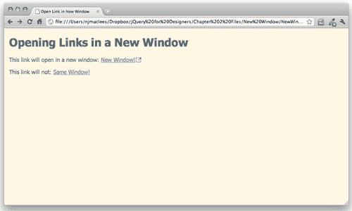
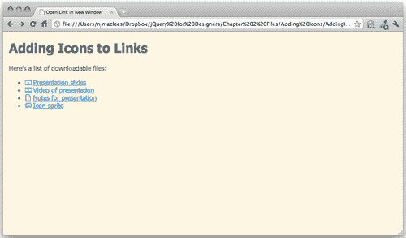
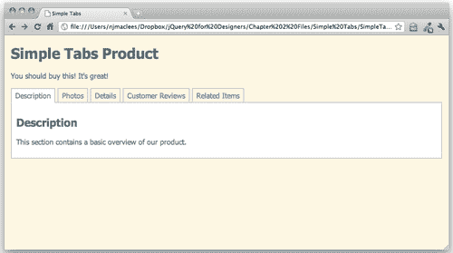

# 二、改进链接

> 如今，我们认为链接是理所当然的，但事实是，谦逊的链接是文档革命的产物，使我们今天所知的网络成为可能。能够将读者直接链接到另一个文档或文档中的另一个位置以前是不可能的。

> 正因为如此，你可以说超链接是互联网的主干——没有它们，搜索引擎是不可能的，大多数网站也是如此。让我们来看看一些能让我们的链接更难工作的方法。

在本章中，我们将介绍：

*   如何在新窗口中打开链接
*   如何在链接中添加图标，以确定链接的文档类型
*   如何将链接列表转换为简单选项卡

# 在新窗口中打开链接

虽然在新窗口中打开链接很常见，但这种做法本身也有点争议。一些人认为，网站访问者自己应该决定是否要在新窗口中打开链接，而许多浏览器让他们很容易做到这一点。一些人认为在新窗口中打开链接会破坏**后退**按钮的预期行为，应该避免。另一些人认为，当网站访问者突然发现自己在另一个网站上时，不在新窗口中打开链接会让他们感到困惑和迷失方向。

无论您站在什么位置，这都是客户的常见请求，而且这种做法可能不会很快消失，因此了解您处理此类功能的选项非常重要。我将假设您已经意识到在新窗口中打开链接的相关问题，并且仔细权衡了所有选项，并向您的客户提供了一个知情的论据。

## 为什么不直接使用目标属性？

您可能知道，HTML 提供了一个 `target`属性，可以与链接一起使用，以指定链接应该打开的位置。例如，以下代码：

```js
<a href="http://packtpub.com" target="_new">Link</a>

```

将创建一个链接，根据用户在浏览器中设置的首选项，该链接将尽最大努力在新窗口或新选项卡中打开。

开发 HTML 等 web 标准的机构 W3C 不赞成在严格的文档类型中使用 `target`属性，但在 HTML5 规范中重新引入了标记。然而， `target`属性旨在与框架一起使用，以控制如何将新页面加载到框架和 iFrame 中。它不打算用于在新窗口中为不使用框架的页面打开链接，因此严格来说，将其用于此目的是不正确的。

相反，我们可以使用一点 JavaScript 来创建我们想要的行为，而不使用无效或不推荐的代码。让我们来看看如何做到这一点。

# 行动时间-在新窗口中打开链接

1.  We'll get started with our basic HTML file and associated files and folders that we created in [Chapter 1](01.html "Chapter 1. Designer, Meet jQuery"), *Designer, Meet jQuery*. Inside the`<body>` of the HTML document, we'll add some links as follows:

    ```js
    <h1>Opening Links in a New Window</h1>
    <p>This link will open in a new window: <a href ="http://packtpub.com">New Window!</a></p>
    <p>This link will not: <a href ="http://packtpub.com">Same Window!</a></p>

    ```

    这只是一个标题和两个简单的段落，每个段落都有一个链接——一个应该在新窗口中打开，另一个不会打开。

2.  We need some way to select the link that should open in a new window. This is similar to the situation we would have if we wanted to style one of the links differently from the other with CSS.

    如果我们使用 CSS，我们可以为链接分配一个 `ID`或一个类。一个 `ID`将是相当有限的，因为 `ID`在页面上必须是唯一的——它只适用于这一个特定的链接。一个 `class`可以让我们设计在新窗口中打开的任何链接，这就是我们要使用的。将 `class`添加到应在新窗口中打开的链接，如下所示：

    ```js
    <a href="http://packtpub.com" class="new-window">New Window!</a>

    ```

3.  现在，我们可以使用这个类名进行 CSS 样式设计，并使用 jQuery 在新窗口中打开链接。在这个链接中添加一个图标是个好主意。你可以在链接的左侧或右侧添加一些填充，然后在链接中添加背景图像。打开 `styles`文件夹中的空 `styles.css`文件，添加一点 CSS 如下：

    ```js
    a.new-window {
    padding-right: 18px;
    background: url('img/new-window-icon.png') 100% 50% no-repeat;

    ```

4.  Next up, we'll open up the `scripts.js` file inside our `scripts` folder, and outside of our document ready statement we'll start off by writing our function to get our `new-window` links and make them open in a new window. Start off by declaring a new function:

    ```js
    $(document).ready(function(){
    });
    function externalLinks() {
    }

    ```

    在这里，我们创建了一个新函数，并将其命名为 `externalLinks`，因为这个名称对于在新窗口中打开链接很有意义。为 JavaScript 函数和变量命名总是很有帮助的，这将帮助您记住它们的功能。

5.  接下来，我们将使用 jQuery 来选择类 `new-window`的所有链接。我们将利用 jQuery 的 CSS 选择器来选择这些链接，就像我们用 CSS 设计它们的样式一样。

    ```js
    function externalLinks() {
    $('a.new-window'); 
    }

    ```

6.  We've used the `$` shortcut for the jQuery function and passed the CSS selector to the function. It's important to remember to wrap the CSS selector in either single quotes or double quotes. We don't want the link to open a new window until the user clicks on the link, so our next step is to tell the link to run a function when it's clicked on. jQuery makes this very easy. We can use the `bind()` method provided by jQuery to bind a function to the link that will be called when the link is clicked. That will look like this:

    ```js
    function externalLinks() {
    $('a.new-window').bind('click', function() {
    });
    }

    ```

    这段代码将一个函数绑定到我们的链接——当我们的链接被单击时，我们在这个新函数中编写的任何代码都将被调用。但到目前为止，我们的函数是空的，实际上什么都不做。

7.  What we need to do next is get the location the link is sending us to:

    ```js
    function externalLinks() {
    $('a.new-window').bind('click', function() {
    var location = $(this).attr('href');
    });
    }

    ```

    让我们一次检查一行新代码。首先，我们声明了一个名为 `location`的新变量。正如您所记得的，变量只是一个容器。我们有了一个新的空容器，现在让我们看看我们在容器里放了什么。

    `$(this)`是 jQuery 方式，用于引用我们当前使用的 jQuery 对象。在本例中，我们选择了一个类为 `new-window`的所有链接，并且我们附加了这个函数，每当站点访问者点击链接时都会调用它。当一个站点访问者点击一个链接时，我们需要检查被点击的链接，以获得链接的位置。引用当前链接的一种简单快捷的方法是使用 `$(this).`

    接下来我们使用 `attr()`方法获取链接的属性。链接指向的位置包含在 `href`属性中，因此我们将 `href`传递给 `attr()`方法。

    因此，我们命名为 `location`的容器现在包含链接指向的 URL，或者在本例中为[http://packtpub.com.](http://packtpub.com)

8.  Now that we know where we want to go, all we have to do is open that location in a new window. Opening a new window in JavaScript is simple and straightforward:

    ```js
    function externalLinks() {
    $('a.new-window').bind('click', function() {
    var location = $(this).attr('href');
    window.open(location);
    });
    }

    ```

    `window`是 JavaScript 中的全局对象，我们始终可以使用它。window 对象有一个 `open()`方法，我们只需向该方法传递一个位置，以便浏览器知道在新窗口中打开哪个位置。

9.  Now, if you open this HTML page in a browser and try clicking the links, you might be disappointed to see that our link does not open in a new window. It's like our JavaScript isn't even on the page at all. We've written a very nice function, but it's not working. That's because functions don't do anything until we tell them to. Telling a function to do its thing in JavaScript speak is 'calling the function'.

    我们希望启动此函数，找到与类 `new-window`的所有链接，并在页面加载到浏览器窗口后立即将新窗口函数绑定到这些链接。这样，我们应该在新窗口中打开的链接就可以在我们的网站访问者点击其中一个窗口时立即启动新窗口。

    我们只需在 document ready 语句中添加一行即可调用函数：

    ```js
    $(document).ready(function(){
    externalLinks();
    });
    function externalLinks() {
    $('a.new-window').bind('click', function() {
    var location = $(this).attr('href');
    window.open(location);
    });
    }

    ```

    一旦页面加载到浏览器中，这段新代码就会调用我们的 `externalLinks`函数。

10.  There's just one thing left to do. Right now if you load the page in a browser and click on a link, you'll find that the link does indeed open in a new window, but it also opens in the current window — so we end up with our new page loaded into two different windows. Not exactly what we had in mind. What we need to do is cancel the default behavior of the link — we've already taken care of opening the location in a new window, so now we need to tell the browser that it can take a break and it doesn't need to do anything when the site visitor clicks on the link. So let's add a parameter to our function and a line of code to cancel the default link behavior.

    ```js
    function externalLinks() {
    $('a.new-window').bind('click', function(e) {
    var location = $(this).attr('href');
    window.open(location);
    e.preventDefault();
    });
    }

    ```

    您会注意到，我们附加到链接上单击操作的函数现在在括号内有一个 e。这是我们传递给这个函数的参数。在这种情况下，e 表示链接的单击事件。

    我们添加到函数中的代码行是：

    ```js
    e.preventDefault();

    ```

    这会告诉浏览器停止链接的默认行为。如果在浏览器中重新加载页面并单击链接，您将看到它在新窗口中正确打开了目标页面，而不再在当前窗口中打开链接：

    

11.  Now, what do you think will happen if we have a second link on the page that should open in a new window? Let's go back to the`<body>` of the document and add a second link that should open in a new window. After the other links, add a new paragraph and link to a new page:

    ```js
    <p>This paragraph will open in a new window too: <a href="http://nataliemac.com" class="new-window">New Window!</a></p>

    ```

    确保将 `new-window`类添加到链接中。

现在，当您在浏览器中刷新页面时，新链接将显示在页面上。试着点击它，你会看到它也会在一个新窗口中打开，就像另一个 `new-window`链接一样。

## 刚才发生了什么事？

我们在想要在新窗口中打开的链接中添加了一个 CSS 类名。现在，我们在页面上用 `new-window`类创建的任何链接都将在新窗口中打开，但是当存在多个链接时，JavaScript 如何知道在新窗口中打开哪个页面？

答案在于我们的 `externalLinks`功能。我们选择了 `new-window`类的所有链接，并在单击这些链接时绑定了一个要触发的函数。在该函数中，我们捕获了链接的位置。在单击链接之前，此函数不会运行。在那之前，它只是袖手旁观，等待被号召采取行动。当点击带有 `new-window`类的链接时，我们的函数开始运行，捕获特定链接的位置并打开指向该链接位置的新窗口。

# 为链接添加图标

向链接添加图标是向站点访问者传达链接类型的最简单方法之一。您可能会在站点的不同部分使用不同的图标，或者您可能希望向站点访问者提供一些可下载的文件，例如，您编写的 PDF 或电子书、您演示文稿的幻灯片，或者您创建的一些库存图标或照片。在这些类型的链接中添加图标有助于为网站访问者提供视觉线索，以便他们知道在单击链接时会看到什么。让我们来看看如何使用 jQuery 向不同的链接类型添加适当的图标。

下面是我们在链接中添加图标后页面外观的示例：



# 行动时间-创建链接列表

1.  We'll get started with our basic HTML file and associated folders, like we created in [Chapter 1](01.html "Chapter 1. Designer, Meet jQuery"), *Designer, Meet jQuery*. We'll add a list of links to a few different types of downloadable files to the`<body>` of the HTML document:

    ```js
    <h1>Adding Icons to Links</h1>
    <p>Here's a list of downloadable files:</p>
    <ul>
    <li><a href="http://presentation.ppt">Presentation slides</a></li>
    <li><a href="video.mp4">Video of presentation</a></li>
    <li><a href="notes.pdf">Notes for presentation</a></li>
    <li><a href="http://icons.gif">Icon sprite</a></li>
    </ul>

    ```

    当我们在浏览器中查看此列表时，我们将看到一个带项目符号的链接列表-没有直观指示每个链接后面是什么类型的文件-用户必须根据链接的文本进行猜测。让我们获取所有链接，并根据链接指向的文件类型为每个链接添加适当的类名。为此，我们将使用 jQuery 的属性选择器。

2.  Next up, we'll get ready to add our JavaScript to our page. Open up the `scripts.js` file inside the `scripts` folder.

    让我们来看看如何区分不同类型的链接。 `<a>`链接具有 `href`属性。该 `href`属性告诉我们链接要带我们去的页面或文件的 URL，但它也提供了我们选择该属性中具有不同值的链接所需的信息。让我们来看看 jQuery 属性选择器是如何工作的：

    ```js
    $('a')

    ```

    这将选择页面上的所有链接。如果我们只想获得具有 `href`属性的 `<a>`标记，我们可以修改选择器，如下所示：

    ```js
    $('a[href]')

    ```

    我们可以更进一步，只获取属性等于某个值的链接：

    ```js
    $('a[href="video.mp4"]')

    ```

    此选择器仅选择链接到 `video.mp4`文件的链接。注意这里嵌套单引号和双引号的方式-我可以使用单引号或双引号包装选择器，但是如果需要在选择器中引用某些内容，我必须小心选择其他类型的引号。

    我们想为每个链接添加一个类名，这样我们就可以用 CSS 为它们设置样式，将图标添加为背景图像。为此，我们将使用 jQuery 对象的 `.addClass()`方法。利用我们到目前为止学到的知识，我们可以在 document ready 语句中执行类似的操作：

    ```js
    $(document).ready(function(){
    $('a[href ="http://presentation.ppt"]').addClass('presentation');
    $('a[href="video.mp4"]').addClass('video');
    $('a[href="notes.pdf"]').addClass('pdf');
    $('a[href="http://icons.gif"]').addClass('image');
    });

    ```

    …但这不是很灵活。如果我们想添加第二个视频或另一个 PDF 文件，该怎么办？我们必须调整 jQuery 以匹配。相反，我们只需查看链接的 `href`属性的文件扩展名，就可以使链接更灵活一些。jQuery 将允许我们检查属性是否以某些字符开头、以某些字符结尾或包含某些字符。您可以在 jQuery 文档的[中获得可能的属性选择器的完整列表 http://api.jquery.com/category/selectors/.](http://api.jquery.com/category/selectors/) 。

    要检查属性是否以某些字符开头，请按如下方式使用 `^=`：

    ```js
    $('a[href^="video"]')

    ```

    若要检查属性是否包含名称中的某些字符，请按如下方式使用 `*=`：

    ```js
    $('a[href*="deo"]')

    ```

    在本例中，文件扩展名始终是链接的最后一部分，因此我们将使用 ends with attribute selector，它使用`$=` ，如下所示：

    ```js
    $(document).ready(function(){
    $('a[href$="ppt"]').addClass('presentation');
    $('a[href$="mp4"]').addClass('video');
    $('a[href$="pdf"]').addClass('pdf');
    $('a[href$="gif"]').addClass('image');
    });

    ```

3.  Now, any links we add with a `.pdf` extension, for example, will automatically have the `pdf` class given to them. If you refresh the page in a browser at this point, you won't see any difference in the page, but if you inspect the **DOM** **(Document Object Model)** using a browser inspection tool such as the ones built into Chrome and WebKit or Firebug for Firefox, you'll see that the links have the class names assigned to them. All that's left to do is to write the CSS to include the icons. Open up the `styles.css` file inside the `styles` folder and add some lines of code as follows:

    ```js
    a {
    background: 0 50% no-repeat;
    padding-left: 20px;
    }
    a.presentation {
    background-image: url(img/presentation.gif);
    }
    a.video {
    background-image: url(img/video.gif);
    }
    a.pdf {
    background-image: url(img/pdf.gif);
    }
    a.image {
    background-image: url(img/image.gif);
    }

    ```

    您必须确保将图标图像放在`images`文件夹中。您可以使用本章示例代码中包含的图标图像，也可以创建自己的图标图像。

    现在，如果在浏览器中刷新页面，您将看到每个链接都显示相应的图标。如果您在页面中添加指向这四种文件类型的新链接，它们也都会有图标。我们已经创建了一个灵活而简单的解决方案，用于在链接中添加图标。

    

## 刚才发生了什么事？

我们根据 `href`属性中的文件扩展名选择页面上的所有链接，并使用该文件扩展名使用 jQuery 添加适当的类名。然后，我们在 CSS 中使用这些类名，用一些 CSS 样式为每个链接类型添加图标。未启用 JavaScript 的站点访问者仍然可以单击链接并下载相关文件。他们只会错过提示他们每个链接后面的文件类型的图标。

现在您可以看到 jQuery 和 CSS 如何协同工作，为页面添加新功能。jQuery 可以修改元素的类名，然后可以使用 CSS 根据它们的类名设置这些元素的样式。

# 简单标签

如果我们有大量可能与所有网站访问者不相关的信息要呈现，我们可以通过隐藏选定的信息位来压缩信息占用的空间量，直到网站访问者请求。使所有信息可用但在请求之前隐藏的最常见方法之一是选项卡。标签与现实世界中的标签笔记本或文件柜中的标签文件夹相呼应，便于网站访问者理解。信不信由你，它们也很容易用 jQuery 实现。

以下是我们创建选项卡后页面的外观：



# 行动时间-创建简单选项卡

1.  We'll get started with our basic HTML file and associated folders, like we created in [Chapter 1](01.html "Chapter 1. Designer, Meet jQuery"), *Designer, Meet jQuery*. Inside the`<body>` tag, we'll start by setting up our simple example that will work even for users with JavaScript disabled: we'll put a list of anchor links to different areas of the page at the top, then wrap each of our content sections in a `div` with an `id` as follows:

    ```js
    <h1>Simple Tabs Product</h1>
    <p>You should buy this, it's great!</p>
    <ul>
    <li><a href="#description">Description</a></li>
    <li><a href="#photos">Photos</a></li>
    <li><a href="#details">Details</a></li>
    <li><a href="#reviews">Customer Reviews</a></li>
    <li><a href="#related">Related Items</a></li>
    </ul>
    <div id="description">
    <h2>Overview</h2>
    <p>This section contains a basic overview of our product.</p>
    </div>
    <div id="photos">
    <h2>Photos</h2>
    <p>This section contains additional photos of our product.</p>
    </div>
    <div id="details">
    <h2>Details</h2>
    <p>This is where we list out all the details of our product—size, weight, color, materials, etc.</p>
    </div>
    <div id="reviews">
    <h2>Customer Reviews</h2>
    <p>Here's where we would list all of the glowing reviews our customers had written</p>
    </div>
    <div id="related">
    <h2>Related Items</h2>
    <p>And here we would list out other super items that our customers might also like to buy.</p>
    </div>

    ```

    如果我们在浏览器中查看此 HTML，我们将在页面顶部看到一个链接列表，单击该列表时，可将页面跳转到相应的部分，以便网站访问者可以轻松找到每个部分，而无需自己滚动。我们已经为我们的页面创建了一个可点击的目录。

2.  现在，我们希望为启用 JavaScript 的站点访问者增强这一点。首先，我们将在包含目录的`<ul>`中添加一个 `id`，并在包含内容部分的`<div>s`中添加一个类名——这将使我们更容易使用 jQuery 选择所需的页面片段，也使我们更容易使用 CSS 设置选项卡的样式。

    ```js
    <ul id="tabs">
    <li><a href="#description">Description</a></li>
    <li><a href="#photos">Photos</a></li>
    <li><a href="#details">Details</a></li>
    <li><a href="#reviews">Customer Reviews</a></li>
    <li><a href="#related">Related Items</a></li>
    </ul>
    <div id="description" class="tab-section">
    <h2>Overview</h2>
    <p>This section contains a basic overview of our product.</p>
    </div>
    <div id="photos" class="tab-section">
    <h2>Photos</h2>
    <p>This section contains additional photos of our product.</p>
    </div>
    <div id="details" class="tab-section">
    <h2>Details</h2>
    <p>This is where we list out all the details of our product—size, weight, color, materials, etc.</p>
    </div>
    <div id="reviews" class="tab-section">
    <h2>Customer Reviews</h2>
    <p>Here's where we would list all of the glowing reviews our customers had written</p>
    </div>
    <div id="related" class="tab-section">
    <h2>Related Items</h2>
    <p>And here we would list out other super items that our customers might also like to buy.</p>
    </div>

    ```

3.  Next, we'll use jQuery to hide all of our `tab-sections`. Open up the `scripts.js` file inside your `scripts` folder and inside the document `ready` statement, select the `tab-sections` and hide them:

    ```js
    $(document).ready(function(){
    $('.tab-section').hide();
    });

    ```

    现在，当我们加载页面时，我们将只看到目录。

4.  Next, we need to show the appropriate section when one of our tabs is clicked. We'll start by binding a function to the click event of the links inside our table of contents — just like we did when we opened a link in a new window:

    ```js
    $(document).ready(function(){
    $('.tab-section').hide();
    $('#tabs a').bind('click', function(e){
    e.preventDefault;
    });
    });

    ```

    通过这段代码，我们选择了 id 为 `#tabs`的 `<ul>`中的所有链接，并在单击链接时绑定了一个函数。到目前为止，此函数所做的只是取消单击-如果此时在浏览器中加载页面，您将看到单击链接没有任何作用-页面不再跳转到关联的部分。

5.  Next, we want to select the appropriate section and show it. To do that, we'll use the hash — or the part of the `href` attribute that includes the `#` symbol.

    ```js
    $('#tabs a').bind('click', function(e){
    $(this.hash).show();
    e.preventDefault;
    });

    ```

    当我将 `this.hash`传递给 jQuery 函数时，我处理的 `this`是刚刚单击的链接， `this.hash`是 href 属性的值，从#符号开始一直到结尾。例如，如果单击 overview 选项卡，将 this.hash 传递给 jQuery 函数与编写以下内容相同：

    ```js
    $('#overview')

    ```

    但当然，这是以一种更加灵活的方式完成的——它适用于链接到页面任何部分的任何选项卡。因此，例如，如果我想用 shipping information 选项卡替换 customer reviews 选项卡，我不需要更新 JavaScript，只需要更新 HTML 标记本身——JavaScript 足够灵活，可以根据变化进行调整。

6.  So now when I click on one of the table of contents links, it will show me the associated section, but if I keep clicking on links, the sections just keep showing up, and after clicking all the links, all the sections are visible — that's not what we want. We'll have to hide the visible section and show only the section we want. Let's add a line to our code to select the visible `tab-section` and hide it before we show the new section:

    ```js
    $('#tabs a').bind('click', function(e){
    $('.tab-section:visible').hide();
    $(this.hash).show();
    e.preventDefault;
    });

    ```

    您可能熟悉 CSS 中的**伪类**选择器-它们通常用于选择链接的悬停、访问和活动状态（`a:hover, a:visited`和`a:active`）。jQuery 为我们提供了一些额外的`pseudoclass`选择器，有用于按钮、空元素、禁用表单字段、复选框等的伪类选择器。您可以在[的 jQuery 文档中查看 jQuery 的所有可用选择器 http://api.jquery.com/category/selectors/](http://api.jquery.com/category/selectors/) 。在这里，我们使用 `:visible`伪类来选择当前可见的 `.tab-section`。一旦我们选择了 visible.tab 部分，我们将其隐藏，然后找到正确的 `tab-section`并显示它。

7.  我们现在所需要的只是一些 CSS，让我们的标签样式看起来像是内容的标签部分。打开 `styles`文件夹中的 `styles.css`文件，添加如下 CSS 样式。您可以根据自己的口味自由定制。

    ```js
    #tabs {
    overflow: hidden;
    zoom: 1;
    }
    #tabs li {
    display: block;
    list-style: none;
    margin: 0;
    padding: 0;
    float: left;
    }
    #tabs li a {
    display: block;
    padding: 2px 5px;
    border: 2px solid #ccc;
    border-bottom: 0 none;
    text-align: center;
    }
    .tab-section {
    padding: 10px;
    border: 2px solid #ccc;
    }

    ```

8.  Now if you load this up in a browser, you'll see that there's a little something missing — we should highlight the currently selected tab to make it obvious which one is selected. We can do that by adding a CSS class to the current tab. Go back to your `scripts.js` file and add a bit of code to add a class to the current tab and remove the class from any non-current tabs as follows:

    ```js
    $('#tabs a').bind('click', function(e){
    $('#tabs a.current').removeClass('current');
    $('.tab-section:visible').hide();
    $(this.hash).show();
    $(this).addClass('current');
    e.preventDefault;
    });

    ```

    首先，我们将找到包含类 `current`的选项卡，并删除该类。然后我们将获得刚刚单击的选项卡，并将 `current`类添加到其中。这样，我们可以确保在任何给定的时间只有一个选项卡被标记为当前选项卡。

9.  接下来，我们将在新类的 CSS 中添加一些样式。打开 `styles.css`并添加一点代码以区分当前选择的选项卡。同样，您可以根据自己的喜好自由定制此款式：

    ```js
    #tabs li a.current {
    background: #fff;
    color: #000;
    }

    ```

10.  So now our tabs are working the way we expect, and the only thing left to do is to make the first tab active and show the first content section when the page is first loaded instead of leaving them all hidden. We've already written the function to do this, so now all we have to do is call it for our first tab:

    ```js
    $('#tabs a').bind('click', function(e){
    $('#tabs a.current').removeClass('current');
    $('.tab-section:visible').hide();
    $(this.hash).show();
    $(this).addClass('current');
    e.preventDefault;
    }).filter(':first').click();

    ```

    jQuery 对象的 `filter()`方法将允许我们过滤之前选择的一组元素——在本例中，我们使用 `id #tabs`处理 `<ul>`中的所有 `<a>`标记。我们将一个点击函数绑定到所有这些链接，然后我们将使用提供给我们的 `:first`伪类过滤掉第一个链接—在 jQuery 中，并告诉 jQuery 为我们点击第一个选项卡。这将运行我们的函数，将 `current`类添加到第一个链接，并显示第一个`.tab-section`-这正是我们加载页面时所期望的页面外观。

    

## 刚才发生了什么事？

我们使用 jQuery 设置了一组简单的选项卡。对于禁用 JavaScript 的站点访问者，这些选项卡的功能类似于文档顶部的目录，单击它们时，它们会跳转到内容的各个部分。不过，对于使用 JavaScript 的网站访问者，在需要之前，内容部分将完全隐藏。单击每个选项卡将显示与该选项卡关联的内容。这是在 UI 中节省空间的一个很好的方法——在一个小空间内按需提供所有内容。

我们用 JavaScript 而不是 CSS 隐藏选项卡内容，以确保未启用 JavaScript 的用户仍然能够访问我们的所有内容。

# 总结

在本章中，您学习了如何获取基本链接（互联网的主干）并增强它们以添加一些新的行为和功能。您学习了如何在新窗口中打开链接，如何根据链接到的文件类型向链接添加图标，以及如何设置基本的选项卡式界面。这些都是网站的常见需求，当您进一步了解 jQuery 和 JavaScript 时，它们将成为您的重要构建块。