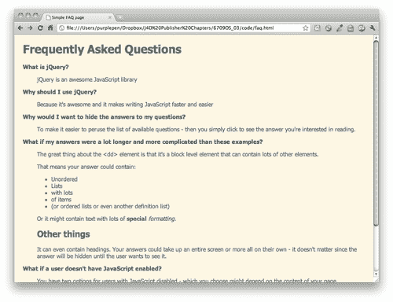
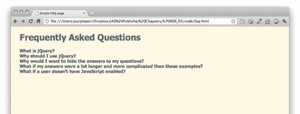
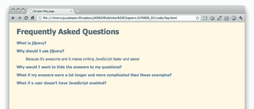
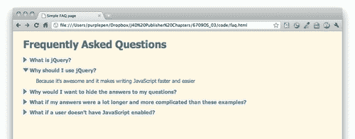

# 三、打造更好的 FAQ 页面

> 自网络诞生以来，常见问题页面一直是各类网站的主流。它被用作一个营销页面，试图减少给客户服务部门的电话或电子邮件数量，并作为一个有用的工具，让网站访问者更多地了解他们正在处理的公司或组织，或他们感兴趣购买的产品或服务。

> 虽然我们将为此示例构建一个 FAQ 页面，但这种扩展和折叠技术在许多不同的情况下都很有用-带有事件详细信息的事件列表、带有 bios 的员工或成员列表、带有详细信息的产品列表-任何情况下，项目列表都应该快速方便网站访问者进行扫描，但是，当他们找到他们要找的东西时，应根据需要随时提供更多信息。

在本章中，我们将学习：

*   如何使用 jQuery 遍历 HTML 文档
*   如何显示和隐藏元素
*   如何使用简单的 jQuery 动画
*   如何轻松切换元素的类名

# 常见问题页面标记

首先，我们将以标记常见问题列表的方式进行一些额外的关注。与处理 web 开发的大多数事情一样，没有一种正确的方法来做任何事情，因此不要将此方法视为唯一正确的方法。任何在语义上有意义并易于使用 CSS 和 JavaScript 增强列表的标记都是完全可以接受的。

# 行动时间-设置 HTML

1.  我们将从示例 HTML 文件以及相关文件和文件夹开始，就像我们在[第 1 章](01.html "Chapter 1. Designer, Meet jQuery")中设置的一样，*设计器，满足 jQuery*。在本例中，我们的 HTML 将是一个定义列表，在`<dt>`标记中包含问题，答案封装在`<dd>`标记中。默认情况下，大多数浏览器将缩进`<dd>`标记，这意味着问题将挂在左边空白处，便于扫描。在 HTML 文档的`<body>`中，添加标题和定义列表，如下所示：

    ```js
    <h1>Frequently Asked Questions</h1>
    <dl>
    <dt>What is jQuery?</dt>
    <dd>
    <p>jQuery is an awesome JavaScript library</p>
    </dd>
    <dt>Why should I use jQuery?</dt> <dd>
    <p>Because it's awesome and it makes writing JavaScript faster and easier</p>
    </dd>
    <dt>Why would I want to hide the answers to my questions? </dt>
    <dd>
    <p>To make it easier to peruse the list of available questions - then you simply click to see the answer you're interested in reading.</p>
    </dd>
    <dt>What if my answers were a lot longer and more complicated than these examples?</dt>
    <dd>
    <p>The great thing about the &lt;dd&gt; element is that it's a block level element that can contain lots of other elements.</p>
    <p>That means your answer could contain:</p>
    <ul>
    <li>Unordered</li>
    <li>Lists</li>
    <li>with lots</li>
    <li>of items</li>
    <li>(or ordered lists or even another definition list)</li>
    </ul>
    <p>Or it might contain text with lots of <strong>special</strong> <em>formatting</em>.</p>
    <h2>Other things</h2>
    <p>It can even contain headings. Your answers could take up an entire screen or more all on their own - it doesn't matter since the answer will be hidden until the user wants to see it.</p>
    </dd>
    <dt>What if a user doesn't have JavaScript enabled?</dt>
    <dd>
    <p>You have two options for users with JavaScript disabled - which you choose might depend on the content of your page.</p>
    <p>You might just leave the page as it is - and make sure the &lt;dt&gt; tags are styled in a way that makes them stand out and easy to pick up when you're scanning down through the page. This would be a great solution if your answers are relatively short.</p>
    <p>If your FAQ page has long answers, it might be helpful to put a table of contents list of links to individual questions at the top of the page so users can click it to jump directly to the question and answer they're interested in. This is similar to what we did in the tabbed example, but in this case, we would use jQuery to hide the table of contents when the page loaded since users with JavaScript wouldn't need to see the table of contents.</p>
    </dd>
    </dl>

    ```

2.  You can adjust the style of the page however you would like by adding in some CSS. Here's how I've styled mine:

    

对于禁用 JavaScript 的用户，此页面可以正常工作。这些问题挂在左边空白处，比页面上的其他文本更粗体、更暗，便于扫描。

## 刚才发生了什么事？

我们建立了一个基本的定义列表来存放我们的问题和答案。定义列表的默认样式很好地支持在没有 JavaScript 的情况下为站点访问者扫描问题列表。我们可以通过自己定制的 CSS 进一步增强这一点，以使列表的样式与我们的网站相匹配。

# 行动时间-在 HTML 文档中移动

1.  我们将继续使用上一节中设置的文件。打开 `scripts`文件夹中的 `scripts.js`文件。在 document ready 语句之后，编写一个名为 `dynamicFaq:`

    ```js
    function dynamicFaq() {
    //our FAQ code will go here
    }

    ```

    的新空函数
2.  Let's think through how we would like this page to behave. We would like to have all the answers to our questions hidden when the page is loaded, then when a user finds the question they're looking for, we would like to show the associated answer when they click the question.

    这意味着我们需要做的第一件事是在页面加载时隐藏所有答案。这就像选择我们所有的 `<dd>`元素并隐藏它们一样简单。在 `dynamicFaq`函数中，添加一行代码以隐藏`<dd>`元素：

    ```js
    function dynamicFaq() {
    $('dd').hide();
    }

    ```

    

    ### 注

    您可能想知道为什么我们没有使用 CSS 将`<dd>`标记的显示设置为 `none`。这会隐藏我们的答案，但它会为每个人隐藏我们的答案-没有启用 JavaScript 的网站访问者将无法访问答案，这是我们页面最重要的部分！

    它还将阻止大多数搜索引擎索引我们答案中的内容，这可能有助于人们试图在搜索引擎中找到问题的答案。通过使用 JavaScript 隐藏答案，我们可以确保答案是可用的，除非用户启用了 JavaScript 并能够再次显示它们。

3.  现在，我们需要在站点访问者单击问题时显示答案。要做到这一点，我们需要让 jQuery 在有人单击某个问题或`<dt>`标记时做一些事情。在 `dynamicFaq`函数内部，添加一行代码，将点击函数绑定到`<dt>`标签上：

    ```js
    function dynamicFaq() {
    $('dd').hide();
    $('dt').bind('click', function(){
    //Show function will go here
    });
    }

    ```

4.  When the site visitor clicks on a question, we want to get the answer to that question and show it because our FAQ list is set up similar to the following code:

    ```js
    <dl>
    <dt>Question 1</dt>
    <dd>Answer to Question 1</dd>
    <dt>Question 2</dt>
    <dd>Answer to Question 2</dd>
    ...
    </dl>

    ```

    …我们知道答案是在我们的问题之后 DOM 中的下一个节点或元素。我们从这个问题开始。当站点访问者单击一个问题时，我们可以使用 jQuery 的 `$(this)`选择器获取当前问题。用户刚刚点击了一个问题，我们说 `$(this)`是指他们刚刚点击的问题。在新的 `click`函数中，添加 `$(this)`以便我们可以参考点击的问题：

    ```js
    $('dt').bind('click', function(){
    $(this);
    });

    ```

5.  Now that we have the question that was just clicked, we need to get the next thing or the answer to that question so that we can show it. This is called **traversing the DOM** in JavaScript speak. It just means that we're moving to a different part of the document.

    jQuery 为我们提供了移动到 DOM 中下一个节点的 `next()`方法。我们将通过以下操作选择答案：

    ```js
    $('dt').bind('click', function(){
    $(this).next();
    });

    ```

6.  现在我们已经从问题转移到了答案。现在剩下要做的就是给出答案：

    ```js
    $('dt').bind('click', function(){
    $(this).next().show();
    });

    ```

7.  不要忘记我们的 `dynamicFaq`函数在调用它之前不会做任何事情。调用 document ready 语句中的 `dynamicFaq`函数：

    ```js
    $(document).ready(function(){
    dynamicFaq();
    });

    ```

8.  现在，如果我们在浏览器中加载页面，您可以看到，在单击问题之前，我们所有的答案都是隐藏的。这很好，也很有用，但如果网站访问者在阅读完答案后，能够再次隐藏答案，以避免干扰，那就更好了。幸运的是，这是一项非常常见的任务，jQuery 让我们很容易做到这一点。我们所要做的就是将对 `.show()`方法的调用替换为对 `.toggle()`方法的调用，如下所示：

    ```js
    $('dt').bind('click', function(){
    $(this).next().toggle();
    });

    ```

现在，当您在浏览器中刷新页面时，您将看到，单击问题一次将显示答案，再次单击问题将再次隐藏答案。

## 刚才发生了什么事？

切换页面上元素的显示是一项常见的 JavaScript 任务，因此 jQuery 已经有了内置的方法来处理它，并使其简单明了地在页面上运行。那很容易；只有几行代码。

# 整理我们的常见问题页面

这太容易了，事实上我们还有足够的时间来改进我们的 FAQ 页面，让它变得更好。这就是 jQuery 的强大之处——您不仅可以创建一个显示/隐藏 FAQ 页面，而且还可以使其成为一个精美的页面，并在截止日期之前完成。给客户或老板留下深刻印象的原因是什么？

# 是行动的时候了——让它变得有趣

1.  Let's start with a little CSS to change the cursor to a pointer and add a little hover effect to our questions to make it obvious to site visitors that the questions are clickable. Open up the `styles.css` file that's inside the styles folder and add this bit of CSS:

    ```js
    dt {
    color: #268bd2;
    font-weight: bold;
    cursor: pointer;
    margin: 0 0 1em 0;
    }
    dt:hover {
    color: #2aa198;
    }

    ```

    这无疑有助于向网站访问者传达问题是可点击的。

    

2.  When we click a question to see the answer, the change isn't communicated to the site visitor very well — the jump in the page is a little disconcerting and it takes a moment to realize what just happened. It would be nicer and easier to understand if the question were to slide into view; the site visitor could literally see the question appearing and would understand immediately what change just happened on the screen.

    jQuery 让我们很容易。我们只需将对 `.toggle()`方法的调用替换为对 `.slideToggle()`方法的调用。

    ```js
    $('dt').bind('click', function(){
    $(this).next().slideToggle();
    });

    ```

现在，如果您在浏览器中查看页面，您可以看到，单击问题时，问题会平滑地滑入和滑出视图。当页面发生变化时，很容易理解发生了什么，动画是一种很好的触感。

## 刚才发生了什么事？

我们用 `slideToggle()`方法取代了 `toggle()`方法，以动画方式显示和隐藏答案。这使得网站访问者更容易理解页面上正在发生的变化。我们还添加了一些 CSS，使问题看起来是可点击的，以便向网站访问者传达我们页面的功能。

# 我们快到了！

jQuery 使显示和隐藏动画变得如此简单，以至于我们还有时间进一步增强我们的 FAQ 页面。最好在我们的问题中添加某种指示器，以显示它们已折叠并可以展开，并且在问题打开后添加某种特殊样式，以显示它们可以再次折叠。

# 行动时间-添加一些最后的润色

1.  Let's start with some simple CSS to add a small arrow icon to the left side of our questions. Head back into `style.css` and modify the styles a bit to add an arrow icon or an icon of your choosing. You can place the icon you choose inside your `images` folder:

    ```js
    dt {
    color: #268bd2;
    font-weight: bold;
    cursor: pointer;
    margin: 0 0 1em 0;
    padding: 0 0 0 20px;
    background: url(img/arrow.png) 0 0 no-repeat;
    line-height: 16px;
    }
    dt:hover {
    color: #2aa198;
    background-position: 0 -32px;
    }

    ```

    我正在使用一个图像精灵作为箭头。当鼠标悬停在问题上时，我将问题的颜色从蓝色更改为绿色，因此我在精灵中包含了蓝色和绿色箭头，并且在文本变为绿色时使用了一些 CSS 来显示绿色箭头。这意味着只需下载一张图片，而且当鼠标悬停在我的问题上时，下载一张新图片将毫不延迟地显示出来。如果您不熟悉 CSS 图像精灵技术，我建议您阅读*Chris Coyier 的*文章，在[中对此进行解释 http://css-tricks.com/css-sprites/.](http://css-tricks.com/css-sprites/. )

2.  Now, we want to change the arrow to a different orientation when the question is opened. All we have to do is use a new CSS class for the open state of our questions and code the off and on states so the new arrow shape changes color as well. Again, I've included these arrow images in the same sprite, so the only thing I have to change is the background position:

    ```js
    dt.open {
    background-position: 0 -64px;
    }
    dt.open:hover {
    background-position: 0 -96px;
    }

    ```

    ### 笔记

    只需确保将这些新类*添加到*之后，我们将使用其他 CSS 来设计`<dt>`标记的样式。这将确保 CSS 按照我们预期的方式级联。

3.  So we have our CSS to show our questions are open, but how do we actually get to use it? We'll use jQuery to add the class to our question when it is opened, and to remove the class when it's closed.

    jQuery 提供了一些处理 CSS 类的好方法。 `addClass()`将向 jQuery 对象添加一个类， `removeClass()`将删除一个类。然而，我们想要切换我们的类，就像我们切换问题的显示和隐藏一样。jQuery 也为我们提供了保障。我们希望在单击问题时更改类，因此我们将在 `dynamicFaq`函数中添加一行代码，每次单击 `<dt>`时调用该函数：

    ```js
    $('dt').bind('click', function(){
    $(this).toggleClass('open');
    $(this).next().slideToggle();
    });

    ```

    现在，当您查看页面时，您将看到您的打开样式在 `<dt>`标记打开时应用于它们，在它们关闭时再次移除。但我们实际上可以把代码压缩得更小一点。

4.  One of the most powerful features of jQuery is called chaining. We've already used chaining in our code when we added `slideToggle()` to the `next()` method on one line.

    ```js
    $(this).next().slideToggle();

    ```

    jQuery 中的方法可以链接。您可以不断添加新方法以进一步变换、修改或设置元素动画。这行代码得到了问题，将 DOM 遍历到下一个节点，我们知道这是我们的 `<dd>`，然后切换该 `<dd>.` 的幻灯片动画

    我们可以再次利用链锁。我们的代码中有一些冗余，因为我们用 `$(this)`开始两行不同的代码。我们可以删除额外的 `$(this)`并将 `toggleClass()`方法添加到我们已经启动的链中，如下所示：

    ```js
    $(this).toggleClass('open').next().slideToggle();

    ```

    

## 刚才发生了什么事？

我们创建了 CSS 样式来设置问题的打开和关闭状态，然后我们在 JavaScript 中添加了一些代码来更改问题的 CSS 类以使用新样式。jQuery 提供了几种不同的方法来更新 CSS 类，这通常是一种快速简便的方法来更新文档的显示，以响应站点访问者的输入。在本例中，因为我们想要添加和删除一个类，所以我们使用了 `toggleClass()`方法。这使我们不必自己决定是否需要添加或删除开放类。

我们还利用了链式链接，将这个新功能简单地添加到现有的代码行中，使答案的动画显示和隐藏以及问题的 CSS 类的更改都发生在一行代码中。如何在短短的代码中获得令人印象深刻的功能？

# 总结

在本章中，我们学习了如何设置一个基本的 FAQ 页面，在站点访问者需要查看之前隐藏问题的答案。由于 jQuery 使这一点变得如此简单，我们有足够的时间来进一步增强我们的 FAQ 页面，在问题的显示和隐藏中添加动画，并利用 CSS 将我们的问题设置为特殊的开放和封闭类，以便与我们的网站访问者交流我们的页面是如何工作的。我们只用几行代码就完成了所有这些。

接下来，我们将学习如何在页面上使用自定义滚动条。