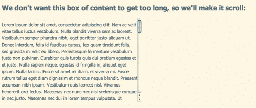
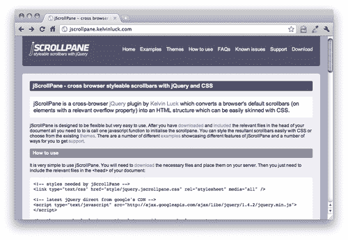
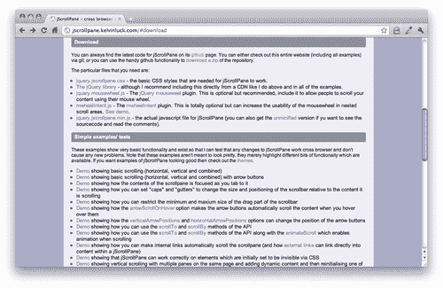
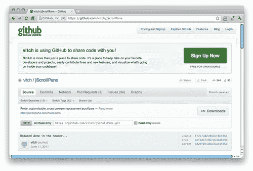
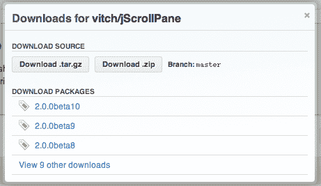
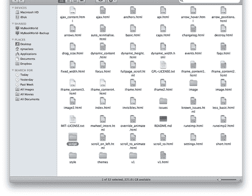
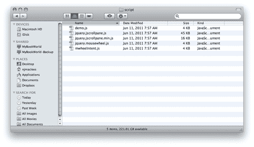
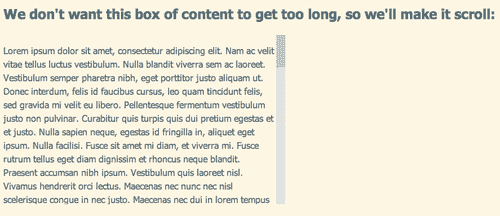
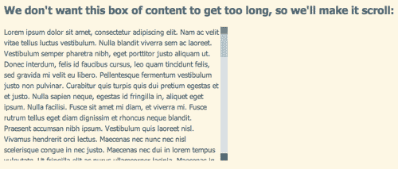
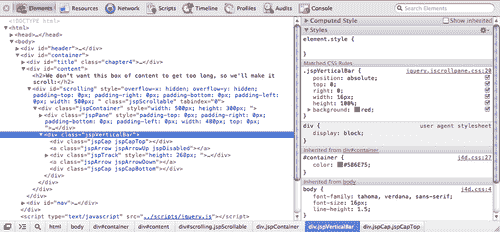

# 四、构建自定义滚动条

> 处理包含大量内容的页面的一种常见策略是隐藏部分内容，直到网站访问者想要或需要它为止。有很多方法可以做到这一点-你可以使用标签，手风琴，灯箱，或本章的重点，滚动区域。

> 可滚动区域对于站点访问者来说很容易理解和使用，但它们经常被忽略，因为一些操作系统有难看的滚动条，破坏了精心调整的设计的美观。浏览器提供很少（如果有的话）选项来定制滚动条的外观，而且在任何 HTML 或 CSS 规范中都没有正式的方式来实现这一点。

> 一些设计师已经转向 Flash 来创建定制的滚动条，我相信你在网上经常会看到这些 Flash 滚动条的示例，它们非常笨拙，并且打破了处理可滚动区域的常规。例如，您很少能够使用鼠标滚轮在 Flash 可滚动区域中滚动。

在本章中，我们将学习：

*   如何下载和使用 jQuery 插件来完成更多的 jQuery 工作
*   如何使用插件的内置自定义选项自定义插件的工作方式
*   如何使用 CSS 进一步定制插件
*   如何设置自定义设计的滚动条，使其按照网站访问者的期望工作
*   如何使用 jScrollPane 插件在可滚动区域中的不同内容位之间平滑滚动

# 设计师，见见插件

我们已经一次又一次地讨论了程序员如何解决同样的问题。jQuery 简化了这些常见任务，因此我们可以用最少的代码完成这些任务。但是，对于那些只是有些常见的任务，比如对漂亮的自定义滚动条的渴望，又如何呢？

这就是 jQuery 社区变得重要的地方。jQuery 社区中的开发人员能够编写代码来扩展 jQuery 的功能，以简化一些常见的任务。这些代码被称为**插件**，它们与 jQuery 库一起使用，使复杂的交互、小部件和效果的编码与使用 jQuery 中已经内置的功能一样简单。

在 jQuery 官方网站上可以找到数百个 jQuery 插件库。除此之外，网站上还有成千上万的人可以完成你想完成的任何任务。

要创建自定义滚动条，我们将使用*Kelvin Luck 的*jScrollPane 插件。您将学习如何在页面上安装该插件，以及如何配置 CSS 和选项，以使您的滚动条以您想要的方式显示和工作。

## 选择插件

最近，jQuery 团队已经开始支持少量的官方 jQuery 插件，您可以放心地使用这些插件，因为您知道它们拥有与 jQuery 本身相同的专业知识、文档和支持水平。所有其他 jQuery 插件都由 jQuery 社区的各个成员提供，这些作者全权负责为自己的插件提供文档和支持。编写和提供 jQuery 插件对所有人来说都有点免费，不幸的是，您会遇到相当数量的 jQuery 插件，它们的文档记录不好，支持不好，甚至更糟糕的是，编写不好。作为 jQuery 的新手，在选择插件时应该考虑哪些方面？

*   *插件*的最新更新。频繁的更新意味着插件得到了很好的支持，并且随着 jQuery 和浏览器的发展，作者会保持插件的最新状态。
*   *详尽易懂的文档*。在尝试下载和使用插件之前，请查看插件的文档，确保您了解如何实现插件以及如何使用插件提供给您的任何选项。
*   *浏览器支持*。优秀的插件通常与 jQuery 库本身具有相同的浏览器支持。
*   *工作演示*。大多数插件作者都会提供一个或多个正在运行的插件的工作演示。在尽可能多的不同浏览器中查看演示，以确保插件能够像广告中所宣传的那样工作。
*   *评审和评级*。你不会找到所有插件的评论和评级，但如果你能找到一些，它们可以作为插件质量和可靠性的有用指标。

# 设置一些可滚动的 HTML

让我们来看看如何建立一个包含可滚动区域的简单 HTML 页面。一旦我们解决了这个问题，我们将研究如何用自定义滚动条替换默认滚动条。

# 行动时间-可滚动 HTML

按照以下步骤设置一个带有可滚动区域的简单 HTML 页面：

1.  We'll start off with setting up a basic HTML page and associated files and folders, just like we did in [Chapter 1](01.html "Chapter 1. Designer, Meet jQuery"), *Designer, Meet jQuery*. We need to have an area of content that's large enough to scroll, so we'll add several paragraphs of text to the body of the HTML document:

    ```js
    <!DOCTYPE html>
    <html>
    <head>
    <title>Custom Scrollbars</title>
    <link rel="stylesheet" href="styles/styles.css"/>
    </head>
    <body>
    <h2>We don't want this box of content to get too long, so we'll make it scroll:</h2>
    <p>Lorem ipsum dolor sit amet...
    Include several paragraphs of lorem ipsum here
    ...mollis arcu tincidunt.</p>
    <script src="scripts/jquery.js"></script>
    <script src="scripts/scripts.js"></script>
    </body>
    </html>

    ```

    我还没有包括所有内容，但我已经在我的页面上包括了五段很长的 lorem ipsum 文本，以增加一些长度，并给我们一些可以滚动的内容。如果您不知道，lorem ipsum 只是一个虚拟填充文本。您可以为自己生成一些随机的 lorem ipsum 文本，以填充您在[的页面 http://lipsum.com.](http://lipsum.com)

2.  现在，我们需要使文本滚动。为了做到这一点，我将把 lorem ipsum 的所有段落都包装在一个 `div`中，然后使用 CSS 在 `div`上设置一个高度，并将 `overflow`设置为 `auto:`

    ```js
    <h2>We don't want this box of content to get too long, so we'll make it scroll:</h2>
    <div id="scrolling">
    <p>Lorem ipsum dolor sit amet...
    Include several paragraphs of lorem ipsum here
    ...mollis arcu tincidunt.</p>
    </div>

    ```

3.  Next, open your empty `styles.css` file, and add this bit of CSS to make our text area scrollable:

    ```js
    #scrolling {
    width:500px;
    height:300px;
    overflow:auto;
    }

    ```

    您可以随意添加一些额外的 CSS，以您喜欢的方式设置文本的样式。

    现在，当我在浏览器中查看我的页面时，我将看到浏览器为我的文本添加了一些（难看的）滚动条：

    

# 添加自定义滚动条

在大多数情况下，滚动条的外观由网站访问者使用的操作系统而不是浏览器决定。因此，无论你是在 Mac 上使用 Firefox、Safari、Chrome 还是其他浏览器，你都会看到那些标志性的闪亮蓝色滚动条。在 PC 上，无论您在 Windows 选项中设置了什么颜色方案，您都会看到粗大的方形滚动条。

# 行动时间-简单自定义滚动条

您可以看到，操作系统的默认滚动条在我们精心设计的页面中间像一个大拇指一样伸出。我们来解决这个问题，好吗？

1.  First, we've got to get our hands on the plugin we'd like to use to create our custom scrollbars. Head over to [http://jscrollpane.kelvinluck.com/](http://jscrollpane.kelvinluck.com/) and click on the **Download** link in the navigation menu:

    

    这将使您跳转到站点的**下载**部分，您将看到 Kelvin Luck 正在使用 Github 托管他的代码。Github 是一个社交编码中心——一种面向开发者的 Facebook——主要关注于编写、共享和讨论代码。随着 Github 为开发人员提供了一种与他人共享和协作代码的简便方式，使用 Github 托管 jQuery 插件和其他开源代码项目变得越来越普遍。

    别担心——从 Github 下载插件很简单。我陪你走过去。

2.  First, click the Github link on *Kelvin Luck's* site:

    

3.  That will take you to the jScrollPane project's home page on Github. On the right side of the page, you'll see a **Downloads** button:

    

4.  After you click on the **Downloads** button, you'll get a modal dialog window showing all the available download packages for the project. Keep it simple, just click on the **Download .zip** button to get the latest version:

    

5.  The ZIP download will kick off automatically. Once it's done, we're done at Github. I told you it was easy. Now, let's unzip the package and see what's inside.

    

    哇！那是很多文件！我们该怎么处理这些？

    这看起来有点吓人和混乱，但这些文件中的大多数都是关于如何使用插件的示例和文档。我们需要做的就是找到组成插件的 JavaScript 文件。我们会在 `script`文件夹中找到这些。

    

6.  在 `script`文件夹中，我们将找到更像我们期望的内容。让我们弄清楚这些文件是什么。
    *   `demo.js`是示例代码。这是*Kelvin Luck*用来将各种演示放在 zip 文件中的东西。如果我们陷入困境，看看例子可能会有用，但我们自己的项目不需要它。
    *   `jquery.jscrollpane.js`是 jScrollPane 插件的源代码。如果我们想修改插件的工作方式或挖掘源代码，我们可以使用这个文件，但我们还不是专业的程序员，所以我们可以暂时不使用这个文件。为什么文件名以 `jquery.?`开头？添加 `jquery`是一种常见的做法。在文件名前面标记为 jQuery 插件。在可能使用十几个或更多 jQuery 插件以及其他 JavaScript 文件的大型项目中，它可以使查找 jQuery 插件变得更加容易。
    *   `jquery.jscrollpane.min.js`是插件的压缩版本。它的代码与 `jquery.jscrollpane.js`相同，只是被缩小了。这仅仅意味着所有额外的空间、标签等都被删除了，从而使文件变小，您可以看到它非常有效。缩小后的文件只有 16 KB，而常规文件只有 45 KB。如果我们打开这个文件，我们将无法轻松读取它，但这很好。我们不需要能够阅读它，更重要的是，我们为我们的网站访问者提供尽可能小的文件。
    *   `jquery.mousewheel.js`是我们将用于定制滚动条的另一个插件。正是这个插件让我们的鼠标滚轮在可滚动区域中正常工作
    *   `mwheelintent.js`是另一个插件。通过查看*开尔文·勒克*的文档，我们发现这个插件用于确保我们的可滚动区域在彼此嵌套时能够正常工作。我们现在不需要这个。
7.  复制 `jquery.jscrollpane.min.js`和 `jquery.mousewheel.js`并将它们放在您自己项目中的 `scripts`文件夹中，就在 `jquery.js`文件旁边。
8.  Next, we need to include these two files in our page, just like we did with jQuery. Go down to the bottom of your page, and attach the new files between the jQuery`<script>` tag and your own`<script>` tag:

    ```js
    <script src="scripts/jquery.js"></script>
    <script src="scripts/jquery.mousewheel.js"></script>
    <script src="scripts/jquery.jscrollpane.min.js"></script>
    <script src="scripts/scripts.js"></script>
    </body>
    </html>

    ```

    ### 提示

    在使用 jQuery 插件的任何时候，都需要确保将`<script>`标记按正确的顺序放置。jQuery`<script>`标签应该总是第一位的，任何插件都会排在第二位。最后，您正在编写的任何使用 jQuery 或插件的脚本都将排在最后。这是因为浏览器将按照我们指定的顺序加载这些脚本。插件文件需要在 jQuery 之后加载，因为它们使用的是 jQuery 库，并且依赖它的可用性才能工作。在 JavaScript 语言中，我们称之为依赖关系。插件代码依赖于 jQuery。反过来，我们自己的代码依赖于插件代码和 jQuery 库本身，因此需要在这些代码可用后加载。

    在这种情况下，我们需要注意另外一个依赖关系。jScrollPane 插件依赖于 MouseWheel 插件。因此，我们需要确保首先加载 MouseWheel 插件，然后加载 jScrollPane 插件。如果您在让 jQuery 或插件正常工作时遇到问题，最好检查脚本顺序——通常是缺少或无序的依赖关系造成的。

    我们几乎准备好设置滚动条了，但是我们还需要包括一个文件。jScrollPane 插件实际上是通过隐藏浏览器的本地滚动条和构造普通 `<div>s`和 `<span>s`的替换来工作的。这意味着我们需要一些 CSS 来设计那些`<div>s`和`<span>s`看起来像滚动条的样式。稍后，我们将研究如何编写自己的 CSS，使滚动条看起来像我们想要的任何方式，但现在，我们将使用 Kelvin Luck 随插件提供的 CSS 来保持简单。

9.  回到我们从 Github 下载的文件中，找到 `style`文件夹。在文件夹中，您将找到两个文件： `demo.css`和 `jquery.jscrollpane.css`。与脚本文件一样， `demo.css`文件是专门为示例编写的特殊代码，但 `jquery.jscrollpane.css`文件将成为我们滚动条的样式。将该文件复制到您自己的 `styles`文件夹中，然后在文档的`<head>`部分中，将新样式表附在您自己的 `styles.css`文件之前：

    ```js
    <head>
    <title>Custom Scrollbars</title>
    <link rel="stylesheet" href="styles/jquery.jscrollpane.css"/>
    <link rel="stylesheet" href="styles/styles.css"/>	
    </head>

    ```

10.  Phew! We've done a lot of work already, but we still need to add our custom scrollbars to our page. No worries, in true jQuery style, it's just a couple of lines of code. Open up your `scripts.js` file and add this bit of code:

    ```js
    $(document).ready(function(){
    $('#scrolling').jScrollPane();
    });

    ```

    现在，如果您刷新页面，您将看到我们的可滚动区域现在有一个 jScrollPane 样式的滚动条。

    

## 刚才发生了什么事？

让我们把最后一段代码分开，以了解那里发生了什么。

我们已经熟悉了这一点：

```js
$(document).ready();

```

这是对文档调用 jQuery 对象的 ready 方法。这意味着我们将在文档准备好后立即运行代码。像往常一样，我们通过向这个方法传递一个函数来告诉 jQuery 文档准备好后应该发生什么：

```js
$(document).ready(function(){
//our code will go here
});

```

因此，我们必须看到的唯一真正新的东西是我们在函数中编写的代码行：

```js
$('#scrolling').jScrollPane();

```

但即使这样，我们至少可以理解一点。我们知道 `$('#scrolling')`会选择页面上 `id`滚动的项目。记住，我们在想要滚动的文本段落周围加了`<div id="scrolling"></div>`。然后我们使用了几行 CSS 来限制 `#scrolling div`的高度并显示浏览器的滚动条。

然后我们可以看到我们正在调用 `jScrollPane()`方法。大多数 jQuery 插件都是这样工作的——通过添加一个可以调用的新方法。您如何知道新方法的名称？您通常可以在插件的文档中找到它。jScrollPane 的文档非常丰富，有成堆的示例供您挑选、学习和修改。

# 添加箭头控件

好的，现在我们已经掌握了使用插件的基本知识，现在我们可以看看如何进一步。

# 行动时间-上下箭头相加

让我们在滚动条中添加顶部和底部按钮，使滚动条的外观和行为更像本地滚动条。

1.  Let's go back to that line of code in our `scripts.js` file where we called the `jScrollPane()` method to create the custom scrollbars:

    ```js
    $('#scrolling').jScrollPane();

    ```

    还记得我们如何通过将它们放在括号内将它们传递给方法和函数吗？我们有以下例子：

    ```js
    dog.eat('bacon');

    ```

    我们想说的是狗在吃熏肉。所以，在 JavaScript 语言中，我们把培根传给了狗吃的方法。

    在这种情况下，我们可以将一组选项传递给 `jScrollPane`方法，以控制滚动条的外观和行为。我们希望在滚动条上显示顶部和底部箭头，我们可以通过将 `showArrows`选项设置为 true 来实现这一点。我们只需对我们的代码行进行如下简单修改：

    ```js
    $('#scrolling').jScrollPane({showArrows:true});

    ```

2.  Now when you refresh the page, you'll see boxes at the top and bottom of your scrollbars, just where top and bottom arrows would appear.

    

如果单击这些框，您将看到它们的行为就像常规滚动条上的上下箭头一样。它们只是有点简单——我们可以用 CSS 将它们设计成我们想要的任何样子。

## 刚才发生了什么事？

我们将 `jScrollPane`方法的 `showArrows`选项设置为 `true`。这个插件提供了一个相当长的高级选项列表，但幸运的是，我们不需要学习或了解所有选项就可以很好地利用它。

我们怎么知道有一个 `showArrows`选项？我们将在插件的文档中找到它。一旦您更好地理解 JavaScript 和 jQuery，您将能够阅读插件文件本身，了解插件为您提供了哪些选项和方法。

要将一个选项传递给一个方法，需要将其用大括号括起来。然后输入要设置的选项的名称（在本例中为 `showArrows)`，然后是冒号，然后是要设置选项的值（在本例中为 `true`以显示箭头）。就像我们之前所做的那样：

```js
$('#scrolling').jScrollPane({showArrows:true});

```

如果要将多个选项传递给一个方法，除了需要在选项之间加逗号外，所有操作都是相同的。例如，如果我想在文本和滚动条之间增加一点喘息空间，我可以通过设置 `verticalGutter`选项的值来实现：

```js
$('#scrolling').jScrollPane({ showArrows:true,verticalGutter:20});

```

现在，您可以看到，如果我设置了十几个或更多的选项，这行代码将变得很长，很难阅读。因此，通常的做法是将选项拆分为单独的行，如下所示：

```js
$('#scrolling').jScrollPane({
showArrows: true,
verticalGutter: 20
});

```

您可以看到内容和顺序是相同的，只是这个示例更容易让人阅读和理解。计算机不在乎这种或那种方式。

### 提示

注意不要在最后一个选项/值对后添加额外的逗号。大多数浏览器会优雅地处理该错误，但 Internet Explorer 会抛出错误，您的 JavaScript 将无法工作。

# 自定义滚动条样式

现在我们在滚动条上有了顶部和底部按钮，所以让我们让它们看起来正是我们想要的。我们可以通过编写自己的 CSS 来设置滚动条的样式。

如果您花了任何时间调试 CSS，那么您已经知道在您最喜欢的浏览器中可以使用哪些工具来调试 CSS。如果你没有，我强烈建议你看看 Firefox 的 Firebug 扩展，或者 Opera、Chrome、Safari 和 IE9 中内置的开发工具。在谷歌上快速搜索“你的浏览器*开发者工具教程”*应该会得到大量的结果，你可以从中了解如何利用这些工具提供的功能。

如果您使用的是较旧版本的 IE，请查看作为 IE 扩展的**调试栏**程序，该程序将有助于解决 CSS 问题。它是免费供个人使用的。

当我开发新页面时，我倾向于使用谷歌浏览器。若要访问 Chrome 中的开发工具，请单击工具栏的右下角的扳手图标，然后选择 HOLT ?? 工具 ToeOutT1。下面是一个使用内置工具可以获得的 CSS 信息示例：



在左边，您可以看到 my document 的 DOM——构成文档树的所有 HTML 元素。我可以与它交互-每个节点都可以展开或折叠以显示或隐藏嵌套在其中的元素。在本例中，突出显示的元素是 jScrollPane 滚动条的容器。

在右边，我可以看到应用于我在左边选择的元素的 CSS。我还可以看到特定 CSS 出现在哪个文件中，以及出现在哪一行。在本例中，可以在 `jquery.jscrollpane.css`文件的第 20 行找到为我的滚动条容器设计样式的大多数 CSS。

通过这种方式深入研究 DOM 和 CSS 是一种快速而简单的方法，可以确定需要修改哪些 CSS 行以获得我们想要的外观。

我们有两个选项用于定制滚动条的 CSS。我们可以直接修改 `jquery.jscrollpane.css`文件，也可以将这些样式复制到我们自己的样式表中并在那里进行更改。这是个人喜好的问题，但是如果你选择直接修改 `jquery.jscrollpane.css`文件，就像我在这里要做的那样，那么我强烈建议你制作一份单独的副本保存，这样你就可以引用它或轻松地恢复它，而无需再次下载它。

# 是行动的时候了——加入我们自己的风格

1.  Open `jquery.jscrollpane.css`. Around line 56, you'll find the CSS that styles `.jspTrack`. This is the track for our scrollbar the background area you might say. The default style for it is a pale lavender color.

    ```js
    .jspTrack
    {
    background: #dde;
    position: relative;
    }

    ```

    我们不想弄乱位置，因为我们的滚动条依赖于它才能正常工作，但您可以随意将背景颜色更改为您喜欢的任何颜色、渐变或图像。我要把我的头发染成淡粉色：

    ```js
    .jspTrack
    {
    background: #fbebf3;
    position: relative;
    }
    The next style I'd like to change is for .jspDrag. This is the actual scrollbar handle. I'm going to make it bright pink:
    .jspDrag
    {
    background: #D33682;
    position: relative;
    top: 0;
    left: 0;
    cursor: pointer;
    }

    ```

2.  Next, I'll tackle the top and bottom buttons. I have not only a default style, but also a disabled style. For example, when the scroll area is all the way to the top the top button is disabled since I can't possibly scroll any higher. If I examine the buttons with my developer tools, I can also see that there's an additional class name on the buttons that's not styled in the default CSS — the top button has a class of `jspArrowUp` and the bottom button has a class of `jspArrowDown`. That will let me set a different style for the up and down buttons — I'm going to use an image of an upward pointing arrow as a background for the top arrow, and a downward-pointing arrow for the bottom button to make their function clear to my site visitors.

    以下是我的 CSS 样式：

    ```js
    .jspArrow
    {
    text-indent: -20000px;
    display: block;
    cursor: pointer;
    }
    .jspArrow.jspDisabled
    {
    cursor: default;
    background-color: #999;
    }
    .jspArrowUp
    {
    background: #d6448b url(img/arrows.png) 0 0 no-repeat;
    }
    .jspArrowDown
    {
    background: #d6448b url(img/arrows.png) 0 -16px no-repeat;
    }

    ```

## 刚才发生了什么事？

现在，当你刷新浏览器时，你可以看到滚动条的样式是粉红色的——这正是我想要的。我们修改了插件开发人员提供的 CSS，以使滚动条按照我们想要的方式显示。我们能够使用浏览器中内置的开发人员工具来定位需要更新以更改滚动条外观的代码的文件和行号。

## 按照你想要的方式制作一个英雄式的滚动条

现在，您可能不喜欢亮粉色的滚动条，您可能会认为我的示例有点简单，您是对的。但是你可以通过背景色、渐变、图像、圆角等等来创造你想要的滚动条样式。你可以模仿你最喜欢的操作系统的滚动条，这样所有的网站访问者都能以你喜欢的方式看到它们，或者你可以创造一种全新的风格。尝试使用 CSS 创建您自己的滚动条样式。

# 平滑滚动

jScrollPane 是一个成熟且功能齐全的插件。如果你浏览这些例子和文档，你会发现各种有趣的选择。我将引导您完成我最喜欢的设置之一：在可滚动区域内设置动画滚动。

# 动作时间-设置平滑滚动

您可以将任何类型的内容放置在可滚动区域内，例如新闻故事列表、照片库或包含多个章节、标题和副标题的长篇文章。下面是如何设置控件以平滑地从一个部分滚动到另一个部分：

1.  我们需要做的第一件事是为每个段落分配一个 ID。在我的可滚动区域中有五段 lorem ipsum，所以我将它们分配为 `para1, para2, para3, para4`的 `ids`和 `para5`。你可以选择任何你喜欢的 `ids`，但请记住 `id`不能以数字开头。现在我的代码看起来是这样的（我已经截断了文本以节省空间）：

    ```js
    <div id="scrolling">
    <p id="para1">Lorem ipsum...</p>
    <p id="para2">...</p>
    <p id="para3">...</p>
    <p id="para4">...</p>
    <p id="para5">...</p>
    </div>

    ```

2.  现在，让我们在可滚动区域上方添加一些内部链接，以跳转到这些段落中的每一段。在标题之后和可滚动区域之前，添加以下代码：

    ```js
    <h2>We don't want this box of content to get too long, so we'll make it scroll:</h2>
    <p>Scroll to a paragraph:
    <a href="#para1">1</a>,
    <a href="#para2">2</a>,
    <a href="#para3">3</a>,
    <a href="#para4">4</a>,
    <a href="#para5">5</a>
    </p>
    <div id="scrolling">

    ```

3.  If we have JavaScript disabled, these links work; they will scroll the scrollable area down to the paragraph in question making it visible to our site visitor. But we want them to work with our fancy custom scrollbars. So we just have to pass a new option to our jScrollPane method:

    ```js
    $(document).ready(function(){
    $('#scrolling').jScrollPane({
    showArrows: true,
    verticalGutter: 30,
    hijackInternalLinks: true
    });
    });

    ```

    此新选项用于防止浏览器在单击内部链接时尝试其默认行为。刷新页面，并尝试链接到段落。

4.  It works, but it's not exactly pretty, and it can be a little disconcerting when that scrollable area jumps suddenly like that — our site visitor might not realize exactly what's happened. Let's make it obvious by smoothly animating that jump to the different paragraphs. All we have to do is add another option to our code:

    ```js
    $(document).ready(function(){
    $('#scrolling').jScrollPane({
    showArrows: true,
    verticalGutter: 30,
    hijackInternalLinks: true,
    animateScroll: true
    });
    });

    ```

    现在，当您刷新页面并单击段落链接时，您将看到可滚动区域平滑地滚动到正确的段落。很容易理解正在发生的事情以及您在页面和可滚动区域中的位置。

## 刚才发生了什么事？

我们利用了 jScrollPane 插件的一个特性，并使平滑滚动到可滚动容器中的任何内容成为可能。我们可以使用的选项和值都记录在插件的文档和示例中。你可以看到定制这个插件来添加这些行为是多么容易，这要归功于插件作者的辛勤工作，使我们能够轻松地完成这些棘手的事情。

# 总结

呸！这真是一章。我们学习了 jQuery 插件，如何使用它们，以及如何使用它们提供的选项来定制它们。我们学习了依赖关系，并以正确的顺序将多个脚本插入到文件中。我们使用开尔文·勒克（Kelvin Luck）优秀的 jScrollPane 插件，用我们自己设计的奇特定制滚动条取代了枯燥的操作系统滚动条。好处是，它们就像浏览器滚动条一样工作——我们的网站访问者可以点击轨迹、上下按钮、拖动手柄，或者使用鼠标滚轮在我们设置的可滚动区域上下导航。这是美学和可用性的双赢。

最后，我们学习了如何平滑地滚动到可滚动区域内的锚，这使我们的网站访问者能够轻松地访问可滚动区域内的单个内容，并清楚地传达正在发生的事情。

接下来，我们将研究如何用我们自己精心设计的工具提示覆盖浏览器的默认工具提示，我们将学习如何通过添加额外的内容使它们更加有效。