# 五、创建自定义工具提示

> 现在我们已经了解了插件的强大功能以及它们实现高级功能的容易程度，让我们看看如何利用另一个插件来定制工具提示。

> 当您包含 title 属性（通常在链接或图像上）时，浏览器会自动创建工具提示。当您的网站访问者将鼠标光标悬停在项目上或通过选项卡将焦点移动到项目上时，工具提示将出现-通常是一个小的黄色框，似乎漂浮在页面上。工具提示是向页面添加一些附加信息的好方法。屏幕阅读器软件为使用辅助技术的残疾网站访问者读取工具提示文本，使其有助于增强可访问性。此外，图片和链接上的标题属性可以帮助搜索引擎更有效地索引您的内容。

在本章中，我们将学习：

*   如何使用 Craig Thompson 的 qTip 插件替换浏览器的默认工具提示
*   如何自定义 qTip 工具提示的外观
*   如何使用自定义工具提示增强导航栏
*   如何在自定义工具提示中显示 Ajax 内容

# 简单的自定义文本工具提示

我希望我已经说服你， `title`属性对于提高网站的可用性和可访问性都是非常好的。工具提示的唯一问题是它们不能以任何方式进行自定义。每个浏览器都有自己的工具提示样式，该样式不能通过 CSS 进行自定义。有时这很好，但有时更好地控制工具提示的外观。

# 行动时间-简单文本工具提示

我们将通过简单替换浏览器的默认工具提示来开始使用工具提示，我们可以按照自己喜欢的任何方式设置工具提示的样式：

1.  像我们在[第 1 章](01.html "Chapter 1. Designer, Meet jQuery")、*设计器中所做的那样，设置一个基本的 HTML 文件以及相关的文件和文件夹，满足 jQuery*。我们的 HTML 文件应该包含一组链接，每个链接都有一个如下的 `title`属性：

    ```js
    <p>Here's a list of links:</p>
    <ul>
    <li><a href="home.html" title="An introduction to who we are and what we do">Home</a></li>
    <li><a href ="about.html" title="Learn more about our company">About</a></li>
    <li><a href="contact.html" title="Send us a message. We'd love to hear from you!">Contact</a></li>
    <li><a href="work.html" title="View a portfolio of the work we've done for our clients">Our Work</a></li>
    </ul>

    ```

2.  Open that page in a browser and move your mouse over the links. You'll see the text contained in the `title` attribute shown in a tooltip. Exactly where the tooltip appears and exactly what it looks like will depend on your browser, but here's how it looks in mine (Google Chrome on Mac OS):

    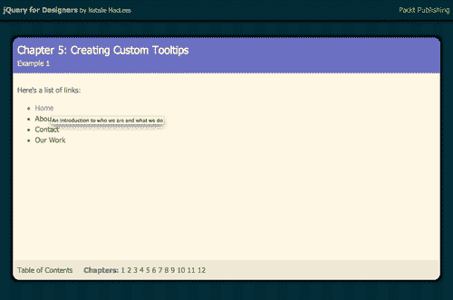

3.  Now, let's spruce that up a bit by replacing the default browser tooltip with our own styled one. First, we'll need to download Craig Thompson's qTip plugin. It's available from [http://craigsworks.com/projects/qtip2](http://craigsworks.com/projects/qtip2). His site has a list of features, several sample demos, the documentation you'll need to learn to use the plugin, a forum where you can get help, and the files needed are available for download. Head to the download page, and you'll see a checklist of options to help you download the right version.

    让我们一次浏览一个部分：

    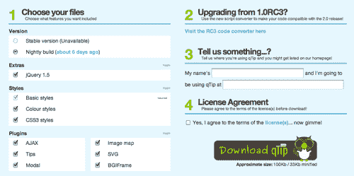

4.  **步骤 1**为我们提供了许多下载脚本的选项。在标题为**版本**的部分中，我将选择**稳定的**版本，以便获得经过全面测试的脚本的最新版本。那些想要在开发人员使用插件时对其进行试验和测试的人可以选择夜间构建。
5.  在**附加**部分，我将取消选中**jQuery 1.5**，因为我已经下载了 jQuery 并将其附加到我的项目中。如果您正在启动一个新项目，但尚未下载 jQuery，则可以选中此选项，以便与插件同时下载 jQuery。
6.  在**样式**部分，我将选择所有三组样式，因为我需要尽可能多的选项来设置工具提示的样式。同样，我将在**插件**部分保留所有选项，因为我将处理各种不同类型的工具提示，并利用这些不同的功能。如果您只想创建简单的基于文本的工具提示，您可以取消选中所有这些附加项并获得更小的下载文件。只有当你打算利用这些额外的功能时，才需要这些额外的功能。这是这个插件的一个很好的特性，我们可以选择我们想要的功能，以使我们的 JavaScript 文件尽可能小。
7.  **步骤 2**为任何正在更新代码的人提供了一个自动转换器，这些代码可能以前使用过该插件的早期版本。我们可以忽略这一步，因为我们是 qTip 插件的新手。
8.  **第 3 步**让我们有机会告诉插件开发者我们使用插件的网站，以换取在插件主页上展示插件的机会。由于我们只在本章中做一些练习，所以我们现在不会使用它，但这可能是你以后为自己的项目考虑的事情。
9.  **步骤 4**要求我们接受许可条款。这个插件是根据开源 MIT 和 GPLv2 许可证授权的，这使得我们可以免费使用、修改甚至重新发布代码，只要文件中包含许可证或许可证链接。当您下载插件文件时，该许可证已经包含在插件文件中，因此只要您不编辑这些文件以删除该许可证，就可以了。
10.  Finally, we can click the **Download qTip** button, and your browser will download a ZIP file for you. Unzip it and examine its contents. Inside, we'll find two CSS files and two JavaScript files. (You might have an extra JavaScript file if you elected to download jQuery as well as the plugin script).

    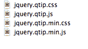

11.  Let's start with the two CSS files. We have `jquery.qtip.css` and `jquery.qtip.min.css`. These two files have exactly the same content. The difference between them is that the second file is minified, making it smaller and ideal for use in production. The other file is the development version that we could easily edit ourselves or use as an example if we wanted to write our own styles for our tooltips instead of using the prebuilt styles. You'll select one of the files and attach it to your page. In this example, I'm going to use the minified version of the file to keep the file as small as possible since I don't want to write my own styles at this point. Copy `jquery.qtip.min.css` to your own `styles` folder, and then attach the file to your HTML document in the`<head>` section:

    ```js
    <head>
    <title>Chapter 5: Creating Custom Tooltips</title>
    <link rel="stylesheet" href="styles/jquery.qtip.min.css"/>
    <link rel="stylesheet" href="styles/styles.css"/>
    </head>

    ```

    我将 qTip 样式表附加在我自己的 `styles.css`之前，以便更容易覆盖 qTip 样式表中的样式。

12.  接下来，让我们看看 JavaScript 文件。我们有 `jquery.qtip.js`和 `jquery.qtip.min.js`。就像 CSS 文件一样，这是同一文件的两个不同版本，我们只需选择一个并将其附加到 HTML 文档中。第一个文件 `jquery.qtip.js`是该文件的开发版本，最大的文件为 94K。第二个文件被缩小，重量仅为 41K。因为我们不需要编辑插件，并且将按原样使用它，所以让我们选择缩小版本。将 `jquery.qtip.min.js`复制到您自己的 `scripts`文件夹中，并将其附加到 HTML 文件的底部，在 jQuery 和我们自己的 `scripts.js`文件之间：

    ```js
    <script src="scripts/jquery.js"></script>
    <script src="scripts/jquery.qtip.min.js"></script>
    <script src="scripts/scripts.js"></script>
    </body>
    </html>

    ```

13.  我们需要做的最后一件事是调用插件代码。打开您的 `scripts.js`文件，添加文件就绪语句和函数：

    ```js
    $(document).ready(function(){
    });

    ```

14.  在函数内部，选择文档中所有具有 `title`属性的链接，并对这些链接调用 `qtip()`方法：

    ```js
    $(document).ready(function(){
    $('a[title]').qtip();
    });

    ```

15.  Now, when you view the page in the browser and move your mouse over the links with `title` attributes, you'll see the qTip-styled tooltips instead of the browser's default tooltips:

    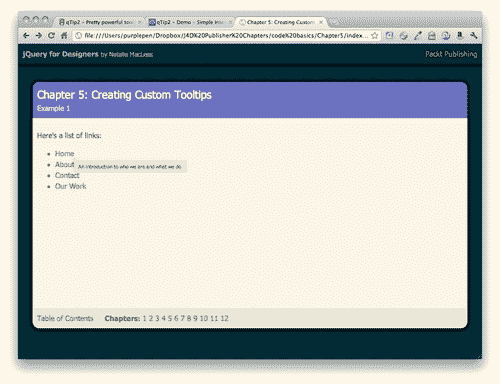

*   更好的是，无论我们使用哪种浏览器和操作系统，这些工具提示都将以相同的样式显示。

## 刚才发生了什么事？

我们下载了 qTip 插件，并将一个 CSS 文件和一个 JavaScript 文件附加到 HTML 文档中。然后我们只添加了几行 jQuery 代码来激活自定义工具提示。

我们选择了页面上所有具有 `title`属性的链接元素。我们利用 jQuery 的属性选择器实现了这一点：

```js
$('a[title]')

```

将 `title`放在元素选择器后面的括号中意味着我们只需要页面上具有 `title`属性的链接。

一旦我们选择了这些链接，剩下要做的就是调用 qTip 插件为我们提供的 `qtip()`方法。 `qtip()`方法负责将默认工具提示替换为自定义工具提示所需的所有操作。但是，如果我们想使用 qTip 中包含的其他一些样式，该怎么办？

# 定制 qTip 的外观

毫无疑问，您已经注意到，当鼠标悬停在链接上时，qTip 的左上角与链接的右下角对齐，并且工具提示显示为一个黄色框，旁边有一个小箭头。qTip 插件提供了许多选项，用于自定义工具提示的显示位置和外观，它以一种简单易懂的方式来实现。

# 行动时间-定制 QTIP

让我们来看看我们定制 QTip 的工具提示外观的选项：

1.  假设我们想要更改工具提示的位置。qTip 为我们在页面上定位工具提示提供了大量选项。
2.  We can match up any of these points on the tooltip to any of these points on the link:

    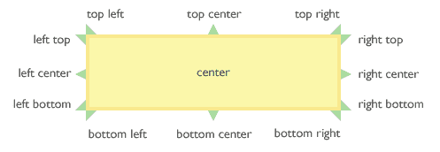

3.  In this example, we'll match up the middle of the link's right side with the middle of the tooltip's left side, so that the tooltip appears directly to the right of the link. We simply need to pass some additional information to the `qTip()` method. We'll keep working with the files we set up in the last example. Open your `scripts.js` file and pass this additional information to the `qtip()` method:

    ```js
    $('a[title]').qtip({
    position: {
    my: 'center left',
    at: 'center right'
    }
    });

    ```

    开发人员的目标是用简单的语言使其有意义。从工具提示的角度来看，我们将把我的左中对齐到链接的右中。正如您在浏览器中刷新页面时看到的，工具提示现在直接显示在链接的右侧。

    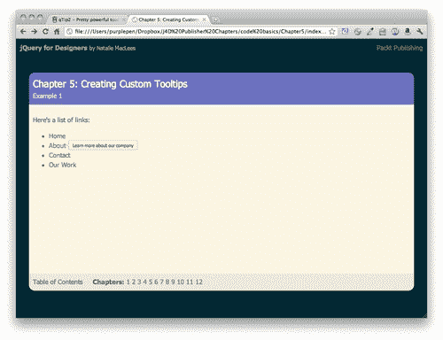

4.  In addition to changing the position of the tooltip, we can change the appearance of the tooltip itself. The CSS included with the plugin includes several color schemes and styles. These different colors and styles are applied by adding CSS classes to our tooltip. Let's take a look at how we add these CSS classes.

    ```js
    $('a[title]').qtip({
    position: {
    my: 'center left',
    at: 'center right'
    },
    style: {
    classes: 'ui-tooltip-blue'
    }
    });

    ```

    现在，当我们在浏览器中查看工具提示时，会看到它是蓝色的：

    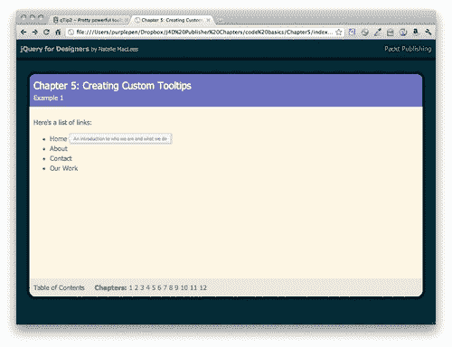

5.  qTip 提供的配色方案包括：
    *   `ui-tooltip`（默认黄色配色方案）
    *   `ui-tooltip-light`（白色工具提示上的黑色文本）
    *   `ui-tooltip-dark`（深灰色工具提示上的白色文本）
    *   `ui-tooltip-red`
    *   `ui-tooltip-green`
    *   `ui-tooltip-blue`

        可以将这些类中的任何一个添加到工具提示中以调整颜色方案。

6.  For CSS3-capable browsers, qTip also offers some fancier styles. These styles won't be seen in browsers that don't support the CSS3 specification, but in most cases, that should be fine. These styles can be considered as progressive enhancement for the browsers that can display them. Site visitors using a less capable browser will still be able to see and read the tooltips without any trouble. They just won't see the fancier styles applied. The available styles are as follows:

    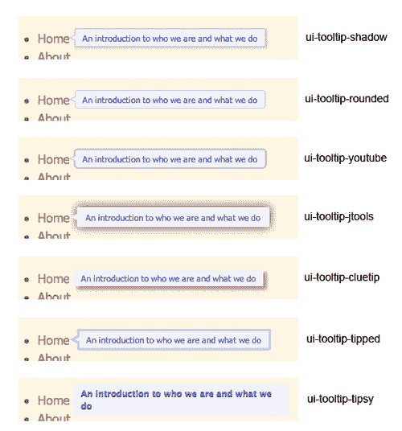

7.  Just like with the color schemes, we can take advantage of these styles by adding CSS classes to our tooltips. Multiple CSS classes can be added to a tooltip like so:

    ```js
    $('a[title]').qtip({
    position: {
    my: 'center left',
    at: 'center right'
    },
    style: {
    classes: 'ui-tooltip-blue ui-tooltip-shadow'
    }
    });

    ```

    此代码将创建一个蓝色且有阴影的工具提示。

## 刚才发生了什么事？

我们了解了如何将位置和样式值传递给 qTip 方法，以自定义工具提示的外观。我们学习了 qTip 插件中包含的颜色方案和样式，并学习了如何在自己的页面中使用这些样式来定制 qTip 工具提示。

# 工具提示的自定义样式

我们也可以为我们的工具提示编写自己的颜色方案和样式，如果没有一个可用的选项适合我们的网站。

# 行动时间-编写自定义工具提示样式

让我们来看看我们可以通过编写一个新的紫色配色方案来为 QTip 的工具提示编写自己的自定义样式：

1.  我们将首先检查编码 qTip 附带的红色工具提示样式的 CSS。您将在 qTip 下载包含的 `jquery.qtip.css`文件中找到这一点 CSS。以下是所有影响红色工具提示的 CSS 样式：

    ```js
    /*! Red tooltip style */
    .ui-tooltip-red .ui-tooltip-titlebar,
    .ui-tooltip-red .ui-tooltip-content{
    border-color: #D95252;
    color: #912323;
    }
    .ui-tooltip-red .ui-tooltip-content{
    background-color: #F78B83;
    }
    .ui-tooltip-red .ui-tooltip-titlebar{
    background-color: #F06D65;
    }
    .ui-tooltip-red .ui-state-default .ui-tooltip-icon{
    background-position: -102px 0;
    }
    .ui-tooltip-red .ui-tooltip-icon{
    border-color: #D95252;
    }
    .ui-tooltip-red .ui-tooltip-titlebar .ui-state-hover{
    border-color: #D95252;
    }

    ```

2.  通过检查这个 CSS，我们可以看到创建一个新的颜色方案所需要做的就是创建一个新的类名和四个紫色阴影来创建一个新的样式。这是我的紫色配色方案的 CSS。打开您的 `styles.css`文件并添加以下样式：

    ```js
    /*! Purple tooltip style */
    .ui-tooltip-purple .ui-tooltip-titlebar,
    .ui-tooltip-purple .ui-tooltip-content{
    border-color: #c1c3e6;
    color: #545aba;
    }
    .ui-tooltip-purple .ui-tooltip-content{
    background-color: #f1f2fa;
    }
    .ui-tooltip-purple .ui-tooltip-titlebar{
    background-color: #d9daf0;
    }
    .ui-tooltip-purple .ui-state-default .ui-tooltip-icon{
    background-position: -102px 0;
    }
    .ui-tooltip-purple .ui-tooltip-icon{
    border-color: #c1c3e6;
    }
    .ui-tooltip-purple .ui-tooltip-titlebar .ui-state-hover{
    border-color: #c1c3e6;
    }

    ```

3.  Now, to take advantage of our new purple tooltip style, we simply have to adjust our jQuery code to add the newly created `ui-tooltip-purple` class to our tooltips. Open `scripts.js` and adjust the classes being added to the tooltips:

    ```js
    $('a[title]').qtip({
    position: {
    my: 'center left',
    at: 'center right'
    },
    style: {
    classes: 'ui-tooltip-purple'
    }
    });

    ```

    现在，当您在浏览器中预览链接时，您将看到一个紫色的工具提示，如以下屏幕截图所示：

    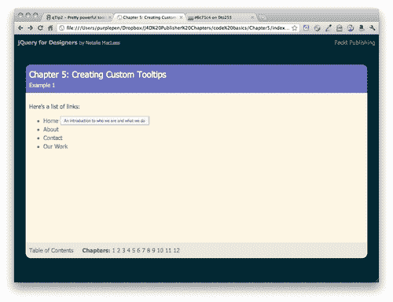

## 刚才发生了什么事？

使用 qTip 提供的一个 CSS 类，我们编写了自己的自定义样式，并将其应用到工具提示中。可以使用任何 CSS 样式为 qTip 工具提示创建自定义外观。当您开始混合颜色和字体选择、背景图像、边框样式等时，样式的可能性几乎没有限制。

## 拥有一个围棋英雄-创建一个你自己设计的工具提示

尝试编写自己的 CSS 类来设置工具提示的样式。尝试一种新的配色方案、新的字体样式和大小、文本阴影、框阴影——任何你能想到的使工具提示与网站设计相匹配或真正脱颖而出的东西。

# 通过工具提示增强导航功能

一旦你知道如何制作自定义工具提示，你会发现它们有很多可能的用途。让我们来看看使用 QTIP 插件增强自定义工具提示的标准导航栏。

# 该行动了——打造一个别致的导航栏

让我们来看看我们如何使用自定义设计的工具提示来添加一个逐渐增强的冲头到一个基本的导航栏：

1.  让我们从建立一个包含相关文件夹和文件的基本 HTML 页面开始，就像我们在[第 1 章](01.html "Chapter 1. Designer, Meet jQuery")中所做的一样，*设计器，遇到 jQuery*。在文档的正文中，包括一个简单的导航栏，如下所示：

    ```js
    <ul id="navigation"> <li><a href="home.html" title="An introduction to who we are and what we do">Home</a></li>
    <li><a href ="about.html" title="Learn more about our company">About</a></li>
    <li><a href="contact.html" title="Send us a message. We'd love to hear from you!">Contact</a></li>
    <li><a href="work.html" title="View a portfolio of the work we've done for our clients">Our Work</a></li>
    </ul>

    ```

2.  接下来，我们将向导航栏添加一些 CSS 样式。这里有很多 CSS，因为我使用渐变作为背景，现在不同的浏览器需要很多不同的 CSS。将这些 CSS 行添加到您的 `styles.css`文件中。如果您喜欢不同的样式，请随意定制 CSS 以适合您自己的口味：

    ```js
    #navigation {
    background: rgb(132,136,206); /* Old browsers */
    background: -moz-linear-gradient(top, rgba(132,136,206,1) 0%, rgba(72,79,181,1) 50%, rgba(132,136,206,1) 100%); /* FF3.6+ */
    background: -webkit-gradient(linear, left top, left bottom, color-stop(0%,rgba(132,136,206,1)), color-stop(50%,rgba(72,79,181,1)), color-stop(100%,rgba(132,136,206,1))); /* Chrome,Safari4+ */
    background: -webkit-linear-gradient(top, rgba(132,136,206,1) 0%,rgba(72,79,181,1) 50%,rgba(132,136,206,1) 100%); /* Chrome10+,Safari5.1+ */
    background: -o-linear-gradient(top, rgba(132,136,206,1) 0%,rgba(72,79,181,1) 50%,rgba(132,136,206,1) 100%); /* Opera11.10+ */
    background: -ms-linear-gradient(top, rgba(132,136,206,1) 0%,rgba(72,79,181,1) 50%,rgba(132,136,206,1) 100%); /* IE10+ */
    filter: progid:DXImageTransform.Microsoft.gradient( startColorstr='#8488ce', endColorstr='#8488ce',GradientType=0 ); /* IE6-9 */
    background: linear-gradient(top, rgba(132,136,206,1) 0%,rgba(72,79,181,1) 50%,rgba(132,136,206,1) 100%); /* W3C */
    list-style-type: none;
    margin: 100px 20px 20px 20px;
    padding: 0;
    overflow: hidden;
    -webkit-border-radius: 5px;
    -moz-border-radius: 5px;
    border-radius: 5px;
    }
    #navigation li {
    margin: 0;
    padding: 0;
    display: block;
    float: left;
    border-right: 1px solid #4449a8;
    }
    #navigation a {
    color: #fff;
    border-right: 1px solid #8488ce;
    display: block;
    padding: 10px;
    }
    #navigation a:hover {
    background: #859900;
    border-right-color: #a3bb00;
    }

    ```

3.  Now we have a navigation bar horizontally across our page, like this:

    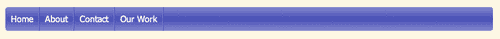

4.  我在链接中包含了 `title`属性，当我将鼠标移到导航链接上时，这些属性是可见的。我想在我的导航下面用友好的对话泡泡替换这些无聊的浏览器默认工具提示。
5.  就像我们在前面的示例中所做的那样，我们将把 qTip CSS 和 JavaScript 复制到我们自己的样式和脚本文件夹中，并将它们附加到 HTML 文档：

    ```js
    <!DOCTYPE html>
    <html>
    <head>
    <title>Chapter 5: Creating Custom Tooltips</title>
    <link rel="stylesheet" href="styles/jquery.qtip.min.css"/>
    <script src="../scripts/jquery.js"></script>
    <script src="scripts/jquery.qtip.min.js"></script>
    <script src="scripts/scripts.js"></script>
    </body>
    </html>

    ```

6.  Next, open your `scripts.js` file so we can call the `qtip()` method and pass in our customizations. We'll start off nearly the same way as last time, except that we'll use a different selector, since we only want to select links inside the navigation bar:

    ```js
    $(document).ready(function(){
    $('#navigation a').qtip();
    });

    ```

    现在，默认工具提示将替换为 qTip 样式的工具提示。

7.  接下来，我们将为导航工具提示创建自己的样式，因此我们将编写一些新的 CSS，使它们看起来像语音气泡。将这些样式添加到您的 `styles.css`文件：

    ```js
    .ui-tooltip-conversation .ui-tooltip-titlebar,
    .ui-tooltip-conversation .ui-tooltip-content{
    border: 3px solid #555;
    filter: none; -ms-filter: none;
    }
    .ui-tooltip-conversation .ui-tooltip-titlebar{
    background: #859900;
    color: white;
    font-weight: normal;
    font-family: serif;
    border-bottom-width: 0;
    }
    .ui-tooltip-conversation .ui-tooltip-content{
    background-color: #F9F9F9;
    color: #859900;
    -moz-border-radius: 9px;
    -webkit-border-radius: 9px;
    border-radius: 9px;
    padding: 10px;
    }
    .ui-tooltip-conversation .ui-tooltip-icon{
    border: 2px solid #555;
    background: #859900;
    }
    .ui-tooltip-conversation .ui-tooltip-icon .ui-icon{
    background-color: #859900;
    color: #555;
    }

    ```

8.  现在我们已经为工具提示准备好了一个新的 CSS 样式，我们只需要将这个新类添加到工具提示中。返回到 `scripts.js`并将新类添加到 JavaScript:

    ```js
    $('#navigation a').qtip({
    style: {
    classes: 'ui-tooltip-conversation'
    }
    });

    ```

9.  接下来，让我们定位语音气泡，使其显示在每个导航链接下面。在 `scripts.js`中，将位置信息传递给 `qtip()`方法：

    ```js
    $('#navigation a').qtip({
    position: {
    my: 'top center',
    at: 'bottom center'
    },
    style: {
    classes: 'ui-tooltip-conversation',
    width: '150px'
    }
    });

    ```

10.  现在，我们需要控制工具提示的宽度，这样它们就不会显得太宽。我们将宽度设置为 150px:

    ```js
    $('#navigation a').qtip({
    position: {
    my: 'top center',
    at: 'bottom center'
    },
    style: {
    classes: 'ui-tooltip-conversation',
    width: '150px'
    }
    });

    ```

11.  现在我们要做的最后一件事是更改工具提示在页面中的显示和消失方式。默认情况下，qTip 插件使用非常快速和微妙的淡入淡出。让我们对此进行更改，以便工具提示滑入视图并滑出视图：

    ```js
    $('#navigation a').qtip({
    position: {
    my: 'top center',
    at: 'bottom center'
    },
     show: {
    effect: function(offset) {
    $(this).slideDown(300);
    }
    },
    hide: {
    effect: function(offset) {
    $(this).slideUp(100);
    }
    },
    style: {
    classes: 'ui-tooltip-conversation',

    width: '150px'
    }
    });

    ```

12.  现在，当您在浏览器中查看页面时，当您将鼠标移到链接上时，您可以看到对话气泡滑入每个导航链接下方的视图，当您将鼠标移离链接时，它们滑出视图。

## 刚才发生了什么事？

我们回顾了如何创建自定义 CSS 样式并将其附加到 qTip 的工具提示，以及如何将工具提示放置在您希望它出现的任何位置。我们还学习了如何控制工具提示的宽度，以确保获得统一的大小。

然后，我们了解了如何覆盖默认的显示和隐藏行为，并将其替换为自定义动画。在本例中，我们使用 jQuery 的 `slideDown()`效果来显示工具提示。我们将一个值 300 传递给 `slideDown()`方法，这意味着动画需要 300 毫秒才能完成，或者大约三分之一秒。我发现，如果一个动画需要更长的时间，网站访问者就会迫不及待地等待它。

接下来，我们使用 jQuery 的 `slideUp()`方法覆盖默认隐藏行为。我通过了一个值 100，这意味着动画将在大约十分之一秒的时间内完成。当这个动画运行时，站点访问者已经决定继续前进，所以最好尽快将信息转移到他们的视线之外。

# 在工具提示中显示其他内容

到目前为止，我们已经了解了如何自定义 qTip 工具提示的外观，控制其外观、动画和位置。但是，我们只使用工具提示来显示文本，即我们放置在链接的 `title`属性中的文本。不过，我们有很多更强大的选择。我们可以将任何想要的内容加载到工具提示中。我们还可以确保在单击项目而不是将鼠标悬停在项目上方时显示工具提示。让我们看看当我们点击链接时，如何将内容从另一个 HTML 页面加载到工具提示中。

在本节中，我们将第一次深入讨论使用 Ajax。如果您不熟悉，**Ajax**是一种从服务器获取一些新内容并将其显示给站点访问者的方法，而无需完全刷新页面。因为浏览器只获取和显示站点访问者需要的信息，所以它通常更快、更快捷。

在我们第一次深入 Ajax 之前，请先做一个简短的说明。现代浏览器对 Ajax 请求有几种安全规则。您将无法在浏览器中简单地查看 ajaxified HTML 文件，因为到目前为止我们一直在这样做。为了查看运行中的 Ajax，您必须在查看文件之前将文件上载到服务器，或者必须在自己的计算机上设置服务器。如果你是 Mac 用户，我强烈推荐**MAMP**，它有免费版和付费版。您可以从[获取更多信息并下载 MAMPhttp://www.mamp.info](http://www.mamp.info) 。如果您使用 Windows，我强烈推荐免费的**WampServer**。您可以从[获取更多信息并下载 WampServerhttp://www.wampserver.com.](http://www.wampserver.com.)

# 行动时间-构建自定义 Ajax 工具提示

按照以下步骤设置一些显示 Ajax 内容的工具提示：

1.  我们将开始创建一个 HTML 文档以及相关的文件和文件夹，就像我们在[第 1 章](01.html "Chapter 1. Designer, Meet jQuery")中所做的一样，*设计师，与 jQuery*会面。我们的 HTML 页面应该包含两段文本，其中包含一些指向进一步信息的链接。我的第一个 HTML 文档如下所示：

    ```js
    <!DOCTYPE html>
    <html>
    <head>
    <title>Pittsburgh, Pennsylvania</title>
    <link rel="stylesheet" href="styles/styles.css"/>
    </head>
    <body>
    <h2>Pittsburgh, Pennsylvania</h2>
    <p>Pittsburgh is the second-largest city in the US Commonwealth of Pennsylvania and the county seat of Allegheny County. Regionally, it anchors the largest urban area of Appalachia and the Ohio River Valley, and nationally, it is the 22nd-largest urban area in the United States. The population of the city in 2010 was 305,704 while that of the seven-county metropolitan area stood at 2,356,285\. <a href="http://infoboxes/downtown.html">Downtown Pittsburgh</a> retains substantial economic influence, ranking at 25th in the nation for jobs within the urban core and 6th in job density.</p>
    <p>The characteristic shape of Pittsburgh's central business district is a triangular tract carved by the confluence of the Allegheny and Monongahela rivers, which form the Ohio River. The city features 151 high-rise buildings, 446 bridges, two inclined railways, and a pre-revolutionary fortification. Pittsburgh is known colloquially as "The City of Bridges" and "The Steel City" for its <a href="http://infoboxes/bridges.html">many bridges</a> and former steel manufacturing base.</p>
    <p>The warmest month of the year in Pittsburgh is July, with a 24-hour average of 72.6&deg;F. Conditions are often humid, and combined with the 90&deg;F (occurring on an average of 8.4 days per annum), a considerable <a href="http://infoboxes/heatindex.html">heat index</a> arises.</p>
    <script src="scripts/jquery.js"></script>
    <script src="scripts/scripts.js"></script>
    </body>
    </html>

    ```

2.  我们需要一种简单的方法来选择另外三个信息链接，因此我们将向每个链接添加一个 CSS 类，如下所示：

    ```js
    <a href ="http://infoboxes/downtown.html" class="infobox">Downtown Pittsburgh</a>

    ```

3.  Next, we need to create a set of short pages that each contain a photo and a caption for each of the links in my previous text. Here's a sample of one of my short HTML pages:

    ```js
    <!DOCTYPE html>
    <html>
    <head>
    <title>Downtown Pittsburgh</title>
    </head>
    <body>
    
    <p>Downtown Pittsburgh</p>
    </body>
    </html>

    ```

    如您所见，该文件非常小且简单。

4.  在主页旁创建一个 `infoboxes`目录。将简单 HTML 文件保存到此目录，然后为主文档中的每个链接创建一个更简单的文件。
5.  现在，如果您在浏览器中打开主页并单击文本中的链接，您将看到这些简短的普通页面加载到浏览器中。我们已经完成了基本功能，所以接下来我们将继续逐步增强那些启用 JavaScript 的页面。
6.  我们将使用本章前面为工具提示设置的紫色方案，因此让我们将 `ui-tooltip-purple`类的 CSS 添加到 `styles.css`文件中：

    ```js
    /*! Purple tooltip style */
    .ui-tooltip-purple .ui-tooltip-titlebar,
    .ui-tooltip-purple .ui-tooltip-content{
    border-color: #c1c3e6;
    color: #545aba;
    }
    .ui-tooltip-purple .ui-tooltip-content{
    background-color: #f1f2fa;
    }
    .ui-tooltip-purple .ui-tooltip-titlebar{
    background-color: #d9daf0;
    }
    .ui-tooltip-purple .ui-state-default .ui-tooltip-icon{
    background-position: -102px 0;
    }
    .ui-tooltip-purple .ui-tooltip-icon{
    border-color: #c1c3e6;
    }
    .ui-tooltip-purple .ui-tooltip-titlebar .ui-state-hover{
    border-color: #c1c3e6;
    }

    ```

7.  现在我们已经设置好了 HTML 和 CSS，让我们深入了解 JavaScript。在页面底部，jQuery 和您的 `scripts.js`文件之间附加 qTip 插件：

    ```js
    <script src="scripts/jquery.js"></script>
    <script src="scripts/jquery.qtip.min.js"></script>
    <script src="scripts/scripts/js"></script>
    </body>
    </html>

    ```

8.  接下来，打开 `scripts.js`，我们将开始使用文档准备功能：

    ```js
    $(document).ready(function(){
    });

    ```

9.  接下来，我们将以一种与以前稍有不同的方式调用 `qtip()`方法。在 `qtip()`方法中，我们需要很容易地获得关于我们正在使用的链接的信息，因此我们将使用 jQuery 的 `each()`方法一次循环一个链接。看起来是这样的：

    ```js
    $(document).ready(function(){
    $('a.infobox').each(function(){
    $(this).qtip()
    });
    });

    ```

10.  现在，如果您在浏览器中刷新页面，您将看到当您将鼠标悬停在链接上时不会发生任何事情。这是因为我们的链接没有 `title`属性，这就是 qTip 插件在默认情况下所寻找的。但是，我们可以覆盖该默认设置，将我们想要的任何内容插入工具提示中。
11.  We're going to be displaying those simple HTML pages we set up inside our tooltips. Even though Ajax requests tend to be quick, there could still be a bit of a delay, so let's get ready to use Ajax by adding a loading message that will display for our site visitors while they wait for the real content to show up:

    ```js
    $(document).ready(function(){
    $('a.infobox').each(function(){
    $(this).qtip({
    content: {
    text: 'Loading...'
    }
    });
    })
    });

    ```

    现在，当您在浏览器中刷新页面时，您将看到工具提示包含**加载。。。**文本。

12.  我们希望切换工具提示的行为，以便它们在单击链接时显示，而不是在鼠标悬停时显示。我们还希望确保页面上一次只能看到一个工具提示。如果站点访问者打开了一个工具提示，而另一个工具提示已经打开，那么第一个工具提示应该关闭，这样他们就不会在整个屏幕上打开很多工具提示。我们将这样做：

    ```js
    $(document).ready(function(){
    $('a.infobox').each(function(){
    $(this).qtip({
    content: {
    text: 'Loading...'
    },
    show: {
    event: 'click',
    solo: true
    },
    });
    })
    });

    ```

13.  现在，如果您在浏览器中刷新页面，您将看到当我们将鼠标悬停在链接上时，工具提示不再显示。
14.  然而，当我们现在点击链接时，我们会进入我们设置的简短的简单 HTML 页面。我们必须告诉浏览器忽略链接，因为我们还有其他计划。我们可以通过在前面的代码上方和 document ready 语句中添加这行代码来取消默认行为：

    ```js
    $(document).ready(function(){
    $('a.infobox').bind('click', function(e){e.preventDefault()});
    $('a.infobox').each(function(){

    ```

15.  What we're doing here is binding a function that fires when the links are clicked. Our function is pretty simple. We pass the current link to the function (e in this case for brevity, but we could have named it almost anything), and then we tell the browser to prevent the default link behavior.

    现在，如果您在浏览器中刷新页面，您将看到当我们单击链接时出现工具提示-单击链接不再将我们带到新页面。

16.  但我们可以用更简洁的方式编写代码。记住 jQuery 允许我们链接方法，一个接一个。在本例中，我们可以将 `bind()`方法直接链接到前面编写的 `each()`方法的末尾。新的 JavaScript 将如下所示：

    ```js
    $(document).ready(function(){
    $('a.infobox').each(function(){
    $(this).qtip({
    content: {
    text: 'Loading...'
    },
    show: {
    event: 'click',
    solo: true
    },
    });
    }).bind('click', function(e){e.preventDefault()});
    });

    ```

17.  Next, let's adjust the style of our tooltips by adding a drop shadow and applying the purple color scheme we wrote to our tooltips:

    ```js
    $(document).ready(function(){
    $('a.infobox').each(function(){
    $(this).qtip({
    content: {
    text: 'Loading...',
    },
    show: {
    event: 'click',
    solo: true
    },
    style: {
    classes: 'ui-tooltip-purple ui-tooltip-shadow'
    }
    });
    }).bind('click', function(e){e.preventDefault();});
    });

    ```

    现在，当您在浏览器中刷新页面时，您将看到紫色的工具提示带有阴影。我们越来越近了。

18.  Next, let's add in the Ajax magic to load our simple HTML pages into the tooltips. Remember, this will only work from a server, so to see this step in action, you'll either have to upload your files to a server, or else set up a server on your own computer.

    要告诉工具提示通过 Ajax 获取内容，我们所要做的就是传递要获取的内容的 URL。在本例中，我们已经链接到该内容。我们只需要从每个链接中获取链接 URL。通过使用 jQuery 的`attr()`方法，我们可以很容易地访问到这一点。看起来是这样的：

    ```js
    $(this).attr('href')

    ```

    在这种情况下，`$(this)`指的是当前链接。我调用 `attr()`方法并将我想要获取的属性传递给该方法，在本例中，链接的 `href`属性包含我想要的信息。 `attr()`方法可用于获取任意属性—图像的 `src`属性、任意元素的 `title`属性、表格的 `cellspacing`属性等：

    ```js
    $('img').attr('src')
    $('p').attr('title')
    $('table').attr('cellspacing')

    ```

19.  现在我们知道了如何获取链接的 `href`属性，我们将使用该属性告诉工具提示使用哪个 URL 获取工具提示的内容：

    ```js
    $(document).ready(function(){
    $('a.infobox').each(function(){
    $(this).qtip({
    content: {
    text: 'Loading...',
    ajax: {
    url: $(this).attr('href')
    }
    },
    show: {
    event: 'click',
    solo: true
    },
    style: {
    classes: 'ui-tooltip-purple ui-tooltip-shadow'
    }
    });
    }).bind('click', function(e){e.preventDefault()});
    });

    ```

20.  Refresh your browser and click on one of the links — you'll see the purple tooltip pop up with the HTML content from our simple HTML pages. Pretty amazing that fetching content with Ajax can be that simple, isn't it?

    现在，让我们对工具提示做一些其他的最后调整，使它们变得更好。

21.  首先，我们将在工具提示中添加一个标题栏。为了获得一些自定义文本，让我们回到 `index.html`文件中的每个链接，并添加一个 `title`属性，该属性包含要显示在工具提示顶部的文本：

    ```js
    <a href ="http://infoboxes/downtown.html" class="infobox" title="Downtown Pittsburgh">Downtown Pittsburgh</a>
    ...
    <a href ="http://infoboxes/bridges.html" class="infobox" title="Pittsburgh Bridges">many bridges</a>
    <a href ="http://infoboxes/heatindex.html" class="infobox" title="Beating the Heat">heat index</a>

    ```

22.  Now, we can fetch the `title` attribute of these links in much the same way that we fetched the URL of the `href` attribute and pass it to qTip as the title text for the tooltip. While we're at it, we can also pass in a `true` value for button to show a small close button at the top-right of the tooltip:

    ```js
    $(document).ready(function(){
    $('a.infobox').each(function(){
    $(this).qtip({
    content: {
    text: 'Loading...',
    ajax: {
    url: $(this).attr('href')
    },
    title: {
    text: $(this).attr('title'), button: true
    }
    },
    show: {
    event: 'click',
    solo: true
    },
    style: {
    classes: 'ui-tooltip-purple ui-tooltip-shadow'
    }
    });
    }).bind('click', function(e){e.preventDefault()});
    });

    ```

    现在，当您刷新浏览器时，您将看到在每个工具提示的顶部出现一个带有关闭按钮的较暗标题栏。

23.  但是，如果尝试将鼠标移到“关闭”按钮上，您将看到工具提示在到达之前消失。我们将工具提示的显示值更改为单击时显示，而不是鼠标悬停时显示，但从未更改隐藏值-当我们将鼠标移离链接时，工具提示仍处于隐藏状态。这有点尴尬，所以我将把隐藏值改为 `unfocus`，这样当链接失去焦点或站点访问者单击工具提示上的关闭按钮时，工具提示将被隐藏：

    ```js
    $(document).ready(function(){
    $('a.infobox').each(function(){
    $(this).qtip({
    content: {
    text: 'Loading...',
    ajax: {
    url: $(this).attr('href')
    },
    title: {
    text: $(this).attr('title'),
    button: true
    }
    },
    show: {
    event: 'click',
    solo: true
    },
    hide: 'unfocus',
    style: {
    classes: 'ui-tooltip-purple ui-tooltip-shadow'
    }
    });
    }).bind('click', function(e){e.preventDefault()});
    });

    ```

24.  刷新你的浏览器，你会发现现在的交互效果好多了。我们的网站访问者不必为了查看工具提示中的内容而将鼠标放在链接上。我们的工具提示仍然很容易删除-网站访问者可以单击关闭按钮，或者单击页面上工具提示之外的任何位置，工具提示将隐藏。
25.  Now, there's just one thing left to do, and that's to position the tooltips right where we'd like them to appear. I want to show my tooltips centered below the links, so I'll match up the top-center of the tooltip with the bottom-center of the link:

    ```js
    $(document).ready(function(){
    $('a.infobox').each(function(){
    $(this).qtip({
    content: {
    text: 'Loading...',
    ajax: {
    url: $(this).attr('href')
    },
    title: {
    text: $(this).attr('title'),
    button: true
    }
    },
    position: {
    my: 'top center',
    at: 'bottom center'
    },
    show: {
    event: 'click',
    solo: true
    },
    hide: 'unfocus',
    style: {
    classes: 'ui-tooltip-purple ui-tooltip-shadow'
    }
    });
    }).bind('click', function(e){e.preventDefault()});
    });

    ```

    现在，如果在浏览器中刷新页面并单击链接，您将看到工具提示从默认位置滑入到位。

26.  我们的工具提示看起来不错，但是我们仍然有一些问题。一是工具提示从下角到中间的动画有点分散注意力。为了解决这个问题，让我们将 `effect`值设置为 `false`。这样，工具提示将显示在它应该显示的位置，而无需滑动到位的动画。另一个问题是，根据浏览器窗口的大小，有时工具提示会被切断并显示在屏幕区域之外。为了确保不会发生这种情况，我们将按如下方式将 `viewport`值设置到窗口：

    ```js
    $(document).ready(function(){
    $('a.infobox').each(function(){
    $(this).qtip({
    content: {
    text: 'Loading...',
    ajax: {
    url: $(this).attr('href')
    },
    title: {
    text: $(this).attr('title'),
    button: true
    }
    },
    position: {
    my: 'top center',
    at: 'bottom center',
    effect: false,
    viewport: $(window)
    },
    show: {
    event: 'click',
    solo: true
    },
    hide: 'unfocus',
    style: {
    classes: 'ui-tooltip-purple ui-tooltip-shadow'
    }
    });
    }).bind('click', function(e){e.preventDefault()});
    });

    ```

27.  现在，您将看到，当您在浏览器中重新加载页面时，如果可能，工具提示将显示在链接下方的中心位置，但如果这样会将其置于窗口区域之外，则工具提示将调整其位置，使其相对于链接的显示位置尽可能最佳。我们对工具提示的显示位置失去了一些控制，但我们可以确保我们的网站访问者始终能够看到工具提示的内容，这一点更为重要。

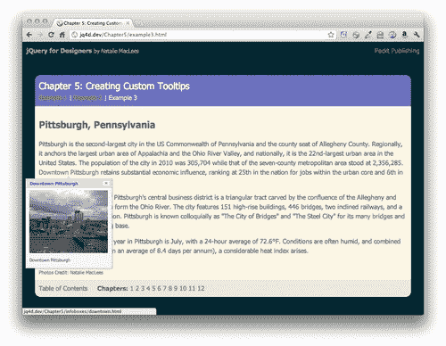

# 总结

在这一章中我们讨论了很多问题。我们学习了如何使用 qTip 插件将浏览器的默认工具提示替换为自定义设计的工具提示。我们看到了如何通过在导航栏中添加语音气泡工具提示来进一步进行定制。最后，我们使用 Ajax 引入一些外部内容，不仅自定义工具提示的外观，还引入自定义内容，添加标题栏和关闭按钮，确保工具提示始终可见，并自定义工具提示的显示和隐藏行为。我希望你能看到 qTip 插件有多灵活，除了自定义工具提示的外观，它还有多少用途。体验插件文档中列出的所有不同设置，并了解自定义工具提示外观的创造性。

下一步，我们将看看如何创建设计精良、充满动画的下拉式导航菜单。