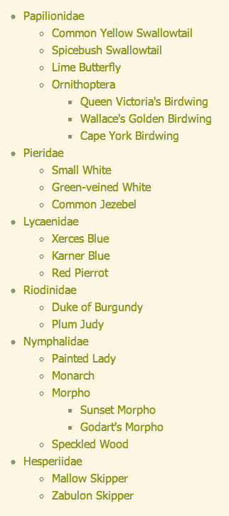
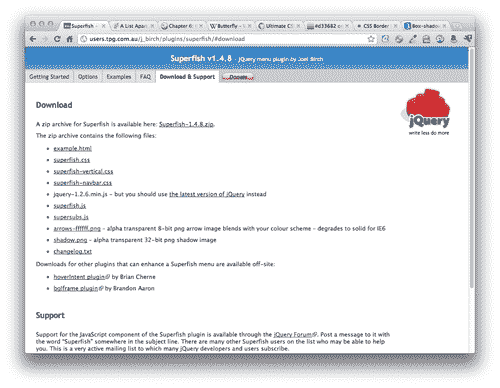
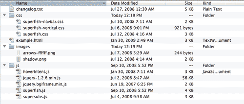
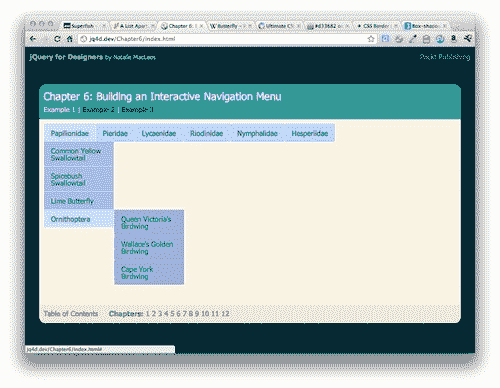
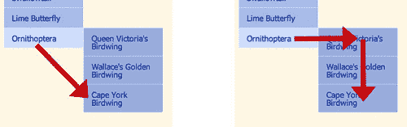
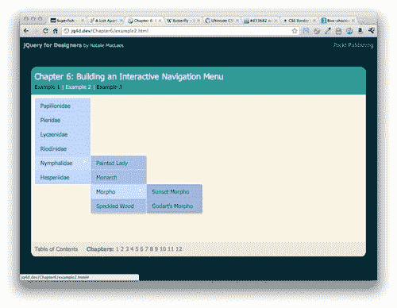
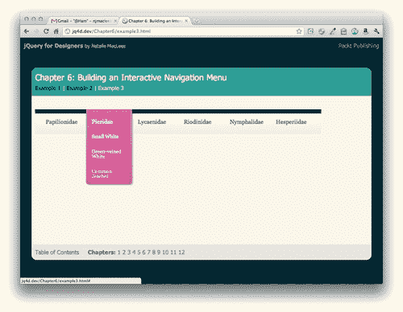
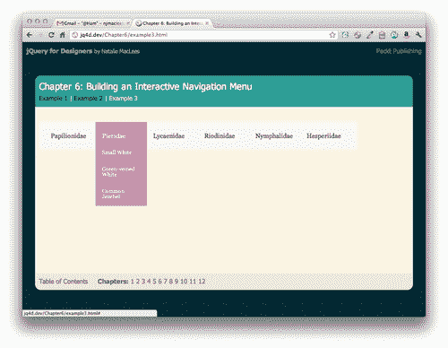

# 六、构建交互式导航菜单

> 2003 年，一篇文章发表在一份清单上（[http://alistapart.com 名为*吸盘鱼下拉菜单*的](http://alistapart.com)展示了如何单独使用 HTML 和 CSS（对 IE6 只有一点 JavaScript 帮助）来构建复杂的多级下拉菜单。吸盘鱼的名字来源于这项技术的华丽设计的演示，展示了 remoras 和 sharksuckers 的插图。虽然很有用，但原始版本要求站点访问者在导航时不要将鼠标移到菜单区域之外，否则菜单将消失。多年来，吸盘鱼的下降激发了许多衍生产品的灵感——吸盘鱼之子、改良的吸盘鱼等等，试图解决原始产品的缺点。由于 jQuery 可以让一切变得更好，我们将基于这个想法，使用 SuperfishjQuery 插件使菜单更易于使用。

Superfish 插件的开发人员 Joel Birch 说，该插件的大多数支持问题都来自不理解菜单 CSS 的人。为了确保您对 CSS 有一个坚定的理解，我强烈建议您阅读*上*之外的[列表中的原始吸盘鱼下拉列表文章 http://www.alistapart.com/articles/dropdowns](http://www.alistapart.com/articles/dropdowns) 。

为了开始使用这个插件，我们将构建一个基本的吸盘鱼菜单。由于该菜单只需要 CSS，如果禁用了 JavaScript，我们仍然会得到一个交互式菜单。对于启用了 JavaScript 的用户，菜单只是有所改进。

在本章中，我们将学习以下主题：

*   使用 Superfish jQuery 插件创建水平下拉菜单
*   使用 Superfish 插件创建垂直弹出菜单
*   自定义使用 Superfish 插件创建的下拉菜单和弹出菜单

# 水平下拉菜单

水平下拉菜单长期以来一直是桌面软件中的一个常见项，但在 CSS 和 JavaScript 最终出现并使之成为可能之前，即使不是不可能，也很难在网站中实现。

# 行动时间-创建水平下拉菜单

让我们看看如何使用 FixFipe 插件创建一个水平下拉菜单：

1.  To get started, we'll create a simple HTML page and the associated folders and files like we created in [Chapter 1](01.html "Chapter 1. Designer, Meet jQuery"), *Designer, Meet jQuery*. The body of our HTML file will contain a navigation menu that consists of nested unordered lists as follows:

    ```js
    <ul id="sfNav" class="sf-menu">
    <li><a href="#">Papilionidae</a>
    <ul>
    <li><a href="#">Common Yellow Swallowtail</a></li>
    <li><a href="#">Spicebush Swallowtail</a></li>
    <li><a href="#">Lime Butterfly</a></li>
    <li><a href="#">Ornithoptera</a>
    <ul>
    <li><a href="#">Queen Victoria's Birdwing</a></li>
    <li><a href="#">Wallace's Golden Birdwing</a></li>
    <li><a href="#">Cape York Birdwing</a></li>
    </ul>
    </li>
    </ul>
    </li>
    <li><a href="#">Pieridae</a>
    <ul>
    <li><a href="#">Small White</a></li>
    <li><a href="#">Green-veined White</a></li>
    <li><a href="#">Common Jezebel</a></li>
    </ul>
    </li>
    <li><a href="#">Lycaenidae</a>
    <ul>
    <li><a href="#">Xerces Blue</a></li>
    <li><a href="#">Karner Blue</a></li>
    <li><a href="#">Red Pierrot</a></li>
    </ul>
    </li>
    <li><a href="#">Riodinidae</a>
    <ul>
    <li><a href="#">Duke of Burgundy</a></li>
    <li><a href="#">Plum Judy</a></li>
    </ul>
    </li>
    <li><a href="#">Nymphalidae</a>
    <ul>
    <li><a href="#">Painted Lady</a></li>
    <li><a href="#">Monarch</a></li>
    <li><a href="#">Morpho</a>
    <ul>
    <li><a href="#">Sunset Morpho</a></li>
    <li><a href="#">Godart's Morpho</a></li>
    </ul>
    </li>
    <li><a href="#">Speckled Wood</a></li>
    </ul>
    </li>
    <li><a href="#">Hesperiidae</a>
    <ul>
    <li><a href="#">Mallow Skipper</a></li>
    <li><a href="#">Zabulon Skipper</a></li>
    </ul>
    </li>
    </ul>

    ```

    请注意，我们在包含菜单的 `<ul>`中添加了 `sfNav`的 `id`和 `sf-menu`的 `class`。这将使我们很容易选择和风格的菜单，我们想要的方式。

    如果在浏览器中查看页面，它将类似于以下屏幕截图：

    

    如您所见，我们已将链接组织成一个层次结构。这对于查找我们想要的信息很有用，但是它占用了很多空间。在这里，我们可以使用一种技术来隐藏额外的信息，直到需要为止。

2.  Next, we need a copy of the Superfish plugin. Head over to [http://users.tpg.com.au/j_birch/plugins/superfish/](http://users.tpg.com.au/j_birch/plugins/superfish/) where you'll find Joel Birch's Superfish plugin available for download along with documentation and examples.

    在 Joel 的**快速入门指南**中，我们看到实现 Superfish 插件有三个简单步骤：

    *   编写 CSS 以创建吸盘鱼样式下拉菜单
    *   链接到 `superfish.js`文件
    *   对包含菜单的元素调用 `superfish()`方法

    幸运的是，Joel 还包含了一个示例 CSS 文件，因此我们可以快速开始。稍后，我们将考虑定制菜单的外观，但现在，我们将继续使用插件中包含的 CSS。

3.  Click on the **Download & Support** tab.

    

    **下载**部分的第一个链接是下载 ZIP 文件的链接。在这下面，我们看到了一个包含在 ZIP 中的所有文件的项目符号列表，并提供了分别下载每个文件的链接。我们将继续下载整个 ZIP 文件，因为我们将使用其中的几个文件。点击**Superfish-1.4.8.zip**链接，将文件保存到您的计算机中。

4.  Unzip the folder and take a look inside:

    

    我们会发现这些文件按照类型被很好地组织到子目录中，还有一个示例 HTML 文件，我们可以通过检查来查看插件的工作情况。

5.  我们在**下载**部分需要的第一个文件是 `css`文件夹中的 `superfish.css`文件。将该文件复制到您自己的 `styles`文件夹中。
6.  Next, we'll edit our HTML file to include the `superfish.css` file in the head of the document:

    ```js
    <head>
    <title>Chapter 6: Building an Interactive Navigation Menu </title>
    <link rel="stylesheet" href="styles/superfish.css"/>
    <link rel="stylesheet" href="styles/styles.css"/>
    </head>

    ```

    我们将 `superfish.css`文件附加到 `styles.css`文件之前，以便更容易覆盖 `superfish.css`文件中稍后要更改的任何样式。

7.  Now, if you refresh the page in a browser, you'll see a working Suckerfish drop-down menu:

    

当我将鼠标移到第一个链接上时，嵌套的`<ul>`将可见。如果我将鼠标向下移动到下拉列表中的最后一个链接，嵌套在第三层的`<ul>`将可见。

请记住，所有这些都是在没有 JavaScript 的情况下完成的，而只是 CSS。如果你花一些时间使用菜单，你可能会很快发现一些缺点。首先，如果我想将鼠标从**鸟翼**链接移动到**约克角·伯德温**链接，我的自然倾向是对角移动鼠标。但是，一旦鼠标离开蓝色菜单区域，菜单就会关闭并消失。我必须调整，将鼠标直接移动到子菜单上，然后向下移动到我感兴趣的链接。



这是尴尬的，使菜单感到脆弱。如果我的鼠标在菜单外移动了 1 个像素，菜单就会折叠并消失。另一个问题是，一旦鼠标悬停在菜单上，菜单就会打开。如果我将鼠标移到菜单上，从页面的一个部分移动到另一个部分，菜单会快速打开和关闭，这可能会分散注意力，也会出乎意料。

这是 jQuery 介入的好地方，可以让事情变得更好、更可用。

# 行动时间-使用 jQuery 改进下拉菜单

按照以下步骤使用 jQuery 提高下拉菜单的可用性：

1.  我们首先将 Superfish 插件附加到我们文件底部的 HTML 页面，在 jQuery 和我们的 `scripts.js`文件

    ```js
    <script src="scripts/jquery.js"></script>
    <script src="scripts/superfish.js"></script>
    <script src="scripts/scripts.js"></script>
    </body>
    </html>

    ```

    之间
2.  接下来，打开 `scripts.js`，在这里我们将编写调用 `superfish()`方法的代码。像往常一样，我们将从 documentready 语句开始，这样我们的脚本在页面加载到浏览器时就会运行：

    ```js
    $(document).ready(function(){
    // Our code will go here.
    });

    ```

3.  查看 Superfish 插件的文档，我们发现我们只需选择一个或多个要应用行为的元素，然后调用 `superfish()`方法。在我们的 `ready()`方法中，我们将添加以下代码：

    ```js
    $(document).ready(function(){
    $('#sfNav').superfish();
    });

    ```

现在，如果您在浏览器中刷新页面，您将看到菜单看起来仍然非常相似，但行为有了很大的改进。superfishjavascript 和 CSS 协同工作，向具有嵌套子菜单项的菜单项添加箭头。如果将鼠标移出菜单，它不会立即消失，从而可以沿对角线方向将鼠标移动到嵌套菜单项。当菜单项出现时，动画中也会出现细微的淡入淡出。鼠标悬停时，每个菜单项的背景色都会发生变化，这样就可以很容易地看到哪个菜单项当前处于活动状态。

## 刚才发生了什么事？

我们设置了一个由一组嵌套列表组成的导航菜单，形成了一个层次结构。接下来，我们附加了一个 CSS 文件，在菜单中添加了一个简单的下拉功能。然而，仅 CSS 菜单有一些缺点。因此，我们附加了 Superfish 插件来处理这些问题，并使我们的菜单更加用户友好。

# 垂直弹出菜单

我们看到了 Superfish 插件的添加是如何增强下拉菜单的用户体验的，但是如果我们想创建一个垂直的弹出菜单呢？

# 行动时间-创建垂直弹出菜单

从水平下拉菜单切换到垂直弹出菜单是再容易不过了。我们将使用相同的 HTML 标记，JavaScript 代码将保持不变。我们需要做的唯一更改是添加一些新的 CSS，使菜单垂直显示，而不是水平显示。我们可以继续使用上一个示例中使用的相同文件。

1.  在 Superfish 下载的 `css`文件夹中，您会找到一个名为 `superfish-vertical.css`的文件。将该文件复制到您自己的 `styles`文件夹中。在 HTML 文件的 `head`部分，我们将附加新的 CSS 文件。在 `superfish.css`和 `styles.css`之间，添加新的 CSS 文件：

    ```js
    <link rel="stylesheet" href="styles/superfish.css"/>
    <link rel="stylesheet" href="styles/superfish-vertical.css"/>
    <link rel="stylesheet" href="styles/styles.css"/>

    ```

2.  现在，在 HTML 中，我们将向包含菜单的列表中添加一个 `sf-vertical`类。

    ```js
    <ul id="sfNav" class="sf-menu sf-vertical">

    ```

3.  Now when you refresh the page in a browser, you'll see the menu displayed vertically with fly-outs:

    

## 刚才发生了什么事？

水平下拉菜单和垂直弹出菜单之间的唯一区别是 CSS 和添加到菜单容器中的类名。只需添加一个新的 CSS 文件和一个新的 CSS 类，就可以创建一个垂直的弹出菜单而不是水平的下拉菜单。

# 自定义导航菜单

包含超级鱼插件的 CSS 使得创建交互式导航菜单简单快捷，但是软式蓝色菜单不适合于每个设计，所以让我们看看如何定制菜单。

我们将研究如何通过编写自己的 CSS 来定制菜单的外观，定制显示嵌套菜单的动画，突出显示当前页面，以及增强菜单的悬停行为。

我们将开始编写一些 CSS 来创建菜单的自定义外观。我们将使用 Suckrfish 下拉方法创建一个菜单，该菜单适用于未启用 JavaScript 的网站访问者。我想创建一个软梯度背景，并让我的菜单项显示为飘浮在这个背景顶部的色带。我的菜单将类似于以下屏幕截图：



我将真正利用现代浏览器中可用的较新 CSS3 属性。我使用的是渐变、长方体阴影和圆角。我仔细地选择了这些选项，因为即使没有这些额外的功能，菜单看起来仍然可以使用。以下是菜单在旧浏览器中的显示示例：



您可以看到，它缺少了现代浏览器示例中的一些额外样式，但它仍然是完全可用的，并且总体上令人赏心悦目。如果菜单在所有浏览器中看起来都一样非常重要，那么我们可以使用图像而不是 CSS3 应用相同的效果来获得最终效果。然而，我们可能需要添加一些额外的标记，我们肯定需要添加图像和额外的 CSS 行，所有这些都会增加页面的整体重量。您是决定允许您的菜单在较旧的浏览器中优雅地降级，还是决定编写额外的代码并创建额外的图像以使菜单在所有浏览器中都显示相同，这是您需要根据客户的期望、网站的目标受众、，以及构建快速轻量级页面的重要性。

在为下拉菜单或弹出菜单编写自定义 CSS 时，请记住以下几点：

## ：悬停和.sfHover

为了使菜单在没有 JavaScript 的情况下工作，您需要利用列表项的 `:hover`伪类。确保还为同一元素创建一个 CSS 选择器，该选择器带有一个 `.sfHover`类，JavaScript 将使用该类。例如：

```js
.sf-menu li.sfHover ul,
.sf-menu li:hover ul {
left: -1px;
top: 70px; /* match top ul list item height */
z-index: 99;
}

```

当父列表项悬停在屏幕上时，这段代码使嵌套菜单在屏幕上可见。包括 `li:hover`选择器，确保菜单在没有 JavaScript 的情况下工作。还包括 `li.sfHover`选择器，确保 JavaScript 菜单将应用相同的代码。

## 级联继承风格

CSS 的本质就是将样式级联到 DOM 中，并应用于选择器的所有子级以及选择器本身。因此，如果您编写代码来设置一级菜单列表项的样式，如下所示：

```js
ul.sf-menu li {
background: #cc0000; /* Dark red background */
}

```

菜单中的所有`<li>s`都将具有深红色背景，无论它们出现在菜单的哪个级别。如果要将不同的样式应用于不同的菜单级别，则必须在其他代码行中重写级联。例如，如果我想使第二级菜单具有深蓝色背景，我会在前面的代码之后添加 CSS*片段：*

```js
ul.sf-menu li li {
background: #0000cc; /* Dark blue background */
}

```

这意味着，对于另一个`<li>`中的`<li>`，背景将为蓝色。请记住，现在此样式将依次向下层叠到其他菜单级别，因此如果您希望第三级菜单的背景为深绿色，则需要添加另一点 CSS：

```js
ul.sf-menu li li li {
background: #00cc00; /* Dark green background */
}

```

在某些情况下，在 CSS 中使用直接后代选择器可以帮助您避免编写太多行 CSS 覆盖样式，这些样式是为 DOM 中较高级别的元素编写的。例如：

```js
ul.sf-menu > li {
background: #cc0000; /* Dark red background */
}

```

CSS 的这一部分利用了直接后代选择器（>）。本例中的暗红色背景仅适用于直接嵌套在`<ul>`中的`<li>`元素，其类为 `sf-menu`。它不会级联到第二级或第三级菜单。

# 供应商前缀

如果您想尝试使用新的 CSS3 属性，那么必须确保在属性前面加上特定于供应商的前缀。虽然大多数现代浏览器都支持这些属性，但它们仍在开发中，可能在不同的浏览器中以稍微不同的方式实现。举个例子，这个 CSS 位将底部的两个角括起来：

```js
.sf-menu ul li:last-child a {
-webkit-border-bottom-right-radius: 7px;
-webkit-border-bottom-left-radius: 7px;
-moz-border-radius-bottomright: 7px;
-moz-border-radius-bottomleft: 7px;
border-bottom-right-radius: 7px;
border-bottom-left-radius: 7px;
}

```

您可以看到，基于 webkit 的浏览器（主要是 Safari 和 Chrome）和 Mozilla 浏览器（主要是 Firefox）的左下角和右下角的属性略有不同。在特定于供应商的代码之后，包括适用于任何支持该代码的浏览器的通用 CSS3 代码，以确保您的代码是经得起未来考验的。

# 行动时间-定制 Superfish 菜单

自定义 Superfish 菜单主要涉及编写自己的 CSS，以按照自己喜欢的方式设置菜单样式。下面是我们将如何为菜单创建自定义外观：

如果您还记得一些 web 基础知识，您就会记得 CSS 代表级联样式表。我们将在这里重点介绍级联特性。我们为菜单顶层编写的任何样式都将级联到菜单的其他级别。我们必须记住这一点，并处理所有我们希望阻止样式向下层叠的情况。

1.  Let's get started by styling the top level of our menu. Since I'm using new CSS3 features, we're going to have to be prepared to write a bit of extra code so that each browser can handle our code gracefully. Here's the CSS we'll create for the top level of the menu. Place this code inside your `styles.css` file:

    ```js
    /**** Level 1 ****/
    .sf-menu,
    .sf-menu * {
    list-style: none;
    margin: 0;
    padding: 0;
    }
    .sf-menu {
    background: #f6f6f6; /* Old browsers */
    background: -moz-linear-gradient(top, rgba(0,0,0,1) 1%, rgba(56,56,56,1) 16%, rgba(255,255,255,1) 17%, rgba(246,246,246,1) 47%, rgba(237,237,237,1) 100%); /* FF3.6+ */
    background: -webkit-gradient(linear, left top, left bottom, color-stop(1%,rgba(0,0,0,1)), color-stop(16%,rgba(56,56,56,1)), color-stop(17%,rgba(255,255,255,1)), color-stop(47%,rgba(246,246,246,1)), color-stop(100%,rgba(237,237,237,1))); /* Chrome,Safari4+ */
    background: -webkit-linear-gradient(top, rgba(0,0,0,1) 1%,rgba(56,56,56,1) 16%,rgba(255,255,255,1) 17%,rgba(246,246,246,1) 47%,rgba(237,237,237,1) 100%); /* Chrome10+,Safari5.1+ */
    background: -o-linear-gradient(top, rgba(0,0,0,1) 1%,rgba(56,56,56,1) 16%,rgba(255,255,255,1) 17%,rgba(246,246,246,1) 47%,rgba(237,237,237,1) 100%); /* Opera11.10+ */
    background: -ms-linear-gradient(top, rgba(0,0,0,1) 1%,rgba(56,56,56,1) 16%,rgba(255,255,255,1) 17%,rgba(246,246,246,1) 47%,rgba(237,237,237,1) 100%); /* IE10+ */
    filter: progid:DXImageTransform.Microsoft.gradient( startColorstr='#000000', endColorstr='#ededed',GradientType=0 ); /* IE6-9 */
    background: linear-gradient(top, rgba(0,0,0,1) 1%,rgba(56,56,56,1) 16%,rgba(255,255,255,1) 17%,rgba(246,246,246,1) 47%,rgba(237,237,237,1) 100%); /* W3C */
    float: left;
    font-family: georgia, times, 'times new roman', serif;
    font-size: 16px;
    line-height: 14px;
    margin: 28px 0 14px 0;
    padding: 0 14px;
    }
    .sf-menu li {
    border-left: 1px solid transparent;
    border-right: 1px solid transparent;
    float: left;
    position: relative;
    }
    .sf-menu li.sfHover,
    .sf-menu li:hover {
    visibility: inherit; /* fixes IE7 'sticky bug' */
    }
    .sf-menu li.sfHover,
    .sf-menu li:hover {
    background: #DF6EA5;
    border-color: #a22361;
    -webkit-box-shadow: 3px 3px 3px rgba(0,0,0,0.2);
    -moz-box-shadow: 3px 3px 3px rgba(0,0,0,0.2);
    box-shadow: 3px 3px 3px rgba(0,0,0,0.2);
    }
    .sf-menu a {
    border-left: 1px solid transparent;
    border-right: 1px solid transparent;
    color: #444;
    display: block;
    padding: 28px 14px;
    position: relative;
    width: 98px;
    text-decoration: none;
    }
    .sf-menu li.sfHover a,
    .sf-menu li:hover a {
    background: #DF6EA5;
    border-color: #fff;
    color: #fff;
    outline: 0;
    }
    .sf-menu a,
    .sf-menu a:visited {
    color: #444;
    }

    ```

    呸！这似乎有很多代码，但其中大部分是重复的渐变和阴影声明，我们必须为每种不同类型的浏览器使用。祈祷这一要求很快就会消失，浏览器供应商最终就如何使用 CSS 创建渐变和阴影达成一致。

2.  Next, let's take a look at how we'll style the next level of our menus. Add the following CSS to your `styles.css` file to style the second level:

    ```js
    /***** Level 2 ****/
    .sf-menu ul {
    background: rgb(223,110,165); /* Old browsers */
    background: -moz-linear-gradient(top, rgba(223,110,165,1) 0%, rgba(211,54,130,1) 100%); /* FF3.6+ */
    background: -webkit-gradient(linear, left top, left bottom, color-stop(0%,rgba(223,110,165,1)), color-stop(100%,rgba(211,54,130,1))); /* Chrome,Safari4+ */
    background: -webkit-linear-gradient(top, rgba(223,110,165,1) 0%,rgba(211,54,130,1) 100%); /* Chrome10+,Safari5.1+ */
    background: -o-linear-gradient(top, rgba(223,110,165,1) 0%,rgba(211,54,130,1) 100%); /* Opera11.10+ */
    background: -ms-linear-gradient(top, rgba(223,110,165,1) 0%,rgba(211,54,130,1) 100%); /* IE10+ */
    filter: progid:DXImageTransform.Microsoft.gradient( startColorstr='#df6ea5', endColorstr='#d33682',GradientType=0 ); /* IE6-9 */
    background: linear-gradient(top, rgba(223,110,165,1) 0%,rgba(211,54,130,1) 100%); /* W3C */
    -webkit-border-bottom-right-radius: 7px;
    -webkit-border-bottom-left-radius: 7px;
    -moz-border-radius-bottomright: 7px;
    -moz-border-radius-bottomleft: 7px;
    border-bottom-right-radius: 7px;
    border-bottom-left-radius: 7px;
    border: 1px solid #a22361;
    border-top: 0 none;
    margin: 0;
    padding: 0;
    position: absolute;
    top: -999em;
    left: 0;
    width: 128px;
    -webkit-box-shadow: 3px 3px 3px rgba(0,0,0,0.2);
    -moz-box-shadow: 3px 3px 3px rgba(0,0,0,0.2);
    box-shadow: 3px 3px 3px rgba(0,0,0,0.2);
    font-size: 14px;
    }
    .sf-menu ul li {
    border-left: 1px solid #fff;
    border-right: 1px solid #fff;
    display: block;
    float: none;
    }
    .sf-menu ul li:last-child {
    border-bottom: 1px solid #fff;
    -webkit-border-bottom-right-radius: 7px;
    -webkit-border-bottom-left-radius: 7px;
    -moz-border-radius-bottomright: 7px;
    -moz-border-radius-bottomleft: 7px;
    border-bottom-right-radius: 7px;
    border-bottom-left-radius: 7px;
    }
    .sf-menu ul li:last-child a {
    -webkit-border-bottom-right-radius: 7px;
    -webkit-border-bottom-left-radius: 7px;
    -moz-border-radius-bottomright: 7px;
    -moz-border-radius-bottomleft: 7px;
    border-bottom-right-radius: 7px;
    border-bottom-left-radius: 7px;
    }
    .sf-menu li.sfHover li.sfHover,
    .sf-menu li:hover li:hover {
    -webkit-box-shadow: none;
    -moz-box-shadow: none;
    box-shadow: none;
    }
    .sf-menu li.sfHover li.sfHover {
    border-right-color: #cb2d79
    }
    .sf-menu li li a {
    border: 0 none;
    padding: 14px;
    }
    .sf-menu li li:first-child a {
    padding-top: 0;
    }
    .sf-menu li li.sfHover a,
    .sf-menu li li:hover a {
    background: transparent;
    border: 0 none;
    color: #f8ddea;
    outline: 0;
    }
    .sf-menu li li a:hover {
    color: #f8ddea;
    }
    .sf-menu li.sfHover li a,
    .sf-menu li:hover li a {
    background: transparent;
    }
    .sf-menu li.sfHover li.sfHover a {
    background: #cb2d79;
    }
    .sf-menu li.sfHover ul,
    .sf-menu li:hover ul {
    left: -1px;
    top: 70px; /* match top ul list item height */
    z-index: 99;
    }
    .sf-menu li li.sfHover,
    .sf-menu li li:hover {
    background: transparent;
    border-color: #fff;
    }

    ```

    再一次，这看起来像很多 CSS，但我们仍然有一个问题，即必须为每个浏览器编写声明。第二级菜单项也很复杂，因为需要覆盖或撤消我们应用于菜单顶层的任何样式，而我们不想在这里应用这些样式。例如，我们将 `float`属性应用于菜单顶层的所有项目，但我们必须撤销菜单第二层的该属性。

    我确信您已经开始明白为什么 Superfish 插件的大多数支持问题都与 CSS 相关，而不是与 JavaScript 相关。这里有很多东西需要记录。

3.  最后，我们还有第三级菜单要设计。就像第二级一样，我们需要撤销任何不想应用的级联样式。将以下样式添加到您的 `styles.css`文件：

    ```js
    /**** Level 3 ****/
    ul.sf-menu li.sfHover li ul,
    ul.sf-menu li:hover li ul {
    background: #cb2d79;
    top: -999em;
    -webkit-border-radius: 7px;
    -webkit-border-top-left-radius: 0;
    -moz-border-radius: 7px;
    -moz-border-radius-topleft: 0;
    border-radius: 7px;
    border-top-left-radius: 0;
    }
    ul.sf-menu li.sfHover li ul li,
    ul.sf-menu li:hover li ul li {
    background: transparent;
    border: 0 none;
    }
    ul.sf-menu li li.sfHover ul,
    ul.sf-menu li li:hover ul {
    left: 9em; /* match ul width */
    top: 0;
    }
    .sf-menu li.sfHover li.sfHover li a,
    .sf-menu li:hover li:hover li a {
    background: transparent;
    }
    .sf-menu li li li:first-child a {
    padding-top: 14px;
    }
    .sf-menu li li li a:hover {
    background: transparent;
    color: #fff;
    }
    /*** ARROWS ***/
    .sf-sub-indicator {
    display: none;
    }

    ```

深吸一口气，因为我们终于到了 CSS 的末尾，为菜单创建了自定义样式。别担心，这是一个特别复杂的设计，使用了许多新的 CSS3 样式。如果您选择了更简单一点的代码，那么为了使样式正常工作，您需要创建的代码可能会少得多。

这种 CSS 的好处是，即使不启用 JavaScript，它也可以工作。Superfish 插件只是增强了菜单，使其更可用。

## 刚才发生了什么事？

我们编写了自定义 CSS 来设计菜单样式，以匹配我们创建的设计。为了让悬停状态正常工作，我们必须记住对 `:hover`伪类和 `.sfHover`类进行样式设置。我们还必须深入研究 CSS 的级联特性，并决定哪些样式应该在菜单的所有级别上级联，哪些不应该级联。最后，我们必须记住，至少目前对于不同的浏览器，更新的 CSS3 属性必须以不同的方式声明。所有这些加起来就是一个下拉菜单，它需要比您一开始预期的更多的自定义 CSS。只要耐心一点，在你向下操作菜单的各个级别时，记住级联。

## 定制动画

现在我们已经为我们的自定义样式编写了 CSS，让我们来看看定制显示子菜单的动画。滑动动画更适合我的菜单样式。默认动画是淡入子菜单，但我宁愿覆盖此默认行为，并将其替换为滑动动画。

# 行动时间-加入自定义动画

按照以下步骤将自定义动画合并到菜单中：

1.  Fading the menu in means that the menu opacity is animating from 0 to 100 percent. I'd rather animate the height of the submenu, so that the submenu slides into view. To do that, open your scripts.js file and we'll customize the animation value inside the `superfish()` method:

    ```js
    $(document).ready(function(){
    $('#sfNav').superfish({
    animation: {height:'show'}
    });
    });

    ```

    只需在此处添加一个值，即可覆盖插件的默认行为，并将其替换为我们选择的动画。

2.  现在，当您在浏览器中刷新页面时，您将看到子菜单滑入视图而不是淡入，这对于我用来设置菜单样式的 CSS 来说是更合适的动画。

## 刚才发生了什么事？

我们利用 Superfish 插件的一个自定义选项来更改嵌套子导航链接的显示动画。Superfish 菜单的文档中包含了更多自定义选项。

# hoverIntent 插件

早些时候，我指出我们菜单的一个问题是菜单对 `mouseover`事件的反应有多快。只要将鼠标移到菜单上，嵌套菜单就会打开。虽然一开始这似乎是件好事，但如果网站访问者只是在屏幕上移动鼠标，而不打算使用下拉菜单或弹出菜单，这可能会让他们感到不安或惊讶。

Superfish 插件内置了对 hoverIntent 插件的支持。hoverIntent 插件会暂停 `mouseover`事件，让页面等待鼠标是否在某个项目上减速或停止，以确保这是网站访问者的意图。这样，如果站点访问者在访问页面上的其他内容时恰好将鼠标滚动到下拉菜单上，子菜单将不会开始出现，从而使他们陷入混乱。

如果您还记得，当我们下载 Superfish 插件时，hoverIntent 插件实际上包含在 ZIP 文件中。

# 行动时间-添加 hoverIntent 插件

按照以下步骤利用菜单中的 hoverIntent 插件：

1.  在 Superfish 下载中，找到 `js`文件夹中的 `hoverIntent.js`文件，并将该文件复制到您自己的 `scripts`文件夹中。
2.  Next, we need to attach the hoverIntent plugin to our HTML page.

    ### 提示

    在将多个 JavaScript 文件附加到页面时，不要忘记记住依赖关系。所有 jQuery 插件都依赖于 jQuery 来运行，因此 jQuery 需要在任何插件之前附加到页面。在这种情况下，Superfish 插件依赖于 hoverIntent 插件，因此我们需要确保在 Superfish 插件之前将 hoverIntent 添加到页面中。

3.  将新的`<script>`标记添加到页面底部，其他脚本如下：

    ```js
    <script src="scripts/jquery.js"></script>
    <script src="scripts/hoverIntent.js"></script>
    <script src="scripts/superfish.js"></script>
    <script src="scripts/scripts.js">
    </script>
    </body>
    </html>

    ```

现在，如果在浏览器中刷新页面，您将看到在嵌套子菜单出现之前，当鼠标移动到菜单上时会出现短暂的暂停。如果你在页面上快速移动鼠标，穿过菜单，页面上就不会出现不需要的子菜单。

## 有一个英雄-设定你自己的速度

尝试使用文档中概述的 Superfish 插件的不同自定义选项来调整显示子菜单的动画的速度。

# 总结

唷！我们刚刚做了很多工作，但我必须说，我们有一个非常令人印象深刻的导航菜单来显示我们的努力。我们学习了如何使用 Superfish jQuery 插件生成水平下拉菜单或垂直弹出菜单。我们还学习了如何完全定制菜单的外观和感觉，以完全符合我们的网站设计。能够在需要之前隐藏站点的各个部分，这会使复杂的导航结构对站点访问者的吸引力降低。查看站点的主要部分是简单明了的，他们可以轻松深入到他们想要的内容。

下一步，我们将通过使用 Ajax 为动画提供超级动力，进一步提高动画的效果。