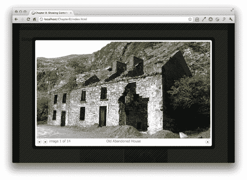
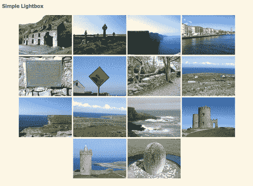
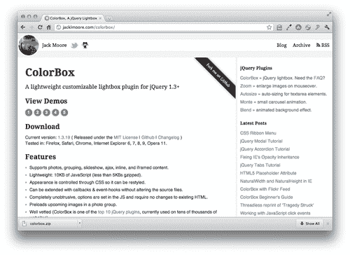
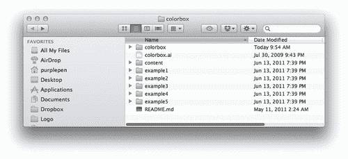
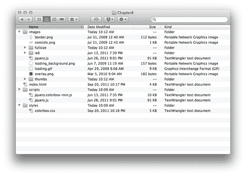
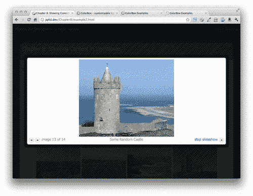
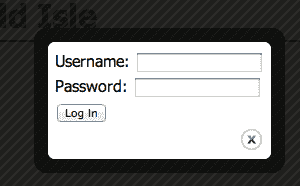
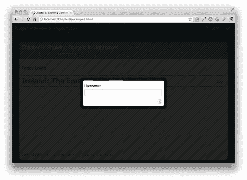
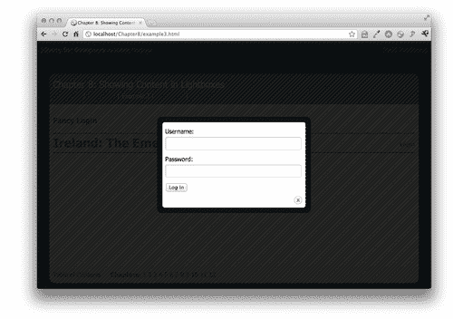
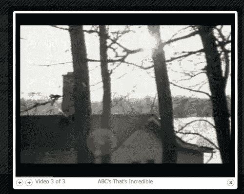

# 八、在灯箱中显示内容

> 在网络上，看到灯箱中显示的照片库已变得很常见。灯箱在其他方面也很有用——播放视频、显示附加信息、向网站访问者显示重要信息，甚至显示其他网站。在本章中，我们将介绍如何使用灵活、适应性强的 Colorbox 插件创建各种用途的灯箱。

在本章中，我们将了解如何使用 Colorbox 插件：

*   创建一个简单的照片库
*   自定义照片库设置
*   构建一个奇特的登录框
*   播放一组视频
*   创建一个一页的网站组合

# 简易照片库

一个简单的照片库可能是灯箱最常见的用途。我们将设置一个页面，显示每张照片的缩略图，并在单击缩略图时在灯箱中显示全尺寸图像。要开始，您需要一系列照片，每个照片都有较小尺寸的缩略图。

以下是显示在灯箱中的照片示例：



# 行动时间-建立一个简单的照片库

我们将通过 Colorbox 插件创建一个简单的照片库：

1.  We'll get started by setting up a basic HTML page and associated files and folders just like we did in [Chapter 1](01.html "Chapter 1. Designer, Meet jQuery"), *Designer, Meet jQuery*. The body of the HTML document will contain a list of thumbnails:

    ```js
    <ul class="thumb-list">
    <li><a href="images/abandoned-house.jpg" title="Old Abandoned House" rel="ireland"></a></li>
    <li><a href="images/cemetary.jpg" title="Celtic Cemetary with Celtic Crosses" rel="ireland"></a></li>
    <li><a href="images/cliffs-of-moher.jpg" title="Cliffs of Moher" rel="ireland"></a></li>
    <li><a href="images/dublin.jpg" title="River Liffey in Dublin" rel="ireland"></a></li>
    <li><a href="images/dun-aonghasa.jpg" title="Dun Aonghasa on Inis More" rel="ireland"></a></li>
    <li><a href="images/falling-in.jpg" title="Warning Sign" rel="ireland"></a></li>
    <li><a href="images/guagan-barra.jpg" title="Guagan Barra" rel="ireland"></a></li>
    <li><a href="images/inis-more.jpg" title="Stone Fences on Inis More" rel="ireland"></a></li>
    <li><a href="images/inis-more2.jpg" title="Cliffs on Inis More's West Coast" rel="ireland"></a></li>
    <li><a href="images/inis-more3.jpg" title="Inis More Fence" rel="ireland"></a></li>
    <li><a href="images/mizen-head.jpg" title="Crashing Waves Near Mizen Head" rel="ireland"></a></li>
    <li><a href="images/obriens-tower.jpg" title="O'Brien's Tower at the Cliffs of Moher" rel="ireland"></a></li>
    <li><a href="images/random-castle.jpg" title="Some Random Castle" rel="ireland"></a></li>
    <li><a href="images/turoe-stone.jpg" title="Turoe Stone" rel="ireland"></a></li>
    </ul>

    ```

    请注意，我们已经将每个缩略图包装在一个链接中，该链接指向图像的全尺寸版本。如果在浏览器中加载该页面，您将看到该页面适用于禁用 JavaScript 的用户。单击缩略图将在浏览器中打开全尺寸图像。“后退”按钮将带您返回多媒体资料。

    注意，我们还在每个链接上都包含了一个 `title`属性。这对我们的网站访问者很有帮助，因为当他们用鼠标悬停在缩略图上时，它将在工具提示中显示图像的简短描述，但稍后也将用于 Colorbox 插件。我们还为每个链接添加了一个 `rel`属性，并将其设置为爱尔兰。当我们准备添加 Colorbox 插件魔术时，这将使选择爱尔兰图片的链接组变得容易。

2.  Next, we'll add a bit of CSS to lay our images out in a grid. Open your `styles.css` file and add these styles:

    ```js
    ul.thumb-list { margin:20px 0;padding:0;text-align:center; }
    ul.thumb-list li { margin:0;padding:0;display:inline-block; }

    ```

    

    如果您愿意，可以随意使用 CSS 为您的图像缩略图创建不同的布局。

3.  Now, let's add the jQuery magic. We're going to be using Color Powered's Colorbox plugin. Head over to [http://jacklmoore.com/colorbox](http://jacklmoore.com/colorbox) to find the downloads, documentation, and demos. You'll find the download link in the **Download** section, near the top of the page. Just click the current version number to download a ZIP file.

    

4.  Unzip the folder and have a look inside. You'll find the plugin script file itself, of course, but a lot of other goodies as well.

    

    插件代码本身在 `colorbox`文件夹中，您可以找到开发版和缩小版。五个示例文件夹分别包含一个示例文件（`index.html`），其中显示了正在运行的插件。为什么有五个不同的文件夹？每个文件夹都包含相同的基本示例，但颜色框有五种不同的外观。通过点击网站上**查看演示**部分的数字，可以在 Colorbox 网站上查看这些相同的示例。

    该插件的开发人员为我们提供了五种不同的颜色盒外观和感觉的可能性。如果这还不够，他们还包括一个 `colorbox.ai`（**Adobe Illustrator**）文件，其中包含用于创建这五种不同外观的所有图像资产。您可以根据自己的喜好定制它们，然后从 Illustrator 导出新的完全定制外观，以创建自己的外观。更改颜色和特殊效果非常简单，但请记住，如果更改图像资源的大小和形状，则必须修改附带的 CSS 文件以适应新的大小。

5.  在网站上或使用 ZIP 下载中包含的示例文件，尝试每个不同的示例，注意后退和前进按钮、关闭按钮、标题、分页指示器（图 1/3）等的外观、大小、位置都是通过 CSS 控制的，而不是插件代码本身。这使得定制外观变得非常容易，所有这些都是通过 CSS 而不是 JavaScript 完成的。
6.  在 ZIP 下载中，在 `colorbox`文件夹中，您可以找到名为 `jquery.colorbox-min.js`的插件代码文件。将此文件复制到您自己的 `scripts`文件夹中。
7.  We'll get started by choosing one of the provided CSS skins. Pick your favorite, then copy and paste its CSS file to your own `styles` folder. Open up the `images` folder for that CSS skin and copy and paste the images from that folder to your own `images` folder. Once you've chosen a skin, your own setup should look like the following:

    

    `index.html`文件包含 HTML，其中包含链接到全尺寸版本的缩略图。 `images`文件夹包含我选择的彩色盒皮肤提供的图像，以及我自己的幻灯片图像，包括缩略图和全尺寸版本。我的 `scripts`文件夹包含 jQuery（`jquery.js`和 Colorbox 插件脚本（`jquery.colorbox-min.js`。我的 `styles`文件夹包含我选择的颜色盒皮肤的 CSS 文件。

8.  We do have to open up `colorbox.css` to make a minor set of edits. In the example files, the CSS file is not in a `styles` or `css` folder, but rather sits at the top level alongside the `index.html` file. We've chosen to follow our preferred convention and store our CSS in our `styles` folder. This means that we'll have to open up the `colorbox.css` file and update the references to images in the CSS. I'll have to replace references like this:

    ```js
    #cboxTopLeft{width:21px; height:21px; background:url(images/controls.png) no-repeat -100px 0;}

    ```

    参考文献如下：

    ```js
    #cboxTopLeft{width:21px; height:21px; background:url(img/controls.png) no-repeat -100px 0;}

    ```

    我只是告诉 CSS 上升一级，然后查找 `images`文件夹。您应该能够使用文本编辑器的查找和替换功能快速替换所有这些内容。

9.  接下来，打开您的 `index.html`文件，并将 `colorbox.css`文件附在头部部分，在您自己的 `styles.css:`

    ```js
    <head>
    <title>Chapter 8: Showing Content in Lightboxes</title>
    <link rel="stylesheet" href="styles/colorbox.css"/>
    <link rel="stylesheet" href="styles/styles.css"/>
    </head>

    ```

    之前
10.  然后，在结束`</body>`标记之前，向下到文件的底部，在 jQuery 之后和您自己的 `scripts.js`文件之前，连接 Colorbox 插件：

    ```js
    <script src="scripts/jquery.js"></script>
    <script src="scripts/jquery.colorbox-min.js"></script>
    <script src="scripts/scripts.js"></script>

    ```

11.  现在，还记得我们在每个链接上包含的 `rel="ireland`属性吗？我们将在 JavaScript 中使用该属性来选择 Colorbox 插件的所有爱尔兰图像链接。打开您的 `scripts.js`文件并编写属性选择器，以选择在 document ready 语句中 `rel`属性等于 `ireland`的所有链接：

    ```js
    $(document).ready(function(){
    $('a[rel="ireland"]')
    });

    ```

12.  The only thing left to do is call the `colorbox()` method on those links the Colorbox plugin will take care of everything else for us:

    ```js
    <script type="text/javascript">
    $('a[rel="ireland"]').colorbox();
    </script>

    ```

    现在，如果您在浏览器中打开页面并单击其中一个缩略图图像，您将看到在颜色框中打开的全尺寸图像。由于包含后退和前进按钮，您无需关闭灯箱即可浏览所有全尺寸图像。您还可以通过按键盘上的左右箭头键在图像之间移动。分页指示器可帮助您查看照片集合中的位置。您还将注意到，每个链接上包含的 `title`属性被重新用作每个图像的图像标题。可以通过单击“关闭”按钮、在颜色框外部单击或按键盘上的 Esc 键来关闭颜色框。总而言之，这是一次非常好的开箱即用的体验。

## 刚才发生了什么事？

我们使用 Colorbox jQuery 插件将图像链接列表转换为一个 lightbox，允许站点访问者在不离开页面的情况下浏览完整大小的图像。我们使用链接的 `title`属性为图像提供标题。我们使用插件提供的五种颜色盒样式中的一种来创建一个设计精美的灯箱。

# 定制彩盒的行为

如果你浏览一下 Colorbox 网站的**设置**部分，你会发现你有很多定制 Colorbox 行为的选项。让我们来看看如何使用这些选项。对于本节，我们将继续使用上一节中设置的文件。

## 过渡

首先，我们将尝试可用的不同过渡效果。默认转换为 `elastic`。如果您的全尺寸图像都是不同大小的，您将看到 Colorbox 使用了一个很好的调整大小动画在它们之间进行转换。转换的其他选项为 `fade`和 `none`。让我们来看看如何修改过渡。

# 行动时间-使用自定义转换

按照以下步骤更改图像之间的默认转换：

1.  For this example, we'll take a look at how to use the `fade` transition. Open your `scripts.js` file. All we have to do is pass the `fade` value for the transition key to the `colorbox()` method as follows:

    ```js
    $(document).ready(function(){
    $('a[rel="ireland"]').colorbox({transition:'fade'});
    });

    ```

    请注意，我们在括号内添加了一些大括号。在这些花括号中，我们可以通过键/值对来定制颜色框的不同方面。在这种情况下，键为 `transition`，值为“淡入淡出”。

    如果在浏览器中重新加载页面，请单击其中一个缩略图，然后单击“下一个”和“上一个”按钮来翻转图像，您将看到颜色框淡出，然后又回到每个图像之间。

2.  What if we decided we'd rather get rid of the transitions altogether? We'd simply have to change the value for the `transition` key to`'none':`

    ```js
    $(document).ready(function(){
    $('a[rel="ireland"]').colorbox({transition:'none'});
    });

    ```

    现在，如果在浏览器中刷新页面，您将看到图像会发生更改，而不会在它们之间产生任何过渡效果。

## 刚才发生了什么事？

我们看到了如何利用 Colorbox 插件的一个可用设置，并在网站访问者浏览图像时修改了图像之间的转换。

## 固定尺寸

如果要加载到配色箱中的照片大小差异很大，您可能会认为所有的大小调整都会分散网站访问者的注意力，并且希望为配色箱设置一个固定的大小。通过传递更多的键/值对，也很容易做到这一点。浏览文档，您会发现有很多设置用于控制色盒的宽度和高度。为了简单起见，我们将使用 `width`和 `height`。

# 行动时间-设置固定大小

按照以下步骤设置色盒的固定宽度和高度：

1.  Open up your `scripts.js` file. We're going to make a few changes to our code to set a fixed `width` and `height` for the Colorbox:

    ```js
    $('a[rel="ireland"]').colorbox({
    transition: 'none',
    width: '90%',
    height: '60%'
    });

    ```

    现在，如果在浏览器中刷新页面，您将看到颜色框的大小保持不变。无论图像或浏览器窗口的大小如何，颜色框将始终填充浏览器窗口宽度的 90%和高度的 60%。如果图像太大，内部图像会按比例调整大小以适合可用空间。

## 刚才发生了什么事？

我们将 `width`和 `height`设置设置为百分比值。如果您有可能比站点访问者的浏览器窗口大的大型照片，这是一个非常有用的选项。将 `width`和 `height`设置为百分比值可确保在这种情况下，无论浏览器窗口大小如何，颜色框都将是站点访问者浏览器窗口宽度的 90%和高度的 60%。这样，如果浏览器窗口很小，网站访问者将能够看到完整的照片。

Colorbox 还提供了一些其他宽度和高度设置：

### 内宽/内高

这些键为 Colorbox 内的内容而不是 Colorbox 本身提供 `width`和 `height`值。如果您知道实际内容的确切宽度和高度，例如视频播放器，这将非常有用。

### 初始宽度/初始高度

Colorbox 非常灵活，可以用于各种不同的内容（我们将很快看到）。设置 `intialWidth`和 `initialHeight`允许您在加载任何内容之前控制色盒的大小。如果您通过 Ajax 加载内容，则可能需要一些时间才能加载到 Colorbox 中。设置 `initialWidth`和 `initialHeight`允许您在等待加载内容时指定色盒的大小。

### 最大宽度/最大高度

这些键允许您设置颜色框的最大宽度和最大高度。如果内容较小，则框在屏幕上会显示得较小。但当您加载较大的内容时，它们不会超过您指定的 `maxWidth`和 `maxHeight`值。例如，如果您想为各种尺寸的图像设置颜色框，您可以允许颜色框通过图像之间的淡入淡出或弹性过渡来调整大小，但要设置 `maxWidth`和 `maxHeight`以确保较大的图像不会超出网站访问者的浏览器窗口。

## 制作幻灯片

Colorbox 还为我们提供了一个选项，可以自动循环浏览所有图像，这样网站访问者就不必不断单击“下一步”按钮来查看所有图像。

# 行动时间-制作幻灯片

以下是我们如何将 lightbox 图像库转换为幻灯片：

1.  Open `scripts.js`. We're going to add another key/value pair to our settings. To create a slideshow inside our Colorbox, set the `slideshow` key to `true:`

    ```js
    $('a[rel="ireland"]').colorbox({
    transition: 'none',
    width: '90%',
    height: '60%',
    slideshow: true
    });

    ```

    现在，如果您在浏览器中刷新页面，您将看到在打开颜色框后，它会使用您选择的过渡效果自动循环浏览图像。提供了一个链接，以便网站访问者可以随时停止幻灯片放映：

    

2.  Colorbox provides a few more keys we can use to control the slideshow. We can provide a value for `slideshowSpeed` to set the number of milliseconds each photo will be displayed. If we don't want the slideshow to automatically play, we can set `slideshowAuto` to `false`. We can change the text that appears in the link to start and stop the slideshow by passing in values for the `slideshowStart` and `slideshowStop` keys, respectively. That would all look like this:

    ```js
    $('a[rel="ireland"]').colorbox({
    transition: 'none',
    width: '90%',
    height: '60%',
    slideshow: true,
    slideshowSpeed: 2000,
    slideshowAuto: false,
    slideshowStart: 'Let\'s get started!',
    slideshowStop: 'Ok, that\'s enough.'

    ```

    有了这段代码，我们将幻灯片放映设置为显示每张照片 2 秒（2000 毫秒），不自动启动幻灯片放映，并自定义启动和停止幻灯片放映的链接上的文本。

    请注意，每个键/值对都用逗号分隔，但最后一个键/值对后面没有逗号。最后一个后没有逗号只对 Internet Explorer 很重要-如果您在 Internet Explorer 中的最后一个键/值对后意外地放置了逗号，它将抛出一个错误，您的 Java 脚本将无法工作。其他浏览器将忽略该错误并继续正常工作。在向公众开放之前，请始终在 Internet Explorer 中测试您的工作。

    让我们讨论一下文本中出现的\'，我想用它作为开始和停止幻灯片放映的链接。由于这些是字符串，我必须用引号将它们括起来，单引号或双引号都可以，您选择哪个是个人偏好的问题。如果我想在字符串中使用引号，我必须对它们进行转义，我必须对它们进行转义——这是 JavaScript 的一种说法，表示我必须告诉 JavaScript 这些是字符串的一部分，而不是 JavaScript 应该注意的字符。

    如果我这样写字符串：

    ```js
    slideshowStart: 'Let's get started!'

    ```

    这将导致错误。就 JavaScript 而言，“in Let’s”是字符串的结束单引号，JavaScript 不知道如何处理该行的其余部分。

    在这种情况下，如果我个人喜欢用双引号来写字符串，我就不需要做任何事情了。这是完全可以接受的：

    ```js
    slideshowStart: "Let's get started!"

    ```

    因为我们在字符串周围使用双引号，所以 JavaScript 不可能意外地将其读取为字符串的结尾。一旦 JavaScript 看到开头的“字符”，它会自动查找匹配的结尾”字符。

    现在我们已经定制了幻灯片，请在浏览器中刷新页面，然后单击其中一个图像缩略图以打开颜色框。唯一明显的区别是增加了**让我们开始**链接。单击它将启动幻灯片放映，并切换链接，说“确定”，这就足够了，这样我们就可以停止幻灯片放映。

## 刚才发生了什么事？

我们了解了如何创建和自定义幻灯片。我们通过拍摄简单的 lightbox 照片库并通过将一系列键/值对传递给 `colorbox()`方法对其进行定制来实现这一点。

# 花式登录

能够使用 lightbox 来显示图像和幻灯片已经足够好了，但 Colorbox 的功能和灵活性更大。在本节中，我们将了解如何在颜色框中显示登录表单。请注意，我们的登录表单没有连接到任何东西，并且在示例案例中实际上不起作用。但同样的技术也可以应用于动态站点，允许站点访问者在 lightbox 中查看登录表单。

# 行动时间-创建一个奇特的登录表单

按照以下步骤在 lightbox 中创建登录表单：

1.  我们将开始设置一个 HTML 页面以及相关的文件和文件夹，就像我们在[第 1 章](01.html "Chapter 1. Designer, Meet jQuery")中所做的一样，*设计师，与 jQuery*会面。我们的 HTML 页面将包含一个显示登录表单的标题。网站通常允许人们从网站上的任何页面登录：

    ```js
    <div id="example-header">
    <h1>Ireland: The Emerald Isle</h1>
    <form action="#" id="login-form">
    <div><label for="username">Username:</label> <input type="text" id="username"/></div>
    <div><label for="password">Password:</label> <input type="text" id="password"/></div>
    <div><input type="submit" value="Log In"/></div>
    </form>
    </div>

    ```

2.  Next, we'll open `styles.css` and add some CSS, so that the header displays with the title on the left and the form on the right:

    ```js
    #example-header { border-bottom:2px solid #586E75; border-top:2px solid #586E75;overflow:hidden;zoom:1; }
    #example-header h1 { float:left;padding:0;margin:0; }
    #example-header #login-form { float:right;padding-top:15px; }
    #example-header #login-form div { display:inline; }
    #login-link { display:block;float:right;padding-top:15px; }
    #login-link:focus { outline:none; }

    ```

    如果在浏览器中查看页面，您将看到以下内容：

    

    这对于未启用 JavaScript 的用户来说是完全可以接受的——他们可以从任何页面登录到该站点。但我确实觉得有点乱。因此，如果站点访问者启用了 JavaScript，我们将隐藏登录表单，并在站点访问者准备登录时在颜色框中显示它。

3.  接下来，我们将准备使用 Colorbox 插件，方法与上一节相同：为 Colorbox 选择一种提供的样式，并将其样式表附加到文档的标题部分，将所有需要的图像移动到您的 `image`目录，并更新 CSS 中图像的路径，并将 Colorbox 插件附在文档底部，jQuery 和我们的 `scripts.js`标签之间。
4.  一旦所有这些都解决了，我们就可以编写 JavaScript 了。打开 `scripts.js`并写下您的文档准备声明：

    ```js
    $(document).ready(function(){
    //Our code goes here
    });

    ```

5.  The first thing we'd like to do is hide the login form. We're going to do that using JavaScript rather than CSS because we do want the login form to be visible for the site visitors who don't have JavaScript enabled. We want to hide the form immediately as soon as the page is loaded, so we'll write our hiding code inside the `ready()` method for the document:

    ```js
    $(document).ready(function(){
    var form = $('#login-form');
    form.hide()
    });

    ```

    您会注意到，我们创建了一个名为 `form`的变量，并使用它存储表单的 jQuery 选择器。我们将不得不在代码中多次引用登录表单。每次我们想要选择登录表单时，我们都可以编写 `$('#login-form')`，但是每次，jQuery 都必须查看页面的 DOM 才能重新找到它。如果我们将它存储在一个变量中，我们的代码将运行得更快，效率更高，因为 jQuery 不必在每次引用它时都找到登录表单。

    如果在浏览器中刷新页面，您将看到登录表单已消失。

6.  But now we need a way for site visitors to be able to show it again to be able to log in. We'll use jQuery to add a login link to the page, which will appear right where the form was:

    ```js
    $(document).ready(function(){
    var form = $('#login-form');
    form.hide()
    form.before('<a href="#login-form" id="login-link">Login</a>');
    });

    ```

    我们已经再次引用了表单-在表单之前插入登录链接。我们已经在 CSS 中包含了一些样式来设置链接的样式并将其显示在我们想要的地方。如果在浏览器中刷新页面，您将看到登录表单已被一个登录链接取代：

    

7.  But clicking the login link doesn't do anything. Let's fix that by adding in some Colorbox magic. We'll select our login link and call the `colorbox()` method as follows:

    ```js
    $(document).ready(function(){
    var form = $('#login-form');
    form.hide()
    $('#login-form').before('<a href="#login-form" id="login-link">Login</a>');
    $('#login-link').colorbox();
    });

    ```

    在浏览器中刷新页面并尝试单击链接。嗯…不是我们想的那样，对吧？我们必须告诉 Colorbox 我们想加载一些已经在页面上的内容。

8.  We already put the reference to the login form in the `href` attribute of the link, so we'll use that to our advantage. We'll pass a couple of key/value pairs to the `colorbox()` method to tell Colorbox that we want to load some content that's already on the page and exactly which content we want to show:

    ```js
    $(document).ready(function(){
    var form = $('#login-form');
    form.hide()
    $('#login-form').before('<a href="#login-form" id="login-link">Login</a>');
    $('#login-link').colorbox({
    inline: true,
    content: $(this).attr('href')
    });
    });

    ```

    在浏览器中刷新页面，您将看到颜色框打开，但看起来是空的。那是因为我们隐藏了我们的形式。它已加载到颜色框中，但无法查看。

9.  We'll use another key/value pair to tell Colorbox to show the form when the Colorbox opens:

    ```js
    $(document).ready(function(){
    var form = $('#login-form');
    form.hide()
    $('#login-form').before('<a href="#login-form" id="login-link">Login</a>');
    $('#login-link').colorbox({
    inline: true,
    content: $(this).attr('href'),
    onOpen: function(){form.show();}
    });
    });

    ```

    `onOpen`是 Colorbox 插件提供的按键之一。它允许我们编写一个函数，该函数将在 Colorbox 打开时运行。在这种情况下，我将找到我的表单并显示它。现在，如果在浏览器中刷新页面，您将能够在颜色框中看到表单，如下所示：

    

10.  This looks fine enough, and we'll touch this up with a bit of CSS in a moment to make it look even better. But what happens when you close the Colorbox? That pesky login form is visible again in the header. So we'll pass another key/value pair to our `colorbox()` method to hide the form when the Colorbox closes:

    ```js
    $(document).ready(function(){
    var form = $('#login-form');
    form.hide()
    $('#login-form').before('<a href="#login-form" id="login-link">Login</a>');
    $('#login-link').colorbox({
    inline: true,
    content: $(this).attr('href'),
    onOpen: function(){form.show();},
    onCleanup: function(){form.hide();},
    });
    });

    ```

    这将确保我们的表单在颜色框关闭时被隐藏，这样它就不会再次出现在标题中。

11.  现在，让我们的登录表单看起来更友好一些。打开 `styles.css`并在 lightbox 中添加一些样式化登录表单的 CSS:

    ```js
    #cboxContent form div { padding:5px 0; }
    #cboxContent label { display:block; }
    #cboxContent input[type='text'] { font-size:1.2em;padding:5px;width:342px;border:1px solid #ccc;box-shadow:inset 2px 2px 2px #ddd;border-radius:5px; }
    #cboxContent input[type='submit'] { font-size:1.2em;padding:10px; }

    ```

12.  And we also want to make the login form box a bit wider, so we're going to pass a `width` key to the `colorbox()` method as follows:

    ```js
    $(document).ready(function(){
    var form = $('#login-form');
    form.hide()
    form.before('<a href="#login-form" id="login-link">Login</a>');
    $('#login-link').colorbox({
    width: '400px',
    inline: true,
    content: $(this).attr('href'),
    onOpen: function(){form.show();},
    onCleanup: function(){form.hide();},
    });
    });

    ```

    现在，如果你在浏览器中刷新页面，你会看到我们的颜色框确实有 400 像素宽，我们的登录表单已经呈现出我们想要的 CSS 的漂亮粗块外观，但是仍然有一点问题。我们的表格对于配色箱来说太高了：

    

    Colorbox 脚本还没有意识到，一旦表单显示在 Colorbox 中，它就会有一组不同的 CSS——它仍然希望表单的高度与它在标题中显示时的高度相同。但这种形式要小得多。如果您将鼠标放在登录表单上并向下滚动，您将看到登录表单的其余部分在那里-我们就是看不到它。

13.  We don't want any scrolling in our Colorbox, so we'll turn that off and we'll tell the Colorbox to resize itself to its content instead by passing a couple more key/value pairs to the `colorbox()` method as follows:

    ```js
    $(document).ready(function(){
    var form = $('#login-form');
    form.hide()
    form.before('<a href="#login-form" id="login-link">Login</a>');
    $('#login-link').colorbox({
    width: '400px',
    inline: true,
    scrolling: false,
    content: $(this).attr('href'),
    onOpen: function(){form.show();},
    onComplete: function(){$.colorbox.resize();},
    onCleanup: function(){form.hide();},
    });
    });

    ```

    滚动键允许我们关闭 Colorbox 内的任何滚动， `onComplete`键是一个回调函数，内容加载到 Colorbox 后会立即调用该函数。一旦内容加载到 Colorbox 中，我们将调用 Colorbox 插件提供给我们的一个方法来调整 Colorbox 的大小以适应其内容。

    现在，如果您在浏览器中刷新页面，您将看到颜色框幻灯片打开到更大的高度，以适应我们表单的新 CSS。完美的

    

## 刚才发生了什么事？

我们学习了如何获取一个简单的标题登录表单，并将其更改为一个登录链接，当单击时，该链接将在一个颜色框中打开一个登录表单。我们通过将回调函数作为 Colorbox 插件文档中指定的键的值来传递，解决了这种方法所导致的任何潜在问题。我们学习了如何在 Colorbox 打开、内容加载到 Colorbox 以及 Colorbox 关闭时调用函数来运行。我们了解到，我们可以通过调用 `$.colorbox.resize()`方法来强制颜色框调整大小以适应其当前内容。

# 视频播放器

Colorbox 足够灵活，可用于将视频播放器显示为内容。我们将链接到 YouTube 视频，然后添加一些色盒魔术，以在色盒中显示视频。请注意，此示例使用了 Ajax，因此仅当您将文件上载到服务器或在自己的计算机上创建服务器时才起作用。

# 行动时间-在灯箱中播放视频

按照以下步骤设置 Colorbox 以播放一组视频：

1.  We'll get started as we usually do, by setting up a basic HTML file and associated files and folders, just like we did in [Chapter 1](01.html "Chapter 1. Designer, Meet jQuery"), *Designer, Meet jQuery*. In the body of our HTML document, we're going to include a link to a YouTube video:

    ```js
    <p><a href="http://www.youtube.com/embed/2_HXUhShhmY?autoplay=1" id="video-link">Watch the video</a></p>

    ```

    请注意关于我的视频链接的几点。首先，我使用的是视频的嵌入 URL，而不是 YouTube 视频页面的链接。对于未启用 JavaScript 的用户，这将使他们进入 YouTube 网站上的独立视频播放器页面。对于启用 JavaScript 的用户，它将确保只有视频播放器加载到 Colorbox 中，而不是整个 YouTube 视频页面。其次，我正在为视频的 URL 添加一个参数，将 `autoplay`设置为 1。这就是当网站访问者查看您的页面时，您如何使嵌入的 YouTube 视频自动播放的方法。视频自动播放通常不是一个好主意，但在这种情况下，用户已经点击了一个链接，上面写着**观看视频**，因此，似乎可以肯定的是，一旦点击了该链接，他们会期待视频播放。

2.  接下来，就像到目前为止的其他 Colorbox 示例一样，您需要将您选择的 Colorbox 皮肤 CSS 文件附加到文档的头部，确保图像可用，必要时更新 CSS 中图像的路径，最后将 Colorbox 插件附加到文档的底部。
3.  现在，我们将打开 `scripts.js`文件，开始编写自定义 JavaScript。我们将从 document ready 语句开始：

    ```js
    $(document).ready(function(){
    });

    ```

4.  Next, we'll select the video link and call the `colorbox()` method:

    ```js
    $(document).ready(function(){
    $('#video-link').colorbox();
    });

    ```

    但是，如果我们在浏览器中刷新页面并尝试查看视频，我们会得到一个错误。这是因为我们试图通过 Ajax 加载视频，并且由于浏览器的安全限制，我们无法向其他服务器发出异步请求。在这种情况下，我们试图打电话给[http://youtube.com](http://youtube.com) ，但这不是我们的 Colorbox 页面所在的位置，因此浏览器会阻止我们的请求。

5.  Luckily, we can create an `iframe` and load our external content into the `iframe`. And also luckily, Colorbox provides a way for us to do so easily. We'll just pass a key/value pair to the `colorbox()` method setting `iframe` to `true` like the following:

    ```js
    $('#video-link').colorbox({
    iframe: true
    });

    ```

    现在我们的视频加载到了 Colorbox 中，但是 Colorbox 不知道我们的视频有多大，所以我们看不到它。

6.  我们必须告诉 Colorbox 我们希望我们的视频播放器有多大。我们将通过为 `innerWidth`和 `innerHeight`传递键/值对来实现这一点。在本例中，我们使用 `innerWidth`和 `innerHeight`而不是宽度和高度，因为我们传递的是我们希望视频播放器（或内容）有多大，而不是我们希望色盒有多大：

    ```js
    $('#video-link').colorbox({
    iframe: true,
    innerWidth: '640px',
    innerHeight: '480px'
    });

    ```

7.  我们还可以使用 Colorbox 为用户创建一种方便查看多个视频的方式。让我们回到 `index.html`并将喜爱的视频列表添加到我们的页面，而不仅仅是视频的一个链接。我们将为每一个设置一个 `rel`属性为 `favorites`，并提供一个 `title`属性，这样我们的视频将在下面显示一个标题：

    ```js
    <h3>Favorite Videos</h3>
    <ul>
    <li><a href="http://www.youtube.com/embed/itn8TwFCO4M?autoplay=1" rel="favorites" title="Louis CK and Everything is Amazing">Everything is Amazing</a></li>
    <li><a href="http://www.youtube.com/embed/UN0A6h9Wc5c?autoplay=1" rel="favorites" title="All This Beauty by The Weepies">All This Beauty</a></li>
    <li><a href="http://www.youtube.com/embed/ZWtZA-ZmOAM?autoplay=1" rel="favorites" title="ABC's That's Incredible">That's Incredible</a></li>
    </ul>

    ```

8.  The only update we have to make to our JavaScript in `scripts.js` is to update the selector. Instead of selecting one single link by ID, we're going to select our set of favorites links by their `rel` attribute:

    ```js
    $('a[rel="favorites"]').colorbox({
    iframe:true,
    innerWidth:'640px',
    innerHeight: '480px'
    })

    ```

    如果您在浏览器中查看页面，您将看到视频下有一个标题以及“下一步”和“上一步”按钮，这些按钮允许您在视频之间导航，而无需关闭颜色框。

9.  The only thing that's a bit awkward is that our pagination indicator says Image 1 of 3 when we're showing videos, not images. Luckily, Colorbox provides a way for us to customize this text with the `current` key:

    ```js
    $('a[rel="favorites"]').colorbox({
    iframe:true,
    innerWidth:'640px',
    innerHeight: '480px',
    current: 'Video {current} of {total}'
    })

    ```

    现在，我们的分页指示器正确地读取了视频 1/3。我们的网站访问者可以轻松地从一个视频切换到另一个视频，而无需关闭颜色框，每个视频都会显示一个标题：

    

## 刚才发生了什么事？

我们学习了如何在色盒中创建独立视频播放器和多视频播放器。我们学习了如何通过键/值对传递来告诉 Colorbox 在 `iframe`中加载外部内容，从而绕过跨域 Ajax 限制。我们还学习了如何修改分页指示符文本以适应当前的内容类型。我们使用 `innerWidth`和 `innerHeight`键设置视频播放器的大小。

# 单页网页库

下一步，我们将看看如何创建一个单页 web 图库来展示您喜爱的网站或您自己设计的所有令人难以置信的网站。请注意，本例使用了 Ajax，因此您必须将页面上载到 web 服务器，或者在自己的计算机上创建一个 web 服务器来查看它的运行情况。

# 行动时间到了-创建一个单页的 web 库

按照以下步骤创建一个单页 web 库：

1.  We'll get started by setting up a basic HTML file and associated files and folders, just like we did in [Chapter 1](01.html "Chapter 1. Designer, Meet jQuery"), *Designer, Meet jQuery*. Inside the body of our HTML document, we'll create a list of links to the sites we want to include in our design gallery:

    ```js
    <h3>One-Page Web Design Gallery</h3>
    <ul>
    <li><a href="http://packtpub.com" rel="gallery">Packt Publishing</a></li>
    <li><a href="http://nataliemac.com" rel="gallery">NatalieMac</a></li>
    <li><a href="http://google.com" rel="gallery">Google</a></li>
    </ul>

    ```

    请注意，我为每个链接添加了一个等于 `gallery`的 `rel`属性。

2.  现在，与其他 Colorbox 示例一样，选择一种样式并将样式表附加到文档的标题中，使所有必需的图像可用于页面，如果需要，更新 CSS 中图像的路径，并将 Colorbox 插件附加到页面底部。
3.  接下来，我们将打开我们的 `scripts.js`文件并添加我们的文档就绪语句：

    ```js
    $(document).ready(function(){
    });

    ```

4.  接下来，我们将选择 `rel`属性等于 `gallery`的所有链接，并调用 `colorbox()`方法：

    ```js
    $(document).ready(function(){
    $('a[rel="gallery"]').colorbox();
    });

    ```

5.  Just as we did with the video example, we'll set the `iframe` key to `true` since we're loading in content from other domains. I'm also going to set the `width` and `height` of the ColorBox to `90%`, so that it takes up nearly the entire browser window. I'm also going to adjust the pagination indicator text to read `Web Site` instead of `Image:`

    ```js
    $('a[rel="gallery"]').colorbox({
    iframe: true,
    width: '90%',
    height: '90%',
    current: 'Web Site {current} of {total}'
    });

    ```

    现在，如果在浏览器中刷新页面，您可以看到单击其中一个链接会打开一个颜色框，并将该网站加载到颜色框中。网站访问者可以与加载的网站进行交互，就像他们将其加载到单独的浏览器窗口、浏览页面等一样。完成一个网站后，他们可以单击下一个箭头访问列表中的下一个网站，然后按键盘上的 Esc 键，或单击关闭按钮或色盒外的任何位置，在完成后关闭色盒。

### 注

请注意，网站所有者可能会阻止您将其网站加载到 `iframe`中。如果您使用 MAMP 或 WAMP 设置了本地服务器，那么您可能会注意到 Google 示例不会加载到您的页面中。但是，如果您将代码上载到外部服务器，它将被加载。请确保测试您希望在 web 库中使用的所有网站，以确保它们按预期工作。

## 刚才发生了什么事？

我们使用了我们所学的大部分内容来创建一个 Colorbox 视频播放器，以便在一个 Colorbox 中显示外部网站。这样，我们的网站访问者就可以浏览一系列网站，而无需离开我们的页面。我们再次告诉 Colorbox 将我们的内容加载到 `iframe`中，以解决跨域 Ajax 限制。我们定制了分页指示符文本，并为我们的颜色框设置了宽度和高度。

# 总结

我们已经研究了适应性强且灵活的 Colorbox 插件的几种用途，该插件可用于在灯箱中显示任何类型的内容。它可以用来创建可浏览的图像库，允许访问表单和视频播放器，而不会让页面上的 UI 元素变得凌乱，甚至可以创建可浏览的网站库。ColorBox 插件完全采用 CSS 样式，使 lightbox 具有任何您可以想象的外观。该插件甚至包括矢量图像资源，可作为创建自己的灯箱设计的起点。通过将一系列键/值对传递给 `colorbox()`方法，可以修改 lightbox 的行为，使 Colorbox 插件适合任何可能的 lightbox 使用。

接下来，我们将看一看另一个常见的网站任务：创建幻灯片。