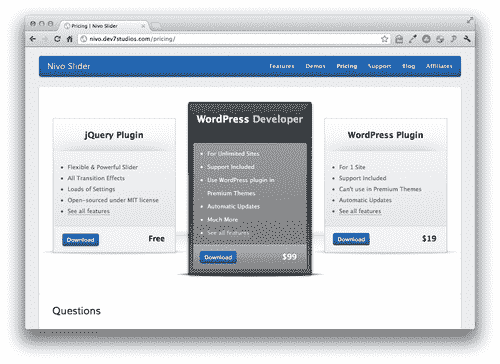
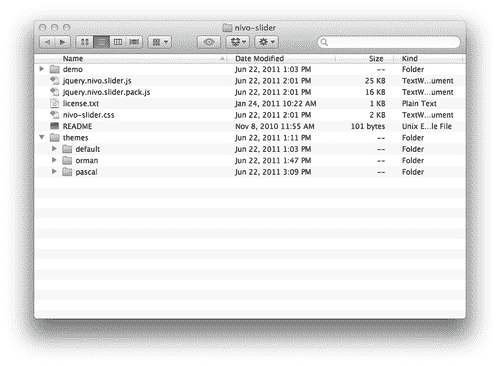
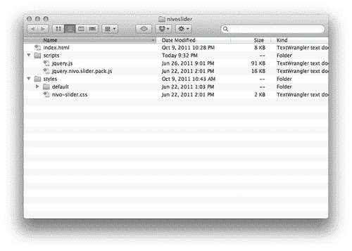
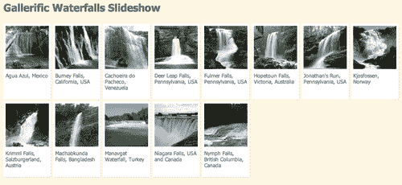
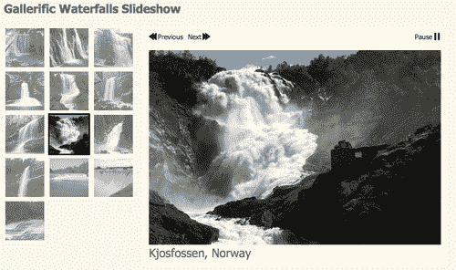
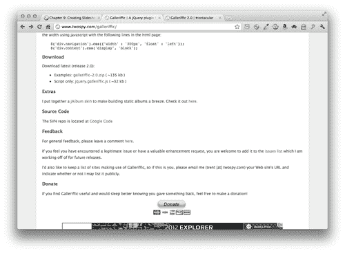
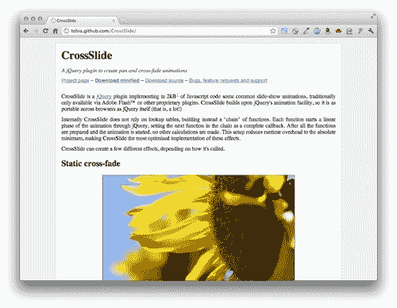

# 九、制作幻灯片

> 传统上用 Flash 制作，幻灯片是展示照片、产品、插图、公文包等的绝佳方式。毫无疑问，创建幻灯片是 jQuery 开发人员最常见的任务之一。在本章中，我们将了解如何从头开始创建一个简单的幻灯片，然后我们将探索三个功能强大的插件，它们可以创建华丽、动态和功能齐全的幻灯片。

在本章中，我们将介绍以下内容：

*   如何计划幻灯片放映
*   如何从头开始编写一个简单的幻灯片
*   如何使用 CrossSlide 插件创建平移和缩放幻灯片
*   如何使用 Nivo Slider 插件创建具有有趣过渡效果的幻灯片
*   如何使用 Gallerific 插件创建缩略图幻灯片

# 计划幻灯片放映

当你准备构建一个 jQuery 幻灯片时，有一些事情需要考虑。具体如下：

*   首先，您必须决定禁用 JavaScript 的用户的体验。幻灯片中各种内容的优先级应该是您的指南。如果幻灯片只是展示网站其他地方的一些内容，那么只需显示一张照片或幻灯片就足够了。如果幻灯片是访问内容的唯一方式，那么您必须确保未启用 JavaScript 的用户可以使用该内容。我们将在本章的各种示例中研究这两种策略。
*   其次，您必须确定幻灯片中的所有项目是相同大小还是不同大小。出于显而易见的原因，最容易处理大小和纵横比都相同的项目，但有时，不可能或不可能对所有项目进行相同大小的处理。我将介绍哪些幻灯片适合于相同大小的内容，哪些幻灯片适合于可变大小的内容。
*   接下来，你需要考虑你的网站访问者是否需要对幻灯片进行任何控制。有时候，让图像自动旋转是很方便的。其他时候，允许网站访问者暂停幻灯片放映或手动前后移动幻灯片也很有帮助。我将告诉您，每种幻灯片放映方法为您的网站访问者提供了多少控制。

# 简单交叉淡入淡出幻灯片

在本节中，您将学习如何构建一个简单的 crossfade 幻灯片。这种类型的幻灯片非常适合大小相同的图像，并且在禁用 JavaScript 时可以显示为单个图像。最后，这种类型的幻灯片无法控制网站访问者的幻灯片播放。他们不能暂停幻灯片放映或手动移动幻灯片。

# 行动时间-创建一个简单的 crossfade 幻灯片

按照以下步骤创建简单的交叉淡入淡出幻灯片：

1.  我们将开始创建一个基本的 HTML 文档以及相关的文件和文件夹，就像我们在[第 1 章](01.html "Chapter 1. Designer, Meet jQuery")中所做的一样，*设计器，满足 jQuery*。在 HTML 文档的正文中，包含一个图像列表。每个列表项将包含一个图像，可以选择将其包装在链接中。以下是我的图片列表示例：

    ```js
    <ul id="crossfade">
    <li>
    <a href="http://en.wikipedia.org/wiki/Agua_Azul"></a>
    </li>
    <li>
    <a href="http://en.wikipedia.org/wiki/Burney_Falls"></a>
    </li>
    <li>
    <a href="http://en.wikipedia.org/wiki/Venezuala"></a>
    </li>
    </ul>

    ```

2.  Next, we'll write a few lines of CSS to style the slideshow. A slideshow shows just one image at a time and the easiest way to show only one image is to stack the images up on top of one another. If the site visitor has JavaScript disabled, they'll just see the last slide in the list:

    ```js
    #crossfade { position:relative;margin:0;padding:0;list-style-type:none;width:600px;height:400px;overflow:hidden; }
    #crossfade li { position:absolute;width:600px;height:400px; }

    ```

    如果您在浏览器中查看页面，您将看到幻灯片中的最后一项是可见的，但其他项目都不可见，它们都堆叠在最后一项的下方。这就是我们对禁用 JavaScript 的站点访问者的体验。

3.  Next, open up `scripts.js` and we'll get started writing our JavaScript code. This script will be a little bit different than scripts that we've set up before. Instead of something happening just once when the document loads or when a site visitor clicks a link, we actually want to set up a function that will happen on a timed interval. For example, if we want each slide of our slideshow to be visible for three seconds, we'll have to set up a function to switch slides, that gets called every three seconds.

    我们已经在页面上把幻灯片叠在一起，最后一项放在上面。想想你是如何处理一堆照片的。您可以在顶部查看照片，然后将其移动到堆栈底部以查看第二张照片。然后将第二张照片移到底部以查看第三张照片，依此类推。我们将把同样的原理应用到幻灯片中。

    在 `scripts.js`内部，创建一个名为 `slideshow`的函数。这是当我们想要切换照片时，每三秒调用一次的函数。

    ```js
    function slideshow() {
    }

    ```

4.  我们需要在函数内部做的第一件事是选择堆栈中的第一张照片。

    ```js
    function slideshow() {
    $('#crossfade li:first')
    }

    ```

5.  现在我们已经得到了堆栈中的第一张照片，我们只需要将其移动到堆栈的底部，以使下一张照片可见。我们可以使用 jQuery 的 `appendTo()`方法来实现这一点。这将删除列表开头的第一张照片，并将其附加到列表末尾。

    ```js
    function slideshow() {
    $('#crossfade li:first').appendTo('#crossfade');
    }

    ```

6.  我们的照片翻转功能已经就绪。现在我们所要做的就是在页面加载后进行一些初始设置。然后，我们将设置每三秒调用一次照片翻转功能。我们将调用文档上的 `ready()`方法。

    ```js
    $(document).ready(function(){
    // Document setup code will go here
    });
    function slideshow() {
    $('#crossfade li:first').appendTo('#crossfade');
    }

    ```

7.  文档一准备好，我们就要准备幻灯片。我们将从选择幻灯片中的所有照片开始。

    ```js
    $(document).ready(function(){
    $('#crossfade li')
    });

    ```

8.  接下来，我们要隐藏幻灯片中的所有照片。

    ```js
    $(document).ready(function(){
    $('#crossfade li').hide();
    });

    ```

9.  然后，我们将筛选该照片列表以仅获取第一张照片。

    ```js
    $(document).ready(function(){
    $('#crossfade li').hide().filter(':first');
    });

    ```

10.  最后，我们将使第一张照片可见。所有其他照片将保持隐藏状态。

    ```js
    $(document).ready(function(){
    $('#crossfade li').hide().filter(':first').show();
    });

    ```

11.  此时，如果您在浏览器中刷新页面，您将看到在未启用 JavaScript 的情况下可见的最后一张幻灯片现在是隐藏的，列表中的第一张幻灯片现在是可见的。现在，剩下要做的就是每三秒调用一次照片翻转功能。为此，我们将使用名为 `setInterval()`的 JavaScript 方法。这允许我们以固定的间隔调用函数。我们将两个值传递给 `setInterval:`要调用的函数的名称和调用函数之间应经过的毫秒数。例如，要每三秒（或 3000 毫秒）调用我的幻灯片放映功能，我会写：

    ```js
    $(document).ready(function(){
    $('#crossfade li').hide().filter(':first').show();
    setInterval(slideshow, 3000);
    });

    ```

12.  现在，我们每三秒调用一次照片翻转功能，因此如果您在浏览器中刷新页面，您可能会看到照片每三秒更改一次，但事实并非如此。通过查看代码，很容易看出哪里出了问题-即使照片堆栈的实际顺序每三秒更改一次，但除第一张照片外，所有照片都是不可见的。无论第一张照片是否在顶部，它都是唯一可见的照片，因此我们的幻灯片显示似乎没有改变。我们必须返回到 `slideshow`函数并修改它，使当前照片不可见，并使堆栈中的下一张照片可见。由于我们希望照片切换时具有良好的、缓慢的交叉淡入效果，因此我们将调用 `fadeOut()`方法将第一张照片淡入透明状态，并将 `slow`传递给该方法，以确保它花费时间：

    ```js
    function slideshow() {
    $('#crossfade li:first').fadeOut('slow').appendTo('#crossfade');
    }

    ```

13.  现在，我们需要移动到列表中当前不可见的下一张照片，并使其不透明。我们将使用 `next()`方法获取列表中的下一项，然后调用 `fadeIn()`方法使其出现。再一次，因为我们想要一个缓慢的效果，我们将把 `slow`传递给 `fadeIn()`方法：

    ```js
    function slideshow() {
    $('#crossfade li:first').fadeOut('slow').next().fadeIn('slow').appendTo('#crossfade');
    }

    ```

14.  最后，我们在 jQuery 方法的链接方面遇到了一点麻烦。我们从堆栈中的第一张照片开始，将其淡出，然后移动到堆栈中的第二张照片，并将其淡入。然而，当我们调用 `appendTo()`方法时，我们将堆栈中的第二张照片追加到末尾—我们将堆栈中的第二张照片移动到底部，而不是第一张照片。幸运的是，jQuery 为我们提供了一种返回到原始选择的方法， `end()`方法。我们可以在第二张照片淡入淡出后调用 `end()`方法，以确保它是附加到照片堆栈底部的第一张照片：

    ```js
    function slideshow() {
    $('#crossfade li:first').fadeOut('slow').next().fadeIn('slow').end().appendTo('#crossfade');
    }

    ```

## 刚才发生了什么事？

如果在浏览器中刷新页面，您将看到一个很好的交叉淡入淡出幻灯片。当一张照片淡出时，下一张照片淡入，在每张照片之间平滑过渡。因为我们不断地将堆栈中的顶部照片移动到底部，所以我们永远不会到达幻灯片放映的结尾，就像您可以不断地翻转堆栈中的照片一样。

我们设置了一个幻灯片功能，选择堆栈中的第一张照片，将其淡出，并将其移动到堆栈底部。同时，我们在堆栈中找到第二张照片并将其淡入。我们使用 jQuery 链接的强大功能在一行代码中完成了所有这些。

我们设置了三秒钟的间隔，并在每三秒钟间隔结束时调用照片翻转功能。

最后，我们在文档加载后做了一些设置工作——隐藏所有照片，然后使第一张照片可见。这将确保照片在幻灯片中始终按顺序显示。

下一步，让我们看看另一个插件，具有一些奇特的转换效果。

# Nivo 滑块

在本节中，我们将了解如何充分利用 dev7 工作室的 Nivo 滑块插件。Nivo 滑块提供了一些令人瞠目的照片之间的过渡效果，并提供了大量的配置选项。Nivo Slider 非常适合所有大小相同的照片，对于禁用 JavaScript 的用户，可以很容易地显示一张照片来代替幻灯片。网站访问者可以通过幻灯片手动前后移动，当鼠标移到幻灯片上时，幻灯片会暂停。

Nivo Slider 与我们将在本书中介绍的大多数插件略有不同。插件本身是 MIT 许可证（[下的开源插件 http://nivo.dev7studios.com/license/](http://nivo.dev7studios.com/license/) ），并可免费下载和使用。WordPress 用户还可以使用该插件的付费版本，包括支持、自动更新以及允许该插件包含高级 WordPress 主题。我们在本节中创建的幻灯片使用该插件的免费开源版本。

# 行动时间-创建 Nivo 滑块幻灯片

按照以下步骤创建具有奇特过渡的图像幻灯片：

1.  We'll get started by setting up a basic HTML file and associated files and folders just like we did in [Chapter 1](01.html "Chapter 1. Designer, Meet jQuery"), *Designer, Meet jQuery*. In the body of the HTML document, Nivo Slider simply requires a set of images inside a container`<div>`.

    如果我们想让幻灯片中的每张幻灯片链接到另一个页面或 web 位置，我们可以选择将每张图像包装在一个链接中，但这不是必需的。Nivo 也可以很好地处理未链接的图像。 ``标记的 `title`属性用于显示幻灯片的标题。

    ```js
    <div id="slideshow">
    <a href="http://en.wikipedia.org/wiki/Agua_Azul"></a>
    <a href="http://en.wikipedia.org/wiki/Burney_Falls"></a>
    <a href="http://en.wikipedia.org/wiki/Venezuala"></a>
    <a href="http://en.wikipedia.org/wiki/Deer_Leap_Falls"></a>
    <a href="http://en.wikipedia.org/wiki/Fulmer_Falls"></a>
    <a href="http://en.wikipedia.org/wiki/Hopetoun_Falls"></a>
    <a href="http://en.wikipedia.org/wiki/Ohiopyle_State_Park"></a>
    <a href="http://en.wikipedia.org/wiki/Kjosfossen"></a>
    <a href="http://en.wikipedia.org/wiki/Krimml_Waterfalls"></a>
    <a href="http://en.wikipedia.org/wiki/Madhabkunda"></a>
    <a href="http://en.wikipedia.org/wiki/Manavgat_Waterfall"></a>
    <a href="http://en.wikipedia.org/wiki/Niagra_Falls"></a>
    <a href="http://en.wikipedia.org/wiki/British_Columbia"></a>
    </div>

    ```

2.  接下来，我们将添加一些 CSS，将图像堆叠在一起，并为幻灯片设置固定的宽度和高度：

    ```js
    #slideshow { position:relative;width:600px;height:400px; }
    #slideshow img { position:absolute;top:0;left:0; }

    ```

3.  Now, head over to [http://nivo.dev7studios.com/pricing/](http://nivo.dev7studios.com/pricing/) to download the Nivo Slider plugin. You'll find the **Download** link in the left box that's labeled **jQuery plugin**.

    

    点击**下载**链接，将 zip 文件保存到您的电脑中。

4.  Unzip the folder and take a look inside.

    

    有一个**演示**文件夹，其中包含一个示例 HTML 文件以及图像、脚本和样式。该插件有两个版本：源版本和压缩和缩小版本。这里有一份许可证副本，它比您预期的更短、更简单，所以请随意查看。有一个 CSS 文件，然后有一个**主题**文件夹，其中包含三个其他文件夹：**默认、orman**和**pascal**。这是插件附带的三个示例主题。您可以选择其中一个示例主题，创建自己的主题，或者修改其中一个示例主题以适合您的口味。

5.  Let's get the necessary files copied over and ready to use. First, copy `nivo-slider.css` to your own `styles` folder. Select one of the themes and copy the entire folder to your own `styles` folder as well. Then copy `jquery.nivo.slider.pack.js` to your own `scripts` folder alongside jQuery. Your setup should look like the following image:

    

6.  接下来，我们将设置 HTML 文件以使用 Nivo 滑块。在文档的`<head>`部分，在您的 `styles.css`文件

    ```js
    <head>
    <title>Chapter 9: Creating Slideshows</title>
    <link rel="stylesheet" href="styles/nivo-slider.css"/>
    <link rel="stylesheet" href="styles/default/default.css"/>
    <link rel="stylehseet" href="styles/styles.css"/>
    </head>

    ```

    之前，包括您选择的主题的 `nivo-slider.css`文件和 `CSS`文件
7.  在 HTML 文档的底部，在结束标记`</body>`的正下方，在 jQuery 和您的 `scripts.js`文件

    ```js
    <script src="scripts/jquery.js"></script>
    <script src="scripts/jquery.nivo.slider.pack.js"></script>
    <script src="scripts/scripts.js"></script>
    </body>

    ```

    之间插入`<script>`标记以包含 Nivo 滑块插件
8.  打开 `scripts.js`并调用文档上的 `ready()`方法，以便在浏览器窗口

    ```js
    $(document).ready(function(){
    //Nivo Slider code will go here
    });

    ```

    中加载页面后立即开始我们的幻灯片放映
9.  接下来，我们将为幻灯片选择容器元素：

    ```js
    $(document).ready(function(){
    $('#slideshow');
    });

    ```

10.  And finally, we'll call the `nivoSlider()` method:

    ```js
    $(document).ready(function(){
    $('#slideshow').nivoSlider();
    });

    ```

    现在，如果您在浏览器中查看页面，您将看到我们的幻灯片已创建。过渡效果的默认设置是为每个过渡使用随机不同的效果，因此如果您观看几分钟，您将很好地了解 Nivo 滑块包含的不同类型的过渡效果。

    您还会注意到，我们作为每个图像的 `title`属性包含的值显示为每个图像的标题。

11.  Now let's take advantage of some of the customization options available with the Nivo Slider plugin. The documentation for our options is available at [http://nivo.dev7studios.com/support/jquery-plugin-usage/](http://nivo.dev7studios.com/support/jquery-plugin-usage/)

    您将在文档页面的底部找到可用转换的列表。我个人最喜欢的过渡是 boxRain。让我们将其设置为使用的唯一过渡效果。我们将通过在一组花括号内将一组键/值对传递给`nivoSlider()`方法来定制 Nivo 滑块插件：

    ```js
    $(document).ready(function(){
    $('#slideshow').nivoSlider({
    effect: 'boxRain'
    });
    });

    ```

12.  我们可以指定长方体动画应包含的行数和列数。默认情况下，有八列四行，但是让我们增加它，以便 `boxRain`转换使用更多（更小）的框：

    ```js
    $(document).ready(function(){
    $('#slideshow').nivoSlider({
    effect: 'boxRain',
    boxCols: 10,
    boxRows: 5
    });
    });

    ```

13.  We can also customize the animation speed and the amount of time each slide is shown:

    ```js
    $(document).ready(function(){
    $('#slideshow').nivoSlider({
    effect: 'boxRain',
    boxCols: 10,
    boxRows: 5,
    animSpeed: 800,
    pauseTime: 4000
    });
    });

    ```

    我已经将`animSpeed`设置为 800 毫秒，因此`boxRain`转换效果需要 800 毫秒才能完成。我还将`pauseTime`设置为 4000，这样幻灯片中的每个图像都可以看到 4000 毫秒或 4 秒。

## 刚才发生了什么事？

我们设置了 Nivo Slider 插件来展示具有令人印象深刻的过渡效果的幻灯片。我们学习了如何正确设置 HTML 文档，如何调用 `nivoSlider()`方法，以及如何自定义一些幻灯片设置。

## 有一个英雄-定制幻灯片

除了我们使用的自定义选项外，幻灯片还有其他几个配置选项，包括显示或隐藏下一个/上一个按钮的功能、设置分页显示的选项或是否显示它，还有许多回调函数，用于编写幻灯片的自定义功能。最重要的是，您可以完全自定义用于创建幻灯片的 CSS 和图像，使其看起来像您想要的任何方式。

尝试自定义幻灯片以匹配您想要的任何设计，并尝试使用 Nivo 滑块提供的其他自定义选项。创建自己设计的自定义幻灯片。

接下来，我们将看看如何创建缩略图照片库。

# Gallerific 幻灯片放映

Trent Foley 提供的 Gallerific 幻灯片可以将全尺寸照片的链接列表转换为照片幻灯片。这种方法与我们目前看到的其他图库有点不同，它们的重点是在文档中插入全尺寸的照片，然后将其动画化为幻灯片。Galleriffic 取而代之的是制作一份全尺寸照片的链接列表，并将其转换成幻灯片。链接保留在页面上，作为浏览幻灯片的一种方式。

Galleriffic 幻灯片可以与一组大小和纵横比略有不同的照片一起使用，但是如果不同照片之间的差异太大，那么将 CSS 设置为优雅地处理幻灯片将是一个相当大的挑战。Galleriffic 幻灯片让您的网站访问者可以轻松地手动导航到幻灯片中的任何照片，还为幻灯片提供了“下一张”、“上一张”和“播放/暂停”按钮。对于禁用 JavaScript 的网站访问者，将提供一个链接列表，将他们链接到照片的全尺寸版本。

我们还将探索一种简单的技术，根据是否启用 JavaScript，您可以使用该技术将不同的 CSS 应用于页面。这种技术可以应用于各种情况，以便在网站访问者禁用 JavaScript 时，您能够更好地控制内容如何呈现给他们。

# 行动时间-制作 Gallerific 幻灯片

按照以下步骤使用 Gallerific 插件创建幻灯片：

1.  First up, we're going to make some extra effort to plan out how the slideshow will appear for site visitors with and without JavaScript enabled. If the site visitor doesn't have JavaScript, we'll present them with a grid of thumbnails with captions beneath. Clicking on a thumbnail will show them the full-size version of the photo.

    该页面将如以下屏幕截图所示：

    

    不过，对于使用 JavaScript 的用户，我希望在主幻灯片区域旁边显示较小的缩略图网格，如以下屏幕截图所示：

    

    对于缩略图来说，标题并不重要，因为它们将显示在幻灯片下方，而不是照片下方。

2.  Keeping in mind how we want the page to appear, we'll get started by setting up an HTML file and associated files and folders, just like we did in [Chapter 1](01.html "Chapter 1. Designer, Meet jQuery"), *Designer, Meet jQuery*. Create a set of 100x100 thumbnails for each photo and store them in a `thumbs` folder inside your `images` folder. We'll use these thumbnails to create a list of links to the full-size photos in the body of the HTML document.

    ```js
    <ul class="thumbs">
    <li>
    <a class="thumb" title="Agua Azul, Mexico" href="images/600/AguaAzul.jpg"></a>
    <div class="caption">Agua Azul, Mexico</div>
    </li>
    <li>
    <a class="thumb" title="Burney Falls, California, USA" href="images/600/BurneyFalls.jpg"></a>
    <div class="caption">Burney Falls, California, USA</div>
    </li>
    <li>
    <a class="thumb" title="Cachoeira do Pacheco, Venezuela" href="images/600/Cachoeira_do_Pacheco.jpg"></a>
    <div class="caption">Cachoeira do Pacheco, Venezuela</div>
    </li>
    <li>
    <a class="thumb" title="Deer Leap Falls, Pennsylvania, USA" href="images/600/Deer_Leap_Falls.jpg"></a>
    <div class="caption">Deer Leap Falls, Pennsylvania, USA</div>
    </li>
    </ul>

    ```

    ### 注

    我们在每个链接上都包含了一个 `title`属性，以确保当鼠标悬停在每个缩略图上时，都会显示一个工具提示，其中包含此简短的照片描述。我还在每个图像标签上添加了一个 `alt`属性，这样无论出于何种原因无法看到图像的网站访问者仍然可以访问该图像的描述。

    同样在每个`<li>`中，我还包括了一个`<div>`和一个 `caption`类，其中包含将出现在缩略图下方或幻灯片中照片下方的标题。

    这足够 HTML 来设置幻灯片的非 JavaScript 版本，但是 Galleriffic 插件需要在页面上添加更多元素。

3.  我们需要将我们的图像列表包装成一个`<div>`和一个 `id`的 `thumbs`，如下所示：

    ```js
    <div id="thumbs">
    <ul class="thumbs">
    <li>
    ...
    </li>
    </ul>
    </div>

    ```

4.  We also need to add some empty elements to the page that will hold our slideshow, slideshow caption, and slideshow controls.

    ```js
    <div id="thumbs">...</div>
    <div id="gallery">
    <div id="controls"></div>
    <div id="slideshow-container">
    <div id="loading"></div>
    <div id="slideshow"></div>
    </div>
    <div id="caption"></div>
    </div>

    ```

    这些元素在页面上的确切位置取决于您，您可以创建任何您想要的布局，并将幻灯片的各个部分放在页面上您想要的任何位置。当然，出于可用性的目的，这些元素应该相对紧密地结合在一起。

    请注意，除了包含我们的缩略图列表的 thumbs `div`之外，我们添加到页面中的其他元素都是空的。这些元素只有在网站访问者启用了 JavaScript 的情况下才会使用，其中的所有内容都将由 Gallerific 插件自动生成。这会使它们不可见，除非它们被使用。

5.  现在，打开您的 HTML 文件并找到开始`<body>`标记。在 `jsOff`中增加 `class`。

    ```js
    <body class="jsOff">

    ```

6.  Next, we'll set up the CSS styles for the thumbnails. Open your `styles.css` file and add these styles:

    ```js
    .thumbs { margin:0;padding:0;line-height:normal; }
    .thumbs li { display:inline-block;vertical-align:top; padding:0;list-style-type:none;margin:0; }
    .jsOff .thumbs li { width:100px;margin-bottom:5px;background:#fff; border:5px solid #fff;box-shadow:1px 1px 2px rgba(0,0,0,0.1) }
    .jsOff .caption { min-height:52px;font-size:12px; line-height:14px; }
    .jsOff #gallery { display:none; }

    ```

    CSS 在这里有两个部分。仅以.thumbs 开头的选择器将应用于缩略图，无论站点访问者是否启用了 JavaScript。以 `.jsOff`开头的选择器仅适用于未启用 JavaScript 的网站访问者。这个 CSS 创建了一个带有标题的缩略图网格。

    我们还为幻灯片选择了父容器，并将其设置为完全不显示给没有 JavaScript 的站点访问者。由于这是一组空的`<div>s`，它们无论如何不应该占用页面上的任何空间，但这是一种额外的保险，这些额外的元素不会给没有 JavaScript 的网站访问者带来任何问题。

    页面的非 JavaScript 版本已完成。

7.  接下来，我们将为启用 JavaScript 的用户设置页面。我们将首先打开 `scripts.js`文件并插入我们的 document ready 语句：

    ```js
    $(document).ready(function(){
    // This code will run as soon as the page loads
    });

    ```

8.  Next, we'll write a bit of code to remove that `jsOff` class from the body and replace it with a `jsOn` class.

    ```js
    $(document).ready(function(){
    $('body').removeClass('jsOff').addClass('jsOn');
    });

    ```

    如果站点访问者有 JavaScript， `jsOff`类将从主体中删除，并由 `jsOn`类替换。

9.  Now, we can write some CSS to apply to the list of thumbnails for site visitors who do have JavaScript. Open your `styles.css` file and add these styles:

    ```js
    .jsOn .thumbs { width:288px; }
    .jsOn .thumbs li { width:86px; }
    .jsOn .thumbs img { border:3px solid #fff;max-width:80px;opacity:0.6; }
    .jsOn #thumbs { float:left; }

    ```

    此 CSS 仅适用于启用了 JavaScript 的站点访问者，因为只有在 JavaScript 可用的情况下， `jsOn`类才能应用于`<body>`类。

10.  Now, we'll write some styles for the bits that make up the slideshow the controls, the caption, and the slideshow area itself:

    ```js
    #gallery { float:left;width:600px;position:relative;background:#fff;padding:10px;margin-bottom:20px;line-height:18px; }
    .ss-controls { text-align:right;float:right;width:40%; }
    .nav-controls { float:left:width:40%; }
    #controls a { font-size:14px;color:#002B36;background:100% 0px no-repeat url(images/controls/sprite.png);padding-right:18px; }
    #controls a.pause { background-position: 100% -18px; }
    #controls a.prev { background-position: 0 -36px;padding-right:0;padding-left:18px;margin-right:10px; }
    #controls a.next { background-position: 100% -54px; }
    .caption { font-size:24px;padding:5px 0; }
    .thumbs li.selected img { border-color:#000;opacity:1; }

    ```

    我已经创建了一个小精灵，其中包含我正在应用于这些控件的**播放、暂停、上一个**和**下一个**的图像。

11.  Now that we're all set up to create an awesome slideshow, we just need our plugin code. Head over to [http://www.twospy.com/galleriffic/](http://www.twospy.com/galleriffic/) where you'll find the documentation and downloads for the Galleriffic plugin. You'll have to scroll down the page nearly to the bottom to find the **Download** section.

    

    你会注意到你有两个下载选项，你可以得到一个包含一些例子的 ZIP 文件，或者仅仅是插件代码本身。既然我们已经知道我们想要的幻灯片是什么样子的，我们就来获取插件代码。单击链接将在浏览器窗口中打开代码本身。单击鼠标右键或从浏览器菜单中选择**文件【另存为**，将文件保存到您自己的 `scripts`文件夹中。

12.  现在我们已经有了插件，我们想把它包括在我们的 HTML 页面中。转到 HTML 页面的底部，在 jQuery 和 `scripts.js`文件

    ```js
    <script src="scripts/jquery.js"></script>
    <script src="scripts/jquery.galleriffic.js"></script>
    <script src="scripts/scripts.js">
    </script>

    ```

    之间插入 Gallerific 插件
13.  接下来，我们将打开 `scripts.js`并选择包裹在缩略图列表周围的容器，并在更改主体上的类的代码行之后调用 `galleriffic()`方法：

    ```js
    $('body').removeClass('jsOff').addClass('jsOn');
    $('#thumbs').galleriffic();

    ```

14.  But if you view the page in the browser, you'll see that the slideshow isn't working. This is because the Galleriffic plugin requires a bit of configuration to run. We're going to pass a set of key/value pairs inside curly brackets to the `galleriffic()` method so that our slideshow will run. We basically have to tell the plugin where to show our slideshow, controls, and caption.

    ```js
    $('#thumbs').galleriffic({
    imageContainerSel: '#slideshow',
    controlsContainerSel: '#controls',
    captionContainerSel: '#caption',
    loadingContainerSel: '#loading',
    autoStart: true
    });

    ```

    `<div>`和 `slideshow`的`id`是我们要展示全尺寸图像的地方。控件将显示在带有控件的 `id`的`div`中。`<div id="caption">`将显示标题，我们使用`loading`的 `id`创建的`div`将在幻灯片初始化时显示加载动画。我还将 `autoStart`设置为 `true`，这样幻灯片将自动开始播放。

    现在，如果在浏览器中刷新页面，您将看到幻灯片的实际效果。**下一个**和**上一个**按钮允许您翻转，并且**播放/暂停**按钮可控制幻灯片播放。

## 刚才发生了什么事？

我们为禁用 JavaScript 的网站访问者设置了一个优化的图像缩略图显示页面。然后，我们使用一行 JavaScript 来更改 body 类，这样我们就可以为启用 JavaScript 的站点访问者应用不同的样式。我们设置 CSS 来显示我们的幻灯片，并调用 `galleriffic()`方法来制作幻灯片动画。网站访问者可以手动前后移动照片，可以单击缩略图将相应的全尺寸照片加载到幻灯片区域，并可以在任何时候暂停幻灯片放映。

# CrossSlide 插件

Tobia Conforto 的 CrossSlide 插件不仅可以淡入淡出图像，还可以设置平移和缩放动画。如果你有各种不同的图像大小，这个插件是理想的。为了获得最佳效果，唯一的要求是所有图像至少与幻灯片观看区域一样大。大于幻灯片放映查看区域的图像将被裁剪。例如，如果幻灯片宽度为 600 像素，高度为 400 像素，则幻灯片中使用的所有图像应至少为 600 像素宽和 400 像素高。

禁用 JavaScript 后，CrossSlide 插件会将您放入幻灯片中的任何内容显示为占位符。这可以是单个图像，也可以是带有文本的图像，或者任何其他类型的 HTML 内容。然后，当页面加载时，插件将删除此占位符内容，并将其替换为幻灯片。

可以提供按钮，允许站点访问者停止并重新启动幻灯片放映。但是，网站访问者无法手动浏览各种幻灯片。

在我们深入讨论之前，我想给出一个合理的警告，您会发现 CrossSlide 插件比我们看到的其他一些插件对设计师的友好程度要低一些。平移和缩放幻灯片是一项复杂的任务，而该插件只能做这么多来摆脱这种复杂性。这就是说，我相信如果你花点时间，锻炼一点耐心，你一定能找到答案。

# 行动时间-制作交叉幻灯片

按照以下步骤设置交叉幻灯片放映：

1.  To get started, we'll set up a simple HTML document and associated files and folders just like we did in [Chapter 1](01.html "Chapter 1. Designer, Meet jQuery"), *Designer, Meet jQuery*. The body of the HTML document will contain a container for your slideshow. Inside the container, place any content you'd like to display for users with JavaScript disabled.

    ```js
    <div id="slideshow">
    
    </div>

    ```

    我将简单地为禁用 JavaScript 的用户显示幻灯片中的第一张照片。我已经给了我的容器`<div>`一个`id`的 `slideshow.`

2.  打开 `styles.css`并添加一些 CSS 来定义幻灯片的宽度和高度：

    ```js
    #slideshow { width:600px;height:400px; }

    ```

3.  Next, head over to [http://tobia.github.com/CrossSlide/](http://tobia.github.com/CrossSlide/) to get the downloads and documentation for the CrossSlide plugin.

    

    您可以在页面顶部附近找到**下载缩小的**链接。页面的其余部分显示了 CrossSlide 插件的几个示例。请看一下这些例子。您将看到，它可以做任何事情，从一个简单的交叉淡入淡出幻灯片，类似于我们在本章第一节中构建的，到一个完全动画的平移和缩放幻灯片。

    现在，您已经了解了一些可以使用 CrossSlide 插件创建的幻灯片类型，下面是一些需要记住的事项：

    *   首先，由于某些浏览器（即 Internet Explorer）的渲染限制，放大和缩小照片可能会影响照片显示的质量。该插件的作者建议将缩放因子保持在 1 或 1 以下，以最小化这种影响。
    *   其次，由于浏览器仅限于渲染完整像素，平移和缩放动画效果可能会比您希望的稍差一些，尤其是对于对角线动画。您可以通过最小化或避免对角线动画，或通过为动画选择相对较高的速度来最小化 1 像素跳跃效果，这有助于动画看起来更平滑。
    *   最后，动画可能有点 CPU 密集，特别是当同时使用平移、缩放和交叉淡入动画时，正如我们在本例中所做的那样。这不会让大多数更新的计算机出错，但根据网站的受众，您可能希望避免同时使用所有可能的动画效果。在本教程的最后，我将向您展示如何避免幻灯片中 CPU 最密集的部分，如果它在您自己或站点访问者的计算机上造成问题。
4.  当您单击**下载缩小的**链接时，插件脚本本身将在浏览器窗口中打开，就像 jQuery 本身一样。只需在页面上单击鼠标右键或从浏览器菜单栏中选择**文件|将页面另存为**，即可将文件保存到您自己的计算机中。保留文件名 `jquery.cross-slide.min.js`并将文件保存在您的 `scripts`文件夹中。
5.  接下来，我们只需要在 HTML 页面的底部，jQuery 和 `scripts.js:`

    ```js
    <script src="scripts/jquery.js"></script>
    <script src="scripts/jquery.cross-slide.min.js"></script>
    <script src="scripts/scripts.js"></script>
    </body>
    </html>

    ```

    之间包含 CrossSlide 插件文件
6.  Next, open your `scripts.js` file and we'll get started with the CrossSlide plugin by selecting our slideshow container and calling the `crossSlide()` method:

    ```js
    var slideshow = $('#slideshow');
    slideshow.crossSlide();

    ```

    回想一下，变量只是某种东西的容器。在本例中，我们选择了 slideshow 容器并将其放置在名为`slideshow`的变量中。我们这样做是因为我们将在脚本中多次引用容器。通过将 slideshow 容器保存在一个变量中，我们可以避免每次我们想要引用它时，jQuery 必须查询 DOM 来查找 slideshow 容器，从而使代码更加高效。

7.  At this point, if you load the page in a browser, you'll see that calling the `crossSlide()` method appears to have had no effect on our page. You'll still see the placeholder content inside our slideshow container and there's no slideshow happening. That's because we have to pass not only settings to the `crossSlide()` method, but also the list of photos we'd like to show in our slideshow. Inside the `crossSlide()` method's parentheses, insert a pair of curly brackets and we'll pass in a key/value pair to configure the length of time the fade between photos will take in seconds:

    ```js
    var slideshow = $('#slideshow');
    slideshow.crossSlide({
    fade: 1
    });

    ```

    ### 笔记

    注意，我们用秒来表示时间长度，而不是毫秒。CrossSlide 插件设置为以秒为时间单位，而不是我们通常在 JavaScript 中看到的毫秒。

8.  接下来，在配置设置之后，我们希望将一组照片传递给 `crossSlide()`方法。一个数组用方括号括起来：

    ```js
    slideshow.crossSlide({
    fade: 1
    }, [
    //Our list of photos will go here.
    ]
    );

    ```

9.  每张照片都有自己的一组键/值对，描述图像的 URL、标题等。每张照片都将被包裹在自己的一套花括号中。我们将从 `src`键

    ```js
    slideshow.crossSlide({
    fade: 1
    }, [
    {
    src: 'images/1000/AguaAzul.jpg'
    }
    ]
    );

    ```

    中描述的照片 URL 开始
10.  接下来，我们将添加照片的标题作为另一个键/值对：

    ```js
    slideshow.crossSlide({
    fade: 1
    }, [
    {
    src: 'images/1000/AguaAzul.jpg',
    alt: 'Agua Azul, Mexico'
    }
    ]
    );

    ```

11.  现在，我们必须添加两个键/值对来描述平移和缩放动画的起点和终点。假设我们想在放大时从左上角到右下角平移这张照片。以下是我们将传递的 `from`和 `to`键的值：

    ```js
    slideshow.crossSlide({
    fade: 1
    }, [
    {
    src: 'images/1000/AguaAzul.jpg',
    alt: 'Agua Azul, Mexico',
    from: 'top left 1x',
    to: 'bottom right .8x'
    }
    ]
    );

    ```

12.  最后，我们想指定动画应该花费多长时间（以秒为单位）。我将显示此照片动画四秒钟：

    ```js
    slideshow.crossSlide({
    fade: 1
    }, [
    {
    src: 'images/1000/AguaAzul.jpg',
    alt: 'Agua Azul, Mexico',
    from: 'top left 1x',
    to: 'bottom right .8x',
    time: 4
    }
    ]
    );

    ```

13.  That's one photo for our slideshow. To add more, simply add another set of key/value pairs inside curly brackets. Don't forget to separate each photo from the previous photo with a comma. Remember not to put a comma after the last photo in the list. Here's my example with three more photos added:

    ```js
    slideshow.crossSlide({
    fade: 1
    }, [
    {
    src: 'images/1000/AguaAzul.jpg',
    alt: 'Agua Azul, Mexico',
    from: 'top left 1x',
    to: 'bottom right .8x',
    time: 4
    },
    {
    src: 'images/1000/BurneyFalls.jpg',
    alt: 'Burney Falls, California, USA',
    from: 'top left 1.2x',
    to: 'bottom right .8x',
    time: 5
    },
    {
    src: 'images/1000/Cachoeira_do_Pacheco.jpg',
    alt: 'Cachoeira do Pacheco, Venezuela',
    from: '50% 0% 1.2x',
    to: '50% 60% .6x',
    time: 4
    },
    {
    src: 'images/1000/Deer_Leap_Falls.jpg',
    alt: 'Deer Leep Falls, Pennsylvania, USA',
    from: '50% 50% 1.2x',
    to: '50% 100% .8x',
    time: 3
    }
    ]
    );

    ```

    ### 笔记

    请注意，我可以选择每张照片的显示时间——如果我愿意，可以让一张特别漂亮的照片在页面上停留更长时间，或者更快地将一张较小或不太有趣的照片移出页面。

    现在，如果在浏览器中刷新页面，您将看到照片的平移和缩放幻灯片。我们越来越近了！

14.  Next, we'll use that caption value we passed into the `crossSlide()` method for each photo to create a caption. First, I'm going to go back to my HTML markup and add a container for the caption. You can style this with CSS however you'd like:

    ```js
    <div id="slideshow">
    
    </div>
    <div class="caption"></div>

    ```

    请记住，标题容器必须出现在幻灯片容器之外。如果将其放在内部，则当 CrossSlide 插件将幻灯片容器的内容替换为幻灯片时，它将被删除。

    现在，我们有了一个地方来显示我们的标题，所以我们只需要一种方法将我们的标题放入那个容器中。 `crossSlide()`方法将接受回调方法以及我们的设置和图像数组。每次图像开始交叉淡入下一个图像时，都会调用此回调函数，淡入完成后会再次调用该函数。

    ```js
    slideshow.crossSlide({
    fade: 1
    }, [
    {
    src: 'images/1000/AguaAzul.jpg',
    alt: 'Agua Azul, Mexico',
    from: 'top left 1x',
    to: 'bottom right .8x',
    time: 4
    },
    {
    src: 'images/1000/BurneyFalls.jpg',
    alt: 'Burney Falls, California, USA',
    from: 'top left 1.2x',
    to: 'bottom right .8x',
    time: 4
    },
    {
    src: 'images/1000/Cachoeira_do_Pacheco.jpg',
    alt: 'Cachoeira do Pacheco, Venezuela',
    from: '50% 0% 1.2x',
    to: '50% 60% .6x',
    time: 4
    },
    {
    src: 'images/1000/Deer_Leap_Falls.jpg',
    alt: 'Deer Leep Falls, Pennsylvania, USA',
    from: '50% 50% 1.2x',
    to: '50% 100% .8x',
    time: 3
    }
    ], function(index, img, indexOut, imgOut) {
    //our callback function goes here
    }
    );

    ```

    我们的回调函数传递了四个可能的值：当前图像的索引、当前图像本身、前一图像的索引和前一图像本身。图像的索引就是它在幻灯片中的位置。与其他编程语言一样，JavaScript 从 0 开始计数，而不是 1。因此，幻灯片中第一幅图像的索引为 0，第二幅图像的索引为 1，依此类推。

    记得我说过在 crossfade 开始时调用一次回调函数，在 crossfade 结束后调用一次回调函数吗？如果 crossfade 正在启动，回调函数将获取所有四个值，即索引和当前图像，以及索引和前一个图像。如果 crossfade 完成，我们将只得到两个值：当前图像的索引和当前图像本身。

15.  We'll check to see if the crossfade is starting or finishing. If the crossfade is finished, then we'll want to show the caption for the new photo. If the crossfade is just starting, then we'll hide the caption for what will very soon be the previous image:

    ```js
    ], function(index, img, indexOut, imgOut) {
    var caption = $('div.caption');
    if (indexOut == undefined) {
    caption.text(img.alt).fadeIn();
    } else {
    caption.fadeOut();
    }
    }

    ```

    如果 crossfade 完成，那么 `indexOut`将是`undefined`，因为该变量没有传递给回调函数的值。很容易检查该值是否未定义，以确定 crossfade 动画是开始还是结束。然后，我们使用 jQuery 的`text()`方法将标题文本设置为每个图像中包含的`alt`值，并淡入标题。另一方面，如果 crossfade 动画刚刚开始，我们将淡出标题。

    现在，如果在浏览器中刷新页面，您将看到标题随每张照片淡入，并随着交叉淡入开始淡出而淡出。从一个标题到下一个标题的过渡非常顺利。

16.  This last step is optional. If you find that the CrossSlide plugin with all animations running at once, as we've set up in this example, is too CPU-intensive for your computer or the computers of your site visitors, there's a simple configuration option that will allow you to skip the most CPU-intensive part of the slideshow — namely, when two photos are crossfading while panning and zooming. All you have to do is pass another key/value pair to the configuration options setting `variant` to `true:`

    ```js
    slideshow.crossSlide({
    fade: 1,
    variant: true
    }, [
    {
    src: 'images/1000/AguaAzul.jpg',
    ...

    ```

    这将更改您的幻灯片放映，使每张照片在开始交叉淡入下一张照片之前完成平移和缩放。

## 刚才发生了什么事？

如果你的脑袋在转，不要担心——CrossSlide 插件是迄今为止我们使用过的最具开发者风格的插件。虽然这个插件不是超级设计师友好的，但我希望你能看到，如果你有一点耐心，愿意尝试一下，即使是这种类型的插件也是可以实现的。仔细研究示例代码将使您走得更远。

我们设置了一个容器，为禁用 JavaScript 的用户保存静态内容。然后，我们设置了 CrossSlide 插件，为启用 JavaScript 的用户使用动态平移和缩放幻灯片来替换该内容。我们将 crossfade 的长度设置为 1 秒，然后传入图像数组，包括每个图像的 URL、标题、动画起点、动画终点和持续时间。最后，我们利用 CrossSlide 插件提供的回调函数淡入每张照片的标题，并在照片本身开始淡出时将其淡出。我们还研究了如何使幻灯片在可能导致问题的情况下减少 CPU 占用。

# 总结

我们研究了使用 jQuery 构建照片幻灯片的四种不同方法。我们从一个简单的 CrossFacing 幻灯片开始，我们从头开始构建，没有插件。我们使用 Nivo 滑块插件探索了奇特的过渡效果。然后我们学习了如何使用 Gallerific 插件设置缩略图幻灯片。最后，我们看了一下如何使用 CrossSlide 插件构建平移和缩放幻灯片。

下一步，我们将看一看在您的站点上为所有类型的内容构建滑块和旋转木马。