# 十一、创建交互数据网格

> 虽然您可能不认为数据网格是令人兴奋的，但它们确实为网站访问者提供了与大量数据交互的方式，并以一种他们可能无法做到的方式来理解它。HTML5 中最激动人心的发展之一是引入了网格元素，它允许我们仅使用标记轻松创建交互式数据网格。然而，这是浏览器支持滞后的新元素之一——目前浏览器支持很少（如果有的话），而且我们可能需要几年才能利用这一新元素。幸运的是，我们可以使用 jQuery 来填补这个空白，直到新的网格元素准备好进入黄金时段。

在本章中，我们将学习以下主题：

*   使用 Allan Jardine 的 DataTables jQuery 插件将普通表转换为交互式数据网格
*   在 jQuery UI Themeroller 的帮助下自定义数据网格的外观和行为

# 基础数据网格

我们将首先使用 DataTables 插件创建一个基本的数据网格，保留数据网格提供的默认设置和样式。当我们有大量数据要呈现时，数据网格最有帮助，站点访问者可能希望以不同的方式对数据进行过滤和排序，以找到他们正在寻找的信息。例如，设想一个航班列表——一个站点访问者可能有兴趣按起飞时间对航班进行排序，以找到最早可能的起飞时间，而另一个站点访问者可能希望按持续时间对航班进行排序，以找到最短可能的航班。

通过在交互式数据网格中呈现数据，每个网站访问者都可以快速、轻松地在信息海洋中找到他们正在寻找的信息。对于禁用 JavaScript 的站点访问者，他们只需看到一个大的数据表，就永远不会知道他们错过了交互功能。所有信息仍将向他们提供。

# 行动时间-创建基础数据网格

让我们来看看如何将一个基本的 HTML 表变成一个交互式数据网格：

1.  We'll get started as usual with our basic HTML file and associated files and folders, just like we did in [Chapter 1](01.html "Chapter 1. Designer, Meet jQuery"), *Designer, Meet jQuery*. We'll fill the`<body>` of our HTML document with the HTML markup for a large table of data. The DataTables plugin does require that we are careful and correct with our table markup. We'll need to be sure to use a`<thead>` element for the table's header, and a`<tbody>` element for the table's body. A`<tfoot>` element for the table footer is optional. Here's an abbreviated sample of the HTML markup for a table of the all-time best-selling books:

    ```js
    <table id="book-grid">
    <thead>
    <tr>
    <th>Title</th>
    <th>Author</th>
    <th>Original Language</th>
    <th>First Published</th>
    <th>Approximate Sales</th>
    </tr>
    </thead>
    <tbody>
    <tr>
    <td>A Tale of Two Cities</td>
    <td>Charles Dickens</td>
    <td>English</td>
    <td>1859</td>
    <td>200 million</td>
    </tr>
    <tr>
    <td>Le Petit Prince (The Little Prince)</td>
    <td>Antoine de Saint-Exup&eacute;ry</td>
    <td>French</td>
    <td>1943</td>
    <td>200 million</td>
    </tr>
    ...
    </tbody>
    </table>

    ```

    我总共在表格中添加了 106 本书，每本都按原样标记。请注意，我们已经在 table 元素中添加了一个`book-grid`的`id`，并使用`<th>`元素作为每个列的标题，并将这些元素包含在一个`<thead>`元素中。我们还使用了一个`<tbody>`元素来包装表体中的所有行。

2.  Next, we'll download the DataTables plugin. Head over to [http://datatables.net](http://datatables.net) where you'll find the plugin's downloads, documentation, and examples. Click on the **Download** link in the header to download a ZIP file.

    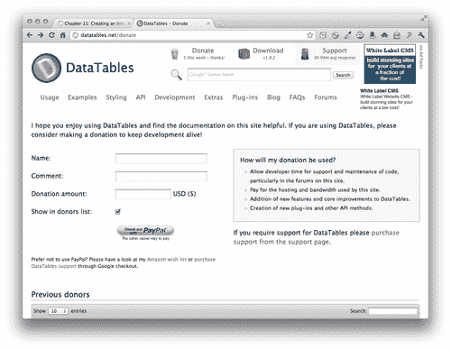

3.  Unzip the folder and take a look inside.

    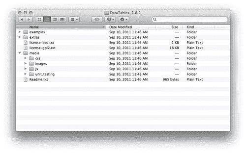

    *   There's a folder of `examples` with several different examples of the DataTables plugin in action. A folder of `extras` provides extra functionality for advanced data tables we won't be using any of those here. There's a `media` folder that contains `images, css, js`, and `unit_testing` resources. And finally a `Readme.txt`, file contains information on the plugin's creator and where to find the documentation, and so on.

        最后，您将找到该插件的许可证，包括 BSD 和 GPL。您可以阅读这些许可证文件或访问维基百科以获取这些许可证的详细信息，但它们都是免费软件许可证，允许您免费使用插件代码。

4.  我们将建立一个基本示例，因此我们只需要为我们自己的项目提供一些东西。首先，将 `images`目录的内容复制到您自己的 `images`目录中。打开 `css`文件夹，将 `demo_table.css`复制到您自己的 `styles`目录。小心选择合适的 CSS 文件 `demo_table.css`，因为里面有一些 CSS 文件。最后，在 `js`文件夹中，找到插件的简化版本 `jquery.dataTables.min.js`，并将其复制到您自己的 `scripts`目录中。
5.  接下来，我们将获得所有必要的文件，这些文件将附加到包含表的 HTML 页面。在文档的`<head>`部分，在您自己的 `styles.css`文件

    ```js
    <link rel="stylesheet" href="styles/demo_table.css"/>
    <link rel="stylesheet" href="styles/styles.css"/>

    ```

    之前附上 CSS 文件
6.  接下来，在 HTML 文档的底部，在 jQuery 和您自己的 `scripts.js`文件

    ```js
    <script src="scripts/jquery.js"></script>
    <script src="scripts/jquery.dataTables.min.js"></script>
    <script src="scripts/scripts.js"></script>
    </body>
    </html>

    ```

    之间附加 DataTables 插件
7.  Next, open your `scripts.js` file and inside a document ready statement, select the table and call the `dataTable()` method as follows:

    ```js
    $(document).ready(function(){
    $('#book-grid').dataTable();
    });

    ```

    现在，如果在浏览器中刷新页面，您将看到表已转换为数据网格。您可以选择一次要查看的项目数，在搜索框中键入以查找特定的表条目，并使用右下角的分页控件翻阅数据表的行。

    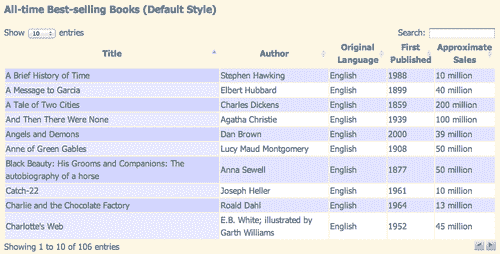

## 刚才发生了什么事？

我们建立了一个基本的 HTML 表，并通过附加一些 CSS 和 DataTables 插件将其转换为一个交互式数据网格。我们选择表并调用 `dataTable()`方法来激活 DataTables 插件。

那很容易，不是吗？当然，这种薰衣草设计可能不适合你的网站设计，所以让我们看看如何定制数据表的外观。

# 定制数据网格

DataTables 插件是我们使用的第一个支持 jQuery UI Themeroller 的插件。jQueryUI 是小部件和交互的集合，使构建复杂应用程序变得更容易、更快。学习 jQueryUI 本身超出了本书的范围，但我们将了解如何使用 jQueryUIThemeRoller 为数据表创建自定义主题。这个主题同样适用于我们页面上使用的任何 jQueryUI 小部件，以及使用的任何 jQuery 插件，包括对 jQueryUIThemeroller 的支持。

# 行动时间-定制数据网格

我们将从我们的数据表开始。如果您想保存基本示例，只需保存该文件的副本即可。然后按照以下步骤自定义数据网格的外观：

1.  Head over to [http://jqueryui.com/themeroller](http://jqueryui.com/themeroller) where we'll take a look at the Themeroller. In the left column, you'll find the controls for selecting a predefined theme or creating a custom theme, and the wide right column contains samples of several different types of widgets.

    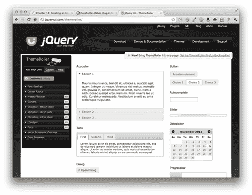

2.  Click on the **Gallery** tab in the left column, and you'll see that you have dozens of choices of pre-built Themeroller themes to choose from. As you click on different samples, you'll see the sample widgets in the right column update to reflect that style. I usually like to get started by selecting a prebuilt theme that's reasonably close to the color scheme or appearance that I want, then I flip to the **Roll Your Own** tab to tweak it to suit my needs. For this example, I'm going to start with the **Cupertino** style.

    在翻到**滚动您自己的选项卡**后，您将看到有字体、颜色、角、标题等的设置。做任何你想做的调整，让主题看起来正是你想要的。尽情地玩和试验吧。如果你走得太远，找到了你不喜欢的东西，很容易回到**Gallery**选项卡，再次选择预构建主题，去掉任何定制，然后重新开始。

    请记住，如果重新选择预构建的主题，任何自定义设置都将丢失。一旦你得到了你喜欢的东西，一定要继续第 3 步来保存它。

3.  Once you've got your theme set up just the way you'd like, click on the **Download Theme** button.

    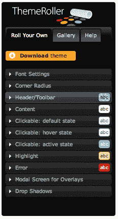

4.  You'll find yourself on the **Build Your Download** page, which might seem a little confusing. Note that jQuery UI is so large and has so many different features on offer, the developers realize that forcing everyone to download the entire thing would be overkill. If you only wanted to use one widget, there'd be no need for downloading all the other widgets and effects. This page lets you pick and choose different components of jQuery UI so that you don't have to download more than you need.

    由于我们在这里只是为了一个主题，我们可以继续点击页面顶部附近的**取消选择所有组件**链接。

    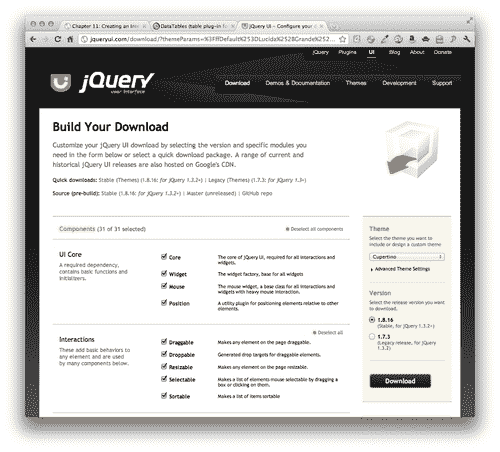

    *   然后，我们将保留**主题**和**版本**的默认设置，并点击**下载**按钮下载 ZIP 文件。
5.  Unzip the file and take a look inside. You'll see that even though we got the simplest download we could, we still have quite a few files.

    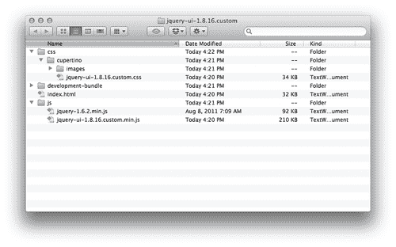

    *   We've got a `css` folder that contains our theme folder with a CSS file and **images** inside it. We've also got a `development-bundle` folder, an HTML file, and a `js` folder that contains jQuery and a jQuery UI file.

        我们需要的是我们的主题。将主题文件夹复制到您自己项目的样式目录中。我的主题文件夹名为`cupertino`，因为这是我选择的主题。如果选择了不同的主题，则主题文件夹将被称为其他文件夹。不过，它很容易找到，因为它将是`css`文件夹中唯一的文件夹。

6.  接下来，我们将把主题 CSS 文件附加到 HTML 文件。在`<head>`部分中，在前面示例中附加的 `demo_table.css`文件之前附加主题 CSS 文件。

    ```js
    <link rel="stylesheet" href="styles/cupertino/jquery-ui-1.8.16.custom.css"/>
    <link rel="stylesheet" href="styles/demo_table.css"/>

    ```

7.  Now, unfortunately, our theme CSS file doesn't quite have all the styles we'll need for a nicely styled data grid. After all, the jQuery UI developers have no way of knowing all the different types of widgets and plugins people will want to use, so there's no possible way they could cover every single case. Luckily, DataTables plugin author Allan Jardine has already done some nice work for us in this area and has provided a CSS file with the styles we'll need to get our themed data grid looking its best.

    您可以阅读 Allan Jardine 在[上提供的文档中关于 DataTables 插件样式的内容 http://datatables.net/styling/](http://datatables.net/styling/) 。

    回到 DataTables 插件文件中，查看`media`文件夹中的`css`文件夹，找到`demo_table_jui.css`文件。将其复制到您自己的 styles 文件夹中，并更新您的`<link>`标签以链接到此版本的`demo_table.css`，如下所示：

    ```js
    <link rel="stylesheet" href="styles/cupertino/jquery-ui-1.8.16.custom.css"/>
    <link rel="stylesheet" href="styles/demo_table_jui.css"/>

    ```

8.  Now we just have to make a small update to our JavaScript code. We have to tell the `dataTable()` method that we want to use jQuery UI. Head back into your `scripts.js` file and we'll add a pair of curly brackets and pass a key/value pair to enable jQuery UI styling for our data table:

    ```js
    $(document).ready(function(){
    $('#book-grid').dataTable({
    'bJQueryUI': true
    });
    });

    ```

    如果现在在浏览器中刷新页面，您将看到数据网格现在使用的样式与我们在 jQuery UI Themeroller 页面上看到的小部件一致：

    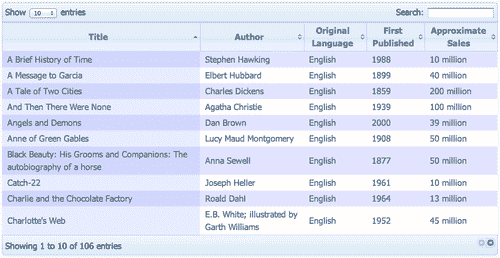

    *   但是，您会注意到表行的颜色方案仍然是淡紫色。
9.  Let's make some adjustments to the color scheme. Open `demo_table_jui.css`. There are just a couple of lines to update. First, we'll find line 281 where the colors for the zebra-striping for the table are defined and update those to the colors we'd like to use as follows:

    ```js
    tr.odd {
    background-color: #f1f7fb;
    }
    tr.even {
    background-color: white;
    }

    ```

    我将用淡蓝色表示奇数行，白色表示偶数行，以匹配我之前选择的 Cupertino 样式。您可以自由选择与自己选择的主题相匹配的颜色。

10.  接下来，我们将更改当前排序行的颜色方案。您将在第 380 行找到已排序奇数行的 CSS。我要把我的换成中蓝色，如下所示：

    ```js
    tr.odd td.sorting_1 {
    background-color: #d6e7f4;
    }

    ```

11.  And finally, we can find the CSS for the sorted even row at line 392\. I'm going to change this to a light blue.

    ```js
    tr.even td.sorting_1 {
    background-color: #e4eff8;
    }

    ```

    您可以选择自己的颜色，与自己选择的主题相协调。

    现在，如果您在浏览器中刷新页面，您将看到表格的斑马条纹图案符合我们的 Themeroller 主题。

    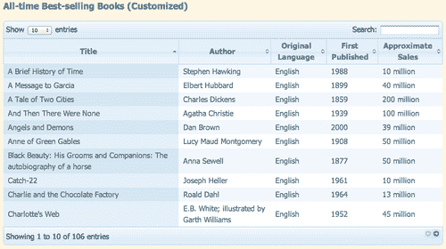

12.  Next up, we'll take a look at making a couple of other customizations to the data grid. First, let's change those simple next and previous pagination buttons into numbers. We'll pass another key/value pair to the `dataTable` method to replace the buttons with pagination numbers as follows:

    ```js
    $(document).ready(function(){
    $('#book-grid').dataTable({
    'sPaginationType': 'full_numbers',
    'bJQueryUI': true
    });
    });

    ```

    ### 笔记

    记住用逗号分隔每个键/值对，但不要在最后一个键/值对后加逗号。

    *   如果在浏览器中刷新页面，您将看到简单按钮已被页码替换，如以下屏幕截图所示：

    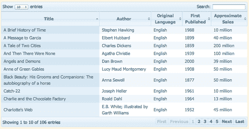

13.  We might decide that for this particular data table, the search function doesn't make sense. The DataTables plugin offers a way for us to disable individual features. To disable the search box filtering, we'll pass another key/value pair as follows:

    ```js
    $(document).ready(function(){
    $('#book-grid').dataTable({
    'sPaginationType': 'full_numbers',
    'bJQueryUI': true,
    'bFilter': false
    });
    });

    ```

    在浏览器中刷新页面，您将看到搜索框消失。

    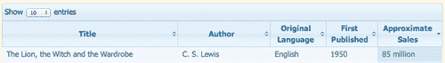

14.  You've probably noticed that by default, the DataTables plugin is sorting our table by the first column in ascending order, from A to Z. That might be fine in some cases, but in this case since we're listing the all-time best-selling books, we probably want to sort the table to show the books with the highest sales first. We'll pass in a new key/value pair to specify which column should be used for the default sort and which direction the sort should go.

    ```js
    $(document).ready(function(){
    $('#book-grid').dataTable({
    'sPaginationType': 'full_numbers',
    'bJQueryUI': true,
    'bFilter': false,
    'aaSorting': [[4, 'desc']]
    });
    });

    ```

    我们使用的键名为`'aaSorting'`，该值是两组方括号内的列号和排序方向。不要忘记 JavaScript 从 0 开始计数，而不是 1。所以我们表中的第五列实际上是第 4 列。然后，我们希望最高的数字在顶部，所以我们通过`'desc'`进行降序。

    在浏览器中刷新页面，您将看到这些书现在从最高销量到最低销量的顺序。还请注意，此默认排序顺序不会影响站点访问者按任何其他列按他们喜欢的顺序对表进行排序的能力。站点访问者仍然可以与您的表进行交互。我们只是以一种对我们所呈现的数据最有意义的方式重新定义默认视图。

## 刚才发生了什么事？

我们采用了我们的基本数据网格，并通过定制插件的外观和行为使其更进一步。我们学习了如何使用 jQueryUIThemeroller 为数据网格创建自定义主题。然后，我们学习了如何用页码替换简单的分页按钮，禁用表搜索，以及如何为数据网格设置默认排序。

# 总结

在本章中，我们学习了如何将普通 HTML 表转换为交互式数据网格。我们的站点访问者现在可以利用对表中不同列的排序，以不同的方式查看数据。禁用 JavaScript 的站点访问者只需看到一个包含所有数据的普通 HTML 表。数据网格并不是非常令人兴奋，但它们可以让网站访问者更容易地处理大量数据世界。下一步，我们将学习如何使表单更漂亮、更易于使用。