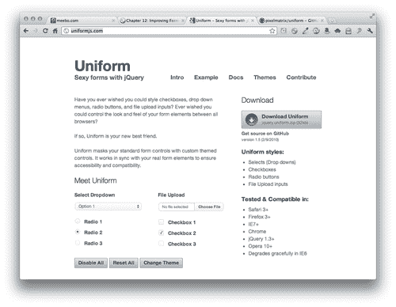
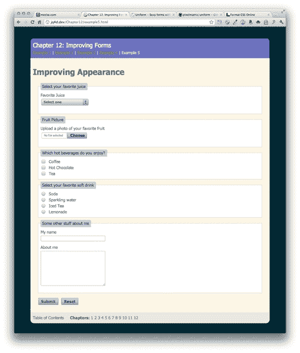

# 十二、改进表单

> 如果您曾经尝试使用 web 表单，您就会知道它们是多么令人头痛。幸运的是，HTML5 的作者正在努力工作，以确保体验得到改善。我们都在耐心地等待浏览器支持这些漂亮的新功能，但与此同时，我们必须构建网站并制作出漂亮的功能表单。

在本章中，您将学习以下主题：

*   使用一些新的 HTML5 属性标记表单
*   将光标放置在第一个表单字段中
*   在表单字段中使用占位符文本
*   验证网站访问者的表单条目
*   设置顽固表单元素（如文件上载和选择下拉列表）的样式

# HTML5 网络表单

我们将首先利用 HTML5 中提供给我们的一些新属性。这些添加的好处在于它们完全向后兼容。不知道如何处理这些表单的浏览器要么会忽略它们，要么默认为简单的文本输入，而我们的网站访问者在旧浏览器上可以使用我们的表单，甚至不知道它们缺少什么。

首先，一句关于 web 表单的警告。web 表单本身无法工作-它需要在某个服务器上进行一些奇特的后端编程，以收集表单条目并对其进行处理，无论这意味着将字段写入数据库还是通过电子邮件发送表单信息。正因为如此，我们在本章中构建的表单实际上无法正常工作-单击表单上的**提交**按钮后不会发生任何事情。

如果要向项目中添加功能正常的 web 表单，您有几个选项。详情如下:

*   您可以学习使用服务器端编程来处理表单，但服务器端编程远远超出了本书的范围。
*   您可以使用 CMS，它可能在其核心功能中包含表单处理，或者作为一个附加组件。好的候选者包括 Drupal、WordPress 和 Joomla！。
*   您可以雇佣一名服务器端开发人员来让表单正常工作。或者与他们交朋友，用你的设计技能换取他们的编码技能。
*   您可以使用 web 表单服务来处理表单的所有服务器端处理。我个人最喜欢的是 WuFoo，我已经用了很多年了，没有一次打嗝。（[http://wufoo.com](http://wufoo.com) ）

这些方法中的任何一种都将帮助您创建要包含在项目中的工作表单。然而，让我们看看我们如何使我们的表单的前端是最好的。

# 是时候采取行动了——建立 HTML5 网络表单

1.  We'll get started with a simple HTML document and the associated files and folders, just like we set up in [Chapter 1](01.html "Chapter 1. Designer, Meet jQuery"), *Designer, Meet jQuery*. We want to make sure to use the HTML5 doctype in our document type declaration at the top of the document:

    ```js
    <!DOCTYPE html>

    ```

    在 HTML4 和 xHTML 使用了这么多冗长而复杂的文档类型声明之后，这是一个新鲜空气，不是吗？

2.  Now, inside the`<body>` tag, open up a`<form>` tag as follows:

    ```js
    <form action="#" id="account-form">
    </form>

    ```

    `form`标记需要一个`action`属性才能工作。由于我们的表单只是用于脚本编写和样式设置的虚拟表单，因此我们将只使用#作为该属性的值。action 属性的值通常是一个 URL—服务器上我们要发送表单数据以进行处理的位置。我们还添加了一个 `id`属性，以便于以后选择用于 CSS 和 JavaScript 目的的表单。

3.  Next up, we'll create a section for our site visitor to create a username and password. We'll wrap these two fields up in a `fieldset` with a `legend` to group them together.

    ```js
    <form action="#" id="account-form">
    <fieldset>
    <legend>My Account</legend>
    <p>
    <label for="username">Username</label>
    <input type="text" name="username" id="username"/>
    </p>
    <p>
    <label for="password">Password</label>
    <input type="password" name="password" id="password"/>
    </p>
    </fieldset>
    </form>

    ```

    我已将每个字段及其相关标签包装在段落标记（`<p>`中）。对于用于标记表单字段的最佳标记，人们众说纷纭。一些开发人员使用简单的`<div>`标记，其他人则喜欢将表单做成一个列表（`<ul>`），每个字段都做成一个列表项（`<li>`。其他人喜欢使用定义列表（`<dl>`，并将标签放在`<dt>`标记内，将表单字段放在`<dd>`标记内。在一天结束时，任何这些都会做得很好，您的表单将按预期为您的网站访问者工作。使用你个人喜好的标签。

    仔细查看我们迄今为止为表单编写的 HTML 标记。有几件重要的事情需要注意。详情如下:

    *   每个`<input>`都有一个与其用途相关的 `type`。**用户名**为 `text`类型，**密码**为 `password`类型。
    *   每个`<input>`都有一个唯一的 `id`。请记住， `id`在页面上必须是唯一的，因此请仔细选择表单输入的 `id`。
    *   每个`<input>`都有一个 `name`属性。这将传递给服务器端处理表单的任何代码。对于表单元素的 `name`和 `id`使用相同的值是一种常见做法，但这不是强制性的。您可以随时轻松地为 `id`选择不同的值，但是如果您想更改 `name`值，您应该首先与服务器端开发人员联系，确保他或她编写的代码能够继续工作。
    *   Each`<label>` has a `for` attribute that associates it with a particular form element. The value in the `for` attribute is equal to the `id` of the form element with which it is associated (not the `name)`. This makes some nice functionality available to our site visitors clicking on a `label` will bring focus to the associated form element. This behavior is especially useful for checkbox and radio button inputs, which are small and can be difficult to click.

        每个浏览器都有自己的表单元素样式，但以下是我的**我的账户**部分的外观（Mac OSX 上的谷歌 Chrome）：

    

4.  Next up, we'll create an **About Me** section for our form.

    ```js
    <fieldset>
    <legend>About Me</legend>
    <p>
    <label for="name">Name</label>
    <input type="text" name="name" id="name"/>
    </p>
    <p>
    <label for="email">Email address</label>
    <input type="email" name="email" id="email"/>
    </p>
    <p>
    <label for="website">Website</label>
    <input type="url" name="website" id="website"/>
    </p>
    <p>
    <label for="birthdate">Birth Date</label>
    <input type="date" name="birthdate" id="birthdate"/>
    </p>
    </fieldset>

    ```

    同样，`text`类型用于**名称**输入，因为名称是字符串。但是，请查看**电子邮件、网站**和**出生日期**字段的 `type`属性。我们在这里使用新的 HTML5 输入类型。在不支持这些输入类型的浏览器中，这些字段的外观和工作方式将与具有`type`和`text`的输入相同。但在识别这些输入类型的浏览器中，它们的行为方式会略有不同。浏览器将自动验证用户输入。例如，如果站点访问者在输入中键入了无效的电子邮件地址，则浏览器将警告他们输入了无效的电子邮件地址。

    此外，在带有软键盘的设备上，键盘键将被更改以反映输入该数据类型所需的字符。例如， `email`类型的输入将用打开键盘。而`@`显示在 iPhone 或 iPad 上，使您的网站访问者在这些设备上更容易完成所需信息。

    

5.  The next section in my form will be a section about beverage preferences. I want the site visitor to select their favorite beverages from a list and then answer a question about how many days per year they drink a beverage. Here's a sample of what my list looks like:

    ```js
    <fieldset>
    <legend>Beverage Info</legend>
    <fieldset>
    <legend>Select your favorite beverages</legend>
    <p>Select at least three and no more than six beverages</p>
    <ul>
    <li>
    <input type="checkbox" name="favorites[]" id="bev-water" value="bev-water"/>
    <label for="bev-water">Water</label>
    </li>
    <li>
    <input type="checkbox" name="favorites[]" id="bev-juice" value="bev-juice"/>
    <label for="bev-juice">Juice</label>
    </li>
    </ul>
    </fieldset>
    <p>
    <label for="days">How many days per year do you drink a beverage?</label>
    <input type="number" name="days" id="days"/>
    </p>
    </fieldset>

    ```

    

    我们用来标记本节内容的 HTML 有以下几点需要注意：

    *   `Fieldsets`可以嵌套。 `fieldset`是将一组复选框或单选按钮组合在一起的绝佳方式，我们可以使用 `fieldset`的 `legend`为单选框或单选按钮组创建标题。
    *   一组复选框被标识为这样，因为它们将共享相同的 `name`。由于站点访问者可以在一组复选框中选择多个项目，因此我们在名称末尾添加方括号（[]），以便服务器将所有答案收集到一个数组中。
    *   集合中的每个复选框都有自己独特的 `id`和 `value`。 `id`和 `value`不一定要匹配，但通常很容易使它们相同。
    *   最后，每年的天数输入类型为 `number`，因为这里只接受一个数字。请注意此输入类型。它非常严格，不接受任何非数字字符。有些数据位看起来是数字，但实际上是字符串&，mdash；例如，电话号码和信用卡号码。如果你不想用你的数字做一些数学运算，那么它就不应该是 `number`输入类型。
6.  The next section we'll add to our form is a payment information section:

    ```js
    <fieldset>
    <legend>Payment Info</legend>
    <fieldset>
    <legend>Credit Card Type</legend>
    <ul>
    <li>
    <input type="radio" name="cc-type" id="cc-visa" value="cc-visa"/>
    <label for="cc-visa">Visa</label>
    </li>
    <li>
    <input type="radio" name="cc-type" id="cc-mastercard" value="cc-mastercard"/>
    <label for="cc-mastercard">Mastercard</label>
    </li>
    <li>
    <input type="radio" name="cc-type" id="cc-amex" value="cc-amex"/>
    <label for="cc-amex">American Express</label>
    </li>
    <li>
    <input type="radio" name="cc-type" id="cc-discover" value="cc-discover"/>
    <label for="cc-discover">Discover</label>
    </li>
    </ul>
    </fieldset>
    <p>
    <label for="cc-number">Credit card number</label>
    <input type="text" name="cc-number" id="cc-number"/>
    </p>
    </fieldset>

    ```

    与复选框非常相似，我们将一组无线电控件组合在一个`fieldset`中， `legend`作为本节的标题。就像复选框一样，一组无线电控制都有相同的名称，但每个都有自己独特的 `id`和值。但是，对于单选按钮，一次只能选择一个，因此无需将其标记为数组。

    我们还添加了一个字段，用于收集网站访问者的信用卡号。注意，我们已经为这个字段分配了一个输入类型`text`。即使一个信用卡号码看起来是一个号码，我们也希望按原样存储它，并且永远不会对这个号码进行加减。此外，客户可能希望在其信用卡号中键入空格或连字符。

    

7.  Finally, we'll add a checkbox for our site visitor to accept our terms of service and a submit button for them to submit the form information to us.

    ```js
    <fieldset>
    <ul>
    <li>
    <input type="checkbox" name="tos" id="tos" value="tos"/>
    <label for="tos">Click here to accept our terms of service</label>
    </li>
    </ul>
    <p>
    <input type="submit" value="Sign me up!"/>
    </p>
    </fieldset>

    ```

    这里唯一的新功能是**提交**按钮。默认情况下，`submit`类型的输入将读取**提交。**我们可以通过添加一个 `value`属性和我们希望实际出现在按钮上的文本来改变这一点。

    

8.  The only thing left to do is to style our form with a bit of CSS. The following is the CSS I've used for my simple form:

    ```js
    fieldset { width:400px;margin:0;padding:10px;border:1px solid #c1c3e6;background:#f1f2fa;margin-top:10px; }
    fieldset fieldset { border:0 none;border-top:1px solid #c1c3e5;border-bottom:1px solid #c1c3e5;width:380px;margin-bottom:10px; }
    legend { padding:3px 5px;color:#6c71c4;font-weight:bold;font-size:1.2em; }
    fieldset fieldset legend { font-size:1em;font-weight:normal; }
    fieldset p { margin: 0 0 10px 0; }
    fieldset ul { margin:0;padding:0;list-style:none; }
    label { display:inline-block;width:150px; }
    ul label { display:inline;width:auto; }
    input[type="text"],
    input[type="password"],
    input[type="email"],
    input[type="url"],
    input[type="date"],
    input[type="number"] { width:150px;border:1px solid #c1c3e6;padding:4px; }

    ```

    请注意，我们输入的`type`属性可用于选择样式。在本例中，我对它们进行了相同的样式设置，但如果需要，也可以为每一个提供自己的样式集。

    下面是我的 CSS 表单的外观。自由发挥创意，为表单编写自己的风格。

    

## 刚才发生了什么事？

我们看了一些新的 HTML5 输入类型，以及如何正确地使用它们来组合 web 表单。我们了解了如何使用字段集和图例将字段分组到标题下，以及如何将标签与表单元素关联。我们学习了文本、密码、电子邮件、URL、日期、复选框、收音机和数字输入类型的正确使用。

# 设置焦点

如果您前往[http://google.com](http://google.com) ，你会发现他们让你进行网络搜索变得非常容易——一旦页面加载到浏览器中，搜索字段中的光标就会闪烁。网络上还有其他网站也有类似的行为，这使得填写表单变得简单快捷。

任何时候当你有一个页面，网站访问者在该页面上的主要任务是完成一个表单时，你可以将光标放在第一个表单字段中，这样他们就可以开始键入，从而使网站访问者的工作变得简单。使用 jQuery 非常简单。下面是如何做到这一点。

# 行动时间-将焦点设置到第一个字段

我们将继续使用上一个示例中设置的示例表单。下面是如何将焦点设置到表单中的第一个字段。

1.  打开你的空 `scripts.js`文件，添加一个文档就绪语句。

    ```js
    $(document).ready(function(){
    //code goes here
    });

    ```

2.  接下来，我们要选择表单中的第一个字段。有很多不同的方法可以做到这一点。在本例中，我将使用第一个 form 元素的 `id`。

    ```js
    $(document).ready(function(){
    $('#username');
    });

    ```

3.  All that's left to do is call the `focus()` method for that element.

    ```js
    $(document).ready(function(){
    $('#username').focus();
    });

    ```

    现在，如果您在浏览器中刷新页面，您将看到光标在表单的**用户名**字段中闪烁，这是第一个字段。

## 刚才发生了什么事？

我们使用了几行 jQuery 将焦点移到表单中的第一个字段，以便我们的网站访问者能够轻松地直接完成表单。它非常简单，只需选择第一个表单元素，然后为该元素调用 `focus()`方法。

# 占位符文本

当你访问一个站点时，表单字段中有一些软灰色的文本，提示你应该在那里放置什么，这不是很好吗？在过去的几年中，有无数不同的 jQuery 插件被编写来处理这个问题，因为这可能会有点麻烦。

然而，我带着好消息来到这里。HTML5 提供了一个 `placeholder`属性，可用于在表单字段中自动创建此类文本，而无需 JavaScript 的任何帮助。当然，与任何其他尖端技术一样，浏览器支持可能有点缺乏。我们没有等待数年的奢侈等待浏览器支持这一新功能的普及，我们现在必须建立功能正常的网站。您可以继续使用所有那些旧的 jQuery 插件，但为什么不利用对占位符属性的支持（如果有的话），只使用 jQuery 来填补那些尚未识别占位符属性的浏览器的空白呢？

这种类型的脚本称为**polyfill**。它用于填充某些浏览器可能缺少的功能。如果浏览器确实支持 `placeholder`属性，则 polyfill 脚本不做任何操作，只让浏览器处理占位符。对于所有不支持 `placeholder`属性的站点访问者，脚本将立即生效，为每个人提供占位符文本功能。

# 行动时间-添加占位符文本

按照以下步骤为尽可能多的站点访问者向表单字段添加占位符文本，无论他们的浏览器是否支持新的 HTML5 占位符属性。

1.  We'll keep using the same form that we've built in the last two sections. The first thing we'll do is revisit each form field and add a placeholder attribute where it makes sense. Here are some examples from my form:

    ```js
    <p>
    <label for="username">Username</label>
    <input type="text" name="username" id="username" placeholder="At least 5 characters long"/>
    </p>

    ```

    在这里，我添加了一个关于用户名所需长度的提示。

    ```js
    <p>
    <label for="password">Password</label>
    <input type="password" name="password" id="password" class="required" placeholder="Choose a secure password"/>
    </p>

    ```

    因为你不能说得太多，所以我在这里提醒我的网站访问者创建一个安全的密码。

    ```js
    <p>
    <label for="website">Website</label>
    <input type="url" name="website" id="website" placeholder="Don't forget the http://"/>
    </p>

    ```

    提醒站点访问者在开始时有效的 URL 包括协议是有帮助的。

    ```js
    <p>
    <label for="birthdate">Birth Date</label>
    <input type="date" name="birthdate" id="birthdate" placeholder="yyyy-mm-dd"/>
    </p>

    ```

    每当字段需要特殊格式时，占位符文本都可以向站点访问者提示应该是什么。

    添加完占位符文本后，在 Safari 或 Chrome 中查看页面以查看占位符文本。

    

    *   现在我们需要为那些还不支持占位符文本的浏览器添加支持。
2.  We'll use Dan Bentley's Placeholder polyfill. To download it, just head over to [https://github.com/danbentley/placeholder](http://https://github.com/danbentley/placeholder). Just like the other plugins we've downloaded from GitHub, click on the **ZIP** button to download a zipped folder.

    

3.  Unzip the folder and take a look inside. It's a pretty simple and straightforward plugin.

    

    *   您有一个样本`index.html`文件、一个`style.css`文件和一个`jquery.placeholder.js`文件，以及一个许可证和自述文件。
4.  The good news about this plugin is that it works its magic just by being on the page. Copy `jquery.placeholder.js` to your own `scripts` folder. Then head down to the bottom of your page and attach the script to the page after jQuery and before your own `scripts.js` file:

    ```js
    <script src="scripts/jquery.js"></script>
    <script src="scripts/jquery.placeholder.js"></script>
    <script src="scripts/scripts.js"></script>

    ```

    现在，如果您在不支持占位符属性的浏览器中打开页面，您将看到占位符起作用。这些浏览器包括 Firefox 3.6 及更低版本、Safari 3 及更低版本、Internet Explorer 9 及更低版本、Opera 10 及更低版本。

## 刚才发生了什么事？

我们使用 Dan Bentley 的 Placeholder polyfill 为缺少占位符支持的浏览器添加占位符支持。我们在适当的地方向表单字段添加了 `placeholder`属性，然后在页面上包含 Dan 的脚本，以使这些占位符属性在尽可能多的浏览器中工作。

# 正在验证用户输入

有时，当网站访问者不得不多次提交表单，纠正填写表单时出现的错误时，他们会感到沮丧。如果没有 JavaScript，验证站点访问者输入的信息的唯一方法是等待他们提交表单，然后确定服务器上的问题，并发回包含表单的页面以及可能帮助站点访问者纠正问题的任何错误消息。

一旦出现错误就立即显示，这将大大有助于让您的表单快速响应，并帮助您的网站访问者在第一次尝试时正确提交表单。在本节中，我们将学习如何使用 Jörn Zaefferr 提供的验证插件。这个插件功能强大且灵活，可以用几种不同的方式处理验证。我们将看一看向表单中添加客户端验证的最直接的方法。

# 行动时间-动态验证表单值

我们将继续使用上三节中创建的表单。按照以下步骤验证用户在表单中的输入：

1.  The first thing we'll do is download the Validation plugin and get it attached to our page.

    前往[http://bassistance.de/jquery-plugins/jquery-plugin-validation/](http://bassistance.de/jquery-plugins/jquery-plugin-validation/) 点击**文件**部分的**下载**按钮下载 ZIP 文件。

    

2.  Open up the ZIP file and take a look at what we've got.

    

    *   There's a lot going on here. Several different JavaScript files, a changelog, and so on. Remember how I said this plugin is powerful and can handle lots of different approaches to validation? That's what all this is for. Handling form validation in just about any old crazy situation you might find yourself in.

        幸运的是，我们的情况很简单，所以我们不需要做任何复杂的事情。

3.  Copy `jquery.validate.min.js` to your own `scripts` folder and attach it to your page.

    ```js
    <script src="scripts/jquery.js"></script>
    <script src="scripts/jquery.placeholder.js"></script>
    <script src="scripts/jquery.validate.min.js"></script>

    ```

    在本例中，占位符脚本和验证脚本之间没有依赖关系，因此它们出现的顺序无关紧要，只要它们都在 jQuery 本身之后。

4.  Next, we're going to go back through our form and add some information that the Validation plugin will use. Let's start with the username field:

    ```js
    <p>
    <label for="username">Username</label>
    <input type="text" name="username" id="username" placeholder="At least 5 characters long" minlength="5" maxlength="20" class="required"/>
    </p>

    ```

    这是一个必填字段-任何填写此表单的网站访问者都必须选择用户名，因此我只需添加一个`required`的`class`。如果我愿意的话，我可以使用这个类名为这个表单字段创建一个特殊的 CSS 样式。即使我没有这样做，验证也会使用它来确保这个字段被填写。

    接下来，所有用户名的长度必须在 5 到 20 个字符之间。所以我添加了一个`minlength`和`maxlength`属性。

5.  Next up is the password field, which is also required. So I'll add the required class.

    ```js
    <p>
    <label for="password">Password</label>
    <input type="password" name="password" id="password" class="required" placeholder="Choose a secure password"/>
    </p>

    ```

    在进行此操作时，我还将向电子邮件字段添加所需的类。

    ```js
    <p>
    <label for="email">Email address</label>
    <input type="email" name="email" id="email" placeholder="you@example.com" class="required"/>
    </p>

    ```

6.  Next, let's take a look at that list of favorite beverages. Remember we had a note on there for the site visitor to select at least three but no more than six? We can actually enforce that with the Validation plugin. Go to the first checkbox in the series and add `minlength` and `maxlength` attributes as follows:

    ```js
    <li>
    <input type="checkbox" name="favorites[]" id="bev-water" value="bev-water" maxlength="6" minlength="3"/>
    <label for="bev-water">Water</label>
    </li>

    ```

    我们只需在第一个复选框中添加此项，而不是所有复选框。验证足够聪明，可以看出我们正在讨论这组复选框。

7.  现在，让我们来看看这个网站，我们问网站访问者每年喝多少天的饮料。显然，由于一年中只有 365 天，这是他们在这个字段中可以输入的最高数字。因此，我们将添加一个 `max`属性来指定可能的最大数字。

    ```js
    <p>
    <label for="days">How many days per year do you drink a beverage?</label>
    <input type="number" name="days" id="days" max="365"/>
    </p>

    ```

8.  And that brings us to the payment section. Whatever we're selling, it's not free, so we're going to require both the credit card type and credit card number. To require entry for radio buttons, we just have to add the `required` class to the first radio button in the set.

    ```js
    <li>
    <input type="radio" name="cc-type" id="cc-visa" value="cc-visa" class="required"/>
    <label for="cc-visa">Visa</label>
    </li>

    ```

    我们不必对单选按钮系列进行任何其他更改。

9.  现在，让我们自己来处理信用卡号码。我们需要添加 `required`类。我们还需要添加一个 `creditcard`类来验证输入的号码实际上是一个有效的信用卡号码。

    ```js
    <p>
    <label for="cc-number">Credit card number</label>
    <input type="text" name="cc-number" id="cc-number" placeholder="xxxxxxxxxxxxxxxx" class="creditcard required"/>
    </p>

    ```

10.  在表格的底部，我们有**服务条款**复选框。这也是必需的，因此我们将添加 `required`类。

    ```js
    <li>
    <input type="checkbox" name="tos" id="tos" class="required" value="tos"/>
    <label for="tos">Click here to accept our terms of service</label>
    </li>

    ```

11.  现在，我们只需要调用验证提供给我们的 `validate()`方法。在 DocumentReady 语句中，选择表单并调用 `validate()`方法。

    ```js
    $(document).ready(function(){
    $('#username').focus();
    $('#account-form').validate();
    });

    ```

12.  Now if you refresh the page in the browser, you'll see that you can't submit the form without filling anything in — the required fields will be marked with an error message saying the field is required. If you try to type an invalid URL or e-mail address into the **Website** or **Email address** fields, you'll get an error message letting you know there's a problem to be corrected. Just one problem those error messages are sort of in a weird place for our checkboxes and radio buttons.

    

    *   这并不能真正帮助人们理解到底发生了什么。幸运的是，验证允许我们将自己的错误消息添加到页面中希望显示的任何位置。
13.  We're going to add an error message after the list of credit card type radio buttons.

    ```js
    <li>
    <input type="radio" name="cc-type" id="cc-discover" value="cc-discover"/>
    <label for="cc-discover">Discover</label>
    </li>
    </ul>
    <label for="cc-type" class="error">Select a credit card type!</label>
    </fieldset>

    ```

    我们将添加一个`<label>`。for 属性将引用该字段的`name`，在本例中，所有单选按钮共享`cc-type`名称。我们将添加一个错误类，并在其中添加我们想要的任何`error`消息。

    注意，对于这种情况，我们的`label`的`for`属性是指字段的`name`而不是 ID。这是由验证插件创建的特殊情况。如果您没有在验证插件中使用自定义错误消息，那么标签的`for`属性应该始终引用表单元素的`id`。

14.  Next, we don't want those error messages showing up on the page unless they're needed. We'd also like them to display in red so they stick out and are easy to find. Open your `styles.css` file and add some styles for the error message:

    ```js
    label.error { display:none;width:360px;color:#dc522f;margin-top:5px; }

    ```

    我们正在添加一个宽度，因为我已将其他标签设置为短标签并向左浮动。我们在错误消息和它所指的字段之间添加了一些空白。

    现在，如果您刷新浏览器并尝试在不选择信用卡类型的情况下提交表单，您将在一个更好的位置收到错误消息，如下所示：

    

15.  Next we need to do the same thing for our favorite beverages and our **Terms of Service** checkbox: Here's what we'll add for favorite beverages:

    ```js
    <li>
    <input type="checkbox" name="favorites[]" id="bev-wine" value="bev-wine"/>
    <label for="bev-wine">Wine</label>
    </li>
    </ul>
    <label for="favorites[]" class="error">Please select at least three and no more than six favorite beverages</label>
    </fieldset>

    ```

    以下是我们将为**服务条款**添加的内容

    ```js
    <fieldset>
    <ul>
    <li>
    <input type="checkbox" name="tos" id="tos" class="required"/>
    <label for="tos">Click here to accept our terms of service</label>
    </li>
    </ul>
    <label for="tos" class="error">You must accept our terms of service</label>
    <p>
    <input type="submit"/>
    </p>
    </fieldset>

    ```

现在，如果您在浏览器中刷新页面并尝试在不填写必填字段的情况下提交表单，或者尝试在表单中输入无效信息，则一旦检测到问题，您将收到相应的错误消息。

## 刚才发生了什么事？

我们使用验证插件向表单中添加了一些简单的客户端验证。使用验证插件最简单的方法是简单地向表单元素添加一些类名和属性。验证将处理其余部分-它足够智能，可以识别 HTML5 输入类型并验证这些类型，并提供一些其他有用的验证规则，如必填字段、最大数字值、最小和最大长度以及信用卡号码。我们插入了一行 CSS，按照我们想要的方式设置错误消息的样式。

# 改善外观

如果您尝试过使用 CSS 设置 web 表单的样式，那么您可能已经发现一些表单元素，如文本输入和按钮，很容易设置样式。有一些怪癖，但一旦你弄明白了这些，你就可以让这些表单元素看起来像你想要的任何方式。然而，其他表单元素要顽固得多，对 CSS 样式没有多大响应（如果有的话）。设计一个可爱的表单却意识到这在技术上是不可能的，这太令人沮丧了。

这些麻烦的表单元素包括：

```js
<select>
<input type="file">
<input type="checkbox">
<input type="radio">

```

这四个表单元素不仅不可能用 CSS 来设计，而且它们在不同的浏览器和操作系统中看起来也完全不同，这使得我们无法控制表单的外观。让我们看看 Pixel Matrix 的统一插件如何帮助我们。

# 行动时间-改善形态外观

按照以下步骤利用统一插件提供的样式选项

1.  我们将从一个基本的 HTML 文件和相关的文件和文件夹开始，就像我们在[第 1 章](01.html "Chapter 1. Designer, Meet jQuery")中设置的一样，*设计器，遇到 jQuery*。对于本例，在 HTML 文档的主体中，我们将设置一个简单的表单，其中包含每种类型的难以设置样式的表单元素的示例。从一个`<form>`标签开始：

    ```js
    <form id="pretty-form" action="#">
    </form>

    ```

2.  Then, inside our form we'll add our form elements. We'll start off with a `select` drop down:

    ```js
    <fieldset>
    <legend>Select your favorite juice</legend>
    <p>
    <label for="juice">Favorite Juice</label>
    <select id="juice" name="juice">
    <option>Select one</option>
    <option value="orange">Orange Juice</option>
    <option value="grape">Grape Juice</option>
    <option value="grapefruit">Grapefruit Juice</option>
    <option value="cranberry">Cranberry Juice</option>
    <option value="tomato">Tomato Juice</option>
    <option value="pineapple">Pineapple Juice</option>
    <option value="apple">Apple Juice</option>
    </select>
    </p>
    </fieldset>

    ```

    我们遵循上一个表单所遵循的所有规则，确保表单正常工作且可访问。

    这个`<select>`的具体外观取决于您的浏览器和操作系统，但我的浏览器和操作系统在 Mac OSX 上的 Chrome 中的外观如下：

    

3.  Next, we'll add a file input.

    ```js
    <fieldset>
    <legend>Fruit Picture</legend>
    <p>
    <label for="fruit-photo">Upload a photo of your favorite fruit</label>
    <input type="file" id="fruit-photo" name="fruit-photo"/>
    </p>
    </fieldset>

    ```

    很难相信这个看起来天真无邪的小标签可能是如此多造型头痛的根源，但你就是这样。以下是它在 Mac OSX 上的 Chrome 中的外观：

    

4.  Next up, let's add a few checkboxes as follows:

    ```js
    <fieldset>
    <legend>Which hot beverages do you enjoy?</legend>
    <ul>
    <li>
    <input type="checkbox" name="hot-bevs[]" id="hot-coffee">
    <label for="hot-coffee">Coffee</label>
    </li>
    <li>
    <input type="checkbox" name="hot-bevs[]" id="hot-chocolate">
    <label for="hot-chocolate">Hot Chocolate</label>
    </li>
    <li>
    <input type="checkbox" name="hot-bevs[]" id="hot-tea">
    <label for="hot-tea">Tea</label>
    </li>
    </ul>
    </fieldset>

    ```

    

5.  And then some radio buttons.

    ```js
    <fieldset>
    <legend>Select your favorite soft drink</legend>
    <ul>
    <li>
    <input type="radio" name="soft-drinks" id="soda"/>
    <label for="soda">Soda</label>
    </li>
    <li>
    <input type="radio" name="soft-drinks" id="sparkling-water"/>
    <label for="sparkling-water">Sparkling water</label>
    </li>
    <li>
    <input type="radio" name="soft-drinks" id="iced-tea"/>
    <label for="iced-tea">Iced Tea</label>
    </li>
    <li>
    <input type="radio" name="soft-drinks" id="lemonade"/>
    <label for="lemonade">Lemonade</label>
    </li>
    </ul>
    </fieldset>

    ```

    

6.  And the last thing we'll add to our form is just a few easily styleable elements, so that we can learn how to style these to match our Uniform styles:

    ```js
    <fieldset>
    <legend>Some other stuff about me</legend>
    <p>
    <label for="name">My name</label>
    <input type="text" id="name" name="name"/>
    </p>
    <p>
    <label for="about-me">About me</label>
    <textarea rows="10" cols="40" id="about-me" name="about-me"></textarea>
    </p>
    </fieldset>
    <p class="buttons">
    <input type="submit"/>
    <input type="reset"/>
    </p>

    ```

    

## 刚才发生了什么事？

现在我们已经设置好了未定型的表单。表单的具体外观取决于您的浏览器和操作系统。我们遵循本章前面建立的所有规则来设置正确且可访问的表单。除此之外，我们还包括了一些难以设置样式的表单元素。现在让我们来看看我们如何使用统一插件——让我们的表单在尽可能多的浏览器中看起来一致。

## 不可脱毛的造型

如果您想花点时间，尝试编写一些 CSS 来设计这些表单元素的样式，您会发现没有太多涉及它们的内容。它们中的一些似乎根本不受 CSS 的影响，而且当它们受到 CSS 的影响时，并不总是以您所期望的方式。难怪这些表单字段会给每个人带来这么多麻烦。JQuery 来营救。

# 行动时间-添加制服，塑造不可脱色的

按照以下步骤使用统一插件获得对表单元素的样式控制：

1.  Let's get the Uniform plugin and take a look at how that works. Head over to [http://uniformjs.com/](http://uniformjs.com/) and click on the big **Download Uniform** button.

    

2.  Unzip the folder and take a look inside.

    

    *   This is pretty straightforward, right? Some styles, a demo, some images, and two versions of the Uniform plugin — one minified and one not. We've seen this before.

        默认情况下，Uniform 附带默认样式表和图像。但是，也可以使用其他样式。回到`uniformjs.com`，如果您在导航中点击**主题**，您将看到当前可用的主题。我真的很喜欢亚里士多德的样子，所以我要下载它。

    

    *   这让我得到了一个简单的 ZIP 文件，里面只有一些 css 和图像：

    

3.  接下来，我们需要将这些文件放到我们自己的项目中，并附加到我们的 HTML 页面。让我们从 JavaScript 开始。将 `jquery.uniform.min.js`复制到您自己的 `scripts`文件夹中，并在 jQuery 和您自己的 `scripts.js`文件

    ```js
    <script src="scripts/jquery.js"></script>
    <script src="scripts/jquery.uniform.min.js"></script>
    <script src="scripts/scripts.js"></script>
    </body>

    ```

    之间附上统一脚本
4.  现在，将您想要使用的主题的 CSS 文件复制到您自己的 `styles`文件夹中，并将其附加到文档的头部：

    ```js
    <head>
    <title>Chapter 12: Improving Forms</title>
    <link rel="stylesheet" href="styles/uniform.aristo.css"/>
    <link rel="stylesheet" href="styles/styles.css"/>

    ```

5.  The last thing we need to grab is the associated images. Copy the contents of your chosen theme's images folder to your own `images` folder. Your own project's structure should now look similar to the following screenshot:

    

6.  现在，我们已经准备好调用 `uniform()`方法来设计不可伸缩表单元素的样式。打开您的 `scripts.js`文件，插入一条准备好文档的语句：

    ```js
    $(document).ready(function(){
    //our code will go here
    });

    ```

7.  制服允许我们挑选和选择我们喜欢的样式元素。在本例中，我们希望为所有四个顽固元素设置样式，因此我们的选择器将为：

    ```js
    $(document).ready(function(){
    $('select, input:checkbox, input:radio, input:file');
    });

    ```

8.  Then, all that's left to do is call the `uniform()` method:

    ```js
    $(document).ready(function(){
    $('select, input:checkbox, input:radio, input:file').uniform();
    });

    ```

    现在，如果在浏览器中刷新页面，您将看到这些顽固且不可缩放的表单元素现在与您选择的统一主题匹配。

    

*   还有一些时髦的 CSS 需要处理，我们的字段集、图例、按钮和文本输入不匹配。让我们编写一点 CSS 来将其整合在一起。

## 适合所有人的款式

我们仍然有一些 CSS 的东西需要清理-我们的复选框和单选按钮列表仍然有它们的项目符号，我们的文本输入、按钮、字段集等等仍然没有样式。让我们把所有东西都设计成与我们选择的统一主题相匹配的样式。

# 行动时间-为可设置样式的

1.  Open up your `styles.css` file. We'll start off by styling the fieldsets and legends:

    ```js
    fieldset {
    background: #fff;
    border: 1px dotted #83b0ca;
    margin: 10px 20px 0 20px;
    padding:10px;
    }
    legend {
    background: #bed6e3;
    border:1px solid #8fb7cf;
    color: #1C4257;
    padding: 0 5px;
    box-shadow:2px 2px 2px rgba(0,0,0,0.2);
    }

    ```

    我选择了与我选择的亚里士多德主题相匹配的蓝色色调。如果您选择了不同的主题，请随意使用不同的颜色和样式来匹配您选择的主题。

2.  接下来，我们将为表单中使用的一些容器元素设置样式：

    ```js
    fieldset p {
    margin: 0 0 10px 0;
    }
    fieldset ul {
    list-style: none;
    margin: 0;
    padding: 0;
    }
    label {
    display: block;
    }
    ul label {
    display: inline;
    width: auto;
    }
    p.buttons {
    margin: 20px;
    }

    ```

3.  接下来，我们将向文本输入和文本区域添加一些样式，以便它们与我们的 Aristo 表单元素相匹配：

    ```js
    input[type="text"],
    textarea {
    border: 1px solid #ccc;
    border-radius: 3px;
    box-shadow: inset 0 0 4px rgba(0,0,0,0.3);
    moz-border-radius: 3px;
    moz-box-shadow: inset 0 0 4px rgba(0,0,0,0.3);
    padding: 4px;
    webkit-border-radius: 3px;
    webkit-box-shadow: inset 0 0 4px rgba(0,0,0,0.3);
    width: 250px;
    }

    ```

4.  And last, but not least, we'll style our buttons. The Aristo theme makes use of a nice blue gradient, so I'm going to use a gradient for my buttons. I'll have to write quite a lot of code for supporting all the browsers, but here it is:

    ```js
    input[type='submit'],
    input[type='reset'] {
    background: rgb(185,224,245);
    background: linear-gradient(top, rgba(185,224,245,1) 0%,rgba(131,176,202,1) 100%);
    background: -moz-linear-gradient(top, rgba(185,224,245,1) 0%, rgba(131,176,202,1) 100%);
    background: -ms-linear-gradient(top, rgba(185,224,245,1) 0%,rgba(131,176,202,1) 100%);
    background: -o-linear-gradient(top, rgba(185,224,245,1) 0%,rgba(131,176,202,1) 100%);
    background: -webkit-gradient(linear, left top, left bottom, color-stop(0%,rgba(185,224,245,1)), color-stop(100%,rgba(131,176,202,1)));
    background: -webkit-linear-gradient(top, rgba(185,224,245,1) 0%,rgba(131,176,202,1) 100%);
    border: solid 1px #6e93b0;
    border-radius: 2px;
    box-shadow: rgba(0,0,0,0.15) 0px 1px 3px;
    color: #1C4257;
    cursor: pointer;
    display: inline-block;
    filter: progid:DXImageTransform.Microsoft.gradient( startColorstr='#b9e0f5', endColorstr='#83b0ca',GradientType=0 );
    filter: progid:DXImageTransform.Microsoft.gradient( startColorstr='#eef3f8', endColorstr='#96b9d4',GradientType=0 );
    font-size: 1em;
    font-weight: bold;
    height: 27px;
    line-height: 26px;
    margin-right: 5px;
    moz-border-radius: 2px;
    moz-box-shadow: rgba(0,0,0,0.15) 0px 1px 3px;
    padding: 0 10px;
    text-shadow: rgba(255,255,255,0.5) 0px 1px 0px;
    webkit-border-radius: 2px;
    webkit-box-shadow: rgba(0,0,0,0.15) 0px 1px 3px;
    }
    input[type='submit']:hover,
    input[type='reset']:hover {
    color: #0b1b24;
    }
    input[type='submit']:active,
    input[type='reset']:active {
    background: rgb(131,176,202);
    background: linear-gradient(top, rgba(131,176,202,1) 0%,rgba(185,224,245,1) 100%);
    background: -moz-linear-gradient(top, rgba(131,176,202,1) 0%, rgba(185,224,245,1) 100%);
    background: -ms-linear-gradient(top, rgba(131,176,202,1) 0%,rgba(185,224,245,1) 100%);
    background: -o-linear-gradient(top, rgba(131,176,202,1) 0%,rgba(185,224,245,1) 100%);
    background: -webkit-gradient(linear, left top, left bottom, color-stop(0%,rgba(131,176,202,1)), color-stop(100%,rgba(185,224,245,1)));
    background: -webkit-linear-gradient(top, rgba(131,176,202,1) 0%,rgba(185,224,245,1) 100%);
    filter: progid:DXImageTransform.Microsoft.gradient( startColorstr='#83b0ca', endColorstr='#b9e0f5',GradientType=0 );
    }

    ```

    我添加了一个微妙的文本颜色变化悬停和扭转梯度时，按钮被点击。现在，在浏览器中刷新页面，看看我们漂亮的表单。

    

## 刚才发生了什么事？

我们使用 Pixelmatrix 的统一 jQuery 插件来设计以前顽固且不可设计的表单元素。我们选择了一个预先制作的主题，并将所有相关的 CSS 和图像附加到我们的页面上，然后选择我们想要设计的每种类型的表单元素，并称之为 `uniform()`方法。然后，我们使用 CSS 技巧设计其他表单元素的样式，一个简单的文本输入、一个文本区域和一些按钮，以匹配我们选择的主题。结果是一个华丽的表单，它在不同的浏览器中看起来是一致的，对于禁用 JavaScript 的用户仍然可以完美地工作。

## 我们自己的主题

当然，这个亚里士多德主题很好，但如果它不符合我们的网站呢？我们还有其他选择吗？我们当然知道！如果没有一个预构建的主题与您的站点相匹配，那么您可以使用自己的样式和颜色创建自己的主题，以匹配您想要的任何站点。事实上，Pixelmatrix 让它变得超级简单。以下是您的操作方法：

# 行动时间-创建定制统一主题

1.  Start off by downloading the theme kit from Pixelmatrix. It's available in the themes section on [uniformjs.com:](http://uniformjs.com)

    

2.  解压缩文件夹，你会发现里面有两个 PSD 文件- `sprite.psd`和 `sprites.psd`。在 Photoshop 中打开 `sprite.psd`并根据您的心意设计表单元素。如果希望有较大或较小的表单元素，可以更改元素的大小。 `Sprites.psd`仅用于解释每种风格的用途。您可以将其用作参考，以确保涵盖所有可能性，但实际上不需要使用它来创建主题。
3.  When your sprite is ready, head over to [http://uniformjs.com/themer.html](http://uniformjs.com/themer.html).

    

    *   在表格中填写选定精灵的高度、复选框和单选按钮的宽度和高度以及文件输入的高度。然后单击生成代码。将为您生成统一使用精灵所需的 CSS。将其复制并粘贴到 CSS 文件中，然后保存到项目中。
4.  将新的 CSS 文件附加到 HTML 文档中，并将 sprite 作为 PNG 文件保存到项目中的 `images`文件夹中，您应该已经准备好了。您可能会发现一些事情需要一些小的调整，但设置自定义统一主题就是这么简单。

### 注

如果您想将您的主题贡献回统一社区供其他设计师和开发人员使用，您可以通过电子邮件将主题的 zip 发送至`<[josh@pixelmatrixdesign.com](mailto:josh@pixelmatrixdesign.com)>`将其提交给 Pixelmatrix。

## 刚才发生了什么事？

我们学习了如何使用 Pixelmatrix 提供的主题工具包和定制主题 CSS 生成器快速轻松地创建我们自己的统一主题。

# 总结

好了，关于表单的一章到此结束。我们学习了如何正确使用新的 HTML5 表单元素来创建一个功能完美且可启动的表单。我们学习了如何聚焦表单中的第一个字段，在所有浏览器中使用占位符文本，验证网站访问者的表单输入，并为那些顽固且臭名昭著的不可设计的表单元素设置样式。现在，您已经拥有了一系列工具，可以创建美观的表单，从而增强站点访问者在站点上的体验。最重要的是，对于禁用 JavaScript 的用户，它们都会优雅地降级，因为我们以渐进式增强的心态对待表单——首先构建一个工作表单，然后为浏览器支持它们的网站访问者分层增强。

我知道 JavaScript 对设计师来说可能是一个可怕的话题。谢谢你陪我读到这本书的结尾！我希望现在您已经对 jQuery 有了基本的了解，并且确信能够自信地应对下一个 JavaScript 挑战。您知道如何充分利用 jQuery 库来增强站点。你知道如何找到好的插件，使编码的互动快速和容易。您知道 CSS 和 JavaScript 如何协同工作以增强网站访问者在您的网站上的体验。而且你知道，如果你陷入困境，在线教程、资源、帮助论坛、文章和讨论都会为你提供帮助。

就 jQuery 而言，每一次发布都会让它变得更好——更流畅、更快、更强大。jQuery 团队会小心地保持文档的更新，以便您始终能够了解如何使用每种方法。jQuery 团队非常聪明和快速，新的 jQuery 更新将定期发布。所有这些都指向了一个活泼而有用的图书馆，它只会在网络上继续流行。它是许多程序员的最爱，从有经验的黑客到像你这样的初学者。

我希望你喜欢这本书，并且它为你提供了许多互动元素的新想法，你可以为你的网站设计和构建互动元素。一定要保持与 jQuery 社区的联系——它将是您进一步提高和发展 JavaScript 技能的最佳资源。