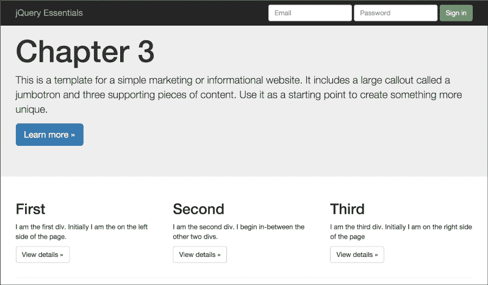

# 三、操纵 DOM

在上一章中，我们学习了如何使用 jQuery 的选择器来查找 DOM 中要查找的元素。在本章中，我们将使用这些知识首先查找元素，然后修改它们。我们将学习 jQuery 提供的不同方法，以帮助我们的网站既美观又动态。

jQuery 有三十多个方法以某种方式操纵 DOM，但不要让这个数字吓到你。所有的方法都可以很容易地分解为四个不同的类别：维度和位置、类和样式、属性和属性以及内容。与 jQuery 中的大多数内容一样，一旦深入研究，您将很快看到不同方法组之间的关联模式。

许多方法以两种模式之一运行：getter 或 setter。在 getter 模式下，该方法从元素中检索或获取值，并将它们返回给调用方。在 setter 模式下，调用方将值传递给方法，以便它可以修改匹配的元素集。我认为我们现在已经准备好从维度和位置开始。

许多方法有两种形式，只是选择器和内容的顺序不同。一个版本将采用更传统的形式，即选择器，然后是内容形式，另一个版本将采用内容，然后是选择器形式。颠倒顺序的主要原因是链接。当一个方法返回一个 jQuery 对象，该对象包含链中下一个方法所需的内容时，能够使用 content first 版本为我们提供了一个可以使用的方法。

本章将涵盖大量材料。以下是我们将深入探讨的主题：

*   尺寸和位置
*   读取屏幕和元素的大小
*   类别和风格
*   JSON 对象
*   属性和属性
*   保持图像比例
*   删除属性和属性

# 尺寸和位置

在 web 开发中，我们通常不想处理元素大小的细节，但偶尔，这样的信息会派上用场。在我们开始阅读尺码的细节之前，你需要知道一些事情。首先，只返回匹配集中第一个元素的大小。第二，读取大小会杀死 jQuery 链，因此在它之后不能有任何其他方法。最后，读取元素大小的方法不止一种。你选择的方法取决于你想知道什么。让我们以读取宽度为例。

## 示例

在上一章中，我们从一个空网页开始，添加了足够的 HTML 来解释每个方法的作用。在现实世界中，我们很少有空白的画布来工作。因此，在本章中，我们将使用一个更完整的网页，它将基于非常流行的引导 Jumbotron 模板。Bootstrap 是最流行的 CSS 框架之一，在我们的示例中使用它将帮助您熟悉现代网站设计，因为现在编写自己的 CSS 并不太常见。我们不会谈论太多关于 Bootstrap 或者它是如何工作的，但是在 Packt 出版网站上有很多关于它的好书，包括*Learning Bootstrap*。



## 开发工具

大多数现代浏览器都有一套内置的开发工具。激活工具的方式因浏览器而异。在 Internet Explorer 中，按*F12*激活开发工具。在 Chrome 和 Firefox 中，*Ctrl+Shift+I*完成了这项工作。我们将使用开发人员工具来查看控制台日志输出。通过将信息写入日志，而不是使用`alert()`方法显示，我们不会破坏网站的流量，也不会让您在允许继续之前必须响应的弹出窗口烦扰您。

大多数现代浏览器的 console 对象都会附带很多方法，但我们只关注一种方法，`log()`。我们将以最简单的形式使用`log()`方法：简单地输出字符串。我希望示例代码在任何浏览器上运行时都不会出现任何问题。

## 读取屏幕和元素的大小

有三种读取宽度的方法：`.width()`。`innerWidth()`和`.outerWidth()`。第一个方法`.width()`只返回元素的宽度。下一个方法`.innerWidth()`返回元素的宽度及其边框和填充。最后一个方法`.outerWidth()`返回元素的宽度加上边框和填充，如果传递 true，它还将包括其边距的宽度。

对于每个处理元素宽度的方法，都有一个匹配元素高度的方法。方法有`.height()`、`.innerHeight()`和`outerHeight()`。其中每一个的行为都与其对应的宽度相似。

为了确定显示的大小，您可以调用窗口的`.width()`和`.height()`方法：

```js
var screenWidth = $(window).width();
var screenHeight = $(window).height();
```

前面的代码检索指向窗口元素的 jQuery 对象。第一行代码获取窗口的宽度，第二行获取窗口的高度。

尽量不要让窗口和文档混淆。有时，它们可以给出相同的结果，但请记住，文档可能会超过窗口的大小。当它这样做时，滚动条将出现。它们并不等同。

获取屏幕元素的尺寸很好，但有时，您也需要知道它的位置。返回位置的方法只有一个，名称为`.position()`。与其他值方法一样，它会断开链，因为它返回的对象包含元素相对于其父元素位置的顶部和左侧值。

`.position()`有一个称为`.offset()`的伴生方法。它们之间的区别很重要。`.offset()`方法返回元素相对于文档的位置，而不是相对于其父元素的位置。例如，使用`.offset()`方法可以让我们比较两个具有不同父元素的元素，这与`.position()`方法几乎毫无意义。我们通常不会看到这两种方法之间的差异，除非我们使用绝对或相对定位，而不是浏览器默认的静态定位：

```js
// .position() vs. .offset()
var myPosition = $("body > .container > .row > .col-md-4:last").position();
console.log("My Position = " + JSON.stringify(myPosition));
var myOffset = $("body > .container > .row > .col-md-4:last").offset();
console.log("My Offset = " + JSON.stringify(myOffset));
```

本组最后两种方法为`.scrollLeft()`和`.scrollTop()`。这两种方法不同于 rest，因为它们都是的获取者和设定者。如果传递了参数，`.scrollLeft()`使用它设置滚动条的水平位置。`.scrollTop()`方法做了类似的事情，设置滚动条的垂直位置。这两种方法都将设置匹配集中每个元素的位置。

# 类别和风格

类别和风格组中的第一个方法是`.css()`。这个方法非常强大，说明了为什么 jQuery 是一个必需且有用的库，即使在 HTML5 浏览器时代也是如此。`.css()`方法既是一个 getter，也是一个 setter。作为 getter，它返回一个或多个计算样式属性。它将单个字符串（您要检索的 CSS 属性的名称）或表示所有 CSS 属性的字符串数组作为参数：

```js
// .css(), retrieving a single property
var backgroundColor = $(".jumbotron > .container > p > a").css("background-color");
console.log("Background Color = " + JSON.stringify(backgroundColor));
// .css(), retrieving multiple properties in a single call
var colors = $(".jumbotron > .container > p > a").css(["background-color", "color"]);
console.log("Colors = " + JSON.stringify(colors));
```

上述代码的结果如下：

**背景色=“rgb（51122183）”**

**颜色={“背景色”：“rgb（51122183）”，“颜色”：“rgb（255，255，255）”}**

## JSON 对象

大多数现代浏览器都包含 JSON 对象。JSON 和 XML 一样，是一种数据交换格式。它独立于语言，轻量级，易于理解。添加到浏览器中的 JSON 对象有两个重要的方法。第一个方法`.parse()`获取表示 JSON 对象的字符串，并将其转换为 JavaScript 对象。第二个函数`.stringify()`接受一个 JavaScript 对象并将其转换为 JSON 字符串。这些方法旨在用于序列化和反序列化对象。但是我们也可以在示例代码中使用这些方法。`.stringify()`方法可以将 JavaScript 对象呈现为字符串，我们可以将这些字符串发送到控制台。

使`.css()`方法强大的一个原因是它能够理解您以各种不同格式引用的属性。以 CSS 属性`margin-left`为例。DOM 将其称为`marginLeft`；jQuery 将这两个术语理解为同一事物。同样，它理解用于实际访问大多数浏览器调用`getComputedStyle()`的属性的浏览器方法，但不同版本的 Internet Explorer 调用`currentStyle()`或`runtimeStyle()`。

`.css()`方法的 setter 模式有几种设置属性的方法。第一种也是最简单的方法是将属性名及其新值作为参数传入：

```js
// .css(), passing a property name and value, change the button to orange
$(".jumbotron > .container > p > a").css("background-color", "orange");
```

也可以通过将值设置为空字符串，以相同的方式删除属性。我们可以更改属性的下一种方法是将它们作为键值对传递到对象中：

```js
// .css(), passing in multiple properties as an object
var moreProperties =; { "background-color": "pink", "color": "black"};
$("body > .container > .row > .col-md-4 .btn:first").css(moreProperties);
```

我们可以更改属性的最后一种方法是传入属性和函数。jQuery 使用函数的返回值设置属性。如果函数不返回任何内容或返回“undefined”，则不会更改属性的值：

```js
// .css(), setting a random background color on each call
$("body > .container > .row > .col-md-4 .btn:last").css("background-color", function (index) {
   var r = Math.floor(Math.random() * 256),
           g = Math.floor(Math.random() * 256),
           b = Math.floor(Math.random() * 256),
           rgb = "rgb(" + r + "," + g + "," + b + ")";
   return rgb;
});
```

前面的代码段使用匿名函数设置每个选定元素的背景色。该函数为每种颜色生成一个随机值，然后将它们放入一个字符串中，并返回给调用者。

当您在一个元素中只有一个或两个要更改的属性时，您可以直接调整该元素的 CSS 属性。但更好更快的方法是将所有更改放入 CSS 类中，并在元素中添加或删除类。jQuery 有四个方法可以帮助您操作分配给元素的类。

这个组的第一个方法是`.addClass()`，它向元素添加一个类。如果使用 DOM 方法分配了一个类，则必须确保该类没有被复制，但是使用`.addClass()`，如果该类已分配给元素，则不会分配两次。您不局限于一次只分配一个类。您可以添加任意数量的内容，只要确保每个内容之间有一个空格。

与许多其他 jQuery 方法一样，`.addClass()`也有一个非常酷的额外特性：它也可以接受函数。这有什么好酷的？好吧，假设你有一组按钮，你想给每个按钮一个不同的颜色等级，取决于它在集合中的位置。您可以轻松编写一个函数来处理此场景。jQuery 将两个参数传递给函数。第一个是匹配集中元素的索引。第二个参数是一个字符串，其中包含当前应用的所有类，每个类之间用空格分隔。下面是一个例子：

```js
// changes each of the buttons a different color
$("body > .container > .row > .col-md-4 .btn").addClass(function (index) {
   var styles = ["info", "warning", "danger"],
           ndx = index % 3,
           newClass = "btn-" + styles[ndx];

   return newClass;
});
```

最后，我们需要删除一个类，这就是我们使用`.removeClass()`的原因。根据您传递给它的参数，它的行为会发生变化。如果向它传递单个类名，它将删除该类。如果传递多个由空格分隔的类名，则会删除这些类。如果不传递任何参数，它将删除当前分配的所有类。如果传递的类名不存在，则不存在错误。

与`.addClass()`类似，`.removeClass()`也可以接受一个函数。jQuery 将索引作为字符串传递给函数和当前分配的所有类。要删除类，函数应返回一个字符串，其中包含要删除的所有类的名称。

如果匹配集合中的任何元素具有传递的类，`.hasClass()`方法返回`true`。如果它们都没有传递的类，则返回 false。请记住，如果您向其传递一个匹配集，该匹配集具有 100`<div>`，并且其中只有一个具有传递的类名，则该方法将返回 true：

```js
// does any of the divs have the .bosco class?
var hasBosco = $("body > .container > .row > .col-md-4").hasClass("bosco");
console.log("has bosco: " + hasBosco);
```

`.toggleClass()`方法是一种省时方便的功能。通常，我们会发现自己只是简单地添加一个不存在的类，然后删除它。这正是`.toggleClass()`创建的目的所在。您可以将一个或多个类传递给它以打开或关闭。

您还可以传递`.toggleClass()`第二个参数，即布尔值，以指示是否应添加或删除该类：

```js
// remove the info class
var shouldKeepClass = false;
$("body > .container > .row > .col-md-4 .btn").toggleClass("btn-info", shouldKeepClass);
```

与简单调用`.removeClass()`相比，它的优势在于，您可以将布尔值作为变量传入，并决定是否要在运行时添加或删除该类。

像它的兄弟一样，您也可以将函数传递给`.toggleClass()`。函数被传递一个索引，该索引是对象在匹配集中的位置、当前类名和当前状态。它返回 true 以添加类，返回 false 以删除类。

## 行为类

通常，您向元素添加一个类以影响其外观。有时，您可能需要添加一个类来影响 JavaScript 处理元素的方式。为什么要将类用于行为？这是因为类是布尔型的，元素要么有给定的类，要么没有。另一方面，属性是键值对，您需要知道属性是否存在以及它持有什么值。这通常使处理类比处理等价属性更容易，在某些情况下，语法更清晰。

# 属性和属性

在讨论处理属性和属性的方法之前，我们必须先讨论一个更大的问题：属性和属性之间的区别是什么？它们是不同的，但是如何呢？

当从 HTML 属性构造 DOM 时，将构建标记中包含的键值对。这些属性中的大多数被转换为属性，这些属性被放置在 DOM 元素节点上。需要理解的重要一点是，一旦构建了元素节点，属性将用于跟踪节点的状态，而不是属性。属性不会更新为 jQuery；如果是，JavaScript 会更改 DOM。它们表示 DOM 首次加载时的状态，这就是问题所在。考虑一个复选框：

```js
<input id="myCheckbox" type="checkbox" checked="checked" />
```

当 DOM 解析此复选框时，它会在节点上为此元素创建一个 checked 属性。它还根据 W3C 规范中规定的规则创建一个`defaultChecked`属性。属性和属性之间的区别变得很明显。无论用户单击复选框多少次。`attr()`将始终返回`checked`，因为这是解析 HTML 时的状态。另一方面，`.prop()`将根据当前实际状态从“真”变为“假”。

这个`attr()`方法从一开始就在 jQuery 中。它最初用于读取和设置属性和属性的值。这是一个错误；属性和属性是不同的，但很难理解它们之间的差异。在 jQuery1.6 中，引入了`.prop()`方法，并且`.attr()`方法的范围仅限于属性。这打破了许多使用`.attr()`方法设置属性的网站。这在 jQuery 社区中引起了相当大的骚动，但这种骚动已经平息。通常，如果您想要属性的当前值，请使用`.prop()`而不是`.attr()`。现在我们了解了属性和属性之间的区别，让我们学习如何使用这些方法。

`.attr()`方法充当属性的获取者和设置者。在 getter 表单中使用时，它将获得匹配集中第一个元素的属性。它只接受一个参数：要检索的属性的名称。在 setter 表单中使用时，它将在匹配集的所有成员上设置一个或多个属性。你可以用几种不同的方式来称呼它。第一个是字符串中的属性名及其设置值。第二种方法是向它传递一个对象，该对象包含您希望设置的所有属性值对。最后一个是一个属性名和一个函数。函数将被传递一个索引和属性的旧值。它返回所需的设置值。以下是一些例子：

```js
// setting an element attribute with an attribute and value
$("body > .container > .row > .col-md-4 .btn").attr("disabled", "disabled");
// setting an element attribute with an object
$("body > .container > .row > .col-md-4 .btn").attr({"disabled": "disabled"});
// setting an element attribute with a function
$("body > .container > .row > .col-md-4 .btn").attr("name", function(index, attribute){
   return attribute + "_" + index;
});
```

`.prop()`方法以其 getter 和 setter 形式调用，调用方式与`.attr()`方法相同。通常，在操纵图元的属性时，这是首选方法。

## 保持图像比例

使用和`.attr()`方法，您可以通过调整高度和宽度属性来调整图像的大小。如果您希望保持图像大小成比例，而不必计算宽度的正确高度，或者反之亦然，那么有一个简单的骗局。与其同时更改宽度和高度，不如删除“高度”属性并仅修改宽度。然后浏览器将自动调整高度，使其与宽度成比例匹配。

## 删除属性和属性

为了从元素中删除属性，我们使用`.removeAttr()`。您可以使用单个属性名来调用它，也可以使用由空格分隔的多个属性名来调用它。它还有一个额外的好处，即在删除属性时不会泄漏内存。

`.removeProp()`方法与`.removeAttr()`非常相似。请记住，您应该只从元素中删除自定义属性，而不是本地属性。如果删除本机属性，例如选中、禁用等，则无法将其添加回元素。您可能希望使用`.prop()`方法将其设置为 false，而不是删除该属性。

`.val()`方法主要用于从表单元素中检索值。它从输入、选择和`textarea method` 元素中获取匹配集中第一个元素的值：

```js
// retrieving data from an input tag with .val()
var firstName = $('#firstName').val();
console.log("First name:" + firstName);
var lastName = $('#lastName').val();
console.log("Last name:" + lastName);
```

从输入标记中检索值很容易，如前面的代码所示。`.val()`方法提取元素的当前字符串值。

返回的数据的类型取决于它从中检索数据的元素的类型。如果它从输入标记获取数据，则返回类型为字符串。如果选择具有多个属性的标记，则如果未选择任何项，则返回类型为 null。如果选择了一个或多个项目，则返回类型为字符串数组，数组中的每个项目都是所选选项的值：

```js
// .val() reading the value of a multiple select
var options = $('#vehicleOptions').val();
$.each(options, function (index, value) {
   console.log("item #" + index + " = " + value);
});
```

当以 setter 形式使用时，您可以将单个字符串值、字符串数组或函数传递给`.val()`。传递单个字符串是最典型的用例。它所做的正是您所期望的：它设置元素的值：

```js
// using .val() to set the last name field
$('#lastName').val("Robert");
```

将字符串数组传递给具有多属性集的 select 元素时，它首先清除以前选择的所有选项，然后选择其值与传递的数组中的值匹配的所有选项：

```js
// using .val() to select multiple new options
$('#vehicleOptions').val(["powerSeats", "moonRoof"]);
```

与其他两种方法`.attr()`和`.prop()`一样，您也可以传入函数。jQuery 将向函数发送两个参数：一个整数表示匹配集中的元素索引，另一个值表示元素的当前值。函数应该返回一个表示元素新值的字符串。

为了检索元素的 HTML 内容，我们使用`.html()`方法。它以字符串形式返回标记：

```js
// .html() getting some markup
var html = $('#testClass').html();
console.log("HTML: " + html);
```

当`.html()`被传递一个字符串时，它将匹配集的所有元素设置为新标记。您还可以将函数传递给`.html()`。该函数被传递给以下参数：一个索引和一个用于保存旧 HTML 的字符串。从保存新 HTML 的函数返回字符串：

```js
// .html() setting markup
$('#testClass').html("<div><h2>Hello there</h2></div>");
```

`.text()`方法检索匹配集中所有元素的文本内容。值得注意的是，在这方面，该方法与其他方法的操作非常不同。通常，getter 只从集合中的第一个元素获取数据。此方法将连接来自所有元素的文本，如果您没有预料到，这可能是一个令人惊讶的结果：

```js
// .text() getting text values
var comboText = $("select").text();
console.log(comboText);
```

需要注意的是，`.text()`方法用于文本，而不是 HTML。如果尝试向其发送 HTML 标记，则不会呈现该标记。例如，让我们尝试将成功发送的相同标记发送到`.html()`方法：

```js
// .text() trying to send HTML
$('#testClass').text("<div><h2>Hello there</h2></div>");
```

如果我们想添加更多的 HTML 而不是替换它，我们可以使用`.append()`和`.appendTo()`方法。它们都会将传递的内容添加到匹配集中每个元素的末尾。两者的区别在于可读性，而不是功能性。使用`.append()`时，选择器首先出现；然后是新内容。`.appendTo()`方法将其反转，以便新内容出现在选择器之前：

```js
// .append()
$("body > .container > .row > .col-md-4").append("<div><h2>Hello</h2></div>");
// .appendTo()
$("<div><h2>Goodbye</h2></div>").appendTo("body > .container > .row > .col-md-4");
```

`.prepend()`和`.prependTo()`方法与`.append()`和`.appendTo()`一样，只是内容放在每个元素的开头而不是结尾：

```js
// .prepend()
$("body > .container > .row > .col-md-4").prepend("<div><h2>Hello</h2></div>");
// .prependTo()
$("<div><h2>Goodbye</h2></div>").prependTo("body > .container > .row > .col-md-4");
```

以前的方法使新内容成为父内容的子内容。接下来的几个方法使新内容成为父内容的兄弟。`.after()`和`.insertAfter()`方法在父代之后添加新内容作为兄弟。与`.append()`和`.appendTo()`一样，两者之间的唯一区别在于内容和选择器的顺序：

```js
// .after()
$("select").after("<h2>Hello</h2>");
// .insertAfter()
$("<h2>Goodbye</h2>").insertAfter("select");
```

`.before()`和`.insertBefore()`方法将新内容添加为父元素之前的兄弟元素。同样，它们之间的唯一区别是内容和选择器的顺序：

```js
// .before()
$("select").before("<h2>Hello</h2>");
// .insertBefore()
$("<h2>Goodbye</h2>").insertBefore("select");
```

`.wrap()`方法允许您用新元素围绕匹配集的每个成员：

```js
// .wrap() surrounds the button with a border
$("a").wrap("<div style='border: 3px dotted black;'></div>");
```

此方法不应与`.wrapInner()`方法混淆。两者的区别在于`.wrap()`取匹配集的每个成员，并用新元素将其包裹起来。然而，`.wrapInner()`将匹配集合中的每个子项都用新内容包装起来。这两种方法之间的区别在示例代码中非常明显。`.wrap()`方法围绕着每个按钮，`<a>`标签上带有`role=button`，并带有虚线边框。另一方面，`.wrapInner()`方法用虚线边框包围按钮文本：

```js
// wrapInner() surrounds the button's text with a border
$("a").wrapInner("<div style='border: 3px dotted black;'></div>");
```

`.wrapAll()`方法用一个新的 HTML 元素包围匹配集中的所有元素。注意这个方法；它可以从根本上改变你的网页。如果集合中的成员广泛分离，可能会产生巨大的、甚至可能是不利的影响。使用此方法时，您肯定希望使用尽可能窄的选择器：

```js
// wrapAll() everything
$("select").wrapAll("<div style='border: 3px dotted black;'></div>");
```

这组方法的最后一个成员是`.unwrap()`。它删除匹配集的父对象。本质上，它是`.wrap()`的倒数：

```js
// .unwrap() removes the divs we added earlier
$("a").unwrap();
```

根据删除标记的主题，我们有以下方法：`.remove()`、`.empty()`和`.detatch()`。其中第一个方法`.remove()`从 DOM 中删除匹配的元素集。将删除元素及其所有子元素：

```js
// .remove() deletes the a tags from the page
$("a").remove();
```

非常密切相关的`.empty()`方法也会从 DOM 中删除内容。两者的区别在于`.empty()`删除匹配集的子元素，而`.remove()`删除匹配元素本身：

```js
// .empty() keeps the a tags but deletes their text
$("a").empty();
```

组的最后一个方法`.detached()`的行为类似于`.remove()`方法，但有一个区别：删除的内容作为一组 jQuery 对象返回给调用者。如果您需要将标记从网页的一部分移动到另一部分，这就是您的方法。不要忘记，您可以在此方法上使用链接：

```js
// .detach() deletes the a tags from the page and returns them to the caller
var myButtons = $("a").detach();
$('hr:last').append(myButtons);
```

`.replaceAll()`和密切相关的`.replaceWith()`方法都用传递的内容替换匹配集。两者之间的唯一区别是选择器和内容的顺序。在`.replaceWith()`方法中，选择器首先出现；然后是新内容。在`.replaceAll()`方法中，新内容首先出现：

```js
// .replaceWith() replacing the selects with divs
$('select').replaceWith("<div>Replaced</div>");
```

`.clone()`方法复制匹配的元素集。它复制每个元素及其所有子元素，然后将它们作为 jQuery 对象返回给调用方：

```js
// .clone() makes a copy of the form then we insert the copy 
$('.myForm').clone().insertBefore('.myForm');
```

# 总结

本章是一段相当艰苦的旅程，但希望您已经看到 jQuery 的 DOM 操作方法是经过逻辑思考的。我们学习了如何在现有元素之前和之后向页面添加内容。我们还学习了如何从页面中删除内容，甚至如何将内容从一个位置移动到另一个位置。

我们还了解到，许多 jQuery 方法有两种不同的形式，以便为我们提供一种方法来获取页面内容，并使用另一种方法进行设置。关于使用 JSON 对象保持图像比例和确定元素大小，还有一些简单但方便的信息。

尽管我们学到了很多，我们的网站仍然是静态的；在执行 JavaScript 之后，它不做任何其他事情。在下一章中，我们将改变这一点。我们将学习如何使用事件使我们的网站具有交互性。