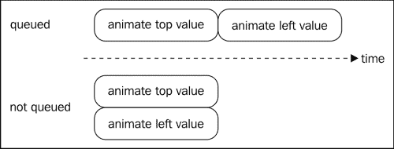
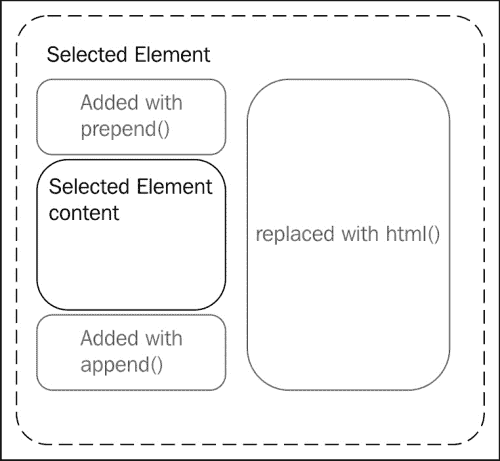

# 一、用于游戏的 jQuery

在过去几年中，jQuery 几乎已经成为任何 JavaScript 开发的默认框架。在访问量最大的前 10000 个网站中，超过 55%的网站以及大约 2400 万个互联网网站正在使用它（更多信息参见[http://trends.builtwith.com/javascript/JQuery](http://trends.builtwith.com/javascript/JQuery) 。而且这一趋势没有任何停止的迹象。

这本书希望您有一些 jQuery 的经验。如果您觉得不符合此要求，那么您可以先在*学习 jQuery*、*乔纳森·查弗*、*卡尔·斯维德伯格*、*Packt Publishing*中了解更多信息。

本章将快速介绍 jQuery 的特性，然后深入探讨其最面向游戏的功能。即使您可能已经使用了它们中的大多数，您也可能不熟悉它们的全部功能。以下是本章所述主题的详细列表：

*   jQuery 的特性
*   该功能将帮助您移动元素
*   事件处理
*   DOM 操作

# jQuery 的方式

jQuery 的理念不同于它之前的大多数其他 JavaScript 框架。理解它使用的设计模式是编写可读且高效的代码的关键。我们将在下一节中介绍这些模式。

## 连锁

大多数 jQuery 语句的形式如下：一个选择，后跟一个或多个操作。这些操作的组合方式称为链接，是 jQuery 最优雅的方面之一。使用 jQuery 的初学者如果想将元素的宽度设置为 300 像素，高度设置为 100 像素，通常会编写如下代码：

```js
$("#myElementId").width(300);
$("#myElementId").height(100);
```

使用链接，这将被写为：

```js
$("#myElementId").width(300).height(100);
```

这有许多优点：元素只被选择一次，生成的代码更紧凑，传达出的语义含义是，你想要实现的实际上只是一件事，那就是改变元素的大小。

允许链接的函数不仅可以对同一对象上的多个调用进行分组，还可以通过多种方式实际更改链上下一个函数将操作的对象。在这些情况下，典型的做法是使用缩进来传达这样的想法，即您使用的元素与之前的缩进级别不同。

例如，下面的链首先选择一个元素，然后将其背景颜色设置为`red`。然后，它将链中的元素更改为前一个元素的子元素，并将其`background-color`属性更改为`yellow`。

```js
$("#myElementId").css("background-color", "red")
   .children().css("background-color", "yellow");
```

重要的是，您始终要问自己，如何避免当前与链中上一个和下一个元素的交互，以避免出现不希望出现的行为。

## 多态性

jQuery 有自己的使用多态性的方式，并且可以多种不同的方式调用给定函数，具体取决于您希望向其提供多少信息。我们来看看`.css()`函数。如果使用`String`数据类型作为唯一参数调用，此函数将通过返回您请求的 CSS 属性的值来充当 getter。

例如，下面的行检索给定元素的左侧位置（假设它处于绝对位置）：

```js
var elementLeft = $("#myElementId").css("left");
```

但是，如果您传递第二个参数，它将开始像 setter 一样工作，并设置 CSS 属性的值。有趣的是，第二个参数也可以是一个函数。在这种情况下，函数将返回将设置为 CSS 属性的值。

下面的代码正是这样做的，并使用一个功能将元件的左侧位置增加 1：

```js
$("#myElementId").css("left", function(index, value){
   return parseInt(value)+1;
});
```

然而等等，还有更多！如果只将一个元素传递给同一个函数，但该元素是一个对象文字，那么它将被视为持有属性/值的映射。这将允许您在一次调用中更改许多 CSS 属性，如在以下示例中将左侧和顶部位置设置为 100 像素：

```js
$("#myElementId").css({
   left: 100,
   top: 100
});
```

您还可以使用字符串作为对象文本的键和值，就像在 JSON 中一样。

jQueryAPI 网站（[是查找函数调用所有方法的一个非常完整的资源 http://api.jquery.com](http://api.jquery.com) ）。

现在，我们将重点介绍开发游戏所需的几个功能。

# 移动物体

链接对动画的意义稍有不同。尽管在大多数游戏中您可能永远不需要使用 jQuery 动画功能，但看到它们的功能特性仍然很有趣，因为这可能是导致许多奇怪行为的原因。

## 链接动画

jQuery 中的`.animate()`函数允许您使属性随时间变化，从当前值变为新值。例如，典型的效果是将其从 10 像素向左移动，或更改其高度。从前面看到的和其他类型函数的经验来看，您可能希望下面的代码使 div（DOM division 元素）沿对角线方向移动到位置`left = 200px`和`top = 200px`。

```js
$("#myElementId").animate({top: 200}).animate({left: 200});
```

然而，事实并非如此！您将看到的是 div 首先移动到`top = 200px`，然后才移动到`left = 200px`。这叫做排队；对`animate`的每次调用都将排入前一次调用的队列，并且只有在它们全部完成后才会执行。如果您希望同时执行两个移动，从而生成对角线移动，则只需使用一个对`.animate()`的调用。

```js
$("#myElementId").animate({top: 200,left: 200});
```

另一种可能是明确告知`.animate()`函数不要将动画排队：

```js
$("#myElementId").animate({top: 200}).animate({left: 200},{queue: false});
```

请记住，这也适用于实际上是围绕`.animate()`函数包装的其他函数，例如：

*   `fadeIn()`、`fadeOut()`和`fadeTo()`
*   `hide()`和`show()`
*   `slideUp()`和`slideDown()`



## 管理队列

以下是可用于操作此动画队列的函数列表。

### .停止（）

`.stop()`功能停止队列的当前动画。如果为调用提供更多参数，还可以清除队列，并定义元素是否应停止设置动画并保持不变，或跳转到其目标。

### .clearQueue（）

`.clearQueue()`功能从队列中删除所有动画；不仅是当前的一个，而且是所有下一个。

### .出列（）

`.dequeue()`功能启动队列中的下一个动画。这意味着，如果调用此函数时正在执行动画，则新动画将在当前动画执行完毕时启动。例如，如果我们以本节开头的示例为例，在末尾添加一个`dequeue()`函数，元素实际上将开始沿对角线移动。

```js
$("#myElementId")
.animate({top: 200})
.animate({left: 200})
.dequeue();
```

### .延迟（）

`.delay()`功能允许您在队列中的两个动画之间插入暂停。例如，如果要使用`.fadeIn()`使某个元素可见，请等待 2 秒钟，然后使用`.fadeOut()`使其再次消失。这应该是这样写的：

```js
$("#myElementId").fadeIn().delay(2000).fadeOut();
```

## 队列的其他用途

队列不仅仅用于动画。如果不另行指定，则这些函数操作的队列为`fx`队列。这是动画使用的默认队列。但是，如果您愿意，您可以创建另一个队列，并添加任意数量的自定义函数和延迟，以在游戏中编写一些与时间相关的行为。

# 事件处理

如果您以前使用过 jQuery，那么您可能在某个时候使用过`.click()`。它用于定义将响应 jQuery 中鼠标单击的事件处理程序。还有很多，从键盘输入、表单提交和窗口大小调整，但我们将不讨论所有这些。相反，我们将关注处理 jQuery 中事件的更“低级”的函数，并准确地解释它们之间的细微差别。

您通常会使用其中的一些功能来实现对游戏的控制，或者使用鼠标或键盘输入。

## .bind（）

`.bind()`功能是处理事件的基本方式。例如，`.click()`只是一个包裹。以下示例中的两行具有完全相同的效果：

```js
$("#myElementId").click(function(){alert("Clicked!")});
$("#myElementId").bind('click', function(){alert("Clicked!")});
```

然而，`bind`的用法有一个限制。与所有其他 jQuery 函数一样，它只应用于选定的元素。现在，想象一下这样一种情况：每次用户单击与给定类的链接时，您都希望执行一些任务。你可以这样写：

```js
$(".myClass").click(function(){/** do something **/});
```

这将按预期工作，但仅适用于网页执行时存在的链接。如果使用 Ajax 调用更改页面内容，并且新内容还包含与此类的链接，该怎么办？您将不得不再次调用这行代码来增强新链接！

这远远不够理想，因为您必须手动跟踪您定义的所有事件处理程序，这些事件处理程序可能需要稍后再次调用，以及更改页面内容的所有位置。这个过程很可能出错，最终会出现一些不一致的情况。

这个问题的解决方案是`.delegate()`，这将在下一节中详细说明。

## .代表（）

通过`.delegate()`，您将处理事件的责任交给父节点。这样，以后作为子节点添加到此节点的所有元素（无论是否直接在其下）仍将看到相应的处理程序执行。

下面的代码修复了前面的示例，使其能够与后面添加的链接一起工作。这意味着所有这些链接都是具有`ID`属性为`page`的 div 的子级。

```js
$("#page").delegate(
".myClass", 
"click", 
function(){/** do something **/});
```

这是一种非常优雅的解决问题的方法，在创建游戏时非常方便，例如，在你点击精灵的地方。

## 删除事件处理程序

如果需要删除事件处理程序，只需使用`.unbind()`和`.undelegate()`函数即可。

## jQuery 1.7

在 jQuery 1.7 中，`.delegate()`和`.bind()`已被`.on()`替换为（以及`.off()`以移除处理程序）。将其视为一个具有类似于`.bind()`行为能力的`.delegate()`函数。如果您了解`.delegate()`的工作原理，使用`.on()`就不会有问题。

# 将数据与 DOM 元素关联

比如说你为游戏中的每个敌人创建了一个 div 元素。你可能会想把它们和一些数值联系起来，比如它们的生命。如果您正在编写面向对象的代码，您甚至可能想要关联一个对象。

jQuery 提供了一个简单的方法来实现这一点，即`.data()`。此方法接受一个键和一个值。如果以后仅使用键调用它，它将返回值。例如，以下代码将 ID 为`enemy3`的元素的数值`3`与键`"numberOfLife"`相关联。

```js
 $("#enemy3").data("numberOfLife", 3);
```

您可能会想，“为什么不直接将值存储在 DOM 元素上？”。这是一个很好的答案。通过使用`.data()`，您可以完全解耦您的值和 DOM，这将更容易避免垃圾收集器无法释放与已删除元素的 DOM 相关联的内存的情况，因为您仍然在某处保留对它的循环引用。

如果您使用 HTML5 数据属性（[定义了一些值 http://ejohn.org/blog/html-5-data-attributes/](http://ejohn.org/blog/html-5-data-attributes/) ，`.data()`函数也会检索它们。

但是，您必须记住，调用此函数会带来一些性能代价，如果要为元素存储多个值，则可能需要将所有值存储在与单个键关联的对象文字中，而不是将多个值存储在与各自键关联的对象文字中。

# 操纵 DOM

在使用 jQuery 创建游戏时，您将花费相当多的时间向 DOM 添加和删除节点。例如，您可以创建新的敌人或移除死亡的敌人。在下一节中，我们将介绍您将要使用的函数，并了解它们是如何工作的。

## .append（）

此功能允许您将子元素添加到当前选定的元素中。它将一些已经存在的 DOM 元素、包含描述元素（或整个元素层次结构）的 HTML 代码的字符串或选择某些节点的 jQuery 元素作为参数。例如，如果您想将一个子节点添加到 ID 为`"content"`的节点中，您可以编写：

```js
$("#content").append("<div>This is a new div!</div>");
```

请记住，如果您给这个函数一个字符串，那么必须对内容进行解析，如果您太频繁或对非常大的字符串进行解析，可能会出现一些性能问题。

## .prepend（）

此函数的工作方式与`.append()`完全相同，但将新内容添加到所选元素的第一个子元素之前，而不是最后一个子元素之后。

## .html（）

此函数允许您使用作为参数传递的字符串完全替换所选节点的内容。如果在没有参数的情况下调用，它将返回第一个选定元素的当前 HTML 内容。

如果使用空字符串调用，则将删除节点的所有内容。这也可以通过调用`.empty()`来实现。



## .删除（）

此函数将简单地删除所有选定的元素，并注销所有关联的事件处理程序和数据。

## .detach（）

在某些情况下，您可能只想在短时间内删除某些内容，然后再添加。这通常是`.remove()`做得太好的情况。您真正想要的是保留与节点关联的所有其他内容，以便在以后添加这些内容时，它们将像以前一样工作。`.detach()`正是针对这种情况创建的。它的行为类似于`.remove()`，但允许您轻松地重新插入元素。

# 保持好奇心，我的朋友！

就这样。我真的鼓励您阅读每个函数的 API，因为这里仍然有一些参数集没有显示出来。如果对这些功能中的任何一个还不清楚，请毫不犹豫地在网上查找更多关于如何使用它们的示例。由于 jQuery 是如此受欢迎的库，而且 Web 文化是开放的，您很容易在网上找到很多帮助。

以下是一些您可以开始查找有关 jQuery 的更多信息的地方：

*   jQuery 的 API:[http://api.jquery.com/](http://api.jquery.com/)
*   学习 jQuery：[http://www.learningjquery.com/](http://www.learningjquery.com/)

# 总结

在本章中，我们看到了一些用于游戏开发的最有用的 jQuery 函数，以及如何使用它们。现在您应该已经熟悉 jQuery 的原理和语法了。在下一章中，我们将把学到的知识应用到实践中，并创建我们的第一个游戏。