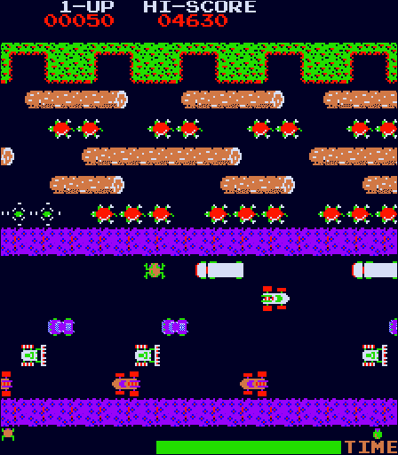
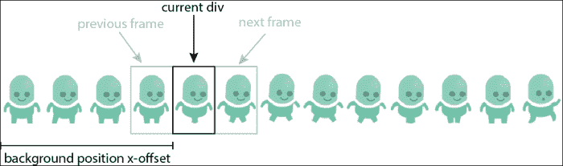
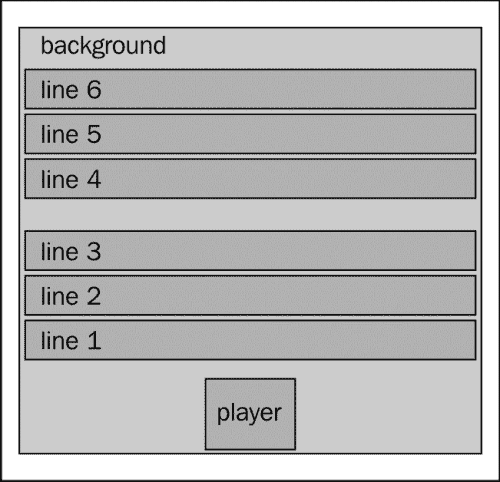
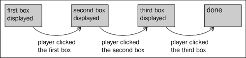

# 二、创建我们的第一个游戏

如果你把眼睛放在一个电子设备上，很可能有一个浏览器在上面运行！你可能在你的每台电脑上都安装了不止一台，在你的便携式设备上运行着更多。如果您想以最低的入门成本将游戏分发给广大观众，那么在浏览器中运行游戏是非常有意义的。

Flash 在很长一段时间内一直是浏览器中的游戏平台，但在过去几年中，它的速度一直在下降。原因有很多，关于这是否是一件好事的争论也不计其数。然而，大家一致认为，现在可以让游戏在浏览器中以合理的速度运行，而无需插件。

本书将重点介绍 2D 游戏，因为它们在当前浏览器上运行良好，并且它们所依赖的功能是标准化的。这意味着浏览器的更新不应该破坏你的游戏，而且在大多数情况下，你不必太担心浏览器之间的差异。

不过，在不久的将来，您将能够开发现代 3D 游戏，就像在游戏机上开发并在浏览器上运行游戏一样。如果这就是你成功的原因，本书将为你提供制作这些游戏所需的基础知识。

在本章中，我们将介绍以下主题：

*   创建动画精灵
*   移动精灵
*   预加载资产
*   使用有限状态机实现主游戏循环
*   基本碰撞检测

# 这本书是怎么写的？

制作游戏有这样一个惊人的优势，你可以立即看到你刚刚编写的代码的结果。这就是为什么你在这本书中所学到的一切将直接应用于一些实际例子的原因。在本章中，我们将一起编写一个小游戏，灵感来自经典的*蛙人*。在接下来的章节中，我们将制作一个平台和一个角色扮演游戏（RPG）。

我真的鼓励您编写您自己的游戏版本，并修改提供的代码以查看其效果。没有比把手弄脏更好的学习方法了！

# 让我们认真一点——游戏

我们现在要实现的游戏是受*青蛙*的启发。在这个老式的街机游戏中，你扮演了一只青蛙的角色，它试图在圆木上跳跃，避开汽车，试图穿过屏幕。



在我们的版本中，玩家是一个开发者，他必须通过跳转数据包跨越网线，然后通过避免 bug 穿越浏览器“道路”。综上所述，游戏规格如下：

*   如果玩家按一次向上箭头键，“青蛙”将前进一步。
*   按左右箭头键，玩家可以水平移动。
*   在第一部分（网线），玩家必须跳到屏幕左侧的数据包上，然后向右移动。分组被组织成若干行，其中每条行的分组以不同的速度移动。一旦玩家在包上，他/她就会跟着包移动。如果一个数据包将玩家带出屏幕，或者如果玩家跳到电缆上而没有到达数据包，他/她将死亡并再次从同一关卡开始。
*   在第二部分（浏览器部分），玩家必须穿过浏览器屏幕，避免左侧出现错误。如果玩家被虫子击中，他/她将再次从同一关卡开始。

这些都是非常简单的规则，但正如你们将看到的，它们已经给了我们很多东西去思考。

# 学习基础知识

在本书中，我们将使用 DOM 元素来渲染游戏元素。另一个流行的解决方案是使用 Canvas 元素。这两种技术都有优点和缺点，而且只有 DOM 元素不可能产生一些效果。

然而，对于初学者来说，DOM 的优点是易于调试，可以在几乎所有现有的浏览器上工作（是的，甚至在 InternetExplorer6 上），并且在大多数情况下可以为游戏提供合理的速度。DOM 还抽象了一项肮脏的工作，即必须以单个像素为目标，并跟踪屏幕的哪些部分必须重新绘制。

尽管 Internet Explorer 支持我们将在本书中看到的大多数功能，但我不建议创建支持它的游戏。事实上，如今它的市场份额微不足道（[http://www.ie6countdown.com/](http://www.ie6countdown.com/) ），您将遇到一些性能问题。

现在从一些游戏术语来看，精灵是游戏中移动的一部分。它们可能是动画的或非动画的（在改变它们的外观而不是简单地四处移动的意义上）。游戏的其他部分可能包括背景、用户界面和瓷砖（我们将在[第 4 章](04.html "Chapter 4. Looking Sideways")、*侧视*中对此进行详细介绍）。

## 框架

在这本书中，我们将编写一些代码；部分代码属于示例游戏，用于描述特定场景或逻辑。但是，有些代码很可能会在您的每个游戏中重复使用。出于这个原因，我们将把其中一些函数重新组合成一个框架，我们将巧妙地简称为`gameFramework`或`gf`。

### 提示

**下载示例代码**

您可以下载您在[账户购买的所有 Packt 书籍的示例代码文件 http://www.packtpub.com](http://www.packtpub.com) 。如果您在其他地方购买了本书，您可以访问[http://www.packtpub.com/support](http://www.packtpub.com/support) 并注册，将文件直接通过电子邮件发送给您。

在 JavaScript 中定义名称空间的一种非常简单的方法是创建一个对象，并将所有函数直接添加到该对象中。下面的代码为您提供了一个示例，说明名称空间`cocktail`中的两个函数`shake`和`stir`的情况。

```js
// define the namespace
var cocktail = {};

// add the function shake to the namespace
cocktail.shake = function(){...}

// add the function stir to the namespace
cocktail.stir = function(){...}
```

这样做的好处是避免了与其他为其对象或函数使用类似名称的库发生冲突。因此，从现在开始，当您看到任何添加到名称空间的函数时，这将意味着我们认为这些函数将被本书稍后创建的其他游戏使用，或者您可能希望自己创建。

下面的代码是名称空间的另一种表示法。你使用哪一个是个人喜好，你应该真正使用你觉得合适的那个！

```js
var cocktail = {

    // add the function shake to the namespace
   shake: function(){...},

   // add the function stir to the namespace
   stir: function(){...}
};
```

通常，您会将框架的代码保存在一个 JS 文件中（比如`gameFramework.js`），将游戏的代码保存在另一个 JS 文件中。一旦游戏准备好发布，您可能希望将所有 JavaScript 代码重新组合到一个文件中（如果愿意，包括 jQuery），并将其最小化。然而，对于整个开发阶段，将它们分开会更方便。

## 精灵

精灵是你游戏的基本基石。它们基本上是可以在屏幕上设置动画和移动的图像。要创建它们，可以使用任何图像编辑器。如果你在 OSX 上工作，我发现有一个免费的做得特别好，Pixen（[http://pixenapp.com/](http://pixenapp.com/) ）。

有许多方法可以使用 DOM 绘制精灵。最明显的是使用`img`元素。这会造成一些不便。首先，如果您想为图像设置动画，您有两个选项，这两个选项都有的缺点：

*   可以使用动画 GIF。使用这种方法，您无法通过 JavaScript 访问当前帧的索引，也无法控制动画何时开始播放或何时结束。此外，拥有许多动画 GIF 往往会让事情慢很多。
*   您可以更改图像的源。这已经是一个更好的解决方案，但如果提出，性能会更差，并且需要大量单独的图像。

另一个缺点是不能选择只显示图像的一部分；每次都必须显示整个图像。最后，如果你想让一个精灵由一个重复的图像组成，你必须使用许多`img`元素。

为了完整起见，我们应该在这里提到`img`的一个优点；调整`img`元素的宽度和高度非常容易。

建议的解决方案使用定义维度的简单 div，并在背景中设置图像。要生成动画精灵，您可以更改背景图像，但我们使用背景位置 CSS 属性。这种情况下使用的图像称为 sprite sheet，通常类似于以下屏幕截图：


生成动画的机制如以下屏幕截图所示：



另一个优点是，您可以使用单个精灵工作表来保存多个动画。这样可以避免加载许多不同的图像。根据具体情况，您可能仍然希望使用多张 sprite 图纸，但最好尽量减少它们的数量。

### 实现动画

实现这个解决方案非常简单。我们将使用`.css()`更改背景属性，并使用简单的`setInterval`更改动画的当前帧。因此，假设我们有一个精灵表，其中包含一个行走循环的 4 帧，其中每帧测量 64×64 像素。

首先，我们只需创建一个`div`，以精灵表为背景。这个`div`应该是 64 乘 64 像素，否则下一帧会泄漏到当前帧上。在下面的示例中，我们将精灵添加到 ID 为`mygame`的`div`中。

```js
$("#mygame").append("<div id='sprite1'>");
$("#sprite1").css("backgroundImage","url('spritesheet1.png')");
```

由于默认情况下背景图像与`div`的左上角对齐，因此我们将只看到“行走循环精灵”页面的第一帧。我们想要的是能够改变什么样的画面是可见的。下面的函数根据传递给它的参数将背景位置更改为正确的位置。查看以下代码以了解参数的确切含义：

```js
/**
 * This function sets the current frame. 
 * -divId: the Id of the div from which you want to change the
 *         frame
 * -frameNumber: the frame number
 * -frameDimension: the width of a frame
 **/
gameFramework.setFrame = function(divId,frameNumber, frameDimension) {
   $("#"+divId)
      .css("bakgroundPosition", "" + frameNumber * frameDimension + "px 0px");
}
```

现在我们必须定期调用来制作动画。我们将以 60 毫秒的间隔使用`setInterval`，即每秒 17 帧左右。这应该足够给人步行的感觉；然而，这真的需要微调，以匹配您的雪碧表。为此，我们使用一个匿名函数传递给`setInterval`，该函数将使用正确的参数调用我们的函数。

```js
var totalNumberOfFrame = 4;
var frameNumber = 0;
setInterval(function(){
 gameFramework.setFrame("sprite1",frameNumber, 64);
   frameNumber = (frameNumber + 1) % totalNumberOfFrame;
}, 60);
```

你可能注意到我们正在做一些特殊的事情来计算当前帧。目标是覆盖从 0 到 3 的值（因为它们是 4 帧），并在达到 4 时循环回 0。我们用于此的运算称为模（`%`），它是整数除法（也称为欧几里德除法）的其余部分。

例如，在第三帧，我们有 3/4，它等于 0 加上 3 的余数，所以 3%4=3。当帧数达到 4 时，我们有 4/4=1 加上 0 的余数，因此 4%4=0。这种机制在很多情况下都会用到。

### 为我们的框架添加动画

正如您所看到的生成动画需要越来越多的变量：图像的 URL、帧数、它们的尺寸、动画的速率和当前帧。此外，所有这些变量都与一个动画相关联，因此如果我们需要第二个动画，我们必须定义两倍的变量。

显而易见的解决方案是使用对象。我们将创建一个动画对象，它将保存我们需要的所有变量（目前，它不需要任何方法）。这个对象和属于我们框架的所有东西一样，将位于`gameFramework`名称空间中。我们将使用单个对象文字，而不是将动画的每个属性的所有值作为参数，所有未定义的属性将默认为一些经过深思熟虑的值。

为此，jQuery 提供了一个非常方便的方法：`$.extend`。这是一个非常强大的方法，您真的应该看看 API 文档（[http://api.jquery.com/](http://api.jquery.com/) 看看它能做什么。在这里，我们将向它传递三个参数：第一个参数将用第二个参数的值扩展，结果对象将用第三个参数的值扩展。

```js
/**
 * Animation Object.
 **/
gf.animation = function(options) {
    var defaultValues = {
        url : false,
        width : 64,
        numberOfFrames : 1,
        currentFrame : 0,
        rate : 30
    };
    $.extend(this, defaultValues, options);
}
```

要使用此函数，我们只需创建一个具有所需值的新实例。在这里，您可以看到前面示例中使用的值：

```js
var firstAnim = new gameFramework.animation({
   url: "spritesheet1.png",
   numberOfFrames: 4,
   rate: 60
});
```

如您所见，我们不需要指定`width:``64`，因为它是默认值！这种模式非常方便，每次需要默认值时都应该记住它，并且可以灵活地覆盖它们。

我们可以重写函数以使用动画对象：

```js
gf.setFrame = function(divId, animation) {
    $("#" + divId)
        .css("bakgroundPosition", "" + animation.currentFrame * animation.width + "px 0px");
}
```

现在我们将基于我们已经看到的技术为我们的框架创建一个函数，但是这次它将使用新的动画对象。此函数将开始设置精灵动画，一次或循环中的。有一件事我们必须小心，如果我们为已经设置动画的精灵定义动画，我们需要停用当前动画并用新动画替换它。

为此，我们需要一个数组来保存所有间隔句柄的列表。然后我们只需要检查这个精灵是否存在并清除它，然后再次定义它。

```js
gf.animationHandles = {};

/**
 * Sets the animation for the given sprite.
 **/
gf.setAnimation = function(divId, animation, loop){
    if(gf.animationHandles[divId]){
        clearInterval(gf.animationHandles[divId]);
    }
    if(animation.url){
        $("#"+divId).css("backgroundImage","url('"+animation.url+"')");
    }
    if(animation.numberOfFrame > 1){
        gf.animationHandles[divId] = setInterval(function(){
            animation.currentFrame++;
            if(!loop && currentFrame > animation.numberOfFrame){
                clearInterval(gf.animationHandles[divId]);
                gf.animationHandles[divId] = false;
            } else {
                animation.currentFrame %= animation. numberOfFrame;
                gf.setFrame(divId, animation);
            }
        }, animation.rate);
    }
}
```

这将提供一种方便、灵活且相当高级的方式来设置精灵的动画。

## 四处移动精灵

既然我们知道了如何给一个精灵制作动画，我们需要将它移动到使它变得有趣。有几件事是必要的；首先，我们使用的 div 必须绝对定位。这一点非常重要，原因有二：

*   一旦场景变得复杂，开发人员就要操纵其他定位，这是一场噩梦。
*   这是迄今为止浏览器计算元素位置的最不可扩展的方式。

然后我们想要的是精灵相对于游戏中的 div 进行定位。这意味着它也必须是绝对的、相对的或固定的。

一旦满足这两个条件，我们就可以简单地使用`top`和`left`CSS 属性来选择精灵在屏幕上出现的位置，如下面的屏幕截图所示：


以下代码为 container div 设置了正确的参数并添加了精灵：

```js
$("#mygame").css("position", "relative").append("<div id='sprite1' style='position: absolute'>");
```

由于我们将大量使用这段代码，因此，如果它不重要，我们将把它考虑到框架事件的函数中。正如我们对动画构造函数所做的那样，我们将使用对象文字来定义可选参数。

```js
/**
 * This function adds a sprite the div defined by the first argument
 **/
gf.addSprite = function(parentId, divId, options){
    var options = $.extend({
        x: 0,
        y: 0,
        width: 64,
        height: 64
    }, options);

    $("#"+parentId).append("<div id='"+divId+"' style='position: absolute; left:"+options.x+"px; top: "+options.y+"px; width: "+options.width+"px ;height: "+options.height+"px'></div>");
}
```

然后我们将编写一个函数，沿 x 轴移动一个精灵，沿 y 轴移动另一个精灵。图形编程中的一个典型惯例是 x 轴从左到右，y 轴从上到下。这些函数将获取要移动的元素的 ID 和移动到的位置。为了模仿某些 jQuery 函数的工作方式，如果不提供第二个参数，我们的函数将返回精灵的当前位置。

```js
/**
 * This function sets or returns the position along the x-axis.
 **/
gf.x = function(divId,position) {
    if(position) {
        $("#"+divId).css("left", position); 
    } else {
        return parseInt($("#"+divId).css("left")); 
    }
}
/**
 * This function sets or returns the position along the y-axis.
 **/
gf.y = function(divId,position) {
    if(position) {
        $("#"+divId).css("top", position); 
    } else {
        return parseInt($("#"+divId).css("top")); 
    }
}
```

有了这三个简单的功能，您就拥有了生成游戏图形所需的所有基本工具。

## 预压

然而，在大多数情况下，最后一件事是必须的；资产加载。为了避免在加载某些图像之前启动游戏，您需要在加载之前加载它们。大多数用户希望游戏只有在他们决定启动时才开始加载。此外，他们还需要一些关于加载过程进度的反馈。

在 JavaScript 中，您可以为每个图像定义一个函数，该函数将在图像完成加载后调用。但是，这有一个限制，即它不会向您提供有关其他图像的信息。您不能简单地为开始运行的最后一个图像定义回调，因为您无法保证图像加载的顺序，而且在大多数情况下，图像不会一个接一个地加载，而是一次加载一堆。

有许多可能的解决办法，其中大多数都同样好。由于此代码在大多数情况下只运行一次，并且在游戏开始之前运行，因此性能在这里并不重要。您真正想要的是一个健壮、灵活的系统，以了解何时加载所有图像以及跟踪总体进度的可能性。

我们的解决方案将使用两个函数：一个用于将图像添加到要预加载的图像列表中，另一个用于启动预加载。

```js
gf.imagesToPreload = [];

/**
 * Add an image to the list of image to preload
 **/
gf.addImage = function(url) {
    if ($.inArray(url, gf.imagesToPreload) < 0) {
        gf.imagesToPreload.push();
    }
    gf.imagesToPreload.push(url);
};
```

第一个功能做的不多。它只需获取一个 URL，检查它是否已经存在于存储要预加载的图像的数组中，如果新图像不在数组中，则添加它。

下一个函数需要两次回调。加载所有图像后，将调用第一个，并使用当前进度百分比调用第二个（如果已定义）。

```js
/**
 * Start the preloading of the images.
 **/
gf.startPreloading = function(endCallback, progressCallback) {
    var images = [];
    var total = gf.imagesToPreload.length;

    for (var i = 0; i < total; i++) {
        var image = new Image();
        images.push(image);
        image.src = gf.imagesToPreload[i];
    }
    var preloadingPoller = setInterval(function() {
        var counter = 0;
        var total = gf.imagesToPreload.length;
        for (var i = 0; i < total; i++) {
            if (images[i].complete) {
                counter++;
            }
        }
        if (counter == total) {
            //we are done!
            clearInterval(preloadingPoller);
            endCallback();
        } else {
            if (progressCallback) {
                count++;
                progressCallback((count / total) * 100);
            }
        }
    }, 100);
}; 
```

在这个函数中，我们首先为添加到列表中的每个 URL 定义一个新的`Image`对象。它们将自动开始加载。然后我们定义一个函数，我们将定期调用它。它将使用图像的`complete`属性来检查是否加载了每个图像。如果加载的图像数等于图像总数，则表示我们已完成预加载。

有用的是自动将用于动画的图像添加到预加载列表中。为此，我们只需在动画对象的末尾按以下方式添加三条线：

```js
gf.animation = function(options) {
    var defaultValues = {
        url : false,
        width : 64,
        numberOfFrames : 1,
        currentFrame : 0,
        rate : 30
    };
    $.extend(this, defaultValues, options);
    if(this.url){
        gf.addImage(this.url);
    }
}
```

# 初始化游戏

游戏的框架部分已经完成。现在我们要实现图形和游戏逻辑。我们可以将游戏代码分为两部分，一部分在开始时只执行一次，另一部分定期调用。我们将第一个称为初始化。

该部分应在图像加载完成后立即执行；这就是我们将其作为`startPreloading`函数的结束回调传递的原因。这意味着在开始时，我们需要将所有要使用的图像添加到预加载列表中。然后，一旦用户启动游戏（例如，通过单击 ID 为`startButton`的图像），我们将调用预加载程序。

下面的代码使用标准 jQuery 方式在页面准备就绪后执行函数。我不会在这里给你完整的代码，因为其中有些代码是重复的，但我会给出至少一个在这里执行的每个操作的示例，如果你好奇的话，你可以随时查看完整的源代码。

```js
$(function() {
    var backgroundAnim = new gf.animation({
        url : "back.png"
    });
    var networkPacketsAnim = new gf.animation({
        url : "packet.png"
    });
    var bugsAnim = new gf.animation({
        url : "bug.png"
    });
    var playerAnim = new gf.animation({
        url : "player.png"
    });

    var initialize = /* we will define the function later */

   $("#startButton").click(function() {
         gf.startPreloading(initialize);
       });
});
```

下面列出了在初始化函数中需要执行的操作：

*   创建组成游戏场景的精灵
*   创建 GUI 元素

下图显示了我们将如何构建游戏场景：



最多八个精灵：一个用于背景，一个用于播放器，三个用于网络数据包，三个用于 bug。为了使事情更简单，我们将只为每个包/错误带使用一个精灵。三组数据包将具有相同的动画，三组错误的动画相同。

为了避免在添加元素时使元素弹出，我们将首先将它们添加到一个不可见元素中，并使该元素仅在创建所有精灵后可见。

唯一的 GUI 元素将是一个小的`div`，其中包含玩家的生命数。

```js
var initialize = function() {
    $("#mygame").append("<div id='container' style='display: none; width: 640px; height: 480px;'>");
    gf.addSprite("container","background",{width: 640, height: 480});
    gf.addSprite("container","packets1",{width: 640, height: 40, y: 400});
    /* and so on */
    gf.addSprite("container","player",{width: 40, height: 40, y: 440, x: 260});

    gf.setAnimation("background", backgroundAnim);
    gf.setAnimation("player", playerAnim);
    gf.setAnimation("packets1", networkPacketsAnim);
    /* and so on */    

    $("#startButton").remove();
    $("#container").append("<div id='lifes' style='position: relative; color: #FFF;'>life: 3</div>").css("display", "block");
    setInterval(gameLoop, 100);
}
```

此函数的最后一行是启动主循环。主循环是将定期执行的代码。它包含大部分（如果不是全部的话）游戏逻辑，这些逻辑不会立即依赖于玩家的输入。

# 主回路

主回路通常将包含**有限****状态****机器****（FSM）**。FSM 由一系列状态和从一个状态到另一个状态的转换列表定义。一个简单游戏的 FSM，玩家必须点击三个框，然后依次出现，如下图所示：



当你实现一个 Ty0 T0 的 FSM 时，你真的需要考虑两件事：游戏应该如何在每个状态下运行，以及什么条件使游戏过渡到新的状态。FSM 的优势在于，它提供了一种组织游戏逻辑的正式方式。这将使您的代码更容易阅读，如果需要，您可以在以后添加/或更改逻辑。我建议您首先为您的游戏绘制 FSM，并将其保存在某个地方，以帮助您调试游戏。

我们的*蛙人*游戏有 10 个州。初始状态为`START`，两个最终状态为`GAMEOVER`和`WON`。以下是对每个州发生的情况的描述：

*   所有状态：数据包和 bug 向右移动
*   `STARTPOS`：没有什么特别的事情发生
*   `LINE1`：播放器以与第一行数据包相同的速度移动；如果玩家离开屏幕，它将死亡并返回到`START`
*   `LINE2`：播放器以与第二行数据包相同的速度移动，如果播放器离开屏幕，它将死亡并返回到`START`
*   `LINE3`：播放器以与第三行数据包相同的速度移动，如果播放器离开屏幕，它将死亡并返回到`START`
*   `REST`：没有什么特别的事情发生
*   `LINE4`：如果玩家被线路上的错误击中，它将死亡并返回`REST`
*   `LINE5`：如果玩家被线路上的错误击中，它将死亡并返回`REST`
*   `LINE6`：如果玩家被线路上的错误击中，它将死亡并返回`REST`
*   `WON`和`GAMEOVER`：没有什么特别的事情发生

在除`WON`和`GAMEOVER`之外的所有状态下，玩家都可以移动。这将触发以下转换：

*   成功跳转：转到下一个状态
*   成功左/右滑动：保持相同状态
*   左/右幻灯片跳转失败：如果剩余生命数大于零，则返回到最后一个“安全”状态（`START`或`REST`，否则转换到`GAMEOVER`

## 主循环实现

编写 FSM 最易读的方法是使用 switch 语句。我们将使用两个，一个在主循环中更新游戏，另一个在处理键盘输入的部分。

下面的代码是主循环的摘录。我们首先启动几个变量来定义游戏的行为，然后对前一节中描述的 FSM 进行编码。为了移动数据包和 bug，我们将使用一个技巧，只需更改`background-position`。与我们之前编写的函数相比，这是一个不太灵活的解决方案，但在这种情况下，它的速度更快，并且很容易给人一种印象，即使用一个 sprite 可以生成无限多的元素。

```js
var screenWidth = 640;
var packets1 = {
    position: 300,
    speed: 3
}
/* and so on */

var gameState = "START";

var gameLoop = function() {
    packets1.position += packets1.speed;
    $("#packets1").css("background-position",""+ packets1.position +"px 0px");

   /* and so on */

    var newPos = gf.x("player");
    switch(gameState){
        case "LINE1":
            newPos += packets1.speed;
            break;
        case "LINE2":
            newPos += packets2.speed;
            break;
        case "LINE3":
            newPos += packets3.speed;
            break;
    }
    gf.x("player", newPos);
};
```

此时，游戏将显示所有移动部件。玩家仍然无法控制自己的化身。为此，我们将使用`keydown`事件处理程序。我们将实现两种不同的解决方案来移动精灵。对于水平移动，我们将使用前面编写的`gf.x`函数。这是有意义的，因为这是一个非常小的动作，但对于垂直跳跃，我们将使用`$.animate`让化身以许多步骤移动到目的地，并创建一个更流畅的动作。

```js
$(document).keydown(function(e){
        if(gameState != "WON" && gameState != "GAMEOVER"){
            switch(e.keyCode){
                case 37: //left
                    gf.x("player",gf.x("player") - 5);
                    break;
                case 39: // right
                    gf.x("player",gf.x("player") + 5);
                    break;
                case 38: // jump
                    switch(gameState){
                        case "START":
                            $("#player").animate({top: 400},function(){
                                gameState = "LINE1";
                            });
                            break;
                        case "LINE1":
                            $("#player").animate({top: 330},function(){
                                gameState = "LINE2";
                            });
                            break;
                        /* and so on */
                        case "LINE6":
                            $("#player").animate({top: 0},function(){
                                gameState = "WON";
                                $("#lifes").html("You won!");
                            });
                            break;
                    }
            }
        }
    });
```

在这里，我们开始检查游戏的状态，以确保玩家可以移动。然后我们检查按下了哪个键。左边和右边的部分是不言自明的，但是跳转部分更微妙。

我们需要检查游戏状态，找出玩家应该跳到哪里。然后我们使用一个回调函数传递给`animate`函数，以便仅在动画完成后更新游戏状态。

就这样，你现在可以控制玩家了。如果你跳到一个包上，玩家会跟着它移动，当你到达终点时，你将赢得比赛。然而，你可能已经注意到我们忘记了一件重要的事情：玩家没有办法死！要添加此功能，我们需要检测玩家是否在安全的地方。

# 碰撞检测

我们将使用某种类型的碰撞检测，但是一个非常简单的版本只针对这种情况设计。在后面的章节中，我们将看到更多的通用解决方案，但这里没有必要这样做。

在这个游戏中，碰撞检测有六个点很重要；第一部分是三行数据包，第二部分是三行 bug。两者都代表了完全相同的情况。有一系列元素被一些空白隔开。每个元素之间的距离与其大小相同。我们不需要知道玩家跳到了哪个包上，或者哪个虫子击中了玩家，重要的是玩家是否站在包上，或者他/她是否被虫子击中。

因此，我们将使用之前使用的**模技术**来降低问题的复杂性。我们将考虑以下情况：


要知道玩家是否接触到元素，我们只需要将其 x 坐标与元素位置进行比较。

下面的代码就是这样做的。首先，它检查游戏状态，知道什么碰撞来检测（如果有的话），然后使用模把玩家带回我们想要考虑的简化情况。最后，它检查玩家的坐标。

```js
var detectSafe = function(state){
    switch(state){
        case "LINE1":
            var relativePosition = (gf.x("player") - packets1.position) % 230;
            relativePosition = (relativePosition < 0) ? relativePosition + 230: relativePosition;
            if(relativePosition > 110 && relativePosition < 210) {
                return true;
            } else {
                return false;
            }
            break;
        /* and so on */ 
        case "LINE4":
            var relativePosition = (gf.x("player") - bugs1.position) % 190;
            relativePosition = (relativePosition < 0) ? relativePosition + 190: relativePosition;
            if(relativePosition < 130) {
                return true;
            } else {
                return false;
            }
            break;
        /* and so on */
    }
    return true;
}
```

有一件小事你必须小心：模可以有负值。这就是为什么我们检查这一点，然后简单地添加重复部分的宽度以返回正值。

这是一种非常快速的检测解决方案的方法，在许多情况下，您可以设计自己的碰撞检测，并使其非常有效，因为您确切地知道在特定情况下要检查什么。

现在我们可以在游戏中称之为方法。有两个地方应该这样做：在主循环和输入处理程序中。当我们检测到玩家死亡时，我们需要减少其生命并将其移动到正确的位置。此外，我们希望检测到玩家不再有生命，并在这种情况下将游戏状态更改为`GAMEOVER`。以下函数仅用于此目的：

```js
var life = 3;
var kill = function (){
    life--;
    if(life == 0) {
        gameState = "GAMEOVER";
        $("#lifes").html("Game Over!");
    } else {
        $("#lifes").html("life: "+life);
        switch(gameState){
            case "START":
            case "LINE1":
            case "LINE2":
            case "LINE3":
                gf.x("player", 260);
                gf.y("player", 440);
                gameState = "START";
                break;
            case "REST":
            case "LINE4":
            case "LINE5":
            case "LINE6":
                gf.x("player", 260);
                gf.y("player", 220);
                gameState = "REST";
                break;
        }
    }
}
```

现在我们可以在主循环中添加碰撞检测。我们需要检查另一件事：播放器不应该在其中一个包中离开屏幕。

```js
var newPos = gf.x("player");
switch(gameState){
    case "LINE1":
        newPos += packets1.speed;
        break;
    /* and so on */
}
if(newPos > screenWidth || newPos < -40){
        kill();
} else {
    if(!detectSafe(gameState)){
        kill();
    }
    gf.x("player", newPos);
}
```

在输入处理程序中，我们将把代码添加到跳转动画结束时执行的回调中。对于示例，要检查从起点到第一行的跳跃碰撞，我们将编写以下代码：

```js
case "START":
    $("#player").animate({top: 400},function(){
        if(detectSafe("LINE1")){
            gameState = "LINE1";
        } else {
            kill();
        }
    });
    break;
```

在这里您可以看到为什么我们没有在`kill`函数中使用`gameState`。在这种情况下，播放机仍处于以前的状态。可以说，它还没有“着陆”。只有在跳跃安全的情况下，我们才会将玩家的状态切换到下一行。

# 总结

我们现在有了一个完全实现本章开头定义的规范的游戏。代码还没有优化，这将是我们下一章的主题，但要制作一个好玩的游戏，确实需要更多的润色。您可以添加高分系统、与社交网络的集成以及声音和触摸设备的兼容性。

我们将在未来的章节中介绍这些主题以及更多内容。然而，你可以用你现在学到的东西做很多事情来让游戏变得更好：你可能想要为玩家死亡时添加动画，更好的 GUI，更好的图形，跳回的能力，以及不止一个关卡。正是这些小事让你的游戏脱颖而出，你真的应该投入大量的时间来完成你的游戏！