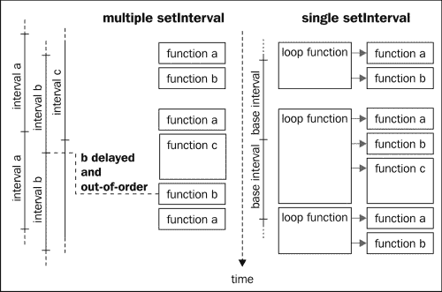
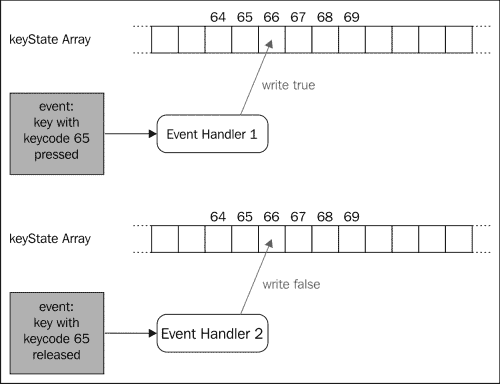
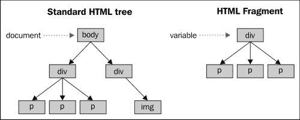

# 三、更好，更快，但不是更难

我们刚刚开发的游戏在几乎所有的设备和浏览器上都能很好地运行，主要原因是它非常简单，并且包含很少的移动精灵。但是，当您尝试制作一个更复杂的游戏时，就像我们在下面的章节中所做的那样，您会意识到您需要非常小心地编写优化的代码以获得良好的性能。

在本章中，我们将回顾以前的代码，并提出其某些方面的优化版本。其中一些优化是为了让游戏运行得更快，另一些优化是为了让代码更可读、更易于维护。

一般来说，使用较少的功能实现游戏的第一个版本，而不必太担心性能，然后对其进行优化并添加更多功能，这是一个很好的做法。这有助于您避免在游戏中可能不需要的东西上花费太多时间，允许您对优化进行基准测试，以确保它们真的使事情更快，最重要的是，让您保持动力。

在本章中，我们将深入探讨以下领域：

*   减少间隔和超时的数量
*   键盘轮询
*   使用 HTML 片段
*   避免回流
*   使用 CSS 变换加速精灵定位
*   使用`requestAnimationFrame`代替超时

# 间隔和超时

在我们的游戏中，我们使用了很多`setInterval`呼叫。您可能认为这些调用是多线程的，但它们不是。JavaScript 严格来说是单线程的（除了最近的 WebWorkers，但我们这里不讨论这个问题）。这意味着所有这些调用实际上都是一个接一个地运行的。

如果您对间隔和超时的具体工作方式感兴趣，我建议您阅读*John Resig*撰写的优秀文章，*JavaScript 计时器的工作方式*（[http://ejohn.org/blog/how-javascript-timers-work/](http://ejohn.org/blog/how-javascript-timers-work/) ）。

因此，间隔和超时不会向代码中添加多线程，因此您可能希望避免过多使用它们的原因很多。首先，它使您的代码有点难以调试。事实上，根据每个调用所需的时间，您的间隔将以不同的顺序执行，甚至这些间隔的周期也完全相同。

此外，就性能而言，在较旧的浏览器上使用太多的`setInterval`和`setTimeout`可能会非常费力。

另一种方法是使用单个间隔替换所有动画功能和游戏循环。

## 一个间隔来统治他们所有人

使用单个间隔并不一定意味着您希望所有动画以相同的速率执行。在大多数情况下，可接受的解决方案是允许动画的基本间隔的任意倍数。

通常，游戏循环将以给定的速率（比如 30 毫秒）运行，动画将以相同的速率运行，或者以 2、3、4 倍的速度运行。然而，这不必局限于动画；您可能希望有多个游戏循环，其中一些循环的执行速度要低得多。

例如，您可能希望在平台游戏中每秒增加一次水位。这样，玩家就有了快速完成关卡的动力，否则他/她会被淹死。为了在框架中实现这一点，我们将添加一个`addCallback`函数，它将接受一个函数和一个速率。我们上一个游戏中的游戏循环将使用此循环而不是`setInterval`来实现。

这意味着`startPreloading`功能将略有变化。调用`endCallback`函数后，我们将启动一个`setInterval`函数，该函数将调用通过`addCallback`定义的所有函数，并处理动画。此外，我们将其名称简单地更改为`startGame` ，以反映用法的变化。

在游戏中，不需要显式创建游戏循环的间隔，因为这是由`startGame`函数自动完成的；我们只需将其添加到具有`addCallback`功能的游戏中即可。下图显示了此方法与使用多个`setTimeout`函数的方法的比较：



我们将在我们的框架中通过向`initialize`函数提供这个最小刷新率来实现这一点。从这一点来看，所有的动画和周期性功能都将被定义为它的倍数。我们仍将在 API 中使用毫秒来描述它们的速率，但会在内部将速率存储为最接近基本速率的倍数。

### 代码

我们的初始化函数将使用我们使用的`$.extend`函数。从现在开始，我们将只有基本刷新率，但我们将根据需要添加更多值。我们还需要定义基本刷新率的默认值，以考虑用户没有手动指定刷新率的情况。

```js
gf = {
    baseRate: 30
};

gf.initialize = function(options) {
    $.extend(gf, options);
} 
```

新重命名的`startGame`函数如下代码所示：

```js
gf.startGame = function(progressCallback) {
    /* ... */
    var preloadingPoller = setInterval(function() {
        /* ... */
        if (counter == total) {
            //we are done!
            clearInterval(preloadingPoller);
            endCallback();
            setInterval(gf.refreshGame, gf.baseRate);
        } else {
            /* ... */
        }
    }, 100);
};
```

我们在这里变化不大；在`endCallback`函数之后，我们添加了对内部函数`gf.refreshGame`的调用。这个函数将依次协调动画刷新和定期函数调用。

这个新函数将使用两个列表来知道何时做什么，一个用于回调，另一个用于动画。我们已经有了一个动画版本：`gf.animationHandles`。我们将把它简单地重命名为`gf.animations`并创建第二个名为`gf.callbacks`。

这两个列表都必须包含一种方法，以知道它们是否应该以基本速率的当前迭代执行。为了检测这种情况，我们将为每个动画和回调使用一个简单的计数器。每次执行基本循环时，我们将增加所有循环，并将其值与关联动画/回调的速率进行比较。如果它们相等，这意味着我们需要执行它并重置计数器。

```js
gf.refreshGame = function (){
    // update animations
    var finishedAnimations = [];

    for (var i=0; i < gf.animations.length; i++) {

        var animate = gf.animations[i];

        animate.counter++;
        if (animate.counter == animate.animation.rate) {
            animate.counter = 0;
            animate.animation.currentFrame++;
            if(!animate.loop && animate.animation.currentFrame > animate.animation.numberOfFrame){
                finishedAnimations.push(i);
            } else {
                animate.animation.currentFrame %= animate.animation.numberOfFrame;
                gf.setFrame(animate.div, animate.animation);
            }
        }
    }
    for(var i=0; i < finishedAnimations.length; i++){
        gf.animations.splice(finishedAnimations[i], 1);
    }

    // execute the callbacks
    for (var i=0; i < gf.callbacks.length; i++) {
        var call  = gf.callbacks[i];

        call.counter++;
        if (call.counter == call.rate) {
            call.counter = 0;
            call.callback();
        }
    }
} 
```

这个简单的机制将取代对`setInterval`的许多调用，并解决我们前面提到的与此相关的问题。

因此，将动画设置为 div 的功能必须进行调整。正如您在前面的示例中所看到的，负责确定必须定义动画的哪一帧的实际代码现在位于`refreshGame`函数中。这意味着`setAnimation`函数只需将动画添加到列表中，而不必考虑如何设置动画。

函数中检查 div 是否已经有与之关联的动画的部分现在稍微复杂一些，但在其他方面，函数现在简单多了。

**gf.animations=[]；**

```js
/**
 * Sets the animation for the given sprite.
 **/
gf.setAnimation = function(divId, animation, loop){
    var animate = {
 animation: animation,        
 div: divId,

        loop: loop,
        counter: 0
    }

    if(animation.url){
        $("#"+divId).css("backgroundImage","url('"+animation.url+"')");
    }

    // search if this div already has an animation
    var divFound = false;
    for (var i = 0; i < gf.animations.length; i++) {
        if(gf.animations[i].div == divId){
            divFound = true;
            gf.animations[i] = animate
        }
    }

    // otherwise we add it to the array
    if(!divFound) {
        gf.animations.push(animate);
    }
} 
```

我们需要编写类似的代码将回调添加到基本循环：

```js
gf.callbacks = [];

gf.addCallback = function(callback, rate){
    gf.callbacks.push({
        callback: callback,
        rate: Math.round(rate / gf.baseRate),
        counter: 0
    });
}
```

这个函数很琐碎；唯一有趣的部分是刷新率的标准化，将其表示为基本速率的倍数。您可能注意到我们没有为动画做任何类似的事情，但我们现在将在创建动画的函数中这样做。现在它将如下所示：

```js
gf.animation = function(options) {
    var defaultValues = {
        url : false,
        width : 64,
        numberOfFrames : 1,
        currentFrame : 0,
        rate : 1
    }
    $.extend(this, defaultValues, options);
    if(options.rate){
        // normalize the animation rate
        this.rate = Math.round(this.rate / gf.baseRate);
    }
    if(this.url){
        gf.addImage(this.url);
    }
}
```

就这样；通过这些简单的更改，我们将去掉大多数`setInterval`函数。要复制你用香草 JavaScript 开发出来的功能似乎需要做很多工作，但你会及时发现，当你开始调试游戏时，它会有很大的帮助。

# 键盘轮询

如果你玩上一章的游戏，你可能已经注意到我们的“青蛙”从左到右的移动有些奇怪，也就是说，如果你按住左键，你的化身会向左移动一点，停顿一段时间，然后开始不断向左移动。

这种行为不是由浏览器直接引起的，而是由操作系统引起的。这里发生的事情是，当操作系统长时间按下任何键（也称为“粘滞键”）时，操作系统都会重复该键。有两个参数定义此行为：

*   宽限期：这是操作系统在重复按键之前等待的时间。这样可以避免在您真正想按一次键时重复按键。
*   按键重复的频率。

您无法控制这些参数或此行为的发生。这完全取决于操作系统和用户配置它的方式。

对于连续的行动来说，这远远不够理想。如果你在 RPG 或 platformer 游戏中移动一个化身，你需要移动速度连续且线性。这个问题的解决方案称为状态轮询。使用此方法，您希望主动查询某些键的状态，而不是像事件处理那样等待状态更改。

在你的游戏循环中，你会在某个时候询问是否按了“左”键，并做出相应的反应。这在本地游戏中经常使用，但 JavaScript 并没有提供这种开箱即用的可能性。我们必须自己实现一种状态轮询技术。

## 跟踪钥匙的状态

为此，我们将使用唯一可用的工具：`keydown`和`keyup`事件。我们将注册两个事件处理程序：

1.  如果按下具有给定键码“c”的键，则第一个事件处理程序将在索引“c”处的数组中写入`true`。
2.  当释放相同的键时，第二个事件处理程序将索引“c”的值设置为`false`。

这个解决方案的一个很好的特性是，我们不需要将每个可能的键的数组状态初始化为，默认情况下，它是未定义的；所以，当我们检查时，它的值将返回`false`。下图说明了这两个事件处理程序的工作方式：



我们将在框架末尾注册这两个事件处理程序：

```js
gf.keyboard = [];
// keyboard state handler
 $(document).keydown(function(event){
    gf.keyboard[event.keyCode] = true;
});
$(document).keyup(function(event){
    gf.keyboard[event.keyCode] = false;
});
```

完成后，我们可以简单地将处理左右移动的代码移动到我们的游戏循环中，并重写它以使用`gf.keyboard`数组。

```js
if(gf.keyboard[37]){ //left
    newPos -= 5;
}
if(gf.keyboard[39]){ //right
    newPos += 5;
}
```

在这里，我们不需要检查玩家是否死亡，因为我们已经在游戏循环中执行了一次。您只需记住，可以同时按下多个键。在以前的版本中，使用事件处理程序并为每个按下的键生成一个事件，但情况并非如此。

如果你现在尝试这个游戏，你会注意到你的玩家的水平移动要好得多。

如您所见，使用轮询的代码更漂亮，在大多数情况下更紧凑。此外，它在游戏循环中，这总是一件好事。然而，在某些情况下，这可能不是最好的解决办法。让我们的青蛙跳就是一个很好的例子。

在事件处理和轮询之间进行选择实际上取决于具体情况，但一般来说，如果要对一次按下的键做出反应，则将使用事件；如果要对连续按下的键做出反应，则将使用轮询。

# HTML 片段

在这里，我们将在创建精灵的代码中看到一些小的优化。因为这个函数在我们整个游戏中只调用了八次，而且只在初始化阶段调用，所以在这种情况下，它的速度不是很重要。然而，在很多情况下，你需要在游戏中创建大量的精灵，例如，在拍摄中使用激光，在创建平台的关卡或 RPG 的地图时。

这种技术避免了每次在游戏中添加一个精灵时解析 HTML 代码（描述精灵）。它使用所谓的 HTML 片段，这是一种从通常的 HTML 节点树中分离出来的分支。



jQuery 提供了一种非常简单的方法来生成这样的片段：

```js
var fragment = $("<div>fragment</div>");
```

在本例中，变量`fragment`将在内存中保存 HTML 元素，直到我们需要使用它为止。它不会自动添加到文档中。如果以后要添加，只需编写：

```js
$("#myDiv").append(fragment);
```

请记住片段仍然引用添加的元素，这意味着如果您稍后将其添加到另一个位置，它将从上一个位置删除，如果您修改它，您也将修改文档。

为了避免这种情况，您需要先克隆片段，然后再将其插入文档，如下代码所示：

```js
$("#myDiv").append(fragment.clone());
```

这正是我们重写`addSprite`函数以使其更快的方法：

```js
gf.spriteFragment = $("<div style='position: absolute'></div>");
gf.addSprite = function(parentId, divId, options){
    var options = $.extend({}, {
        x: 0,
        y: 0,
        width: 64,
        height: 64
    }, options);
    $("#"+parentId).append(gf.spriteFragment.clone().css({
            left:   options.x,
            top:    options.y,
            width:  options.width,
            height: options.height}).attr("id",divId));
}; 
```

在这里，我们为每个精灵所共有的唯一部分创建了一个片段。然后，在我们将其添加到文档之前，我们克隆了它，并添加了提供给`addSprite`函数的特殊参数，例如其位置、大小和 ID。

就像我之前说的，你可能不会注意到我们非常简单的游戏有任何可见的变化，但是这段代码效率更高，在我们生成大量精灵的更复杂的游戏中会派上用场。

# 避免回流

当修改 DOM 时，您必须尽量避免生成整个文档或大部分文档的完全回流。有许多方法可以最大限度地降低这样做的风险，而现代浏览器在这样做时非常擅长优化。

通常，浏览器会在重新加载文档之前尝试重新组合尽可能多的修改。但是，如果您试图访问依赖于这些修改之一的信息，则必须执行回流，以便能够计算新信息。

一个很好的经验法则是避免像瘟疫一样读取 DOM，作为最后的手段，将所有读取分组并在刷新循环结束时执行它们。

在我们的游戏中，有一点我们正处于这种情况：每次我们访问玩家化身的 X 位置时，我们都会强制浏览器回流。位置和大小可能是游戏循环中最常访问的信息。使事情更快的一个简单方法是避免从 DOM 中获取它们。事实上，只要它们是通过框架函数设置的，我们就可以简单地将它们存储在某个地方，并在需要时检索它们。

为此，我们将使用 jQuery 的`data`函数将 sprite 与包含这些有趣值的对象文本相关联。`addSprite`功能的扩展方式如下：

```js
gf.addSprite = function(parentId, divId, options){
    /* ... */
    $("#"+parentId).append(gf.spriteFragment.clone().css({
            left:   options.x,
            top:    options.y,
            width:  options.width,
            height: options.height}).attr("id",divId).data("gf",options));
}
```

然后，在的`gf.x`和`gf.y`函数中，我们将使用此值而不是 CSS 属性：

```js
gf.x = function(divId,position) {
    if(position) {
        $("#"+divId).css("left", position); 
 $("#"+divId).data("gf").x = position;
    } else {
 return $("#"+divId).data("gf").x; 
    }
}
gf.y = function(divId,position) {
    if(position) {
        $("#"+divId).css("top", position); 
 $("#"+divId).data("gf").y = position;
    } else {
 return $("#"+divId).data("gf").y; 
    }
}
```

这也有的优点，可以去掉两个`parseInt`值，游戏代码甚至不需要更改！

# 使用 CSS 变换移动您的精灵

使用 CSS 变换是一种简单的技巧，它允许您在屏幕上移动对象的速度比使用 CSS`top`和`left`属性要快得多。如果您决定使用它，您必须意识到并非所有浏览器都支持它。

我们将不做太多的详细介绍，因为 CSS 转换将在下一章中进行解释，*从侧面看*。以下代码是使用 CSS 转换所需的修改：

```js
gf.x = function(divId,position) {
    if(position) {
        var data = $("#"+divId).data("gf");
        var y = data.y;
        data.x = position;
        $("#"+divId).css("transform", "translate("+position+"px, "+y+"px)");
    } else {
        return $("#"+divId).data("gf").x; 
    }
}
gf.y = function(divId,position) {
    if(position) {
        var data = $("#"+divId).data("gf");
        var x = data.x;
        data.y = position;
        $("#"+divId).css("transform", "translate("+x+"px, "+position+"px)"); 
    } else {
        return $("#"+divId).data("gf").y; 
    }
}
```

正如您在代码突出显示的部分所看到的，我们每次都需要设置两个坐标。这意味着当我们修改 x 坐标时，我们必须检索 y 坐标，反之亦然。

# 使用 requestAnimationFrame 代替超时

为了使动画更加流畅，浏览器最近增加了一项新功能：`requestAnimationFrame`。这使得浏览器告诉你什么时候是制作页面动画的最佳时机，而不是在你喜欢的时候制作。您可以使用此选项，而不是向`setInterval`或`setTimeout`注册回调。

当您使用`requestAnimationFrame`时，由浏览器决定何时调用该函数。因此，您必须考虑自上次通话以来经过的确切时间。用来定义这个时间的标准规范是毫秒（就像你在`Date.now()`中得到的那样），但现在它是由一个高精度计时器给出的。

由于这两个版本都有实现，而且大多数浏览器都以供应商为前缀，所以您应该使用一个工具来抽象脏细节。我建议您阅读这两篇文章，这两篇文章都提供了您可以使用的代码片段：

*   [http://paulirish.com/2011/requestanimationframe-for-smart-animating/](http://paulirish.com/2011/requestanimationframe-for-smart-animating/)
*   [http://www.makeitgo.ws/articles/animationframe/](http://www.makeitgo.ws/articles/animationframe/)

# 总结

在本章中，我们花了一些时间优化我们在[第 2 章](02.html "Chapter 2. Creating Our First Game")中编写的游戏，*创建了我们的第一个游戏*。我们已经看到了一些优化技术，这些技术将使我们的游戏更加流畅，而不会影响游戏的代码可读性。

我们构建的框架现在是一个合理的基础，我们可以在下面的章节中构建一个更完整的框架。我们将从下面的一个功能开始，添加创建用于实现 platformer 游戏的平铺贴图的功能。