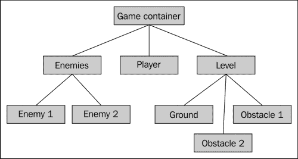
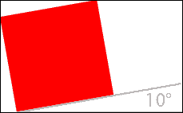
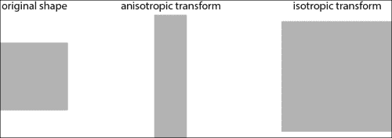
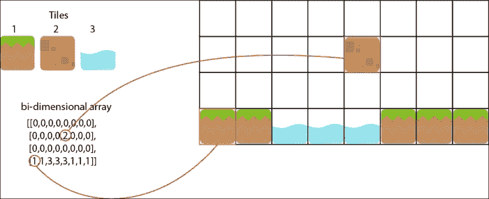
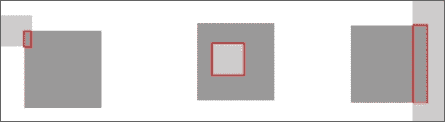
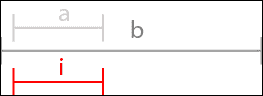
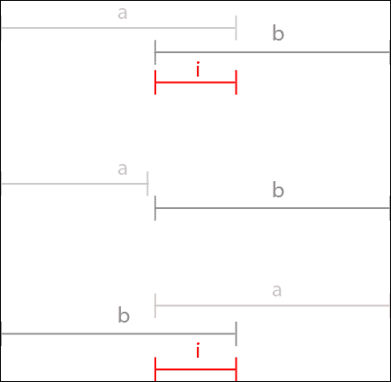
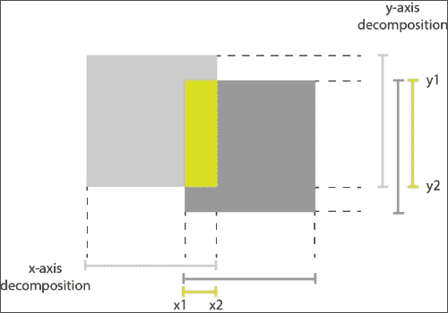
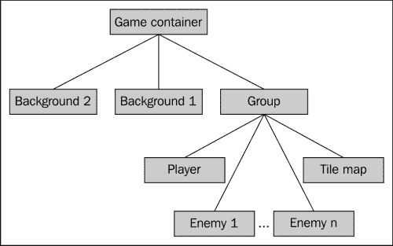
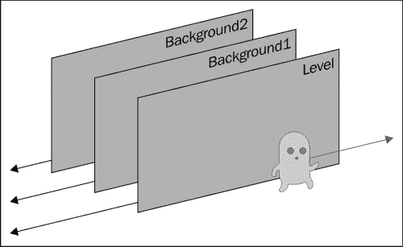

# 四、侧视

现在是时候做一个更复杂的游戏了。我们将实现一种非常流行的类型，即 2D 平台游戏。这种类型的早期例子有*超级马里奥兄弟*和*刺猬索尼克*。这些游戏通常使用称为平铺贴图的小型重复精灵进行关卡设计。我们将向我们的框架中添加这些，以及更通用的碰撞检测。对于游戏逻辑本身，我们将使用面向对象的代码。

下面是我们必须添加到框架中的功能的快速列表：

*   脱机 div
*   组
*   雪碧变换
*   平铺贴图
*   碰撞检测

我们将首先经历所有这些，然后从游戏开始。

# 离线 divs

如前一章结尾所述，避免回流是加快速度的一个好方法。在操作过程中，要完全避免查询 DOM 的状态并不总是容易的。即使您非常小心，作为一名框架开发人员，您也永远无法确定框架的用户将做什么。然而，有一种方法可以减少回流的负面影响；分离正在处理的 DOM 片段，对其进行修改，然后将其附加回文档。

假设您有一个 ID 为`box`的节点，并且希望以复杂的方式操作其子元素。以下代码显示了如何将其拆离：

```js
// detach box
var box = $("#box").detach();

var aSubElement = box.find("#aSubElement")
// and so on

// attach it back
box.appendTo(boxParent);
```

这需要对我们框架的 API 进行一点修改；到目前为止，我们使用字符串来识别精灵。这样做的副作用是要求精灵成为文档的一部分。例如，如果调用`gf.x("sprite")`，jQuery 将尝试在文档中找到 ID 为`sprite`的节点。如果分离精灵或其父对象之一，函数将找不到其 ID。

解决方案只是为框架的功能提供 DOM 节点本身。在使用 jQuery 时，我们将在 jQuery 中包装此节点。让我们比较一下`gf.x`函数当前的 API 和建议的 API。

```js
// current API
var xCoordinate = gf.x("mySprite");

// proposed API
var xCoordinate = gf.x($("#mySprite"));
```

这种解决方案还有另一个优点；它允许进一步优化。如果我们查看此功能的实现，我们会发现另一个问题：

```js
gf.x = function(divId,position) {
    if(position) {
        $("#"+divId).css("left", position);
        $("#"+divId).data("gf").x = position;
    } else {
        return $("#"+divId).data("gf").x; 
    }
}
```

您可以看到，每次调用函数时，jQuery 都用于检索元素。任何对 DOM 的访问（甚至在选择器中使用元素的 ID）都会导致性能损失。理想情况下，如果相关元素被多次使用，您可能希望缓存它以提高性能。这是通过建议的 API 实现的。

实现非常简单，所以我们只展示`gf.x`函数：

```js
gf.x = function(div,position) {
    if(position) {
        div.css("left", position);
        div.data("gf").x = position;
    } else {
        return div.data("gf").x; 
    }
}
```

# 组

以分层方式组织游戏的元素非常方便和。典型的游戏可以这样组织：



为了实现这一点，我们需要在我们的框架中添加一个称为组的非常简单的东西。一个组基本上是一个简单的 div，其位置与精灵完全相同，但没有背景，也没有宽度和高度。我们将为我们添加一个`gf.addGroup`函数。其签名将与`gf.addSprite`的签名相同，但选项参数将仅保留*x*和*y*坐标。

下面的示例展示了如何生成上图所示的树：

```js
var enemies   = gf.addGroup(container,"enemies");
var enemy1    = gf.addSprite(group,"enemy1",{...});
var enemy2    = gf.addSprite(group,"enemy2",{...});

var player    = gf.addSprite(group,"player",{...});

var level     = gf.addGroup(container,"level");
var ground    = gf.addSprite(group,"ground",{...});
var obstacle1 = gf.addSprite(group,"obstacle1",{...});
var obstacle2 = gf.addSprite(group,"obstacle2",{...});
```

此功能的实现与`gf.addSprite`非常相似：

```js
gf.groupFragment = $("<div style='position: absolute; overflow: visible;'></div>");
gf.addGroup = function(parent, divId, options){
    var options = $.extend({
        x: 0,
        y: 0,
    }, options);
    var group = gf.groupFragment.clone().css({
            left:   options.x,
            top:    options.y}).attr("id",divId).data("gf",options);
    parent.append(group);
    return group;
}
```

在我们的游戏屏幕上有多个实体，这就需要有一种简单的方法来区分它们。我们可以通过`$.data`函数在与节点关联的对象文本中使用标志，但我们将使用 CSS 类。这样做的优点是可以很容易地检索或过滤一种类型的所有元素。

要实现这一点，我们只需更改精灵和组的片段。我们给 CSS 类的名称将使用名称空间。CSS 中的名称空间只需在类名中使用前缀即可。例如，我们将给我们的精灵上课`gf_sprite`；这将最大限度地减少另一个插件使用相同类的可能性，而不是说`sprite`。

新片段将如下所示：

```js
gf.spriteFragment = $("<div class='gf_sprite' style='position: absolute; overflow: hidden;'></div>");
gf.groupFragment = $("<div class='gf_group' style='position: absolute; overflow: visible;'></div>");
```

现在，如果你想找到所有精灵的孩子，你可以这样写：

```js
$("#someElement").children(".gf_sprite");

```

# 精灵转化

有很多情况下，你会想以简单的方式改变你的精灵。例如，您可能希望使它们变大或变小，或者旋转或翻转它们。最方便的方法是使用 CSS 转换。在过去几年中，CSS 转换已经得到大多数浏览器的良好支持。

如果您决定使用此功能，您只需意识到 Microsoft Internet Explorer 9 之前的版本不支持此功能。有可能使用专有的`filter`CSS 属性，但在大多数情况下，速度太慢。

另一种可能性是使用一些旧的 8 位和 16 位游戏中使用的技术。您可以简单地为转换后的精灵生成图像。它的优点是速度非常快，并且与所有浏览器兼容。另一方面，它会增加你的艺术品的大小，如果你需要在某个时候改变你的精灵，你需要重新生成所有的变换。

我们在这里只实现 CSS 转换解决方案，因为在大多数情况下，只针对现代浏览器是可以接受的。

## CSS 变换

有在 CSS 中有许多可能的转换，甚至是 3D 转换（你可以看看[https://github.com/boblemarin/Sprite3D.js](https://github.com/boblemarin/Sprite3D.js) 对于一些非常好的例子），但我们将坚持旋转和缩放。

在大多数浏览器中，CSS 属性“transform”是以供应商为前缀的。这意味着在 Safari 中，它将被称为`-webkit-transform`，在 Firefox 中，它将被称为`-moz-transform`。使用这类属性曾经是一件非常痛苦的事情，但是使用 jQuery1.8，您可以简单地忘记它，并表现得好像没有前缀一样。jQuery 将注意在需要的地方使用正确的前缀。

如前所述，此属性可以接受许多值，我们将在这里重点讨论两个值：`rotate`和`scale`。`rotate`的语法如下：

```js
transform: rotate(angle)
```

这里，`angle`是一个顺时针角，以度或弧度为单位表示（分别缩写为**度**和**弧度**。默认情况下，围绕图元的原点（即其中心）进行旋转。这是你在游戏中经常想要的，但是如果你出于某种原因想要改变它，你可以简单地使用`transform-origin`CSS 属性来改变它。

例如，如果要将图元逆时针旋转 10 度，请编写：

```js
transform: rotate(-10deg);
```

如果您的元素是一个红方块，它将如下所示：



`scale`的工作方式非常相似，但它有两种可能的语法：

*   `transform: scale(ratio)`
*   `transform: scale(ratio_x, ratio_y)`

如果只指定一个值，结果将是各向同性变换；换句话说，沿两个轴的大小相等。相反，如果指定两个值，第一个值将沿 x 轴缩放，第二个值将沿 y 轴缩放（各向异性变换）。下图说明了这两者之间的区别。



在我们的例子中，我们不会在我们的框架中包含任意的各向异性缩放，但是我们仍然会使用双值语法，因为它允许我们翻转精灵；事实上，如果我们写`scale(-1,1)`，这个实际上意味着“沿 x 轴（水平方向）翻转元素，并沿 y 轴保持不变”。当然，这适用于 1 以外的值；只要这两个值的大小相同，您将只翻转精灵而不更改其纵横比。

transform 属性的这两个值可以很好地协同工作，因此，如果要将元素逆时针旋转 10 度，将其垂直翻转，并使其变大两倍，则可以编写：

```js
transform: rotate(-10deg) scale(2,-2);
```

## 将转换添加到框架中

现在我们必须为我们编写一个函数。与我们框架的大多数函数一样，我们将使用对象文本来保存可选参数，并将函数应用到的节点作为第一个参数。调用此函数以生成示例，如下所示：

```js
gf.transform (myDiv, {rotate: -10, scale: 2, flipV: true});
```

角度以度为单位，`flipH`和`flipV`选项为布尔值。省略参数的值（`flipH`，在本例中）不会默认为一般值；我们要做的是为给定元素获取此参数的当前值。这将允许您两次调用 transform 函数并更改两个不同的参数，而无需知道另一个调用正在执行什么操作。例如：

```js
gf.transform (myDiv, {rotate: -10});
// do some other things
gf.transform (myDiv, {scale: 2, flipV: true});
```

然而，这将意味着我们将无法像过去那样使用`$.extend` 函数。相反，我们必须手动检查给定元素的未定义参数的存储值。

这些值将存储在与`gf`键关联的对象文本中，该键与具有`$.data`函数的元素关联。这也意味着在创建精灵（或组）时，我们需要为这些属性定义默认值。例如，`addSprite`功能将以以下内容开始：

```js
gf.addSprite = function(parent, divId, options){
    var options = $.extend({
        x: 0,
        y: 0,
        width: 64,
        height: 64,
        flipH: false,
      flipV: false,
      rotate: 0,
      scale: 1
    }, options);
//...
```

一旦您了解了 CSS`transform`属性的工作方式，我们的`gf.transform`函数的实现将非常简单：

```js
gf.transform = function(div, options){
   var gf = div.data("gf");
   if(options.flipH !== undefined){
      gf.flipH = options.flipH;
   }
   if(options.flipV !== undefined){
      gf.flipV = options.flipV;
   }
   if(options.rotate !== undefined){
      gf.rotate = options.rotate;
   }
   if(options.scale !== undefined){
      gf.scale = options.scale;
   }
   var factorH = gf.flipH ? -1 : 1;
   var factorV = gf.flipV ? -1 : 1;
   div.css("transform", "rotate("+gf.rotate+"deg) scale("+(gf.scale*factorH)+","+(gf.scale*factorV)+")");
}
```

同样，这是一个简单的功能，它将提供强大的功能，并允许我们在游戏中创建整洁的效果。根据游戏的不同，您可能希望向其添加各向异性缩放，甚至 3D 变换，但函数的基本结构和 API 可以保持不变。

# 瓷砖地图

瓷砖地图是制作大量游戏的常用工具。其背后的理念是，大多数关卡都是由类似的部分组成的。例如，地面可能会重复很多次，但也有一些变化；将有几种不同的树重复多次，一些项目，如石头、花或草将出现多次，由完全相同的精灵代表。

这意味着使用一个大图像来描述您的级别并不是最有效的解决方案。你真正想要的是能够给出所有独特元素的列表，然后描述它们如何组合来生成你的等级。

平铺贴图是最简单的实现。不过，它们增加了一个约束条件；所有图元必须具有相同的大小并放置在网格上。如果你能处理这些约束，这个解决方案会变得非常有效；这就是为什么这么多的老游戏都是用它制作的。

我们将从实现它的一个非常简单的版本开始，然后在本章末尾展示如何在大多数情况下不用做太多工作就可以更快地实现它。

总之，平铺贴图由以下部分组成：

*   一系列图像（我们在框架中称之为动画）
*   描述图像的二维数组

下图说明了这一点：



除了有助于缩小游戏的大小外，平铺地图还具有以下优势：

*   使用平铺贴图检测碰撞非常容易。
*   描述平铺贴图外观的数组还包含有关级别的语义信息。例如，瓷砖 1 到 3 是地面瓷砖，而 4 到 6 也是风景的一部分。这将允许您轻松地“读取”级别并对其作出反应。
*   生成水平的随机变化非常简单。只需使用一些规则创建二维数组，玩家每次重新开始游戏时，您的游戏都会有所不同！
*   有很多开源工具可以帮助您创建它们。

但是，您必须意识到，也存在一些约束条件：

*   由于组成平铺贴图的所有元素都具有相同的大小，如果要创建更大的元素，则必须将其分解为更小的部分，这可能会很繁琐。
*   即使你有很多天赋，它也会给你的比赛带来持续的关注。如果要避免在关卡周围重复某些块，则平铺贴图不适合您。

## 天真的实现

我们已经知道如何创建精灵，所以创建平铺贴图基本上需要生成组成它的精灵。与`gf.addSprite`一样，我们的`gf.addTilemap`函数将获取父 div、生成的平铺映射的 ID 和描述选项的对象文字。

选项是平铺贴图的位置、每个平铺的尺寸、水平和垂直构成平铺贴图的平铺数量、动画列表以及描述平铺位置的二维数组。

我们将遍历二维数组，并根据需要创建 sprite。在我们的平铺地图中有没有精灵的地方通常比较方便，因此我们将使用以下约定：

*   如果所有条目都有零，则表示不需要在此位置创建精灵
*   如果所有的位置都有一个大于零的数字，这意味着应该创建一个精灵，该精灵的动画索引对应于动画数组中的这个数字减去 1

这通常是您希望在将整个平铺图添加到文档之前创建它的位置。我们将使用克隆片段生成包含所有瓷砖的`div`标记，并将我们用于精灵的克隆片段添加到该标记中。只有创建了所有平铺后，我们才能将平铺映射添加到文档中。

这里还有一个微妙之处。我们将向平铺添加两个类，一个标记平铺所属的列，另一个标记平铺所属的行。除此之外，目前代码中没有什么微妙之处：

```js
gf.tilemapFragment = $("<div class='gf_tilemap' style='position: absolute'></div>");
gf.addTilemap = function(parent, divId, options){
    var options = $.extend({
        x: 0,
        y: 0,
        tileWidth: 64,
        tileHeight: 64,
        width: 0,
        height: 0,
        map: [],
        animations: []
    }, options);

    //create line and row fragment:
    var tilemap = gf.tilemapFragment.clone().attr("id",divId).data("gf",options);
    for (var i=0; i < options.height; i++){
        for(var j=0; j < options.width; j++) {
            var animationIndex = options.map[i][j];

            if(animationIndex > 0){
                var tileOptions = {
                    x: options.x + j*options.tileWidth,
                    y: options.y + i*options.tileHeight,
                    width: options.tileWidth,
                    height: options.tileHeight
                }
                var tile = gf.spriteFragment.clone().css({
                    left:   tileOptions.x,
                    top:    tileOptions.y,
                    width:  tileOptions.width,
                    height: tileOptions.height}
                ).addClass("gf_line_"+i).addClass("gf_column_"+j).data("gf", tileOptions);

                gf.setAnimation(tile, options.animations[animationIndex-1]);

                tilemap.append(tile);
            }
        }
    }
    parent.append(tilemap);
    return tilemap;
}
```

现在就这样。这将在初始化时生成整个平铺贴图。这意味着非常大的平铺贴图将很慢。我们将在本章末尾看到如何仅生成可见的平铺贴图部分。

# 碰撞检测

这是我们框架的一个非常重要的部分，我们将首先研究如何处理精灵与瓷砖地图碰撞的情况。这种情况的优点是比一般情况更简单，但仍然使用大多数相同的基本思想。但是，我们将坚持使用轴对齐的元素。这意味着此处不会显示与旋转图元的碰撞。

## 与瓷砖地图碰撞

发现瓷砖地图的哪些瓷砖与精灵碰撞可分为两部分。首先找到一个框，表示两个的交点。然后，列出此框中的所有精灵。下图中一些可能的交叉口列表以红色显示：



这可能起初看起来很复杂，但是如果你认为这是与找到两个一维交点（每个轴一个）完全相同的问题就容易多了。

你可能没有意识到，但我们在*蛙人*克隆中使用了一维交叉点的简化版本来检测碰撞。下图显示了两段**a**和**b**的典型一维交点**i**的形状：



在这种情况下，交点只是第二个元素，因为它完全包含在第一个元素中。下图显示了其他三种可能的情况：



解决问题的一种方法是从第二个元素的角度来表达解决方案。两个点将定义间隔；让我们将最左边的点称为`i1`，最右边的点称为`i2`。

让我们首先考虑这样一个交叉点真的存在的情况，在这两个元素接触的情况下。你可能会看到`i1`是`a1`和`b1`之间的较大点。同样地，`i2`是`a2`和`b2`之间的较小点。但是，如果两个间隔不相交怎么办？如果间隔`a`在左边，我们只返回`i1=b1`和`i2=b1`，如果间隔`a`在右边，我们只返回`i1=b2`和`i2=b2`。为了计算这一点，我们只需将`i1`和`i2`的结果限制在`b1`和`b2`之间。

结果函数如下所示：

```js
gf.intersect = function(a1,a2,b1,b2){
    var i1 = Math.min(Math.max(b1, a1), b2);
    var i2 = Math.max(Math.min(b2, a2), b1);
    return [i1, i2];
}
```

好的方面是，我们对每个点只使用两个比较。现在我们可以把这个应用到二维问题上。下图显示了如何将长方体交点分解为两个直线交点：



### 寻找碰撞的瓷砖

现在我们将编写一个函数，该函数包含一个精灵和一个平铺贴图。然后它将找到两个轴的交点：x1 到 x2 和 y1 到 y2。现在，点（x1，y1）将是相交框的左上角，点（x2，y2）将是右下角。

然而，对于平铺贴图，我们真正想要的不是坐标，而是二维数组中的索引。因此，我们将首先变换坐标，使原点位于平铺贴图的左上角。然后，我们将根据单个瓷砖的宽度和各自的高度划分新坐标。在对该操作的结果进行四舍五入后，我们将获得构成相交框的左上和右下分幅的索引：

```js
gf.tilemapBox = function(tilemapOptions, boxOptions){
    var tmX  = tilemapOptions.x;
    var tmXW = tilemapOptions.x + tilemapOptions.width * tilemapOptions.tileWidth;
    var tmY  = tilemapOptions.y;
    var tmYH = tilemapOptions.y + tilemapOptions.height * tilemapOptions.tileHeight;

    var bX  = boxOptions.x;
    var bXW = boxOptions.x + boxOptions.width;
    var bY  = boxOptions.y;
    var bYH = boxOptions.y + boxOptions.height;

    var x = gf.intersect(tmX,tmXW, bX, bXW);
    var y = gf.intersect(tmY, tmYH, bY, bYH);

    return {
        x1: Math.floor((x[0] - tilemapOptions.x) / tilemapOptions.tileWidth),
        y1: Math.floor((y[0] - tilemapOptions.y) / tilemapOptions.tileHeight),
        x2: Math.ceil((x[1] - tilemapOptions.x) / tilemapOptions.tileWidth),
        y2: Math.ceil((y[1] - tilemapOptions.y) / tilemapOptions.tileHeight)
    }
}
```

现在，我们将在碰撞检测功能中使用此结果。我们只需列出这两点之间的所有瓷砖。我们将使用二维数组来查找所有非零条目，然后使用我们为行和列定义的类来查找平铺。

```js
gf.tilemapCollide = function(tilemap, box){
    var options = tilemap.data("gf");
    var collisionBox = gf.tilemapBox(options, box);
    var divs = []

    for (var i = collisionBox.y1; i < collisionBox.y2; i++){
        for (var j = collisionBox.x1; j < collisionBox.x2; j++){
            var index = options.map[i][j];
            if( index > 0){
                divs.push(tilemap.find(".gf_line_"+i+".gf_column_"+j));
            }
        }
    }
    return divs;
}
```

这将允许我们找到所有与精灵碰撞的瓷砖，但我们必须小心，我们为精灵提供的坐标和瓷砖地图是正确的。如果精灵位于向右移动 10 个像素的组中，我们必须在精灵的 x 坐标值上加上 10；否则，碰撞检测方法将不会注意到它。

我们可以编写此函数的一个版本，查看所有精灵和平铺贴图的坐标，以找到它们的相对偏移量。这使得函数稍微慢一点，也稍微复杂一点，但您应该能够做到这一点。

## 精灵与精灵碰撞

检测两个精灵是否碰撞的函数将使用我们刚才编写的同一个一维相交函数。要在两个精灵之间发生碰撞，必须在两个一维投影上发生碰撞。

如果`gf.intersect`函数返回的间隔长度为零（两个值相等），则表示两个精灵在此轴上发生碰撞。要在两个精灵之间发生碰撞，两个投影都必须碰撞。

我们函数的实现非常简单，因为大部分逻辑都包含在 `gf.intersect`函数中：

```js
gf.spriteCollide = function(sprite1, sprite2){
   var option1 = sprite1.data("gf");
   var option2 = sprite2.data("gf");

   var x = gf.intersect(
      option1.x,
      option1.x + option1.width,
      option2.x,
      option2.x + option2.width);
   var y = gf.intersect(
      option1.y,
      option1.y + option1.height,
      option2.y,
      option2.y + option2.height);

   if (x[0] == x[1] || y[0] == y[1]){
      return false;
   } else {
      return true;
   }
}
```

# 游戏编码

我们现在具备了开始游戏所需的所有工具。在这个游戏中，我们将使用肯尼·弗列格尔（Kenney Vleugels）的精彩作品（[http://www.kenney.nl](http://www.kenney.nl) ）。这将是一个经典的平台，玩家可以移动和跳跃。

将有两种敌人，一种是斑点，一种是飞虫。为了简单起见，玩家是不朽的，只要碰到敌人就会杀死他们。我们将按以下顺序描述游戏的每个部分：

*   游戏屏幕的基本设置
*   播放器的面向对象代码
*   玩家控制
*   视差滚动
*   敌人

# 游戏画面的基本设置

这与我们为青蛙克隆人所做的非常相似。以下是我们将如何组织游戏屏幕：



我们将在这个游戏中有很多动画；三个用于玩家，三个用于两个敌人的七块瓷砖，以及两个背景动画。为了使内容更具可读性，我们将对它们进行重新组合。玩家和敌人的动画将分别存储在一个对象文字中，瓷砖的动画将存储在一个数组中。

以下是我们的代码摘录：

```js
var playerAnim = {
    stand: new gf.animation({
        url: "player.png",
        offset: 75
    }),
    walk:  new gf.animation({
        url:    "player.png",
        offset: 150,
        width:  75, 
        numberOfFrames: 10,
        rate: 90
    }),
    jump:  new gf.animation({
        url: "player.png",
        offset: 900
    })
};

var slimeAnim = {
   stand: new gf.animation({
        url: "slime.png"
    }),
    walk: new gf.animation({
        url: "slime.png",
        width:  43, 
        numberOfFrames: 2,
        rate: 90
    }),
    dead: new gf.animation({
        url: "slime.png",
        offset: 86
    })
};

var flyAnim = {
   stand: new gf.animation({
        url: "fly.png"
    }),
   ...
}
var tiles = [
    new gf.animation({
        url: "tiles.png"
    }),
    new gf.animation({
        url: "tiles.png",
        offset: 70
    }),
    ...
];
```

# 播放器的面向对象代码

在游戏中使用面向对象（OO）代码的原因有很多。首先，这是组织代码的一种非常好的方法。其次，它提供了一些重用和扩展代码的有用方法。

如果你不熟悉 OO 编程，JavaScript 可能不是最好的学习语言。我们不会讨论面向对象的理论；即使没有它，您也应该能够看到我们将要编写的代码背后的逻辑，以及它将给表带来什么。

由于我们只需要一个播放器，我们将创建一个匿名类并立即实例化它。这是非常不寻常的，只有在这种特殊情况下才有意义。下面是我们的类的框架，包含所有方法，但没有它们的实现。我们稍后将逐一介绍。

```js
var player = new (function(){
        var acceleration = 9;
        var speed = 20;
        var status = "stand";
        var horizontalMove = 0;

        this.update = function (delta) {
            //...
        };

        this.left = function (){
            //...
        };

        this.right = function (){
            //...
        };

        this.jump  = function (){
            //...
        };

        this.idle  = function (){
            //...
        };
});
```

如您所见，我们首先定义一些稍后将使用的变量，然后定义对象的方法。

## 更新玩家的位置

我们已经实现了一个非常基本的玩家沿 y 轴运动的物理模拟；如果没有发生碰撞，化身将以给定的加速度和有限的最大速度坠落。这足以生成整洁的跳跃轨迹。

让我们看看`update`函数的作用。首先，它需要计算化身的下一个位置：

```js
var delta = 30;
speed = Math.min(100,Math.max(-100,speed + acceleration * delta / 100.0)); 
var newY = gf.y(this.div) + speed * delta / 100.0;
var newX = gf.x(this.div) + horizontalMove;
var newW = gf.width(this.div);
var newH = gf.height(this.div);
```

你可以在这段代码中看到，我们计算速度；这是玩家的垂直速度。我们在这里使用正确的物理规则，其中时间间隔后的速度等于*之前的速度加上时间间隔*的加速时间。然后将其约束在-100 和 100 之间，以模拟终端速度。在这里，加速度是恒定的，就像引力一样。

然后我们使用这个速度来计算沿 y 轴的下一个位置，同样使用正确的物理规则。

沿 x 轴的新位置要简单得多；它是由玩家控制引起的水平运动修改的当前位置（我们稍后将确切地看到该值是如何生成的）。

然后，我们需要检查冲突，看看化身是否真的可以去它想去的地方，或者是否有什么东西在路上。为此，我们将使用前面编写的`gf.tilemapCollision`方法。

一旦我们有了所有与精灵碰撞的瓷砖，我们能做什么？我们将观察它们中的任何一个，并通过尽可能短的移动将精灵移开。为此，我们将计算精灵和瓷砖之间的精确交点，并确定其宽度或高度是否为较大尺寸。如果宽度大于高度，则表示 y 轴上的移动较短，如果高度大于宽度，则表示 x 轴上的移动较短。

如果我们对所有瓷砖都这样做，我们将把化身移动到一个不会与任何瓷砖碰撞的地方。以下是我们刚才描述的完整代码：

```js
var collisions = gf.tilemapCollide(tilemap, {x: newX, y: newY, width: newW, height: newH});
var i = 0;
while (i < collisions.length > 0) {
    var collision = collisions[i];
    i++;
    var collisionBox = {
        x1: gf.x(collision),
        y1: gf.y(collision),
        x2: gf.x(collision) + gf.width(collision),
        y2: gf.y(collision) + gf.height(collision)
    };

    var x = gf.intersect(newX, newX + newW, collisionBox.x1,collisionBox.x2);
    var y = gf.intersect(newY, newY + newH, collisionBox.y1,collisionBox.y2);

    var diffx = (x[0] === newX)? x[0]-x[1] : x[1]-x[0];
    var diffy = (y[0] === newY)? y[0]-y[1] : y[1]-y[0];
    if (Math.abs(diffx) > Math.abs(diffy)){
        // displace along the y axis
         newY -= diffy;
         speed = 0;
         if(status=="jump" && diffy > 0){
             status="stand";
             gf.setAnimation(this.div, playerAnim.stand);
         }
    } else {
        // displace along the x axis
        newX -= diffx;
    }
    //collisions = gf.tilemapCollide(tilemap, {x: newX, y: newY, width: newW, height: newH});
}
gf.x(this.div, newX);
gf.y(this.div, newY);
horizontalMove = 0;
```

您会注意到，如果我们检测到需要沿 y 轴向上移动玩家，我们会更改化身动画和状态（如果玩家正在跳跃）。这仅仅是因为这意味着球员已经落地。

仅此代码就足以包含在关卡中生成玩家体面移动所需的所有规则。

## 控制玩家的化身

除`update`之外的所有方法都直接对应于玩家输入的特定类型。在检测到相应的按键被按下后，它们将在主循环中被调用。如果未按下任何键，将调用 idle 功能。

让我们看一下将玩家向左移动的功能：

```js
this.left = function (){
            switch (status) {
                case "stand":
                    gf.setAnimation(this.div, playerAnim.walk, true);
                    status = "walk";
                    horizontalMove -= 7;
                    break;
                case "jump":
                    horizontalMove -= 5;
                    break;
                case "walk":
                    horizontalMove -= 7;
                    break;
            }
            gf.transform(this.div, {flipH: true});
};
```

它的主要部分是一个开关，因为我们会根据玩家的状态做出不同的反应。如果播放器当前处于站立状态，我们需要将动画更改为行走，设置播放器的新状态，并沿 x 轴移动播放器。如果玩家正在跳跃，我们只需沿 x 轴移动玩家（但稍微慢一点）。如果玩家已经在行走，我们就移动它。

最后一行水平翻转精灵，因为我们的图像描绘的是面向右侧的玩家。正确方向的功能基本相同。

`jump`方法将检查玩家当前是站立还是行走，如果是，将在`update`功能期间更改动画、更改状态并设置垂直速度以生成跳跃。

`idle`状态将相应地设置为站立状态和`animation`功能，但仅当玩家正在行走时。

```js
this.jump  = function (){
    switch (status) {
        case "stand":
        case "walk":
            status = "jump";
            speed = -60;
            gf.setAnimation(this.div, playerAnim.jump);
            break;
    }
};

this.idle  = function (){
    switch (status) {
        case "walk":
            status = "stand";
            gf.setAnimation(this.div, playerAnim.stand);
            break;
    }
};
```

这就是球员的动作。如果您仅使用此对象中包含的逻辑来启动游戏，那么您将已经拥有平台成型器的大部分功能—角色从一个平台跳到另一个平台。

# 玩家控制

我们仍然需要将玩家的对象连接到主循环。这是非常琐碎的，因为所有的逻辑都包含在对象中。然而，我们忽略了一个小细节。事实上，如果球员向左移动，他将离开屏幕。我们必须跟着他！我们实现它的方式是这样的：如果玩家超过给定的点，我们将开始将包含所有精灵和瓷砖的组移向相反的方向。这会给人一种相机正在跟踪玩家的印象。

```js
var gameLoop = function() {

    var idle = true;
    if(gf.keyboard[37]){ //left arrow
        player.left();
        idle = false;
    }
    if(gf.keyboard[38]){ //up arrow
        player.jump();
        idle = false;
    }
    if(gf.keyboard[39]){ //right arrow
        player.right();
        idle = false;
    }
    if(idle){
        player.idle();
    }

    player.update();
    var margin = 200;
    var playerPos = gf.x(player.div);
    if(playerPos > 200) {
        gf.x(group, 200 - playerPos);
    }
}
```

这是包含我们前面描述的所有内容的主循环。

# 视差滚动

视差滚动是一种非常巧妙的方式，可以给 2D 游戏增加一点深度。它使用的原理是，物体越远，它们似乎移动得越慢。这通常是你从一辆正在行驶的汽车的侧窗中看到的。



上图中的第一层是包含所有精灵和平铺贴图的组。第二层和第三层将只是图像。我们将使用上一个游戏中使用的相同技术：我们将简单地使用背景位置来生成他们的移动。

最后的代码发生在主游戏循环中，就在我们移动团队以使玩家在屏幕上可见之后：

```js
var margin = 200;
var playerPos = gf.x(player.div);
if(playerPos > 200) {
    gf.x(group, 200 - playerPos);
    $("#backgroundFront").css("background-position",""+(200 * 0.66 - playerPos * 0.66)+"px 0px");
    $("#backgroundBack").css("background-position",""+(200 * 0.33 - playerPos * 0.33)+"px 0px");
}
```

正如您所见，代码很简单；唯一的微妙之处在于为每层的速度选择正确的值。遗憾的是，除了用肉眼观察效果外，没有其他方法可以做到这一点。

# 制造敌人

对于敌人，我们也将使用 OO 代码。它将允许我们只使用继承来指定两种敌人之间的变化。第一种是粘液。这种类型的敌人在地上爬行，当他们死亡时，他们会被压扁并呆在被杀的地方。他们在两点之间来回巡逻。

第二种是苍蝇。它们的行为和黏液一模一样，但它们在空中飞行，一旦被杀死，就会坠入深渊。

我们将从编写粘液代码开始。它的结构与玩家的物体相似，只是简单得多：

```js
var Slime = function() {

   this.init = function(div, x1, x2, anim) {
      this.div = div;
      this.x1 = x1;
      this.x2 = x2;
      this.anim = anim;
      this.direction = 1;
      this.speed     = 5;
      this.dead      = false;

      gf.transform(div, {flipH: true});
      gf.setAnimation(div, anim.walk);
   };

   this.update = function(){
      if(this.dead){
         this.dies();
      } else {
         var position = gf.x(this.div);
         if (position < this.x1){
            this.direction = 1;
            gf.transform(this.div, {flipH: true});
         }
         if (position > this.x2){
            this.direction = -1;
            gf.transform(this.div, {flipH: false});
         }
         gf.x(this.div, gf.x(this.div) + this.direction * this.speed);
      }
   }
   this.kill = function(){
      this.dead = true;
      gf.setAnimation(this.div, this.anim.dead);
   }
   this.dies = function(){}
};
```

敌人只有两种状态，活着的和死的。正是`update`功能产生了它们的行为，要么让它们巡逻，要么让它们死亡。这里唯一的微妙之处是，我们使用一个方向变量来存储粘液是向左移动还是向右移动。

由于苍蝇的行为如此相似，我们不需要写太多来实现它们的目标：

```js
var Fly = function() {}
Fly.prototype = new Slime();
Fly.prototype.dies = function(){
   gf.y(this.div, gf.y(this.div) + 5);
}
```

在这里，您可以看到 JavaScript 中对象继承的非常奇怪的语法（称为原型继承）。如果您不熟悉它，您应该阅读一些关于 JavaScript 的高级书籍，因为这里发生的事情的全部含义超出了本书的范围。然而，理解它的直观方式是：创建一个简单的对象，并将另一个类的所有方法复制到其中。然后修改要覆盖的类。

在这里，我们真的需要改变苍蝇死后的行为方式，让它倒下。

现在我们必须从主游戏循环调用 update 函数，并检查是否与玩家发生冲突。同样，这是以一种非常简单的方式完成的，因为大多数逻辑已经编写或在框架中：

```js
player.update();
for (var i = 0; i < enemies.length; i++){
   enemies[i].update();
   if (gf.spriteCollide(player.div, enemies[i].div)){
      enemies[i].kill();
   }
}
```

这就是我们的比赛。当然，就像最后一个一样，这里有很多东西可以添加：给玩家死亡的能力，让他只有在跳到敌人身上时才能杀死敌人，或者任何你喜欢的东西，真的。有了这个基本模板，你将能够根据你对基本规则的选择，生成各种各样的游戏，游戏玩法大不相同。以下是最后一场比赛的情况：


# 总结

我们现在知道了如何绘制平铺贴图并检测它们与精灵之间以及精灵之间的碰撞。我们有一个游戏逻辑的面向对象代码的工作示例，我们将能够在许多其他类型的游戏中使用。

对于我们前面的游戏，这里的结果游戏可以在很多方面得到改进，我建议您这样做，以便更熟悉代码。你可以添加更多的敌人，使他们死亡，只有当玩家跳到他们身上，并检测当玩家达到水平的末尾。

在下一章中，我们将使用在这里学习的技术制作俯视图 RPG。