# 五、透视事物

现在我们将看到如何呈现另一种非常流行的效果：自上而下的透视图（也称为头顶透视图）。使用此技术可以创建各种各样的游戏：

*   像*挑战*一样砍砍
*   像*外来品种*一样射杀他们
*   类似于*塞尔达*或*计时触发器*的 RPG
*   类似*模拟城市*的模拟
*   像*文明*或*魔兽*这样的战争游戏

这些游戏使用所谓的正交投影。这可以很容易地使用简单的平铺贴图进行渲染，就像我们在上一章中实现的那样。在本章中，我们将制作一个类似于*塞尔达传奇的 RPG：超级任天堂上的过去*链接。

我们将使用 BrowserQuest（[中的图形资产 http://browserquest.mozilla.org](http://browserquest.mozilla.org) ），一款非常酷的开源游戏，由 Mozilla 开发，旨在展示现代浏览器的功能。您可以在以下屏幕截图中看到它：

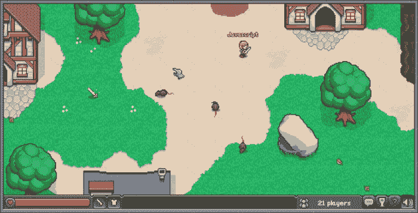

在本章中，我们将介绍以下主题：

*   分幅图优化
*   精灵级遮挡
*   高级碰撞检测

在本章末尾，我们将快速讨论可用于同类游戏的自顶向下视图的另一种变体：2.5D 或等轴测投影。

# 优化自上而下游戏的互动地图

我们在上一章中实现的平铺贴图对于侧边滚动条非常有效，因为侧边滚动条通常使用稀疏矩阵来定义其级别。这意味着，如果你的关卡有 100 个瓷砖长，7 个瓷砖高，那么它将包含少于 700 个瓷砖。这使我们能够在游戏开始时创建所有这些瓷砖。

对于一个典型的自上而下的游戏，我们发现自己处于一个非常不同的情况。实际上，为了渲染贴图，定义了所使用的平铺贴图的所有可能平铺。这意味着我们将至少有 700 个瓷砖用于相同的尺寸级别。如果我们使用许多层，情况会变得更糟。为了减少这个数量以提高性能，我们必须只生成启动时可见的磁贴。然后，当视图移动时，我们必须跟踪哪些平铺变为不可见并删除它们，以及哪些平铺变为可见并生成它们。

这里有一个折衷方案；添加和删除瓷砖需要时间，而且很有可能会使游戏速度减慢一点。另一方面，在场景中放置大量的瓷砖并四处移动会使渲染速度变慢。

理想情况下，在这两种技术之间进行选择就是测试这两种技术，并找出哪一种可以在目标平台上产生更好的结果。如果您真的需要它，您甚至可以使用一种混合解决方案，在该解决方案中，您可以为每个块生成平铺贴图。这将允许您在容忍由于创建和删除磁贴而导致的速度减慢时进行调整。

在这里，我们将修改框架以仅显示可见的分幅，这已经被证明对于这种游戏来说足够快，在这种游戏中，玩家以合理的速度移动，并且世界通常相当大。

## 发现可见的瓷砖

好的方面是，我们已经拥有了所需的大部分代码，以确定哪些瓷砖是可见的。事实上，我们有一个函数返回与长方体碰撞的瓷砖。要查找可见的分幅，我们只需要将此框定义为游戏屏幕。

```js
// find the visible part
var offset = gf.offset(parent);
var visible = gf.tilemapBox(options, {
       x:      -options.x - offset.x, 
       y:      -options.x - offset.y, 
       width:  gf.baseDiv.width(),
       height: gf.baseDiv.height()
});
```

在这里您可以看到，我们使用一个函数来查找平铺贴图的偏移量。这是必要的，因为它可能嵌套到一个或多个自身已移动的组中。

要找到偏移量，我们只需查看当前元素及其所有父元素。如果父对象不是精灵、组或平铺贴图，我们将停止。我们也会停止，如果家长是基础 div，也就是说，该 div 用来举行整个游戏。

```js
gf.offset = function(div){
   var options = div.data("gf");
   var x = options.x;
   var y = options.y;

   var parent = $(div.parent());
   options = parent.data("gf");
   while (!parent.is(gf.baseDiv) && options !== undefined){
      x += options.x;
      y += options.y;
      parent = $(parent.parent());
      options = parent.data("gf");
   }
   return {x: x, y: y};
}
```

为了确定父对象是组、精灵还是平铺贴图，我们检查是否存在与键“data”关联的对象。

除了我们找到可见框的部分，的`addTilemap`功能本身变化不大。以下是一个简短版本，突出显示了更改的部分：

```js
gf.addTilemap = function(parent, divId, options){
    var options = $.extend({
        x: 0,
        ...
    }, options);

    // find the visible part
 var offset = gf.offset(parent);
 var visible = gf.tilemapBox(options, {
 x:      -options.x - offset.x,
 y:      -options.x - offset.y,
 width:  gf.baseDiv.width(),
 height: gf.baseDiv.height()
 });
 options.visible = visible;

    //create line and row fragment:
    var tilemap = gf.tilemapFragment.clone().attr("id",divId).data("gf",options);
    for (var i=visible.y1; i < visible.y2; i++){
        for(var j=visible.x1; j < visible.x2; j++) {
            var animationIndex = options.map[i][j];

            ...
        }
    }
    parent.append(tilemap);
    return tilemap;
}
```

## 移动瓷砖地图

我们现在必须跟踪瓷砖地图的移动，以更新哪些是可见的。因为我们有两个函数来移动任何元素，所以我们只需要修改它们。

然而，我们不能仅仅在移动贴图时更新它们；我们还必须在它们的任何父元素移动时更新它们。jQuery 提供了一种非常简单的方法来确定元素的子元素或子元素是 tile 映射：`.find()`。此函数用于搜索与提供的选择器匹配的任何子元素。

当我们将类`gf_tilemap`添加到每个平铺贴图时，很容易检测到它们。以下代码是新的`gf.x`功能，突出显示了更改。`gf.y`功能完全相同。

```js
gf.x = function(div,position) {
    if(position !== undefined) {
        div.css("left", position);
        div.data("gf").x = position;

        // if the div is a tile map we need to update the visible part
        if(div.find(".gf_tilemap").size()>0){
 div.find(".gf_tilemap").each(function(){gf.updateVisibility($(this))});
 }
 if(div.hasClass("gf_tilemap")){
 gf.updateVisibility($(div));
 }
    } else {
        return div.data("gf").x; 
    }
}
```

如果其中一个子元素或元素本身是平铺贴图，我们需要更新它。我们通过`gf.updateVisibility()`函数来实现这一点。此函数仅在平铺图中找到新的可见性框，并将其与旧的可见性框进行比较。这意味着我们必须将此可见性存储在精灵的数据中。

以下代码是此功能的完整实现：

```js
gf.updateVisibility = function(div){
   var options = div.data("gf");
   var oldVisibility = options.visible;

    var parent = div.parent();

    var offset = gf.offset(div);
   var newVisibility = gf.tilemapBox(options, {
       x:      -offset.x,
       y:      -offset.y,
       width:  gf.baseDiv.width(),
       height: gf.baseDiv.height()
    });

    if( oldVisibility.x1 !== newVisibility.x1 ||
       oldVisibility.x2 !== newVisibility.x2 ||
       oldVisibility.y1 !== newVisibility.y1 ||
       oldVisibility.y2 !== newVisibility.y2){

       div.detach();

       // remove old tiles 
       for(var i = oldVisibility.y1; i < newVisibility.y1; i++){
          for (var j = oldVisibility.x1; j < oldVisibility.x2; j++){
             div.find(".gf_line_"+i+".gf_column_"+j).remove();
          }
       }
       for(var i = newVisibility.y2; i < oldVisibility.y2; i++){
          for (var j = oldVisibility.x1; j < oldVisibility.x2; j++){
             div.find(".gf_line_"+i+".gf_column_"+j).remove();
          }
       }
       for(var j = oldVisibility.x1; j < newVisibility.x1; j++){
          for(var i = oldVisibility.y1; i < oldVisibility.y2; i++){
             div.find(".gf_line_"+i+".gf_column_"+j).remove();
          }
       }
       for(var j = newVisibility.x2; j < oldVisibility.x2; j++){
          for(var i = oldVisibility.y1; i < oldVisibility.y2; i++){
             div.find(".gf_line_"+i+".gf_column_"+j).remove();
          }
       }
       // add new tiles

       for(var i = oldVisibility.y2; i < newVisibility.y2; i++){
          for (var j = oldVisibility.x1; j < oldVisibility.x2; j++){
             createTile(div,i,j,options);
          }
       }
       for(var i = newVisibility.y1; i < oldVisibility.y1; i++){
          for (var j = oldVisibility.x1; j < oldVisibility.x2; j++){
             createTile(div,i,j,options);
          }
       }
       for(var j = oldVisibility.x2; j < newVisibility.x2; j++){
          for(var i = oldVisibility.y1; i < oldVisibility.y2; i++){
             createTile(div,i,j,options);
          }
       }
       for(var j = newVisibility.x1; j < oldVisibility.x1; j++){
          for(var i = oldVisibility.y1; i < oldVisibility.y2; i++){
             createTile(div,i,j,options);
          }
       }
       div.appendTo(parent);

    }
    // update visibility
    options.visible = newVisibility;
}
```

前四个循环用于移除不再可见的现有瓷砖。我们只写两个循环，而不是测试要删除的 tile 是在顶部还是底部。代码中的第一个块被编写为要删除的块位于顶部。如下图所示，如果要删除的 tile 位于底部，则循环不会按`oldVisibility.y1 > newVisibility.y1`执行。

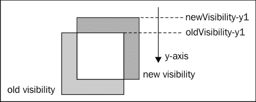

如果要从顶部、左侧或右侧删除平铺，情况也是如此。然后，我们使用完全相同的机制添加新的瓷砖。然而，有一件事我们必须小心；当我们首先水平添加瓷砖时，当我们垂直添加瓷砖时，我们必须确保不创建我们已经第二次创建的瓷砖。下图显示了重叠的分幅：

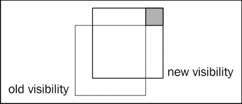

有更多优雅的方法可以做到这一点，但在这里，我们只需在创建瓷砖之前检查瓷砖是否存在。这是在`gf.createTile`功能中完成的。

```js
var createTile = function(div, i,j,options){
   var animationIndex = options.map[i][j];
   if(animationIndex > 0 && div.find(".gf_line_"+i+".gf_column_"+j).size() === 0){
       var tileOptions = {
            x: options.x + j*options.tileWidth,
            y: options.y + i*options.tileHeight,
            width: options.tileWidth,
            height: options.tileHeight
        }
        var tile = gf.spriteFragment.clone().css({
            left:   tileOptions.x,
            top:    tileOptions.y,
            width:  tileOptions.width,
            height: tileOptions.height}
        ).addClass("gf_line_"+i).addClass("gf_column_"+j).data("gf", tileOptions);

        gf.setAnimation(tile, options.animations[animationIndex-1]);

        div.append(tile);
    }
}
```

通过这两个更改，现在将动态生成平铺贴图。

# 遮挡物的分类

当使用自顶向下视图时，我们将遇到两种可能性中的一种：要么“相机”直视地面，要么略微倾斜。下图说明了两种情况：

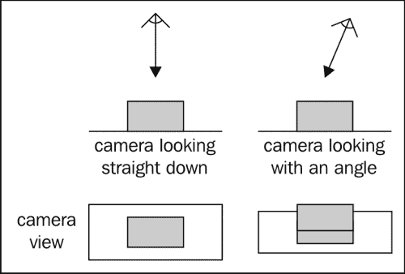

在第一种情况下，一个元素被另一个元素隐藏的唯一情况是它是否在它的正上方。很容易产生这种效果；我们可以简单地为每个高度使用一个组，并将精灵和平铺贴图放置在正确的组中。

例如，让我们考虑一个包含树和桥的层次，玩家可以在其中行走，就像下图所示：

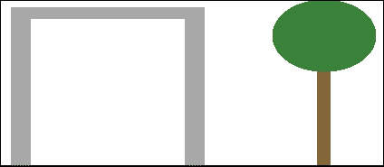

我们可以这样组织我们的游戏屏幕：

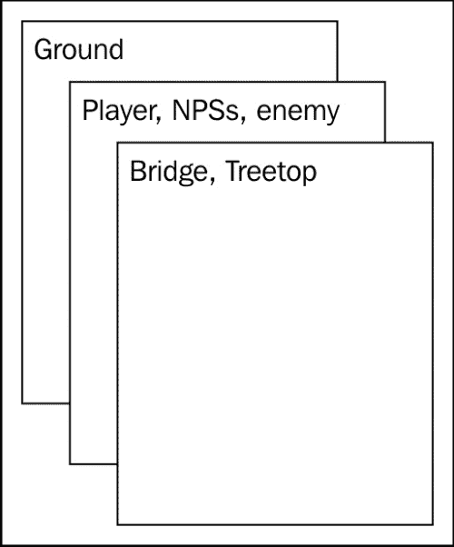

一旦这样做了，就没有什么可担心的了。如果某个 NPC（非玩家角色）或玩家在某个点上移或下移，我们只需将他们从一个组中移除并添加到另一个组中。

然而，大多数现代游戏都使用第二种类型的视图，这就是我们将用于小游戏的视图。从这个角度来看，可能隐藏它们的不仅是高于其他元素的元素，还有它们前面的元素。下图说明了这一点：

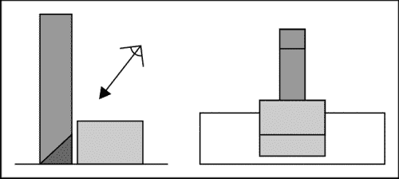

对于大多数游戏来说，设计一个严格通用的解决方案会有点过火，并且可能会产生一些性能问题。相反，我们将使用以下技巧来产生令人信服的效果。

## 精灵遮挡

如果我们做以下假设，精灵的情况就会变得简单：

*   地面非常平坦。可能有许多不同高度的平坦“楼层”，但每个楼层都是平的。
*   两个平层之间的高度差大于最大 NPC 或玩家的大小。

有了这些限制，我们可以使用以下两个规则来管理精灵遮挡：

*   如果一个精灵的楼层比另一个高，那么前者总是会隐藏后者
*   如果两个精灵位于同一楼层，y 坐标较大的精灵将始终隐藏另一个精灵

实现这一点最简单的方法是使用`z-index`CSS 属性。实现如下所示：

```js
gf.y(this.div, y);
this.div.css("z-index", y + spriteHeight);
```

在这里，我们需要添加雪碧高度到 Y 坐标，因为我们需要考虑的是遮挡的底部精灵，而不是顶部。

如果精灵高一层，我们将添加以确保其 z 索引大于上面楼层中的所有精灵。假设我们给每一个级别指定一个索引，0 表示最低级别，1 表示最高级别，依此类推；在这种情况下，从 y 坐标生成 z 索引的公式为：

```js
z-index = y-coordinate + spriteHeight + floorIndex * floorHeight
```

在我们的游戏中，我们所有的精灵将处于同一级别，因此我们不需要使用此功能，我们可以继续使用前面的代码。

## 水平与精灵遮挡

如果我们坚持与以前相同的假设，我们不需要做太多的工作来从背景生成精灵的遮挡。我们的级别是使用平铺贴图定义的。在设计关卡时，我们将把我们的瓷砖分成两个瓷砖贴图：一个是地板，另一个是上面的所有东西。

例如，让我们考虑一个有树和房子的场景：

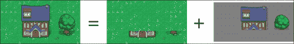

我们将把地面、房屋底部和树干存储在一张瓷砖地图中，我们将把房屋顶部和树叶存储在另一张地图中。

# 碰撞检测

碰撞检测与上一款游戏略有不同。当我们使用碰撞而不是与精灵边界框的每像素碰撞时，我们发现自己处于一种可能检测到只有精灵的不透明像素发生碰撞的情况下，如下图所示：

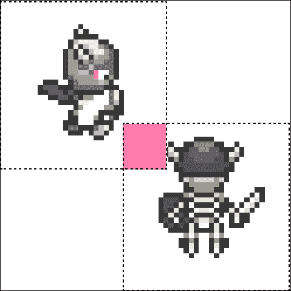

然而，这个问题有一个非常简单的解决方案，无需诉诸每像素或多边形碰撞检测；我们将使用第二个透明精灵创建我们真正想要用于碰撞检测的区域。

## 玩家与环境碰撞

在我们的游戏中，我们将使用 RPG 中常用的技巧；玩家化身将不仅由一个精灵组成，而且由精灵的叠加组成。这将允许我们改变阿凡达穿戴的盔甲，改变他使用的武器，他的发型，肤色，等等，而不必生成这些变体的所有可能组合。

在我们的游戏中，我们将只为玩家头像使用两个图像：玩家及其武器。我们将把他们分成一组；这将使移动它们变得容易。

对于这两个精灵，我们将首先添加一个透明精灵，该精灵将定义与环境碰撞的碰撞区域。下图正好显示了：

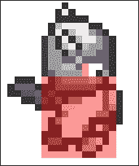

如你所见，我们选择了一个碰撞框，它与玩家头像的身体一样宽，但略短。这是为了说明玩家从下方接近障碍物的情况。如上图所示，他的头部将隐藏该物体底部的一部分。使用这个较小的碰撞框，我们会自动生成这种效果。

现在，我们不希望化身与关卡的每个元素发生冲突。例如，它不应该与地面或其上方的任何物体碰撞。

如果您还记得的话，我们以前将标高分为两个平铺贴图。为了使碰撞检测更容易，我们还将简单地将较低的一个一分为二：

*   一个包含所有不与玩家碰撞的地面元素
*   包含与玩家碰撞的所有元素的元素

这意味着我们现在有三个层次的平铺贴图。

可以想象，当我们手工编写所有数组时，设计这个级别并将所有的分片添加到正确的分片映射变得太复杂了。相反，我们将使用平铺贴图编辑器。

### 使用平铺贴图编辑器

有相当多的免费开放源码的地图编辑器。对于这个游戏，我们将使用平铺（[http://www.mapeditor.org/](http://www.mapeditor.org/) 。它的优点是允许将平铺映射导出到 JSON 文件。

我们将用于创建关卡的图像来自 Mozilla 的游戏 BrowserQuest。下图显示了它的一部分：

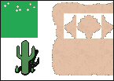

正如你所看到的，我们有用于草地的瓷砖，用于沙地的瓷砖，以及表示向沙地过渡的瓷砖。过渡瓷砖是半透明半沙质的。这使我们能够从任何其他类型的地面过渡到沙地。

这意味着我们将不得不使用另一个平铺贴图。下部的平铺贴图将分为两部分：一部分包含所有地面元素，另一部分包含包含透明像素且不与播放器碰撞的过渡元素。然而，我们总共有四张平铺图来绘制我们的关卡。例如，我们水平面的一部分有沙子、草和一棵树，看起来是这样的：

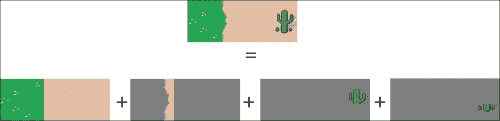

我们不会查看导入 Tiled 生成的 JSON 文件的整个代码。如果您想了解更多详细信息，只需查看`gf.importTiled`函数。重要的是我们使用 jQuery 的`$.ajax`函数。使用此函数，我们将能够加载 JSON 文件。诀窍是使用正确的参数调用它：

```js
$.ajax({
   url: url,
   async: false,
   dataType: 'json',
   success: function(json){...}
);
```

jQuery 还提供了一个名为`$.getJSON`的速记函数，但我们希望有一个同步调用，而这只有在`$.ajax`中才可能实现。通过这些调用，加载 JSON 文件后，将调用我们提供给 success 参数的函数。我们将在这个函数中导入文件。

如果您想了解我们是如何做到这一点的，您只需查看本章提供的代码即可。

现在我们正在使用`$.ajax`函数，我们只需要确保我们从服务器访问代码来测试它，因为在浏览器中简单地打开 HTML 文件将不再有效。如果您没有运行服务器，可以在 Windows（[上使用 EasyHPhttp://www.easyphp.org](http://www.easyphp.org) ），或 OS X 上的 MAMP（[http://www.mamp.info](http://www.mamp.info) ）。

## 玩家与精灵碰撞

我们这里只支持一种精灵对精灵碰撞检测：玩家攻击敌人或与 NPC 对话。像以前一样，我们需要一个透明的精灵来定义应该检测碰撞的区域。除此之外，此区域不在玩家身上，而是在玩家面前，如以下截图所示：

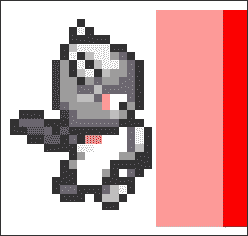

唯一的诀窍是，这个区域必须移动，以始终面向玩家所看的方向。如果我们使用上次游戏中使用的同一 OO 代码来实现玩家，它将如下所示：

```js
var player = new (function(){
    // the group holding both the player sprite and the weapon
    this.div = $();
    // the sprite holding the player's avatar
    this.avatar = $();
    // the sprite holding the weapon
    this.weapon = $();
    // the hit zone
    this.hitzone  = $();
    // collision zone
    this.colzone = $();

    //...

    this.update = function () {
        //...
    };

    this.left = function (){
        if(state !== "strike"){
            if(orientation !== "left" && moveY === 0 && moveX === 0){
                orientation = "left";
                gf.x(this.hitzone, 16);
                gf.y(this.hitzone, 16);
                gf.h(this.hitzone,  128 + 32);
                gf.w(this.hitzone, 64);
                //...

            }
            //...
        }
    };

    this.right = function (){
        //...
    };

    this.up = function (){
        //...
    };

    this.down = function (){
        if(state !== "strike"){
            if(orientation !== "down" && moveY === 0 && moveX === 0) {
                orientation = "down";
                state = "walk";
                gf.x(this.hitzone, 16);
                gf.y(this.hitzone, 192-80);
                gf.w(this.hitzone,  128 + 32);
                gf.h(this.hitzone, 64);
                //...
            }
            //...
        }
    };

    //...
});
```

代码中突出显示的部分显示了我们在哪里更改碰撞区的位置，以便与 NPC 和敌人进行交互。我们称之为精灵命中区域，因为它代表了玩家挥舞剑所覆盖的区域。

要为这个命中区域选择正确的大小和位置，您必须根据您使用的图像对其进行微调。

在主游戏循环中，我们将检查此区域与 NPC 列表以及敌人之间的冲突。

```js
this.detectInteraction = function(npcs, enemies, console){
    if(state == "strike" && !interacted){
        for (var i = 0; i < npcs.length; i++){
            if(gf.spriteCollide(this.hitzone, npcs[i].div)){
                npcs[i].object.dialog();
                interacted = true;
                return;
            }
        }
        for (var i = 0; i < enemies.length; i++){
            if(gf.spriteCollide(this.hitzone, enemies[i].div)){
                // handle combat
                interacted = true;
                return;
            }
        }
    }
};
```

### 与 NPC 对话

我们将与 NPC 实现的唯一交互是单向对话。当玩家点击 NPC 时，我们将显示一行对话框。如果他再次点击，NPC 还有更多的话要说，我们将显示下一行对话。

我们将使用屏幕底部的一行显示此文本。这条线必须是半透明的，以便让玩家看到它后面的水平，并且必须覆盖游戏的所有元素。这就是我们将如何创建它：

```js
container.append("<div id='console' style='font-family: \"Press Start 2P\", cursive; color: #fff; width: 770px; height: 20px; padding: 15px; position: absolute; bottom: 0; background: rgba(0,0,0,0.5); z-index: 3000'>");
```

这种类型的接口通常称为控制台。为了使其半透明，并且仍然使其内部的文本不透明，我们通过调用`rgba()`函数来应用透明背景色。为了确保它能覆盖所有游戏元素，我们给它一个足够大的 z 索引。

要在此控制台中显示文本，我们只需使用`.html()`。以下代码是 NPC 的完整实现：

```js
var NPC = function(name, text, console){
    var current = 0;

    this.getText = function(){
        if(current === text.length){
            current = 0;
            return "[end]";
        }
        return name + ": " + text[current++];
    };

    this.dialog = function(){
        console.html(this.getText());
    }
}
```

这就是我们将如何实例化其中一个：

```js
npcs.push({
    div: gf.addSprite(npcsGroup,"NPC1", {
        x:      800,
        y:      800,
        width:  96,
        height: 96
    }),
    object: new NPC("Dr. Where", ["Welcome to this small universe...","I hope you will enjoy it.","You should head east from here...","there's someone you may want to meet."], console)
});
npcs[npcs.length-1].object.div = npcs[npcs.length-1].div;
gf.setAnimation(npcs[npcs.length-1].div, new gf.animation({
    url: "npc/scientist.png"
}));
$("#NPC1").css("z-index",800 + 96);
```

这里没什么特别的；我们只需要确保也设置了正确的 z 索引。

### 与敌人战斗

为了对抗敌人，我们将模拟掷骰子。战斗规则在 RPG 中非常典型：玩家向玩家掷骰子，并将其添加到一个称为攻击修正值的固定值中。这将生成玩家的攻击值。敌人将试图通过向敌人投掷骰子来防御自己，并将其添加到自己的防御修改器中。

如果玩家的攻击大于敌人的防御，则攻击成功，敌人将遭受等同于玩家攻击的生命损失。如果敌人的防御能力更强，攻击就会失败，敌人仍然安全。

以下代码是此机制的实现：

```js
if(gf.spriteCollide(this.hitzone, enemies[i].div)){
    var enemyRoll = enemies[i].object.defend();
    var playerRoll = Math.round(Math.random() * 6) + 5;

    if(enemyRoll <= playerRoll){
        var dead = enemies[i].object.kill(playerRoll);
        console.html("You hit the enemy "+playerRoll+"pt");
        if (dead) {
            console.html("You killed the enemy!");
            enemies[i].div.fadeOut(2000, function(){
                $(this).remove();
            });
            enemies.splice(i,1);
        }
    } else {
        console.html("The enemy countered your attack");
    }
    interacted = true;
    return;
}
```

在这里，我们使用控制台向玩家显示战斗进度。战斗的公式可能会根据其他参数而有所不同，例如玩家使用的武器和敌人的装甲提供的奖励。在决定罢工是否成功时，你要考虑的是你要考虑什么。

我们没有实施这一点，但敌人的反击将完全相同。

# 完整的游戏

这场比赛到此为止。所有其余的实现都直接取自我们在[第 4 章](04.html "Chapter 4. Looking Sideways")*中创建的游戏，从侧面看*。我们使用与玩家和其他精灵相同的面向对象代码来解决玩家和关卡之间的冲突。

一个很好的练习是让敌人四处移动并攻击玩家，为玩家设置一个体验和生活栏，设计一个更大的世界和更多的 NPC，让故事更有趣。事实上，这正是 RPG 如此适合编写的原因；它们是讲故事的绝佳媒介！

另一种改进游戏的方法是使用等距投影，而不是正交投影。解释如何编写通用等距引擎超出了本书的范围，但如果您想了解更多信息，您可以阅读*Andres Pagela*（[的*使用 HTML5、CSS3 和 JavaScript*制作等距社交实时游戏 http://shop.oreilly.com/product/0636920020011.do](http://shop.oreilly.com/product/0636920020011.do) ).

# 等距瓷砖

处理等距瓷砖时有两个困难。首先，显示带有 DOM 元素的正交网格非常简单，而显示等轴测网格则更复杂。其次，遮挡更难计算。

## 绘制等距瓷砖图

我们将在这里使用技巧来生成我们的瓷砖地图。我们的每个磁贴都将存储在一个区域中，在该区域中，它们被透明像素包围，从而形成方形，如下图所示：

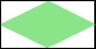

为了实现这个神奇的效果，我们将使用两个法线平铺贴图来显示一个等距贴图。它们将重叠，但它们之间的偏移量等于一块瓷砖高度和宽度的一半。下图显示了它的外观：

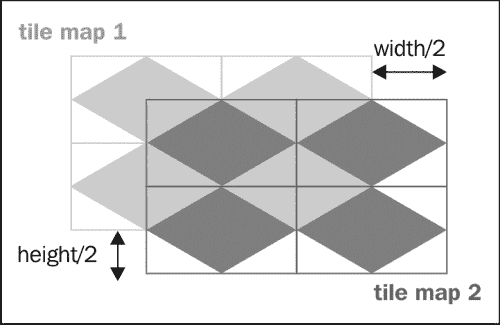

## 等轴测游戏的遮挡

等距游戏的遮挡比正交游戏更难管理。在这种情况下，您不能简单地使用层来生成正确的遮挡。相反，您必须为位于标高中的每个“块”（例如墙、树、对象和其他）指定 z 索引。

这个遮挡的值将取决于它的坐标，就像之前玩家、NPC 和敌人的情况一样。这意味着您需要对平铺贴图进行后期处理并生成它们。这个过程可能非常复杂，需要自动化，如果游戏中的元素数量相当少，您可能需要手动完成。否则，您将需要对每个块所属的位置建立某种 3D 模型。

# 总结

在本章中，您学习了如何充分利用平铺贴图的潜力。现在，您可以使用本章和上一章中学习的技巧编写各种各样的游戏。您可能会发现，在编写游戏时遇到的问题往往是相同的。然而，最佳解决方案通常取决于游戏的限制和约束。

当你开始编写游戏时，不要试图实现一个通用的解决方案，而是首先关注你的特定情况。结果很可能会更快，更容易维护，并且花费更少的时间来实现。

在下一章中，我们将学习如何使用我们在[第 4 章](04.html "Chapter 4. Looking Sideways")*中创建的 platformer*来实现一个多层次的游戏。