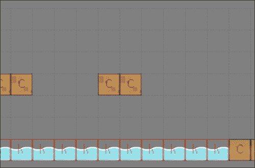
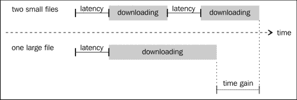

# 六、为游戏添加关卡

到目前为止，我们所有的比赛都只有一个级别。这对于演示或概念验证来说很好，但是你可能希望在游戏中有很多关卡。像往常一样，有很多方法可以做到这一点，但大多数都是基于这样的想法，即每个级别都由它们自己的文件（或多个文件）描述。

我们将从快速探索组合文件创建游戏的不同方式开始本章。然后，我们将介绍允许使用这种技术的 jQuery 函数。

最后，我们将以我们在[第 4 章](04.html "Chapter 4. Looking Sideways")*中开发的游戏*为例，通过实现前面描述的一些技术，将其扩展到包括三个级别。

以下是我们将在本章中介绍的主题的快速列表：

*   在游戏中使用多个文件
*   使用`$.ajax`加载文件
*   执行远程 JavaScript
*   为我们的游戏添加新关卡

# 实现多文件游戏

你必须问自己的第一件事是，“什么时候加载其他文件？”经典方法是有简单的级别，并在前一个级别的末尾加载下一个级别。这是平台游戏的典型场景。

另一种方法是有一个大级别，并在到达给定点时加载一个子级别。通常，在 RPG 中，大层是外部世界，次层是建筑内部。在这两个示例中，不需要异步加载文件。

最后一种常见的方法是由多个子级别组成一个非常大的级别。这是 MMORPG 的典型功能。在这里，您需要异步加载文件，以便播放器不会注意到必须加载子级别。

你将面临的挑战很大程度上取决于你所处的上述情况。它们可以分为以下三种：加载一个瓷砖贴图、一个精灵和一个逻辑行为。

## 加载瓷砖贴图

如果您还记得，在[第 5 章](05.html "Chapter 5. Putting Things into Perspective")中*将事物放到透视图*中，我们以 JSON 文件的形式加载了瓷砖贴图。如前所述，我们加载一个 JSON 文件，其中包含平铺映射的描述。为此，我们使用 jQuery 中的基本 AJAX 函数：`$.ajax()`。稍后我们将看到有关使用此函数的所有详细信息。

然而，仅仅加载平铺贴图通常不足以完全描述您的级别。你可以指定关卡的终点在哪里，哪些区域会杀死玩家，等等。一种常见的技术是使用辅助平铺贴图，该贴图是不可见的，并保存平铺，为其他平铺贴图添加意义。

下图显示了这方面的示例：



这有几个优点：

*   您可以很容易地为不同的瓷砖赋予相同的语义。例如，带草或不带草的瓷砖可以表示地面，并以完全相同的方式与玩家交互。
*   您可以为使用完全不同的平铺集的两个级别的平铺赋予相同的语义。这样，您就不必担心在关卡中使用了哪些图像，只要它们使用相同的逻辑分幅来建模。

实现这一点并不难。以下代码显示`gf.addTilemap`功能的变化：

```js
gf.addTilemap = function(parent, divId, options){
    var options = $.extend({
        x: 0,
        y: 0,
        tileWidth: 64,
        tileHeight: 64,
        width: 0,
        height: 0,
        map: [],
        animations: [],
        logic: false
    }, options);

    var tilemap = gf.tilemapFragment.clone().attr("id",divId).data("gf",options);

    if (!options.logic){

       // find the visible part
       var offset = gf.offset(parent);
       var visible = gf.tilemapBox(options, {
          x:      -options.x - offset.x,
          y:      -options.x - offset.y,
          width:  gf.baseDiv.width(),
          height: gf.baseDiv.height()
       });
         options.visible = visible;

       //create line and row fragment:
       for (var i=visible.y1; i < visible.y2; i++){
           for(var j=visible.x1; j < visible.x2; j++) {
               var animationIndex = options.map[i][j];

               if(animationIndex > 0){
                   var tileOptions = {
                       x: options.x + j*options.tileWidth,
                       y: options.y + i*options.tileHeight,
                       width: options.tileWidth,
                       height: options.tileHeight
                   }
                   var tile = gf.spriteFragment.clone().css({
                       left:   tileOptions.x,
                       top:    tileOptions.y,
                       width:  tileOptions.width,
                       height: tileOptions.height}
                   ).addClass("gf_line_"+i).addClass("gf_column_"+j).data("gf", tileOptions);

                   gf.setAnimation(tile, options.animations[animationIndex-1]);

                   tilemap.append(tile);
               }
           }
       }
    }
    parent.append(tilemap);
    return tilemap;
}
```

正如您所看到的，我们只需添加一个标志来指示平铺映射是否出于逻辑目的。如果是这样，我们不需要在其中创建任何平铺。

碰撞检测功能现在也略有修改。对于逻辑平铺映射，我们不能简单地返回 div。相反，我们将返回一个对象文本，其中包含碰撞分幅的大小、位置和类型。以下代码摘录正好显示了这一点：

```js
gf.tilemapCollide = function(tilemap, box){
    var options = tilemap.data("gf");
    var collisionBox = gf.tilemapBox(options, box);
    var divs = []

    for (var i = collisionBox.y1; i < collisionBox.y2; i++){
        for (var j = collisionBox.x1; j < collisionBox.x2; j++){
            var index = options.map[i][j];
            if( index > 0){
               if(options.logic) {
 divs.push({
 type:   index,
 x:      j*options.tileWidth,
 y:      i*options.tileHeight,
 width:  options.tileWidth,
 height: options.tileHeight
 });
 } else {
                   divs.push(tilemap.find(".gf_line_"+i+".gf_column_"+j));
             }
            }
        }
    }
    return divs;
}
```

一旦实现了此功能，就很容易加载该级别。事实上，只要存在逻辑磁贴地图，并且游戏代码知道如何对每个磁贴做出反应，我们就不需要更多的东西来让玩家对其环境做出反应。

## 装载精灵及其行为

如果从不同的文件加载一个平铺贴图非常简单，那么有很多方法可以对关卡中包含的精灵执行相同的操作。

您可以为 JSON 文件实现一个解释器，该解释器将依次创建和配置敌人和 NPC。这样做的好处是您可以将此 JSON 与描述平铺映射的 JSON 合并。这样，您只需要加载一个文件，而不是两个。由于加载的每个文件都有相当大的开销，因此文件的大小几乎没有影响；在大多数情况下，它会使你的水平负荷更快。下图说明了这一点：



它也有一些缺点：首先，你的引擎必须被编写成能够理解你可能希望你的敌人采取的每一种可能的行为。这意味着，如果你有一种敌人在游戏的第十级中只使用一次，你仍然需要在启动游戏的同时加载它的实现。如果你在一个团队中工作，而其他成员想要实现他们自己类型的敌人，他们将需要修改引擎，而不仅仅是在他们的级别上工作。

您还需要非常小心地指定一种 JSON 格式来满足您的所有需求，否则您将冒着以后重构游戏大部分内容的风险。下面的代码是这样一个 JSON 文件的示例，类似于下面的代码：

```js
{
   "enemies" : [
      {
         "name" : "Monster1",
         "type" : "spider",
         "positionx" : 213,
         "positiony" : 11,
         "pathx" : [250,300,213],
         "pathy" : [30,11,11]
      },
      {
         "name" : "Monster2",
         "type" : "fly",
         "positionx" : 345,
         "positiony" : 100,
         "pathx" : [12,345],
         "pathy" : [100,100]
      }   
   ],
   "npcs" : [
      {
         "name" : "Johny",
         "type" : "farmer",
         "positionx" : 202,
         "positiony" : 104,
         "dialog" : [
            "Hi, welcome to my home,",
            "Feel free to wander around!"
         ]
      }
   ]
}
```

另一个可能的实现是加载一个完整的脚本，该脚本将依次创建敌人并对其进行配置。这个的优点是让你的游戏更加模块化，并放松游戏和关卡之间的耦合。

但它有几个缺点。首先，如果你不小心，你级别的代码可能会覆盖一些主要游戏变量。这将创建很难跟踪的 bug，这取决于加载级别的顺序。其次，在选择变量范围时必须格外小心，因为每个新加载的级别的代码都是在全局范围内执行的。

在本章给出的示例中，我们将选择第二种解决方案，因为它对于小游戏来说是有意义的，并且非常灵活。

无论您选择实现哪一个，您都很可能使用`$.ajax`或其别名之一。在下一节中，我们将详细介绍它。

## 使用$.ajax

`$.ajax`函数是一个非常强大但级别较低的函数。它有许多别名，可用于不同的特定任务：

*   `$.get`是一个多用途别名，与`$.ajax`相比，它减少了选项的数量，并且有一个基于多个可选参数而不是单个对象文本的 API。它总是异步加载文件。
*   `$.getJSON`是用于异步加载 JSON 文件的函数。
*   `$.getScript`是一个异步加载脚本然后执行的函数。
*   `$.load`是一个异步加载 HTML 文件并将其内容注入所选元素的函数。
*   `$.post`与`$.get`类似，但使用 post 请求。

正如您所看到的，所有这些别名都有一个共同点：它们都异步加载文件。这意味着，如果您希望同步加载资源，那么您将返回使用`$.ajax`。但是，请放心，一旦知道正确的参数，它实际上并不比别名更复杂。此外，别名的 API 文档始终包含用于`$.ajax`调用的确切参数，以达到相同的效果。

使用`$.ajax`时，您必须确保通过服务器访问文件，并且遵守同源策略。否则，您可能会在大多数浏览器上遇到问题。要了解更多关于`$.ajax`的信息，您应该查看 jQueryAPI 官方文档（[http://api.jquery.com/jQuery.ajax/](http://api.jquery.com/jQuery.ajax/) ）。

## 加载 JSON 文件

JSON 文件是一种非常方便的加载外部数据的方式，无需自己解析。加载后，JSON 文件通常存储在简单的 JavaScript 对象中。然后，您只需查找其属性即可访问数据。

如果您想用`$.ajax`模拟对`$.getJSON`的调用，它将类似于以下代码：

```js
$.ajax({
  url: url,
  dataType: 'json',
  data: data,
  success: callback
});
```

这里，`url`是 JSON 文件的网址，`data`是您可能希望传递给服务器的可选参数列表，和`success`是加载 JSON 文件后将处理该文件的回调。如果要同步访问远程文件，则必须在调用中添加参数`async``:``false`。

您将在回调中决定如何处理 JSON 文件；它将有以下签名：

```js
var callback = success(data, textStatus, jqXHR)
```

这里，`data`保存从 JSON 文件生成的对象。您将如何使用它实际上取决于您的用例；下面是导入平铺生成的平铺贴图的代码的简短版本：

```js
success: function(json){
    //...

   var layers = json.layers;
   var usedTiles = [];
   var animationCounter = 0;
   var tilemapArrays = [];

   // Detect which animations we need to generate
   // and convert the tiles array indexes to the new ones
   for (var i=0; i < layers.length; i++){
      if(layers[i].type === "tilelayer"){
         // ...
         tilemapArrays.push(tilemapArray);
      }
   }
   // adding the tilemaps
   for (var i=0; i<tilemapArrays.length; i++){
      tilemaps.push(gf.addTilemap(parent, divIdPrefix+i, {
         x:          0,
         y:          0,
         tileWidth:  tileWidth,
         tileHeight: tileHeight,
         width:      width,
         height:     height,
         map:        tilemapArrays[i],
         animations: animations,
         logic: (layers[i].name === "logic")
         }));
      }
   }
});
```

突出显示的部分非常典型。事实上，大多数非平凡的 JSON 将包含一个元素数组，以便能够描述任意数量的类似实体。当您不是 JSON 文件规范的设计者时，您可能会发现自己必须将 JSON 对象的内容转换为自己的数据结构。这正是这段代码的作用。

这里没有一般的方法，你必须单独考虑每种情况。好的是，在大多数情况下，这段代码在游戏中只执行了几次，因此在性能方面是不明智的。你最好让它尽可能可读，而不是搜索所有可以让它运行得更快的地方。

## 加载远程脚本

如果您想要模仿`$.getScript`与`$.ajax`的用法，它将如下所示：

```js
$.ajax({
  url: url,
  dataType: "script",
  success: success
});
```

正如我们前面所做的，只需将`async : false`添加到参数列表中，即可使其同步。这将做两件事：加载脚本并执行它。回调在这里并不重要，它只允许您跟踪文件是否成功检索。

如前所述，脚本将在全局范围内执行。这对您的代码组织有一定的影响。到目前为止，我们游戏的代码如下所示：

```js
$(function() {
    var someVariable = "someValue";

    var someFunction = function(){
        //do something
    }
});
```

在这里，所有函数和变量都定义在“私有”范围内，不能从外部接触。这意味着如果您的远程代码尝试执行以下操作，它将失败：

```js
var myVariable = someVariable;
someFunction();
```

事实上，函数`someFunction`和`someVariable`在全局范围内是不可见的。解决方案是仔细选择应该从远程代码中看到的变量和函数，并将它们放在全局范围内。在我们的情况下，它可能如下所示：

```js
var someVariable = "someValue";    
var someFunction = function(){
    //do something
}

$(function() {
    // do something else
});
```

您可能希望将所有这些都保存在一个名称空间中，就像我们为框架所做的那样。当你在写一个最终产品，而这个产品不太可能被其他产品用作图书馆时，它更多地与个人偏好有关。

## 调试对$.ajax 的调用

现在我们正在加载远程文件，可能会出现新的问题：文件的 URL 可能不再有效，服务器可能已关闭，或者文件格式可能不正确。在生产环境中，您可能希望在运行时检测这些事件，以便向用户显示消息，而不是简单地崩溃。在开发阶段，为了调试代码，您可能需要准确地找出出错的地方。

jQuery 提供了三个可用于执行此操作的函数：。`done()`、`.fail()`和`.always()`。以前还有三种（`.success()`、`.error()`和`.complete()`，但自从 jQuery1.8 以来，它们就被弃用了。

### .完成（）

可以使用`.done()`代替成功回调。只有成功加载文件后才会调用它。将使用以下三个参数按此顺序调用提供的函数：`data`、`textStatus`、`jqXHR`。

`data`是加载的文件，这意味着您可以在那里处理 JSON 文件，如果您愿意的话。

### .fail（）

无论何时出现问题，都会调用`.fail()`。将使用以下三个参数按此顺序调用提供的函数：`jqXHR`、`textStatus`、`exception`。

在加载和执行脚本时，很容易发现脚本未执行时发生的情况。实际上，异常不会出现在大多数浏览器的调试控制台中，但是异常参数将包含代码引发的确切异常。

例如，如果我们查看前面描述的范围问题，其中主游戏包含以下代码：

```js
$(function() {
    var someVariable = "someValue";

    var someFunction = function(){
        //do something
    }
});
```

还有这样一个远程脚本：

```js
someFunction();
```

您可以通过以下方式捕获异常：

```js
$.getScript("myScript.js").fail(function(jqxhr, textStatus, exception) {
    console.log("Error: "+exception);
});
```

并且以下错误将写入控制台：

```js
error: ReferenceError: someFunction is not defined
```

这将用于检测其他问题，如服务器无响应等。

# 修改我们的平台游戏

我们现在具备了创建多层次游戏所需的所有知识。首先，我们将创建一个级别列表和一个加载它们的函数：

```js
var levels = [
        {tiles: "level1.json", enemies: "level1.js"},
        {tiles: "level2.json", enemies: "level2.js"}
    ];

    var currentLevel = 0;

    var loadNextLevel = function(group){
        var level = levels[currentLevel++];
        // clear old level
        $("#level0").remove();
        $("#level1").remove();
        for(var i = 0; i < enemies.length; i++){
            enemies[i].div.remove();
        }
        enemies = [];

        // create the new level

        // first the tiles
        gf.importTiled(level.tiles, group, "level");

        // then the enemies
        $.getScript(level.enemies);

        // finaly return the div holdoing the tilemap
        return $("#level1");
    }
```

突出显示的行是用于远程加载文件的行。这将使用前面描述的函数。正如你所看到的，没有任何机制可以检测到游戏结束了。如果你愿意，你可以加一个作为家庭作业！

在加载下一个关卡之前，我们必须确保删除现有关卡及其包含的敌人。

现在我们将把游戏改为使用逻辑图块而不是标准图块。这样我们就可以有一种瓷砖，它定义了一个级别的结束。下面是经过修改的碰撞检测代码，可以做到这一点：

```js
var collisions = gf.tilemapCollide(tilemap, {x: newX, y: newY, width: newW, height: newH});
var i = 0;
while (i < collisions.length > 0) {
    var collision = collisions[i];
    i++;
    var collisionBox = {
        x1: collision.x,
        y1: collision.y,
        x2: collision.x + collision.width,
        y2: collision.y + collision.height
    };

    // react differently to each kind of tile
    switch (collision.type) {
        case 1:
            // collision tiles
            var x = gf.intersect(newX, newX + newW, collisionBox.x1,collisionBox.x2);
            var y = gf.intersect(newY, newY + newH, collisionBox.y1,collisionBox.y2);

            var diffx = (x[0] === newX)? x[0]-x[1] : x[1]-x[0];
            var diffy = (y[0] === newY)? y[0]-y[1] : y[1]-y[0];
            if (Math.abs(diffx) > Math.abs(diffy)){
                // displace along the y axis
                 newY -= diffy;
                 speed = 0;
                 if(status=="jump" && diffy > 0){
                     status="stand";
                     gf.setAnimation(this.div, playerAnim.stand);
                 }
            } else {
                // displace along the x axis
                newX -= diffx;
            }
            break;
        case 2:
            // deadly tiles
            // collision tiles
            var y = gf.intersect(newY, newY + newH, collisionBox.y1,collisionBox.y2);
            var diffy = (y[0] === newY)? y[0]-y[1] : y[1]-y[0];
            if(diffy > 40){
                status = "dead";
            }
            break;
        case 3: 
 // end of level tiles
 status = "finished"; 
 break;
    }

}
```

正如你所看到的，我们已经增加了玩家在他/她击中一些瓷砖时死亡的可能性。这将使他/她在当前级别开始时重新出现。如果瓷砖类型为 3，我们将玩家的状态设置为`finished`。稍后，我们检测状态并加载下一级。

```js
if (status == "finished") {
    tilemap         = loadNextLevel(group);
    gf.x(this.div, 0);
    gf.y(this.div, 0);
    status = "stand";
    gf.setAnimation(this.div, playerAnim.jump);
}
```

不要忘记休息球员的位置，否则，它会出现在中间的下一个级别，而不是在其起点。

我们现在必须编写每个脚本，为他们各自的级别创建敌人。这段代码与我们在上一版本游戏中使用的代码几乎完全相同，但放在一个单独的文件中：

```js
var group = $("#group");

var fly1   = new Fly();
fly1.init(
    gf.addSprite(group,"fly1",{width: 69, height: 31, x: 280, y: 220}),
    280, 490,
    flyAnim
);
enemies.push(fly1);

var slime1 = new Slime();
slime1.init(
    gf.addSprite(group,"slime1",{width: 43, height: 28, x: 980, y: 392}),
    980, 1140,
    slimeAnim
);
enemies.push(slime1);

var slime2 = new Slime();
slime2.init(
    gf.addSprite(group,"slime2",{width: 43, height: 28, x: 2800, y: 392}),
    2800, 3000,
    slimeAnim
);
enemies.push(slime2);
```

正如您可能已经想到的，我们不能简单地运行游戏并使用该脚本，而不进一步修改我们的代码。正如我们前面所说的，远程脚本将在全局范围内执行，我们需要将它使用的部分移动到它。

在这里，我们需要敌人的对象和动画以及包含敌人列表的数组。我们只需将它们从结束中取出，并将它们添加到游戏脚本的开头：

```js
var enemies = [];
var slimeAnim = {
    stand: new gf.animation({
        url: "slime.png"
    }),
    // ...

}
var flyAnim = {
    stand: new gf.animation({
        url: "fly.png"
    }),
    // ...}

var Slime = function() {
    // ...
};
var Fly = function() {}
Fly.prototype = new Slime();
Fly.prototype.dies = function(){
    gf.y(this.div, gf.y(this.div) + 5);
}

$(function() {
   // here come the rest of the game
});
```

现在游戏将包含我们想要的任意多个关卡。享受关卡编辑器的乐趣！在这里，我们使用脚本只是为了设置敌人，但是如果我们愿意，我们可以使用它来更改关卡背景。

# 总结

使你的游戏多层次增加了一些新的技巧到你的袖子。现在，您已经学会了将资产划分为多个文件，并在需要时加载它们。您还学习了如何使用平铺来描述逻辑行为，而不仅仅是级别的图形方面。

如前所述，为了让游戏变得真正有趣，我们可以做更多的事情。我会建议在水平设计上花一些时间。在大多数商业游戏中，这是花费大部分时间的地方，所以不要犹豫，暂时停止编码，开始制作和测试你的关卡吧！

在下一章中，您将学习如何制作多人游戏。为此，我们将使用我们在[第 5 章](05.html "Chapter 5. Putting Things into Perspective")中创建的游戏*透视*，并以与我们在本章中使用的[第 4 章](04.html "Chapter 4. Looking Sideways")中的游戏相同的方式为其添加新功能*侧视*。