# 八、让我们开始社交

自从第一款电子游戏问世以来，人们就一直使用一种简单的技巧来保持游戏的趣味性——**排行榜**。排行榜是让玩家继续玩游戏的简单方法。球员们每次都会努力表现得更好，比他们的朋友更好，或者比世界上任何其他球员都好。

社交网络通过允许游戏将玩家的分数发布到他/她的时间线（或提要），为这个简单的想法增加了一个新的维度。这有很多优点，其中之一是它将帮助潜在的新玩家了解您的游戏。如果他们看到他们的一个朋友刚刚玩了你的游戏，那么他们可能也想试试！

在本章中，我们将首先展示如何使用与前一章中相同的技术实现一个简单的服务器端排行榜。然后，我们将看到如何允许玩家使用他/她的 Twitter 帐户登录到游戏中，并代表他/她发布分数。

最后，我们将看到如何使用 Facebook 登录游戏，在玩家的时间线中发布事件，并创造成就。

当你使用 Facebook 或 Twitter 时，要意识到这一点很重要，那就是你必须小心遵守他们制定的规则，甚至随时了解规则的变化，以保持游戏的合规性。人们不止一次看到，以前被允许使用这些服务的应用程序或游戏随后被禁止。

我们将向您展示如何使用这两个社交网络，但基本机制对于提供相同功能的几乎所有服务都是相同的。

我们将按以下顺序介绍这些主题：

*   创建简单的自托管排行榜
*   使作弊更加困难
*   将游戏与 Twitter 集成，允许玩家在 Twitter 上发布自己的分数
*   将游戏与 Facebook 整合，让玩家获得成就

# 创建一个简单的排行榜

显然，创建排行榜需要某种数据库来记录分数。与前一章一样，我们将使用 PHP 和 MySQL 实现游戏的服务器端。然而，与[第 7 章](07.html "Chapter 7. Making a Multiplayer Game")中的*制作多人游戏*不同，一起玩这里介绍的解决方案在现实生活中是可行的。请求和保存高分是一项占用很少服务器资源的操作，而且不经常调用；对于每个用户，我们大约每 10 秒查询一次服务器，而不是在[第 7 章](07.html "Chapter 7. Making a Multiplayer Game")*制作多人游戏*中，我们每秒多次查询 MMORPG。

首先，我们需要一个指标作为分数。在这里，我们将简单地使用玩家完成一个关卡所花费的时间，以秒为单位。下图显示了我们将使用的用户交互工作流：

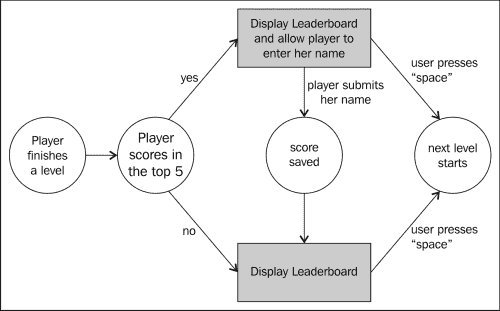

作为一个 UI，我们将使用两个屏幕，我们将以与上一章简单`div`元素相同的方式实现界面，我们将根据需要使其可见或不可见。

第一个屏幕只是宣布关卡的开始，并提示用户做好准备。第二个更复杂。它显示球员的结果，前五名球员的名单，如果球员在其中得分，给他/她机会将他的名字保存在此名单中。下面的屏幕截图显示了这将是什么样子：

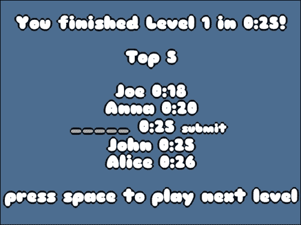

我们选择使用这种机制，而不是在游戏开始时询问用户名，然后自动保存分数，因为这模仿了旧街机游戏的行为。

这意味着有两个服务器端操作：

1.  检索某个级别的前五名分数列表。
2.  保存给定级别的分数。

我们将使用两个文件来实现这两个操作，即`highscore.php`和`save.php`。

## 保存高分

我们将使用的数据库表包含三列：

*   `Level`：保存该级别索引的整数
*   `Name`：这是一个包含用户名的字符串
*   `Time`：这是一个整数，表示用户完成关卡所需的秒数

保存 highscore 的脚本非常简单，我们将把名称、分数和级别传输到服务器。然后，我们将使用以下 SQL 查询将它们保存到数据库中：

```js
INSERT INTO scores (level, name, time) VALUES (1, "John", 36)
```

脚本的其余部分与我们在上一章中看到的内容非常相似，因此我们不会在这里复制它，但是如果需要，您可以查看完整的源代码。

## 找回高分

要检索高分，您可以简单地向服务器提供级别并获得分数，但我们选择了一种稍微复杂一点的机制。我们的任务是确定当前用户是否是前五名列表的一部分，如果是，在哪个位置。这将允许您稍后实施反作弊措施。

因此，您将向服务器提供级别和用户时间，它将返回一个 JSON 文件，其中包含生成排行榜屏幕所需的所有信息。我们为 JSON 选择了以下格式：

```js
{ 
  "top" :[
    {"name": "Joe", "time": 14},
    {"name": "John", "time": 15}, 
 {"time": 17},
    {"name": "Anna", "time": 19}
  ],
 "intop": true, 
 "pos": 2
} 
```

这里的想法是要有一个标志，表明玩家在前五名名单中，`intop`。如果此标志为真，则另一个名为`pos`的变量也存在。这个变量保存数组中的索引`top`，它保存玩家的时间。`top`中的所有其他条目都是排行榜中球员的得分，从第一名到第五名排序。如果`intop`为 false，则阵列仅保存其他玩家的分数。

要生成此响应，我们将首先使用 SQL 查询：

```js
SELECT * FROM scores WHERE level=1 ORDER BY time ASC LIMIT 5
```

此查询开始时与我们迄今为止使用的其他查询类似，但在最后（在上面的代码中突出显示），它是一个修饰符，指定您希望结果按升序时间（`ORDER BY time ASC`）排序，并且我们只需要五个结果（`LIMIT 5`）。

要解析结果并生成 JSON，没有多少工作要做。唯一的微妙之处是插入球员的分数，如果它足够好的话。以下是此页面的完整代码：

```js
<?php
  session_start();

  include 'dbconnect.php';

  $time = $_GET['time'];
  $level = $_GET['level'];

  if(isset($time) && isset($level)){

    // JSON Object 
    $json = array('top'=>array(), 'intop'=>false);

    $query = 'SELECT * FROM scores WHERE level='.$level.' ORDER BY time ASC LIMIT 5';
    $result = mysqli_query($link, $query);
    $i=0;

    while ($obj = mysqli_fetch_object($result)) {
 if(!$json['intop'] && $time < $obj->time){
 $json['intop'] = true;
 $json['pos'] = $i;

 array_push($json['top'], array('time'=>$time));

 $i++;
 }
 if($i < 5){
        array_push($json['top'], array('time'=>$obj->time, 'name'=>$obj->name));
        $i++;
      }
    }

 if($i < 5 && !$json['intop']){
 $json['intop'] = true;
 $json['pos'] = $i;

 array_push($json['top'], array('time'=>$time));
 }

    mysqli_free_result($result);

    echo json_encode($json);
  }

  mysqli_close($link);
?>
```

此代码中突出显示的部分是负责玩家分数的部分。

## 显示高分

在客户端，我们将生成带有结果的屏幕和一个输入字段，允许玩家提交其名字到排行榜，如果他/她愿意的话。让我们看一下执行此操作的代码：

```js
var finishedTime = Math.round((Date.now() - levelStart) / 1000);
  $.ajax({
    dataType: "json",
    url: "highscore.php",
    data: {
      level: currentLevel,
      time: finishedTime
    },
    async: false,
    success: function (json) {
      var top = "";
 for (var i = 0; i < json.top.length; i++){
 if(json.intop && json.pos === i){
 top += "<input id='name' placeholder='_____' size='5' />"
 + "<input id='timeScore' type='hidden' value='"+json.top[i].time+"'></input>"
 + "<input id='level' type='hidden' value='"+currentLevel+"'></input>"
 + " "+minSec(json.top[i].time)
 + " <a id='saveScore' href='#'>submit</a> <br>";
 } else {
 top += "" + json.top[i].name + " " + minSec(json.top[i].time) + "<br>";
 }
      }
      $("#top_list").html(top);
    }
  }).fail(function(a,b,c){
    var toto = "toto";
  });
```

将突出显示生成列表本身的代码。在这里，我们创建了三个输入字段，一个供玩家输入他/她的名字，两个隐藏字段用于保存关卡编号和玩家分数。它们后面有一个链接，用于提交分数。处理链接的代码如下所示：

```js
$("#levelEnd").on("click","#saveScore",function(){
    $.get("save.php",{
      name: $("#name").val(),
      time: $("#timeScore").val(),
      level: $("#level").val()
    }, function(){
      $("#saveScore").fadeOut(500);
    });
    return false;
  });
```

在这里，我们只需检索输入字段的值，然后将它们提交给服务器。作为对玩家的一个小反馈，我们在完成后删除提交按钮。

# 让作弊更难

一般来说，没有银子弹可以避开骗子。使用 JavaScript 编写的游戏尤其如此，因为它们的源代码非常容易访问。当然，您可以混淆您的代码，但这只会减慢真正有动力理解您的代码的人的速度。然而，还有一些其他的技巧可以让你在游戏中作弊变得更难或效率更低。

## 服务器端验证

防止作弊最安全的方法是在服务器端移动东西。如果你还记得，这正是我们在[第 7 章](07.html "Chapter 7. Making a Multiplayer Game")*制作多人游戏*中对 MMORPG 中的战斗机制所做的。将相同的范例应用于平台构建器实际上意味着将每次击键发送到服务器，并让服务器决定玩家的最终位置。

在大多数情况下，这不是一个现实的解决方案。但是您仍然可以使用服务器端逻辑来验证玩家提交的分数。您可以在 ping 服务器的级别上分布一系列不可见的检查点。如果用户提交的分数没有通过每一个，那么就有可疑的事情发生了。您还可以记录一系列指标，例如玩家死亡或跳跃的次数。

关键是你必须为你的游戏量身定做验证；没有通用的方法。然而，非常重要的是，你的反作弊措施不要将一个诚实的玩家标记为作弊者，因为这会产生很多挫折感。对你来说，考虑你想在这方面投入多少精力也是很重要的，因为你在这方面花费的时间越多，你在游戏其他方面花费的时间就越少。

对于您的游戏，我们将实现一些简单的功能。我们知道玩家移动有多快，我们知道关卡末端有多远，所以我们可以计算玩家通过关卡所需的最短时间。我们将把球员的得分与此进行比较，如果不小于此值，则进行验证。

为此，我们只需在`highscore.php`中添加这些行：

```js
// player walk may 7px in 30ms -> 233.1
$minTime = array(
 1 => 15, // 3500 / 233.1 
 2 => 15, // 3500 / 233.1 
 3 => 42, // 9800 / 233.1
 4 => 23 // 5460 / 233.1
);
$timeValid = !($minTime[intval($level)] < intval($time));
//...
while ($obj = mysqli_fetch_object($result)) {
  if(!$json['intop'] && $time < $obj->time && $timeValid){
    // ...
  }
```

如果检测到玩家分数为`impossible`，仍会显示，但不会提示玩家输入姓名。

## 降低变量的可读性

你可以做的一件事是，只需打开浏览器的检查器并在某处更改一个值，就可以让某人更难欺骗你的游戏，因为我们使用隐藏的输入字段来存储值，然后再将其发送回服务器，以保存高分。这在严格的语义方面是有意义的，并使我们的服务器端实现休息，但很容易被破解。以下屏幕截图显示了用户在 Chrome 的页面检查器中打开页面时会看到的内容：

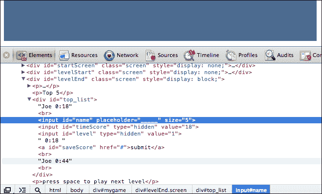

一个简单的经验法则是避免在 DOM 中存储任何重要信息，因为任何用户都可以访问它，即使是那些没有太多编程知识的用户。在我们的例子中，我们将简单地从对`save.php`的调用中删除这些值，并使用会话来存储这些值。在`highscore.php`中，我们可以简单地添加以下代码：

```js
if(!$json['intop'] && $time < $obj->time && $timeValid){
  $json['intop'] = true;
  $json['pos'] = $i;

  array_push($json['top'], array('time'=>$time));

 $_SESSION['level'] = $level;
 $_SESSION['time'] = $time;

  $i++;
}
```

`save.php`文件只需查找会话的级别和时间：

```js
$name = $_GET['name'];
$time = $_SESSION['time'];
$level = $_SESSION['level'];
```

这个简单的改变已经让游戏更难作弊。

## 混淆代码

混淆你的代码是一个非常简单的步骤，但会对你有很大帮助。一旦您的代码被混淆，它将在 inspector 中几乎无法读取。以下示例是一段要求获得排行榜的代码：

```js
if (status == "finished") {
  gameState = "menu";
  $("#level_nb_2").html(currentLevel);
  $("#level_nb_1").html(currentLevel + 1);

  var finishedTime = Math.round((Date.now() - levelStart) / 1000);
  $.ajax({
    dataType: "json",
    url: "highscore.php",
    data: {
      level: currentLevel,
      time: finishedTime
    },
    async: false,
    success: function (json) {
      var top = "";
      for (var i = 0; i < json.top.length; i++){
        if(json.intop && json.pos === i){
          top += "<input id='name' placeholder='_____' size='5' />"
            + "<input id='timeScore' type='hidden' value='"+json.top[i].time+"'></input>"
            + "<input id='level' type='hidden' value='"+currentLevel+"'></input>"
            + " "+minSec(json.top[i].time)
            + " <a id='saveScore' href='#'>submit</a> <br>";
        } else {
          top += "" + json.top[i].name + " " + minSec(json.top[i].time) + "<br>";
        }
      }
      $("#top_list").html(top);
    }
  }).fail(function(a,b,c){
    var toto = "toto";
  });

  $("#time").html(minSec(finishedTime));

  $("#levelEnd").fadeIn(2000, function(){
    $("#backgroundFront").css("background-position","0px 0px");
    $("#backgroundBack").css("background-position","0px 0px");
    gf.x(group, 0);

    tilemap = loadNextLevel(group);
    gf.x(player.div, 0);
    gf.y(player.div, 0);
    gf.setAnimation(player.div, playerAnim.jump);
  });
  status = "stand";
}
```

相同的代码一旦混淆（通过 UglifyJS）后看起来类似于以下内容：

```js
if("finished"==status){gameState="menu",$("#level_nb_2").html(currentLevel),$("#level_nb_1").html(currentLevel+1);var finishedTime=Math.round((Date.now()-levelStart)/1e3);$.ajax({dataType:"json",url:"highscore.php",data:{level:currentLevel,time:finishedTime},async:!1,success:function(a){for(var b="",c=0;a.top.length>c;c++)b+=a.intop&&a.pos===c?"<input id='name' placeholder='_____' size='5' /><input id='timeScore' type='hidden' value='"+a.top[c].time+"'></input>"+"<input id='level' type='hidden' value='"+currentLevel+"'></input>"+" "+minSec(a.top[c].time)+" <a id='saveScore' href='#'>submit</a> <br>":""+a.top[c].name+" "+minSec(a.top[c].time)+"<br>";$("#top_list").html(b)}}).fail(function(){}),$("#time").html(minSec(finishedTime)),$("#levelEnd").fadeIn(2e3,function(){$("#backgroundFront").css("background-position","0px 0px"),$("#backgroundBack").css("background-position","0px 0px"),gf.x(group,0),tilemap=loadNextLevel(group),gf.x(player.div,0),gf.y(player.div,0),gf.setAnimation(player.div,playerAnim.jump)}),status="stand"}
```

这已经是更难调试的方式，同时，它更小！

## 降低网络协议的可读性

一旦代码的客户端被修复，作弊者仍然可以访问游戏变量网络流量。让我们看看当玩家完成关卡时，嗅探应用程序可以看到什么：

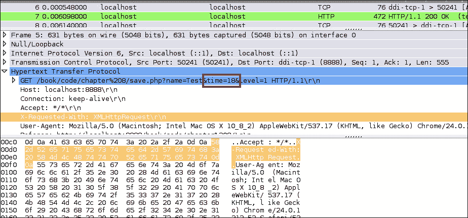

这是一个问题，因为玩家甚至不必破解客户端代码，只需伪造一个包含正确信息的包，即可作弊。这里有三件简单的事情可以让骗子更难理解你的网络流量：

1.  给变量随机命名，这样，通过简单地查看它们，作弊者就无法找出它们的值。
2.  对变量的内容进行编码。这对于这种情况非常有用，因为在这里，用户通常知道他/她的分数的值。他/她只需查找保存该变量的变量，就可以找到他/她需要修改的内容。
3.  添加大量随机变量，使其更难知道哪些变量真正被使用。

像以前一样，这只会让一个有决心的玩家更难作弊，但结合以下部分中的所有其他技巧，这可能会让大多数玩家望而却步。让我们实现其中的每一个。

### 编码值

让我们首先从编码值开始。这可以通过多种方式实现，有些方式比其他方式更安全。在这里，我们的目标实际上只是防止作弊者在值列表中搜索他/她的分数，以确定谁持有它。所以，我们不需要任何复杂的编码。我们将简单地使用左移（`<<`在客户端），然后使用右移（`>>`在服务器上）。

以下是客户端代码：

```js
$.ajax({
  dataType: "json",
  url: "highscore.php",
  data: {
    level: currentLevel,
 time: finishedTime << 1
  },
  async: false,
  success: function (json) {
    // ...
  }
});
```

服务器对应项如下所示：

```js
$time = intval($_GET['time']) >> 1;
```

为了让用户更加困惑，我们将在服务器端无法读取的许多其他变量中以清晰的方式传输值。

### 随机命名变量

这里没有什么要解释的；只需替换变量的名称！如果你真的很偏执，那么你可以在每次调用服务器时更改变量，但这不是我们在这里要做的。以下是客户端代码：

```js
$.ajax({
  dataType: "json",
  url: "highscore.php",
  data: {
 Nmyzsf: currentLevel,
 WfBCLQ: finishedTime << 1
  },
  async: false,
  success: function (json) {
    // ...
  }
});
```

服务器端代码如下所示：

```js
$time = intval($_GET['WfBCLQ']) >> 1;
$level = $_GET['Nmyzsf'];
```

### 添加随机变量

既然变量的名称不再传达它们的内容，那么创建更多的变量是非常重要的，否则很容易尝试每个变量来找出哪一个包含分数。以下是您可以在客户端执行的操作的示例：

```js
$.ajax({
  dataType: "json",
  url: "highscore.php",
  data: {
 sXZZUj: Math.round(200*Math.random()),
 enHf8F: Math.round(200*Math.random()),
 eZnqBG: currentLevel,
 avFanB: Math.round(200*Math.random()),
 zkpCfb: currentLevel,
 PCXFTR: Math.round(200*Math.random()),
    Nmyzsf: currentLevel,
 FYGswh: Math.round(200*Math.random()),
 C3kaTz: finishedTime << 1,
 gU7buf: finishedTime,
 ykN65g: Math.round(200*Math.random()),
 Q5jUZm: Math.round(200*Math.random()),
 bb5d7V: Math.round(200*Math.random()),
 WTsrdm: finishedTime << 1,
 bCW5Dg: currentLevel,
 AFM8MN: Math.round(200*Math.random()),
 FUHt6K: Math.round(200*Math.random()),
    WfBCLQ: finishedTime << 1,
 d8mzVn: Math.round(200*Math.random()),
 bHxNpb: Math.round(200*Math.random()),
 MWcmCz: finishedTime,
 ZAat42: Math.round(200*Math.random())
  },
  async: false,
  success: function (json) {
    // ...
  }
});
```

服务器不需要更改任何内容，因为这些新变量被忽略了。您可能需要做一些事情，例如复制值并在不使用的变量上使用玩家分数。

在执行这些操作时，必须非常小心地对代码进行注释，以便记住哪些变量是正确的！

# 与 Twitter 整合

Twitter 是一种与他人分享简单信息的神奇方式。您可能希望以两种方式使用它：

*   允许玩家登录，从而提供唯一的用户名
*   允许玩家在游戏中推特他/她的高分或进展

现在，您将看到将游戏与之集成的两种可能性。

## 傻瓜推特

有一种非常简单的使用 Twitter 的方法，它甚至不需要你使用任何类型的 API。如果用户已经登录到 Twitter，只需打开 URL，您就可以提示他/她提交预先编写的推文。此 URL 的格式如下所示：

```js
http://twitter.com/home?status=Pre written status here!

```

此地址突出显示的部分是您为播放机编写的状态。我们在游戏中可以做的是在排行榜屏幕上的**提交**按钮旁边提供`tweet``this`链接：

```js
$.ajax({
  dataType: "json",
  url: "highscore.php",
  data: {
    // ...
  },
  async: false,
  success: function (json) {
    var top = "";
    for (var i = 0; i < json.top.length; i++){
      if(json.intop && json.pos === i){
        top += "<input id='name' placeholder='_____' size='5' />"
          + " "+minSec(json.top[i].time)
          + " <a id='saveScore' href='#'>submit</a>"
          + " <a id='tweetScore' target='_blank' href='http://twitter.com/home?status="+escape("I've just finished level "+currentLevel+" in YAP in "+minSec(json.top[i].time)+"!")+"'>tweet</a> <br>";
      } else {
        top += "" + json.top[i].name + " " + minSec(json.top[i].time) + "<br>";
      }
    }
    $("#top_list").html(top);
  }
});
```

突出显示的部分是魔法发生的地方。您会注意到，我们使用 JavaScript 的`escape`函数来确保我们提供的字符串是为 URL 格式化的。

此方法很容易实现，但有一些限制：

*   如果用户尚未登录，则必须先登录，然后才能发布推文。
*   您无法访问用户的 Twitter 句柄以将其用于本地排行榜。这意味着，如果玩家想要推特并节省他/她的时间，那么名字也必须在这里输入。
*   对于每一条推文，都会打开一个新窗口，玩家必须对其进行确认。

如果您希望允许用户登录并自动发布推文，而无需每次打开新窗口，那么您必须使用 Twitter 的 API。

## 完全访问 Twitter 的 API

与 Twitter 集成的更为完整的解决方案是请求用户允许将其帐户连接到游戏。其基本机制是使用**OAuth**，该是 Twitter、Google 和 Facebook 等许多公司支持的开放式身份验证标准。

为了让玩家选择是否使用 Twitter 登录，我们将稍微更改启动屏幕：

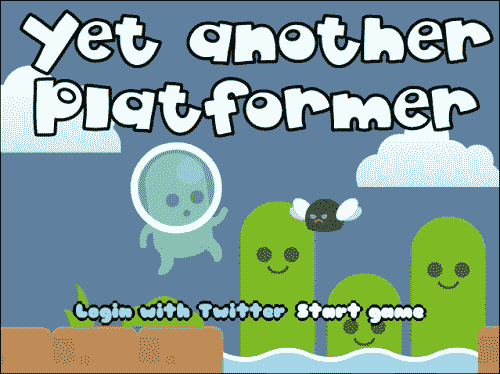

如果玩家点击**开始游戏**，则他/她将开始游戏。如果他/她点击**使用 Twitter**登录，则会提示他/她使用 Twitter 授权游戏，然后返回游戏的启动屏幕。

### 在 Twitter 上注册游戏

在做任何其他事情之前，你必须在 Twitter 上注册你的游戏。为此，您首先需要登录 Twitter 开发者的网站（[https://dev.twitter.com](https://dev.twitter.com) ）。然后点击**我的申请**：

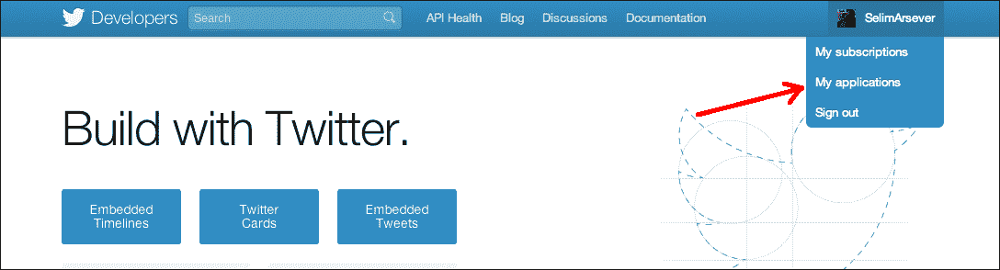

在这里，您可以点击**新建申请**，填写所有必填字段，并同意**道路规则**的条款和条件。完成此操作后，系统将提示您显示新创建的应用程序的所有属性：

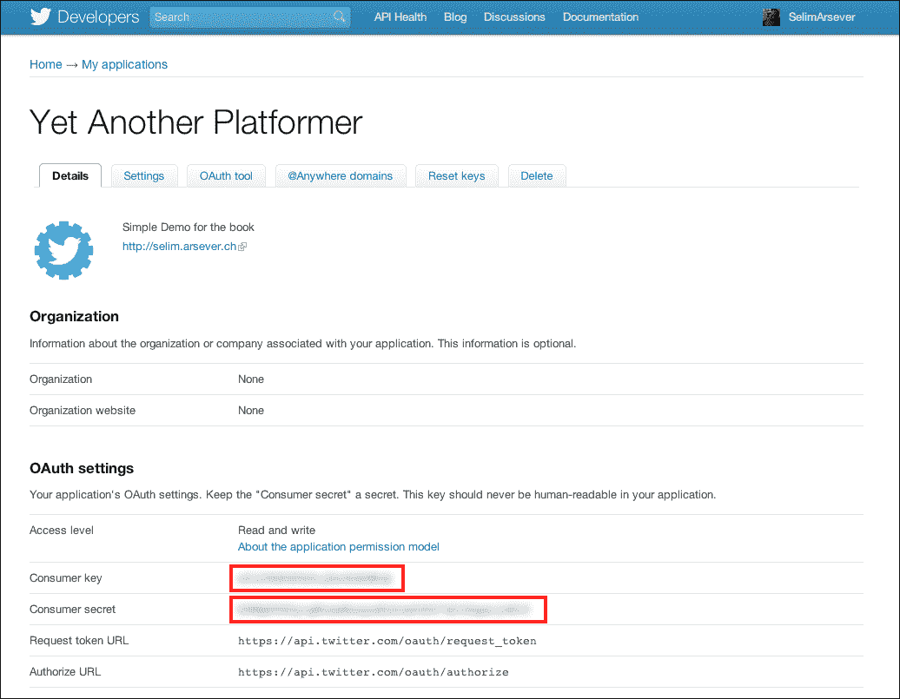

请注意此屏幕截图中两个带圆圈的代码区域；你以后会需要它们的。还有最后一件事你需要在这里配置。进入**设置**页签，向下滚动至**应用类型**。此处默认选择**只读**。如果您希望能够代表用户发布推文，您需要将其更改为**读写**：

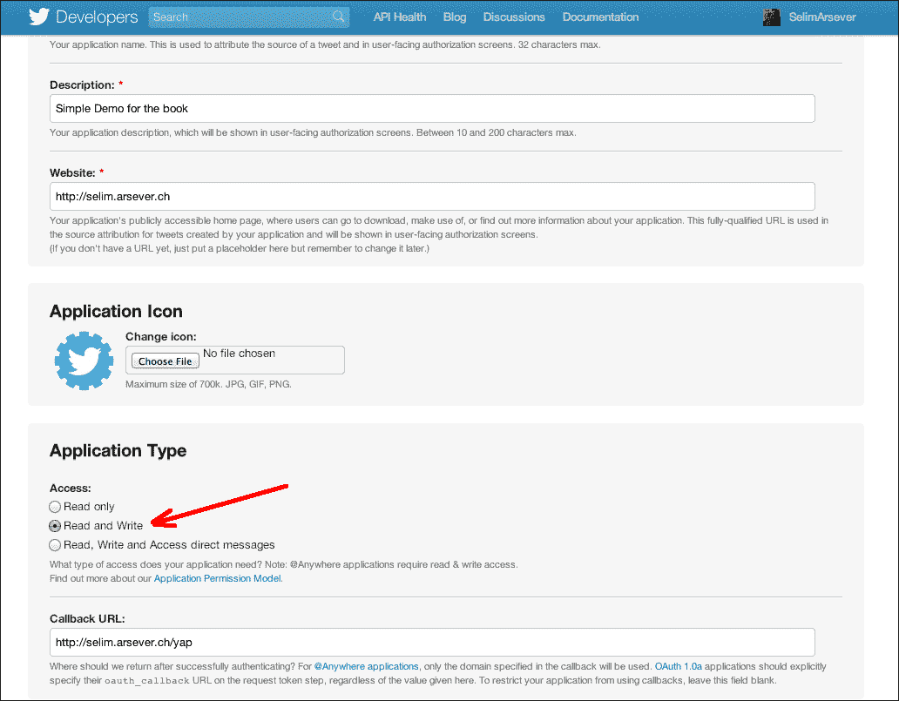

就这样,；您的游戏现在应该在 Twitter 端正确配置。

### 服务器端助手库

您可以直接在 PHP 中实现与 Twitter API 的所有交互，但这将是乏味的；谢天谢地，有很多库可以帮助您实现这一点。PHP 的名称为**twitteroauth**（[http://github.com/abraham/twitteroauth](http://github.com/abraham/twitteroauth) ）。其他语言也有其他的库，所以请毫不犹豫地查看 Twitter 开发人员的文档，了解更多关于这些库的信息。

twitteroauth 非常好的一点是，您可以在几乎所有支持 PHP 的主机上安装它。您只需将库文件复制到游戏文件所在的同一目录中。在我们的示例中，我们将它们复制到名为`twitter`的子目录中。

现在，您需要配置库。要执行此操作，请从`twitteroauth`文件夹中打开`config.php`：

```js
define('CONSUMER_KEY', '(1)');
define('CONSUMER_SECRET', '(2)');
define('OAUTH_CALLBACK', '(3)');
```

在这个文件中，在`(1)`和`(2)`中，您必须写入之前在 Twitter 开发者网站上的应用程序页面中记录的两个值。然后，在`(3)`处，您必须编写 twitteroauth 的`callback.php`文件的 URL。

最后一步是编辑`callback.php`并用游戏索引文件的地址替换以下行：

```js
header('Location: ./index.php');
```

### 认证

以下是用于通过 Twitter 验证和授权您的游戏的工作流：

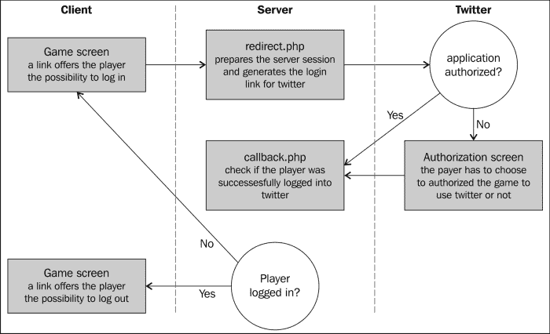

这并不像看上去那么复杂，这个工作流的很大一部分已经由 twitterouth 实现了。我们现在将创建一个带有**推特**按钮的登录页面。我们将使用一个指向 twitteroauth 的`redirect.php`文件的简单链接。当玩家第一次点击它时，他/她将被重定向到 Twitter 网站上的一个页面，要求他/她授权游戏：

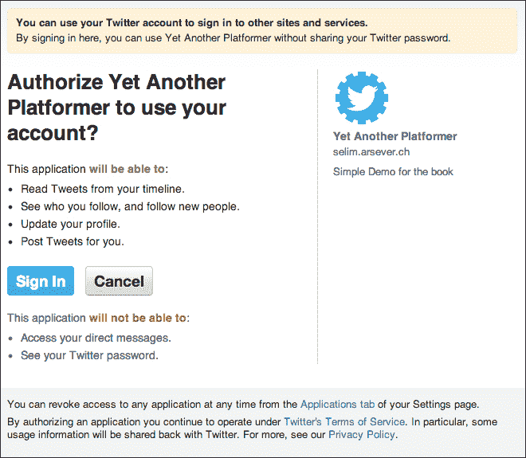

然后，一旦播放器执行此操作，他/她将被重定向回您在`callback.php`文件中指定的 URL。如果玩家已经这样做过一次，他/她就可以直接登录了。

从现在起，在我们的 JavaScript 代码中了解播放器是否已连接的功能将非常有用。为此，让我们将游戏 HTML 文件转换为 PHP 文件，并在其开头添加以下代码：

```js
<?php 
session_start();

require_once('twitter/twitteroauth/twitteroauth.php');
require_once('twitter/config.php');

/* Get user access tokens out of the session. */
$access_token = $_SESSION['access_token'];
$connection = new TwitterOAuth(CONSUMER_KEY, CONSUMER_SECRET, $access_token['oauth_token'], $access_token['oauth_token_secret']);
$user = $connection->get('account/verify_credentials');

?>
```

此代码启用会话跟踪，包括`twitteroauth`库的一些文件，然后检查会话中是否存储了访问令牌。如果玩家使用 Twitter 登录，情况就是这样。

然后，服务器连接到 Twitter 以检索用户对象。这一切都很好，但是 JavaScript 代码仍然不知道这一切。我们需要创建一个自定义脚本，其中包含要传输到客户端 JavaScript 的值：

```js
<script type="text/javascript">
<?php if($_SESSION['status'] == 'verified'){ ?>
  var twitter = true;
  var twitterName = "<?php print $user->screen_name; ?>";
<?php } else { ?>
  var twitter = false;  
<?php } ?>
</script>
```

现在，如果玩家使用 Twitter 登录，我们将全局变量`twitter`设置为`true`，全局变量`twitterName`保存玩家的屏幕名称。

你可能想做的最后一件事是向用户反馈他/她已成功登录 Twitter，并给他/她注销的可能性。为此，如果播放机已登录，我们将稍微更改开始屏幕：

```js
<div id="startScreen" class="screen">
 <?php if($_SESSION['status'] != 'verified'){ ?>
 <a class="button tweetLink" href="./twitter/redirect.php">Login with Twitter</a> 
 <?php } else { ?>
 <a class="button tweetLink" href="./twitter/clearsessions.php">Logout from Twitter</a>
 <?php }?>
  <a id="startButton"class="button" href="#">Start game</a>
</div>
```

通过这些相对较小的更改，您已经通过 Twitter 实现了身份验证。

### 在推特上发布高分

现在用户已经连接到 Twitter，您可以让他/她以更加无缝的方式在 Twitter 上发布自己的时间。为此，我们将创建一个名为`twitterPost.php`的新服务器端脚本。此文件将使用 Twitter 的`statuses/update`API。

让我们看一下完整的脚本：

```js
<?php
session_start();
require_once('twitter/twitteroauth/twitteroauth.php');
require_once('twitter/config.php');

$time = $_SESSION['time'];
$level = $_SESSION['level'];
if(isset($time) && isset($level)){
  /* Get user access tokens out of the session. */
  $access_token = $_SESSION['access_token'];
  $connection = new TwitterOAuth(CONSUMER_KEY, CONSUMER_SECRET, $access_token['oauth_token'], $access_token['oauth_token_secret']);

 $parameters = array('status' => 'I\'ve just finished level '.$level.' for Yet Another Platformer in '.$time.' seconds!');
 $status = $connection->post('statuses/update', $parameters); 
}
?> 
```

您可能从我们在游戏页面开头添加的代码中识别出了大部分代码（只有突出显示的部分是新的）。最后两行创建并发送给 Twitter 您想要发布的状态。这很简单，但是我们可以做更多的事情，因为玩家已经登录，你知道他/她的屏幕名称，你可以用它来排名。

在客户端代码中，我们将生成略有不同的排行榜版本，如下所示：

```js
$.ajax({
  dataType: "json",
  url: "highscore.php",
  data: {
    // ...
  },
  async: false,
  success: function (json) {
    var top = "";
    for (var i = 0; i < json.top.length; i++){
      if(json.intop && json.pos === i){
 if (twitter){
 top += "<input id='name' type='hidden' val='"+twitterName+"'/>"
 + twitterName + " " + minSec(json.top[i].time)
 + " <a id='saveScore' href='#'>submit</a>"
 + " <a id='tweetScore' href='#'>tweet</a> <br>";
 } else {
          top += "<input id='name' placeholder='_____' size='5' />"
          + " "+minSec(json.top[i].time)
          + " <a id='saveScore' href='#'>submit</a>"
          + " <a target='_blank' href='http://twitter.com/home?status="+escape("I've just finished level "+currentLevel+" in YAP in "+minSec(json.top[i].time)+"!")+"'>tweet</a> <br>";
        }
      } else {
        top += "" + json.top[i].name + " " + minSec(json.top[i].time) + "<br>";
      }
    }
    $("#top_list").html(top);
  }
});
```

在这里，我们将保存玩家姓名的输入字段隐藏起来，并用用户的屏幕名填充它。然后，我们将屏幕名称写入排行榜。这样做的好处是，服务器端代码根本不会改变。

这就是我们将在 Twitter 上实现的所有内容，但我鼓励您查看完整的 Twitter API 并发挥创意！

# 与 Facebook 整合

在许多方面，与 Facebook 的整合类似于与 Twitter 的整合。然而，Facebook 提供了更多的游戏导向。在我们的案例中，我们将为登录用户实现成就。我们将使用 Facebook 的 PHP SDK，但也支持其他语言。

至于 Twitter，我们需要首先在 Facebook 上注册我们的应用程序。为此，请登录 Facebook 的开发者网站（[https://developers.facebook.com/](https://developers.facebook.com/) 点击标题中的**应用**：

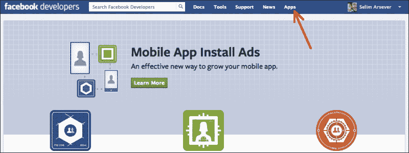

然后点击**创建新应用**并填写所需信息。然后，系统将提示您新创建的应用程序页面。在这里，您必须注意以下屏幕截图中显示的两个值（就像我们在 Twitter 上所做的那样）：

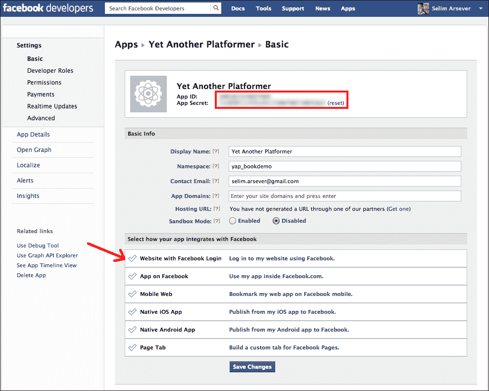

如果你看前面屏幕截图中的红色箭头，你会注意到你可以选择你的应用程序和 Facebook 的交互方式。要完全访问 Facebook 的 Open Graph API，允许您发布成就，您需要选择 Facebook 上的**应用程序**。

这将允许您将游戏加载到 Facebook 本身的 iframe 中。但是，要做到这一点，您需要在域名上安装有效的 HTTPS 证书。但是，如果您只想从自己的服务器加载游戏，那么您不需要任何（您仍然需要在相应的字段中输入一个地址，您可以简单地在非安全地址前面加上`https`以使其有效）。

为了让你的 Facebook 应用程序能够提供成就并将其注册为游戏，你需要采取最后一步。要做到这一点，只需点击左侧的**应用程序详细信息**。然后在**App Info****类别**下选择**游戏**，如下图所示：

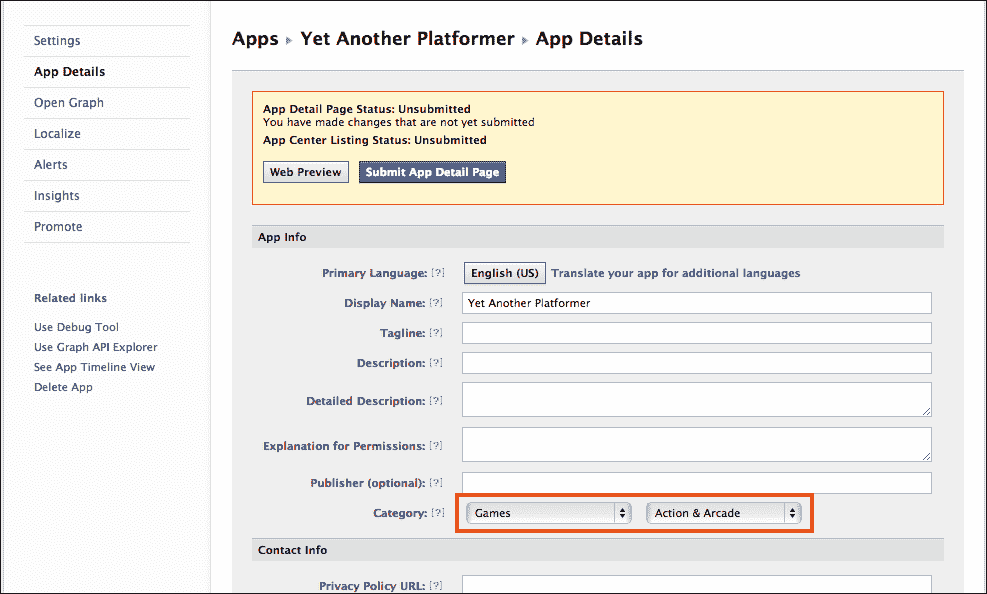

## 通过 Facebook 进行身份验证

Facebook 的基本身份验证机制与 Twitter 非常相似。然而，在 Twitter 的访问权限方面有一点不同，你必须定义你的应用程序需要在开发者的网站上进行读写访问，而在 Facebook 上，你向用户请求的访问权限的粒度要细得多，只有在登录阶段你才能指定。

让我们看一下身份验证所需的代码。与 Twitter 一样，我们将首先在游戏文件的开头写下尝试获取用户的说明：

```js
<?php 
session_start();

// Twitter ... 

// Facebook
require 'facebook/facebook.php';

$app_id = '(1)';
$app_secret = '(2)';
$app_namespace = 'yap_bookdemo';
$app_url = 'http://yetanotherplatformer.com/';
$scope = 'publish_actions';

$facebook = new Facebook(array(
  'appId' => $app_id,
  'secret' => $app_secret,
));

// Get the current user
$facebookUser = $facebook->getUser();

?>
```

突出显示的行定义了我们希望我们的游戏能够在玩家的时间线上发布条目。值`(1)`和`(2)`是您在应用程序配置页面中记录的值。

如果`$facebookUser`为空，表示用户已经登录，否则需要显示登录按钮。为此，我们将编写一个与我们为 Twitter 编写的代码非常类似的代码：

```js
<div id="startScreen" class="screen">
  ...
 <?php if(!$facebookUser){ 
 $loginUrl = $facebook->getLoginUrl(array(
 'scope' => $scope,
 'redirect_uri' => $app_url
 ));
 ?>
 <a class="button tweetLink" href="<?php print $loginUrl; ?>">Login with Facebook</a>
 <?php } else { 
 $logoutUrl = $facebook->getLogoutUrl(array(
 'next' => $app_url
 )); 
  ?>
    <a class="button tweetLink" href="<?php print $logoutUrl; ?>">Logout from Facebook</a>
  <?php } ?>
  <a id="startButton"class="button" href="#">Start game</a>
</div>
```

在这里，您可以看到 Facebook 的 PHPSDK 提供了一种方便的方法来生成用户登录或注销的 URL。

现在，我们将添加一小段代码，以指示用户是否登录到 Facebook。同样，这里的代码与我们在 Twitter 上使用的代码非常相似：

```js
<script type="text/javascript">
   // ...
  <?php if($facebookUser){ ?>
    var facebook = true;
    var facebookId = "<?php print $facebookUser; ?>";
  <?php } else { ?>
    var facebook = false;  
  <?php } ?>
</script>
```

## 创造业绩

我们现在将为我们的游戏创造成就。为此，服务器上需要两个文件：

*   一个 HTML 文件，头中有一系列的`meta`标记
*   一个图像文件，将代表玩家时间线中的成就

HTML 文件不仅可以作为成就的配置文件，还可以链接到玩家时间表上的成就出版物。为了让 Facebook 确认该成就有效，您需要在标题中定义以下七个`meta`标记：

*   `og:type`包含值`game.achievement`。它将成果与其他类型的 OpenGraph 实体区分开来。
*   `og:title`是对成就的一个非常简短的描述。
*   `og:url`是当前文件的 URL。
*   `og:description`是对成就的较长描述。
*   `og:image`是前面提到的图像。它可以是 PNG、JPEG 或 GIF 格式，最小尺寸为 50 x 50 像素。最大纵横比为 3:1。
*   `game:points`是与此成就相关的点数。总的来说，你的游戏不能超过 1000 分，允许的最小值是 1。积分值越高的成就越有可能显示在玩家朋友的新闻提要上。
*   `fb:app_id`是您申请的 ID。

HTML 文件的正文可以是一个很好的页面，解释这项成就的意义，或者你真正想要的任何东西。完整成就页面的一个非常简单的示例如下：

```js
<html> 
  <head>
    <meta property="og:type" content="game.achievement" />
    <meta property="og:title" content="Finished level 1" />
    <meta property="og:url" content="http://8bitentropy.com/yap/ach1.html" />
    <meta property="og:description" content="You just finished the first level!" />
    <meta property="og:image" content="http://8bitentropy.com/yap/ach1.png" />
    <meta property="game:points" content="50" />
    <meta property="fb:app_id" content="(1)" />
  </head>
  <body>
    <h1>Well done, you finished level 1!</h1>
  </body>
</html>
```

由此产生的成就将类似于玩家时间表上的以下屏幕截图：

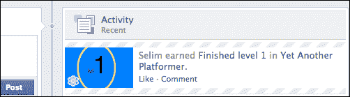

但是，编写此文档不足以完全配置您的成就。您必须将其提交至 Facebook。为此，您必须使用正确的参数在正确的 URL 上执行`POST`请求。此请求还应与应用程序令牌关联。

应用程序令牌是 Facebook 确保它真正是您的游戏而不是与之通信的其他应用程序的一种方式。最简单的方法是编写一个 PHP 页面，然后提交您的成果。以下是完整的代码：

```js
<?php

require 'facebook/facebook.php';

$app_id = '(1)';
$app_secret = '(2)';
$app_namespace = 'yap_bookdemo';
$app_url = 'http://yetanotherplatformer.com/';
$scope = 'publish_actions';

$facebook = new Facebook(array(
  'appId' => $app_id,
  'secret' => $app_secret,
));

$app_access_token = get_app_access_token($app_id, $app_secret);
$facebook->setAccessToken($app_access_token);

$response = $facebook->api('/(1)/achievements', 'post', array(
 'achievement' => 'http://yetanotherplatformer.com//ach1.html',
));

print($response);

// Helper function to get an APP ACCESS TOKEN
function get_app_access_token($app_id, $app_secret) {
  $token_url = 'https://graph.facebook.com/oauth/access_token?'
   . 'client_id=' . $app_id
   . '&client_secret=' . $app_secret
   . '&grant_type=client_credentials';

  $token_response =file_get_contents($token_url);
  $params = null;
  parse_str($token_response, $params);
  return $params['access_token'];
}

?>
```

这段代码相当冗长，但您可以从前面的代码中识别出大部分内容。首先强调了重要的部分，我们检索应用程序令牌，然后将其与未来请求关联，最后使用 SDK 进行`POST`请求。

此`POST`请求的地址格式如下：“应用程序 ID”/“成就”。传输的参数只是成就文件的 URL。

由于此处生成的错误消息（如果出现问题）可能非常模糊，您可能希望首先使用 Facebook 提供的调试工具[验证您的成就文件 https://developers.facebook.com/tools/debug/](https://developers.facebook.com/tools/debug/) 。

## 成果发布

既然 Facebook 已经注册了这项成就，我们可以将其奖励给我们的玩家。执行此操作的命令也是一个`POST`请求，并且必须与应用程序令牌相关联。为了简单起见，我们将创建一个简单的 PHP 页面，在调用该页面时将奖励该成就。在现实生活中，这远远不是最优的，因为您希望避免用户自己调用文件。您可以在`highscore.php`文件中奖励该成就。

这是该文件的完整代码；它与我们用来记录成就的文件非常相似，不同之处突出显示：

```js
<?php 
session_start();

// Facebook
require 'facebook/facebook.php';

$app_id = '(1)';
$app_secret = '(2)';
$app_namespace = 'yap_bookdemo';
$app_url = 'http://yetanotherplatformer.com/';
$scope = 'publish_actions';

$facebook = new Facebook(array(
  'appId' => $app_id,
  'secret' => $app_secret,
));

// Get the current user
$facebookUser = $facebook->getUser();

$app_access_token = get_app_access_token($app_id, $app_secret);
$facebook->setAccessToken($app_access_token);

$response = $facebook->api('/'.$facebookUser.'/achievements', 'post', array(
 'achievement' => 'http://yetanotherplatformer.com/ach1.html'
));

print($response);

// Helper function to get an APP ACCESS TOKEN
function get_app_access_token($app_id, $app_secret) {
  ...
}

?>
```

这一次，我们创建了一个对 URL 的`POST`请求，格式为：“用户 ID”/“成就”。现在，当用户完成第一关时，我们只需从游戏中异步调用此文件：

```js
if (status == "finished") {
  ...
 if(facebook && currentLevel === 1){
 $.get("ac h1.php");
 }
  ...
```

# 总结

在本章中，我们学到了很多东西，尽管我们只触及了新工具可以实现何种社交互动的表面。Facebook 和 Twitter 的 api 很大，并且不断变化。如果您想以最好的方式使用它们，我真的建议您阅读它们的完整文档。

但是，当使用第三方服务，尤其是免费服务时，你必须意识到你对它们的依赖。他们可以在任何时候改变任何事情，而不会给你太多的通知。他们可以决定不想让你的游戏再使用他们的服务。永远记住这一点，如果可能的话，确保在这些情况下你有一个退出策略！

在下一章中，我们将探讨另一个热门话题，让您的游戏成为手机游戏！为此，我们将采用平板电脑，并将其扩展到现代智能手机和平板电脑上。