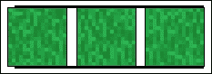
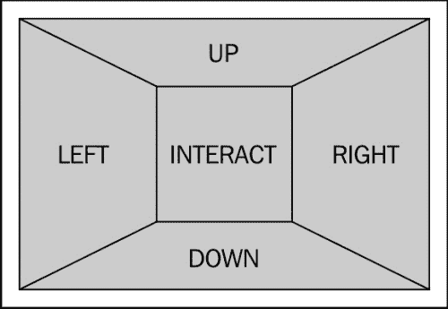
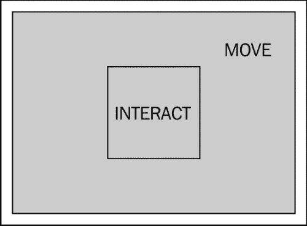
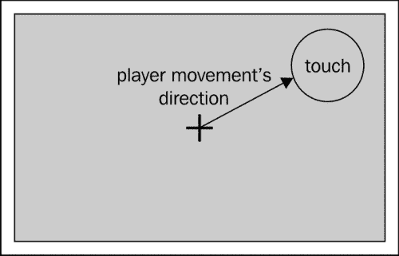
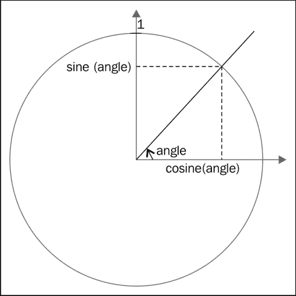
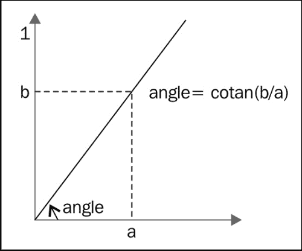
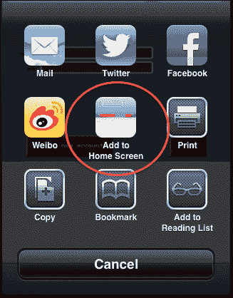
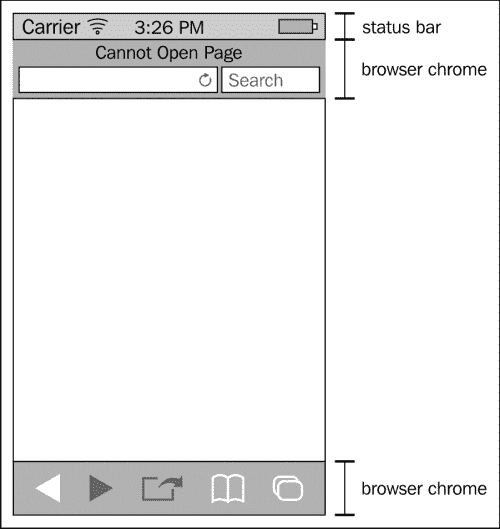
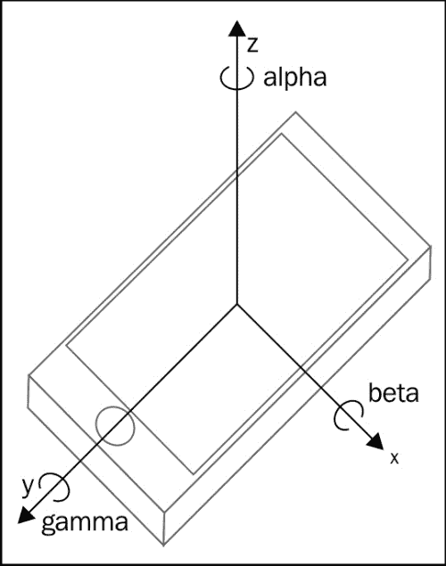

# 九、让游戏移动化

移动设备正迅速成为游戏的热门平台。好消息是，这些设备中的大多数 web 浏览器都非常好，在大多数情况下，您可以让手机游戏在它们上顺利运行。

但是，这些设备存在一些内存和电源限制。目前有些游戏根本无法在手机浏览器上运行。你不能期望在你的智能手机上有同样多的精灵运行顺畅，而你的智能手机只有桌面电脑的十分之一。

另一方面，移动设备提供了一些桌面上通常找不到的功能：

*   多点触摸界面允许与游戏进行新的交互
*   设备定向 API 允许您以有趣的方式控制游戏或 UI
*   大多数设备都允许将游戏安装到“跳板”上，就像本地应用程序一样，模糊了浏览器游戏和本地游戏之间的界限
*   离线缓存允许您的游戏工作，即使设备上没有活动的 Internet 连接

在本章中，我们将采用我们的 MMORP 并使其在 iOS 设备上工作。我们将使用的大多数 API 都是事实上的标准，并且在 Android 上也受支持。以下是我们将介绍的主题的简要概述：

*   应对移动设备的性能限制
*   将多点触控添加到我们的游戏中
*   将我们的游戏与 springboard 和其他特定于移动设备的配置集成
*   使用设备定向 API
*   利用 web 存储和脱机应用程序缓存

我们选择考虑 IOS 方面的原因有几个：

*   iOS 仍然是全球最常用的移动操作系统，尽管安卓最近已经赶上了这一潮流（根据来源和移动设备的具体情况，你会发现 iOS 的市场份额在 30%到 50%之间）。
*   即使苹果禁止在其操作系统上使用第三方浏览器的选择引起了很大争议，但它也带来了积极的副作用，使网络开发变得更加容易。事实上，您不必在浏览器端处理太多的多样性。
*   移动浏览器上提供的大多数特定 API 都是由 Apple 在 Webkit mobile 上创建或实现的。

在我们开始之前，我想强调一个事实，这是一个比 web 开发世界其他地方发展得更快的领域。定期添加新的 API，并且每个新设备的性能都明显优于它所取代的设备。如果你真的想制作充分利用移动设备的游戏，你应该投入一些时间让自己跟上这些变化。

# 让您的游戏在移动设备上运行良好

性能问题可能是开发基于浏览器的手机游戏时遇到的最大问题，主要原因是有各种各样的设备可用，每种设备的功能都非常不同。

即使您选择只支持 iOS，这可能是目前最简单的生态系统，但在性能、屏幕分辨率和浏览器支持方面仍然存在很大差异。

要了解情况的复杂性，请查看 jQuery Mobile（[支持的设备 http://jquerymobile.com/gbs/](http://jquerymobile.com/gbs/) 。对于你的游戏，你应该有一个类似于他们的方法；选择几个您要瞄准的设备/软件版本。你的游戏应该在这些方面完美无瑕。

然后确保游戏在更多设备上运行时不会出错。在这些设备上，性能可能不太理想。最后，划出一条清晰的界限，你甚至不必费心去测试你的游戏是否运行。

这些类别的大小取决于你想在它们上投入多少精力。一个问题是，您不能真正使用每个平台 SDK 提供的模拟器来调查性能问题。这意味着，最终，你将不得不在实际设备上测试你的游戏。

这对大公司来说不是问题，但是如果你是一个小的独立游戏开发者，你可能会发现这是你支持的设备数量的一个限制因素。

## 检测手机浏览器

为了应对台式机和移动设备之间的差异，有许多可能的方法：

1.  设计一款只考虑移动设备的游戏。它在台式机上运行也不会有任何问题，但如果它是专门为台式机设计的，它可能不会像它那样美观或复杂。好的方面是，如果玩家在游戏中相互竞争，他们将处于同一水平。
2.  设计两款游戏，一款针对桌面，一款针对手机。这几乎是工作的两倍，但您可能会共享大部分艺术、音乐和服务器端代码（如果有的话）。就性能而言，这是一个理想的解决方案，但是如果在一个平台上的游戏玩家中有 PvP（玩家对玩家），那么与其他平台上的玩家相比，这可能是有利的。
3.  如果游戏在桌面浏览器上运行，您只能设计一个游戏，但可以添加一些纯粹的装饰性功能。使用此解决方案，您只有一个代码库，但它可能稍微复杂一些。PvP 游戏的问题仍然存在。

您选择的方法取决于您的优先级，但对于第二种和第三种方法，您需要检测玩家运行游戏的平台类型。

这可能是一项相当复杂的任务，具体取决于您希望达到的精度。基本上有两种通用方法可以使用：客户端检测和服务器端检测。

### 客户端浏览器检测

如果您想要实现前面描述的第三种方法，那么在客户端检测浏览器非常有意义。最常用的方法是使用`navigator.userAgent`字符串（**UA**简称）。此变量包含一个非常长且神秘的字符串，其中包含大量信息。

请务必记住，浏览器可以伪造此字符串（这称为**UA 欺骗**。例如，在 Safari 中，您可以指定它应该模仿哪个浏览器。好的方面是，移动设备通常不提供这一点，除非用户部分进行一些黑客攻击。此外，一些非常不同的手机具有相同的 UA，例如 Internet Explorer 的桌面版和移动版。

这里有很大一部分是因为遗留的原因，您真的不应该为此烦恼，但是通过查看给定字符串在这个较长字符串中的出现情况，您可以检测到您正在处理的浏览器类型。例如，如果`userAgent`字符串包含`iPhone`，您就知道浏览器是在 iPhone 上运行的 Safari mobile。相应的 JavaScript 如下所示：

```js
if(navigator.userAgent.match(/iPhone/i)){
    // iPhone detected
    // ...
} else {
   // not an iPhone
}
```

现在，这将适用于 iPhone，但如果您的用户正在使用 iPad，它将不会被检测到。你必须寻找字符串`iPad`来检测 iPad。iPod Touch 也是如此，你必须在那里寻找`iPod`。如果您想区分 iDevices 和其他产品，可以这样做：

```js
if(navigator.userAgent.match(/iPhone|iPod|iPad/i){
    // iDevice detected
    // ...
} else {
   // not an iDevice
}
```

如果希望粒度检测单个设备，则应使用以下代码：

```js
if(navigator.userAgent.match(/iPhone/i)){
  // iPhone detected
} else if(navigator.userAgent.match(/iPad/i)) {
 // iPad detected
} else if(navigator.userAgent.match(/iPod/i)) {
 // iPod touch detected
} else {
   // not an iDevice
}
```

正如您所想象的，如果您想要检测大量设备，此列表可能会很快变得相当长。希望有一些代码片段能够完全实现您的目标。如果您只想检测移动设备，可以使用[提供的脚本 http://detectmobilebrowsers.com/](http://detectmobilebrowsers.com/) 。如果你想更准确地控制你检测到的是什么，你可以使用彼得·保罗·科赫（Peter Paul Koch）在[上提供的脚本 http://www.quirksmode.org/js/detect.html](http://www.quirksmode.org/js/detect.html) 。

### 服务器端检测

如果想要实现第二种方法（移动和桌面浏览器的不同版本的游戏），您可能需要在服务器上检测玩家的浏览器，并将其重定向到游戏的正确版本。与客户端检测一样，最常见的技术使用浏览器的`userAgent`字符串。

如果您使用 PHP，您会很高兴地了解到它几乎支持即时的浏览器检测。实际上，您可以将`get_browser`功能与最新的`php_browscap.ini`文件结合使用，以获取有关浏览器的信息（您可以在[找到此文件的各种版本）http://tempdownloads.browserscap.com/](http://tempdownloads.browserscap.com/) ）。您必须将`php.ini`文件中的`browscap`属性配置为指向您的`php_browscap.ini`文件，才能识别它。复制我们之前实现的客户端检测的代码如下所示：

```js
$browser = get_browser(null);

if($browser->platform == "iOS"){
  echo "iOS";
} else {
  echo "not iOS";
}
```

这与客户端实现有相同的缺点：浏览器可以伪造`userAgent`字符串。

### 你真的应该检测到浏览器吗？

通常认为检测浏览器不是一种好的做法。首选的解决方案通常是使用特征检测。例如，如果您想使用设备定向，那么这确实是有意义的，您只需检查相应的 API 在运行时是否可用。

在这种情况下，这是一种更加稳健的方法，但我们在这里讨论的是优化游戏性能。没有您可以检测到的功能可以提供有关这方面的信息。在这种情况下，我认为浏览器检测是有意义的。

一个更可靠的替代方案是在开始游戏之前运行一个非常快速的基准测试，以推断游戏所运行的设备的性能。这将是一个很大的工作，但可以值得的情况下，你可以衡量你的游戏线性性能的努力。例如，可以定义用于以非常精细的方式绘制森林的树数，例如，最大树数的 80%。

如果使用大量粒子效果，通常会出现这种情况。然后，很容易更改用于匹配设备性能的粒子总数。

## 性能限制-内存

既然我们能够检测到游戏在移动设备上运行，我们就能够适应设备的限制。在谈到性能时，你首先想到的可能是处理器的速度，但大多数时候，内存是一个更大的限制。

在桌面上，在大多数情况下，您不需要再考虑内存（除了避免内存泄漏）。在移动设备上，内存是一种非常有限的资源，有时，仅仅加载一个大图像对浏览器来说太多了。例如，对于 iDevices，图像的最大允许大小如下所示：

<colgroup><col style="text-align: left"> <col style="text-align: left"> <col style="text-align: left"></colgroup> 
|   | **<256MB 内存** | **>256MB 内存** |
| **GIF、PNG 和 TIFF 图像** | 300 万像素 | 500 万像素 |
| **JPEG** | 3200 万像素 | 3200 万像素 |
| **画布 DOM 元素** | 300 万像素 | 500 万像素 |

需要注意的是，这与图像的压缩完全无关。事实上，虽然压缩图像以减少下载图像用于记忆印记所需的时间很重要，但唯一重要的是分辨率。

所以，如果压缩没有帮助，我们能做什么？让我们以我们的多人 RPG 为例。在那里，我们使用了一个非常大的图像和所有的瓷砖作为我们的瓷砖地图。我们为游戏创建的地图中实际上没有使用这些瓷砖。所以，一个非常简单的方法来减少这个非常大的图像是删除所有我们不需要的瓷砖。

这意味着，在整个游戏中使用的不是一个大图像，而是每个区域都有一个较小的图像。这将增加代码的复杂性，因为这意味着管理区域之间的转换，但它的优点是不会降低您的级别设计。

在某些情况下，即使使用此技术，您也会发现很难充分减小图像的大小。一个简单的解决方案是有两个版本的 level，一个用于桌面，另一个用于移动平台。在移动版本上，您将减少瓷砖的种类。例如，在我们的游戏中，我们使用多个平铺渲染草，如下图所示：



在这里，我们可以简单地使用一块瓷砖来代替。当然，生成的图形变化较小，但会显著减少所需的平铺数量。但是，这有一个缺点，即要求您维护每个级别的两个独立版本。

## 性能限制–速度

移动设备的性能差别很大，但即使是速度最快的设备也比任何台式机都慢。这意味着有些游戏根本无法在移动设备上运行，无论你投入了多少精力。然而，有许多游戏可以稍微变换一下，使它们以合理的速度运行。

在制作基于 DOM 的游戏时，没有多少地方可以加快速度。您应该做的第一件事是尝试减少精灵或瓷砖的数量。

### 指定页面的可见区域

减少瓷砖数量的一个非常简单的方法是缩小游戏区域。你可能认为这是一个非常糟糕的主意，因为你真正想要的是游戏区域填满整个屏幕，这意味着适应设备的分辨率。嗯，是的……而且不是！是的，你想让游戏区域填满整个屏幕，但不，这并不一定意味着使用全分辨率。

移动浏览器提供了一个非常方便的`meta`属性，允许您指定浏览器应如何管理页面宽度。这将在这里派上用场，因为我们基本上可以为游戏区域选择您想要的大小，然后强制浏览器以全屏模式显示它。

此属性称为视口，若要为屏幕指定给定宽度，您可以简单地编写：

```js
<meta name="viewport" content="user-scalable=no, width=480" />
```

我们在这里配置两种不同的行为。首先，我们对浏览器说，页面的原始宽度是 480 像素。假设设备的本机分辨率为 960 像素；这将意味着页面将被放大到。如果设备分辨率为 320 像素，页面就会缩小。

我们在这里做的第二件事是为用户禁用缩放功能。如果以后要使用触摸事件，则不需要此选项；要控制游戏，您需要确保用户在试图操纵游戏时不会放大或缩小。

### 详细程度

减少精灵的数量可能会很棘手。例如，你不想减少游戏中 NPC（非玩家角色）或敌人的数量。识别可以删除的元素是一项乏味的任务。

下图摘自[第五章](05.html "Chapter 5. Putting Things into Perspective")*透视*。这是一个快速提醒的结构，瓷砖地图，我们用于我们的 RPG。


如果你把纯粹的装饰元素保留在这个图的最后两层，那么就很容易减少精灵的数量；如果需要，只需删除这两个层，就可以完成。

这并不一定意味着你必须去除所有这些元素。你可以做的是让这些层有两个不同的版本，一个有很多元素，另一个有更少的元素。

如果你真的需要 Apple ?? 来进一步减少精灵的数量，你就必须考虑它对游戏的影响。这里没有标准答案；你必须单独处理每一个游戏，并在保持游戏的原始状态和游戏的速度之间找到正确的平衡。

# 触摸控制

直到现在，我们只讨论了移动设备的问题部分，但这些设备也有一些优点。触摸屏允许一个非常有趣的游戏机制（多触摸屏更是如此）。

在本部分中，我们将实现两种不同的触摸控制游戏的方法，但这确实是一个你可以发挥创造力的领域，并为玩家找到新颖和吸引人的方式与你的游戏互动。重要的是要知道，触摸控制的 API 不是标准的，移动设备可能会实现一些不同。尽管如此，下一节中显示的代码应该适用于 iOS 和最新版本的 Android。

我们将实现的两个界面都基于相同的基本思想：整个屏幕是一个操纵台，没有使用可见的 UI 元素。这样做的好处是，用于控制的曲面越大，控制越精确。缺点是，如果用户无法通过简单地查看屏幕来发现它，您需要向用户解释它是如何工作的。

我们使用的代码可以很容易地适应屏幕底部/侧面的较小控件。

## D-pad

d-pad（定向板的缩写）是一种用于老式游戏机的控件。它提供了一些预定义的方向，用户可以选择（例如，向上、向下、向左和向右）。相比之下，操纵手柄提供了一个模拟界面，玩家可以在其中选择精确的方向（例如，30 度角）。我们将实施的第一种控制方法将屏幕分为五个区域，如下图所示：



优点是此方法与键盘控件具有一对一的映射。如果玩家触碰**向上**区域，则对应于按下键盘上的向上箭头等其他边界区域。如果玩家触到中心区域，它将对应于按下空格键。

为了实现这一点，我们将创建五个虚拟键，并扩展代码中检查键盘输入的部分，以检查键盘输入。以下代码摘录是这些虚拟密钥的定义：

```js
var UP = {
  on: false,
  id: 0
};
var DOWN = {
  on: false,
  id: 0
};
var LEFT = {
  on: false,
  id: 0
};
var RIGHT ={
  on: false,
  id: 0
};
var INTERACT ={
  on: false,
  id: 0
};
```

如您所见，这些键具有 ID 字段。这是必要的，因为我们正在处理多点触控事件，并且我们必须能够识别哪些触控事件结束，以便在玩家抬起手指时将`on`字段返回`false`。

为了检测玩家触摸屏幕，我们将注册一个`touchstart`事件处理程序。此事件类似于`onmousedown`事件，只是它包含触摸列表。这是有意义的，因为我们正在处理多点触摸输入，我们不能简单地假设只有一个手指在触摸屏幕。

所有这些触摸都存储在`event.changedTouches`数组中。在事件处理程序中，只需查看它们中的每一个。以下代码摘录是整个事件处理程序：

```js
document.addEventListener('touchstart', function(e) {
  if(gameStarted){
    e.preventDefault();
 for (var i = 0; i < e.changedTouches.length; i++){
      var touch = e.changedTouches[i]

       var x = touch.pageX - 480 / 2;
       var y = touch.pageY - 320 / 2;

       if (Math.abs(x) < 20 && Math.abs(y) < 20){
         INTERACT.on = true;
         INTERACT.id = touch.identifier;

       } else if (Math.abs(x) > 480 / 320 *  Math.abs(y)) {
         // left or right
         if(x > 0){
           RIGHT.on = true;
           RIGHT.id = touch.identifier;
         } else {
           LEFT.on = true;
           LEFT.id = touch.identifier;
         }
       } else {
         // up or down
         if(y > 0){
           DOWN.on = true;
           DOWN.id = touch.identifier;
         } else {
           UP.on = true;
           UP.id = touch.identifier;
         }
       }
     }
    }
}, false);
```

因为“jquerycore”不支持触摸事件，所以我们使用标准方法注册事件处理程序。然后我们防止事件冒泡，以确保它们不会产生缩放、滚动等。此事件处理程序的最后一部分检查每个触摸，以确定其处于哪个区域，将相应按键的`on`标志切换到`true`，并设置正确的`id`值进行跟踪。

现在我们需要能够检测触摸何时结束。这是通过`touchend`事件完成的。此事件的工作方式与`touchstart`事件类似，事件处理程序的代码具有相同的结构。在这里，我们不需要担心触摸的位置，只需要担心它的 ID。然后，我们将相应触摸的`on`标志切换回`false`。

```js
document.addEventListener('touchend', function(e) {
  if(gameStarted){
    e.preventDefault();

    for (var i = 0; i < e.changedTouches.length; i++){
        var touch = e.changedTouches[i]
        if (touch.identifier === UP.id){
         UP.on = false;
        } 
        if (touch.identifier === LEFT.id){
         LEFT.on = false;
        }
        if (touch.identifier === RIGHT.id){
         RIGHT.on = false;
        }
        if (touch.identifier === DOWN.id){
         DOWN.on = false;
        }
        if (touch.identifier === INTERACT.id){
         INTERACT.on = false;
        }
     }
  }
}, false);
```

既然我们的虚拟键持有正确的值，我们就可以在代码中使用它们，就像我们使用保存真实键状态的数组一样。这正是下面的代码所做的；修改后的零件已突出显示：

```js
var gameLoop = function() {
    var idle = true;

    if(gf.keyboard[37] || LEFT.on){ //left arrow
        player.left();
     idle = false;
    }
    if(gf.keyboard[38] || UP.on){ //up arrow
     player.up();
     idle = false;
    }
    if(gf.keyboard[39] || RIGHT.on){ //right arrow
        player.right();
        idle = false;
    }
    if(gf.keyboard[40] || DOWN.on){ //down arrow
     player.down();
     idle = false;
    }
    if(gf.keyboard[32] || INTERACT.on){ //space
        player.strike();
        idle = false;
    }
    if(idle){
        player.idle();
    }

    // ...
};
```

通过这些简单的修改，我们实现了触摸控制的第一个版本。

## 模拟操纵杆

之前的控制方法很好，但您可能希望让玩家以更自然的方式移动化身。这就是以下方法的用武之地。在这里，我们只有两个区域：中间的一个小区域，与空格键和屏幕的其余部分类似。下图显示了这两个区域：



如果玩家触摸这个较大的区域，化身将朝着触摸的方向移动。如果玩家的手指改变方向，化身的动作也会相应改变，如下图所示：



为了实现这一点，需要稍微改变玩家的控制方式，因此我们在`player`对象`direction`中添加了一个新方法。此函数以度为单位获取角度，并推断最合适的动画以及播放器的新位置。以下代码显示了此功能：

```js
this.move = function(angle){
  if(state !== "strike"){
 var xratio = Math.cos(angle);
 var yratio = Math.sin(angle);
    if(Math.abs(xratio) > Math.abs(yratio)){
      if(xratio < 0){
        this.left();
      } else {
        this.right();
      }
    } else {
      if (yratio < 0){
        this.up();
      } else {
        this.down();
      }
    }
 moveX = 3*xratio;
 moveY = 3*yratio;
    }
};
```

这里只有一段代码值得指出，在前面的代码段中突出显示。为了计算从角度的垂直和水平运动，我们使用正弦和余弦函数。下图解释了它们的含义：



这两个函数将给我们一个介于-1 和 1 之间的数字，表示玩家应该沿每个轴移动多少。然后我们简单地将其乘以最大运动（在我们的例子中为 3），得到沿每个轴的实际运动。

我们不支持玩家试图用键盘和触摸屏控制游戏的情况，因为这是不太可能的。

### 事件处理程序

现在我们将使用一种与我们之前使用的虚拟密钥类似的模式。这里我们只有两个。其中一个与之前相同：交互键。第二个有点特殊，因为它将用于存储化身移动的角度。

`touchstart`事件处理程序与之前几乎相同，只是我们计算了触摸与屏幕中心之间的角度：

```js
document.addEventListener('touchstart', function(e) {
  if(gameStarted){
     for (var i = 0; i < e.changedTouches.length; i++){
       var touch = e.changedTouches[i];
       var x = touch.pageX - 480 / 2;
         var y = touch.pageY - 320 / 2;
       var radius = Math.sqrt(Math.pow(x,2)+Math.pow(y,2));

       if(radius < 30) {
         INTERACT.on = true;
         INTERACT.id = touch.identifier;
       } else if(!MOVE.on){
         MOVE.on = true;
         MOVE.id = touch.identifier;
         MOVE.angle = Math.atan2(y,x);
       }
     }
    }
}, false);
```

为此，我们使用另一个三角函数：余切。此函数允许我们检索直角三角形两段之间的角度，如下图所示：



`touchend`处理程序与前一个处理程序相同，但用于两个虚拟密钥：

```js
document.addEventListener('touchend', function(e) {
  if(gameStarted){
     for (var i = 0; i < e.changedTouches.length; i++){
       var touch = e.changedTouches[i]
        if (touch.identifier === INTERACT.id){
         INTERACT.on = false;
        }
       if (touch.identifier === MOVE.id){
         MOVE.on = false;
        } 
     }
    }
}, false);
```

我们需要第三个事件处理程序来跟踪手指在触摸开始和结束之间的移动。此处理程序的结构与`touchend`类似，但会更新`MOVE`虚拟键的角度：

```js
document.addEventListener('touchmove', function(e) {
  if(gameStarted){
    e.preventDefault();
     for (var i = 0; i < e.changedTouches.length; i++){
       var touch = e.changedTouches[i];
       if (touch.identifier === MOVE.id){
         var x = touch.pageX - 480 / 2;
         var y = touch.pageY - 320 / 2;
         MOVE.angle = Math.atan2(y,x);
        } 
     }
    }
}, false);
```

通过这三个事件处理程序，我们实现了新的控制接口。你真的得试试看你喜欢哪一个。这些方法实际上只是众多方法中的两种，选择正确的方法将对您的游戏在移动设备上的成功产生重大影响，因此，在选择最后一种方法之前，不要犹豫尝试很多方法！

# 将我们的游戏与跳板相结合

有一种非常优雅的方法可以让你的游戏在 iOS 上全屏运行。通过适当的配置，我们可以使您的游戏安装在跳板上。这将有几个效果：游戏将在没有任何浏览器 UI 元素的情况下运行，并且会有一个图标和一个闪屏。

所有这些都是通过在文档头中设置一系列的`meta`标记来完成的。

## 使您的游戏可安装

要使您的游戏可安装，您必须使用文档头中的`apple-mobile-web-app-capable``meta`标记和值`yes`。完成后，玩家将能够从 Safari 将游戏添加到跳板，如以下屏幕截图所示：



您的标题中应该包含的代码如下：

```js
<meta name="apple-mobile-web-app-capable" content="yes" />
```

以这种方式安装的网页将在没有任何可见浏览器 UI 元素（也称为 Chrome）的情况下运行。下图给出了所有 UI 元素的名称：



遗憾的是，在撰写本文时，Android 手机还没有很好地支持这个属性。其中一些将使用自定义图标将网页安装到主屏幕上，但不接受无铬模式。其他人将完全忽视这一点。

## 配置状态栏

一旦从跳板启动，剩下的唯一 UI 元素就是状态栏。如上图所示，屏幕顶部的条形图保存了诸如网络接收和名称以及剩余电池等信息。

您可以选择此状态栏的外观，使其尽可能适合您的应用程序。这是通过`apple-mobile-web-app-status-bar-style``meta`标记完成的。

以下列表包含您可以赋予此标记的可能值及其相应效果：

*   `default`：如果您不使用这个`meta`标记或给它这个值，您将把状态栏外观的选择权留给操作系统。
*   `black`：使用此值，状态栏将有黑色背景和白色文本。
*   `black-translucent`：使用此值，状态栏将有一个略带透明的黑色背景和白色文本。此设置的特点是网页将在状态栏下呈现。这样做的好处是可以为游戏提供完整的设备分辨率；然而，使用其他设置时，网页将丢失屏幕顶部的几个像素。

标题中应包含的代码如下所示：

```js
<meta name="apple-mobile-web-app-status-bar-style" content="black-translucent" />
```

## 指定应用程序图标

如果您不指定任何内容，iOS 将使用网页截图作为图标。如果要指定要使用的图标，则需要使用一个或多个`link`标记。问题是不同的 idevice 需要不同的图标大小。解决方案是在`link`标记中指定图标的大小，如下所示：

```js
<link rel="apple-touch-icon" sizes="72x72" href="icon.png" />
```

可能的尺寸为：57 x 57、72 x 72、114 x 114 和 144 x 144。使用此标记指定的图标将覆盖一种光泽效果。如果您希望图标按原样使用，可以使用`rel`标记`apple-touch-icon-precomposed`。

## 指定启动屏幕

当用户启动游戏时，页面加载过程中将显示一个屏幕截图。如果您想指定一个图像，您可以使用带有`rel`标记`apple-touch-startup-image`的`link`标记。

我们将遇到与图标相同的问题：每个设备都有另一个屏幕分辨率，并且应该使用相应的图像。但是，指定图像分辨率的方法与图标的方法不同。在这里，您需要使用`media`属性。

通过`media`属性，可以用`device-width`指定设备宽度，用`orientation`指定设备方向，用`-webkit-device-pixel-ratio`指定设备是否使用视网膜显示。完整的示例如下所示：

```js
<link href="startup-image.png" media="(device-width: 320px) and (orientation: portrait) and (-webkit-device-pixel-ratio: 2)" rel="apple-touch-startup-image">
```

# 使用设备定向

在某些情况下，可以访问设备方向。例如，您可以使用它来控制化身的移动。要做到这一点，您只需注册一个事件处理程序，它将在每次设备方向更改时接收一个事件。下面的代码正是这样做的：

```js
if(window.DeviceOrientationEvent) {
  window.addEventListener("deviceorientation", function(event){
    var alpha = event.alpha;
     var beta = event.beta;
     var gamma = event.gamma;
     // do something with the orientation
  }, false);
}
```

第一条`if`语句用于检查设备是否支持设备定向 API。然后我们注册一个访问设备方向的事件处理程序。该方向由三个角度提供：`alpha`是绕 z 轴旋转，`beta`是绕 x 轴旋转，`gamma`是绕 y 轴旋转。

您已经知道 x 轴和 y 轴是什么；它们与我们过去定位游戏元素的位置相同。z 轴是指屏幕外朝向玩家的轴。

下图显示了这些轴及其相应的角度：



# 使用离线应用缓存

移动设备的一个非常有用的特性是网页能够脱机工作。对于像我们之前创建的 platformer 这样的游戏，这意味着一旦安装，您将不再需要网络连接来加载游戏资产。

要启用脱机模式，您需要创建一个名为清单的文件。清单是游戏所需的所有文件的列表。在 springboard 上安装游戏期间，它们将本地存储在设备上。

此清单的格式如下：

```js
CACHE MANIFEST

CACHE:
tilesheet.png
level.json
gameFramework.js
rpg.js
jquery.js

NETWORK:
*
```

`CACHE`部分列出了本地存储的所有文件。`NETWORK`部分列出了应用程序联机时可以访问的所有外部资源。如果您不想限制网络访问，您只需像前面的示例中那样编写`*`。

要将清单链接到您的游戏，您将为您的`html`标记使用以下属性：

```js
<html manifest="pathto/manifestFiles">
```

清单必须由 MIME 类型为`text/cache-manifest`的服务器提供。

您必须意识到，一旦使用这样的清单安装应用程序，即使服务器上的应用程序发生更改，游戏文件也不会更新。强制刷新资源的唯一方法是更改清单本身。如果您真的不需要更改清单，您只需在注释中写一个版本号或时间戳；这将足以触发刷新。

另一种可能是在静态媒体上添加版本号。这将有助于避免 iOS 中静态文件未正确刷新的某些错误。

# 使用网络存储

但是，在某些情况下，应用程序需要将信息传输到服务器，例如，当玩家打出高分时。如果此时游戏正在脱机模式下运行，您应该怎么做？

解决方案是使用 web 存储。我们不会详细介绍如何使用 web 存储，但这里的基本思想是将要发送到服务器的所有信息存储在本地存储中，并在游戏再次联机后进行传输。这项技术是 HTML5 规范的一部分，因此只有现代浏览器才支持。保存数据所需的可用空间为 5 MB，因此您必须明智地使用它。

要在客户端存储您想要的任何值，只需使用`sessionStorage`对象的`setItem`方法。要检索该值，可以使用`getItem`方法。

下面的代码正好显示了这一点：

```js
sessionStorage.setItem('key','value');
sessionStorage.getItem('key');
```

现在如果您想要检查游戏是否在线，您可以使用`navigator`对象上的`onLine`标志，如下所示：

```js
if(navigator.onLine){
  // push data to the server
}
```

在我们的 RPG 中，您可能希望存储玩家位置和他/她在本地杀死的敌人，并在恢复互联网连接后将其推送到服务器。

# 总结

在本章中，您已经了解了许多仅适用于移动设备的特定 API 和技术。使用 web 技术为移动设备编写游戏通常是一项挑战，但会大大增加游戏的潜在玩家数量。

您甚至可以使用 PhoneGap（也称为 Apache Cordova）在应用商店中分发游戏。

在下一章中，我们将看到如何在游戏中添加声音和音乐。这对于 web 技术来说是一件棘手的事情，但值得一试！