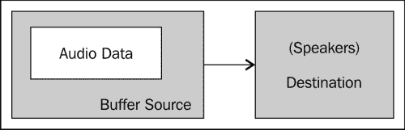
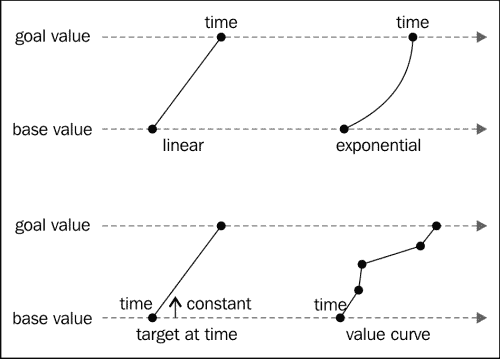
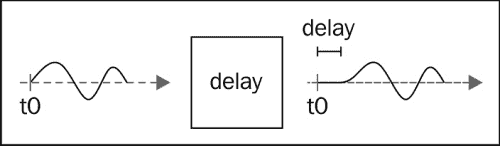
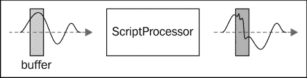
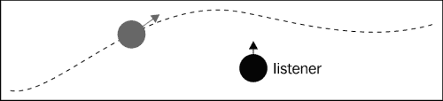
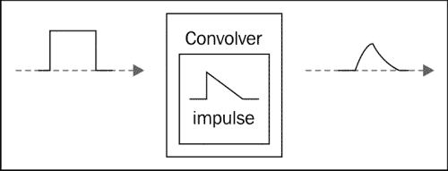
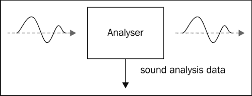
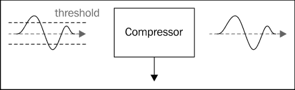

# 十、制造声音

这是本书的最后一章，但它远不是最不重要的主题。音乐和音效是游戏用户体验的重要组成部分。正确的音乐可以完全改变关卡的感觉。正确的音效可以帮助玩家理解游戏的机制，或者给他/她反馈，让他/她在正确的时间执行正确的动作。

此外，玩家希望在游戏中有声音，因为它从游戏早期就出现在游戏中。可悲的是，就声音而言，HTML 游戏有一些大问题。没有一个强大的解决方案可以让你在游戏中添加声音并在所有浏览器上运行。

在本章中，我们将介绍为游戏添加声音的四种不同技术：

*   **嵌入**：这是在页面中包含声音的最古老方式。在过去，它被大量用于使页面播放 MIDI 文件作为背景音乐。它不是标准的，不提供一致的 JavaScript API，并且您也不能保证支持给定的音频格式。不过，从好的方面来说，几乎所有你能找到的浏览器都支持它。
*   **HTML5 音频**：您可以使用`audio`标签产生声音。另一方面，几乎所有浏览器都支持它。缺点是，您必须处理这样一个事实，即每个浏览器支持不同种类的编解码器，并且您将无法处理声音。
*   **Web 音频 API**：这基本上是围绕 OpenAL 的 JavaScript 包装。这意味着你可以用声音做任何你想做的事情。不幸的是，目前只有 Chrome 和 Safari（也在 iOS 上）支持它。
*   **Flash**：可以使用 Flash 来播放声音。这似乎是一个奇怪的想法，因为我们正在制作一个 JavaScript 游戏，但您通常可以使用它作为旧浏览器的后备方案。

然后，我们将看看一些有趣的工具，您可以使用这些工具为您的游戏生成声音。

# 提取音频

首先，让我们创建一个非常简单的库来抽象我们的框架和我们选择的声音实现之间的交互。以下代码表示我们所有实现都必须遵守的“合同”：

```js
// a sound object
sound = function(){
  // Preloads the sound
  this.preload = function(url){
    // TODO: implement
  };

  // Returns true if the sound is preloaded
  this.isPreloaded = function(){
    // TODO: implement
  }

  // Starts to play the sound. If loop is true the
  // sound will repeat until stopped 
  this.play = function(loop){
    // TODO: implement
  };

  // Stops the sound
  this.stop = function(){
    // TODO: implement
  };
};
```

对于 Web Audio API 实现，我们将向对象添加更多功能，但这是任何音频库可能需要的基本功能。

## 使用我们的小图书馆

要在我们的游戏中使用声音，我们只需将相应的实现链接到我们的 HTML 文件：

```js
<script type="text/javascript" src="sound.js"></script>
```

现在，我们将添加背景音乐到我们的水平；我们需要设置声音并预加载它。我们将把`initialize`函数分为两部分：

```js
var initialize = function() {
    // ... 
    backgroundMusic = new sound();
    backgroundMusic.preload("background_music.mp3");
    waitForSound();
}

var waitForSound = function(){
  if (backgroundMusic.isPreloaded()){
    // ...
    backgroundMusic.play(true);
  } else {
    setTimeout(arguments.callee, 100);
  }
}
```

`waitForSound`功能检查声音是否预加载。如果不是，我们将创建一个超时，以便稍后（准确地说是 100 毫秒后）再次检查其状态。正如您所看到的，一旦声音被预加载，我们将启动音量并播放声音。现在我们需要在音量结束时停止声音，如以下代码所示：

```js
var player = new (function(){
    // ...
    this.update = function () {
        if(status == "dead"){
           // ...
        } else if (status == "finished") {
          backgroundMusic.stop();
          // ...
```

在下一个级别开始时再次启动：

```js
var gameLoop = function() {
    if(gameState === "level"){
        // ..
    } else if (gameState === "menu") {

      if (gf.keyboard[32]){
        // ..
        backgroundMusic.play(true);
      }
    }
};
```

经过这些修改，如果声音库尊重我们刚才指定的合同，我们将有背景音乐。现在让我们看看这个声音库的不同实现。

# 嵌入声音

HTML 拥有一种非常方便的方式，可以将某些内容的读取委托给插件：`embed`标记。它不是一个标准的标签，但所有浏览器都支持它，并且被广泛用于在网站中包含 Flash。

这个 HTML 标记可以用于在网页中包含声音。这远远不是一个理想的解决方案，原因有很多：

*   没有标准的方法以编程方式知道浏览器是否支持此功能。
*   由于公开的 API 依赖于用于播放声音的插件，因此没有控制声音播放的标准方法。可以尝试检测加载了什么插件，但是这个过程不是很可靠。此外，为每个可能的插件提供实现还需要大量的工作。
*   支持的格式取决于安装的插件，而不仅仅取决于浏览器。
*   即使支持声音格式，浏览器也可能请求启动插件的权限。只要用户没有接受插件的启动，就不会播放声音。

在某些用例中，使用这种方法在游戏中加入声音是合理的，但如果本章其余部分介绍的任何其他技术对您有效，我建议您使用这些方法。

## 实施

让我们看一下实现中负责预加载的部分：

```js
// Preloads the sound
this.preload = function(url){
  // Preloading is not supported in a consistant
  // way for embeded sounds so we just save the 
  // URL for later use.
  this.url = url;
};

// Returns true if the sound is preloaded
this.isPreloaded = function(){
  // Since we use no preloading we always return true
  return true;
}
```

使用`embed`标记实现预加载需要知道播放声音所使用的确切插件。遗憾的是，这是不可能的。相反，我们选择创建一个完全通用的实现。作为副作用，我们不能支持预加载。前面的代码只是通过始终返回`true`来绕过预加载。

这就产生了一个主要问题：文件只有在您想要播放时才会开始加载。这意味着在调用`play`函数和播放器听到声音之间会有相当大的延迟。这对于背景音乐来说不是什么大问题，但对于音效来说，这一次几乎毫无价值。另一方面，第二次播放声音时，它可能已被缓存，因此延迟应该减少。

由于我们不想使用任何 JavaScript API 与插件交互，我们只需将`embed`标记注入页面，并将其配置为自动开始播放。

```js
// Starts to play the sound. If loop is true the
// sound will repeat until stopped 
this.play = function(loop){
  var embed = "<embed width='0' height='0' src='";
  embed += this.url;
  embed += "' loop='";
  embed += (loop)? "true" : "false";
  embed += "' autostart='true' />";
  this.obj = $(embed);
  $("body").append(this.obj);
};
```

我们存储生成的标签，以便在`stop`方法中删除它：

```js
// Stops the sound
this.stop = function(){
  this.obj.remove();
};
```

这样做的缺点是我们不重用我们创建的标签。但是，由于您不会在需要创建大量声音的情况下使用此技术，所以这不是一个大问题。

## 支持的格式

由于使用`embed`标记支持的格式列表取决于安装的插件，因此无法保证给定文件可播放。但是，如果您使用 WAV 和 MIDI，您应该是安全的。

如果您选择使用 WAV 文件，请小心，因为有许多不同的方式可以用这种格式对声音进行编码，为了最大限度地提高兼容性，您应该使用未压缩的波形。

# HTML5 音频元素

为了匹配 Flash 的多媒体功能，HTML5 中添加了`video`和`audio`元素。它们都带有匹配的 JavaScript API，允许您使用 JavaScript 创建和操作视频或声音，而无需写入文档（就像`Image`对象允许您加载图像而无需使用`img`标记）。

首先让我们快速了解一下`audio`标记的外观：

```js
<audio>
   <source src="backgroundMusic.ogg" type='audio/ogg; codecs="vorbis"'>
   <source src="backgroundMusic.mp3" type='audio/mpeg; codecs="mp3"'>
</audio>
```

正如您在这里看到的，可以为`audio`标记提供多个源。这是为了避免这个 API 最大的一个问题：与文件格式的兼容性。事实上，尽管所有现代浏览器都支持`audio`元素，但没有一种音频格式可以被所有浏览器识别。解决方案是提供多种格式。

这远远不够理想，因为它会迫使您在服务器上维护多个版本的声音文件。下表显示了现有声音格式与当前浏览器版本的兼容性：

<colgroup><col style="text-align: left"> <col style="text-align: left"> <col style="text-align: left"> <col style="text-align: left"> <col style="text-align: left"></colgroup> 
|   | **MP3** | **AAC** | **WAV** | **Ogg Vorbis** |
| **铬** | ✓ |   | ✓ | ✓ |
| **火狐** |   |   | ✓ | ✓ |
| **Internet Explorer** | ✓ | ✓ |   |   |
| **歌剧** |   |   | ✓ | ✓ |
| **野生动物园** | ✓ | ✓ | ✓ |   |

这意味着如果你想支持所有浏览器，你必须提供至少两种文件格式。大家一致认为，您应该选择 MP3 和 Ogg Vorbis（以`.ogg`结尾的声音文件）。

对于游戏，通常不使用 HTML 标记，而是直接使用 JavaScript API。在开始之前，请注意一点：尽管该标准的规范尚未最终确定，但大多数现代浏览器都非常支持该功能。由于标准在过去几年中发生了变化，当前浏览器的一些旧版本的实现可能略有不同。

让我们看看如何在 JavaScript 中创建一个`audio`元素：

```js
var audio = new Audio();
```

要了解浏览器可以使用 JavaScript 的格式，可以使用`canPlayType`方法。基本用法是：

```js
var canPlay = audio.canPlayType('audio/ogg; codecs="vorbis"');
```

问题开始于此函数返回的可能值：`"probably"`、`"maybe"`、`"no"`和`""`。这可能与您预期的相去甚远，但有一个很好的理由：根据格式的不同，解码器在访问文件本身之前并不总是能够确定它是否受支持。以下是这些值的含义：

*   `"probably"`：几乎是肯定的！浏览器知道文件类型，并且非常确定它可以解码几乎所有这种类型的文件。
*   `"maybe"`：浏览器知道文件格式，但也知道它不支持它的所有变体。另一个原因可能是浏览器将此文件的读取委托给插件，无法确保插件可以处理此特定文件。
*   `""`：浏览器不知道该文件类型，也不会将读取委托给插件。有了这个响应，您可以安全地假设文件不会被播放。
*   `"no"`：答案与`""`相同；该标准的一些早期实现使用了它。如果您也想支持较旧的浏览器，那么您应该期待有一天会有这样的响应。

有了这个知识，你会做什么来模仿我们前面看到的 HTML 代码的行为，是这样的：

```js
var audio = new Audio();
var canPlayOggVorbis = audio.canPlayType('audio/ogg; codecs="vorbis"');
var canPlayMP3 = audio.canPlayType('audio/mpeg; codecs="mp3"');
if (canPlayOggVorbis == "probably" || (canPlayOggVorbis == "maybe" && canPlayMP3 != "probably")) {
  sound.ext = ".ogg";
} else {
  sound.ext = ".mp3";
} 
```

这赋予了 Ogg Vorbis 优先权，但赋予了`"probably"`优先于`"maybe"`，因此，如果浏览器只能*可能*播放 Ogg Vorbis，但认为它可能*播放 MP3，我们将加载该文件的 MP3 版本。*

## 预加载声音

与和`embed`标签不同，`audio`元素提供了一种管理声音预加载的方法。这是通过`audio`元素的`readyState`属性实现的。它可以有许多可能的值：

*   `HAVE_NOTHING`：要么文件无法访问，要么到目前为止根本没有加载数据；可能是前者。该状态对应的数值为`0`。
*   `HAVE_METADATA`：文件的开头已经预加载；这足以解析声音的元数据部分。利用这些数据，可以解析声音的持续时间。该状态对应的数值为`1`。
*   `HAVE_CURRENT_DATA`：声音已加载到当前播放位置，但不足以继续播放。这很可能是由于播放位置是文件的结尾，因为通常情况下，下面的文件的状态转换非常快。该状态对应的数值为`2`。
*   `HAVE_FUTURE_DATA`：已预加载声音，足以从给定播放位置开始播放文件的其余部分，但您无法保证播放不会很快停止，以允许更多缓冲。该状态对应的数值为`3`。
*   `HAVE_ENOUGH_DATA`：已经预加载了足够的声音，因此声音应该完全不间断地播放（这是基于播放速率和下载速度的估计）。该状态对应的数值为`4`。

对于我们的实现，我们将只考虑声音预加载，如果它是在 AutoT0-状态。让我们看看我们的小型库的预加载实现：

```js
// a sound object
sound = function(){

  // Preloads the sound
  this.preload = function(url){
    this.audio = new Audio();
    this.audio.preload = "auto";
    this.audio.src = url + sound.ext;
    this.audio.load();
  };

  // Returns true if the sound is preloaded
  this.isPreloaded = function(){
    return (this.audio.readyState == 4)
  }

  // ..
};

(function(){
 var audio = new Audio();
 var canPlayOggVorbis = audio.canPlayType('audio/ogg; codecs="vorbis"');
 var canPlayMP3 = audio.canPlayType('audio/mpeg; codecs="mp3"');
 if (canPlayOggVorbis == "probably" || (canPlayOggVorbis == "maybe" && canPlayMP3 != "probably")) {
 sound.ext = ".ogg";
 } else {
 sound.ext = ".mp3";
 }
})();

```

上述代码中有两部分；我们已经看到了突出显示的一个，它用于确定支持的声音格式。它包装在一个只执行一次的函数中，并将支持的格式作为对象变量存储在`sound`对象中。

代码的其余部分是预加载实现。首先我们创建一个`audio`对象。然后我们将预加载模式设置为`auto`。这会告诉浏览器，它可以从文件中下载任意数量的内容。然后，我们指向文件的正确版本。在这里您可以看到，`src`参数将省略扩展，以允许函数选择正确的版本。

最后，我们调用`load`函数。这对于某些实现实际开始加载文件是必要的。我们将考虑声音的预加载只为值 TytT1。

## 播放和停止声音

控制播放非常简单。让我们首先看看我们的实现：

```js
// Starts to play the sound. If loop is true the
// sound will repeat until stopped 
this.play = function(loop){
  if (this.audio.lopp === undefined){
    this.audio.addEventListener('ended', function() {
        this.currentTime = 0;
        this.play();
    }, false);
  } else {
    this.audio.loop = loop;
  }
  this.audio.play();
};

// Stops the sound
this.stop = function(){
  this.audio.pause();
 this.audio.currentTime = 0;
};
```

`play`部分的植入非常简单。但是，一些较旧的浏览器不支持`loop`属性。对于这些，我们需要手动循环。为了实现这一点，我们注册了一个事件处理程序，当声音结束时将调用它。此事件处理程序将简单地回放声音并再次播放。

正如您所看到的，`audio`元素没有`stop`函数，但有一个`pause`函数。这意味着，如果我们在`pause`函数之后再次调用`start`，声音将从原来的位置继续，而不会从一开始就开始。要回放声音，我们将当前时间设置为`0`，意思是“在开始”。

拥有一个`pause`函数可能很方便，因此我们将向我们的库中添加一个：

```js
// Pauses the sound
this.pause = function(loop){
  this.audio.pause();
};
```

现在您可能会认为这是一个非常好的解决方案，在大多数情况下，这是一个非常好的解决方案。然而，它也有一些问题；除了改变声音的播放速度外，无法对声音进行更多的操作。效果、平移（控制声音在可用输出通道中的重新分配）等都是不可能的。此外，在某些设备（大部分是移动设备）上，不能同时播放两种声音。大多数情况下，这是由于硬件的限制，但其结果是您不能同时拥有背景音乐和声音效果。如果您想在 iOS 上使用此 API，您必须知道，您只能在响应用户生成的事件时开始播放声音。

# 网络音频 API

Web 音频 API 旨在为 JavaScript 开发人员提供与编写本机应用程序时基本相同的工具。它复制了 OpenAL 的功能，OpenAL 是一种广泛用于游戏开发的 API。此外，它是一个标准 API。不幸的是，目前它只在基于 Webkit 的浏览器上实现，包括 iOS 6 中的移动版本。

在这个标准开始工作之前，Mozilla 向 Firefox 添加了一个类似的 API，称为 Audio Data，目前正在迁移到 Web Audio API。在 2013 年底之前，它可能会有一个稳定的版本。至于 InternetExplorer，目前还没有发布任何消息。如果您想在 Firefox 中使用 Web 音频 API，现在可以使用`audionode.js`库（[https://github.com/corbanbrook/audionode.js](https://github.com/corbanbrook/audionode.js) ），但它是不完整的，多年来没有更新过。然而，如果你坚持简单的用法，它可能会成功！

该 API 提供了一个完整的堆栈来生成声音效果，而不是简单地提供播放声音的方法。这样做的副作用是生成稍微复杂一些的 API。

## 基本用法

Web 音频 API 背后的理念是将节点连接在一起，以便将声音传送到扬声器。您可以将这些节点想象成现实生活中的设备，如放大器、均衡器、效果踏板或 CD 播放器。Web Audio API 中的所有操作都是通过音频上下文完成的。它是一个实例化的对象，但在任何给定时间只能有一个实例。

让我们从一个非常基本的示例开始，将 MP3 源连接到扬声器，如下图所示：



要创建 MP3 源，首先需要加载声音。这是通过一个异步 XMLHTTP 请求完成的。完成后，我们将有一个编码为 MP3 的文件，需要对其进行解码，以获得描述声波的字节，并将其存储到缓冲区：

```js
var soundBuffer = null;
var context = new webkitAudioContext();

var request = new XMLHttpRequest();

request.open('GET', url, true);
request.responseType = 'arraybuffer';

// Decode asynchronously
request.onload = function() {
  context.decodeAudioData(request.response, function(buffer) {
    soundBuffer = buffer;
  }, onError);
}
request.send();

var context = new webkitAudioContext();
```

此时，`soundBuffer`对象保存解码后的声音数据。然后我们需要创建一个源节点并将其连接到缓冲区。打个比方，这就像把一张 CD 放进 CD 播放机：

```js
var source = context.createBufferSource();
source.buffer = buffer;
```

最后，我们需要将源连接到扬声器：

```js
source.connect(context.destination);
```

这就像将我们的 CD 播放器连接到耳机或一些扬声器。此时，您将听不到任何声音，因为我们仍然没有播放声音。为此，我们可以编写以下内容：

```js
source.start(0);
```

如果该方法的名称最近发生了更改，以使其更易于理解，则该方法以前被称为`noteOn`，因此您可能也希望支持该方法，因为该更改是最近发生的，并且一些浏览器可能仍然实现了旧名称。如果您想停止播放，您将调用`stop`（或其新名称`noteOff`。您可能想知道为什么我们需要向这个函数传递一个参数。这是因为该 API 允许您以非常精确的方式同步音频，以执行任何您想要的操作（另一种声音或视觉效果）。您传递的值是声音开始播放（或停止）的时刻。该值以秒为单位。

根据我们到目前为止所看到的，我们已经可以实现我们的小型库了，所以在我们了解更复杂的用法之前，让我们先来实现它：

```js
sound = function(){
  this.preloaded = false;

  // Preloads the sound
  this.preload = function(url){
    var request = new XMLHttpRequest();
    request.open('GET', url, true);
    request.responseType = 'arraybuffer';

    // Decode asynchronously
    var that = this;
    request.onload = function() {
      sound.context.decodeAudioData(request.response, function(buffer) {
        that.soundBuffer = buffer;
        that.preloaded = true;
      });
    }
    request.send();
  };

  // Returns true if the sound is preloaded
  this.isPreloaded = function(){
    return this.preloaded;
  }

  // Starts to play the sound. If loop is true the
  // sound will repeat until stopped 
  this.play = function(loop){
    this.source = sound.context.createBufferSource();
 this.source.buffer = this.soundBuffer;
    this.source.connect(sound.context.destination);
    this.source.loop = true;
    this.source.start(0);
  };

  // Stops the sound
  this.stop = function(){
    this.source.stop(0);
  };
};

sound.context = new webkitAudioContext();
```

这里没有什么新东西，除了`play`和`stop`函数只能调用一次。这意味着每次播放声音时，您必须创建一个新的`bufferSource`对象。

## 连接更多节点

让我们在上下文中添加一个新节点：`gain`节点。此节点允许您更改声音的音量。这种声音的真实版本是一个放大器。下图显示了我们的节点将如何连接：


首先，让我们创建节点：

```js
var gainNode = context.createGainNode();
```

然后，我们将源连接到节点输入，扬声器连接到节点输出：

```js
source.connect(gainNode);
gainNode.connect(context.destination);
```

完成后，我们可以通过更改`gain.value`属性的值来修改体积，如下所示：

```js
gainNode.gain.value = 0.8;
```

`gain`参数被称为`AudioParams`。它是一个可以在很多节点中找到的参数，它拥有一系列函数，允许您操作一个值，不仅可以立即操作，还可以使其随时间变化。以下是您可以调用此对象的函数：

*   `setValueAtTime(value,``time)`：这将在指定时间更改值。时间是以秒为单位给出的绝对时间，与`start`功能一样。
*   `linearRampToValueAtTime(value, time)`：这将使当前值线性变化，直到在提供的时间达到规定值。
*   `exponentialRampToValueAtTime(value, time)`：这将使当前值呈指数变化，直到在提供的时间达到指定值。
*   `setTargetAtTime(target, time, constant)`：此将使当前值以恒定速率从给定时间开始接近目标值。
*   `setValueCurveAtTime(valuesArray, time, duration)`：这将使值在所提供的持续时间内通过所提供数组中来自所提供时间的所有值。
*   `cancelScheduledValues(time)`：这将取消给定时间内的所有编程值更改。

下图显示了这些功能的示例：



所有这些功能都可以设置为一个接一个的链接。它们相互作用的确切方式有时可能很复杂，有些转换会产生错误。有关更多详细信息，请查看规格。

## 加载多个声音

此声音只是可用于创建声音图的许多可用节点中的一个。您可以根据需要组合它们，当然，还可以将多个源连接到您的`context.destination`对象。如果您想使用多个声音，您需要一次预加载所有声音。

您可以使用我们看到的 API 来实现这一点，但有一种方法可以通过使用`BufferLoader`在 Web 音频中实现这一点。下面的代码显示了这是如何工作的：

```js
bufferLoader = new BufferLoader(
  context,
  [
    'sound1.mp3',
    'sound2.mp3'
  ],
  function(bufferList){
    // bufferList is an array of buffer
  }
);
bufferLoader.load();
```

当声音被缓冲时，回调将被执行，就像上例中的`onload`回调一样。

## 这么多节点，这么少时间

该 API 提供了相当多的效果节点；现在让我们快速概述一下节点。本清单摘自规范（[http://www.w3.org/TR/webaudio/](http://www.w3.org/TR/webaudio/) ）。请记住，规范仍在不断发展，实现并不总是完整的或与规范同步的。

### 延迟节点

**延迟**节点只会延迟传入的声音。它只有一个参数表示声音延迟的时间量。



### 脚本处理器节点

此节点是一个通用节点，允许您用 JavaScript 编写自己的效果。它有两个参数：

*   `bufferSize`：定义缓冲区的大小，必须是以下值之一：256、512、1024、2048、4096、8192 或 16384。缓冲区是 JavaScript 函数将处理的声音的一部分。
*   `onaudioprocess`：这是修改声音的功能。它将接收一个事件作为具有以下属性的参数：调用它的节点、输入缓冲区以及从缓冲区播放音频的时间。函数必须将声音写入事件的输出缓冲区。



### 平移节点

此节点将允许您在 3D 环境中空间化声音。您可以通过`setPosition`、`setOrientation`和`setVelocity`功能定义声源的空间属性。要修改侦听器的空间属性，您必须访问`context.listener`对象并使用相同的函数。

您可以在此节点上设置许多模式参数来微调空间化的方式，但您必须查看规格以了解详细信息。



### 卷积节点

此节点创建一个**卷积器**效果（[http://en.wikipedia.org/wiki/Convolution](http://en.wikipedia.org/wiki/Convolution) ）。它有两个参数：保存声音波的缓冲区用作卷积的**脉冲**和一个布尔值，用于指定效果是否应标准化。



### 分析仪节点

此节点根本不改变声音；相反，它可以用于进行频域和时域分析。



### 动态压缩机节点

本节点实现压缩效果。您可以使用以下参数配置效果：**阈值**、**膝盖**、**比率**、**还原**、**攻击**、**释放**。



### 双四元滤波器节点

此节点可用于应用一系列低阶滤波器。指定可以使用节点的`type`属性为其指定以下值之一：`lowpass`、`highpass`、`bandpass`、`lowshelf`、`highshelf`、`peaking`、`notch`和`allpass`。可以通过设置节点的某些属性来配置所选效果。有关详细信息，您可以查看规格。

### 波形整形器节点

此节点实现波形整形器效果（[http://en.wikipedia.org/wiki/Waveshaper](http://en.wikipedia.org/wiki/Waveshaper) ）由其在节点曲线属性中作为数组提供的成形函数定义。

# 闪存回退

这可能看起来很奇怪，但在一些情况下，你可能会想用闪光灯来发声。例如，您可能使用 HTML 设计了一个简单的游戏，因为您希望同时以 iOS 设备和台式机为目标。但是你希望像 IE6 这样的老浏览器也有声音。或者您只想使用 MP3，并为不支持它的设备提供闪存。在某些情况下，如果不支持 HTML5 音频元素，您可能需要使用 Flash。

有一些库允许您抽象这一点；我们将详细介绍其中一个 SoundManager 2，然后快速概述一些可用的替代方案。

## 音响经理 2

使用 SoundManager 2（[http://www.schillmania.com/projects/soundmanager2/](http://www.schillmania.com/projects/soundmanager2/) ），您只需要在页面上包含一个小的 JavaScript 代码，并提供指向 Flash 文件的链接（托管在同一台服务器上，以符合同一来源策略）。让我们快速了解一下预加载的实现情况。

```js
sound = function(){

  this.preloadStarted = false;

  // Preloads the sound
  this.preload = function(url){
    if(sound.ready){
      this.audio = soundManager.createSound({
        id: 'sound'+sound.counter++,
        url: url,
        autoLoad: true,
        autoPlay: false,
        volume: 50
      });
      this.preloadStarted = true;
    } else {
      this.url = url;
    }
  };

  // Returns true if the sound is preloaded
  this.isPreloaded = function(){
    if (!this.preloadStarted){
      this.preload(this.url);
      return false;
    } else {
      return (this.audio.readyState == 3)
    }
  }
  //...
};

sound.ready = false;
sound.counter = 0;
// a sound object
soundManager.setup({
 url: 'sm2.swf',
 flashVersion: 8, 
 useHTML5Audio: true,
 onready: function() {
 sound.ready = true;
 }
});

```

要使用 SoundManager 2，我们首先要配置它；这就是前面代码中突出显示的部分所做的。`url`参数是用于播放声音的闪存文件的路径。我们选择了 Flash 版本 8，因为如果你想模仿 HTML5 音频元素，你不需要更高的版本。然后，我们设置一个标志，使库在 Flash 不可用时使用 HTML5 播放声音。由于此方法可能需要一段时间才能加载所有对象并准备好使用，因此我们设置了一个事件处理程序来检测`SoundManager`对象是否准备好。此事件处理程序仅设置一个标志。还有更多可用的参数，我建议您在`SoundManager`的书面文档中查看它们。

要实现`preload`功能，我们必须考虑 SoundManager 可能还没有准备好。如果是这种情况，我们等待下一次调用`isPreloaded`开始预加载（如果此时`SoundManager`已准备就绪）。

要查询声音的状态，我们可以使用`readyState`参数，但要小心；可用值与 HTML5 音频元素的值不同：

*   `0`：声音未初始化；预加载尚未开始
*   `1`：声音正在加载
*   `2`：加载声音时出错
*   `3`：文件已加载

显然，如果 To.??-参数具有值 ?? ??，我们将考虑一个声音准备就绪。下面是最后三种方法的实现；这里没有什么特别之处，因为它们在`SoundManager`中都有精确的匹配：

```js
// Starts to play the sound. If loop is true the
// sound will repeat until stopped 
this.play = function(loop){
  this.audio.loops = loop;
  this.audio.play();
};

// Pauses the sound
this.pause = function(loop){
  this.audio.pause();
};

// Stops the sound
this.stop = function(){
  this.audio.stop();
};
```

这就是我们的声音库的 SoundManager 实现。

## SoundManager 的替代方案

还有许多其他的库做 SoundManager 做的事情。JP 层（[http://www.jplayer.org/](http://www.jplayer.org/) 就是其中之一。与 SoundManager 的功能相反，它也允许您播放视频，它是围绕 HTML5 音频和视频元素从头开始构思的，而这是后来添加到 SoundManager 的。此外，它被认为是一个 jQuery 插件。然而，它被设计成一个媒体播放器，用户可以看到一个用户界面。如果你想在游戏中使用它，可以禁用它。

另一种可能性是使用 SoundJS（[http://www.createjs.com/#！/SoundJS](http://www.createjs.com/#!/SoundJS)。它是 CreateJS 工具套件的一部分，非常适合游戏编程。SoundJS 支持 HTML5 音频、Web 音频 API 和 Flash。如果您熟悉 CreateJS，使用它应该不会有问题；否则，它可能会比前两个更难使用。我认为这是值得努力的，因为它是一个非常干净和现代化的图书馆。

如果您还不想学习另一个库来播放您的声音，您可以使用`mediaelement.js`（[http://mediaelementjs.com/](http://mediaelementjs.com/) ；它为不支持 HTML5 的浏览器提供了 HTML5 音频和视频元素的实现。如果您使用这个库，您只需使用`audio`元素编写代码，需要时将使用 Flash 或 Silverlight 脚本来播放代码。

# 产生声音效果

到目前为止，我们主要谈论音乐。当然，同样的技术也可以用来播放音效。然而，有一个非常优雅的解决方案来处理它们：在运行时生成它们。这模仿了在旧游戏机上创建许多效果的方式。要在 JavaScript 中实现这一点，可以使用`SFXR.js`（[https://github.com/humphd/sfxr.js](https://github.com/humphd/sfxr.js) ）。它是流行的 SFXR 的一个端口。遗憾的是，它只适用于 Firefox 的音频数据 API。尽管如此，我还是鼓励你去看看！

# 总结

现在，你已经学会了许多不同的方法来使用标准 API、插件和 Flash 库在游戏中播放声音，你的脑袋现在可能很痛！目前浏览器中的音频状态不是很好，但几年后，当所有浏览器都支持 Web 音频 API 时，我们的情况会好得多！因此，我建议花一些时间好好学习，即使它比 HTML5 音频元素稍微复杂一些。

现在您拥有了创建完美 jQuery 游戏所需的所有工具！我真的希望你喜欢读这本书，它将激励你创造许多精彩的游戏。