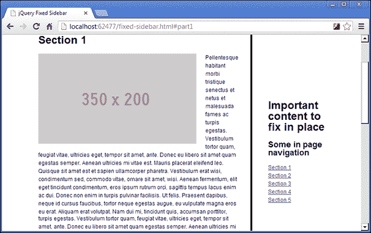

# 二、固定位置的侧边栏，和滚动动画

`position:fixed`CSS 样式添加了一种有趣的效果，允许目标元素在屏幕上保持其位置，即使在滚动页面时也是如此。但是，它的有效性受到以下事实的限制：无论元素嵌套在其他元素中有多深，它始终相对于整个文档是固定的。

# 任务简报

在本项目中，我们将创建一个模拟`position:fixed`CSS 样式的侧边栏，但不会受到与纯 CSS 解决方案相同的限制。我们还可以在页面中添加一个吸引人的动画，这样当点击侧边栏中的导航项时，页面的不同部分就会滚动到视图中。

以下是显示此项目最终结果的屏幕截图：



## 为什么太棒了？

能够在页面上固定一个元素是许多大型流行网站使用的一种非常流行的 UI 设计模式。

让访问者的主要工具或行动要求始终保持在触手可及的范围内，可以改善网站的用户体验，并有助于让访问者满意。使事情变得方便是很重要的，因此如果访问者必须向下滚动一个长页面，然后一直向上滚动来单击某个内容，他们很快就会对该页面失去兴趣。

同样的原理也是移动设备上的一个新兴趋势。实际的`position:fixed`样式通常在移动设备上的支持非常差，但可以说，在不需要过度滚动或更改屏幕的情况下，将重要工具放在手中的想法正在一些当今最知名的应用中被采用和实现。

## 你的热门目标

为完成本项目，我们需要完成以下任务：

*   构建合适的演示页面
*   存储固定元件的初始位置
*   检测页面何时滚动
*   处理浏览器窗口的大小调整
*   自动滚动
*   恢复浏览器的“后退”按钮
*   处理页面加载时的哈希片段

# 构建合适的演示页面

在这项任务中，我们将准备演示页面和脚本所需的其他文件。

为了使这种技术的好处显而易见，我们需要使用一些额外的元素，严格来说，这些元素不是我们将要修复的边栏所需元素的一部分。

我们将用作本例重点的侧边栏需要位于完整页面的结构中，要查看固定位置效果，页面也需要相当长。

在构建演示页面时，我们将使用一系列 HTML5 元素，您应该知道，一些浏览器的旧版本不支持这些元素。如果您发现确实需要支持传统浏览器，则需要使用谷歌代码（[中提供的`html5shiv`脚本 http://code.google.com/p/html5shiv/](http://code.google.com/p/html5shiv/) ）。

## 准备起飞

我们应该首先将模板文件的新副本保存到项目的根文件夹中，并调用新文件`fixed-sidebar.html`。我们还可以创建一个名为`fixed-sidebar.css`的新样式表，将其保存在`css`文件夹中，并创建一个名为`fixed-sidebar.js`的新 JavaScript 文件，该文件应保存在`js`文件夹中。

我们可以使用以下新的`<link>`元素链接到 HTML 页面`<head>`部分的新样式表，该元素应直接添加到`common.css`链接之后：

```js
<link rel="stylesheet" href="css/fixed-sidebar.css" />
```

请记住，`common.css`样式表用于提供有用的东西，例如重置、简单的排版框架和一些常见的布局样式，以尽量减少每个项目所需的 CSS。

我们可以使用以下新的`<script>`元素链接到新的 JavaScript 文件，该元素应该直接位于`fixed-sidebar.html`的`<body>`部分的 jQuery`<script>`文件之后：

```js
<script src="js/fixed-sidebar.js"></script>
```

下面的页面现在已经设置好，我们可以添加该项目所需的元素。

## 启动推进器

我们将为我们的页面使用一个由以下元素组成的基本布局，这些元素应添加到`fixed-sidebar``.html`中：

```js
<header>
    <h1>jQuery fixed sidebar example page</h1>
</header>

<div class="wrapper">
    <article>
        <h1>Example content area</h1>
        <section id="part1">
        </section>    
        <section id="part2">
        </section>
        <section id="part3">
        </section>  
        <section id="part4">
        </section> 
        <section id="part5">
        </section>
    </article>   
    <aside>
        <h2>Important content to fix in place</h2>
        <nav>
            <h3>Some in page navigation</h3>
            <ul>
                <li><a href="#part1">Section 1</a></li>
                <li><a href="#part2">Section 2</a></li>
                <li><a href="#part3">Section 3</a></li>
                <li><a href="#part4">Section 4</a></li>
                <li><a href="#part5">Section 5</a></li>
            </ul>
        </nav>
    </aside>
</div>
```

这些元素应该添加到页面的`<body>`中，直接在链接到 jQuery 的`<script>`元素之前。

我们还需要为我们的示例页面提供一些基本的 CSS，以便创建本示例所需的布局。在我们为本例创建的`fixed-sidebar.css`样式表中，添加以下样式：

```js
header, .wrapper { width:80%; max-width:1140px; margin:auto; }
header { 
    padding-bottom:2em; border-bottom:4px solid; 
    margin-bottom:3em; 
}
header h1 { margin-top:.75em; }
article { 
    width:70%; padding-right:4%; border-right:4px solid;
    margin-right:5%; float:left; 
}
aside { width:20%; float:left; }
```

和前面一样，这些代码实际上都不是必需的，我们使用它只是为了展示演示页面，正如我们在本例中所需要的那样。

## 目标完成-小型任务汇报

我们添加了一个非常简单的布局来创建演示页面。HTML5`<article>`包含五个不同的 HTML5`<section>`元素，每个元素都有自己的`id` 属性。稍后我们将在项目中使用这些工具，以便在它们之间进行动画导航。

在前面的代码示例中，每个`<section>`元素都是空的。但是，如果您正在跟随并编写示例代码，则应该使用各种随机元素填充每个示例代码，以增加页面的长度。

我们在这个例子中使用的元素都不重要。HTML5`<aside>`是我们将要修复的元素，但它是`<aside>`元素这一事实并不重要——任何元素都可以使用这种技术。

在`<aside>`元素内部是 HTML5`<nav>`元素。正如我所提到的，这将允许我们稍后添加另一个很酷的特性，但是对于要使用的基本技术来说，这并不是必需的。任何内容都可以在要固定到位的元素中使用。

注意在 CSS 中，我们在任何地方都不使用`position:fixed`。原因很简单。具有固定位置的元素是相对于文档整体而不是其父容器定位的。

如果没有提供像素坐标，则会呈现一个固定位置元素，其中页面上的元素流取决于其 DOM 位置（尽管从技术上讲，它仍然超出页面的正常流）。

如果我们用我们的示例布局尝试这样做，它会在外部`.wrapper`元素的最左边结束，因为`<article>`元素上指定的`float`也会从正常文档流中删除`<article>`元素。这不好。

如果提供了像素坐标，渲染引擎会将这些坐标解释为相对于窗口，就像绝对定位的元素一样。在某些情况下，可以指定像素坐标，但当使用液体布局（如本例中）时，设置`<aside>`元素的`left`和`top`样式属性所需的坐标将根据用于查看页面的屏幕分辨率而变化，这就是我们面临的难题，也是使用 jQuery 而不是简单的 CSS 来实现它的原因。

## 机密情报

为了节省创建示例布局（如本项目中使用的布局）时的时间，我们可以使用 Placehold It（[等服务 http://placehold.it/](http://placehold.it/) ）用于任何尺寸的占位符图像，以及 HTML Ipsum（[http://html-ipsum.com](http://html-ipsum.com) ）用于预填充的一系列常见 HTML 元素 Lorem Ipsum 占位符文本。

# 存储固定元件的初始位置

在我们将元素固定到位之前，我们需要知道元素的位置。在本任务中，我们将获得将要固定到位的`<aside>`元素的当前起始位置。

## 启动推进器

在`fixed-sidebar.js`中，我们应该从以下代码开始：

```js
$(function() {

});
```

我们可以在函数顶部缓存几个 jQuery 选定元素，为了存储固定元素的初始位置，我们可以在刚才添加的函数中添加以下代码：

```js
var win = $(window),
    page = $("html,body"),
    wrapper = page.find("div.wrapper"),
    article = page.find("article"),
    fixedEl = page.find("aside"),
    sections = page.find("section"),
    initialPos = fixedEl.offset(),
    width = fixedEl.width(),
    percentWidth = 100 * width / wrapper.width();
```

## 目标完成-小型任务汇报

我们在第一个项目中使用了相同的代码外包装器。正如我当时提到的，一旦页面完成加载，这是一种非常常见的执行代码的方法。我们可能会在整本书的每个项目中使用它。

然后我们缓存对我们将要引用的元素的引用，这样我们就不必一直从 DOM 中选择它们。稍后，我们将在事件处理程序中查询这些元素，因此从页面中选择它们一次，然后在整个代码中引用保存的或缓存的版本，而不是重复从页面中选择元素，对性能来说会更好。

我们存储对`window`对象的引用，因为我们将向它附加几个事件处理程序。稍后我们将滚动整个页面，为了实现完全的跨浏览器兼容性，我们应该选择并存储对`<html>`和`<body>`元素的引用，因为不同的浏览器使用`<html>`或`<body>`元素，所以这涵盖了所有基础。

我们需要选择类名为`wrapper`的元素、包含`<article>`的元素、所有不同的`<section>`元素，当然还有`<aside>`元素，我们将在剩下的代码中经常使用这些元素。

我们还存储固定元素的初始位置，以便知道页面上要固定元素的坐标。我们使用 jQuery 的`offset()`方法，它返回一个包含`top`和`left`属性的对象，这些属性显示相对于文档的当前位置，这正是我们所需要的。

根据应用于周围元件的样式，被固定元件的`width`可能会发生变化。为了缓解这种情况，我们还使用 jQuery 的`width()`方法存储元素的初始`width`，该方法返回一个以像素表示`width`的整数。

最后，我们还可以计算并存储`width`作为百分比。当我们想要对调整浏览器窗口的大小做出反应时，我们需要知道这一点。通过将固定元素的`100`乘以`width`，然后将该数字除以其容器的宽度，我们再次使用 jQuery 的`width()`方法来获得它，计算出来很容易。这也意味着固定侧边栏的`width`可以在 CSS 文件中轻松更改，脚本将继续工作。

# 检测页面何时滚动

我们的下一个任务是检测页面何时被滚动，并在出现滚动时将元素固定到位。通过 jQuery，我们可以很容易地检测滚动事件，正如将`position`设置为`fixed`一样，因为我们可以调用简单的 jQuery 方法来完成这些事情。

## 启动推进器

在上一个任务中初始化的变量之后，直接向脚本文件添加以下代码：

```js
win.one("scroll", function () { 
    fixedEl.css({
        width: width,
        position: "fixed",
        top: Math.round(initialPos.top),
        left: Math.round(initialPos.left)
    });
});
```

## 目标完成-小型任务汇报

我们可以使用 jQuery 的`one()`方法将事件处理程序附加到存储在变量中的`window`对象。`one()`方法将在第一次检测到事件时自动解除事件处理程序的绑定，这非常有用，因为我们只需要将元素设置为`position:fixed`一次。在本例中，我们寻找的是`scroll`事件。

当检测到事件时，将执行作为第二个参数传递给`one()`的匿名函数。当这个发生时，我们使用 jQuery 的`css()`方法来设置一些`style`属性。我们设置元素的`width`以应对由于周围元素的`float`和/或`margin`而导致目标元素的`width`增加的情况。

我们将`position`设置为`fixed`，并使用项目开始时存储在`initialPos`变量中的元素的初始位置设置`top`和`left`样式属性。我们使用 JavaScript 的`Math.round()`方法将`top`和`left`像素位置舍入为整数，这有助于避免子像素舍入的跨浏览器问题。

# 处理浏览器窗口大小调整

目前，我们的`<aside>`元素将在页面滚动时立即固定到位，这符合我们的需要，而浏览器的大小保持不变。

但是，如果出于某种原因调整了窗口的大小，则`<aside>`元素将脱离其固定位置，并可能在视口边界之外丢失。在本任务中，我们将通过添加一个侦听窗口调整大小事件的事件处理程序来修复此问题。

## 启动推进器

为了保持固定元素相对于页面其余部分的正确位置，我们应该在上一个任务中添加的`one()`方法之后直接添加以下代码：

```js
win.on("resize", function () {
    if (fixedEl.css("position") === "fixed") {
        var wrapperPos = wrapper.offset().left,
            wrapperWidth = wrapper.width(),
            fixedWidth = (wrapperWidth / 100) * percentWidth;

        fixedEl.css({
            width: fixedWidth,
            left: wrapperPos + wrapperWidth - fixedWidth,
            top: article.offset().top
        });
    }
});
```

## 目标完成-小型任务汇报

这次我们使用 jQuery 的`on()`方法来附加我们的事件处理程序。我们将两个参数传递给此方法；第一个是我们正在侦听的事件，在本任务中是窗口的`resize`事件，第二个是我们希望在检测到事件时执行的函数。

如果页面已经被滚动，并且元素的`position`被设置为`fixed`，我们只想重新定位和调整`<aside>`元素的大小，所以在我们做任何其他事情之前，我们首先检查情况是否如此。

如果元素的`position`设置为`fixed`，我们首先使用 jQuery 的`offset()`方法返回的对象的`left`属性确定包装器元素当前的`left`样式属性。我们还使用 jQuery 的`width()`方法获得包装器元素的`width`。

因为我们的布局是液态的，所以我们还需要调整固定元件的`width`。在 CSS 中，我们最初将`width`设置为`20%`，因此我们可以通过将容器的当前宽度除以 100，然后乘以我们在第一个任务中存储的`percentWidth`变量来确保它保持在容器的 20%。

然后，我们使用 jQuery 的`css()`方法来设置固定元素的`width`及其`top`和`left`样式属性，以确保在调整`window`大小时它保持在正确的位置。

# 自动滚动

此时，我们应该能够点击我们添加到固定元素的导航菜单中的任何链接，页面将跳转以查看相应的部分。固定元件仍将固定到位。

然而，跳转到该部分是非常不和谐的，因此在本任务中，我们将手动滚动每个部分，以便跳转到每个部分不会如此突然。我们还可以为卷轴设置动画，以获得最大的美学效果。

## 启动推进器

对于这个任务，我们应该添加另一个事件处理程序，这次是针对导航列表中链接上的`click`事件，然后设置页面滚动动画，以查看所选`<section>`。

首先，我们可以添加一个通用函数来滚动页面，该函数接受一些参数，然后使用这些参数执行滚动动画。我们应该在上一个任务中添加的`one()`方法之后直接使用以下代码定义函数：

```js
function scrollPage(href, scrollAmount, updateHash) {
    if (page.scrollTop() !== scrollAmount) {
        page.animate({
            scrollTop: scrollAmount
        }, 500, function () {
            if (updateHash) {
                document.location.hash = href;
            }
        });
    }
}
```

接下来，我们可以在我们的固定元素中为导航上的单击事件添加一个处理程序。这应该直接添加到我们刚才添加的`scrollPage()`函数之后：

```js
page.on("click", "aside a", function (e) {
    e.preventDefault();

    var href = $(this).attr("href"),
        target = parseInt(href.split("#part")[1]),
        targetOffset = sections.eq(target - 1).offset().top;

    scrollPage(href, targetOffset, true);
});
```

## 目标完成-小型任务汇报

首先我们定义了接受三个参数的`scrollPage()`函数。第一个是`href`，第二个是整数，表示页面的`scrollTop`属性需要设置动画的图形，第三个是布尔值，它将告诉函数是否更新浏览器位置栏中的哈希片段。

我们在这个函数中要做的第一件事是检查页面是否确实需要滚动。为了确保它的正确性，我们只需检查使用 jQuery 的`scrollTop()`方法获得的页面当前滚动与我们希望滚动的数量是否不同。

jQuery`animate()`方法也接受三个参数。第一个是对象，其中每个关键点都是要设置动画的属性，每个值都是要设置动画的值。在本例中，我们希望使用传递给函数的`scrollAmount`参数设置`scrollTop`属性的动画。

`animate()`方法的第二个参数是动画应该运行的持续时间。它接受以毫秒为单位表示持续时间的整数。我们指定了`500`，因此动画需要半秒钟才能完成。

第三个参数是一个回调函数，我们希望在动画结束时立即执行该函数。如果传递给我们函数的`updateHash`参数设置为`true`，我们可以更新浏览器的位置栏，以显示所需`<section>` 元素的`id`。

我们可以通过使用传递给我们的`scrollPage()`函数的`href`参数更新`document.location`对象的`hash`属性来实现这一点。这会更新位置栏，但因为它只是一个散列片段，所以不会导致页面重新加载。

在添加了函数`scrollPage()`之后，我们在固定元素内的导航中添加了`click`事件的处理程序。我们再次使用 jQuery 的`on()`方法来附加此事件，但这次我们将三个参数传递给该方法，从而启用事件委派。处理程序附加到我们已经存储在变量中的页面的`<body>`。

第一个参数是我们想要将处理程序绑定到的事件，在本例中是`click`事件。第二个参数是选择器；`on()`方法将过滤所有点击事件，以便只有那些源自与选择器匹配的元素的事件才会调用绑定处理程序函数。

在本例中，我们只对固定元素中的`<a>`元素点击感兴趣—`<aside>`。第三个参数是绑定为处理程序的函数，jQuery 会自动将其传递给原始事件对象。

在这个函数中，我们首先使用传递给我们的处理函数的事件对象的`preventDefault()`方法，停止浏览器导航到相应的`<section>`元素。

接下来，我们设置一个变量，告诉我们用户希望导航到哪个`<section>`。在我们的事件处理函数中，`$(this)`对象的作用域是被单击的链接，因此我们可以通过使用 jQuery 的`attr()`方法获取被单击链接的`href`属性来轻松获得所需的部分`id`。我们将其存储在一个名为`href`的变量中。

我们需要知道所需的`<section>`元素在页面的何处，我们通过使用 JavaScript 的`split()`方法拆分存储在我们刚刚设置的`href`变量中的字符串来获得该元素。

如果我们指定`#part`作为要拆分的字符串，`split()`方法将返回一个由两个项目组成的数组，其中第二个项目是单击的节号的字符串版本。通过将此语句包装在 JavaScript 的`parseInt()`中，我们最终得到一个整数。我们将这个整数存储在`target`变量中。

我们设置的最后一个变量是所需`<section>`元素的偏移量。为了选择正确的`<section>`元素，我们可以使用我们在项目开始时存储的`sections`数组。

为了从这个数组中提取正确的元素，我们使用 jQuery 的`eq()`方法，并将刚刚保存在`target`变量减去`1`中的值传递给它。我们需要减去`1`，因为 JavaScript 中的数组从`0`开始，但我们的`<section>``id`属性从`1`开始。

一旦我们有了这些信息，我们就可以调用我们的`scrollPage()`函数，传递我们刚刚计算出来的值来设置页面滚动的动画，以便将所需的`<section>`元素带入视图。

# 恢复浏览器的后退按钮

此时，我们可以单击`<aside>`元素中的任何链接，页面将平滑地滚动到页面上所需的位置。浏览器的地址栏也将更新。

但是，如果用户试图使用其浏览器的后退按钮返回到上一个`<section>`，则不会发生任何。在本任务中，我们将修复此问题，以便“后退”按钮按预期工作，甚至可以在使用“后退”按钮返回到上一个`<section>`时使用平滑滚动。

## 启动推进器

通过在刚才添加的 click 事件的事件处理程序之后直接添加另一个事件处理程序，我们可以非常轻松地启用 back 按钮：

```js
win.on("hashchange", function () {

    var href = document.location.hash,
        target = parseInt(href.split("#part")[1]),
        targetOffset = (!href) ? 0 : sections.eq(target - 1).offset().top;

    scrollPage(href, targetOffset, false);
});
```

## 目标完成-小型任务汇报

我们使用 jQuery 的`on()`方法再一次附加我们的事件，这次我们不需要使用事件委托，所以我们返回到该方法的两个参数形式。

这一次，我们正在监听`hashchange`事件，它像以前一样作为第一个参数传递，并且在`document.location`对象的`hash`属性发生更改时发生。

在作为第二个参数传递的 handler 函数中，我们为需要传递到`scrollPage()`函数以执行滚动的不同值设置变量。这次我们不需要阻止浏览器的默认行为，`href`变量是使用`document.location.hash`属性设置的，因为它将是触发事件的后退按钮，而不是`<aside>`中的一个链接。

实际上，当单击其中一个链接时，也会触发此处理程序，因为链接也会更新哈希，但是`scrollPage()`函数中的条件检查将防止对 jQuery 的`animate()`方法进行不必要的调用。

`target`变量的计算方式与上次事件处理程序中的计算方式完全相同，但这次`targetOffset`变量需要处理浏览器地址栏中没有哈希片段的情况。为了处理这个问题，我们使用一个 JavaScript 三元结构来检查我们刚刚定义的`target`变量是否有一个假值，这将指示一个空字符串。如果有，我们只想将滚动动画设置回零。如果没有，我们将以与以前相同的方式确定所需的滚动量。

我们现在应该能够加载页面，通过点击`<aside>`元素中的一个链接滚动到页面的一部分，然后使用浏览器的后退按钮滚动回页面顶部。

# 页面加载时处理散列片段

此时浏览器后退按钮的功能已经恢复，访客可以在地址栏中看到可书签的 URL。

如果请求的页面中包含哈希片段，则页面加载时会自动跳转到指定的`<section>`。在这一部分中，我们将添加一些代码来检查`document.location`对象的哈希属性，如果检测到哈希，它将平滑地滚动到页面的相应部分。

## 启动推进器

为了实现这一点，我们应该在脚本文件顶部附近定义起始变量的位置之后直接添加以下代码，并在侦听滚动事件的位置之前直接添加以下代码：

```js
if (document.location.hash) {

    var href = document.location.hash,
        target = parseInt(href.split("#part")[1]),
        targetOffset = sections.eq(target - 1).offset().top;

    page.scrollTop(0);
    document.location.hash = "";
    scrollPage(href, targetOffset, true);

}
```

## 目标完成-小型任务汇报

在这段代码中，我们首先检查`document.location`对象是否包含`hash`（或者至少包含一个非空字符串的`hash`）。

如果有，我们获得`hash`，获得`<section>`的编号，并按照之前任务中的方法计算从页面顶部的偏移量。然后，我们将页面的`scrollTop`设置为`0`，以强制浏览器位于页面顶部。我们还将在这一点上删除散列。

最后，我们可以调用我们的`scrollPage()`函数，传入新的`href`片段、所需的滚动量，并将最终参数设置为`true`，以便将正确的哈希片段添加回浏览器的位置栏。这一切都应该发生得如此之快，以至于用户不会注意到页面加载已被拦截，并且行为已被修改。

# 任务完成

在这个项目中，我们研究了一种非常简单的模仿 CSS`position:fixed`样式的方法，以将一个重要元素固定到位。当页面开始滚动时，仅应用固定定位的技术简单但有效，并且是一种很好的方法，可以避免使用复杂或流动布局时实际`position:fixed`的缺点。

我们了解了如何处理窗口大小调整，并添加了一个平滑滚动功能，可以在页面的不同命名部分之间滚动页面。

我们还研究了如何读取和写入`window`对象的`document.location.hash`属性，以及如何在加载页面时手动滚动到请求的部分。我们还修复了浏览器的后退按钮来处理平滑滚动动画。

# 你准备好了吗？热门挑战

通常，使用我们在本项目中使用的那种页面内导航，在手动或单击其中一个链接时，在导航链接上显示打开状态非常有用。尝试将这个简单但有效的添加到我们在本项目过程中看到的代码中。