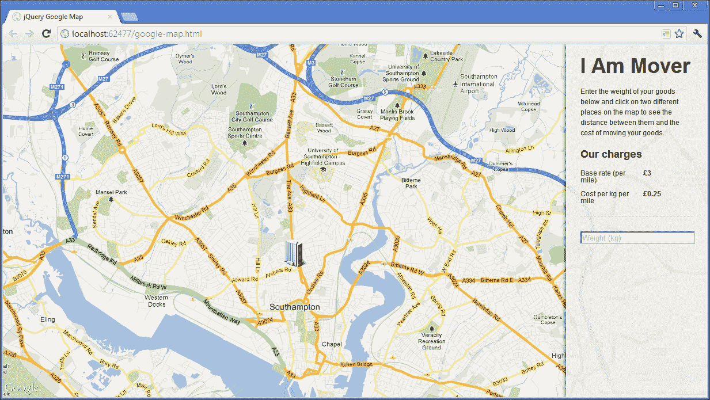
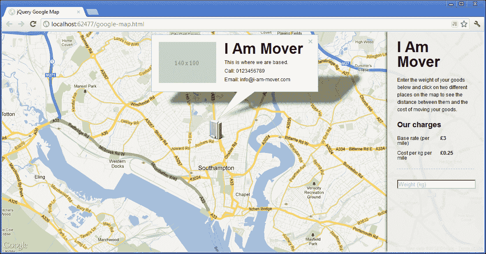
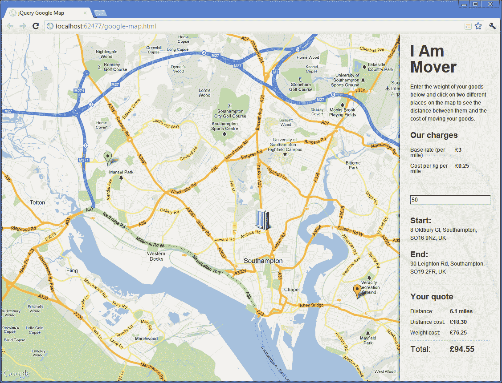

# 三、交互式谷歌地图

在这个项目中，我们将创建一个高度交互的谷歌地图，它与最新版本的谷歌 API 一起工作，生成一个带有自定义覆盖和标记、地理编码地址和计算距离的地图。我们还将研究如何使用 Google 和 jQuery 事件处理程序的组合使我们的简单 UI 与添加到地图中的位置保持同步。

# 任务简报

对于本项目的目的，我们将有一个场景，我们需要为一家公司构建一个基于地图的应用，该公司将东西从一个地方带到另一个地方。他们想要一个页面，客户可以通过点击本地化地图的不同区域来计算从一个地方到另一个地方的运输成本，或者订购。

我们将了解如何监听地图上的点击，以便添加标记并记录每个标记的精确位置。然后，我们可以更新 UI 以显示被单击位置的实际街道地址，并允许访问者根据两个地址之间的计算距离生成报价。

## 为什么太棒了？

谷歌地图是一个非常棒的 API。我们已经具备了高度的交互性和丰富的特性，我们可以在它提供的坚实基础之上构建健壮且功能性强的应用。谷歌提供地图数据和与地图的交互，而 jQuery 用于构建用户界面——这是一个成功的组合。

我们将使用的页面类似于以下屏幕截图：



## 你的热门目标

本项目将分解为以下任务：

*   创建页面和界面
*   初始化地图
*   使用自定义覆盖显示公司总部
*   捕捉地图上的点击
*   使用开始和结束位置更新 UI
*   处理标记重新定位
*   权重因子
*   显示预计的距离和成本

## 任务清单

我们需要链接到 Google 提供的脚本文件，以便初始化映射并加载到 API 中。我们也可以创建新的文件，在这个时候我们将在项目中使用这些文件。

别担心，我们不需要谷歌的 API 密钥或者类似的东西来让这个项目工作，我们可以直接链接到脚本来使用它。

### 注

谷歌地图 API 功能丰富且稳定，包含所有最著名地图功能的入口点，包括街景、地理位置和方向服务。除了我们在这里使用的配置选项之外，还有很多其他选项。有关更多信息，请参见[上的文档站点 http://developers.google.com/maps/](http://developers.google.com/maps/) 。

首先，我们应该将模板文件的新副本保存到根项目文件夹中，并将其命名为`google-map.html`。同时创建一个`google-map.css`文件和一个`google-map.js`文件，并分别保存在`css`和`js`文件夹中。

我们可以通过在页面的`<head>`中添加以下`<link>`元素，直接在`common.css`的`<link>`元素之后链接到本例的样式表：

```js
<link rel="stylesheet" href="css/google-map.css" />
```

### 提示

别忘了，我们在每个项目中都使用了`common.css`，这样我们就可以专注于项目实际需要的样式，而不需要所有枯燥的重置、浮动清除和大多数网页所需的其他常见 CSS 样式。

我们可以直接在 jQuery 的`<script>`元素之后，使用以下`<script>`元素链接到 Google 的脚本文件以及我们刚刚创建的 JavaScript 文件：

```js
<script src="http://maps.googleapis.com/maps/api/js?sensor=false">
</script>
<script src="js/google-map.js"></script>
```

我们还将在这个项目中使用两幅图像，`hq.png`和`start.png`，它们都可以在本书附带的代码下载中找到。您应该将它们复制到本地`jquery-hotshots`项目目录中的`img`目录中。我们的页面现在已经设置好，可以开始第一个任务了。

# 创建页面和界面

在我们的第一个任务中，我们可以为地图添加不同的容器，以及页面所需的初始 UI 元素。我们也可以添加一些基本的样式来布置我们想要的东西。

## 启动推进器

我们应该在刚刚设置的`google-map.html`页面的`<body>`元素中添加以下元素：

```js
<div id="map"></div>
<div id="ui">
    <h1>I Am Mover</h1>
    <p>Enter the weight of your goods below and click on two 
    different places on the map to see the distance between 
    them and the cost of moving your goods.</p>
    <h3>Our charges</h3>
    <dl class="clearfix">
        <dt>Base rate (per mile)</dt>
        <dd>&pound;3</dd>
        <dt>Cost per kg per mile</dt>
        <dd>&pound;0.25</dd>
    </dl>
    <input id="weight" placeholder="Weight (kg)" />
</div>
```

对于一些基本的样式和布局页面，当我们初始化地图时，我们可以将以下选择器和样式添加到我们刚刚创建的`google-map.css`文件中：

```js
#map { width:100%; height:100%; }
#ui { 
    width:16%; height:99.8%; padding:0 2%; 
    border:1px solid #fff; position:absolute; top:0; right:0;
    z-index:1; box-shadow:-3px 0 6px rgba(0,0,0,.5);
    background-color:rgba(238,238,238,.9); 
}
#ui h1 { margin-top:.5em; }
#ui input { width:100%; }
#ui dl { 
    width:100%; padding-bottom:.75em; 
    border-bottom:1px dashed #aaa; margin-bottom:2em; 
}
#ui dt, #ui dd { margin-bottom:1em; float:left; }
#ui dt { width:50%; margin-right:1em; clear:both; }
#ui dd { font-weight:bold; }
```

## 目标完成-小型任务汇报

在本任务中，我们刚刚开始添加基础 HTML 元素，我们将在接下来的几个任务中正确填充这些元素。这是启动并运行示例页面和项目的第一步，虽然有点枯燥，但也有点必要。

我们添加的第一个元素是 GoogleMapsAPI 将地图分幅渲染到的容器。我们给它一个`map`的`id`，这样可以有效地选择它，但它一开始是完全空的。

下一个元素是示例所需的各种 UI 元素的容器。它也有一个`id`的`ui`，便于从我们的脚本中选择，以及添加 CSS 样式。

### 提示

**带有 ID 的样式**

避免使用 ID 选择器来添加 CSS 样式正逐渐成为一种通用的最佳实践，像**CSSLint**这样的工具建议不要使用它。

虽然这样做和坚持使用类、元素或属性选择器的论点很有说服力，但为了简单起见，我们将在本书的一些项目中使用它们。

CSSLint 是一个开源的 CSS 代码质量工具，它对源代码执行静态分析，并标记可能出错或给开发人员带来问题的模式。参见[http://csslint.net/](http://csslint.net/) 获取更多信息。

在接口容器中，我们有虚构公司的名称、使用页面的一些基本说明、不同费用的列表以及允许输入权重的`<input>`元素。

我们在本任务中添加的大多数 CSS 纯粹是装饰性的，并且特定于本示例。如果需要不同的外观和感觉，它很可能会大不相同。我们已经使 map 容器占据了页面的全部宽度和高度，并对界面进行了样式设置，使其看起来漂浮在页面的右侧。

# 初始化地图

要创建并运行一个可缩放、可移动的交互式谷歌地图，只需编写少得可笑的代码。在本任务中，我们将添加该代码，并设置一些稍后在脚本中使用的变量。

## 准备起飞

在本任务中，我们将初始化配置地图所需的变量，并调用谷歌地图 API。首先，我们应该将标准 jQuery 包装器添加到前面创建的空`google-map.js`文件中：

```js
$(function () {
    //all other code in here...
});
```

记住，`$(function () { … });`构造是 jQuery 的`document.ready`事件处理程序的快捷方式。

## 启动推进器

在刚才添加的包装器中，我们应该添加以下代码：

```js
var api = google.maps,
    mapCenter = new api.LatLng(50.91710, -1.40419), 
    mapOptions = {
        zoom: 13,
        center: mapCenter,
        mapTypeId: api.MapTypeId.ROADMAP,
        disableDefaultUI: true
    },
    map = new api.Map(document.getElementById("map"), mapOptions),
    ui = $("#ui"),
    clicks = 0,
    positions = [];
```

## 目标完成-小型任务汇报

在这个任务中，我们首先创建一些初始化映射所需的变量。我们将在代码中处理`google.maps`名称空间，因此为了方便起见，我们设置的第一个变量是前两个名称空间的内容。

有一个本地范围的副本可以直接到达我们想要使用的实际 API，这将使我们的代码稍微更高效，因为我们的代码更容易解析单个变量。首先打字也要快得多。

Google Maps API 使用的所有属性和方法都有名称空间。它们都位于`maps`名称空间中，而`maps`名称空间本身位于`google`名称空间中。谷歌拥有如此庞大的代码库，可以在如此多的不同应用中使用，因此使用名称空间将所有内容隔离和组织起来是有意义的。

### 注

有关 JavaScript 中名称空间的复杂性的深入讨论，请参阅 JavaScript 主管*Addy Osmani*（[撰写的关于该主题的优秀文章 http://addyosmani.com/blog/essential-js-namespacing/](http://addyosmani.com/blog/essential-js-namespacing/) ）。

接下来，我们存储要将地图居中的纬度和经度。这是使用 Google Maps API 的`LatLng()`方法完成的，该方法接受两个参数，即纬度和经度值，并返回一个`LatLng`对象供其他 API 方法使用。注意我们是如何使用局部变量`api`调用`LatLng`构造函数的。

然后，我们可以创建一个对象文本，其中包含映射所需的一些配置选项。这些选项包括缩放级别、地图应居中的位置、地图类型以及禁用默认地图类型和缩放/平移控件的选项。我们可以将`mapCenter`中包含的`LatLng`对象用于`center`配置选项。

接下来，我们使用 MapAPI 的`Map()`构造函数创建一个新的 map 实例。这个函数接受两个参数：第一个是映射应该呈现到的 DOM 元素，第二个是包含我们希望设置的配置选项的对象文本。

第一个参数采用实际的 DOM 元素，而不是 jQuery 包装的 DOM 元素。因此，尽管我们可以使用 jQuery 从页面中选择元素，然后提取原始 DOM 元素，但使用 JavaScript 的本机`getElementById()`函数检索我们在上一个任务中添加到页面中的映射容器并将其传递给`Map()`构造函数更为有效。

接下来，我们为 UI 容器缓存一个 jQuery 选择器，这样我们就可以从页面重复访问它，而不必每次都从 DOM 中实际选择它，并定义一个名为`clicks`的变量，我们将使用该变量记录单击地图的次数。我们需要在顶级函数作用域中定义它，以便稍后在代码中的单击处理程序中引用它。

最后，我们在变量`positions`中添加一个空数组文本，稍后当我们需要存储已单击的地图的不同区域时，我们将填充该文本。数组需要在顶级函数的作用域中，以便我们可以在代码后面的不同事件处理程序中访问它。

# 显示带有自定义覆盖的公司总部

在这项任务中，我们将把公司 HQ 放在地图上，通过添加一个自定义标记，完成一个覆盖图，该覆盖图提供了有关公司的一些基本信息，也许还提供了一个场所的图像。

## 准备起飞

在本任务中，我们将介绍以下子任务：

*   向地图添加标记
*   添加包含公司信息的隐藏元素
*   添加自定义覆盖以在单击新标记时显示公司信息
*   添加单击处理程序以在单击标记时显示覆盖

## 启动推进器

可以使用以下简单代码块向地图添加自定义标记，这些代码块应直接添加在我们在上一个任务中添加的变量之后：

```js
var homeMarker = new api.Marker({
    position: mapCenter,
    map: map,
    icon: "img/hq.png"
});
```

要为我们的新标记创建一个信息覆盖，或使用正确的 Google 术语的信息窗口，我们应该首先添加一个 HTML 元素，其中包含我们希望在覆盖中显示的内容。我们可以在 UI 容器后面直接向`google-map.html`添加以下新的元素集合：

```js
<div id="hqInfo">
    
    <h1>I Am Mover</h1>
    <p>This is where we are based.</p>
    <p>Call: 0123456789</p>  
    <p>Email: info@i-am-mover.com</p>
</div>
```

### 提示

我们再次使用了`placehold.it`服务，这样我们就不必担心为这些示例内容寻找来源或创建实际图像。当快速模拟原型时，这是一个很好的服务。

为了告诉地图关于新的信息窗口，我们可以使用以下代码，这些代码应该直接添加在`google-map.js`中的`homeMarker`代码后面：

```js
var infoWindow = new api.InfoWindow({
    content: document.getElementById("hqInfo")
});
```

我们还需要一些额外的 CSS 来设置信息窗口内容的样式，并在需要时隐藏它。在`google-map.css`底部添加以下代码：

```js
body > #hqInfo { display:none; }
#hqInfo { width:370px; }
#hqInfo h1 { margin-bottom:.25em; line-height:.9em; }
#hqInfo p { margin-bottom:.25em; }
```

最后，我们可以添加一个简单的点击处理程序，该处理程序使用以下代码显示信息窗口，该代码应添加在我们刚才在`google-map.js`中添加的`infoWindow`变量之后：

```js
api.event.addListener(homeMarker, "click", function(){
    infoWindow.open(map, homeMarker);
});
```

## 目标完成-小型任务汇报

首先，我们定义了一个新的标记，它是使用 Google 的`Marker()`构造函数完成的。此函数接受单个参数，该参数是定义标记的不同属性的对象文字。

为了简单起见，我们将标记的`position`设置为地图的中心，尽管在定义其他标记时，您会看到任何`LatLng`对象都可以使用。我们还应该定义标记所属的映射，将其设置为包含映射实例的`map`变量。要指定要用作标记的图像，我们可以以字符串格式为`icon`选项提供相对路径。

然后，我们在页面中添加了一个新容器，其中包含我们希望在自定义信息窗口中显示的信息。这里的内容并不重要；重要的是技术。我们还为信息窗口的内容添加了一些额外的样式。

为了将信息窗口添加到地图实例中，我们使用了 Google 的`InfoWindow()`构造函数。此方法还接受一个参数，该参数也是一个对象文本，其中包含我们希望设置的选项。在本例中，我们只是将`content`选项设置为包含我们刚刚添加到页面中的内容的元素。

这应该是一个实际的 DOM 元素，因此我们使用 JavaScript 的`document.getElementById()`来获取元素，而不是使用 jQuery 来选择它。

最后我们使用 Google 的`addListener()`方法向地图添加了一个事件处理程序。此方法将要附加事件处理程序的元素（在本例中是我们添加的标记）作为第一个参数，将要侦听的事件作为第二个参数，将处理事件的回调函数作为第三个参数。此方法的签名与其他常见 JavaScript 库中的事件处理方法非常相似，尽管它与在 jQuery 中添加事件处理程序的方式略有不同。

在我们作为第三个参数传递给`addListener()`方法的匿名函数中，我们所做的就是调用 info 窗口的`open()`方法。`open()`方法有两个参数；第一个是信息窗口所属的地图，第二个是信息窗口添加到的位置，我们将其设置为标记。

此时，我们应该能够在浏览器中运行页面，单击自定义标记，并在信息窗口中显示隐藏的`<div>`内容，如以下屏幕截图所示：



# 捕捉地图上的点击

在本任务中，我们需要为我们的地图添加一个点击处理程序，以便访客可以设置他们运输旅程的开始和结束。

## 启动推进器

首先，我们需要添加单击地图时将执行的函数。在上一个任务中添加的侦听器之后，直接添加以下函数表达式：

```js
var addMarker = function (e) {

    if (clicks <= 1) {

        positions.push(e.latLng);

        var marker = new api.Marker({
            map: map,
            position: e.latLng,
            flat: (clicks === 0) ? true : false,
            animation: api.Animation.DROP,
            title: (clicks === 0) ? "Start" : "End",
            icon: (clicks === 0) ? "img/start.png" : "",
            draggable: true,
            id: (clicks === 0) ? "Start" : "End"
        });

        api.event.trigger(map, "locationAdd", e);

    } else {
        api.event.removeListener(mapClick);
        return false;
    }
}
```

然后，要在触发此函数的映射上附加一个侦听器以进行单击，我们可以直接在其后面添加以下代码：

```js
var mapClick = api.event.addListener(map, "click", addMarker);
```

## 目标完成-小型任务汇报

首先，我们添加了每次点击地图都会执行的功能。该函数将通过`addListener()`方法自动传递给事件对象，该方法将包含一个`latLng`对象，用于单击地图上的坐标。

我们在函数中做的第一件事是将事件对象的`latLng`属性存储在`positions`数组中。我们需要知道两个被点击的位置，这样将它们都添加到`positions`数组中是很有用的，在我们的代码中都是可见的。

然后我们检查前面定义的`clicks`变量是否小于或等于`1`。如果是这样的话，我们继续使用谷歌的`Marker()`构造器创建一个新的标记。我们在前面添加标记以显示公司总部时使用了构造函数，但这次我们设置了一些不同的属性。

我们将`map`属性设置为地图实例，这次将标记的`position`设置为事件对象中包含的`latLng`对象，它将匹配地图上单击的点。

我们将在第一次单击时使用绿色标记图像，这将表示旅程的开始。我们将使用的图像已经有了自己的阴影，所以当我们添加第一个标记时，我们可以使用 JavaScript 三元代码来确定`clicks`是否等于`0`，我们将`flat`属性设置为`true`以禁用 Google 将添加的阴影。

我们可以很容易地添加一个漂亮的放置动画，这样当单击地图时，新的标记就会放置到位。该动画具有一种弹跳缓和效果，在视觉上也令人愉悦。使用`animation`属性设置动画，该属性使用`Animation`API 设置为`DROP`。

我们还可以使用`title`属性为标记设置一个`title`，光标悬停在标记上时会显示该标记。同样，我们使用一个简单的 JavaScript 三元组来设置`Start`或`End`作为字符串，具体取决于`clicks`变量的值。

我们使用`icon`属性指定将用于开始标记的图像的路径。当`clicks`不等于`0`时，我们只指定一个空字符串，这将导致添加默认的红色标记。

我们还将`draggable`属性设置为`true`以使标记可拖动。这将允许用户根据自己的意愿修改旅程的开始或结束位置。我们可以添加稍后处理此问题的代码。

接下来，我们可以使用谷歌的`event`API 触发一个定制事件。我们使用`trigger()`方法，将`map`实例指定为事件将源自的对象，`locationAdd`作为我们自定义事件的名称，并将我们在`addMarker()`函数（存储在`e`中）中使用的事件对象作为参数传递给任何可能侦听我们自定义事件的处理程序。我们将在下一节中为该事件添加一个处理程序。

最后，我们可以在标记上设置唯一的`id`属性，以便区分每个标记。当我们想在标记拖动之后更新 UI 时，我们需要这个，稍后我们将讨论这个问题。

这是在`clicks`变量仍然小于或等于`1`的情况下我们希望在这一点上做的一切。我们的`addMarker()`函数中外部条件的第二个分支处理`clicks`大于`1`的情况。

在这种情况下，我们知道地图已经被点击了两次，所以当这种情况发生时，我们希望停止监听地图上的点击。我们可以使用`event`API 的`removeListener()`方法解除绑定我们的处理程序。此方法只是引用方法返回的`eventListener`和`addListener()`方法。

当我们将地图上的点击事件绑定到我们的`addMarker`函数时，我们将返回的内容存储在`mapClick`变量中，这就是传递给`removeListener()`方法的内容。

此时，我们应该能够在浏览器中运行页面，并通过在不同位置单击向地图添加新标记。

## 机密情报

我们在这个任务中使用了一个**函数表达式**，将事件处理程序分配给一个变量，而不是更熟悉的**函数声明**。这通常被认为是一个好的实践，虽然在这种情况下不是必要的，但它确实是一个好习惯。要彻底了解为什么函数表达式通常比函数声明更好，请参阅*John Resig 的*博客文章[http://ejohn.org/blog/javascript-as-a-first-language/](http://ejohn.org/blog/javascript-as-a-first-language/) 。

# 使用起始和结束位置更新 UI

一旦两个标记被添加到地图中，我们希望在页面右侧的 UI 侧栏中显示它们的位置，以便计算旅程成本。

我们希望显示每个单击位置的完整街道地址，并添加一个按钮，该按钮根据访问者在地图上选择的位置触发报价计算。

## 准备起飞

在上一个任务中，我们使用谷歌的`trigger()`方法在每次点击地图后添加新标记时触发一个自定义事件。在本任务中，我们将为该自定义事件添加一个处理程序。

到目前为止，在这个项目中，我们几乎完全坚持使用 Google 的 MapAPI，除了为其余代码添加初始`document.load`包装器之外，根本没有使用 jQuery。在项目的这一部分中，我们将纠正这一点，并启动 jQuery 以更新我们的 UI。

## 启动推进器

我们定制的`locationAdd`事件的处理程序如下，可以直接添加到上一个任务的`mapClick`变量之后：

```js
api.event.addListener(map, "locationAdd", function (e) {

    var journeyEl = $("#journey"),
        outer = (journeyEl.length) ? journeyEl : $("<div>", {
            id: "journey"
        });

    new api.Geocoder().geocode({
        "latLng": e.latLng }, 
        function (results) {

            $("<h3 />", {
                text: (clicks === 0) ? "Start:" : "End:"
            }).appendTo(outer);
            $("<p />", {
                text: results[0].formatted_address,
                id: (clicks === 0) ? "StartPoint" : "EndPoint",
                "data-latLng": e.latLng
            }).appendTo(outer);

            if (!journeyEl.length) {
                outer.appendTo(ui);
            } else {
                $("<button />", {
                    id: "getQuote",
                    text: "Get quote"
                }).prop("disabled", true).appendTo(journeyEl);
            }

            clicks++;
        });
});
```

由于我们将向页面添加一些新元素，我们还需要更新此项目的样式表。在`google-map.css`底部添加以下新样式：

```js
#journey { margin-top:2em; }
#journey h3 { margin-bottom:.25em; }
```

## 目标完成-小型任务汇报

我们为自定义的`locationAdd`事件添加事件处理程序，方法与使用 Google 的`addListener()`方法添加点击事件相同。

在事件处理程序中，我们首先定义一些变量。第一个是缓存的 jQuery 对象，它表示显示起点和终点的元素。

我们设置的下一个变量是两件事之一。如果我们设置为第一个变量的 jQuery 对象具有长度，那么我们知道页面上存在旅程元素，所以我们只存储对它的引用。如果它不存在，我们创建一个新元素用作旅程元素，并将其`id`设置为`journey`。

当第一次单击地图时，旅程元素将不存在并将被创建。第二次单击地图时，元素将存在，因此将从页面中选择它，而不是创建它。

接下来我们使用谷歌`Geocoder()`API 的`geocode()`方法，它允许我们对`latLng`对象进行反向地理编码，以获得街道地址。此方法接受两个参数。第一个是配置对象，我们可以使用它指定要转换的`latLng`对象。

第二个参数是一个回调函数，在地理编码完成后执行。此函数自动传递一个包含地址的`results`对象。

在这个回调函数中，我们可以使用 jQuery 创建新元素来显示地址，然后将它们附加到旅程元素中。完整的街道地址位于`results`对象的`formatted_address`属性中，我们可以将其设置为新元素之一的文本。我们还可以在这个元素上设置一个`id`属性，以便在需要时可以轻松地以编程方式选择它，并使用自定义`data-latLng`属性存储位置的`latLng`对象。

`results`对象还包含一系列关于地址的其他有用属性，因此请务必在您最喜欢的基于浏览器的开发人员工具包的对象资源管理器中查看它。

如果旅程元素不存在，我们可以将其附加到 UI 中，以显示位置的地址。如果确实存在，我们知道这是第二次单击，然后可以创建一个新的`<button>`，用于根据两个位置之间的距离生成报价。

我们使用 jQuery 的`prop()`方法禁用`<button>`元素来设置`disabled`属性。我们可以在 UI 中的`<input>`添加权重后启用该按钮。

一旦我们在 UI 中添加了显示旅程起点和终点的新元素，我们就可以增加`clicks`变量，以便跟踪添加了多少标记。

现在当我们运行页面并在地图上单击两次以添加两个标记时，我们单击的点的地址应该显示在页面右侧的 UI 区域中。我们现在还应该看到红色的端点标记，并且在增加`clicks`变量后，只需添加两个标记。

# 操作标记重新定位

我们已经使地图标记可拖动，因此我们需要处理标记拖动后的地址更改。这项任务将表明这是多么容易做到。这只需要两个步骤：

*   将每个标记绑定到`dragend`事件
*   为事件添加处理程序函数

## 启动推进器

首先，我们需要在创建标记时将每个标记绑定到`dragend`事件。为此，我们应该将以下突出显示的代码行直接添加到标记的构造函数之后的`addMarker()`函数中：

```js
var marker = new api.Marker({
    map: map,
    position: e.latLng,
    flat: (clicks === 0) ? true : false,
    animation: api.Animation.DROP,
    title: (clicks === 0) ? "Start" : "End",
    icon: (clicks === 0) ? "img/start.png" : "",
    draggable: true,
    id: (clicks === 0) ? "start" : "end"
});

api.event.addListener(marker, "dragend", markerDrag);

```

接下来我们应该添加`markerDrag()`函数本身。这可以直接在我们在上一个任务中添加的`locationAdd`处理程序之后执行：

```js
var markerDrag = function (e) {
    var elId = ["#", this.get("id"), "Point"].join("");

    new api.Geocoder().geocode({ 
        "latLng": e.latLng 
    }, function (results) {
        $(elId).text(results[0].formatted_address);
    });
};
```

## 目标完成-小型任务汇报

在这个任务中，我们首先更新了`addMarker()`函数，将每个新标记绑定到`dragend`事件，一旦标记停止拖动，就会触发该事件。我们将标记指定为 Google 的`addListener()`方法的第一个参数，该方法是绑定到事件的对象。事件的名称`dragend`指定为第二个参数，`markerDrag`指定为将处理事件的函数的名称。

然后我们添加了`markerDrag()`作为函数表达式。因为它是一个事件处理程序，它将自动传递给事件对象，它再次包含我们需要传递给一个`Geocoder()`的`latLng`，以获取标记被拖动到的新地址。

在处理程序中，我们首先设置一个新变量，该变量将用作要更新的 UI 中元素的选择器。出于性能原因，我们使用`array.join()`技术，而不是将字符串连接在一起。我们加入的数组中的第一项和最后一项只是文本。

第二项是一个包含的字符串`start`或`end`，具体取决于拖动的标记。在我们的事件处理程序中，这指的是标记，因此我们可以使用它来获取我们在创建每个标记时添加到其中的自定义`id`属性，从而允许我们更新 UI 中的正确元素。

一旦我们构建了选择器，我们就可以像以前一样使用谷歌的`geocode()`方法获取街道地址，这将在拖动后为我们提供标记的新地址。

在`geocode()`的回调函数中，我们使用刚刚创建的选择器来选择 UI 中的`<p>`元素，并将其文本内容更新为新的地理编码地址。

现在，当我们查看页面时，应该能够像以前一样将标记添加到地图中，然后拖动它们，在页面右侧的 UI 区域中查看新地址。

# 考虑权重因素

我们现在有两个地址——旅程的起点和终点标记。访客现在需要做的就是输入一个权重，我们将能够计算并显示距离和成本。

## 启动推进器

在这个任务中，我们需要做的就是在 UI 区域中为`<input>`元素添加一个处理程序，这样一旦输入了权重，`<button>`就可以点击了。我们可以通过以下代码来实现，这些代码可以直接添加到上一个任务的`markerDrag()`函数之后：

```js
$("#weight").on("keyup", function () {
    if (timeout) {
        clearTimeout(timeout);
    }

    var field = $(this),
        enableButton = function () {
            if (field.val()) {
                $("#getQuote").removeProp("disabled");
            } else {
                $("#getQuote").prop("disabled", true);
            }
        },
        timeout = setTimeout(enableButton, 250);
});
```

## 目标完成-小型任务汇报

我们可以使用 jQuery 的`on()`方法为用户生成的`keyup`DOM 事件添加事件处理程序。使用方法`on()`现在是 jQuery 中附加事件处理程序的标准方法。像`live()`或`delegate()`这样的旧方法现在已经被弃用，不应该使用。

在事件处理程序中，我们首先检查是否设置了超时，如果设置了，则清除超时。

然后我们缓存一个`<input>`元素的选择器，这样我们就可以在`enableButton()`函数中看到它。我们添加了`enableButton()`函数，再次作为函数表达式。

这个函数所做的就是检查`<input>`元素是否有值，如果有，我们使用 jQuery 的`prop()`方法将`disabled`属性设置为`false`。如果它没有值，我们只需通过将`disabled`属性设置为`true`来再次禁用它。最后，我们使用 JavaScript`setTimeout()`函数设置超时，并将`enableButton()`函数作为第一个参数传递给它。我们将`250`或四分之一秒设置为超时长度。超时存储在`timeout`变量中，以便我们在下次执行函数时检查。

## 机密情报

我们在这里使用超时的原因是为了限制`enableButton()`函数的执行次数。在字段中输入每个字符后，将调用该函数。

四分之一秒是一个几乎看不出来的延迟，但是如果有人在字段中快速键入一个长的数字，它可以大大减少函数运行的次数。在函数中，我们从页面中选择一个元素并创建一个 jQuery 对象。这并不太激烈，在这个例子中，我们甚至不需要担心它。但是使用这样的超时是一个健壮的解决方案，它可以在频繁触发的事件处理程序中执行更密集的操作时提供帮助。

我们本可以使用 jQuery 的`one()`方法来附加一个事件处理程序，该事件处理程序只需启用`<button>`即可删除自身。但是，如果删除输入到字段中的数字，这将不允许我们再次禁用`<button>`。

# 显示预计距离和成本

我们在本项目中的最后一项任务是获取两个标记之间的距离，并计算旅程成本。计算完成后，我们可能也应该向访问者显示结果。

## 启动推进器

首先，我们应该为我们的`<button>`附加一个点击事件处理程序。将以下代码直接添加到我们在上一个任务中添加的`keyup`事件的处理程序之后：

```js
$("body").on("click", "#getQuote", function (e) {
    e.preventDefault();

    $(this).remove();
});
```

接下来我们可以得到两点之间的距离。在我们刚刚添加的`remove()`方法之后（但仍然在 click handler 函数中），直接添加以下代码：

```js
new api.DistanceMatrixService().getDistanceMatrix({
    origins: [$("#StartPoint").attr("data-latLng")],
    destinations: [$("#EndPoint").attr("data-latLng")],
    travelMode: google.maps.TravelMode.DRIVING,
    unitSystem: google.maps.UnitSystem.IMPERIAL
}, function (response) {

});
```

现在我们只需要计算和显示成本，我们可以通过向刚才添加的空回调函数中添加以下代码来实现。首先，我们可以添加所需的变量：

```js
var list = $("<dl/>", {
        "class": "clearfix",
        id: "quote"
    }),
    format = function (number) {
        var rounded = Math.round(number * 100) / 100,
            fixed = rounded.toFixed(2);

        return fixed;
    },
    term = $("<dt/>"),
    desc = $("<dd/>"),
    distance = response.rows[0].elements[0].distance,
    weight = $("#weight").val(),
    distanceString = distance.text + "les",
    distanceNum = parseFloat(distance.text.split(" ")[0]),
    distanceCost = format(distanceNum * 3),
    weightCost = format(distanceNum * 0.25 * distanceNum),
    totalCost = format(+distanceCost + +weightCost);
```

接下来，我们可以生成 HTML 结构，用于显示计算出的图形：

```js
$("<h3>", {
    text: "Your quote",
    id: "quoteHeading"
}).appendTo(ui);

term.clone().html("Distance:").appendTo(list);
desc.clone().text(distanceString).appendTo(list);
term.clone().text("Distance cost:").appendTo(list);
desc.clone().text("£" + distanceCost).appendTo(list);
term.clone().text("Weight cost:")
            .appendTo(list);

desc.clone().text("£" + weightCost).appendTo(list); term.clone().addClass("total").text("Total:").appendTo(list);
desc.clone().addClass("total")
            .text("£" + totalCost)
            .appendTo(list);

list.appendTo(ui);
```

最后，我们可能应该为我们刚刚创建并添加到页面的新元素添加一些额外的样式。在`google-map.css`底部添加以下新样式：

```js
#quoteHeading { 
    padding-top:1em; border-top:1px dashed #aaa; 
    margin-top:1em;
}
#quote dt { margin-right:0; }
#quote dd { width:50%; }
#quote .total { 
    padding-top:.5em; border-top:1px dashed #aaa; 
    margin-bottom:0; font-size:1.5em; 
}
```

## 目标完成-小型任务汇报

我们首先使用 jQuery 的`on()`方法将一个点击事件处理程序绑定到页面的`body`。这次我们使用方法的三参数形式，其中第一个参数仍然是事件的名称，第二个参数是筛选事件的选择器，第三个参数是事件发生时触发的函数。

JavaScript 中的事件在其容器中冒泡，当事件点击`body`时，它将被用作第二个参数的选择器过滤，并且只有当该函数由与选择器匹配的元素调度时，才会执行该函数。在本例中，只有`<button>`发送的事件才会触发该函数。

在这种形式下使用`on()`方法为我们提供了一种使用强大事件委托的方法，允许我们为绑定时可能存在或不存在的元素绑定事件。

在处理函数中，我们首先阻止浏览器的默认行为。不应该有任何默认行为，因为我们在页面上没有`<form>`，所以`<button>`没有提交任何内容。但是，如果有人试图在一个 ASPX 页面上运行这个程序，这个页面通常有一个`<form>`包含页面上的大部分（如果不是全部的话）元素，那么它可能会以意想不到的方式运行。除非严格必要，否则应始终使用`preventDefault()`。

然后我们从页面中删除`<button>`。请注意，即使事件处理程序绑定到`<body>`，处理程序函数中的`this`对象仍然指向触发事件的`<button>`元素。

然后，我们使用了谷歌的另一个 API——`DistanceMatrixService()`，它允许我们计算地图上两个或多个点之间的距离。因为我们不需要引用`DistanceMatrixService()`构造函数返回的对象，所以我们可以将`getDistanceMatrix()`方法直接链接到它上面。

这个方法有两个参数，第一个是配置对象，第二个是回调函数，在方法返回时执行。回调函数将自动传递一个包含响应的对象。

我们使用第一个参数设置了几个配置选项。`origins`和`destinations`选项都采用数组，其中每个数组中的每个项都是`latLng`对象。使用显示地址时设置的自定义`data-latLng`属性，我们可以很容易地获得两个标记的`latLng`对象。

我们还使用`google.maps.TravelMode.DRIVING`常数将`travelMode`选项设置为通过道路的距离，并将`unitSystem`选项设置为`google.maps.UnitSystem.IMPERIAL`以英里而不是公里为单位给出距离，原因无非是因为我是英国人，我习惯使用英里。

我们提供的回调函数自动传递一个 results 对象，该对象当然包含距离矩阵返回的结果。回调函数的前半部分涉及创建变量和计算值。函数的第二部分处理显示已计算的信息。

我们首先创建一个新的`<dl>`元素，并为其提供`common.css`样式表所需的`class`和`id`属性，主要用于装饰样式。然后，我们添加一个简单的函数表达式，该表达式接收一个数字作为参数，对其进行四舍五入，然后在返回它之前将其固定到小数点后两位。我们将使用此功能确保我们的财务数据符合要求的格式。

我们还创建了一个新的`<dt>`元素和一个新的`<dd>`元素，我们可以根据需要进行多次克隆，而无需重复创建 jQuery 的新实例，然后使用 jQuery 的`val()`方法将输入的值存储到权重文本字段中。

接下来我们从传递给回调函数的对象中提取`distance`属性。它的结构可能看起来很复杂，因为我们实际感兴趣的对象（在本例中）隐藏在多维数组中，但正如该方法的名称所示，它能够返回多个来源和目的地的复杂结果矩阵。

接下来，我们连接一个字符串，该字符串包括我们刚才存储的`distance`对象的`text`属性和完整单词`miles`。距离矩阵返回的英制结果为`mi`，而不是完整的`miles`，因此我们将字符串`les`添加到值的末尾。

然后，我们通过在英里数和字母`mi`之间的空格上拆分字符串来获得数字距离。JavaScript 的`split()`函数将返回一个由两个项目组成的数组，其中包含字符串中最长的部分，但不包括拆分字符和拆分字符后的部分。我们只对这个数组中的第一项感兴趣，还使用 JavaScript 的`parseFloat()`函数来确保这个值肯定是一个数字而不是字符串。

现在我们有足够的信息来计算旅行的费用。我们已将每英里的费用指定为 3 英镑，因此我们将距离乘以`3`，并将结果传递给`format()`函数，以便数字的格式正确。

我们也可以以非常相似的方式计算每公斤每英里的费用，首先将重量乘以每公斤的成本，然后乘以距离。再次我们将这个数字传递到`format()`函数中。然后我们可以把这两个数字加起来算出总成本。我们一直在使用的数字不知怎么变成了字符串。为了解决这个问题，我们仍然可以使用我们的`format()`函数，但是我们在每个要添加的值前面加上`+`字符，这将强制它们是数字而不是字符串。

一旦我们创建了我们想要显示的图形，我们就可以创建我们需要用来显示它们的新元素，从一个漂亮的标题开始，帮助澄清我们添加到 UI 中的新信息集。

然后我们可以创建包含每个标签和图形的`<dt>`和`<dd>`元素的克隆。一旦这些元素被创建，我们将它们附加到我们创建的`<dl>`元素，最后将新列表作为一个整体附加到 UI 中，如下图所示：



## 机密情报

精明的您会注意到，我们在这个示例中使用的数字舍入解决方案并没有那么健壮，并且不会像处理真实货币的真正系统那样精确（或正确）舍入所有分数。

JavaScript 不像其他一些语言那样优雅地处理浮点运算，因此创建一个完美的舍入系统，使其在 100%的时间内正确舍入，这超出了本书的范围。

对于那些感兴趣的人来说，stackoverflow 网站提供了一些非常有启发性的答案，这些答案是关于 JavaScript 中货币格式的问题。例如，请参见：[http://stackoverflow.com/questions/149055/how-can-i-format-numbers-as-money-in-javascript](http://stackoverflow.com/questions/149055/how-can-i-format-numbers-as-money-in-javascript) 。

# 任务完成

在这个项目中，我们已经介绍了 Google 和 jQuery 的很多功能。具体而言，我们研究了以下主题：

*   使用`Marker()`和`InfoWindow()`构造函数向地图添加标记和覆盖。
*   对地图驱动的事件（如单击标记或标记拖动）作出反应。使用`google.maps`API 的`addListener()`方法连接事件处理程序。我们还了解了如何使用`trigger()`方法触发自定义事件。
*   使用谷歌的服务来处理地图生成的数据。我们使用的服务是`Geocoder()`对地图上点击的每个点的`latLng`进行反向地理编码以获取其地址，以及`DistanceMatrixService()`以确定点之间的距离。
*   利用 jQuery 的事件功能，使用`on()`方法添加标准事件和委托事件，以检测何时与 UI 的不同部分进行交互，例如单击`<button>`或键入`<input>`。
*   使用 jQuery 强大的 DOM 操作方法更新带有地址和引号的 UI。我们使用了一系列的方法，包括`clone()`、`html()`、`text()`和`prop()`，以及选择和创建新元素。

# 你准备好了吗？热门挑战

在本例中，访问者只能生成一个报价。点击`getQuote``<button>`后，显示结果，无法进行进一步交互。为什么不更改它，以便在生成报价时在 UI 中添加重置按钮？然后，访问者可以清除地图上的引号和标记，从头开始。