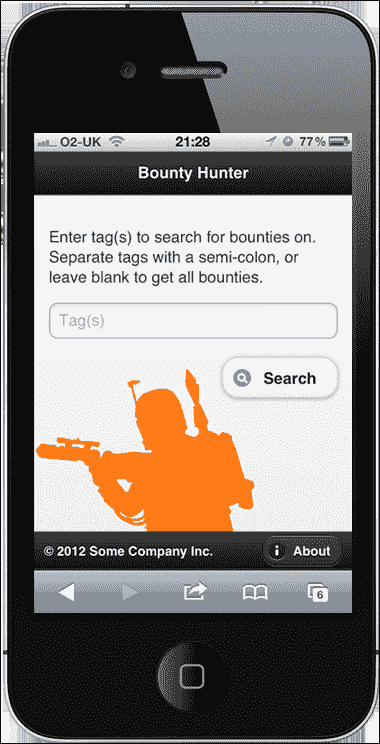
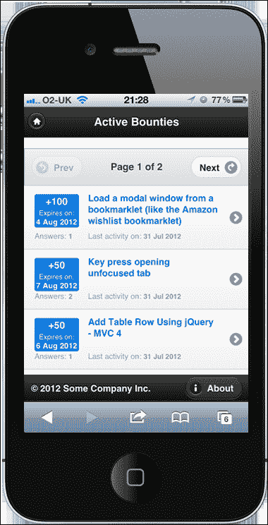
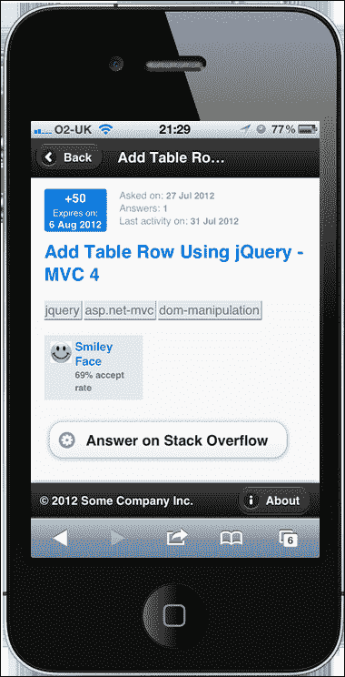

# 四、jQueryMobile 单页 App

jQuery mobile 是一个激动人心的项目，它将 jQuery 的力量带到了手持和移动体验的世界。与 jQueryUI 一样，它使用一系列 UI 小部件和帮助程序构建并扩展 jQuery 核心。在这种情况下，这些功能针对移动显示和触摸界面进行了优化。

我们还将使用 JsRender，这是 jQuery 的官方模板解决方案，也是 jQuery 模板插件`tmpl`的后续版本。

# 任务简报

在这个项目中，我们将构建一个简单的应用，用于查找有关堆栈溢出的问题，这些问题上有未授予的奖金。我们称之为赏金猎人。它将只包含几个单独的页面，但会让人感觉像一个本地应用，而不是一个标准的网站。

尽管使用 jQuery Mobile 构建的网站和应用在笔记本电脑或台式机上运行良好，但 jQuery Mobile 遵循移动第一的理念，即首先构建最小的布局。

这是我们将在整个项目中重点关注的布局。如果您没有智能手机或其他功能强大的移动设备，我们将构建的示例应用仍将在普通桌面浏览器中工作。

我们将在此项目中构建的应用将如以下屏幕截图所示：



## 为什么太棒了？

jQuery Mobile 为所有主要的现代智能手机和平板电脑提供全面支持，更重要的是，提供一致性。它还为更广泛的通用领域提供了有限的支持，但可能是较旧的、功能肯定较差的移动设备。它建立在 jQuery 本身的坚实基础上，并从 jQuery UI 中借用了许多最佳实践，当然也涉及到如何初始化和配置小部件。

jquerymobile 提供了两种初始化小部件的方法；我们可以使用扩展的 HTML5`data-`属性系统，它将自动触发小部件的初始化，而无需任何额外的配置，或者我们可以动态创建小部件并纯粹通过脚本调用它们。

这两种技术各有优缺点，我们将在本项目的整个过程中研究这两种技术，因此您将能够决定哪种方法最适合您。

## 你的热门目标

以下是本项目将分解为的任务：

*   构建欢迎屏幕
*   添加第二页
*   创建脚本包装器
*   得到一些赏金
*   添加 JsRender 模板
*   构建列表视图
*   构建项目视图
*   处理寻呼

## 任务清单

jQuery Mobile 站点提供了一个页面模板，在使用该框架进行开发时用作起点。我们可以使用该模板作为该项目的基础。要进行设置，我们应该访问[http://jquerymobile.com/demos/1.2.0/docs/about/getting-started.html](http://jquerymobile.com/demos/1.2.0/docs/about/getting-started.html) 。

复制**创建基本页面模板**部分所示的模板，并将其保存为`bounty-hunter.html`在我们的主工作目录中。此模板包含我们开始使用所需的所有内容。

此时，我们还应该链接到 JsRender；在我们刚刚保存的模板中链接到 jQuery Mobile 的`<script>`元素之后直接添加以下代码：

```js
<script src="http://borismoore.github.com/jsrender/jsrender.js">
</script>
```

### 注

在撰写本文时，jQuery Mobile 的当前版本与 jQuery 1.9 不兼容。我们将从 jQueryMobile 站点获得的模板已经链接到 jQuery 的兼容版本，一旦 jQueryMobile 达到 1.3 里程碑，1.9 支持将很快可用。

为了测试我们的移动应用，我们还应该为这个项目使用一个 web 服务器，以便使用正确的`http://`URL 而不是`file:///`URL 查看测试页面。您的计算机上可能已经安装了开放源代码的 web 服务器，如 Apache，如果是这样的话，也可以。

如果您尚未安装和配置 web 服务器，我建议您下载并安装 Microsoft 的**Visual web Developer Express**（**VWDE**）。这是微软工业标准 IDE Visual Studio 的免费版本，包括内置的开发 web 服务器，它还是一个功能强大的 IDE，支持 JavaScript 和 jQuery，并为前端开发人员提供了一系列功能。

对于喜欢开源软件的开发人员来说，Apache web 服务器以及 PHP 和 MySQL 可以安装在 Mac 和 Windows 系统上。为了简化安装和配置，我们创建了一系列软件包，将软件安装在一起并自动进行配置，例如 XAMPP。

### 注

VWDE 可通过访问[进行安装 http://www.microsoft.com/visualstudio/en-us/products/2010-editions/visual-web-developer-express](http://www.microsoft.com/visualstudio/en-us/products/2010-editions/visual-web-developer-express) 。

XAMPP 下载可从[获得 http://www.apachefriends.org/en/xampp.html](http://www.apachefriends.org/en/xampp.html) 。

# 建立欢迎页面

许多应用都有一个欢迎或主屏幕，用户可以返回该屏幕来选择常用操作。在本项目的第一个任务中，我们将构建欢迎屏幕，它将由一些简单的页面组成，例如页眉、页脚、徽标，还将具有一个搜索框和按钮，用于触发对 Stack Exchange API 的调用。

## 准备起飞

此时，我们可以创建我们将在项目中使用的其他资源。我们应该在`css`文件夹中创建一个名为`bounty-hunter.css`的新样式表，在`js`文件夹中创建一个名为`bounty-hunter.js`的新脚本文件。

我们应该在样式表的页面`<head>`中添加`<link>`元素。以下代码应直接添加到 jQuery mobile 样式表之后（jQuery mobile`<script>`元素之前）：

```js
<link rel="stylesheet" href="css/bounty-hunter.css" />
```

我们可以将`<script>`元素添加到关闭`</body>`标记之前的通常位置：

```js
<script src="js/bounty-hunter.js"></script>
```

### 注

由于 jQuery Mobile 提供了自己的基线样式，其中包括重置和排版默认设置，因此在本例中，我们不需要链接到`common.css`文件。

## 启动推进器

我们下载的 jQuery 移动模板包含建议的基本结构，大多数 jQuery 移动页面都应该使用该结构构建。我们将使用推荐的结构，但我们将向现有标记添加一些额外的属性。

我们应该在`bounty-hunter.html`中具有`data-role="page"`属性的`<div>`元素中添加`id`属性；将`id`属性设置为`welcome`：

```js
<div data-role="page" id="welcome">
```

接下来，我们应该更改原始标记，使其显示如下。首先，我们可以添加标题区域：

```js
<div data-role="header">
    <h1>Bounty Hunter</h1>
</div>
```

接下来，我们可以直接在标题区域之后添加主内容区域：

```js
<div data-role="content">
    <p>
        Enter tag(s) to search for bounties on. 
        Separate tags with a semi-colon, or leave blank to get
        all bounties. 
    </p>
    <div class="filter-form">
        <label for="tags" class="ui-hidden-accessible">
            Search by tag(s):
        </label>
        <input id="tags" placeholder="Tag(s)" />
        <button data-inline="true" data-icon="search">
            Search
        </button>
    </div>
</div>

```

最后，我们可以在主内容区域后添加页脚区域：

```js
<div data-role="footer" data-position="fixed" 
    data-id="footer">

    <small>&copy; 2012 Some Company Inc.</small>
    <a href="bounty-hunter-about.html" data-icon="info" 
        data-role="button" data-transition="slide">About</a>

</div>
```

我们还可以为欢迎屏幕添加一些样式。将以下选择器和规则添加到`bounty-hunter.css`：

```js
.filter-form .ui-btn { margin:10px 0 0 0; float:right; }

.ui-footer small { display:block; margin:10px; float:left; }
.ui-footer .ui-btn { margin:2px 10px 0 0; float:right; }
```

## 目标完成-小型任务汇报

首先我们更新了容器`<div>`中具有`data-role="header"`属性的`<h1>`元素内的文本。

然后我们向内容容器添加了一些内容，包括一段介绍性文本和一个容器`<div>`。在容器内部，我们添加了`<label>`、`<input>`和`<button>`元素。

出于可访问性的原因，jQuery Mobile 建议对所有`<input>`元素使用一个具有有效`for`属性的`<label>`元素，因此我们添加了一个，但随后使用`ui-hidden-accessible`类将其隐藏。这将允许辅助技术仍然可以看到它，而不会在视觉上使页面混乱。

`<input>`是只是一个简单的文本字段，它有一个`id`属性，便于从脚本中选择；还有一个`placeholder`属性，它将指定的文本添加到`<input>`中作为占位符文本。现在标签已隐藏，但在较旧的浏览器中可能不受支持，因此可以使用它来提供视觉提示。

`<button>`元素有几个自定义的 jQuery Mobile`data-`属性，当页面最初加载时，框架会自动对其进行增强。jquerymobile 会根据它们是什么元素以及它们拥有的任何`data-`属性自动增强一系列不同的元素。增强功能通常包括将原始元素包装在容器中或添加其他附加元素以放置在容器旁边。

`data-inline="true"`属性将环绕`<button>`的容器设置为`inline-block`，这样它就不会跨越视口的整个宽度。`data-icon="search"`属性给它一个搜索图标。

我们在原始模板中的 container`<div>`元素中添加了一些额外的`data-`属性和`data-role="footer"`属性。`data-position="fixed"`属性与`data-id="footer"`属性一起工作，将元素固定到视口的底部，并确保在更改页面时不会转换该元素。

在页脚容器中，我们添加了一个`<small>`元素，其中包含一些伪造的版权信息，例如通常在网页页脚中可以找到的信息。我们还添加了一个新的`<a>`元素，该元素链接到另一个页面，我们将在下一个任务中添加它。

这个元素也被赋予了几个自定义`data-`属性。`data-icon="info"`属性为增强元素提供一个图标。`data-role="button"`属性触发框架的增强，并使这个简单链接具有按钮般的外观。导航到新页面时，`data-transition="slide"`属性使用幻灯片转换。

最后，我们为这个项目的样式表添加了一些基本的样式。我们将搜索按钮向右浮动，并更改了 jQuery Mobile 提供给它的边距。样式是使用我们添加到容器中的类和框架添加的类添加的。我们需要使用这两个类来确保我们的选择器比框架使用的选择器更具体。

我们还设计了页脚元素的样式，使其左右浮动，并根据需要对其进行定位。同样，我们必须克服默认 jQueryMobile 主题使用的选择器的特殊性。

在这一点上，我们应该能够在浏览器中运行该页面，并看到主页的顶部和底部分别有页眉和页脚，超级简单的搜索表单，以及为应用提供基本标识的大橙色图像。

## 机密情报

jQueryMobile 构建在一个定制的`data-`属性系统之上，在这个系统中，我们可以为元素赋予某些属性，并让框架基于这些属性初始化小部件。此自定义`data-`属性框架不是强制性的；如果需要，我们可以手动初始化和配置小部件。

但是使用这些属性很方便，并且允许我们专注于定制脚本代码来添加我们想要的行为，而不必担心我们想要使用的 jQueryMobile 小部件的设置和初始化。

# 增加第二页

在本任务中，我们将添加**关于**超链接添加到欢迎页面页脚容器中的页面。这使我们能够体验 jQueryMobile 设备的转换，这些转换完全是通过`data-`属性系统配置的。

### 注

有关更多信息，请参见[中的 jQuery Mobile`data-`属性参考 http://jquerymobile.com/demos/1.2.0/docs/api/data-attributes.html](http://jquerymobile.com/demos/1.2.0/docs/api/data-attributes.html) 。

## 准备起飞

保存我们在上一个任务中使用的 jQueryMobile 页面模板的新副本，但这次调用它`bounty-hunter-about.html`，并将其保存在主项目目录中（与`bounty-hunter.html`页面一起）。

我们还需要像以前一样链接到我们的`bounty-hunter.css`文件、`bounty-hunter.js`文件和 JsRender。

### 注

有关 JsRender 的更多信息，请参阅[中的文档 https://github.com/BorisMoore/jsrender](https://github.com/BorisMoore/jsrender) 。

## 启动推进器

在我们新的`bounty-hunter-about.html`页面中，将`<div>`中带有`data-role="page"`的标记更改为以下内容：

```js
<div data-role="header">
    <a href="bounty-hunter.html" data-icon="home" 
    data-shadow="false" data-iconpos="notext" 
    data-transition="slide" data-direction="reverse" 
    title="Home"></a>

    <h1>About Bounty Hunter</h1>
</div>

<div data-role="content">
    <p>
        Bounty Hunter is an educational app built for the  
        jQuery Hotshots book by Dan Wellman
    </p>
    <a href="http://www.danwellman.co.uk">
        danwellman.co.uk
    </a>
</div>

<div data-role="footer" data-position="fixed" 
    data-id="footer">

    <small>&copy; 2013 Some Company Inc.</small>
    <a class="ui-disabled" href="#" data-icon="info" 
        data-role="button">About</a>

</div>
```

## 目标完成-小型任务汇报

这一次，随着在标题容器内的`<h1>`中设置了一些不同的文本，我们还添加了一个新的链接。这将链接回应用的欢迎屏幕，并使用多个自定义`data-`属性。

与前面一样，`data-icon`设置按钮应使用的图标。我们可以使用`data-shadow="false"`禁用应用于图标外部容器元素的默认阴影，并设置`data-iconpos="notext"`属性，使按钮成为仅图像的按钮。

我们还指定了`data-transition="slide"`属性，这样页面就可以很好地过渡回欢迎页面，但这次我们还设置了`data-direction="reverse"`属性，这样页面就可以*向后*（也就是说，它向相反方向滑动）到主页。因为我们把这个链接放在`<h1>`元素之前，它会被框架自动浮动到左边。

我们在`content`容器中添加了一些基本内容。这并不重要，正如你所看到的，我已经为我的个人网站添加了一个无耻的插件。然而，这个外部链接并非完全无用，因为它确实表明，当链接前缀为`http://`时，jQuery Mobile 知道它是一个外部链接，并且不会劫持点击并尝试将其转换到视图中。

您会注意到页脚容器具有与前面相同的`data-`属性，包括相同的`data-id="footer"`属性。这就是页脚容器持久性的原因。当页面转换为视图时，页脚将出现在转换区域之外，并固定在页面底部。

我们稍微修改了页脚容器中的`<a>`元素。我们删除了`data-transition`属性，并添加了`ui-disabled`类。我们还将`href`更改为一个简单的散列。由于我们已经在 About 页面上，**About**链接将不起任何作用，因此我们将其禁用，以避免在单击页面时重新加载页面。

## 机密情报

jQueryMobile 通过劫持任何相关链接来添加其漂亮的页到页转换。当点击一个相对链接时，jQuery mobile 将通过 AJAX 获取该页面，将其插入当前页面的 DOM 中，并将其转换为视图。

通常，在使用 jQueryMobile 站点时，您永远不会离开启动的页面，因为框架将静默地劫持相同的域链接，并动态地将内容插入页面。因此，您可能认为每个页面不需要链接到所有 CSS 和脚本资源。

然而，情况并非如此——如果有人直接登录其中一个内部页面怎么办？或者，如果跟随外部链接，但访问者使用浏览器的“后退”按钮返回，该怎么办？在这两种情况下，他们都会看到一个未增强的、功能失调的页面，它的外观和感觉与他们期望看到的页面完全不同。

现在我们应该能够重新加载主页，然后单击页脚中的**关于**按钮，并查看关于页面。

# 创建脚本包装器

加载页面后，我们不会使用使用 jQuery 的`$(document).ready() { }`函数（或`$(function() { })`快捷方式）来执行代码。但是，我们仍然需要从全局范围保护顶级变量和函数，因此我们仍然需要某种包装器。在本任务中，我们将创建该包装器以及顶级变量。

## 启动推进器

在空的`bounty-hunter.js`文件中，我们可以从添加以下代码开始：

```js
(function() {

    var tags = "",
          getBounties = function(page, callback) {

        $.ajax({
            url: "https://api.stackexchange.com/2.0/questions/featured",
            dataType: "jsonp",
            data: {
                page: page,
                pagesize: 10,
                tagged: tags,
                order: "desc",
                sort: "activity",
                site: "stackoverflow",
                filter: "!)4k2jB7EKv1OvDDyMLKT2zyrACssKmSCX
                eX5DeyrzmOdRu8sC5L8d7X3ZpseW5o_nLvVAFfUSf"
            },
            beforeSend: function () {
                $.mobile.loadingMessageTextVisible = true;
                $.mobile.showPageLoadingMsg("a", "Searching");
            }
        }).done(function (data) {

            callback(data);

        });
    };

}());
```

## 目标完成-小型任务汇报

我们的脚本包装器由一个自动执行的匿名函数（如果您愿意，也可以是一个立即调用的函数表达式）组成。这个外部函数用括号括起来，在末尾有一对额外的括号，这会导致匿名函数立即执行并返回。这是一种已建立的 JavaScript 模式，通常用于大规模应用中。

这将创建一个闭包，它将封装其中的所有代码，并将其与全局名称空间隔离开来，从而使代码更加健壮，并且在与其他库或插件结合使用时，不太可能出现中断或失败。

### 注

如果您不确定闭包是什么或它能做什么，那么在 Stack Overflow 网站（[上）会有一个关于它的精彩讨论 http://stackoverflow.com/questions/111102/how-do-javascript-closures-work](http://stackoverflow.com/questions/111102/how-do-javascript-closures-work) ）。

它还允许我们几乎在加载文档后立即运行代码。由于它所在的`<script>`元素正好位于`<body>`的底部，因此在浏览器解析页面的其余部分之前，不会执行该元素。

在匿名外部函数中，我们首先定义一些变量。第一个称为`tags`，将在本项目的整个过程中用于各种功能，因此需要在任何地方都可以访问。最初可以将其设置为空字符串。

下一个变量是一个名为`getBounties()`的函数，我们再次在顶级范围中定义它，以便可以从代码中的其他地方调用它而不会出现问题。我们将使用该函数在应用生命周期的不同点发出 AJAX 请求，请求的大多数参数将不需要更改。

我们使用 jQuery 的`ajax()`方法向堆栈交换 API 发出 AJAX 请求。这个方法是 jQuery 发出 AJAX 请求的实际方法，也是库的助手方法（如`getJSON()`所委托的方法。

`ajax()`方法接受一个对象文本，该文本可用于配置 jQuery 支持的任何标准 AJAX 选项，以控制请求的执行方式。

`url`属性设置向其发出请求的 URL，我们将其设置为要使用的堆栈交换 API 的入口点。我们将`dataType`设置为`JSONP`，这样我们就可以从堆栈交换域获取数据，而不会触发浏览器的跨域安全限制。

**JSON**（**JavaScript 对象表示法**是一种数据格式，与 JavaScript 中的对象文字语法极其相似，用于跨不同平台或系统交换数据。**JSONP**（**带填充的 JSON**）是一种向页面动态注入新脚本的技术，它将 JSON 数据公开给浏览器中的 JavaScript 解析器。这是必要的，因为浏览器的同源安全策略限制了可以从中加载数据的域到当前域。

可以配置堆栈交换 API，并使用标准查询字符串参数以非常特定的方式过滤我们接收的数据，以启用或禁用特定功能。我们可以使用 jQuery 的`data`AJAX 属性添加我们希望设置的查询字符串参数。

### 注

有关堆栈交换 API 的更多信息，请参阅位于[的文档 https://api.stackexchange.com/](https://api.stackexchange.com/) 。

我们使用`page`参数来指定我们想要得到的结果的哪一页，该结果将被函数作为参数接收。我们将返回到`10`的问题数量设置为一次显示的数据量。这是使用`pagesize`参数设置的。

`tagged`参数使用 tags 变量的值，我们可以在项目后期需要时对其进行操作。如果我们发送此参数时没有值，则 Stack Exchange API 不会抱怨，因此无论是否存在任何标记，我们都可以安全地设置它。

我们指定我们希望结果按降序排列，并按活动排序，因此最新活动的问题将首先列出。`site`设置为`stackoverflow`，因此不会从站点的整个堆栈交换网络收到问题。

最后一个配置属性是我已经创建并保存在 Stack Exchange 上的预定义筛选器。在浏览任何 API 方法时，都会包含一个用于执行此操作的工具。过滤器的目的是精确控制响应中返回的字段，以确保接收的数据不会超过需要的数量。

### 注

在本例中，我们只是匿名使用堆栈交换 API。对于准备用于公共用途的完整生产应用，我们必须始终使用堆栈应用注册该应用，并在发出任何请求时使用 API 密钥。

我们想要的一些字段没有包含在默认筛选器中（如果在发出请求时没有提供筛选器，则使用默认筛选器），并且返回了许多我们不需要的字段。我们将在这里使用的过滤器只提供这个项目所需的字段，不需要身份验证即可使用。

这些是我们需要为此请求设置的大多数 AJAX 选项；在调用函数时，可以将此时未知的函数传递给该函数。我们将在下一个任务中看到如何做到这一点。

我们可以利用 jQuery 的`beforeSend`AJAX 事件在发出请求之前直接显示 jQuery Mobile AJAX 微调器。jquerymobile 在每次页面转换时都使用微调器，但在发出 AJAX 请求时，我们可以根据自己的需求对其进行颠覆。

框架将自动向当前页面上运行的 jQuery 实例附加一个`mobile`对象。此对象包含用于配置 jQueryMobile 环境的各种属性，以及触发框架不同行为的各种方法。我们现在可以使用其中的一些。

为了确保显示我们希望添加的消息，因为默认情况下微调器使用可访问的隐藏文本，我们将`mobile`对象的`loadingMessageTextVisible`属性设置为`true`。

### 注

在页面加载时，jQuery Mobile 创建了一个名为`mobile`的对象，其中包含一系列有用的属性和方法。

为了实际显示微调器，我们可以使用 jQuery Mobile`showPageLoadingMsg()`方法。此方法将使用主题样例作为第一个参数，在本例中，我们可以将其设置为默认主题`a`，并将要显示在微调器内的文本作为第二个参数。

在方法`ajax()`之后，我们链接`done()`方法。这是从 jQuery1.8 开始处理成功 AJAX 请求的新方法，取代了 jQuery 的`success()`方法。我们将一个匿名函数传递给该方法，当请求对象返回时执行该函数，该函数将响应作为参数接收。在这个函数中，我们只需调用将作为第二个参数传递到`getBounties()`的`callback()`函数，将响应中的数据传递给它。

## 机密情报

在本任务中，我们使用`done()`方法来处理来自堆栈交换 API 的成功响应，而不是更熟悉的`success()`方法。现在，这是处理成功响应的首选方法（从 jQuery 1.8 开始）。jQuery 的任何 AJAX 方法返回的`jqXHR`对象的`error()`和`complete()`回调方法已被弃用，取而代之的是`fail()`和`always()`。

截至 jQuery 1.5，AJAX 方法套件已将`jqXHR`对象作为承诺或延迟对象返回，因此对 API 的这一更改使 AJAX 方法与 jQuery 中承诺 API 的其他实现保持一致。

# 获得一些赏金

在这个任务中，我们需要从堆栈溢出中获得一些奖励。一旦初始化了应用的欢迎页面，我们就需要初始化脚本的一部分。一旦发生这种情况，我们可以在页面上为`<button>`附加一个处理程序，以使用我们在最后一部分中添加的`getBounties()`函数触发 AJAX 请求。

## 启动推进器

在外部函数内部，但在`bounty-hunter.js`中的`getBounties()`函数之后，添加以下代码：

```js
$(document).on("pageinit", "#welcome", function () {

    $("#search").on("click", function () {

        $(this).closest(".ui-btn")
                  .addClass("ui-disabled");

        tags = $("tags").val();

        getBounties(1, function(data) {

            data.currentPage = 1;

            localStorage.setItem("res", JSON.stringify(data)); 

            $.mobile.changePage("bounty-hunter-list.html", {
                transition: "slide"
            });
        });
    });
});
```

我们还可以在刚刚添加的代码之后直接为`pageshow` 事件添加处理程序：

```js
$(document).on("pageshow", "#welcome", function () {
    $("#search").closest(".ui-btn")
                        .removeClass("ui-disabled");
});
```

## 目标完成-小型任务汇报

当页面第一次初始化时，我们使用`pageinit`事件执行代码。由于新页面如何被拉入现有页面的 DOM 并显示的 AJAX 特性，在使用 jQuery Mobile 时，此事件比`document ready`更可靠。

我们使用 jQuery 的`on()`方法将该事件的事件处理程序绑定到 document 对象，并将该方法的第一个参数设置为`pageinit`事件。因为我们的脚本将在每个页面上使用，但是我们在这里添加的代码只与欢迎页面相关，所以我们使用该方法的第二个参数来确保事件处理程序（我们添加为第三个参数）仅在事件源自欢迎页面时执行。

然后，我们将`click`事件的处理程序绑定到搜索`<button>`，再次使用 jQuery 的`on()`方法。在处理程序中，我们首先将`ui-disabled`类添加到外部`<button>`容器中，以停止启动进一步的请求。然后，我们使用 jQuery 的`val()`方法获取可能已经输入到文本字段中的任何标记。这将返回文本输入的值，然后将其存储在顶级`tags`变量中。

接下来我们可以调用上一个任务中添加的`getBounties()`函数。由于请求是由欢迎页面发起的，我们需要获得结果的第一页，因此我们将`1`作为第一个参数传递给函数。

我们将匿名函数作为第二个参数传递给`getBounties()`。记住，我们为`done()`方法添加的处理程序将执行函数并自动将响应中的数据传递给它。

在这个函数中，我们首先需要向`data`对象添加一个新属性来存储当前页码。然后我们可以存储`data`对象，以便在下一页中使用它。我们可以使用`localStorage`来实现这一点，但由于`localStorage`中只能存储数组和基元类型，因此我们需要使用浏览器的本机`JSON.stringify()`方法将对象转换为 JSON 字符串。

然后，我们使用 jQuery Mobile`changePage()`方法将当前页面更改为显示响应的页面。将要更改的页面的 URL 作为第一个参数传递给此方法，并将配置对象作为第二个参数传递给此方法。

我们使用此配置对象设置在显示带有`transition`选项的新页面时要使用的转换，在本例中，我们将其设置为`slide`。

在`pageinit`处理程序之后，我们还为`pageshow`事件添加了一个事件处理程序。每次显示页面时都会发送此事件，与仅在第一次初始化给定页面时才发送的`pageinit`事件不同。

我们再次将事件绑定到`document`对象，并再次通过`#welcome`选择器过滤事件，以确保代码仅在显示欢迎页面时运行。在事件处理程序中，我们只需从外部`<button>`容器中删除`ui-disabled`类。如果我们返回到欢迎页面，可能是因为我们想要执行新的搜索，可能是使用不同的标记。

# 添加 JsRender 模板

在上一个任务结束时，我们使用`changePage()`方法调用了一个新页面，所以现在我们需要创建该页面。我们可以将 JsRender 模板添加到新页面，以便在下一个任务中构建列表视图时使用。

## 准备起飞

再次使用 jQuery Mobile 的起始模板创建新的页面。调用它`bounty-hunter-list.html`并将其保存在项目文件夹的根目录中。将`data-role="page"`包装的`id`属性更改为`list`。

标题`<div>`中的`<h1>`可以更改为类似`Active Bounties`的内容，我们可以像在“关于”页面上一样再次添加主页图标。页脚可以与欢迎页面上的相同。内容`<div>`一开始可以为空。

## 启动推进器

在我们刚刚创建的新页面底部附近的页面容器中，添加以下 JsRender 模板：

```js
<script id="listTemplate" type="text/x-jquery-tmpl">
    <ul data-role="listview">

        {{for items}}
            <li data-shadow="false" data-icon="arrow-r" 
            data-iconpos="right">

                <a href="#" id="item-{{:#index}}">
                    <div class="bounty">
                        <span>+{{:bounty_amount}}</span>
                        <span class="expires">Expires on: 
                            <span class="value">
                                {{:bounty_closes_date}}
                            </span>
                        </span>
                    </div>
                    <h1 class="title">{{:title}}</h1>
                    <div class="meta">
                        <span>Answers: 
                            <span class="value">
                                {{:answer_count}}
                            </span>
                        </span>
                        <span class="activity">
                            Last activity on: 
                            <span class="value">
                                {{:last_activity_date}}
                            </span>
                        </span> 
                    </div>
                </a>
            </li>
        {{/for}}
    </ul>
</script>
```

## 目标完成-小型任务汇报

模板所在的`<script>`元素被赋予非标准`type`属性，以停止浏览器解析脚本。它还提供了一个`id`属性，这样当我们想用数据插入模板并将其呈现到页面时，就可以很容易地从页面中选择它。

在`<script>`元素内部，我们首先创建`<ul>`元素，该元素将由 jQuery Mobile 转换为 Listview 小部件。我们给这个元素一个`data-role`属性`listview`。然后，我们使用 JsRender 的循环构造`{{for}}`，它接受要循环的对象或数组。在本例中，我们感兴趣的是`items`数组，它是`data`对象的一部分，在上一个任务结束时保存在 localStorage 中，并将传递给呈现模板的模板函数。

我们在`{{for}}`循环中添加的代码将对`items`数组中的每个项目重复，该数组将由堆栈溢出的一系列问题组成。稍后我们调用 JsRender 的`template()`方法时，模板将迭代的对象将被传递到循环中。

我们添加的第一个元素是`<li>`，因为它自然应该是外部`<ul>`列表的子元素。我们为`<li>`元素提供了几个`data-`属性，包括`data-shadow="false"`用于禁用每个`<li>`下的阴影，`data-icon="arrow-r"`用于为每个列表项提供一个右箭头图标，`data-iconpos="right"`用于将图标定位在元素右侧。

### 提示

**列表项图标**

为了显示我们添加到列表项目中的图标，每个项目都应该包含一个链接。当小部件初始化时，如果在项目中未找到`<a>`元素，则不会添加任何图标。

在列表项中，我们添加了一个`<a>`元素和一个唯一的`id`，以便稍后显示项目视图。我们可以使用模板的循环索引创建一个唯一的`id`，该索引在循环中作为`#index`提供给我们。

在`<a>`元素中，我们还有几个其他元素。第一个是关于当前问题的悬赏容器。在这个容器中，我们有另一个 JsRender 令牌，它将被我们正在迭代的对象中的数据替换。要访问模板中对象的属性，我们使用`{{:`后跟属性名称，并以`}}`结尾。开头的双大括号内的冒号表示不应执行 HTML 编码。堆栈交换 API 将为我们清理数据，以便我们可以按原样使用它。

我们还可以使用一些嵌套的`<span>`元素显示一些文本和赏金到期的日期，其中一个元素有一个`class`用于某些特定样式，另一个属性来自我们的数据对象。

我们可以使用一个`<h1>`元素和另一个 JsRender 模板标记输出问题的标题，该标记从`data`对象内部从当前项中提取`title`属性。

最后，我们可以显示一些关于这个问题的元信息，比如它的答案数量和上次关于这个问题的活动时间。此信息的添加方式与之前相同，使用`<span>`元素和 JsRender 模板标记的组合来显示数据对象的各种属性。

# 构建列表视图

我们的应用现在应该位于处，它接收到一些需要格式化和显示的数据。我们还添加了一个 JsRender 模板，可用于为 Listview 小部件构建 Listitem 元素。

我们现在需要做的就是呈现模板并在小部件中显示结果。我们还可以在小部件中添加一些附加控件，让访问者浏览分页结果，尽管我们现在还不能让这些控件发挥作用。

## 启动推进器

首先，我们可以在列表页面（`bounty-hunter-list.html`中的内容容器中添加一些额外的标记：

```js
<div class="ui-bar ui-bar-c">
    <a href="#" data-role="button" data-icon="back" 
    data-inline="true" data-mini="true" class="ui-disabled">
    Prev
    </a>

    <h2>Page 
        <span class="num"></span> of <span class="of"></span>
    </h2>

    <a href="#" data-role="button" data-icon="forward" 
        data-iconpos="right" data-inline="true" 
        data-mini="true" class="ui-disabled">
        Next
    </a>
</div>

<div id="results"></div>

<div class="ui-bar ui-bar-c footer-bar">
    <a href="#" data-role="button" data-icon="back" 
    data-inline="true" data-mini="true" class="ui-disabled">
    Prev
    </a>

  <h2>Page 
    <span class="num"></span> of <span class="of"></span>
  </h2>

    <a href="#" data-role="button" data-icon="forward" 
    data-iconpos="right" data-inline="true" 
    data-mini="true" class="ui-disabled">
    Next
    </a>
</div>
```

接下来，我们需要更新脚本，以便呈现模板和显示数据。在`bounty-hunter.js`中，直接在`pageshow`事件的事件处理程序后添加以下代码：

```js
$(document).on("pageinit", "#list", function () {

    var data = JSON.parse(localStorage.getItem("res")),
          total = parseInt(data.total, 10),
          size = parseInt(data.page_size, 10),
          totalPages = Math.ceil(total / size),
          months = [
            "Jan", "Feb", "Mar", "Apr", "May", "Jun", "Jul", 
            "Aug", "Sep", "Oct", "Nov", "Dec"
    ];

    var createDate = function (date) {
        var cDate = new Date(date * 1000),
              fDate = [
                cDate.getDate(), months[cDate.getMonth()], 
                cDate.getFullYear()
        ].join(" ");

        return fDate;
    }

    $.views.helpers({ CreateDate: createDate });

    $("#results").append($("#listTemplate")
                 .render(data))
                 .find("ul")
                 .listview();

    var setClasses = function () {
        if (data.currentPage > 1) {
            $("a[data-icon='back']").removeClass("ui-disabled");
        } else {
            $("a[data-icon='back']").addClass("ui-disabled");
        }

        if (data.currentPage < totalPages) {
            $("a[data-icon='forward']").removeClass("ui-disabled");
        } else {
            $("a[data-icon='forward']").addClass("ui-disabled");
        }
    };

    $("span.num").text(data.currentPage);
    $("span.of").text(totalPages);

    if (totalPages > 1) {
        $("a[data-icon='forward']").removeClass("ui-disabled");
    }
});
```

我们也需要稍微更改我们的模板。我们的模板中有两个地方显示日期属性；这两者都需要更改，以便它们显示如下：

```js
{{:~CreateDate(bounty_closes_date)}}
```

以及：

```js
{{:~CreateDate(last_activity_date)}}
```

最后，我们需要为新元素添加一些额外的样式，以及将添加到 Listview 小部件的项目。将以下样式添加到`bounty-hunter.css`的底部：

```js
.ui-bar { margin:0 -15px 14px -15px; text-align:center; }
.ui-bar a:first-child { margin-left:-5px; float:left; }
.ui-bar a:last-child { margin-right:-5px; float:right; }
.ui-bar h2 { margin-top:10px; font-size:14px; }
.footer-bar { margin-top:14px; }

.bounty { 
    width:24%; border-radius:3px; margin-right:5%; float:left;
    text-align:center; font-size:90%; line-height:1.5em; 
    font-weight:bold; color:#fff; background-color:#07d; 
    text-shadow:none; 
}
.bounty span { display:block; }
.expires { 
    font-size:70%; font-weight:normal; line-height:1em; 
}
.expires .value { 
    display:block; font-size:110%; font-weight:bold; 
    line-height:1.5em; 
}
.title { 
    width:70%; margin-top:-.25em; float:left; 
    white-space:normal; font-size:80%; line-height:1.25em; 
    color:#07d; 
}
.meta { clear:both; }
.meta span { 
    width:24%; margin-right:5%; float:left; font-size:70%; 
    font-weight:normal; color:#999; 
}
.meta .value { 
    width:70%; margin-right:0; float:none; font-size:90%; 
    font-weight:bold; 
}
```

## 目标完成-小型任务汇报

在本任务的第一步中，我们向页面上的内容容器添加了一些新的 HTML 元素。

我们添加的第一个元素将用作位于 Listview 小部件上方的工具栏。此工具栏中有供访问者在不同结果页面之间导航的链接。工具栏将从 jquerymobile 中获取很多样式，因为我们给了它`ui-bar`和`ui-theme`类名。

jQuery Mobile 将链接增强为按钮小部件，因为它们具有`data-role="button"` 属性。我们还使用`data-icon`属性为它们添加图标，使用`data-inline`属性使它们成为`inline-block`，并使用`data-mini`属性使它们比标准按钮更小。

最后，我们首先为按钮提供`ui-disabled`类名。我们可以根据所处的页面以及是否有上一页或下一页可导航来启用每个按钮。

除了按钮外，工具栏还包含一个`<h2>`元素，告诉访问者他们在哪一页，以及总共有多少页。元素的内容被分割成具有`id`属性的跨区，以便我们以后可以轻松地更新它们。

我们还将一个空容器`<div>`添加到包含`id`结果的页面中。这个容器将是我们呈现 Listview 小部件的元素。

我们直接在空 Listview 容器之后添加的第二个工具栏在各个方面都与第一个工具栏相同，只是它有一个额外的类`footer-bar`。我们使用它来添加一点 CSS，这只是底部工具栏所需要的。

在我们的脚本中，我们首先为列表页面的`pageinit`事件添加了一个新的事件处理程序。这与使用 jQuery 的`on()`方法之前的绑定方式相同。

在事件处理程序中，我们首先设置一系列变量。我们存储了一个对在先前任务中存储在 localStorage 中的数据的引用，并存储了结果的`total`数量和`data`对象的`page_size`属性，以便在代码中的各个位置使用。

我们还根据刚刚保存的`total`和`size`变量计算总页数，并创建一个包含缩短月份名称的数组，我们将在格式化 Stack Exchange 返回的日期时使用该数组。

下一步我们需要添加一个新的方法，我们可以将其用作模板中的辅助函数。我们调用方法`createDate`并指定该方法可以接受一个参数，即日期字符串。

在该方法中，我们首先使用传递给该方法的日期字符串创建一个新日期。这将是 UNIX-epoch 格式，因此我们需要将其乘以 1000，才能与 JavaScript 的`Date()`构造函数一起使用。

`Date()`构造函数返回的日期字符串将是完整的 UTC 日期字符串，在我们的小赏金框中显示太长，因此接下来我们定义一个新数组，其中数组中的每个项目都是我们要将现有字符串格式化为的日期字符串的一部分。

我们可以通过`getDay()`功能获取当月的日期。`getMonth()`函数将返回一个从零开始的数字，因此我们可以使用它从我们先前创建的数组中提取正确的缩短月份名称。最后，我们使用`getFullYear()`函数得到四位数的年份。一旦数组被填充，我们将使用空格字符作为连接字符直接连接它，并从方法返回结果字符串。

接下来，我们需要将新方法注册为 helper 函数，以便我们使用的模板可以访问它。这是使用`views`对象的`helpers()`方法完成的，该方法由 JsRender 创建并附加到 jQuery。此方法将对象作为其参数，其中对象中的每个键都是助手方法的名称，每个值都是我们希望用作助手的实际函数。在本例中，我们将`CreateDate`helper 方法映射到刚才定义的`createDate`函数。

然后，我们使用它的`id`选择 Listview 小部件，并将呈现的模板附加到它。模板是使用 JsRender 的`render()`方法呈现的，该方法接受包含要呈现的数据的对象作为参数。

接下来，我们定义另一个简单函数，该函数将根据我们存储在`data`对象上的`currentPage`属性添加或删除按钮的`ui-disabled`类名。

我们现在可以更新标题以显示当前页面和总页数。我们可以使用 jQuery 的`text()`方法并显示前面存储的`data.currentPage`和`totalPages`变量来实现这一点。

由于这只是第一次加载列表页面，我们知道只需要启用**下一个**按钮。我们使用一个属性选择器，根据`data-icon`属性仅选择两个前进按钮。我们将在下一个也是最后一个任务中添加使此按钮工作的功能。

我们在脚本中做的最后一件事是启用前进按钮，以便可以查看下一页，但前提是要显示更多的页面，我们可以通过再次检查`totalPages`变量来确定。

在添加脚本之后，我们更新了我们的模板，以使用我们创建的新的日期格式助手方法。要在模板中使用 helper 方法，我们只需要使用`~`字符，后跟方法的注册名称。需要传递的任何参数，例如模板迭代的数组中每个项的`bounty_closes_date`和`last_activity_date`属性，都使用括号传递，调用普通 JavaScript 函数时会使用括号。

呈现模板后，我们需要初始化 Listview。我们首先将新的`<ul>`元素放入容器中，然后使用其小部件方法中的`listview()`将其增强为 Listview 小部件。

最后，我们添加了一些额外的 CSS 样式来调整 jQueryMobile 中默认主题应用的样式。我们需要使工具栏全宽以匹配 Listview 小部件，我们可以用与 Listview 小部件本身相同的方法来实现这一点——只需使用负边距。

Listview 的`top`和`bottom`属性以及`left`和`right`属性都有负边距，因此我们需要通过在顶部工具栏的`bottom`上添加一些正边距，在底部工具栏上添加一些正`top`边距来抵消这一点。

我们还可以将后退和前进按钮分别向左和向右浮动，并将标题文本居中。我们还将标题文本的大小缩小了几个像素，以确保它不会干扰我们的按钮。

Listview 中元素的样式几乎完全是为了我们使用模板添加的元素的视觉外观。Listview 本身将继承框架中的许多样式，因此我们需要担心的只是每个 Listitem 中的元素。

单击“奖金”按钮并返回结果后，列表视图页面应显示如下屏幕截图：



## 机密情报

与 jQuery UI 一样，jQuery Mobile 小部件可以完全从脚本初始化，而无需在底层标记中使用任何硬编码的`data-`属性。我们可以很容易地从脚本构建整个 Listview 小部件，而不是将外部`<ul>`元素保留在标记中。

要初始化一个小部件，我们可以调用它的小部件方法。如果我们正在创建一个 Listview，小部件方法就是`listview()`。其他小部件可以用同样的方式初始化。与 jQueryUI 小部件一样，jQueryMobile 小部件可以接受配置选项和事件处理程序，并具有可以从脚本调用的方法。

# 构建项目视图

Listview 为每个包含问题的列表项提供链接。在本任务中，我们可以添加选择其中一个问题时显示的页面。这将是单个问题的更详细视图，因此我们可以利用堆栈交换返回给我们的一些其他属性。这次，我们将动态创建一个新页面并将其注入应用，而不是链接到现有页面。

## 启动推进器

我们将使用另一个模板呈现项目视图，因为它非常方便；将以下代码直接添加到列表模板后的`bounty-hunter-list.html`中。我们可以从添加外部`<script>`包装器、外部页面容器和标题开始：

```js
<script id="itemTemplate" type="text/x-jquery-tmpl">
    <div data-role="page" id="{{:pageid}}" class="item-view">
        <div data-role="header" data-position="fixed">
            <a href="bounty-hunter-list.html" 
            data-shadow="false" data-icon="arrow-l" 
            data-transition="slide" 
            data-direction="reverse" 
            title="Back to list view">
            Back
            </a>

            <h1>{{:title}}</h1>

        </div>
    </div>
</script>
```

接下来，我们可以添加内容区域包装器和内容头。这应该直接进入页面容器，位于页眉区域之后：

```js
<div data-role="content">
    <header class="ui-helper-clearfix">
        <div class="bounty">
            <span>+{{:bounty_amount}}</span>
      <span class="expires">
        Expires on: 
        <span class="value">
          {{:~CreateDate(bounty_closes_date)}}
        </span>
      </span>
    </div>

    <div class="meta">
        <span>Asked on: 
            <span class="value">
                {{:~CreateDate(creation_date)}}
            </span>
         </span>
        <span>Answers: 
            <span class="value">
                {{:answer_count}}
            </span>
        </span>
        <span class="activity">Last activity on: 
            <span class="value">
                {{:~CreateDate(last_activity_date)}}
            </span>
        </span> 
    </div>

    <h1 class="title">{{:title}}</h1>
    <ul class="tags">
        {{for tags}}
            <li>{{:#data}}</li>
            {{/for}}
    </ul>

    <div class="owner">
        <a href="{{:owner.link}}" 
            title="{{:owner.display_name}}">
                
            <div>
                <h3>{{:owner.display_name}}</h3>
                <span>
                    {{:owner.accept_rate}}% accept rate
                </span>
            </div>
        </a>
    </div>
    <a data-role="button" data-icon="gear" 
    data-inline="true" href="{{:link}}" 
    title="Answer on Stack Overflow">
    Answer on Stack Overflow
    </a>

  </header>

</div>
```

接下来我们可以添加问题和答案列表。这应该直接出现在标题元素之后（但仍然在内容`<div>`中），我们刚刚添加了：

```js
<div class="question">{{:body}}</div>

<h2>Answers</h2>
<ul class="answer">
    {{for answers}}
        <li data-shadow="false">
            <h3>Answered by: 
                <span class="answer-name">
                    {{:owner.display_name}}
                </span>, on 
                <span class="answer-date">
                    {{:~CreateDate(creation_date)}}
                </span>
            </h3>

            <div>{{:body}}</div>
        </li>
      {{/for}}
</ul>
```

最后，我们可以为页面添加页脚。这应直接位于内容区域之后，但仍位于外部页面容器内：

```js
<div data-role="footer" data-position="fixed" 
    data-id="footer">

    <small>&copy; 2012 Some Company Inc.</small>
    <a href="bounty-hunter-about.html" 
    data-icon="info" data-role="button" 
    data-transition="slide">
    About
    </a>
</div>
```

我们还需要添加一些脚本来呈现模板和处理页面更改行为。我们可以在上一个任务中添加的列表页面的`pageinit`处理程序中执行此操作：

```js
$("#results").on("click", "li", function () {

    var index = $(this).find("a").attr("id").split("-")[1],
          question = data.items[index];

    question.pageid = "item-view-" + index;

    $("body").append($("#itemTemplate").render(question));

    var page = $("#item-view-" + index);

    page.attr("data-external-page", true).on
    ("pageinit", $.mobile._bindPageRemove);

    $.mobile.changePage(page, {
        transition: "slide"
    });
});
```

最后，我们需要一些 CSS 用于我们添加的模板中的新元素。在`bounty-hunter.css`中，在文件末尾添加以下代码：

```js
header { 
    padding:15px; border-bottom:1px solid #fff; 
    margin:-15px -15px 0 -15px; 
    box-shadow:0 1px 10px rgba(0,0,0,.3); 
}
header:after { 
    content:""; display:block; clear:both; visibility:hidden;
}
header .bounty { margin-bottom:.75em; }
header .meta { width:70%; float:left; clear:none; }
header .meta span { width:100%; }
header .title { 
    width:auto; margin:0; float:none; clear:both; 
    font-size:125%; 
}
.tags { padding:0; }
.tags li { 
    padding:.5%; border-right:1px solid #7f9fb6; 
    border-bottom:1px solid #3e6d8e; margin-right:1%; 
    margin-bottom:1%; float:left; list-style-type:none; 
    font-size:90%; color:#4a6b82; background-color:#e0eaf1;
}
header a { 
    margin-left:0; float:left; clear:both;
    text-decoration:none; 
}
.owner { 
    padding:2.5%; margin:15px 0; float:left; clear:both; 
    font-size:70%; background-color:#e0eaf1; 
}
.owner img { width:25%; margin-right:5%; float:left; }
.owner div { width:70%; float:left; }
.owner h3 { margin:-.25em 0 0; }
.owner span { font-size:90%; color:#508850; }

.question { 
    padding:15px; border-bottom:1px solid #000; 
    margin:-15px -15px 0 -15px;
}
.question img { max-width:100%; }

.answer { padding:0; list-style-type:none; }
.answer li { border-bottom:1px solid #000; font-size:80%; }
.answer h1, .answer h2, .answer h4 { font-size:100%; }
.item-view pre { 
    max-width:95%; padding:2.5%; border:1px solid #aaa; 
    background-color:#fff; white-space:pre-wrap;
}
```

## 目标完成-小型任务汇报

我们首先为页面添加一个新模板，以显示单个问题。由于几个原因，这个模板比我们添加的第一个模板大得多。主要是因为我们使用这个模板来构建整个页面，还因为我们用这个模板展示了更多的东西。这是一个问题的详细视图，因此我们自然希望显示比列表视图中显示的摘要更多的内容。

我们指定的外部页面容器被赋予了一个`id`，我们将在脚本中添加它，这样我们就可以轻松地选择正确的页面来显示它。除此之外，我们在模板中添加了一些与我们在实际页面中添加的元素相同的元素，例如页眉、内容和页脚容器。

在内容容器中是大部分操作所在的位置，尽管我们使用的模板与以前完全相同——定义 HTML 元素并使用传递给`render()`方法的对象的属性插入它们。

此模板中唯一的新技术是创建标记列表。我们使用`for`构造来迭代标记列表，但这次我们迭代的属性是一个平面字符串数组，而不是一个对象。由于模板标记中没有键可供我们使用以获取值，因此我们可以使用特殊值`#data`，它将为我们提供正在迭代的数组中的当前项。

我们添加到脚本中的所有代码都包含在一个单击处理函数中，我们将该函数绑定到页面上显示的结果列表，因为我们希望对单击的单个列表项做出反应。

在处理函数中，我们首先设置变量，该变量将包含被单击列表项的`id`属性的数字部分。通过使用 JavaScript 的`split()`函数并指定一个连字符作为要拆分的字符，我们可以很容易地获得数字部分。

当我们呈现模板时，我们只想显示单个项目，因此不需要传入从 AJAX 请求接收到的整个对象。相反，我们使用`index`变量，我们刚刚设置为从`data`对象中的`items`数组中提取表示我们感兴趣的问题的对象。

一旦我们存储了要传递给模板进行渲染的对象，我们需要向其添加一个新属性，该属性作为模板中页面容器的`id`属性添加。这是我们在`question`对象上设置的`pageid`属性。

接下来，我们再次使用 JsRender 的`render()`方法呈现模板。我们将刚刚准备好的`question`对象传递给它，这次将模板呈现到页面主体。因为它在页面容器外部呈现，所以不会立即可见。

模板呈现到页面后，我们选择外部页面容器，并将对其的引用存储在`page`变量中。当动态创建一个新页面并将其附加到该页面时，jQuery-Mobile 将在页面中保留其标记，即使我们离开它。

为了阻止这种情况发生，我们需要做两件事；首先我们需要将页面的`data-external-page`属性设置为`true`。其次，我们需要为动态页面的`pageinit`事件设置一个处理程序。一旦新页面被初始化，当访问者使用内部 jQuery Mobile`_bindPageRemove`方法离开它时，我们将其标记为删除。

完成后，我们可以使用`changePage()`方法转换到新页面。我们将前面存储的页面元素传递给该方法，并使用配置对象设置转换。

因为我们已经传递了`changePage()`方法一个 DOM 元素，并且没有指定 URL，所以浏览器的地址栏不会更新，浏览器的历史记录中也不会留下条目。

此时我们应该能够在智能手机或平板电脑上运行页面，单击列表视图页面上的一个列表项目，并查看项目视图，如以下屏幕截图所示：



# 处理寻呼

在上一个任务中，我们将查看前面添加的分页元素的连线。StackExchangeAPI 使以分页格式获取结果变得很容易，因此我们可以充分利用这一优势。

从 stackexchange 请求所有可用数据的代价是，当用户请求更多数据时，我们会发出更小的请求。

## 启动推进器

在我们为 Listview 中的`<li>`元素添加的`click`处理程序之后，直接添加以下代码：

```js
$("a[data-icon='forward'], a[data-icon='back']").on("click", function () {

    var button = $(this),
        dir = button.attr("data-icon"),
        page = parseInt($("span.num").eq(0).text(), 10);

    if (dir === "forward") {
        page++;
    } else {
        page--;
    }

    getBounties(page, function (newData) {

        data = newData;
        data.currentPage = page;
        localStorage.setItem("res", JSON.stringify(newData));

        $.mobile.hidePageLoadingMsg();

        $("#results").empty()
                     .append($("#listTemplate")
                     .render(newData))
                     .find("ul")
                     .listview();

        $("span.num").text(page);

        setClasses();
    });
});
```

## 目标完成-小型任务汇报

我们再次使用`data-icon`属性为所有四个按钮附加侦听器，以从页面中选择它们。不要忘记，这只会在列表页面第一次加载时执行一次。

然后，我们存储对已单击按钮的引用、已单击按钮的数据图标属性的值以及当前页面。然后我们检查`dir`属性的值，如果它等于`forward`，我们增加当前页面，否则我们减少它。

然后我们可以再次调用我们的`getBounties()`方法，将更新后的`page`变量和处理函数传递给它，以便在请求后执行。

在这个 handler 函数中，我们首先通过使用最近一次调用`getBounties()`返回的新对象更新`data`变量来更新存储的数据。我们再次向`data`对象添加`currentpage`属性，并更新 localStorage 中的副本。

然后，我们可以使用`hidePageLoadingMsg()`jQuery Mobile 方法手动隐藏微调器，然后使用新数据重新呈现列表模板。完成后，我们可以更新显示当前页面的显示，并调用`setClasses()`实用程序功能分别启用或禁用前进和后退按钮。

# 任务完成

此时，我们应该有一个完全工作的 jQueryMobile 应用，而不是在桌面和移动设备上运行。这是一个简单的应用，但我们已经开始探索合理数量的框架。还有很多东西需要学习，但是看到我们在这个项目中使用的部分应该足以激励您深入研究这个框架及其提供的内容。

# 你准备好了吗？热门挑战

到目前为止，我们在这个项目中还没有看到的一件事是 jQuery Mobile 的主题功能。与 jQuery UI 一样，jQuery Mobile 也得益于 Themeroller 的高级主题功能。

您对本项目的挑战是前往[的 Themerollerhttp://jquerymobile.com/themeroller/](http://jquerymobile.com/themeroller/) 并为完成的应用构建自定义主题。