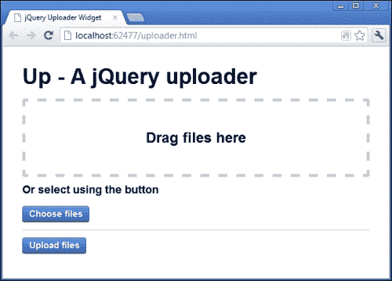
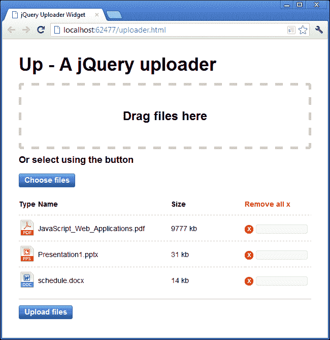
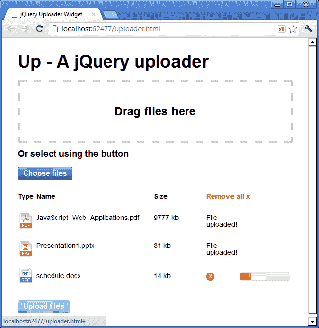

# 五、jQuery 文件上传器

现在可以用一些最新的 HTML5API 和 jQuery 创建一个功能齐全的文件上传小部件。我们可以很容易地添加对高级功能的支持，如多个上传和拖放界面，只需 jQuery UI 的一点帮助，我们还可以添加引人入胜的 UI 功能，如详细的文件信息和进度反馈。

# 任务简报

在本项目中，我们将使用 HTML5 文件 API 构建一个高级多文件上传小部件，以提供核心行为，并使用 jQuery 和 jQuery UI 构建一个吸引人的界面，让访问者感到愉快。

我们将小部件构建为 jQuery 插件，因为这是我们可能希望封装的东西，这样我们就可以将它放到许多页面中，只需一点配置就可以工作，而不必每次需要此功能时都构建自定义解决方案。

## 为什么太棒了？

jQuery 提供了一些非常好的特性，使得编写可重用插件变得轻而易举。在本项目的整个过程中，我们将看到打包特定功能和生成所有必要标记和添加所有所需行为类型的机制是多么容易。

在客户端处理文件上载为我们提供了大量增加体验增强功能的机会，包括有关选择上载的每个文件的信息，以及一个丰富的进度指示器，让访问者了解上载可能需要多长时间。

我们还可以允许访问者在上传过程中取消上传，或者在上传开始之前删除以前选择的文件。纯粹使用服务器端技术来处理文件上传，这些特性是不可用的。

在本项目结束时，我们将制作以下小部件：



## 你的热门目标

为了完成项目，我们需要完成以下任务：

*   创建页面和插件包装器
*   生成基础标记
*   添加用于接收要上载的文件的事件处理程序
*   显示选定文件的列表
*   从上载列表中删除文件
*   添加 jQuery UI 进度指示器
*   上载所选文件
*   汇报成功并整理

## 任务清单

就像在我们之前的一些项目中一样，除了使用 jQuery，我们还将在这个项目中使用 jQuery UI。我们在本书开头下载的 jQueryUI 副本应该已经包含了我们需要的所有小部件。

像在上一个项目中一样，我们也需要为这个项目使用一个 web 服务器，这意味着使用一个正确的`http://`URL 而不是`file:///`URL 来运行页面。有关兼容 web 服务器的信息，请参阅上一个项目。

# 创建页面和插件包装器

在这个任务中，我们将创建链接到所需资源的页面，以及以及包装器，我们的插件将在其中生存。

## 准备起飞

此时，我们应该为这个项目创建不同的文件。首先，在主项目文件夹中保存模板文件的新副本，并将其命名为`uploader.html`。我们还需要一个新的样式表，它应该作为`uploader.css`保存在`css`文件夹中，以及一个新的 JavaScript 文件，它应该作为`uploader.js`保存在`js`文件夹中。

新页面应该链接到 jQuery UI 样式表，这样我们就可以获得 Progressbar 小部件所需的样式，以及页面`<head>`中该项目的样式表，直接链接到`common.css`：

```js
<link rel="stylesheet" href="css/ui-lightness/jquery-ui-1.10.0.custom.min.css" />

<link rel="stylesheet" href="css/uploader.css" />
```

对于本例，我们还需要链接到 jqueryui 和 JavaScript 文件。我们应该将这两个脚本文件直接添加到 jQuery 现有的`<script>`元素之后：

```js
<script src="js/jquery-ui-1.10.0.custom.min.js"></script>
<script src="js/uploader.js"></script>
```

## 启动推进器

我们的插件需要的只是一个容器，小部件可以将所需的标记呈现到其中。在页面的`<body>`中，在链接到不同 JavaScript 资源的`<script>`元素之前，添加以下代码：

```js
<div id="uploader"></div>
```

除了链接到包含插件代码的脚本文件外，我们还需要调用插件来初始化它。直接在现有`<script>`元素之后添加以下代码：

```js
<script>
    $("#uploader").up();
</script>
```

插件的包装器是一个简单的构造，我们将使用它初始化小部件。在`uploader.js`中，添加以下代码：

```js
;(function ($) {

    var defaults = {
        strings: {
            title: "Up - A jQuery uploader",
            dropText: "Drag files here",
            altText: "Or select using the button",
            buttons: {
                choose: "Choose files", 
                upload: "Upload files" 
            },
            tableHeadings: [
                "Type", "Name", "Size", "Remove all x"
            ]
        }
    }

    function Up(el, opts) {

        this.config = $.extend(true, {}, defaults, opts);
        this.el = el;
        this.fileList = [];
        this.allXHR = [];
    }

    $.fn.up = function(options) {
        new Up(this, options);
        return this;
    };

}(jQuery));
```

## 目标完成-小型任务汇报

在构建 jQuery 插件时，我们能做的最好的事情就是让我们的插件易于使用。根据插件的用途，最好尽可能少的先决条件，因此如果插件需要复杂的标记结构，通常最好让插件呈现它需要的标记，而不是让插件用户尝试添加所有必需的元素。

有鉴于此，我们将编写插件，以便页面上所需的只是一个简单的容器，插件可以将标记呈现到其中。我们将此容器添加到页面中，并为其提供了一个`id`属性，以便于选择。

使用我们插件的开发者需要一种方法来调用它。jQuery 插件用额外的方法扩展了`jQuery`对象，我们的插件将向 jQuery 添加一个名为`up()`、的新方法，该方法与任何其他 jQuery 方法名称一样，是在 jQuery 选择的一组元素上调用的。

我们添加到`<body>`元素底部的额外`<script>`元素调用我们的插件方法来调用插件，这就是使用我们插件的人调用插件的方式。

在脚本文件中，我们以分号和立即调用的匿名函数开始。分号支持 jQuery 插件的模块化特性，并保护我们的插件不受其他无法正确停止执行的插件的影响。

如果页面上使用的另一个插件没有以分号结束其最终语句或表达式，并且我们没有以分号开始我们的插件，那么它可能会产生脚本错误，从而阻止我们的插件工作。

我们使用一个匿名函数作为插件的包装器，并在函数体后面用一组额外的括号立即调用它。我们还可以确保我们的插件与 jQuery 的`noConflict()`方法配合使用，方法是在插件中局部限定`$`字符的范围，并将`jQuery`对象作为参数传递给匿名函数。

在匿名函数中，我们首先定义一个名为`defaults`的对象文字，它将用作插件的配置对象。这个对象包含另一个名为`strings`的对象，我们在其中存储在不同元素中显示的所有不同文本位。

使用文本字符串配置对象的原因是为了使我们的插件易于本地化，使非英语语言的开发人员更容易使用。使插件尽可能灵活是使插件更具吸引力的好方法。

在`defaults`对象之后，我们定义了一个构造函数，它将生成小部件的实例。插件被调用，我们将其名称的第一个字母大写，因为这是应该使用`new`关键字调用的函数的一般约定。

构造函数函数可以接受两个参数；第一个是 jQuery 元素或元素的集合，第二个是开发人员使用我们的插件定义的配置对象。

在构造函数中，我们首先将一些成员附加到实例。第一个被称为`config`，它将包含 jQuery 的`extend()`方法返回的对象，该方法用于将两个对象合并在一起，与大多数 jQuery 方法不同，它在`jQuery`对象本身上被调用，而不是在 HTML 元素的集合上被调用。

它有四个论点；第一个参数指示`extend()`方法深度复制要合并到 jQuery 对象中的对象，我们需要这样做，因为`defaults`对象包含其他对象。

第二个参数是空对象；任何其他对象将合并在一起，并将其自身的属性添加到此对象。这是该方法将返回的对象。如果我们没有传入空对象，那么传入方法的第一个对象将返回。

接下来的两个参数是我们要合并的对象。这些是我们刚才定义的`defaults`对象和`opts`对象，当调用它时，可以将其传递给构造函数。

这意味着，如果开发人员希望传入配置对象，他们可以覆盖我们在`defaults`对象中定义的值。未被此配置对象覆盖的属性将改为默认值。

我们还将对元素或元素集合的引用存储为实例的成员，以便我们可以轻松地对代码其他部分中的元素进行操作。

最后，我们添加了两个空数组，用于存储要上载的文件列表和正在进行的 XHR 请求。我们将在项目的后面看到这些属性是如何使用的，所以现在不要太担心它们。

jQuery 提供`fn`对象作为其原型的快捷方式，这就是我们使用插件方法扩展 jQuery 的方式。在本例中，该方法称为`up()`，是我们使用`uploader.html`底部的`<script>`元素调用的方法。我们指定该方法可以接受单个参数，该参数是一个包含使用我们插件的人可能希望提供的配置选项的对象。

在该方法中，我们首先使用`new`关键字和构造函数创建 uploader 的新实例。我们将调用方法的元素（或元素集合）和`options`对象传递给构造函数。

最后我们从方法返回`this`。在添加到 jQuery 原型的方法中，`this`对象引用 jQuery 集合。为了保留链接，返回调用该方法的元素集合非常重要。

## 机密情报

链接是 jQuery 的固有特性，使用它的开发人员已经开始期待它了。在他们使用的编程风格方面，满足开发人员的期望是很重要的。使用我们插件的人希望在调用我们插件的方法后能够添加额外的 jQuery 方法。

现在，我们通过返回`this`对象来返回元素集合，开发人员可以执行以下操作：

```js
$("#an-element").up().addClass("test");
```

这是一个简单的例子，说明了什么是可能的，但是它应该说明为什么总是从插件返回`this`是很重要的。

# 生成基础标记

在本任务中，我们将向插件添加一个初始化方法，该方法将生成小部件所需的标记。

## 启动推进器

首先我们应该在`uploader.js`中的`Up()`构造函数后直接添加以下代码：

```js
Up.prototype.init = function() {
    var widget = this,
          strings = widget.config.strings,
          container = $("<article/>", {
            "class": "up"
          }),
    heading = $("<header/>").appendTo(container),
    title = $("<h1/>", {
        text: strings.title
    }).appendTo(heading),
    drop = $("<div/>", {
        "class": "up-drop-target",
        html: $("<h2/>", {
            text: strings.dropText
        })
    }).appendTo(container),
    alt = $("<h3/>", {
        text: strings.altText
    }).appendTo(container),
    upload = $("<input/>", {
        type: "file"
    }).prop("multiple", true).appendTo(container),
    select = $("<a/>", {
        href: "#",
        "class": "button up-choose",
        text: strings.buttons.choose
    }).appendTo(container),
    selected = $("<div/>", {
        "class": "up-selected"
    }).appendTo(container),
    upload = $("<a/>", {
        href: "#",
        "class": "button up-upload",
        text: strings.buttons.upload
    }).appendTo(container);

    widget.el.append(container);

}
```

我们还需要调用这个新的`init()`方法。更改添加到 jQuery 的`fn`对象中的方法，使其显示如下：

```js
$.fn.up = function(options) {
 new Up(this, options).init();
    return this;
};
```

我们还可以为插件生成的标记添加 CSS。在`uploader.css`中，添加以下样式：

```js
article.up { width:90%; padding:5%; }
article.up input { display:none; }
.up-drop-target { 
    height:10em; border:5px dashed #ccc; border-radius:5px; 
    margin-bottom:1em; text-align:center; 
}
.up-drop-target h2 { 
    margin-top:-.5em; position:relative; top:50%; 
}
.up-selected { margin:1em 0; border-bottom:1px solid #ccc; }
```

## 目标完成-小型任务汇报

我们可以添加一个`init()`方法，通过将其添加到构造函数的`prototype`中，来创建和注入构建小部件的标记。构造函数创建的所有对象都将继承该方法。

我们首先存储`this`对象，它在`init()`方法中仍然引用 jQuery 元素集合，因此我们可以在事件处理程序中轻松地引用它，我们将在下一个任务中添加它。

我们也在本地定义了`strings`属性的范围，以使解析速度稍微加快，因为我们经常引用该属性，以便将可见文本字符串添加到小部件的可见 UI 中。

接下来，我们创建新的 HTML 元素并将它们存储在变量中。这意味着我们可以创建容器并在其仍在内存中时将所有必需的元素附加到其中，然后一次性将整个小部件注入页面的 DOM 中，而不是重复修改 DOM 并逐个添加元素。

小部件的外部容器是一个`<article>`元素，该元素有一个类名，便于设计样式。HTML5 规范将`<article>`描述为一个自包含的交互式小部件，因此我觉得这是我们小部件的完美容器。尽管同样相关，但`<article>`并不局限于我们传统上所称的“文章”——例如博客/新闻帖子或编辑风格的文章。

我们有一个`<header>`元素来包含小部件的主标题，其中我们使用了一个标准`<h1>`。我们还使用小部件中的两个`<h2>`元素来显示不同的部分（拖放区域和更传统的文件`<input>`。

`<input>`元素有一个`type`属性`file`，并且也被赋予了`multiple`属性，使用 jQuery 的`prop()`方法，因此可以在支持的浏览器中上传多个文件。当前版本的 IE（9 及以下）不支持此属性。

我们还直接在`<input>`之后添加了一个`<a>`元素，我们将使用该元素打开用于选择要上载的文件的打开对话框。标准的`file`类型`<input>`的问题在于没有标准！

几乎每个浏览器实现`file`类型`<input>`的方式都不同，有些浏览器显示`<input>`和`<button>`，有些浏览器只显示`<button>`和一些文本。由于控件生成的`<input>`或`<button>`是**阴影 DOM**的一部分，因此也无法对其进行样式设置。

### 注

有关阴影 DOM 的更多信息，请参见[http://glazkov.com/2011/01/14/what-the-heck-is-shadow-dom/](http://glazkov.com/2011/01/14/what-the-heck-is-shadow-dom/) 。

为了让绕过这些跨浏览器差异，我们将使用 CSS 隐藏`<input>`，并使用`<a>`元素打开对话框，该元素的样式看起来像一个吸引人的按钮。

我们还添加了一个空的`<div>`元素，用于列出所选文件并显示每个文件的一些信息，后面是另一个`<a>`元素，样式类似于按钮。此按钮将用于启动上载。

我们使用标准 jQuery1.4+语法来创建新的 HTML 元素，并为我们创建的大多数元素提供了一个配置对象。大多数元素都有一个类名，有些元素还获取文本或 HTML 内容。我们使用的类名都有一个合理的前缀，以避免与页面上已使用的现有样式发生潜在冲突。

我们添加的 CSS 主要是为了演示。重要的方面是我们隐藏了标准文件`<input>`，并给放置目标一个固定的大小，以便可以轻松地将文件放置在其上。

此时，我们应该能够在浏览器中运行页面（通过 web 服务器），并查看插件的基本元素和布局。该页面应显示在本项目的第一个屏幕截图中。

# 添加接收上传文件的事件处理程序

我们可以使用我们在上一个任务中添加的`init()`方法来附加事件处理程序，我们的小部件将需要处理被选择上载的文件。将文件拖放到拖放目标时，或使用按钮选择文件时，可能会发生这种情况。

## 启动推进器

在`uploader.js`中`init()`方法末尾（但仍在`init()`方法中）将新 HTML 元素添加到容器后，直接添加以下代码：

```js
widget.el.on("click", "a.up-choose", function(e) {
    e.preventDefault();

    widget.el.find("input[type='file']").click();
});

widget.el.on("drop change dragover", "article.up", function(e) {

    if (e.type === "dragover") {
        e.preventDefault();
        e.stopPropagation();
        return false;
    } else if (e.type === "drop") {
        e.preventDefault();
        e.stopPropagation();
        widget.files = e.originalEvent.dataTransfer.files;
    } else {
        widget.files = widget.el
        .find("input[type='file']")[0]
        .files;
    }

    widget.handleFiles();
});
```

## 目标完成-小型任务汇报

我们首先使用 jQuery 的`on()`方法，在事件委托模式下，将事件处理程序附加到小部件的外部容器。我们将`click`事件指定为第一个参数，将一个选择器与类名`up-choose`匹配为第二个参数。

在作为第三个参数传递给`on()`的处理函数中，我们首先使用 JavaScript 的`preventDefault()`阻止浏览器的默认行为，然后为用于选择要上载的文件的隐藏`<input>`元素触发`click`事件。这将导致“文件”对话框在浏览器中打开，并允许选择文件。

然后我们附加了另一个事件处理程序。这一次我们正在寻找`drop`、`dragover`或`change`事件。当文件被放置到放置区时触发`drop`事件，当文件被放置在放置区上方时触发`dragover`事件，如果文件被移除则触发`change`事件。

所有这些事件都将从拖放区（类名为`up`的`<article>`或隐藏的`<input>`冒泡出来，并将通过小部件的外部容器，事件处理程序将绑定到该容器。

在这个处理函数中，我们首先检查它是否是`dragover`事件；如果是，我们再次使用`preventDefault()`和`stopPropagation()`阻止浏览器的默认行为。我们还需要`return false`从这个分支的条件。

`if`的下一个分支检查触发处理程序的事件是否是`drop`事件。如果是，我们仍然需要使用`preventDefault()`和`stopPropagation()`，但这次我们还可以使用 jQuery 创建的事件对象获取所选文件的列表，并将其传递给 handler 函数，然后将它们存储在小部件实例的属性中。

如果这两个条件都不是`true`，我们将从`<input>`元素获取文件列表。

我们需要的属性是 jQuery 打包到自己的事件对象中的`originalEvent`对象的一部分。然后我们可以从`dataTransfer`对象获取`files`属性。如果该事件是`change`事件，则只需获取隐藏的`<input>`的`files`属性即可。

无论使用哪种方法，选择上载的文件集合都存储在小部件实例的`files`属性下。这只是一个临时属性，它将在每次选择新文件时被覆盖，这与小部件的`filelist`数组不同，后者将存储所有文件以供上传。

最后我们称之为`handleFiles()`方法。在下一个任务中，我们将把这个方法添加到小部件的`prototype`中，这样一旦完成了，我们就可以在这里调用这个方法而不会出现问题。

组合这两个事件并检测以这种方式发生的事件比附加到单独的事件处理程序要好得多。这意味着我们不需要两个单独的处理程序函数，这两个函数的作用本质上是相同的，无论是通过按钮和标准对话框选择文件，还是通过将文件拖放到拖放目标上，我们仍然可以获得文件列表。

此时，我们应该能够将文件拖放到拖放区，或者单击按钮并使用对话框选择文件。但是，由于我们尚未添加插件的`handleFiles()`方法，因此将抛出一个脚本错误。

# 显示所选文件列表

在这个任务中，我们可以填充我们在中创建的`<div>`，以显示为上传选择的文件列表。我们将构建一个表，其中表中的每一行都列出一个文件，其中包含文件名和类型等信息。

## 启动推进器

直接在`uploader.js`中的`init()`方法后添加以下代码：

```js
Up.prototype.handleFiles = function() {

    var widget = this,
          container = widget.el.find("div.up-selected"),
          row = $("<tr/>"),
          cell = $("<td/>"),
          remove = $("<a/>", {
             href: "#"
          }),
    table;

    if (!container.find("table").length) {
        table = $("<table/>");

        var header = row.clone().appendTo(table),
              strings = widget.config.strings.tableHeadings;

        $.each(strings, function(i, string) {
                var cs = string.toLowerCase().replace(/\s/g, "_"),
                      newCell = cell.clone()
                                            .addClass("up-table-head " + cs)
                                            .appendTo(header);

                if (i === strings.length - 1) {
                    var clear = remove.clone()
                                                 .text(string)
                                                .addClass("up-remove-all");

                    newCell.html(clear).attr("colspan", 2);
                } else {
                    newCell.text(string);
                }
            });
        } else {
            table = container.find("table");
        }

        $.each(widget.files, function(i, file) {
        var fileRow = row.clone(),
              filename = file.name.split("."),
              ext = filename[filename.length - 1],
              del = remove.clone()
                                   .text("x")
                                   .addClass("up-remove");

        cell.clone()
              .addClass("icon " + ext)
              .appendTo(fileRow);

        cell.clone()
              .text(file.name).appendTo(fileRow);
        cell.clone()
             .text((Math.round(file.size / 1024)) + " kb")
             .appendTo(fileRow);

        cell.clone()
              .html(del).appendTo(fileRow);
        cell.clone()
              .html("<div class='up-progress'/>")
              .appendTo(fileRow);

        fileRow.appendTo(table);

        widget.fileList.push(file);
    });

    if (!container.find("table").length) {
        table.appendTo(container);
    }
}
```

我们还可以为我们创建的新标记添加一些额外的 CSS。在`upload.css`的下方添加以下代码：

```js
.up-selected table {
    width:100%; border-spacing:0; margin-bottom:1em;
}
.up-selected td {
    padding:1em 1% 1em 0; border-bottom:1px dashed #ccc;
    font-size:1.2em;
}
.up-selected td.type { width:60px; }
.up-selected td.name { width:45%; }
.up-selected td.size { width:25%; }
.up-selected td.remove_all_x { width:20%; }

.up-selected tr:last-child td { border-bottom:none; }
.up-selected a {
    font-weight:bold; text-decoration:none;
}
.up-table-head { font-weight:bold; }
.up-remove-all { color:#ff0000; }
.up-remove {
    display:block; width:17px; height:17px;
    border-radius:500px; text-align:center;
    color:#fff; background-color:#ff0000;
}
.icon { 
    background:url(../img/page_white.png) no-repeat 0 50%; 
}
.doc, .docx { 
    background:url(../img/doc.png) no-repeat 0 50%; 
}
.exe { background:url(../img/exe.png) no-repeat 0 50%; }
.html { background:url(../img/html.png) no-repeat 0 50%; }
.pdf { background:url(../img/pdf.png) no-repeat 0 50%; }
.png { background:url(../img/png.png) no-repeat 0 50%; }
.ppt, .pptx { 
    background:url(../img/pps.png) no-repeat 0 50%; 
}
.txt { background:url(../img/txt.png) no-repeat 0 50%; }
.zip { background:url(../img/zip.png) no-repeat 0 50%; }
```

## 目标完成-小型任务汇报

我们首先将`handleFiles()`方法添加到小部件的`prototype`中，并在上一个任务结束时添加了`widget.handleFiles()`方法调用。它的添加方式与前面的`init()`方法完全相同，`this`对象指向`handleFiles()`内部的小部件实例，就像`init()`内部一样。这使得页面上的元素、配置选项和所选文件列表易于访问。

在方法内部，我们首先创建了一系列变量。就像在`init()`方法中一样，我们创建了一个名为 widget 的局部变量来存储`this`对象。我们不会向这个方法添加任何事件处理程序，所以我们不一定要这样做，但我们确实会多次访问对象，所以将其缓存在变量中是有意义的。

我们还使用`widget.el`缓存所选文件容器–不要忘记`el`已经引用外部小部件容器的 jQuery 包装实例，因此我们可以直接在其上调用 jQuery 方法，例如`find()`，而无需重新包装。

接下来，我们创建一系列新的 DOM 元素，以便在循环中克隆它们。这是一种更好的创建元素的方法，尤其是在循环内部，并且避免了不断创建新的 jQuery 对象。

我们还定义了一个名为`table`的变量，但我们不会立即初始化它。相反，我们使用`if`条件来检查容器是否已经包含`<table>`元素，方法是检查 jQuery 的`find("table")`是否返回具有`length`的集合。

如果`length`等于`false`，我们知道没有选择`<table>`元素，所以我们使用 jQuery 创建的新`<table>`元素初始化`table`变量。然后，我们为`<table>`创建一个标题行，用于为新表中的每一列添加标题。

此时，`<table>`元素只存在于内存中，因此我们可以向其中添加新行，而无需修改页面的 DOM。我们还缓存了对配置对象中使用的`strings`对象的`tableHeadings`属性的引用。

然后，我们使用 jQuery 的`each()`实用程序创建用作表标题的所有`<td>`元素。除了能够对从页面中选择的元素集合调用`each()`之外，我们还可以对 jQuery 对象调用`each()`，以迭代纯 JavaScript 数组或对象。

`each()`方法接受数组或对象进行迭代。在本例中，它是一个数组，因此为数组中的每个项调用的迭代函数将当前项的索引和当前项的值作为参数接收。

在迭代器中，我们首先创建一个可以用作类名的新字符串。单词`class`在 JavaScript 中是一个**保留字**，因此我们将其称为变量`cs`。要创建类名，我们只需使用 JavaScript 的`toLowerCase()`函数将当前字符串转换为小写，然后使用 JavaScript 的`replace()`函数删除所有空格。

### 注

有关 JavaScript 中保留字的完整列表，请参阅[中的 MDN 文档 https://developer.mozilla.org/en-US/docs/JavaScript/Reference/Reserved_Words](https://developer.mozilla.org/en-US/docs/JavaScript/Reference/Reserved_Words) 。

`replace()`函数将要匹配的正则表达式作为第一个参数，替换字符串作为第二个参数。我们可以使用字符串`" "`作为第一个参数，但是只删除第一个空格，而使用带有`g`标志的正则表达式可以删除所有空格。

然后，通过克隆我们创建的一个元素并在任务开始时将其存储在变量中，我们创建了一个新的`<td>`元素。我们为它提供了一个通用的类名，用于样式设置，以及我们刚刚创建的唯一类名，以便在需要时可以独立设置每个列的样式，然后将其直接附加到我们刚才创建的标题行。

然后，我们通过测试当前索引是否等于数组的`length`减去 1 来检查是否正在迭代数组中的最后一项。如果是最后一项，我们将通过克隆在任务开始时创建并缓存的`<a>`元素来添加 clear all 链接。

我们将新的`<td>`元素的文本设置为当前数组项的值，并添加`up-remove-all`类以进行样式设置，以便我们可以过滤它发送的事件。我们也可以使用 jQuery 的`attr()`方法将`2`的`colspan`属性设置为该`<td>`。然后添加新的`<a>`元素作为新`<td>`元素的 HTML 内容。

如果它不是数组中的最后一项，我们只需将新`<td>`元素的文本内容设置为当前数组项的值。

这都是在表不存在时发生的外部`if`语句的第一个分支中完成的。如果容器已经包含一个`<table>`元素，我们仍然通过从页面中选择`<table>`来初始化表变量。

不要忘记，一旦选择了文件，就会调用我们所使用的`handleFiles()`方法，因此现在我们需要在表中为每个选择的文件构建一个新行。

我们再次使用 jQuery 的`each()`方法，这次是迭代小部件`files`属性中存储的文件集合。对于选择的每个文件（通过拖放到拖放区或使用按钮），我们首先通过克隆`row`变量创建一个新的`<tr>`。

然后，我们将当前文件的`name`属性拆分为`.`字符。我们通过获取由`split()`函数创建的数组中的最后一项来存储文件扩展名。

在这一点上，我们还创建了一个 delete 链接，通过克隆我们在任务开始时创建的`<a>` 元素，该链接可用于从要上载的文件列表中删除单个文件。给出了文本`x`和类名`up-remove`。

接下来，我们通过再次克隆`cell`变量中缓存的`<td>`来创建系列新的`<td>`元素。第一个`<td>`被赋予一个通用类名`icon`，以及当前文件的扩展名，以便我们可以为可以上传的不同文件类型添加一个图标，并将其附加到新行。

第二个`<td>`元素显示文件名。第三个`<td>`元素以千字节为单位显示文件的大小。如果我们知道可能会上传大文件，我们可以将其转换为兆字节，但对于本项目而言，千字节就足够了。

第四个`<td>`元素使用 jQuery 的`html()`方法添加了新的删除链接，最后一个`<td>`元素添加了一个空的`<div>`元素，我们将用于 jQuery UI Progressbar 小部件。

创建新行并将其附加到新行后，新行本身将附加到表中。我们还可以将当前文件添加到`fileList`数组中，以便上传。

最后，我们需要再次检查所选文件容器中是否已经有一个`<table>`元素。如果没有，我们将新的`<table>`添加到容器中。如果它已经包含了`<table>`，那么新行已经添加到它了。

我们在这一部分中添加的 CSS 纯粹是代表性的。我所做的一件事是添加一些类，这样就可以为可能选择上载的不同文件类型显示一个图标。我只是举了几个例子；您实际需要的文件取决于您希望用户上载的文件类型。还为与我们添加的选择器不匹配的类型创建了一个通用图标。

### 注

此示例中使用的图标是 Farm Fresh 图标包的一部分。为了简洁起见，我已经重命名了这些文件，可以在本书附带的代码下载中找到。图标可在肥牛网站（[上）获得 http://www.fatcow.com/free-icons](http://www.fatcow.com/free-icons) 。

此时，我们应该能够在浏览器中运行页面，选择一些要上载的文件，并查看我们刚刚创建的新`<table>`：



## 机密情报

在本例中，我们手动创建了显示所选文件列表所需的元素。另一种方法是使用模板引擎，例如 jsRender 或 Dust.js。这样做的好处是比手动创建更快、更高效，使插件代码更简单、更简洁，文件更小。

当然，它会给我们的插件添加另一个依赖项，因为我们必须包括模板引擎本身，以及存储在 JavaScript 文件中的预编译模板。在本例中，我们没有创建那么多的元素，因此可能不值得添加另一个依赖项。当需要创建许多元素时，添加依赖项的成本会被它所增加的效率所抵消。

这是在编写 jQuery 插件时需要逐案考虑的事情。

# 从上传列表中删除文件

在本任务中，我们将添加事件处理程序，使**删除**和**删除新文件列表中的所有**链接。我们可以在前面添加其他事件处理程序的相同位置附加事件处理程序，以保持事情的有序性。

## 启动推进器

在`upload.js`中，在小部件的`init()`方法中，直接在对 jQuery 的`on()`方法的现有调用之后，添加以下新代码：

```js
widget.el.on("click", "td a", function(e) {

    var removeAll = function() {
        widget.el.find("table").remove();
        widget.el.find("input[type='file']").val("");
        widget.fileList = [];
    }

    if (e.originalEvent.target.className == "up-remove-all") {
        removeAll();
    } else {
        var link = $(this),
              removed,
              filename = link.closest("tr")
                                     .children()
                                     .eq(1)
                                     .text();

        link.closest("tr").remove();

        $.each(widget.fileList, function(i, item) {
        if (item.name === filename) {
            removed = i;
        }
    });
    widget.fileList.splice(removed, 1);

    if (widget.el.find("tr").length === 1) {
        removeAll();
    } 
  }
}); 
```

## 目标完成-小型任务汇报

我们使用 jQuery 的`on()`方法再次添加`click`事件。我们将附加到小部件的外部容器上，因为我们有我们的其他事件，这次我们根据选择器`td a`过滤事件，因为事件将仅源自`<td>`元素中的`<a>`元素。

在事件处理程序中，我们首先阻止浏览器的默认行为，因为我们不希望遵循链接。然后我们定义一个简单的助手函数，该函数从小部件中删除`<table>`元素，删除文件`<input>`的值，并清除`fileList`数组。

我们需要清除`<input>`，否则，如果我们选择了一些文件，然后将其从文件列表中删除，我们将无法重新选择同一组文件。这有点像边缘案例，但这个简单的小把戏让它起作用，所以我们不妨将其包括在内。

接下来我们检查触发事件的元素的`className`属性是什么。我们可以使用传递给处理函数的 jQuery 事件对象中包含的`originalEvent`对象的目标属性来查看此属性。我们也可以使用 jQuery 事件对象的`srcElement`属性，但这在当前版本的 Firefox 中不起作用。

当`className`属性与`up-remove-all`匹配时，我们只需调用`removeAll()`辅助函数来移除`<table>`元素并清除`<input>`和`fileList`数组。

如果`className`属性与**Remove all**链接不匹配，我们必须只删除包含已单击的`<a>`的`<table>`元素的行。我们首先缓存对触发事件的`<a>`的引用，该引用在我们的处理函数中设置为`this`。

我们还定义了一个名为`removed`的变量，我们将很快用一个值初始化它。最后，我们存储要删除的行所代表的文件的`filename`。

一旦我们设置了变量，我们要做的第一件事就是删除使用 jQuery 的`closest()`方法可以得到的行，该方法会找到与传递给该方法的选择器匹配的第一个父元素。

然后，我们使用 jQuery 的`each()`方法迭代`fileList`数组。对于数组中的每个项，我们将该项的`name`属性与刚刚初始化的`filename`变量进行比较。如果两者匹配，我们将`index`编号设置为我们的`removed`变量，该编号由 jQuery 自动传递给迭代器函数。

一旦`each()`方法完成，我们就可以使用 JavaScript 的`splice()`函数删除表示当前`<tr>`的文件。`splice()`函数接受两个参数（可能需要更多参数，但我们这里不需要它们），其中第一个参数是要开始移除的项的索引，第二个参数是要移除的项的数量。

最后，我们检查`<table>`元素中是否还有多行。如果只剩下一行，这将是标题行，因此我们知道所有文件都已删除。因此，我们可以调用我们的`removeAll()`助手函数来整理和重置所有内容。

现在，当我们将文件添加到上传列表中时，我们应该能够使用内嵌的**x**按钮删除单个文件，或者使用**删除所有**链接清除列表。

# 增加 jQuery UI 进度指标

在本任务中，我们将添加 jQuery UI Progressbar 小部件所需的元素和初始化代码。这个小部件实际上还不会做任何事情，因为在下一个任务之前我们不会上传任何东西，但是我们需要把所有东西都连接好。

## 启动推进器

我们将向小部件的原型中添加一个`initProgress()`方法，以选择我们添加到`<table>`元素中的`<div>`元素，并将它们转换为 Progressbar 小部件。我们还可以添加用于更新 Progressbars 的方法。

直接在`handleFiles()`方法后添加以下代码：

```js
Up.prototype.initProgress = function() {

    this.el.find("div.up-progress").each(function() {
        var el = $(this);

        if (!el.hasClass("ui-progressbar")) {
            el.progressbar();
        }
    });
}
```

接下来，我们需要在`<table>`中添加新行后调用此方法。在`handleFiles()`方法的末尾添加以下对新方法的调用：

```js
widget.initProgress();
```

现在我们可以添加更新 Progressbar 的代码。在我们刚才添加的`initProgress()`方法之后直接添加以下代码：

```js
Up.prototype.handleProgress = function(e, progress) {

    var complete = Math.round((e.loaded / e.total) * 100);

    progress.progressbar("value", complete);
}
```

我们还需要为新的进度条添加一点 CSS。在`uploader.css`末尾添加以下代码：

```js
.up-progress { 
    height:1em; width:100px; position:relative; top:4px; 
}
```

## 目标完成-小型任务汇报

这是一项比我们目前为止在这个项目中讨论的一些任务更短的任务，但同样重要。我们添加新方法的方式与我们为插件添加大部分功能的方式相同。

在方法内部，我们首先选择所有类名为`up-progress`的`<div>`元素。不要忘记，我们可以使用`this.el`访问小部件的容器元素，因为它已经是 jQuery 对象了，所以我们可以调用 jQuery 方法，比如它上面的`find()`。

然后，我们使用 jQuery 的`each()`方法迭代选择中的每个元素。我们在这个任务中使用标准的`each()`方法，其中集合中的当前元素在迭代器函数中设置为`this`。

在迭代器函数中，我们首先缓存当前元素。然后，我们检查它是否具有 jQuery UI 类名`ui-progressbar`，如果没有，则使用 jQuery UI 方法`progressbar()`将元素转换为 Progressbar。

这样做意味着将始终创建进度条，无论是选择上载的初始文件集，还是添加到现有`<table>`的其他文件。

我们还在`handleFiles()`方法的末尾添加了对新`initProgress()`方法的调用，该方法在选择上传新文件时调用。

接下来我们添加了`handleProgress()`方法，我们将在下一个任务中将其绑定到一个事件。此方法将传递两个参数，第一个是事件对象，第二个是表示单个 Progressbar 的已包装 jQuery 对象。

在该方法中，我们首先计算文件的上载量。我们可以通过将事件对象的 loaded 属性除以 total 属性来确定，然后除以 100，得到迄今为止已上载的文件的百分比。

`loaded`和`total`属性是浏览器触发进度事件时添加到事件对象的特殊属性。

一旦我们有了百分比，我们就可以调用 Progressbar 小部件的`value`方法来将该值设置为百分比。这是一个 jQueryUI 方法，因此以一种特殊的方式调用。我们不直接调用`value()`，而是调用`progressbar()`方法，并传递要调用的方法的名称`value`作为第一个参数。所有 jQueryUI 方法都是以这种方式调用的。

最后，我们添加了一些表示性 CSS，只是为了调整使用中的默认 jQueryUI 主题提供的默认样式。当我们现在添加要上传的文件时，我们应该会在`<table>`中的每个文件后面看到一个空进度条。

# 上传所选文件

我们现在有一个文件清单附在我们插件的实例上，准备上传。在这个任务中，我们将这样做，并使用 jQuery 异步上传文件。此行为将与我们添加到插件生成的标记中的**上传文件**按钮相关联。

我们还可以使用此任务用每个上传文件的当前进度更新 ProgressBar。

## 启动推进器

由于这是另一个事件处理程序，我们将它与所有其他事件处理程序一起添加到`init()`方法中，以便它们都保存在一个位置。在现有事件处理程序之后的`init()`方法末尾添加以下代码：

```js
widget.el.on("click", "a.up-upload", function(e) {
    e.preventDefault();

  widget.uploadFiles();
}); 
```

接下来添加新的`uploadFiles()`方法。这可以遵循我们在上一个任务中添加的进度相关方法：

```js
Up.prototype.uploadFiles = function() {
    var widget = this,
    a = widget.el.find("a.up-upload");

    if (!a.hasClass("disabled")) {

        a.addClass("disabled");

        $.each(widget.fileList, function(i, file) {
            var fd = new FormData(),
                  prog = widget.el
                                        .find("div.up-progress")
                                        .eq(i);

            fd.append("file-" + i, file);

            widget.allXHR.push($.ajax({
                type: "POST",
                url: "/upload.asmx/uploadFile",
                data: fd,
                contentType: false,
                processData: false,
                xhr: function() {

                    var xhr = jQuery.ajaxSettings.xhr();

                    if (xhr.upload) {
                        xhr.upload.onprogress = function(e) {
                            widget.handleProgress(e, prog);
                        }
                    }

                    return xhr;
                }
            }));
        });     
    }
}
```

## 目标完成-小型任务汇报

在我们的`uploadFiles()`方法中，我们首先存储对小部件的引用，就像我们在添加的一些其他方法中一样。我们还存储了对**上传文件**按钮的引用。

下一步要做的是检查按钮没有`disabled`的类名。如果它确实具有此类名，则表示已为所选文件启动上载，因此我们希望避免重复请求。如果按钮没有`disabled`类，则表示这是第一次单击按钮。因此，为了防止重复请求，我们添加了类`disabled`。

接下来，我们迭代我们收集的文件列表，这些文件存储在小部件实例的`fileList`属性中。对于数组中的每个文件，我们首先创建一个新的`FormData`对象。

`FormData`是新的 XMLHttpRequest（XHR）2 级规范的部分，该规范允许我们动态创建`<form>`元素并使用 XHR 异步提交该表单。

一旦我们创建了一个新的`FormData`对象，我们还存储了对与当前文件关联的 Progressbar 小部件的引用。然后，我们使用 FormData 的`append()`方法将当前文件附加到新的`FormData`对象，以便对文件进行编码并发送到服务器。

接下来，我们使用 jQuery 的`ajax()`方法将当前的`FormData`对象发布到服务器。`ajax()`方法将返回请求的`jqXHR`对象。这是 XHR 对象的一个特殊版本，jQuery 通过附加的方法和属性对其进行了增强。我们需要存储这个`jqXHR`对象，以便稍后使用它。

我们将在下一个任务中详细了解它是如何使用的，但现在只需了解由`ajax()`方法返回的`jqXHR`对象被推送到`allXHR`数组中，我们在项目开始时将其作为小部件实例的成员存储在该数组中。

`ajax()`方法接受一个配置对象作为参数，它允许我们控制如何发出请求。我们使用`type`选项将请求设置为`POST`，并使用`url`选项指定要发布到的 URL。我们使用 data 选项添加`FormData`对象作为请求的有效负载，并将`contentType`和`processData`选项设置为`false`。

如果我们不将`contentType`选项设置为`false`，jQuery 将尝试猜测应该为请求使用哪种内容类型，这可能是正确的，也可能是不正确的，这意味着有些上传可以工作，有些上传会失败，似乎没有明显的原因。请求的`content-type`将默认设置为`multipart/form-data`，因为我们使用的是`FormData`，其中附加了文件。

将`processData`选项设置为`false`将确保 jQuery 不会尝试将文件转换为 URL 编码的查询字符串。

我们需要修改用于发出请求的底层 XHR 对象，以便将我们的处理函数附加到 progress 事件。在发出请求之前，处理程序必须绑定到事件，目前唯一的方法是使用`xhr`选项。

该选项接受一个回调函数，我们可以使用该函数修改原始 XHR 对象，然后将其返回请求。在回调内部，我们首先存储原始的 XHR 对象，可以从 jQuery 的`ajaxSettings`对象中获取。

然后我们检查对象是否有`upload`属性，如果有，我们将匿名函数设置为`onprogress`的值。在这个函数中，我们只需调用我们在上一个任务中添加的小部件的`handleProgress()`方法，将进度事件对象和我们在该任务开始时存储的 Progressbar 小部件传递给它。

# 上报成功并整理

在这个任务中，我们需要显示每个文件何时完成上传。我们还需要清除小部件中的`<table>`，并在所有上传完成后重新启用上传按钮。

## 启动推进器

我们可以使用 jQuery 的`done()`方法显示每个文件何时完成上传，我们可以在上一个任务中添加的`ajax()`方法之后链接该方法：

```js
.done(function() {

    var parent = prog.parent(),
    prev = parent.prev();

    prev.add(parent).empty();
    prev.text("File uploaded!");
});
```

为了在上传之后进行整理，我们可以使用 jQuery 的`when()`方法。我们应该在`uploadFiles()`中的`each()`方法后直接添加以下代码：

```js
$.when.apply($, widget.allXHR).done(function() {
    widget.el.find("table").remove();
    widget.el.find("a.up-upload").removeClass("disabled");
});
```

## 目标完成-小型任务汇报

因为 jQuery 的`ajax()`方法返回一个`jqXHR`对象，而且这个对象是一个特殊的对象，叫做**承诺对象**，所以我们可以在它上面调用某些 jQuery 方法。`done()`方法用于在请求成功完成时执行代码。

### 注

您可能更习惯于使用 jQuery 的`success()`方法来处理成功的 AJAX 请求，或者使用`error()` 或`complete()`方法。这些方法在版本 1.9 中已经从库中删除，因此我们应该使用它们的替代品`done()`、`fail()`和`always()`。

在这个函数中，我们需要做的就是删除刚刚完成上传的文件的 clear 按钮和 Progressbar 小部件。我们可以从当前的 Progressbar 小部件导航到需要轻松删除的元素。

我们在上一个任务中存储了对每个 Progressbar 的引用，因为`done()`方法链接到`ajax()`方法，所以在请求完成后，我们仍然可以使用变量访问此元素。

请注意，`done()`方法的末尾似乎有一个额外的闭合括号。这是因为它仍然在我们在前面的任务中添加的`push()`方法中。将`done()`方法添加到正确的位置至关重要–它必须链接到`push()`方法中的`ajax()`方法。

删除这些元素后，我们将添加一条简单消息，说明文件已完成上载。

完成所有请求后，我们还需要从页面中删除`<table>`元素。正是由于这个原因，我们存储了上一个任务中上传文件时生成的所有`jqXHR`对象。我们可以使用 jQuery 的`when()`方法来实现这一点。

`when()`方法可以接受一系列承诺对象，当它们都被解析后返回。但是，这个方法不接受数组，这就是为什么我们使用 JavaScript 的`apply()`方法调用它，而不是正常调用它。

我们可以再次使用`done()`方法添加一个回调函数，在`when()`方法返回后调用。在这个回调中，我们所要做的就是删除显示已上载文件的`<table>`元素，并通过删除`disabled`类重新启用上载按钮。

这就是我们需要做的全部工作，以实际上传选定的一个或多个文件，并单独接收每个文件的进度反馈，如以下屏幕截图所示：



### 提示

**查看示例文件**

要查看此项目的运行情况，您需要查看我们使用 web 服务器创建的页面（在您自己的计算机上使用`http://localhost`）。如果您在 Explorer 或 Finder 中双击文件来打开它，它将不起作用。

# 任务完成

我们已经完成了这个项目。此时，我们应该有一个易于使用的 uploader 插件，并在支持浏览器方面提供丰富的功能，如多个文件、文件信息、可编辑的上载列表和上载进度报告。

### 提示

并非所有浏览器都能够使用此小部件构建时要利用的功能。例如，Opera 浏览器将以编程方式触发文件对话框视为安全风险，因此不允许这样做。

此外，Internet Explorer 的旧版本（版本 10 之前的任何版本）将根本无法处理此代码。

支持不兼容或遗留浏览器超出了本例的范围，但添加一个利用其他技术（如 Flash）的回退，以支持插件演示的某些行为，这将是相对直接的。

或者有一系列较旧的 jQuery 插件使用`<iframe>`元素模拟通过 AJAX 上传文件。我不再关注不受支持的内容，而是选择关注在支持浏览器的情况下*可以做些什么。*

# 你准备好了吗？热门挑战

通过单独上传文件，我们可以添加一个事件处理程序来监控上传文件的进度。这也打开了中止个别文件上传的可能性。

对于这个挑战，为什么不看看是否可以添加一个机制来取消文件的上载。我们已经有了删除按钮，用于在上传文件之前删除文件。这些文件可以很容易地更新，以便在上传过程中取消上传。

中止事件的处理程序可以以与附加进度事件处理程序相同的方式添加到 XHR 对象，因此应该很容易实现。