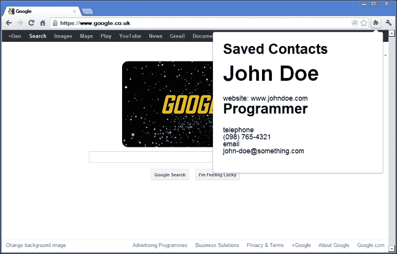
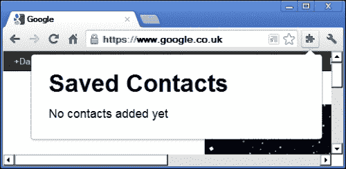

# 六、用 jQuery 扩展 Chrome

为 Chrome（或任何其他可以通过插件和扩展扩展的浏览器）构建扩展是创建自定义行为或附加工具以增强浏览体验的简单方法。

Chrome 允许我们利用我们的 web 开发技能扩展其浏览器界面，使用我们已经熟悉的技术，如 HTML、CSS 和 JavaScript，在可以使用 JavaScript 的地方，通常可以使用 jQuery。

# 任务简报

在这个项目中，我们将构建一个 Chrome 扩展，突出显示页面上标记有`Schema.org`**微数据**的元素。微数据是一种指定各种不同实体的描述性信息的方法，例如使用标准 HTML 属性的企业、地点或人员，据传它将成为谷歌排名算法中的一个重要因素。

每当我们访问包含被描述为联系人详细信息的元素的页面时，我们都可以从页面中获取这些元素并将它们存储在扩展中，这样我们就可以为正在使用或制作我们喜欢的东西的人慢慢建立一个联系信息目录。

我们还可以在这个项目中使用模板，使创建一组重复的元素更加高效，并且更易于维护。我们在上一个项目中使用了 JsRender，因此我们可以再次使用它，但这次我们需要使用与以前略有不同的 JsRender。一旦完成，我们的扩展将如以下屏幕截图所示：



## 为什么太棒了？

微数据用于描述网页中包含的信息，以促进自治系统（如搜索引擎蜘蛛和 HTML 文档）之间更好的互操作性。

当页面上的不同元素被描述为一家公司、一个人、一个产品或一部电影时，它可以让搜索引擎更好地理解页面上包含的信息。

微数据在网络上正迅速变得越来越普遍，并将在谷歌搜索结果的结果中扮演越来越重要的角色，因此利用微数据的时机前所未有。

## 你的热门目标

本项目分为以下任务：

*   建立基本的扩展结构
*   添加清单并安装扩展
*   添加沙盒 JsRender 模板
*   将消息发布到沙箱
*   添加一个内容脚本
*   在页面上搜索微数据
*   添加保存微数据的机制

# 建立基本延伸结构

在本任务中，我们将创建扩展所需的底层文件。扩展所使用的所有文件都需要驻留在同一个目录中，因此我们将对此进行设置，并确保它包含我们需要的所有文件。

## 准备起飞

我应该指出一件事，尽管希望你已经意识到——在这个项目期间，我们将需要 Chrome 浏览器。如果您没有安装它，作为一名 web 开发人员，您真的应该安装它，如果只是为了测试目的，请立即获取并安装它。

### 注

Chrome 最新版本可从[下载 https://www.google.com/intl/en/chrome/browser/](https://www.google.com/intl/en/chrome/browser/) 。

我们将此项目的所有文件保存在一个目录中，因此现在在项目文件夹中设置一个，并将其命名为`chrome-extension`。扩展将从与我们创建的大多数其他项目相同的基本代码文件构建；唯一的区别是，所有文件都需要是扩展名的本地文件。

我们需要一份 JsRender 的副本，所以我们还应该下载一份 JsRender 的副本并将其放在`chrome-extension`目录中。上次使用 JsRender 时，我们链接到了实时托管版本。这次我们将下载它。

### 注

JsRender 的最新版本可从[下载 https://github.com/BorisMoore/jsrender/](https://github.com/BorisMoore/jsrender/) 。

我们可以使用启动其他项目时使用的模板文件，但是我们应该确保 jQuery、JavaScript 文件和样式表的路径都指向同一目录中的文件。Chrome 扩展使用的所有文件必须在同一文件夹中，这就是为什么我们下载脚本而不是链接到在线版本。

我们应该将 jQuery、JsRender 和`common.css` 样式表的副本放在新目录中。我们还需要创建一个名为`popup.js`的新 JavaScript 文件和一个名为`popup.css`的新样式表，并将这些文件保存到新目录中。

最后，我们可以创建一个名为`popup.html`的新 HTML 页面。此文件还应保存在`chrome-extension`目录中，并应包含以下代码：

```js
<!DOCTYPE html>
<html lang="en">
    <head>
        <meta charset="utf-8" />
        <title>jQuery-Powered Chrome Extension</title>
        <link rel="stylesheet" href="common.css" />
        <link rel="stylesheet" href="popup.css" />
    </head>
    <body>
        <script src="jquery-1.8.0.min.js"></script>
        <script src="jsrender.js"></script>
        <script src="popup.js"></script>
    </body>
</html>
```

## 启动推进器

我们刚刚创建的 HTML 文件将用作扩展的弹出窗口。这是在工具栏中单击扩展图标时显示为弹出窗口的页面。在这个项目中，我们将创建一种称为**浏览器操作**的扩展，它会自动在 Chrome 的工具栏上添加一个按钮，用于打开弹出窗口。

弹出窗口将显示一个按钮，用于触发当前页面的微数据扫描，并显示以前保存的任何联系人。任何以前存储的联系人都将使用 localStorage API 检索，我们可以使用模板来呈现它们。

首先，我们可以将常规标记添加到页面中；在`popup.html`中，将以下代码添加到页面的`<body>`中：

```js
<section role="main">
    <header>
        <h1>Web Contacts</h1>
    </header>
    <ul id="contacts"></ul>
</section>
<iframe id="poster" src="template.html"></iframe>
```

我们还可以为这些元素添加一些基本样式。在`popup.css`中，添加以下代码：

```js
body { width:32em; padding:0 2em; }
header { padding-top:2em; }
ul { padding:0 0 1em; font-size:1.5em; }
iframe { display:none; }
```

## 目标完成-小型任务汇报

Chrome 扩展使用与 web 开发人员使用的文件相同的文件构建—HTML、CSS 和 JavaScript。扩展将向工具栏添加一个按钮，单击此按钮时，将显示一个弹出窗口。我们在此任务中添加的 HTML 页面是此弹出窗口的基础。

我们创建页面就像创建任何其他标准 HTML5 页面一样。我们像往常一样链接到 CSS 和 JavaScript 文件，然后添加了一个小的`<section>`容器，该容器将用作以前保存的联系人的容器。最初不会有，当有时，我们将使用模板渲染它们。

我们添加了一个`<header>`，其中包含一个`<h1>`，为保存的联系人提供了一个标题，并添加了一个空的`<ul>`元素，我们将很快用脚本填充该元素。

最后，我们在页面中添加了一个`<iframe>`，该页面将被隐藏。稍后我们将使用它与扩展的另一部分进行通信。元素的`src`属性被设置为我们要向其发送消息的页面。

我们添加的 CSS 纯粹是为了表示，只是在一个简单的布局中布局了初始元素。我们还链接到其他每个项目都使用过的公共 CSS 文件，但是不要忘记，扩展使用的所有文件都必须在扩展的目录中。

## 机密情报

在创建浏览器操作时，我们将在 Chrome 的工具栏上添加一个新按钮，只要加载了未打包的扩展，该按钮就会显示出来。默认情况下，它将有一个标准的扩展图标——一个拼图块，但我们可以用我们自己创建的图标来替换它。

我们还可以创建其他类型的扩展，这些扩展不向工具栏添加按钮。我们可以创建一个页面操作而不是浏览器操作，浏览器操作会在地址栏而不是工具栏上添加一个图标。

此图标在所有页面上是否可见取决于扩展的行为。例如，如果我们希望每次在浏览器中加载页面时都运行扩展，但只在页面上发现`Schema.org`微数据时才显示图标，那么我们可以使用页面操作。

一个浏览器操作，比如我们将在这里创建的，无论查看的页面是什么，都可以随时访问。我们使用浏览器操作而不是页面操作，因为我们扩展的用户可能希望能够看到他们以前找到并保存的联系人，因此浏览器操作非常适合于使用始终可用的按钮来显示扩展存储的任何数据。

# 添加清单并安装扩展

为了实际安装我们的扩展并查看到目前为止的成果，我们需要创建一个清单文件。这个以 JSON 格式保存的特殊文件控制扩展的某些方面，例如它使用的页面以及它可以运行的内容脚本。

## 准备起飞

在新文件中添加以下代码：

```js
{
    "name": "Web Contacts",
    "version": "1.0",
    "manifest_version": 2,
    "description": "Scrape web pages for Schema.org micro-data",
    "browser_action": {
        "default_popup": "popup.html"
    }
}
```

将此文件保存在我们在主项目目录中的任务开始时创建的`chrome-extension`目录中，作为`manifest.json`。

### 注

如果您正在使用的文本编辑器在**另存为类型：**（或等效）下拉列表中未显示**.json**，请选择**所有类型（*）**选项，并在**文件名：**输入字段中键入完整文件名`manifest.json`。

## 启动推进器

为了查看当前存在的扩展，需要将其作为扩展加载到 Chrome 中。要执行此操作，请转到**设置****工具****扩展**。

### 注

在 Chrome 的最新版本中，点击位于浏览器窗口右上角有三条条纹作为图标的按钮可以访问**设置**菜单。

当扩展页面加载时，应该有一个按钮**加载未打包的扩展…**。如果没有，勾选**开发者模式**复选框，按钮将出现。

点击按钮，选择`chrome-extension`文件夹作为扩展目录。这将为我们安装扩展并将浏览器操作按钮添加到工具栏。

## 目标完成-小型任务汇报

扩展需要简单清单文件，然后才能将其加载到浏览器中。当前版本的 Chrome 只允许至少版本 2 的清单。清单是必需的，没有它扩展将无法运行。它是一个 JSON 格式的简单文本文件，用于告诉浏览器有关扩展名的一些基本信息，例如扩展名的名称、编写者和当前版本。

我们可以指定我们的扩展是一个浏览器操作，它在 Chrome 的工具栏上添加了一个扩展按钮。我们还可以使用清单指定将在弹出窗口中显示的页面。

单击扩展的新建按钮时，我们在上一个任务中添加的 HTML 页面（`popup.html`）将显示在扩展弹出窗口中，如以下屏幕截图所示：



# 添加沙盒 JsRender 模板

在此任务中，我们可以添加 JsRender 将用于显示已保存联系人的模板。在这一点上，我们没有任何保存，但我们仍然可以连接它准备好，然后当我们有一些接触，他们将被渲染到弹出窗口没有任何麻烦。

## 准备起飞

Chrome 使用**内容安全策略**（**CSP**来防止大量常见的**跨站点脚本**（**XSS**攻击，因此我们不允许执行任何使用`eval()`或`new Function()`的脚本。

JsRender 模板库与许多其他流行的库和框架一样，在编译模板时使用`new Function()`，因此不允许直接在扩展内部运行。有两种方法可以克服这个问题：

*   我们可以切换到提供模板预编译的模板库，例如流行的`Dust.js`。然后，我们可以在浏览器中的扩展外部编译模板，并链接到一个 JavaScript 文件，该文件包含从扩展内部编译模板的函数。使用`new Function()`创建的函数在安装扩展之前就已经创建好了，然后可以在扩展内部呈现模板，插入扩展中可用的任何数据。
*   或者，Chrome 的扩展系统允许我们在指定的沙箱中使用某些文件。允许在沙箱中运行不安全的字符串到函数特性，如`eval()`或`new Function()`，因为代码与浏览器中扩展的数据和 API 访问隔离。

在本例中，我们将使用沙箱功能，以便继续使用 JsRender。

## 启动推进器

首先，我们必须设置沙箱，这是通过使用前面创建的清单文件指定要沙箱的页面来完成的。将以下代码添加到`manifest.json`中，直接在最后一个结束曲括号之前：

```js
"sandbox": {
    "pages": ["template.html"]
}
```

### 提示

不要忘记直接在`browser_action`属性的结束方括号后添加逗号。

我们已经指定`template.html`作为沙盒的页面。创建一个名为`template.html`的新文件，并将其保存在`chrome-extension`目录中。它应包含以下代码：

```js
<!DOCTYPE html>

<html lang="en">
    <head>
        <meta charset="utf-8" />
        <script id="contactTemplate" type="text/x-jsrender">
            {{for contacts}}
                <li>
                    <article>
                        <div class="details">
                            <h1>{{:name}}</h1>
                            {{if url}}
                                <span>website: {{url}}</span>
                            {{/if}}
                            {{if jobTitle}}
                                <h2>{{:jobTitle}}</h2>
                            {{/if}}
                            {{if companyName}}
                                <span class="company">
                                    {{:companyName}}
                                </span>
                            {{/if}}
                            {{if address}}
                                <p>{{:address}}</p>
                            {{/if}}
                            {{if contactMethods}}
                                <dl>
                                    {{for ~getMembers(contactMethods)}}
                                        <dd>{{:key}}</dd>
                                        <dt>{{:val}}</dt>
                                    {{/for}}
                                </dl>
                           {{/if}}
                        </div>
                    </article>
                </li>
            {{/for}}
        </script>
        <script src="jquery-1.9.0.min.js"></script>
        <script src="jsrender.js"></script>
        <script src="template.js"></script>
    </head>
</html>
```

模板页面也引用了`template.js`脚本文件。我们应该在`chrome-extension`目录中创建此文件，并添加以下代码：

```js
(function () {
    $.views.helpers({
        getMembers: function (obj) {
            var prop,
                 arr = [];

            for (prop in obj) {
                if (obj.hasOwnProperty(prop)) {
                    var newObj = {
                        key: prop,
                        val: obj[prop]
                     }

                    arr.push(newObj);
                }
            }

            return arr;
        }
    });
} ());
```

## 目标完成-小型任务汇报

我们首先向扩展添加了一个新的 HTML 页面。名为`template.html`的页面与普通网页类似，只是它没有`<body>`，只有一个`<head>`链接到一些 JavaScript 资源，还有一个`<script>`元素，其中包含我们将使用的模板。

### 提示

通常在 Chrome 扩展中，CSP 阻止我们运行任何内联脚本–所有脚本都应该驻留在外部文件中。在`<script>`元素上使用一个非标准的`type`属性可以避免这种情况，这样我们就可以将模板存储在页面中，而不需要另一个外部文件。

新页面的主体是模板本身。`Schema.org` 微数据允许人们在描述页面上的元素时添加大量附加信息，因此扩展中可能会存储一系列不同的信息位。

因此，我们的模板使用许多条件来显示存在的内容。分机应始终显示姓名，但除此之外，还可显示图像、职务和公司、地址或各种联系方式，或其任何组合。

模板中最复杂的部分是`getMembers()`辅助函数。我们将使用 JsRender 的`{{for}}`标记为`contactMethods`对象中的每个对象调用这个 helper 函数，该标记使用 tilde（~）字符调用 helper 函数。在循环中，我们可以访问助手返回的值，并可以将这些值插入到相关元素中。

接下来我们添加了`template.js`脚本文件。此时，我们需要添加到此脚本文件的是模板用于渲染任何联系人方法的 helper 方法。这些将采用`{ email: me@me.com }`格式。

助手是使用 JsRender 的`helpers()`方法注册的。此方法被传递给一个对象，其中助手的名称被指定为键，应该调用的函数是值。

函数接收一个对象。我们首先创建一个空数组，然后使用标准的`for in`循环迭代对象。我们首先检查被迭代的属性是否属于对象，并且是否使用 JavaScript 的`hasOwnProperty()`函数从原型继承。

然后我们只需创建一个新对象，并将键设置为名为`key`的属性，将值设置为名为`val`的属性。这些是我们在模板中的`<dl>`中使用的模板变量。

然后，这个新对象被推送到我们创建的数组中，一旦传递给助手的对象被迭代，我们将数组返回到模板中，供`{{for}}`循环进行迭代。

# 将消息发布到沙箱

在本任务中，我们将在弹出窗口和沙盒模板页面之间设置通信，以查看如何在弹出窗口打开时获取模板进行渲染。

## 启动推进器

首先，我们可以添加代码，将消息发送到请求呈现模板的沙盒页面。在`popup.js`中，添加以下代码：

```js
var iframe = $("#poster"),
    message = {
        command: "issueTemplate",
        context: JSON.parse(localStorage.getItem("webContacts"))
    };
    iframe.on("load", function () {
        if (message.context) {
            iframe[0].contentWindow.postMessage(message, "*");
        } else {
            $("<li>", {
                text: "No contacts added yet"
            }).appendTo($("#contacts"));
        }
    });

window.addEventListener("message", function (e) {
    $("#contacts").append((e.data.markup));
});
```

接下来，我们需要添加响应初始消息的代码。将以下代码直接添加到`template.js`上一个任务中我们添加的 helper 方法之后：

```js
var template = $.templates($("#contactTemplate").html());

window.addEventListener("message", function (e) {
    if (e.data.command === "issueTemplate") {

        var message = {
            markup: template.render(e.data.context)
        };

        e.source.postMessage(message, event.origin);
    }
});
```

## 目标完成-小型任务汇报

首先我们在`popup.js`中设置初始消息。我们将弹出窗口中的`<iframe>`元素缓存在一个变量中，然后合成一条消息。消息的形式为对象文字，具有`command`属性和`context`属性。

`command`属性告诉`<iframe>`中运行的代码要做什么，`context`包含要呈现到模板中的数据。我们将呈现的数据将存储在 localStorage 中的`webContacts`键下，数据将采用 JSON 格式，因此我们需要使用`JSON.parse()`将其转换回 JavaScript 对象。

然后，我们使用 jQuery 的`on()`方法向`<iframe>`元素添加一个负载处理程序。当`<iframe>`的内容加载后，将执行传递给`on()`的匿名函数中包含的代码。

一旦发生这种情况，我们将检查`message`对象的`context`属性是否具有真实值。如果有，我们使用 iframe 的`contentWindow`属性的`postMessage()`函数将`message`对象发布到`<iframe>`。

`postMessage()`函数有两个参数——第一个参数是发布什么，在本例中是我们的`message`对象，第二个参数指定哪些文件可以接收消息。我们将其设置为通配符`*`，以便任何文件都可以订阅我们的消息。

如果没有任何存储的联系人，则我们的`message`对象的`context`属性将具有虚假值`null`。在本例中，我们只需创建一个新的`<li>`元素，其中包含一条短信，告知没有保存的联系人，并将其直接附加到硬编码为`popup.html`的空`<ul>`中。

我们的脚本文件`popup.js`也需要接收消息。我们使用标准 JavaScript`addEventListener()`函数将`message`事件的侦听器附加到`window`。默认情况下，jQuery 不处理`message`事件。

`popup.js`收到的消息将是来自沙盒页面的响应，其中包含要呈现的 HTML 标记。标记将包含在名为`markup`的属性中，该属性将包含在事件对象的`data`属性中。我们只需在`popup.html`中选择`<ul>`元素并附加我们收到的标记。

我们还在`<iframe>`中的页面引用的脚本文件`template.js`中添加了一些代码。我们在这里使用了`addEventListener()`函数再次订阅消息事件。

这次我们首先检查作为消息发送的对象的`command`属性是否等于`issueTemplate`。如果是，那么我们将创建数据并将其呈现到我们的 JsRender 模板中，并组成一个新的`message`对象，其中包含呈现的模板标记。

创建消息对象后，我们将其发回`popup.js`。我们可以使用事件对象的`source`属性获取`window`对象来发送消息，我们可以使用事件对象的`origin`属性指定哪些文件可以接收消息。

这两个属性非常相似，只是`source`包含`window`对象，`origin`包含文件名。文件名将是一个特殊的 chrome 扩展名。此时，我们应该能够启动弹出窗口并看到**无联系人**消息，因为我们尚未保存任何联系人。

# 添加内容脚本

我们现在正处于这样一个阶段：所有东西都可以显示存储的联系人，所以我们可以专注于实际获取一些联系人。为了与用户在浏览器中导航到的页面交互，我们需要添加一个内容脚本。

内容脚本与常规脚本类似，只是它与浏览器中显示的页面交互，而不是与组成扩展名的文件交互。我们将看到，我们可以在这些不同的区域（浏览器中的页面和扩展）之间发布消息，就像我们在沙箱中发布消息一样。

## 启动推进器

首先，我们需要在`chrome-extension`目录中添加一些新文件。我们需要一个名为`content.js`的 JavaScript 文件和一个名为`content.css`的样式表。我们需要告诉我们的扩展名使用这些文件，因此我们还应该向我们在项目早期创建的清单文件（`manifest.json`中添加一个新的部分：

```js
"content_scripts": [{
    "matches": ["*://*/*"],
    "css": ["content.css"],
    "js": ["jquery-1.9.0.min.js", "content.js"]
}]
```

这个新的部分应该直接添加到我们前面添加的沙盒部分之后（和前面一样，不要忘记在`sandbox`属性之后添加后面的逗号）。

接下来我们可以在`content.js`中添加所需的行为：

```js
(function () {

    var people = $("[itemtype*='schema.org/Person']"),
        peopleData = [];

    if (people.length) {

        people.each(function (i) {

            var person = microdata.eq(i),
                data = {},
                contactMethods = {};

            person.addClass("app-person");

        });
    }
} ());
```

我们还可以添加一些基本样式，使用`content.css`样式表突出显示包含微数据属性的任何元素。立即更新此文件，使其包含以下代码：

```js
.app-person { 
    position:relative; box-shadow:0 0 3px rgba(0,0,0, .5); 
    background-color:#fff;
}
```

## 目标完成-小型任务汇报

首先，我们更新了清单文件以包含内容脚本。正如我提到的，内容脚本用于与浏览器中显示的可见页面交互，而不是与扩展所使用的任何文件交互。

我们可以使用清单中的`content_script`规则启用内容脚本。我们需要指定内容脚本应该加载到哪些页面。我们对 URL 的`protocol`、`host`和`path`部分使用通配符（`*`），以便在访问任何页面时加载脚本。

当使用`Schema.org`微数据来描述人时，存在的不同信息位被放置在具有特殊属性`itemtype`的容器中（通常是`<div>`元素，尽管可以使用任何元素）。

该属性的值是一个 URL，用于指定它包含的元素所描述的数据。因此，要描述一个人，这个容器应该有 URL[http://schema.org/Person](http://schema.org/Person) 。这意味着容器中的元素可能具有描述特定数据段的附加属性，例如名称或职务。容器中元素的这些附加属性将是`itemprop`。

在本例中，我们使用 jQuery 属性 contains 选择器（`*=`）尝试从页面中选择包含此属性的元素。如果属性选择器返回的数组具有长度（因此不是空的），我们知道页面上至少存在一个元素，因此可以进一步处理该元素。

具有此属性的元素集合存储在名为`people`的变量中。我们还在变量`peopleData`中创建一个空数组，用于存储页面上所有人员的所有信息。

然后，我们使用 jQuery 的`each()`方法迭代从页面中选择的元素。我们不必在`each()`循环中使用`$(this)`，而是可以使用我们已经从页面中选择的元素集合，结合 jQuery 的`eq()`方法以及循环的当前索引，来引用每个元素，我们将这些元素存储在一个名为`person`的变量中。

我们还创建了一个空对象，并将其存储在一个名为`data`的变量中，以便为每个人存储微数据，而一个名为`contactMethods`的空对象作为电话号码或电子邮件地址的任何微数据需要添加到子对象中，以便模板使用。

此时我们要做的就是向容器元素添加一个新的类名。然后，我们可以使用`content.css`样式表为元素添加一些非常基本的样式，以便引起用户的注意。

# 抓取微数据页面

既然已经准备好了内容脚本，我们就可以与扩展用户访问的任何网页进行交互，并检查它是否具有任何微数据属性。

此时，任何包含微数据的元素都会向用户突出显示，因此我们需要添加功能，允许用户查看微数据并根据自己的意愿进行保存，这就是我们将在本任务中介绍的内容。

## 启动推进器

在`content.js`中有`itemtype`属性的每个元素添加类名后，直接添加以下代码：

```js
person.children().each(function (j) {

    var child = person.children().eq(j),
        iProp = child.attr("itemprop");

    if (iProp) {

        if (child.attr("itemscope") !== "") {

            if (iProp === "email" || iProp === "telephone") {
                contactMethods[iProp] = child.text();
            } else {
                data[iProp] = child.text();
            }
        } else {

            var content = [];

            child.children().each(function (x) {
                content.push(child.children().eq(x).text());
            });

            data[iProp] = content.join(", ");
        }
    }
});

var hasProps = function (obj) {
    var prop,
    hasData = false;

    for (prop in obj) {
        if (obj.hasOwnProperty(prop)) {
            hasData = true;
            break;

        }
    }

    return hasData;
};

if (hasProps(contactMethods)) {
    data.contactMethods = contactMethods;
}

peopleData.push(data);
```

## 目标完成-小型任务汇报

在上一个任务中，我们向每个用微数据标记的元素容器添加了一个类名。在这个任务中，我们仍然处于处理每个容器的`each()`循环的上下文中。

因此，在我们在这个任务中添加的代码中，我们首先再次调用`each()`，这次调用容器元素的直接子元素；使用 jQuery 的`children()`方法，我们可以很容易地获得这些。

在这个`each()`循环中，我们首先使用传递给迭代函数（`j`的循环计数器作为 jQuery 的`eq()`方法的参数，从现有缓存的`person`变量中获取当前项。这避免了在循环中创建一个全新的 jQuery 对象。

我们还将当前元素的`itemprop`属性的值存储在一个名为`iProp`的变量中，因为我们需要多次引用它，使用一个漂亮的短变量意味着我们可以减少键入。

在这一点上，我们不知道我们是在处理一个常规元素，还是一个包含微数据的元素，所以我们使用一个`if`语句来检查我们刚刚设置的`iProp`变量是否有真实值。如果元素没有`itemprop`属性，则此变量将保存一个空字符串，这是错误的，如果元素只是一个常规元素，则会停止代码的进一步处理。

在这个条件中，我们知道我们正在处理一个包含微数据的元素，但是数据可能采用不同的格式。例如，如果元素包含一个地址，它将不会直接包含任何内容，而是会有自己包含数据的子元素。在这种情况下，元素将具有一个`itemscope`属性。首先，我们要处理不包含`itemscope`属性的元素，因此嵌套条件的第一个分支检查通过选择`itemscope`属性返回的值不是空字符串。

如果您还记得我们的模板，我们将设置一个助手函数，该函数使用对象显示联系人信息。为了创建这个新对象而不是创建`data`对象的新属性，我们使用另一个嵌套的`if`语句来检查`iProp`变量是否包含电子邮件或电话号码。

如果有，我们添加变量的值作为`contactMethods`对象的键，元素的文本作为值。如果`iProp`变量不包含电子邮件地址或电话号码，我们将`iProp`变量设置为`data`对象的键，其值设置为元素的内容。

第二个嵌套的`if`语句的下一个分支用于具有`itemscope`属性的元素。在本例中，我们首先定义一个空数组，并将其存储在名为`content`的变量中。然后，我们使用 jQuery 的`each()`方法迭代子元素，并将每个元素的文本内容推送到`content`数组中。

迭代子元素并填充数组后，我们可以将当前的`iProp`变量和`content`数组中的数据添加到`data`对象中。任何具有`itemscope`属性的元素都应该仍然具有`itemprop`属性，因此这应该仍然有效。

所以在这一点上，我们的数据对象应该是主容器中元素上微观数据集的精确表示。然而，在处理它们之前，我们需要检查`contentMethods`对象是否已填充，如果已填充，则将其添加到`data`对象中。

我们可以使用`hasProps()`函数来检查对象是否有自己的属性。函数将接收要测试的对象作为参数。在函数中，我们首先定义`hasData`变量，将其设置为`false`。

然后，我们使用`for in`循环迭代对象的每个属性。对于每个属性，我们检查该属性是否实际存在于对象上，并且是否使用 JavaScript 的`hasOwnProperty()`函数继承。如果属性确实属于该对象，我们将`hasData`设置为`true`，然后使用`break`中断循环。

然后，我们通过将`contactMethods`对象传递给`hasProps()`函数来检查它是否具有任何属性，如果有，我们将其添加到`data`对象。最后，完成所有这些处理后，我们将`data`对象添加到我们在代码开头定义的`peopleData`数组中。

# 新增微数据保存机制

此时，如果 Chrome 中显示的页面包含任何个人微数据，我们将有一个数组，其中包含一个或多个包含微数据及其描述的文本的对象。在本任务中，如果用户愿意，我们将允许用户存储该数据。

因为我们的内容脚本在网页上下文中运行，而不是在扩展中运行，所以我们需要再次使用消息传递将收集到的任何数据传递回扩展以进行存储。

## 准备起飞

为了在内容脚本和扩展之间设置消息传递，我们需要添加一个后台页面。安装并启用扩展时，后台页面会持续运行，并允许我们设置处理程序来侦听和响应从内容脚本发送的消息。

背景页面可以是 HTML 或 JavaScript。在这个项目中，我们将使用 JavaScript 版本。现在创建一个新文件，并将其保存在`chrome-extension`目录中为`background.js`。我们还需要将此文件注册为背景脚本，在`manifest.json`文件中添加一个新的`background`部分：

```js
"background": {
    "scripts": ["jquery-1.9.0.min.js", "background.js"]
}
```

此代码应直接位于列出`content_scripts`的数组之后。同样，不要忘记数组后面的逗号。

## 启动推进器

首先，我们将向背景页面添加所需的行为。在`background.js`中，添加以下代码：

```js
chrome.extension.onConnect.addListener(function (port) {

    port.onMessage.addListener(function (msg) {

        if (msg.command === "getData") {

            var contacts = localStorage.getItem("webContacts")
|| '{ "message": "no contacts" }',
                  jsonContacts = JSON.parse(contacts);

            port.postMessage(jsonContacts);

        } else if (msg.command === "setData") {

          localStorage.setItem("webContacts", 
JSON.stringify({ 
              contacts: msg.contacts 
        }));

            port.postMessage({ message: "success" });
        }
    });
});
```

接下来，在`content.js`、中，我们将`data`对象推送到`peopleData`数组后，直接添加以下代码：

```js
$("<a/>", {
    href: "#",
    "class": "app-save",
    text: "Save"
}).on("click", function (e) {
    e.preventDefault();

    var el = $(this),
          port = chrome.extension.connect(),
          contacts;

    if (!el.hasClass("app-saved")) {

        port.postMessage({ command: "getData" });
        port.onMessage.addListener(function (msg) {

            if (msg.message === "no contacts") {

                contacts = [peopleData[i]];

                port.postMessage({ 
                    command:"setData", 
                    contacts:contacts 
                });
            } else if (msg.contacts) {

                contacts = msg.contacts;
                contacts.push(peopleData[i]);

                port.postMessage({ 
                    command: "setData", 
                    contacts: contacts 
            });

        } else if (msg.message === "success") {

            el.addClass("app-saved")
               .text("Contact information saved");

        port.disconnect();

            }
        });
    }
}).appendTo(person);
```

最后，我们可以为刚才添加的新保存链接添加一点样式。在`content.css`中，在文件底部添加以下代码：

```js
.app-save { position:absolute; top:5px; right:5px; }
.app-saved { opacity:.5; cursor:default; }
```

## 目标完成-小型任务汇报

我们在这个任务中添加了相当多的代码，因为我们更新了许多不同的文件，以便让扩展的不同部分进行通信。

### 增加通信模块

首先，我们更新了任务开始时添加的行为页面。我们将使用 localStorage 存储扩展收集的已保存联系人，但在扩展用户查看的网页上下文中运行的内容脚本只能访问任何给定页面的 localStorage 区域，但我们需要访问扩展本身的 localStorage 区域。

为了实现这一点，我们的`background.js` 文件将充当中介，访问扩展的本地存储区域，并在内容脚本和扩展之间来回传递数据。

首先，我们在`onConnect`事件中添加了一个监听器，我们可以通过 Chrome 的`extension`实用模块访问该监听器。当内容脚本连接到扩展时，浏览器将自动打开一个端口。表示此端口的对象将自动传递给我们的处理函数。

我们可以使用端口为消息事件添加事件处理程序。与项目早期的简单`<iframe>`消息一样，此处理程序函数将自动传递触发事件的消息。

在消息处理程序中，我们检查消息的`command`属性是否等于`getData`。如果是，我们首先创建一个`contacts`对象，它将由从 localStorage`getItem()`方法获得的联系人组成，或者是一个非常简单的 JSON 对象，它只包含消息`no contacts`，我们可以手动创建。

一旦我们拥有了这些 JSON 对象中的任何一个，我们就可以使用 Chrome 的原生 JSON`parse()`方法将其解析为一个合适的 JavaScript 对象。然后我们可以使用`postMessage()`方法将此对象传递回端口。只要建立新连接，就会打开一个新端口，因此消息将自动传递回正确的端口，而无需我们进行额外配置。

如果`msg`对象的`command`属性不等于`getData`，则可以改为等于`setData`。如果有，我们希望将一个或多个新联系人存储到 localStorage。在本例中，我们将把 contacts 作为包含在`msg`对象的`contacts`属性中的对象进行存储，因此我们可以简单地使用此属性中对象的`stringify()`方法作为`setItem()`方法的第二个参数。

然后，我们可以再次使用`port`对象的`postMessage()`方法传回一条确认保存数据成功的短消息。

### 更新内容脚本

其次，我们更新了`content.js`文件，以便收集和存储访问者在网页上查看的任何联系信息。

我们首先添加了一个新的`<a>`元素，该元素将用作保存联系信息的按钮，并将添加到任何包含微数据的元素中。我们为新元素添加了一个简单的`# href`属性、一个用于样式设计的类名以及文本`Save`。

当使用 jQuery 的`on()`方法创建新的`<a>`元素时，大多数新功能都包含在一个直接连接到每个新`<a>`元素的点击事件处理程序中。

在这个事件处理程序中，我们首先使用`preventDefault()`停止浏览器的默认行为，就像我们通常在将事件处理程序附加到`<a>`元素时所做的那样。然后，我们通过将`$(this)`存储在名为`el`的变量中来缓存对当前`<a>`元素的引用。我们还使用`extension`模块的`connect()`方法打开了一个新端口来处理我们的通信需求。`contacts`变量已声明，但未立即定义。

代码的其余部分驻留在一个`if`条件中，该条件检查元素是否已经具有类名`app-saved`，这将有助于防止单个页面上同一个人的重复条目保存到 localStorage。

在条件应用中，我们首先需要获取任何以前存储的联系人，因此我们通过向刚才打开的端口发送消息，从行为页面请求保存的联系人。我们发送一个对象作为消息，该消息的`command`属性设置为`getData`。

然后，我们使用`onMessage`事件上的`addListener()`方法为该消息的响应添加处理程序。代码的其余部分在这个处理程序中，它由另一个条件组成，根据响应消息的不同，该条件会做出不同的反应。

条件的第一个分支处理响应`msg`的`message`属性何时包含字符串`no contacts`。在本例中，我们创建了一个新的数组，其中包含从点击保存链接的人那里获取的联系人信息。我们在`peopleData`数组中已经有了这些信息，因为我们仍然在更新每个人的循环中，所以我们可以使用`i`变量来存储正确的人。

然后，我们可以将该数组发送到行为页面，以便在扩展的 localStorage 区域中进行永久存储。

如果`msg`对象没有`message`属性，则它可能有`contacts`属性。此属性将包含以前存储的联系人数组，因此我们可以将该数组保存到变量中，并在将更新后的数组发回行为页面以进行永久存储之前将新联系人添加到此数组中。

条件的最后一个分支处理联系人的成功保存。在这种情况下，`msg`对象的`message`属性将包含`success`字符串。在本例中，我们将类名`app-saved`添加到`<a>`元素中，并将文本更改为`Contact information saved`。由于不再需要该端口，我们可以使用`port`对象的`disconnect()`方法将其关闭。

### 增加简单造型

最后，我们为保存链接添加了一些非常简单的样式。一旦用户发起的操作完成，显示反馈是很重要的。

在本例中，我们通过更改链接的文本来实现这一点，只需使用 CSS 使其更加不透明，使其看起来似乎不再可点击，这是因为我们在脚本中使用了`if`语句。

此时，我们应该能够浏览到包含微数据的页面并保存联系信息。单击浏览器操作按钮时，我们将看到弹出窗口，其中应显示保存的联系人，如项目开始时的屏幕截图所示。

## 机密情报

在测试内容脚本时，重要的是要认识到，每当任何内容文件发生更改时（在本例中，这意味着 JavaScript 文件或样式表），都必须重新加载扩展名。

要重新加载扩展，在 Chrome 的**扩展**页面上列出的扩展下面有一个**重新加载**（*Ctrl*+*R*链接。我们需要单击此链接以应用对任何内容文件所做的更改。扩展的其他部分，例如弹出文件，不需要重新加载扩展。

扩展程序员的另一个有用工具是开发人员工具，可以专门打开它来监视后台页面中的代码。这对于在使用后台页面时进行错误排除和脚本调试非常有用。

# 任务完成

在这个项目中，我们已经介绍了构建 Chrome 扩展的大部分基础知识。我们介绍了如何创建一个浏览器操作，在单击该操作时触发弹出窗口以显示保存的联系人。

我们还了解了如何安全地对需要运行危险代码（如`eval()`或`new Function`）的页面进行沙箱处理，以保护我们的扩展免受 XSS 攻击，以及如何使用简单消息 API 向包含沙箱页面的`<iframe>`元素发送消息和接收响应。

我们看到，除了定义在扩展上下文中运行的脚本外，我们还可以添加在浏览器中显示的网页上下文中运行的内容脚本。我们还学习了如何使用`manifest.json`文件指定扩展名的这些不同区域。

我们还看到，我们可以使用一个更高级的消息传递系统，它允许我们打开端口，而不仅仅是简单的单向消息。通过端口通信，我们可以根据需要从扩展的不同区域来回发送尽可能多的消息，以完成给定的任务，例如将数据保存到扩展的本地存储区域。

我们还了解了可以使用`Schema.org`微数据描述的数据类型，以及可以添加到元素中以进行描述的 HTML 属性。除了能够描述人，还有描述地点、公司、电影等的`Schema.org`格式。

我们已经学习了很多关于在 Chrome 中创建扩展的知识，但是我们也使用了大量的 jQuery 方法来简化我们为扩展编写的脚本。

# 你准备好了吗？热门挑战

当我们的扩展保存新联系人时，表示包含微数据的元素的突出显示的元素将被赋予一个新的 CSS 类名，并添加一些非常少的额外样式。

这没问题，但确认成功的更好方法是使用 Chrome 的桌面通知系统生成咆哮式弹出通知，以确认成功。

在[查看通知文件 http://developer.chrome.com/extensions/notifications.html](http://developer.chrome.com/extensions/notifications.html) 并查看是否可以更新扩展以包含此功能。