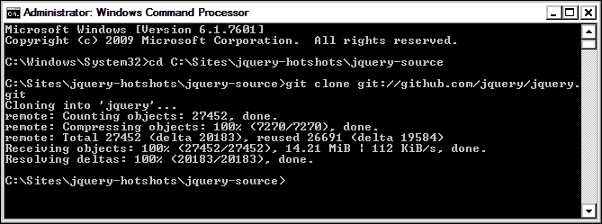
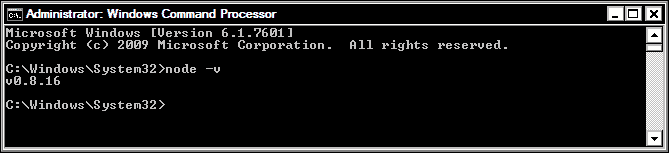
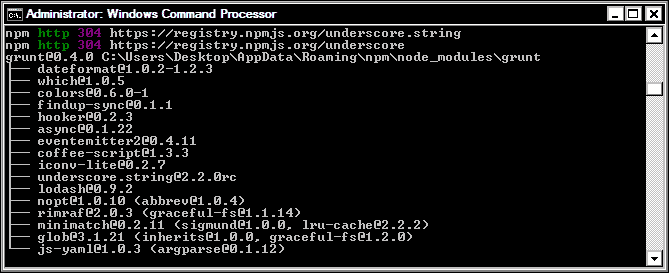
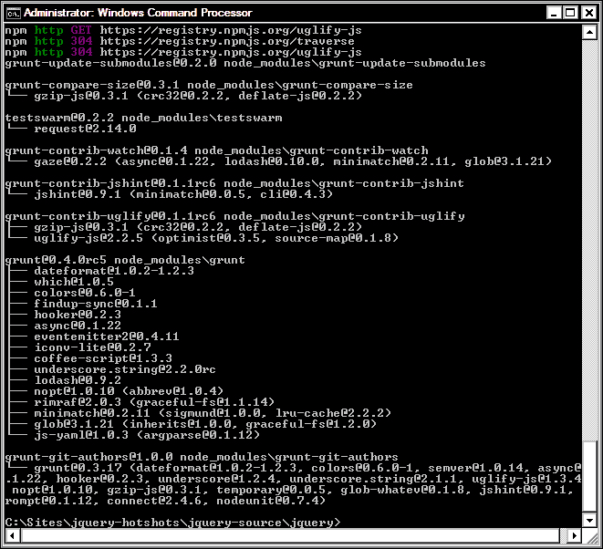
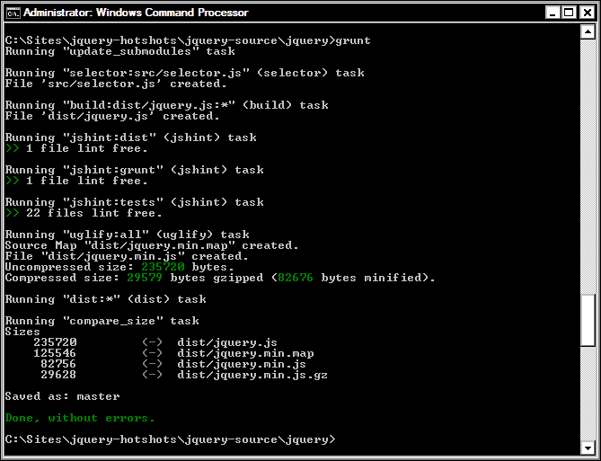
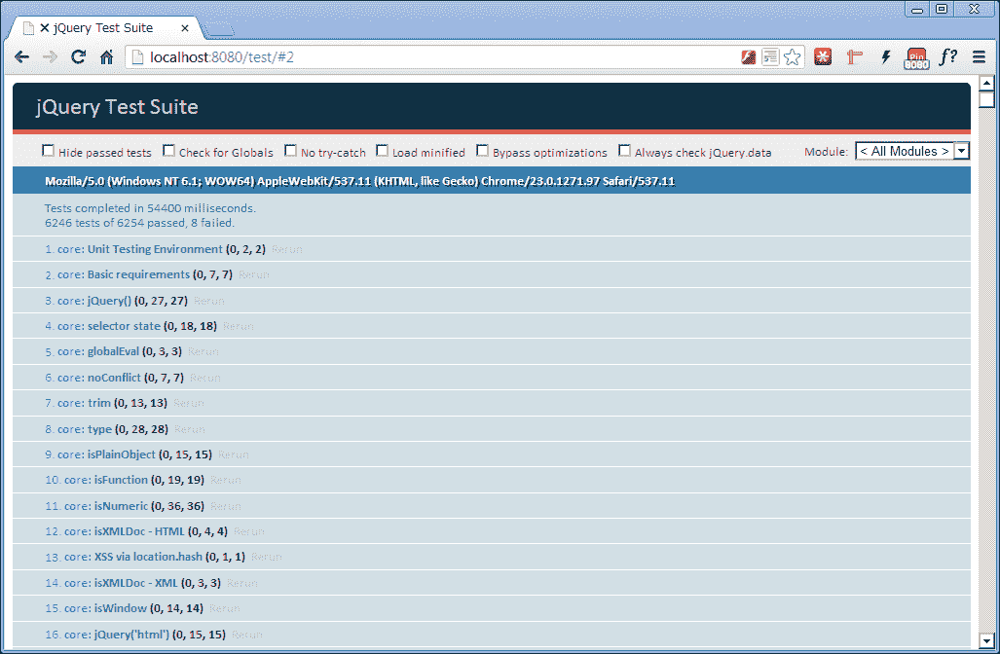

# 七、构建自己的 jQuery

随着 jQuery 的 1.8 版本的发布，一些新的东西被引入了开发社区一段时间以来一直想要的东西——构建只包含给定任务所需功能的 jQuery 自定义版本的能力。

# 任务简报

在这个项目中，我们将设置使用 jQuery 的构建工具所需的环境。我们将看到我们需要使用哪些其他软件，如何运行构建工具本身，以及构建工具的输出是什么。

## 为什么太棒了？

虽然有人说他们在构建的每个站点中都使用 jQuery 是很常见的（我通常就是这样），但我希望很少有人说他们在每个项目中使用完全相同的 jQuery 方法，或者说他们使用了大量可用的方法和它提供的功能。

为了适应移动空间，需要尽可能大幅度地减小文件大小，例如，**Zepto**等微框架的兴起，以大大减小的大小提供了大量 jQuery 功能，这促使 jQuery 提供了一种减肥方法。

从 jQuery1.8 开始，我们现在可以使用正式的 jQueryBuild 工具来构建我们自己的自定义版本的库，这样我们就可以通过只选择我们需要的功能来最小化库的大小。

### 注

有关 Zepto 的更多信息，请参阅[http://zeptojs.com/](http://zeptojs.com/) 。

## 你的热门目标

为了成功完成本项目，我们需要完成以下任务：

*   安装 Git 和 Make
*   安装 Node.js
*   安装 Grunt.js
*   配置环境
*   构建自定义 jQuery
*   使用 QUnit 运行单元测试

## 任务清单

我们将使用 Node.js 来运行构建工具，因此您现在应该下载该工具的副本。节点网站（[http://nodejs.org/download/](http://nodejs.org/download/) 有一个适用于 64 位和 32 位版本 Windows 的安装程序，以及一个 Mac OS X 安装程序。它还具有适用于 MacOSX、Linux 和 SunOS 的二进制文件。下载并安装适用于您的操作系统的相应版本。

jQuery 的官方构建工具（尽管它除了构建 jQuery 之外还可以做很多事情）是**Grunt.js，**由*Ben Alman*编写。我们不需要下载，因为它是通过**节点包管理器**（**NPM**安装的。我们将在项目的后面详细介绍这个过程。

### 注

有关 Grunt.js 的更多信息，请访问官方网站[http://gruntjs.com](http://gruntjs.com) 。

首先，我们需要建立一个本地工作区。我们可以在根项目文件夹中创建一个名为`jquery-source`的文件夹。这是克隆 jQuery Github 存储库时存储 jQuery 源代码的地方，也是 Grunt 构建最终版本 jQuery 的地方。

# 安装 Git 和 Make

我们需要安装的第一件事是 Git，我们需要它来将 jQuery 源代码从 Github 存储库克隆到我们自己的计算机上，以便我们可以使用源文件。我们还需要一个名为 Make 的东西，但我们只需要在 Mac 平台上安装它，因为当安装 Git 时，它会自动安装在 Windows 上。

### 提示

由于我们将创建的文件仅供我们自己使用，并且我们不希望通过将代码推回到存储库来为 jQuery 做出贡献，因此我们不需要担心在 Github 上设置帐户。

## 准备起飞

首先我们需要下载 Git 和 Make 的相关安装程序。根据您是在 Mac 还是 Windows 平台上开发，需要不同的应用。

### Mac 开发者

Mac 用户可以访问[http://git-scm.com/download/mac](http://git-scm.com/download/mac) 用于 Git。

接下来我们可以安装 Make。Mac 开发者可以通过安装 XCode 来实现这一点。可从[下载 https://developer.apple.com/xcode/](https://developer.apple.com/xcode/) 。

### Windows 开发者

Windows 用户可安装**msysgit**，可访问[获取 https://code.google.com/p/msysgit/downloads/detail?name=msysGit-fullinstall-1.8.0-preview20121022.exe](https://code.google.com/p/msysgit/downloads/detail?name=msysGit-fullinstall-1.8.0-preview20121022.exe)。

## 启动推进器

安装程序下载后，运行它们以安装应用。出于本任务的目的，安装程序选择的默认值应该可以。首先，我们应该安装 Git（或 Windows 上的 msysgit）。

### Mac 开发者

Mac 开发人员只需运行 Git 安装程序即可将其安装到系统中。完成后，我们可以安装 XCode。我们所需要做的就是运行安装程序，Make 以及其他一些工具将被安装并准备就绪。

### Windows 开发者

msysgit 的完整安装程序完成后，您应该会看到一个命令行界面（CLI）窗口（标题为 MINGW32），表明您可以进行黑客攻击。然而，在进行黑客攻击之前，我们需要编译 Git。

为此，我们需要运行一个名为`initialize.sh`的文件。在 MINGW32 窗口中，`cd`进入`msysgit`目录。如果允许将其安装到默认位置，则可以使用以下命令：

```js
cd C:\\msysgit\\msysgit\\share\\msysGit

```

一旦我们进入正确的目录，我们就可以在 CLI 中运行`initialize.sh`。与安装一样，此过程可能需要一些时间，因此请耐心等待 CLI 在`$`字符处返回闪烁的光标。

### 注

以这种方式编译 Git 需要 Internet 连接。

Windows 开发者需要确保`Git.exe`和 MINGW 资源可以通过系统的`PATH`变量访问。可通过进入**控制面板****系统****高级系统设置****环境变量**进行更新。

在对话框底部，双击**路径**并将以下两条路径添加到`bin`文件夹中的`git.exe`文件中，该文件夹本身位于`msysgit`文件夹内的一个目录中，无论您选择在何处安装它：

*   `;C:\msysgit\msysgit\bin;`
*   `C:\msysgit\msysgit\mingw\bin;`

### 提示

**小心更新路径！**

您必须确保`Git.exe`的路径用分号与其他路径变量分开。如果在将路径添加到`Git.exe`之前路径没有以分号结尾，请确保添加一个分号。不正确地更新路径变量可能会导致系统不稳定和/或数据丢失。为了说明这一点，我在上一个代码示例的开头显示了一个分号。

一旦路径被更新，我们就应该能够使用常规命令提示符来运行 Git 命令。

### 安装后任务

在终端或 Windows 命令提示符（为了简洁起见，从现在开始，我将两者简单地称为 CLI）窗口中，我们应该首先`cd`进入我们在项目开始时创建的`jquery-source`文件夹。根据本地开发文件夹的位置，此命令的外观如下所示：

```js
cd c:\jquery-hotshots\jquery-source

```

要克隆 jQuery 存储库，请在 CLI 中输入以下命令：

```js
git clone git://github.com/jquery/jquery.git

```

同样，在 CLI 返回闪烁的光标以指示流程已完成之前，我们应该在 CLI 上看到一些活动。

根据您正在开发的平台，您应该看到如下屏幕截图：



## 目标完成-小型任务汇报

我们安装了 Git，然后使用它将 jQueryGithub 存储库克隆到此目录中，以获得 jQuery 源代码的新版本。如果您习惯于 SVN，克隆存储库在概念上与签出存储库相同。

同样，这些命令的语法在 Mac 和 Windows 系统上非常相似，但请注意，在使用 Windows 时，我们需要如何避开路径中的反斜杠。完成后，我们应该在`jquery-source`目录中创建一个名为`jquery`的新目录。

如果我们进入这个目录，还有一些目录，包括：

*   `build`：这个目录被构建工具用来构建 jQuery
*   `speed`：此目录包含基准测试
*   `src`：此目录包含所有编译在一起以生成 jQuery 的单个源文件
*   `Test`：此目录包含 jQuery 的所有单元测试

它还有一系列不同的文件，包括：

*   许可和文档，包括 jQuery 的作者和为项目做出贡献的指南
*   特定于 Git 的文件，如`.gitignore`和`.gitmodules`
*   特定于 Grunt 的文件，如`Gruntfile.js`
*   用于测试和代码质量目的的 JSHint

Make 不是我们需要直接使用的东西，但是当我们构建 jQuery 源代码时，Grunt 将使用它，所以它需要出现在我们的系统中。

# 安装 Node.js

Node.js 是一个运行使用 JavaScript 构建的服务器端应用的平台。例如，创建使用回调函数接收和响应 HTTP 请求的 web 服务器实例非常简单。

服务器端 JS 与其更熟悉的客户端 JS 并不完全相同，但您会发现，在您熟悉和喜爱的相同舒适语法中有许多相似之处。在这个项目中，我们实际上不会编写任何服务器端 JavaScript——我们只需要运行 Grunt.js 构建工具。

## 准备起飞

要获得适合您平台的安装程序，请访问 Node.js 网站[http://nodejs.org](http://nodejs.org) 点击下载按钮。如果支持，应自动检测平台的正确安装程序。

## 启动推进器

在 Windows 或 Mac 平台上安装 Node 是一个简单的过程，因为两者都有安装程序。此任务将包括运行安装程序（显然很简单），以及使用 CLI 测试安装。

在 Windows 或 Mac 平台上，运行安装程序，它将引导您完成安装过程。我发现默认选项在大多数情况下都很好。与前面一样，我们还需要更新`Path`变量以包括节点和节点的包管理器 NPM。这些目录的路径在不同平台之间会有所不同。

### Mac

Mac 开发者应检查`$PATH`变量是否包含对`usr/local/bin`的引用。我发现这已经在我的`$PATH`中了，但是如果你发现它不存在，你应该添加它。

### 注

有关更新`$PATH`变量的更多信息，请参阅[http://www.tech-recipes.com/rx/2621/os_x_change_path_environment_variable/](http://www.tech-recipes.com/rx/2621/os_x_change_path_environment_variable/) 。

### 窗户

Windows 开发人员将需要以与之前相同的方式，通过以下路径更新`Path`变量：

*   `C:\Program Files\nodejs\;`
*   `C:\Users\Desktop\AppData\Roaming\npm;`

### 注

Windows 开发人员可能会发现`Path`变量已经包含节点的条目，因此可能只需要将路径添加到 NPM。

## 目标完成-小型任务汇报

一旦安装了节点，我们将需要使用 CLI 与之交互。要验证节点是否正确安装了，请在 CLI 中键入以下命令：

```js
node -v

```

CLI 应报告正在使用的版本，如下所示：



我们可以通过运行以下命令以相同的方式测试 NPM：

```js
npm -v

```

# 安装 Grunt.js

在这个任务中，我们需要安装 Grunt.js，这与节点安装一样，非常快速和容易。我们甚至不需要手动下载任何东西，像以前一样，相同的命令应该可以在 Mac 或 Windows 系统上运行，只需进行非常小的调整。

## 启动推进器

我们需要使用**节点包管理器****NPM**进行安装，可以通过运行以下命令进行安装（注意节点本身不能运行）：

```js
npm install -g grunt-cli

```

### 注

Mac 用户可能需要在命令开始时使用`superuser do`：

```js
sudo –s npm install –g grunt

```

准备好等待几分钟。同样，当 Grunt 需要的资源被下载和安装时，我们应该看到很多活动。安装完成后，提示将返回闪烁的光标。CLI 应显示为以下屏幕截图，具体取决于您在哪个平台上开发：



## 目标完成-小型任务汇报

如果一切都按照计划进行（除非您的系统有问题，否则通常应该如此），您应该会在 CLI 中看到很多活动，而 Grunt 及其依赖项是通过 NPM 全局下载和安装的，一旦完成，Grunt 将被安装并准备好使用。

### 提示

使用 NPM 自动下载和安装软件包需要 Internet 连接。

要验证 Grunt 是否已正确安装，可以在 CLI 中键入以下命令：

```js
grunt -version

```

这将输出 Grunt 的当前版本，并且应该可以从任何目录工作，因为 Grunt 是全局安装的。

## 机密情报

除了构建 jQuery 的自定义版本外，Grunt 还可以用于创建几个不同的通用项目。我们首先选择以下项目类型之一：

*   `gruntfile`
*   `commonjs`
*   `jquery`
*   `node`

我们可以运行内置的`init`任务并指定其中一个项目，Grunt 将继续并建立一个包含该项目常用资源的框架项目。

例如，运行`jquery init`任务将为创建 jQuery 插件设置一个工作目录。在目录中，Grunt 将为源脚本文件和单元测试创建文件夹，并创建一系列文件，包括一个`package.json`文件。

可能在某个时候，所有新的 jQuery 插件都需要以 Grunt 在创建此项目类型时构造工作目录的方式进行构造，因此 Grunt 将成为任何 jQuery 插件开发人员的宝贵、省时的工具。

# 配置环境

在准备构建我们自己的 jQuery 版本之前，我们只需要做几件事。我们还可以通过构建完整版本的 jQuery 来测试我们的安装和配置，以测试一切是否正常工作。

## 准备起飞

我们需要安装一些额外的 Grunt 依赖项，以便使用从 Github 克隆的源文件创建 jQuery 脚本文件。项目还使用了一系列 NPM 模块，这些模块也需要安装。幸运的是，NPM 可以为我们自动安装所有东西。

## 启动推进器

在构建 jQuery 源代码之前，我们需要在`jquery`源文件夹中安装一些额外的 Grunt 依赖项。我们可以使用 NPM 执行此操作，因此可以在 CLI 中输入以下命令：

```js
npm install 

```

### 注

在运行`install`命令之前，请确保您已经使用`cd`命令导航到`jquery`目录。

在运行`install`命令之后，CLI 中应该有很多活动，并且在流程结束时，CLI 应该显示如下屏幕截图：



为了测试所有都能正常工作，我们可以构建完整版本的 jQuery。只需在 CLI 中运行`grunt`命令：

```js
grunt

```

### 注

如果此时您收到任何错误或警告，则说明某些内容尚未正确安装或配置。进程失败的原因可能有很多，因此最好的办法是卸载所有已安装的内容，然后重新启动进程，确保所有步骤都严格执行。

同样，我们应该在 CLI 上看到很多活动，以指示正在发生的事情：



## 目标完成-小型任务汇报

安装过程完成后，我们会发现节点依赖项已安装到`jquery`目录中名为`node_modules`的目录中。此文件夹中包含 Grunt 为此特定项目所需的任何其他文件。

为了测试一切，我们使用`grunt`命令运行 jQuery 的默认构建任务。此任务将执行以下操作：

*   读取所有 jQuery 源文件
*   为任务的输出创建一个`/dist`目录
*   建立`jquery.js`分发文件
*   使用`jshint`删除分发文件
*   运行单元测试
*   构建分发文件的源映射
*   建立`jquery.min.js`分发文件

完整文件的脚本文件应为 230 KB，`.min`文件的脚本文件应为 81 KB，尽管随着 jQuery 版本号的增加，这些数字可能有所不同。

# 构建自定义 jQuery

在本任务中，我们将构建一个自定义版本的 jQuery，它不会将构成 jQuery“完整”版本的所有不同模块组合到一个我们通常从 jQuery 站点下载的文件中，就像我们在上一个任务结束时构建的文件一样，它将只包含核心模块。

## 启动推进器

现在我们可以构建 jQuery 的自定义版本。要构建 jQuery 的基本版本，省略所有非核心组件，我们可以在 CLI 中输入以下命令：

```js
grunt custom:-ajax,-css,-deprecated,-dimensions,-effects,-offset

```

## 目标完成-小型任务汇报

一旦我们有了源代码并配置了本地环境，我们就可以构建一个只包含核心组件的 jQuery 自定义版本，而忽略所有可选组件。

在本例中，我们排除了所有可选组件，但我们可以排除其中任何一个组件，或它们的任意组合，以生成一个只需要它所需大小的脚本文件。

如果我们现在检查`/dist`目录，我们应该会发现完整的 fat 脚本文件现在是 159KB，而`.min`版本只有 57KB，为我们节省了大约 30%的文件大小；几分钟的工作还不错！

### 注

项目功能或范围的更改可能需要重新生成源文件并包含以前排除的模块。排除后，如果不重新生成，则无法将可选模块添加到生成的文件中。

## 机密情报

随着 jQuery 的发展，尤其是 2.0 里程碑的通过，越来越多的 jQuery 组件将作为可选组件公开给构建工具，因此可以排除库中更广泛的部分。

虽然在撰写本文时，我们在文件大小方面的节省可能会被以下事实所抵消：我们的大多数访问者的缓存中不会有我们定制的 jQuery 版本，因此必须下载它，也许有一天，我们能够将文件的大小缩小到如此之小，以至于下载我们的 super light 脚本文件比从缓存加载完整的源代码更高效。

# 使用 QUnit 运行单元测试

QUnit 是 jQuery 的官方测试套件，包含在我们在项目早期从 Git 克隆的源代码中。如果我们查看一下`jquery`文件夹中的 test 文件夹，就会发现有很多单元测试是为了测试生成 jQuery 的不同组件而编写的。

我们可以对 jQuery 的各个组件运行这些测试，以查看 QUnit 需要的环境，并了解使用它测试 JavaScript 文件有多容易。对于这个任务，我们需要安装一个 web 服务器和 PHP。

### 注

有关 QUnit 的更多信息，请参见[中的文档 http://qunitjs.com](http://qunitjs.com) 。

## 准备起飞

Mac 开发人员应该已经具备了通过 web 服务器运行 QUnit 所需的一切，因为 Mac 计算机已经安装了 Apache 和 PHP。不过，Windows 开发人员可能需要进行一些设置。

在本例中，web 服务器有两个选项，Apache 或 IIS。两者都支持 PHP。希望使用 Apache 的开发人员可以安装类似于**WAMP**（**Windows Apache Mysql PHP**的东西来安装和配置 Apache，并将 Mysql 和 PHP 作为模块安装。

要下载和安装 WAMP，请访问 WAMP 服务器网站的**下载**部分（[http://www.wampserver.com/en/](http://www.wampserver.com/en/) ）。

为您的平台选择合适的安装程序并运行它。这应该安装和配置所有必要的东西。

希望使用 IIS 的用户可以通过控制面板**程序和功能**页面的**添加/删除 Windows 组件**区域进行安装（在这种情况下需要 Windows 安装光盘），或者使用**Web 平台安装程序**（**WPI**），可从[下载 http://www.microsoft.com/web/downloads/platform.aspx](http://www.microsoft.com/web/downloads/platform.aspx) 。

下载并运行安装程序。一旦启动，搜索 IIS 并让应用安装它。安装后，搜索 PHP 并通过 WPI 安装。

要使用 web 服务器和 PHP 运行 QUnit，您需要将源文件从项目文件夹中的`jquery`目录复制到 web 服务器用于从中提供文件的文件夹中，或者将 web 服务器配置为从`jquery`目录提供文件。

在 Apache 上，我们可以通过编辑`httpd.conf`文件（在“开始”菜单中应该有一个条目）来配置默认目录（浏览器请求时提供页面的目录）。向下阅读配置文件，直到找到默认目录的行，并将其更改为指向项目文件夹中的`jquery`目录。

在 IIS 上，我们可以使用 IIS 管理器添加新网站。右键点击左侧**连接**窗格中的**站点**，选择**添加网站…**。在打开的对话框中填写详细信息，我们就可以开始了。

## 启动推进器

要运行测试，我们只需在浏览器中使用`localhost:8080`（或配置的主机名/端口）访问`/test`目录：

```js
localhost:8080/test
```

测试应显示在以下屏幕截图中：



## 目标完成-小型任务汇报

当在浏览器中访问测试套件的 URL 时，QUnit 将运行为 jQuery 编写的所有单元测试。目前有 6000 多个测试用于 jQuery 的完整构建，约 4000 个测试用于排除所有可选模块的自定义构建。

您可能会发现有些测试失败。别担心，这是正常的，原因是我们从 Git 获得的 jQuery 的默认版本将是最新的开发版本。在我写这篇文章时，jQuery 的当前版本是 1.8.3，但从 Git 克隆的版本是 2.0.0pre。

为了解决这个问题，我们可以切换到当前的稳定分支并从那里进行构建。因此，如果我想获得 1.8.3 版，可以在 CLI 中使用以下命令：

```js
git checkout 1.8.3

```

然后我们可以再次构建源代码，运行 QUnit，所有测试都应该通过。

### 注

签出 jQuery 源代码的另一个版本后，我们需要在`jquery`目录中运行`npm install`来重新安装节点依赖项。

## 机密情报

单元测试是前端开发人员并不总是严格遵循的过程，但是一旦您的应用在规模和复杂性上超过了一个粗略的阈值，或者在团队环境中工作时，单元测试对于维护来说是必不可少的，因此最好至少学习基础知识。

QUnit 使编写 JavaScript 单元测试变得简单。它以一个简单的 API 为特色，该 API 基于我们可以用简单函数证明的断言的概念。QUnit 的 API 包括我们可以用来做出这些断言的方法，包括：

*   `equal()`
*   `notEqual()`
*   `ok()`

这使得检查变量是否等于某个特定值或函数的返回值是否不等于某个特定值变得容易，依此类推。

QUnit 中的测试使用全局`test()`方法构建，该方法接受两个参数；描述测试的字符串和调用以执行测试的函数：

```js
test("Test the return value of myCustomMethod()", function() {
    //test code here
});
```

在函数中，我们可以使用一个或多个断言来检查我们正在测试的方法或函数执行的某些操作的结果：

```js
var value = myCustomMethod();
equal(value, true, "This method should return true");
```

`equal()`方法检查第一个参数和第二个参数是否相等，最后一个参数是一个描述我们期望发生的事情的字符串。

### 提示

如果打开`jquery/test/unit`目录中的一些脚本文件，就很容易看到测试的结构。

QUnit 网站上的文档非常优秀。它不仅清晰、简洁地描述了 API，还包含了大量关于单元测试概念的信息，因此对于那些刚刚接触单元测试的人来说，这是一个很好的起点。

在该站点上，您还可以找到在 Grunt 之外运行 QUnit 所需的源文件，以及可用于在浏览器中运行测试套件的 HTML 模板页面。

# 任务完成

在这次任务中，我们不仅学习了如何通过排除我们不需要的组件来构建 jQuery 的自定义版本，以及如何运行 jQuery 的单元测试套件，而且，也许更重要的是，我们还学习了如何建立一个体面的构建环境，以编写干净、无 lint 和错误的应用级 JavaScript。

# 你准备好了吗？热门挑战

我们已经学习了如何构建自己的 jQuery，并且排除了最大数量的组件，因此在撰写本文时，我们已经没有什么可以做的了。

如果您是在 jQuery 的 1.9 版发布后阅读本文的，那么可能有更多的组件可以排除，或者有其他构建 jQuery 的技术，因此，为了真正巩固您对构建过程的理解，请构建一个新的自定义构建，该构建还可以排除任何新的可选组件。

如果没有任何新的可选组件，我建议您花一些时间为您编写的任何自定义脚本编写 QUnit 测试。这个想法是编写一个复制 bug 的测试。然后，您可以修复错误并观看测试通过。