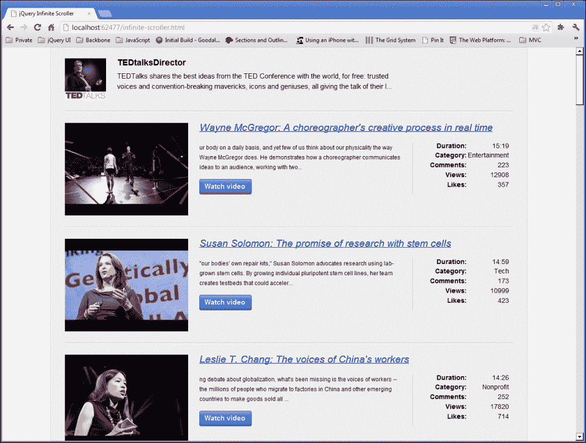
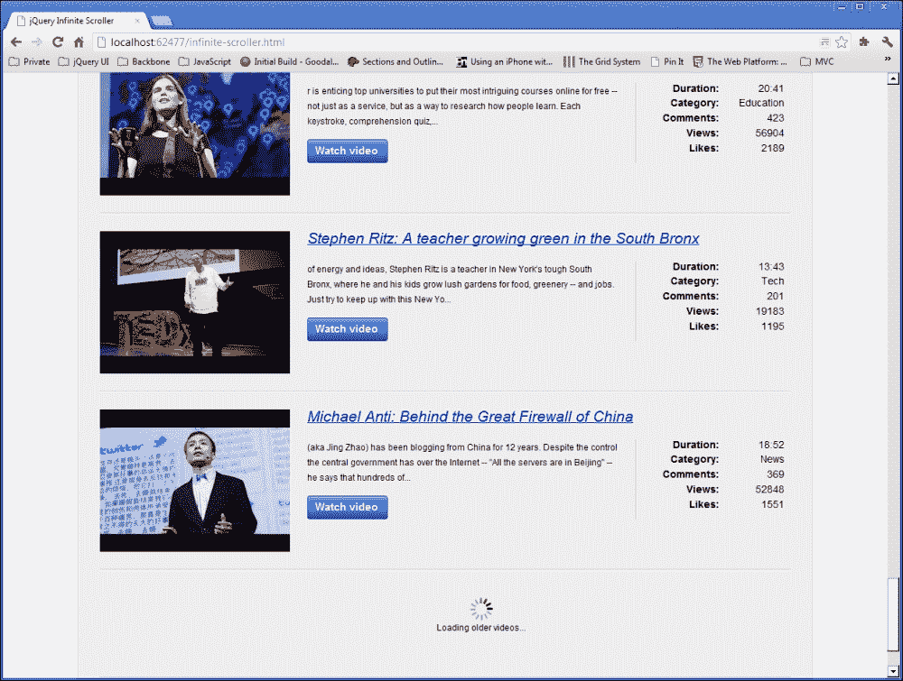

# 八、使用 jQuery 无限滚动

无限滚动是许多流行网站采用的一种技术，它一开始会将页面上加载的数据量降至最低，然后当用户滚动到页面底部时，会逐渐加载更多数据。你可以在 Facebook 或 Twitter 等网站上看到这种效果。

# 任务简报

在这个项目中，我们将使用 jQuery 构建一个无限滚动系统，该系统模仿在前面提到的站点上看到的效果。我们将请求一些数据并将其显示在页面上。一旦用户滚动到页面底部，我们将再次请求下一页的数据，以此类推，用户继续滚动。

一旦我们构建了无限滚动系统，我们应该得到类似于以下屏幕截图的东西：



## 为什么太棒了？

如果你有大量的数据要显示，并且可以很容易地按时间倒序排列，那么使用无限滚动技术是一种简单的方法，可以通过渐进式披露来最大化页面的用户体验——以增量方式向用户显示更多信息。

首先可以显示一小部分数据，这将加快页面加载速度，并防止访问者被数据淹没，从而逐渐增加用户交互。

我们将在本项目中使用的数据将是上传到 YouTube 上的 TEDTalks 频道的 JSON 格式视频列表。

### 注

记住，JSON 是一种轻量级、基于文本的数据格式，非常适合跨网络传输。有关 JSON 的更多信息，请参阅[http://www.json.org/](http://www.json.org/) 。

在这个频道上可以找到成千上万的视频，因此它为我们的项目提供了一个很好的测试平台。可以按时间顺序排序的数据为无限滚动条奠定了良好的基础。

### 注

TEDTalks 频道可直接在 YouTube 网站[上观看 http://www.youtube.com/user/tedtalksdirector](http://www.youtube.com/user/tedtalksdirector) 。

## 你的热门目标

本项目将分解为以下任务：

*   准备基础页
*   获取初始提要
*   显示初始结果集
*   处理滚动到页面底部的操作

## 任务清单

我们可以像在前面的一些示例中一样链接到托管的版本的 JsRender，但在本项目中，我们将使用一个名为 imagesLoaded 的方便的 jQuery 插件，它允许我们在所有带有选定容器的图像加载完毕后启动回调函数。

imagesLoaded 插件可从[下载 https://github.com/desandro/imagesloaded](https://github.com/desandro/imagesloaded) 并且应该保存在我们项目的`js`目录中。

# 准备基础页面

在本任务中，我们将设置我们将在整个项目中使用的文件，并准备无限滚动条将驻留的底层页面。

## 准备起飞

像往常一样，我们将为此项目使用自定义样式表和自定义脚本文件，所以让我们先添加它们。创建一个名为`infinite-scroller.js`的新 JavaScript 文件，并将其保存在`js`目录中。然后创建一个名为`infinite-scoller.css`的新样式表，并将其保存在`css`目录中。最后，将`template.html`文件的副本保存在根项目文件夹中，并将其命名为`infinite-scroller.html`。

## 启动推进器

示例页面使用的基础标记将是最小的–我们将使用的许多元素将由我们的模板动态生成，我们也可以将其添加到此任务中。

首先，我们应该在 HTML 页面中添加对新文件的引用。首先将样式表的`<link>`元素添加到`infinite-scroller.html`的`<head>`中，直接在`common.css`链接之后：

```js
<link rel="stylesheet" href="css/infinite-scroller.css" />
```

接下来，我们可以链接到两个新的 JavaScript 文件。直接在 jQuery 后面添加以下`<script>`元素：

```js
<script src="http://borismoore.github.com/jsrender/jsrender.js">
</script>
<scriptsrc="js/jquery.imagesloaded.min.js"></script>
<scriptsrc="js/infinite-scroller.js"></script>
```

我们还需要添加一个简单的容器来呈现数据。将以下代码添加到页面的`<body>`中：

```js
<div id="videoList"></div>
```

现在我们可以添加我们将使用的模板。在这个项目中，我们将使用两个模板——一个用于渲染外部容器和用户数据，它们将被渲染一次，另一个用于渲染视频列表，我们可以根据需要重复使用。

与之前一样，它们将位于页面`<body>`中的`<script>`元素中。在现有`<script>`元素之前，添加以下新模板：

```js
<script id="containerTemplate" type="text/x-jsrender">
    <section>
        <header class="clearfix">
            <imgsrc="{{>avatar}}" alt="{{>name}}" />
            <hgroup>
                <h1>{{>name}}</h1>
                <h2>{{>summary.substring(19, 220)}}</h2>
            </hgroup>
        </header>
        <ul id="videos"></ul>
    </section>
</script>
```

现在查看视频模板：

```js
<script id="videoTemplate" type="text/x-jsrender">
    <li>
        <article class="clearfix">
            <header>
                <a href="{{>content[5]}}" title="Watch video">
                    <imgsrc="{{>thumbnail.hqDefault}}" alt="{{>title}}" />
                </a>
                <cite>
                    <a href="{{>content[5]}}" 
                    title="Watch video">{{>title}}</a>
                </cite>
            </header>
            <p>
                {{>~Truncate(12, description)}}
                    <a class="button" href="{{>content[5]}}" 
                    title="Watch video">Watch video</a>
            </p>
            <div class="meta">
                <dl>
                    <dt>Duration:</dt>
                    <dd>{{>~FormatTime(duration)}}</dd>
                    <dt>Category:</dt>
                    <dd>{{>category}}</dd>
                    <dt>Comments:</dt>
                    <dd>{{>commentCount}}</dd>
                    <dt>Views:</dt>
                    <dd>{{>viewCount}}</dd>
                    <dt>Likes:</dt>
                    <dd>{{>likeCount}}</dd>
                </dl>
            </div>
        </article>
    </li>
</script>
```

我们现在也可以为这些元素添加样式。在`infinite-scroller.css`中，添加以下选择器和规则：

```js
section { width:960px; padding-top:20px; margin:auto; }
section { 
    width:960px; padding:2em 2.5em 0; 
    border-left:1px solid #ccc; border-right:1px solid #ccc; 
    margin:auto; background-color:#eee; 
}
section> header { 
    padding-bottom:2em; border-bottom:1px solid #ccc; 
}
img, hgroup, hgroup h1, hgroup h2 { float:left; }
hgroup { width:80%; }
headerimg { margin-right:2em; }
hgroup h1 { font-size:1.5em; }
hgroup h1, hgroup h2 { width:80%; }
hgroup h2 { 
    font-weight:normal; margin-bottom:0; font-size:1.25em;
    line-height:1.5em; 
}
ul { padding:0; }
li { 
    padding:2em 0; border-top:1px solid #fff; 
    border-bottom:1px solid #ccc; margin-bottom:0; 
    list-style-type:none; 
}
article header a { 
    display:block; width:27.5%; margin-right:2.5%; float:left; }
aimg { max-width:100%; }
article cite { 
    width:70%; margin-bottom:10px; float:left; 
    font-size:1.75em; 
}
article cite a { width:auto; margin-bottom:.5em; }
article p { 
    width:45%; padding-right:2.5%; 
    border-right:1px solid #ccc; margin:0 2.5% 2em 0;
    float:left; line-height:1.75em; 
}
article .button { display:block; width:90px; margin-top:1em; }
article dl { width:19%; float:left; }
article dt, article dd { 
    width:50%; float:left; font-size:1.15em; text-align:right; 
} 
article dt { margin:0 0 .5em; clear:both; font-weight:bold; }

li.loading{ height:100px; position:relative; }
li.loading span { 
    display:block; padding-top:3em; margin:-3em 0 0 -1em; 
    position:absolute; top:50%; left:50%; text-align:center;
    background:url(../img/ajax-loader.gif) no-repeat 50% 0; 
}
```

### 注

本项目中使用的`ajax-loader.gif`图像可以在本书附带的代码下载中找到。

## 目标完成-小型任务汇报

因此，实际上整个页面都是根据我们添加到页面`<body>`中的模板构建的，除了一个空的`<div>`将为我们提供一个容器来呈现数据。该模板不仅包含用于视频列表的标记，还包含有关我们正在显示其视频的用户的信息。

在第一个模板中，数据的外部容器是一个`<section>`元素。其中有一个`<header>`，显示有关用户的信息，包括其个人资料图片、姓名和个人简历。

YouTube 为指定用户返回的实际 bio 可能相当长，因此我们将使用 JavaScript`substring()`函数返回此摘要的缩短版本。此函数传递两个参数；第一个是开始复制的字符，第二个是结束复制的字符。

在第二个模板中，视频的实际列表将显示在第一个模板中添加的`<ul>`元素中，每个视频占据一个`<li>`。在每个`<li>`中，我们有一个`<article>`元素，它是一个适合独立内容单元的容器。

在`<article>`中，我们有一个`<header>`，其中包含有关视频的一些关键信息，如视频标题和缩略图。在`<header>`之后，我们在`<p>`元素中显示视频的简短摘要。我们还使用缩短助手函数`Truncate()`，从字符 12 开始。

最后，我们使用`<dl>`显示视频的一些元信息，如播放次数、喜欢次数和视频持续时间。

我们使用另一个助手函数来显示视频中的持续时间，`FormatTime()`。YouTube 以秒为单位返回视频的长度，因此我们可以将其转换为格式良好的时间字符串。

我们使用`>`字符对插入页面的任何数据进行 HTML 编码。作为一种安全措施，最好这样做。

添加的 CSS 纯粹是表现性的；仅用于以列表格式布置页面，并使其看起来稍微有趣和美观。您可以随意更改布局样式或元素主题的任何方面。

## 机密情报

关注 SEO 的人会意识到，几乎完全由 AJAX 交付的内容构建的页面不太可能在搜索结果中占据好位置。传统上，这几乎肯定是正确的，但现在我们可以使用 HTML 历史 API 的可怕的`pushState()`方法来提供一个动态网站，该网站完全可以由搜索引擎索引。

对`pushState()`的完整描述超出了本书的范围，但是有很多很好的例子和教程。许多人认为，Mozilla 开发人员网络上的文档是历史 API 的权威指南，其中包括`pushState()`部分。您可以在[处查看文档 https://developer.mozilla.org/en-US/docs/DOM/Manipulating_the_browser_history](https://developer.mozilla.org/en-US/docs/DOM/Manipulating_the_browser_history) 。

# 获取初始提要

在本任务中，我们将重点关注获取初始数据集，以便在页面首次加载时创建页面。我们需要编写代码，以便获取第一页数据的函数可用于任何一页数据，以便我们以后在项目中使用它。

## 准备起飞

我们可以使用 jQuery 提供的标准`document ready`快捷方式，就像我们在以前的许多项目中一样。我们可以在前面创建的`infinite-scroller.js`文件中添加以下代码：

```js
$(function () {

    //rest of our code will go here...  

});
```

## 启动推进器

首先，我们可以添加从 YouTube 检索数据的代码。将前面代码段中的注释替换为以下内容：

```js
var data = {},
    startIndex = 1;

var getUser = function () {
    return $.getJSON("http://gdata.youtube.com/feeds/api/users/tedtalksdirector?callback=?", {
        v: 2,
        alt: "json"
    }, function (user) {
        data.userdata = user.entry;
    });
};

var getData = function () {
    return $.getJSON("https://gdata.youtube.com/feeds/api/videos?callback=?", {
        author: "tedtalksdirector",
        v: 2,
        alt: "jsonc",
        "start-index": startIndex
    }, function (videos) {
        data.videodata = videos.data.items;
    });
};
```

接下来我们需要稍微处理一下响应。两个 AJAX 请求完成后，我们可以使用以下代码执行回调函数，该函数应直接添加在刚才添加的代码之后：

```js
$.when(getUser(), getData()).done(function () {
    startIndex+=25;

    var ud = data.userdata,
        clean = {};

    clean.name = ud.yt$username.display;
    clean.avatar = ud.media$thumbnail.url;
    clean.summary = ud.summary.$t;
    data.userdata = clean;
});
```

## 目标完成-小型任务汇报

我们首先定义了几个变量。第一个是一个空对象，我们将用 AJAX 请求的结果填充它。第二个是一个整数，表示我们希望获得的第一个视频的索引号。YouTube 视频不像常规 JavaScript 数组那样是基于零的，因此我们最初定义的变量值为`1`。

接下来，我们添加了两个用于获取数据的函数。第一个是请求获取我们将要显示其提要的用户的概要文件数据。当页面最初加载时，我们只会使用这个函数一次，但是您会看到为什么我们用这种方式将函数定义为变量非常重要。

第二个函数将被重用，因此将其存储在变量中是一种很好的方法，可以在我们希望获得新的视频数据页面时随时调用它。重要的是，这些函数都返回由`getJSON()`方法返回的`jqXHR`对象。

这两个请求都使用 jQuery 的`getJSON()`方法发出请求。在用户请求中，我们只需要设置`v`和`alt`查询参数，这些参数在传递给`getJSON()`的对象中设置为第二个参数。我们需要其配置文件数据的用户实际上是我们向其发出请求的 URL 的一部分。

此请求的回调函数只是将从请求接收到的`user.entry`对象的内容添加到我们的`data`对象的`userdata`属性中。

第二个请求需要稍微多一些配置。我们仍然将要使用的 API 版本设置为`v`参数，但这次我们将响应的格式设置为`jsonc`而不是`json`。在该请求的回调函数中，我们将视频数组存储在`data`对象的`videodata`属性中。

**JSON-C**在脚本中代表 JSON，是谷歌可以响应某些请求的格式。由于 Google 的 API 是如何设计的，所以 JSON-C 格式返回的数据通常比 JSON 格式返回的数据更轻量级，处理效率也更高。

我们需要使用的属性仅在使用此格式时返回。我们在请求用户数据时不使用它的唯一原因是，对于该特定查询没有 JSON-C 响应。

### 注

有关来自谷歌 API 的 JSON-C 响应的更多信息，请参阅[上的文档 https://developers.google.com/youtube/2.0/developers_guide_jsonc](https://developers.google.com/youtube/2.0/developers_guide_jsonc) 。

接下来，我们使用 jQuery 的`when()`方法来启动这两个请求，然后在解析两个`jqXHR`对象之后，使用`done()`方法执行回调函数。这就是为什么一次性使用的`getUser()`功能的结构与可重用的`getData()`功能相同的原因。

在`done()`的回调函数中，我们首先将`startIndex`变量增加 25，这样当我们发出另一个请求时，我们将得到下一个包含 25 个视频的“页面”。由于我们现在有了第一页数据，当我们稍后使用`getData()`函数时，我们将自动获得“下一页”结果。

### 注

自 jQuery1.5 以来，`when()`和`done()`方法是处理异步操作的首选方法。

此时，我们只需要对`userdata`对象进行一点处理。有一大堆我们不需要使用的数据，我们确实需要使用的一些数据隐藏在嵌套对象中，因此我们只需创建一个名为`clean`的新对象，并直接在该对象上设置我们需要的数据。

完成后，我们可以将干净的对象保存回`data`对象，覆盖原始`userdata`对象。这将使对象更容易在我们的模板中处理。

# 显示初始结果集

现在我们有了 YouTube 的 API 返回的数据，我们可以呈现我们的模板了。但是，为了呈现模板，我们需要添加用于格式化某些数据的帮助函数。在这个任务中，我们可以添加那些助手函数，然后呈现模板。

## 启动推进器

模板助手不需要驻留在`$.done()`回调函数中。我们可以在`infinite-scroller.js`中直接在该代码前面添加：

```js
var truncate = function (start, summary) {
        return summary.substring(start,200) + "...";
    },
    formatTime = function (time) {
        var timeArr = [],
            hours = Math.floor(time / 3600),
            mins = Math.floor((time % 3600) / 60),
            secs= Math.floor(time % 60);

        if (hours> 0) {
            timeArr.push(hours);
        }

        if (mins< 10) {
            timeArr.push("0" + mins);
        } else {
            timeArr.push(mins);
        }

        if (secs< 10) {
            timeArr.push("0" + secs);
        } else {
            timeArr.push(secs);
        } 

        return timeArr.join(":");
    };
```

接下来我们只需要注册 helper 函数。直接在前面的代码之后添加以下内容：

```js
$.views.helpers({
    Truncate: truncate, 
    FormatTime: formatTime
});
```

最后我们可以呈现我们的模板。我们需要一个可以从代码中的任何地方调用的函数，以便在以后发出进一步请求时使用。注册帮助器函数后添加以下代码：

```js
var renderer = function (renderOuter) {

    var vidList = $("#videoList");

    if (renderOuter) {
        vidList.append(
$("#containerTemplate").render(data.userdata));
    }
    vidList.find("#videos")
           .append($("#videoTemplate").render(data.videodata));
}
```

现在我们只需要在`$.done()`回调函数的末尾调用这个函数：

```js
renderer(true);
```

## 目标完成-小型任务汇报

我们的第一个助手函数`truncate()`非常简单。我们只返回函数作为参数接收的字符串的缩短版本。`substring()`函数有两个参数；第一个参数是字符串中开始复制的位置，第二个参数是要复制的字符数，我们将其固定在`200`。

为了显示字符串已被缩短，我们还将在返回字符串的末尾附加一个省略号，这就是为什么我们在这里使用 helper 函数，而不是像前面那样直接在模板中使用子字符串。

`formatTime()`辅助函数稍微复杂一些，但仍然相对简单。此函数将接收以秒为单位的时间，我们希望将其格式化为稍微好一点的字符串，显示小时（如果有）、分钟和秒。

我们首先创建一个空数组来存储字符串的不同组成部分。然后我们创建一些变量来保存我们要创建的时间字符串的小时、分钟和秒部分。

将总秒数除以 3600（一小时内的秒数），计算出时间。我们在上面使用`Math.floor()`，这样我们只能得到一个整数结果。我们需要稍微不同地计算分钟数，因为我们需要考虑小时数（如果有的话）。

我们首先使用模数运算符（`%`）删除任何小时数，然后将余数除以`60`，这将告诉我们总分钟数或计算小时数后的剩余分钟数。为了计算秒数，我们只需要再次使用模运算符和值`60`。

然后，我们使用一系列条件来确定要添加到数组中的变量。如果有任何时间（考虑到视频的性质，这不太可能），我们将它们推到阵列中。

如果少于`10`分钟，我们将`0`添加到分钟数中，然后将其推入数组。如果时间超过`10`分钟，我们只需将`mins`变量推入数组。在将`secs`变量推入数组之前，对其应用相同的逻辑。

此函数通过连接数组中的项并使用冒号作为分隔符来返回格式良好的时间。该字符串的格式为`H:MM:SS`或`MM:SS`，具体取决于视频的长度。然后，我们使用 JsRender 的`helpers`对象向模板注册了 helper 函数，该对象本身嵌套在`views`对象中，该对象由模板库添加到 jQuery 中。我们希望添加的 helper 函数被设置为对象文本中的值，其中键与模板中的函数调用匹配。

接下来，我们添加了一个可以调用的函数来呈现模板。`renderer()`函数采用单个参数，该参数是一个布尔值，指定是同时呈现容器模板和视频模板，还是仅呈现视频模板。在函数内部，我们首先缓存对视频列表外部容器的引用。

如果`renderOuter`参数有一个真实值（即如果它特别持有`true`值），我们呈现`containerTemplate`并将其附加到我们添加到页面`<body>`的空`<div>`中。然后我们呈现`videoTemplate`，在`containerTemplate`添加的`<ul>`中添加呈现的 HTML。

最后，我们第一次调用了我们的`renderer()`函数，将`true`作为参数传递，以呈现容器和初始视频列表。

# 处理滚动到页面底部

现在我们已经有了视频的第一页，我们想添加一个处理程序，用于监视窗口中的滚动事件，并检测页面何时被向右滚动到底。

## 启动推进器

首先，我们需要添加几个新的变量。更改文件顶部附近的第一组变量，使其显示如下：

```js
var data = {},
    startIndex = 1,
    listHeight = 0,
    win = $(window),
    winHeight = win.height();
```

现在我们需要更新我们的`renderer()`函数，以便在呈现模板时更新新的`listHeight`变量。在我们呈现`videoTemplate`的地方添加以下代码：

```js
vidList.imagesLoaded(function () {
    listHeight = $("#videoList").height();
});
```

接下来，我们可以为 scroll 事件添加一个处理程序。直接在`infinite-scroller.js`中的`when()`方法后添加以下代码：

```js
win.on("scroll", function () {

    if (win.scrollTop() + winHeight >= listHeight) {
        $("<li/>", {
            "class": "loading",
            html: "<span>Loading older videos...</span>"
        }).appendTo("#videos");

        $.when(getData()).done(function () {
            startIndex += 25;

            renderer();

            $("li.loading").remove();

        });
    }
}).on("resize", function() {
    winHeight = win.height();
});
```

我们使用微调器向用户显示正在检索更多数据。我们需要一些额外的样式来处理微调器的位置，因此我们还可以在`infinite-scroller.css`样式表的底部添加以下代码：

```js
li.loading{ height:100px; position:relative; }
li.loading span { 
    display:block; padding-top:38px; margin:-25px 0 0 -16px; 
    position:absolute; top:50%; left:50%; text-align:center; 
    background:url(../img/ajax-loader.gif) no-repeat 50% 0;
}
```

## 目标完成-小型任务汇报

我们使用缓存的`win`对象和`on()`方法将处理程序附加到窗口。事件类型指定为`scroll`。在回调函数中，我们首先检查`window`的当前`scrollTop`属性加上视口的`height`是否大于等于我们`videolist`容器的`height`。我们需要这样做才能知道页面何时被滚动到底部。

如果高度相等，我们将创建一个临时加载器，以便向用户提供发生事情的视觉反馈。我们在包含视频的`<ul>`中添加了一个新的`<li>`元素，并给它一个类名`loading`，这样我们就可以很容易地用一些 CSS 来定位它。我们将一个`<span>`元素设置为新列表项的内容。

我们可以使用 jQuery 的`scrollTop()`方法获取`scrollTop`属性的当前值。我们正在为窗口的`height`使用缓存值。我们的 scroll 处理程序将相当密集，因为每次用户滚动时都会调用它，因此为窗口`height`使用缓存值使该过程稍微更高效。

但这确实意味着，如果调整窗口大小，该值将不再准确。我们通过为窗口添加一个调整大小处理程序来解决这个问题，该处理程序会在每次调整窗口大小时重新计算这个值。这是通过在滚动处理程序之后链接另一个对`on()`方法的调用来完成的，滚动处理程序将查找`window`对象的调整大小事件，并相应地更新`winHeight`变量。

然后我们再次使用 jQuery 的`when()`方法，该方法调用`getData()`函数来检索接下来的 25 个视频。一旦请求完成，我们还再次使用`done()`方法执行回调函数。

在这个回调函数中，我们将`startIndex`变量再次增加`25`，准备请求下一组视频。`getData()`函数将用新的视频数据填充我们的`data`对象，因此我们只需调用`renderer()`函数来显示新的视频，然后移除临时加载程序。

在这一点上，我们应该有一个功能齐全的无限加载程序，当用户滚动到页面底部时，可以加载更多的视频。当我们滚动到底部时，应该能够运行页面并看到如下内容：



# 任务完成

我们在这个项目中编写的许多代码都与获取我们想要显示的数据有关。实际上，添加无限滚动功能本身只需要最少的代码量——一个处理程序可以监视滚动事件，并在文档滚动到底部时触发对更多数据的新请求。

正如您所看到的，这是一个特性，可以很容易地作为附加层对现有功能进行改装。这种技术最适合于可以轻松按时间倒序排列的数据，新项目出现在顶部，旧项目出现在底部。

它不一定完全取代分页数据，但在处理新闻故事、博客帖子、推特或状态更新等事情时，它肯定是有意义的。它可以很好地处理社会数据。

# 你准备好了吗？热门挑战

在这个项目中，我们只是为 YouTube 网站上的每一个视频提供返回到全屏视频播放器的链接。因此，当访问者点击视频缩略图或标题时，他们将被发送到 YouTube 上观看视频。

虽然这样做并没有本质上的错误，但更酷的做法是打开一个灯箱，其中包含一个嵌入在`<iframe>`中的视频播放器。这将让访问者在不离开您的网站的情况下观看视频。YouTube 对视频的回复包含一个链接，可以用作`<iframe>`的`src`属性，那么为什么不看看你是否可以自己连接这个呢？

您会注意到，如果您滚动到页面底部，然后立即向下滚动，则会多次请求同一组视频。作为一项替代任务，如果当前没有请求，请查看是否可以通过仅请求更多数据来防止这种情况发生。

这应该很容易设置，只需要在请求开始时设置标志，并在请求结束时删除标志。然后，我们只能在未设置标志的情况下发出请求。